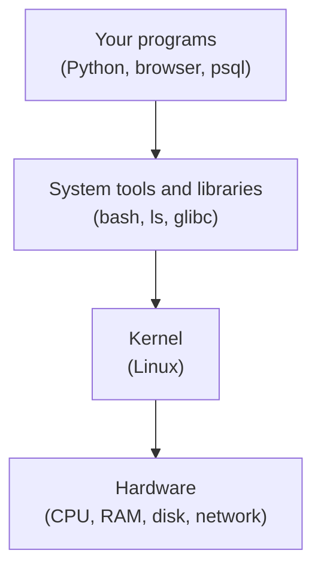
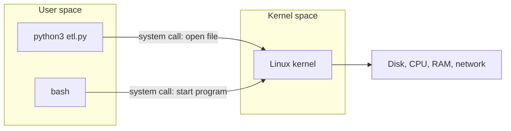
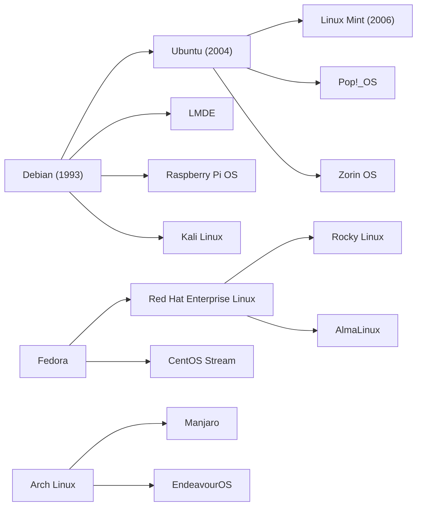
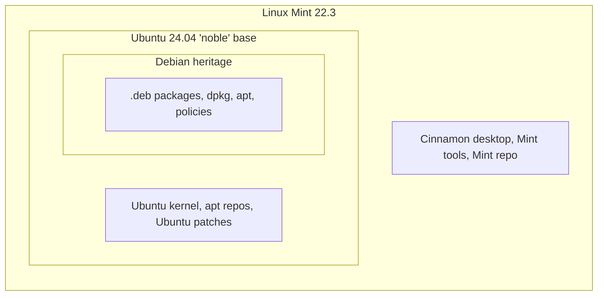
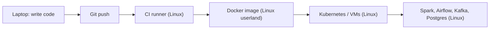

# What is Linux?

> **Level 0 · Chapter 1** · ⏱️ ~25 min read · Prerequisites: None (a machine from [Set up your practice lab](../../lab-setup.md) helps)

This chapter explains what "Linux" actually means: the kernel, the GNU tools around it, the distributions built from both, and how Linux Mint fits into the Debian and Ubuntu family. It also covers desktops, licensing, where Linux runs, and why it matters so much to people who work with data and code.

## Why it matters

Alex is a data engineer in the first week of a new job. A nightly pipeline has failed, and a senior colleague says: "SSH into the ETL box and check what's going on. It's a RHEL machine, by the way."

Alex has used Linux Mint at home for a few days, so this should be easy. Alex types `sudo apt install htop` to get a nicer process viewer. The server answers `sudo: apt: command not found`. Alex searches the web for the error message, finds an answer for Ubuntu, and gets more confused.

Next, Alex looks at the failing job. It runs inside a Docker container built from an image called `python:3.12-alpine`. A Python package that installs fine on Alex's laptop fails inside the container with an error about `musl`. Nobody on the team can explain why "Linux" behaves so differently in three places.

Every one of these problems comes from the same gap. "Linux" is not one product. It is a kernel plus a choice of tools, packaged by different groups who make different decisions. Once you know the parts and the family tree, the errors make sense. RHEL is in the Red Hat family, so it uses `dnf`, not `apt`. Alpine replaces the usual GNU C library with a smaller one called musl, so some prebuilt Python packages don't work there. Ten minutes of background saves hours of confused searching.

## Concepts

### What an operating system does

A computer is a pile of hardware: a CPU, memory (RAM), disks, a network card, a screen, a keyboard. Programs like your browser or a Python script should not have to know how to talk to a specific brand of SSD or Wi-Fi chip. They also should not be able to read each other's memory or crash the whole machine.

An **operating system (OS)** is the software that sits between programs and hardware. It does three big jobs:

1. **It shares the hardware.** Many programs run "at the same time", even on a few CPU cores. The OS decides who runs when and gives each program its own slice of memory.
2. **It hides the hardware details.** A program asks to "read 4 KB from this file". The OS figures out which disk, which driver, and which blocks.
3. **It enforces rules.** Users, permissions, and isolation keep one program or person from damaging another.

When people say "operating system" they often mean everything that ships on the install disk: the core, the tools, the desktop, the apps. To understand Linux you need to split that into layers.



### The kernel

The **kernel** is the core program of an operating system. It is the first big program loaded when the computer starts, and it stays in memory until shutdown. It is the only software allowed to touch the hardware directly.

**Linux**, strictly speaking, is just a kernel. It does these jobs:

| Job | What it means |
|---|---|
| Process scheduling | Decides which program runs on which CPU core, and for how long |
| Memory management | Gives each program its own private memory and handles swapping to disk |
| Device drivers | Code that knows how to talk to specific hardware (disks, GPUs, USB) |
| Filesystems | Turns raw disk blocks into files and folders (ext4, btrfs, xfs) |
| Networking | Implements TCP/IP, sockets, and firewalls |
| Security | Checks permissions on every file access and process action |

The CPU runs in two modes. In **kernel space** (also called kernel mode), code can do anything: touch any memory, talk to any device. In **user space**, code is restricted. Your programs run in user space. When a program needs something only the kernel can do, like reading a file or opening a network connection, it makes a **system call**: a request that hands control to the kernel for a moment. You will watch system calls happen live in [System calls and strace](../05-programming/01-system-calls-strace.md).



A short history helps. In 1991 a Finnish student named Linus Torvalds posted to a newsgroup that he was writing a free kernel "just a hobby, won't be big and professional". He released it under a free license, and thousands of people started contributing. Today the Linux kernel has millions of lines of code and contributions from companies like Intel, Google, Red Hat, and Microsoft. Linus still coordinates releases. A new kernel version comes out roughly every nine or ten weeks.

Kernel versions look like `6.14.0-37-generic` on Mint. Reading it left to right:

- `6.14` is the upstream kernel version (major 6, minor 14).
- `.0-37` is Ubuntu's patch level and build number. Ubuntu backports fixes and rebuilds.
- `generic` is the **flavour**: the general-purpose build. Others exist, such as `lowlatency`.

### GNU and the userland

A kernel alone is useless to a human. It has no shell to type into, no `ls` to list files, no compiler, and no text editor. Those programs make up the **userland** (or user space tools): everything outside the kernel that makes the system usable.

Most of the classic Linux userland comes from the **GNU Project**. Richard Stallman started GNU in 1983 to build a complete, free, Unix-like operating system. (GNU stands for "GNU's Not Unix", a recursive joke.) **Unix** was an operating system created at Bell Labs in 1969. It was hugely influential, but it was proprietary, meaning you could not freely study, share, or change it. GNU set out to rewrite every Unix tool as free software.

By 1991 GNU had nearly everything: the `gcc` compiler, the `bash` shell, the core utilities (`ls`, `cp`, `mv`, `cat`), `grep`, `sed`, `tar`, and the GNU C library. The one missing piece was a working kernel. GNU's own kernel, the Hurd, was not ready. Linux arrived at the perfect time and filled the gap.

| Piece | Where it comes from |
|---|---|
| Kernel | Linux (Linus Torvalds and contributors) |
| Shell (`bash`) | GNU |
| Core utilities (`ls`, `cp`, `mv`, `rm`, `cat`) | GNU coreutils |
| C library (`glibc`) | GNU |
| Compiler (`gcc`) | GNU |
| Init system (`systemd`) | The systemd project (not GNU) |
| Desktop (Cinnamon, GNOME, KDE) | Separate projects |

This is why some people insist on the name **GNU/Linux**: the system you use is GNU tools running on the Linux kernel. Most people just say "Linux", and this handbook does too. Just know that "Linux" in casual speech means the whole system, while "the Linux kernel" means only the core.

!!! info "Linux without GNU"
    The kernel and the userland are separable, which explains a lot of surprises:

    - **Android** runs the Linux kernel but has almost none of the GNU userland. It has its own C library (Bionic) and its own app framework.
    - **Alpine Linux**, popular for small Docker images, uses **musl** instead of glibc and **BusyBox** instead of GNU coreutils. BusyBox is a single small program that acts as `ls`, `cp`, `sh`, and hundreds of other commands. Some flags you learn in this handbook behave differently there.
    - **Mint and Ubuntu** use the full GNU userland, which is what this handbook teaches.

### What a distribution is

Nobody downloads "the Linux kernel" and "the GNU tools" separately and glues them together by hand. (Well, some people do. That project is called Linux From Scratch, and it is one of the Level 6 capstones.) Instead you install a **distribution**, or **distro**: a complete operating system assembled from the kernel, the userland, and thousands of other programs, all tested to work together.

A distribution makes choices for you:

| Choice | Examples |
|---|---|
| Package format and manager | `.deb` with `apt` (Debian, Ubuntu, Mint), `.rpm` with `dnf` (Fedora, RHEL), `pacman` (Arch) |
| Release model | Fixed releases every 6 months or 2 years, or **rolling** (continuous updates) |
| Support length | From months to 10+ years |
| Default desktop | Cinnamon, GNOME, KDE Plasma, or none for servers |
| Defaults and policies | Which software is included, security settings, file locations of some configs |

A **package** is an archive containing a program plus metadata: its version, a description, and the other packages it depends on. A **package manager** is the tool that downloads, installs, upgrades, and removes packages, resolving dependencies automatically. A **repository** (repo) is a server holding thousands of packages that your package manager downloads from. You will learn `apt` properly in [Installing software](../03-internals/06-installing-software.md).

!!! tip "The skill that transfers"
    The kernel, bash, and the core commands are almost identical across distros. What changes most is the package manager, a few config file locations, and the default tools. That is why this handbook can teach on Mint and you can still use it on a RHEL server at work.

### The family tree

Distributions are built on top of each other. A **downstream** distro takes an **upstream** distro's packages and adds its own changes. The three big families:



| Family | Package tools | Typical use | Members |
|---|---|---|---|
| Debian | `.deb`, `apt`, `dpkg` | Desktops, cloud servers, containers | Debian, Ubuntu, Mint, Pop!_OS, Raspberry Pi OS |
| Red Hat | `.rpm`, `dnf`, `rpm` | Enterprise servers, banks, government | Fedora, RHEL, Rocky, AlmaLinux, Amazon Linux |
| Arch | `pacman` | Enthusiast desktops, rolling release | Arch, Manjaro, EndeavourOS |
| SUSE | `.rpm`, `zypper` | Enterprise in Europe | openSUSE, SUSE Linux Enterprise |
| Independent | various | Containers, embedded, learning | Alpine, Gentoo, Slackware |

**Debian** is one of the oldest distros, run entirely by volunteers. It is famous for stability and for its huge, carefully tested repository. **Ubuntu**, made by the company Canonical, started in 2004 as "Debian, but friendlier and on a predictable schedule". It became the most common Linux on cloud servers. **Linux Mint** started in 2006 as "Ubuntu, but with a more traditional desktop and less corporate decisions".

When you know the family, you can predict a lot. If someone says "the build server runs Rocky Linux", you know to use `dnf`, and that most Ubuntu answers about `apt` won't apply directly. Commands like `ls`, `cd`, and `grep` work the same everywhere.

### How Mint relates to Ubuntu

Linux Mint 22.3, codenamed "Zena", is built on **Ubuntu 24.04 LTS**, codenamed "Noble Numbat". Concretely:

- Mint uses Ubuntu's package repositories for almost everything. When you run `apt install`, most packages come straight from Ubuntu's servers.
- Mint adds its own repository on top, with its own desktop (Cinnamon) and tools: Update Manager, Software Manager, Driver Manager, and Timeshift for system snapshots.
- Mint changes some defaults. For example, it does not ship Canonical's Snap package system by default, and it adds a friendly wrapper around `apt`.
- The kernel is Ubuntu's kernel.



!!! tip "Translate Mint to Ubuntu when searching"
    Most tutorials target Ubuntu. When one asks for your Ubuntu version, the answer is **24.04** (codename **noble**), not 22.3. Instructions written for Ubuntu 24.04 almost always work on Mint 22.x unchanged. The file `/etc/os-release` shows both names, as you will see below.

### Releases and LTS

An **LTS** (long-term support) release is one that gets security updates for many years. Ubuntu publishes a release every six months (April and October, so version 24.04 means "2024, April"). Every second April release is an LTS with five years of standard support. The releases in between get only nine months.

Mint builds only on Ubuntu LTS releases. Mint 22, 22.1, 22.2, and 22.3 all share the Ubuntu 24.04 base, and all get security updates until 2029. The point releases bring newer Mint tools and desktop versions, while the base underneath stays the same. Servers prefer LTS releases for the same reason: nobody wants to upgrade a production database server every six months.

### Desktop environments

On Windows and macOS the graphical interface is part of the OS. On Linux it is just another set of programs, and you can choose which one you want.

A **desktop environment (DE)** is a complete graphical interface: the panel or taskbar, the menu, window decorations, a file manager, a settings app, and a set of matching applications. Underneath it sit two more layers:

- A **display server** draws pixels on the screen and handles the mouse and keyboard. There are two: the older **X11** (X Window System) and the newer **Wayland**.
- A **window manager** decides where windows go, and draws their borders and title bars. In a full DE it is built in.

| Desktop | Feel | Notes |
|---|---|---|
| Cinnamon | Traditional, Windows-like taskbar and menu | Made by the Mint team. Mint's flagship edition |
| MATE | Classic, lightweight | Continuation of the old GNOME 2 desktop. A Mint edition |
| Xfce | Lightweight, fast on old hardware | A Mint edition |
| GNOME | Modern, minimal, activity overview | Ubuntu's and Fedora's default |
| KDE Plasma | Highly customisable | Kubuntu, openSUSE, Fedora KDE |

Two facts matter more than which DE you pick. First, the desktop is optional: almost every server runs with no graphical interface at all, and you manage it entirely through a terminal. Second, the terminal works the same under every desktop. Everything in this handbook works whether you use Cinnamon, Xfce, or no desktop.

### Open source and licensing

**Source code** is the human-readable program text that developers write. Most commercial software ships only compiled machine code. **Open source** software publishes its source code under a license that lets anyone read, modify, and share it.

The Free Software Foundation, which runs GNU, defines **free software** by four freedoms. "Free" here means freedom, not price:

0. Run the program for any purpose.
1. Study how it works and change it (which requires source code).
2. Redistribute copies.
3. Distribute your modified versions.

A **license** is the legal text that grants these rights. Licenses fall into two broad groups:

| Type | Rule | Examples | Used by |
|---|---|---|---|
| **Copyleft** | You may modify and share, but derived works you distribute must use the same license and include source | GPL v2, GPL v3, AGPL | Linux kernel (GPL v2 only), bash, coreutils (GPL v3+) |
| **Permissive** | Do almost anything, including closed-source use, as long as you keep the copyright notice | MIT, BSD, Apache 2.0 | Python (PSF license), Apache Spark, Kafka, Airflow (Apache 2.0) |

The **GPL** (GNU General Public License) is the classic copyleft license. Because the Linux kernel is GPL v2, every company that ships a modified kernel in a phone or router must publish its kernel changes. That rule is a big reason Linux grew: improvements flowed back instead of disappearing into private forks.

For a data engineer this matters in two practical ways. Using GPL tools internally (running `bash` on your servers) creates no obligations. Shipping software to customers that includes GPL code does, and your company's legal team may have a policy about it. Every package on Mint records its license in `/usr/share/doc/<package>/copyright`, which you will read below.

### Where Linux runs

Linux is the most widely deployed operating system kernel in the world, though most people never see it:

- **Servers.** Most web servers, databases, and data platforms run Linux.
- **Cloud.** The majority of virtual machines on AWS, Azure, and Google Cloud run Linux. Amazon even maintains its own distro, Amazon Linux, in the Red Hat family.
- **Containers.** A **container** is an isolated group of processes that shares the host's kernel but has its own filesystem. Docker images like `ubuntu:24.04` or `python:3.12-slim` contain a distro's userland, not a kernel. Docker on a Mac or Windows laptop quietly runs a small Linux VM to provide that kernel. You will build a container by hand in [Containers from scratch](../06-expert/01-containers-from-scratch.md).
- **Supercomputers.** Every system on the TOP500 list of fastest supercomputers has run Linux since 2017.
- **Android.** Billions of phones run the Linux kernel underneath Android.
- **Embedded devices.** Wi-Fi routers, smart TVs, cars, cameras, and industrial controllers. **Embedded** means a computer built into a device to do one job.
- **Windows.** **WSL 2** (Windows Subsystem for Linux) runs a real Linux kernel in a lightweight VM inside Windows.
- **Desktops and laptops.** A small but growing share, including ChromeOS, which is Linux-based.

### Why data and dev people need it

If you work with data or write software, Linux is where your work ends up running, even if you write it on a Mac or Windows laptop.



Concrete reasons:

- **Your code runs there.** Airflow workers, Spark executors, Kafka brokers, and Postgres servers are almost always Linux. When a job fails at 3 a.m., you debug it in a Linux shell over SSH.
- **Containers are Linux.** Writing a good Dockerfile means knowing package managers, users, permissions, and file locations.
- **The shell is a data tool.** Commands like `grep`, `sort`, `awk`, and `cut` can scan a 20 GB log file faster than you can open it in a spreadsheet. Level 1 teaches them.
- **Performance and failures make sense.** Out-of-memory kills, full disks, open file limits, and slow I/O are all Linux concepts. Level 3 and Level 4 explain them.
- **Automation.** Cron jobs, systemd services, and shell scripts glue pipelines together.

## Commands and examples

Open a terminal (on Mint, press ++ctrl+alt+t++) and try these. All are read-only, so they are safe to run anywhere. The next chapter explains the terminal itself; for now, type a command, press ++enter++, and read the output.

### Which kernel am I running?

`uname` prints information about the running kernel. The `-r` flag asks for the kernel release only.

```bash
uname -r
```

```text
6.14.0-37-generic
```

Your number will differ depending on updates. As explained above, that is upstream kernel 6.14, Ubuntu build 37, generic flavour.

The `-a` flag prints everything:

```bash
uname -a
```

```text
Linux mint 6.14.0-37-generic #37~24.04.1-Ubuntu SMP PREEMPT_DYNAMIC Mon Nov 10 10:21:09 UTC 2025 x86_64 x86_64 x86_64 GNU/Linux
```

Field by field:

| Field | Meaning |
|---|---|
| `Linux` | Kernel name |
| `mint` | Hostname: this machine's network name |
| `6.14.0-37-generic` | Kernel release |
| `#37~24.04.1-Ubuntu SMP PREEMPT_DYNAMIC ...` | Build number, the Ubuntu release it was built for, build options, and build date. `SMP` means multi-CPU support |
| `x86_64` (three times) | Machine hardware, processor type, and hardware platform: 64-bit Intel/AMD |
| `GNU/Linux` | The operating system name. Note the GNU |

### Which distribution am I running?

The kernel does not know which distro it belongs to. The distro writes that into a file, `/etc/os-release`. The `cat` command prints a file's contents to the screen.

```bash
cat /etc/os-release
```

```text
NAME="Linux Mint"
VERSION="22.3 (Zena)"
ID=linuxmint
ID_LIKE="ubuntu debian"
PRETTY_NAME="Linux Mint 22.3"
VERSION_ID="22.3"
HOME_URL="https://www.linuxmint.com/"
SUPPORT_URL="https://forums.linuxmint.com/"
BUG_REPORT_URL="http://linuxmint-troubleshooting-guide.readthedocs.io/en/latest/"
PRIVACY_POLICY_URL="https://www.linuxmint.com/"
VERSION_CODENAME=zena
UBUNTU_CODENAME=noble
```

The lines that matter most:

- `ID=linuxmint` is a machine-readable distro name. Scripts check this to decide what to do.
- `ID_LIKE="ubuntu debian"` lists the family, closest parent first. This is the family tree from above, written into a file.
- `VERSION_CODENAME=zena` is Mint's codename.
- `UBUNTU_CODENAME=noble` is the Ubuntu base. This is the value to use when instructions ask for your Ubuntu codename.

`/etc/os-release` exists on nearly every modern distro, including RHEL, Fedora, Arch, and Alpine. It is the first file to check on any unfamiliar machine.

Another tool, `lsb_release`, prints a summary:

```bash
lsb_release -a
```

```text
Distributor ID:	Linuxmint
Description:	Linux Mint 22.3
Release:	22.3
Codename:	zena
```

On some other distros this tool prints an extra line, `No LSB modules are available.`, which is a harmless notice you can ignore.

Mint also keeps a copy of the Ubuntu base's release info in its own file:

```bash
cat /etc/upstream-release/lsb-release
```

```text
DISTRIB_ID=Ubuntu
DISTRIB_RELEASE=24.04
DISTRIB_CODENAME=noble
DISTRIB_DESCRIPTION="Ubuntu Noble Numbat"
```

### A one-stop summary with hostnamectl

`hostnamectl` is a systemd tool that shows the hostname plus OS and kernel together:

```bash
hostnamectl
```

```text
 Static hostname: mint
       Icon name: computer-laptop
         Chassis: laptop
      Machine ID: 3f2a...
         Boot ID: 9c1e...
Operating System: Linux Mint 22.3
          Kernel: Linux 6.14.0-37-generic
    Architecture: x86-64
 Hardware Vendor: ...
```

Output is trimmed with `...`. The **machine ID** is a unique identifier generated at install time. Don't paste it publicly.

### The kernel's own view

The kernel exposes information about itself as files under `/proc`, which you will explore in [The filesystem layout](05-filesystem-layout.md):

```bash
cat /proc/version
```

```text
Linux version 6.14.0-37-generic (buildd@lcy02-amd64-034) (x86_64-linux-gnu-gcc-13 (Ubuntu 13.3.0-6ubuntu2~24.04) 13.3.0, GNU ld (GNU Binutils for Ubuntu) 2.42) #37~24.04.1-Ubuntu SMP PREEMPT_DYNAMIC Mon Nov 10 10:21:09 UTC 2025
```

This shows the kernel was compiled by Ubuntu's build server (`buildd`) using GNU's compiler (`gcc`) and linker (`ld`). Even the kernel is built with GNU tools.

### Which desktop am I running?

The **environment variable** `XDG_CURRENT_DESKTOP` holds the current desktop's name. An environment variable is a named value that every program can read; `echo` prints text, and `$` in front of a name means "the value of this variable".

```bash
echo $XDG_CURRENT_DESKTOP
```

```text
X-Cinnamon
```

On the Xfce edition you would see `XFCE`, and on MATE, `MATE`. Over SSH with no desktop, the line is empty. To see the Cinnamon version:

```bash
cinnamon --version
```

```text
Cinnamon 6.6.9
```

### Seeing the GNU in GNU/Linux

Most commands accept `--version`. The `|` symbol (a **pipe**, covered in [Pipes and redirection](../01-command-line/04-pipes-and-redirection.md)) sends the output of one command into another; `head -1` keeps only the first line.

```bash
ls --version | head -1
bash --version | head -1
sed --version | head -1
tar --version | head -1
```

```text
ls (GNU coreutils) 9.4
GNU bash, version 5.2.21(1)-release (x86_64-pc-linux-gnu)
sed (GNU sed) 4.9
tar (GNU tar) 1.35
```

Each one says GNU. On an Alpine container, `ls --version` would instead say it is BusyBox (or reject the flag), which is why scripts written for Ubuntu sometimes break there.

Not everything is GNU, though. On Mint and Ubuntu, `awk` is a different implementation by default:

```bash
awk -W version 2>&1 | head -1
```

```text
mawk 1.3.4 20240123
```

`mawk` is a fast, non-GNU `awk`. The `2>&1` part merges error output into normal output; you will learn it in Level 1. GNU's version, `gawk`, is a separate package. This kind of detail matters later when an `awk` one-liner from the internet uses a GNU-only feature.

### Reading a license on your system

Every installed package documents its license under `/usr/share/doc`. Look at coreutils, the package that provides `ls` and `cp`:

```bash
head -12 /usr/share/doc/coreutils/copyright
```

```text
Format: https://www.debian.org/doc/packaging-manuals/copyright-format/1.0/
Comment: This is the Debian GNU/Linux packaged version of the GNU core
 utilities.
 This package is maintained by Michael Stone <mstone@debian.org>.
 See the file AUTHORS for a list of each program's main authors.
Source: ftp://ftp.gnu.org/gnu/coreutils

Files: *
Copyright: (C) 1984-2023 Free Software Foundation, Inc.
License: GPL-3+
```

- `head -12` shows only the first 12 lines.
- `Format:` says this file follows Debian's machine-readable copyright format, another sign of Mint's Debian heritage.
- `License: GPL-3+` means "GPL version 3 or any later version". The `+` matters legally.

To count how many packages have documentation folders (roughly, how many packages are installed), combine `ls` with `wc -l`, which counts lines:

```bash
ls /usr/share/doc | wc -l
```

```text
2215
```

A fresh Mint install has a couple of thousand packages. Every one is open source except a few optional drivers and firmware blobs.

## Exercises

### Exercise 1: Identify your system (easy)

Find and write down: your kernel release, your distro name and version, your Ubuntu base codename, your CPU architecture, and your desktop environment. Use only commands from this chapter.

??? success "Solution"

    ```bash
    uname -r
    cat /etc/os-release
    uname -m
    echo $XDG_CURRENT_DESKTOP
    ```

    ```text
    6.14.0-37-generic
    NAME="Linux Mint"
    VERSION="22.3 (Zena)"
    ...
    UBUNTU_CODENAME=noble
    x86_64
    X-Cinnamon
    ```

    - Kernel release: from `uname -r`.
    - Distro and version: `NAME` and `VERSION` in `/etc/os-release`.
    - Ubuntu base: `UBUNTU_CODENAME=noble`, which is Ubuntu 24.04.
    - Architecture: `uname -m` prints just the machine hardware field. `x86_64` is 64-bit Intel or AMD. A Raspberry Pi or an Apple Silicon VM would show `aarch64`.
    - Desktop: `X-Cinnamon` means Cinnamon running on X11.

### Exercise 2: Translate a tutorial (easy)

You find a tutorial titled "Install PostgreSQL 16 on Ubuntu 22.04 (Jammy)". Another is titled "Install PostgreSQL 16 on Ubuntu 24.04 (Noble)". Which one should you follow on Mint 22.3, and which line of which file proves it?

??? success "Solution"

    Follow the Ubuntu 24.04 (Noble) tutorial. Mint 22.3 is built on Ubuntu 24.04, as shown by this line in `/etc/os-release`:

    ```text
    UBUNTU_CODENAME=noble
    ```

    You can also confirm it with `cat /etc/upstream-release/lsb-release`, which prints `DISTRIB_RELEASE=24.04`. The Jammy tutorial targets an older base with older library versions. Packages or repository lines from it may install the wrong builds.

### Exercise 3: GNU or not? (medium)

For each of these commands, find out whether the version installed on your machine comes from GNU: `ls`, `cat`, `grep`, `sed`, `tar`, `awk`, `bash`. Record the version line for each.

??? success "Solution"

    Run `--version` on each and keep the first line:

    ```bash
    ls --version | head -1
    cat --version | head -1
    grep --version | head -1
    sed --version | head -1
    tar --version | head -1
    awk -W version 2>&1 | head -1
    bash --version | head -1
    ```

    ```text
    ls (GNU coreutils) 9.4
    cat (GNU coreutils) 9.4
    grep (GNU grep) 3.11
    sed (GNU sed) 4.9
    tar (GNU tar) 1.35
    mawk 1.3.4 20240123
    GNU bash, version 5.2.21(1)-release (x86_64-pc-linux-gnu)
    ```

    Everything is GNU except `awk`, which is `mawk` on Mint and Ubuntu by default. `ls` and `cat` both come from one GNU package, coreutils, which is why their versions match. `awk` uses `-W version` because `mawk` predates the `--version` convention.

### Exercise 4: Read two licenses (medium)

Find the license of the `bash` package and of the `python3` package (look in `/usr/share/doc/python3/copyright` or a nearby folder if that file does not exist). Which one is copyleft and which one is permissive?

??? success "Solution"

    ```bash
    grep -m1 'License:' /usr/share/doc/bash/copyright
    ls /usr/share/doc/ | grep '^python3'
    ```

    ```text
    License: GPL-3+
    python3
    python3.12
    python3.12-dev
    python3.12-minimal
    python3.12-venv
    python3-apt
    ...
    ```

    `grep -m1 'License:'` prints the first line containing `License:`. Bash is GPL-3+, which is copyleft: modified versions you distribute must stay GPL with source.

    The Python interpreter's license is in `/usr/share/doc/python3.12/copyright`. Open it with `less /usr/share/doc/python3.12/copyright` (press `q` to quit) and search for "PSF" by typing `/PSF` and pressing ++enter++. The Python Software Foundation License is permissive: you may embed Python in closed-source products as long as you keep the notice.

### Exercise 5: Classify the layers (hard)

Sort each item into **kernel**, **userland (GNU or other)**, **desktop**, or **distro-specific**: the scheduler that picks which process runs next; `bash`; the Wi-Fi driver; Cinnamon's taskbar; `apt`; Mint's Update Manager; `ls`; the ext4 filesystem code; glibc; the file `/etc/os-release`. Then explain in two sentences why a Docker container on your laptop can run a different distro than your laptop, but not a different kernel.

??? success "Solution"

    | Item | Layer |
    |---|---|
    | Process scheduler | Kernel |
    | `bash` | Userland (GNU) |
    | Wi-Fi driver | Kernel (device drivers live in the kernel) |
    | Cinnamon taskbar | Desktop |
    | `apt` | Userland, specific to the Debian family |
    | Mint Update Manager | Distro-specific (Mint) |
    | `ls` | Userland (GNU coreutils) |
    | ext4 code | Kernel (filesystems live in the kernel) |
    | glibc | Userland (GNU C library) |
    | `/etc/os-release` | Distro-specific data file |

    A container brings its own userland: its own `bash`, `ls`, libraries, and package manager, so an Alpine or Rocky container can run on a Mint host. All containers on a host share the host's single running kernel, because the kernel is what creates the isolation in the first place, so a container cannot bring its own kernel.

## Check yourself

1. What is the difference between "Linux" the kernel and "Linux" as people commonly use the word?

    ??? note "Answer"

        Strictly, Linux is only the kernel: the core program that manages the CPU, memory, devices, filesystems, and networking. In everyday speech "Linux" means a whole operating system: the Linux kernel plus a userland (mostly GNU tools), packaged as a distribution.

2. What did the GNU Project contribute, and why did it need Linux?

    ??? note "Answer"

        GNU, started in 1983, wrote free replacements for the Unix tools: the bash shell, coreutils (`ls`, `cp`, `cat`), the C library glibc, the gcc compiler, and more. By 1991 its own kernel (the Hurd) was not ready, so Linux provided the missing kernel and the two together formed a complete free OS.

3. What is a distribution, and name three things distributions differ in?

    ??? note "Answer"

        A distribution is a complete OS assembled from the kernel, userland, and thousands of packages, tested to work together. They differ in package format and manager (`apt` vs `dnf` vs `pacman`), release model and support length (fixed LTS vs rolling), default desktop, and default settings and included software.

4. Your company's server runs AlmaLinux. Which family is that, and which package manager will you use?

    ??? note "Answer"

        AlmaLinux is in the Red Hat family (a RHEL rebuild). It uses `.rpm` packages with the `dnf` package manager, not `apt`.

5. Which Ubuntu release is Mint 22.3 based on, and how can you check that on the command line?

    ??? note "Answer"

        Ubuntu 24.04 LTS, codename noble. `cat /etc/os-release` shows `UBUNTU_CODENAME=noble`, and `cat /etc/upstream-release/lsb-release` shows `DISTRIB_RELEASE=24.04`.

6. What is the difference between a copyleft and a permissive license? Give one example of each.

    ??? note "Answer"

        Copyleft licenses (GPL v2, GPL v3) let you modify and share the software, but if you distribute a derived work it must use the same license and include source. Permissive licenses (MIT, BSD, Apache 2.0) let you do almost anything, including closed-source use, as long as you keep the copyright notice. The Linux kernel is GPL v2; Apache Spark is Apache 2.0.

7. Android runs on Linux. Why can't you run `apt` or most GNU commands on a stock Android phone?

    ??? note "Answer"

        Android uses the Linux kernel but not the GNU userland. It has its own C library (Bionic), its own minimal tools, and its own app framework, and it has no Debian-style package manager.

8. Why does almost every data engineer end up needing Linux skills, even if they develop on macOS?

    ??? note "Answer"

        Production workloads (Airflow workers, Spark clusters, Kafka brokers, databases, CI runners, and Docker containers) almost all run on Linux. Debugging failures, writing Dockerfiles, reading logs, and automating jobs all happen in a Linux shell.

## Key takeaways

- Linux is a **kernel**: the one program that controls the hardware. Everything else runs in user space and asks the kernel for help through system calls.
- The **userland** around it is mostly **GNU**: bash, coreutils, glibc, gcc. Together they form "GNU/Linux".
- A **distribution** packages kernel plus userland with a package manager, release schedule, and defaults. Families (Debian, Red Hat, Arch) share package tools.
- **Mint 22.3 is Ubuntu 24.04 "noble" underneath**, which is Debian underneath that. Use Ubuntu 24.04 instructions on Mint.
- The **desktop is optional and swappable**. The terminal skills you learn work everywhere, including headless servers.
- The kernel is **GPL v2** copyleft; much data tooling is permissive **Apache 2.0**. Licenses live in `/usr/share/doc/<package>/copyright`.
- Linux runs servers, the cloud, containers, phones, and devices, which is why data and dev work keeps landing on it.

## Next

Now that you know what you're running, it's time to talk to it. Continue with [The terminal, shell, and prompt](02-terminal-shell-prompt.md).
