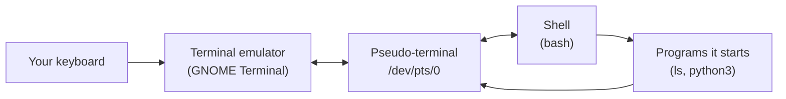
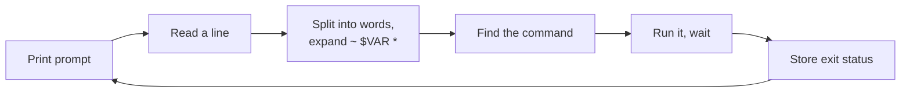
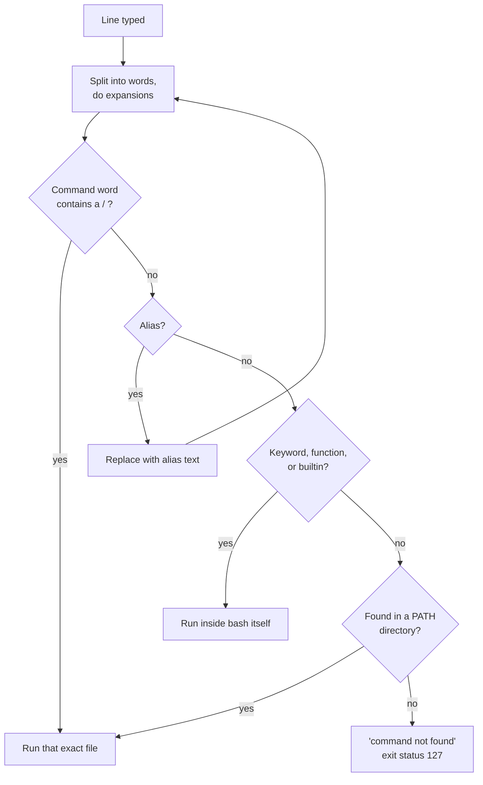
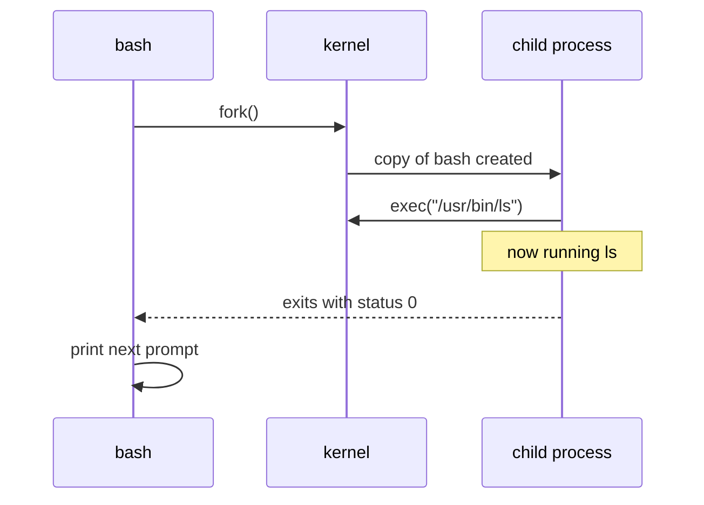

# The terminal, shell, and prompt

> **Level 0 · Chapter 2** · ⏱️ ~25 min read · Prerequisites: [What is Linux?](01-what-is-linux.md)

This chapter takes apart the thing you type into. You'll learn the difference between a terminal, a shell, a console, and a TTY, how to read the prompt, how every command is built from a command name, options, and arguments, and exactly how bash finds and runs the program you asked for.

## Why it matters

Alex writes a small shell script called `daily_report` to pull yesterday's sales numbers. It sits in the current folder. Alex types `daily_report` and gets:

```text
daily_report: command not found
```

The file is right there. `ls` shows it. Alex copies a fix from a forum that says to type `$ ./daily_report`, pastes it in with the dollar sign, and gets `$: command not found`. Then a colleague says "just use `sudo -i` and run it from there". Now the prompt ends in `#` instead of `$`, and Alex doesn't notice. Ten minutes later a cleanup command meant for a test folder runs as the all-powerful root user.

None of this is about the script. It is about the shell. The shell only looks for commands in a specific list of folders, and the current folder isn't one of them. The `$` in documentation is the prompt, not part of the command. The `#` at the end of a prompt is a warning light that says "you are root". Once you understand how the shell reads a line and finds a program, every one of these mistakes becomes obvious, and so does the fix.

## Concepts

### Four words people mix up

People use "terminal", "shell", "console", and "command line" as if they mean the same thing. They don't, and the difference explains a lot of behaviour.

| Term | What it is | Example on Mint |
|---|---|---|
| **Terminal** | A device or program that shows text output and sends your keystrokes. It knows nothing about commands | GNOME Terminal window |
| **Terminal emulator** | A graphical program that pretends to be an old hardware terminal | GNOME Terminal, Xfce Terminal, Terminator, Kitty |
| **Shell** | A program that reads the commands you type, interprets them, and runs other programs | `bash` |
| **Console** | The machine's built-in text screen and keyboard, without any desktop | The text login on ++ctrl+alt+f3++ |
| **TTY** | The kernel's name for a terminal device. Short for "teletypewriter" | `/dev/tty3`, `/dev/pts/0` |

A good analogy: the terminal is the telephone, and the shell is the person on the other end of the line. The phone carries your words back and forth. The person understands them and acts on them. You can swap the phone (use a different terminal emulator) and still talk to the same person (bash), or keep the phone and talk to someone else (zsh or Python).

### From teletypes to terminal windows

The names come from history. In the 1960s and 70s, people used **teletypes**: electric typewriters wired to a computer. You typed a line, the computer printed its answer on paper. Later came **video terminals** like the DEC VT100: a screen and keyboard with no computing power of their own, connected to a big shared computer by a cable.

Unix was built around these devices, and Linux inherited the design. The kernel still has a "terminal" subsystem, and terminal devices are still called TTYs. Today the hardware is gone and programs emulate it:

- A **terminal emulator** is a window that behaves like a VT100-style terminal. Mint Cinnamon's default is GNOME Terminal.
- A **pseudo-terminal** (**pty**) is a pair of virtual devices the kernel creates to connect a terminal emulator to a shell. Each terminal window or tab gets one, named `/dev/pts/0`, `/dev/pts/1`, and so on. "pts" means "pseudo-terminal slave", the shell's end of the pair.
- A **virtual console** is a full-screen text terminal provided directly by the kernel, with no graphics. Linux gives you several, named `/dev/tty1` to `/dev/tty6` and up. On Mint, your graphical desktop itself runs on virtual terminal 7.



When you type `ls` and press ++enter++, the terminal emulator sends the characters through the pty to bash. Bash starts `ls`. `ls` writes its output to the pty, and the terminal emulator draws it on screen. The terminal never "understands" `ls`. It just moves text.

!!! tip "Escape hatch: virtual consoles"
    If the desktop freezes, press ++ctrl+alt+f3++ to switch to a text console, log in with your username and password, and investigate from there. Press ++ctrl+alt+f7++ to get back to the Mint desktop. On some other distros the desktop lives on ++ctrl+alt+f1++ or ++ctrl+alt+f2++ instead.

### The shell

A **shell** is a program that reads commands, works out what they mean, and runs them. It is called a shell because it is the outer layer around the kernel that users interact with. It is also a full programming language: variables, loops, and functions, which you will use in [Level 2](../02-scripting/index.md).

Every shell runs the same basic loop, called a **REPL** (read, evaluate, print, loop):



Several shells exist:

| Shell | Notes |
|---|---|
| `bash` | The **Bourne Again SHell**, from GNU (1989). Default interactive shell on Mint, Ubuntu, Debian, RHEL. This handbook uses it |
| `sh` | The POSIX standard shell. On Mint, `/bin/sh` is actually `dash`, a small, fast shell used to run system scripts |
| `zsh` | Bash-compatible with extra features. Default on macOS |
| `fish` | Friendly, with autosuggestions. Not bash-compatible |

Each user account has a **login shell**, recorded in the file `/etc/passwd` (covered in [Users, groups, and sudo](06-users-groups-sudo.md)). It is the shell started when you log in or open a terminal. The variable `$SHELL` holds its path.

!!! info "Interactive vs non-interactive"
    When you type commands at a prompt, bash is an **interactive shell**. When bash runs a script file, it is **non-interactive**: no prompt, and it skips some setup like your aliases. That's why a command can behave slightly differently in a script than at your prompt.

### The prompt

The **prompt** is the text the shell prints when it is ready for your next command. On a fresh Mint install it looks like this:

```console
alex@mint:~$
```

Each part has a meaning:

| Part | Meaning |
|---|---|
| `alex` | Your username |
| `@` | Just a separator |
| `mint` | The hostname: this machine's name. Vital when you're SSH'd into five servers |
| `:` | Separator |
| `~` | Your current directory. `~` is shorthand for your home directory, `/home/alex` |
| `$` | You are a normal user. It changes to `#` when you are **root**, the all-powerful administrator |

Move to another folder and the directory part changes:

```console
alex@mint:~$ cd /var/log
alex@mint:/var/log$
```

Become root (covered in [chapter 6](06-users-groups-sudo.md)) and the colours, name, and final character change:

```console
root@mint:~#
```

!!! warning "Common mistake: copying the prompt"
    Documentation often writes commands as `$ ls -l` or `# apt update`. The `$` or `#` shows the prompt, telling you whether to run it as a normal user or as root. Never type it. If you do, bash tries to run a program named `$` and prints `$: command not found`. This handbook avoids the problem by putting commands in their own blocks without prompts.

#### PS1: where the prompt comes from

The prompt is stored in a shell variable called **PS1** ("prompt string 1"). Bash reads it before every prompt and replaces special **backslash escapes** with live values:

| Escape | Expands to |
|---|---|
| `\u` | Username |
| `\h` | Hostname up to the first dot |
| `\H` | Full hostname |
| `\w` | Current directory, with your home shown as `~` |
| `\W` | Only the last part of the current directory |
| `\$` | `#` if you are root, otherwise `$` |
| `\t` | Time, 24-hour `HH:MM:SS` |
| `\d` | Date, like `Fri Oct 02` |
| `\n` | Newline |
| `\!` | History number of this command |
| `\[` ... `\]` | Wraps invisible characters such as colour codes, so bash can measure the prompt's width correctly |

Mint sets PS1 in your personal startup file, `~/.bashrc`. With colours, the default is:

```bash
PS1='${debian_chroot:+($debian_chroot)}\[\033[01;32m\]\u@\h\[\033[00m\]:\[\033[01;34m\]\w\[\033[00m\]\$ '
```

It looks scary but decodes cleanly:

- `${debian_chroot:+($debian_chroot)}` shows a label only when you're inside a special isolated environment called a chroot. Normally empty.
- `\[\033[01;32m\]` switches to bold green. `\033[` starts a terminal colour code, `01` is bold, `32` is green.
- `\u@\h` prints `alex@mint`.
- `\[\033[00m\]` resets colours.
- `:` is literal.
- `\[\033[01;34m\]\w` prints the directory in bold blue.
- `\$ ` prints `$` (or `#`) and a space.

You'll customise your prompt permanently in [Shell productivity](../01-command-line/07-shell-productivity.md). For now, just know it's a variable, not magic.

### Anatomy of a command

Every command line follows the same grammar. The shell splits the line into **words** at spaces, and the words play three roles:

```text
  ls      -l -h      --sort=size      /var/log   /etc
  ────    ──────     ───────────      ────────────────
command   options    option with      arguments
          (short)    a value (long)
```

- The **command** is the first word: the name of the program, builtin, or alias to run.
- **Options** (also called **flags** or **switches**) change how the command behaves. They start with a dash.
- **Arguments** (also called **operands** or **parameters**) are what the command acts on, usually file names, paths, or text.

Options come in two styles:

| Style | Looks like | Notes |
|---|---|---|
| Short | `-l`, `-a`, `-h` | One dash, one letter. Quick to type |
| Short, combined | `-lah` | Same as `-l -a -h`. Most programs allow this |
| Short with value | `-n 5` or `-n5` | The option needs a value right after it |
| Long | `--all`, `--human-readable` | Two dashes, a full word. Readable, good in scripts |
| Long with value | `--sort=size` or `--sort size` | |

Short and long forms often do the same thing: `ls -a` and `ls --all` are identical. Use short forms when typing and long forms in scripts, where clarity matters more than speed.

A few rules make the rest of Linux predictable:

1. **Everything is case-sensitive.** `ls -r` (reverse order) and `ls -R` (recursive) are different options. `LS` is not a command at all.
2. **Spaces separate words.** `ls -l` works; `ls-l` looks for a command named `ls-l`. To pass an argument that contains a space, quote it: `ls "My Documents"`.
3. **A lone `--` ends the options.** Anything after it is an argument, even if it starts with a dash. `ls -- -weird-file` lists a file literally named `-weird-file`.
4. **Option order usually doesn't matter** for GNU tools. `ls -l /etc` and `ls /etc -l` both work. Other systems (macOS, BusyBox) are stricter, so put options first by habit.

!!! info "Conventions, not laws"
    The dash conventions are only conventions. Each program parses its own options. Some old tools use different styles: `tar xvf` without a dash, `find -name` with a single dash before a long word, `dd if=file`. The manual for each command (next-but-one chapter, [Getting help](04-getting-help.md)) is the final word.

### How the shell finds and runs a command

When you press ++enter++, bash does a lot of work before anything runs. Simplified, it goes like this:



Here's what each kind of command is:

- An **alias** is a nickname you define for a longer command. Mint defines `ll` as `ls -alF` and makes `ls` mean `ls --color=auto` so you get colours.
- A **keyword** (reserved word) is part of bash's grammar, like `if`, `for`, and `while`.
- A **function** is a named block of shell code, which you'll write in Level 2.
- A **builtin** is a command implemented inside bash itself: `cd`, `echo`, `pwd`, `type`, `help`, `history`, `exit`. No separate program runs.
- An **external command** is a separate program file on disk, like `/usr/bin/ls` or `/usr/bin/python3`.

#### Why some commands must be builtins

To run an external command, bash asks the kernel to create a new **process** (a running instance of a program). It **forks**, making a copy of itself as a child process, and the child **execs**, replacing itself with the new program. Bash waits for the child to finish, then prints the next prompt.



Each process has its own **working directory** (the folder it is "in"). A child can change its own working directory but never its parent's. If `cd` were an external program, it would change directory inside the child, then exit, and your shell would stay exactly where it was. That's why `cd` has to be a builtin: it changes bash's own state. The same logic applies to `exit`, `export`, and `source`. Other builtins like `echo` and `pwd` exist mainly for speed, and also exist as external programs.

#### PATH: the list of places to look

For external commands, bash searches the folders listed in the **PATH** environment variable. PATH is one string with folder names separated by colons. Bash checks each folder left to right and runs the first match.

A typical Mint PATH:

```text
/home/alex/.local/bin:/usr/local/sbin:/usr/local/bin:/usr/sbin:/usr/bin:/sbin:/bin:/usr/games:/usr/local/games
```

| Folder | What lives there |
|---|---|
| `/home/alex/.local/bin` | Your personal programs, e.g. tools installed with `pip install --user`. Added by `~/.profile` if the folder exists |
| `/usr/local/sbin`, `/usr/local/bin` | Programs installed by hand by the administrator, outside the package manager. Mint also places a few of its own wrappers here |
| `/usr/sbin`, `/usr/bin` | Programs from packages. `/usr/bin` holds most commands you'll use; `sbin` holds system administration tools |
| `/sbin`, `/bin` | Old locations, kept for compatibility. On Mint they are links to `/usr/sbin` and `/usr/bin` (see [The filesystem layout](05-filesystem-layout.md)) |
| `/usr/games`, `/usr/local/games` | Games, historically kept apart |

Order matters. Because `/usr/local/bin` comes before `/usr/bin`, a program you install by hand to `/usr/local/bin` wins over a packaged program with the same name. This is how you can run a newer version of a tool without touching the system's copy, and also how a mysterious old version can **shadow** (hide) the one you expect.

!!! warning "Common mistake: expecting the current folder to be searched"
    The current directory is **not** in PATH. Typing `daily_report` will not run a script sitting in front of you. You must give a path: `./daily_report`. The `.` means "this directory", and the `/` tells bash "this is a path, don't search PATH". This is a deliberate security choice: otherwise someone could leave a malicious file named `ls` in a shared folder and wait for you to `cd` there.

To speed things up, bash remembers where it found each external command in a **hash table**. The builtin `hash` lists those remembered paths. If you install a new version of a program in a different PATH folder and bash keeps running the old one, `hash -r` makes it forget and search again.

#### type, which, and command -v

Three tools answer the question "what will run if I type this?":

| Tool | Kind | Strength | Weakness |
|---|---|---|---|
| `type` | bash builtin | Knows about aliases, keywords, functions, builtins, and PATH. Always tells the truth for your shell | bash-specific |
| `which` | external program | Simple, prints the path of the external file | Can't see aliases, functions, or builtins, because it isn't bash |
| `command -v` | bash builtin, POSIX standard | Short output, ideal in scripts to test if a command exists | Less descriptive |

Prefer `type` when you're investigating. Use `command -v` in scripts. Use `which` only when you specifically want the file path.

### Exit status

Every command, when it finishes, hands back a small number to the shell: its **exit status** (also called **exit code** or **return code**). It's how programs report success or failure without printing anything.

- **0** means success.
- **Anything from 1 to 255** means some kind of failure. Each program decides what its non-zero codes mean.

The special variable `$?` holds the exit status of the last command. Common values:

| Code | Usual meaning |
|---|---|
| 0 | Success |
| 1 | General failure (e.g. `grep` found no match, `cd` to a missing folder) |
| 2 | Misuse: bad option or missing file (e.g. `ls` on a missing path) |
| 126 | Found the file but it isn't executable (permission problem) |
| 127 | Command not found |
| 130 | Stopped with ++ctrl+c++ (128 + signal number 2) |

Exit status is the foundation of scripting. `cmd1 && cmd2` runs `cmd2` only if `cmd1` succeeded. `cmd1 || cmd2` runs `cmd2` only if `cmd1` failed. Every `if` statement in bash is really a test of an exit status. You'll use this heavily in [Error handling](../02-scripting/04-error-handling.md).

!!! info "Success is zero, which feels backwards"
    In most programming languages 0 means false. In the shell, 0 means success, because there is one way to succeed and many ways to fail, and the non-zero number tells you which.

## Commands and examples

### Open a terminal

On Mint, any of these open GNOME Terminal:

- Press ++ctrl+alt+t++.
- Click the terminal icon in the panel.
- Open the menu and search for "Terminal".

Useful keys inside the terminal:

| Keys | What they do |
|---|---|
| ++ctrl+shift+c++ / ++ctrl+shift+v++ | Copy and paste. Plain ++ctrl+c++ does something else (below) |
| ++ctrl+c++ | Interrupt: stop the running command |
| ++ctrl+d++ | End of input. At an empty prompt, it closes the shell |
| ++ctrl+l++ | Clear the screen |
| ++ctrl+shift+t++ | New tab |
| ++ctrl++ with `+` or `-` | Bigger or smaller text |

!!! warning "Common mistake: frozen terminal"
    Pressing ++ctrl+s++ (a reflex from "save" in other apps) pauses terminal output, so it looks frozen. Press ++ctrl+q++ to resume. This flow-control feature dates from the teletype era.

### Which terminal and shell am I in?

`tty` prints the terminal device connected to your shell:

```bash
tty
```

```text
/dev/pts/0
```

`/dev/pts/0` means a pseudo-terminal, so you're in a terminal emulator window or an SSH session. A second tab would show `/dev/pts/1`. If you switch to a text console with ++ctrl+alt+f3++ and log in, `tty` prints `/dev/tty3`.

Your login shell:

```bash
echo $SHELL
```

```text
/bin/bash
```

The shell actually running right now (which could differ, e.g. if you started `zsh` by hand):

```bash
echo $0
```

```text
bash
```

`$0` holds the name of the running program. In an interactive bash it's `bash`. If it shows `-bash` with a leading dash, it's a login shell, such as on a text console or over SSH.

`ps` lists processes. `$$` is the shell's own process ID, so this shows the shell process itself:

```bash
ps -p $$
```

```text
    PID TTY          TIME CMD
   4127 pts/0    00:00:00 bash
```

- `PID` is the process ID, a number the kernel assigns to every process.
- `TTY` is the terminal it's attached to: `pts/0`, matching `tty` above.
- `TIME` is CPU time used so far.
- `CMD` is the program: `bash`.

### Read and change your prompt

Print the current value of PS1. The double quotes keep the backslashes intact:

```bash
echo "$PS1"
```

```text
\[\e]0;\u@\h: \w\a\]${debian_chroot:+($debian_chroot)}\[\033[01;32m\]\u@\h\[\033[00m\]:\[\033[01;34m\]\w\[\033[00m\]\$
```

The extra part at the front, `\[\e]0;\u@\h: \w\a\]`, sets the terminal window's title to `alex@mint: ~`. Mint's `~/.bashrc` adds it for terminal emulators.

Now change the prompt for this shell only. Single quotes stop the shell from interpreting anything while you assign:

```bash
PS1='\u@\h [\t] \W\$ '
```

The prompt instantly becomes:

```console
alex@mint [10:43:23] ~$
```

Try a two-line prompt, handy when paths get long:

```bash
PS1='\u@\h:\w\n\$ '
```

```console
alex@mint:/var/log
$
```

The change lives only in this shell's memory. Close the terminal (or type `exit`) and open a new one, and the default returns. Nothing was saved.

### Commands, options, and arguments in practice

All of these are the same command with options written differently:

```bash
ls -l -a -h /etc/hostname
ls -lah /etc/hostname
ls --all --human-readable -l /etc/hostname
```

```text
-rw-r--r-- 1 root root 5 Jun  9 19:04 /etc/hostname
```

An option that takes a value. `head` prints the first lines of a file; `-n` says how many:

```bash
head -n 3 /etc/passwd
head -n3 /etc/passwd
head --lines=3 /etc/passwd
```

All three print:

```text
root:x:0:0:root:/root:/bin/bash
daemon:x:1:1:daemon:/usr/sbin:/usr/sbin/nologin
bin:x:2:2:bin:/bin:/usr/sbin/nologin
```

Case matters:

```bash
LS
```

```text
LS: command not found
```

There is a program called `ls` but nothing called `LS`. Now try a command that isn't installed but exists as a package:

```bash
sl
```

```text
Command 'sl' not found, but can be installed with:
sudo apt install sl
```

That friendly message comes from Ubuntu's `command-not-found` helper, which Mint includes. It checks a database of package contents and tells you which package provides the missing name. On a minimal server or container, you'd see only `bash: sl: command not found`. (`sl` is a joke program that draws a steam locomotive when you mistype `ls`.)

### Ask bash what a name means with type

```bash
type cd
type ls
type ll
type pwd
type if
type python3
```

```text
cd is a shell builtin
ls is aliased to `ls --color=auto'
ll is aliased to `ls -alF'
pwd is a shell builtin
if is a shell keyword
python3 is /usr/bin/python3
```

Each line tells you which branch of the flowchart bash would take. `ls` is an alias that adds colour, which then runs the real program.

`type -a` shows **every** match, in priority order:

```bash
type -a ls
type -a echo
```

```text
ls is aliased to `ls --color=auto'
ls is /usr/bin/ls
ls is /bin/ls
echo is a shell builtin
echo is /usr/bin/echo
echo is /bin/echo
```

`echo` exists as both a builtin and a program. The builtin wins because builtins are checked before PATH. `/usr/bin/ls` and `/bin/ls` are the same file reached two ways, because `/bin` is a link to `/usr/bin`.

`type -t` prints just the kind, one word, which is useful in scripts:

```bash
type -t cd ls if python3
```

```text
builtin
alias
keyword
file
```

### Compare with which and command -v

```bash
which ls
which cd
echo "exit status: $?"
```

```text
/usr/bin/ls
exit status: 1
```

`which ls` prints the file it found. `which cd` prints nothing and fails with status 1, because `which` is an external program that only searches PATH, and there is no `cd` file there. `which` also ignored the `ls` alias. That's why `type` is the better investigation tool.

```bash
command -v ls
command -v cd
command -v no-such-tool
echo "exit status: $?"
```

```text
/usr/bin/ls
cd
exit status: 1
```

`command -v` knows about builtins, prints nothing for missing commands, and returns a non-zero status. In a script you'll write things like `command -v jq || echo "please install jq"`.

### Look at PATH

`$PATH` is one long colon-separated line. The `tr` command translates characters; here it turns each `:` into a newline so you get one folder per line:

```bash
echo "$PATH" | tr ':' '\n'
```

```text
/home/alex/.local/bin
/usr/local/sbin
/usr/local/bin
/usr/sbin
/usr/bin
/sbin
/bin
/usr/games
/usr/local/games
```

Count how many programs live in the main folder:

```bash
ls /usr/bin | wc -l
```

```text
1847
```

Every one of those is a command you could type.

### Run a program that isn't in PATH

Make a scratch folder and a tiny script so you can see PATH in action. Don't worry about the details of `printf` and `chmod` yet; they're covered in Level 1.

```bash
mkdir -p ~/scratch/path-demo
cd ~/scratch/path-demo
printf '#!/bin/bash\necho "report generated"\n' > daily_report
chmod +x daily_report
```

Now try to run it three ways:

```bash
daily_report
```

```text
daily_report: command not found
```

Bash searched every PATH folder and didn't find it. The current folder isn't in PATH.

```bash
./daily_report
```

```text
report generated
```

The `/` makes it a path, so bash skips the PATH search and runs that exact file.

```bash
~/scratch/path-demo/daily_report
```

```text
report generated
```

A full path works from anywhere.

What if the file isn't marked as executable? Remove the permission and try again:

```bash
chmod -x daily_report
./daily_report
echo "exit status: $?"
```

```text
bash: ./daily_report: Permission denied
exit status: 126
```

Status 126: found, but not allowed to execute. You'll understand why in [Permissions](../01-command-line/03-permissions.md).

### Check exit statuses

`true` and `false` are tiny programs that do nothing except succeed or fail:

```bash
true
echo $?
false
echo $?
```

```text
0
1
```

A real failure:

```bash
ls /no/such/folder
echo $?
```

```text
ls: cannot access '/no/such/folder': No such file or directory
2
```

`ls` documents its codes: 0 for OK, 1 for minor problems, 2 for serious trouble such as a missing command-line argument.

Notice that `$?` is overwritten by every command, including `echo`. Read it immediately:

```bash
false
echo $?
echo $?
```

```text
1
0
```

The second `echo` reports the status of the first `echo`, which succeeded.

Run something long and interrupt it. `sleep 100` waits 100 seconds; press ++ctrl+c++ after a moment:

```bash
sleep 100
```

```text
^C
```

```bash
echo $?
```

```text
130
```

130 means "killed by signal 2", the interrupt signal sent by ++ctrl+c++. Signals are covered in [Processes and signals](../03-internals/02-processes-and-signals.md).

Chain commands based on success with `&&` and `||`:

```bash
ls /etc/hostname && echo "found it"
ls /etc/nope || echo "not there"
```

```text
/etc/hostname
found it
ls: cannot access '/etc/nope': No such file or directory
not there
```

## Exercises

### Exercise 1: Where am I typing? (easy)

Open two terminal tabs. In each, find the TTY device, the login shell, and the shell process ID. Then press ++ctrl+alt+f3++, log in at the text console, and run `tty` there. Return with ++ctrl+alt+f7++ and type `exit` at the console first if you want to log out of it (you can switch back with ++ctrl+alt+f3++).

??? success "Solution"

    In each tab:

    ```bash
    tty
    echo $SHELL
    ps -p $$
    ```

    ```text
    /dev/pts/0
    /bin/bash
        PID TTY          TIME CMD
       4127 pts/0    00:00:00 bash
    ```

    The second tab shows `/dev/pts/1` and a different PID. Each tab has its own pseudo-terminal and its own separate bash process. They don't share a current directory, and each keeps its own command history in memory until it exits.

    On the text console, `tty` shows `/dev/tty3`, a virtual console provided directly by the kernel, and `echo $0` shows `-bash`, a login shell. To log out of the console, switch back with ++ctrl+alt+f3++ and type `exit`.

### Exercise 2: Dissect five command lines (easy)

For each line, name the command, the options (and their values), and the arguments. Don't run them; just read.

1. `ls -lt /var/log`
2. `head -n 20 sales.csv`
3. `tail --lines=50 -f /var/log/syslog`
4. `cp -r data/raw backup/`
5. `grep -i -- -error app.log`

??? success "Solution"

    | Line | Command | Options | Arguments |
    |---|---|---|---|
    | 1 | `ls` | `-l`, `-t` (combined as `-lt`) | `/var/log` |
    | 2 | `head` | `-n` with value `20` | `sales.csv` |
    | 3 | `tail` | `--lines` with value `50`, `-f` | `/var/log/syslog` |
    | 4 | `cp` | `-r` | `data/raw`, `backup/` |
    | 5 | `grep` | `-i`; then `--` ends options | `-error` (the search text), `app.log` |

    Line 5 is the tricky one. Without `--`, grep would try to read `-error` as options `-e rror`. The `--` makes everything after it an argument.

### Exercise 3: Builtin, alias, keyword, or file? (medium)

Predict what kind each of these is, then check with `type`: `cd`, `echo`, `ls`, `ll`, `time`, `printf`, `which`, `help`, `history`, `python3`, `for`. For any that exist in more than one form, which one wins and why?

??? success "Solution"

    ```bash
    type cd echo ls ll time printf which help history python3 for
    ```

    ```text
    cd is a shell builtin
    echo is a shell builtin
    ls is aliased to `ls --color=auto'
    ll is aliased to `ls -alF'
    time is a shell keyword
    printf is a shell builtin
    which is /usr/bin/which
    help is a shell builtin
    history is a shell builtin
    python3 is /usr/bin/python3
    for is a shell keyword
    ```

    Then check duplicates:

    ```bash
    type -a echo printf time
    ```

    ```text
    echo is a shell builtin
    echo is /usr/bin/echo
    echo is /bin/echo
    printf is a shell builtin
    printf is /usr/bin/printf
    printf is /bin/printf
    time is a shell keyword
    time is /usr/bin/time
    time is /bin/time
    ```

    `echo`, `printf`, and `time` all exist in two forms. The bash version wins because bash checks aliases, keywords, functions, and builtins before it searches PATH. `time` is a keyword (not just a builtin) so it can time a whole pipeline of commands. The separate `/usr/bin/time` program has different options and output, and you'd have to type its full path to use it. `which` is an ordinary program, which explains why it can't see aliases or builtins.

### Exercise 4: Make your own command (medium)

Using the `daily_report` script from the examples, make it runnable by typing just `daily_report`, without moving the file, for this terminal session only. Then prove that a new terminal tab doesn't have the change.

??? success "Solution"

    Make sure it's executable, then prepend its folder to PATH for this shell:

    ```bash
    cd ~/scratch/path-demo
    chmod +x daily_report
    PATH="$HOME/scratch/path-demo:$PATH"
    daily_report
    type daily_report
    ```

    ```text
    report generated
    daily_report is /home/alex/scratch/path-demo/daily_report
    ```

    `PATH="$HOME/scratch/path-demo:$PATH"` builds a new value: your folder, a colon, then the old PATH. Putting it first means it is searched first. In a new tab, `daily_report` gives `command not found` again, because variables you set at the prompt live only in that shell's memory.

    The proper permanent home for personal scripts is `~/.local/bin`. Mint's `~/.profile` adds it to PATH automatically when the folder exists at login. You'll set this up in Level 2.

### Exercise 5: A prompt that shows failure (hard)

Change your prompt so it shows the exit status of the previous command in square brackets, followed by the usual `user@host:dir$`. Run `true`, `false`, and `ls /nope` and watch the number change. Explain why the PS1 value must be in single quotes.

??? success "Solution"

    ```bash
    PS1='[$?] \u@\h:\w\$ '
    ```

    ```console
    [0] alex@mint:~$ true
    [0] alex@mint:~$ false
    [1] alex@mint:~$ ls /nope
    ls: cannot access '/nope': No such file or directory
    [2] alex@mint:~$
    ```

    Bash re-expands PS1 every time it prints a prompt, including `$?` and other variables. With single quotes, the literal text `$?` is stored in PS1, so it's evaluated fresh each time. With double quotes, `"[$?] ..."`, the shell would replace `$?` once, at the moment you assign it (with the value `0`), and the prompt would show `[0]` forever.

    Open a new terminal to get the default prompt back. Level 1 shows how to make prompt changes permanent in `~/.bashrc`.

## Check yourself

1. Explain the difference between a terminal emulator and a shell in one sentence each.

    ??? note "Answer"

        A terminal emulator is a graphical program that displays text and passes your keystrokes along, like a phone line. A shell is the program that reads those keystrokes as commands, interprets them, and runs programs.

2. What does `/dev/pts/2` tell you, compared with `/dev/tty2`?

    ??? note "Answer"

        `/dev/pts/2` is a pseudo-terminal, used by a terminal emulator window or an SSH session. `/dev/tty2` is a virtual console provided directly by the kernel, reached with ++ctrl+alt+f2++ and running without any graphics.

3. Your prompt reads `root@db01:/var/lib/postgresql#`. What three facts does it tell you?

    ??? note "Answer"

        You're logged in as `root`, on a machine named `db01`, in the directory `/var/lib/postgresql`. The `#` confirms you have full administrator power, so be careful.

4. In `tar -czf backup.tar.gz /home/alex/data`, what are the command, options, and arguments?

    ??? note "Answer"

        Command: `tar`. Options: `-c` (create), `-z` (gzip), `-f` (file name follows) combined as `-czf`, where `-f` takes the value `backup.tar.gz`. Argument: `/home/alex/data`, the folder to archive.

5. Why is `cd` a shell builtin rather than a program in `/usr/bin`?

    ??? note "Answer"

        External programs run in a child process, and a child can't change its parent's working directory. A `cd` program would change directory only inside itself and then exit, leaving your shell where it was. As a builtin, `cd` changes the shell's own working directory.

6. You type `etl_run` and get `command not found`, but the file is in your current directory. What are two ways to run it?

    ??? note "Answer"

        Run it with a path, such as `./etl_run` or the full path `/home/alex/project/etl_run`. Or add its folder to PATH, for example `PATH="$PWD:$PATH"` for the current session, or move it into `~/.local/bin`. It also needs execute permission.

7. Why might `which python3` and `type python3` give different answers?

    ??? note "Answer"

        `which` is an external program that only searches PATH for files. `type` is a bash builtin that also knows about aliases, functions, and builtins. If you have an alias or function named `python3`, `type` shows it and `which` doesn't, and the alias is what actually runs.

8. What do exit statuses 0, 1, 126, 127, and 130 typically mean?

    ??? note "Answer"

        0: success. 1: general failure. 126: the file was found but couldn't be executed (usually missing execute permission). 127: command not found. 130: the command was interrupted with ++ctrl+c++ (128 + signal 2).

## Key takeaways

- The **terminal emulator** moves text; the **shell** (bash) understands commands. TTYs and ptys are the kernel devices that connect them.
- The prompt `alex@mint:~$` shows user, host, and directory. A trailing **`#` means root**. Never copy `$` or `#` from documentation.
- Every command line is **command, options, arguments**, separated by spaces, all case-sensitive. `--` ends options.
- Bash resolves a name in order: **alias, keyword, function, builtin, then PATH**. Use `type` to see which one wins.
- The current directory is **not** in PATH. Run local scripts with `./name`.
- Every command returns an **exit status**: 0 is success, non-zero is failure. Read it from `$?` straight away.

## Next

You know what you're typing into. Now type something useful: [Your first commands](03-first-commands.md).
