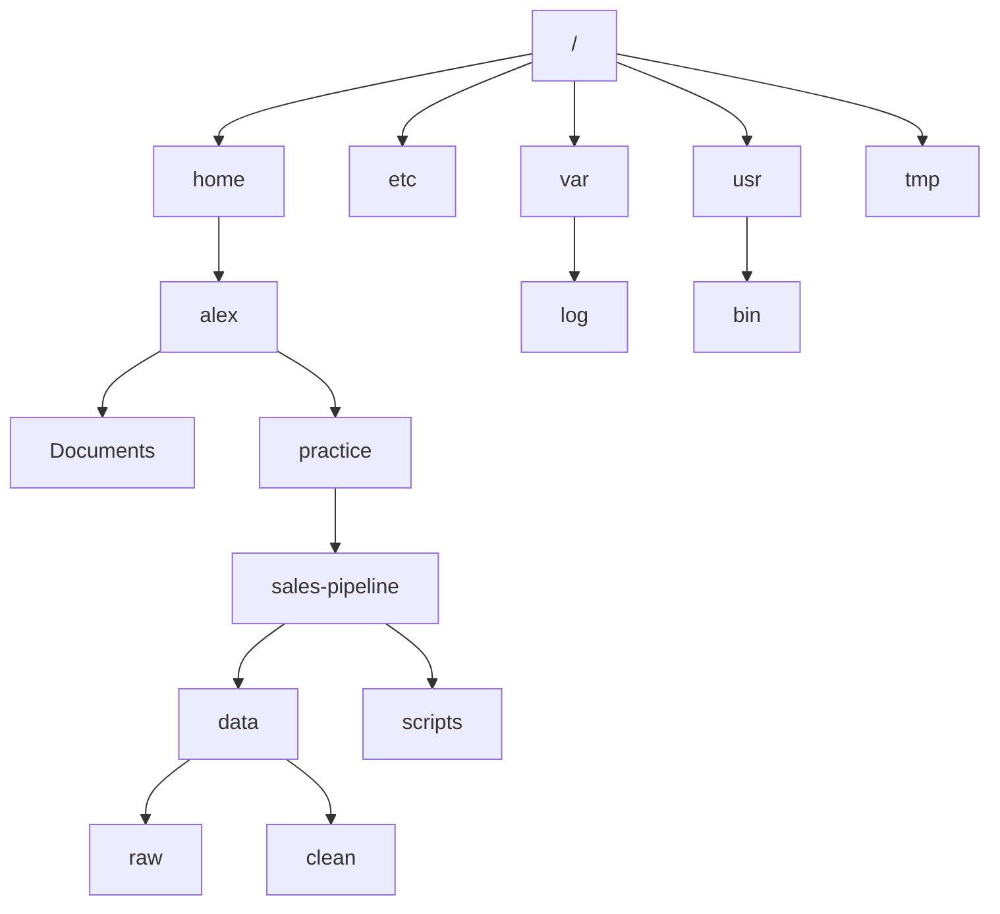
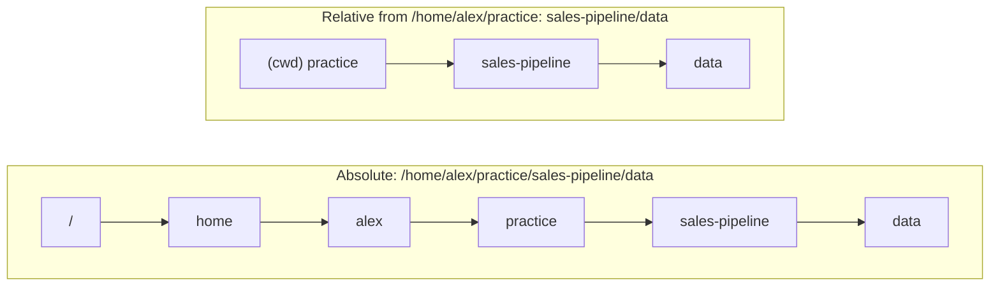

# Your first commands

> **Level 0 · Chapter 3** · ⏱️ ~30 min read · Prerequisites: [The terminal, shell, and prompt](02-terminal-shell-prompt.md)

This chapter teaches you to move around a Linux system and look at what's there. You'll learn how the directory tree works, the difference between absolute and relative paths, and the everyday commands `pwd`, `ls`, `cd`, `echo`, and `clear`, plus two habits that make you fast from day one: tab completion and command history.

## Why it matters

Alex has a Python script that cleans the month's order data. It opens `data/raw/orders.csv`, cleans it, and writes `data/clean/orders.csv`. On Alex's laptop it works every time.

Alex copies it to the team's server and sets up a nightly job. The next morning the job has failed with `FileNotFoundError: data/raw/orders.csv`. The file is definitely there. Alex logs in, runs the script by hand, and it works. The next night it fails again.

The cause: `data/raw/orders.csv` is a **relative path**. It means "start from wherever you are right now". When Alex ran the script by hand, Alex had already done `cd ~/sales-pipeline`, so it worked. The nightly job started in a different folder, so the same path pointed at nothing.

Understanding where you are, how paths are resolved, and how to check both takes ten minutes to learn and saves you from one of the most common bugs in data pipelines. It also makes you dramatically faster at the terminal.

## Concepts

### One tree, one root

Windows gives each drive a letter: `C:\`, `D:\`. Linux has no drive letters. Everything, on every disk, lives in **one tree** of directories that starts at a single point called the **root directory**, written as a single slash: `/`.

A **directory** is what Windows and macOS call a folder: a container that holds files and other directories. A directory inside another is a **subdirectory**. The directory that contains another is its **parent**.



Extra disks and USB sticks don't get letters. Instead they are attached somewhere in the tree, at a directory such as `/media/alex/USB-STICK`. Attaching a filesystem to a directory is called **mounting**, and the directory is its **mount point**. You'll learn it in [Filesystems, inodes, and links](../03-internals/04-filesystems-and-links.md). For now, the point is: there is one tree, and you can reach everything from `/`.

### Paths

A **path** is the address of a file or directory in the tree: the list of directory names you walk through to reach it, separated by `/`.

- `/home/alex/practice/sales-pipeline` means: start at root, go into `home`, then `alex`, then `practice`, then `sales-pipeline`.

The same `/` character plays two roles. At the very start of a path it means "the root directory". Between names it is just a separator.

!!! info "Forward slash, not backslash"
    Linux uses `/` between path components. Windows uses `\`. In the Linux shell, `\` has a different meaning entirely (it "escapes" the next character), so `\home\alex` does not work.

### The working directory

Every process, including your shell, has a **current working directory** (often shortened to **cwd** or **working directory**): the directory it is "in" right now. When you open a terminal, your shell starts in your **home directory**, `/home/alex`, which is your personal space for files.

The working directory matters because it is the starting point for every relative path. Your prompt shows it (`alex@mint:~/practice$`), and `pwd` prints it in full.

### Absolute and relative paths

There are two kinds of path, and telling them apart is simple: look at the first character.

- An **absolute path** starts with `/`. It is resolved from the root, so it means the same thing no matter where you are. `/home/alex/practice` is always the same directory.
- A **relative path** does not start with `/`. It is resolved from the current working directory. `practice/sales-pipeline` means "the `practice` directory inside wherever I am, then `sales-pipeline` inside that".



The same relative path points to different places from different starting points:

| Working directory | Relative path | Resolves to |
|---|---|---|
| `/home/alex` | `practice/sales-pipeline` | `/home/alex/practice/sales-pipeline` |
| `/home/alex/practice` | `sales-pipeline` | `/home/alex/practice/sales-pipeline` |
| `/tmp` | `practice/sales-pipeline` | `/tmp/practice/sales-pipeline` (probably doesn't exist) |

That last row is exactly Alex's bug. Use relative paths for quick typing at the prompt. Use absolute paths (or paths built from a known starting point) in scripts and scheduled jobs.

### Special directory names

A few short names have special meaning:

| Name | Meaning | Who handles it |
|---|---|---|
| `.` | The current directory | Real entry in every directory |
| `..` | The parent directory (one level up) | Real entry in every directory |
| `~` | Your home directory, `/home/alex` | The shell expands it |
| `~bob` | User `bob`'s home directory | The shell expands it |
| `-` | The previous working directory (only with `cd`) | The `cd` builtin |
| `/` | The root directory | The kernel |

`.` and `..` are not shell tricks. Every directory on disk literally contains two entries with these names, pointing at itself and its parent. That's why they work in any command and in any program, including Python's `open("../data.csv")`. At the root, `..` points back to `/` itself, since there is nowhere higher.

`~` is different: the shell replaces it with your home directory before the command runs. The command never sees the `~`. You can watch this with `echo ~`, shown below.

You can chain these: `../..` goes up two levels, `../logs` goes up one and then into `logs`, and `./run.sh` means "the file `run.sh` right here".

### Hidden files

Any file or directory whose name starts with a dot, like `.bashrc` or `.config`, is **hidden**: `ls` doesn't show it unless you ask. There is nothing special about the file itself. It's only a convention that `ls` and file managers follow. Programs use it to keep their settings out of your way, which is why these are often called **dotfiles**. You'll tour them in [The filesystem layout](05-filesystem-layout.md).

### What ls actually does

A directory, under the hood, is a special file containing a list of names. Each name points to an **inode**: a record holding the file's size, owner, permissions, and timestamps, plus where its data sits on disk. (Inodes get a full treatment in [Filesystems, inodes, and links](../03-internals/04-filesystems-and-links.md).)

`ls` reads the list of names from the directory. With `-l` it also looks up each name's inode to show the details. It then sorts the names and prints them. That's why `ls -l` on a huge directory is slower than plain `ls`: it does one extra lookup per file.

`ls` sorts alphabetically by default, following your **locale** (your language and region settings, such as `en_US.UTF-8`). In English locales, sorting ignores case and leading dots, so `Desktop` sits next to `.config`, and `README.md` sits among lowercase names. Scripts that need byte-by-byte order set `LC_ALL=C`.

### Tab completion

Typing full paths is slow and error-prone. **Tab completion** lets bash finish words for you. Type the start of a command, file name, or directory, then press ++tab++:

- If only one thing matches, bash completes it. Directories get a trailing `/` so you can keep going.
- If several things match, bash completes as far as they agree, then beeps or does nothing. Press ++tab++ a second time to list all the choices.
- If nothing matches, nothing happens. That itself is useful: it tells you the path is wrong before you run anything.

Completion is provided by **readline**, the line-editing library bash uses, plus a package called **bash-completion** that teaches bash about specific commands. With it, `git ch` ++tab++ offers `checkout` and `cherry-pick`, and `ssh` ++tab++ offers host names from your SSH config.

!!! tip "Tab is a typo detector"
    Make it a reflex to press ++tab++ after every few characters of a path. If it doesn't complete, the path is wrong. This one habit prevents most "No such file or directory" errors.

### Command history

Bash remembers the commands you type. While the shell runs, the list lives in memory. When the shell exits, it appends them to the file `~/.bash_history`, so the next terminal can see them.

Mint's default `~/.bashrc` sets three history options:

| Setting | Default on Mint | Meaning |
|---|---|---|
| `HISTSIZE` | `1000` | How many commands to keep in memory per shell |
| `HISTFILESIZE` | `2000` | How many lines to keep in `~/.bash_history` |
| `HISTCONTROL` | `ignoreboth` | Don't record a command that duplicates the previous one, or that starts with a space |

The "starts with a space" rule is a handy privacy trick: type a space before a command containing a password or token and it won't be saved.

The basics:

- ++arrow-up++ and ++arrow-down++ walk backwards and forwards through previous commands. Edit the line with ++arrow-left++ and ++arrow-right++, then press ++enter++.
- `history` prints the numbered list.
- ++ctrl+r++ searches backwards as you type. Press it again to go further back, ++enter++ to run, or ++ctrl+g++ to cancel.

[Shell productivity](../01-command-line/07-shell-productivity.md) covers history expansion (`!!`, `!$`) and more editing shortcuts.

## Commands and examples

### Set up a practice tree

So the examples match your screen, create a small practice project in your home directory. `mkdir -p` creates directories, including any missing parents. `touch` creates empty files. Both are explained properly in [Working with files](../01-command-line/01-working-with-files.md); for now, copy these lines as they are:

```bash
cd
mkdir -p practice/sales-pipeline/data/raw practice/sales-pipeline/data/clean
mkdir -p practice/sales-pipeline/scripts practice/sales-pipeline/logs
touch practice/sales-pipeline/README.md practice/sales-pipeline/scripts/load.sh
touch practice/sales-pipeline/data/raw/orders_2026-08.csv practice/sales-pipeline/data/raw/orders_2026-09.csv
```

There's no output. In Unix, silence means success.

### pwd: where am I?

`pwd` stands for **print working directory**.

```bash
pwd
```

```text
/home/alex
```

It always prints an absolute path. If your prompt is ever unclear, for instance on a server where someone trimmed it, `pwd` is the truth.

`pwd` has two options that matter when **symbolic links** are involved. A symbolic link (symlink) is a file that points at another path, like a shortcut. `pwd -L` (logical, the default) shows the path as you typed it, including the link. `pwd -P` (physical) resolves links and shows the real location:

```bash
cd /bin
pwd
pwd -P
```

```text
/bin
/usr/bin
```

On Mint, `/bin` is a symlink to `/usr/bin`. You "went into" `/bin`, but physically you're in `/usr/bin`. More on that in [The filesystem layout](05-filesystem-layout.md).

### ls: what's here?

`ls` **lists** directory contents. With no arguments, it lists the current directory:

```bash
cd
ls
```

```text
Desktop    Downloads  Pictures  Public     Videos
Documents  Music      practice  Templates
```

Those capitalised folders were created by your desktop at first login. `practice` is the one you just made.

Give `ls` a path to list somewhere else without moving:

```bash
ls practice/sales-pipeline
ls /etc/apt
```

```text
data  logs  README.md  scripts
apt.conf.d   keyrings       sources.list    trusted.gpg.d
auth.conf.d  preferences.d  sources.list.d
```

Several arguments list each one in turn, with a heading:

```bash
ls practice practice/sales-pipeline/data
```

```text
practice:
sales-pipeline

practice/sales-pipeline/data:
clean  raw
```

If you give it a file, it just echoes the name back, which confirms the file exists:

```bash
ls /etc/hostname
```

```text
/etc/hostname
```

!!! info "Columns on screen, one per line in a pipe"
    When output goes to your terminal, `ls` arranges names in columns to fit the window width. When output goes into a pipe or a file, it prints one name per line so other programs can process it. Force one per line on screen with `ls -1` (the digit one).

### ls -a and -A: show hidden files

```bash
ls -a
```

```text
.              .bash_logout  .config    Downloads  Pictures  Public
..             .bashrc       Desktop    .local     practice  Templates
.bash_history  .cache        Documents  Music      .profile  Videos
```

`-a` means **all**: include names starting with a dot. You see `.` and `..`, plus your dotfiles: `.bashrc` (bash settings), `.profile` (login settings), `.bash_history` (saved history), `.config` and `.local` and `.cache` (where most applications keep their settings, data, and caches).

`-A` (**almost all**) does the same but leaves out `.` and `..`, which are in every directory and rarely interesting:

```bash
ls -A
```

```text
.bash_history  .cache    Documents  Music     .profile  Videos
.bash_logout   .config   Downloads  Pictures  Public
.bashrc        Desktop   .local     practice  Templates
```

### ls -l: the long listing

`-l` uses the **long** format, one file per line with details:

```bash
ls -l /etc/hostname /usr/bin/ls
```

```text
-rw-r--r-- 1 root root      5 Jun  9 19:04 /etc/hostname
-rwxr-xr-x 1 root root 142312 Apr  5  2024 /usr/bin/ls
```

Each line has seven fields:

```text
-rwxr-xr-x  1   root  root  142312  Apr  5  2024  /usr/bin/ls
│└───┬───┘  │    │     │      │     └─────┬─────┘  └────┬────┘
│    │      │    │     │      │           │             name
│    │      │    │     │      │           modification time
│    │      │    │     │      size in bytes
│    │      │    │     group owner
│    │      │    user owner
│    │      number of hard links
│    permissions (read/write/execute for user, group, others)
file type
```

| Field | Example | Meaning |
|---|---|---|
| File type | `-` | First character: `-` regular file, `d` directory, `l` symbolic link, `c` character device, `b` block device, `s` socket, `p` named pipe |
| Permissions | `rwxr-xr-x` | Who may read, write, and execute. Explained fully in [Permissions](../01-command-line/03-permissions.md) |
| Link count | `1` | How many names point at this file. For directories, related to the number of subdirectories |
| Owner | `root` | The user who owns it |
| Group | `root` | The group that owns it |
| Size | `142312` | Size in bytes. For directories, the size of the name list (often 4096), not the contents |
| Date | `Apr  5  2024` | Last modification time. Files changed in the last six months show the time (`Jun  9 19:04`); older ones show the year instead |
| Name | `/usr/bin/ls` | The name. Symlinks show `name -> target` |

Long-list your home with hidden files. This combination is so common that Mint has a shortcut, `ll`, an alias for `ls -alF`:

```bash
ls -la
```

```text
total 76
drwxr-x--- 14 alex alex 4096 Oct  2 10:46 .
drwxr-xr-x  3 root root 4096 Jun  9 19:04 ..
-rw-------  1 alex alex 5120 Oct  2 10:46 .bash_history
-rw-r--r--  1 alex alex  220 Jun  9 19:04 .bash_logout
-rw-r--r--  1 alex alex 3771 Jun  9 19:04 .bashrc
drwx------  9 alex alex 4096 Sep 30 08:12 .cache
drwx------ 18 alex alex 4096 Oct  1 17:40 .config
drwxr-xr-x  2 alex alex 4096 Jun  9 19:10 Desktop
drwxr-xr-x  2 alex alex 4096 Jun  9 19:10 Documents
drwxr-xr-x  2 alex alex 4096 Sep 29 21:03 Downloads
drwx------  3 alex alex 4096 Jun  9 19:10 .local
drwxr-xr-x  2 alex alex 4096 Jun  9 19:10 Music
drwxr-xr-x  2 alex alex 4096 Jun  9 19:10 Pictures
drwxrwxr-x  3 alex alex 4096 Oct  2 10:46 practice
-rw-r--r--  1 alex alex  807 Jun  9 19:04 .profile
drwxr-xr-x  2 alex alex 4096 Jun  9 19:10 Public
drwxr-xr-x  2 alex alex 4096 Jun  9 19:10 Templates
drwxr-xr-x  2 alex alex 4096 Jun  9 19:10 Videos
```

Some things to notice:

- The first line, `total 76`, is the disk space used by the listed entries, in 1 KiB blocks. It is not the file count.
- `.` is your home directory itself, owned by `alex`. `..` is `/home`, owned by `root`.
- `.bash_history` has `rw-------` permissions: only you can read it, because it may contain sensitive commands.
- Every directory shows a size of `4096`. That's one disk block for the directory's name list, not the size of what's inside. To measure contents you'll use `du` later.

### ls -h: human-readable sizes

Sizes in bytes are hard to read. `-h` (**human-readable**) uses K, M, and G (powers of 1024). It only affects `-l` and `-s` output:

```bash
ls -lh /var/log/syslog /usr/bin/bash
```

```text
-rwxr-xr-x 1 root   root 1.4M Mar 31  2024 /usr/bin/bash
-rw-r----- 1 syslog adm  1.9M Oct  2 10:44 /var/log/syslog
```

`1.4M` is about 1.4 mebibytes. If you prefer powers of 1000 (like disk manufacturers), use `--si`.

### ls -t, -S, -r: sorting

By default `ls` sorts by name. Other orders answer common questions:

- `-t` sorts by modification **time**, newest first. "What changed most recently?"
- `-S` sorts by **size**, largest first. "What's eating space?"
- `-r` **reverses** whatever order is in effect.
- `-X` sorts by extension. `-v` sorts numbers naturally, so `file2` comes before `file10`.

What did the system write to its logs most recently?

```bash
ls -lt /var/log | head -5
```

```text
total 24584
-rw-r-----  1 syslog adm     1891754 Oct  2 10:44 syslog
-rw-r-----  1 syslog adm       43659 Oct  2 10:44 auth.log
-rw-r--r--  1 root   root      20194 Oct  2 10:44 mintupdate.log
-rw-r-----  1 syslog adm      587681 Oct  2 10:43 kern.log
```

`| head -5` keeps only the first five lines, so you see the newest files without scrolling.

Which logs are biggest?

```bash
ls -lhS /var/log | head -6
```

```text
total 24M
-rw-r-----  1 syslog adm   13M Sep 27 09:37 syslog.1
-rw-r-----  1 syslog adm  3.6M Sep 27 09:37 kern.log.1
-rw-r-----  1 syslog adm  1.9M Oct  2 10:44 syslog
-rw-r-----  1 syslog adm  785K Aug 17 20:15 syslog.3.gz
-rw-r-----  1 syslog adm  678K Aug  2 17:02 syslog.4.gz
```

`syslog.1`, `syslog.2.gz` and so on are older, **rotated** logs: the system periodically renames the current log and starts a fresh one, compressing the old ones with gzip.

`ls -ltr` (time, reversed) puts the newest file at the **bottom**, right above your next prompt. That's the most useful order when a directory has hundreds of files:

```bash
ls -ltr /var/log | tail -3
```

```text
-rw-r--r--  1 root   root      20194 Oct  2 10:44 mintupdate.log
-rw-r-----  1 syslog adm       43659 Oct  2 10:44 auth.log
-rw-r-----  1 syslog adm     1891754 Oct  2 10:44 syslog
```

### ls -d: the directory itself, not its contents

When you give `ls -l` a directory, it lists what's inside. To see the directory's own details, add `-d`:

```bash
ls -l /var/log | head -3
ls -ld /var/log
```

```text
total 24584
-rw-r--r--  1 root      root      0 Sep 29 00:00 alternatives.log
drwxr-xr-x  2 root      root   4096 Sep 25 20:29 apt
drwxrwxr-x 14 root syslog 4096 Oct  2 09:35 /var/log
```

The second command answers "who owns `/var/log` and what are its permissions?", which you'll need constantly when debugging "Permission denied" errors.

### ls -F and --group-directories-first: see types at a glance

`-F` (**classify**) appends a symbol showing each entry's type: `/` directory, `*` executable, `@` symlink, `|` named pipe, `=` socket.

```bash
ls -F /
```

```text
bin@                etc/                lost+found/  root/                swapfile
bin.usr-is-merged/  home/               media/       run/                 sys/
boot/               lib@                mnt/         sbin@                tmp/
cdrom/              lib64@              opt/         sbin.usr-is-merged/  usr/
dev/                lib.usr-is-merged/  proc/        srv/                 var/
```

You can instantly see that `bin`, `lib`, and `sbin` are symlinks (`@`).

`--group-directories-first` lists directories before files, like most file managers do:

```bash
ls -F --group-directories-first practice/sales-pipeline
```

```text
data/  logs/  scripts/  README.md
```

Colours also show type. With Mint's default `ls --color=auto` alias, directories are bold blue, executables bold green, symlinks cyan, and compressed archives red. Colours are only a convenience; `-F` and `-l` work even where colours don't.

### ls -R: recursive listing

`-R` (**recursive**) lists a directory, then every subdirectory inside it, all the way down:

```bash
ls -R practice
```

```text
practice:
sales-pipeline

practice/sales-pipeline:
data  logs  README.md  scripts

practice/sales-pipeline/data:
clean  raw

practice/sales-pipeline/data/clean:

practice/sales-pipeline/data/raw:
orders_2026-08.csv  orders_2026-09.csv

practice/sales-pipeline/logs:

practice/sales-pipeline/scripts:
load.sh
```

Each block is headed by the directory's path. Empty directories show an empty block. Careful: `ls -R /` lists every file on the system and runs for a long time; press ++ctrl+c++ to stop it.

Note the difference between `-r` (reverse) and `-R` (recursive). Case matters.

### ls -i: inode numbers

`-i` prints each file's inode number, the internal ID the filesystem uses:

```bash
ls -i /etc/hostname
```

```text
12583086 /etc/hostname
```

You'll use this in Level 3 to understand hard links.

### ls flag summary

| Flag | Long form | What it does | Why you'd use it |
|---|---|---|---|
| `-a` | `--all` | Include hidden entries, plus `.` and `..` | Find dotfiles |
| `-A` | `--almost-all` | Hidden entries, without `.` and `..` | Cleaner version of `-a` |
| `-l` | | Long format | See owner, permissions, size, date |
| `-h` | `--human-readable` | Sizes like `1.4M` | Read sizes quickly |
| `-t` | | Sort by modification time, newest first | What changed recently? |
| `-S` | | Sort by size, largest first | What's using space? |
| `-r` | `--reverse` | Reverse the sort | Newest or largest at the bottom |
| `-R` | `--recursive` | Recurse into subdirectories | See a whole subtree |
| `-d` | `--directory` | Show directories themselves, not contents | Check a directory's permissions |
| `-F` | `--classify` | Append `/`, `*`, `@` type markers | See types without colour |
| `-1` | | One entry per line | Clean output for reading or copying |
| `-i` | `--inode` | Show inode numbers | Investigate links |
| `-n` | `--numeric-uid-gid` | Show numeric user and group IDs | When names don't resolve |
| | `--group-directories-first` | Directories before files | File-manager style listing |
| | `--time-style=long-iso` | Dates as `2026-10-02 10:44` | Unambiguous, sortable dates |

Combinations you'll type daily: `ls -la`, `ls -lh`, `ls -ltr`, `ls -lhS`, `ls -ld dir`.

### cd: moving around

`cd` **changes directory**. It's a shell builtin (you saw why in the previous chapter). Successful `cd` prints nothing; the prompt changes instead.

Absolute path, from anywhere:

```bash
cd /var/log
pwd
```

```text
/var/log
```

Relative path, from where you are:

```bash
cd ~/practice
cd sales-pipeline/data
pwd
```

```text
/home/alex/practice/sales-pipeline/data
```

Go up with `..`:

```bash
cd ..
pwd
cd ../..
pwd
```

```text
/home/alex/practice/sales-pipeline
/home/alex
```

Go home, three equivalent ways:

```bash
cd
cd ~
cd /home/alex
```

`cd` with no argument always takes you home. It's the quickest way back when you're lost.

Toggle to the previous directory with `cd -`. It prints the directory it switches to:

```bash
cd /etc/apt
cd /var/log
cd -
cd -
```

```text
/etc/apt
/var/log
```

`cd -` is perfect when you're bouncing between a config directory and a log directory. The shell stores the previous directory in the variable `OLDPWD`.

Go up and sideways in one step:

```bash
cd ~/practice/sales-pipeline/data/raw
cd ../clean
pwd
```

```text
/home/alex/practice/sales-pipeline/data/clean
```

#### When cd fails

```bash
cd ~/practice/sales-pipline
```

```text
bash: cd: /home/alex/practice/sales-pipline: No such file or directory
```

A typo. Tab completion would have caught it. Notice the shell expanded `~` in the error message.

```bash
cd ~/practice/sales-pipeline/README.md
```

```text
bash: cd: /home/alex/practice/sales-pipeline/README.md: Not a directory
```

You can only `cd` into directories.

```bash
cd /root
```

```text
bash: cd: /root: Permission denied
```

`/root` is the root user's home directory, and normal users aren't allowed in. You'll see why in [Users, groups, and sudo](06-users-groups-sudo.md).

!!! warning "Common mistake: a leading slash by accident"
    `cd /practice` and `cd practice` are very different. The first is absolute and looks for `practice` directly under the root directory, which doesn't exist. The second is relative to where you are. If `cd` says "No such file or directory" for a folder you know exists, check for a stray leading `/`.

!!! info "Spaces in names"
    A directory named `My Projects` must be quoted or escaped: `cd "My Projects"` or `cd My\ Projects`. Without quotes, `cd` receives two arguments and fails with `bash: cd: too many arguments`. Tab completion inserts the backslash for you. Many Linux users avoid spaces in names for exactly this reason.

### echo: print text

`echo` prints its arguments, separated by single spaces, followed by a newline. It is how scripts talk to you, and how you inspect what the shell is doing.

```bash
echo Hello, Linux
```

```text
Hello, Linux
```

Print variables. A **variable** is a named value held by the shell; `$NAME` means "the value of NAME". These are set for you automatically:

```bash
echo $HOME
echo $USER
echo $PWD
echo "I am $USER and I am in $PWD"
```

```text
/home/alex
alex
/home/alex/practice
I am alex and I am in /home/alex/practice
```

Watch the shell expand `~` before `echo` runs:

```bash
echo ~
echo ~/practice
echo ~root
```

```text
/home/alex
/home/alex/practice
/root
```

`echo` never sees the `~`; the shell already replaced it. This is how you test what a command will actually receive.

Quotes change what the shell does. Double quotes still expand variables; single quotes keep everything literal:

```bash
echo "Home is $HOME"
echo 'Home is $HOME'
```

```text
Home is /home/alex
Home is $HOME
```

Quoting gets a full chapter in [Variables, quoting, and arrays](../02-scripting/02-variables-quoting-arrays.md).

Two options for bash's `echo`:

```bash
echo -n "no newline here"
echo
echo -e "col1\tcol2\nrow2"
```

```text
no newline here
col1	col2
row2
```

- `-n` suppresses the trailing newline. The bare `echo` after it just prints a newline, so the prompt starts on a fresh line.
- `-e` interprets backslash escapes such as `\t` (tab) and `\n` (newline). Without `-e`, they print literally.

!!! tip "printf for anything serious"
    `echo`'s options vary between shells and systems. In scripts, prefer `printf`, which behaves the same everywhere: `printf '%s\t%s\n' col1 col2`. You'll meet it in Level 2.

### clear: clean the screen

```bash
clear
```

This wipes the visible screen and puts the prompt at the top. ++ctrl+l++ does the same without typing, and keeps whatever you'd typed on the current line.

`clear` also tries to erase the terminal's scrollback buffer. `clear -x` clears the screen but keeps the scrollback, so you can still scroll up to see earlier output.

If a program leaves your terminal in a mess (garbled characters after you accidentally `cat` a binary file, for instance), `reset` fully reinitialises the terminal. Type it even if you can't see what you're typing, then press ++enter++.

### Tab completion in practice

From your home directory, type the following, pressing ++tab++ where shown:

```text
cd pr<Tab>               →  cd practice/
cd practice/s<Tab>       →  cd practice/sales-pipeline/
cd practice/sales-pipeline/d<Tab>  →  .../data/
```

Now an ambiguous one. In `practice/sales-pipeline/data/raw`, both files start with `orders_2026-0`:

```text
ls practice/sales-pipeline/data/raw/o<Tab>
```

Bash completes up to where the names differ: `orders_2026-0`. Press ++tab++ twice to list the choices:

```text
orders_2026-08.csv  orders_2026-09.csv
```

Type `8` and ++tab++ again to finish.

Command names complete too. Type `wh` and press ++tab++ twice:

```text
whatis             which              whiptail           whoami
whereis            which.debianutils  who                while
```

That's a quick way to discover commands. If there are hundreds of matches, bash asks `Display all 412 possibilities? (y or n)`; press `n`.

### History in practice

Press ++arrow-up++ to bring back your last command, again for the one before. Press ++enter++ to rerun it, or edit it first.

Show recent history:

```bash
history | tail -5
```

```text
  498  cd ~/practice/sales-pipeline/data/raw
  499  cd ../clean
  500  pwd
  501  ls -ltr /var/log | tail -3
  502  history | tail -5
```

Each line has a number and the command. Rerun a numbered command with `!` and the number, for example `!500`.

Search with ++ctrl+r++. Press it, then type `syslog`:

```text
(reverse-i-search)`syslog': ls -lh /var/log/syslog /usr/bin/bash
```

Press ++enter++ to run it, ++ctrl+r++ again for an older match, or ++arrow-right++ to edit it first.

Keep a secret out of history by starting the line with a space:

```bash
 export API_TOKEN=abc123
```

Because Mint sets `HISTCONTROL=ignoreboth`, that line is not saved.

### tree: see the shape of a directory

`tree` draws a directory and everything below it as an indented diagram. It's a great way to understand an unfamiliar project. If it isn't installed, run `sudo apt install tree` (installing software is covered in Level 3).

```bash
tree practice
```

```text
practice
└── sales-pipeline
    ├── data
    │   ├── clean
    │   └── raw
    │       ├── orders_2026-08.csv
    │       └── orders_2026-09.csv
    ├── logs
    ├── README.md
    └── scripts
        └── load.sh

7 directories, 4 files
```

Useful options:

| Option | Meaning |
|---|---|
| `-L 2` | Only go 2 **levels** deep. Essential for big trees |
| `-d` | Show **directories** only |
| `-a` | Include hidden files |
| `-h` | Show human-readable sizes |
| `-F` | Append `/`, `*`, `@` type markers like `ls -F` |

```bash
tree -d practice
```

```text
practice
└── sales-pipeline
    ├── data
    │   ├── clean
    │   └── raw
    ├── logs
    └── scripts

7 directories
```

Never run plain `tree /`; it would try to draw the whole system. Use `tree -L 1 /` to see just the top level.

## Exercises

### Exercise 1: Where am I? (easy)

Starting from a fresh terminal, use only `cd` and `pwd` to visit `/var/log`, then `/etc`, then your practice project's `data/raw` directory, then jump back to `/etc` with a single short command, then go home. Print your location after each move.

??? success "Solution"

    ```bash
    cd /var/log
    pwd
    cd /etc
    pwd
    cd ~/practice/sales-pipeline/data/raw
    pwd
    cd -
    cd
    pwd
    ```

    ```text
    /var/log
    /etc
    /home/alex/practice/sales-pipeline/data/raw
    /etc
    /home/alex
    ```

    `cd -` returns to the previous directory and prints it, so it doubles as its own `pwd`. Plain `cd` goes home.

### Exercise 2: Translate the paths (easy)

Your working directory is `/home/alex/practice/sales-pipeline/data`. Without running anything, write the absolute path each of these relative paths points to. Then check your answers with `cd` and `pwd`.

1. `raw`
2. `../scripts`
3. `../../..`
4. `./clean/../raw`
5. `../logs/../README.md`

??? success "Solution"

    1. `/home/alex/practice/sales-pipeline/data/raw`
    2. `/home/alex/practice/sales-pipeline/scripts`
    3. `/home/alex`. Three levels up from `data`: `sales-pipeline`, then `practice`, then `alex`.
    4. `/home/alex/practice/sales-pipeline/data/raw`. Into `clean`, back up, into `raw`.
    5. `/home/alex/practice/sales-pipeline/README.md`. It's a file, so check it with `ls` rather than `cd`.

    To check:

    ```bash
    cd ~/practice/sales-pipeline/data
    cd ../../.. && pwd
    cd ~/practice/sales-pipeline/data
    ls ../logs/../README.md
    ```

    ```text
    /home/alex
    ../logs/../README.md
    ```

    `ls` prints the path exactly as you typed it, and the lack of an error proves it exists.

### Exercise 3: ls detective (medium)

Using only `ls` (with any flags) and `head`/`tail`, answer:

1. What is the most recently modified entry in `/etc`?
2. What is the largest file directly inside `/usr/bin`, and how big is it in human-readable form?
3. How many hidden entries are in your home directory? (Hint: `ls -d ~/.*` lists names matching `.*`; pipe to `wc -l` to count lines.)
4. Who owns `/var/log` itself, and which group?

??? success "Solution"

    1. Newest first with `-t`, keep the top:

        ```bash
        ls -lt /etc | head -2
        ```

        ```text
        total 1344
        drwxr-xr-x  5 root lp  4096 Oct  2 10:36 cups
        ```

        Your answer will differ. Whatever changed most recently (often because of an update) sits at the top.

    2. Largest first with `-S`, human sizes with `-h`:

        ```bash
        ls -lhS /usr/bin | head -2
        ```

        ```text
        total 628M
        -rwxr-xr-x 1 root root     107M Oct  1 01:02 dockerd
        ```

        The exact file varies by system. This example comes from a developer machine with Docker installed, where the Docker daemon is the biggest single program. The `total` line is the space used by everything listed.

    3. Count hidden entries:

        ```bash
        ls -d ~/.* | wc -l
        ```

        ```text
        7
        ```

        `~/.*` is a glob pattern (covered in [Globbing and expansion](../01-command-line/02-globbing-and-expansion.md)) matching every name starting with a dot. `-d` stops `ls` from listing the contents of hidden directories. Bash 5.2 (Mint's version) has an option called `globskipdots` turned on by default, so `.*` does not match `.` and `..`, and the count is exactly your dotfiles. Older shells included them, so you would subtract 2. An alternative that works everywhere: `ls -A | wc -l` minus `ls | wc -l`.

    4. Use `-d` so you see the directory itself:

        ```bash
        ls -ld /var/log
        ```

        ```text
        drwxrwxr-x 14 root syslog 4096 Oct  2 09:35 /var/log
        ```

        Owner `root`, group `syslog`.

### Exercise 4: Navigation without typing paths (medium)

Starting in your home directory, get into `~/practice/sales-pipeline/data/raw` pressing as few keys as possible, using tab completion. Count your keystrokes. Then, using only relative paths, visit the project's `scripts`, then `logs`, then `data/clean`, and finally `data/raw` again. After that, return to `clean` with the shortest possible `cd` command.

??? success "Solution"

    Using tab completion: `cd pr` ++tab++ `s` ++tab++ `d` ++tab++ `r` ++tab++ ++enter++. About 12 keystrokes instead of 41 characters, and impossible to misspell.

    ```bash
    cd ../../scripts
    pwd
    cd ../logs
    pwd
    cd ../data/clean
    pwd
    cd ../raw
    pwd
    ```

    ```text
    /home/alex/practice/sales-pipeline/scripts
    /home/alex/practice/sales-pipeline/logs
    /home/alex/practice/sales-pipeline/data/clean
    /home/alex/practice/sales-pipeline/data/raw
    ```

    Each relative path climbs out with `..` only as far as needed, then descends. The shortest way back to `clean` is `cd -`, because `clean` was the previous working directory. It prints `/home/alex/practice/sales-pipeline/data/clean` as it switches.

### Exercise 5: Reproduce Alex's bug (hard)

Simulate the bug from "Why it matters" using only `ls`. Show that `ls data/raw` works from one directory and fails from another. Then write the one `ls` command that works from **anywhere**, two different ways: once with an absolute path and once with `~`. Finally, explain why `~` would not be a safe choice inside a nightly job that runs as a different user.

??? success "Solution"

    ```bash
    cd ~/practice/sales-pipeline
    ls data/raw
    cd /tmp
    ls data/raw
    ```

    ```text
    orders_2026-08.csv  orders_2026-09.csv
    ls: cannot access 'data/raw': No such file or directory
    ```

    The relative path resolves against the working directory, so it only works from `sales-pipeline`.

    Two location-independent versions:

    ```bash
    ls /home/alex/practice/sales-pipeline/data/raw
    ls ~/practice/sales-pipeline/data/raw
    ```

    Both work from any directory.

    `~` expands to the home directory of **whoever runs the command**. If the nightly job runs as a service account, say `etl`, then `~` becomes `/home/etl` (or wherever that account's home is), and the path breaks again. In scheduled jobs, use absolute paths, or have the script work out its own location and build paths from that. You'll learn that technique in Level 2.

## Check yourself

1. What is the difference between an absolute and a relative path, and how can you tell them apart at a glance?

    ??? note "Answer"

        An absolute path starts with `/` and is resolved from the root, so it means the same thing from anywhere. A relative path doesn't start with `/` and is resolved from the current working directory. Look at the first character.

2. What do `.`, `..`, `~`, and `-` mean in `cd` commands?

    ??? note "Answer"

        `.` is the current directory. `..` is the parent directory. `~` is your home directory (expanded by the shell). `-` with `cd` means the previous working directory, stored in `OLDPWD`.

3. Which `ls` command shows the newest file at the bottom of a long listing, with human-readable sizes?

    ??? note "Answer"

        `ls -lhtr`: `-l` long, `-h` human-readable, `-t` sort by time (newest first), `-r` reverse it so the newest is last.

4. Why does `ls -l /var/log` not show you the permissions of `/var/log` itself, and how do you fix that?

    ??? note "Answer"

        When given a directory, `ls` lists its contents. Add `-d` to show the directory entry itself: `ls -ld /var/log`.

5. In `ls -l` output, what does a size of `4096` on a directory mean?

    ??? note "Answer"

        It's the size of the directory's own list of names (usually one 4 KiB disk block), not the total size of the files inside. Use `du` to measure contents.

6. What's the difference between `echo "$HOME"` and `echo '$HOME'`?

    ??? note "Answer"

        Double quotes allow variable expansion, so the first prints `/home/alex`. Single quotes are fully literal, so the second prints `$HOME`.

7. You pressed ++tab++ after `cd ~/practice/sa` and nothing happened. What are the likely reasons?

    ??? note "Answer"

        No entry in `~/practice` starts with `sa` (a typo or wrong directory), or several entries match and you need to press ++tab++ a second time to see them. A single press doing nothing is a signal to check the path.

8. Where does bash store your command history, and how do you keep a command out of it?

    ??? note "Answer"

        In memory while the shell runs, then appended to `~/.bash_history` when it exits. With Mint's default `HISTCONTROL=ignoreboth`, start the command with a space and it won't be recorded.

## Key takeaways

- Linux has **one directory tree** starting at `/`. Disks are mounted into it; there are no drive letters.
- **Absolute paths** start with `/`; **relative paths** start from the current working directory. Scripts and scheduled jobs should not depend on the working directory.
- `pwd` tells you where you are, `cd` moves you, and `cd` alone takes you home. `cd -` toggles back.
- `ls -la`, `ls -lh`, `ls -ltr`, `ls -lhS`, and `ls -ld` answer most everyday questions about files.
- `echo` shows what the shell expands. Use it to test `~`, variables, and quoting.
- Press ++tab++ constantly and use ++arrow-up++ and ++ctrl+r++ instead of retyping.
- `tree -L 2` shows the shape of a project in one glance.

## Next

You can move around and look. Next, learn to answer your own questions without a browser: [Getting help](04-getting-help.md).
