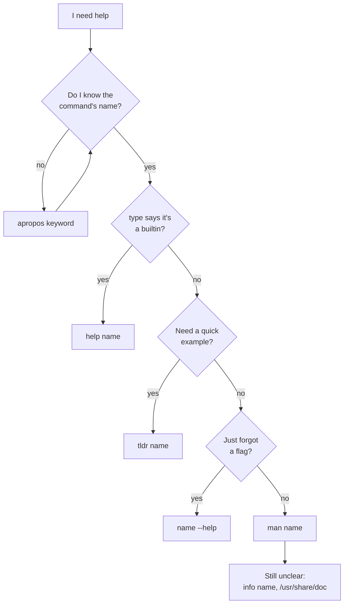
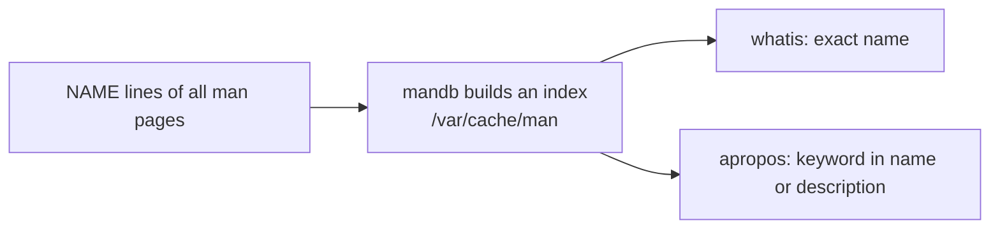

# Getting help

> **Level 0 · Chapter 4** · ⏱️ ~30 min read · Prerequisites: [Your first commands](03-first-commands.md)

Linux ships with its own documentation, installed right next to the programs it describes. This chapter shows you every layer of it: `--help`, the manual pages and how to read their odd notation, the pager you read them in, `apropos` and `whatis` for searching, `info`, bash's `help`, the example-driven `tldr`, and the package docs in `/usr/share/doc`.

## Why it matters

It's late on a Friday. Alex needs to pull last month's application logs out of a compressed archive on a production server. The server sits behind a jump host with no web browser and no internet access, which is normal for production systems that handle customer data.

Alex remembers the command is something like `tar -x`, but not the rest. Earlier that week Alex had copied a `tar` command from a blog post, and it failed with `tar: unrecognized option`. The post had been written for macOS, which uses a different `tar` from GNU's.

This time Alex types `man tar`, presses `/` to search for "extract", and has the exact flags in under a minute. The manual on the server is guaranteed to match the version installed on that server. No blog post can promise that.

Being able to find answers locally is a core skill. It works on air-gapped servers, inside minimal containers, and on a train with no signal. It's also faster than searching once you know how. The Level 0 capstone asks you to find any command's documentation without a browser, and this chapter is how.

## Concepts

### The layers of documentation

Linux has several documentation systems, each with a different job:

| Source | Command | Best for | Comes from |
|---|---|---|---|
| Built-in help | `cmd --help` | Quick reminder of options | The program itself |
| Manual pages | `man cmd` | The complete reference for a command, file, or function | The package, installed under `/usr/share/man` |
| Manual search | `apropos`, `whatis` | Finding a command when you don't know its name | An index of all man pages |
| Info manuals | `info cmd` | Long, tutorial-style GNU manuals | GNU packages, under `/usr/share/info` |
| Bash help | `help cmd` | Shell builtins like `cd` and `type` | Bash itself |
| tldr | `tldr cmd` | Practical examples of common uses | A community project (install it) |
| Package docs | `/usr/share/doc/pkg` | READMEs, changelogs, licenses, example configs | Each package |

How to pick one:



### Manual pages

A **manual page**, or **man page**, is the standard reference document for a command, configuration file, or programming function. Man pages date back to the first Unix Programmer's Manual in 1971, and nearly every program on your system installs one.

They're stored as compressed files in a markup language called **roff** (processed by GNU's `groff`), under `/usr/share/man`. When you type `man ls`, the `man` program finds the right file, formats it for your terminal's width, and hands the result to a **pager** so you can scroll.


#### Sections

The manual is split into numbered **sections**, because the same name can mean different things. `passwd` is both a command (to change your password) and a file (`/etc/passwd`). Each gets its own page in a different section.

| Section | Contains | Example |
|---|---|---|
| 1 | User commands | `ls(1)`, `cp(1)`, `passwd(1)` |
| 2 | System calls (functions the kernel provides) | `open(2)`, `fork(2)` |
| 3 | Library functions (C library and others) | `printf(3)`, `malloc(3)` |
| 4 | Special files, usually in `/dev` | `null(4)`, `random(4)` |
| 5 | File formats and configuration files | `passwd(5)`, `crontab(5)`, `fstab(5)` |
| 6 | Games | `intro(6)` |
| 7 | Overviews, conventions, and miscellaneous | `hier(7)`, `signal(7)`, `regex(7)` |
| 8 | System administration commands, often for root | `sudo(8)`, `useradd(8)`, `mount(8)` |

You'll see pages written as `name(section)`, like `crontab(5)`. That's shorthand for "the `crontab` page in section 5". To open a specific section, put the number before the name: `man 5 crontab`. Without a number, `man` searches the sections in a set order (1, then 8, then 3, 2, 5, 4, 9, 6, 7 by default on Ubuntu) and shows the first match.

Some sections have sub-sections with a suffix, like `1ssl` for OpenSSL commands or `3pm` for Perl modules.

#### The parts of a man page

Every man page uses the same headings, which makes them quick to scan once you know them:

| Heading | What it tells you |
|---|---|
| NAME | The name and a one-line description. This line is what `apropos` searches |
| SYNOPSIS | The command's grammar: what options and arguments it accepts |
| DESCRIPTION | What it does, in detail. Often lists the options too |
| OPTIONS | Each option explained |
| EXIT STATUS | What the exit codes mean |
| ENVIRONMENT | Environment variables that change its behaviour |
| FILES | Files it reads or writes |
| EXAMPLES | Example commands. Not every page has them, sadly |
| SEE ALSO | Related pages. Follow these to learn the neighbourhood |
| BUGS, AUTHOR, REPORTING BUGS, COPYRIGHT | Housekeeping |

The header line shows the page name and section on both sides, and the section's title in the middle. The footer shows the package version and date, which tells you exactly which version you're reading about.

### Reading SYNOPSIS notation

The SYNOPSIS uses a compact notation. `man man` defines it:

| Notation | Meaning |
|---|---|
| **bold text** | Type exactly as shown |
| *italic* or underlined text | Replace with a real value |
| `[-abc]` | Anything in square brackets is optional |
| `-a|-b` | Choose one; options separated by `|` can't be used together |
| `argument ...` | The argument can be repeated |
| `[expression] ...` | The whole bracketed group can be repeated |
| `{a|b}` | Used by some pages: braces group required choices; pick exactly one |

In a terminal, italics usually appear as underlined or coloured text. GNU's coreutils pages often write placeholders in CAPITALS instead, like `FILE` or `OPTION`.

Let's decode a few real ones.

```text
ls [OPTION]... [FILE]...
```

- `ls` is bold: type it as is.
- `[OPTION]...`: zero or more options, all optional.
- `[FILE]...`: zero or more file names, optional. With none, `ls` uses the current directory (the DESCRIPTION says so).

```text
mkdir [OPTION]... DIRECTORY...
```

`DIRECTORY...` has no brackets, so at least one directory is **required**. The `...` means you can give more.

```text
cp [OPTION]... [-T] SOURCE DEST
cp [OPTION]... SOURCE... DIRECTORY
cp [OPTION]... -t DIRECTORY SOURCE...
```

Three lines mean three different ways to call `cp`:

1. Copy one `SOURCE` to a `DEST` name.
2. Copy one or more `SOURCE`s into an existing `DIRECTORY`, which comes last.
3. With `-t DIRECTORY`, name the target directory first and the sources after it. Handy when the list of sources comes from another command.

```text
cd [-L|[-P [-e]] [-@]] [dir]
```

This is from `help cd`. Reading from the outside in:

- Everything is optional, including `dir`.
- `-L|[-P [-e]]`: use `-L`, or use `-P` (which may be followed by `-e`). Not both.
- `-e` sits inside `-P`'s brackets, so it only makes sense together with `-P`.

```text
tar {A|c|d|r|t|u|x}[GnSkUWOmpsMBiajJzZhPlRvwo] [ARG...]
```

The braces mean you must pick exactly one main mode letter (create `c`, extract `x`, list `t`, and so on). Then any of the letters in the brackets may follow. This is the old "traditional" style without dashes, as in `tar xzf file.tar.gz`. The man page lists dashed and long-option styles below it.

### The pager: less

A **pager** is a program that shows text one screen at a time. `man` uses `less` by default. (The name is a joke: an older pager was called `more`, and "less is more".) You'll also use `less` to read log files, so these keys pay off twice.

| Key | Action |
|---|---|
| ++space++ or ++f++ or ++page-down++ | Forward one screen |
| ++b++ or ++page-up++ | Back one screen |
| ++d++ / ++u++ | Down / up half a screen |
| ++j++ / ++k++ or ++arrow-down++ / ++arrow-up++ | Down / up one line |
| ++g++ / ++shift+g++ | Jump to the start / end |
| `/pattern` then ++enter++ | Search forward for `pattern` |
| `?pattern` then ++enter++ | Search backward |
| ++n++ / ++shift+n++ | Next / previous match |
| `&pattern` then ++enter++ | Show only lines matching `pattern`; `&` and ++enter++ again to show all |
| `-i` | Toggle case-insensitive searching (type a dash then `i`; no ++enter++ needed) |
| ++h++ | Help screen listing every key |
| ++q++ | Quit |

Search patterns are **regular expressions**, a pattern language you'll learn with `grep` in [Text processing](../01-command-line/05-text-processing.md). Two tricks are worth memorising now:

- `/^ +-t` finds lines that **start** with spaces and then `-t`. In a man page, that jumps to where option `-t` is defined, skipping every place it's merely mentioned.
- `/^[A-Z]` jumps between section headings like `DESCRIPTION` and `SEE ALSO`, because only headings start at the very left margin in capital letters.

!!! tip "Search the whole page with a single keystroke"
    Before scrolling through a long man page, press `/` and type what you're looking for. Searching is almost always faster than reading top to bottom.

### whatis and apropos: searching the manual

Every man page's NAME line (name plus one-line description) is collected into an index database by a program called `mandb`. It runs automatically, usually daily and after package installs, and stores its index in `/var/cache/man`. Two commands search that index:

- **`whatis name`** looks up an **exact** page name and prints its one-line description from every section. It's the same as `man -f name`.
- **`apropos keyword`** searches names **and** descriptions for a keyword, and lists every match. It's the same as `man -k keyword`. Use it when you don't know what a command is called.



`apropos` treats its argument as a regular expression and matches anywhere, so short keywords produce long lists. Narrow it down:

| Option | Meaning |
|---|---|
| `-s 1` | Only section 1 (use `-s 1,8` for several) |
| `-a` | Require **all** keywords to match, instead of any |
| `-e` | Exact word match |
| `'^word'` | Regular expression: description or name starts with `word` |

If `apropos` prints `nothing appropriate`, the keyword isn't in any description. Try a synonym ("space" instead of "disk", "copy" instead of "duplicate"). The descriptions are short and written by programmers, so think about how they'd phrase it.

### --help

Most programs print a summary of their options when you pass `--help`. The program writes this text itself, so it's always available, even in a stripped-down container with no man pages installed.

GNU programs follow a consistent format: a usage line in SYNOPSIS style, a short description, then one line per option with its short and long forms. They end with pointers to the full documentation.

Not every program follows the convention. Some use `-h`, some `-help`, some only `help` as a subcommand (`git help`, `docker help`). Be careful with `-h`: for many programs it means something else. `ls -h` means "human-readable sizes", and `sudo -h` prints help but `sudo -h host` would mean a host. `--help` is the safest first try.

### info: the GNU manuals

GNU projects write their full documentation in a format called **Texinfo**, which you read with `info`. Info documents are like small websites in the terminal: they're split into **nodes** (pages) connected by menus and links. The info manual for coreutils is far more detailed than the `ls` man page, with background explanations and examples. The bottom of `man ls` even says so:

```text
Full documentation <https://www.gnu.org/software/coreutils/ls>
or available locally via: info '(coreutils) ls invocation'
```

Keys inside `info`:

| Key | Action |
|---|---|
| ++space++ / ++backspace++ | Scroll forward / back (crossing into the next node) |
| ++n++ / ++p++ | Next / previous node at the same level |
| ++u++ | Up to the parent node |
| ++tab++ | Move to the next link |
| ++enter++ | Follow the link under the cursor |
| ++l++ | Go back (like a browser's back button) |
| ++s++ | Search |
| ++q++ | Quit |

If a program has no info manual, `info` shows its man page instead. Not every GNU manual is installed by default: on Mint, the coreutils, grep, sed, and find manuals are present, while the full bash and tar manuals are in separate packages (`bash-doc`, `tar-doc`).

### help: documentation for bash builtins

Builtins like `cd`, `type`, and `history` live inside bash, so they don't have their own man pages. `man cd` fails:

```text
No manual entry for cd
```

Bash documents them itself through its own builtin, **`help`**. `help` alone lists every builtin; `help name` explains one. Bash 5 builtins also accept `--help`, which prints the same text.

The full description of every builtin is also in `man bash` (search for `SHELL BUILTIN COMMANDS`), but that page is enormous. `help` is the fast route.

!!! warning "Common mistake: reading the wrong echo"
    Some commands exist as both a builtin and a program. `man echo` documents the **program** `/usr/bin/echo`, but typing `echo` runs the **builtin**, which has slightly different options. Check with `type` first; if it says "shell builtin", use `help`.

### tldr: examples first

Man pages are complete, but they can bury the one example you need under fifty options. **tldr** ("too long; didn't read") is a community-maintained collection of short pages that show only the most common uses of a command, as ready-to-copy examples.

`tldr` is not installed by default. On Mint there are two clients in the repositories that both provide a command named `tldr`. This handbook uses **tealdeer**, a fast client:

```bash
sudo apt install tealdeer
tldr --update
```

The first line installs it (you'll learn `apt` in [Installing software](../03-internals/06-installing-software.md); `sudo` is explained in [chapter 6](06-users-groups-sudo.md)). The second downloads the pages into a cache in your home directory, so later lookups work offline. Run `tldr --update` again now and then to refresh them.

Treat tldr as a starting point. It shows *how*, the man page explains *why* and what else is possible.

### /usr/share/doc: package documentation

Every installed package gets a directory under `/usr/share/doc/` named after the package. Typical contents:

| File | Contents |
|---|---|
| `copyright` | The license (you read one in [chapter 1](01-what-is-linux.md)) |
| `changelog.Debian.gz` | Ubuntu and Debian packaging changes, newest first |
| `NEWS.gz`, `changelog.gz` | What changed in each upstream version |
| `README`, `README.md`, `README.Debian` | Notes, often with Debian or Ubuntu-specific setup tips |
| `examples/` | Sample configuration files you can copy and adapt |

Files ending in `.gz` are compressed with gzip. Read them without unpacking using `zless` (like `less`) or `zcat` (like `cat`).

`README.Debian` files are especially useful: they explain how the Debian or Ubuntu package differs from upstream, such as where config files moved or which features are disabled.

## Commands and examples

### Quick help with --help

```bash
head --help
```

```text
Usage: head [OPTION]... [FILE]...
Print the first 10 lines of each FILE to standard output.
With more than one FILE, precede each with a header giving the file name.

With no FILE, or when FILE is -, read standard input.

Mandatory arguments to long options are mandatory for short options too.
  -c, --bytes=[-]NUM       print the first NUM bytes of each file;
                             with the leading '-', print all but the last
                             NUM bytes of each file
  -n, --lines=[-]NUM       print the first NUM lines instead of the first 10;
                             with the leading '-', print all but the last
                             NUM lines of each file
  -q, --quiet, --silent    never print headers giving file names
  -v, --verbose            always print headers giving file names
  -z, --zero-terminated    line delimiter is NUL, not newline
      --help        display this help and exit
      --version     output version information and exit

NUM may have a multiplier suffix:
b 512, kB 1000, K 1024, MB 1000*1000, M 1024*1024,
GB 1000*1000*1000, G 1024*1024*1024, and so on for T, P, E, Z, Y, R, Q.
Binary prefixes can be used, too: KiB=K, MiB=M, and so on.

GNU coreutils online help: <https://www.gnu.org/software/coreutils/>
Full documentation <https://www.gnu.org/software/coreutils/head>
or available locally via: info '(coreutils) head invocation'
```

Read it top to bottom:

- **Usage** is the synopsis: options are optional, files are optional and repeatable.
- "With no FILE, or when FILE is -, read standard input" tells you `head` can read from a pipe. That's how `ls -lt | head -5` worked in the last chapter.
- "Mandatory arguments to long options are mandatory for short options too" means: since `--lines=NUM` needs a number, so does `-n`.
- Each option shows its short and long form, then what it does. `--lines=[-]NUM` reveals a feature you might not guess: `head -n -5` prints everything **except** the last 5 lines.
- The last lines tell you where the full manual is.

Long help scrolls off the screen. Send it into `less`:

```bash
ls --help | less
```

Or filter it with `grep`, which prints only the lines containing a word. To see every sorting-related option at once:

```bash
ls --help | grep sort
```

```text
Sort entries alphabetically if none of -cftuvSUX nor --sort is specified.
  -c                         with -lt: sort by, and show, ctime (time of last
                             with -l: show ctime and sort by name;
                             otherwise: sort by ctime, newest first
...
  -r, --reverse              reverse order while sorting
  -S                         sort by file size, largest first
      --sort=WORD            sort by WORD instead of name: none (-U), size (-S),
...
  -t                         sort by time, newest first; see --time
...
  -v                         natural sort of (version) numbers within text
  -X                         sort alphabetically by entry extension
```

You get only the matching lines, so wrapped descriptions lose their first or second half. It's still a fast way to spot the option you need, which you then read in full with `man`. You'll learn to write precise `grep` patterns in Level 1.

### Opening man pages

```bash
man ls
```

```text
LS(1)                            User Commands                           LS(1)

NAME
       ls - list directory contents

SYNOPSIS
       ls [OPTION]... [FILE]...

DESCRIPTION
       List  information  about  the FILEs (the current directory by default).
       Sort entries alphabetically if none of -cftuvSUX nor --sort  is  speci‐
       fied.

       Mandatory  arguments  to  long  options are mandatory for short options
       too.

       -a, --all
              do not ignore entries starting with .
...
 Manual page ls(1) line 1 (press h for help or q to quit)
```

The header `LS(1)` confirms you're on the section 1 page. The bottom line is `less`'s status bar. Press ++q++ to quit.

Jump to the end with ++shift+g++ to see the footer:

```text
SEE ALSO
       dircolors(1)

       Full documentation <https://www.gnu.org/software/coreutils/ls>
       or available locally via: info '(coreutils) ls invocation'

GNU coreutils 9.4                 April 2024                             LS(1)
```

The footer tells you the exact version: GNU coreutils 9.4, the version installed on Mint 22.3.

### Choosing a section

`passwd` has pages in several sections. Without a number you get section 1, the command:

```bash
man passwd
```

```text
PASSWD(1)                        User Commands                       PASSWD(1)

NAME
       passwd - change user password
...
```

Ask for section 5 to read about the file format instead:

```bash
man 5 passwd
```

```text
PASSWD(5)              File Formats and Configuration              PASSWD(5)

NAME
       passwd - the password file

DESCRIPTION
       /etc/passwd contains one line for each user account, with seven fields
       delimited by colons (“:”). These fields are:

       •   login name

       •   optional encrypted password

       •   numerical user ID
...
```

You'll use exactly this page in [Users, groups, and sudo](06-users-groups-sudo.md).

To list every section a name appears in, use `whatis` (or `man -f`):

```bash
whatis passwd
```

```text
passwd (1)           - change user password
passwd (1ssl)        - OpenSSL application commands
passwd (5)           - the password file
```

`man -a passwd` opens each matching page in turn; press ++q++ to move to the next.

To see where the page file lives without opening it:

```bash
man -w ls
man -w 5 passwd
```

```text
/usr/share/man/man1/ls.1.gz
/usr/share/man/man5/passwd.5.gz
```

The directory name (`man1`, `man5`) is the section.

### A guided tour through man ls

Try this sequence to find out how to sort by file size and show sizes in a friendly format, without scrolling:

1. Run `man ls`.
2. Type `/size` and press ++enter++. The first match is highlighted.
3. Press ++n++ a few times to step through matches. You'll pass `--block-size`, then `-h, --human-readable`, then `-S  sort by file size, largest first`.
4. Type `/^ +-S` and press ++enter++ to jump straight to the definition of `-S`.
5. Press ++g++ to go back to the top, then ++q++ to quit.

Answer: `ls -lhS`.

### Reading the man page about man pages

`man man` documents `man` itself, including the section list and the synopsis conventions. It's worth reading once:

```bash
man man
```

Search it with `/conventions` to find the notation table:

```text
       The following conventions apply to the SYNOPSIS section and can be used
       as a guide in other sections.

       bold text          type exactly as shown.
       italic text        replace with appropriate argument.
       [-abc]             any or all arguments within [ ] are optional.
       -a|-b              options delimited by | cannot be used together.
       argument ...       argument is repeatable.
       [expression] ...   entire expression within [ ] is repeatable.
```

Two more pages worth knowing exist: `man intro` introduces section 1, and `man 7 hier` describes the filesystem layout, which is the topic of the [next chapter](05-filesystem-layout.md).

### Finding commands with apropos

You need to check free disk space but don't know the command. Search the descriptions:

```bash
apropos 'disk space'
```

```text
disk space: nothing appropriate.
```

No description contains that exact phrase. Try a different wording:

```bash
apropos 'space usage'
```

```text
df (1)               - report file system space usage
du (1)               - estimate file space usage
```

`df` reports free and used space per filesystem; `du` measures how much space files and directories take. Both are covered in [Filesystems, inodes, and links](../03-internals/04-filesystems-and-links.md).

A search for a single common word returns too much. Narrow it to a section:

```bash
apropos -s 8 user | head -5
```

```text
addgroup (8)         - add or manipulate users or groups
adduser (8)          - add or manipulate users or groups
adduser.local (8)    - hook for local actions in adduser and deluser
applygnupgdefaults (8) - Run gpgconf --apply-defaults for all users.
arpd (8)             - userspace arp daemon.
```

Section 8 holds administration commands, so this finds tools for managing users. (`arpd` matched because "userspace" contains "user".)

Require several words to match with `-a`:

```bash
apropos -a list directory
```

```text
chacl (1)            - change the access control list of a file or directory
dir (1)              - list directory contents
ls (1)               - list directory contents
ntfsls (8)           - list directory contents on an NTFS filesystem
vdir (1)             - list directory contents
```

Use a regular expression to anchor the match. `'^passwd'` matches page names starting with "passwd":

```bash
apropos '^passwd'
```

```text
passwd (1)           - change user password
passwd (1ssl)        - OpenSSL application commands
passwd (5)           - the password file
```

!!! info "When a new man page doesn't show up"
    `apropos` and `whatis` search the index, not the files. A page from a package you just installed appears once `mandb` has updated the index, which happens automatically after `apt` installs.

### info

Open the coreutils manual's section on `ls`:

```bash
info ls
```

```text
File: coreutils.info,  Node: ls invocation,  Next: dir invocation,  Up: Directory listing

10.1 ‘ls’: List directory contents
==================================

The ‘ls’ program lists information about files (of any type, including
directories).  Options and file arguments can be intermixed arbitrarily,
as usual.  Later options override earlier options that are incompatible.
...
```

The top line is your location: the file `coreutils.info`, the node `ls invocation`, and the names of the next node and the parent node. Press ++n++ to go to `dir invocation`, ++u++ to go up to `Directory listing`, which lists all the directory-related commands, and ++q++ to quit.

To see the whole coreutils manual from its table of contents:

```bash
info coreutils
```

Move the cursor to a menu entry (lines starting with `*`) with ++tab++ and press ++enter++ to follow it. ++l++ goes back.

### help for builtins

List every builtin with a short synopsis:

```bash
help
```

```text
GNU bash, version 5.2.21(1)-release (x86_64-pc-linux-gnu)
These shell commands are defined internally.  Type `help' to see this list.
Type `help name' to find out more about the function `name'.
Use `info bash' to find out more about the shell in general.
Use `man -k' or `info' to find out more about commands not in this list.

A star (*) next to a name means that the command is disabled.

 job_spec [&]                            history [-c] [-d offset] [n] or hist>
 (( expression ))                        if COMMANDS; then COMMANDS; [ elif C>
...
```

Explain one builtin:

```bash
help cd
```

```text
cd: cd [-L|[-P [-e]] [-@]] [dir]
    Change the shell working directory.

    Change the current directory to DIR.  The default DIR is the value of the
    HOME shell variable. If DIR is "-", it is converted to $OLDPWD.
...
    Options:
      -L	force symbolic links to be followed: resolve symbolic
    		links in DIR after processing instances of `..'
      -P	use the physical directory structure without following
    		symbolic links: resolve symbolic links in DIR before
    		processing instances of `..'
...
    Exit Status:
    Returns 0 if the directory is changed, and if $PWD is set successfully when
    -P is used; non-zero otherwise.
```

This explains what `cd` with no argument does (goes to `$HOME`) and what `cd -` does (goes to `$OLDPWD`), exactly as you learned in the last chapter.

`-d` gives one-line descriptions, `-s` gives just the synopsis:

```bash
help -d cd pwd type
help -s history
```

```text
cd - Change the shell working directory.
pwd - Print the name of the current working directory.
type - Display information about command type.
history: history [-c] [-d offset] [n] or history -anrw [filename] or history -ps arg [arg...]
```

Compare the two `echo`s to see why checking matters:

```bash
echo --help
/usr/bin/echo --help | head -3
```

```text
--help
Usage: /usr/bin/echo [SHORT-OPTION]... [STRING]...
  or:  /usr/bin/echo LONG-OPTION
```

The builtin `echo` doesn't recognise `--help` and simply prints it. The external program prints its help. For the builtin, use `help echo`.

### tldr

After installing tealdeer and running `tldr --update` (see Concepts), ask for examples:

```bash
tldr tar
```

```text
  Archiving utility.
  Often combined with a compression method, such as `gzip` or `bzip2`.
  More information: <https://www.gnu.org/software/tar/manual/tar.html>.

  [c]reate an archive and write it to a [f]ile:

      tar cf path/to/target.tar path/to/file1 path/to/file2 ...

  [c]reate a g[z]ipped archive and write it to a [f]ile:

      tar czf path/to/target.tar.gz path/to/file1 path/to/file2 ...

  E[x]tract a (compressed) archive [f]ile into the current directory [v]erbosely:

      tar xvf path/to/source.tar[.gz|.bz2|.xz]
...
```

The bracketed letters show where each flag's letter comes from: e**x**tract, **v**erbose, **f**ile. Page contents change as the community edits them, so yours may differ slightly.

If you skip the update step, tealdeer reports that its page cache is missing and tells you to run `tldr --update`. If the cache is old, it prints a reminder above the page.

### Package documentation in /usr/share/doc

```bash
ls /usr/share/doc/sudo
```

```text
changelog.Debian.gz  copyright   NEWS.Debian.gz  README.Debian  TROUBLESHOOTING.md.gz
CONTRIBUTING.md      examples    NEWS.gz         README.md      UPGRADE.md.gz
CONTRIBUTORS.md.gz   HISTORY.md  OPTIONS         SECURITY.md
```

There's a whole troubleshooting guide and a directory of example configuration files:

```bash
ls /usr/share/doc/sudo/examples
```

```text
cvtsudoers.conf  pam.conf  sudo.conf  sudoers  sudoers.dist  sudo_logsrvd.conf  syslog.conf
```

Read a compressed file without unpacking it:

```bash
zless /usr/share/doc/sudo/TROUBLESHOOTING.md.gz
```

`zless` uses the same keys as `less`. For a quick peek, `zcat` with `head`:

```bash
zcat /usr/share/doc/bash/README.gz | head -8
```

```text
Introduction
============

This is GNU Bash, version 5.2. Bash is the GNU Project's Bourne
Again SHell, a complete implementation of the POSIX shell spec,
but also with interactive command line editing, job control on
architectures that support it, csh-like features such as history
substitution and brace expansion, and a slew of other features.
```

## Exercises

### Exercise 1: Which section? (easy)

Use `whatis` to find out which manual sections have pages for `crontab`, `printf`, `intro`, and `hier`. Then open the section 5 page for `crontab` and read its NAME line.

??? success "Solution"

    ```bash
    whatis crontab printf hier
    whatis intro
    ```

    ```text
    crontab (1)          - maintain crontab files for individual users (Vixie Cron)
    crontab (5)          - tables for driving cron
    printf (1)           - format and print data
    hier (7)             - description of the filesystem hierarchy
    intro (1)            - introduction to user commands
    intro (2)            - introduction to system calls
    intro (3)            - introduction to library functions
    ...
    ```

    `crontab` is a command (1) and a file format (5). `printf` shows only the command (1) on a default Mint install. It is also a C library function, and once the developer man pages (package `manpages-dev`) are installed, a `printf (3)` line appears too. `intro` exists in every section as an overview of that section. `hier` is in section 7.

    ```bash
    man 5 crontab
    ```

    The NAME line reads `crontab - tables for driving cron`. Press ++q++ to quit.

### Exercise 2: Decode a synopsis (medium)

Without running the commands, use the SYNOPSIS of `man mkdir` and `man tail` to answer:

1. Is it legal to run `mkdir` with no arguments?
2. Can `tail` read several files in one command?
3. In `cp [OPTION]... SOURCE... DIRECTORY`, why must `DIRECTORY` come last?

Then verify question 1 by running it.

??? success "Solution"

    1. No. The synopsis is `mkdir [OPTION]... DIRECTORY...`. `DIRECTORY` has no square brackets, so at least one is required.
    2. Yes. `tail [OPTION]... [FILE]...` has `...` after `[FILE]`, so you can give several. (Its DESCRIPTION says it prints a header for each file when there's more than one.)
    3. With several `SOURCE`s allowed, `cp` needs a fixed rule to know which argument is the destination. The rule is: the last one. That's also why `-t DIRECTORY` exists, for when it's easier to name the destination first.

    ```bash
    mkdir
    echo $?
    ```

    ```text
    mkdir: missing operand
    Try 'mkdir --help' for more information.
    1
    ```

    `mkdir` itself tells you a required argument ("operand") is missing, and points you to `--help`.

### Exercise 3: Find a command you've never heard of (medium)

Using only `apropos` (and `whatis` to confirm), find the commands that:

1. Print or set the system date and time.
2. Show who is logged in.
3. Report how much free and used memory the system has.
4. Display a file in hexadecimal.

??? success "Solution"

    ```bash
    apropos -s 1 'date and time'
    apropos -s 1 logged
    apropos -s 1 memory | grep -i free
    apropos -s 1 hex
    ```

    ```text
    date (1)             - print or set the system date and time
    last (1)             - show a listing of last logged in users
    lastb (1)            - show a listing of last logged in users
    users (1)            - print the user names of users currently logged in to t...
    w (1)                - Show who is logged on and what they are doing.
    who (1)              - show who is logged on
    free (1)             - Display amount of free and used memory in the system
    hd (1)               - display file contents in hexadecimal, decimal, octal, ...
    hexdump (1)          - display file contents in hexadecimal, decimal, octal, ...
    xxd (1)              - make a hex dump or do the reverse.
    ...
    ```

    Answers: `date`; `who` (also `w` and `users`); `free`; and `hexdump` or `xxd`. Notice that a search for `'logged in'` would miss `who`, whose description says "logged on". Searching for the shorter word `logged` catches both. When a search returns nothing or misses something, shorten it or try another wording. The exact list depends on what's installed.

### Exercise 4: Builtin or program? Get the right help (medium)

For each of `cd`, `pwd`, `type`, `ls`, and `history`, decide whether to use `help` or `man`, then find what the `-P` option of `pwd` does and what `history -c` does.

??? success "Solution"

    Check with `type` first:

    ```bash
    type cd pwd type ls history
    ```

    ```text
    cd is a shell builtin
    pwd is a shell builtin
    type is a shell builtin
    ls is aliased to `ls --color=auto'
    history is a shell builtin
    ```

    Use `help` for `cd`, `pwd`, `type`, and `history`, and `man` for `ls` (the alias runs the `/usr/bin/ls` program).

    ```bash
    help pwd
    help history
    ```

    ```text
    pwd: pwd [-LP]
        Print the name of the current working directory.

        Options:
          -L	print the value of $PWD if it names the current working
        		directory
          -P	print the physical directory, without any symbolic links

        By default, `pwd' behaves as if `-L' were specified.
    ...
    history: history [-c] [-d offset] [n] or history -anrw [filename] or history -ps arg [arg...]
        Display or manipulate the history list.
    ...
        Options:
          -c	clear the history list by deleting all of the entries
    ...
    ```

    `pwd -P` shows the physical path with symlinks resolved. `history -c` clears the in-memory history list. There's also `man pwd`, but it documents `/usr/bin/pwd`, not the builtin you're actually running.

### Exercise 5: Answer from local docs only (hard)

Without a browser, find the answers to these questions and note which documentation source gave you each answer:

1. Which `ls` option prints dates as `2026-10-02 10:44`?
2. Which exit status does `ls` return for "serious trouble"?
3. Which file holds the secure, hashed passwords, and what is its man page?
4. What does `head -n -3 file` do?
5. Where does Mint keep an example `sudoers` file?

??? success "Solution"

    1. `man ls`, then `/time-style`. The page says `--time-style=TIME_STYLE` accepts `full-iso`, `long-iso`, `iso`, `locale`, or `+FORMAT`. `ls -l --time-style=long-iso` prints `2026-10-02 10:44`. (Source: man page.)
    2. `man ls`, then `/Exit status`:

        ```text
           Exit status:
               0      if OK,

               1      if minor problems (e.g., cannot access subdirectory),

               2      if serious trouble (e.g., cannot access command-line argument).
        ```

        So the answer is 2. (Source: man page.)

    3. `man 5 passwd` says that when the password field is `x`, the encrypted password is in the `shadow(5)` file. `man 5 shadow` confirms it's `/etc/shadow`. (Source: man pages, following SEE ALSO.)
    4. `head --help` shows `-n, --lines=[-]NUM ... with the leading '-', print all but the last NUM lines`. So it prints everything except the last 3 lines. (Source: `--help`.)
    5. `ls /usr/share/doc/sudo/examples` shows `sudoers` and `sudoers.dist`. (Source: package docs.)

## Check yourself

1. What's the difference between `whatis` and `apropos`?

    ??? note "Answer"

        `whatis` (same as `man -f`) looks up an exact page name and prints its one-line description from every section. `apropos` (same as `man -k`) searches for a keyword anywhere in page names and descriptions, so you can find commands whose names you don't know.

2. What does `crontab(5)` mean, and how do you open it?

    ??? note "Answer"

        The `crontab` man page in section 5, which covers file formats. Open it with `man 5 crontab`. Plain `man crontab` would show the section 1 page about the command instead.

3. In a SYNOPSIS, what do `[ ]`, `...`, and `|` mean?

    ??? note "Answer"

        Square brackets mark something optional. `...` means the preceding item can be repeated. `|` separates alternatives that can't be used together.

4. You're reading a long man page in `less`. How do you jump to where option `-r` is defined, then to the end of the page, then quit?

    ??? note "Answer"

        Type `/^ +-r` and press ++enter++ (lines starting with spaces then `-r`), press ++shift+g++ to go to the end, then ++q++ to quit.

5. Why does `man cd` fail, and what should you use instead?

    ??? note "Answer"

        `cd` is a bash builtin, not a separate program, so no man page is installed for it. Use `help cd` (or `cd --help` in bash 5). Its documentation is also inside `man bash`.

6. Why can `--help` be more reliable than a man page in a Docker container?

    ??? note "Answer"

        Minimal container images usually strip out man pages to save space, but `--help` text is built into the program itself, so it's always available as long as the program is.

7. What is tldr good for, and what are its limits?

    ??? note "Answer"

        It shows short, practical examples of the most common uses of a command, which is great when you know roughly what you want. It isn't complete, may lag behind your installed version, and doesn't explain options in depth. The man page remains the authoritative reference.

8. A package's documentation includes `README.Debian`. Why is that file worth reading?

    ??? note "Answer"

        It explains how the Debian/Ubuntu package differs from the upstream project: changed file locations, disabled features, and distro-specific setup steps. Those details often explain why upstream instructions don't quite work on Mint.

## Key takeaways

- Docs on the machine match the **installed version** and work with no internet. Learn to use them first.
- `--help` for a quick reminder, `man` for the full reference, `tldr` for examples, `help` for bash builtins, `info` for in-depth GNU manuals, `/usr/share/doc` for package notes and sample configs.
- The manual has **sections**: 1 for commands, 5 for file formats, 8 for admin commands. `man 5 passwd` is not `man passwd`.
- SYNOPSIS notation: `[ ]` optional, `...` repeatable, `|` alternatives, CAPITALS or italics are placeholders.
- In `less`: `/` to search, ++n++ for the next match, ++shift+g++ for the end, ++q++ to quit. `/^ +-x` jumps to an option's definition.
- When you don't know the command name, `apropos` with a few different wordings will usually find it.

## Next

Now that you can look things up, take a tour of where everything lives: [The filesystem layout](05-filesystem-layout.md).
