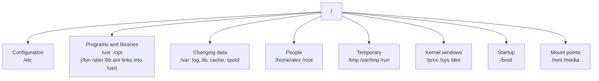
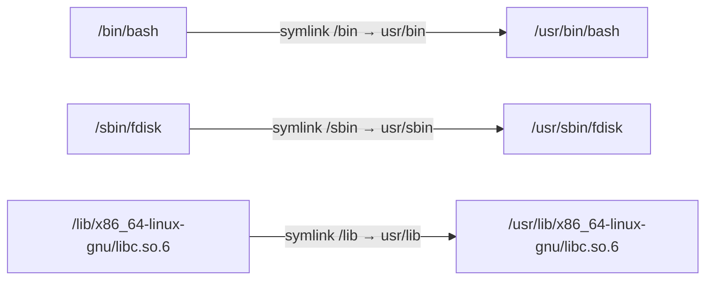

# The filesystem layout

> **Level 0 · Chapter 5** · ⏱️ ~30 min read · Prerequisites: [Your first commands](03-first-commands.md), [Getting help](04-getting-help.md)

Every Linux system arranges its files in the same standard way. This chapter walks through that layout directory by directory, explains the idea that "everything is a file", and leaves you able to say, on any Linux machine, where configuration, logs, programs, and personal files live.

## Why it matters

At 2 a.m. the monitoring system pages Alex: the reporting database server is "unhealthy". Alex logs in and has three questions. Is the disk full? Where are the database's logs? And where is the config file that someone changed yesterday?

A colleague who doesn't know the layout would run a search across the whole disk, which takes minutes and floods the screen with "Permission denied" errors. Alex knows the map instead:

- Logs live under `/var/log`, so `ls -lt /var/log/postgresql` shows the newest log at once.
- Configuration lives under `/etc`, so the Postgres config is in `/etc/postgresql/`.
- A service's data lives under `/var/lib`, so the database files are in `/var/lib/postgresql/`, which is exactly where the disk space went.

Ten minutes later Alex has the cause: a debug setting left on overnight filled the logs. The fix was easy. Knowing where to look was the hard part, and on Linux, where to look is standardised. The same map works on Mint, an Ubuntu cloud VM, a RHEL server, and inside most Docker containers.

## Concepts

### A standard map: the FHS

The **Filesystem Hierarchy Standard (FHS)** is a document, maintained by the Linux Foundation, that says which directories a Linux system should have and what belongs in each. Its current version, 3.0, dates from 2015. Distributions follow it closely, with small differences.

Because everyone follows the same map:

- Software can find its files on any distro.
- Administrators can move between systems without relearning where things are.
- Backups and disk layouts can be planned: "back up `/etc` and `/home`", "put `/var` on its own disk".

Two man pages on your system describe the layout: `man 7 hier` (the classic description) and `man 7 file-hierarchy` (systemd's modern version). You'll open them below.

### Everything is a file

A core Unix idea is that **everything is a file**. More precisely, almost everything the system offers is reachable through a path in the one directory tree, and you use it with the same basic operations: open, read, write, close.

| Kind | `ls -l` letter | Example | What reading it gives you |
|---|---|---|---|
| Regular file | `-` | `/etc/hostname` | The file's contents |
| Directory | `d` | `/etc` | A list of names (via `ls`) |
| Symbolic link | `l` | `/bin` | Redirects to another path |
| Character device | `c` | `/dev/null`, `/dev/tty` | A stream of bytes from a device |
| Block device | `b` | `/dev/sda`, `/dev/nvme0n1` | Raw blocks from a disk |
| Named pipe (FIFO) | `p` | Rare, created by programs | Data written by another process |
| Socket | `s` | `/run/systemd/notify` | Two-way communication between processes |

A **device file** represents hardware or a kernel feature. Writing to `/dev/null` throws data away; reading `/dev/urandom` gives random bytes; reading `/dev/nvme0n1` reads raw disk blocks.

Some directories don't exist on any disk at all. `/proc` and `/sys` are **virtual filesystems**: the kernel invents their contents on the fly whenever you read them. Reading `/proc/uptime` doesn't read a stored file; it asks the kernel "how long have you been running?" and gets the answer formatted as text.

The power of this design is that one small toolkit works on everything. The same `cat` that prints a config file can print your CPU details from `/proc/cpuinfo`. The same permissions that protect files protect devices. You'll see why it's built this way in [Devices, /proc, and /sys](../03-internals/05-devices-proc-sys.md).

### The big picture

Here's the whole map on one screen, grouped by purpose:



And the one-line summary of each top-level directory you'll see on Mint:

| Directory | Holds | Who writes there |
|---|---|---|
| `/` | The root of everything | Nobody directly |
| `/bin`, `/sbin`, `/lib`, `/lib64` | Links to their `/usr` equivalents | Nobody (they're links) |
| `/boot` | Kernel, initial RAM disk, bootloader files | Package manager |
| `/cdrom` | Leftover mount point from the installer | Nobody |
| `/dev` | Device files | Kernel and udev |
| `/etc` | System-wide configuration | Administrator, package manager |
| `/home` | Users' personal directories | Each user in their own |
| `/lost+found` | File fragments recovered by a disk check | Filesystem checker |
| `/media` | Auto-mounted removable media (USB sticks) | Desktop automounter |
| `/mnt` | Temporary manual mounts | Administrator |
| `/opt` | Optional, self-contained third-party software | Third-party installers |
| `/proc` | Virtual: processes and kernel info | Kernel |
| `/root` | The root user's home directory | root |
| `/run` | Runtime data since last boot (in memory) | Services |
| `/srv` | Data this machine serves to others | Administrator |
| `/swapfile` | A file used as swap space (Mint's default) | Kernel |
| `/sys` | Virtual: devices and drivers | Kernel |
| `/tmp` | Temporary files, emptied at boot | Everyone |
| `/usr` | Installed programs, libraries, docs | Package manager |
| `/var` | Data that changes: logs, databases, caches | Services, package manager |

The rest of this section walks through each one.

### /home and /root: personal files

**`/home`** holds one directory per regular user: `/home/alex`, `/home/sam`. Your home directory is the only place on the system you can freely create files, and it's where your documents, code, and data belong.

On Mint 22, home directories are created with permissions `rwxr-x---` (mode 750): you have full access, members of your group can look, and everyone else is shut out. Inside, Mint creates the familiar `Desktop`, `Documents`, `Downloads`, `Music`, `Pictures`, `Public`, `Templates`, and `Videos` folders at your first desktop login.

Many people put `/home` on its own partition (a separate section of the disk). You can then reinstall or upgrade the OS without touching personal files.

**`/root`** is the home directory of the **root** user, the administrator account. It's deliberately not under `/home`. If `/home` lives on a separate disk that fails to mount, root can still log in and fix things with a working home directory. Its permissions are `rwx------`, so normal users can't even list it.

### /etc: configuration

**`/etc`** holds **system-wide configuration**: the settings that apply to the whole machine and every user. Almost everything here is plain text, so you can read it with `cat` or `less` and edit it with a text editor (as root). Packages install default configs here, and administrators change them.

The name comes from "et cetera", because in early Unix it held miscellaneous files. Some people use the backronym "Editable Text Configuration", which describes it well.

A few files you'll meet throughout this handbook:

| Path | What it configures |
|---|---|
| `/etc/hostname` | The machine's name |
| `/etc/hosts` | Name-to-IP mappings checked before DNS |
| `/etc/os-release` | Distro identification (a link to `/usr/lib/os-release`) |
| `/etc/passwd`, `/etc/group`, `/etc/shadow` | User and group accounts ([next chapter](06-users-groups-sudo.md)) |
| `/etc/sudoers`, `/etc/sudoers.d/` | Who may use `sudo` |
| `/etc/fstab` | Which filesystems to mount at boot |
| `/etc/apt/` | Package sources and apt settings |
| `/etc/ssh/sshd_config` | The SSH server (if installed) |
| `/etc/systemd/` | Local overrides for systemd services |
| `/etc/bash.bashrc`, `/etc/profile` | System-wide shell startup |
| `/etc/skel/` | Template files copied into every new user's home |

Many programs use a **drop-in directory**, ending in `.d`, like `/etc/sudoers.d/`, `/etc/apt/sources.list.d/`, or `/etc/logrotate.d/`. Instead of everyone editing one big file, each package or admin drops a small file into the directory, and the program reads them all. That makes changes easy to add, remove, and track.

Third-party services usually follow the convention too: `/etc/postgresql/16/main/postgresql.conf`, `/etc/nginx/nginx.conf`, `/etc/docker/daemon.json`.

!!! tip "Back up /etc"
    `/etc` is small, but it holds hours of careful work. Before changing a config, copy it (`sudo cp file file.bak`, explained in Level 1). Back up all of `/etc` along with `/home` and you can rebuild most machines quickly.

### /var: data that changes

**`/var`** (variable) holds data that grows and changes while the system runs. Unlike `/usr`, which only changes when you install or upgrade software, `/var` changes every second. Disk-full emergencies almost always happen here.

| Path | Holds |
|---|---|
| `/var/log` | Log files: a written record of what the system and services did |
| `/var/lib` | Persistent state for programs: databases, package lists, container images |
| `/var/cache` | Data that can be re-created, kept to save time |
| `/var/tmp` | Temporary files that should survive a reboot |
| `/var/spool` | Queues of work waiting to be processed (print jobs, cron tables, outgoing mail) |
| `/var/mail` | Local users' mailboxes |
| `/var/backups` | Small automatic backups of key system files |
| `/var/www` | Web server content, by Debian/Ubuntu convention |
| `/var/run`, `/var/lock` | Old locations, now links into `/run` |

**`/var/log`** is where you go when something is wrong. Important files on Mint:

| Log | Records |
|---|---|
| `/var/log/syslog` | General system messages from most services |
| `/var/log/auth.log` | Logins, `sudo` use, SSH connections |
| `/var/log/kern.log` | Kernel messages (hardware, drivers) |
| `/var/log/dpkg.log` | Every package install, upgrade, and removal |
| `/var/log/apt/history.log` | Every `apt` command and what it changed |
| `/var/log/journal/` | systemd's binary journal, read with `journalctl` ([systemd and journalctl](../04-sysadmin/01-systemd-and-journalctl.md)) |
| `/var/log/<service>/` | Per-service logs, e.g. `/var/log/postgresql/` |

Old logs get **rotated**: renamed to `syslog.1`, then compressed to `syslog.2.gz`, and eventually deleted. A tool called `logrotate` does this on a schedule, configured in `/etc/logrotate.d/`.

**`/var/lib`** holds a program's state: the data it needs to keep between runs. The package manager's database of installed packages lives in `/var/lib/dpkg/`. PostgreSQL's databases live in `/var/lib/postgresql/`. Docker's images and containers live in `/var/lib/docker/`. This is precious data; don't delete things here.

**`/var/cache`** holds data that is expensive to recreate but safe to lose. `/var/cache/apt/archives/` keeps downloaded `.deb` package files, which can easily grow to gigabytes. `sudo apt clean` empties it safely.

!!! info "Why /var is often a separate partition"
    On servers, `/var` (or just `/var/log` or `/var/lib/docker`) often gets its own disk. Then a runaway log can fill `/var` without filling `/`, and the system keeps running well enough to let you log in and fix it.

### /usr: installed software

**`/usr`** holds the bulk of the installed software: programs, libraries, documentation, and shared data. On Mint, it's managed by the package manager. You read from it constantly, but you don't change it by hand. In theory, `/usr` could even be mounted read-only.

Despite appearances, the name doesn't mean "user". Historically it did hold users' home directories, but today the common backronym is "Unix System Resources".

| Path | Holds |
|---|---|
| `/usr/bin` | Nearly all commands: `ls`, `python3`, `git`, `grep` |
| `/usr/sbin` | System administration commands: `useradd`, `fdisk`, `sshd` |
| `/usr/lib` | Libraries (shared code that programs load), plus internal support files. Also kernel modules in `/usr/lib/modules` |
| `/usr/lib64` | 64-bit library location some programs expect (mostly the dynamic loader link) |
| `/usr/libexec` | Helper programs meant to be run by other programs, not by you |
| `/usr/include` | C header files for compiling software |
| `/usr/share` | Architecture-independent data: man pages, docs, icons, fonts, time zone data |
| `/usr/src` | Source code, such as kernel headers |
| `/usr/local` | Software installed by the administrator **outside** the package manager |

A **library** is a file of compiled code that many programs share, like `libc.so.6`, the C library almost every program uses. Libraries end in `.so` ("shared object"), the Linux equivalent of Windows `.dll` files.

**`/usr/local`** mirrors the structure of `/usr`: it has its own `bin`, `lib`, `share`, `etc`, and so on. The rule is simple: the package manager owns `/usr` and never touches `/usr/local`, and the administrator owns `/usr/local`. Software you compile yourself, or install with a script from a vendor, goes there. Because `/usr/local/bin` comes before `/usr/bin` in PATH, a hand-installed version wins over the packaged one.

!!! info "Mint uses /usr/local/bin too"
    Mint places a few of its own wrapper commands in `/usr/local/bin`, including a friendly `apt` wrapper that adds colour and extra subcommands. When you run `apt` on Mint, `type apt` shows `/usr/local/bin/apt`, not `/usr/bin/apt`. It passes your request to the real `apt` underneath.

### /bin, /sbin, /lib: merged into /usr

Look at the top level with `ls -l /` and you'll see that `/bin`, `/sbin`, `/lib`, and `/lib64` are symbolic links:

```text
lrwxrwxrwx   1 root root    7 Jun  9 19:01 bin -> usr/bin
lrwxrwxrwx   1 root root    7 Jun  9 19:01 lib -> usr/lib
lrwxrwxrwx   1 root root    9 Jun  9 19:01 lib64 -> usr/lib64
lrwxrwxrwx   1 root root    8 Jun  9 19:01 sbin -> usr/sbin
```

The history explains why they exist at all. In the early 1970s, the Unix developers' first disk filled up. They added a second disk, mounted it at `/usr`, and moved some programs there. The essential programs needed to boot and repair the system stayed on the first disk in `/bin` and `/sbin`, with their libraries in `/lib`, because `/usr` might not be mounted yet. That split, born from a full disk, lasted fifty years.

Modern systems mount everything early, so the split no longer serves a purpose and causes confusion about where a program lives. Most distros have now done the **merged /usr** (or **usrmerge**): all programs move into `/usr/bin`, `/usr/sbin`, and `/usr/lib`, and the old top-level names become links so that old scripts using `/bin/bash` keep working. Ubuntu 24.04, and therefore Mint 22, is fully merged. The empty `bin.usr-is-merged`, `lib.usr-is-merged`, and `sbin.usr-is-merged` directories you'll see at the top level are just markers that record the merge has happened.



The practical upshot: `/bin/ls` and `/usr/bin/ls` are the same file. Shebang lines like `#!/bin/bash` (Level 2) work everywhere.

The difference between `bin` and `sbin` survives inside `/usr`. `sbin` ("system binaries") holds tools meant mainly for administrators, like `fdisk` and `useradd`. Normal users can often run them, but most need root to do anything useful.

### /opt and /srv

**`/opt`** (optional) is for add-on software that ships as one self-contained bundle rather than being split across `/usr/bin`, `/usr/lib`, and `/usr/share`. Each product gets its own subdirectory: Google Chrome installs into `/opt/google/chrome/`, and many commercial tools and vendor installers use `/opt/<vendor>/`. A link or script is usually placed in `/usr/bin` so the command is in PATH.

**`/srv`** (serve) is meant for data this machine serves to others, like websites or FTP files. The FHS suggests it, but Debian and Ubuntu packages don't use it by default (web servers default to `/var/www`), so it's usually empty. You may choose to use it for your own services.

### /tmp and /var/tmp: temporary files

**`/tmp`** is a scratch space for temporary files. Any user can create files there. Programs use it for short-lived data, such as a download in progress or an intermediate sort file.

Two rules keep it safe and tidy:

- It has the **sticky bit** set (the `t` at the end of `drwxrwxrwt`). Everyone may create files, but you can only delete or rename your **own** files. You'll learn this in [Permissions](../01-command-line/03-permissions.md).
- It's **emptied at every boot** on Mint, and files older than 30 days are also cleaned up periodically. Never keep anything there you want to keep.

**`/var/tmp`** is also temporary and world-writable, but it **survives reboots**. Use it for temporary data that must outlive a restart, like a long job's checkpoint.

!!! warning "Common mistake: /tmp as storage"
    Downloading a dataset to `/tmp`, processing it over a weekend, and rebooting on Monday deletes it. Put work-in-progress in your home directory or a project directory, and use `/tmp` only for things you'll throw away today.

### /dev: devices

**`/dev`** contains **device files**, the "everything is a file" interface to hardware and kernel features. The directory lives in memory and is populated at boot by the kernel and a helper called **udev**, which creates and removes entries as devices are plugged in.

| Device | What it is |
|---|---|
| `/dev/null` | The "black hole": writes vanish, reads return nothing |
| `/dev/zero` | Reads return endless zero bytes |
| `/dev/random`, `/dev/urandom` | Reads return random bytes from the kernel |
| `/dev/sda`, `/dev/sdb` | SATA or USB disks; partitions are `/dev/sda1`, `/dev/sda2` |
| `/dev/nvme0n1` | The first NVMe SSD; partitions are `/dev/nvme0n1p1`, `/dev/nvme0n1p2` |
| `/dev/tty1` ... | Virtual consoles |
| `/dev/pts/0` ... | Pseudo-terminals for terminal windows and SSH sessions |
| `/dev/shm` | Shared memory area for processes |

There are two kinds of device. A **character device** (`c`) delivers a stream of bytes, like a keyboard, a terminal, or `/dev/null`. A **block device** (`b`) delivers data in fixed-size blocks that can be read in any order, like a disk.

!!! danger "Device files for disks are the disk"
    `/dev/sda` and `/dev/nvme0n1` are the raw disk. Writing to them (with tools like `dd` you'll meet later) overwrites partitions and data with no undo. Normal users can't write to them, which is a good thing. Never point a write command at a disk device outside your VM.

### /proc and /sys: windows into the kernel

**`/proc`** is a virtual filesystem the kernel creates in memory. It has two kinds of content:

- One numbered directory per running process: `/proc/1` for the first process (systemd), `/proc/4127` for your shell, and so on. Inside are files describing the process: its command line, its memory use, its current directory, and its open files. `/proc/self` always points to whichever process is reading it.
- Files describing the kernel and hardware: `/proc/cpuinfo` (CPU details), `/proc/meminfo` (memory), `/proc/uptime`, `/proc/loadavg`, `/proc/version`, and `/proc/sys/`, which holds tunable kernel settings.

Tools like `ps`, `top`, and `free` mostly just read and format files from `/proc`.

**`/sys`** (sysfs) is a newer, more organised virtual filesystem that describes devices, drivers, and kernel subsystems. For example, `/sys/class/net/` has one entry per network interface, and `/sys/block/` has one per disk. Some files there can be written to change hardware settings, which needs root.

Neither takes any disk space. Their file sizes often show as 0, because the content is generated only when you read it. Both get a full chapter in [Devices, /proc, and /sys](../03-internals/05-devices-proc-sys.md).

### /boot: starting up

**`/boot`** holds the files needed to start the system before the main filesystem is ready:

| File | Purpose |
|---|---|
| `vmlinuz-6.14.0-37-generic` | The compressed kernel itself |
| `initrd.img-6.14.0-37-generic` | The **initial RAM disk**: a tiny temporary filesystem with the drivers needed to find and mount the real root filesystem |
| `config-...` | The options the kernel was compiled with |
| `System.map-...` | A table of kernel symbol addresses, used for debugging |
| `grub/` | The GRUB bootloader's configuration and modules |
| `efi/` | Mount point for the EFI System Partition on UEFI machines |

Several kernel versions are kept so you can boot an older one if an update goes wrong. `vmlinuz` and `initrd.img` without a version are links to the newest. You'll trace the full boot sequence in [The boot process](../03-internals/01-boot-process.md).

!!! danger "⚠️ VM only"
    Run any experiments that change files in `/boot` in your throwaway VM, never on your main machine. Deleting or editing the wrong file there leaves the system unable to boot, and the fix needs a rescue USB.

### /mnt and /media: mount points

Remember, extra filesystems are attached to the tree at a **mount point**:

- **`/media`** is used by the desktop to mount removable media automatically. Plug in a USB stick labelled `DATA` on Mint and it appears at `/media/alex/DATA`.
- **`/mnt`** is a traditional empty spot for an administrator to mount something by hand, temporarily, such as a second disk during a repair.

### /run: runtime state

**`/run`** holds data describing the system **since the last boot**: **PID files** (files containing a running service's process ID), **sockets** that services listen on, and lock files. It's a **tmpfs**, a filesystem that lives in RAM, so it's empty at every boot by design.

Each logged-in user gets a private area, `/run/user/1000` (named after the user ID), used by desktop programs for sockets and temporary runtime files. `/var/run` and `/var/lock` are links into `/run` for compatibility.

### Other things you'll see at the top

- **`/lost+found`** exists on every ext4 filesystem. If a disk check (`fsck`) finds pieces of files with no name after a crash, it puts them here. Normally empty, and only root can look.
- **`/swapfile`** is a file the kernel uses as **swap**: overflow space on disk for when RAM fills up. Explained in [Memory](../03-internals/03-memory.md).
- **`/cdrom`** is a leftover mount point from the installer, usually empty.
- **`/snap`** appears only if Snap packages are in use. Mint doesn't use Snap by default.

### Hidden dotfiles: personal configuration

System-wide configuration lives in `/etc`. **Per-user** configuration lives in your home directory, in hidden files and directories whose names start with a dot, called **dotfiles**. They're hidden only to keep `ls` tidy; they aren't secret or protected.

Classic dotfiles sit directly in your home:

| Dotfile | Used by |
|---|---|
| `~/.bashrc` | Bash, for every interactive shell: aliases, prompt, functions |
| `~/.profile` | Your login session: environment variables like PATH |
| `~/.bash_history` | Bash's saved command history |
| `~/.bash_logout` | Commands bash runs when a login shell exits |
| `~/.ssh/` | SSH keys and client settings ([SSH](../04-sysadmin/05-ssh.md)) |
| `~/.gitconfig` | Your Git name, email, and settings |

Newer programs follow the **XDG Base Directory** convention, which sorts per-user files into a few standard hidden directories instead of cluttering your home:

| Directory | Purpose | Examples |
|---|---|---|
| `~/.config/` | Settings | `~/.config/Code/`, `~/.config/pip/pip.conf` |
| `~/.local/share/` | Data the app creates and keeps | Desktop app data, `~/.local/share/Trash/` |
| `~/.local/state/` | State like logs and history | Some apps' history files |
| `~/.cache/` | Re-creatable caches; safe to delete | `~/.cache/pip/`, browser caches |
| `~/.local/bin/` | Your personal programs, added to PATH | Tools installed with `pip install --user` or `pipx` |

The pattern mirrors the system layout: `~/.config` is your `/etc`, `~/.local/share` is your `/usr/share` and `/var/lib`, `~/.cache` is your `/var/cache`, and `~/.local/bin` is your `/usr/local/bin`.

When a new user is created, the starting dotfiles are copied from **`/etc/skel/`** (skeleton). That's why every new account gets the same `.bashrc`.

!!! tip "System default, personal override"
    A common pattern: a program reads its system-wide config from `/etc` first, then the user's dotfile, and the user's settings win. Bash reads `/etc/bash.bashrc`, then `~/.bashrc`. Git reads `/etc/gitconfig`, then `~/.gitconfig`. When a setting seems ignored, check both places.

### The cheat sheet: where things live

This is the table the capstone asks you to know by heart:

| You're looking for | System-wide | Per user |
|---|---|---|
| Configuration | `/etc` (e.g. `/etc/ssh/sshd_config`) | Dotfiles and `~/.config/` |
| Logs | `/var/log` (`syslog`, `auth.log`, per-service dirs), plus the journal | Some apps under `~/.local/state/` or `~/.cache/` |
| Programs from packages | `/usr/bin`, `/usr/sbin` | |
| Programs installed by hand | `/usr/local/bin`, `/opt/<product>` | `~/.local/bin` |
| Libraries | `/usr/lib` | |
| Documentation | `/usr/share/man`, `/usr/share/doc`, `/usr/share/info` | |
| Service data and databases | `/var/lib/<service>` | |
| Caches | `/var/cache` | `~/.cache` |
| Personal files | | `/home/alex` (root: `/root`) |
| Temporary files | `/tmp` (cleared at boot), `/var/tmp` (kept) | |
| Runtime state | `/run` | `/run/user/1000` |
| Devices | `/dev` | |
| Kernel and process info | `/proc`, `/sys` | |
| Boot files | `/boot` | |
| Removable media | `/media/alex/<label>` | |

## Commands and examples

### The top level

```bash
ls -l /
```

```text
total 2097232
lrwxrwxrwx   1 root root          7 Jun  9 19:01 bin -> usr/bin
drwxr-xr-x   2 root root       4096 Feb 26  2024 bin.usr-is-merged
drwxr-xr-x   4 root root       4096 Sep 25 20:29 boot
drwxr-xr-x   2 root root       4096 Jun  9 19:04 cdrom
drwxr-xr-x  20 root root       4580 Oct  2 09:35 dev
drwxr-xr-x 141 root root      12288 Oct  2 10:25 etc
drwxr-xr-x   3 root root       4096 Jun  9 19:04 home
lrwxrwxrwx   1 root root          7 Jun  9 19:01 lib -> usr/lib
lrwxrwxrwx   1 root root          9 Jun  9 19:01 lib64 -> usr/lib64
drwxr-xr-x   2 root root       4096 Apr  8  2024 lib.usr-is-merged
drwx------   2 root root      16384 Jun  9 19:00 lost+found
drwxr-xr-x   3 root root       4096 Jun  9 20:47 media
drwxr-xr-x   2 root root       4096 Apr 22  2024 mnt
drwxr-xr-x   3 root root       4096 Aug 15 21:27 opt
dr-xr-xr-x 412 root root          0 Oct  2 09:35 proc
drwx------   4 root root       4096 Jun 10 13:29 root
drwxr-xr-x  36 root root       1060 Oct  2 10:25 run
lrwxrwxrwx   1 root root          8 Jun  9 19:01 sbin -> usr/sbin
drwxr-xr-x   2 root root       4096 Mar 31  2024 sbin.usr-is-merged
drwxr-xr-x   2 root root       4096 Apr 22  2024 srv
-rw-------   1 root root 2147483648 Jun  9 19:01 swapfile
dr-xr-xr-x  13 root root          0 Oct  2 09:35 sys
drwxrwxrwt  21 root root       4096 Oct  2 10:37 tmp
drwxr-xr-x  12 root root       4096 Apr 22  2024 usr
drwxr-xr-x  12 root root       4096 Jun 10 11:40 var
```

What this tells you, beyond the names:

- `bin`, `lib`, `lib64`, and `sbin` start with `l` and show `-> usr/...`: they're the merged-usr links.
- `proc` and `sys` have size 0 and `dr-xr-xr-x` permissions: virtual and read-only at the top level.
- `root` and `lost+found` are `drwx------`: only root may enter.
- `tmp` is `drwxrwxrwt`: everyone can write, with the sticky bit `t`.
- `swapfile` is a 2 GiB regular file, readable only by root.
- `dev` and `run` have small, odd sizes because they live in memory (tmpfs), not on disk.

### Read the official map

```bash
man 7 hier
```

```text
HIER(7)                Miscellaneous Information Manual               HIER(7)

NAME
       hier - description of the filesystem hierarchy

DESCRIPTION
       A typical Linux system has, among others, the following directories:

       /      This is the root directory.  This is where the whole tree starts.

       /bin   This  directory  contains executable programs which are needed in
              single user mode and to bring the system up or repair it.
...
```

`man 7 file-hierarchy` is systemd's more modern take, and it describes per-user directories like `~/.config` and `~/.local` too. Note that `hier(7)` still describes the pre-merge purpose of `/bin`; on Mint, that's history.

### Explore /etc

How much configuration is there?

```bash
ls /etc | wc -l
```

```text
248
```

Look at some single-value files:

```bash
cat /etc/hostname
cat /etc/hosts
```

```text
mint
127.0.0.1	localhost
127.0.1.1	mint

# The following lines are desirable for IPv6 capable hosts
::1     ip6-localhost ip6-loopback
fe00::0 ip6-localnet
ff00::0 ip6-mcastprefix
ff02::1 ip6-allnodes
ff02::2 ip6-allrouters
```

`/etc/hosts` maps names to IP addresses. `127.0.0.1` is the **loopback** address, meaning "this machine", which you'll meet in [Networking basics](../04-sysadmin/03-networking-basics.md).

List the drop-in directories:

```bash
ls -d /etc/*.d | head -12
```

```text
/etc/apparmor.d
/etc/bash_completion.d
/etc/binfmt.d
/etc/cron.d
/etc/depmod.d
/etc/environment.d
/etc/grub.d
/etc/init.d
/etc/ld.so.conf.d
/etc/logrotate.d
/etc/modprobe.d
/etc/modules-load.d
```

`-d` lists the directories themselves rather than their contents. `/etc/*.d` is a pattern matching every name in `/etc` ending in `.d`.

The `file` command identifies what kind of data a file holds. Use it to confirm configs are plain text:

```bash
file /etc/passwd /etc/hosts /usr/bin/ls
```

```text
/etc/passwd: ASCII text
/etc/hosts:  ASCII text
/usr/bin/ls: ELF 64-bit LSB pie executable, x86-64, version 1 (SYSV), dynamically linked, interpreter /lib64/ld-linux-x86-64.so.2, ..., for GNU/Linux 3.2.0, stripped
```

Config files are text; programs are **ELF** binaries, the executable format Linux uses.

### Explore /var

```bash
ls /var
```

```text
backups  cache  lib  local  lock  log  mail  opt  run  spool  tmp
```

The logs, newest first:

```bash
ls -lt /var/log | head -8
```

```text
total 24584
-rw-r-----  1 syslog adm     1891754 Oct  2 10:44 syslog
-rw-r-----  1 syslog adm       43659 Oct  2 10:44 auth.log
-rw-r--r--  1 root   root      20194 Oct  2 10:44 mintupdate.log
-rw-r-----  1 syslog adm      587681 Oct  2 10:43 kern.log
drwxr-xr-x  2 root   root       4096 Oct  2 10:25 apt
-rw-r--r--  1 root   root     312560 Oct  2 10:25 dpkg.log
drwxr-xr-x  2 root   lp         4096 Oct  2 09:36 cups
```

Notice the permissions. `syslog`, `auth.log`, and `kern.log` are `rw-r-----` with group `adm`: only root and members of the `adm` group can read them. The first user created on Mint is in `adm`, so you probably can. `dpkg.log` is readable by everyone.

Read the end of the package log. `tail` shows the last lines of a file (10 by default; `-n 3` asks for 3):

```bash
tail -n 3 /var/log/dpkg.log
```

```text
2026-10-02 10:25:20 trigproc mailcap:all 3.70+nmu1ubuntu1.24.04.1 <none>
2026-10-02 10:25:20 status half-configured mailcap:all 3.70+nmu1ubuntu1.24.04.1
2026-10-02 10:25:20 status installed mailcap:all 3.70+nmu1ubuntu1.24.04.1
```

Each line is a timestamp, an action, a package, and a version. This is how you answer "what changed on this machine yesterday?"

The `apt` history log is easier to read:

```bash
tail -n 4 /var/log/apt/history.log
```

```text
Start-Date: 2026-10-02  10:19:58
Commandline: apt-get install --only-upgrade firefox
Upgrade: firefox:amd64 (156.0.1+linuxmint1, 157.0+linuxmint1)
End-Date: 2026-10-02  10:20:31
```

Program state in `/var/lib`:

```bash
ls /var/lib | head -15
```

```text
AccountsService
alsa
app-info
apt
aspell
avahi-autoipd
bluetooth
boltd
colord
command-not-found
dbus
dhcp
dpkg
flatpak
fwupd
```

Measure the package cache with `du` (disk usage), using `-s` for a single summary and `-h` for human-readable sizes. The `2>/dev/null` hides "Permission denied" messages for the one subdirectory you can't read; you'll learn that syntax in Level 1:

```bash
du -sh /var/cache/apt/archives 2>/dev/null
```

```text
412M	/var/cache/apt/archives
```

Those are downloaded package files kept after installation. They're safe to remove with `sudo apt clean`.

### Explore /usr

```bash
ls /usr
ls /usr/bin | wc -l
ls /usr/local/bin
```

```text
bin  games  include  lib  lib64  libexec  local  sbin  share  src
1847
apt  gnome-help  highlight-mint  search
```

About 1,800 programs in `/usr/bin` came from packages. The handful in `/usr/local/bin` are Mint's own wrappers. On a typical Ubuntu server, `/usr/local/bin` is empty until you install something by hand.

See which wins when you type `apt`:

```bash
type -a apt
```

```text
apt is /usr/local/bin/apt
apt is /usr/bin/apt
apt is /bin/apt
```

Mint's wrapper is found first because `/usr/local/bin` is earlier in PATH.

Ask the package manager what files a package installed, and where. `dpkg -L` lists a package's files; it only reads the package database, so it's safe:

```bash
dpkg -L bash | head -16
```

```text
/.
/etc
/etc/bash.bashrc
/etc/skel
/etc/skel/.bash_logout
/etc/skel/.bashrc
/etc/skel/.profile
/usr
/usr/bin
/usr/bin/bash
/usr/bin/bashbug
/usr/bin/clear_console
/usr/share
/usr/share/debianutils
/usr/share/debianutils/shells.d
/usr/share/debianutils/shells.d/bash
```

One package, spread across the standard locations: system config in `/etc`, a template for new users in `/etc/skel`, the program in `/usr/bin`, and data and docs in `/usr/share`. This is the FHS in action.

### Prove /bin is /usr/bin

```bash
ls -ld /bin /sbin /lib
ls -i /bin/ls /usr/bin/ls
readlink -f /bin/bash
```

```text
lrwxrwxrwx 1 root root 7 Jun  9 19:01 /bin -> usr/bin
lrwxrwxrwx 1 root root 7 Jun  9 19:01 /lib -> usr/lib
lrwxrwxrwx 1 root root 8 Jun  9 19:01 /sbin -> usr/sbin
4588823 /bin/ls  4588823 /usr/bin/ls
/usr/bin/bash
```

- `ls -ld` shows the links themselves.
- `ls -i` shows the same inode number for both paths: it's one file.
- `readlink -f` follows every link and prints the final real path.

### Look at /tmp and /var/tmp

```bash
ls -ld /tmp /var/tmp
```

```text
drwxrwxrwt 21 root root 4096 Oct  2 10:37 /tmp
drwxrwxrwt 12 root root 4096 Oct  2 10:38 /var/tmp
```

Both are world-writable with the sticky bit. The cleanup rule that empties `/tmp` at boot is itself a config file:

```bash
grep -v '^#' /usr/lib/tmpfiles.d/tmp.conf
```

```text
D /tmp 1777 root root 30d
```

`grep -v '^#'` hides comment lines. `D` means "create this directory, and empty it at boot". `1777` is the permission mode including the sticky bit. `30d` means files unused for 30 days are also removed.

### Look at /dev

```bash
ls -l /dev/null /dev/zero /dev/urandom /dev/nvme0n1 /dev/tty
```

```text
crw-rw-rw- 1 root root  1, 3 Oct  2 09:35 /dev/null
brw-rw---- 1 root disk 259, 0 Oct  2 09:35 /dev/nvme0n1
crw-rw-rw- 1 root tty   5, 0 Oct  2 09:35 /dev/tty
crw-rw-rw- 1 root root  1, 9 Oct  2 09:35 /dev/urandom
crw-rw-rw- 1 root root  1, 5 Oct  2 09:35 /dev/zero
```

- `c` and `b` in the first column mark character and block devices.
- Where a file size would be, devices show two numbers, like `1, 3`. These are the **major** and **minor** device numbers: which driver handles it, and which device of that driver.
- `/dev/nvme0n1` belongs to group `disk` with `rw-rw----`: normal users can't read or write the raw disk. If your machine uses SATA, look for `/dev/sda` instead.

Use `/dev/null` to throw output away:

```bash
echo "this disappears" > /dev/null
```

There's no output. The `>` sends output into a file, and this "file" discards everything.

List the block devices in a readable tree with `lsblk`:

```bash
lsblk
```

```text
NAME        MAJ:MIN RM   SIZE RO TYPE MOUNTPOINTS
nvme0n1     259:0    0 476.9G  0 disk
├─nvme0n1p1 259:1    0   512M  0 part /boot/efi
└─nvme0n1p2 259:2    0 476.4G  0 part /
```

One disk with two partitions: a small EFI partition mounted at `/boot/efi`, and the main partition mounted at `/`.

### Look through /proc

```bash
cat /proc/uptime
cat /proc/loadavg
head -3 /proc/meminfo
grep -m1 'model name' /proc/cpuinfo
```

```text
3788.17 51860.36
0.82 0.97 0.71 2/1123 8462
MemTotal:       16261320 kB
MemFree:         8121472 kB
MemAvailable:   12309844 kB
model name	: Intel(R) Core(TM) i7-10510U CPU @ 1.80GHz
```

- `/proc/uptime`: seconds since boot (about 63 minutes here), then total idle time summed across all CPU cores.
- `/proc/loadavg`: system load averaged over 1, 5, and 15 minutes; running/total processes; the most recent process ID.
- `/proc/meminfo`: memory figures, in KiB. Level 3 explains why "free" and "available" differ.
- `/proc/cpuinfo`: one block per CPU core; `grep -m1` stops after the first match.

Look at your own shell's process directory. `$$` expands to the shell's process ID:

```bash
echo $$
ls -l /proc/$$/cwd /proc/$$/exe
```

```text
4127
lrwxrwxrwx 1 alex alex 0 Oct  2 10:54 /proc/4127/cwd -> /home/alex
lrwxrwxrwx 1 alex alex 0 Oct  2 10:54 /proc/4127/exe -> /usr/bin/bash
```

The kernel shows your shell's current working directory and the program it's running as symlinks. This is exactly how tools like `pwdx` and `ps` find out what other processes are doing.

### Look through /sys

```bash
ls /sys
ls /sys/class/net
cat /sys/class/net/lo/operstate
```

```text
block  bus  class  dev  devices  firmware  fs  hypervisor  kernel  module  power
enp0s31f6  lo  wlp2s0
unknown
```

- `/sys/class/net` lists network interfaces: `lo` is loopback, `enp0s31f6` is a wired card, `wlp2s0` is Wi-Fi. Names depend on the hardware.
- `operstate` reports the link state. Loopback reports `unknown` because it has no physical link; a connected card shows `up`.

On a laptop, the battery is there too:

```bash
cat /sys/class/power_supply/BAT0/capacity
```

```text
87
```

That's the charge percentage, read straight from the kernel's battery driver. Desktop machines have no `BAT0`, so you'd get "No such file or directory".

### Look at /boot

```bash
ls /boot
```

```text
config-6.14.0-36-generic      initrd.img-6.14.0-37-generic  vmlinuz
config-6.14.0-37-generic      initrd.img.old                vmlinuz-6.14.0-36-generic
efi                           System.map-6.14.0-36-generic  vmlinuz-6.14.0-37-generic
grub                          System.map-6.14.0-37-generic  vmlinuz.old
initrd.img                    initrd.img-6.14.0-36-generic
```

Two kernel versions are installed. `vmlinuz` and `initrd.img` link to the newest; the `.old` links point to the previous one, kept as a fallback.

### Look at /run

```bash
ls -ld /run /run/user/1000
ls -l /var/run
```

```text
drwxr-xr-x 36 root root 1060 Oct  2 10:25 /run
drwx------ 19 alex alex  680 Oct  2 10:27 /run/user/1000
lrwxrwxrwx  1 root root    4 Jun  9 19:03 /var/run -> /run
```

`/run/user/1000` belongs to you and is private. `/var/run` is a compatibility link.

### Your dotfiles

```bash
ls -A ~
ls ~/.config | head
```

```text
.bash_history  .cache    Documents  Music     .profile  Videos
.bash_logout   .config   Downloads  Pictures  Public
.bashrc        Desktop   .local     practice  Templates
autostart
cinnamon
dconf
gtk-3.0
nemo
...
```

Compare with the skeleton every new user starts from:

```bash
ls -A /etc/skel
```

```text
.bash_logout  .bashrc  .config  .gtkrc-2.0  .gtkrc-xfce  .local  .profile
```

Your `.bashrc` began life as a copy of `/etc/skel/.bashrc`.

## Exercises

### Exercise 1: Sort the paths (easy)

Without running anything, say what kind of thing each path holds: configuration, log, program, library, documentation, service data, cache, personal file, temporary, runtime, device, or kernel info.

1. `/etc/ssh/sshd_config`
2. `/var/log/auth.log`
3. `/usr/bin/python3`
4. `/home/alex/Documents/q3-report.pdf`
5. `/var/lib/postgresql/16/main/`
6. `/usr/share/man/man1/ls.1.gz`
7. `/tmp/tmpx8k2qz.csv`
8. `/proc/meminfo`
9. `/dev/nvme0n1p2`
10. `/home/alex/.cache/pip/`
11. `/usr/lib/x86_64-linux-gnu/libc.so.6`
12. `/run/user/1000`

??? success "Solution"

    1. Configuration: the SSH server's settings, system-wide.
    2. Log: logins and `sudo` use.
    3. Program from a package.
    4. Personal file.
    5. Service data: PostgreSQL's database files. Never delete casually.
    6. Documentation: the compressed `ls(1)` man page.
    7. Temporary: gone after the next reboot.
    8. Kernel info: virtual file, generated on read.
    9. Device: the second partition on the first NVMe disk.
    10. Cache, per user: pip's download cache. Safe to delete; pip re-downloads.
    11. Library: the GNU C library used by almost every program.
    12. Runtime: your private runtime directory, cleared at reboot.

### Exercise 2: Follow the links (easy)

Prove, using three different commands, that `/sbin/ip` and `/usr/sbin/ip` are the same file. Then explain in one sentence why `/sbin` exists at all on Mint.

??? success "Solution"

    ```bash
    ls -ld /sbin
    ls -i /sbin/ip /usr/sbin/ip
    readlink -f /sbin/ip
    ```

    ```text
    lrwxrwxrwx 1 root root 8 Jun  9 19:01 /sbin -> usr/sbin
    4590012 /sbin/ip  4590012 /usr/sbin/ip
    /usr/sbin/ip
    ```

    `/sbin` is a symlink to `usr/sbin`, both paths have the same inode number, and `readlink -f` resolves the path to `/usr/sbin/ip`. `/sbin` exists only as a compatibility link after the merged-/usr change, so scripts and documentation that use old paths like `/sbin/ip` keep working.

### Exercise 3: Ask the kernel (medium)

Using only `cat`, `head`, `grep`, and `ls` on files in `/proc` and `/sys`, find: your kernel version, your CPU model, how many CPU cores the kernel sees, your total RAM in KiB, how long the machine has been up (in seconds), and the names of your network interfaces.

??? success "Solution"

    ```bash
    cat /proc/version
    grep -m1 'model name' /proc/cpuinfo
    grep -c '^processor' /proc/cpuinfo
    grep MemTotal /proc/meminfo
    cat /proc/uptime
    ls /sys/class/net
    ```

    ```text
    Linux version 6.14.0-37-generic (buildd@lcy02-amd64-034) ...
    model name	: Intel(R) Core(TM) i7-10510U CPU @ 1.80GHz
    8
    MemTotal:       16261320 kB
    3788.17 51860.36
    enp0s31f6  lo  wlp2s0
    ```

    `grep -c '^processor'` counts lines starting with `processor`, one per logical CPU. The `nproc` command gives the same number. The first number in `/proc/uptime` is seconds since boot; divide by 3600 for hours. Every answer came from a virtual file, with no special tools needed: that's "everything is a file" in practice.

### Exercise 4: Where does bash live? (medium)

Find every place on the system that belongs to bash: the program, the system-wide config, your personal config, the template for new users, the man page, the package documentation, and the license. Use `type`, `man -w`, `ls`, and `dpkg -L`.

??? success "Solution"

    ```bash
    type -a bash
    ls -l /etc/bash.bashrc ~/.bashrc /etc/skel/.bashrc
    man -w bash
    ls /usr/share/doc/bash
    dpkg -L bash | grep -E 'copyright|man1/bash'
    ```

    ```text
    bash is /usr/bin/bash
    bash is /bin/bash
    -rw-r--r-- 1 root root 2319 Mar 31  2024 /etc/bash.bashrc
    -rw-r--r-- 1 root root 3771 Mar 31  2024 /etc/skel/.bashrc
    -rw-r--r-- 1 alex alex 3771 Jun  9 19:04 /home/alex/.bashrc
    /usr/share/man/man1/bash.1.gz
    changelog.Debian.gz  COMPAT.gz  copyright  INTRO.gz  NEWS.gz  POSIX.gz  RBASH  ...
    /usr/share/doc/bash/copyright
    /usr/share/man/man1/bash.1.gz
    ```

    | What | Where | FHS area |
    |---|---|---|
    | Program | `/usr/bin/bash` (also reachable as `/bin/bash`) | `/usr/bin` |
    | System-wide config | `/etc/bash.bashrc` | `/etc` |
    | Personal config | `~/.bashrc` | Dotfile in home |
    | Template for new users | `/etc/skel/.bashrc` | `/etc/skel` |
    | Man page | `/usr/share/man/man1/bash.1.gz` | `/usr/share` |
    | Docs and license | `/usr/share/doc/bash/` | `/usr/share/doc` |

    `grep -E` with `|` matches either pattern; you'll learn it in Level 1.

### Exercise 5: Log detective (hard)

1. List the files in `/var/log` that you **cannot** read as your normal user, and explain why for one of them.
2. Find out whether you're in the `adm` group, and what that means for `syslog`.
3. Using `/var/log/apt/history.log`, find the date and command of the most recent `apt` run.
4. Find the five largest entries directly inside `/var/log`.

??? success "Solution"

    1. Look for files without read permission for "others" and a group you're not in:

        ```bash
        ls -l /var/log | grep -v '^d'
        ```

        ```text
        total 24128
        -rw-r--r--  1 root   root      1004 Oct  2 10:24 alternatives.log
        ...
        -rw-r-----  1 syslog adm      43867 Oct  2 10:51 auth.log
        ...
        -rw-------  1 root   root     50528 Oct  2 09:35 boot.log
        ...
        -rw-rw----  1 root   utmp         0 Sep 27 09:37 btmp
        ...
        -rw-r-----  1 syslog adm    1891754 Oct  2 10:44 syslog
        ...
        ```

        `grep -v '^d'` hides directories. Look at the permission columns. Files ending in `r--` (like `alternatives.log`) are readable by everyone. `boot.log` is `rw-------`: root only. `btmp`, the record of failed login attempts, is `rw-rw----` for root and the `utmp` group, so a normal user can't read it; it could reveal passwords that people accidentally typed into the username field. Try `cat /var/log/btmp` and you'll get `Permission denied`.

    2. Check your groups:

        ```bash
        groups
        ```

        ```text
        alex adm cdrom sudo dip plugdev users lpadmin sambashare
        ```

        `adm` is there, so you can read `syslog`, `auth.log`, and `kern.log`, which are group-readable by `adm`. The `adm` group exists exactly for this: letting trusted users read system logs without full root power.

    3. The last block in the history log is the most recent:

        ```bash
        tail -n 5 /var/log/apt/history.log
        ```

        ```text

        Start-Date: 2026-10-02  10:19:58
        Commandline: apt-get install --only-upgrade firefox
        Upgrade: firefox:amd64 (156.0.1+linuxmint1, 157.0+linuxmint1)
        End-Date: 2026-10-02  10:20:31
        ```

    4. Largest first, human sizes:

        ```bash
        ls -lhS /var/log | head -6
        ```

        ```text
        total 24M
        -rw-r-----  1 syslog adm   13M Sep 27 09:37 syslog.1
        -rw-r-----  1 syslog adm  3.6M Sep 27 09:37 kern.log.1
        -rw-r-----  1 syslog adm  1.9M Oct  2 10:44 syslog
        -rw-r-----  1 syslog adm  785K Aug 17 20:15 syslog.3.gz
        -rw-r-----  1 syslog adm  678K Aug  2 17:02 syslog.4.gz
        ```

        `ls -S` doesn't look inside directories. The journal in `/var/log/journal` is often the biggest consumer, which you'd measure with `du -sh /var/log/journal` or `journalctl --disk-usage` (Level 4).

## Check yourself

1. What is the FHS, and why does it matter to you?

    ??? note "Answer"

        The Filesystem Hierarchy Standard defines which directories a Linux system has and what goes in each. Because distros follow it, you can find configs, logs, and programs in the same places on Mint, Ubuntu servers, RHEL, and most containers.

2. What does "everything is a file" mean? Give two examples that aren't ordinary files.

    ??? note "Answer"

        Most system resources are reachable as paths in the single directory tree and used with the same open/read/write operations. Examples: `/dev/null` (a device that discards writes), `/dev/nvme0n1` (a whole disk), `/proc/uptime` (kernel information generated on read), `/proc/1234/cwd` (a process's working directory).

3. You changed a service's configuration and now need its logs and its stored data. Which three top-level areas do you look in?

    ??? note "Answer"

        Configuration in `/etc` (e.g. `/etc/postgresql/`), logs in `/var/log` (e.g. `/var/log/postgresql/`), and data in `/var/lib` (e.g. `/var/lib/postgresql/`).

4. What is the difference between `/usr/bin`, `/usr/local/bin`, and `~/.local/bin`?

    ??? note "Answer"

        `/usr/bin` holds programs installed by the package manager. `/usr/local/bin` holds programs the administrator installed by hand, outside the package manager, for all users. `~/.local/bin` holds a single user's personal programs. Earlier PATH entries win, so `~/.local/bin` and `/usr/local/bin` can override `/usr/bin`.

5. Why are `/bin` and `/sbin` symlinks on Mint?

    ??? note "Answer"

        Mint (via Ubuntu 24.04) uses merged /usr: all programs live in `/usr/bin` and `/usr/sbin`. The old split existed because early Unix ran out of space on its first disk. The top-level names remain as links so that old paths like `/bin/bash` keep working.

6. What's the difference between `/tmp` and `/var/tmp`?

    ??? note "Answer"

        Both are world-writable temporary directories with the sticky bit. `/tmp` is emptied at every boot; `/var/tmp` survives reboots (though old files are eventually cleaned up). Use `/var/tmp` for temporary data that must outlive a restart.

7. Why don't `/proc` and `/sys` use any disk space?

    ??? note "Answer"

        They're virtual filesystems: the kernel generates their contents in memory each time you read a file. Nothing is stored on disk, which is why their files usually show a size of 0.

8. Where does a program typically keep your personal settings, and what's the relationship to `/etc`?

    ??? note "Answer"

        In dotfiles in your home directory, such as `~/.bashrc`, or under `~/.config/<program>/`. The program usually reads system-wide defaults from `/etc` first, then your personal file, and your personal settings override the system defaults.

## Key takeaways

- One standard map, the **FHS**, applies across nearly every Linux system. `man 7 hier` describes it.
- **Everything is a file**: devices in `/dev`, kernel and process info in `/proc` and `/sys`, all read with the same tools.
- **Config in `/etc`, logs in `/var/log`, service data in `/var/lib`, programs in `/usr/bin`, personal files in `/home/alex`.** This is the core of the Level 0 capstone.
- `/usr` is owned by the package manager; `/usr/local` and `/opt` are for software installed by hand.
- On Mint, `/bin`, `/sbin`, and `/lib` are **links into `/usr`** (merged /usr).
- `/tmp` is wiped at boot; `/run` is in memory; `/var` is where disks fill up.
- Per-user settings live in **dotfiles** and `~/.config`, `~/.local`, `~/.cache`, mirroring the system layout.

## Next

You've seen that permissions decide what you can read in `/var/log` and `/root`. Next, learn who "you" are to the system: [Users, groups, and sudo](06-users-groups-sudo.md).
