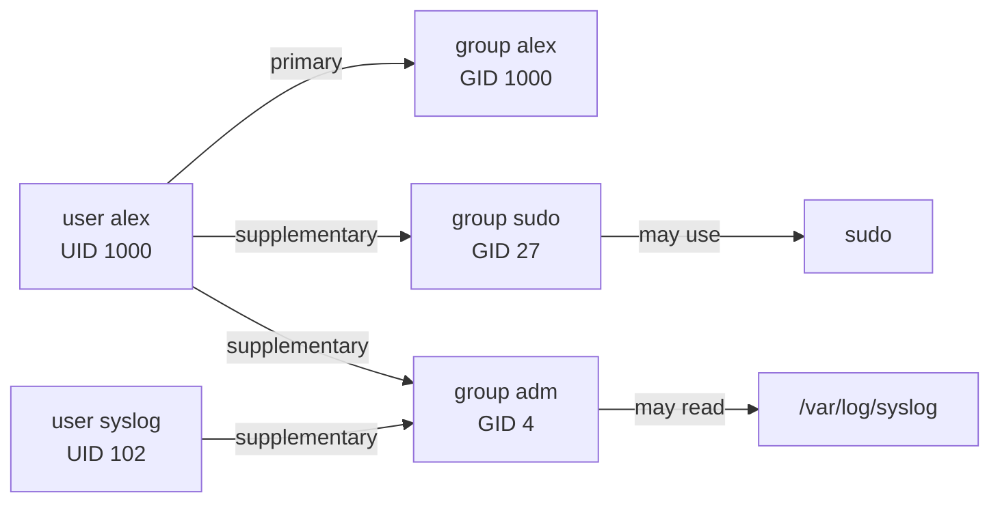
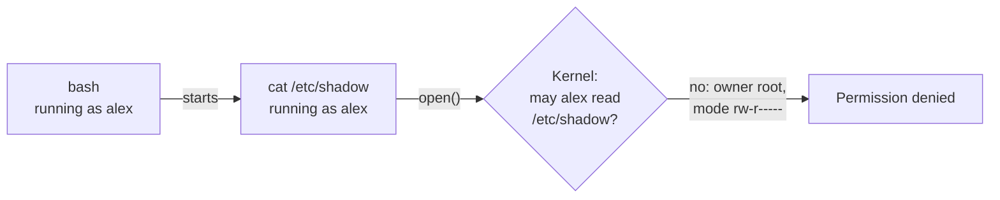
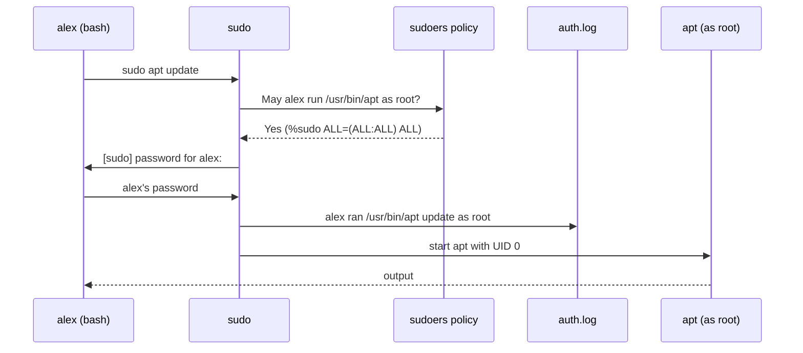

# Users, groups, and sudo

> **Level 0 · Chapter 6** · ⏱️ ~30 min read · Prerequisites: [The filesystem layout](05-filesystem-layout.md)

Linux was built for many people sharing one machine, and every file and every process belongs to a user. This chapter explains users and groups, the files that define them, the all-powerful root account and why you should almost never be it, and how `sudo` lets you borrow its power one command at a time.

## Why it matters

Alex is setting up a data project and keeps hitting `Permission denied`. A forum post says "just put `sudo` in front". It works, so Alex starts doing it everywhere: `sudo pip install pandas`, `sudo git clone ...`, `sudo python3 etl.py`.

A week later things start breaking in strange ways. Git refuses to commit because some files in the project now belong to root. A Python upgrade from the package manager conflicts with the packages `sudo pip` installed into the system's own Python. An ETL script, run with `sudo`, wrote its output into a root-owned folder that the nightly job, running as Alex, can't touch.

Then a colleague shows Alex the worst case. On a shared server, someone ran `sudo rm -rf /var/lib/app/ cache` to clear a cache. The accidental space after `app/` made it two arguments. The command deleted the whole application data directory, and then tried to delete a folder called `cache` in the current directory. Without `sudo`, the first part would have failed safely with "Permission denied".

`sudo` isn't a fix for permission errors. It's a power tool that turns off the safety checks. Knowing who you are, what you're allowed to do, and why, lets you fix the real problem instead.

## Concepts

### Why Linux has users

Linux descends from Unix, which was designed for many people logging in to one big computer at the same time. The system had to keep each person's files private, stop one user from crashing another's programs, and protect the system itself from everyone. The answer was **user accounts**, and every modern Linux system still works this way, even a laptop with one human.

On your Mint machine, most accounts aren't people at all. Services run under their own dedicated accounts: the web server runs as `www-data`, the logging service as `syslog`, a PostgreSQL server as `postgres`. If an attacker breaks into the web server, they get only what `www-data` can touch, not your home directory and not the whole system. That isolation is the main reason accounts matter on servers today.

### Users and UIDs

A **user** (or **user account**) is an identity the system uses to decide who owns what and who may do what. Each user has:

- A **username**, like `alex`, for humans.
- A **user ID (UID)**, a number such as `1000`, for the kernel.

The kernel only cares about the number. Files record their owner as a UID, and processes run with a UID. The name is just a label, looked up in a table whenever a program needs to display it. If you delete a user but their files remain, `ls -l` shows a bare number where the name used to be.

UIDs are divided into ranges by convention. On Mint (from `/etc/login.defs` and Debian policy):

| UID | Who | Examples |
|---|---|---|
| 0 | **root**, the superuser | `root` |
| 1–99 | System accounts with fixed numbers, created by the base system | `daemon` (1), `bin` (2), `www-data` (33) |
| 100–999 | System accounts created by packages as needed | `messagebus`, `syslog`, `lightdm`, `postgres` |
| 1000–60000 | Regular human users | `alex` (1000), the next person (1001) |
| 65534 | `nobody`: an account with no privileges at all | `nobody` |

The first human account created during installation gets UID 1000. That's why your private runtime directory is `/run/user/1000`.

### Groups and GIDs

A **group** is a named set of users. Groups let you grant access to several people at once: put everyone who should read the logs into one group, and give that group read permission on the logs. Each group has a name and a **group ID (GID)**.

Every user has:

- One **primary group**. New files you create belong to it. On Mint, each user gets a primary group with the same name and number as the user, called a **user private group**: user `alex` (UID 1000) has group `alex` (GID 1000).
- Any number of **supplementary groups**: extra memberships that grant extra access.

The first user on a Mint install is added to several supplementary groups:

| Group | Grants |
|---|---|
| `sudo` | Permission to run commands as root with `sudo`. This is what makes you an administrator |
| `adm` | Read access to system logs like `/var/log/syslog` and `/var/log/auth.log` |
| `cdrom` | Access to optical drives |
| `dip` | Use of dial-up and some network connection tools (historical) |
| `plugdev` | Access to some pluggable devices |
| `users` | A general group for all human users |
| `lpadmin` | Manage printers |
| `sambashare` | Share folders over the network with Samba |

Later you'll see groups like `docker` (run Docker without `sudo`) and `systemd-journal` (read all of the journal).



### Where accounts are stored

Local accounts are defined in three plain-text files in `/etc`. You'll read them below.

#### /etc/passwd: the user list

Despite its name, `/etc/passwd` no longer contains passwords. It has one line per user, with seven fields separated by colons:

```text
alex:x:1000:1000:Alex Example,,,:/home/alex:/bin/bash
```

| # | Field | Value | Meaning |
|---|---|---|---|
| 1 | Username | `alex` | The login name |
| 2 | Password | `x` | Placeholder: "the real password hash is in `/etc/shadow`" |
| 3 | UID | `1000` | User ID |
| 4 | GID | `1000` | Primary group ID |
| 5 | GECOS | `Alex Example,,,` | Full name and optional contact info, comma-separated. (The odd name comes from an old GE operating system) |
| 6 | Home | `/home/alex` | Home directory |
| 7 | Shell | `/bin/bash` | Login shell, started when the user logs in |

System accounts usually have the shell `/usr/sbin/nologin` (or `/bin/false`). These programs refuse to start a session, so nobody can log in interactively as `www-data`, even if they somehow had its password. Their home directory is often `/nonexistent`.

`/etc/passwd` is readable by everyone, by design. Programs like `ls` need it to turn UIDs into names.

#### /etc/group: the group list

One line per group, four fields:

```text
sudo:x:27:alex
```

| # | Field | Value | Meaning |
|---|---|---|---|
| 1 | Group name | `sudo` | |
| 2 | Password | `x` | Group passwords are rarely used; the placeholder points to `/etc/gshadow` |
| 3 | GID | `27` | Group ID |
| 4 | Members | `alex` | Comma-separated list of users with this as a **supplementary** group |

A user's primary group is set in `/etc/passwd` field 4, so users aren't usually listed as members of their own primary group here.

#### /etc/shadow: the password hashes

Originally the password hashes sat in `/etc/passwd`, readable by anyone. Attackers could copy the file and try billions of guesses offline. So the hashes moved to **`/etc/shadow`**, which only root (and the `shadow` group) can read.

Each line has nine fields. Conceptually, a line looks like this (this is a made-up example, not a real hash):

```text
alex:$y$j9T$Xo3k...$Rq7v...:20250:0:99999:7:::
```

| # | Field | Example | Meaning |
|---|---|---|---|
| 1 | Username | `alex` | Matches `/etc/passwd` |
| 2 | Password hash | `$y$j9T$...` | The hashed password, or `!` / `*` for a locked account |
| 3 | Last change | `20250` | Days since 1 January 1970 when the password was last changed |
| 4 | Minimum age | `0` | Days before it may be changed again |
| 5 | Maximum age | `99999` | Days before it must be changed (99999 means effectively never) |
| 6 | Warning | `7` | Days of warning before expiry |
| 7–9 | Inactive, expire, reserved | (empty) | Account expiry settings |

A **hash** is the output of a one-way mathematical function. The system never stores your password. When you log in, it hashes what you typed and compares the result. The hash can't be reversed into the password; an attacker can only guess and compare. The prefix names the algorithm: `$y$` is **yescrypt**, Ubuntu's default since 22.04, designed to make each guess slow and expensive. `$6$` is the older SHA-512 scheme.

A password field starting with `!` or `*` means "no password login possible". That's how the root account is set up on Mint, as you'll see below.

There's also `/etc/gshadow` for group passwords, rarely used.

!!! info "Accounts can come from elsewhere"
    On company machines, accounts may come from a central directory (LDAP or Active Directory) instead of these files. The `getent` command asks the system's full account lookup, whatever the source: `getent passwd alex`. Use it when `grep /etc/passwd` comes up empty for a user who clearly exists.

### Processes run as users

Every process runs with a UID and GIDs, inherited from whoever started it. When you open a terminal, your shell runs as `alex`, so everything you start from it also runs as `alex`.

When a process tries to open a file, the kernel compares the process's UID and groups with the file's owner, group, and permission bits, and allows or refuses the access. That check is what produces `Permission denied`. The details are in [Permissions](../01-command-line/03-permissions.md); for now, the important part is that **identity follows the process**.



### root: the superuser

**root** is the account with UID 0. The kernel treats UID 0 specially: almost every permission check is skipped. Root can read and change any file, kill any process, load kernel modules, reformat disks, and change any user's password. Root is also called the **superuser**.

That power is exactly why root is dangerous:

- **No safety net.** As a normal user, a mistaken `rm` in the wrong directory fails with "Permission denied". As root, it succeeds. A stray space (`rm -rf / tmp/old` instead of `rm -rf /tmp/old`) can delete the entire system.
- **Every program you run gets full power.** A buggy script, a malicious package, or a compromised download running as root can do anything, including hiding itself.
- **Mistakes are hard to spot.** Commands that would warn or refuse for a normal user just work, so you don't find out until later.
- **Files end up owned by root.** Running tools as root in your home directory leaves root-owned files you then can't edit as yourself, which is part of Alex's story.

!!! danger "⚠️ VM only"
    Never experiment with destructive commands as root on your main machine. If you want to see what root can break, do it in your throwaway VM, where a reinstall costs you nothing. Commands like `rm -rf`, `chmod -R`, `chown -R`, and `dd` run as root on the wrong path can destroy a system in seconds, with no undo.

On Mint and Ubuntu, the root account has **no usable password**: its password field in `/etc/shadow` is locked. You can't log in as root directly at all. Instead, users in the `sudo` group run individual commands as root with `sudo`. This design means:

- There's no shared root password to leak or forget.
- Every administrative command is tied to a real person and logged.
- You're root only for the one command that needs it.

### sudo and su

There are two ways to act as another user.

**`su`** ("substitute user", or "switch user") starts a new shell as another user. It asks for the **target user's** password. `su -` with no name means "become root, with root's full login environment". On Mint this fails, because root has no password to type.

**`sudo`** ("superuser do", now generalised to "substitute user do") runs **one command** as another user, root by default. It asks for **your own** password, then checks a policy file to see whether you're allowed. It logs every use.

| | `su` | `sudo` |
|---|---|---|
| Password asked for | The target user's (e.g. root's) | Your own |
| Scope | A whole new shell until you `exit` | One command (or a shell, if asked) |
| Who may use it | Anyone who knows the password | Only people allowed by `/etc/sudoers` |
| Fine-grained rules | No | Yes: specific commands, specific users, no password for some |
| Logged | Login only | Every command, with who, where, and what |
| Works on Mint for root | No (root is locked) | Yes, for members of `sudo` |

Here's what happens when you type `sudo apt update`:



Some details worth knowing:

- **Timestamp.** After you type your password, `sudo` remembers for **15 minutes** in that terminal, so the next `sudo` doesn't ask again. `sudo -k` forgets immediately; useful before you walk away.
- **Password feedback.** Most Linux systems show nothing at all while you type a password. Mint enables asterisks for `sudo` (a setting called `pwfeedback`), so you'll see `****`. On a server, you'll usually see nothing; keep typing.
- **Clean environment.** `sudo` resets most environment variables and uses its own safe PATH (`secure_path`), so a malicious program in your personal PATH can't be run as root by accident. That's why a program in `~/.local/bin` might be "not found" under `sudo`.
- **Logging.** Every use, successful or not, goes to `/var/log/auth.log` and the journal.

### sudoers and the sudo group

`sudo`'s rules live in **`/etc/sudoers`**, plus any files in **`/etc/sudoers.d/`**. Both are readable only by root (mode `r--r-----`). On Mint the key lines are:

```text
Defaults	env_reset
Defaults	mail_badpass
Defaults	secure_path="/usr/local/sbin:/usr/local/bin:/usr/sbin:/usr/bin:/sbin:/bin:/snap/bin"
Defaults	use_pty

root	ALL=(ALL:ALL) ALL
%admin  ALL=(ALL) ALL
%sudo	ALL=(ALL:ALL) ALL

@includedir /etc/sudoers.d
```

A rule reads as **who where = (as whom) what**:

```text
%sudo    ALL   =   (ALL:ALL)   ALL
─────    ───       ─────────   ───
who      on which  as which    which
         hosts     user:group  commands
```

- `%sudo`: the `%` means "members of the group" `sudo`. Without `%`, it's a username, as in the `root` line.
- `ALL` (hosts): on any machine. This matters only when one sudoers file is shared across many servers.
- `(ALL:ALL)`: may run commands as any user and any group.
- `ALL` (commands): any command.

So "members of group `sudo` may run any command as anyone". That's why being in the `sudo` group is what makes you an administrator on Mint and Ubuntu. (`%admin` is a leftover from older Ubuntu releases; the `admin` group doesn't exist on new installs.) On the Red Hat family, the same role is played by a group called `wheel`.

The `Defaults` lines set behaviour: `env_reset` cleans the environment, `secure_path` sets the PATH used for commands, `use_pty` runs commands in a separate pseudo-terminal for security.

`@includedir /etc/sudoers.d` reads every file in that directory. Mint adds small files there, including `0pwfeedback` (the asterisks) and rules that let its update and driver tools run specific commands without a password.

Rules can be much narrower than "everything". For example:

```text
deploy  ALL=(root) NOPASSWD: /usr/bin/systemctl restart webapp
```

This lets user `deploy` run exactly one command as root, with no password, which is perfect for an automated deployment and nothing more.

!!! danger "⚠️ VM only: editing sudoers"
    Run this in your throwaway VM, never on your main machine. A syntax error in `/etc/sudoers` can break `sudo` completely, and on Mint (where root is locked) that can leave you with no way to administer the system short of booting a rescue USB. Always edit with `sudo visudo` (or `sudo visudo -f /etc/sudoers.d/myrule`), which checks the syntax before saving.

### sudo's useful options

| Command | What it does |
|---|---|
| `sudo command` | Run `command` as root |
| `sudo -u bob command` | Run `command` as user `bob` |
| `sudo -l` | **List** what you're allowed to run. Doesn't run anything |
| `sudo -v` | **Validate**: refresh your 15-minute timestamp without running anything |
| `sudo -k` | **Kill** the timestamp: the next `sudo` asks for your password again |
| `sudo -i` | Start an interactive **login shell** as root: root's environment, home directory `/root`, root's startup files |
| `sudo -s` | Start a **shell** as root, but keep your current directory and more of your environment |
| `sudoedit file` (or `sudo -e`) | Edit a root-owned file safely: your editor runs as you on a temporary copy |

`sudo -i` is the modern replacement for `su -` on systems where root is locked. Use it when you have several admin commands to run in a row, and type `exit` the moment you're done. Many admins prefer to never open a root shell at all, and just put `sudo` in front of each command, because each one is then logged and deliberate.

!!! warning "Common mistake: sudo and redirection"
    `sudo echo "127.0.0.1 test" > /etc/hosts` fails with `Permission denied`. The `>` redirection is performed by **your** shell, running as you, before `sudo` even starts. Only `echo` runs as root. The fix is to make a root process do the writing, for example `echo "..." | sudo tee -a /etc/hosts`. You'll understand why after [Pipes and redirection](../01-command-line/04-pipes-and-redirection.md).

### The principle of least privilege

The **principle of least privilege** says: every user and every program should have only the access it needs to do its job, and only for as long as it needs it. It's the single most important idea in system security, and it shapes how you should use Linux:

- **Work as yourself.** Your normal account is the default for everything: coding, data work, browsing, running scripts.
- **Use `sudo` for one command at a time**, only when the task genuinely changes the system: installing packages, editing files in `/etc`, managing services.
- **Don't `sudo` to silence "Permission denied".** Ask why first. Usually the answer is a file in the wrong place, a wrong owner, or a missing group, not a need for root.
- **Never `sudo pip install` or `sudo npm install -g`** into the system. Use virtual environments, `pipx`, or `~/.local`. The system's Python belongs to the package manager.
- **Run services as dedicated accounts**, never as root, so a break-in is contained.
- **Grant groups for specific needs**, like `adm` to read logs, rather than full `sudo`.
- **Know which groups are secretly root.** Members of `docker` can start a container that mounts the whole disk, so `docker` membership is effectively root. Grant it as carefully as `sudo`.

## Commands and examples

### Who am I?

```bash
whoami
```

```text
alex
```

`whoami` prints your **effective** username: the identity your shell is acting as right now.

`id` shows the complete picture: UID, primary group, and every group with numbers:

```bash
id
```

```text
uid=1000(alex) gid=1000(alex) groups=1000(alex),4(adm),24(cdrom),27(sudo),30(dip),46(plugdev),100(users),105(lpadmin),125(sambashare)
```

- `uid=1000(alex)`: your user ID and name.
- `gid=1000(alex)`: your primary group.
- `groups=...`: every group you're in, primary first. `27(sudo)` is what makes you an administrator. `4(adm)` lets you read system logs.

`id` has options to print one piece at a time, handy in scripts:

```bash
id -u
id -un
id -gn
id -Gn
```

```text
1000
alex
alex
alex adm cdrom sudo dip plugdev users lpadmin sambashare
```

- `-u` the UID; with `-n`, the name instead of the number.
- `-g` the primary group; `-G` all groups.

`groups` is a shortcut for `id -Gn`:

```bash
groups
```

```text
alex adm cdrom sudo dip plugdev users lpadmin sambashare
```

Ask about other accounts by name:

```bash
id root
id www-data
id nobody
```

```text
uid=0(root) gid=0(root) groups=0(root)
uid=33(www-data) gid=33(www-data) groups=33(www-data)
uid=65534(nobody) gid=65534(nogroup) groups=65534(nogroup)
```

!!! info "Group changes need a new login"
    Your shell's groups are set when you log in. If an administrator adds you to a group, `id` won't show it in an already-open terminal. Log out and back in (or reboot) for the change to apply everywhere.

### Read /etc/passwd

The first few lines:

```bash
head -3 /etc/passwd
```

```text
root:x:0:0:root:/root:/bin/bash
daemon:x:1:1:daemon:/usr/sbin:/usr/sbin/nologin
bin:x:2:2:bin:/bin:/usr/sbin/nologin
```

- `root`: UID 0, home `/root`, shell `bash`.
- `daemon` and `bin`: historical system accounts with `nologin` shells.

Find your own line. `grep` prints lines that contain a pattern; `^alex:` means "starts with `alex:`" so it can't match other accounts that merely contain "alex":

```bash
grep '^alex:' /etc/passwd
```

```text
alex:x:1000:1000:Alex Example,,,:/home/alex:/bin/bash
```

Find accounts for some familiar services:

```bash
grep -E '^(www-data|syslog|messagebus|nobody):' /etc/passwd
```

```text
www-data:x:33:33:www-data:/var/www:/usr/sbin/nologin
nobody:x:65534:65534:nobody:/nonexistent:/usr/sbin/nologin
messagebus:x:101:101::/nonexistent:/usr/sbin/nologin
syslog:x:102:102::/nonexistent:/usr/sbin/nologin
```

None of them can log in: they all use `/usr/sbin/nologin`.

Count how many accounts can't log in interactively. `grep -c` counts matching lines:

```bash
grep -c nologin /etc/passwd
wc -l < /etc/passwd
```

```text
36
45
```

Of 45 accounts, 36 are service accounts that can't log in. Most of the rest are `root`, you, and a few accounts with the similar `/bin/false` shell.

`getent` gives the same answer while also checking any network account sources:

```bash
getent passwd alex
```

```text
alex:x:1000:1000:Alex Example,,,:/home/alex:/bin/bash
```

### Read /etc/group

```bash
grep -E '^(sudo|adm|users):' /etc/group
```

```text
adm:x:4:syslog,alex
sudo:x:27:alex
users:x:100:alex
```

- `adm` has two members: the `syslog` service account (so it can write logs readable by the group) and you.
- `sudo` has one member: you. Anyone else listed here could run commands as root.

Find every group you're listed in:

```bash
grep -w alex /etc/group
```

```text
adm:x:4:syslog,alex
cdrom:x:24:alex
sudo:x:27:alex
dip:x:30:alex
plugdev:x:46:alex
users:x:100:alex
lpadmin:x:105:alex
alex:x:1000:
sambashare:x:125:alex
```

`-w` matches whole words only. Your own group `alex` appears with an empty member list, because it's your primary group (set in `/etc/passwd`), not a supplementary one.

### Try to read /etc/shadow

```bash
ls -l /etc/passwd /etc/group /etc/shadow /etc/gshadow /etc/sudoers
```

```text
-rw-r--r-- 1 root root   1171 Jun  9 19:21 /etc/group
-rw-r----- 1 root shadow  990 Jun  9 19:21 /etc/gshadow
-rw-r--r-- 1 root root   2894 Jun  9 19:21 /etc/passwd
-r--r----- 1 root root   1800 Jan 29  2024 /etc/sudoers
-rw-r----- 1 root shadow 1293 Jun  9 19:21 /etc/shadow
```

- `passwd` and `group` are readable by everyone (`r--` at the end).
- `shadow` and `gshadow` are readable only by root and the `shadow` group (`---` at the end for others).
- `sudoers` is read-only even for root (`r--r-----`), a nudge to edit it only via `visudo`.

```bash
cat /etc/shadow
```

```text
cat: /etc/shadow: Permission denied
```

Exactly as designed. With `sudo` you can read it. Look at the first three lines, which belong to system accounts with no password hashes:

```bash
sudo head -3 /etc/shadow
```

```text
[sudo] password for alex: ********
root:!:20250:0:99999:7:::
daemon:*:19977:0:99999:7:::
bin:*:19977:0:99999:7:::
```

Root's password field is `!` (on some installs `*` or `!*`): locked. No password will ever work for it, which is why you use `sudo` instead. `*` on the system accounts also means "no password login". Don't print or share lines for real users; even hashes are sensitive.

### Using sudo

Run a single harmless command as root:

```bash
sudo whoami
```

```text
[sudo] password for alex: ********
root
```

- `[sudo] password for alex:` asks for **your** password, not root's. Mint shows an asterisk per character.
- `whoami` ran as root and said so.

Run `id` the same way to see the full identity:

```bash
sudo id
```

```text
uid=0(root) gid=0(root) groups=0(root)
```

No password prompt this time: you're within the 15-minute window. Make `sudo` forget, and it asks again:

```bash
sudo -k
sudo whoami
```

```text
[sudo] password for alex: ********
root
```

Type the wrong password and you get three tries:

```text
[sudo] password for alex: ****
Sorry, try again.
[sudo] password for alex: ****
Sorry, try again.
[sudo] password for alex: ****
sudo: 3 incorrect password attempts
```

### What am I allowed to do? sudo -l

```bash
sudo -l
```

```text
Matching Defaults entries for alex on mint:
    env_reset, mail_badpass,
    secure_path=/usr/local/sbin\:/usr/local/bin\:/usr/sbin\:/usr/bin\:/sbin\:/bin\:/snap/bin,
    use_pty, pwfeedback

User alex may run the following commands on mint:
    (ALL : ALL) ALL
```

- The **Defaults** section shows the settings that apply to you, including `pwfeedback`, Mint's asterisks.
- `(ALL : ALL) ALL` means: as any user and group, any command. That comes from the `%sudo` rule. You may also see extra lines for Mint's update and driver tools.

On a work server, `sudo -l` is the first thing to run. You might see something narrow like `(root) /usr/bin/systemctl restart webapp`, which tells you exactly what you've been trusted with.

### A shell as root: sudo -i and sudo -s

```bash
sudo -i
```

```console
root@mint:~#
```

The prompt changes in three ways: the username is `root`, the directory `~` now means `/root`, and the last character is `#`. Check:

```bash
whoami
pwd
echo $HOME
```

```text
root
/root
/root
```

Leave immediately when you're done:

```bash
exit
```

```console
alex@mint:~$
```

`sudo -s` also gives a root shell, but keeps your current directory and more of your settings:

```bash
cd ~/practice
sudo -s
pwd
echo $HOME
exit
```

```text
/home/alex/practice
/root
```

You're root, still in your directory. On Ubuntu 24.04's `sudo`, `HOME` is set to `/root` here too, so root's own files are used.

!!! warning "Common mistake: forgetting you're root"
    A root shell looks almost like a normal one. Before every command in a root shell, glance at the end of the prompt. `#` means everything you type has full power. Close root shells as soon as the task is done.

### Run a command as another user: sudo -u

```bash
sudo -u www-data whoami
sudo -u nobody id
```

```text
www-data
uid=65534(nobody) gid=65534(nogroup) groups=65534(nogroup)
```

This is how admins test what a service account can see. For example, `sudo -u www-data ls /var/www` checks whether the web server can read a site's files.

### su on Mint

```bash
su -
```

```text
Password:
su: Authentication failure
```

`su -` asks for **root's** password. Root has none on Mint, so nothing you type works. Use `sudo -i` instead. (`su - bob` would work if you knew `bob`'s password.)

### When someone isn't allowed

If a user who isn't in the `sudo` group tries it:

```text
[sudo] password for sam: ********
sam is not in the sudoers file.
```

The attempt is also recorded in the log. Look at recent `sudo` activity (you're in `adm`, so you can read it):

```bash
grep 'sudo:' /var/log/auth.log | tail -3
```

```text
2026-10-02T10:51:12.418202+00:00 mint sudo:     alex : TTY=pts/0 ; PWD=/home/alex ; USER=root ; COMMAND=/usr/bin/whoami
2026-10-02T10:51:12.420047+00:00 mint sudo: pam_unix(sudo:session): session opened for user root(uid=0) by alex(uid=1000)
2026-10-02T10:51:12.423911+00:00 mint sudo: pam_unix(sudo:session): session closed for user root
```

Every detail is there: who (`alex`), from which terminal (`pts/0`), in which directory, as which user (`root`), and the exact command. On a shared server, this is the audit trail.

### Managing users and groups

These commands change the system, so practise them only in your VM.

!!! danger "⚠️ VM only"
    Run these in your throwaway VM, never on your main machine. Creating, modifying, and deleting accounts changes `/etc/passwd`, `/etc/shadow`, and `/etc/group`. A mistake such as removing yourself from the `sudo` group can lock you out of administration.

Create a user. On Debian-family systems, `adduser` is the friendly tool: it creates the home directory, copies `/etc/skel`, and asks for a password and details. (`useradd` is the low-level tool that does less by default.)

```bash
sudo adduser bob
```

```text
info: Adding user `bob' ...
info: Selecting UID/GID from range 1000 to 59999 ...
info: Adding new group `bob' (1001) ...
info: Adding new user `bob' (1001) with group `bob (1001)' ...
info: Creating home directory `/home/bob' ...
info: Copying files from `/etc/skel' ...
New password:
Retype new password:
passwd: password updated successfully
Changing the user information for bob
Enter the new value, or press ENTER for the default
	Full Name []: Bob Example
	Room Number []:
	Work Phone []:
	Home Phone []:
	Other []:
Is the information correct? [Y/n] y
info: Adding new user `bob' to supplemental / extra groups `users' ...
info: Adding user `bob' to group `users' ...
```

Bob got UID 1001, a private group `bob`, a home directory, and the `users` group.

Add Bob to an existing group. With `adduser`, give the user then the group:

```bash
sudo adduser bob adm
```

The lower-level equivalent is `usermod -aG`:

```bash
sudo usermod -aG adm bob
```

!!! warning "Common mistake: usermod -G without -a"
    `usermod -G adm bob` (without `-a`) **replaces** all of Bob's supplementary groups with just `adm`. Run that on your own account with `sudo` instead of `adm` missing from the list, and you've removed yourself from `sudo`. Always use `-aG` (append to groups).

Let Bob be an administrator by adding him to `sudo`:

```bash
sudo adduser bob sudo
```

Change a user's password (as root, any user; as yourself, just `passwd`):

```bash
sudo passwd bob
```

Remove the user and their home directory:

```bash
sudo deluser --remove-home bob
```

## Exercises

### Exercise 1: Identify yourself (easy)

Find your username, UID, primary group, and every supplementary group. For each supplementary group, write one sentence on what it lets you do.

??? success "Solution"

    ```bash
    whoami
    id
    ```

    ```text
    alex
    uid=1000(alex) gid=1000(alex) groups=1000(alex),4(adm),24(cdrom),27(sudo),30(dip),46(plugdev),100(users),105(lpadmin),125(sambashare)
    ```

    - Username `alex`, UID 1000, primary group `alex` (GID 1000), a user private group.
    - `adm`: read system logs such as `/var/log/syslog` and `/var/log/auth.log`.
    - `cdrom`: use optical drives.
    - `sudo`: run any command as root with `sudo`; this makes you an administrator.
    - `dip`: use some network connection tools (historical, for dial-up).
    - `plugdev`: access some removable devices.
    - `users`: a general group for human users.
    - `lpadmin`: add and manage printers.
    - `sambashare`: share folders over the network.

    If you were added to a group in this session and it's missing, log out and back in.

### Exercise 2: Decode /etc/passwd (easy)

Print your own `/etc/passwd` line and label all seven fields. Then find the line for `www-data` and explain three differences from yours.

??? success "Solution"

    ```bash
    grep -E '^(alex|www-data):' /etc/passwd
    ```

    ```text
    www-data:x:33:33:www-data:/var/www:/usr/sbin/nologin
    alex:x:1000:1000:Alex Example,,,:/home/alex:/bin/bash
    ```

    Fields for `alex`: username `alex`; password `x` (hash in `/etc/shadow`); UID 1000; primary GID 1000; GECOS `Alex Example,,,`; home `/home/alex`; shell `/bin/bash`.

    Differences for `www-data`:

    1. UID 33, in the fixed system-account range (1–99), not the human range (1000+).
    2. Home is `/var/www`, the default web content directory, not under `/home`.
    3. Shell is `/usr/sbin/nologin`, so nobody can log in as it interactively. It exists only so the web server can run with limited rights.

### Exercise 3: Service accounts and ranges (medium)

List every account with a UID of 1000 or more, and every account whose shell is a real shell (`bash`). Then explain why `nobody` has UID 65534 despite being a system account.

??? success "Solution"

    `awk` splits each line at colons (`-F:`) and lets you test fields; `$3` is the UID and `$7` the shell. You'll learn `awk` in [Text processing](../01-command-line/05-text-processing.md).

    ```bash
    awk -F: '$3 >= 1000 {print $1, $3}' /etc/passwd
    grep 'bash$' /etc/passwd
    ```

    ```text
    nobody 65534
    alex 1000
    root:x:0:0:root:/root:/bin/bash
    alex:x:1000:1000:Alex Example,,,:/home/alex:/bin/bash
    ```

    Only `alex` is a human account (≥ 1000). `nobody` is listed because 65534 is above 1000, but it's a special case: 65534 is the largest value of an old 16-bit UID minus one, traditionally reserved for "an unprivileged user that owns nothing". Network file systems map untrusted remote users to it.

    Only `root` and `alex` have `bash` as a login shell. Every other account uses `nologin` or `/bin/false` and can't log in.

### Exercise 4: Investigate sudo (medium)

1. Find out what `sudo` allows you to do without running anything as root.
2. Run `whoami` as root and as `www-data`.
3. Make `sudo` forget your password, and confirm it asks again.
4. Find the log line for your `sudo whoami` and identify the user, terminal, working directory, target user, and command.

??? success "Solution"

    ```bash
    sudo -l
    ```

    ```text
    ...
    User alex may run the following commands on mint:
        (ALL : ALL) ALL
    ```

    ```bash
    sudo whoami
    sudo -u www-data whoami
    ```

    ```text
    root
    www-data
    ```

    ```bash
    sudo -k
    sudo true
    ```

    ```text
    [sudo] password for alex: ********
    ```

    `true` does nothing, so it's a harmless way to test the password prompt.

    ```bash
    grep 'COMMAND=/usr/bin/whoami' /var/log/auth.log | tail -2
    ```

    ```text
    2026-10-02T11:02:40.112903+00:00 mint sudo:     alex : TTY=pts/0 ; PWD=/home/alex ; USER=root ; COMMAND=/usr/bin/whoami
    2026-10-02T11:02:44.581127+00:00 mint sudo:     alex : TTY=pts/0 ; PWD=/home/alex ; USER=www-data ; COMMAND=/usr/bin/whoami
    ```

    User `alex`, terminal `pts/0`, directory `/home/alex`, target `root` then `www-data`, command `/usr/bin/whoami`. Notice `sudo` logged the full path of the program it ran.

### Exercise 5: A second user in your VM (hard)

!!! danger "⚠️ VM only"
    Do this exercise in your throwaway VM, never on your main machine. It creates and deletes accounts and changes group membership.

In your VM:

1. Create a user `sam`.
2. Switch to `sam` and show that `sam` cannot use `sudo` and cannot read `/var/log/syslog`.
3. Give `sam` read access to system logs **without** giving `sam` `sudo`. Prove it works.
4. Explain why that's better than adding `sam` to `sudo`.
5. Remove `sam` completely.

??? success "Solution"

    1. Create the user (answer the prompts; set any password):

        ```bash
        sudo adduser sam
        ```

    2. Become `sam` with `su`, which asks for **sam's** password. The `-` gives `sam` a full login environment:

        ```bash
        su - sam
        whoami
        sudo whoami
        ```

        ```text
        sam
        [sudo] password for sam: ********
        sam is not in the sudoers file.
        ```

        ```bash
        cat /var/log/syslog
        exit
        ```

        ```text
        cat: /var/log/syslog: Permission denied
        logout
        ```

    3. As your admin user, add `sam` to `adm`, then test again in a fresh login (group changes need a new login):

        ```bash
        sudo adduser sam adm
        su - sam
        id
        tail -n 2 /var/log/syslog
        exit
        ```

        ```text
        uid=1001(sam) gid=1001(sam) groups=1001(sam),4(adm),100(users)
        2026-10-02T11:10:01.003311+00:00 mint CRON[5122]: (root) CMD (command -v debian-sa1 > /dev/null && debian-sa1 1 1)
        2026-10-02T11:10:03.774820+00:00 mint systemd[1]: Started session-7.scope - Session 7 of User sam.
        logout
        ```

    4. This is least privilege. `sam` needed to read logs, so `sam` got exactly that through the `adm` group. With `sudo`, `sam` could also delete files, install software, read `/etc/shadow`, and add new administrators. If `sam`'s password leaks, the damage is limited to reading logs.

    5. Remove the account and home directory:

        ```bash
        sudo deluser --remove-home sam
        grep sam /etc/passwd
        ```

        No output from `grep` means the account is gone. `deluser` also removes `sam` from every group and deletes the private group `sam`.

## Check yourself

1. Why does the kernel care about UIDs rather than usernames?

    ??? note "Answer"

        Files store their owner as a number and processes run with a numeric UID; the kernel checks numbers because they're compact and fast. Usernames are just labels looked up in `/etc/passwd` (or another account source) when a program needs to show them.

2. What are the UID ranges on Mint, and what lives in each?

    ??? note "Answer"

        0 is root. 1–99 are fixed system accounts (like `daemon`, `www-data`). 100–999 are system accounts created by packages (like `syslog`, `messagebus`). 1000 and up are human users. 65534 is `nobody`, an unprivileged placeholder.

3. What's the difference between a primary group and a supplementary group?

    ??? note "Answer"

        The primary group, set in `/etc/passwd` field 4, is the group that owns new files you create; on Mint it's a private group named after you. Supplementary groups, listed in `/etc/group` field 4, grant extra access, like `adm` for logs or `sudo` for administration.

4. Why are password hashes in `/etc/shadow` and not `/etc/passwd`?

    ??? note "Answer"

        `/etc/passwd` must be readable by everyone so programs can turn UIDs into names. If hashes were there, anyone could copy them and guess passwords offline. `/etc/shadow` is readable only by root and the `shadow` group.

5. Give three reasons why working as root is dangerous.

    ??? note "Answer"

        Permission checks are skipped, so typos and mistakes succeed instead of failing safely. Every program you run, including buggy or malicious ones, gets full power over the system. Files you create end up owned by root, causing permission problems later. (Also: actions are harder to audit than individual `sudo` commands.)

6. Compare `sudo` and `su`: whose password does each ask for, and why does `su -` fail on Mint?

    ??? note "Answer"

        `sudo` asks for your own password and checks `/etc/sudoers` to see whether you're allowed. `su` asks for the target user's password. On Mint, root's password is locked (`!` in `/etc/shadow`), so there's no password that `su -` would accept.

7. Explain `%sudo ALL=(ALL:ALL) ALL`.

    ??? note "Answer"

        Members of the group `sudo` (`%` marks a group), on all hosts, may run commands as any user and any group (`(ALL:ALL)`), and may run any command (`ALL`).

8. What do `sudo -l`, `sudo -i`, and `sudo -k` do?

    ??? note "Answer"

        `sudo -l` lists what you're allowed to run, without running anything. `sudo -i` opens a login shell as root, with root's environment and home directory. `sudo -k` invalidates your cached credentials, so the next `sudo` asks for your password again.

## Key takeaways

- Every process and file belongs to a **user** (UID) and **group** (GID). The kernel checks numbers; names live in `/etc/passwd` and `/etc/group`.
- Password hashes live in root-only **`/etc/shadow`**. Service accounts use `nologin` and can't log in.
- **root (UID 0)** skips permission checks. On Mint, root's password is locked; you never log in as root.
- **`sudo`** runs one command as root using your own password, if `/etc/sudoers` allows it. Membership in the **`sudo` group** is what makes you an admin.
- Use `sudo -l` to see your rights, `sudo -i` for a temporary root shell, and check for `#` in the prompt.
- Follow the **principle of least privilege**: work as yourself, `sudo` only what must change the system, and grant narrow groups like `adm` instead of full `sudo`.
- Practise creating, changing, and deleting users only in your **⚠️ VM**.

## Next

That completes Level 0. Prove it to yourself with the [Level 0 capstone](../../exercises/level-0-capstone.md).
