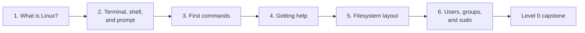

# Level 0: First steps

> **Level 0** · ⏱️ ~3 hours of reading, plus 4–6 hours of hands-on practice · Prerequisites: a Linux Mint 22.3 machine or VM ([Set up your practice lab](../../lab-setup.md))

Level 0 takes you from "I've never used a Linux terminal" to moving around a Linux system with confidence. You'll learn what Linux actually is, how the terminal and shell work, how to look around the filesystem, how to answer your own questions without a browser, and who you are to the system and when to use `sudo`.

Nothing here is difficult, but all of it is foundational. Every later level assumes you can do these things without thinking.

## What this level covers

| # | Chapter | What you'll learn | Read time |
|---|---|---|---|
| 1 | [What is Linux?](01-what-is-linux.md) | The kernel vs the OS, GNU, distributions and the Debian → Ubuntu → Mint family tree, desktops, licensing, and why Linux runs your data pipelines | ~25 min |
| 2 | [The terminal, shell, and prompt](02-terminal-shell-prompt.md) | Terminal vs shell vs console vs TTY, reading the prompt, the anatomy of a command, how bash finds a program through PATH, and exit statuses | ~25 min |
| 3 | [Your first commands](03-first-commands.md) | `pwd`, `ls` and its most useful flags, `cd` with absolute and relative paths, `echo`, `clear`, tab completion, history, and `tree` | ~30 min |
| 4 | [Getting help](04-getting-help.md) | `man` and its sections, reading SYNOPSIS notation, navigating `less`, `--help`, `apropos`, `whatis`, `info`, `help`, `tldr`, and `/usr/share/doc` | ~30 min |
| 5 | [The filesystem layout](05-filesystem-layout.md) | The FHS, "everything is a file", a tour of every top-level directory, merged /usr, dotfiles, and where config, logs, programs, and personal files live | ~30 min |
| 6 | [Users, groups, and sudo](06-users-groups-sudo.md) | UIDs and groups, `/etc/passwd`, `/etc/group`, `/etc/shadow`, `id`, why root is dangerous, `sudo` vs `su`, sudoers, and least privilege | ~30 min |
| | [Level 0 capstone](../../exercises/level-0-capstone.md) | Prove it: navigate, map the system, and find documentation with no browser and no notes | ~1–2 hours |

## What you'll be able to do afterwards

By the end of Level 0 you will be able to:

- Explain what Linux, GNU, and a distribution are, and how Linux Mint relates to Ubuntu and Debian.
- Open a terminal, read the prompt, and tell at a glance whether you're a normal user or root.
- Break any command line into its command, options, and arguments, and explain how bash finds the program it runs.
- Move anywhere in the directory tree with `cd`, using absolute and relative paths, `.`, `..`, `~`, and `-`.
- Use `ls` to answer real questions: what's newest, what's biggest, what's hidden, who owns it.
- Find the documentation for any command, file format, or builtin without a web browser.
- Say where configuration, logs, programs, libraries, service data, and personal files live on any Linux system.
- Read `/etc/passwd` and `/etc/group`, explain your own groups, and use `sudo` deliberately, one command at a time.

## How long it takes

Plan on **one to two weeks** of short daily sessions:

- **Reading:** about 3 hours in total, roughly 25–30 minutes per chapter.
- **Practice:** about 30–60 minutes per chapter for the examples and exercises. Type every command yourself; don't just read the output.
- **Capstone:** 1–2 hours, plus time to repeat any part you couldn't do without notes.

Short, regular sessions work better than one long weekend. If a chapter feels slow, that's fine. It's the base everything else stands on.

## How to work through this level

1. Read the chapters in order. Each builds on the one before.
2. Keep a terminal open next to the page and run every example. Your output will differ in small ways (dates, sizes, version numbers); that's expected.
3. Do the exercises before opening the solutions. Getting stuck for a few minutes is where most of the learning happens.
4. Answer the "Check yourself" questions out loud or on paper, without looking back.
5. Note anything that tripped you up in your `notes/` mistakes log.
6. When all six chapters are done, attempt the capstone without notes.

!!! tip "Safe to run"
    Almost everything in Level 0 is read-only and safe on your main machine. The few commands that change the system, such as creating users or editing `sudoers`, are marked **⚠️ VM only**. Do those in your throwaway VM.

## The capstone

The Level 0 capstone asks you to:

- Move around the filesystem confidently, using only the terminal.
- Explain where config, logs, programs, and personal files live.
- Find any command's documentation without a browser.

Start it when you've finished chapter 6: [Level 0 capstone](../../exercises/level-0-capstone.md). Don't move on to [Level 1: Command-line fluency](../01-command-line/index.md) until you can complete it without notes.
