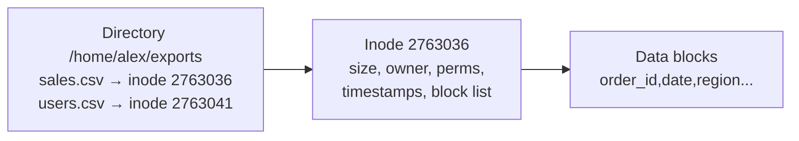
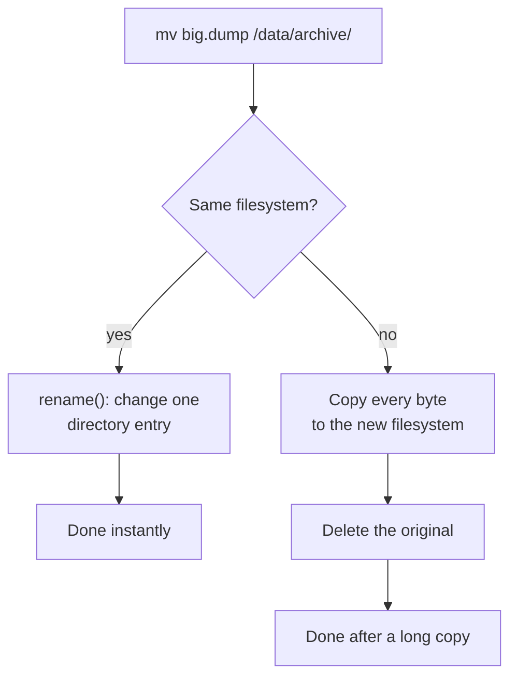
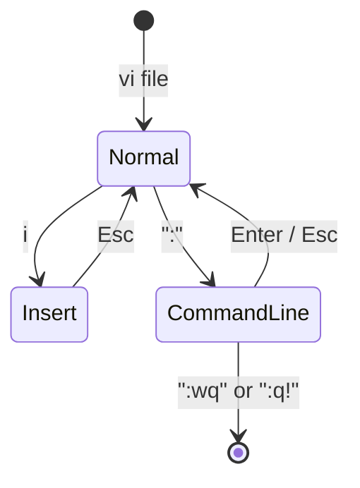

# Working with files

> **Level 1 · Chapter 1** · ⏱️ ~35 min read · Prerequisites: [Your first commands](../00-first-steps/03-first-commands.md), [The filesystem layout](../00-first-steps/05-filesystem-layout.md)

This chapter covers the everyday file commands: creating, copying, moving, deleting, viewing, and editing files. It also shows what these commands do to the filesystem underneath, which is what makes them fast, slow, or dangerous.

## Why it matters

Alex is a data engineer with a folder of nightly CSV exports. One evening Alex wants a safety copy before trying a new cleaning script, so Alex runs `cp -r exports exports-backup`. The script misbehaves, so Alex restores the backup. Then the incremental sync job that uploads "changed files" re-uploads all 40 GB. Every file looked new, because plain `cp` gave every copy a fresh modification time. `cp -a` would have kept the original timestamps.

A week later Alex moves a 30 GB database dump into another folder. It finishes instantly. Then Alex moves it to a USB drive and it takes ten minutes. Same command, very different behavior.

The next day Alex types `rm -r exports-backup` and hits ++enter++ a moment before noticing the autocompletion picked `exports` instead. There is no trash can on the command line. The files are gone.

Each of these surprises has the same cure: knowing what the command really does to the filesystem. That is what this chapter teaches.

## Concepts

### Names, inodes, and data

On a Linux filesystem, a file has three separate parts:

- The **data**: the bytes inside the file, stored in blocks on disk.
- The **inode** (index node): a small record that describes the file. It holds the size, owner, permissions, timestamps, and the location of the data blocks. Every inode has a number. It does **not** hold the file's name.
- A **directory entry**: a line in a directory that maps a name to an inode number. A **directory** is itself just a special file containing a list of these name-to-inode entries.



This split explains most of the behavior in this chapter:

- **Renaming** a file only changes a directory entry. The inode and data stay put.
- **Deleting** a file removes a directory entry. The data is freed only when no names point to the inode any more and no program still has it open.
- **Copying** a file creates a new inode and writes all the data again.

You can see a file's inode number with `ls -i`. Level 3 goes much deeper in [Filesystems, inodes, and links](../03-internals/04-filesystems-and-links.md).

### What cp, mv, and rm do underneath

| Command | What happens on disk | Cost |
|---|---|---|
| `cp a b` | New inode, all bytes read and written again | Proportional to file size |
| `mv a b` (same filesystem) | One directory entry renamed | Instant, any size |
| `mv a b` (different filesystem) | Copy everything, then delete the original | Proportional to file size |
| `rm a` | Directory entry removed; link count drops by one | Instant |



A **filesystem** here means one formatted storage area, such as your main ext4 partition or a USB stick. `mv` asks the kernel for a `rename()`. That only works inside one filesystem, because an inode number is meaningful only on the filesystem that owns it. When the kernel refuses with "cross-device link", `mv` falls back to copying the data and then deleting the source. That is why a move inside your home directory is instant, but a move to a USB drive takes as long as a copy.

### Why there is no trash

`rm` calls the kernel's `unlink()`. That removes the name and decrements the inode's **link count** (the number of names pointing at it). When the count reaches zero and no process has the file open, the filesystem marks the inode and blocks as free. Nothing is moved anywhere. There is no "Recycle Bin" step, no confirmation, and no undo.

The Trash you see in the Mint file manager is a desktop convention, not a kernel feature. The file manager moves files into `~/.local/share/Trash/` instead of unlinking them. From the terminal, `gio trash file` does the same thing, if you want a safety net:

```bash
gio trash old-report.csv
gio trash --list
```

```text
trash:///old-report.csv	/home/alex/old-report.csv
```

!!! warning "Common mistake"
    Thinking "I can recover it later". After `rm`, the blocks are marked free and will soon be reused. Recovery tools exist, but they are slow, unreliable on SSDs (which may wipe freed blocks soon after deletion, a feature called TRIM), and never something to plan around. Your real safety net is backups and version control.

### Timestamps: atime, mtime, ctime

Every inode stores several timestamps:

| Name | Full name | Changes when... | Shown by |
|---|---|---|---|
| **atime** | access time | The file's content is read | `ls -lu`, `stat` |
| **mtime** | modification time | The file's content is written | `ls -l` (default), `stat` |
| **ctime** | change time | The inode changes: content, permissions, owner, name, link count | `ls -lc`, `stat` |
| **birth** | creation time | The file is created (ext4 records this) | `stat` |

Some details matter in practice:

- `ctime` is **not** "creation time". It is "inode change time". You cannot set it by hand. Any `chmod`, `chown`, rename, or write updates it to "now".
- `mtime` is what `ls -l`, `make`, `rsync`, and backup tools use to decide whether a file changed.
- Updating atime on every read would mean a disk write for every read. Mint mounts filesystems with the **relatime** option, which updates atime only if it is older than mtime or ctime, or more than 24 hours old. So atime is only roughly accurate.

You can check the mount options yourself:

```bash
findmnt -no FSTYPE,OPTIONS /
```

```text
ext4   rw,relatime,errors=remount-ro
```

### Text files, binary files, and how `file` guesses

Linux does not use file extensions to decide what a file is. `report.csv` could contain a PNG image. Tools that care, such as `file`, look at the first bytes of the content. Many formats start with a fixed signature called a **magic number**. PNG files start with the bytes `\x89PNG`, and Linux programs (ELF executables) start with `\x7fELF`. `file` compares the start of a file against a database of these signatures.

This matters because `cat` on a binary file sends raw bytes to your terminal. Some of those bytes are terminal control codes, and they can scramble your display. If that happens, type `reset` and press ++enter++, even if you cannot see what you type.

### Pagers and editors

A **pager** is a program that shows text one screen at a time. `less` is the standard pager on Linux, and `man` uses it to show manual pages. An **editor** lets you change a file. Mint ships two terminal editors:

- **nano**: simple, with its shortcuts listed at the bottom of the screen. Good for quick edits.
- **vi**: on Mint, `vi` is `vim.tiny`, a minimal build of **vim**. Vim is powerful but has **modes**, so you need a few survival keys. You will meet it on servers, inside `git commit`, and in `crontab -e`, so learning to get out of it is not optional.

## Commands and examples

The examples use a practice directory with a small CSV file in it. Paste this block into your terminal to create both. (The `cat <<'EOF'` construct is a **here-document**; [chapter 4](04-pipes-and-redirection.md) explains it.)

```bash
mkdir -p ~/practice && cd ~/practice
cat > sales.csv <<'EOF'
order_id,date,region,product,qty,unit_price
1001,2026-09-01,north,laptop,1,899.00
1002,2026-09-01,south,mouse,3,19.99
1003,2026-09-02,east,monitor,2,229.50
1004,2026-09-02,north,keyboard,1,49.00
1005,2026-09-03,west,laptop,2,899.00
1006,2026-09-03,south,monitor,1,229.50
1007,2026-09-04,east,mouse,5,19.99
1008,2026-09-04,north,webcam,1,64.00
1009,2026-09-05,west,keyboard,4,49.00
1010,2026-09-05,south,laptop,1,949.00
1011,2026-09-06,east,webcam,2,64.00
1012,2026-09-06,north,mouse,2,19.99
EOF
```

### Creating directories: mkdir and rmdir

`mkdir` makes a directory. By default, the parent must already exist:

```bash
mkdir projects/etl/raw
```

```text
mkdir: cannot create directory ‘projects/etl/raw’: No such file or directory
```

The `-p` flag (parents) creates every missing directory along the path, and does not complain if the directory already exists. That second property makes it safe to use in scripts that run repeatedly. Add `-v` (verbose) to see what it did. Brace expansion (next chapter) lets you create several siblings at once:

```bash
mkdir -pv projects/etl/{raw,clean,logs}
```

```text
mkdir: created directory 'projects'
mkdir: created directory 'projects/etl'
mkdir: created directory 'projects/etl/raw'
mkdir: created directory 'projects/etl/clean'
mkdir: created directory 'projects/etl/logs'
```

`rmdir` removes a directory, but only if it is empty. That is a feature: it can never delete files by accident.

```bash
rmdir projects/etl
```

```text
rmdir: failed to remove 'projects/etl': Directory not empty
```

```bash
rmdir projects/etl/logs && echo removed
```

```text
removed
```

### Creating files and setting timestamps: touch

`touch` sets a file's atime and mtime to now. If the file does not exist, `touch` creates it empty. Most people use it for the second purpose:

```bash
touch projects/etl/raw/data.csv
ls -l projects/etl/raw/
```

```text
total 0
-rw-rw-r-- 1 alex alex 0 Sep 21 10:42 data.csv
```

You can also set a specific time with `-d`. This is handy for testing scripts that clean up "files older than 30 days":

```bash
touch -d "2026-01-15 09:30" report.csv
stat report.csv
```

```text
  File: report.csv
  Size: 0         	Blocks: 0          IO Block: 4096   regular empty file
Device: 259,7	Inode: 2763036     Links: 1
Access: (0664/-rw-rw-r--)  Uid: ( 1000/    alex)   Gid: ( 1000/    alex)
Access: 2026-09-21 10:42:14.223480089 +0000
Modify: 2026-01-15 09:30:00.000000000 +0000
Change: 2026-09-21 10:42:14.221480087 +0000
 Birth: 2026-09-21 10:42:14.219480084 +0000
```

Line by line:

- **Size** is in bytes. **Blocks** counts 512-byte units actually allocated. **IO Block** is the filesystem's preferred block size.
- **Device** identifies the filesystem; **Inode** is the inode number; **Links** is the link count.
- **Access** (first one) shows permissions in octal and symbolic form, then the owner and group. Chapter 3 explains these.
- **Access/Modify/Change/Birth** are the atime, mtime, ctime, and creation time. Notice that `touch -d` set mtime to January, but ctime is "now". You cannot fake ctime: setting the mtime is itself an inode change.

Watch ctime move when you change only the permissions:

```bash
chmod 644 report.csv
stat -c "mtime: %y | ctime: %z" report.csv
```

```text
mtime: 2026-01-15 09:30:00.000000000 +0000 | ctime: 2026-09-21 10:42:14.235480103 +0000
```

`stat -c` (format) prints only what you ask for. `%y` is mtime, `%z` is ctime, `%x` is atime, `%s` is size, `%i` is the inode, and `%A` the permissions. See `man stat` for the full list.

### Copying: cp

The basic form copies one file to a new name or into a directory:

```bash
cp -v projects/etl/raw/data.csv projects/etl/clean/
```

```text
'projects/etl/raw/data.csv' -> 'projects/etl/clean/data.csv'
```

`-v` (verbose) prints each copy. It costs nothing and tells you exactly what happened, so use it while learning.

#### Copying directories with -r

`cp` refuses to copy a directory unless you ask for a **recursive** copy (one that walks down into every subdirectory):

```bash
cp projects/etl/raw projects/backup
```

```text
cp: -r not specified; omitting directory 'projects/etl/raw'
```

```bash
cp -rv projects/etl/raw projects/backup
```

```text
'projects/etl/raw' -> 'projects/backup'
'projects/etl/raw/data.csv' -> 'projects/backup/data.csv'
```

Now run the **exact same command** again:

```bash
cp -rv projects/etl/raw projects/backup
```

```text
'projects/etl/raw' -> 'projects/backup/raw'
'projects/etl/raw/data.csv' -> 'projects/backup/raw/data.csv'
```

The first time, `projects/backup` did not exist, so `cp` created it as a copy of `raw`. The second time, `projects/backup` existed as a directory, so `cp` put a copy of `raw` **inside** it. Same command, different result. This trips up everyone.

!!! warning "Common mistake"
    Running `cp -r src dest` in a script that runs more than once. The first run creates `dest`; every later run creates `dest/src`. If you want "copy the contents of src into dest" every time, write `cp -r src/. dest/`. The trailing `/.` means "everything inside src", so the result is the same whether or not `dest` already exists.

#### Preserving attributes with -a

A plain copy belongs to you, gets a fresh mtime, and gets permissions filtered through your umask (chapter 3). Compare a plain copy with an **archive** copy:

```bash
cp report.csv plain-copy.csv
cp -a report.csv archive-copy.csv
ls -l report.csv plain-copy.csv archive-copy.csv
```

```text
-rw-r--r-- 1 alex alex 0 Jan 15  2026 archive-copy.csv
-rw-r--r-- 1 alex alex 0 Sep 21 10:42 plain-copy.csv
-rw-r--r-- 1 alex alex 0 Jan 15  2026 report.csv
```

`-a` (archive) means "copy recursively and preserve everything I can": timestamps, permissions, ownership (when allowed), and symbolic links as links rather than the files they point to. Use `-a` for backups and for copying project trees. It already implies `-r`.

Notice the date column: `ls -l` shows the time of day for recent files, and the year instead for files older than six months.

#### Being careful: -i and -u

By default, `cp` silently overwrites an existing destination. `-i` (interactive) asks first:

```bash
cp -i projects/etl/raw/data.csv projects/etl/clean/data.csv
```

```text
cp: overwrite 'projects/etl/clean/data.csv'? n
```

Answer `y` or `n`. `-n` (no-clobber) never overwrites and does not ask.

`-u` (update) copies only when the source is **newer** than the destination, or when the destination is missing. It compares mtimes. It turns `cp` into a simple one-way sync:

```bash
cp -uv projects/etl/raw/data.csv projects/etl/clean/data.csv
touch projects/etl/raw/data.csv
cp -uv projects/etl/raw/data.csv projects/etl/clean/data.csv
```

```text
'projects/etl/raw/data.csv' -> 'projects/etl/clean/data.csv'
```

The first `cp -u` printed nothing: the destination was already as new as the source. After `touch` made the source newer, the second one copied. For real syncing, `rsync` is the better tool; you will meet it in [Disks and backups](../04-sysadmin/06-disks-and-backups.md).

| Flag | Meaning | Use it when |
|---|---|---|
| `-r` | Recursive | Copying a directory |
| `-a` | Archive: recursive + preserve times, modes, links | Backups, copying project trees |
| `-i` | Ask before overwriting | Working interactively near important files |
| `-n` | Never overwrite | Scripts that must not clobber existing files |
| `-u` | Copy only if source is newer | Refreshing a copy |
| `-v` | Print each action | Learning, debugging, logs |

### Moving and renaming: mv

There is no separate "rename" command. Renaming is moving a file to a new name in the same directory:

```bash
mv -v archive-copy.csv report-jan.csv
```

```text
renamed 'archive-copy.csv' -> 'report-jan.csv'
```

Moving to another directory uses the same syntax. If the last argument is an existing directory, `mv` moves everything else into it:

```bash
mv -v report.csv plain-copy.csv projects/
```

```text
renamed 'report.csv' -> 'projects/report.csv'
renamed 'plain-copy.csv' -> 'projects/plain-copy.csv'
```

#### Why a same-filesystem move is instant

Create a 50 MB file, note its inode number, move it, and time the move:

```bash
head -c 50M /dev/zero > big.bin
ls -li big.bin
time mv big.bin projects/big.bin
ls -li projects/big.bin
```

```text
2763055 -rw-rw-r-- 1 alex alex 52428800 Sep 21 10:42 big.bin

real	0m0.002s
user	0m0.000s
sys	0m0.002s
2763055 -rw-rw-r-- 1 alex alex 52428800 Sep 21 10:42 projects/big.bin
```

The inode number (first column) is the same before and after. No data moved. The kernel removed the entry `big.bin → 2763055` from one directory and added `big.bin → 2763055` to another. That takes two milliseconds whether the file is 50 MB or 500 GB. If you moved the same file to a USB stick, the inode number would change, because the USB stick has its own inodes and `mv` would have to copy every byte.

`mv` has the same safety flags as `cp`: `-i` asks before overwriting, `-n` never overwrites, and `-v` reports.

```bash
mv -n report-jan.csv projects/report.csv
```

```text
mv: not replacing 'projects/report.csv'
```

### Deleting: rm

`rm` removes files. It does not ask and it does not print anything on success:

```bash
rm projects/big.bin
```

It refuses directories unless you ask for recursion:

```bash
rm projects/etl
```

```text
rm: cannot remove 'projects/etl': Is a directory
```

The important flags:

| Flag | Meaning |
|---|---|
| `-r` | Recursive: delete a directory and everything below it |
| `-i` | Ask before **every** removal |
| `-I` | Ask **once** if removing more than three files or recursing. Less annoying than `-i`, still a guard |
| `-f` | Force: never ask, and do not complain about missing files |
| `-v` | Print each removal |

```bash
rm -rv projects/backup
```

```text
removed 'projects/backup/raw/data.csv'
removed directory 'projects/backup/raw'
removed 'projects/backup/data.csv'
removed directory 'projects/backup'
```

With `-i`, `rm` asks about each item:

```text
rm: descend into directory 'projects/etl'? n
```

`rm` also asks on its own before removing a file you do not have write permission on:

```text
rm: remove write-protected regular file 'ro.txt'?
```

This question is a courtesy, not protection. Deleting a file is controlled by the permissions of the **directory** it lives in, not the file itself. Chapter 3 explains why.

#### Why rm -rf deserves respect

`-f` exists for scripts: it suppresses prompts and makes "file not found" a non-error. Together, `rm -rf` deletes everything it is given, silently, with no way back. Three classic disasters:

1. **A stray space.** `rm -rf / home/alex/tmp` (note the space after `/`) asks to delete `/` and `home/alex/tmp`. Modern GNU `rm` refuses to delete `/` itself unless you add `--no-preserve-root`, but `rm -rf /*` (with a glob) is not protected.
2. **An empty variable.** In a script, `rm -rf "$BUILD_DIR"/*` with `BUILD_DIR` unset becomes `rm -rf /*`. Writing `"${BUILD_DIR:?}"` makes bash stop with an error if the variable is empty. You will learn this in [Error handling](../02-scripting/04-error-handling.md).
3. **The wrong directory.** You meant to be in `~/practice/tmp`, but you are in `~`. `rm -rf *` then deletes your home.

!!! danger "⚠️ VM only"
    Never experiment with `rm -rf` on system paths, `/`, `~`, or globs like `/*` on your main machine. If you want to see what happens, do it in your throwaway VM (see [Set up your practice lab](../../lab-setup.md)), and take a snapshot first.

Habits that prevent disasters:

- **Look before you delete.** Run `ls` with the same arguments first. If the list is right, press ++up++, replace `ls` with `rm`, and run it.
- **Prefer specific paths** over globs, and full paths over `.` and `*` when you are tired.
- **Use `-I`** interactively. It asks once, which is enough to catch a mistake.
- **Use `gio trash`** for things you might want back.

#### Files with awkward names

A file whose name starts with a dash looks like an option:

```bash
rm -report.csv
```

```text
rm: invalid option -- 'e'
Try 'rm ./-report.csv' to remove the file '-report.csv'.
Try 'rm --help' for more information.
```

Two fixes: prefix the path with `./`, or put `--` before the names. `--` means "end of options; everything after is a file name". Almost every command supports it.

```bash
rm -- -report.csv
```

### Viewing files: cat

`cat` (concatenate) prints files to the terminal, one after another. Its original job was joining files: `cat part1.csv part2.csv > all.csv`.

```bash
cat -n sales.csv | head -3
```

```text
     1	order_id,date,region,product,qty,unit_price
     2	1001,2026-09-01,north,laptop,1,899.00
     3	1002,2026-09-01,south,mouse,3,19.99
```

`-n` numbers the lines. `-A` (show all) reveals invisible characters: tabs as `^I`, line ends as `$`, and the Windows carriage return as `^M`. Use it when a file "looks fine" but scripts choke on it:

```bash
printf 'a\tb  \r\n' | cat -A
```

```text
a^Ib  ^M$
```

That one line shows a tab, two trailing spaces, and a Windows line ending (`\r\n`). All three are invisible in normal output and all three break naive scripts.

### Viewing long files: less

`cat` dumps everything at once. For anything longer than a screen, use `less`:

```bash
less /var/log/syslog
```

`less` does not read the whole file before showing it, so it opens multi-gigabyte logs instantly. The keys you need:

| Key | Action |
|---|---|
| ++space++ or ++f++ | Forward one screen |
| ++b++ | Back one screen |
| ++down++ / ++j++, ++up++ / ++k++ | One line down / up |
| ++g++ / ++shift+g++ | Jump to start / end of file |
| `/pattern` then ++enter++ | Search forward |
| `?pattern` then ++enter++ | Search backward |
| ++n++ / ++shift+n++ | Next / previous match |
| `&pattern` | Show only lines matching the pattern (`&` alone clears it) |
| ++shift+f++ | Follow the file as it grows, like `tail -f`. ++ctrl+c++ stops following |
| ++equal++ | Show position in the file |
| ++h++ | Help |
| ++q++ | Quit |

Useful options: `less -N` shows line numbers, `less -S` chops long lines instead of wrapping them (great for wide CSVs, scroll sideways with ++right++), and `less -i` makes searches case-insensitive unless your pattern has uppercase letters.

!!! tip
    You already know these keys. `man` uses `less`, so `/` searches in man pages too.

### The start and end of files: head and tail

`head` prints the first 10 lines; `tail` the last 10. `-n` changes the count:

```bash
head -n 2 sales.csv
tail -n 2 sales.csv
```

```text
order_id,date,region,product,qty,unit_price
1001,2026-09-01,north,laptop,1,899.00
1011,2026-09-06,east,webcam,2,64.00
1012,2026-09-06,north,mouse,2,19.99
```

Two variations are worth memorizing:

- `tail -n +2 file` prints from line 2 to the end. It is the standard way to **skip a CSV header**.
- `head -n -10 file` prints everything **except** the last 10 lines.

#### Following a growing log: tail -f and tail -F

`tail -f` (follow) prints the end of a file and then keeps waiting, printing new lines as they are appended. It is how you watch a log live:

```bash
tail -f /var/log/syslog
```

Press ++ctrl+c++ to stop.

`-f` follows the **open file**, not the name. Log files get **rotated**: a tool renames `app.log` to `app.log.1` and starts a fresh `app.log`. `tail -f` keeps reading the old, renamed file and shows nothing new. `-F` follows the **name**: when the name starts pointing at a new file, `tail -F` reopens it. It also keeps retrying if the file does not exist yet. For logs, prefer `tail -F`. (Rotation itself is covered in [Logging and logrotate](../04-sysadmin/09-logging-and-logrotate.md).)

```bash
tail -F ~/practice/app.log
```

```text
tail: cannot open '/home/alex/practice/app.log' for reading: No such file or directory
```

In another terminal, run `echo "started" >> ~/practice/app.log` and watch it appear in the first one:

```text
tail: '/home/alex/practice/app.log' has appeared;  following new file
started
```

### Counting: wc

`wc` (word count) prints lines, words, and bytes:

```bash
wc sales.csv
```

```text
 13  13 491 sales.csv
```

13 lines, 13 "words" (there are no spaces in the file, so each line is one word), 491 bytes. Pick one count with `-l` (lines), `-w` (words), `-c` (bytes), or `-m` (characters, which differs from bytes for non-ASCII text). When you want only the number, without the file name, feed the file on standard input:

```bash
wc -l < sales.csv
```

```text
13
```

`wc -l` counts newline characters. A file whose last line lacks a final newline counts one line short. Chapter 4 explains the `<` redirection.

### Identifying files: file

```bash
file sales.csv /bin/ls /usr/bin/python3 /bin /usr/share/pixmaps/debian-logo.png
```

```text
sales.csv:                          CSV ASCII text
/bin/ls:                            ELF 64-bit LSB pie executable, x86-64, version 1 (SYSV), dynamically linked, interpreter /lib64/ld-linux-x86-64.so.2, ..., for GNU/Linux 3.2.0, stripped
/usr/bin/python3:                   symbolic link to python3.12
/bin:                               symbolic link to usr/bin
/usr/share/pixmaps/debian-logo.png: PNG image data, 48 x 48, 8-bit/color RGBA, non-interlaced
```

Run `file` before `cat` on anything unfamiliar. If it says "data" or "ELF", use `less` (which warns about binary files) or `xxd file | head` instead of `cat`.

### Editing: nano

```bash
nano notes.txt
```

nano opens with the file contents and a help bar at the bottom. `^` means ++ctrl++ and `M-` means ++alt++. Type to insert text. The keys you need:

| Keys | Action |
|---|---|
| ++ctrl+s++ | Save |
| ++ctrl+o++ | Save as ("Write Out"); confirm the name with ++enter++ |
| ++ctrl+x++ | Exit (asks to save if there are changes) |
| ++ctrl+w++ | Search ("Where Is") |
| ++ctrl+backslash++ | Search and replace |
| ++ctrl+k++ / ++ctrl+u++ | Cut the current line / paste it |
| ++alt+u++ | Undo |
| ++ctrl+underscore++ | Go to a line number |
| ++ctrl+g++ | Help |

To make nano the editor that other programs (like `crontab -e` and `git`) open, add `export EDITOR=nano` to your `~/.bashrc`. Chapter 7 covers that file.

### Surviving vim

Sooner or later a program will drop you into vi or vim. Vim is a **modal** editor: keys mean different things depending on the current **mode**.



- **Normal mode** is where you start. Keys are commands, not text. Pressing `x` deletes a character.
- **Insert mode** is where typing inserts text. Press `i` to enter it. The bottom line shows `-- INSERT --`.
- **Command-line mode** starts when you type `:` in Normal mode. The cursor drops to the bottom line.

The survival kit:

| Goal | Keys |
|---|---|
| Start typing | `i` |
| Stop typing | ++esc++ |
| Save | ++esc++ then `:w` ++enter++ |
| Save and quit | ++esc++ then `:wq` ++enter++ |
| Quit, discarding changes | ++esc++ then `:q!` ++enter++ |
| Undo | ++esc++ then `u` |
| Search | ++esc++ then `/word` ++enter++, `n` for next |

When in doubt, press ++esc++ twice, then type `:q!` and ++enter++. That gets you out of any state without saving. When you are ready to actually work in vim, [Vim essentials](09-vim-essentials.md) teaches it properly.

!!! info "vi vs vim on Mint"
    On a fresh Mint install, `vi` runs `vim.tiny`, a cut-down vim without syntax highlighting, and there is no `vim` command. If you want the full editor, `sudo apt install vim` adds it. The survival keys above work in both.

## Exercises

### Exercise 1: Build and inspect a project tree (easy)

In `~/practice`, create this structure with **one** `mkdir` command: `pipeline/input`, `pipeline/output`, `pipeline/logs`. Create an empty file `pipeline/input/today.csv`, then use `stat` to print only its size and mtime.

??? success "Solution"

    ```bash
    cd ~/practice
    mkdir -pv pipeline/{input,output,logs}
    touch pipeline/input/today.csv
    stat -c "%s bytes, modified %y" pipeline/input/today.csv
    ```

    ```text
    mkdir: created directory 'pipeline'
    mkdir: created directory 'pipeline/input'
    mkdir: created directory 'pipeline/output'
    mkdir: created directory 'pipeline/logs'
    0 bytes, modified 2026-09-21 11:02:41.513372112 +0000
    ```

    `-p` creates `pipeline` first, then the three children. Brace expansion turns `{input,output,logs}` into three paths before `mkdir` runs.

### Exercise 2: Copy that keeps history (easy)

Set the mtime of `pipeline/input/today.csv` to `2026-03-01 08:00`. Copy it twice into `pipeline/output/`: once with plain `cp` as `plain.csv`, once preserving attributes as `kept.csv`. Show the difference with `ls -l`.

??? success "Solution"

    ```bash
    touch -d "2026-03-01 08:00" pipeline/input/today.csv
    cp pipeline/input/today.csv pipeline/output/plain.csv
    cp -a pipeline/input/today.csv pipeline/output/kept.csv
    ls -l pipeline/output/
    ```

    ```text
    total 0
    -rw-rw-r-- 1 alex alex 0 Mar  1  2026 kept.csv
    -rw-rw-r-- 1 alex alex 0 Sep 21 11:04 plain.csv
    ```

    The plain copy is a brand-new file, so its mtime is "now". `cp -a` copied the mtime too. Tools that look for "changed files" would treat `plain.csv` as new.

### Exercise 3: Prove that mv is a rename (medium)

Create a 100 MB file in `~/practice`, record its inode number, move it into `pipeline/output/` and rename it in the same command. Show that the inode did not change and that the move was instant. Then delete it safely using `-i`.

??? success "Solution"

    ```bash
    head -c 100M /dev/zero > dump.bin
    ls -i dump.bin
    time mv dump.bin pipeline/output/db-dump.bin
    ls -i pipeline/output/db-dump.bin
    rm -i pipeline/output/db-dump.bin
    ```

    ```text
    2763101 dump.bin

    real	0m0.002s
    user	0m0.001s
    sys	0m0.000s
    2763101 pipeline/output/db-dump.bin
    rm: remove regular file 'pipeline/output/db-dump.bin'? y
    ```

    Same inode, two milliseconds. `mv` within one filesystem only rewrites directory entries; the 100 MB of data never moved.

### Exercise 4: Watch a rotating log (medium)

Open two terminals. In the first, follow `~/practice/app.log` with the flag that survives log rotation. In the second, append a line, then "rotate" the log by renaming it to `app.log.1` and creating a fresh `app.log`, then append another line. Which lines does the first terminal show? Repeat with `tail -f` and compare.

??? success "Solution"

    Terminal 1:

    ```bash
    tail -F ~/practice/app.log
    ```

    Terminal 2:

    ```bash
    cd ~/practice
    echo "line 1" >> app.log
    mv app.log app.log.1
    echo "line 2" >> app.log
    ```

    With `tail -F`, terminal 1 shows:

    ```text
    line 1
    tail: 'app.log' has been replaced;  following new file
    line 2
    ```

    With `tail -f`, terminal 1 shows `line 1` and then nothing. It kept following the original inode, which is now named `app.log.1` and never grows again. `-F` follows the name and reopens it.

### Exercise 5: Clean up like a professional (hard)

You have a directory `pipeline/` with files you no longer need. Delete the whole tree, but in a way that (a) shows you what will be deleted first, (b) asks you once before deleting, and (c) prints each removal. Then explain what would happen if you had typed `rm -rf pipeline /` by mistake on a current Mint system, and what would happen with `rm -rf pipeline/*` if you were in the wrong directory.

??? success "Solution"

    ```bash
    find pipeline        # (a) see the full list; ls -R pipeline also works
    rm -rIv pipeline     # (b) -I asks once, (c) -v reports
    ```

    ```text
    pipeline
    pipeline/input
    pipeline/input/today.csv
    pipeline/output
    pipeline/output/kept.csv
    pipeline/output/plain.csv
    pipeline/logs
    rm: remove 1 argument recursively? y
    removed 'pipeline/input/today.csv'
    removed directory 'pipeline/input'
    ...
    removed directory 'pipeline'
    ```

    `rm -rf pipeline /`: GNU `rm` has `--preserve-root` on by default, so it refuses to operate on `/` itself and prints `rm: it is dangerous to operate recursively on '/'`. It still deletes `pipeline`. You were saved by a guard rail, not by `rm` understanding your intent.

    `rm -rf pipeline/*` in the wrong directory: the glob expands relative to wherever you are. If `pipeline` does not exist there, the pattern does not match and `rm -f` stays silent. The real danger is the variant `rm -rf $DIR/*` with an empty `DIR`, which becomes `rm -rf /*`. `--preserve-root` does **not** protect against that, because `/*` expands to `/bin /boot /etc ...`, not to `/`.

## Check yourself

1. Why is `mv` of a 20 GB file instant inside your home directory but slow to a USB drive?

    ??? note "Answer"

        Inside one filesystem, `mv` calls `rename()`, which only rewrites directory entries; the inode and data stay where they are. A USB drive is a different filesystem with its own inodes, so `mv` must copy every byte and then delete the original.

2. What is the difference between mtime and ctime? Can you set ctime to an old date with `touch`?

    ??? note "Answer"

        mtime changes when the file's content changes. ctime changes when the inode changes: content, permissions, owner, name, or link count. You cannot set ctime by hand. Even `touch -d` updates ctime to "now", because changing the mtime is itself an inode change.

3. You run `cp -r data backup` twice. What does the directory tree look like afterwards, and how would you write the command so it behaves the same every time?

    ??? note "Answer"

        After the first run, `backup` is a copy of `data`. The second run sees that `backup` exists and copies `data` inside it, giving `backup/data`. Use `cp -r data/. backup/` (or `rsync -a data/ backup/`) to copy the contents of `data` into `backup` consistently.

4. Why does `rm` have no undo, and where does the Mint file manager's Trash live?

    ??? note "Answer"

        `rm` calls `unlink()`, which deletes the directory entry and decrements the link count. When the count hits zero and no process has the file open, its blocks are freed for reuse. Nothing is moved anywhere. The desktop Trash is a convention: the file manager (or `gio trash`) moves files to `~/.local/share/Trash/` instead of unlinking them.

5. When should you use `tail -F` instead of `tail -f`?

    ??? note "Answer"

        When following a log that may be rotated or not exist yet. `-f` follows the open file, so after rotation it keeps reading the old, renamed file. `-F` follows the name, reopening it when a new file appears, and retries if it is missing.

6. How do you delete a file called `-v.txt`?

    ??? note "Answer"

        `rm -- -v.txt` or `rm ./-v.txt`. `--` ends option parsing; `./` makes the argument not start with a dash.

7. You are stuck in vim and the bottom line says `-- INSERT --`. How do you quit without saving?

    ??? note "Answer"

        Press ++esc++ to return to Normal mode, then type `:q!` and press ++enter++.

8. Which `less` keys search forward, jump to the end of the file, and quit?

    ??? note "Answer"

        `/pattern` then ++enter++ searches forward (`n` for the next match). ++shift+g++ jumps to the end. ++q++ quits.

## Key takeaways

- A file is a name in a directory pointing to an inode, which points to data. Renames move names; copies duplicate data.
- `mv` within one filesystem is instant at any size; across filesystems it is a copy plus a delete.
- `rm` unlinks names and has no undo. Look with `ls` first, prefer `-I`, and treat `rm -rf` with globs or variables as dangerous.
- Use `cp -a` when timestamps and permissions matter, `-i`/`-n` to avoid overwriting, and `-v` to see what happened.
- mtime is "content changed", ctime is "inode changed"; neither is creation time.
- `less` for reading, `tail -F` for following logs, `cat -A` for spotting invisible characters, `file` before `cat`.
- In vim, ++esc++ then `:q!` always gets you out.

## Next

Typing every file name by hand gets old fast. Next, learn how the shell expands `*`, `?`, and `{a,b}` into file names for you: [Globbing and expansion](02-globbing-and-expansion.md).
