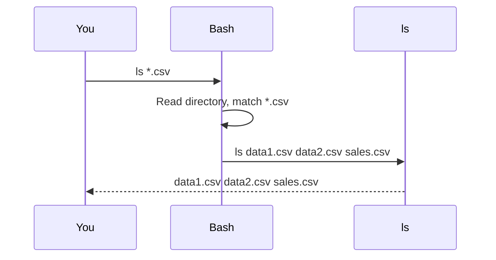
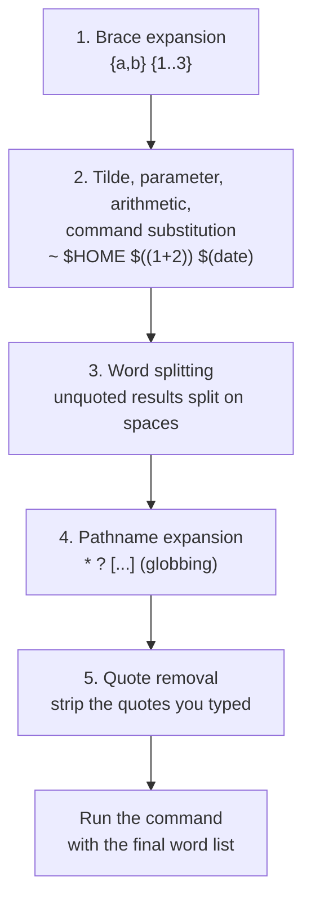

# Globbing and expansion

> **Level 1 · Chapter 2** · ⏱️ ~30 min read · Prerequisites: [Working with files](01-working-with-files.md)

Before bash runs any command, it rewrites the line you typed: `*.csv` becomes a list of file names, `{1..3}` becomes `1 2 3`, and `~` becomes your home directory. This chapter explains every one of those rewrites, the order they happen in, and how to switch them off with quotes.

## Why it matters

Alex keeps monthly reports in one folder and wants to delete the old ones from the first quarter:

```bash
rm report-2026-0[1-3].csv
```

That works. A month later, in a hurry, Alex types:

```bash
rm report-2026-0 *.csv
```

There is a space before `*.csv`. `rm` complains that `report-2026-0` does not exist, and then deletes **every** CSV in the folder. `rm` did nothing wrong: it never saw `*.csv`. Bash replaced `*.csv` with the names of all the CSV files before `rm` started, and `rm` deleted exactly what it was given.

Later that week, a cleanup script that loops over `*.tmp` fails with `rm: cannot remove '*.tmp': No such file or directory` on a day when there are no temporary files. And `find . -name *.csv` works in one directory but errors in another.

All three surprises come from one fact: **the shell expands patterns, not the command**. Once you can predict exactly what bash will turn your line into, these bugs disappear.

## Concepts

### The shell expands, the command receives a list

When you press ++enter++, bash does not hand your text to the program. It first breaks the line into words, then performs a series of **expansions** (rewrites) on those words, and only then starts the program with the final list of words as its **arguments**.



`ls` never sees the `*`. It receives three file names, exactly as if you had typed them. This has big consequences:

- **Every command gets wildcards for free.** `rm`, `cp`, `wc`, and your own scripts all support `*` without any code, because the shell does the work.
- **Commands cannot tell** whether you typed names or a pattern. `rm *` cannot warn "you used a wildcard", because it never saw one.
- **You can preview** any expansion by putting `echo` in front of the command. `echo rm *.csv` prints the exact command that would run.

### Glob patterns

Matching file names with wildcards is called **globbing**, and the patterns are called **globs**. The name comes from an early Unix program called `glob` that did this job. The pattern characters are:

| Pattern | Matches | Example | Example matches |
|---|---|---|---|
| `*` | Any string, including empty | `*.csv` | `a.csv`, `sales.csv`, but not the hidden `.old.csv` |
| `?` | Exactly one character | `data?.csv` | `data1.csv`, `dataA.csv`, not `data10.csv` |
| `[abc]` | One character from the set | `data[12].csv` | `data1.csv`, `data2.csv` |
| `[a-z]` | One character in the range | `report-0[1-3].csv` | `report-01.csv` to `report-03.csv` |
| `[!abc]` or `[^abc]` | One character **not** in the set | `data[!0-9].csv` | `dataA.csv` |
| `[[:digit:]]` | One character in a named class | `*[[:digit:]].csv` | `data1.csv`, `data10.csv` |

The named **character classes** include `[:digit:]`, `[:alpha:]`, `[:alnum:]`, `[:upper:]`, `[:lower:]`, `[:space:]`, and `[:punct:]`. They go **inside** a bracket expression, which is why you see double brackets: `[[:upper:]]*` means "one uppercase letter, then anything".

Two rules apply to every glob:

1. A glob must match the **whole name**. `data?.csv` does not match `mydata1.csv`, because nothing in the pattern covers `my`.
2. `*` and `?` never match a `/`. `*.py` only matches in the current directory, never in subdirectories. `src/*.py` matches one level down.

!!! info "Ranges and your language settings"
    In some languages, the sort order interleaves upper and lowercase letters (`a A b B ...`), so `[a-c]` could match `B`. Bash 5.2 on Mint has the `globasciiranges` option turned on by default, which makes ranges use plain ASCII order. `[a-z]` means lowercase ASCII letters. For portable scripts, prefer named classes like `[[:lower:]]`.

### Globs are not regular expressions

Later in this level you will meet **regular expressions** (regex), the pattern language used by `grep`, `sed`, and `awk`. They look similar to globs but mean different things:

| Idea | Glob | Regular expression |
|---|---|---|
| Any string | `*` | `.*` |
| Any single character | `?` | `.` |
| A literal dot | `.` | `\.` |
| "Zero or more of the previous thing" | (no equivalent) | `*` |
| One character from a set | `[abc]` | `[abc]` |
| Must match | The whole file name | Anywhere in the line, unless anchored with `^` and `$` |
| Used by | The shell, `find -name`, `case` | `grep`, `sed`, `awk`, `find -regex` |

The biggest trap is `*`. In a glob it means "anything". In a regex it means "zero or more of the character before me", so the regex `*.csv` is not even valid and `a*` matches the empty string. When you hand a regex to `grep`, you must quote it, or the shell will treat it as a glob first.

### Hidden files and globs

A file whose name starts with a dot, such as `.bashrc` or `.env`, is a **hidden file** (also called a **dotfile**). `ls` skips them unless you pass `-a`. Globs skip them too: `*` does not match a leading dot. This is deliberate. It stops `rm *` from deleting your `.git` directory and configuration files.

To match hidden files, the pattern itself must start with a dot: `.*` matches `.env` and `.bashrc`. In older shells, `.*` also matched the special entries `.` (this directory) and `..` (the parent), which made `rm -r .*` a famous way to delete the parent directory. Bash 5.2 has the `globskipdots` option on by default, so `.*` no longer matches `.` and `..`. Do not rely on that in other shells.

### When nothing matches

What does `ls *.log` do in a folder with no `.log` files? By default, bash leaves the pattern **unchanged** and passes the literal text `*.log` to the command:

```text
ls: cannot access '*.log': No such file or directory
```

That error comes from `ls`, which was asked to list a file literally named `*.log`. Usually you get a confusing error. Sometimes you get something worse: a loop that runs once with the pattern as the "file name". Bash has two options to change this:

- **nullglob**: a pattern that matches nothing expands to nothing at all.
- **failglob**: a pattern that matches nothing is an error, and the command does not run.

You turn shell options on with `shopt -s name` and off with `shopt -u name`. Two more options change what globs match:

- **dotglob**: `*` also matches hidden files (but never `.` and `..`).
- **globstar**: `**` matches any number of directories, so `**/*.py` finds Python files at every depth.

All four are **off** by default in an interactive Mint shell.

### Brace expansion: generating words

**Brace expansion** looks like globbing but works completely differently. Globs **match** existing file names. Brace expansion **generates** words from a template, whether or not any files exist:

| Form | Expands to |
|---|---|
| `{a,b,c}` | `a b c` |
| `file.{csv,json}` | `file.csv file.json` |
| `{1..5}` | `1 2 3 4 5` |
| `{01..10..3}` | `01 04 07 10` (zero-padded, step 3) |
| `{a..e}` | `a b c d e` |
| `{2025,2026}-{01..02}` | `2025-01 2025-02 2026-01 2026-02` |
| `config.ini{,.bak}` | `config.ini config.ini.bak` |

The rules: a list needs at least one unquoted comma, a sequence needs `..`, and there must be no spaces inside the braces. `{x}` and `{ a,b }` are left alone.

Because brace expansion does not look at the disk, `mkdir {raw,clean,logs}` creates three directories that did not exist, which a glob could never do.

### Tilde expansion

A word that starts with `~` gets **tilde expansion**:

| Form | Expands to |
|---|---|
| `~` | Your home directory, the value of `$HOME` (`/home/alex`) |
| `~/notes` | `/home/alex/notes` |
| `~bianca` | Another user's home, from the user database (`/home/bianca`) |
| `~+` | The current directory (`$PWD`) |
| `~-` | The previous directory (`$OLDPWD`, where `cd -` goes) |

Tilde expansion happens only at the **start** of a word (or after `=` or `:` in an assignment such as `PATH=~/bin:$PATH`). Inside quotes, `"~"` is a literal tilde. Use `"$HOME"` when you need quoting.

### The order of shell expansions

Bash performs expansions in a fixed order. The order explains many puzzles, so it is worth learning:



1. **Brace expansion** runs first, purely on the text.
2. **Tilde expansion, parameter expansion** (`$VAR`), **arithmetic expansion** (`$((2+3))`), and **command substitution** (`$(command)`, which runs a command and inserts its output) all happen next, left to right.
3. **Word splitting**: the results of step 2 that were not in double quotes are split into separate words at spaces, tabs, and newlines.
4. **Pathname expansion** (globbing) replaces each word that contains an unquoted `*`, `?`, or `[` with matching file names.
5. **Quote removal** deletes the quote characters you typed, so the command never sees them.

Consequences you will hit in real life:

- `n=3; echo {1..$n}` prints `{1..3}`, not `1 2 3`. Brace expansion ran before `$n` was replaced, and saw `{1..$n}`, which is not a valid sequence.
- `pattern="*.csv"; ls $pattern` lists CSV files. The variable expanded in step 2, and the unquoted result was globbed in step 4. `ls "$pattern"` looks for a file literally called `*.csv`.
- `f="my report.csv"; rm $f` tries to delete two files, `my` and `report.csv`, because of word splitting in step 3. Always write `"$f"`. Level 2 covers this in depth in [Variables, quoting, and arrays](../02-scripting/02-variables-quoting-arrays.md).

### Quoting to prevent expansion

**Quoting** tells bash to treat characters literally. There are three tools:

| Quoting | Brace, tilde, glob | `$VAR`, `$(...)`, `$((...))` | Word splitting |
|---|---|---|---|
| None | Expanded | Expanded | Yes |
| `"double quotes"` | Not expanded | **Expanded** | No |
| `'single quotes'` | Not expanded | Not expanded | No |
| `\` before one character | That character is literal | That character is literal | No |

```bash
echo *.csv "*.csv" '*.csv' \*.csv
echo "$HOME" '$HOME' \$HOME
```

```text
data10.csv data1.csv data2.csv dataA.csv *.csv *.csv *.csv
/home/alex $HOME $HOME
```

The rule of thumb: use **single quotes** for patterns you hand to other programs (`grep 'a.*b'`, `find -name '*.csv'`), and **double quotes** around variables (`"$file"`).

## Commands and examples

Create a sandbox. This uses brace expansion itself, so read it carefully before running it:

```bash
mkdir -p ~/practice/glob && cd ~/practice/glob
touch report-2026-{01,02,03,10,11}.csv data{1,2,10,A}.csv notes.txt Notes.md .env .hidden-config
mkdir -p src/lib/util && touch src/main.py src/lib/db.py src/lib/util/strings.py
ls
```

```text
data10.csv  dataA.csv  report-2026-01.csv  report-2026-10.csv
data1.csv   Notes.md   report-2026-02.csv  report-2026-11.csv
data2.csv   notes.txt  report-2026-03.csv  src
```

!!! info "Why is `data10.csv` before `data1.csv`?"
    `ls` sorts names according to your language settings, which mostly ignore punctuation. It compares `data10csv` with `data1csv`, and `0` sorts before `c`. Globs are sorted the same way. Run `LC_ALL=C ls` to see plain byte order, where uppercase comes before lowercase.

### Previewing with echo

Before running anything destructive with a glob, put `echo` in front:

```bash
echo rm report-2026-0*.csv
```

```text
rm report-2026-01.csv report-2026-02.csv report-2026-03.csv
```

That is exactly the command bash would run. If the list is right, press ++up++, delete `echo `, and press ++enter++.

`printf '%s\n'` prints one word per line, which is easier to read for long lists:

```bash
printf '%s\n' report-*
```

```text
report-2026-01.csv
report-2026-02.csv
report-2026-03.csv
report-2026-10.csv
report-2026-11.csv
```

### Star and question mark

```bash
echo *.csv
echo data?.csv
echo data??.csv
```

```text
data10.csv data1.csv data2.csv dataA.csv report-2026-01.csv report-2026-02.csv report-2026-03.csv report-2026-10.csv report-2026-11.csv
data1.csv data2.csv dataA.csv
data10.csv
```

`?` is exactly one character, so `data?.csv` misses `data10.csv` and `data??.csv` finds only it.

### Sets, ranges, and negation

```bash
echo data[12].csv
echo data[0-9].csv
echo data[!0-9].csv
echo report-2026-0[1-3].csv
echo report-2026-1?.csv
echo [nN]otes*
echo [[:upper:]]*
```

```text
data1.csv data2.csv
data1.csv data2.csv
dataA.csv
report-2026-01.csv report-2026-02.csv report-2026-03.csv
report-2026-10.csv report-2026-11.csv
Notes.md notes.txt
Notes.md
```

A bracket expression always matches **exactly one** character. `[0-9]` is a single digit, never "a number". To match `data10.csv` you need `data[0-9][0-9].csv` or `data*.csv`.

!!! warning "Common mistake"
    Writing `[1-12]` to mean "1 to 12". Inside brackets, `1-1` is a range containing just `1`, and then `2` is a separate character. `[1-12]` means "one character that is 1 or 2". For number ranges in names, use brace expansion: `report-2026-{01..12}.csv`.

### Hidden files

```bash
echo *
echo .*
```

```text
data10.csv data1.csv data2.csv dataA.csv Notes.md notes.txt report-2026-01.csv report-2026-02.csv report-2026-03.csv report-2026-10.csv report-2026-11.csv src
.env .hidden-config
```

`*` skipped `.env` and `.hidden-config`. `.*` matched only those. Thanks to `globskipdots`, it did not include `.` and `..`.

### Changing glob behavior with shopt

`shopt name` shows an option's current state:

```bash
shopt nullglob failglob dotglob globstar
```

```text
nullglob       	off
failglob       	off
dotglob        	off
globstar       	off
```

#### No match: default, nullglob, failglob

```bash
echo *.log
ls *.log
```

```text
*.log
ls: cannot access '*.log': No such file or directory
```

With the default behavior, the unmatched pattern is passed through literally. A loop then runs once with a bogus name:

```bash
for f in *.log; do echo "processing $f"; done
```

```text
processing *.log
```

`nullglob` makes the pattern vanish:

```bash
shopt -s nullglob
for f in *.log; do echo "processing $f"; done
echo "loop finished"
shopt -u nullglob
```

```text
loop finished
```

The loop ran zero times, which is what you want in scripts. But nullglob has a sharp edge: `ls *.log` with nullglob becomes plain `ls`, which lists **everything**. And `rm -f *.log` becomes `rm -f`, which is harmless, but `cat *.log` becomes `cat`, which waits for keyboard input. Turn it on in scripts around loops, not permanently in your interactive shell.

`failglob` makes a non-matching pattern an error, and the command does not run at all:

```bash
shopt -s failglob
echo *.log
shopt -u failglob
```

```text
bash: no match: *.log
```

#### dotglob

```bash
shopt -s dotglob
echo *
shopt -u dotglob
```

```text
data10.csv data1.csv data2.csv dataA.csv .env .hidden-config Notes.md notes.txt report-2026-01.csv report-2026-02.csv report-2026-03.csv report-2026-10.csv report-2026-11.csv src
```

Useful when you need to move "everything including dotfiles" from one directory to another: `shopt -s dotglob; mv old/* new/`.

#### globstar and **

Without globstar, `**` behaves like `*`:

```bash
echo **/*.py
```

```text
src/main.py
```

With globstar, `**` matches zero or more directories:

```bash
shopt -s globstar
echo **/*.py
shopt -u globstar
```

```text
src/lib/db.py src/lib/util/strings.py src/main.py
```

`**/*.py` is a quick way to grab files at any depth. For anything more complex (by size, age, or with exclusions), use `find`, covered in [Finding files](06-finding-files.md). The default `~/.bashrc` on Mint has a commented-out `#shopt -s globstar` line; remove the `#` if you want it permanently.

!!! tip "Extended globs"
    `shopt -s extglob` enables extra patterns: `!(*.csv)` matches everything that is **not** a CSV, `*.@(md|txt)` matches names ending in `.md` or `.txt`, and `+(pattern)` matches one or more repeats. They are handy in scripts; you will see `extglob` again in Level 2.

### Brace expansion in practice

Sequences and lists:

```bash
echo {1..10}
echo {01..10..2}
echo {10..1..3}
echo {a..z..5}
echo log-{2025,2026}-{01..03}.gz
```

```text
1 2 3 4 5 6 7 8 9 10
01 03 05 07 09
10 7 4 1
a f k p u z
log-2025-01.gz log-2025-02.gz log-2025-03.gz log-2026-01.gz log-2026-02.gz log-2026-03.gz
```

- A leading zero on either end (`01`) makes every number **zero-padded** to the same width. That keeps file names sorted correctly.
- The third number is the **step**. Sequences can count down.
- Two brace groups side by side produce every **combination**, left group varying slowest.

Common real uses:

```bash
mkdir -p data/{raw,clean,archive}/{2025,2026}       # 6 directories in one command
cp config.ini{,.bak}                                # cp config.ini config.ini.bak
mv report.{txt,md}                                  # rename: change the extension
touch day-{01..31}.log                              # 31 empty files
```

`cp config.ini{,.bak}` deserves a closer look. The list `{,.bak}` has two items: an empty string and `.bak`. So the word becomes `config.ini` and `config.ini.bak`. It is the fastest way to take a backup copy before editing a config file.

Brace expansion ignores the disk:

```bash
echo data{1,2,9}.csv
echo data[129].csv
```

```text
data1.csv data2.csv data9.csv
data1.csv data2.csv
```

Brace expansion produced `data9.csv` even though it does not exist. The glob only matched files that exist.

### Tilde expansion

```bash
echo ~ ~/notes ~root
echo "~"
cd /tmp && cd ~/practice/glob && echo ~-
```

```text
/home/alex /home/alex/notes /root
~
/tmp
```

### Seeing what the shell does: set -x

`echo` shows one expansion. `set -x` (also called **xtrace**) makes bash print every command, fully expanded, before running it. Each traced line starts with `+`:

```bash
set -x
wc -c data?.csv
echo ~/backup-{1..2}
f="my file.txt"
touch $f
touch "$f"
set +x
```

```text
+ wc -c data1.csv data2.csv dataA.csv
0 data1.csv
0 data2.csv
0 dataA.csv
0 total
+ echo /home/alex/backup-1 /home/alex/backup-2
/home/alex/backup-1 /home/alex/backup-2
+ f='my file.txt'
+ touch my file.txt
+ touch 'my file.txt'
+ set +x
```

Look at the two `touch` lines. The unquoted `$f` became two arguments, `my` and `file.txt`, so `touch` created two wrong files. The quoted `"$f"` stayed one argument. xtrace shows the quotes bash would need to reproduce the argument, which makes word-splitting bugs visible.

`set -x` is the single most useful tool for debugging scripts. Turn it off with `set +x`. In your interactive shell, Mint's prompt setup may print some extra `+` lines after each command while xtrace is on; ignore them.

### Quoting patterns you pass to other programs

`find` and `grep` understand patterns themselves. You must stop bash from expanding them first. Here is what happens in a directory that contains several CSVs when you forget the quotes:

```bash
find . -name *.csv
```

```text
find: paths must precede expression: `data1.csv'
find: possible unquoted pattern after predicate `-name'?
```

Bash expanded `*.csv` to `data10.csv data1.csv data2.csv ...`, so `find` received `-name data10.csv data1.csv ...` and choked on the extra names. Worse: in a directory with exactly **one** CSV, there is no error. Bash expands `*.csv` to that one name, and `find` silently searches only for files with that exact name.

```bash
find . -name '*.csv'
```

With single quotes, `find` receives the literal pattern `*.csv` and applies it to every file in the tree.

| You want | Write |
|---|---|
| Find files by glob pattern | `find . -name '*.csv'` |
| Grep for a regex | `grep 'err.*timeout' app.log` |
| Pass a literal `*` to echo | `echo '*'` |
| Keep a variable as one argument | `cp "$src" "$dest"` |
| Expand a variable but not a glob inside it | `echo "$pattern"` |

## Exercises

### Exercise 1: Predict, then check (easy)

In the `~/practice/glob` sandbox, predict the output of each line, then run it with `echo` to check: `data[0-9]*.csv`, `report-2026-?[!0].csv`, `*[[:upper:]]*`, `.??*`.

??? success "Solution"

    ```bash
    echo data[0-9]*.csv
    echo report-2026-?[!0].csv
    echo *[[:upper:]]*
    echo .??*
    ```

    ```text
    data10.csv data1.csv data2.csv
    report-2026-01.csv report-2026-02.csv report-2026-03.csv report-2026-11.csv
    dataA.csv Notes.md
    .env .hidden-config
    ```

    - `data[0-9]*.csv`: a digit right after `data`, then anything. `dataA.csv` fails.
    - `report-2026-?[!0].csv`: any character, then a character that is not `0`. Only `report-2026-10.csv` fails.
    - `*[[:upper:]]*`: any name containing an uppercase letter.
    - `.??*`: a dot followed by at least two characters. This is an old trick to match dotfiles while excluding `..`, from before `globskipdots` existed.

### Exercise 2: Generate a dated folder tree (easy)

With a single command, create directories `archive/2026/01` through `archive/2026/12`, all zero-padded. Then list just the first three with a glob.

??? success "Solution"

    ```bash
    mkdir -p archive/2026/{01..12}
    echo archive/2026/0[1-3]
    ```

    ```text
    archive/2026/01 archive/2026/02 archive/2026/03
    ```

    Brace expansion generated the twelve names (there is nothing to match yet, so a glob could not have done it). The glob then matched the existing directories.

### Exercise 3: Safe loop over files (medium)

Write a loop that prints `found: <name>` for every `.log` file in the current directory, and prints nothing (not even a bogus line) when there are no `.log` files. Test it in a directory with and without logs. Use `set -x` to see the expanded loop list.

??? success "Solution"

    ```bash
    shopt -s nullglob
    for f in *.log; do echo "found: $f"; done
    shopt -u nullglob
    ```

    With no logs, nothing prints, because `*.log` expanded to an empty list. With `touch a.log b.log`:

    ```text
    found: a.log
    found: b.log
    ```

    With `set -x` on, the `for` line shows the list bash actually iterates over, e.g. `+ for f in *.log` followed by `+ echo 'found: a.log'`. Without nullglob, you would see `found: *.log` in the empty case.

### Exercise 4: Explain the expansion order (medium)

Explain the output of each command, using the order of expansions:

```bash
n=3; echo {1..$n}
echo $(echo '{a,b}')
x='*.csv'; echo $x; echo "$x"
```

??? success "Solution"

    ```text
    {1..3}
    {a,b}
    data10.csv data1.csv data2.csv dataA.csv report-2026-01.csv ...
    *.csv
    ```

    1. Brace expansion runs first, on the raw text `{1..$n}`. That is not a valid sequence (`$n` is not a number yet), so it is left alone. Then `$n` becomes `3`, giving `{1..3}`. Brace expansion never runs again.
    2. Command substitution produces the text `{a,b}`, but brace expansion already happened, so it stays literal.
    3. `$x` expands to `*.csv` in step 2; because it is unquoted, step 4 globs it. In `"$x"` the quotes prevent globbing, so `echo` prints the pattern itself.

    To get a sequence from a variable, use `seq 1 "$n"` or a C-style loop (`for ((i=1; i<=n; i++))`), which you will learn in Level 2.

### Exercise 5: Rescue the hurried rm (hard)

You are about to run `rm report-2026-0 *.csv` from the story. Without running `rm`, show exactly what it would do, explain why, and write the command you actually meant. Then write a version that shows a confirmation prompt listing the files, using only what you learned in this chapter and the previous one.

??? success "Solution"

    ```bash
    echo rm report-2026-0 *.csv
    ```

    ```text
    rm report-2026-0 data10.csv data1.csv data2.csv dataA.csv report-2026-01.csv report-2026-02.csv report-2026-03.csv report-2026-10.csv report-2026-11.csv
    ```

    The space split the intended pattern into two words. `report-2026-0` has no glob characters, so it stays literal (and `rm` would complain it does not exist). `*.csv` matches every CSV. `rm` would delete all of them.

    The intended command, previewed first:

    ```bash
    echo rm report-2026-0*.csv
    rm -i report-2026-0*.csv
    ```

    `-i` makes `rm` ask about each file, so you see every name before it goes. For many files, `rm -I` asks once with a count, which is still enough to catch "why is it deleting 9 files when I expected 3?".

## Check yourself

1. Who expands `*.csv` in `wc -l *.csv`: bash or `wc`? How can you prove it?

    ??? note "Answer"

        Bash. `wc` receives a list of file names. Prove it with `echo wc -l *.csv` or `set -x`, which show the expanded command before it runs.

2. Why does `*` not match `.bashrc`, and how can you make it?

    ??? note "Answer"

        Globs deliberately skip names starting with a dot, to protect hidden files from commands like `rm *`. Use a pattern that starts with a dot (`.*`), or turn on `shopt -s dotglob`.

3. What does `ls *.xyz` pass to `ls` when nothing matches, with default settings, with nullglob, and with failglob?

    ??? note "Answer"

        Default: the literal string `*.xyz`, so `ls` reports it cannot access `'*.xyz'`. nullglob: nothing, so the command becomes plain `ls` and lists the current directory. failglob: bash reports `no match: *.xyz` and does not run `ls` at all.

4. What is the difference between `data{1,2,9}.csv` and `data[129].csv`?

    ??? note "Answer"

        Brace expansion generates all three names whether or not the files exist. The glob matches only existing files whose name has a 1, 2, or 9 in that position.

5. What does `{01..10..3}` expand to?

    ??? note "Answer"

        `01 04 07 10`. The leading zero pads every number to two digits, and the third value is the step.

6. In what order does bash perform brace expansion, parameter expansion, word splitting, and globbing? Use the order to explain why `echo {1..$n}` does not work.

    ??? note "Answer"

        Brace expansion first; then tilde, parameter, arithmetic, and command substitution; then word splitting; then pathname expansion (globbing); then quote removal. Brace expansion sees `{1..$n}` before `$n` is replaced, decides it is not a valid sequence, and leaves it alone.

7. Why should you write `find . -name '*.csv'` with quotes?

    ??? note "Answer"

        Without quotes, bash globs `*.csv` against the current directory first. With several matches, `find` errors out; with exactly one match, `find` silently searches for that one name. Quotes pass the pattern through to `find`, which applies it throughout the tree.

8. How is the glob `*.log` different from the regex `*.log`?

    ??? note "Answer"

        As a glob, `*` means any string and `.` is a literal dot, so it matches names ending in `.log`. In a regex, `*` means "zero or more of the previous item" (and is invalid at the start), and `.` means any character. The regex for "ends with .log" is `\.log$`.

## Key takeaways

- The shell expands patterns before the command runs. Commands receive plain lists of words.
- `*`, `?`, and `[...]` match existing file names; brace expansion `{a,b}` and `{1..10}` generates words without looking at the disk.
- Globs skip hidden files and must match whole names. They are not regular expressions.
- Unmatched globs are passed through literally by default. Use `nullglob` in loops, and `failglob` when a missing match should be an error.
- Expansion order is brace, then tilde/variables/command substitution, then word splitting, then globbing, then quote removal.
- Single quotes stop everything; double quotes stop globbing and splitting but allow `$VAR`. Quote patterns you pass to `find` and `grep`, and quote your variables.
- Preview with `echo`, and debug with `set -x`.

## Next

Globs found the files; now learn who is allowed to read, change, and run them: [Permissions](03-permissions.md).
