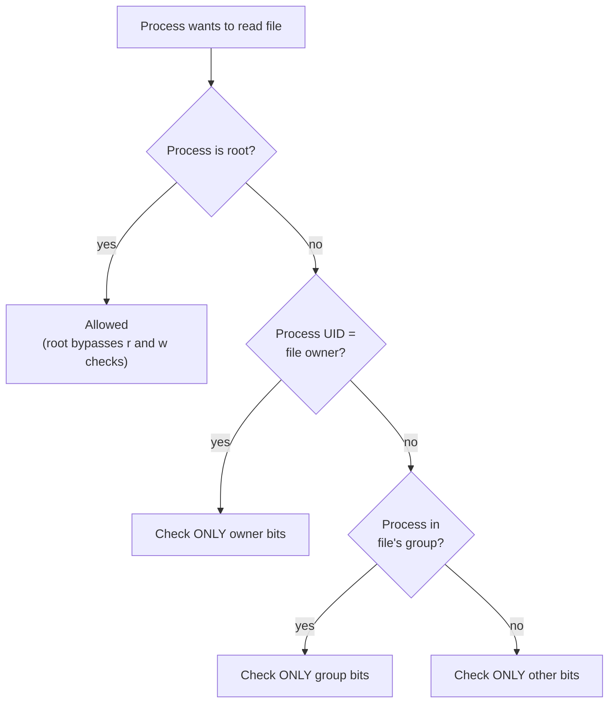
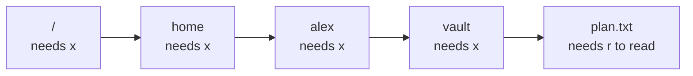

# Permissions

> **Level 1 · Chapter 3** · ⏱️ ~40 min read · Prerequisites: [Users, groups, and sudo](../00-first-steps/06-users-groups-sudo.md), [Working with files](01-working-with-files.md)

Every file and directory on Linux records who owns it and who may read, change, or run it. This chapter teaches you to read those permissions at a glance, change them precisely, and understand the rules the kernel applies, including the special bits that make `passwd` and `/tmp` work.

## Why it matters

Alex writes a small ETL script, `etl.sh`, and tries to run it:

```text
bash: ./etl.sh: Permission denied
```

A forum answer says "just run `chmod -R 777` on the folder". Alex runs it on the whole home directory to be safe. The script now runs. The next morning, `git push` fails:

```text
@@@@@@@@@@@@@@@@@@@@@@@@@@@@@@@@@@@@@@@@@@@@@@@@@@@@@@@@@@@
@         WARNING: UNPROTECTED PRIVATE KEY FILE!          @
@@@@@@@@@@@@@@@@@@@@@@@@@@@@@@@@@@@@@@@@@@@@@@@@@@@@@@@@@@@
Permissions 0777 for '/home/alex/.ssh/id_ed25519' are too open.
It is required that your private key files are NOT accessible by others.
This private key will be ignored.
```

SSH refuses to use a private key that other users could read. Worse, every user on the machine could now read Alex's files and edit Alex's `.bashrc`, which runs every time Alex opens a terminal.

The script only needed one permission bit: `chmod u+x etl.sh`. Understanding permissions means you fix the real problem with the smallest change, instead of opening everything up and creating new ones.

## Concepts

### Owners, groups, and the three classes

Every file has an **owner** (one user) and a **group** (one group). Every process runs as a user, with that user's **UID** (numeric user ID), a primary group, and a list of supplementary groups. You saw these in [Users, groups, and sudo](../00-first-steps/06-users-groups-sudo.md).

The permissions on a file define what three **classes** of user can do:

- **owner** (`u`, for "user"): the one user who owns the file.
- **group** (`g`): members of the file's group.
- **other** (`o`): everyone else.

For each class, there are three permissions: **read** (`r`), **write** (`w`), and **execute** (`x`). That gives nine permission bits.

### How the kernel checks permissions

When a process tries to open a file, the kernel picks **exactly one** class and checks only its bits:



The important word is "only". The classes are checked in order, and the first one that applies is final. If you own a file with permissions `---rwxrwx`, you **cannot** read it, even though everyone else can. The kernel decided you are the owner, looked at the owner bits, found nothing, and stopped.

**root** (UID 0) skips the read and write checks entirely. For execute, root needs at least one `x` bit set somewhere on the file. This is why `sudo` can read any file, and why mistakes as root are so destructive.

### Reading ls -l, field by field

```bash
ls -l etl.sh
```

```text
-rwxr-x--- 1 alex devs 2048 Sep 21 10:42 etl.sh
```

```text
-  rwx  r-x  ---  1  alex  devs  2048  Sep 21 10:42  etl.sh
│   │    │    │   │   │     │     │         │           └─ name
│   │    │    │   │   │     │     │         └─ mtime (last content change)
│   │    │    │   │   │     │     └─ size in bytes
│   │    │    │   │   │     └─ group
│   │    │    │   │   └─ owner
│   │    │    │   └─ hard link count
│   │    │    └─ other: no access
│   │    └─ group: read and execute
│   └─ owner: read, write, execute
└─ file type
```

The first character is the **file type**:

| Char | Type | Example |
|---|---|---|
| `-` | Regular file | `/etc/hostname` |
| `d` | Directory | `/etc` |
| `l` | Symbolic link (a pointer to another path) | `/bin -> usr/bin` |
| `c` | Character device (byte stream hardware) | `/dev/null`, `/dev/tty` |
| `b` | Block device (disk-like hardware) | `/dev/sda`, `/dev/nvme0n1` |
| `p` | Named pipe (FIFO) | made with `mkfifo` |
| `s` | Socket | `/run/systemd/notify` |

```bash
ls -ld /etc /bin /dev/null /dev/nvme0n1 /run/systemd/notify
```

```text
drwxr-xr-x 156 root root 12288 Sep 21 10:25 /etc
lrwxrwxrwx   1 root root     7 Jun  9 19:01 /bin -> usr/bin
crw-rw-rw-   1 root root  1, 3 Sep 21 09:35 /dev/null
brw-rw----   1 root disk 259, 0 Sep 21 09:35 /dev/nvme0n1
srwxrwxrwx   1 root root     0 Sep 21 09:35 /run/systemd/notify
```

A few details:

- `-d` makes `ls` show the directory itself instead of its contents.
- Symbolic links always show `rwxrwxrwx`. The link's own bits are ignored; the target's permissions are what count.
- For devices, the size column shows two numbers (major, minor) that identify the driver and the device. Level 3 explains them.
- A directory's link count is 2 plus its number of subdirectories, because each subdirectory's `..` entry points back to it.
- If a permission string ends with `+` (like `-rw-r--r--+`), the file also has an **ACL** (access control list), an extended set of per-user rules. Run `getfacl file` to see them. ACLs are beyond this chapter.

### What r, w, and x mean on files

| Bit | On a regular file |
|---|---|
| `r` | Read the contents (`cat`, `cp`, open in an editor) |
| `w` | Change the contents (write, truncate, append) |
| `x` | Run it as a program |

For scripts, `x` is not enough on its own: the interpreter must also read the file, so a script needs `r` and `x`. A compiled program needs only `x`.

Notice what is **not** in the table: deleting and renaming. Those are not operations on the file at all. They are operations on the directory that contains the name.

### What r, w, and x mean on directories

This is the part most people get wrong, and it is the key to understanding everything else. Recall from [chapter 1](01-working-with-files.md) that a directory is a special file containing a table of entries, each mapping a name to an inode number:

```text
Directory /home/alex/vault
┌───────────────┬──────────┐
│ name          │ inode    │
├───────────────┼──────────┤
│ plan.txt      │ 2763201  │
│ budget.csv    │ 2763202  │
└───────────────┴──────────┘
```

The three bits control access to **that table**:

| Bit | On a directory | Without it |
|---|---|---|
| `r` | **List** the names in the table (`ls`) | You cannot see what is inside |
| `x` | **Search/traverse**: look up a name in the table to reach its inode, and pass through to paths beyond | You cannot open, `cd` into, or even `stat` anything inside, even if you know its name |
| `w` | **Modify** the table: create, delete, and rename entries (also needs `x`) | You cannot add, remove, or rename files in it |

Why is `x` called "traverse"? To open `/home/alex/vault/plan.txt`, the kernel walks the path one component at a time: look up `home` in `/`, then `alex` in `/home`, then `vault` in `/home/alex`, then `plan.txt` in `/home/alex/vault`. Each lookup is a search in a directory's table, and each needs `x` on that directory. Missing `x` anywhere along the path stops the walk.



This produces some surprising combinations:

| Dir perms | `ls dir` | `cat dir/known-file` | `cd dir` | Create/delete in dir |
|---|---|---|---|---|
| `r-x` | Yes | Yes (if file allows) | Yes | No |
| `r--` | Names only, with errors | No | No | No |
| `--x` | No | Yes, if you know the name | Yes | No |
| `rwx` | Yes | Yes | Yes | Yes |
| `-wx` | No | Yes, if you know the name | Yes | Yes |

The two consequences that matter most in practice:

1. **Deleting a file is controlled by the directory, not the file.** If you have `w` and `x` on a directory, you can delete any file in it, even a read-only file owned by someone else. (The sticky bit, below, is the exception.) That is why `rm` only asks "remove write-protected file?" instead of refusing.
2. **Your home directory guards everything inside it.** On Mint, home directories are created `drwxr-x---` (750). Other users lack `x` on `/home/alex`, so they cannot reach any file inside it, no matter how permissive that file's own bits are.

### Octal notation

Each permission bit has a value: `r` = 4, `w` = 2, `x` = 1. Add them up for each class to get one digit from 0 to 7. Three digits describe owner, group, and other:

| Digit | Binary | Bits | Meaning |
|---|---|---|---|
| 0 | 000 | `---` | Nothing |
| 1 | 001 | `--x` | Execute only |
| 2 | 010 | `-w-` | Write only |
| 3 | 011 | `-wx` | Write and execute |
| 4 | 100 | `r--` | Read only |
| 5 | 101 | `r-x` | Read and execute |
| 6 | 110 | `rw-` | Read and write |
| 7 | 111 | `rwx` | Everything |

So `rwxr-x---` is `7` `5` `0`, or **750**. This notation is called **octal** because each digit is a base-8 number, which fits exactly three bits.

The common values worth memorizing:

| Octal | Symbolic | Typical use |
|---|---|---|
| 644 | `rw-r--r--` | Normal files: you edit, everyone reads |
| 600 | `rw-------` | Private files: SSH keys, credentials |
| 755 | `rwxr-xr-x` | Programs, scripts, and normal directories |
| 750 | `rwxr-x---` | Directories shared with your group only |
| 700 | `rwx------` | Private directories, such as `~/.ssh` |
| 664 / 775 | `rw-rw-r--` / `rwxrwxr-x` | Files and directories a group edits together |

### Special bits: setuid, setgid, and sticky

There is a fourth octal digit, written in front of the other three, for three special bits:

| Bit | Octal | On an executable file | On a directory |
|---|---|---|---|
| **setuid** | 4000 | Runs with the **file owner's** identity | (no effect on Linux) |
| **setgid** | 2000 | Runs with the **file's group** | New files inherit the directory's group |
| **sticky** | 1000 | (no effect on Linux) | Only a file's owner (or the directory's owner, or root) can delete or rename it |

`ls -l` shows them in the `x` positions:

- `s` in the owner's `x` slot means setuid **and** execute. `S` means setuid without execute (usually a mistake).
- `s` in the group's `x` slot means setgid. `S` again means without execute.
- `t` in the other `x` slot means sticky and executable by others. `T` means sticky without it.

#### setuid: how passwd edits a file you cannot read

```bash
ls -l /usr/bin/passwd /etc/shadow
```

```text
-rw-r----- 1 root shadow  1293 Jun  9 19:21 /etc/shadow
-rwsr-xr-x 1 root root   64152 May 30  2024 /usr/bin/passwd
```

Password hashes live in `/etc/shadow`, which only root can write and only root and the `shadow` group can read. Yet any user can run `passwd` to change their own password. The `s` in `rws` is the setuid bit. When you run `passwd`, the kernel starts the process with an **effective UID** of root (the file's owner) instead of yours. The process still knows your real UID, and `passwd` is carefully written to only let you change your own entry.

A setuid-root program is a security boundary: any bug in it can give an attacker root. That is why there are only a handful on the system, and why Linux ignores the setuid bit on scripts (an interpreted script has too many ways to be tricked).

#### setgid on a directory: shared project folders

When a directory has setgid set, files created inside it get the **directory's group** instead of the creator's primary group. That is exactly what a team folder needs: everyone's files belong to the team group, so everyone can work on them. Mint uses this for `/var/mail` and `/var/local`:

```bash
ls -ld /var/local
```

```text
drwxrwsr-x 2 root staff 4096 Apr 22  2024 /var/local
```

On an executable, setgid works like setuid but for the group. `/usr/bin/crontab` is setgid `crontab`, so it can write to the crontab spool directory that ordinary users cannot touch.

#### sticky: why /tmp is safe to share

```bash
ls -ld /tmp
```

```text
drwxrwxrwt 39 root root 12288 Sep 21 10:43 /tmp
```

`/tmp` is `rwxrwxrwx`: everyone may create files there. Without anything else, the rule "deleting is controlled by the directory" would let any user delete anyone else's files in `/tmp`. The `t` (sticky bit, octal 1777) adds a restriction: you can only delete or rename entries you own.

### Default permissions and the umask

When a program creates a file, it asks for a mode. Most programs (including `touch`, editors, and `>` redirection) ask for **666** (`rw-rw-rw-`) for files and **777** for directories. Programs never ask for `x` on ordinary files, which is why new files are never executable and you must `chmod +x` your scripts.

Before the mode is applied, the kernel removes the bits set in the process's **umask** (user file-creation mask). The umask is a list of permissions to **take away**:

```text
requested:  666   rw- rw- rw-
umask:      002   --- --- -w-   (remove "write" for other)
result:     664   rw- rw- r--
```

The operation is "keep the requested bits that are **not** in the umask", a bitwise AND with the inverse. It is **not** subtraction, which matters when the digits do not line up:

```text
requested:  666   rw- rw- rw-
umask:      033   --- -wx -wx
wrong:      666 - 033 = 633  ← subtraction gives rw--wx-wx, nonsense
right:      644   rw- r-- r--  ← x was never requested, so removing it changes nothing
```

#### Mint's umask is 002, not 022

```bash
umask
umask -S
```

```text
0002
u=rwx,g=rwx,o=rx
```

`umask` prints four digits (the first is for the special bits). `-S` shows the permissions that are **kept**, which many people find easier.

Many tutorials say the default umask is 022, giving `644` files. On Mint and Ubuntu, regular users get **002**, giving `664` files and `775` directories. This comes from the **user private group** scheme: every user has a personal group with the same name (`alex` is in group `alex`), and nobody else is in it. Since your group contains only you, giving the group write access costs nothing, and it makes setgid shared folders work smoothly. The system sets this through `pam_umask` and `USERGROUPS_ENAB yes` in `/etc/login.defs`. Root still gets 022.

| umask | New files | New directories | Good for |
|---|---|---|---|
| 002 | 664 `rw-rw-r--` | 775 `rwxrwxr-x` | Mint default for users; group collaboration |
| 022 | 644 `rw-r--r--` | 755 `rwxr-xr-x` | Root; traditional default |
| 027 | 640 `rw-r-----` | 750 `rwxr-x---` | Servers: nothing for "other" |
| 077 | 600 `rw-------` | 700 `rwx------` | Handling secrets |

### Who can change ownership

- Only **root** can change a file's owner (`chown`). Otherwise you could "give" a file to someone to dodge disk quotas, or create a setuid program owned by another user.
- The **owner** of a file can change its group (`chgrp`), but only to a group they belong to.
- Only the owner (or root) can change a file's permissions with `chmod`.

## Commands and examples

Make a sandbox:

```bash
mkdir -p ~/practice/perm && cd ~/practice/perm
```

### Inspecting permissions

`ls -l` for files, `ls -ld` for a directory itself, and `stat` for the octal value:

```bash
stat -c '%a %A %U:%G %n' /tmp /usr/bin/passwd /etc/shadow ~
```

```text
1777 drwxrwxrwt root:root /tmp
4755 -rwsr-xr-x root:root /usr/bin/passwd
640 -rw-r----- root:shadow /etc/shadow
750 drwxr-x--- alex:alex /home/alex
```

When you get "Permission denied" on a long path, `namei -l` shows the permissions of **every directory along the path**, so you can spot which one is missing `x`:

```bash
namei -l /home/alex/.bashrc
```

```text
f: /home/alex/.bashrc
drwxr-xr-x root root /
drwxr-xr-x root root home
drwxr-x--- alex alex alex
-rw-r--r-- alex alex .bashrc
```

Another user (not in group `alex`) would pass `/` and `home`, then fail at `alex`, because "other" has no `x` there. The `.bashrc` file's `r--` for other never comes into play.

### chmod with symbolic modes

Symbolic modes read like sentences: **who**, **operator**, **which bits**.

- Who: `u` (owner), `g` (group), `o` (other), `a` (all three). Leaving it out means `a`, filtered by your umask.
- Operator: `+` adds, `-` removes, `=` sets exactly (clearing anything not listed).
- Bits: `r`, `w`, `x`, plus `X`, `s`, `t` covered below.

```bash
touch script.sh
ls -l script.sh
chmod u+x script.sh
ls -l script.sh
chmod go-w script.sh
ls -l script.sh
chmod u=rwx,g=rx,o= script.sh
ls -l script.sh
```

```text
-rw-rw-r-- 1 alex alex 0 Sep 21 10:43 script.sh
-rwxrw-r-- 1 alex alex 0 Sep 21 10:43 script.sh
-rwxr--r-- 1 alex alex 0 Sep 21 10:43 script.sh
-rwxr-x--- 1 alex alex 0 Sep 21 10:43 script.sh
```

Commas separate clauses, and there must be no spaces. `o=` with nothing after it removes everything for other.

Symbolic mode shines when you want to change **one** thing and leave the rest alone. `chmod u+x` adds execute for you without caring what the other eight bits were.

### chmod with octal modes

Octal sets **all** the bits at once:

```bash
chmod 755 script.sh && ls -l script.sh
chmod 640 script.sh && stat -c '%a %A' script.sh
chmod 600 script.sh && ls -l script.sh
```

```text
-rwxr-xr-x 1 alex alex 0 Sep 21 10:43 script.sh
640 -rw-r-----
-rw------- 1 alex alex 0 Sep 21 10:43 script.sh
```

Use octal when you know the exact final state you want (`chmod 600 ~/.ssh/id_ed25519`), and symbolic when you want to adjust.

### Making a script executable

```bash
printf 'echo "ETL started"\n' > etl.sh
./etl.sh
```

```text
bash: ./etl.sh: Permission denied
```

```bash
chmod u+x etl.sh
./etl.sh
```

```text
ETL started
```

`bash etl.sh` would have worked without `x`, because then `bash` is the program being executed and it only needs to **read** the script. The `x` bit matters when you ask the kernel to run the file directly. [Your first script](../02-scripting/01-first-script.md) covers this, along with the `#!` line.

### Directory permissions in action

Create a directory with a file in it, then change only the directory's bits. You are the owner, so the owner bits are what count:

```bash
mkdir vault && echo "secret plan" > vault/plan.txt
chmod 300 vault       # -wx: traverse and modify, but no listing
ls vault
cat vault/plan.txt
```

```text
ls: cannot open directory 'vault': Permission denied
secret plan
```

Without `r`, you cannot list the names. With `x`, you can still reach a file **if you already know its name**.

```bash
chmod 600 vault       # rw-: listing, but no traverse
ls vault
cat vault/plan.txt
cd vault
```

```text
plan.txt
cat: vault/plan.txt: Permission denied
bash: cd: vault: Permission denied
```

Now the opposite: you can read the list of names, but you cannot use any of them. With `ls -l`, which must look up each entry's inode, it gets stranger:

```bash
ls -l vault
```

```text
ls: cannot access 'vault/plan.txt': Permission denied
total 0
-????????? ? ? ? ?            ? plan.txt
```

`ls` read the name from the directory table (allowed by `r`) but could not reach the inode (needs `x`), so every detail is a question mark.

Finally, show that deleting depends on the directory's `w`, not the file's:

```bash
chmod 700 vault
chmod 444 vault/plan.txt     # file is read-only for everyone
rm vault/plan.txt
```

```text
rm: remove write-protected regular file 'vault/plan.txt'? y
```

The file is gone. And the reverse: a writable file in a read-only directory can be changed but not deleted:

```bash
echo "draft" > vault/notes.txt
chmod 500 vault              # r-x: no w on the directory
echo "more" >> vault/notes.txt && cat vault/notes.txt
rm vault/notes.txt
touch vault/new.txt
chmod 700 vault
```

```text
draft
more
rm: cannot remove 'vault/notes.txt': Permission denied
touch: cannot touch 'vault/new.txt': Permission denied
```

Appending worked (needs `w` on the **file**). Removing and creating failed (need `w` on the **directory**).

### Recursive changes and the capital X

`chmod -R` applies a mode to a directory and everything inside it. With octal modes, this is almost always wrong, because files and directories need different bits:

```bash
mkdir -p proj/{bin,data} && echo 'echo hi' > proj/bin/run.sh && echo 'a,b' > proj/data/x.csv
chmod -R 644 proj
```

```text
chmod: cannot access 'proj/data': Permission denied
chmod: cannot access 'proj/bin': Permission denied
```

`chmod` set `proj` to 644 first, removing `x`, and then could not traverse into it to continue. The opposite mistake, `chmod -R 755`, makes every data file executable.

The capital **X** means "execute, but only for directories, and for files that already have execute for someone". It is designed for exactly this situation:

```bash
chmod 755 proj
chmod -R u=rwX,go=rX proj
ls -lR proj
```

```text
proj:
total 8
drwxr-xr-x 2 alex alex 4096 Sep 21 10:52 bin
drwxr-xr-x 2 alex alex 4096 Sep 21 10:52 data

proj/bin:
total 4
-rw-r--r-- 1 alex alex 8 Sep 21 10:52 run.sh

proj/data:
total 4
-rw-r--r-- 1 alex alex 4 Sep 21 10:52 x.csv
```

Directories got `x`; files did not. When some files are already wrongly executable, `X` would keep their `x`, so clear it first with `chmod -R a-x,u=rwX,go=rX proj`. The most explicit approach uses `find` to treat files and directories separately; you will learn it in [Finding files](06-finding-files.md):

```bash
find proj -type d -exec chmod 755 {} +
find proj -type f -exec chmod 644 {} +
```

### chown and chgrp

`chgrp` changes the group. As a regular user you can only choose a group you belong to. Check yours with `id`:

```bash
id
```

```text
uid=1000(alex) gid=1000(alex) groups=1000(alex),4(adm),24(cdrom),27(sudo),30(dip),46(plugdev),100(users),114(lpadmin)
```

```bash
touch report.csv
chgrp users report.csv && ls -l report.csv
chgrp root report.csv
```

```text
-rw-rw-r-- 1 alex users 0 Sep 21 10:43 report.csv
chgrp: changing group of 'report.csv': Operation not permitted
```

`chown` changes the owner, and optionally the group with `owner:group`. `chown :group file` changes only the group, like `chgrp`. Changing the owner needs root:

```bash
chown root report.csv
```

```text
chown: changing ownership of 'report.csv': Operation not permitted
```

With sudo, the syntax is the same, and `-R` recurses:

```bash
sudo chown -R alex:alex /srv/etl-data
```

A real use: you copied files into a directory with `sudo cp`, and now they belong to root. `sudo chown -R alex:alex` hands them back.

!!! danger "⚠️ VM only"
    Run `sudo chown` and `sudo chmod` on anything outside your home directory in your throwaway VM, never on your main machine. Changing the owner or mode of system files breaks things in ways that are hard to diagnose: `sudo` itself refuses to run if `/usr/bin/sudo` loses its setuid bit or root ownership, SSH refuses to start if its config directory is writable by others, and `sudo chown -R alex /usr` makes the system unbootable for practical purposes. If you want to experiment with ownership, do it on files you create under `/tmp` or `/srv` in the VM.

### Setting and reading umask

`umask` with an argument changes the mask for the **current shell** and the programs it starts. Run it in a subshell `( ... )` to keep the change contained:

```bash
(umask 077; touch private.txt; mkdir privdir)
(umask 027; touch team.txt; mkdir teamdir)
ls -ld private.txt privdir team.txt teamdir
```

```text
drwx------ 2 alex alex 4096 Sep 21 10:43 privdir
-rw------- 1 alex alex    0 Sep 21 10:43 private.txt
drwxr-x--- 2 alex alex 4096 Sep 21 10:43 teamdir
-rw-r----- 1 alex alex    0 Sep 21 10:43 team.txt
```

Check the "not subtraction" rule yourself:

```bash
(umask 033; touch u033.txt) && ls -l u033.txt
```

```text
-rw-r--r-- 1 alex alex 0 Sep 21 10:45 u033.txt
```

To change your umask permanently, add a line like `umask 027` to `~/.bashrc` ([chapter 7](07-shell-productivity.md) explains that file). It affects only programs started from your shell, not your desktop apps.

The umask only affects **new** files. `chmod` afterwards is never filtered by it: `chmod 666 file` gives exactly `rw-rw-rw-`.

### Special bits in practice

Find every setuid program on the system. This is a read-only search and a standard security audit:

```bash
find /usr/bin /usr/sbin -perm -4000 -type f
```

```text
/usr/bin/pkexec
/usr/bin/passwd
/usr/bin/newgidmap
/usr/bin/newgrp
/usr/bin/su
/usr/bin/umount
/usr/bin/mount
/usr/bin/gpasswd
/usr/bin/newuidmap
/usr/bin/fusermount3
/usr/bin/chsh
/usr/bin/chfn
/usr/bin/sudo
/usr/sbin/pppd
...
```

The exact list depends on which packages you have installed.

Each of these needs root powers for one narrow job: `mount` attaches drives, `su` and `sudo` switch users, `chsh` edits your login shell in `/etc/passwd`.

Create a shared team folder with setgid. Here the `users` group stands in for a real team group:

```bash
mkdir shared
chgrp users shared
chmod 2775 shared
ls -ld shared
touch shared/report.csv plain.csv
ls -l shared/report.csv plain.csv
```

```text
drwxrwsr-x 2 alex users 4096 Sep 21 10:43 shared
-rw-rw-r-- 1 alex alex  0 Sep 21 10:43 plain.csv
-rw-rw-r-- 1 alex users 0 Sep 21 10:43 shared/report.csv
```

`2775` is setgid (2) plus `rwxrwxr-x`. The file created inside `shared` got group `users` automatically. Combined with a umask of 002, every team member can edit every file.

The symbolic forms are `u+s` (setuid), `g+s` (setgid), and `+t` (sticky):

```bash
mkdir dropbox && chmod 1777 dropbox && ls -ld dropbox
chmod o-x dropbox && ls -ld dropbox
```

```text
drwxrwxrwt 2 alex alex 4096 Sep 21 10:43 dropbox
drwxrwxrwT 2 alex alex 4096 Sep 21 10:43 dropbox
```

The capital `T` warns that the sticky bit is set but "other" lacks `x`, so other users could not use the directory at all.

!!! warning "Common mistake"
    Expecting `chmod 755 dir` to clear setgid on a directory. GNU `chmod` deliberately keeps the setuid and setgid bits on directories when you give a 3-digit octal mode, so you do not lose them by accident. Use `chmod g-s dir`, or a 5-digit mode like `chmod 00755 dir`, to clear them.

### Common permission mistakes

**`chmod 777`.** It is never the right fix. It lets every user and every compromised service on the machine modify the file. If something says "Permission denied", find **which** class needs **which** bit (`namei -l` and `id` help), and add only that.

**`chmod -R 755` on data.** Every file becomes executable. Use `X` or `find` as shown above.

**Private keys and credentials readable by others.** The SSH client ignores a private key that the group or others can access, and an SSH server (with its default `StrictModes` setting) ignores your `authorized_keys` if your home directory or `~/.ssh` is writable by others. Fix with:

```bash
chmod 700 ~/.ssh
chmod 600 ~/.ssh/id_ed25519
chmod 644 ~/.ssh/id_ed25519.pub
```

**Fixing a "Permission denied" with sudo.** Running an editor or script with `sudo` "fixes" the error but creates root-owned files in your home directory that you then cannot edit. Find out why access is denied instead.

**Forgetting the directory.** If you cannot create or delete files, check the directory's permissions, not the file's.

## Exercises

### Exercise 1: Decode and encode (easy)

Convert to octal: `rw-r-----`, `rwxr-xr-x`, `rwx--x--x`, `rwsr-xr-x`. Convert to symbolic: `600`, `664`, `2770`, `1777`. Check two of them by creating a file and running `chmod` and `stat -c '%a %A'`.

??? success "Solution"

    | Symbolic | Octal |
    |---|---|
    | `rw-r-----` | 640 |
    | `rwxr-xr-x` | 755 |
    | `rwx--x--x` | 711 |
    | `rwsr-xr-x` | 4755 |

    | Octal | Symbolic |
    |---|---|
    | 600 | `rw-------` |
    | 664 | `rw-rw-r--` |
    | 2770 | `rwxrws---` |
    | 1777 | `rwxrwxrwt` |

    ```bash
    touch t && chmod 711 t && stat -c '%a %A' t
    mkdir d && chmod 2770 d && stat -c '%a %A' d
    ```

    ```text
    711 -rwx--x--x
    2770 drwxrws---
    ```

### Exercise 2: Lock down a credentials file (easy)

Create `~/practice/perm/db.env` containing `DB_PASSWORD=hunter2`. Make it readable and writable only by you, using a symbolic mode, then using an octal mode. Then create a second file with the right permissions **from the start**, without any `chmod`.

??? success "Solution"

    ```bash
    echo 'DB_PASSWORD=hunter2' > db.env
    chmod u=rw,go= db.env      # symbolic
    chmod 600 db.env           # octal, same result
    ls -l db.env
    (umask 077; echo 'API_KEY=abc123' > api.env)
    ls -l api.env
    ```

    ```text
    -rw------- 1 alex alex 20 Sep 21 11:10 db.env
    -rw------- 1 alex alex 15 Sep 21 11:10 api.env
    ```

    Setting the umask before creating the file avoids a window, however brief, where the secret is readable by others.

### Exercise 3: Traverse without listing (medium)

Create a directory `dropzone` with a file `ticket-4821.txt` inside. Set the directory's permissions so that you can read the file if you know its exact name, but `ls dropzone` fails. Explain which bit does what. Then explain why a web server can serve `/home/alex/public/index.html` only if every directory along the path grants it `x`.

??? success "Solution"

    ```bash
    mkdir dropzone && echo "issue details" > dropzone/ticket-4821.txt
    chmod 100 dropzone     # --x for owner
    ls dropzone
    cat dropzone/ticket-4821.txt
    chmod 700 dropzone
    ```

    ```text
    ls: cannot open directory 'dropzone': Permission denied
    issue details
    ```

    `x` allows looking up a known name in the directory table; `r` would allow listing the table. Without `r`, names are unguessable but still usable.

    The web server runs as its own user (on Ubuntu, `www-data`), which falls in the "other" class for your files. To open the file, the kernel resolves `/`, `home`, `alex`, and `public` one by one, and each lookup needs `x` for "other". `index.html` itself needs `r`. With Mint's default home of `750`, the lookup fails at `alex`. `namei -l /home/alex/public/index.html` shows exactly which component blocks it.

### Exercise 4: Fix a mangled project tree (medium)

Recreate the problem from the story: build a tree with `mkdir -p app/{src,config,logs}`, add a few files including a script `app/src/run.sh`, then run `chmod -R 777 app`. Restore sensible permissions: directories `755`, regular files `644`, except `run.sh`, which must be `755`. Use as few commands as you can.

??? success "Solution"

    ```bash
    mkdir -p app/{src,config,logs}
    echo 'echo running' > app/src/run.sh
    echo 'port=8080' > app/config/app.ini
    touch app/logs/app.log
    chmod -R 777 app

    chmod -R a-x,u=rwX,go=rX app     # dirs 755, files 644
    chmod 755 app/src/run.sh
    ls -lR app
    ```

    ```text
    app:
    total 12
    drwxr-xr-x 2 alex alex 4096 Sep 21 11:20 config
    drwxr-xr-x 2 alex alex 4096 Sep 21 11:20 logs
    drwxr-xr-x 2 alex alex 4096 Sep 21 11:20 src

    app/config:
    total 4
    -rw-r--r-- 1 alex alex 10 Sep 21 11:20 app.ini

    app/logs:
    total 0
    -rw-r--r-- 1 alex alex 0 Sep 21 11:20 app.log

    app/src:
    total 4
    -rwxr-xr-x 1 alex alex 13 Sep 21 11:20 run.sh
    ```

    `a-x` clears every execute bit first, so files lose the `x` that `777` added. Then `X` gives `x` back to directories only. Without `a-x`, `X` would keep `x` on every file, since they were all already executable.

### Exercise 5: Explain /tmp (hard)

Without running anything as root, explain step by step what the kernel checks when user `bianca` runs `rm /tmp/alex-report.csv`, a file owned by `alex` with mode `666`. Would the answer change if `/tmp` were `0777` instead of `1777`? What if the file were in `/home/alex/shared` with mode `2775`, group `devs`, and `bianca` is in `devs`?

??? success "Solution"

    1. Path resolution: `bianca` needs `x` on `/` and `/tmp`. Both grant `x` to other. Allowed.
    2. Deleting removes an entry from `/tmp`'s table, which needs `w` and `x` on `/tmp`. `/tmp` is `rwxrwxrwt`, so other has both. Allowed so far.
    3. Because `/tmp` has the sticky bit, the kernel adds one more check: is `bianca` the owner of the file, the owner of the directory, or root? She is none of these. **Denied**: `rm: cannot remove '/tmp/alex-report.csv': Operation not permitted`.

    The file's own `666` mode is irrelevant to deletion. It would let `bianca` **change the contents**, though, which is why sensitive temp files should be created with a strict umask.

    With `/tmp` at `0777`, step 3 disappears and `bianca` could delete (or replace) anyone's files in `/tmp`. That is the attack the sticky bit prevents.

    In `/home/alex/shared` (mode `2775`, group `devs`): `bianca` first needs `x` on `/home/alex`. With Mint's default `750` and group `alex`, she is "other" there and is blocked before reaching `shared`. If `/home/alex` allowed traversal, then for `shared` she is in group `devs`, so the group bits `rwx` apply, and she could delete any file in it, because there is no sticky bit. The setgid bit (`s`) only affects the group of new files; it does not restrict deletion. A team directory that needs "only delete your own files" would use `3775` (setgid plus sticky).

## Check yourself

1. You own a file with mode `0077`. Can you read it? Why?

    ??? note "Answer"

        No. The kernel sees you are the owner and checks only the owner bits, which are `---`. It never falls through to the group or other bits. (You can still `chmod` it, because you are the owner.)

2. What does `x` mean on a directory, and why is it called "search" or "traverse"?

    ??? note "Answer"

        It allows looking up a name in the directory's table to reach the inode, and therefore passing through the directory to anything beneath it. Every path lookup needs `x` on each directory along the way.

3. Which permission controls whether you can delete a file?

    ??? note "Answer"

        `w` (and `x`) on the directory containing it, not the file's own permissions. A sticky bit on the directory adds the rule that you must own the file (or the directory).

4. Your umask is `027`. What modes do new files and new directories get? Show the reasoning.

    ??? note "Answer"

        Files: requested 666 (`rw-rw-rw-`), remove `----w-rwx`, result 640 (`rw-r-----`). Directories: requested 777, result 750 (`rwxr-x---`). It is a bitwise mask, not subtraction.

5. Why is the default umask on Mint `002` rather than `022`?

    ??? note "Answer"

        Mint uses user private groups: every user has a personal group containing only themselves. Group write permission therefore grants nothing extra by default, but it makes shared setgid directories work, because files created there are group-writable for the team.

6. How does `passwd` update `/etc/shadow` when you cannot even read that file?

    ??? note "Answer"

        `/usr/bin/passwd` is owned by root and has the setuid bit (`rwsr-xr-x`, 4755). When you run it, the process gets an effective UID of root, so the kernel lets it write `/etc/shadow`. The program itself restricts what you can change.

7. What does `chmod -R u=rwX,go=rX dir` do, and why use `X` instead of `x`?

    ??? note "Answer"

        It makes everything owner read-write and group/other read-only, adding execute only to directories (and files that already had it). `x` would make every file executable; `X` gives traversal to directories without marking data files as programs.

8. Why can't a regular user run `chown bianca myfile`?

    ??? note "Answer"

        Only root can change ownership. Otherwise users could give files away to escape disk quotas, or create files (including setuid programs) that appear to belong to someone else.

## Key takeaways

- Nine bits (`rwx` for owner, group, other) plus three special bits decide access. The kernel checks only the first class that matches you.
- On directories, `r` lists names, `x` traverses, and `w` creates, deletes, and renames. Deletion depends on the directory, not the file.
- Octal digits add `r`=4, `w`=2, `x`=1. Know 644, 600, 755, 750, and 700 by heart.
- Symbolic `chmod` (`u+x`, `go-w`) adjusts; octal sets everything. Use `X` for recursive changes.
- New files get 666 (dirs 777) minus the umask bits. Mint's user umask is 002.
- setuid runs a program as its owner, setgid on a directory makes files inherit its group, and sticky stops users deleting each other's files.
- `chmod 777` is never the fix. Find the missing bit with `namei -l` and `id`.

## Next

With permissions sorted, learn how commands pass data to each other: [Pipes and redirection](04-pipes-and-redirection.md).
