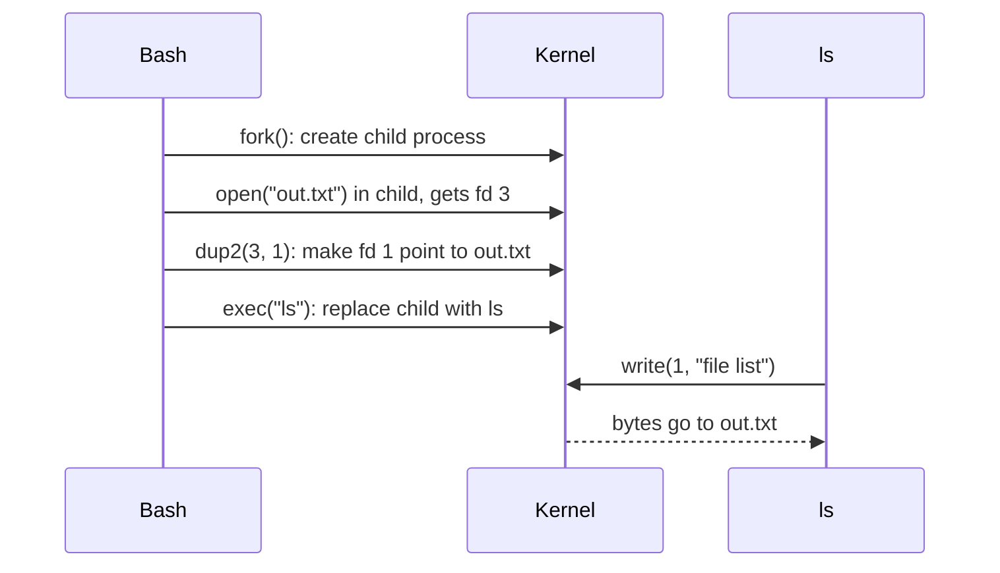
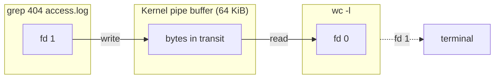
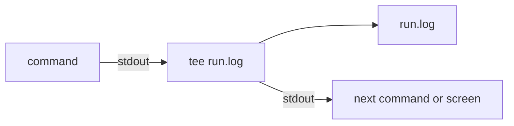

# Pipes and redirection

> **Level 1 · Chapter 4** · ⏱️ ~35 min read · Prerequisites: [Working with files](01-working-with-files.md), [Globbing and expansion](02-globbing-and-expansion.md)

Every Linux program reads from one stream and writes to two. This chapter shows how to point those streams at files, at nothing, or at other programs, which is the idea that lets small tools combine into powerful pipelines.

## Why it matters

Alex schedules a nightly job and saves its output to a log:

```bash
python3 etl.py > etl.log
```

One morning the job has clearly failed, but `etl.log` ends with "Loading 4,812 rows..." and no error. The traceback was never written to the file: it went to a different stream, which was not redirected. Alex tries `python3 etl.py 2>&1 > etl.log`. Still no error in the log. Then `python3 etl.py > etl.log 2>&1`, and finally it works. The two commands differ only in the order of the redirections.

That same week, Alex wants to sort a file in place and runs `sort customers.csv > customers.csv`. The result is an empty file. The original data is gone.

Both surprises have the same explanation: the shell sets up redirections **before** the program runs, in a precise left-to-right order. Once you can picture what the shell does, you can predict the outcome of any redirection.

## Concepts

### Three standard streams

When a program starts, it inherits three open channels for data, called the **standard streams**:

| Number | Name | Short name | Default | Used for |
|---|---|---|---|---|
| 0 | standard input | **stdin** | Keyboard (terminal) | Data the program reads |
| 1 | standard output | **stdout** | Screen (terminal) | Normal results |
| 2 | standard error | **stderr** | Screen (terminal) | Errors, warnings, progress messages |

Why two output streams? So that results and complaints can go to different places. When you pipe `ls` into `wc -l`, you want to count file names, not error messages. Keeping errors on a separate stream means they still reach your screen while the data flows on.

### File descriptors

Inside the kernel, every process has a **file descriptor table**: a small numbered list of everything the process has open. A **file descriptor** (fd) is just an index into that table. When a program writes "to stdout", it is really calling `write(1, ...)`: "write these bytes to whatever my entry number 1 points to". The program does not know or care whether entry 1 is a terminal, a file, or a pipe.

```text
Process: ls          File descriptor table
                     ┌────┬───────────────────────┐
                     │ 0  │ /dev/pts/0 (terminal) │  stdin
                     │ 1  │ /dev/pts/0 (terminal) │  stdout
                     │ 2  │ /dev/pts/0 (terminal) │  stderr
                     └────┴───────────────────────┘
```

**Redirection** means changing what those entries point to before the program starts. The shell does it: it creates the child process, rewires entries 0, 1, or 2, and then starts the program. The program writes to fd 1 as always, and the bytes land wherever the shell pointed it.



`dup2(old, new)` is the system call behind redirection. It means "make descriptor `new` point to the same thing as `old` points to **right now**". Remember that phrase; it explains `2>&1`.

### Why the order of 2>&1 matters

The shell processes redirections strictly **left to right**, and each one is a snapshot.

`> file 2>&1` (correct for "everything into the file"):

| Step | fd 1 points to | fd 2 points to |
|---|---|---|
| Start | terminal | terminal |
| `> file` | **file** | terminal |
| `2>&1`: copy fd 1 now | file | **file** |

`2>&1 > file` (errors still on screen):

| Step | fd 1 points to | fd 2 points to |
|---|---|---|
| Start | terminal | terminal |
| `2>&1`: copy fd 1 now | terminal | **terminal** (no change) |
| `> file` | **file** | terminal |

`2>&1` does not create a permanent link between the two streams. It copies where fd 1 points **at that moment**. In the second version, fd 1 still pointed at the terminal when fd 2 copied it.

### Pipes

A **pipe** (`|`) connects the stdout of one program to the stdin of the next. The kernel creates a small in-memory buffer with a write end and a read end, and the shell wires them into the two processes' descriptor tables:



Key facts about how pipes work:

- **Both programs run at the same time.** The shell starts every command in a pipeline at once. `sleep 2 | sleep 2` takes 2 seconds, not 4. Data streams through as it is produced: the second program starts processing the first line while the first program is still reading its input.
- **The buffer is small** (64 KiB by default on Linux). When it fills up, the writer is paused (the kernel **blocks** it) until the reader catches up. When it is empty, the reader blocks until more data arrives. This **backpressure** means a pipeline can process a 100 GB file with almost no memory.
- **End of input**: when the writer exits and closes its end, the reader gets **EOF** (end of file) after draining the buffer. That is how `sort` knows it has all the input and can start printing.
- **Early exit**: if the reader exits first (like `head -n 3`), the next write to the pipe makes the kernel send the writer a **SIGPIPE** signal, which quietly terminates it. That is why `yes | head -n 3` finishes instantly even though `yes` never stops on its own.
- **Only stdout goes through the pipe.** stderr still goes to the terminal, unless you redirect it.
- A pipeline's **exit status** (the number `$?` reports, where 0 means success) is the exit status of the **last** command, unless you turn on `pipefail`.

This design, small programs connected by streams, is the core of the Unix philosophy. Each tool does one thing; pipes compose them. You will see this throughout [Text processing](05-text-processing.md).

### The special file /dev/null

`/dev/null` is a character device that discards everything written to it and returns end-of-file immediately when read. It is the standard place to send output you do not want: `command 2>/dev/null` hides errors, `command > /dev/null 2>&1` hides everything.

## Commands and examples

Make a sandbox:

```bash
mkdir -p ~/practice/redir && cd ~/practice/redir
```

### Looking at your own file descriptors

`$$` is the process ID of your current shell, and `/proc/<pid>/fd` lists its descriptor table:

```bash
ls -l /proc/$$/fd
```

```text
total 0
lrwx------ 1 alex alex 64 Sep 21 10:43 0 -> /dev/pts/0
lrwx------ 1 alex alex 64 Sep 21 10:43 1 -> /dev/pts/0
lrwx------ 1 alex alex 64 Sep 21 10:43 2 -> /dev/pts/0
lrwx------ 1 alex alex 64 Sep 21 10:43 255 -> /dev/pts/0
```

All three standard streams point to `/dev/pts/0`, your terminal window. (Bash keeps fd 255 for itself.) Level 5 goes deeper into [file descriptors in code](../05-programming/02-file-descriptors.md).

### Redirecting stdout: > and >>

Use `ls` with one file that exists and one that does not, so you get both kinds of output:

```bash
ls /etc/hostname /nope
```

```text
ls: cannot access '/nope': No such file or directory
/etc/hostname
```

Both lines appear on screen, but they came through different streams. Redirect stdout to a file:

```bash
ls /etc/hostname /nope > out.txt
cat out.txt
```

```text
ls: cannot access '/nope': No such file or directory
/etc/hostname
```

The error still appeared on screen (fd 2 still pointed there); only the normal output went to `out.txt`.

`>` **truncates** the file (empties it) before the program runs, or creates it if missing. `>>` **appends** instead:

```bash
echo "first run" > runs.log
echo "second run" >> runs.log
cat runs.log
```

```text
first run
second run
```

`>` is shorthand for `1>`. You can put the redirection anywhere on the line: `> out.txt ls /etc/hostname` works, though it is harder to read.

### Protecting files: noclobber

One mistyped `>` instead of `>>` wipes a log. The **noclobber** shell option makes `>` refuse to overwrite an existing file:

```bash
set -o noclobber
echo "oops" > runs.log
```

```text
bash: runs.log: cannot overwrite existing file
```

`>|` overrides noclobber for one command, when you really mean it:

```bash
echo "fresh start" >| runs.log
set +o noclobber
```

Some people put `set -o noclobber` in their `~/.bashrc`. It only affects your interactive shell and scripts that set it, not other programs.

### Redirecting stdin: <

`<` connects a file to a program's stdin:

```bash
wc -l < /etc/passwd
wc -l /etc/passwd
```

```text
49
49 /etc/passwd
```

With `< file`, the **shell** opens the file and `wc` reads anonymous input from fd 0, so it has no name to print. With a file name argument, `wc` opens the file itself and prints its name. Use `<` when you want just the number.

### Redirecting stderr: 2> and 2>>

```bash
ls /etc/hostname /nope 2> errors.txt
cat errors.txt
```

```text
/etc/hostname
ls: cannot access '/nope': No such file or directory
```

The first line is stdout, on screen. The second came from the file. `2>>` appends errors instead of truncating.

A very common pattern separates data from errors:

```bash
find / -name "*.conf" > conf-files.txt 2> find-errors.txt
```

You get a clean list of results, and the dozens of "Permission denied" messages from directories you cannot read go to their own file.

### Sending both streams to one place

```bash
ls /etc/hostname /nope > all.txt 2>&1
cat all.txt
```

```text
ls: cannot access '/nope': No such file or directory
/etc/hostname
```

Now try the wrong order:

```bash
ls /etc/hostname /nope 2>&1 > only-out.txt
cat only-out.txt
```

```text
ls: cannot access '/nope': No such file or directory
/etc/hostname
```

The error appeared on screen (it is the first line, printed by `ls`), and the file contains only `/etc/hostname`. That is the snapshot rule from the Concepts section in action.

Bash has shorthands for "both streams":

| Syntax | Meaning | Same as |
|---|---|---|
| `&> file` | Both to file (truncate) | `> file 2>&1` |
| `&>> file` | Both to file (append) | `>> file 2>&1` |
| `cmd1 |& cmd2` | Both into the pipe | `cmd1 2>&1 | cmd2` |

`&>` and `|&` are bash features. In scripts that must run under plain `sh`, use the long forms.

!!! warning "Common mistake"
    Writing `2>&1` before `> file` and wondering why errors still hit the screen. Read redirections left to right, as a list of instructions: "point stdout at the file; then point stderr where stdout points now".

### Throwing output away: /dev/null

```bash
ls /etc/hostname /nope 2>/dev/null
```

```text
/etc/hostname
```

The exit status still tells you something failed:

```bash
echo $?
```

```text
2
```

`$?` holds the exit status of the last command. `ls` returns 2 for "serious trouble", such as a missing file. Hiding the message did not hide the failure.

The idiom `> /dev/null 2>&1` silences a command completely, so only its exit status matters:

```bash
if grep root /etc/passwd > /dev/null 2>&1; then echo "root exists"; fi
```

```text
root exists
```

(Many tools have a quiet flag for exactly this: `grep -q` prints nothing and only sets the exit status.)

### Pipes

Connect commands with `|`:

```bash
ls /usr/bin | wc -l
```

```text
2035
```

Only stdout enters the pipe. Watch the error bypass it:

```bash
ls /etc/hostname /nope | wc -l
ls /etc/hostname /nope 2>&1 | wc -l
```

```text
ls: cannot access '/nope': No such file or directory
1
2
```

In the first command, the error went straight to the terminal and `wc` counted one line. In the second, both lines went through the pipe.

#### Commands in a pipeline run at the same time

```bash
time (sleep 2 | sleep 2)
```

```text
real	0m2.003s
user	0m0.000s
sys	0m0.005s
```

Two seconds, not four: both `sleep` commands started together. You can see the pipe in the kernel's descriptor tables while a pipeline is running. In one terminal, run `sleep 30 | sleep 30`. In another:

```bash
for p in $(pgrep -x sleep); do echo "PID $p"; ls -l /proc/$p/fd | grep -E ' [012] '; done
```

```text
PID 5120
lrwx------ 1 alex alex 64 Sep 21 10:44 0 -> /dev/pts/0
l-wx------ 1 alex alex 64 Sep 21 10:44 1 -> pipe:[1976881]
lrwx------ 1 alex alex 64 Sep 21 10:44 2 -> /dev/pts/0
PID 5121
lr-x------ 1 alex alex 64 Sep 21 10:44 0 -> pipe:[1976881]
lrwx------ 1 alex alex 64 Sep 21 10:44 1 -> /dev/pts/0
lrwx------ 1 alex alex 64 Sep 21 10:44 2 -> /dev/pts/0
```

The first `sleep` has fd 1 pointing at `pipe:[1976881]` (`l-wx`: write only). The second has fd 0 pointing at the **same** pipe (`lr-x`: read only). Both stderr entries still point at the terminal.

#### Early exit and SIGPIPE

`yes` prints `y` forever. `head` stops after three lines:

```bash
yes | head -n 3
```

```text
y
y
y
```

It returns immediately. When `head` exited, the pipe's read end closed; the next time `yes` wrote, the kernel sent it SIGPIPE and it died. You can see this in `PIPESTATUS`, a bash array holding the exit status of every command in the last pipeline:

```bash
yes | head -n 3 > /dev/null
echo "${PIPESTATUS[@]}"
```

```text
141 0
```

141 means "killed by signal 13" (128 + 13, and 13 is SIGPIPE). That is normal, not an error. Signals are covered in [Processes and signals](../03-internals/02-processes-and-signals.md).

### tee: save and watch at the same time

`tee` copies its stdin to stdout **and** to one or more files, like a T-shaped pipe fitting:



```bash
echo "hello" | tee copy1.txt copy2.txt | tr a-z A-Z
cat copy1.txt
```

```text
HELLO
hello
```

`tee -a` appends instead of truncating. A practical use is watching a long job while also logging it:

```bash
./etl.sh 2>&1 | tee -a etl.log
```

Another is saving an intermediate stage of a pipeline for later inspection: `grep ERROR app.log | tee errors.txt | wc -l` counts the errors and keeps them.

#### Writing to root-owned files: sudo tee

This does **not** work:

```bash
sudo echo "127.0.1.1 devbox" >> /etc/hosts
```

```text
bash: /etc/hosts: Permission denied
```

The redirection `>> /etc/hosts` is performed by **your** shell, running as you, before `sudo` even starts. `sudo` only elevates `echo`, which does not need it. The fix is to make a root process open the file. `tee` can do that:

```bash
echo "127.0.1.1 devbox" | sudo tee -a /etc/hosts > /dev/null
```

`sudo tee -a` runs as root and appends; `> /dev/null` hides tee's copy on stdout.

!!! danger "⚠️ VM only"
    Practice writing to files under `/etc` in your throwaway VM, never on your main machine. A typo with `tee` instead of `tee -a` replaces the whole file, and a broken `/etc/hosts`, `/etc/fstab`, or `/etc/sudoers` can stop networking, booting, or `sudo` itself.

### Here-documents

A **here-document** (here-doc) feeds several lines of text, written right in the command, to a program's stdin. It starts with `<<WORD` and ends at a line containing only `WORD`. `EOF` is the conventional word:

```bash
cat <<EOF
User: $USER
Home: $HOME
Today: $(date +%A)
EOF
```

```text
User: alex
Home: /home/alex
Today: Monday
```

Inside an unquoted here-doc, variables and command substitutions are expanded. Quote the word (`<<'EOF'`) to keep the text literal, which you want for code or config templates that contain `$`:

```bash
cat <<'EOF'
Total: $PRICE
EOF
```

```text
Total: $PRICE
```

Combined with `>`, a here-doc creates a file in one step. This is how the practice data in this handbook is created:

```bash
cat > app.conf <<'EOF'
# app.conf
listen_port=8080
log_level=info
max_workers=4
EOF
```

`<<-EOF` (with a dash) strips leading **tab** characters from each line, so you can indent here-docs inside scripts. It does not strip spaces.

### Here-strings

A **here-string** (`<<<`) feeds a single string to stdin. It is shorter than `echo ... |`:

```bash
tr a-z A-Z <<< "hello there"
wc -w <<< "one two three"
```

```text
HELLO THERE
3
```

### Process substitution

Some commands only accept file names, not stdin, and some need **two** inputs. **Process substitution** runs a command and hands its output to another command as if it were a file. `<(command)` becomes a path like `/dev/fd/63`:

```bash
echo <(true)
```

```text
/dev/fd/63
```

The classic use is comparing the output of two commands without temporary files:

```bash
diff <(ls ~/practice/glob) <(ls ~/practice/redir)
```

Here is a self-contained example:

```bash
diff <(printf 'alex\nbianca\ncarlos\n') <(printf 'alex\ncarlos\ndana\n')
```

```text
2d1
< bianca
3a3
> dana
```

`diff` received two paths, opened them, and read the outputs of two `printf` commands. Both ran concurrently, connected by pipes. `>(command)` is the reverse: a path that **writes** into a command's stdin, as in `tee >(gzip > backup.gz) > /dev/null`.

### Exit status and a pipefail preview

By default, a pipeline's exit status is that of the **last** command:

```bash
false | true
echo "exit: $?"
```

```text
exit: 0
```

`false` failed, but the pipeline "succeeded". In scripts, that hides real failures: `curl https://bad.example | gzip > data.gz` reports success even when the download fails. The `pipefail` option makes the pipeline fail if any command in it fails:

```bash
set -o pipefail
false | true
echo "exit: $?"
set +o pipefail
```

```text
exit: 1
```

You will make `pipefail` part of every script in [Error handling](../02-scripting/04-error-handling.md). Be aware that with `pipefail`, the harmless SIGPIPE status 141 from `yes | head` also counts as a failure.

### The truncation trap

```bash
printf 'banana\napple\n' > fruit.txt
sort fruit.txt > fruit.txt
wc -c fruit.txt
```

```text
0 fruit.txt
```

The shell processes `> fruit.txt` **before** starting `sort`, and `>` truncates. By the time `sort` opens `fruit.txt` to read it, the file is already empty. The same happens with `grep x file > file`, `sed ... file > file`, and any similar command.

Fixes:

- Many tools have an output option that reads everything first: `sort -o fruit.txt fruit.txt`.
- `sed -i` edits in place (chapter 5).
- Write to a temporary file and rename: `grep -v DEBUG app.log > app.log.tmp && mv app.log.tmp app.log`. The `&&` runs the `mv` only if `grep` succeeded.

## Exercises

### Exercise 1: Split the streams (easy)

Run `ls /etc/hostname /etc/nope /etc/os-release` so that the successful lines go to `found.txt` and the error goes to `missing.txt`. Then run it again so both go to `all.txt`, appending rather than overwriting.

??? success "Solution"

    ```bash
    ls /etc/hostname /etc/nope /etc/os-release > found.txt 2> missing.txt
    cat found.txt missing.txt
    ls /etc/hostname /etc/nope /etc/os-release >> all.txt 2>&1
    ```

    ```text
    /etc/hostname
    /etc/os-release
    ls: cannot access '/etc/nope': No such file or directory
    ```

    `&>> all.txt` is the bash shorthand for the last line.

### Exercise 2: Count without the noise (easy)

Count how many `.conf` files `find /etc -name "*.conf"` finds, without any "Permission denied" messages on screen and without counting them.

??? success "Solution"

    ```bash
    find /etc -name "*.conf" 2>/dev/null | wc -l
    ```

    ```text
    355
    ```

    (Your number will differ.) stderr goes to `/dev/null` before the pipe, so only the paths on stdout reach `wc`. Putting `2>&1` before the pipe would have counted the error lines too.

### Exercise 3: Predict the redirection (medium)

For each command, predict what appears on screen and what ends up in `x.txt` (start each one with `x.txt` deleted). Then check.

1. `ls /etc/hostname /nope 2>&1 > x.txt`
2. `ls /etc/hostname /nope > x.txt 2>&1`
3. `ls /etc/hostname /nope 2> x.txt 1>&2`
4. `ls /etc/hostname /nope > x.txt 2> x.txt`

??? success "Solution"

    1. Screen: the error. File: `/etc/hostname`. fd 2 copied the terminal before fd 1 moved.
    2. Screen: nothing. File: both lines.
    3. Screen: nothing. File: both lines. fd 2 goes to the file, then fd 1 copies fd 2.
    4. Screen: nothing. File: garbled. The file is opened **twice**, giving two independent descriptors that each start at offset 0, so the two streams overwrite each other's bytes. Here the result looks like:

        ```text
        /etc/hostname
        ess '/nope': No such file or directory
        ```

        The error message was written first at offset 0, then `/etc/hostname` overwrote its first 14 bytes. Never open the same file twice; use `2>&1`.

### Exercise 4: Build a config with a here-doc (medium)

Using a single here-doc, create `~/practice/redir/report.txt` that contains your username, your shell's PID, today's date, and the number of lines in `/etc/passwd`, plus a literal line `Price: $5` that must not be expanded. (Hint: `\$` escapes a single dollar sign inside an unquoted here-doc.)

??? success "Solution"

    ```bash
    cat > report.txt <<EOF
    Report for: $USER
    Shell PID: $$
    Date: $(date +%F)
    Accounts: $(wc -l < /etc/passwd)
    Price: \$5
    EOF
    cat report.txt
    ```

    ```text
    Report for: alex
    Shell PID: 4312
    Date: 2026-09-21
    Accounts: 49
    Price: $5
    ```

    An unquoted `EOF` allows expansion, so `$USER`, `$$`, and `$(...)` are replaced. The backslash protects the one dollar sign that must stay literal. If **nothing** should expand, quote the delimiter instead: `<<'EOF'`.

### Exercise 5: Compare two directories (hard)

Without creating any temporary files, list the file names that exist in `/usr/bin` but not in `/usr/sbin`, and count them. Then show the names that appear in both. Use process substitution and `comm`, which compares two **sorted** files and prints three columns: lines only in file 1, only in file 2, and in both. (`comm -23` hides columns 2 and 3.)

??? success "Solution"

    ```bash
    comm -23 <(ls /usr/bin | sort) <(ls /usr/sbin | sort) | wc -l
    comm -12 <(ls /usr/bin | sort) <(ls /usr/sbin | sort)
    ```

    ```text
    2031
    brltty
    ip
    lsmod
    on_ac_power
    ```

    Each `<(...)` becomes a `/dev/fd/N` path that `comm` opens like a file. The `sort` inside guarantees the order `comm` needs. On Mint, `/usr/sbin` and `/usr/bin` are separate directories (unlike `/bin`, which is a link to `/usr/bin`), so a few names may appear in both. Exact numbers depend on what you have installed. `comm` is covered fully in [Text processing](05-text-processing.md).

## Check yourself

1. What are file descriptors 0, 1, and 2, and where do they point by default in a terminal?

    ??? note "Answer"

        stdin, stdout, and stderr. By default all three point to the terminal device, such as `/dev/pts/0`.

2. Who performs the redirection in `ls > out.txt`: bash or `ls`? What does `ls` know about it?

    ??? note "Answer"

        Bash. It opens `out.txt` and points fd 1 at it before starting `ls`. `ls` just writes to fd 1 and does not know where the bytes go (though a program can check whether fd 1 is a terminal, which is how `ls` decides between one column and several).

3. Why does `cmd 2>&1 > file` still print errors on the screen?

    ??? note "Answer"

        Redirections run left to right, and `2>&1` copies where fd 1 points at that moment: the terminal. Then `> file` moves fd 1 only. Write `> file 2>&1`.

4. In `cmd1 | cmd2`, do the commands run one after the other? What happens when the pipe buffer is full?

    ??? note "Answer"

        They run at the same time. When the buffer (64 KiB by default) is full, the kernel blocks `cmd1`'s writes until `cmd2` reads some data. This backpressure keeps memory use small.

5. Why does `yes | head -n 1` finish immediately?

    ??? note "Answer"

        `head` exits after one line, closing the pipe's read end. The next write by `yes` makes the kernel send it SIGPIPE, which terminates it.

6. Why does `sort data.txt > data.txt` produce an empty file, and how do you sort in place?

    ??? note "Answer"

        The shell truncates `data.txt` for the `>` redirection before `sort` starts, so `sort` reads an empty file. Use `sort -o data.txt data.txt`, or write to a temporary file and `mv` it over the original.

7. What is the difference between `<<EOF` and `<<'EOF'`?

    ??? note "Answer"

        With an unquoted delimiter, the here-doc's text undergoes parameter expansion, command substitution, and arithmetic expansion. With a quoted delimiter, the text is passed literally.

8. Why does `sudo echo text > /root/file` fail, and what works instead?

    ??? note "Answer"

        The redirection is done by your unprivileged shell before `sudo` runs. Pipe into a root process that opens the file itself: `echo text | sudo tee /root/file > /dev/null` (or `tee -a` to append).

## Key takeaways

- Every process has stdin (0), stdout (1), and stderr (2). Redirection rewires them before the program starts.
- `>` truncates, `>>` appends, `<` reads, `2>` redirects errors, and `> file 2>&1` (or `&>`) captures both. Order matters: left to right, snapshot semantics.
- Pipes connect stdout to stdin through a small kernel buffer. All commands run concurrently, with backpressure, EOF, and SIGPIPE coordinating them.
- `/dev/null` discards output; `tee` splits it to a file and onward.
- Here-docs (`<<EOF`) and here-strings (`<<<`) supply input inline; process substitution `<(...)` turns a command's output into a file name.
- A pipeline returns the last command's status. `set -o pipefail` makes any failure count.
- Never redirect output onto a file the same command is reading.

## Next

Now that you can connect commands, learn the tools worth connecting: [Text processing](05-text-processing.md).
