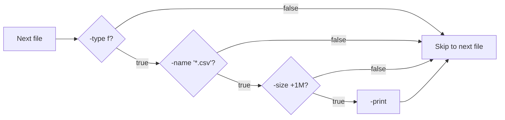

# Finding files

> **Level 1 · Chapter 6** · ⏱️ ~35 min read · Prerequisites: [Globbing and expansion](02-globbing-and-expansion.md), [Permissions](03-permissions.md), [Text processing](05-text-processing.md)

`grep` searches inside files; this chapter is about finding the files themselves. You will learn `find`, which walks the directory tree and can select files by name, type, size, age, permissions, and owner and then act on them; `locate`, which answers "where is that file?" instantly from an index; and `which`, `whereis`, and `type`, which tell you exactly what runs when you type a command.

## Why it matters

At 2 a.m., Alex's phone buzzes: the data server's disk is 98% full and the nightly load is about to fail. Alex SSHes in. There are millions of files. Which ones are huge, and which ones appeared today?

```bash
find /srv/data -type f -size +1G -mtime -1 -printf '%s\t%p\n' | sort -rn | head
```

Ten seconds later Alex sees that a misconfigured export job wrote 40 GB of duplicate CSVs in the last few hours. The cleanup is one more `find` command, run carefully.

The careful part matters. A colleague once "cleaned up temp files" with:

```bash
find . -delete -name '*.tmp'
```

That deletes **everything** under the current directory. `find` evaluates its expression from left to right for each file, and `-delete` came first. The `-name` test was never consulted before the deletion. By the end of this chapter you will know exactly why, and how to write `find` commands you can trust.

## Concepts

### Two ways to find files

| | `find` | `locate` |
|---|---|---|
| How | Walks the directory tree live, checking every file | Looks names up in a prebuilt database |
| Speed | Seconds to minutes on large trees | Milliseconds |
| Freshness | Always current | As of the last database update (usually daily) |
| Can filter by | Name, type, size, time, permissions, owner, depth, and more | Name and path only |
| Can act on results | Yes: `-exec`, `-delete`, `-print0` | No, just prints paths |

Use `locate` for "where on this machine is a file called `sshd_config`?" Use `find` for everything else, and whenever the files might be new.

### How find thinks

A `find` command has two parts:

```text
find  [starting points...]  [expression]
      /srv/data  ~/projects  -type f -name '*.csv' -size +1M -print
```

The **starting points** are directories to search. `find` visits each one and everything beneath it, recursively. The **expression** is made of:

- **Tests**, which are true or false for each file: `-name`, `-type`, `-size`, `-mtime`, `-perm`, `-user`, ...
- **Actions**, which do something and also return true or false: `-print`, `-delete`, `-exec`, `-ls`, ...
- **Operators** that combine them: AND (`-a`, or just a space), OR (`-o`), NOT (`!` or `-not`), and parentheses for grouping.
- **Options** that change how `find` walks, such as `-maxdepth`.

For **every file** it visits, `find` evaluates the expression from left to right, like a chain of `&&` conditions in a programming language. It stops evaluating as soon as the result is known (**short-circuit** evaluation): in `A -a B`, if `A` is false, `B` is never evaluated.



Two consequences follow:

- **Order matters for actions.** `find . -delete -name '*.tmp'` evaluates `-delete` first, for every file. Deleting succeeds (true), then `-name` is checked, but the file is already gone. Put tests first, actions last.
- **Order matters for speed.** Put cheap tests (like `-name` and `-type`) before expensive ones (like `-exec`).

If the expression contains no action at all, `find` adds `-print` to the end. That is why `find . -name '*.csv'` prints matches.

### AND binds tighter than OR

`-a` (AND) has higher precedence than `-o` (OR), just like multiplication before addition. That leads to the most common `find` bug:

```text
find . -type f -name '*.py' -o -name '*.md' -print
     means:   ( -type f AND -name '*.py' )  OR  ( -name '*.md' AND -print )
```

Only the `.md` branch has `-print`, so the `.py` files match but are never printed. Group with parentheses, which you must escape (or quote) so the shell does not treat them as its own syntax:

```text
find . -type f \( -name '*.py' -o -name '*.md' \)
```

### Size and time are rounded

`find` measures size and age in whole units, and the rounding surprises everyone once:

- **`-size n[ckMG]`** rounds the file's size **up** to whole units before comparing. With `M`, a 200 KB file counts as 1 MB. So `-size -1M` means "less than one whole unit", which only an **empty** file satisfies. Use `-size -1024k` for "under 1 MB". The units are `c` (bytes), `k` (KiB), `M` (MiB), and `G` (GiB). With no suffix, the unit is 512-byte blocks, which is almost never what you want.
- **`-mtime n`** counts in whole **24-hour periods**, discarding fractions. A file modified 47 hours ago is "1 day" old. `-mtime 0` means "less than 24 hours ago", `-mtime 1` means "24 to 48 hours ago", `-mtime +1` means "more than 1 whole day", which is 48 hours or more, and `-mtime -2` means "less than 2 days", which is under 48 hours.
- The `+n` / `-n` / `n` prefix means "more than", "less than", or "exactly" for every numeric test.

| Test | Means |
|---|---|
| `-mtime -1` | Modified in the last 24 hours |
| `-mtime +30` | Modified more than 30 full days ago (31+ days) |
| `-mmin -15` | Modified in the last 15 minutes |
| `-size +100M` | Larger than 100 MiB |
| `-size -1024k` | Smaller than 1 MiB |
| `-size 0` or `-empty` | Empty (`-empty` also matches empty directories) |

### How locate works

`locate` (on Mint, the fast implementation is **plocate**) searches a database of every path on the system. A tool called **updatedb** builds that database by walking the whole filesystem, once a day, from a **systemd timer** (a scheduled job, covered in [Scheduling tasks](../04-sysadmin/02-scheduling.md)):

```bash
systemctl list-timers plocate-updatedb.timer
```

```text
NEXT                        LEFT LAST                        PASSED UNIT                   ACTIVATES
Tue 2026-09-22 09:24:26 UTC  22h Mon 2026-09-21 09:41:22 UTC 1h ago plocate-updatedb.timer plocate-updatedb.service
```

Three consequences:

- Files created since the last run are **not** found. Run `sudo updatedb` to refresh now.
- Some paths are excluded on purpose. `/etc/updatedb.conf` lists `PRUNEPATHS`, which on Mint includes `/tmp` and `/media`, and `PRUNEFS`, which skips network and virtual filesystems.
- plocate checks permissions when you search: you only see paths you would be allowed to see.

### What runs when you type a command

When you type `ls`, bash checks, in order: **aliases** (shortcuts you or `.bashrc` defined), shell **keywords** (`if`, `for`), **functions**, **builtins** (commands built into bash, like `cd` and `echo`), and finally **external programs**, found by searching each directory in the `PATH` variable from left to right. The first match wins.

| Tool | Answers | Knows about aliases, functions, builtins? |
|---|---|---|
| `type` | What bash will run for this name | Yes (it is a bash builtin) |
| `command -v` | The same, in a script-friendly format | Yes |
| `which` | Which file in `PATH` would run | No, only external programs |
| `whereis` | Where the program, its source, and its man page live | No |

`type` is the one that tells the truth about your shell. `which` can mislead you, because it does not know about aliases and builtins.

## Commands and examples

Build a sandbox that looks like a real project:

```bash
mkdir -p ~/practice/find && cd ~/practice/find
mkdir -p project/{src,tests,logs,data,node_modules/lodash,.git/objects}
printf 'print("hi")\n' > project/src/main.py
printf 'x\n' > project/src/utils.py
touch project/src/app.js project/tests/test_main.py project/README.md
touch project/node_modules/lodash/index.js project/.git/objects/ab12
touch project/data/Sales.CSV project/data/customers.csv "project/data/q3 report.csv"
head -c 3M /dev/zero > project/data/big-export.csv
head -c 200K /dev/zero > project/logs/app.log
touch -d '40 days ago' project/logs/app-2026-08-01.log
touch -d '10 days ago' project/logs/app-2026-09-20.log
chmod 777 project/data/customers.csv
chmod 755 project/src/main.py
```

### By name: -name, -iname, -path

```bash
find project -name '*.py'
```

```text
project/src/utils.py
project/src/main.py
project/tests/test_main.py
```

`-name` matches the file's **base name** (the last part of the path) against a glob. The quotes are essential: without them, bash would expand `*.py` in the current directory first (chapter 2). The output order is the order in which directory entries are stored on disk, not alphabetical. Pipe to `sort` if you need order.

`-iname` ignores case:

```bash
find project -iname '*.csv'
```

```text
project/data/big-export.csv
project/data/Sales.CSV
project/data/customers.csv
project/data/q3 report.csv
```

`-path` matches the glob against the **whole path**, and in `-path`, `*` does match `/`:

```bash
find project -path '*/src/*.py'
```

```text
project/src/utils.py
project/src/main.py
```

### By type: -type

| Letter | Type |
|---|---|
| `f` | Regular file |
| `d` | Directory |
| `l` | Symbolic link |
| `p`, `s`, `b`, `c` | Named pipe, socket, block device, character device |

```bash
find project -type d
```

```text
project
project/data
project/src
project/tests
project/.git
project/.git/objects
project/node_modules
project/node_modules/lodash
project/logs
```

Notice that `find`, unlike globs, includes hidden directories like `.git`.

### Limiting depth: -maxdepth and -mindepth

```bash
find project -maxdepth 1
find project -mindepth 2 -maxdepth 2 -type d
```

```text
project
project/data
project/src
project/tests
project/.git
project/node_modules
project/README.md
project/logs
project/.git/objects
project/node_modules/lodash
```

Depth 0 is the starting point itself, depth 1 its direct children. Put depth options right after the starting points; they apply to the whole search, and `find` warns if you put them after tests.

### By size: -size

```bash
find project -type f -size +1M
find project -type f -size +100k -size -1M
find project -type f -size +100k -size -1024k
```

```text
project/data/big-export.csv
project/logs/app.log
```

The second command printed **nothing**, even though `app.log` is 200 KB. The `-1M` test rounded 200 KB up to 1 MB, and 1 is not less than 1. The third command, in kilobytes, finds it. This is the rounding rule from the Concepts section, and it is a classic trap.

A real-world use, "the biggest files under my home", combines `find` with sorting:

```bash
find ~ -type f -size +100M -printf '%s\t%p\n' 2>/dev/null | sort -rn | head -5
```

`-printf` (a GNU extension) prints whatever you format: `%s` is the size in bytes, `%p` the path, `\t` a tab. `2>/dev/null` hides "Permission denied" messages from directories you cannot read.

### By time: -mtime, -mmin, -newer

```bash
find project -name '*.log' -mtime +30
find project -name '*.log' -mtime -14
```

```text
project/logs/app-2026-08-01.log
project/logs/app.log
project/logs/app-2026-09-20.log
```

The first finds logs untouched for more than 30 days: candidates for cleanup. The second finds logs changed in the last two weeks.

To see the rounding at work, create files with precise ages:

```bash
touch -d '25 hours ago' t25h; touch -d '47 hours ago' t47h
touch -d '49 hours ago' t49h; touch -d '3 days ago' t3d
find . -maxdepth 1 -name 't*' -mtime 1
find . -maxdepth 1 -name 't*' -mtime +1
```

```text
./t25h
./t47h
./t49h
./t3d
```

25 and 47 hours both count as "1 day" (the fraction is dropped). `+1` means "more than one whole day", which starts at 48 hours.

Related tests: `-mmin` works in minutes, `-atime`/`-amin` use access time, `-ctime`/`-cmin` use inode change time (chapter 1), and `-newer file` matches files modified more recently than a reference file. A common trick is to `touch` a marker file before a job and later run `find . -newer marker` to see what the job changed.

### By permissions: -perm

`-perm` has three forms, and the difference is important:

| Form | Matches when | Example |
|---|---|---|
| `-perm 644` | The mode is **exactly** 644 | Rarely what you want |
| `-perm -644` | **All** of these bits are set (others may be too) | `-perm -u+x`: owner can execute |
| `-perm /022` | **Any** of these bits is set | `-perm /o+w`: anyone-else can write |

```bash
find project -perm 777
find project -type f -perm -u+x
find project -type f -perm /o+w
```

```text
project/data/customers.csv
project/data/customers.csv
project/src/main.py
project/data/customers.csv
```

The last one is a security check: files that **other** users can modify. Run it on your home directory occasionally:

```bash
find ~ -type f -perm /o+w 2>/dev/null
```

You already used `-perm -4000` in [Permissions](03-permissions.md) to list setuid programs.

### By owner: -user, -group, -nouser

```bash
find project -user "$USER" -name '*.md'
find /var/log -group adm -name '*.log' 2>/dev/null | head -3
```

```text
project/README.md
/var/log/installer/casper.log
/var/log/apt/term.log
/var/log/kern.log
```

`-nouser` and `-nogroup` find files whose owner or group no longer exists, which happens after deleting a user account. They are useful in a cleanup audit.

### Combining tests: AND, OR, NOT, parentheses

Tests next to each other are joined by AND. `!` (or `-not`) negates the next test:

```bash
find project -type f -name '*.py' ! -name 'test_*'
find project -name '*.py' -not -path '*/tests/*'
```

```text
project/src/utils.py
project/src/main.py
project/src/utils.py
project/src/main.py
```

For OR, use `-o`, and group with escaped parentheses. Watch the difference:

```bash
find project -type f -name '*.py' -o -name '*.md' -print
```

```text
project/README.md
```

```bash
find project -type f \( -name '*.py' -o -name '*.md' \)
```

```text
project/src/utils.py
project/src/main.py
project/tests/test_main.py
project/README.md
```

The first command only printed the README: `-print` was attached to the `-name '*.md'` branch by precedence. The second, with parentheses, has no explicit action, so `find` added `-print` around the whole expression. The spaces around `\(` and `\)` are required.

!!! warning "Common mistake"
    Mixing `-o` with an action and no parentheses. If an expression contains `-o`, wrap the alternatives in `\( ... \)` before adding any action.

### Skipping directories: -prune

Searching inside `node_modules`, `.git`, or a virtual environment wastes time and clutters results. `-prune` tells `find` not to descend into a directory. The idiom is "if it is the directory to skip, prune it; **otherwise** do the real test":

```bash
find project -name node_modules -prune -o -name '*.js' -print
```

```text
project/src/app.js
```

Read it as: `( -name node_modules -a -prune ) -o ( -name '*.js' -a -print )`. For `node_modules`, the left side is true (prune returns true), so the right side never runs. For everything else, the left side is false, so the right side runs. The explicit `-print` matters. Without it, `find` adds `-print` around the whole expression, and the pruned directory's name is printed too:

```bash
find project -name node_modules -prune -o -name '*.js'
```

```text
project/src/app.js
project/node_modules
```

To skip several directories, group them:

```bash
find project \( -name node_modules -o -name .git \) -prune -o -type f -print
```

### Actions: -print, -ls, -printf

`-ls` prints details like `ls -dils`:

```bash
find project -name '*.py' -ls
```

```text
  2763158      4 -rw-rw-r--   1 alex     alex            2 Sep 21 10:44 project/src/utils.py
  2763157      4 -rwxr-xr-x   1 alex     alex           12 Sep 21 10:44 project/src/main.py
  2763159      0 -rw-rw-r--   1 alex     alex            0 Sep 21 10:44 project/tests/test_main.py
```

`-printf` gives full control. Some useful directives: `%p` path, `%f` base name, `%s` size in bytes, `%TY-%Tm-%Td` modification date, `%u` owner, `%m` octal permissions:

```bash
find project -type f -name '*.py' -printf '%m %u %s\t%p\n'
```

```text
664 alex 2	project/src/utils.py
755 alex 12	project/src/main.py
664 alex 0	project/tests/test_main.py
```

### Running commands: -exec with \; and +

`-exec command {} \;` runs a command **once per file**, replacing `{}` with the path. The `\;` (an escaped semicolon) marks the end of the command:

```bash
find project -name '*.py' -exec echo run {} \;
```

```text
run project/src/utils.py
run project/src/main.py
run project/tests/test_main.py
```

`-exec command {} +` collects many paths and runs the command **once per batch**, like `xargs`:

```bash
find project -name '*.py' -exec echo run {} +
```

```text
run project/src/utils.py project/src/main.py project/tests/test_main.py
```

The difference is huge on big trees. With `\;`, 10,000 files mean 10,000 processes. With `+`, they mean a handful. Use `+` whenever the command accepts several file names, which most do:

```bash
find project -name '*.py' -exec wc -l {} +
```

```text
 1 project/src/utils.py
 1 project/src/main.py
 0 project/tests/test_main.py
 2 total
```

Use `\;` when the command takes exactly one file, or when `{}` is not at the end.

`-exec` passes each path as a single argument, so spaces in names are safe. `-ok` is like `-exec ... \;` but asks for confirmation each time:

```bash
find project -name '*.log' -ok rm {} \;
```

```text
< rm ... project/logs/app.log > ? n
< rm ... project/logs/app-2026-09-20.log > ? n
```

### Handing results to other tools: -print0

When you pipe `find` output to another command, separate names with NUL bytes so that spaces and newlines in file names cannot break anything (as you saw in [Text processing](05-text-processing.md)):

```bash
find project -name '*.csv' -print0 | xargs -0 ls -l
```

```text
-rw-rw-r-- 1 alex alex 3145728 Sep 21 10:44 project/data/big-export.csv
-rwxrwxrwx 1 alex alex       0 Sep 21 10:44 project/data/customers.csv
-rw-rw-r-- 1 alex alex       0 Sep 21 10:44 'project/data/q3 report.csv'
```

### Deleting: -delete, carefully

`-delete` removes each file that reaches it in the expression. It is efficient and handles any file name. It is also the most dangerous action in this chapter, so use a fixed routine:

1. Run the command with `-print` instead of `-delete`, and read the list.
2. Press ++up++, replace `-print` with `-delete`, keeping it at the **end**.

```bash
find project -name '*.log' -mtime +30 -print
```

```text
project/logs/app-2026-08-01.log
```

```bash
find project -name '*.log' -mtime +30 -delete
ls project/logs
```

```text
app-2026-09-20.log  app.log
```

Some details:

- `-delete` implies `-depth`, which makes `find` process a directory's contents before the directory itself. That is necessary for deleting directories, but it means `-prune` stops working in the same command.
- `-delete` removes empty directories but fails on non-empty ones. For whole trees, use `-exec rm -r {} +` with great care.
- `-delete` must come **after** every test. `find . -delete -name '*.tmp'` deletes everything, as the opening story showed.

!!! danger "⚠️ VM only"
    Practice `-delete` and `-exec rm` only inside `~/practice` on your main machine, and never with a starting point like `/`, `~`, or a path built from a variable. If you want to see how a misplaced `-delete` behaves on a real system tree, do it in your throwaway VM after taking a snapshot.

### Dealing with "Permission denied"

Searching from `/` as a normal user hits many directories you cannot read:

```bash
find / -name sshd_config
```

```text
find: ‘/var/cache/apparmor/70b6ca72.0’: Permission denied
find: ‘/var/cache/cups’: Permission denied
...
/etc/ssh/sshd_config
/usr/share/openssh/sshd_config
...
```

The real results are buried in errors. Since errors go to stderr (chapter 4), discard them:

```bash
find / -name sshd_config 2>/dev/null
```

```text
/etc/ssh/sshd_config
/usr/share/openssh/sshd_config
/snap/core22/2955/etc/ssh/sshd_config
/snap/core22/2955/usr/share/openssh/sshd_config
```

`find` still exits with status 1 to tell you that some directories were skipped.

### locate and plocate

```bash
locate sshd_config
```

```text
/etc/ssh/sshd_config
/etc/ssh/sshd_config.d
/usr/share/man/man5/sshd_config.5.gz
/usr/share/openssh/sshd_config
/usr/share/openssh/sshd_config.md5sum
/var/lib/ucf/cache/:etc:ssh:sshd_config
```

That answer came back in milliseconds, without walking the disk. A plain pattern matches **anywhere** in the full path. Useful options:

| Option | Meaning |
|---|---|
| `-i` | Ignore case |
| `-b` | Match only the base name, not directories in the path |
| `-c` | Print the number of matches |
| `-l N` | Stop after N results |
| `-r REGEX` | Use a regular expression (slower) |
| `-0` | NUL-separated output, for `xargs -0` |

```bash
locate -r '/sshd_config$'
locate -c '*.service'
```

```text
/etc/ssh/sshd_config
/usr/share/openssh/sshd_config
722
```

A pattern containing glob characters (`*`, `?`, `[`) must match the whole path, which is why `'*.service'` works as "ends with `.service`".

If you just created a file and `locate` cannot find it, the database is out of date. Refresh it:

```bash
sudo updatedb
```

This only rebuilds the search index; it changes nothing else. Remember that files under `/tmp` are never indexed on Mint.

### which, whereis, type

```bash
type ls cd if ll
```

```text
ls is aliased to `ls --color=auto'
cd is a shell builtin
if is a shell keyword
ll is aliased to `ls -alF'
```

`type` reports exactly what bash will run. `type -a` shows every match in order, and `type -t` prints just the kind:

```bash
type -a echo
```

```text
echo is a shell builtin
echo is /usr/bin/echo
echo is /bin/echo
```

When you type `echo`, the builtin wins. `/usr/bin/echo` also exists for programs that are not run through a shell. (`/bin/echo` is the same file, because `/bin` is a link to `/usr/bin` on Mint.)

`which` searches only `PATH`:

```bash
which ls python3 cd
```

```text
/usr/bin/ls
/usr/bin/python3
```

It prints nothing for `cd`, which is a builtin. In scripts, prefer `command -v name`, which is built into the shell, understands builtins, and returns a failure exit status if the command does not exist:

```bash
command -v jq > /dev/null || echo "jq is not installed"
```

`whereis` finds the binary, source, and manual page locations:

```bash
whereis ls
```

```text
ls: /usr/bin/ls /usr/share/man/man1/ls.1.gz
```

### A modern alternative: fd

`fd` is a faster, friendlier `find`. It ignores hidden files and anything in `.gitignore` by default, uses regular expressions for names, and colors its output. On Mint, install the `fd-find` package; the command is called `fdfind` because another package already owned the name `fd`:

```bash
sudo apt install fd-find
```

=== "find"

    ```bash
    find . -name '*.py'
    find . -type f -name '*.log' -mtime -1
    find . -name '*.csv' -exec gzip {} +
    ```

=== "fd"

    ```bash
    fdfind -e py
    fdfind -t f -e log --changed-within 1d
    fdfind -e csv -X gzip
    ```

Many people add `alias fd=fdfind` to their `~/.bashrc` ([Shell productivity](07-shell-productivity.md) shows how). Learn `find` first: it is installed on every Linux system, and `fd` is not.

## Exercises

Use the `~/practice/find/project` sandbox.

### Exercise 1: Basic searches (easy)

Find (a) all CSV files regardless of case, (b) all empty regular files, (c) all directories exactly two levels below `project`.

??? success "Solution"

    ```bash
    find project -iname '*.csv'
    find project -type f -empty
    find project -mindepth 2 -maxdepth 2 -type d
    ```

    ```text
    project/data/big-export.csv
    project/data/Sales.CSV
    project/data/customers.csv
    project/data/q3 report.csv
    project/data/Sales.CSV
    project/data/customers.csv
    project/data/q3 report.csv
    project/src/app.js
    project/tests/test_main.py
    project/.git/objects/ab12
    project/node_modules/lodash/index.js
    project/README.md
    project/logs/app-2026-09-20.log
    project/.git/objects
    project/node_modules/lodash
    ```

    `-empty` matches empty files and empty directories; `-type f` restricts it to files.

### Exercise 2: Size and age report (easy)

List every file larger than 100 KB with its size in bytes, largest first. Then list the files modified in the last 60 minutes.

??? success "Solution"

    ```bash
    find project -type f -size +100k -printf '%s\t%p\n' | sort -rn
    find project -type f -mmin -60
    ```

    ```text
    3145728	project/data/big-export.csv
    204800	project/logs/app.log
    ```

    The second command lists most of the sandbox, since you created it just now. The two old log files you back-dated with `touch -d` do not appear.

### Exercise 3: Code search that skips the noise (medium)

Count the lines in every `.py` and `.js` file, skipping `node_modules` and `.git`, with a single `wc` process.

??? success "Solution"

    ```bash
    find project \( -name node_modules -o -name .git \) -prune -o \
         -type f \( -name '*.py' -o -name '*.js' \) -exec wc -l {} +
    ```

    ```text
     1 project/src/utils.py
     1 project/src/main.py
     0 project/src/app.js
     0 project/tests/test_main.py
     2 total
    ```

    Two groups of parentheses: one for the directories to prune, one for the file types. `-exec ... {} +` runs `wc` once with all the files. The backslash at the end of the first line continues the command on the next line.

### Exercise 4: Fix permissions with find (medium)

`project/data/customers.csv` is world-writable and executable. Find every file under `project` that "other" can write, and fix all of them to `644` in one command. Then make every directory under `project` `755`.

??? success "Solution"

    ```bash
    find project -type f -perm /o+w -print
    find project -type f -perm /o+w -exec chmod 644 {} +
    find project -type d -exec chmod 755 {} +
    find project -perm /o+w
    ```

    ```text
    project/data/customers.csv
    ```

    The last command prints nothing, confirming the fix. Printing first, then acting, is the same safety routine as with `-delete`.

### Exercise 5: Safe cleanup with a dry run (hard)

Write a cleanup command for this policy: in `project/logs`, delete `.log` files older than 7 days, but never `app.log` itself, and show each deletion. Do a dry run first. Then explain what `find project/logs -delete -name '*.log' -mtime +7` would do and why.

??? success "Solution"

    Dry run:

    ```bash
    find project/logs -type f -name '*.log' ! -name 'app.log' -mtime +7 -print
    ```

    ```text
    project/logs/app-2026-09-20.log
    ```

    Real run, printing each deletion:

    ```bash
    find project/logs -type f -name '*.log' ! -name 'app.log' -mtime +7 -print -delete
    ```

    ```text
    project/logs/app-2026-09-20.log
    ```

    `-print -delete` prints the name and then deletes it, because both actions run in order when every test before them is true. (If you ran the earlier `-mtime +30 -delete` example, `app-2026-08-01.log` is already gone.)

    The broken version, `find project/logs -delete -name '*.log' -mtime +7`, evaluates `-delete` first for **every** file and directory under `project/logs`, deleting them all (and then the now-empty `project/logs` directory itself). The tests after it only decide the result of the expression, not whether the deletion happened. Tests must come before actions.

## Check yourself

1. What does `find` do when the expression contains no action?

    ??? note "Answer"

        It adds `-print` around the whole expression, so every file for which the expression is true gets printed.

2. Why does `find . -type f -name '*.py' -o -name '*.md' -print` not print Python files?

    ??? note "Answer"

        AND binds tighter than OR, so the expression is `(-type f -a -name '*.py') -o (-name '*.md' -a -print)`. Only the second branch has an action. Group the alternatives with `\( ... \)`.

3. What is the difference between `-exec cmd {} \;` and `-exec cmd {} +`?

    ??? note "Answer"

        `\;` runs the command once per file. `+` passes many files to each invocation, like `xargs`, which is far faster on large trees.

4. Why might `find . -size -1M` miss a 300 KB file?

    ??? note "Answer"

        `-size` rounds sizes up to whole units. 300 KB rounds up to 1 MiB, and 1 is not less than 1. Use `-size -1024k`.

5. A file was modified 30 hours ago. Does `-mtime 1` match it? Does `-mtime +1`?

    ??? note "Answer"

        `-mtime 1` matches: 30 hours is 1 whole day after dropping the fraction. `-mtime +1` does not, because it needs more than 1 whole day, i.e. 48 hours or more.

6. When is `locate` the wrong tool?

    ??? note "Answer"

        When the files are newer than the last `updatedb` run, when they live in excluded paths like `/tmp`, or when you need to filter by size, time, permissions, or owner, or act on the results. Use `find` then.

7. What is the difference between `-perm -022` and `-perm /022`?

    ??? note "Answer"

        `-022` matches files where **all** of those bits (group write and other write) are set. `/022` matches files where **any** of them is set.

8. Why is `type` more trustworthy than `which` for answering "what runs when I type `ls`?"

    ??? note "Answer"

        `type` is a bash builtin and knows about aliases, keywords, functions, and builtins, in the order bash checks them. `which` only searches `PATH` for external programs, so it misses aliases like `ls='ls --color=auto'` and builtins like `cd`.

## Key takeaways

- `find` walks the tree live and evaluates its expression left to right per file, with short-circuiting. Tests first, actions last.
- AND binds tighter than OR. Group alternatives with `\( ... \)`, and use `-prune -o ... -print` to skip directories.
- `-size` rounds up and `-mtime` counts whole days: `-size -1024k`, not `-size -1M`.
- Use `-exec ... {} +` for speed, `-print0 | xargs -0` for pipelines, and always dry-run with `-print` before `-delete`.
- `locate` is instant but only as fresh as the last `updatedb`, and skips `/tmp`.
- `type` tells you what bash will actually run; `command -v` is the script-friendly version; `which` only knows `PATH`.

## Next

You can now find anything. Next, make the shell itself faster to use, with history, shortcuts, aliases, and your own `.bashrc`: [Shell productivity](07-shell-productivity.md).
