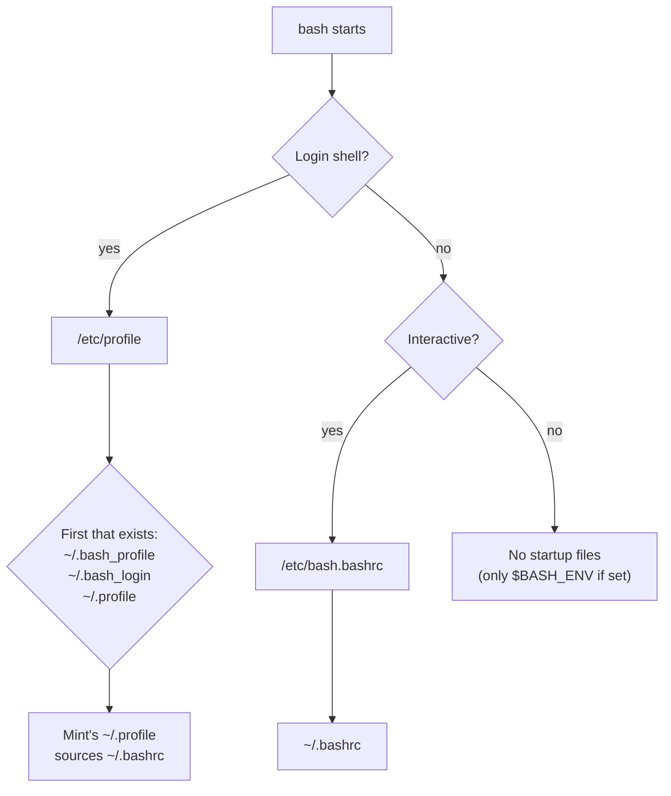
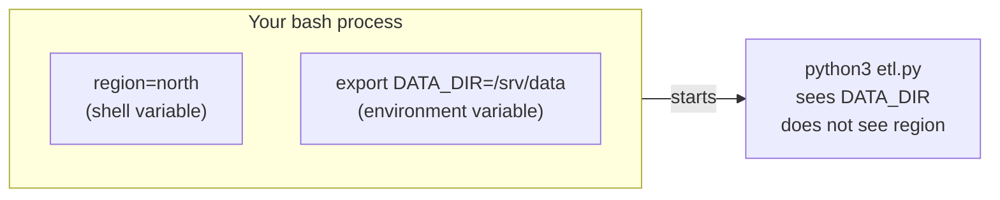
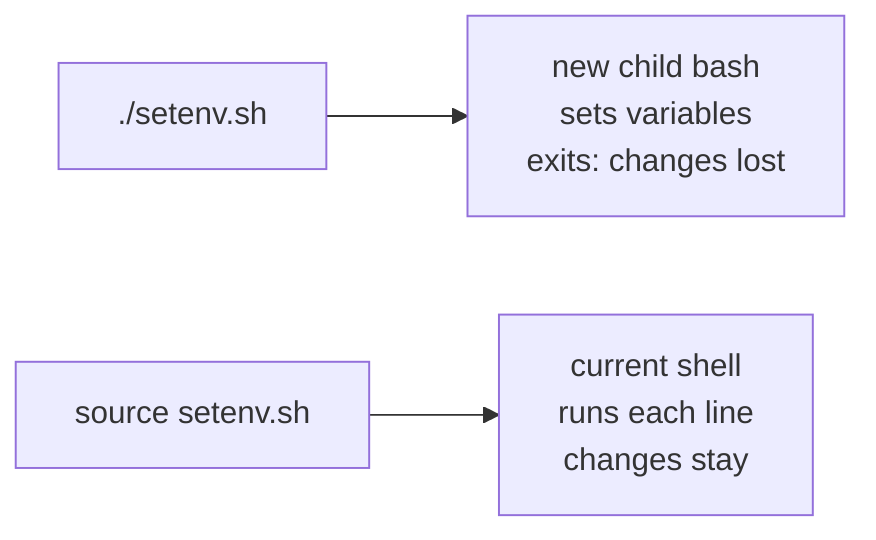

# Shell productivity

> **Level 1 · Chapter 7** · ⏱️ ~40 min read · Prerequisites: [Pipes and redirection](04-pipes-and-redirection.md), [Finding files](06-finding-files.md)

The difference between someone who tolerates the terminal and someone who is fast in it is rarely knowledge of more commands. It is history search, editing shortcuts, aliases, small functions, and a well-organized `~/.bashrc`. This chapter covers all of them, plus how bash starts up, how environment variables reach programs, and how `PATH` works.

## Why it matters

Alex spends a morning debugging an ETL job and runs the same long command dozens of times:

```bash
python3 etl.py --input /srv/data/raw/2026-09-21 --output /srv/data/clean --log-level debug 2>&1 | tee -a etl.log
```

Each time, Alex presses ++up++ fifteen times to find it, then holds ++left++ for several seconds to change the date. A colleague watching over Alex's shoulder types ++ctrl+r++, `etl`, ++enter++: the command is back in half a second. ++alt+b++ jumps back a word at a time; ++ctrl+w++ deletes one.

Inspired, Alex adds `export DATA_DIR=/srv/data` to a new `~/.bash_profile`. The next day, connected over SSH, every alias Alex relies on has vanished. Creating `~/.bash_profile` made bash skip `~/.profile`, which was the file that loaded `~/.bashrc`.

Fast shell use is a set of small habits. Understanding the startup files is what keeps those habits working on every machine.

## Concepts

### Kinds of shells: interactive and login

Bash runs in different modes, and the mode decides which configuration files it reads.

- An **interactive** shell reads commands from you at a prompt. A **non-interactive** shell runs a script or a single `bash -c 'command'` and exits.
- A **login** shell is the first shell of a session, started when you log in: over SSH, at a text console (++ctrl+alt+f3++), or with `bash -l`. A **non-login** shell is started from an existing session, such as each new terminal window on the Mint desktop.

| How you started bash | Interactive? | Login? |
|---|---|---|
| Opening Terminal on the Mint desktop | Yes | No |
| `ssh alex@mint` | Yes | Yes |
| Logging in on a text console | Yes | Yes |
| `bash -l` or `su - alex` | Yes | Yes |
| Running `./script.sh` | No | No |
| A cron job or systemd service running a script | No | No |

You can check. The special variable `$-` lists the shell's active option letters, and it contains `i` in an interactive shell:

```bash
echo $-
shopt login_shell
```

```text
himBHs
login_shell    	off
```

That is a desktop terminal: interactive (`i`), not a login shell.

### Which startup files bash reads



The details:

- **Login shells** read `/etc/profile`, then **only the first** of `~/.bash_profile`, `~/.bash_login`, and `~/.profile` that exists. On Mint, only `~/.profile` exists by default, and it contains a block that loads `~/.bashrc` for bash. That is how login shells also get your aliases.
- **Interactive non-login shells** (your desktop terminals) read `/etc/bash.bashrc` and then `~/.bashrc`.
- **Non-interactive shells** (scripts) read nothing by default. That is why an alias from `~/.bashrc` does not work inside a script, and why scripts should never depend on your personal configuration.
- Your **graphical session** is started through `~/.profile` too, so environment variables set there reach desktop apps, not just terminals.

The default `~/.bashrc` on Mint starts with this guard, which stops it doing anything in a non-interactive shell:

```bash
case $- in
    *i*) ;;
      *) return;;
esac
```

### What goes where

| Put this | In | Why |
|---|---|---|
| Environment variables: `PATH`, `EDITOR`, `DATA_DIR` | `~/.profile` | Read once per login, inherited by every program, including GUI apps |
| Aliases, functions, prompt (`PS1`), shell options (`shopt`), history settings | `~/.bashrc` | Only meaningful in interactive shells, and not inherited by child processes |
| Long lists of aliases | `~/.bash_aliases` | Mint's `~/.bashrc` already loads it if it exists |

!!! warning "Common mistake"
    Creating `~/.bash_profile` because a tutorial said so. Once it exists, login shells stop reading `~/.profile`, and with it your `~/.bashrc` loading. If you must have a `~/.bash_profile`, make its first line `[ -f ~/.profile ] && . ~/.profile`.

### Shell variables and environment variables

Every process has an **environment**: a list of `NAME=value` strings that it receives from its parent when it starts, and passes on to its own children. `HOME`, `PATH`, `USER`, `LANG`, and `EDITOR` are environment variables.

The shell also has **shell variables**, which live only inside that shell process. Assigning `region=north` creates a shell variable. `export` marks a variable so that it is copied into the environment of every command the shell starts.



Two facts follow from "copied at start":

- A child process **cannot** change its parent's variables. A script that runs `export X=1` does not change `X` in the shell that ran it. Its copy dies with it.
- Changing a variable after a program has started does not affect that program.

### How PATH lookup works

`PATH` is a colon-separated list of directories. When you type a command name without a `/`, bash searches those directories **from left to right** and runs the first executable file with that name. (Aliases, functions, and builtins are checked before `PATH`, as you saw in [Finding files](06-finding-files.md).)

```bash
echo "$PATH" | tr ':' '\n'
```

```text
/home/alex/.local/bin
/usr/local/sbin
/usr/local/bin
/usr/sbin
/usr/bin
/sbin
/bin
/usr/games
/usr/local/games
/snap/bin
```

- The current directory is **not** in `PATH`. That is a security feature: a malicious file named `ls` in a download folder cannot hijack your `ls`. To run a program in the current directory, write `./program`.
- Order matters. Putting `~/.local/bin` first lets your own version of a tool override the system's.
- Bash remembers where it found each command in a **hash table**, so it does not search `PATH` every time. If you install a new program that shadows an old one, run `hash -r` to make bash forget.
- Mint's `~/.profile` adds `~/bin` and `~/.local/bin` to `PATH` if those directories exist **at login time**. Create them, then log out and in again.

### History and readline

Bash keeps a **history list** of the commands you type, in memory. When the shell exits, it writes the list to `~/.bash_history`. Two variables control the sizes:

- **HISTSIZE**: how many commands to keep in memory. Mint's default `~/.bashrc` sets 1000.
- **HISTFILESIZE**: how many lines to keep in the file. Mint sets 2000.

**HISTCONTROL** decides what gets recorded. Mint sets it to `ignoreboth`, which combines:

- `ignorespace`: commands that start with a space are not saved. Useful for commands containing passwords or tokens.
- `ignoredups`: a command identical to the previous one is not saved again.

Mint also enables `shopt -s histappend`, so each closing shell **appends** to the file instead of overwriting it. Without it, the last terminal window you close would erase the history of all the others.

Line editing in bash is provided by a library called **readline**. It gives you cursor movement, deletion by word, history search, and completion, using key bindings borrowed from the emacs editor by default. Text you delete with ++ctrl+w++, ++ctrl+u++, or ++ctrl+k++ is not lost: it goes into the **kill ring**, and ++ctrl+y++ ("yank") pastes it back.

## Commands and examples

### Reusing history

```bash
history 5
```

```text
  498  cd ~/practice/text
  499  grep -c ' 404 ' access.log
  500  awk '$9 >= 400' access.log | wc -l
  501  less access.log
  502  history 5
```

Each entry has a number. **History expansion** lets you reuse entries with `!`:

| Syntax | Expands to | Example use |
|---|---|---|
| `!!` | The whole previous command | `sudo !!` when you forgot sudo |
| `!n` | Command number n | `!499` |
| `!-2` | The command two back | |
| `!grep` | The most recent command starting with `grep` | |
| `!$` | The last argument of the previous command | `mkdir reports` then `cd !$` |
| `!*` | All arguments of the previous command | |
| `^old^new` | The previous command with the first `old` replaced by `new` | Fix a typo |
| `!n:p` | Print command n without running it | Check before running |

Bash shows the expanded command before running it, so you can see what happened:

```console
$ echo one two three
one two three
$ echo !$
echo three
three
$ ls /etc/hostnmae
ls: cannot access '/etc/hostnmae': No such file or directory
$ ^nmae^name
ls /etc/hostname
/etc/hostname
```

`sudo !!` is the most famous: you ran `apt update`, it failed with "Permission denied", and `sudo !!` reruns it as `sudo apt update`.

!!! tip "Hide a command from history"
    With Mint's `HISTCONTROL=ignoreboth`, start a command with a space and it is not saved: ` export API_TOKEN=abc123`. Use it for anything containing a secret.

#### Searching history: Ctrl+R

++ctrl+r++ starts a **reverse incremental search**: type part of any earlier command, and bash shows the most recent match as you type.

```text
(reverse-i-search)`etl': python3 etl.py --input /srv/data/raw/2026-09-21 --output /srv/data/clean --log-level debug 2>&1 | tee -a etl.log
```

- Press ++ctrl+r++ again to jump to the next older match.
- Press ++enter++ to run the match.
- Press ++right++ or ++esc++ to put it on the command line for editing.
- Press ++ctrl+g++ to give up and restore the line you had.

This one shortcut is worth more than every other one in this chapter. Use it for a week and it becomes automatic.

#### Timestamps and bigger history

Add these lines to `~/.bashrc` (replacing the existing `HISTSIZE` and `HISTFILESIZE` lines) for a long history with dates:

```bash
HISTSIZE=50000
HISTFILESIZE=100000
HISTTIMEFORMAT='%F %T '
```

```text
  501  2026-09-21 10:15:02 less access.log
  502  2026-09-21 10:15:40 history 5
```

`HISTTIMEFORMAT` uses `strftime` codes: `%F` is the date, `%T` the time. A history of 50,000 commands is a few megabytes, and it turns ++ctrl+r++ into a personal knowledge base of every command you ever figured out.

### Readline shortcuts

| Keys | Action |
|---|---|
| ++ctrl+a++ / ++ctrl+e++ | Move to the start / end of the line |
| ++alt+b++ / ++alt+f++ | Move back / forward one word |
| ++ctrl+w++ | Delete the word before the cursor (up to the previous space) |
| ++alt+d++ | Delete the word after the cursor |
| ++ctrl+u++ | Delete from the cursor to the start of the line |
| ++ctrl+k++ | Delete from the cursor to the end of the line |
| ++ctrl+y++ | Paste the last deleted text |
| ++ctrl+underscore++ | Undo the last edit |
| ++alt+period++ | Insert the last argument of the previous command (press again to cycle further back) |
| ++ctrl+l++ | Clear the screen, keeping the current line |
| ++ctrl+r++ | Search history backward |
| ++tab++ / ++tab++ ++tab++ | Complete a name / list all completions |
| ++ctrl+c++ | Abandon the current line (or interrupt a running command) |
| ++ctrl+d++ | Exit the shell (on an empty line) |
| ++ctrl+x++ ++ctrl+e++ | Open the current line in your `$EDITOR` |

Some combinations that come up all the time:

- **You typed a long command and realize you need something else first.** Press ++ctrl+u++ to cut the whole line, run the other command, then ++ctrl+y++ to paste the line back.
- **You want to act on the file you just used.** `ls -l reports/2026-09-21.csv`, then type `less ` and press ++alt+period++. Bash inserts `reports/2026-09-21.csv`.
- **You need to fix the start of a long line.** ++ctrl+a++, then ++alt+f++ a few times.

++alt+period++ is the interactive version of `!$`, with the advantage that you see the text before you press ++enter++.

!!! info "If your terminal freezes"
    ++ctrl+s++ is an old terminal "pause output" signal. If your terminal suddenly stops responding to typing, you probably pressed it. ++ctrl+q++ resumes. Also, in the Mint terminal, ++alt++ combinations can be taken by the menu bar; if ++alt+b++ opens a menu, turn off the menu accelerator in the terminal's preferences, or use ++esc++ followed by ++b++.

### Aliases

An **alias** is a shortcut: bash replaces the first word of a command with the alias text. List current aliases with `alias`:

```bash
alias
```

```text
alias alert='notify-send --urgency=low -i "$([ $? = 0 ] && echo terminal || echo error)" "$(history|tail -n1|sed -e '\''s/^\s*[0-9]\+\s*//;s/[;&|]\s*alert$//'\'')"'
alias egrep='egrep --color=auto'
alias fgrep='fgrep --color=auto'
alias grep='grep --color=auto'
alias l='ls -CF'
alias la='ls -A'
alias ll='ls -alF'
alias ls='ls --color=auto'
```

Those come from Mint's default `~/.bashrc`. Define your own the same way (no spaces around `=`):

```bash
alias ..='cd ..'
alias ...='cd ../..'
alias lt='ls -lt --time-style=long-iso | head'
alias rm='rm -I'
alias df='df -h'
alias fd='fdfind'
```

An alias defined at the prompt lasts until the shell exits. To keep it, add it to `~/.bash_aliases` (create the file if needed), which Mint's `~/.bashrc` loads automatically.

To bypass an alias for one command, prefix it with a backslash or use `command`:

```bash
\rm file.txt
command rm file.txt
```

`unalias name` removes an alias from the current shell.

Aliases are simple text replacement at the **start** of a command. They cannot take arguments in the middle, contain logic, or work in scripts. When you need any of that, write a function.

!!! warning "Common mistake"
    Making dangerous commands "safe" with aliases like `alias rm='rm -i'` and then relying on it. On a server or inside a script, the alias does not exist, and your habit of typing `rm *` and expecting a prompt will bite you. `rm -I` (asks once) is a reasonable alias, but keep the habits from [Working with files](01-working-with-files.md) regardless.

### Functions

A **shell function** is a named block of commands. Inside it, `$1`, `$2`, ... are its arguments, and `"$@"` is all of them. `local` makes a variable private to the function.

```bash
mkcd() {
    mkdir -p -- "$1" && cd -- "$1"
}
```

`mkcd reports/2026` creates the directory and moves into it, something an alias cannot do (an alias cannot use its argument twice, and a script could not change your shell's directory).

A few functions that pay for themselves quickly:

```bash
# Top N most frequent lines from stdin or files: topn 5 < access.log
topn() {
    local n="${1:-10}"
    shift
    sort "$@" | uniq -c | sort -rn | head -n "$n"
}

# Timestamped backup copy: bak config.ini -> config.ini.2026-09-21_1015.bak
bak() {
    cp -a -- "$1" "$1.$(date +%F_%H%M).bak"
}

# Show what a command really is, and where
what() {
    type -a "$1"
}
```

```bash
cut -d' ' -f9 ~/practice/text/access.log | topn 3
```

```text
     10 200
      3 404
      2 500
```

`${1:-10}` means "the first argument, or 10 if it is empty". `shift` drops the first argument so that `"$@"` holds only the rest (any file names). You will learn this syntax properly in [Variables, quoting, and arrays](../02-scripting/02-variables-quoting-arrays.md) and [Conditionals, loops, and functions](../02-scripting/03-control-flow-functions.md).

Put functions in `~/.bashrc`. `type mkcd` shows a function's definition, and `declare -F` lists all function names.

### Environment variables in practice

Print environment variables with `printenv` (or `env`):

```bash
printenv HOME SHELL EDITOR
```

```text
/home/alex
/bin/bash
```

`EDITOR` printed nothing: it is not set. `declare -p` shows a variable along with its attributes. `-x` means exported:

```bash
region=north
export DATA_DIR=/srv/data
declare -p region DATA_DIR
```

```text
declare -- region="north"
declare -x DATA_DIR="/srv/data"
```

Prove that only exported variables reach child processes:

```bash
bash -c 'echo "region=[$region] DATA_DIR=[$DATA_DIR]"'
```

```text
region=[] DATA_DIR=[/srv/data]
```

To set a variable for **one command only**, put the assignment in front of it. The variable goes into that command's environment and does not stay in your shell:

```bash
LOG_LEVEL=debug python3 etl.py
TZ=Asia/Tokyo date
```

```text
Tue Sep 22 02:15:40 JST 2026
```

`unset NAME` removes a variable. `export -n NAME` keeps it but stops exporting it.

To make an environment variable permanent, add an `export` line to `~/.profile`:

```bash
export EDITOR=nano
export DATA_DIR=/srv/data
```

It takes effect at your next login. To apply it to the current shell right away, `source` the file (below).

### Editing PATH

Create a personal `bin` directory with a small script in it:

```bash
mkdir -p ~/bin
printf '#!/bin/bash\necho "hello from my own command"\n' > ~/bin/sayhi
chmod u+x ~/bin/sayhi
sayhi
```

```text
sayhi: command not found
```

`~/bin` is not in `PATH` yet. (Mint's `~/.profile` would add it, but only at login, and the directory did not exist when you logged in.) Add it for the current shell:

```bash
export PATH="$HOME/bin:$PATH"
sayhi
type sayhi
```

```text
hello from my own command
sayhi is /home/alex/bin/sayhi
```

(For names that match a real package, Mint's command-not-found helper prints a suggestion such as `Command 'hello' not found, but can be installed with: ...` instead of the short message.)

The form `PATH="new:$PATH"` **prepends**: your directory is searched first. `PATH="$PATH:new"` appends: your directory is searched last, so system commands win.

To make it permanent, either log out and back in (the `~/.profile` block handles `~/bin` once it exists), or add your own line to `~/.profile` for other directories:

```bash
export PATH="$HOME/tools/bin:$PATH"
```

!!! warning "Common mistake"
    Writing `PATH=~/bin` (without `:$PATH`). That **replaces** the whole search path, and suddenly `ls`, `grep`, and everything else are "command not found" in that shell. If it happens, open a new terminal, or repair it with `export PATH=/usr/local/bin:/usr/bin:/bin` and fix the file.

### Customizing the prompt: PS1

The prompt is the value of the **PS1** variable, with special backslash escapes:

| Escape | Shows |
|---|---|
| `\u` | Username |
| `\h` | Hostname up to the first dot |
| `\w` | Current directory, with `~` for home |
| `\W` | Only the last part of the current directory |
| `\$` | `$` for normal users, `#` for root |
| `\t` / `\A` | Time as `HH:MM:SS` / `HH:MM` |
| `\j` | Number of background jobs |
| `\n` | Newline |

Mint's default prompt is equivalent to `\u@\h:\w\$ ` with colors, which displays as:

```text
alex@mint:~/practice/text$
```

Try alternatives in the current shell. They last until you close it:

```bash
PS1='[\A] \W \$ '
```

```text
[10:15] text $
```

**Colors** use terminal escape codes. Wrap each code in `\[` and `\]` so bash knows those characters take no space on screen; without them, long lines wrap in the wrong place. `\e[32m` is green, `\e[34m` blue, `\e[31m` red, `\e[1m` bold, and `\e[0m` resets:

```bash
PS1='\[\e[32m\]\u@\h\[\e[0m\]:\[\e[34m\]\w\[\e[0m\]\$ '
```

A useful upgrade is showing the exit status of the last command when it failed. `PROMPT_COMMAND` holds commands that bash runs just before printing each prompt:

```bash
__prompt_status() {
    local code=$?
    if [ "$code" -ne 0 ]; then PS1_STATUS="[$code] "; else PS1_STATUS=""; fi
}
PROMPT_COMMAND="__prompt_status${PROMPT_COMMAND:+; $PROMPT_COMMAND}"
PS1='\[\e[31m\]${PS1_STATUS}\[\e[0m\]\[\e[32m\]\u@\h\[\e[0m\]:\[\e[34m\]\w\[\e[0m\]\$ '
```

```console
alex@mint:~$ ls /nope
ls: cannot access '/nope': No such file or directory
[2] alex@mint:~$
```

The single quotes around `PS1` matter: `${PS1_STATUS}` must be expanded each time the prompt is drawn, not once when you set it. The `${PROMPT_COMMAND:+; ...}` part keeps any `PROMPT_COMMAND` that Mint's terminal already set.

If `git` is installed, Mint also ships `/usr/lib/git-core/git-sh-prompt`, which provides `__git_ps1` to show the current branch in your prompt. Its usage is documented at the top of that file.

When you are happy, copy your `PS1` lines into `~/.bashrc`, after the default `PS1` block so they override it.

### source: run a file in the current shell

Running a script starts a **new** bash process. Anything it sets (variables, aliases, `cd`) disappears when it exits. `source file` (or its short form, `. file`) instead reads the file and runs its commands **in your current shell**:



```bash
printf 'export DATA_DIR=/srv/data\nalias ymd="date +%%F"\n' > ~/practice/setenv.sh
bash ~/practice/setenv.sh; echo "after running: [$DATA_DIR]"
source ~/practice/setenv.sh; echo "after sourcing: [$DATA_DIR]"
ymd
```

```text
after running: []
after sourcing: [/srv/data]
2026-09-21
```

(If you exported `DATA_DIR` earlier in this chapter, run `unset DATA_DIR` first to see the difference.)

You will use `source` constantly after editing your configuration:

```bash
source ~/.bashrc
```

That applies your changes to the current terminal without opening a new one. Python virtual environments use the same mechanism: `source .venv/bin/activate` modifies your current shell's `PATH` and prompt.

### Putting it together: a starter ~/.bashrc block

Open `~/.bashrc` with `nano ~/.bashrc`, scroll to the end, and add a clearly marked section. Keep your additions together so you can find and copy them to other machines:

```bash
# ---- my additions ----
HISTSIZE=50000
HISTFILESIZE=100000
HISTTIMEFORMAT='%F %T '
shopt -s globstar          # ** matches directories recursively

alias ..='cd ..'
alias lt='ls -lt --time-style=long-iso | head'
alias rm='rm -I'

mkcd() { mkdir -p -- "$1" && cd -- "$1"; }
topn() { local n="${1:-10}"; shift; sort "$@" | uniq -c | sort -rn | head -n "$n"; }
```

Then add environment variables to `~/.profile`:

```bash
# ---- my additions ----
export EDITOR=nano
```

Apply with `source ~/.bashrc` (and log out and in for `~/.profile`). If something breaks, a typo in `~/.bashrc` can make every new terminal print errors; open the file with `nano` and fix it, or start a clean shell with `bash --norc` to investigate.

## Exercises

### Exercise 1: History drills (easy)

Run `mkdir -p ~/practice/hist/a/b`. Then, without retyping the path: (a) `cd` into it using `!$`, (b) list its parent with `ls` and ++alt+period++ followed by editing, (c) find the `mkdir` command with ++ctrl+r++ and print it without running it.

??? success "Solution"

    ```bash
    mkdir -p ~/practice/hist/a/b
    cd !$                       # bash prints: cd ~/practice/hist/a/b
    ```

    For (b), type `ls ` and press ++alt+period++. Bash inserts the last argument of the previous command, `~/practice/hist/a/b` (the `cd !$` line was stored in history in its expanded form, `cd ~/practice/hist/a/b`). Press ++backspace++ twice to remove `/b`, then ++enter++. Do not use ++ctrl+w++ here: it deletes back to the previous **space**, which would remove the whole path.

    For (c), press ++ctrl+r++, type `mkdir`, then press ++esc++ to place the command on the line without running it. Alternatively, `!mkdir:p` prints the most recent `mkdir` command without executing it.

### Exercise 2: Shell variable or environment variable? (easy)

Set `CITY=Pune` without exporting it. Show that a child bash cannot see it, then export it and show that it can. Finally, run `env` for one command with `CITY=Delhi` and show that your shell's value is unchanged.

??? success "Solution"

    ```bash
    CITY=Pune
    bash -c 'echo "child: [$CITY]"'
    export CITY
    bash -c 'echo "child: [$CITY]"'
    CITY=Delhi bash -c 'echo "child: [$CITY]"'
    echo "shell: [$CITY]"
    ```

    ```text
    child: []
    child: [Pune]
    child: [Delhi]
    shell: [Pune]
    ```

    The prefix assignment only applied to that one command's environment.

### Exercise 3: Your first useful function (medium)

Write a function `logtail` that takes a file name and an optional number of lines (default 20), and shows the last N lines with line numbers. Add it to `~/.bashrc`, reload, and test it on `~/practice/text/access.log`. Check where bash finds it with `type`.

??? success "Solution"

    Add to `~/.bashrc`:

    ```bash
    logtail() {
        local file="$1" n="${2:-20}"
        tail -n "$n" -- "$file" | cat -n
    }
    ```

    ```bash
    source ~/.bashrc
    logtail ~/practice/text/access.log 2
    type logtail
    ```

    ```text
         1	198.51.100.7 - - [21/Sep/2026:11:03:33 +0000] "GET /products/42 HTTP/1.1" 304 0 "-" "Mozilla/5.0 (iPhone; CPU iPhone OS 17_4) Safari/604.1"
         2	192.0.2.33 - - [21/Sep/2026:11:04:59 +0000] "GET /api/products?page=2 HTTP/1.1" 200 1893 "-" "python-requests/2.31.0"
    logtail is a function
    logtail ()
    {
        local file="$1" n="${2:-20}";
        tail -n "$n" -- "$file" | cat -n
    }
    ```

    `type` prints the function body as bash stored it.

### Exercise 4: A personal bin directory (medium)

Create `~/bin/today` that prints the date as `YYYY-MM-DD`. Make it runnable as `today` from any directory, now and after you log in again. Then make an alias `today` that prints `ALIAS`, and use `type -a today` to show which one wins and why. Remove the alias afterwards.

??? success "Solution"

    ```bash
    mkdir -p ~/bin
    printf '#!/bin/bash\ndate +%%F\n' > ~/bin/today
    chmod u+x ~/bin/today
    export PATH="$HOME/bin:$PATH"     # now; ~/.profile adds ~/bin at future logins
    today
    alias today='echo ALIAS'
    type -a today
    unalias today
    ```

    ```text
    2026-09-21
    today is aliased to `echo ALIAS'
    today is /home/alex/bin/today
    ```

    Aliases are checked before `PATH`, so the alias wins. `%%` in `printf` produces a literal `%`. Mint's `~/.profile` adds `~/bin` to `PATH` at login whenever the directory exists, so no further edit is needed.

### Exercise 5: Diagnose the vanishing aliases (hard)

Reproduce the story from "Why it matters" safely: create `~/.bash_profile` containing only `export DATA_DIR=/srv/data`, then start a login shell with `bash -l` and check whether your aliases work. Explain the result, fix `~/.bash_profile` so login shells behave correctly, and verify. Finally, remove the file if you do not need it.

??? success "Solution"

    ```bash
    echo 'export DATA_DIR=/srv/data' > ~/.bash_profile
    bash -l
    type ll
    ```

    ```text
    bash: type: ll: not found
    ```

    A login shell reads only the **first** existing file among `~/.bash_profile`, `~/.bash_login`, and `~/.profile`. Now that `~/.bash_profile` exists, `~/.profile` is skipped, and with it the block that sources `~/.bashrc`, where the aliases live. Type `exit` to leave the test shell.

    Fix: make `~/.bash_profile` load `~/.profile` first.

    ```bash
    cat > ~/.bash_profile <<'EOF'
    [ -f ~/.profile ] && . ~/.profile
    export DATA_DIR=/srv/data
    EOF
    bash -l
    type ll
    echo "$DATA_DIR"
    exit
    ```

    ```text
    ll is aliased to `ls -alF'
    /srv/data
    ```

    Simpler still: delete `~/.bash_profile` (`rm ~/.bash_profile`) and put `export DATA_DIR=/srv/data` in `~/.profile`, which is where Mint expects it.

## Check yourself

1. Is a new terminal window on the Mint desktop a login shell? Which of your files does it read?

    ??? note "Answer"

        No, it is an interactive non-login shell. It reads `/etc/bash.bashrc` and `~/.bashrc`. (Your desktop session itself was started through `~/.profile`.)

2. Why don't your aliases work inside a script?

    ??? note "Answer"

        Scripts run in a non-interactive shell, which reads no startup files, so `~/.bashrc` is never loaded. Also, alias expansion is off by default in non-interactive shells. Scripts should use full commands or functions defined in the script.

3. What is the difference between `x=1` and `export x=1`?

    ??? note "Answer"

        Both create a variable in the current shell. `export` also marks it to be copied into the environment of every command the shell starts. Without it, child processes do not see `x`.

4. What do `!!`, `!$`, and `^old^new` do?

    ??? note "Answer"

        `!!` repeats the previous command, `!$` is the last argument of the previous command, and `^old^new` reruns the previous command with the first `old` replaced by `new`.

5. What do `HISTCONTROL=ignoreboth` and `histappend` give you?

    ??? note "Answer"

        `ignoreboth` skips saving commands that start with a space and consecutive duplicates. `histappend` makes each shell append its history to `~/.bash_history` on exit, instead of overwriting it, so several terminals do not erase each other's history.

6. What do ++ctrl+w++, ++ctrl+u++, ++ctrl+k++, and ++alt+period++ do?

    ??? note "Answer"

        Delete the word before the cursor, delete to the start of the line, delete to the end of the line, and insert the last argument of the previous command. Deleted text can be pasted back with ++ctrl+y++.

7. Why does `./setenv.sh` not change your shell's variables, while `source setenv.sh` does?

    ??? note "Answer"

        `./setenv.sh` runs in a child process; its changes die with it, and a child cannot modify its parent's environment. `source` runs the commands in the current shell.

8. What is wrong with `PATH=~/bin`, and what should you write instead?

    ??? note "Answer"

        It replaces the whole search path, so system commands can no longer be found. Write `export PATH="$HOME/bin:$PATH"` to prepend, or `"$PATH:$HOME/bin"` to append.

## Key takeaways

- ++ctrl+r++ for history search, ++alt+period++ for the last argument, and ++ctrl+a++/++ctrl+e++/++ctrl+w++/++ctrl+u++ for editing will save you hours.
- Login shells read `/etc/profile` and the first of `~/.bash_profile`, `~/.bash_login`, `~/.profile`. Interactive non-login shells read `~/.bashrc`. Scripts read neither.
- Environment variables (and `PATH`) go in `~/.profile`; aliases, functions, prompt, and history settings go in `~/.bashrc`.
- `export` copies a variable into children's environments; children can never change the parent's variables. `VAR=value cmd` sets it for one command.
- `PATH` is searched left to right; prepend your own directories with `PATH="$HOME/bin:$PATH"`.
- Aliases are text shortcuts; functions take arguments and can change the current shell.
- `source` runs a file in the current shell. Use it to reload `~/.bashrc`.

## Next

Next, learn to bundle, compress, and verify files with `tar`, `gzip`, and friends: [Archives and compression](08-archives-and-compression.md). When you have finished the level's chapters, prove your skills in the [Level 1 capstone](../../exercises/level-1-capstone.md).
