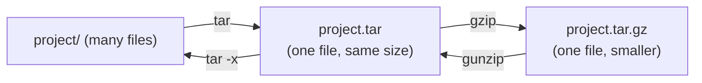
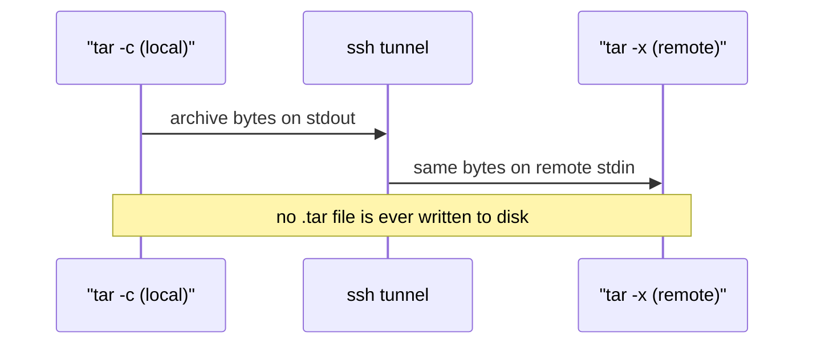

# Archives and compression

> **Level 1 · Chapter 8** · ⏱️ ~40 min read · Prerequisites: [Working with files](01-working-with-files.md), [Permissions](03-permissions.md), [Pipes and redirection](04-pipes-and-redirection.md)

This chapter teaches you to bundle files into archives, shrink them with compression, check that they arrived intact, and move them between machines. You'll learn `tar` in depth, the gzip/bzip2/xz/zstd family, `zip` for sharing with Windows and macOS, `sha256sum`, and `split`.

## Why it matters

Alex has a data pipeline on a server. One evening a colleague asks for "last month's raw files and the config, so I can reproduce the bug." That's 4,000 CSV files across a dozen folders, about 9 GB.

Copying 4,000 files one by one over the network is slow, because each file costs a round trip. Alex runs one command instead:

```bash
tar -czf raw-2025-05.tar.gz data/raw/2025-05 config/
```

Now there's one file of 1.4 GB. Text compresses well, so it's six times smaller. Alex also runs `sha256sum` on it and sends the checksum along. The colleague runs `sha256sum -c` after the download and knows, for certain, that not a single byte changed in transit.

A week later, the colleague's laptop fills with 4,000 loose files after they extract someone else's archive in their home directory. It was a **tarbomb**, and it took them twenty minutes to clean up. Alex wouldn't have been caught: Alex always runs `tar -tf` to look inside an archive before extracting it.

Both of those habits take seconds to learn. Over a career they'll save you hours.

## Concepts

### Archiving and compression are two different jobs

Beginners often mix up these two ideas, because they usually happen together.

An **archive** is a single file that holds many files and directories, plus their **metadata**. Metadata is the information *about* a file: its name, path, permissions, owner, and modification time. Archiving doesn't make anything smaller. A plain archive is about the same size as the files inside it.

**Compression** is re-encoding data so it takes fewer bytes. A compressor finds patterns, such as repeated words, repeated date prefixes, or long runs of the same byte, and writes them more compactly. A compressor works on **one stream of bytes**. It has no idea what a "file" or a "directory" is.

On Linux, each tool does one of these jobs:

- `tar` archives. It turns a directory tree into a single stream of bytes.
- `gzip`, `bzip2`, `xz`, and `zstd` compress. Each turns one stream into a smaller stream.

You chain them together. This is the Unix idea of small tools that do one job, combined with pipes:



That's why Linux archives have double extensions like `.tar.gz`. The name tells you the order the layers were added: first tar, then gzip. To unpack it, you peel the layers off in reverse.

`zip` and `7z` are different. They archive *and* compress in one tool, and they compress each file separately. That design came from DOS and Windows, which is why those formats are the cross-platform choice.

| Extension | What it is | Tool to open it |
|---|---|---|
| `.tar` | Archive only, not compressed | `tar -xf` |
| `.gz` | One gzip-compressed file | `gunzip`, `zcat` |
| `.tar.gz`, `.tgz` | tar archive, then gzip | `tar -xzf` |
| `.tar.bz2`, `.tbz2` | tar archive, then bzip2 | `tar -xjf` |
| `.tar.xz`, `.txz` | tar archive, then xz | `tar -xJf` |
| `.tar.zst` | tar archive, then zstd | `tar --zstd -xf` |
| `.zip` | Archive + per-file compression | `unzip` |
| `.7z` | Archive + strong compression | `7z x` |

### What tar actually stores

The name `tar` comes from "tape archive." It was built in the 1970s to write files to magnetic tape, one after another. That history explains its design: an archive is just a sequence of records.

For each file, tar writes a 512-byte **header** followed by the file's contents, padded to a multiple of 512 bytes. The header holds the path, permissions (the mode bits from the [Permissions](03-permissions.md) chapter), owner and group names and numbers, size, modification time, and file type: regular file, directory, symlink, and so on.

```text
+--------+-----------------+--------+------------+--------+-----+------------+
| header | contents of     | header | contents   | header | ... | two zero   |
| file 1 | file 1 (padded) | file 2 | of file 2  | file 3 |     | blocks=end |
+--------+-----------------+--------+------------+--------+-----+------------+
```

This layout has three consequences you'll meet in practice:

1. **There's no index at the front.** To list a `.tar.gz`, tar has to decompress and read through the whole thing. Listing a 10 GB archive takes as long as reading 10 GB.
2. **tar writes a stream.** It can write to a pipe, to standard output, or straight across a network connection, without ever creating a file on disk. You'll use that for `tar | ssh` later.
3. **Paths are stored as text.** Whatever path you gave when you created the archive is the path used on extraction. That's why `-C` and the leading-slash rule matter so much.

### How compression works, in one paragraph

Most compressors use two tricks. First, they replace repeated sequences with short back-references, such as "copy the 40 bytes that appeared 3,000 bytes ago." This family is called **LZ77**. Second, they encode common symbols in fewer bits than rare ones. This is called **entropy coding** (Huffman coding is one example). Text, CSV, JSON, and logs are full of repetition, so they often shrink to 10–25% of their original size.

Data that's already compressed has no patterns left to find. This includes JPEG, PNG, MP4, `.zip`, `.gz`, and encrypted files. Compressing them again wastes CPU time and can even make them slightly bigger.

The compressors differ in how hard they search for patterns and how much memory they use. That's the **ratio vs. speed trade-off**:

- **gzip** (1992). It's everywhere, it's fast enough, and its ratio is decent. It's the default choice for compatibility.
- **bzip2** (1996). It uses a different algorithm (the Burrows-Wheeler transform). It's slow to compress and *very* slow to decompress, and it's mostly legacy now.
- **xz** (2009, using the LZMA2 algorithm). It gives a high ratio, compresses slowly, and decompresses reasonably fast. Linux distributions use it to package software.
- **zstd** (Zstandard, 2016, from Facebook). It's extremely fast, with a ratio that's tunable from gzip-like to xz-like. Decompression is very fast at every level. Use it for new work when both ends have it.

Every compressor accepts **levels**, such as `-1` (fastest) through `-9` (smallest output). zstd goes up to `-19`, and even higher with `--ultra`. Higher levels search harder for patterns. The output gets a little smaller, and compression gets much slower.

### Checksums

A **checksum** (or **hash**) is a short fingerprint calculated from a file's contents. **SHA-256** produces a 256-bit value, written as 64 hexadecimal characters. If even one bit of the file changes, the hash changes completely. Comparing two hashes is a cheap way to prove that two files are identical without comparing them byte by byte.

People publish checksums next to downloads (such as the Linux Mint ISO) so you can check that what you received is exactly what they published.

!!! info "Integrity vs. authenticity"
    A checksum proves the file wasn't *corrupted*. It doesn't prove who *made* the file. An attacker who can replace the download can also replace the checksum on the same page. Proving who made a file needs signatures, such as GPG. You'll meet those when we cover software installation in Level 3.

## Commands and examples

### Set up a practice lab

All the examples run in a scratch directory with realistic data: a sales CSV, an application log, a config file, a script, and a "photo." The photo is really just random bytes, and it stands in for any file that's already compressed.

```bash
mkdir -p ~/archive-lab/project/{data,logs,config,scripts}
cd ~/archive-lab

awk 'BEGIN {
  srand(42)
  split("north south east west", region, " ")
  split("widget gadget gizmo sprocket", product, " ")
  print "order_id,date,region,product,quantity,unit_price"
  for (i = 1; i <= 400000; i++)
    printf "%d,2025-%02d-%02d,%s,%s,%d,%.2f\n", 100000+i, 1+int(rand()*12), 1+int(rand()*28),
      region[1+int(rand()*4)], product[1+int(rand()*4)], 1+int(rand()*20), 5+int(rand()*20)
}' > project/data/sales.csv

awk 'BEGIN {
  srand(7)
  split("INFO INFO INFO INFO INFO INFO INFO WARN ERROR", lvl, " ")
  split("/api/orders /api/users /health /api/products /login", path, " ")
  for (i = 0; i < 300000; i++) {
    l = lvl[1+int(rand()*9)]
    printf "2025-06-01T%02d:%02d:%02d %s pid=%d GET %s status=%d ms=%d\n",
      int(i/12500), int(i/208)%60, i%60, l, 1000+int(rand()*100), path[1+int(rand()*5)],
      (l=="INFO"?200:(l=="WARN"?404:500)), 1+int(rand()*900)
  }
}' > project/logs/app.log

printf 'db_host=localhost\ndb_port=5432\nbatch_size=500\n' > project/config/pipeline.ini
printf '#!/bin/bash\necho "loading sales data"\n' > project/scripts/load.sh
chmod 750 project/scripts/load.sh
chmod 600 project/config/pipeline.ini
head -c 2M /dev/urandom > project/data/photo.jpg

du -sh project
```

```text
36M	project
```

The `chmod` lines give two files unusual permissions on purpose. You'll use them to check whether permissions survive archiving.

### Creating an archive: `tar -c`

tar's options are letters you combine. The three you'll use constantly:

- `-c` **c**reate a new archive
- `-v` **v**erbose: print each file as it's processed
- `-f FILE` the archive **f**ile to write or read. It takes an argument, so it goes last in a bundle like `-cvf`.

```bash
tar -cvf project.tar project
```

```text
project/
project/data/
project/data/photo.jpg
project/data/sales.csv
project/scripts/
project/scripts/load.sh
project/config/
project/config/pipeline.ini
project/logs/
project/logs/app.log
```

```bash
ls -l project.tar
```

```text
-rw-rw-r-- 1 alex alex 37652480 Mar 14 10:45 project.tar
```

The archive is 37.6 MB, slightly *larger* than the files themselves, because of the 512-byte headers and padding. Archiving alone saves nothing. The file order is the order the directory listing returned, not alphabetical, so don't be surprised by it.

!!! warning "Common mistake: `-f` in the wrong place"
    `-f` takes the *next* word as the archive name. `tar -cfv project.tar project` creates an archive literally named `v` containing `project.tar` and `project`. Put `f` last in the bundle: `-cvf`, `-czf`, `-xzf`.

!!! tip "Old style, no dash"
    You'll see `tar cvf project.tar project` in old docs, with no dash. GNU tar accepts both. This handbook always uses the dash, because it works the same way as every other command.

### Adding compression: `-z`, `-j`, `-J`, `--zstd`

One extra letter tells tar to pipe its stream through a compressor:

| Option | Compressor | Usual extension |
|---|---|---|
| `-z` | gzip | `.tar.gz` / `.tgz` |
| `-j` | bzip2 | `.tar.bz2` |
| `-J` | xz | `.tar.xz` |
| `--zstd` | zstd | `.tar.zst` |
| `-a` | Picks one from the extension you gave to `-f` | any of the above |
| `-I 'prog args'` | Any program, with options | your choice |

```bash
tar -czf project.tar.gz  project
tar -cjf project.tar.bz2 project
tar -cJf project.tar.xz  project
tar --zstd -cf project.tar.zst project
ls -l project.tar*
```

```text
-rw-rw-r-- 1 alex alex 37652480 Mar 14 10:45 project.tar
-rw-rw-r-- 1 alex alex  5603671 Mar 14 10:45 project.tar.bz2
-rw-rw-r-- 1 alex alex  7539317 Mar 14 10:45 project.tar.gz
-rw-rw-r-- 1 alex alex  5927156 Mar 14 10:46 project.tar.xz
-rw-rw-r-- 1 alex alex  8625700 Mar 14 10:46 project.tar.zst
```

All four are 15–23% of the original size. The 2 MB of random "photo" bytes didn't shrink at all, so most of the savings came from the CSV and the log.

`-a` (`--auto-compress`) saves you from remembering the letters:

```bash
tar -caf backup.tar.xz project
```

To pass options to the compressor, such as a level or a thread count, use `-I`. Here zstd runs at level 19 on all CPU cores (`-T0`):

```bash
tar -I 'zstd -19 -T0' -cf project-max.tar.zst project
```

The `file` command identifies an archive by its contents, not its name. That helps when someone sends you a file with a misleading extension:

```bash
file project.tar*
```

```text
project.tar:     POSIX tar archive (GNU)
project.tar.bz2: bzip2 compressed data, block size = 900k
project.tar.gz:  gzip compressed data, from Unix, original size modulo 2^32 37652480
project.tar.xz:  XZ compressed data, checksum CRC64
project.tar.zst: Zstandard compressed data (v0.8+), Dictionary ID: None
```

### Listing before extracting: `tar -t`

`-t` lists the contents of an archive without extracting anything. Make it a reflex: **list first, extract second.**

```bash
tar -tzf project.tar.gz
```

```text
project/
project/data/
project/data/photo.jpg
project/data/sales.csv
project/scripts/
project/scripts/load.sh
project/config/
project/config/pipeline.ini
project/logs/
project/logs/app.log
```

Add `-v` for an `ls -l`-style listing that includes permissions, owner, size, and time:

```bash
tar -tvzf project.tar.gz
```

```text
drwxrwxr-x alex/alex         0 2025-03-14 10:39 project/
drwxrwxr-x alex/alex         0 2025-03-14 10:39 project/data/
-rw-rw-r-- alex/alex   2097152 2025-03-14 10:39 project/data/photo.jpg
-rw-rw-r-- alex/alex  15620515 2025-03-14 10:39 project/data/sales.csv
drwxrwxr-x alex/alex         0 2025-03-14 10:39 project/scripts/
-rwxr-x--- alex/alex        38 2025-03-14 10:39 project/scripts/load.sh
drwxrwxr-x alex/alex         0 2025-03-14 10:39 project/config/
-rw------- alex/alex        46 2025-03-14 10:39 project/config/pipeline.ini
drwxrwxr-x alex/alex         0 2025-03-14 10:39 project/logs/
-rw-rw-r-- alex/alex  19918297 2025-03-14 10:39 project/logs/app.log
```

You can see that tar recorded `load.sh` as `rwxr-x---` and `pipeline.ini` as `rw-------`. The metadata is in the archive.

!!! tip "GNU tar detects compression when reading a file"
    When extracting or listing a *file*, GNU tar works out the compression by itself, so `tar -tf project.tar.zst` and `tar -xf project.tar.xz` just work. This doesn't work when reading from a pipe. There, you must give the letter:

    ```bash
    cat project.tar.gz | tar -tf -
    ```

    ```text
    tar: Archive is compressed. Use -z option
    tar: Error is not recoverable: exiting now
    ```

    Writing the letter (`-z`, `-J`, ...) every time is a good habit anyway. It documents what you expect.

### Tarbombs, and how to spot one

A well-behaved archive has **one top-level directory**, so everything lands in one tidy folder. A **tarbomb** is an archive whose files sit at the top level. Extract one in your home directory and it sprays files everywhere, mixed in with your own.

Let's make one:

```bash
mkdir bombsrc && cd bombsrc
for i in 1 2 3 4 5; do echo "$i" > "report_$i.txt"; done
tar -czf ../bomb.tar.gz *.txt
cd ..
tar -tzf bomb.tar.gz
```

```text
report_1.txt
report_2.txt
report_3.txt
report_4.txt
report_5.txt
```

There's no leading directory. That's the warning sign. With thousands of entries, check the top-level names instead of reading the list:

```bash
tar -tzf bomb.tar.gz    | cut -d/ -f1 | sort -u | head
tar -tzf project.tar.gz | cut -d/ -f1 | sort -u
```

```text
report_1.txt
report_2.txt
report_3.txt
report_4.txt
report_5.txt
project
```

One name, `project`, is safe. Many names means a tarbomb. The defence is to extract into a fresh directory:

```bash
mkdir bomb && tar -xzf bomb.tar.gz -C bomb
```

When you *create* archives, never make tarbombs yourself. Archive the directory (`tar -czf project.tar.gz project`), not its contents (`cd project && tar -czf ../p.tar.gz *`).

### Extracting: `tar -x` and `-C`

`-x` extracts. By default it extracts into the **current directory**. `-C DIR` tells tar to change into `DIR` first. The directory must already exist.

```bash
mkdir -p restore
tar -xzf project.tar.gz -C restore
ls -l restore/project/scripts restore/project/config
```

```text
restore/project/config:
total 4
-rw------- 1 alex alex 46 Mar 14 10:39 pipeline.ini

restore/project/scripts:
total 4
-rwxr-x--- 1 alex alex 38 Mar 14 10:39 load.sh
```

The permissions and the modification time came back as recorded.

Extract only some members by naming them exactly as `tar -t` printed them, or by pattern with `--wildcards`:

```bash
tar -xzvf project.tar.gz project/config/pipeline.ini
tar -tzf project.tar.gz --wildcards '*.csv'
```

```text
project/config/pipeline.ini
project/data/sales.csv
```

To read one file from an archive without writing it to disk, extract it to standard output with `-O`:

```bash
tar -xOzf project.tar.gz project/config/pipeline.ini
```

```text
db_host=localhost
db_port=5432
batch_size=500
```

`--strip-components=N` removes the first `N` levels of every path. It's useful when you want the *contents* of the top-level folder, not the folder itself:

```bash
mkdir flat && tar -xzf project.tar.gz -C flat --strip-components=1
ls flat
```

```text
config  data  logs  scripts
```

!!! warning "Common mistake: extraction silently overwrites"
    If a file in the archive already exists on disk, tar replaces it **without asking**. Edit `project/config/pipeline.ini`, re-extract the archive in the same place, and your edits are gone. Use `-k` (`--keep-old-files`) to refuse to overwrite, which is an error per file. Or use `--skip-old-files` to skip existing files quietly. Safest of all: extract into a new empty directory and compare.

### `-C` when creating: control the stored paths

The path you type is the path stored. Compare these two:

```bash
tar -czf a.tar.gz ~/archive-lab/project/config
tar -czf b.tar.gz -C ~/archive-lab/project config
tar -tzf a.tar.gz; echo ---; tar -tzf b.tar.gz
```

```text
tar: Removing leading `/' from member names
home/alex/archive-lab/project/config/
home/alex/archive-lab/project/config/pipeline.ini
---
config/
config/pipeline.ini
```

The first archive will extract a whole `home/alex/archive-lab/...` tree, which is rarely what anyone wants. The second `cd`s into `project` first, so the stored path is just `config/`. When you archive from a script, `-C` keeps archives clean no matter what directory the script was started from.

### Absolute paths and the leading slash

Notice the message above: ``Removing leading `/' from member names``. When you give tar an absolute path such as `/etc/hostname`, GNU tar stores it as the relative path `etc/hostname`.

```bash
tar -cf etc-test.tar /etc/hostname /etc/hosts
tar -tvf etc-test.tar
```

```text
tar: Removing leading `/' from member names
tar: Removing leading `/' from hard link targets
-rw-r--r-- root/root        15 2025-01-09 19:04 etc/hostname
-rw-r--r-- root/root       381 2025-01-10 22:12 etc/hosts
```

This is a safety feature. If tar kept the slash, extracting the archive would write to the real `/etc/hostname`, overwriting your system's file wherever you happened to be standing. With the slash removed, extraction creates `./etc/hostname` in the current directory, and you decide where it goes.

The same protection applies to `..`. GNU tar refuses to extract a member like `../escape.txt` that would climb out of the target directory:

```text
tar: ../escape.txt: Member name contains '..'
tar: Exiting with failure status due to previous errors
```

`-P` (`--absolute-names`) turns the protection off. You almost never want it.

!!! danger "⚠️ VM only"
    Run this in your throwaway VM, never on your main machine. Restoring a full system backup as root writes straight over live system files. A wrong archive, or a wrong `-C`, can make the machine unbootable:

    ```bash
    sudo tar -xpf system-backup.tar -C /
    ```

    Never extract an archive you didn't make yourself as root, and never with `-P`.

### Excluding files: `--exclude`

Caches, virtual environments, `.git` directories, and big media files often don't belong in an archive. `--exclude=PATTERN` skips anything whose path matches the pattern. The pattern uses the same wildcards as the shell (see [Globbing and expansion](02-globbing-and-expansion.md)). Quote it so the shell doesn't expand it first.

```bash
tar -czvf code-only.tar.gz --exclude='*.jpg' --exclude='project/logs' project
```

```text
project/
project/data/
project/data/sales.csv
project/scripts/
project/scripts/load.sh
project/config/
project/config/pipeline.ini
```

The photo and the whole `logs` directory were skipped. Put `--exclude` **before** the paths it applies to. tar 1.35 ignores an exclude that comes after the paths and complains `--exclude ‘*.jpg’ has no effect`. Other useful variants are `--exclude-vcs`, which skips `.git` and similar, and `--exclude-from=FILE`, which reads one pattern per line.

### Preserving permissions and ownership: `-p`

What happens to permissions on extraction depends on who you are:

| | Regular user | root (via `sudo`) |
|---|---|---|
| Permission bits | Taken from the archive, **then your umask is applied** (`--no-same-permissions`) | Restored exactly (`-p` is the default) |
| Owner and group | Always **you** (`--no-same-owner`) | Restored from the archive (`--same-owner`) |

Your **umask** is the set of permission bits removed from every new file you create, as covered in [Permissions](03-permissions.md). Mint's default umask, `0002`, removes nothing important, so the difference is easy to miss. Let's make it visible with a stricter umask. The parentheses run the commands in a subshell, so the umask change doesn't stick:

```bash
mkdir r2 r3
(umask 027; tar -xf project.tar -C r2;  ls -l r2/project/data)
(umask 027; tar -xpf project.tar -C r3; ls -l r3/project/data)
```

```text
total 17304
-rw-r----- 1 alex alex  2097152 Mar 14 10:39 photo.jpg
-rw-r----- 1 alex alex 15620515 Mar 14 10:39 sales.csv
total 17304
-rw-rw-r-- 1 alex alex  2097152 Mar 14 10:39 photo.jpg
-rw-rw-r-- 1 alex alex 15620515 Mar 14 10:39 sales.csv
```

Without `-p`, the umask `027` stripped group-write and all "other" bits. With `-p`, you got exactly the `rw-rw-r--` stored in the archive.

Ownership is different. A regular user can't give files away to other users, so your extracted files are always yours. That's why backups of system directories are created and restored as root. tar stores the owner as both a name (`alex`) and a number (UID `1000`). On a different machine, it maps by name if that user exists. `--numeric-owner` forces it to use the numbers.

### Compressing single files: gzip and friends

You don't need tar to compress *one* file. Each compressor works on its own:

```bash
cd ~/archive-lab
cp project/logs/app.log .
gzip app.log
ls -l app.log*
```

```text
-rw-rw-r-- 1 alex alex 2430772 Mar 14 10:47 app.log.gz
```

Notice that `app.log` is **gone**. gzip, bzip2, and xz replace the original with the compressed file by default. `gunzip` (or `gzip -d`) reverses it. Use `-k` to keep the original.

```bash
gzip -l app.log.gz
```

```text
         compressed        uncompressed  ratio uncompressed_name
            2430772            19918297  87.8% app.log
```

gzip's "ratio" means *space saved* (87.8%), not the size that's left.

The useful gzip options:

| Option | Meaning |
|---|---|
| `-d` | Decompress (same as `gunzip`) |
| `-k` | Keep the input file |
| `-c` | Write to stdout and leave the files alone |
| `-1` … `-9` | Fast … best (default `-6`) |
| `-t` | Test integrity, write nothing |
| `-l` | List compressed and uncompressed sizes |
| `-r` | Recurse into directories, compressing each file separately |

### Reading compressed files without decompressing: `zcat`, `zless`, `zgrep`

The `z` tools decompress on the fly into a pipe, so the `.gz` file stays on disk untouched:

```bash
zcat app.log.gz | head -2
zgrep -c ERROR app.log.gz
zgrep -m2 'status=500' app.log.gz
```

```text
2025-06-01T00:00:00 INFO pid=1089 GET /health status=200 ms=528
2025-06-01T00:00:01 WARN pid=1062 GET /api/users status=404 ms=312
33335
2025-06-01T00:00:02 ERROR pid=1053 GET /api/orders status=500 ms=198
2025-06-01T00:00:12 ERROR pid=1029 GET /api/products status=500 ms=512
```

`zless app.log.gz` opens it in `less`. This matters on real servers. Log rotation compresses old logs, so `/var/log` is full of files like `history.log.2.gz`:

```bash
zgrep -c 'Start-Date' /var/log/apt/history.log.*.gz
```

```text
/var/log/apt/history.log.1.gz:30
/var/log/apt/history.log.2.gz:5
/var/log/apt/history.log.3.gz:31
```

That counts how many `apt` runs each rotated log recorded, without decompressing anything to disk. The other compressors have matching tools: `bzcat`/`bzgrep`/`bzless`, `xzcat`/`xzgrep`/`xzless`, and `zstdcat`/`zstdgrep`/`zstdless`.

### bzip2, xz, and zstd

They share gzip's interface, with small differences:

```bash
bzip2 -k app.log          # -> app.log.bz2, keeps app.log
xz -k app.log             # -> app.log.xz
xz -l app.log.xz
```

```text
Strms  Blocks   Compressed Uncompressed  Ratio  Check   Filename
    1       1  1,561.4 KiB     19.0 MiB  0.080  CRC64   app.log.xz
```

xz's ratio is *compressed ÷ original* (0.080 = 8%). That's the opposite of gzip's "space saved."

```bash
zstd app.log
```

```text
app.log              : 14.88%   (  19.0 MiB =>   2.83 MiB, app.log.zst)
```

!!! warning "zstd keeps the original by default"
    Unlike gzip, bzip2, and xz, `zstd` **keeps** the input file and asks before overwriting an output. Add `--rm` to make it behave like gzip. Useful zstd options: `-19` (high level), `-T0` (use all cores), `-d` or `unzstd` (decompress), and `-l` (list).

xz can also use multiple threads with `-T0`. On small files it may still use one, because it splits its input into large blocks.

### Measuring the trade-off yourself

Ratio and speed depend heavily on your data, so don't trust anyone's table blindly, including this one. Here's how to measure. Bash's `time` keyword reports how long a command takes:

```bash
cp project/data/sales.csv .
time gzip -c sales.csv > sales.csv.gz
time gzip -dc sales.csv.gz > /dev/null
ls -l sales.csv.gz
```

```text
real	0m1.082s
user	0m1.060s
sys	0m0.020s

real	0m0.149s
user	0m0.130s
sys	0m0.018s
-rw-rw-r-- 1 alex alex 3008661 Mar 14 10:52 sales.csv.gz
```

`real` is wall-clock time. `-c` writes to stdout, so the original stays put, and decompressing to `/dev/null` measures speed without writing a file.

Repeating that for each tool on the 15.6 MB `sales.csv` on a 16-thread laptop running Mint 22.3 gave these results:

| Command | Output size | % of original | Compress | Decompress |
|---|---:|---:|---:|---:|
| `gzip -1` | 4.18 MB | 26.8% | 0.26 s | 0.14 s |
| `gzip` (level 6) | 3.01 MB | 19.3% | 1.1 s | 0.13 s |
| `gzip -9` | 2.96 MB | 19.0% | 8.3 s | 0.11 s |
| `bzip2` (level 9) | 2.12 MB | 13.6% | 1.6 s | 0.59 s |
| `xz` (level 6) | 2.23 MB | 14.3% | 21 s | 0.21 s |
| `xz -9` | 2.21 MB | 14.2% | 21 s | 0.25 s |
| `zstd` (level 3) | 3.56 MB | 22.8% | **0.11 s** | **0.04 s** |
| `zstd -19` | 2.51 MB | 16.1% | 30 s | 0.05 s |

On the 19.9 MB `app.log`: gzip got it to 12.2% (0.6 s), bzip2 to 6.9% (3.0 s), xz to 8.0% (19 s), zstd to 14.9% (0.10 s), and zstd -19 to 8.9% (27 s). On the 2 MB of random bytes, *every* tool output 100% of the input. bzip2 was even slightly larger, at 100.5%.

What to take from this:

- **zstd at its default level is the speed champion.** It compressed about 10× faster than gzip and decompressed 3× faster, at a slightly worse ratio. For daily pipelines, zstd is hard to beat.
- **Max levels have steep diminishing returns.** `gzip -9` took 8× longer than `gzip` to save 1.5%. `xz -9` saved almost nothing over `xz`.
- **The "best ratio" tool depends on the data.** On this synthetic data with random digits, bzip2 beat xz. On typical real-world source code and logs, xz usually wins. Measure on *your* files.
- **Decompression speed matters more than you think.** Data is often written once and read many times. xz and zstd decompress fast. bzip2 is slow both ways.
- **Already-compressed data doesn't shrink.** Don't bother compressing JPEGs, videos, or `.gz` files.

A rule of thumb:

| Situation | Pick |
|---|---|
| Sending to anyone, maximum compatibility | `gzip` (`.tar.gz`) |
| Your own pipelines, backups, and fast transfers | `zstd` |
| Publishing a release that's downloaded many times; size matters most | `xz` or `zstd -19` |
| Someone on Windows or macOS needs to double-click it | `zip` |
| You found a `.bz2` | `bunzip2` it. Don't create new ones. |

!!! tip "Parallel gzip"
    gzip uses only one CPU core. `pigz` is a drop-in parallel gzip that writes normal `.gz` files. It's in the Ubuntu repositories (`sudo apt install pigz`), and you can use it with tar through `tar -I pigz -cf out.tar.gz dir`.

### zip and unzip: the cross-platform format

Windows Explorer and macOS Finder open `.zip` files with a double-click. Neither handles `.tar.xz` out of the box. When the receiver isn't a Linux user, use zip.

`zip` needs `-r` to recurse into directories. The archive name comes first:

```bash
zip -r project.zip project
```

```text
  adding: project/ (stored 0%)
  adding: project/data/ (stored 0%)
  adding: project/data/photo.jpg (deflated 0%)
  adding: project/data/sales.csv (deflated 81%)
  adding: project/scripts/ (stored 0%)
  adding: project/scripts/load.sh (stored 0%)
  adding: project/config/ (stored 0%)
  adding: project/config/pipeline.ini (deflated 2%)
  adding: project/logs/ (stored 0%)
  adding: project/logs/app.log (deflated 88%)
```

**Deflate** is the same algorithm gzip uses. **Stored** means the file was kept uncompressed because compressing it didn't help. zip compresses each file separately, which has pros and cons:

- **Pro:** zip keeps an index (the "central directory") at the end, so listing and extracting one file is instant.
- **Con:** zip can't find patterns *across* files. Many small, similar files compress worse than with `.tar.gz`.

```bash
unzip -l project.zip
```

```text
Archive:  project.zip
  Length      Date    Time    Name
---------  ---------- -----   ----
        0  2025-03-14 10:39   project/
        0  2025-03-14 10:39   project/data/
  2097152  2025-03-14 10:39   project/data/photo.jpg
 15620515  2025-03-14 10:39   project/data/sales.csv
...
 19918297  2025-03-14 10:39   project/logs/app.log
---------                     -------
 37636048                     10 files
```

Extract into a directory with `-d`. Like tar, check with `-l` before you extract:

```bash
unzip -q project.zip -d unzipped              # -q quiet
unzip project.zip 'project/config/*' -d some  # only matching members
zip -r data.zip project -x '*.jpg'            # exclude a pattern
```

Things to know about zip on Linux:

- Info-ZIP's `zip` stores Unix permission bits, and `unzip` restores them. But a zip created on Windows has none, so scripts arrive without the execute bit. Ownership is never stored.
- `unzip` prompts before overwriting a file. `-o` overwrites without asking and `-n` never overwrites.
- `zip -e` adds a password, but the classic zip encryption is weak. Don't use it to protect anything that matters.

### 7z, briefly

**7-Zip** (`7z`) uses LZMA2, the same algorithm as xz, and is popular on Windows. On Mint it's provided by the `7zip` package. Mint 22.3 includes it, but if it's missing, install it with `sudo apt install 7zip`.

```bash
7z a project.7z project      # a = add (create)
7z l project.7z              # l = list
7z x project.7z -o./out      # x = extract with full paths (no space after -o)
```

On this data, `project.7z` was 6.2 MB, close to `.tar.xz`. Use 7z when someone sends you a `.7z` (or a `.rar`, which 7z can usually extract), or when you need strong AES-256 encryption with `-p`. For Linux-to-Linux work, prefer tar. 7z doesn't store Unix owners and groups.

### Checksums: `sha256sum`

```bash
sha256sum project.tar.gz
```

```text
bcbde2d6f6d9e2e95fda79d68910b619ea0847e485cced9f08029efd4ddb4ba1  project.tar.gz
```

Your hash will be different, because your archive contains your own timestamps. The format is: hash, two spaces, file name. Save checksums for several files into a file. By convention it's called `SHA256SUMS`:

```bash
sha256sum project.tar.gz project.tar.xz > SHA256SUMS
```

Later, or on another machine, `-c` re-computes every hash and compares:

```bash
sha256sum -c SHA256SUMS
```

```text
project.tar.gz: OK
project.tar.xz: OK
```

Now corrupt one byte of a copy and watch the check fail. `dd` with `conv=notrunc` overwrites a byte in place:

```bash
cp project.tar.xz bad.tar.xz
printf 'X' | dd of=bad.tar.xz bs=1 seek=1000 conv=notrunc 2>/dev/null
sha256sum project.tar.xz bad.tar.xz
```

```text
297fe06f354893c101609bb0a4eded99e20ca539da8b501859962ee9c09eb6d9  project.tar.xz
6fcd779d9d4e95605c8b4ef802d1b1fc3297e917c63161f645223f0ac722b56e  bad.tar.xz
```

One changed byte gives a completely different hash. When `-c` finds a mismatch, it prints `FAILED`, a warning, and exits with status 1, so scripts can react:

```text
bad.tar.xz: FAILED
sha256sum: WARNING: 1 computed checksum did NOT match
```

Useful flags: `--quiet` (print only failures), `--status` (print nothing; check `$?`), and `--ignore-missing` (skip files you didn't download). The compressors also have built-in integrity checks: `gzip -t`, `xz -t`, `zstd -t`, `bzip2 -t`, and `unzip -t`. For example, `xz -t bad.tar.xz` reports `Compressed data is corrupt`. Use those to test an archive when you don't have a published checksum.

!!! note "Why not md5sum?"
    `md5sum` and `sha1sum` still exist and work the same way. MD5 and SHA-1 are broken for security, because attackers can create two different files with the same hash. They're fine for catching accidental corruption, but use SHA-256 by default and you'll never have to think about it.

### Splitting large files: `split`

Some places cap file sizes: email attachments, old FAT32 USB sticks (4 GB maximum), and upload forms. `split` cuts a file into pieces. `cat` glues them back together, because the pieces are just consecutive byte ranges.

```bash
mkdir parts && cd parts
split -b 2M -d ../project.tar.xz project.tar.xz.part-
ls -l
```

```text
total 5792
-rw-rw-r-- 1 alex alex 2097152 Mar 14 10:49 project.tar.xz.part-00
-rw-rw-r-- 1 alex alex 2097152 Mar 14 10:49 project.tar.xz.part-01
-rw-rw-r-- 1 alex alex 1732852 Mar 14 10:49 project.tar.xz.part-02
```

`-b 2M` sets the piece size. `-d` gives numeric suffixes (`00`, `01`) instead of `aa`, `ab`. The last argument is the prefix for the piece names. Because the suffixes sort correctly, a glob puts the pieces back in order:

```bash
cat project.tar.xz.part-* > joined.tar.xz
cmp joined.tar.xz ../project.tar.xz && echo identical
```

```text
identical
```

Other modes: `-n 3` splits into 3 equal pieces. `-l 100000` splits a text file every 100,000 *lines*, which is handy for splitting a huge CSV into chunks for parallel loading. Only the first chunk will have the header row, though.

You can even split while archiving, without a full-size file ever touching the disk. `-` means "read standard input":

```bash
tar -cJf - project | split -b 2M - project.tar.xz.part-
cat project.tar.xz.part-* | tar -tJf - | head -3
```

Send a checksum of the whole file along with the pieces, so the receiver can verify the reassembled result.

### Streaming tar over SSH

Because tar reads and writes streams, you can pipe it into **SSH** (Secure Shell, the encrypted remote-login tool you'll configure fully in Level 4). `ssh host 'command'` runs `command` on the remote machine. Its standard input and output are connected to your local pipe.



**Push** a directory to a server, compressing on the way:

```bash
tar -czf - project | ssh alex@server.example.com 'tar -xzf - -C /home/alex/incoming'
```

Reading left to right: create (`-c`) a gzipped (`-z`) archive and write it to stdout (`-f -`). ssh carries the bytes. The remote tar extracts (`-x`) from stdin (`-f -`) into `/home/alex/incoming`, which must already exist.

**Pull** a directory from a server into a local archive file:

```bash
ssh alex@server.example.com 'tar -czf - -C /srv/pipeline data/raw/2025-05' > raw-2025-05.tar.gz
```

Why do this instead of copying the files one at a time?

- **Speed with many small files.** One continuous stream avoids a per-file round trip.
- **No temporary archive.** You don't need free disk space for a `.tar.gz` on either side.
- **Metadata survives.** Permissions and timestamps travel inside the stream.

You can try the same idea locally, without a server. Just pipe one tar into another:

```bash
mkdir -p copy && tar -cf - project | tar -xf - -C copy
```

!!! tip "When to use rsync instead"
    For a one-off bulk copy, `tar | ssh` is excellent. For repeated syncs, such as nightly backups, `rsync` (Level 4) is better, because it only sends files that changed and can resume after an interrupted transfer. If you're on a fast local network, skip compression (`-z`), since it might become the bottleneck. On a slow internet link, try `--zstd`.

## Exercises

### Exercise 1: Archive, inspect, restore (easy)

In `~/archive-lab`, create `config-backup.tar.gz` containing only the `project/config` and `project/scripts` directories. List it with full details, then extract it into a new directory `check/` and confirm that `load.sh` is still executable.

??? success "Solution"

    ```bash
    cd ~/archive-lab
    tar -czf config-backup.tar.gz project/config project/scripts
    tar -tvzf config-backup.tar.gz
    mkdir check
    tar -xzf config-backup.tar.gz -C check
    ls -l check/project/scripts/load.sh
    ```

    ```text
    drwxrwxr-x alex/alex         0 2025-03-14 10:39 project/config/
    -rw------- alex/alex        46 2025-03-14 10:39 project/config/pipeline.ini
    drwxrwxr-x alex/alex         0 2025-03-14 10:39 project/scripts/
    -rwxr-x--- alex/alex        38 2025-03-14 10:39 project/scripts/load.sh
    -rwxr-x--- 1 alex alex 38 Mar 14 10:39 check/project/scripts/load.sh
    ```

    tar stored the mode bits, and with the default umask `0002`, nothing was stripped on extraction. The `x` bits are intact.

### Exercise 2: Clean paths and exclusions (easy)

From your home directory (`cd ~`), create `~/archive-lab/data-only.tar.zst` containing the `data` directory of the project. The stored paths must start with `data/`, not with `home/alex/...`. Exclude the `.jpg` file. Verify the paths before you're done.

??? success "Solution"

    ```bash
    cd ~
    tar --zstd -cf ~/archive-lab/data-only.tar.zst \
        -C ~/archive-lab/project --exclude='*.jpg' data
    tar -tf ~/archive-lab/data-only.tar.zst
    ```

    ```text
    data/
    data/sales.csv
    ```

    `-C ~/archive-lab/project` changes directory before tar adds `data`, so the stored path is relative to that directory. Where you ran the command doesn't matter, which is exactly what you want in scripts. `--exclude` must come before the path it applies to.

### Exercise 3: Defuse a tarbomb (medium)

Someone sends you `bomb.tar.gz` (the one you made earlier). Write a one-line check that prints `SAFE` if the archive has exactly one top-level entry and `TARBOMB` otherwise. Then extract it safely either way.

??? success "Solution"

    ```bash
    n=$(tar -tzf bomb.tar.gz | cut -d/ -f1 | sort -u | wc -l); [ "$n" -eq 1 ] && echo SAFE || echo TARBOMB
    ```

    ```text
    TARBOMB
    ```

    `cut -d/ -f1` keeps only the first path component of each entry. `sort -u` deduplicates, and `wc -l` counts. If you run the same check on `project.tar.gz`, it prints `SAFE`.

    Safe extraction always uses a fresh directory:

    ```bash
    mkdir -p bomb-out && tar -xzf bomb.tar.gz -C bomb-out && ls bomb-out
    ```

    ```text
    report_1.txt  report_2.txt  report_3.txt  report_4.txt  report_5.txt
    ```

### Exercise 4: Benchmark on your own data (medium)

Pick a real text-heavy directory you own, for example a project folder or some exported CSVs. Archive it with gzip, xz, and zstd (default levels), timing each one. Build a small table of size and time, and decide which one you'd use for nightly backups and why.

??? success "Solution"

    ```bash
    cd ~/archive-lab
    for c in gzip xz zstd; do
        echo "== $c"
        time tar -I "$c" -cf "test.tar.$c" project
    done
    ls -l test.tar.*
    ```

    `-I "$c"` passes the compressor name to tar, so one loop covers all three. (The extensions here are just labels.) You'll see something like this: zstd fastest by a wide margin, xz smallest but slowest, gzip in the middle.

    For nightly backups, zstd is usually the best choice. Backups run every night, so speed matters, and you can raise the level (`-I 'zstd -10 -T0'`) if space is tight. Pick xz only if the archive is written once and stored or downloaded many times.

### Exercise 5: Ship a large file in verified pieces (hard)

Simulate sending `project` to a colleague through a system with a 3 MB upload limit. Produce: (a) an xz-compressed archive split into pieces of at most 3 MB, created without ever writing the full archive to disk, and (b) a checksum file. Then act as the colleague. Reassemble the pieces in a different directory, verify the checksum, and extract.

??? success "Solution"

    Sender side. `tee` writes the stream both to `sha256sum` (through process substitution) and to `split`:

    ```bash
    cd ~/archive-lab
    mkdir -p outbox
    tar -cJf - project \
      | tee >(sha256sum | sed 's/-$/project.tar.xz/' > outbox/SHA256SUMS) \
      | split -b 3M -d - outbox/project.tar.xz.part-
    ls -l outbox
    ```

    The `sed` replaces the `-` (meaning stdin) in `sha256sum`'s output with the name the colleague will create. A simpler version, which is fine to start with, is to create the archive file, run `sha256sum` on it, `split` it, and then delete it.

    Receiver side:

    ```bash
    mkdir -p ~/archive-lab/inbox && cd ~/archive-lab/inbox
    cp ../outbox/* .
    cat project.tar.xz.part-* > project.tar.xz
    sha256sum -c SHA256SUMS
    tar -tJf project.tar.xz | cut -d/ -f1 | sort -u
    mkdir out && tar -xJf project.tar.xz -C out
    ```

    ```text
    project.tar.xz: OK
    project
    ```

    The checksum matches, the archive has one top-level directory, and it extracts cleanly.

## Check yourself

1. What's the difference between an archive and compression, and which tools do which job?

    ??? note "Answer"

        An archive bundles many files plus their metadata (paths, permissions, owners, times) into one file, without making it smaller. That's `tar`. Compression re-encodes one stream of bytes into fewer bytes. That's `gzip`, `bzip2`, `xz`, and `zstd`. `.tar.gz` means tar first, then gzip. `zip` and `7z` do both jobs in one tool.

2. What does `tar -czf backup.tar.gz -C /srv/app config` do, and what paths will the archive contain?

    ??? note "Answer"

        It creates (`-c`) a gzip-compressed (`-z`) archive named `backup.tar.gz` (`-f`). Before adding anything, tar changes into `/srv/app` (`-C`), then adds `config`. The stored paths start with `config/`, for example `config/app.ini`, not `srv/app/config/...`.

3. Why does GNU tar print ``Removing leading `/' from member names``, and why is that good?

    ??? note "Answer"

        You gave it an absolute path. tar stores it as a relative path so that extracting the archive creates `./etc/...` under the current or `-C` directory, instead of overwriting the real system files. `-P` disables this, which is dangerous.

4. What is a tarbomb, and what two habits protect you from one?

    ??? note "Answer"

        An archive whose entries have no common top-level directory, so extracting it scatters files into the current directory. Protection: list it first (`tar -tf`, and check the top-level names with `cut -d/ -f1 | sort -u`), and extract into a fresh directory with `-C`.

5. As a regular user, you extract an archive whose files are recorded as `rw-rw-r--` owned by `bob`. Your umask is `027`. What permissions and owner do you get, and how do you get the exact permissions?

    ??? note "Answer"

        Owner: you (`alex`), because regular users can't create files owned by others. Permissions: the umask is applied, giving `rw-r-----`. Use `-p` (`--preserve-permissions`) to get `rw-rw-r--` exactly. Restoring the owner needs root.

6. You need to search 30 rotated logs named `access.log.N.gz` for an IP address. How do you do it without decompressing them to disk?

    ??? note "Answer"

        `zgrep '203.0.113.7' access.log.*.gz`. Add `-c` to count per file. Alternatively, `zcat access.log.*.gz | grep ...` treats them as one stream.

7. When would you choose zstd, xz, gzip, and zip?

    ??? note "Answer"

        zstd: your own pipelines and backups, where speed matters and both ends have zstd. xz (or `zstd -19`): files published once and downloaded many times, where size matters most. gzip: maximum compatibility, since every system can open `.tar.gz`. zip: the receiver uses Windows or macOS and wants to double-click it.

8. A `sha256sum -c` check prints `OK` for every file. What has that proved, and what hasn't it proved?

    ??? note "Answer"

        It proved that the files are bit-for-bit identical to the files the checksums were computed from, so there was no corruption in transit. It hasn't proved the files are trustworthy. If an attacker controls where you got both the file and the checksum, both could be fake. That needs cryptographic signatures.

## Key takeaways

- tar archives (many files → one stream with metadata). gzip, bzip2, xz, and zstd compress (one stream → fewer bytes). `.tar.gz` stacks both.
- The tar letters to remember are `c`/`x`/`t` (create, extract, list) and `z`/`j`/`J`/`--zstd` (compressor), with `f` last. Use `-C` to control both the stored paths and the extraction target.
- Always list before extracting, extract into a fresh directory, and remember that tar overwrites existing files silently.
- tar strips leading `/` and refuses `..` for your safety. Regular users get the umask applied and own every file. `-p` keeps the exact mode bits.
- Use zstd for speed, xz for size, gzip for compatibility, and zip for Windows and macOS users. Measure on your own data, because results vary.
- `sha256sum` plus `sha256sum -c` proves a file arrived unchanged. `split` and `cat` handle size limits. `tar | ssh` moves whole directory trees in one stream.

## Next

You can now pack, ship, and verify files. Next, you'll learn the editor that's available on almost every Linux server: [Vim essentials](09-vim-essentials.md).
