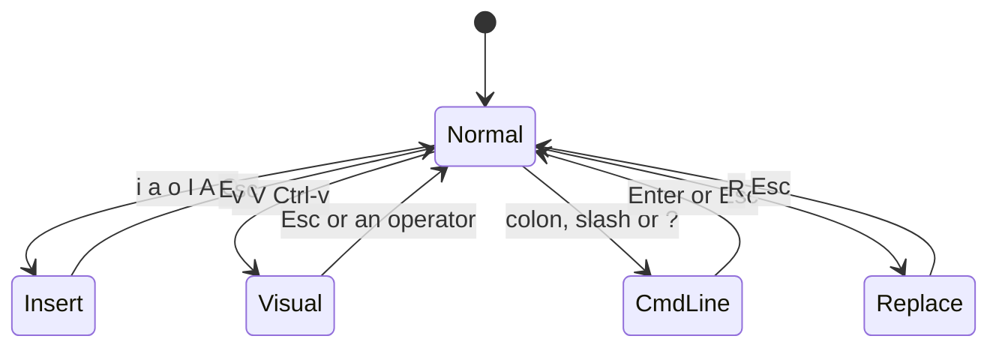

# Vim essentials

> **Level 1 · Chapter 9** · ⏱️ ~45 min read · Prerequisites: [Working with files](01-working-with-files.md), [Shell productivity](07-shell-productivity.md)

This chapter teaches you enough Vim to edit any file on any Linux machine with confidence. You'll learn its modes, how to move, the operator-plus-motion "grammar" that makes it fast, search and replace, registers, windows, and a minimal config. It ends with nano, the simpler alternative.

## Why it matters

It's 2 a.m. and a production job is failing. Alex SSHes into the server to fix one wrong path in a config file. There's no desktop, no VS Code, and no mouse. The server is a minimal cloud image, so `nano` isn't installed. `vi` is.

A month earlier, Alex would have opened the file, typed the fix, and watched it turn into a mess of stray characters. Then they'd have been stuck, unable even to quit, and finally closed the terminal window, leaving a swap file behind. Tonight Alex types `vi /etc/pipeline/job.ini`, jumps to the line with `/sales_2024`, changes the text inside the quotes with `ci"`, and saves with `:wq`. The whole fix takes fifteen seconds.

You don't have to make Vim your main editor. You do need to be able to edit a file in it without fear, because sooner or later it'll be the only editor available.

## Concepts

### Why vi is everywhere

**vi** ("visual") was written in 1976 for slow terminals. **Vim** ("Vi IMproved", 1991) is the modern version, and on Linux, `vi` almost always runs Vim. The POSIX standard requires a `vi`, so practically every Unix-like system, rescue disk, and container base image ships one.

Vim also shows up uninvited. Some commands open an editor for you:

- `crontab -e` edits your scheduled jobs (Level 4).
- `sudo visudo` edits the sudo rules safely.
- `git commit` without `-m` opens an editor for the message.
- `systemctl edit`, `less` (press `v`), and many more.

Each of these programs looks at the **`VISUAL`** and **`EDITOR`** environment variables to decide which editor to run. `VISUAL` is meant for full-screen editors and `EDITOR` historically meant a line editor. Today most programs check `VISUAL` first, then `EDITOR`, then fall back to a built-in default. That fallback differs by distribution:

| System | Fallback when `VISUAL`/`EDITOR` are unset |
|---|---|
| Linux Mint / Ubuntu / Debian | `/usr/bin/editor` (an alias that points to **nano** by default). `crontab -e` first asks you to pick one with `select-editor`. |
| Fedora, RHEL, Rocky, Arch, Alpine, most minimal containers | **vi** |

So on your Mint laptop you'll mostly see nano. On the servers you'll SSH into at work, you'll often land in vi. That's why the "how do I quit Vim?" joke exists.

### Choosing your editor: `EDITOR`, `VISUAL`, `select-editor`

Set both variables in `~/.bashrc` (see [Shell productivity](07-shell-productivity.md)) so every program agrees:

```bash
export VISUAL=vim
export EDITOR=vim
```

Mint and Ubuntu also have **`select-editor`**. It stores your choice in `~/.selected_editor`, which `sensible-editor` reads. `crontab -e` uses that.

```bash
select-editor
```

```text
Select an editor.  To change later, run 'select-editor'.
  1. /bin/nano        <---- easiest
  2. /usr/bin/vim.basic
  3. /usr/bin/vim.tiny
  4. /bin/ed

Choose 1-4 [1]:
```

`git` reads `VISUAL`/`EDITOR` too, or its own setting: `git config --global core.editor vim`.

### Which Vim do you have? vim.tiny vs. full vim

Mint ships only **vim.tiny**, a stripped-down build. Run `vi` with no `~/.vimrc` and it runs in **vi-compatible mode**, which copies the 1970s behaviour. That causes surprises:

- Pressing `u` twice *undoes the undo*, so you only get one level of undo.
- Arrow keys in insert mode may type the letters `A`, `B`, `C`, or `D` on new lines.
- There's no syntax highlighting, and `vimtutor` isn't installed.

Install the full version once. It's a normal, safe package install:

```bash
sudo apt install vim
```

After that, both `vim` and `vi` run the full Vim (`vim.basic`), and `vimtutor` is available. Every example in this chapter assumes full Vim, but they also work in vim.tiny once you create the `~/.vimrc` at the end of this chapter.

### Modes: the one idea that makes Vim click

Most editors have one mode: you press a key and a character appears. Vim has several **modes**, and the same key does different things in each one. This is the source of all early confusion, and also of all of Vim's speed.

- **Normal mode** is the default when you open a file. Keys are *commands*: `j` moves down, `x` deletes a character, and `dd` deletes a line. You spend most of your time here, because editing is mostly moving around and changing things.
- **Insert mode** is where keys type text, like any other editor. You enter it with `i` and leave it with `Esc`.
- **Visual mode** selects text, which you can then act on.
- **Command-line mode** is where you type a command at the bottom of the screen: `:w` to save, `:q` to quit, `/word` to search.
- **Replace mode** (`R`) types over existing characters.



The golden rule: **when in doubt, press `Esc`**. It always brings you back to Normal mode, and pressing it twice does no harm. In insert mode, the bottom line shows `-- INSERT --`. If it's blank, you're in Normal mode.

### The grammar: operator + motion

This is what separates people who *survive* in Vim from people who are *fast* in it. Normal-mode commands form little sentences:

```text
[count] operator  motion-or-text-object
   2       d            w            -> delete 2 words
           c            i"           -> change inside quotes
           y            ap           -> yank (copy) a paragraph
```

- An **operator** is a verb: `d` (delete), `c` (change: delete, then enter insert mode), `y` (yank, which means copy), `>` and `<` (indent and unindent), and `gU`/`gu` (uppercase and lowercase).
- A **motion** is anything that moves the cursor: `w`, `$`, `G`, `fx`, and so on. The operator acts on the text between where the cursor is now and where the motion would take it.
- A **text object** is a "noun" that selects a structure around the cursor, wherever inside it you are: `iw` (inner word), `i"` (inside quotes), `ip` (inner paragraph). `i` means *inner*. `a` means *a/around*, which includes the surrounding quotes, brackets, or whitespace.

You learn a handful of verbs and a handful of nouns and multiply them together. Learn 5 operators and 15 motions, and you know 75 commands without memorising any of them separately. The same words work everywhere. You'll find them again in `less`, in tmux's copy mode (next chapter), and in many other tools.

## Commands and examples

### Start with vimtutor

Run `vimtutor` before (or alongside) this chapter. It's a 30-minute interactive lesson that edits a copy of itself, so you can't break anything. It's the best first half hour you can spend on Vim.

```bash
vimtutor
```

### Practice file

Create a small Python ETL script to edit. **ETL** means extract, transform, load: reading data from a source, reshaping it, and writing it to a target.

```bash
mkdir -p ~/vim-lab && cd ~/vim-lab
cat > etl.py <<'EOF'
import csv

SOURCE = "data/sales_2024.csv"
TARGET = "warehouse/sales_2024.parquet"

def load(path):
    with open(path) as f:
        return list(csv.DictReader(f))

def total(rows):
    return sum(float(r["unit_price"]) * int(r["quantity"]) for r in rows)
EOF
vim etl.py
```

### Survival: open, insert, save, quit

| Keys | What it does |
|---|---|
| `vim file` | Open a file (it's created when you first save) |
| `i` | Enter insert mode before the cursor |
| `Esc` | Back to Normal mode |
| `:w` ++enter++ | Write (save) |
| `:q` ++enter++ | Quit (refuses if there are unsaved changes) |
| `:wq` or `:x` or `ZZ` | Save and quit |
| `:q!` ++enter++ | Quit and **throw away** changes |
| `:w newname.py` | Save a copy under a new name |

If you see `E37: No write since last change (add ! to override)`, Vim is protecting your unsaved work. Decide: `:wq` to keep it, or `:q!` to discard it.

!!! warning "Common mistake: the swap file warning"
    Vim saves your unsaved changes to a hidden **swap file** (`.etl.py.swp`) as you type. If Vim was killed, for example because you closed the terminal or the SSH connection dropped, the next `vim etl.py` shows `ATTENTION ... Found a swap file`. Press `r` to **recover** your edits, save, then delete the stale `.swp` file. Press `e` to edit anyway, or `q` to quit. It can also mean someone else is editing the same file right now. Read the message before you choose.

### Getting into insert mode, the smart way

`i` isn't the only way into insert mode. Each entry key puts the cursor somewhere useful first:

| Key | Starts inserting... |
|---|---|
| `i` / `a` | before / after the cursor |
| `I` / `A` | at the first non-blank character / at the end of the line |
| `o` / `O` | on a new line below / above |
| `s` | after deleting the character under the cursor |
| `S` or `cc` | after clearing the whole line (keeping indentation) |

`A` is the one beginners miss most. Adding a comment at the end of a line is `A  # note` then `Esc`, wherever the cursor started on that line.

### Movement

Keep your hands on the home row. Arrow keys work in Vim, but these are faster.

| Keys | Moves to |
|---|---|
| `h` `j` `k` `l` | left, down, up, right |
| `w` / `b` / `e` | next word start / previous word start / end of word |
| `W` / `B` / `E` | the same, but a "WORD" is anything between spaces (`r["unit_price"])` is one WORD) |
| `0` / `^` / `$` | start of line / first non-blank character / end of line |
| `gg` / `G` | first line / last line |
| `42G` or `:42` | line 42 |
| `{` / `}` | previous / next blank line (paragraph) |
| `%` | the matching bracket: `(` ↔ `)`, `[` ↔ `]`, `{` ↔ `}` |
| `fx` / `Fx` | the next / previous `x` on this line |
| `tx` / `Tx` | just *before* the next `x` / just after the previous `x` |
| `;` / `,` | repeat the last `f`/`t` forwards / backwards |
| `H` / `M` / `L` | top / middle / bottom of the screen |
| `Ctrl-d` / `Ctrl-u` | half a page down / up |
| `*` / `#` | next / previous occurrence of the word under the cursor |

Try it in `etl.py`. Press `gg`, then `3j` to reach the `SOURCE` line. Press `f"` to jump to the first quote. On the `return sum(...)` line, put the cursor on the first `(` and press `%`. The cursor jumps to the matching `)` at the end of the line. Watching `%` match brackets is also a quick way to check code for a missing parenthesis.

!!! tip "f and t are underrated"
    `f` jumps *onto* a character. `t` stops *'til* (just before) it. The difference matters when you combine them with operators. `dt)` deletes up to the closing parenthesis but keeps it. `df)` deletes the parenthesis too.

### Operators + motions in practice

Each example starts with the cursor somewhere on the line shown.

| You type | On this text | Result |
|---|---|---|
| `dw` | cursor on `float` in `float(r[...` | deletes `float` up to the `(`, which is where the next word starts |
| `d$` or `D` | anywhere | deletes to the end of the line |
| `dd` | anywhere | deletes the whole line (a doubled operator means "this line") |
| `cw` | on `rows` in `def total(rows):` | deletes `rows`, enters insert mode: type `records`, `Esc` |
| `ct:` | on `total` in `def total(rows):` | changes everything up to the `:` |
| `yy` then `p` | on the `SOURCE` line | duplicates the line below |
| `>>` / `<<` | anywhere | indents / unindents the line |
| `dG` | on line 6 | deletes from here to the end of the file |
| `gUiw` | on `source` | uppercases the word to `SOURCE` |

**Deleting is cutting.** In Vim, `d` and `x` put the deleted text into a register, so you can paste it with `p` (after the cursor or below the line) or `P` (before the cursor or above the line). That's why `ddp` swaps two lines: cut this line, then paste it below the next one. `xp` swaps two characters, which fixes `teh` → `the`.

### Text objects: `diw`, `ci"`, `dap`, and friends

Motions depend on where the cursor is. Text objects don't. You can be anywhere *inside* the thing.

| Text object | Selects | Example |
|---|---|---|
| `iw` / `aw` | inner word / a word plus the space after it | `diw` deletes the word, `daw` also removes a space |
| `i"` / `a"` | inside quotes / including the quotes | `ci"` replaces a string's contents |
| `i(` or `ib` / `a(` | inside parentheses / including them | `di(` empties a function's arguments |
| `i[` `i{` `i<` | inside other brackets | `ci{` rewrites a block |
| `it` / `at` | inside an HTML/XML tag | `cit` changes the tag's text |
| `ip` / `ap` | paragraph (lines between blank lines) / plus the blank line after it | `dap` deletes a function and the gap after it |

Three walkthroughs on `etl.py`:

1. **Change a path.** Move to the `SOURCE` line (`/SOURCE` ++enter++). The cursor is on `S`, outside the quotes, and that's fine. `ci"` searches forward on the line for the quoted string. Type `data/sales_2025.csv` and press `Esc`. The quotes stay; only the inside changed.
2. **Rename a word.** Put the cursor anywhere in `path` on the `def load(path):` line. `ciw` deletes the whole word, wherever in it you are. Type `filename`, `Esc`.
3. **Delete a whole function.** Put the cursor anywhere in the `def load` function. `dap` deletes the function *and* the blank line after it, so the file stays neatly spaced. `u` brings it back.

Compare `dap` to the motion way: you'd have to go to the first line of the function, count the lines, and type `4dd`. Text objects let you say *what* you mean.

### Counts

Prefix almost anything with a number to repeat it: `5j` moves 5 lines down, `3dd` deletes 3 lines, `d2w` deletes 2 words, and `10x` deletes 10 characters. `2dd` and `d2d` are the same: "delete two lines."

### Undo and redo

| Keys | Action |
|---|---|
| `u` | Undo the last change (press repeatedly to go further back) |
| `Ctrl-r` | Redo |
| `U` | Undo all recent changes on the last edited line |

One "change" is one Normal-mode command, or *everything* you typed during one visit to insert mode. That's a good reason to press `Esc` often. It creates undo checkpoints.

!!! warning "Common mistake: `u` only undoes once"
    If `u` `u` restores what you just undid, you're in plain `vi` (vim.tiny) in vi-compatible mode, where `u` toggles. Install full `vim`, or add `set nocompatible` to `~/.vimrc`, and undo becomes unlimited.

### The dot command: repeat the last change

`.` repeats the last change. It doesn't just repeat a motion; it repeats the whole edit, including any text you typed in insert mode. Combined with search, it replaces a lot of manual work:

1. `/2024` ++enter++ jumps to the first `2024`.
2. `cw2025` `Esc` changes it. (`cw` changes from the cursor to the end of the word. The cursor is on the `2` of `sales_2024`, so only `2024` is replaced.)
3. `n` jumps to the next match, and `.` repeats the change. Press `n` `.` `n` `.` as many times as needed, and skip a match with an extra `n`. Stop when `n` says `Pattern not found`. A `.` after that would change whatever is under the cursor.

This "find, change, then `n.` repeatedly" pattern gives you the control of a confirm-each-one replace with almost no typing. Design your edits to be repeatable. For example, `A;` `Esc` on one line, then `j.` `j.` adds a semicolon to the end of each following line.

### Visual mode

When you'd rather *see* what you're acting on, select first, then apply an operator:

| Key | Selects |
|---|---|
| `v` | characters |
| `V` | whole lines |
| `Ctrl-v` | a rectangular block (columns) |

Move with any motion to extend the selection, then press `d`, `c`, `y`, `>`, `<`, `gU`, or `:`. `o` jumps to the other end of the selection, and `gv` reselects the last selection.

A classic use is commenting out several lines with block mode:

1. Put the cursor on the `d` of `def total`.
2. `Ctrl-v`, then `j` to extend down one line. That's a 1-column block covering 2 lines.
3. `I# ` (capital I, hash, space), then `Esc`. The text appears on every line in the block after a moment.

`V` then `>` indents the selected lines. `Vjj:` opens the command line with `:'<,'>` already filled in, meaning "the selected lines," ready for a substitute.

### Search

| Keys | Action |
|---|---|
| `/pattern` ++enter++ | Search forward |
| `?pattern` ++enter++ | Search backward |
| `n` / `N` | Next match / previous match (in the search direction) |
| `*` / `#` | Search for the word under the cursor, forwards / backwards |
| `:noh` | Clear the search highlighting |

Patterns are regular expressions (you met them with `grep` in [Text processing](05-text-processing.md)), but Vim's dialect is slightly different: `\(`, `\)`, `\+`, and `\|` need backslashes by default. Start a pattern with `\v` ("very magic") to get grep -E style syntax: `/\v(load|total)\(`.

### Search and replace: `:s`

The substitute command has this shape:

```text
:[range]s/pattern/replacement/[flags]
```

| Command | Meaning |
|---|---|
| `:s/2024/2025/` | first match on the current line |
| `:s/2024/2025/g` | all matches on the current line |
| `:%s/2024/2025/g` | all matches in the whole file (`%` = every line) |
| `:%s/2024/2025/gc` | the same, but **confirm** each one |
| `:10,20s/foo/bar/g` | only lines 10 to 20 |
| `:'<,'>s/foo/bar/g` | only the visual selection |
| `:%s/rows/records/gn` | **count** matches without changing anything |
| `:%s/sales/Sales/gi` | ignore case while matching |

Flags: `g` = global (every match on the line, not just the first), `c` = confirm, `i` / `I` = ignore / respect case, `n` = report the count only.

With `c`, Vim highlights each match and asks:

```text
replace with 2025 (y/n/a/q/l/^E/^Y)?
```

`y` replaces this one, `n` skips it, `a` replaces all the remaining ones, `q` quits, and `l` replaces this one and stops ("last"). `Ctrl-e` and `Ctrl-y` scroll so you can see more context.

Counting first is a good habit before a big replace:

```text
:%s/rows/records/gn
```

```text
2 matches on 2 lines
```

When the pattern contains slashes, such as file paths, use a different delimiter instead of escaping every `/`:

```text
:%s#data/#/srv/pipeline/data/#g
```

`&` in the replacement means "the whole match," and `\1` means the first `\(...\)` group. `:%s/\v(\w+)_2024/\1_2025/g` turns `sales_2024` into `sales_2025` while keeping the prefix.

!!! tip "Undo is your safety net"
    A whole `:%s` is a single change, so one `u` reverts all of it. Try a bold replace, look at the result, and `u` if it's wrong.

### Registers basics

A **register** is a named clipboard. Vim has many:

| Register | Holds |
|---|---|
| `""` (unnamed) | the last delete or yank. Plain `p` pastes this. |
| `"0` | the last **yank** only (deletes don't overwrite it) |
| `"1`–`"9` | the last nine deletes of whole lines, newest first |
| `"a`–`"z` | yours to name. `"ayy` yanks into `a`; `"Ayy` (capital) **appends** to it |
| `"_` | the black hole: `"_dd` deletes without touching any register |
| `"+` | the system clipboard (only in builds with `+clipboard`) |

Use a register by typing `"` and its name before the command. `"ap` pastes register `a`. `:reg` shows them all.

The register you need most often is `"0`. A common frustration is: yank a line, delete some other text, press `p`, and get the *deleted* text instead of what you yanked. The yank is still safe in `"0`, so `"0p` pastes it.

!!! note "System clipboard"
    Ubuntu's `vim` package is built without clipboard support, so `"+` won't work (check `vim --version | grep clipboard`). In a terminal, the easy path is your terminal's own copy and paste: select with the mouse, then use ++ctrl+shift+c++ / ++ctrl+shift+v++. Vim 9 handles pasted text correctly. If you really want `"+y`, install the `vim-gtk3` package.

### Buffers, splits, and tabs

A **buffer** is a file loaded into memory. A **window** is a view onto a buffer; you can split the screen into several. A **tab page** is a collection of windows, more like a separate workspace than a browser tab.

```bash
vim etl.py config.ini          # two buffers, one shown
vim -O etl.py config.ini       # side by side (vertical split)
vim -p etl.py config.ini       # one tab per file
```

| Command | Action |
|---|---|
| `:e config.ini` | Edit another file in this window |
| `:ls` | List buffers |
| `:bn` / `:bp` / `:b 2` | Next / previous / buffer number 2 |
| `:sp file` / `:vsp file` | Split horizontally / vertically (opens `file`, or the current buffer if you omit it) |
| `Ctrl-w w` | Cycle between windows |
| `Ctrl-w h/j/k/l` | Move to the window left / below / above / right |
| `Ctrl-w q` / `:only` | Close this window / close all the others |
| `:tabnew file` | Open `file` in a new tab |
| `gt` / `gT` | Next / previous tab |
| `:wa` / `:qa` / `:wqa` | Write all / quit all / write and quit all |

A practical example: `:vsp config.ini` puts the config next to the code, so you can check key names while you edit the script.

!!! info "Hidden buffers"
    By default, Vim won't let you switch away from a buffer with unsaved changes (`E37`). `set hidden` in `~/.vimrc` lets you switch freely and keeps the changes in memory. `:qa` will still warn you before anything is lost.

### Running shell commands without leaving

| Command | Action |
|---|---|
| `:!ls data` | Run a shell command and show its output |
| `:r !date` | Insert a command's output below the cursor |
| `:%!sort` | Filter the whole file through `sort` |
| `:w !python3` | Send the buffer to a command's stdin (here, run the script without saving it) |

`:%!` connects Vim to everything you learned in [Pipes and redirection](04-pipes-and-redirection.md). `:'<,'>!sort -u` sorts and deduplicates just the selected lines.

### A minimal `~/.vimrc`

`~/.vimrc` runs every time Vim starts. Lines beginning with `"` are comments. Start small, understand every line, and add more only when you feel the need.

```vim
" ~/.vimrc - a small, explained starting point

set nocompatible            " full Vim behaviour, not 1976 vi (multi-level undo etc.)
set number                  " show line numbers
set relativenumber          " ...relative to the cursor, so counts like 5j are easy
set ruler showcmd showmode  " cursor position, partial commands, current mode
set wildmenu                " Tab-completion menu on the : command line
set scrolloff=5             " keep 5 lines visible above/below the cursor
set backspace=indent,eol,start  " Backspace works across lines and indents
set hidden                  " switch buffers without saving first
set splitright splitbelow   " new splits open right/below, like most tools

" Indentation: 4 spaces, never tab characters (good for Python, YAML)
set expandtab tabstop=4 shiftwidth=4 softtabstop=4
set autoindent

" Search: incremental, highlighted, case-insensitive unless you use capitals
set ignorecase smartcase

" Lines inside 'if 1' are skipped silently by vim.tiny, which lacks these features
if 1
  syntax on
  filetype plugin indent on
  set incsearch hlsearch
endif
```

What the less obvious lines do:

- **`relativenumber` with `number`** shows the real number on the current line and distances everywhere else. When you see a line labelled `4`, you know `4j` or `d4j` reaches it.
- **`expandtab`** turns the Tab key into spaces. `shiftwidth` controls `>>` and auto-indent, and `softtabstop` makes Backspace remove four spaces at once.
- **`ignorecase smartcase`** makes `/error` match `ERROR` too, but `/Error` matches only `Error`. A capital letter means you care about case.
- **`filetype plugin indent on`** loads per-language settings, such as YAML indentation rules.
- **`if 1 ... endif`** is a trick for vim.tiny. It lacks syntax highlighting and highlighted search, and those lines would print `E319` errors on every start. vim.tiny skips everything inside an `if` block without complaint, while full Vim runs it.

!!! warning "Creating ~/.vimrc turns off Vim's defaults"
    When full Vim finds no `~/.vimrc`, it loads a built-in `defaults.vim` with sensible settings. As soon as you create your own `~/.vimrc`, that file is no longer loaded. That's why the file above sets things like `scrolloff` and `incsearch` itself. Settings take effect when Vim starts, or immediately with `:source ~/.vimrc`.

### nano: the friendly alternative

**nano** is a simple modeless editor: you type and text appears. The bottom two lines always show the main shortcuts. It's the default editor on Mint, so `crontab -e` and `git commit` open it unless you change `EDITOR`.

```bash
nano -l etl.py      # -l shows line numbers
```

In nano's notation, `^` means ++ctrl++ and `M-` means ++alt++ (Meta). So `^O` is ++ctrl+o++ and `M-U` is ++alt+u++.

| Keys | Action |
|---|---|
| `^O` | Write Out (save). It asks for the filename; press ++enter++ to keep it. |
| `^X` | Exit (asks to save if there are changes) |
| `^W` | Where Is (search). `M-W` finds the next match. |
| `^\` | Replace. It asks for the search text, the replacement, then each match (`Y`/`N`/`A`). |
| `^K` | Cut the current line (or the marked region) |
| `^U` | Paste |
| `M-A` | Set a mark to start selecting text (`^6` also works) |
| `M-6` | Copy the line or region |
| `M-U` / `M-E` | Undo / redo |
| `^/` | Go to a line number (`M-G` also works) |
| `^C` | Show the cursor position |
| `M-\` / `M-/` | First / last line of the file |
| `^G` | Help |

Settings go in `~/.nanorc`:

```text
set linenumbers
set tabsize 4
set tabstospaces
set autoindent
set indicator
```

These turn on line numbers, use 4 spaces when you press Tab, keep the indentation of the previous line, and show a scroll-position bar on the right. Mint already loads syntax highlighting from `/usr/share/nano/` through the system `/etc/nanorc`.

=== "nano"

    Best for: quick edits, beginners, and the occasional config tweak. There's nothing to learn beyond the bottom two lines.

=== "Vim"

    Best for: editing on any server, and fast, repeatable edits once you know the grammar. It's worth the first week of practice if you'll live in terminals.

You don't have to pick a side. Most Linux professionals use nano or a GUI editor for some tasks and Vim for others. What matters is that neither one ever traps you.

## Exercises

### Exercise 1: Survive (easy)

Open a new file `~/vim-lab/notes.txt` in Vim. Type three lines about what you learned today. Save without quitting, add a fourth line, then quit *without* saving that fourth line. Check the result with `cat`.

??? success "Solution"

    ```bash
    vim ~/vim-lab/notes.txt
    ```

    Inside Vim: `i`, type three lines, `Esc`, `:w` ++enter++. Then `o`, type a fourth line, `Esc`, `:q!` ++enter++.

    ```bash
    cat ~/vim-lab/notes.txt
    ```

    Only the three saved lines appear. `:w` wrote the file, and `:q!` discarded everything after that.

### Exercise 2: Grammar drills (easy)

In `etl.py`, using only Normal-mode commands (no arrow keys or mouse):

1. Change `TARGET`'s path to `warehouse/sales.parquet` without retyping the quotes.
2. Rename the parameter `rows` in `def total(rows):` to `records`.
3. Delete the whole `load` function, including the blank line after it.
4. Undo the deletion.

??? success "Solution"

    1. `/TARGET` ++enter++, then `ci"`, type `warehouse/sales.parquet`, `Esc`.
    2. `/rows` ++enter++ lands on `rows` inside `total(rows)`. Then `ciw`, type `records`, `Esc`.
    3. `/def load` ++enter++, then `dap`.
    4. `u`.

    (`for r in rows` still says `rows`. Fixing every occurrence is Exercise 3.)

### Exercise 3: Replace with confidence (medium)

In `etl.py`: (a) count how many times `rows` appears, (b) replace them all with `records`, confirming each one, and (c) change every `2024` to `2025` using search plus the dot command instead of `:s`.

??? success "Solution"

    (a) `:%s/rows/records/gn` reports `2 matches on 2 lines` (or 1, if you already renamed one in Exercise 2).

    (b) `:%s/rows/records/gc`, then `y` at each prompt. Use `\<rows\>` (word boundaries) if you want to avoid matching text like `arrows`: `:%s/\<rows\>/records/gc`.

    (c) `gg`, then `/2024` ++enter++, `cw2025` `Esc`. Then repeat `n` `.` for each remaining match. When `n` reports `E486: Pattern not found: 2024`, you're done. Don't press `.` after that, or it repeats the change wherever the cursor happens to be. `cw` only covers the `2024` because the cursor is on the `2`, and `cw` changes from the cursor to the end of the word.

### Exercise 4: Visual block and filters (medium)

Create a file with this content and save it as `~/vim-lab/regions.txt`:

```text
west
north
east
south
north
west
```

In Vim, (a) sort the file and remove duplicates using an external command, (b) prefix every line with `- ` using visual block mode, and (c) save and quit.

??? success "Solution"

    (a) `:%!sort -u` replaces the buffer with the sorted, deduplicated lines: `east`, `north`, `south`, `west`.

    (b) `gg`, `Ctrl-v`, `G` (a block covering column 1 of every line), then `I- ` and `Esc`. The prefix appears on all lines.

    (c) `:wq`.

    ```bash
    cat ~/vim-lab/regions.txt
    ```

    ```text
    - east
    - north
    - south
    - west
    ```

### Exercise 5: Make it yours (hard)

Set Vim as your editor for every program, create the `~/.vimrc` from this chapter, and prove three things: `crontab -e` and `git commit` open Vim; `u` undoes multiple times even when you start `vi`; and pressing Tab in a `.py` file inserts four spaces.

??? success "Solution"

    ```bash
    echo 'export VISUAL=vim EDITOR=vim' >> ~/.bashrc
    source ~/.bashrc
    git config --global core.editor vim
    ```

    Create `~/.vimrc` with `vim ~/.vimrc`, paste in the file from this chapter, then `:wq`.

    - `crontab -e` now opens Vim, because `VISUAL` is checked first. Quit with `:q` without changes, so no crontab is installed.
    - In any git repository, `git commit --allow-empty` opens Vim. `:q!` aborts the commit, since an empty message cancels it.
    - `vi /tmp/t.txt`: type a few separate changes, then `u` `u` `u`. Each `u` steps further back, because `set nocompatible` is in effect.
    - `vim test.py`, `i`, press Tab, `Esc`, then `:set list`. Spaces show as nothing and tabs as `^I`, so no `^I` means it worked.

## Check yourself

1. You opened a file in Vim and typed, and strange things happened instead of text appearing. What happened, and how do you get back to safety?

    ??? note "Answer"

        You were in Normal mode, where keys are commands, not text. Press `Esc` (twice is fine) to be sure you're in Normal mode. Use `u` repeatedly to undo the accidental commands, or `:q!` to leave without saving anything. Then use `i` before typing text.

2. On Mint, which editor opens for `crontab -e` if you've never configured anything? And on a Fedora or Alpine server?

    ??? note "Answer"

        On Mint, `crontab -e` runs `sensible-editor`, which asks you to choose with `select-editor` (nano is the suggested default). Other programs use `/usr/bin/editor`, which is nano. On Fedora, RHEL, Alpine, and most minimal systems, the fallback is `vi`. Set `VISUAL` and `EDITOR` to control it everywhere.

3. Explain `d2w`, `ci"`, and `dap` in terms of operator, count, motion, and text object.

    ??? note "Answer"

        `d2w`: operator `d` (delete) with a count of 2 and the motion `w`, so it deletes two words. `ci"`: operator `c` (change) with the text object `i"` (inside quotes), so it deletes the string's contents and enters insert mode. `dap`: operator `d` with the text object `ap` (a paragraph plus the blank line after it).

4. What's the difference between `ft` and `tt`, and why does it matter for `d`?

    ??? note "Answer"

        `ft` moves *onto* the next `t`. `tt` moves to just *before* it. With an operator, `dft` deletes up to and including the `t`, while `dtt` deletes up to but not including it.

5. What does `:%s/old/new/gc` do, flag by flag?

    ??? note "Answer"

        `%` applies it to every line in the file. `s` substitutes `old` with `new`. `g` replaces every match on each line, not just the first. `c` asks for confirmation at each match (`y`/`n`/`a`/`q`/`l`).

6. You yanked a line with `yy`, then deleted a word with `dw`. Now `p` pastes the word. How do you paste the yanked line?

    ??? note "Answer"

        `"0p`. Register `0` always holds the most recent yank, and deletes don't overwrite it. Plain `p` uses the unnamed register, which the delete replaced.

7. What does the `.` command repeat, and why is "search, change, `n.`" so effective?

    ??? note "Answer"

        `.` repeats the last change, including any text typed in insert mode. After one manual change, `n` jumps to the next match and `.` applies the same change. That gives you a confirm-each replacement with two keystrokes per match, and you can skip any match.

8. You created `~/.vimrc` with only `set number`, and now incremental search and other nice defaults are gone in full Vim. Why?

    ??? note "Answer"

        Full Vim loads `defaults.vim` only when no user `~/.vimrc` exists. Once you create one, you're responsible for those settings. Add the ones you want (such as `incsearch`, `scrolloff`, `syntax on`), as in the chapter's example `.vimrc`.

## Key takeaways

- Vim is on practically every Linux system. Programs fall back to it (or, on Mint, to nano) for `crontab -e`, `visudo`, and `git commit`. Control that with `VISUAL`/`EDITOR` or `select-editor`.
- Mint ships vim.tiny in vi-compatible mode. Install `vim` to get full undo, syntax highlighting, and `vimtutor`.
- Modes are the core idea: Normal for commands, Insert for typing, Visual for selecting, and Command-line for `:` and `/`. `Esc` always gets you back to Normal.
- Edit with sentences: `[count] operator motion/text-object`. A few verbs (`d`, `c`, `y`, `>`) times a few nouns (`w`, `$`, `f`, `iw`, `i"`, `ap`) cover most editing.
- `u`, `Ctrl-r`, and `.` make editing safe and repeatable. `:%s/old/new/gc` replaces with confirmation, and `/gn` counts first.
- `"0` holds your last yank. Splits (`:vsp`, `Ctrl-w`) and buffers (`:ls`, `:bn`) let you work on several files at once.
- nano is a perfectly good choice for quick edits. Its shortcuts are always shown at the bottom of the screen.

## Next

Long jobs on remote servers die when your SSH connection drops, unless you run them inside a terminal multiplexer. Continue with [tmux](10-tmux.md).
