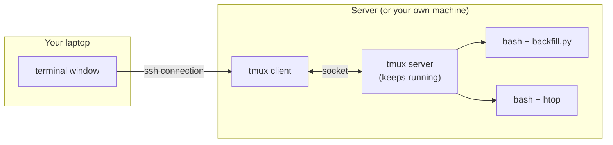
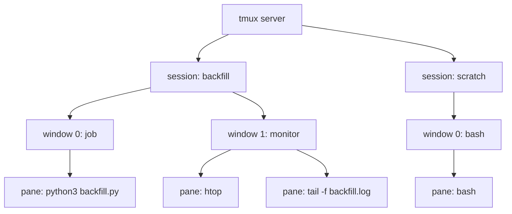
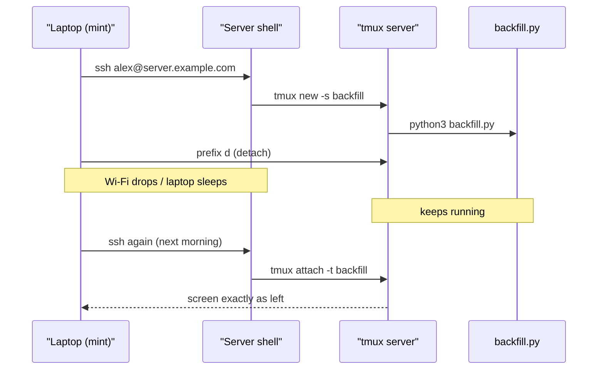

# tmux

> **Level 1 · Chapter 10** · ⏱️ ~35 min read · Prerequisites: [Shell productivity](07-shell-productivity.md), [Vim essentials](09-vim-essentials.md)

This chapter teaches you tmux, a terminal multiplexer. It keeps your shells and jobs alive when your connection drops, and it splits one terminal into many. You'll learn the session/window/pane model, the prefix key, detaching and reattaching, copy mode, a small config, a real long-running-job workflow, and GNU screen as the older alternative.

## Why it matters

Alex starts a backfill on a remote server at 6 p.m.: reload twelve months of sales data into the warehouse. It should take about three hours. Alex SSHes in, runs `python3 backfill.py --year 2025`, watches the first few batches go by, and heads home.

On the train, the laptop sleeps. The Wi-Fi changes. The SSH connection drops, and the server sends a **hangup signal** (`SIGHUP`) to everything started from that login. That includes the backfill. It dies at batch 41 of 120, halfway through writing a month's data. The next morning starts with cleaning up a half-loaded table.

The next time, Alex types `tmux new -s backfill` first and runs the job *inside* tmux. The laptop sleeps again and the connection drops again, but this time it doesn't matter. The next morning Alex runs `ssh server`, then `tmux attach -t backfill`, and the terminal looks exactly as it was left, with the final line reading `batch 120/120 done`.

## Concepts

### What a terminal multiplexer is

When you open a terminal window, or log in over SSH, your shell is connected to a **terminal**. On modern systems that's a **pseudo-terminal (PTY)**: a pair of kernel devices that pretends to be a physical terminal. When the terminal goes away (you close the window, or the network drops), the kernel sends `SIGHUP` to the processes using it. By default `SIGHUP` terminates them. You'll study signals properly in Level 3.

A **terminal multiplexer** puts a long-lived program in the middle. tmux runs a **server** process in the background, and the server owns the PTYs your shells run in. Your terminal window runs only a small **client** that displays what the server shows it and forwards your keystrokes.



If the SSH connection dies, only the client dies. The server, and every shell and job inside it, never notices. Later you start a new client with `tmux attach`, and it reconnects to the same server and the same shells.

This gives you three superpowers:

1. **Survive disconnects.** Jobs keep running when your connection, laptop, or terminal window goes away.
2. **Run long jobs and come back later**, even from a different computer.
3. **Split one screen** into a workspace, for example editor, logs, and a shell, all in one SSH connection.

tmux survives disconnects, but it doesn't survive a reboot of the machine it's running on. When the server reboots, everything inside tmux is gone.

### The session / window / pane model

tmux organises everything in three levels:

- A **session** is a named collection of windows. It's the thing you detach from and attach to. Typically you have one session per project or task: `backfill`, `web`, `scratch`.
- A **window** fills the whole screen, like a browser tab. Each session has one or more windows, shown in the status bar at the bottom.
- A **pane** is a rectangular split of a window. Each pane runs its own shell.



One server holds every session for your user. Each session has windows, and each window has panes. A pane is always just a shell (or whatever program you run in it). tmux is only arranging and preserving them.

### The prefix key

tmux sits between your keyboard and your shells, so it needs a way to tell "a command for tmux" apart from "a key for the program in the pane." It uses a **prefix key**: ++ctrl+b++ by default. Press and release the prefix, *then* press a command key.

- ++ctrl+b++ then ++d++ means: tmux, detach.
- ++d++ on its own goes to your shell, as normal.

In this chapter, `prefix d` means "press ++ctrl+b++, release, press ++d++." Everything else goes straight through to your programs, so Vim, `less`, and `htop` all work normally inside tmux.

!!! tip "Lost? Two keys to remember"
    `prefix ?` lists every key binding (press `q` to leave the list). `prefix :` opens the tmux command prompt, where you can type any tmux command, such as `kill-session`.

### The status bar

At the bottom of every tmux client is a **status bar**:

```text
[backfill] 0:job- 1:monitor*                          "mint" 14:32 14-Mar-25
```

- `[backfill]` is the session name.
- `0:job- 1:monitor*` lists the windows by number and name. `*` marks the current window and `-` the previous one. You may also see `Z` (a zoomed pane), `#` (activity), or `!` (a bell).
- `"mint"` is the pane title, which by default is the hostname, followed by the time and date.

The status bar is how you know you're inside tmux. Another way: the `TMUX` environment variable is set inside tmux and empty outside it (`echo $TMUX`).

## Commands and examples

### Installing and starting

tmux is installed on Mint 22.3 by default. Check with:

```bash
tmux -V
```

```text
tmux 3.4
```

On a server that lacks it, install it with `sudo apt install tmux` (Debian/Ubuntu) or `sudo dnf install tmux` (Fedora/RHEL).

Start a named session. Always name your sessions; `0`, `1`, `2` tell you nothing a week later.

```bash
tmux new -s data
```

Your screen clears and a green status bar appears with `[data] 0:bash*`. You're in a shell inside tmux. Run something:

```bash
for i in $(seq 1 300); do echo "batch $i/300 loaded"; sleep 1; done
```

### Detach, list, attach

Press `prefix d`. The tmux client exits and you're back in your original shell:

```text
[detached (from session data)]
```

The loop is still running. List sessions:

```bash
tmux ls
```

```text
data: 1 windows (created Fri Mar 14 14:30:12 2025)
```

Reattach:

```bash
tmux attach -t data
```

The counter has kept going while you were away. `attach` can be shortened to `a`, and `-t` takes a session name or a unique prefix of one, so `tmux a -t da` works too. Plain `tmux attach` attaches to the most recently used session.

The session-management commands:

| Command | What it does |
|---|---|
| `tmux new -s NAME` | Create and attach to a session called NAME |
| `tmux new -s NAME -d` | Create it **detached** (in the background) |
| `tmux new -A -s NAME` | Attach to NAME if it exists, otherwise create it |
| `tmux ls` | List sessions (`list-sessions`) |
| `tmux attach -t NAME` | Attach to a session |
| `tmux attach -d -t NAME` | Attach and detach any other clients (for example, the one left on your office PC) |
| `tmux kill-session -t NAME` | End a session and every program inside it |
| `tmux kill-server` | End **all** sessions |
| `tmux rename-session -t OLD NEW` | Rename a session |

Typical messages you'll meet:

```text
duplicate session: data
can't find session: dta
error connecting to /tmp/tmux-1000/default (No such file or directory)
```

These mean, in order: you ran `tmux new -s data` when `data` already exists (use `attach`, or `new -A`); you misspelled a name; and no tmux server is running at all, so there are no sessions. The path in the last one is the **socket**, the special file the client and server talk through. It's private to your user (UID 1000).

!!! warning "Common mistake: nesting tmux"
    Running `tmux` inside tmux creates a session within a session. Two status bars appear, and the prefix goes only to the outer one. tmux tries to stop you with `sessions should be nested with care, unset $TMUX to force`. Detach from the inner one, or use `prefix s` to switch sessions instead. It's very common to SSH from inside a local tmux into a server and run tmux there. That's fine, but then `prefix` controls your *local* tmux, and you press `prefix prefix` (++ctrl+b++ twice) to send the prefix to the remote one.

!!! warning "kill-session kills the jobs too"
    `tmux kill-session`, `prefix &` (kill window), and `prefix x` (kill pane) terminate the programs running inside. Detaching is what leaves things running. Exiting the shell in the last pane (`exit` or ++ctrl+d++) closes it, and when the last window closes, the session ends and you'll see `[exited]`.

### Windows

| Keys | Action |
|---|---|
| `prefix c` | Create a new window |
| `prefix ,` | Rename the current window |
| `prefix n` / `prefix p` | Next / previous window |
| `prefix 0` … `prefix 9` | Go to window number N |
| `prefix l` | Last (previously used) window |
| `prefix w` | Choose a window from a tree of all sessions and windows |
| `prefix f` | Find a window by the text in it |
| `prefix &` | Kill the current window (asks `y/n`) |

A common layout for data work: window 0 `job` runs the pipeline, window 1 `logs` runs `tail -f`, and window 2 `sql` has a database client. Rename each one with `prefix ,` and the status bar becomes a table of contents.

### Panes

| Keys | Action |
|---|---|
| `prefix %` | Split left/right (a new pane to the right) |
| `prefix "` | Split top/bottom (a new pane below) |
| `prefix` arrow key | Move to the pane in that direction |
| `prefix o` | Cycle to the next pane |
| `prefix ;` | The previously active pane |
| `prefix z` | **Zoom**: make this pane full-window, and press again to restore |
| `prefix x` | Kill the current pane (asks `y/n`) |
| `prefix q` | Show pane numbers (press a number to jump to it) |
| `prefix {` / `prefix }` | Swap this pane with the previous / next one |
| `prefix Space` | Cycle through preset layouts |
| `prefix !` | Break this pane out into its own window |
| `prefix Ctrl+arrow` | Resize by 1 cell (hold the arrow to repeat) |
| `prefix Alt+arrow` | Resize by 5 cells |

`%` and `"` are hard to remember. One way: `"` looks like two stacked marks, so it stacks panes vertically, while `%` has a slash dividing two circles side by side. The config later in this chapter maps them to `|` and `-`, which are easier.

`prefix z` deserves special mention. When you need to read a long stack trace in a small pane, zoom it to full size, read it, then zoom back. The window shows `Z` in the status bar while a pane is zoomed.

!!! tip "Repeatable keys"
    After `prefix`, the arrow and resize keys stay "armed" for half a second (the `repeat-time` option). So `prefix ↑ ↑ ↑` moves up three panes without pressing the prefix again.

### Sessions from inside tmux

| Keys | Action |
|---|---|
| `prefix d` | Detach |
| `prefix s` | Choose a session from a list |
| `prefix $` | Rename the session |
| `prefix (` / `prefix )` | Previous / next session |
| `prefix ?` | List all key bindings |
| `prefix :` | tmux command prompt |

### Copy mode and scrolling

Inside tmux, your terminal's own scrollbar and mouse wheel usually scroll the *terminal's* history, not the pane's. tmux keeps its own **scrollback** for each pane, and you read it in **copy mode**.

- `prefix [` enters copy mode. `prefix PgUp` enters it and scrolls up a page in one step.
- A yellow indicator such as `[0/1834]` in the top-right corner shows your position: lines scrolled up, out of the total history.
- `q` leaves copy mode and returns to the live view.

Copy mode has two key sets. The default is emacs-style, **unless your `VISUAL` or `EDITOR` contains "vi"**, in which case tmux uses vi-style keys. If you set `EDITOR=vim` in the previous chapter, you already have vi keys.

| Action | vi keys (`mode-keys vi`) | emacs keys (default) |
|---|---|---|
| Move | `h` `j` `k` `l`, `w` `b` | arrow keys, `M-f` `M-b` |
| Page up / down | `Ctrl-b` / `Ctrl-f` (or PgUp/PgDn) | PgUp / PgDn |
| Half page up / down | `Ctrl-u` / `Ctrl-d` | `M-Up` / `M-Down` |
| Top / bottom of history | `g` / `G` | `M-<` / `M->` |
| Search up / down | `?` / `/`, then `n` / `N` | `C-r` / `C-s`, then `n` / `N` |
| Start selection | `Space` | `C-Space` |
| Select whole lines | `V` | — |
| Copy selection and exit | `Enter` | `M-w` |
| Leave | `q` | `q` or `Esc` |

Copied text goes into a tmux **paste buffer**. `prefix ]` pastes the most recent buffer into the current pane, and `prefix =` lets you choose from older ones.

A real use: a job printed an error 2,000 lines ago. `prefix [`, then `?ERROR` ++enter++ (vi keys) jumps back to it, and `n` goes to the previous occurrence. That's often faster than re-running the job with `| tee`.

!!! note "Mouse and the system clipboard"
    With `set -g mouse on` (see the config below), the scroll wheel enters copy mode and scrolls, clicking selects panes, and dragging a border resizes panes. Dragging to select text then copies into a tmux buffer, not your desktop clipboard. To use your terminal's normal selection instead, **hold ++shift++** while you drag. That works in Mint's GNOME Terminal and most others. Then copy with ++ctrl+shift+c++.

Scrollback is limited by the `history-limit` option, which defaults to 2,000 lines per pane. That's small for log-heavy work, so the config below raises it.

### Peeking without attaching

You can look into a running session from a script or another terminal, without attaching. `capture-pane -p` prints the visible pane to stdout:

```bash
tmux capture-pane -p -t data | tail -3
```

```text
batch 211/300 loaded
batch 212/300 loaded
batch 213/300 loaded
```

You can also start a job directly in a new detached session. The session ends when the command exits:

```bash
tmux new -d -s archive 'tar -czf ~/backup-2025-03.tar.gz ~/archive-lab/project'
tmux ls
```

```text
archive: 1 windows (created Fri Mar 14 14:41:03 2025)
data: 1 windows (created Fri Mar 14 14:30:12 2025)
```

`send-keys` types into a session as if you were at the keyboard (`Enter` is a literal key name):

```bash
tmux send-keys -t data 'df -h /' Enter
```

### A small `~/.tmux.conf`

tmux reads `~/.tmux.conf` when the **server** starts. Here's a short, explained starting point. Every line works in tmux 3.4.

```bash
# ~/.tmux.conf

# Prefix: Ctrl-a is easier to reach than Ctrl-b (screen users know it).
# Press Ctrl-a twice to send a literal Ctrl-a (start-of-line in bash).
set -g prefix C-a
unbind C-b
bind C-a send-prefix

# Mouse: scroll, click panes, drag borders. Hold Shift for normal selection.
set -g mouse on

# Keep 50,000 lines of scrollback per pane (default 2,000).
set -g history-limit 50000

# Number windows and panes from 1, matching the keyboard layout.
set -g base-index 1
setw -g pane-base-index 1
set -g renumber-windows on

# Don't wait after Esc (makes Vim feel instant), and use proper colours.
set -sg escape-time 10
set -g default-terminal "tmux-256color"

# Split with | and -, opening in the current pane's directory.
bind | split-window -h -c "#{pane_current_path}"
bind - split-window -v -c "#{pane_current_path}"
bind c new-window -c "#{pane_current_path}"

# vi keys in copy mode; v selects, y copies (like Vim).
setw -g mode-keys vi
bind -T copy-mode-vi v send -X begin-selection
bind -T copy-mode-vi y send -X copy-selection-and-cancel

# prefix r reloads this file.
bind r source-file ~/.tmux.conf \; display "Config reloaded"

# Status bar right side: hostname and date/time.
set -g status-right "#H | %Y-%m-%d %H:%M"
```

Line by line:

- **`set -g`** sets a *global* session option. **`setw -g`** sets a global *window* option. **`set -s`** sets a *server* option. Options belong to different levels, matching the session/window/pane model.
- **`bind`** creates a key binding in the prefix table. `bind -T copy-mode-vi` binds a key inside vi copy mode. **`unbind`** removes a default binding.
- **Ctrl-a as prefix** is popular because it's on the home row and matches GNU screen. The cost: in bash, ++ctrl+a++ means "go to start of line" (from [Shell productivity](07-shell-productivity.md)). `bind C-a send-prefix` means pressing it twice sends a real ++ctrl+a++. If that bothers you, delete the first three lines and keep ++ctrl+b++.
- **`#{pane_current_path}`** is a **format**: tmux replaces it with the directory of the current pane. New splits open where you're working instead of in your home directory.
- **`escape-time`** is how long tmux waits after `Esc` to see whether it's the start of a key sequence such as Alt+key. The default 500 ms makes Vim's `Esc` feel sluggish.
- **`renumber-windows`** closes gaps, so closing window 2 of 1-2-3 gives you 1-2.

Apply it to a running server without restarting:

```bash
tmux source-file ~/.tmux.conf
```

After that, `prefix r` (now ++ctrl+a++ ++r++) reloads it for you.

!!! warning "Common mistake: \"my config does nothing\""
    The config is read when the tmux *server* starts, not each time you attach. If any session is still running, detaching and reattaching doesn't reload it. Run `tmux source-file ~/.tmux.conf`, or end everything with `tmux kill-server` and start again. A typo in the file shows a message like `/home/alex/.tmux.conf:12: unknown command: sett` when tmux starts or when you source the file.

### Workflow: a long data job on a server

Here's the full flow from the story, step by step. The server is `server.example.com`; you'll set up SSH keys properly in Level 4, so for now type your password when asked.



**1. Connect and start a named session.**

```bash
ssh alex@server.example.com
tmux new -A -s backfill
```

`new -A` means that if you run it again later, it attaches instead of failing with `duplicate session`. You can type the same line every time.

**2. Lay out the workspace.** In window 1, start the job. Send its output to both the screen and a log file, so there's a record even after the scrollback fills up:

```bash
cd ~/pipeline
python3 backfill.py --year 2025 2>&1 | tee -a backfill.log
```

Press `prefix ,` and name the window `job`. Then `prefix c` for a second window named `monitor`, with `htop` in it. `prefix -` (from the config) splits it and runs `tail -f ~/pipeline/backfill.log` in the bottom pane.

**3. Detach and go.** `prefix d`. You can now close the laptop, end the SSH session with `exit`, or simply lose the connection. All of them are fine.

**4. Check from anywhere.** From your desktop at home, or a phone SSH app:

```bash
ssh alex@server.example.com
tmux ls
```

```text
backfill: 2 windows (created Fri Mar 14 18:02:47 2025)
```

The session still exists, so the job survived. To peek without attaching:

```bash
tmux capture-pane -p -t backfill:job | tail -2
```

```text
2025-03-14 21:47:10 INFO month=2025-12 batch 120/120 done
2025-03-14 21:47:10 INFO backfill finished in 3h44m
```

`backfill:job` is a **target**: session `backfill`, window `job`. You can also write `backfill:1` (window index) or `backfill:1.2` (pane 2 of window 1).

**5. Reattach, inspect, clean up.**

```bash
tmux attach -t backfill
```

Scroll back with `prefix [` to check for warnings. When you're done, `exit` each shell, or run `tmux kill-session -t backfill`.

!!! info "tmux vs. nohup"
    `nohup command &` (Level 3) also lets a job survive a hangup, by ignoring `SIGHUP`. You lose the interactive terminal, though: no progress bars, no prompts, no way to press ++ctrl+c++ later. tmux keeps the whole interactive session. For jobs that should run unattended and restart on failure, a systemd service (Level 4) is the right tool. tmux is for jobs you want to *watch*.

### Try the whole thing locally

You don't need a server to practise detaching. Everything works the same on your own machine:

```bash
tmux new -s demo
# inside tmux:
for i in $(seq 1 120); do echo "tick $i"; sleep 1; done
# press prefix d, then close the terminal window entirely
```

Open a new terminal window:

```bash
tmux attach -t demo
```

The counter kept running even though the window it started in no longer exists.

### GNU screen: the older alternative

**GNU screen** (1987) is the original terminal multiplexer. You'll find it on older servers, and some people still prefer it. It isn't installed on Mint by default (`sudo apt install screen`). The concepts are the same; only the keys differ. Its prefix is ++ctrl+a++.

=== "tmux"

    ```bash
    tmux new -s data          # new named session
    # prefix d                # detach
    tmux ls                   # list
    tmux attach -t data       # reattach
    tmux kill-session -t data # end it
    ```

=== "screen"

    ```bash
    screen -S data            # new named session
    # Ctrl-a d                # detach
    screen -ls                # list
    screen -r data            # reattach
    screen -X -S data quit    # end it
    ```

| Action | tmux (default) | screen |
|---|---|---|
| New window | `prefix c` | ++ctrl+a++ ++c++ |
| Next / previous window | `prefix n` / `p` | ++ctrl+a++ ++n++ / ++p++ |
| List windows | `prefix w` | ++ctrl+a++ ++double-quote++ |
| Split top/bottom | `prefix "` | ++ctrl+a++ ++shift+s++ |
| Split left/right | `prefix %` | ++ctrl+a++ ++bar++ |
| Move between splits | `prefix` arrow | ++ctrl+a++ ++tab++ |
| Copy / scroll mode | `prefix [` | ++ctrl+a++ ++bracket-left++ (or ++esc++) |
| Help | `prefix ?` | ++ctrl+a++ ++question++ |

`screen -ls` output looks like this:

```text
There is a screen on:
	48213.data	(03/14/2025 02:30:12 PM)	(Detached)
1 Socket in /run/screen/S-alex.
```

`screen -r` needs the name (or the number before the dot) when more than one session exists. `screen -d -r data` detaches the session from wherever it's attached and attaches it here. That's the equivalent of `tmux attach -d`.

Why tmux is the usual recommendation today: it's actively developed, its splits and status bar are better, it's scriptable (`send-keys`, `capture-pane`, formats), and its config is easier to read. Learn tmux, and you'll still recognise screen if you meet it.

## Exercises

### Exercise 1: Detach and reattach (easy)

Create a session named `practice`. Inside it, run `top`. Detach, confirm with `tmux ls` that the session exists, reattach, and quit `top`. Finally, end the session from inside by exiting the shell.

??? success "Solution"

    ```bash
    tmux new -s practice
    top
    # prefix d
    tmux ls
    ```

    ```text
    practice: 1 windows (created Fri Mar 14 15:02:33 2025)
    ```

    ```bash
    tmux attach -t practice
    # press q to quit top, then:
    exit
    ```

    ```text
    [exited]
    ```

    Exiting the only shell in the only window ends the session. `tmux ls` now shows no `practice` session.

### Exercise 2: Build a three-pane workspace (easy)

In a session named `logs`, make one window with three panes: a large left pane running `less /etc/services`, and on the right, a top pane running `watch -n 2 date` and a bottom pane with a free shell. Zoom the left pane, then unzoom it.

??? success "Solution"

    ```bash
    tmux new -s logs
    less /etc/services
    ```

    `prefix %` splits left/right, and the cursor moves to the new right pane. Run `watch -n 2 date`. Then `prefix "` splits the right pane top/bottom, leaving you in a free shell at the bottom right.

    `prefix ←` moves to the left pane. `prefix z` zooms it (the status bar shows `Z`), and `prefix z` again restores the layout. To make the left pane larger, hold `prefix Alt+→` (with the default bindings) a few times.

### Exercise 3: Find it in the scrollback (medium)

In a tmux pane, run:

```bash
for i in $(seq 1 3000); do if [ $i -eq 1234 ]; then echo "ERROR at row $i"; else echo "row $i ok"; fi; done
```

Without re-running anything, use copy mode to find the error line, copy it, and paste it at the shell prompt.

??? success "Solution"

    With the default 2,000-line `history-limit`, row 1234 has already scrolled off the top, because 3,000 lines were printed. Raise the limit first. It applies to *new* panes only:

    ```bash
    tmux set -g history-limit 50000
    ```

    Open a new window (`prefix c`) and run the loop again. Then:

    - `prefix [` enters copy mode.
    - With vi keys: `?ERROR` ++enter++. With emacs keys: ++ctrl+r++, type `ERROR`, ++enter++. The cursor jumps to `ERROR at row 1234`.
    - Select the line. With vi keys, `V` then ++enter++. With emacs keys, move to the start of the line, ++ctrl+space++, move to the end, then `M-w`.
    - `prefix ]` pastes it at the prompt.

    Lesson: set a big `history-limit` in `~/.tmux.conf` *before* you need it.

### Exercise 4: Install the config and prove it works (medium)

Create the `~/.tmux.conf` from this chapter. Load it into your running server without restarting. Then prove that: the prefix is ++ctrl+a++, `|` splits left/right in the current directory, and windows are numbered from 1.

??? success "Solution"

    Write the file with `vim ~/.tmux.conf` (or nano), then:

    ```bash
    tmux source-file ~/.tmux.conf
    tmux show -g prefix
    ```

    ```text
    prefix C-a
    ```

    In a session, `cd /etc`, then ++ctrl+a++ ++bar++. The new right-hand pane's `pwd` prints `/etc`. New windows (`prefix c`) are numbered `1`, `2`, ... in a *new* session (`tmux new -s fresh`). Windows that already exist keep their numbers until you renumber or recreate them.

### Exercise 5: Unattended job with a status check (hard)

Without attaching to anything, start a detached session named `compress` that runs a long compression job of your choosing (for example, `xz -k -9 -T1` on a large file from the [archives chapter](08-archives-and-compression.md)) followed by `echo FINISHED`. Then write a one-line command that prints `running` or `done` by inspecting the session from outside. Make sure the session doesn't vanish the moment the job finishes, so you can read its output.

??? success "Solution"

    A session closes when its command exits. To keep it open after the job finishes, end the command with an interactive shell (`exec bash`):

    ```bash
    tmux new -d -s compress 'cd ~/archive-lab && xz -k -9 -T1 -v -f project.tar; echo FINISHED; exec bash'
    ```

    Status check, run as often as you like:

    ```bash
    tmux capture-pane -p -t compress | grep -q FINISHED && echo done || echo running
    ```

    ```text
    running
    ```

    And later:

    ```text
    done
    ```

    `capture-pane -p` prints the pane's visible text, and `grep -q` only sets the exit status. Clean up with `tmux kill-session -t compress`. An alternative to `exec bash` is the `remain-on-exit` option, which keeps a dead pane visible.

## Check yourself

1. Why does a job started over SSH normally die when the connection drops, and why does it survive inside tmux?

    ??? note "Answer"

        When the SSH connection closes, its pseudo-terminal goes away and the kernel sends `SIGHUP` to processes using it, which terminates them by default. Inside tmux, the job's terminal belongs to the tmux server, which is a separate background process. Only the tmux client was attached to the SSH terminal. The client dies, but the server and its shells keep running.

2. Explain the session / window / pane hierarchy in one or two sentences each.

    ??? note "Answer"

        A session is a named group of windows that you attach to and detach from. A window fills the screen, like a tab, and appears in the status bar. A pane is a split of a window, and each pane runs its own shell or program.

3. What's the difference between `prefix d` and typing `exit`?

    ??? note "Answer"

        `prefix d` detaches the client: everything keeps running and you can reattach later. `exit` ends the shell in the current pane. If that was the last pane of the last window, the session ends and any job in that shell is gone.

4. You run `tmux new -s etl` and get `duplicate session: etl`. What does that tell you, and what do you run instead?

    ??? note "Answer"

        A session named `etl` already exists, probably from earlier, and it may still be running a job. Run `tmux attach -t etl`, or use `tmux new -A -s etl`, which attaches if it exists and creates it otherwise.

5. How do you scroll back through output in a tmux pane, and why doesn't the mouse wheel do it by default?

    ??? note "Answer"

        Enter copy mode with `prefix [` (or `prefix PgUp`), move with PgUp/PgDn or the vi/emacs keys, and press `q` to leave. Without `mouse on`, the wheel goes to the terminal emulator, which scrolls its own history. That history doesn't contain the tmux pane's history. With `set -g mouse on`, tmux takes the wheel and scrolls the pane.

6. You edited `~/.tmux.conf`, detached, and reattached, but nothing changed. Why, and how do you fix it?

    ??? note "Answer"

        The config is read only when the tmux server starts, and the server kept running. Load it into the running server with `tmux source-file ~/.tmux.conf` (or a reload binding), or stop the server with `tmux kill-server` and start fresh.

7. When would you choose tmux, `nohup`, or a systemd service for a long job?

    ??? note "Answer"

        tmux when you want to watch it, interact with it, or come back to the live terminal. nohup for a quick fire-and-forget job where a log file is enough. A systemd service for anything that must run unattended, start at boot, or restart automatically on failure.

## Key takeaways

- A terminal multiplexer runs your shells inside a background server, so they survive SSH drops, closed windows, and sleeping laptops. They don't survive a reboot.
- The model is a server with sessions; sessions have windows (tabs) and windows have panes (splits). Name your sessions.
- Everything starts with the prefix (++ctrl+b++ by default): `d` detach, `c` new window, `%` and `"` split, `z` zoom, `[` copy mode, `?` help.
- The core commands are `tmux new -s`, `tmux ls`, `tmux attach -t`, and `tmux kill-session -t`. `tmux new -A -s NAME` is the one line to remember.
- Copy mode is how you scroll and search old output. Raise `history-limit` before you need it.
- `~/.tmux.conf` is read when the server starts. Reload it with `tmux source-file`.
- GNU screen does the same job with ++ctrl+a++ keys. Recognise it, but prefer tmux.

## Next

That completes Level 1. Put your command-line fluency to the test in the [Level 1 capstone](../../exercises/level-1-capstone.md).
