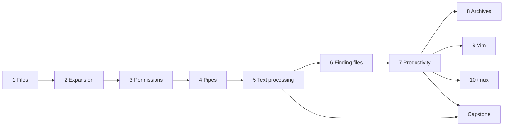

# Level 1: Command-line fluency

> ⏱️ About 7 hours of reading, 15–20 hours with exercises and the capstone · Prerequisites: [Level 0: First steps](../00-first-steps/index.md)

Level 0 taught you to move around and ask for help. Level 1 makes you **fast and safe** at the command line: you will create, copy, and delete files without surprises, let the shell expand patterns for you, control who can access what, connect small programs into pipelines, slice through logs and CSVs, find any file on the system, and shape your shell to fit your habits.

This is the level that pays back first. Every later level, from shell scripting to containers, assumes the skills here are automatic.

## What this level covers

- **Files**: `cp`, `mv`, `rm`, `mkdir`, `touch`, `cat`, `less`, `head`, `tail`, `stat`, `file`, and surviving `nano` and `vim`, including what these commands do to inodes and directory entries underneath.
- **Expansion**: globs (`*`, `?`, `[...]`), brace expansion, tilde expansion, the order bash performs expansions in, and quoting.
- **Permissions**: reading `ls -l` completely, `rwx` on files versus directories, `chmod`, `chown`, `umask`, and the setuid, setgid, and sticky bits.
- **Streams**: stdin, stdout, stderr, redirection, pipes, `tee`, here-documents, and process substitution, with a picture of how the kernel wires it all together.
- **Text processing**: `grep`, `cut`, `sort`, `uniq`, `tr`, `sed`, `awk`, `xargs`, `paste`, `column`, `comm`, and `diff`, plus regular expressions.
- **Finding things**: `find`, `locate`, `which`, `type`, and `whereis`.
- **Productivity**: history, readline shortcuts, aliases, functions, environment variables, `PATH`, the prompt, and the bash startup files.
- **Archives, Vim, and tmux**: packing and compressing files, editing efficiently on any server, and keeping sessions alive over SSH.

## What you will be able to do

By the end of this level, you should be able to:

- [ ] Copy, move, and delete files and directory trees confidently, and explain why a move can be instant or slow.
- [ ] Predict exactly what the shell will do with `*`, `{}`, `~`, `$VAR`, and quotes before pressing ++enter++.
- [ ] Read any permission string, fix "Permission denied" with the smallest correct change, and explain how `/tmp` and `passwd` work.
- [ ] Redirect output and errors precisely, and build pipelines that stream gigabytes with little memory.
- [ ] Answer questions about a log file ("top 10 IPs", "errors per hour") with a one-line pipeline.
- [ ] Find files by name, size, age, permissions, and owner, and act on them safely.
- [ ] Search history instantly, edit command lines without the arrow keys, and maintain a tidy `~/.bashrc`.

## Chapters

| # | Chapter | What you will learn |
|---|---|---|
| 1 | [Working with files](01-working-with-files.md) | Create, copy, move, delete, and view files; inodes, timestamps, `tail -F`, and vim survival |
| 2 | [Globbing and expansion](02-globbing-and-expansion.md) | How bash rewrites your command line before running it, and how to control it with quotes |
| 3 | [Permissions](03-permissions.md) | Owners, groups, `rwx`, octal modes, umask, and the special bits, with directories explained in depth |
| 4 | [Pipes and redirection](04-pipes-and-redirection.md) | File descriptors, `>`, `2>&1`, pipes, `tee`, here-docs, and process substitution |
| 5 | [Text processing](05-text-processing.md) | `grep`, `sed`, `awk`, `sort`, `uniq`, `cut`, `tr`, `xargs`, and regular expressions on real logs and CSVs |
| 6 | [Finding files](06-finding-files.md) | `find` with tests and actions, `locate`, and what really runs when you type a command |
| 7 | [Shell productivity](07-shell-productivity.md) | History, keyboard shortcuts, aliases, functions, `PATH`, `PS1`, and the bash startup files |
| 8 | [Archives and compression](08-archives-and-compression.md) | `tar`, gzip and friends, `zip`, checksums, and moving archives between machines |
| 9 | [Vim essentials](09-vim-essentials.md) | Modes, motions, operators, search and replace: enough Vim to edit anything on any server |
| 10 | [tmux](10-tmux.md) | Terminal sessions that survive disconnects, with windows and panes |

Chapters 1–7 build on each other and are best read in order. Chapter 5 is the longest and the heart of the level: give it two or three sessions. Chapters 8–10 are more independent; read them in any order once you have finished chapter 7.

## How to work through this level

- **Use a practice directory.** Every chapter creates its files under `~/practice/`, so nothing you do touches your real data. Delete it whenever you like.
- **Type the commands.** Reading `sort | uniq -c | sort -rn` is not the same as having your fingers know it. Run every example, then change it and predict the new output before running it.
- **Respect the ⚠️ VM only boxes.** A few topics (`rm -rf`, `chown` on system files, writing under `/etc`) are only safe to experiment with in the throwaway VM from [Set up your practice lab](../../lab-setup.md).
- **Do the exercises before opening the solutions.** Getting stuck for ten minutes teaches more than reading an answer.
- **Log your mistakes.** When a command surprises you, write down what you expected and what happened in your `notes/` mistakes log. Most entries in this level will be about quoting and redirection order, and that is normal.

## Time estimate

| Part | Reading | With exercises |
|---|---|---|
| Chapters 1–4 | ~2.5 hours | 5–6 hours |
| Chapter 5 | ~1 hour | 3–4 hours |
| Chapters 6–7 | ~1.25 hours | 3 hours |
| Chapters 8–10 | ~2 hours | 3–4 hours |
| Capstone | | 2–3 hours |

At 45 minutes a day, most people finish Level 1 in two to three weeks.

## Capstone

The level ends with a practical test: answer ten questions about a 5,000-line web server access log, from "top 10 client IPs" to "when did the outage happen and which endpoints failed", using only pipelines of the tools from this level.

[Start the Level 1 capstone](../../exercises/level-1-capstone.md){ .md-button .md-button--primary }

Don't move on to [Level 2: Shell scripting](../02-scripting/index.md) until you can complete the capstone without looking at your notes.
