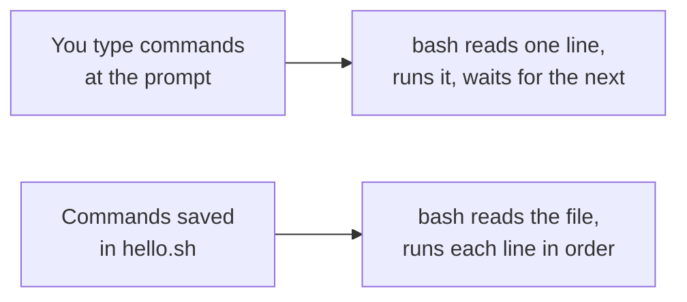
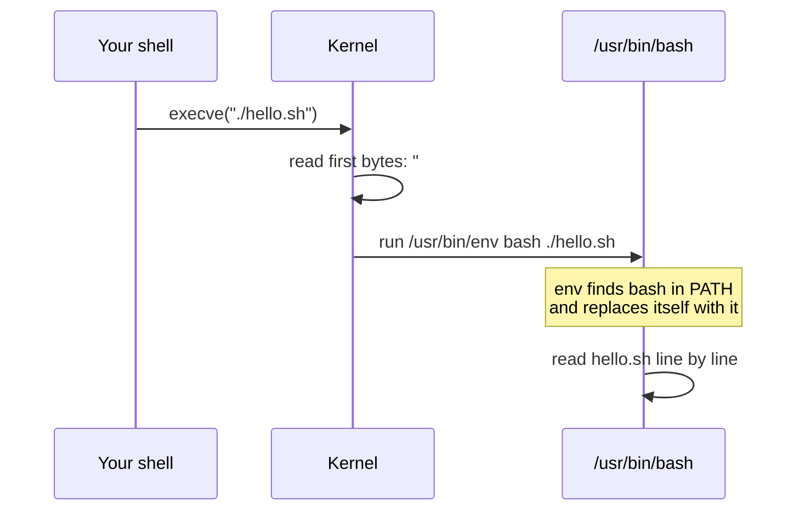
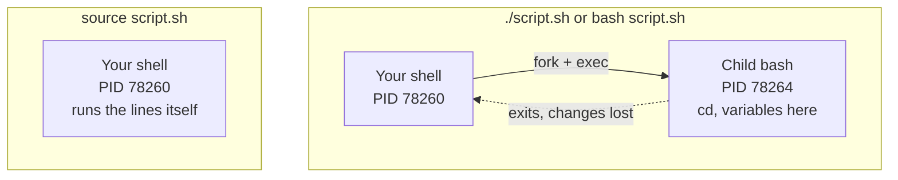

# Your first script

> **Level 2 · Chapter 1** · ⏱️ ~40 min read · Prerequisites: [Permissions](../01-command-line/03-permissions.md), [Shell productivity](../01-command-line/07-shell-productivity.md)

A shell script is a text file full of commands that bash runs for you. This chapter covers how to write one, how the kernel knows how to run it, the three ways to start it (and why they behave differently), where to keep your scripts, and the habits that make scripts safe from day one.

## Why it matters

Alex is a data engineer. Every morning they open a terminal on `mint` and type the same five commands. They pull the latest CSV exports, count the rows, check the disk, and copy the results to a shared folder. That takes ten minutes, and on a busy day one command gets forgotten. One Monday the disk filled up because nobody ran the check, and the nightly pipeline crashed halfway through a load.

Alex puts the five commands into a file called `morning.sh`, adds one line at the top, and runs `chmod +x`. Now the routine is one command. It runs the same way every time, it can be scheduled, and a teammate can read it to learn the routine. A typo fixed once stays fixed.

That is the whole promise of scripting: **turn what you know how to type into something that runs by itself, the same way every time.** Everything in Level 2 builds on the small file you write in this chapter.

## Concepts

### What a script is

A **script** is a plain text file that contains commands for an **interpreter**. An interpreter is a program that reads instructions and carries them out one by one, without compiling them first. For a shell script, the interpreter is bash, the same program that runs your interactive terminal.

That last point matters. Everything you type at the prompt works in a script, and everything in a script works at the prompt. A script is just a saved session. There is no special "script language" to learn separately from the shell. You already know half of it from Level 1.



The differences between interactive bash and script bash are small but real:

| | Interactive shell | Script |
| --- | --- | --- |
| Reads `~/.bashrc` | Yes | No |
| Aliases work | Yes | No (off by default) |
| History (`!!`, up arrow) | Yes | No |
| Job control (`fg`, `bg`) | Yes | No |
| Stops when a command fails | No | No (unless you ask with `set -e`, Chapter 4) |

The first two rows trip people up. If you defined `alias ll='ls -l'` in `.bashrc`, `ll` does not exist inside your script. Scripts are meant to run the same way for everybody, so they don't depend on one person's personal settings.

### The shebang line

Open almost any script on your system and the first line looks like one of these:

```bash
#!/bin/bash
#!/usr/bin/env bash
#!/bin/sh
#!/usr/bin/env python3
```

This line is called the **shebang** (from "hash" `#` plus "bang" `!`). It tells the kernel which interpreter should run the file.

Here is what happens underneath when you type `./hello.sh`:

1. Bash, your interactive shell, creates a child process with `fork()`. A **process** is a running program. The child is a copy of bash.
2. The child calls the kernel's `execve()` system call and asks it to run `./hello.sh`. A **system call** is a request from a program to the kernel. You will watch them with `strace` in Level 5.
3. The kernel opens the file and looks at the first two bytes. If they are `#!`, the kernel reads the rest of that first line as the path to an interpreter (plus at most one argument).
4. The kernel then runs *that* interpreter instead, adding the script's path as an argument. `#!/bin/bash` in `./hello.sh` becomes `/bin/bash ./hello.sh`.
5. Bash opens `./hello.sh`, reads it line by line, and runs it. The first line starts with `#`, so bash treats it as a comment and ignores it.



The kernel does not care about the file's name. `hello.sh`, `hello`, and `hello.txt` all behave the same. The `.sh` extension is a hint for humans and editors only. Many installed commands are scripts with no extension at all.

You can prove the kernel builds a new command line. This script prints its own command line from `/proc`, a virtual folder where the kernel exposes information about each process (Level 3 covers it):

```bash
#!/usr/bin/env bash
echo "PID: $$"
echo "Command line the kernel built:"
tr '\0' ' ' < /proc/$$/cmdline; echo
```

Run it with `./whoami-proc.sh` and you get:

```text
PID: 77519
Command line the kernel built:
bash ./whoami-proc.sh
```

You typed `./whoami-proc.sh`, but the process that runs is `bash ./whoami-proc.sh`. The kernel rewrote it using the shebang. (`$$` is a special variable that holds the shell's process ID. You'll meet more of these in Chapter 2.)

A fun experiment shows the kernel does not care what the interpreter is. Make a file whose shebang is `cat`:

```bash
printf '#!/bin/cat\nThis file prints itself.\n' > catme
chmod +x catme
./catme
```

```text
#!/bin/cat
This file prints itself.
```

The kernel ran `/bin/cat ./catme`, and `cat` printed the file. Any program that takes a filename can be an interpreter.

### `#!/bin/bash` vs `#!/usr/bin/env bash`

Both lines run bash. They find it in different ways.

- `#!/bin/bash` is an **absolute path**. The kernel runs exactly that file. It is fast and predictable, but it breaks on systems where bash lives elsewhere. On macOS with a newer Homebrew bash, on FreeBSD, and on NixOS, bash is not at `/bin/bash`, or the one there is very old.
- `#!/usr/bin/env bash` runs the small program `env`, which searches your `PATH` for `bash` and runs the first one it finds. `PATH` is the list of directories the shell searches for commands. The script then works wherever bash is installed, as long as it is on the `PATH`.

| | `#!/bin/bash` | `#!/usr/bin/env bash` |
| --- | --- | --- |
| How bash is found | Fixed path | First `bash` on `PATH` |
| Portable to macOS/BSD/NixOS | Less | More |
| Can be fooled by a different `bash` earlier in `PATH` | No | Yes |
| Can pass options like `-e` | Yes (`#!/bin/bash -e`) | Not portably |
| Common in | System scripts, distro packages | Developer tools, GitHub projects |

On Mint, `/bin` is a link to `/usr/bin`, so `/bin/bash` and `/usr/bin/bash` are the same file:

```bash
ls -ld /bin
command -v bash
```

```text
lrwxrwxrwx 1 root root 7 Jun  9 19:01 /bin -> usr/bin
/usr/bin/bash
```

This handbook uses `#!/usr/bin/env bash`. It is the common choice for scripts you share. Use `#!/bin/bash` for scripts that run as root from system services. There you want the exact system bash, not whatever is first in someone's `PATH`.

!!! warning "Common mistake: `#!/bin/sh` is not bash"
    On Mint and Ubuntu, `/bin/sh` is **dash**, a smaller and faster shell that only understands POSIX shell syntax. POSIX is the standard that defines a minimal portable shell. Bash features such as `[[ ]]`, arrays, `${var^^}`, and `source` do not exist in dash. If your script says `#!/bin/sh` and uses bash features, it fails with errors such as `[[: not found`. Check it yourself with `readlink -f /bin/sh`, which prints `/usr/bin/dash`. If you write bash, say bash in the shebang.

### The execute permission

From [Permissions](../01-command-line/03-permissions.md) you know that every file has read, write, and execute bits. A new file you create has no execute bit, because your umask removes it. The kernel refuses to `execve()` a file without the execute bit, even if it has a perfect shebang. That's why the first run of a new script fails with `Permission denied`, and why `chmod +x` fixes it.

Running `bash hello.sh` doesn't need the execute bit. In that case the kernel runs `bash`, which is executable, and bash only needs to *read* `hello.sh`.

### Three ways to run a script

There are three ways to run a script, and they are not equivalent.

```text
./hello.sh          kernel reads the shebang, starts a NEW process
bash hello.sh       you start a NEW bash process yourself; shebang is ignored
source hello.sh     your CURRENT shell reads and runs the lines itself
```

The first two create a **child process**. A child gets a copy of its parent's environment, its working directory, and its exported variables. It can change its own copy as much as it likes. When it exits, the copy is thrown away and the parent is unchanged. Nothing a child does can change its parent's variables or current directory. This is a firm rule in Unix, not a quirk of bash.

The third, `source` (or its older synonym `.`, a single dot), does not create a process. Your current shell opens the file and runs each line as if you had typed it. A `cd` in the file changes *your* directory. A variable it sets stays set after it finishes. An `exit` in the file closes *your* terminal.



You will see this demonstrated in the examples below. It explains a classic beginner puzzle: "my script does `cd /var/log` but when it finishes I'm still in my home directory." That is correct behavior. The `cd` happened in the child.

When to use which:

- **`./script.sh`**: the normal way. It respects the shebang, so a Python script runs with Python.
- **`bash script.sh`**: useful when the file isn't executable, or to add debugging flags: `bash -x script.sh` traces every line (Chapter 4).
- **`source file`**: only for files whose *purpose* is to change your current shell. Examples are `~/.bashrc`, a Python virtual environment's `activate` script, or a file of `export` lines. Don't `source` ordinary scripts. Their `exit` and `cd` commands will affect your terminal.

### Where scripts live: `PATH`

When you type a bare command name like `ls`, bash searches each directory in `PATH`, left to right, and runs the first match. Your current directory is **not** in `PATH`. That is a deliberate security choice. Otherwise, a malicious file named `ls` dropped into `/tmp` would run whenever you typed `ls` there. So inside your scripts folder you must type `./hello.sh`, with the `./` meaning "this directory," not `hello.sh`.

To run your scripts from anywhere by name, put them in a directory that is on `PATH`. Mint's `~/.profile` already adds two personal directories if they exist:

```bash
grep -A2 'private bin' ~/.profile
```

```text
# set PATH so it includes user's private bin if it exists
if [ -d "$HOME/bin" ] ; then
    PATH="$HOME/bin:$PATH"
--
# set PATH so it includes user's private bin if it exists
if [ -d "$HOME/.local/bin" ] ; then
    PATH="$HOME/.local/bin:$PATH"
```

So the plan is simple:

- **`~/.local/bin`** is the modern standard location (from the XDG Base Directory spec, which defines where user files go). Tools like `pip install --user` and `pipx` also put commands there.
- **`~/bin`** is the older, shorter convention. It works just as well.

Pick one. `~/.local/bin` is a good default. The directory must exist **when you log in**, because `~/.profile` only runs at login. If you create it now, log out and back in, or run `source ~/.profile` once.

Two more rules for scripts on `PATH`:

- Drop the `.sh` when you install a command. You type `backup`, not `backup.sh`. The extension is an implementation detail. If you later rewrite it in Python, nobody needs to change how they call it.
- Check the name isn't taken first with `type -a name`. If you call your script `test`, it collides with the shell builtin `test`, and the builtin wins.

### Comments

Anything after a `#` (when `#` starts a word) is a **comment**, and bash ignores it. Use comments to explain *why*, not *what*. The code already says what it does.

```bash
# Bad: says what the code already says
rm -f "$tmpfile"   # remove the temp file

# Good: says why
rm -f "$tmpfile"   # the loader refuses to start if a stale lock file exists
```

Bash has no block-comment syntax. Put `#` at the start of each line. A short header at the top of each script (purpose, usage, requirements) saves your future self real time.

### `echo` vs `printf`

**`echo`** prints its arguments separated by spaces, followed by a newline. It is fine for simple fixed messages. But it has two problems:

1. Its options differ between shells and systems. Bash's built-in `echo` understands `-n` (no newline) and `-e` (interpret backslash escapes like `\t`). Dash's `echo` always interprets escapes and has no `-e`. So `echo -e` prints a literal `-e` under `#!/bin/sh`.
2. If the text you print *starts with a dash*, `echo` may treat it as an option. `var="-n"; echo "$var"` prints nothing at all.

**`printf`** takes a **format string** plus arguments, like C's `printf`. Its behavior is the same everywhere, and it never treats your data as options. It does not add a newline unless you write `\n`.

Format specifiers you'll use constantly:

| Specifier | Meaning | Example | Output |
| --- | --- | --- | --- |
| `%s` | string | `printf '%s\n' hi` | `hi` |
| `%d` | integer | `printf '%d\n' 42` | `42` |
| `%5d` | integer, right-aligned in 5 chars | `printf '%5d\n' 42` | `   42` |
| `%-10s` | string, left-aligned in 10 chars | `printf '%-10s|\n' alex` | `alex      |` |
| `%05d` | zero-padded | `printf '%05d\n' 42` | `00042` |
| `%.2f` | float, 2 decimals | `printf '%.2f\n' 3.14159` | `3.14` |
| `%x` | hexadecimal | `printf '%x\n' 255` | `ff` |
| `%%` | a literal `%` | `printf '%d%%\n' 75` | `75%` |

Rule of thumb: **use `echo` for fixed text, use `printf` for anything that contains variables or needs formatting.** Always put the variable in an argument, never inside the format string. `printf "$msg"` breaks if `$msg` contains a `%`. `printf '%s\n' "$msg"` is always safe.

### Reading input with `read`

**`read`** is a builtin that reads one line from standard input and stores it in variables. A **builtin** is a command implemented inside bash itself rather than as a separate program in `/usr/bin`. `read` has to be a builtin: it sets variables in the current shell, and a separate program could never do that (remember the child process rule).

How `read` splits the line:

- With one variable name, the whole line (minus leading and trailing spaces) goes into it.
- With several names, the line is split into words on whitespace. Each name gets one word, and the **last name gets everything left over**.
- With no name, the line goes into the variable `REPLY`.

The options you need:

| Option | Why it exists |
| --- | --- |
| `-r` | "Raw." Without it, `read` treats backslashes as escape characters and removes them. You almost always want `-r`. |
| `-p "text"` | Show a prompt (only when input is a terminal). Saves an extra `printf`. |
| `-s` | Silent. Don't echo what is typed. Use it for passwords. |
| `-t N` | Time out after N seconds. Exit status is greater than 128 on timeout. |
| `-n N` | Return after N characters, without waiting for Enter. Good for "press y/n". |
| `-a arr` | Split the line into an array (Chapter 2). |

Always write `read -r`. Without `-r`, a Windows path like `C:\new\temp` comes out as `C:newtemp`.

### Linting with shellcheck

A **linter** is a tool that reads code without running it and warns about likely bugs. **ShellCheck** is the linter for shell scripts. It knows hundreds of mistakes that beginners and experts both make: missing quotes, `read` without `-r`, `cd` without error checks, bash features in `sh` scripts, and many more. Each warning has a code like `SC2086` and a wiki page that explains the problem and the fix.

ShellCheck is the single best way to learn shell scripting faster. Install it once:

```bash
sudo apt install shellcheck
```

Then run it on every script, every time you save:

```bash
shellcheck myscript.sh
```

No output means no problems found. Editors such as VS Code (with the ShellCheck extension) show the warnings as you type. Chapter 4 walks through the most common warnings in detail.

## Commands and examples

### Write and run your first script

Make a folder for practice scripts and create the file. Use any editor. `nano` is easiest if you're new:

```bash
mkdir -p ~/scripts && cd ~/scripts
nano hello.sh
```

Type this, then save with ++ctrl+o++ and exit with ++ctrl+x++:

```bash
#!/usr/bin/env bash
# hello.sh - print a greeting and some facts about the environment.

echo "Hello, $USER!"
echo "Today is $(date +%A)."
echo "You are in: $PWD"
```

`$USER` and `$PWD` are variables the shell sets for you. `$(date +%A)` runs `date` and puts its output into the string. This is command substitution, covered in Chapter 2.

Try to run it:

```bash
./hello.sh
```

```text
bash: ./hello.sh: Permission denied
```

Look at the permissions:

```bash
ls -l hello.sh
```

```text
-rw-rw-r-- 1 alex alex 163 Oct  2 10:37 hello.sh
```

No `x` anywhere. The kernel refuses to execute it. The exit status of a failed launch is `126`, which means "found but not executable." You'll use exit codes in Chapter 3.

You can still run it by handing it to bash directly, because bash only needs to read it:

```bash
bash hello.sh
```

```text
Hello, alex!
Today is Friday.
You are in: /home/alex/scripts
```

Now make it executable and run it the normal way:

```bash
chmod +x hello.sh
ls -l hello.sh
./hello.sh
```

```text
-rwxrwxr-x 1 alex alex 163 Oct  2 10:37 hello.sh
Hello, alex!
Today is Friday.
You are in: /home/alex/scripts
```

`chmod +x` added the execute bit for user, group, and other (filtered by your umask). Without `./`, bash searches `PATH` and doesn't find it:

```bash
hello.sh
```

```text
hello.sh: command not found
```

### When the shebang goes wrong

**A typo in the interpreter path.** Create a script with `#!/bin/bashh`:

```bash
printf '#!/bin/bashh\necho hi\n' > typo.sh
chmod +x typo.sh
./typo.sh
```

```text
bash: ./typo.sh: cannot execute: required file not found
```

The file `typo.sh` exists. The *interpreter* it names does not. Bash 5.2 reports this as "required file not found." Older versions said "bad interpreter: No such file or directory." Either message means: check line 1.

**Windows line endings.** If a script was edited on Windows or copied from some web pages, every line may end with a carriage return plus a newline (`\r\n`, called CRLF) instead of just `\n`. The kernel then looks for an interpreter called `bash\r`:

```bash
./crlf.sh
```

```text
/usr/bin/env: ‘bash\r’: No such file or directory
/usr/bin/env: use -[v]S to pass options in shebang lines
```

`file` confirms it, and `od -c` shows the hidden `\r` bytes:

```bash
file crlf.sh
head -c 30 crlf.sh | od -c
```

```text
crlf.sh: Bourne-Again shell script, ASCII text executable, with CRLF line terminators
0000000   #   !   /   u   s   r   /   b   i   n   /   e   n   v       b
0000020   a   s   h  \r  \n   e   c   h   o       h   i  \r  \n
0000036
```

Fix it by deleting the carriage returns with `sed -i 's/\r$//' crlf.sh`. (The `dos2unix` package does the same job.)

### Subshell vs current shell, demonstrated

This script changes directory and sets a variable:

```bash
#!/usr/bin/env bash
# setenv.sh - change directory and set a variable
cd /tmp || exit 1
PROJECT=pipeline
echo "inside script: PWD=$PWD PROJECT=$PROJECT PID=$$"
```

The `|| exit 1` means "if `cd` fails, stop the script." Chapter 3 explains `||`. Make it executable, then run it three ways. Look at the PID and what survives afterward:

```bash
chmod +x setenv.sh
echo "before: PWD=$PWD PROJECT=${PROJECT:-<unset>} PID=$$"
./setenv.sh
echo "after ./: PWD=$PWD PROJECT=${PROJECT:-<unset>}"
```

```text
before: PWD=/home/alex/scripts PROJECT=<unset> PID=78260
inside script: PWD=/tmp PROJECT=pipeline PID=78264
after ./: PWD=/home/alex/scripts PROJECT=<unset>
```

The script ran as PID 78264, a different process. It changed *its* directory to `/tmp` and set *its* `PROJECT`. When it exited, both changes vanished. (`${PROJECT:-<unset>}` prints `<unset>` when the variable is empty. Chapter 2 covers this syntax.)

```bash
bash setenv.sh
echo "after bash: PWD=$PWD PROJECT=${PROJECT:-<unset>}"
```

```text
inside script: PWD=/tmp PROJECT=pipeline PID=78265
after bash: PWD=/home/alex/scripts PROJECT=<unset>
```

The same thing happens: a new process, and nothing leaks back.

```bash
source ./setenv.sh
echo "after source: PWD=$PWD PROJECT=${PROJECT:-<unset>} PID=$$"
```

```text
inside script: PWD=/tmp PROJECT=pipeline PID=78260
after source: PWD=/tmp PROJECT=pipeline PID=78260
```

Now the PID inside the script is **78260, your own shell**. The `cd` moved you, and `PROJECT` is still set. `source` ran the lines in your current shell. `. ./setenv.sh` (with a dot) does exactly the same.

!!! warning "Common mistake: sourcing a script that calls `exit`"
    If a file you `source` runs `exit`, it exits *your terminal*, because there is no child process to exit. Only `source` files that are written to be sourced, such as config files and `activate` scripts. Run everything else with `./`.

### Install a script on your `PATH`

```bash
mkdir -p ~/.local/bin
cp ~/scripts/hello.sh ~/.local/bin/hello
type -a hello
```

If `~/.local/bin` didn't exist when you logged in, `type` finds nothing:

```text
bash: type: hello: not found
```

Reload your profile (or log out and in) and try again:

```bash
source ~/.profile
type -a hello
hello
```

```text
hello is /home/alex/.local/bin/hello
Hello, alex!
Today is Friday.
You are in: /home/alex/scripts
```

Notice the output says you are in `~/scripts`. A script runs in whatever directory you call it from, not the directory where the script file lives. That matters when a script uses relative paths.

!!! tip "Symlink instead of copy"
    Instead of copying, link the installed name to the file you edit: `ln -s ~/scripts/hello.sh ~/.local/bin/hello`. Now every edit to `~/scripts/hello.sh` takes effect at once. Keep `~/scripts` in Git and you have a versioned toolbox.

### `echo` vs `printf` side by side

```bash
echo -n "no newline"; echo "|"
echo -e "tab:\tend"
echo "tab:\tend"
```

```text
no newline|
tab:	end
tab:\tend
```

Bash's `echo` only turns `\t` into a tab with `-e`. Now see the dash-starting-text problem:

```bash
var='-n'
echo "$var"
printf '%s\n' "$var"
```

```text
-n
```

Only one line of output appears. `echo "$var"` became `echo -n`, an option with nothing to print, so it printed nothing. `printf` printed the data faithfully.

`printf` reuses its format string until all arguments are used. That makes it a compact loop:

```bash
printf '%s\n' one two three
printf '%s=%s\n' host mint user alex
```

```text
one
two
three
host=mint
user=alex
```

Aligned columns are where `printf` really shines:

```bash
printf '%-10s|%5d|%.2f\n' alex 42 3.14159
printf 'Progress: %d%%\n' 75
printf -v padded '%03d' 7; echo "$padded"
```

```text
alex      |   42|3.14
Progress: 75%
007
```

`printf -v name` stores the result in a variable instead of printing it. That's handy for zero-padded file names like `report-007.csv`.

### Reading input

An interactive script with `read -p`:

```bash
#!/usr/bin/env bash
# greet.sh - ask for a name and a city, then greet.

read -r -p "What is your name? " name
read -r -p "Which city are you in? " city
printf 'Nice to meet you, %s from %s.\n' "$name" "$city"
```

```console
$ ./greet.sh
What is your name? Alex
Which city are you in? Pune
Nice to meet you, Alex from Pune.
```

Because `read` reads standard input, you can also feed it from a pipe. That's how you test interactive scripts automatically:

```bash
printf 'Alex\nPune\n' | ./greet.sh
```

```text
Nice to meet you, Alex from Pune.
```

The prompts don't appear, because `-p` only prints when input comes from a terminal.

Splitting into several variables. The last variable takes the rest of the line:

```bash
read -r first last <<< "Ada King Lovelace"
echo "first=$first last=$last"
```

```text
first=Ada last=King Lovelace
```

`<<<` is a **here-string**. It feeds the string to the command's standard input, which is handy for testing. Splitting on a different character by setting `IFS` (the Internal Field Separator, explained fully in Chapter 2) for just that one command:

```bash
IFS=: read -r user pw uid gid rest <<< "alex:x:1000:1000:Alex,,,:/home/alex:/bin/bash"
echo "$user $uid $gid | $rest"
```

```text
alex 1000 1000 | Alex,,,:/home/alex:/bin/bash
```

That is one line of `/etc/passwd` split into fields. Why `-r` matters:

```bash
printf 'C:\\new\\temp\n' | { read line; echo "without -r: $line"; }
printf 'C:\\new\\temp\n' | { read -r line; echo "with -r: $line"; }
```

```text
without -r: C:newtemp
with -r: C:\new\temp
```

Password prompts and timeouts:

```bash
read -r -s -p "Database password: " dbpass; echo
read -r -t 10 -p "Continue? [y/N] " answer || answer=n
```

`-s` hides the typing. The bare `echo` afterward moves to a new line, because the Enter key press was not echoed either. With `-t 10`, if nobody answers in 10 seconds, `read` fails, so `|| answer=n` sets a safe default.

### Running shellcheck

Here is a script with three classic bugs:

```bash
#!/usr/bin/env bash
read name
cd $1
echo Hello $name
```

```bash
shellcheck buggy.sh
```

```text
In buggy.sh line 2:
read name
^--^ SC2162 (info): read without -r will mangle backslashes.


In buggy.sh line 3:
cd $1
^---^ SC2164 (warning): Use 'cd ... || exit' or 'cd ... || return' in case cd fails.
   ^-- SC2086 (info): Double quote to prevent globbing and word splitting.
...

In buggy.sh line 4:
echo Hello $name
           ^---^ SC2086 (info): Double quote to prevent globbing and word splitting.

Did you mean: 
echo Hello "$name"

For more information:
  https://www.shellcheck.net/wiki/SC2164 -- Use 'cd ... || exit' or 'cd ... |...
  https://www.shellcheck.net/wiki/SC2086 -- Double quote to prevent globbing ...
  https://www.shellcheck.net/wiki/SC2162 -- read without -r will mangle backs...
```

(Output trimmed slightly at `...`. The exact layout varies a little between ShellCheck versions.)

How to read it:

- Each block names the file and line, repeats the line, and puts carets (`^--^`) under the exact problem.
- `SC2162` is the warning code. Search "SC2162" or open the wiki link for the full explanation.
- `(info)`, `(warning)`, and `(error)` are severities. Fix all of them anyway. Most "info" items are real bugs waiting for the right input.
- "Did you mean" shows the suggested fix.

`cd $1` without a check is dangerous. If the directory doesn't exist, `cd` fails, the script keeps going, and every later command runs in the *wrong* directory. Picture the next line being `rm -rf ./*`.

### A style template for every script

Start every script from this skeleton. Each part is explained in later chapters, but the habits are worth having from day one:

```bash
#!/usr/bin/env bash
#
# disk-report.sh - Warn about filesystems that are filling up.
#
# Usage:   disk-report.sh [THRESHOLD]
# Example: disk-report.sh 80
#
# Author:  alex
# Requires: bash 4+, GNU coreutils (df)

set -euo pipefail

# ---- Settings ---------------------------------------------------------------
readonly THRESHOLD="${1:-80}"   # warn at or above this percent used

# ---- Functions --------------------------------------------------------------
warn() {
    printf 'WARNING: %s\n' "$*" >&2
}

main() {
    local used mount
    # df prints "Use% Mounted on"; skip the header line with tail.
    df --output=pcent,target -x tmpfs -x devtmpfs -x squashfs -x efivarfs | tail -n +2 |
    while read -r used mount; do
        used=${used%\%}                 # strip the trailing % sign
        if (( used >= THRESHOLD )); then
            warn "$mount is ${used}% full"
        else
            printf 'ok   %3d%%  %s\n' "$used" "$mount"
        fi
    done
}

# ---- Entry point ------------------------------------------------------------
main "$@"
```

```bash
./disk-report.sh
./disk-report.sh 30
```

```text
ok    33%  /
ok    35%  /boot/efi
WARNING: / is 33% full
WARNING: /boot/efi is 35% full
```

What each part buys you:

| Part | Purpose | Chapter |
| --- | --- | --- |
| Shebang | Choose the interpreter | This one |
| Header comment | Purpose, usage, requirements for the next reader | This one |
| `set -euo pipefail` | Stop on errors, unset variables, and failed pipelines | 4 |
| `readonly` settings at the top | One place to change behavior; can't be overwritten by accident | 2 |
| Functions, including `main` | Named, testable pieces; `local` variables | 3 |
| Messages to stderr (`>&2`) | Keep warnings out of the data output | 4 |
| `main "$@"` at the bottom | Whole file is read before anything runs; all arguments passed through | 3, 5 |

The last row hides a subtle benefit. Bash reads a script a bit at a time while it runs. If you edit a long script *while it is running*, bash can pick up half-edited lines. When everything lives inside functions and the only top-level command is `main "$@"` on the last line, bash has to read the whole file before running anything.

Other conventions used throughout this handbook:

- Indent with 4 spaces. Never mix tabs and spaces.
- Name variables in `lower_snake_case`. Use `UPPER_CASE` only for exported environment variables and constants.
- One script, one job. If a script grows past roughly 200 lines, consider splitting it, or read Chapter 6 on switching to Python.
- Run `shellcheck` before every commit.

## Exercises

### Exercise 1: Hello, you (easy)

Write `~/scripts/sysinfo.sh` that prints your username, hostname, current date and time, and the kernel version, one per line, with labels. Make it executable and run it with `./`.

??? success "Solution"

    ```bash
    #!/usr/bin/env bash
    # sysinfo.sh - print a few facts about this machine.

    printf 'User:     %s\n' "$USER"
    printf 'Host:     %s\n' "$(hostname)"
    printf 'Date:     %s\n' "$(date '+%Y-%m-%d %H:%M:%S')"
    printf 'Kernel:   %s\n' "$(uname -r)"
    ```

    ```bash
    chmod +x ~/scripts/sysinfo.sh
    ~/scripts/sysinfo.sh
    ```

    ```text
    User:     alex
    Host:     mint
    Date:     2026-10-02 10:41:07
    Kernel:   6.17.0-42-generic
    ```

    `printf` with `%-` style padding (here, spaces in the format) keeps the values aligned. `$(...)` runs a command and inserts its output.

### Exercise 2: Prove the child process rule (easy)

Write a script `goto-logs.sh` that runs `cd /var/log` and then `pwd`. Run it with `./`, then run `pwd` yourself. Then `source` it and run `pwd` again. Explain the difference in one sentence.

??? success "Solution"

    ```bash
    #!/usr/bin/env bash
    cd /var/log || exit 1
    pwd
    ```

    ```console
    $ ./goto-logs.sh
    /var/log
    $ pwd
    /home/alex/scripts
    $ source ./goto-logs.sh
    /var/log
    $ pwd
    /var/log
    ```

    `./` runs the script in a child process whose directory change is thrown away when it exits, while `source` runs the lines in your current shell, so the `cd` sticks. (Note that if `cd` had failed while sourced, `exit 1` would have closed your terminal. That's one reason not to `source` normal scripts.)

### Exercise 3: A tool on your PATH (medium)

Turn Exercise 1 into a command called `sysinfo` that works from any directory. Don't copy the file; link it so edits take effect immediately. Confirm with `type -a sysinfo`, then `cd /` and run `sysinfo`.

??? success "Solution"

    ```bash
    mkdir -p ~/.local/bin
    ln -s ~/scripts/sysinfo.sh ~/.local/bin/sysinfo
    source ~/.profile          # only needed if ~/.local/bin was just created
    type -a sysinfo
    cd / && sysinfo
    ```

    ```text
    sysinfo is /home/alex/.local/bin/sysinfo
    User:     alex
    Host:     mint
    ...
    ```

    If `type` says "not found," check `echo "$PATH"` for `/home/alex/.local/bin`. If it's missing, the directory didn't exist at login time. `source ~/.profile` or logging out and in fixes that.

### Exercise 4: Interactive and testable (medium)

Write `ask-dir.sh`. It asks "Which directory?" with `read -r -p`, then prints how many entries the directory contains (`find . -mindepth 1 -maxdepth 1 | wc -l` counts them, including hidden ones). If `cd` fails, print an error to stderr and exit with status 1. Test it both interactively and with `printf '/etc\n' | ./ask-dir.sh`. Then run `shellcheck` on it (if installed) and fix anything it reports.

??? success "Solution"

    ```bash
    #!/usr/bin/env bash
    # ask-dir.sh - count entries in a directory the user names.

    read -r -p "Which directory? " dir
    if ! cd -- "$dir" 2>/dev/null; then
        printf 'Error: cannot enter %s\n' "$dir" >&2
        exit 1
    fi
    count=$(find . -mindepth 1 -maxdepth 1 | wc -l)
    printf '%s has %d entries\n' "$dir" "$count"
    ```

    ```bash
    printf '/etc\n' | ./ask-dir.sh
    printf '/nope\n' | ./ask-dir.sh; echo "exit=$?"
    ```

    ```text
    /etc has 267 entries
    Error: cannot enter /nope
    exit=1
    ```

    `--` tells `cd` that what follows is a path even if it starts with `-`. `>&2` sends the error to standard error. `if ! cd ...` runs `cd` and takes the branch when it fails. All of this is covered in depth in Chapters 3 and 4.

### Exercise 5: The shebang is just a program (hard)

Make an executable file `data.awk` whose shebang is `#!/usr/bin/awk -f` and whose body prints the first field of every line (`{ print $1 }`). It should split on colons, so set the field separator in a `BEGIN { FS = ":" }` block. Run it as `./data.awk /etc/passwd`. Explain, in terms of what the kernel builds, why the `-f` is needed.

??? success "Solution"

    ```text
    #!/usr/bin/awk -f
    BEGIN { FS = ":" }
    { print $1 }
    ```

    ```bash
    chmod +x data.awk
    ./data.awk /etc/passwd | head -3
    ```

    ```text
    root
    daemon
    bin
    ```

    The kernel turns `./data.awk /etc/passwd` into `/usr/bin/awk -f ./data.awk /etc/passwd`: the interpreter, the one optional argument from the shebang, the script path, then your arguments. Without `-f`, awk would treat `./data.awk` as the *program text* rather than a file to read the program from. Bash doesn't need a flag because `bash file` already means "run this file." This also shows why only **one** argument fits in a shebang. Linux passes everything after the interpreter path as a single argument, so `#!/usr/bin/awk -F: -f` would hand awk the one string `-F: -f`.

## Check yourself

1. What does the kernel do when it sees `#!` at the start of an executable file?

    ??? note "Answer"

        It reads the rest of the first line as an interpreter path (plus at most one argument), and runs that interpreter with the script's path appended as an argument. `./hello.sh` with `#!/usr/bin/env bash` becomes `/usr/bin/env bash ./hello.sh`. The interpreter then reads the file itself; to bash, the shebang line is just a comment.

2. Give one advantage of `#!/usr/bin/env bash` and one of `#!/bin/bash`.

    ??? note "Answer"

        `env` finds bash via `PATH`, so the script works on systems where bash isn't at `/bin/bash` (macOS with Homebrew, BSD, NixOS). `/bin/bash` always uses the exact system bash and can't be redirected by someone putting a different `bash` earlier in `PATH`, which matters for scripts run by root. It also lets you add an option such as `-e`.

3. Your script works with `bash backup.sh` but `./backup.sh` says "Permission denied." Why, and what fixes it?

    ??? note "Answer"

        The file lacks the execute bit. With `bash backup.sh` the kernel executes `bash` (which is executable), and bash only needs read permission on the file. With `./backup.sh` the kernel executes the file itself, which requires `x`. Fix: `chmod +x backup.sh` (or `chmod u+x` to add it only for yourself).

4. A script runs `cd /srv/data` and `export DB=prod`. You run it with `./setup.sh`. Afterwards, where are you and is `DB` set? What if you `source` it?

    ??? note "Answer"

        With `./setup.sh`: you're still in your original directory and `DB` is not set, because the script ran in a child process whose changes vanish when it exits. With `source setup.sh`: you're in `/srv/data` and `DB=prod` is set, because your current shell ran the lines itself.

5. Why isn't the current directory on `PATH`, and what does `./` do about it?

    ??? note "Answer"

        For safety: otherwise a malicious file named like a common command (`ls`, `sudo`) placed in a directory you `cd` into would run instead of the real command. `./name` is an explicit path ("the file called name in this directory"), so bash skips the `PATH` search entirely.

6. Why should you prefer `printf '%s\n' "$x"` over `echo "$x"` for printing variable data?

    ??? note "Answer"

        `echo`'s option handling varies between shells, and if `$x` starts with a dash (such as `-n` or `-e`) bash's `echo` treats it as an option and prints something different or nothing. `printf` with `%s` prints the argument as data, always, and behaves the same in every shell.

7. What does `-r` do for `read`, and why should you almost always use it?

    ??? note "Answer"

        It disables backslash processing, so the line is stored exactly as typed. Without `-r`, backslashes are treated as escape characters and removed (`C:\new` becomes `C:new`), and a trailing backslash joins the next line. ShellCheck flags missing `-r` as SC2162.

8. Your new script on Mint starts with `#!/bin/sh` and fails with `[[: not found`. What's going on?

    ??? note "Answer"

        On Mint/Ubuntu `/bin/sh` is dash, a minimal POSIX shell that doesn't support bash extensions like `[[ ]]`. Either change the shebang to `#!/usr/bin/env bash`, or rewrite the script in pure POSIX syntax. ShellCheck catches this when the shebang says `sh`.

## Key takeaways

- A script is a text file of commands. The shebang on line 1 tells the kernel which interpreter to run it with; the extension doesn't matter.
- Use `#!/usr/bin/env bash` for scripts you share and `#!/bin/bash` for system scripts. Never write bash under `#!/bin/sh`, which is dash on Mint.
- `./script` and `bash script` run in a child process; nothing they change survives. `source script` runs in your current shell, so use it only for files designed to be sourced.
- Put personal commands in `~/.local/bin` (or `~/bin`) without the `.sh`, and check names with `type -a` first.
- Use `printf` for anything with variables, `echo` for fixed text, and always `read -r`.
- Install ShellCheck (`sudo apt install shellcheck`) and run it on every script. It's a free tutor.

## Next

Continue with [Variables, quoting, and arrays](02-variables-quoting-arrays.md), where you'll learn the quoting rules that prevent most shell script bugs.
