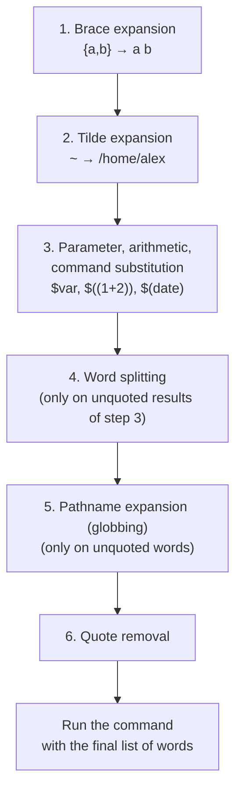
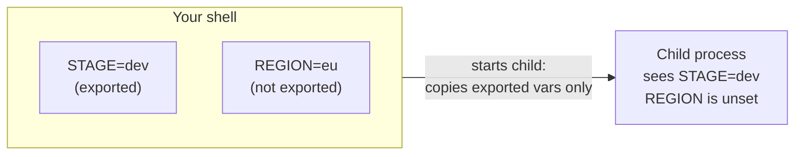

# Variables, quoting, and arrays

> **Level 2 · Chapter 2** · ⏱️ ~55 min read · Prerequisites: [Your first script](01-first-script.md), [Globbing and expansion](../01-command-line/02-globbing-and-expansion.md)

Variables hold data, quoting controls how bash treats that data, and arrays hold lists of it. This chapter covers how bash expands a variable underneath, the quoting rules that prevent most shell bugs, the parameter expansion tricks that replace whole programs, and how to store lists of file names safely.

## Why it matters

Alex writes a cleanup script for old exports:

```bash
dir=$1
rm -rf $dir/*
```

It works for weeks. Then a colleague runs it as `./cleanup.sh "/srv/exports/Q3 archive"`, with a space in the folder name. Without quotes, bash splits `$dir/*` into two words, `/srv/exports/Q3` and `archive/*`. The first is a *different, real* directory, and its contents are deleted. Another day someone runs the script with no argument at all. `$dir` is empty, so the command becomes `rm -rf /*`.

Two missing pairs of double quotes and one missing check caused both disasters. Once you understand what bash does with a variable *after* it substitutes the value, you'll see these bugs at a glance. The fix is three characters: `rm -rf "${dir:?}"/*`.

## Concepts

### Variables and assignment

A **variable** is a named piece of memory in the shell that holds a string. You create or change one with an **assignment**:

```bash
name=alex
count=42
greeting="Hello, world"
```

The rules:

- **No spaces around `=`.** `name = alex` doesn't assign anything. Bash reads it as the command `name` with two arguments, `=` and `alex`, and says `name: command not found`. `name= alex` is different again. It runs the command `alex` with `name` set to empty.
- Names may contain letters, digits, and underscores, and can't start with a digit. They are case-sensitive: `file` and `FILE` are different.
- Every value is a string. `count=42` stores the two characters `4` and `2`. Bash only treats them as a number inside arithmetic (covered below).
- A value with spaces needs quotes: `greeting="Hello, world"`.

You read a variable with `$`: `echo "$name"`. Reading a variable that was never set gives an empty string, not an error. That is convenient, and it is also dangerous, as the cleanup story showed. Chapter 4 shows how `set -u` turns it into an error.

### `$var` vs `${var}`

`$name` and `${name}` mean the same thing. The braces mark exactly where the name ends. You need them when the variable is followed by characters that could be part of a name:

```bash
name=alex
echo "$name_file"     # looks up a variable called "name_file": empty
echo "${name}_file"   # alex_file
```

Braces are also the doorway to every **parameter expansion** feature below (`${name:-default}`, `${#name}`, and so on). And you need them for positional parameters above 9: `${10}`, not `$10` (which is `$1` followed by a `0`).

Many style guides use braces only when needed. Others use them always for consistency. Either is fine. Quoting is what matters.

### What bash does to a command line

To understand quoting you need to know what bash does to a line before it runs it. Bash processes the line in a fixed order of **expansions**. An expansion is any step where bash replaces part of the text with something else.



Steps 4 and 5 are where bugs come from. After bash substitutes the value of an **unquoted** variable, it:

1. **Splits** the result into separate words wherever it finds a character from `IFS` (by default: space, tab, newline). This is called **word splitting**.
2. Treats each resulting word as a **glob pattern**. If it contains `*`, `?`, or `[...]` and matches files, the word is replaced by the matching file names.

Double quotes switch both steps off. The value stays exactly one word, no matter what it contains.

Watch it happen:

```bash
greeting="Hello   world"
echo $greeting
echo "$greeting"
```

```text
Hello world
Hello   world
```

Unquoted, the value was split into two words, `Hello` and `world`, and `echo` joined them with one space. Quoted, it stayed one argument with three spaces inside.

```bash
pattern="*.csv"
echo $pattern
echo "$pattern"
```

```text
report.csv sales.csv
*.csv
```

Unquoted, the value `*.csv` was globbed into the matching file names. Quoted, it's just text.

The deadly one, with a file name containing a space:

```bash
file="My Report.csv"
ls -l $file
```

```text
ls: cannot access 'My': No such file or directory
ls: cannot access 'Report.csv': No such file or directory
```

`ls` received two arguments. Now imagine `rm` instead of `ls`, and a file called `Report.csv` that you wanted to keep.

!!! warning "The golden rule"
    **Always double-quote variable and command substitution expansions: `"$var"`, `"${arr[@]}"`, `"$(cmd)"`.** Leave them unquoted only when you deliberately want word splitting and globbing, and you can explain why. ShellCheck flags unquoted expansions as SC2086 and SC2046.

### The three kinds of quoting

| Quoting | What happens inside | Use it for |
| --- | --- | --- |
| None: `$var` | All expansions, then word splitting and globbing | Almost never on variables |
| Double: `"..."` | `$var`, `$(...)`, `$((...))`, and `` `...` `` expand. No splitting, no globbing. `\` escapes only `$`, `` ` ``, `"`, `\`, and newline | Anything containing variables |
| Single: `'...'` | Nothing at all. Every character is literal | Fixed strings, regexes, `awk`/`sed` programs |

```bash
echo 'Single: $HOME $(date) \n'
echo "Double: $HOME \$HOME \"q\" \\ \`"
```

```text
Single: $HOME $(date) \n
Double: /home/alex $HOME "q" \ `
```

Inside single quotes, *nothing* is special, not even a backslash. So you can't put a single quote inside single quotes. Two workarounds:

```bash
echo "It's"           # switch to double quotes
echo 'It'\''s'        # end the quote, add an escaped ', start a new quote
```

```text
It's
It's
```

Bash also has a fourth form, **ANSI-C quoting** `$'...'`, which turns escape sequences into real characters: `$'tab:\there'` contains an actual tab character. It's handy for setting `IFS=$'\n'` or matching literal tabs.

A backslash outside quotes escapes the single next character: `echo \$HOME` prints `$HOME`.

### Empty values and quoting

Quoting also preserves *empty* values. An unquoted empty variable disappears completely. It becomes zero arguments, not one empty argument:

```bash
empty=""
set -- $empty;   echo "$#"
set -- "$empty"; echo "$#"
```

```text
0
1
```

(`set -- words` replaces the positional parameters with `words`, and `$#` counts them. It's a quick way to see how many words something expands to.) This matters for tests such as `[ $x = yes ]`. Chapter 3 shows how they explode when `$x` is empty.

### IFS: the Internal Field Separator

**`IFS`** is a variable that lists the characters used for word splitting, and by `read` to split lines into fields. Its default value is space, tab, and newline:

```bash
printf '%q\n' "$IFS"
```

```text
$' \t\n'
```

(`printf %q` prints a value in a form you could paste back into the shell, which makes invisible characters visible.)

Two rules for the default whitespace `IFS`: runs of whitespace count as one separator, and leading and trailing whitespace is ignored. If `IFS` contains a non-whitespace character like `,` or `:`, each occurrence is a separator, so `a,,b` has an empty field in the middle.

The safe way to split with a custom `IFS` is to set it **only for one `read` command**. A `VAR=value command` prefix sets the variable just for that command:

```bash
csv="2026-10-01,orders,1532"
IFS=, read -r day table rows <<< "$csv"
echo "$day | $table | $rows"
```

```text
2026-10-01 | orders | 1532
```

Avoid changing `IFS` for the whole script. It silently changes how *every* unquoted expansion behaves from then on. If you must, save and restore it, or do it inside a function with `local IFS=,`.

### `"$@"` vs `"$*"` vs `$@`

Your script's arguments are the **positional parameters** `$1`, `$2`, and so on. `$#` is how many there are. Two special parameters expand to all of them, and quoting changes everything:

| Form | Expands to | Use |
| --- | --- | --- |
| `"$@"` | Each argument as a separate word, exactly as given | **Passing arguments on.** Almost always what you want. |
| `"$*"` | All arguments joined into **one** word, separated by the first character of `IFS` | Building a single message string |
| `$@` or `$*` (unquoted) | All arguments, then word-split and globbed | Almost never. A bug. |

The examples section demonstrates all four with tricky arguments. Remember: **`"$@"` is the only form that passes arguments through intact.** The same rule applies to arrays: `"${arr[@]}"`.

### Parameter expansion

**Parameter expansion** is bash's built-in toolkit for transforming a variable's value: defaults, lengths, trimming, search and replace, and case changes. It runs inside bash, with no extra process. It replaces many calls to `sed`, `cut`, `basename`, and `dirname`, and it's much faster inside loops.

**Defaults and required values:**

| Syntax | If `var` is unset or empty | If `var` has a value |
| --- | --- | --- |
| `${var:-default}` | Use `default` (var unchanged) | Use `$var` |
| `${var:=default}` | Assign `default` to var, then use it | Use `$var` |
| `${var:?message}` | Print `message` to stderr and exit the script | Use `$var` |
| `${var:+alt}` | Use nothing (empty) | Use `alt` |

Without the colon (`${var-default}`), only *unset* counts. An empty-but-set variable keeps its empty value. With the colon, empty counts as missing too. You almost always want the colon.

`${var:=default}` can't be used with positional parameters, and on its own line it needs a command to live in. The idiom is the **null command** `:`, which does nothing and succeeds:

```bash
: "${OUTPUT_DIR:=/srv/exports}"      # set a default if the caller didn't
: "${DB_HOST:?DB_HOST must be set}"  # stop immediately if missing
```

**Length:** `${#var}` is the number of characters in the value.

**Trimming patterns from the ends.** The patterns use glob syntax (`*`, `?`, `[...]`), not regular expressions:

| Syntax | Removes | Mnemonic |
| --- | --- | --- |
| `${var#pat}` | Shortest match of `pat` from the **start** | `#` is left of `$` on the keyboard |
| `${var##pat}` | Longest match from the start | Double means greedy |
| `${var%pat}` | Shortest match from the **end** | `%` is right of `$` |
| `${var%%pat}` | Longest match from the end | |

Think of a path as a row of layers. `#` peels from the left, `%` peels from the right:

```text
path=/var/log/nginx/access.log.2.gz

${path##*/}   →  access.log.2.gz          (like basename)
${path%/*}    →  /var/log/nginx           (like dirname)
${path%.*}    →  /var/log/nginx/access.log.2     (drop last extension)
${path%%.*}   →  /var/log/nginx/access           (drop all extensions)
${path#*/}    →  var/log/nginx/access.log.2.gz   (drop up to first /)
```

**Search and replace:**

| Syntax | Meaning |
| --- | --- |
| `${var/old/new}` | Replace the first match of `old` |
| `${var//old/new}` | Replace every match |
| `${var/#old/new}` | Replace only if it matches at the start |
| `${var/%old/new}` | Replace only if it matches at the end |
| `${var//old}` | Delete every match |

**Case conversion (bash 4+):**

| Syntax | Result for `hello world` |
| --- | --- |
| `${var^^}` | `HELLO WORLD` |
| `${var^}` | `Hello world` (first character) |
| `${var,,}` | `hello world` (all lowercase) |
| `${var,}` | first character lowercase |

**Substrings:** `${var:offset:length}`. The offset starts at 0. Leave out the length to go to the end. A negative offset counts from the end, but needs a space (`${var: -2}`) so bash doesn't confuse it with `:-`.

### Command substitution

**Command substitution** runs a command and replaces itself with the command's standard output. The modern form is `$(command)`. The old form uses backticks: `` `command` ``.

```bash
today=$(date +%F)
lines=$(wc -l < /etc/passwd)
```

Prefer `$( )` because:

- It nests cleanly: `$(dirname "$(readlink -f "$0")")`. Nested backticks need escaping (``` `echo \`date\`` ```) and quickly become unreadable.
- Quotes inside `$( )` start fresh. You can write `"$(grep "$pattern" "$file")"`, and the inner quotes don't clash with the outer ones.
- Backticks are easy to confuse with single quotes in many fonts.

Two details:

- **Trailing newlines are removed.** `$(printf 'a\nb\n\n\n')` gives `a<newline>b`. Usually that's what you want.
- The command runs in a **subshell**, a child copy of your shell. Variables it sets don't survive. `$(cd /tmp; x=1)` changes nothing in your shell.

Command substitution is subject to word splitting and globbing like any expansion, so quote it: `"$(cmd)"`. The exception is the right-hand side of an assignment. `x=$(cmd)` is never split, so it's safe without quotes (but quoting doesn't hurt).

### Arithmetic

Bash does **integer** arithmetic only. There are two forms:

- **`$(( expression ))`** is **arithmetic expansion**. It is replaced by the result: `echo $((a + b))`.
- **`(( expression ))`** is an **arithmetic command**. It evaluates the expression for its side effects or its truth. Its exit status is 0 (success) if the result is non-zero, and 1 if the result is zero. That's perfect for `if (( count > 10 ))`.

Inside `(( ))` you don't need `$` before variable names, and spaces are allowed. The operators are like C's:

| Operators | Meaning |
| --- | --- |
| `+ - * / %` | add, subtract, multiply, integer divide, remainder |
| `**` | power |
| `++ -- += -= *=` | increment, decrement, compound assignment |
| `< <= > >= == !=` | comparisons (true = 1, false = 0) |
| `&& || !` | logical and, or, not |
| `cond ? a : b` | ternary |

`let "expression"` is an older builtin equivalent to `(( expression ))`. Quote its argument, or `*` gets globbed. Prefer `(( ))` in new scripts.

Integers are 64-bit signed. Division truncates toward zero, so `$((10 / 3))` is `3`. For decimals, hand off to a tool that does floating point:

```bash
echo "scale=2; 10/3" | bc
awk 'BEGIN { printf "%.2f\n", 10/3 }'
```

!!! warning "Common mistake: leading zeros mean octal"
    In arithmetic, a number starting with `0` is read as **octal** (base 8). `$((010))` is `8`, and `$((08))` is an error, because 8 isn't an octal digit. This bites when you do math on dates and times like `08` or `09`. Force base 10 with `10#`: `$((10#08))` is `8`.

### Local and global variables

By default every variable in a script is **global**: visible and changeable everywhere in that script, including inside functions. A function that sets `count=99` overwrites the script's `count`.

Declaring a variable with **`local`** inside a function creates a separate variable that exists only while the function runs. It hides any global with the same name. Make every function variable `local` unless you deliberately want to change a global.

Bash uses **dynamic scoping**: a function can see the `local` variables of the function that *called* it. This differs from most programming languages, and it's one more reason to always declare locals and pass data through arguments.

### Environment variables and `export`

A shell variable lives only inside the current shell process. The **environment** is a separate list of `NAME=value` strings that the kernel copies to every child process when it starts. `PATH`, `HOME`, `USER`, and `LANG` are environment variables.

**`export NAME`** marks a shell variable so that it's copied into the environment of every child started afterward. The relationship looks like this:



The copy is one-way. A child can change its copy, but never the parent's (the rule from Chapter 1).

There are three ways to put something in a child's environment:

```bash
export STAGE=dev            # from now on, every child gets STAGE
REGION=us ./deploy.sh       # only this one command gets REGION=us
env REGION=us ./deploy.sh   # same thing, using the env program
```

Convention: environment variables and exported constants are `UPPER_CASE`. Script-internal variables are `lower_case`. This avoids clobbering important variables like `PATH` by accident. A script that does `PATH=/srv/data` breaks every command after that line.

### `readonly` and `declare`

**`readonly NAME=value`** creates a constant. Any later attempt to change or unset it fails with an error. Use it for settings at the top of a script so a typo further down can't silently change them.

**`declare`** (also spelled `typeset`) sets **attributes** on variables:

| Command | Effect |
| --- | --- |
| `declare -r NAME=v` | Read-only (same as `readonly`) |
| `declare -x NAME=v` | Exported (same as `export`) |
| `declare -i n` | Integer: assignments are evaluated as arithmetic |
| `declare -l s` / `declare -u s` | Convert to lowercase / uppercase on assignment |
| `declare -a arr` | Indexed array |
| `declare -A map` | Associative array (required; see below) |
| `declare -p NAME` | Print the variable's attributes and value. Great for debugging |
| `declare -g NAME` | Inside a function: create a global, not a local |

Inside a function, `declare` creates a *local* variable, just like `local`.

### Indexed arrays

A plain variable holds one string. An **indexed array** holds an ordered list of strings, numbered from 0. It is the correct way to store a list of file names, because each element keeps its spaces and special characters intact. A space-separated string can't do that.

```bash
files=("report.csv" "My Report.csv" "notes.txt")
```

The syntax:

| Syntax | Meaning |
| --- | --- |
| `arr=(a b c)` | Create (or replace) |
| `arr+=(d e)` | Append elements |
| `arr[5]=x` | Set one element (indexes can have gaps) |
| `"${arr[0]}"` | One element (braces required!) |
| `"${arr[-1]}"` | Last element |
| `"${arr[@]}"` | All elements, each a separate word |
| `"${arr[*]}"` | All elements joined into one word with the first char of `IFS` |
| `${#arr[@]}` | Number of elements |
| `"${!arr[@]}"` | The list of indexes |
| `"${arr[@]:1:2}"` | Slice: 2 elements starting at index 1 |
| `unset 'arr[1]'` | Remove one element (leaves a gap in the indexes) |

!!! warning "Common mistake: `$arr` is only the first element"
    `echo $files` prints only `report.csv`, element 0. Writing `$arr[1]` gives element 0 followed by the literal text `[1]`. Array access always needs braces: `"${arr[1]}"`, `"${arr[@]}"`.

### Associative arrays

An **associative array** (also called a map, dictionary, or hash) indexes elements by **string keys** instead of numbers. Bash requires you to declare it first with `declare -A`:

```bash
declare -A port=([http]=80 [https]=443 [ssh]=22)
port[postgres]=5432
echo "${port[https]}"
```

If you forget `declare -A`, bash silently creates an *indexed* array. It evaluates each key as arithmetic, where an unknown word counts as 0, so every key overwrites element 0. The examples show this happening.

Keys come back in **no particular order**. Pipe through `sort` if order matters.

### Iterating safely

The safe loop over an array is always:

```bash
for item in "${arr[@]}"; do
    ...use "$item"...
done
```

For indexes (when you need the position): `for i in "${!arr[@]}"`. For an associative array, `"${!map[@]}"` gives the keys.

The unsafe patterns are anything that turns the list into a single string and then splits it again: `for f in $(ls)`, `for f in ${arr[@]}`, `files=$(find ...)`. Every one breaks on spaces, and some also on `*`.

### `mapfile` / `readarray`

**`mapfile`** (its synonym is `readarray`) reads lines from standard input into an indexed array, one line per element. It's the right way to capture command output as a list.

| Option | Why |
| --- | --- |
| `-t` | Strip the trailing newline from each element. You almost always want this. |
| `-d ''` | Use NUL (the zero byte) as the line separator instead of newline. Pair it with `find -print0` for file names that might contain newlines. |
| `-s N` | Skip the first N lines (such as a CSV header) |
| `-n N` | Read at most N lines |

Feed it with redirection `< file` or **process substitution** `< <(command)`. Process substitution runs the command and makes its output look like a file. Don't pipe into `mapfile`. A pipe runs `mapfile` in a subshell, and the array vanishes when the pipeline ends. Chapter 3 explains this pipe pitfall in depth.

## Commands and examples

### Quoting in action: `"$@"`, `"$*"`, `$@`

Save this as `args.sh`. The `show` function prints how many arguments it got and wraps each one in brackets:

```bash
#!/usr/bin/env bash
# args.sh - show how "$@", "$*", and $@ expand
show() { printf '  %d args:' "$#"; printf ' [%s]' "$@"; echo; }
echo '"$@"';  show "$@"
echo '"$*"';  show "$*"
echo '$@';    show $@
echo '$*';    show $*
IFS=,
echo '"$*" with IFS=,'; show "$*"
```

Run it in a directory containing `notes.txt`, with three tricky arguments:

```bash
./args.sh "My Report.csv" "two  spaces" '*.txt'
```

```text
"$@"
  3 args: [My Report.csv] [two  spaces] [*.txt]
"$*"
  1 args: [My Report.csv two  spaces *.txt]
$@
  5 args: [My] [Report.csv] [two] [spaces] [notes.txt]
$*
  5 args: [My] [Report.csv] [two] [spaces] [notes.txt]
"$*" with IFS=,
  1 args: [My Report.csv,two  spaces,*.txt]
```

Line by line:

- `"$@"` delivered exactly the 3 arguments you typed, with spaces and `*` intact.
- `"$*"` glued them into 1 string, joined with a space (the first char of `IFS`).
- Unquoted `$@` and `$*` behave identically. Both were split on whitespace (5 words) and the `*.txt` was **globbed** into `notes.txt`. The user's arguments were rewritten.
- With `IFS=,`, `"$*"` joined with commas. That's a neat trick for building CSV lines.

### Parameter expansion recipes

Defaults:

```bash
unset port
echo "${port:-8080} [$port]"
echo "${port:=8080} [$port]"
```

```text
8080 []
8080 [8080]
```

`:-` substituted a value but left `port` unset. `:=` also assigned it.

The colon matters when a variable is set but empty:

```bash
port=""
echo "[${port-9090}] [${port:-9090}]"
```

```text
[] [9090]
```

Required values. In a script, `:?` prints the message with the script name and line, and exits with status 1:

```bash
#!/usr/bin/env bash
: "${DB_HOST:?DB_HOST must be set}"
echo "connecting to $DB_HOST"
```

```text
./connect.sh: line 2: DB_HOST: DB_HOST must be set
```

Paths without `basename`/`dirname`:

```bash
path="/var/log/nginx/access.log.2.gz"
echo "${#path}"
echo "${path##*/}"
echo "${path%/*}"
echo "${path%.*}"
echo "${path%%.*}"
```

```text
30
access.log.2.gz
/var/log/nginx
/var/log/nginx/access.log.2
/var/log/nginx/access
```

Changing file names:

```bash
file="sales_2026-10-01.csv"
echo "${file%.csv}.parquet"
echo "${file/sales/orders}"
echo "${file//-/_}"
echo "${file/#sales/SALES}"
echo "${file/%csv/tsv}"
```

```text
sales_2026-10-01.parquet
orders_2026-10-01.csv
sales_2026_10_01.csv
SALES_2026-10-01.csv
sales_2026-10-01.tsv
```

The `${file%.csv}.parquet` pattern is the one you'll use most: strip an extension and add another.

Case and substrings:

```bash
s="hello world"
echo "${s^^} | ${s^} | ${s,,}"
d="2026-10-01"
echo "year=${d:0:4} month=${d:5:2} day=${d: -2} rest=${d:5}"
```

```text
HELLO WORLD | Hello world | hello world
year=2026 month=10 day=01 rest=10-01
```

Taking a URL apart in pure bash:

```bash
url="https://mint.example.com:8443/api/v1"
noproto=${url#*://}       # mint.example.com:8443/api/v1
hostport=${noproto%%/*}   # mint.example.com:8443
echo "host=${hostport%%:*} port=${hostport##*:} path=/${noproto#*/}"
```

```text
host=mint.example.com port=8443 path=/api/v1
```

!!! tip "Lowercasing user input for comparisons"
    `answer=${answer,,}` makes `Y`, `y`, `YES`, and `yes` easy to compare. That's much simpler than listing every spelling.

### Command substitution and arithmetic

```bash
echo "Kernel: $(uname -r), users: $(wc -l < /etc/passwd)"
echo "outer $(echo "inner $(echo deepest)")"
```

```text
Kernel: 6.17.0-42-generic, users: 49
outer inner deepest
```

Note the nested double quotes inside `$( )`. They don't end the outer string.

Trailing newlines are stripped:

```bash
out=$(printf 'a\nb\n\n\n')
printf '[%s]\n' "$out"
```

```text
[a
b]
```

Arithmetic:

```bash
a=7 b=3
echo $((a + b)) $((a - b)) $((a * b)) $((a / b)) $((a % b)) $((a ** b))
count=0
((count++))
((count += 5))
echo "$count"
n=5
if (( n > 3 )); then echo "big"; fi
echo $(( n > 3 ? 1 : 0 ))
```

```text
10 4 21 2 1 343
6
big
1
```

Number bases, and the octal trap:

```bash
echo $(( 2#1010 )) $(( 16#ff )) $(( 010 )) $(( 10#010 ))
```

```text
10 255 8 10
```

`(( ))` sets an exit status based on the value. That's what makes it usable in `if`, but it can surprise you:

```bash
((0)); echo "status of ((0)): $?"
((5)); echo "status of ((5)): $?"
```

```text
status of ((0)): 1
status of ((5)): 0
```

!!! warning "Common mistake: `((count++))` under `set -e`"
    `count++` evaluates to the **old** value. When `count` is 0, the expression is 0, so the exit status is 1. Under `set -e` (Chapter 4), that ends your script on the very first increment. Use `((++count))`, `count=$((count + 1))`, or `((count++)) || true`.

### Local, global, and dynamic scope

```bash
#!/usr/bin/env bash
count=10

no_local() {
    count=99          # overwrites the global
    temp="leaked"     # creates a NEW global
}

with_local() {
    local count=1     # a separate variable that hides the global
    local temp="kept inside"
    echo "inside with_local: count=$count temp=$temp"
}

with_local
echo "after with_local: count=$count temp=${temp:-<unset>}"
no_local
echo "after no_local:   count=$count temp=${temp:-<unset>}"
```

```text
inside with_local: count=1 temp=kept inside
after with_local: count=10 temp=<unset>
after no_local:   count=99 temp=leaked
```

`with_local` changed nothing outside itself. `no_local` overwrote `count` and leaked a brand-new global, `temp`. In a 300-line script, that kind of leak causes bugs that are very hard to trace.

Dynamic scoping in action:

```bash
outer() { local level="outer"; inner; }
inner() { echo "inner sees level=$level"; }
level="global"
outer
inner
```

```text
inner sees level=outer
inner sees level=global
```

When `outer` calls `inner`, `inner` sees `outer`'s local `level`. Called directly, it sees the global.

### Environment and export

`envdemo.sh` just prints two variables:

```bash
#!/usr/bin/env bash
echo "STAGE=${STAGE:-<unset>} REGION=${REGION:-<unset>}"
```

```bash
STAGE=dev; REGION=eu
./envdemo.sh
export STAGE
./envdemo.sh
REGION=us ./envdemo.sh
echo "REGION in my shell: $REGION"
```

```text
STAGE=<unset> REGION=<unset>
STAGE=dev REGION=<unset>
STAGE=dev REGION=us
REGION in my shell: eu
```

1. Neither variable was exported, so the child saw neither.
2. After `export STAGE`, the child got `STAGE`.
3. The `REGION=us` prefix put `REGION` into that one child's environment only.
4. Your shell's own `REGION` was never touched.

Inspect a variable's attributes with `declare -p`:

```bash
export FOO=bar
declare -p FOO
env | grep '^FOO='
```

```text
declare -x FOO="bar"
FOO=bar
```

`-x` means exported. `env` with no arguments prints the current environment.

### `readonly` and `declare` attributes

```bash
#!/usr/bin/env bash
readonly BACKUP_DIR=/srv/backups
BACKUP_DIR=/tmp
echo "status=$? BACKUP_DIR=$BACKUP_DIR"
unset BACKUP_DIR
echo "status=$?"
```

```text
./ro.sh: line 3: BACKUP_DIR: readonly variable
status=1 BACKUP_DIR=/srv/backups
./ro.sh: line 5: unset: BACKUP_DIR: cannot unset: readonly variable
status=1
```

The constant survived both attempts. With `set -e`, the first attempt would also stop the script.

Other attributes:

```bash
declare -i num
num="4 * 5"; echo "$num"
num=abc;     echo "$num"
declare -l lower="MiXeD"
declare -u upper="MiXeD"
echo "$lower $upper"
```

```text
20
0
mixed MIXED
```

`declare -i` evaluated `"4 * 5"` as arithmetic. It also silently turned `abc` into 0 (an unknown name counts as 0), which can hide bad input. For that reason many people avoid `-i` and validate numbers explicitly (Chapter 5).

### Indexed arrays

```bash
files=("report.csv" "My Report.csv" "notes.txt")
echo "${files[1]}"
echo "${files[-1]}"
echo "count=${#files[@]} indexes=${!files[*]}"
```

```text
My Report.csv
notes.txt
count=3 indexes=0 1 2
```

Appending, gaps, and removing:

```bash
files+=("extra.log")
files[10]="far.log"
echo "${#files[@]} elements, indexes: ${!files[*]}"
unset 'files[10]'
echo "${#files[@]} elements"
```

```text
5 elements, indexes: 0 1 2 3 10
4 elements
```

Arrays can be **sparse**: the indexes jump from 3 to 10, and the count is 5, not 11. That's why you loop over `"${!arr[@]}"` instead of `0` to `${#arr[@]}-1`. Quote the `unset` argument: `files[10]` unquoted is a glob pattern that could match a file named `files1`.

Quoted vs unquoted iteration:

```bash
for f in "${files[@]}"; do printf '<%s>\n' "$f"; done
echo "--- unquoted"
for f in ${files[@]}; do printf '<%s>\n' "$f"; done
```

```text
<report.csv>
<My Report.csv>
<notes.txt>
<extra.log>
--- unquoted
<report.csv>
<My>
<Report.csv>
<notes.txt>
<extra.log>
```

Index and value together, plus slices and joins:

```bash
for i in "${!files[@]}"; do printf '%d: %s\n' "$i" "${files[i]}"; done
printf '<%s>\n' "${files[@]:1:2}"
(IFS=,; echo "csv: ${files[*]}")
```

```text
0: report.csv
1: My Report.csv
2: notes.txt
3: extra.log
<My Report.csv>
<notes.txt>
csv: report.csv,My Report.csv,notes.txt,extra.log
```

The `( ... )` around the `IFS` change runs it in a subshell, so your `IFS` stays untouched afterward.

**Globs straight into arrays.** This is the safest way to collect file names:

```bash
csvs=(*.csv)
echo "${#csvs[@]}: ${csvs[*]}"
none=(*.parquet)
echo "${#none[@]}: ${none[*]}"
shopt -s nullglob
none=(*.parquet)
echo "${#none[@]}"
```

```text
3: My Report.csv report.csv sales.csv
1: *.parquet
0
```

By default, a glob that matches nothing stays as the literal text `*.parquet`, so you'd get a one-element array containing a file name that doesn't exist. **`shopt -s nullglob`** makes a non-matching glob expand to nothing instead.

**Commands as arrays.** Build a command with options in an array, then run it with `"${cmd[@]}"`. It's the safe alternative to building a command in a string:

```bash
cmd=(ls -l --time-style=+%F "My Report.csv")
"${cmd[@]}"
```

```text
-rw-rw-r-- 1 alex alex 0 2026-10-02 My Report.csv
```

You'll use this in the capstone to add `-v` to `tar` only when verbose mode is on.

### Associative arrays

```bash
declare -A port=([http]=80 [https]=443 [ssh]=22)
port[postgres]=5432
for svc in "${!port[@]}"; do
    printf '%-9s %5d\n' "$svc" "${port[$svc]}"
done
```

```text
postgres   5432
ssh          22
https       443
http         80
```

The order is arbitrary. Testing for a key, using a default, and deleting:

```bash
[[ -v port[ssh] ]] && echo "ssh known"
echo "[${port[ftp]:-none}]"
unset 'port[ssh]'
echo "${#port[@]} keys left"
```

```text
ssh known
[none]
3 keys left
```

What happens without `declare -A`:

```bash
noA=()
noA[http]=80
noA[ssh]=22
declare -p noA
```

```text
declare -a noA=([0]="22")
```

Both `http` and `ssh` were evaluated as arithmetic, both became index 0, and the second overwrote the first. There is no error and no warning, just lost data.

A realistic use, counting requests per IP in a web access log:

```text
10.0.0.5 - - [01/Oct/2026:10:00:01] "GET /api/orders HTTP/1.1" 200 512
10.0.0.7 - - [01/Oct/2026:10:00:02] "GET /api/users HTTP/1.1" 404 128
10.0.0.5 - - [01/Oct/2026:10:00:03] "POST /api/orders HTTP/1.1" 201 64
10.0.0.9 - - [01/Oct/2026:10:00:04] "GET /health HTTP/1.1" 200 2
10.0.0.5 - - [01/Oct/2026:10:00:05] "GET /api/orders HTTP/1.1" 500 0
```

```bash
declare -A hits=()
while read -r ip _; do
    hits[$ip]=$(( ${hits[$ip]:-0} + 1 ))
done < access.log
for ip in "${!hits[@]}"; do echo "$ip ${hits[$ip]}"; done | sort -k2,2nr
```

```text
10.0.0.5 3
10.0.0.7 1
10.0.0.9 1
```

`read -r ip _` puts the first field in `ip` and the rest of the line in `_`, a conventional "throwaway" name. (In Level 1 you'd do this with `awk '{print $1}' | sort | uniq -c`. Both are fine. The array version shines when you need the counts inside the script for further logic.)

### `mapfile` and safe file lists

Lines of a file into an array:

```bash
mapfile -t lines < access.log
echo "${#lines[@]} lines; second: ${lines[1]}"
```

```text
5 lines; second: 10.0.0.7 - - [01/Oct/2026:10:00:02] "GET /api/users HTTP/1.1" 404 128
```

Command output into an array, with process substitution:

```bash
mapfile -t errors < <(grep -E '" (4|5)[0-9]{2} ' access.log)
printf '%s\n' "${errors[@]}"
```

```text
10.0.0.7 - - [01/Oct/2026:10:00:02] "GET /api/users HTTP/1.1" 404 128
10.0.0.5 - - [01/Oct/2026:10:00:05] "GET /api/orders HTTP/1.1" 500 0
```

The bulletproof pattern for file names from `find`, compared with the naive one:

```bash
mkdir -p data && touch data/jan.csv "data/feb report.csv" data/mar.csv
bad=( $(find data -name '*.csv') )
declare -p bad
mapfile -d '' -t good < <(find data -name '*.csv' -print0 | sort -z)
declare -p good
```

```text
declare -a bad=([0]="data/mar.csv" [1]="data/feb" [2]="report.csv" [3]="data/jan.csv")
declare -a good=([0]="data/feb report.csv" [1]="data/jan.csv" [2]="data/mar.csv")
```

The naive version split `feb report.csv` into two bogus names. `-print0` separates names with a NUL byte, and `mapfile -d ''` splits on NUL. A NUL byte is the one character that can never appear in a Linux file name, so this pattern handles every possible name.

The pipe trap, previewed:

```bash
printf 'x\ny\n' | mapfile -t arr
echo "${#arr[@]}"
mapfile -t arr < <(printf 'x\ny\n')
echo "${#arr[@]}"
```

```text
0
2
```

After the pipe, the array is empty. The `mapfile` filled an array in a subshell that has already exited.

## Exercises

### Exercise 1: Extension swap preview (easy)

In a directory with some `.csv` files (create a few with `touch`), write a loop that prints `old -> new` for each file, where the new name has `.tsv` instead of `.csv`. Use parameter expansion, not `sed` or `basename`. Make sure a file named `My Report.csv` works.

??? success "Solution"

    ```bash
    for f in *.csv; do
        printf '%s -> %s\n' "$f" "${f%.csv}.tsv"
    done
    ```

    ```text
    My Report.csv -> My Report.tsv
    report.csv -> report.tsv
    sales.csv -> sales.tsv
    ```

    `${f%.csv}` removes the shortest `.csv` match from the end. Quoting `"$f"` keeps `My Report.csv` as one argument. The glob in the `for` line is unquoted on purpose, because there you *want* globbing. To actually rename, replace `printf` with `mv -- "$f" "${f%.csv}.tsv"`.

### Exercise 2: Split a connection string (easy)

Given `conn="postgres://alex@mint:5432/sales"`, use only parameter expansion to print `user=alex host=mint port=5432 db=sales`.

??? success "Solution"

    ```bash
    conn="postgres://alex@mint:5432/sales"
    rest=${conn#*://}          # alex@mint:5432/sales
    user=${rest%%@*}           # alex
    rest=${rest#*@}            # mint:5432/sales
    db=${rest#*/}              # sales
    hostport=${rest%%/*}       # mint:5432
    echo "user=$user host=${hostport%%:*} port=${hostport##*:} db=$db"
    ```

    ```text
    user=alex host=mint port=5432 db=sales
    ```

    Work from the outside in, peeling layers with `#` (from the left) and `%` (from the right). Doubling the symbol makes the match greedy.

### Exercise 3: Find the quoting bugs (medium)

This script is meant to copy a file into a backup folder with a date suffix. Find every bug, explain what input triggers it, and fix it.

```bash
#!/usr/bin/env bash
src=$1
dest=$2
stamp=`date +%F`
name=`basename $src`
mkdir -p $dest
cp $src $dest/$name.$stamp
echo Copied $src to $dest
```

??? success "Solution"

    Problems:

    - `$src`, `$dest`, and `$name` are unquoted everywhere. A path with spaces splits into several arguments, and a path containing `*` gets globbed.
    - Backticks: they work, but `$( )` nests and reads better.
    - `basename` is an extra process. `${src##*/}` does the same in bash.
    - No check that both arguments were given. With no arguments, `mkdir -p ""` fails and `cp` gets bogus arguments.
    - `echo` with variable data. Use `printf`.

    Fixed:

    ```bash
    #!/usr/bin/env bash
    src=${1:?usage: $0 SOURCE_FILE DEST_DIR}
    dest=${2:?usage: $0 SOURCE_FILE DEST_DIR}
    stamp=$(date +%F)
    name=${src##*/}
    mkdir -p -- "$dest"
    cp -- "$src" "$dest/$name.$stamp"
    printf 'Copied %s to %s\n' "$src" "$dest"
    ```

    Test with `./copy.sh "My Report.csv" "backup dir"`. `--` stops option parsing, so a file named `-rf` is treated as a file.

### Exercise 4: Status code report (medium)

Write `status-count.sh LOGFILE` that reads an access log like the one in this chapter and prints each HTTP status code with its count, sorted by code. Use an associative array. If no file is given, exit with a usage message using `${1:?...}`.

??? success "Solution"

    ```bash
    #!/usr/bin/env bash
    # status-count.sh - count HTTP status codes in an access log.
    set -euo pipefail

    log="${1:?usage: status-count.sh ACCESS_LOG}"
    declare -A count=()

    while read -r -a f; do
        status=${f[-2]}                       # second-to-last field
        count[$status]=$(( ${count[$status]:-0} + 1 ))
    done < "$log"

    for status in "${!count[@]}"; do
        printf '%s %d\n' "$status" "${count[$status]}"
    done | sort
    ```

    ```bash
    ./status-count.sh access.log
    ./status-count.sh; echo "exit=$?"
    ```

    ```text
    200 2
    201 1
    404 1
    500 1
    ./status-count.sh: line 5: 1: usage: status-count.sh ACCESS_LOG
    exit=1
    ```

    `read -r -a f` splits each line into the array `f`. `${f[-2]}` is the second-to-last field, which works no matter how many words the request has. `${count[$status]:-0}` treats a new key as 0.

### Exercise 5: Safe file inventory (hard)

Write `sizes.sh [DIR]` that lists every regular file under `DIR` (default `.`) with its size in bytes. It must work with file names containing spaces, and even newlines. First print how many files were found. Use `find -print0`, `mapfile`, and `stat -c %s`.

??? success "Solution"

    ```bash
    #!/usr/bin/env bash
    # sizes.sh - list files under a directory with their sizes, safely.
    set -euo pipefail
    dir="${1:-.}"
    mapfile -d '' -t found < <(find "$dir" -type f -print0)
    echo "Found ${#found[@]} files in $dir"
    for f in "${found[@]}"; do
        printf '%8d  %s\n' "$(stat -c %s -- "$f")" "$f"
    done
    ```

    ```bash
    ./sizes.sh data
    ```

    ```text
    Found 3 files in data
           0  data/mar.csv
          15  data/feb report.csv
           0  data/jan.csv
    ```

    `find -print0` ends each name with a NUL byte, and `mapfile -d ''` splits on NUL, so no name can break the list. Process substitution `< <(...)` keeps `mapfile` in the current shell, so `found` survives. Test the newline case with `touch "data/$(printf 'new\nline.csv')"`. It's counted as one file.

## Check yourself

1. Why does `name = alex` fail, and what does bash think you meant?

    ??? note "Answer"

        Bash splits the line into words before deciding what it is. With spaces, the first word `name` becomes a command name, and `=` and `alex` are its arguments, so you get "name: command not found". An assignment must be a single word: `name=alex`.

2. Name the two things bash does to the result of an unquoted `$var` that double quotes prevent.

    ??? note "Answer"

        Word splitting (breaking the value into separate words on characters in `IFS`) and pathname expansion/globbing (replacing words containing `*`, `?`, `[...]` with matching file names). Quoting keeps the value as exactly one word, taken literally.

3. What's the difference between `"$@"` and `"$*"`? Which do you use to pass your arguments to another command?

    ??? note "Answer"

        `"$@"` expands to each argument as a separate word, preserving spaces and special characters. `"$*"` joins all arguments into a single word, separated by the first character of `IFS`. Use `"$@"` to pass arguments on.

4. Given `f=/data/in/orders.2026.csv.gz`, what do `${f##*/}`, `${f%%.*}`, and `${f%.*}` print?

    ??? note "Answer"

        `${f##*/}` → `orders.2026.csv.gz` (greedy removal up to the last `/`). `${f%%.*}` → `/data/in/orders` (greedy removal from the first `.` to the end). `${f%.*}` → `/data/in/orders.2026.csv` (shortest removal: just `.gz`).

5. What is the difference between `${x:-y}` and `${x:=y}`, and when would `${x:?msg}` be useful?

    ??? note "Answer"

        Both give `y` if `x` is unset or empty, but `:=` also assigns `y` to `x`, while `:-` leaves `x` unchanged. `${x:?msg}` exits the script with `msg` if `x` is unset or empty. It's useful for required settings like `${DB_HOST:?}` or to guard `rm -rf "${dir:?}"/*` against an empty variable.

6. A function sets `result=42` without `local`. What happens to a variable called `result` elsewhere in the script?

    ??? note "Answer"

        It's overwritten, because variables are global by default. If no `result` existed, a new global is created and leaks out of the function. Declare function variables with `local`.

7. What does `export` actually do? Can a child process change an exported variable in its parent?

    ??? note "Answer"

        `export` marks a variable so that its value is copied into the environment of every child process started afterward. The copy is one-way: a child can change its own copy, but can never modify the parent's variables.

8. Why is `mapfile -d '' -t arr < <(find . -print0)` safer than `arr=( $(find .) )`, and why not `find . -print0 | mapfile -d '' -t arr`?

    ??? note "Answer"

        The `$(find .)` version word-splits and globs the output, so names with spaces or `*` break apart or change. NUL-separated output with `mapfile -d ''` keeps every name intact, because NUL can't appear in a file name. Piping into `mapfile` runs it in a subshell, so the array disappears when the pipeline ends. Process substitution keeps `mapfile` in the current shell.

## Key takeaways

- Assignments have no spaces: `name=value`. Every value is a string until arithmetic uses it.
- Unquoted expansions are word-split and globbed. **Double-quote every expansion** (`"$var"`, `"$(cmd)"`, `"${arr[@]}"`) unless you can explain why not.
- Use `"$@"` to pass arguments on. `"$*"` joins them into one string.
- Parameter expansion (`:-`, `:?`, `#`, `%`, `//`, `^^`, `:offset:length`) replaces many external tools and guards against empty variables.
- Prefer `$( )` over backticks and `(( ))` over `let`. Bash math is integer-only, and leading zeros mean octal.
- Declare function variables `local`. `export` only what child processes need, and use `readonly` for constants.
- Store lists in arrays, never in space-separated strings. Use `declare -A` for maps, and `mapfile -d '' < <(find ... -print0)` for file names.

## Next

Continue with [Conditionals, loops, and functions](03-control-flow-functions.md), where you'll make scripts that make decisions and repeat work.
