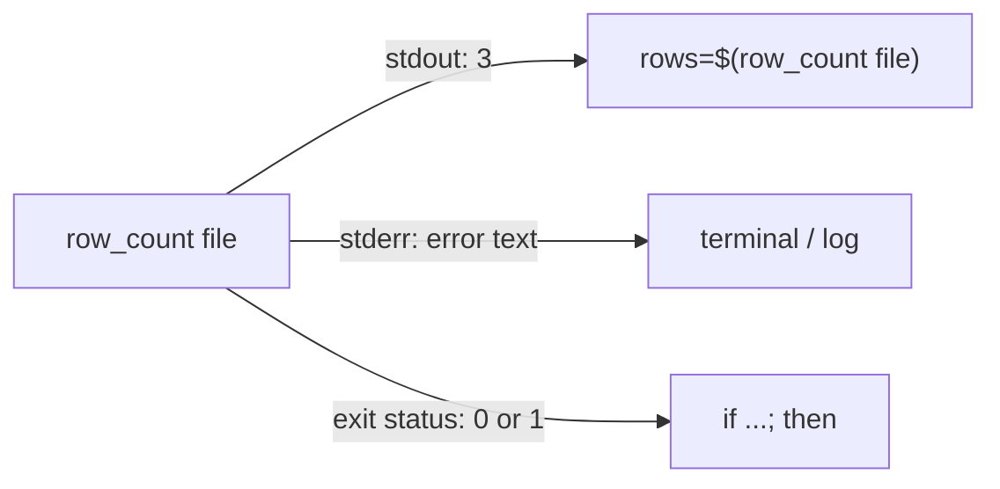
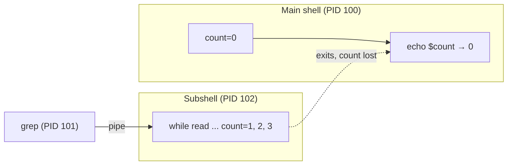

# Conditionals, loops, and functions

> **Level 2 · Chapter 3** · ⏱️ ~55 min read · Prerequisites: [Variables, quoting, and arrays](02-variables-quoting-arrays.md)

Scripts become useful when they make decisions and repeat work. This chapter covers how bash decides what is "true" (exit codes), the three test syntaxes and their traps, every loop form, the right way to read a file line by line, functions, and the pipe-into-`while` subshell pitfall that has confused shell programmers for decades.

## Why it matters

Alex's nightly job loads every CSV in `/srv/exports` into a database. It counts the loaded rows in a `while` loop fed by `find ... | while read f`. At the end it checks `if [ $loaded -eq 0 ]` and sends an alert saying "nothing loaded."

The alert fires every single night, even though the database clearly has the new data. Alex adds `echo` statements and sees the counter go up to 14 inside the loop. Then, one line after the loop, it's 0 again.

Nothing is wrong with the arithmetic. The pipe ran the loop in a separate process, and its counter died with it. The fix is to change one line: feed the loop with `< <(find ...)`. Understanding *why* takes the concepts in this chapter, and once you know it, you'll recognize this bug instantly in other people's scripts too.

## Concepts

### Exit codes: how bash decides "true"

Every command that finishes returns an **exit status** (also called **exit code** or **return code**): an integer from 0 to 255. The convention is:

- **0 means success.**
- **Anything from 1 to 255 means failure.** The specific number can say what kind of failure.

This is the reverse of many programming languages, where 0 means false. In the shell, a command "is true" when it **succeeded**. `if`, `while`, `&&`, and `||` all look only at exit statuses. They don't look at output.

Bash stores the exit status of the last command in the special variable **`$?`**. It is overwritten by every command, including `echo`, so save it immediately if you need it later: `status=$?`.

Codes with fixed meanings:

| Code | Meaning | Example |
| --- | --- | --- |
| 0 | Success | `true`, `ls /etc` |
| 1 | General failure | `false`, `grep` found no match |
| 2 | Misuse: bad option or syntax | `ls /nope` (ls uses 2 for "serious trouble"), `grep` read error |
| 126 | Found but not executable | running a file without `x` |
| 127 | Command not found | a typo in a command name |
| 128 + N | Killed by signal N | 130 = ++ctrl+c++ (SIGINT, 2), 143 = SIGTERM (15) |
| 255 | Exit status out of range | `exit -1` |

Exit codes are 8 bits, so `exit 300` becomes `300 % 256 = 44`. Keep your own codes between 0 and 125. Signals are covered in Level 3.

Each command documents its own codes in its man page under "EXIT STATUS." `grep` is a good example. 0 means a match was found, 1 means no match, and 2 means an error. So "no match" and "file missing" are different failures, and a script can tell them apart.

**Pipelines** return the status of their **last** command by default. `false | true` succeeds. The array **`PIPESTATUS`** holds the status of every command in the most recent pipeline. Chapter 4 shows `set -o pipefail`, which makes a pipeline fail if any part fails.

**`!`** before a command inverts its status: `! grep -q root /etc/passwd` succeeds if root is *not* found.

### `if`, `elif`, `else`

```bash
if COMMAND; then
    ...runs if COMMAND exited 0...
elif OTHER_COMMAND; then
    ...
else
    ...
fi
```

The thing after `if` is **any command**, not a special condition syntax. `if grep -q ERROR app.log; then` is perfectly normal. `if` runs the command, checks its exit status, and picks a branch. `[`, `[[`, and `((` are just commands (or command-like keywords) whose job is to return 0 or 1.

Formatting rules: `then` needs either a new line or a `;` before it. The block ends with `fi` ("if" backwards). The same pattern gives `case`/`esac`.

### `test`, `[`, and `[[`

Bash has three ways to write a comparison:

| | `test EXPR` | `[ EXPR ]` | `[[ EXPR ]]` |
| --- | --- | --- | --- |
| What it is | Builtin command (also `/usr/bin/test`) | Same command as `test`, but requires a final `]` | Bash **keyword**: special syntax parsed by bash |
| Portable to `sh`/dash | Yes | Yes | No (bash, zsh, ksh only) |
| Word splitting/globbing on `$var` | Yes, must quote | Yes, must quote | **No**: `[[ $var = x ]]` is safe |
| Pattern matching | No | No | `[[ $f == *.csv ]]` |
| Regex | No | No | `[[ $s =~ ^[0-9]+$ ]]` |
| And/or | `-a`/`-o` (deprecated) or separate tests | same | `&&`, `||`, and `( )` inside |
| `<` and `>` | Redirection! Must escape `\<` | same | String comparison |

`[` is literally a command named `[`. There's even a file for it:

```bash
type [ [[ test
ls -l /usr/bin/[
```

```text
[ is a shell builtin
[[ is a shell keyword
test is a shell builtin
-rwxr-xr-x 1 root root 55744 Aug 25 20:39 /usr/bin/[
```

Since `[` is an ordinary command, its arguments go through all the normal expansions first, **including word splitting**. That causes the classic errors. With `answer=""`, `[ $answer = yes ]` becomes `[ = yes ]`, which is malformed. With `answer="no way"`, it becomes `[ no way = yes ]`, which has too many arguments. The spaces around `[` and `]` are mandatory for the same reason: `[` is a command name and `]` is its last argument. `[$x = y]` looks for a command named `[$x`.

`[[` is a keyword, so bash parses it *before* expansions and knows that `$answer` is one operand. No word splitting, no globbing of variables. That makes it safer and more capable.

**This handbook's rule:** in bash scripts, use `[[ ]]` for string and file tests and `(( ))` for arithmetic. Use `[ ]` only in `#!/bin/sh` scripts, and then quote everything.

### The tests themselves

**String tests:**

| Test | True when |
| --- | --- |
| `-z "$s"` | `s` is empty (zero length) |
| `-n "$s"` | `s` is not empty |
| `"$a" = "$b"` | equal (`==` also works in bash) |
| `"$a" != "$b"` | not equal |
| `[[ $a < $b ]]` | `a` sorts before `b` (locale order) |
| `[[ $s == pattern ]]` | `s` matches a glob pattern (unquoted right side) |
| `[[ $s =~ regex ]]` | `s` matches an extended regular expression |

**Integer tests** (inside `[ ]` and `[[ ]]`): `-eq`, `-ne`, `-lt`, `-le`, `-gt`, `-ge`. Or use `(( a < b ))` with normal math symbols, which reads better.

!!! warning "Common mistake: `>` inside `[ ]`"
    `[ 5 > 10 ]` doesn't compare numbers. The `>` is a **redirection**: it runs `[ 5 ]` (true, because "5" is non-empty) and creates an empty file called `10`. Inside `[[ ]]`, `>` compares as **strings**, so `[[ 9 > 10 ]]` is true, because "9" sorts after "1". For numbers, use `-gt` or `(( 9 > 10 ))`.

**File tests:**

| Test | True when the path... |
| --- | --- |
| `-e` | exists (any type) |
| `-f` | is a regular file |
| `-d` | is a directory |
| `-L` (or `-h`) | is a symbolic link |
| `-s` | exists and is not empty (size > 0) |
| `-r` / `-w` / `-x` | is readable / writable / executable by *you* |
| `-b` / `-c` / `-p` / `-S` | is a block device / character device / named pipe / socket |
| `f1 -nt f2` | `f1` is newer than `f2` (modification time) |
| `f1 -ot f2` | `f1` is older than `f2` |

`-f`, `-d`, `-r`, and friends follow symbolic links, so `-d /bin` is true even though `/bin` is a link. Test `-L` first if the difference matters.

`help test` prints the full list.

### Pattern and regex matching with `[[`

In `[[ $s == pattern ]]`, an **unquoted** right side is a glob pattern: `*.csv`, `report-[0-9]*`, `?`. If you quote it, it's matched literally. That's useful when the pattern comes from user input that might contain a `*`.

`=~` matches an **extended regular expression** (ERE, the same flavor as `grep -E`). Captured groups land in the array **`BASH_REMATCH`**. Element 0 is the whole match and 1, 2, ... are the parenthesized groups. Store the regex in a variable and use it unquoted: `re='^[0-9]+$'; [[ $x =~ $re ]]`. If you quote the right side, bash matches it as a literal string instead. And storing regexes with spaces or special characters in a variable avoids escaping headaches.

### `&&` and `||`

`A && B` runs B only if A succeeds. `A || B` runs B only if A fails. They're short, readable guards:

```bash
mkdir -p "$out" && cd "$out"
cd "$dir" || exit 1
[[ -r $config ]] || { echo "missing $config" >&2; exit 1; }
```

The `{ ...; }` groups several commands into one unit without creating a subshell. The space after `{` and the `;` before `}` are required.

!!! warning "Common mistake: `A && B || C` is not if/else"
    `A && B || C` runs C if A fails **or if B fails**. With `true && false || echo hi`, you get `hi` even though A succeeded. Use a real `if` when B might fail. For a single `echo` as B it's usually fine, but it's worth knowing why.

### `case`

`case` compares one value against a series of glob patterns and runs the first branch that matches. It's cleaner than a long `if`/`elif` chain whenever you're matching one string against many possibilities: actions like `start`/`stop`, file extensions, yes/no answers, and command-line options.

```bash
case $value in
    pattern1|pattern2)
        commands ;;
    pattern3)
        commands ;;
    *)
        default commands ;;
esac
```

- `|` separates alternative patterns.
- `;;` ends a branch.
- `*)` matches anything. It's the default and goes last.
- Patterns are globs: `*.csv`, `[Yy]*`, `?`. Quote a pattern to match it literally.
- `case` doesn't word-split its value, so `case $x in` is safe unquoted.

Two rarer terminators: `;&` falls through into the next branch's commands without testing it, and `;;&` continues testing the following patterns.

### `for` loops

**List form.** Loop over words:

```bash
for env in dev staging prod; do
    echo "deploying to $env"
done
```

The list can be anything that expands to words: literal words, `"$@"`, `"${arr[@]}"`, a glob like `*.csv`, or brace expansion `{1..10}`. With no `in ...` at all, `for arg; do` loops over `"$@"`.

**C-style form.** For counting:

```bash
for ((i = 1; i <= n; i++)); do
    ...
done
```

Use it when the bounds are in variables. Brace expansion happens *before* variable expansion (step 1 vs step 3 in Chapter 2's diagram), so `{1..$n}` doesn't work. It produces the literal text `{1..3}`.

**Over files, safely.** Loop over a glob directly:

```bash
for f in /srv/exports/*.csv; do
    [[ -e $f ]] || continue     # the glob matched nothing
    process "$f"
done
```

Never write `for f in $(ls *.csv)`. The output of `ls` is word-split, so names with spaces break apart, and `ls` adds nothing a glob can't do. If the glob matches nothing, it stays as the literal text `*.csv`. The `[[ -e $f ]] || continue` guard handles that, or turn on `shopt -s nullglob`. For recursive searches, use `find -print0` with `while read` (shown below) or `shopt -s globstar` with `**/*.csv`.

### `while` and `until`

`while COMMAND; do ...; done` repeats as long as COMMAND succeeds. `until COMMAND; do ...; done` repeats as long as it *fails*, which is handy for "wait until something is ready":

```bash
until pg_isready -q; do sleep 2; done
```

`while true; do ...; done` is an infinite loop. You leave it with `break`, `return`, or `exit`.

### Reading a file line by line

The correct idiom has three parts, and each one exists for a reason:

```bash
while IFS= read -r line; do
    ...
done < file.txt
```

- **`IFS=`** (empty, for this `read` only) stops `read` from trimming leading and trailing whitespace. Without it, indentation is lost.
- **`-r`** stops backslash processing (Chapter 1).
- **`< file.txt`** after `done` redirects the whole loop's standard input from the file. The file is opened once, and every `read` takes the next line.

There's one more edge case. If the last line doesn't end with a newline (common in files made on Windows or by some exporters), `read` returns failure for that line even though it filled `line`, so the loop skips it. Add `|| [[ -n $line ]]` to catch it:

```bash
while IFS= read -r line || [[ -n $line ]]; do
```

To split each line into fields, give `read` several names and set `IFS` to the delimiter: `while IFS=, read -r id name amount`. The last name gets the rest of the line.

!!! warning "Common mistake: `for line in $(cat file)`"
    This doesn't loop over lines. It loops over **words**, because the output is word-split on spaces, tabs, and newlines. Each word is also globbed. Use `while IFS= read -r`.

!!! warning "Common mistake: commands inside the loop that read stdin"
    Inside `while read ... done < file`, every command shares the loop's standard input. `ssh`, `ffmpeg`, and some database clients read stdin and swallow the rest of your file, so the loop ends after one line. Redirect their input from `/dev/null` (`ssh host cmd < /dev/null`, or `ssh -n`), or read the file on a different descriptor: `while IFS= read -r line <&3; do ...; done 3< file`.

### `break` and `continue`

`break` exits the innermost loop immediately. `continue` skips to the next iteration. Both take an optional number for nested loops: `break 2` exits two levels, and `continue 2` skips to the next iteration of the outer loop.

### Functions

A **function** is a named block of code you can call like a command:

```bash
name() {
    commands
}
```

(`function name { ... }` also works but is bash-only. The `name()` form is portable, so prefer it.) Define a function before you call it. Bash reads top to bottom, so a call above the definition fails with "command not found."

**Arguments.** A function receives its arguments in `$1`, `$2`, ..., `$#`, and `"$@"`, exactly like a script. While the function runs, these are its own. The script's arguments come back when it returns. To use the script's arguments inside a function, pass them in explicitly: `main "$@"`.

**Two ways to give back a result.** This is the most important idea about bash functions:

1. **Exit status, via `return N`.** A number from 0 to 255 meaning success or failure, never data. Without `return`, a function returns the status of its last command. Use this for yes/no questions: `is_csv`, `has_header`, `is_running`.
2. **Output, via `echo`/`printf`.** The caller captures it with command substitution: `ext=$(file_ext "$f")`. Use this for data: names, counts, paths.

A function can do both: print a value and return non-zero on failure. Then the caller writes `if rows=$(row_count "$f"); then ...`.



Since stdout is the data channel, **messages from a function must go to stderr** (`>&2`). Otherwise they get mixed into the captured value.

`return` only works inside a function (or a sourced file). `exit` ends the whole script, even from inside a function, unless the function runs in a subshell such as `$( )`. There, `exit` only ends the subshell.

**Local variables.** Declare everything with `local` (Chapter 2). One trap: `local x=$(cmd)` hides the exit status of `cmd`, because `$?` becomes the status of `local` itself, which is 0. Declare first, then assign: `local x; x=$(cmd)`. ShellCheck reports this as SC2155.

### The pipe-into-`while` subshell pitfall

Every part of a pipeline runs in its own **subshell**, a child process that starts as a copy of the current shell. In `cmd | while read ...; do ...; done`, the whole `while` loop runs in a child process. Variables it changes vanish when the pipeline finishes:



Three fixes:

1. **Process substitution (best):** `while ...; done < <(cmd)`. The loop runs in the main shell, and `cmd` runs in the background, feeding it through a file-like pipe.
2. **Redirect from a file** if the data is already in one: `done < file`.
3. **`shopt -s lastpipe`:** runs the last part of a pipeline in the current shell. It only works when job control is off, which is the default in scripts, not in your interactive terminal.

The same pitfall applies to anything that sets variables at the end of a pipe: `cmd | read x`, `cmd | mapfile arr`.

## Commands and examples

### Exit codes in practice

```bash
ls /etc/hostname; echo "exit=$?"
ls /nope; echo "exit=$?"
grep -q alex /etc/hostname; echo "grep no match: exit=$?"
grep -q x /nope; echo "grep error: exit=$?"
```

```text
/etc/hostname
exit=0
ls: cannot access '/nope': No such file or directory
exit=2
grep no match: exit=1
grep error: exit=2
```

The special codes:

```bash
nosuchcmd; echo "exit=$?"
/etc/hostname; echo "exit=$?"
bash -c 'exit 300'; echo "exit 300 -> $?"
```

```text
bash: nosuchcmd: command not found
exit=127
bash: /etc/hostname: Permission denied
exit=126
exit 300 -> 44
```

A killed process reports 128 plus the signal number:

```bash
sleep 100 &
kill $!
wait $!; echo "exit=$?"
```

```text
[1]+  Terminated              sleep 100
exit=143
```

`$!` is the PID of the last background job. SIGTERM is signal 15, and 128 + 15 = 143.

Pipelines and `PIPESTATUS`:

```bash
false | true; echo "pipeline=$? PIPESTATUS=${PIPESTATUS[*]}"
```

```text
pipeline=0 PIPESTATUS=1 0
```

The pipeline "succeeded" even though `false` failed. `PIPESTATUS` shows the truth. Read it immediately, because the next command overwrites it.

### The `[` pitfalls, live

```bash
answer=""
[ $answer = yes ]; echo "exit=$?"
answer="no way"
[ $answer = yes ]; echo "exit=$?"
```

```text
bash: [: =: unary operator expected
exit=2
bash: [: too many arguments
exit=2
```

In the first case `[` received `= yes ]`, and in the second `no way = yes ]`. Quoting fixes `[`, and `[[` doesn't need the quotes:

```bash
answer=""
[ "$answer" = yes ]; echo "quoted [: exit=$?"
[[ $answer = yes ]]; echo "[[: exit=$?"
```

```text
quoted [: exit=1
[[: exit=1
```

Exit 1 means a clean "false," instead of 2 for "error."

A silent pitfall. `-n` with an unquoted empty variable is always true:

```bash
unset token
[ -n $token ] && echo "token is set?!"
```

```text
token is set?!
```

`[ -n ]` is a one-argument test, and a one-argument test is true when that argument (here, the string `-n`) is non-empty. Code like this "checks" for a password or API token and passes every time. `[[ -n $token ]]` gets it right.

Numbers vs strings:

```bash
[ 5 > 10 ] && echo "5 > 10 is TRUE?!"
ls -l 10
```

```text
5 > 10 is TRUE?!
-rw-rw-r-- 1 alex alex 0 Oct  2 10:45 10
```

A stray file named `10` is now sitting in your directory. The correct versions:

```bash
[ 5 -gt 10 ] || echo "-gt: false"
(( 5 > 10 )) || echo "(( )): false"
[[ 9 > 10 ]] && echo "[[ 9 > 10 ]] is true: string comparison!"
```

```text
-gt: false
(( )): false
[[ 9 > 10 ]] is true: string comparison!
```

Errors from non-numbers:

```bash
[ abc -eq 1 ]; echo "exit=$?"
```

```text
bash: [: abc: integer expression expected
exit=2
```

### Patterns and regexes

```bash
f="report.csv"
[[ $f == *.csv ]] && echo "glob match"
[[ $f == "*.csv" ]] || echo "quoted pattern = literal text"
```

```text
glob match
quoted pattern = literal text
```

Parse a version string with a regex and `BASH_REMATCH`:

```bash
ver="v2.14.3"
re='^v([0-9]+)\.([0-9]+)\.([0-9]+)$'
if [[ $ver =~ $re ]]; then
    echo "major=${BASH_REMATCH[1]} minor=${BASH_REMATCH[2]} patch=${BASH_REMATCH[3]}"
fi
```

```text
major=2 minor=14 patch=3
```

Validate input as an integer, a pattern you'll reuse constantly:

```bash
re='^[0-9]+$'
for v in 42 4x2 ""; do
    if [[ $v =~ $re ]]; then echo "'$v': number"; else echo "'$v': not a number"; fi
done
```

```text
'42': number
'4x2': not a number
'': not a number
```

### File tests

`filecheck.sh` describes each path you give it:

```bash
#!/usr/bin/env bash
# filecheck.sh - describe each path given on the command line.
for path in "$@"; do
    if [[ ! -e $path ]]; then
        echo "$path: does not exist"
    elif [[ -L $path ]]; then
        echo "$path: symbolic link -> $(readlink -- "$path")"
    elif [[ -d $path ]]; then
        echo "$path: directory"
    elif [[ -f $path && -x $path ]]; then
        echo "$path: executable file"
    elif [[ -f $path && -s $path ]]; then
        echo "$path: regular file, $(stat -c %s -- "$path") bytes"
    elif [[ -f $path ]]; then
        echo "$path: empty regular file"
    else
        echo "$path: something else (device, socket, pipe...)"
    fi
done
```

```bash
touch empty.txt
./filecheck.sh /etc /etc/hostname /bin /usr/bin/ls empty.txt /dev/null /nope
```

```text
/etc: directory
/etc/hostname: regular file, 5 bytes
/bin: symbolic link -> usr/bin
/usr/bin/ls: executable file
empty.txt: empty regular file
/dev/null: something else (device, socket, pipe...)
/nope: does not exist
```

The order of the branches matters. `-L` comes before `-d`, because `-d /bin` would also be true by following the link. `/dev/null` is a character device, so it matches none of the file branches.

Permissions and timestamps:

```bash
[[ -w /etc/passwd ]] || echo "cannot write /etc/passwd"
[[ -r /etc/shadow ]] || echo "cannot read /etc/shadow"
touch -d '2026-01-01' old.csv; touch new.csv
[[ new.csv -nt old.csv ]] && echo "new.csv is newer"
```

```text
cannot write /etc/passwd
cannot read /etc/shadow
new.csv is newer
```

`-nt` is the basis of simple "rebuild only if the source changed" logic: `[[ $src -nt $out ]] && rebuild`.

### `case` in practice

A tiny command dispatcher:

```bash
#!/usr/bin/env bash
# svc.sh - a tiny service-control front end to show case.
action=${1:-}
case $action in
    start|up)
        echo "Starting the pipeline" ;;
    stop|down)
        echo "Stopping the pipeline" ;;
    restart)
        echo "Stopping, then starting" ;;
    status)
        echo "Pipeline is running" ;;
    "")
        echo "usage: svc.sh {start|stop|restart|status}" >&2
        exit 2 ;;
    *)
        echo "unknown action: $action" >&2
        exit 2 ;;
esac
```

```bash
./svc.sh up
./svc.sh; echo "exit=$?"
./svc.sh reload; echo "exit=$?"
```

```text
Starting the pipeline
usage: svc.sh {start|stop|restart|status}
exit=2
unknown action: reload
exit=2
```

Classifying files by extension, case-insensitively, by lowercasing the value first:

```bash
for f in report.csv data.json image.PNG archive.tar.gz README; do
    case ${f,,} in
        *.csv|*.tsv)    kind="table" ;;
        *.json)         kind="json" ;;
        *.png|*.jpg)    kind="image" ;;
        *.tar.gz|*.tgz) kind="tarball" ;;
        *)              kind="unknown" ;;
    esac
    printf '%-15s %s\n' "$f" "$kind"
done
```

```text
report.csv      table
data.json       json
image.PNG       image
archive.tar.gz  tarball
README          unknown
```

Yes/no answers:

```bash
read -r -p "Delete 14 old backups? [y/N] " ans
case $ans in
    [Yy]|[Yy][Ee][Ss]) echo "deleting" ;;
    *)                 echo "aborted" ;;
esac
```

Anything other than y or yes, including just pressing Enter, falls to the safe default. That's what the capital N in `[y/N]` advertises.

### `for` loops

```bash
for i in {1..3}; do printf '%s ' "$i"; done; echo
n=3
for i in {1..$n}; do echo "$i"; done
for ((i = 1; i <= n; i++)); do printf 'batch %d of %d\n' "$i" "$n"; done
```

```text
1 2 3
{1..3}
batch 1 of 3
batch 2 of 3
batch 3 of 3
```

The second loop shows that brace expansion can't use variables. Use the C-style loop or `seq`.

Files, the safe and unsafe ways. The folder has `jan.csv`, `feb.csv`, and `mar report.csv`:

```bash
for f in exports/*.csv; do printf 'processing: %s\n' "$f"; done
echo "--- with ls"
for f in $(ls exports/*.csv); do printf 'processing: %s\n' "$f"; done
```

```text
processing: exports/feb.csv
processing: exports/jan.csv
processing: exports/mar report.csv
--- with ls
processing: exports/feb.csv
processing: exports/jan.csv
processing: exports/mar
processing: report.csv
```

When nothing matches:

```bash
for f in exports/*.parquet; do printf 'processing: %s\n' "$f"; done
```

```text
processing: exports/*.parquet
```

The loop ran once with the literal pattern. Guard it:

```bash
for f in exports/*.parquet; do
    [[ -e $f ]] || continue
    printf 'processing: %s\n' "$f"
done
```

Recursive, safely, with `find -print0` and `read -d ''`:

```bash
while IFS= read -r -d '' f; do
    printf 'found: %s\n' "$f"
done < <(find exports -name '*.csv' -print0 | sort -z)
```

```text
found: exports/2025/dec final.csv
found: exports/feb.csv
found: exports/jan.csv
found: exports/mar report.csv
```

`read -d ''` reads up to a NUL byte instead of a newline, matching `-print0`. Or let bash recurse with `globstar`:

```bash
shopt -s globstar
for f in exports/**/*.csv; do echo "$f"; done
```

```text
exports/2025/dec final.csv
exports/feb.csv
exports/jan.csv
exports/mar report.csv
```

### `while`, `until`, `break`, `continue`

A retry loop with `break`:

```bash
attempt=1 max=4
while (( attempt <= max )); do
    if curl -fs http://localhost:8080/health >/dev/null; then
        echo "attempt $attempt: service is up"
        break
    fi
    echo "attempt $attempt: not ready, retrying"
    (( ++attempt ))
    sleep 2
done
```

```text
attempt 1: not ready, retrying
attempt 2: not ready, retrying
attempt 3: service is up
```

`curl -f` fails on HTTP errors and `-s` keeps it silent, so only the exit status matters. `-fsS` would also print the error, which is useful in logs but noisy here.

`continue` and `break` in one loop, and `continue 2` in a nested loop:

```bash
for i in 1 2 3 4 5 6; do
    (( i == 2 )) && continue
    (( i == 5 )) && break
    echo "i=$i"
done
for d in a b; do
    for n in 1 2 3; do
        [[ $n == 2 ]] && continue 2
        echo "$d$n"
    done
done
```

```text
i=1
i=3
i=4
a1
b1
```

### Reading a file line by line, compared

A file with leading spaces, a backslash, a tab, and no final newline:

```bash
printf '  leading spaces\nback\\slash\n\tTabbed line\nlast line no newline' > tricky.txt
```

The wrong ways:

```bash
for line in $(cat tricky.txt); do echo "[$line]"; done
```

```text
[leading]
[spaces]
[back\slash]
[Tabbed]
[line]
[last]
[line]
[no]
[newline]
```

```bash
while read line; do echo "[$line]"; done < tricky.txt
```

```text
[leading spaces]
[backslash]
[Tabbed line]
```

The `for` loop gave words, not lines. Plain `read` trimmed the indentation, ate the backslash, and dropped the last line. The right way:

```bash
while IFS= read -r line || [[ -n $line ]]; do
    echo "[$line]"
done < tricky.txt
```

```text
[  leading spaces]
[back\slash]
[	Tabbed line]
[last line no newline]
```

Every byte is preserved.

**CSV with a header.** Read the header separately by grouping the whole block on one redirection:

```bash
cat orders.csv
```

```text
id,name,amount
1,alex,20.50
2,sam,13.00
3,kim,7.25
```

```bash
{
    read -r header
    while IFS=, read -r id name amount; do
        printf '%-3s %-5s %8s\n' "$id" "$name" "$amount"
    done
} < orders.csv
```

```text
1   alex     20.50
2   sam      13.00
3   kim       7.25
```

Both `read` commands share the same open file, so the loop starts at line 2. (This simple splitting doesn't handle quoted CSV fields that contain commas. For real CSV, reach for Python's `csv` module, see Chapter 6.)

### Functions in practice

```bash
#!/usr/bin/env bash
# funcs.sh - arguments, output, and status from functions

greet() {
    local name=$1 greeting=${2:-Hello}
    printf '%s, %s! (%d args, called as %s)\n' "$greeting" "$name" "$#" "${FUNCNAME[0]}"
}

# Returns data by printing it; the caller captures it with $( ).
file_ext() {
    local file=$1
    printf '%s\n' "${file##*.}"
}

# Returns success/failure through its exit status.
is_csv() {
    [[ $1 == *.csv ]]
}

# Combines both: prints a value AND signals failure.
row_count() {
    local file=$1
    if [[ ! -r $file ]]; then
        echo "row_count: cannot read $file" >&2
        return 1
    fi
    local n
    n=$(wc -l < "$file")
    echo $(( n - 1 ))       # minus the header line
}

greet alex
greet "Alex Doe" Hi
ext=$(file_ext "archive.tar.gz")
echo "extension: $ext"
for f in orders.csv notes.txt; do
    if is_csv "$f"; then echo "$f is a CSV"; else echo "$f is not a CSV"; fi
done
if rows=$(row_count orders.csv); then echo "orders.csv has $rows data rows"; fi
if ! rows=$(row_count missing.csv); then echo "could not count missing.csv"; fi
```

```text
Hello, alex! (1 args, called as greet)
Hi, Alex Doe! (2 args, called as greet)
extension: gz
orders.csv is a CSV
notes.txt is not a CSV
orders.csv has 3 data rows
row_count: cannot read missing.csv
could not count missing.csv
```

Points to notice:

- `"Alex Doe"` arrived as one argument (`$#` is 2) because the caller quoted it.
- `is_csv` has no `return`. Its status is the status of `[[ ]]`, the last command.
- `if rows=$(row_count ...)` both captures the output and tests the exit status. An assignment's status is the status of the command substitution.
- The error message went to stderr. It appeared on the terminal but wasn't captured into `rows`.
- `FUNCNAME` is an array of the current call stack. `${FUNCNAME[0]}` is the current function's name, useful in error messages.

**`return` is not for data.** It only carries a status from 0 to 255:

```bash
get_total() { return 300; }
get_total; echo "status: $?"
bad_return() { return "hello"; }
bad_return; echo "status: $?"
```

```text
status: 44
./retval.sh: line 4: return: hello: numeric argument required
status: 2
```

**Stdout pollution.** This is why log messages belong on stderr:

```bash
latest_export() {
    echo "Looking in /srv/exports..."          # meant as a log message
    echo "orders-2026-10-01.csv"
}
file=$(latest_export)
echo "file is: [$file]"
```

```text
file is: [Looking in /srv/exports...
orders-2026-10-01.csv]
```

Change the first `echo` to `echo "..." >&2`, and `file` gets only the name.

**The `local x=$(cmd)` trap:**

```bash
mask() {
    local out=$(false)
    echo "status after local out=\$(false): $?"
    local out2
    out2=$(false)
    echo "status after separate assignment: $?"
}
mask
```

```text
status after local out=$(false): 0
status after separate assignment: 1
```

### The pipe pitfall, demonstrated

```bash
#!/usr/bin/env bash
# pipe-pitfall.sh - why a counter in "cmd | while read" stays at 0

count=0
grep -v '^id' orders.csv | while IFS=, read -r id name amount; do
    count=$((count + 1))
    echo "  inside loop: count=$count (PID $BASHPID)"
done
echo "after pipe:            count=$count (PID $BASHPID)"

count=0
while IFS=, read -r id name amount; do
    count=$((count + 1))
done < <(grep -v '^id' orders.csv)
echo "after process subst.:  count=$count"

count=0
shopt -s lastpipe
grep -v '^id' orders.csv | while IFS=, read -r id name amount; do
    count=$((count + 1))
done
echo "after lastpipe:        count=$count"
```

```text
  inside loop: count=1 (PID 183380)
  inside loop: count=2 (PID 183380)
  inside loop: count=3 (PID 183380)
after pipe:            count=0 (PID 183378)
after process subst.:  count=3
after lastpipe:        count=3
```

**`$BASHPID`** is the PID of the current bash process, which changes in subshells. (`$$` doesn't change: it always shows the main script's PID.) The loop ran in process 183380, while the main script is 183378. Both fixes keep the loop in the main shell. ShellCheck warns about this pattern with SC2030 and SC2031 ("modification of count is local (to subshell caused by pipeline)").

## Exercises

### Exercise 1: Number classifier (easy)

Write `classify.sh N` that prints whether N is negative, zero, or positive, and whether it is even or odd. If the argument isn't an integer (allow a leading `-`), print a usage message to stderr and exit with status 2.

??? success "Solution"

    ```bash
    #!/usr/bin/env bash
    # classify.sh - describe an integer.
    n=${1:-}
    if [[ ! $n =~ ^-?[0-9]+$ ]]; then
        echo "usage: classify.sh INTEGER" >&2
        exit 2
    fi
    if (( n < 0 )); then
        sign="negative"
    elif (( n == 0 )); then
        sign="zero"
    else
        sign="positive"
    fi
    if (( n % 2 == 0 )); then parity="even"; else parity="odd"; fi
    echo "$n is $sign and $parity"
    ```

    ```bash
    ./classify.sh 42; ./classify.sh -7; ./classify.sh 0
    ./classify.sh 3.5; echo "exit=$?"
    ```

    ```text
    42 is positive and even
    -7 is negative and odd
    0 is zero and even
    usage: classify.sh INTEGER
    exit=2
    ```

    Validate with a regex *before* doing arithmetic. Otherwise `(( n < 0 ))` with `n=abc` silently treats `abc` as a variable name (0).

### Exercise 2: Fix the counter (easy)

This script always prints `errors: 0`, though `app.log` has two ERROR lines. Explain why, then fix it so it prints each error message (without the timestamp) and the correct count.

```bash
#!/usr/bin/env bash
errors=0
grep ERROR app.log | while read -r line; do
    errors=$((errors + 1))
done
echo "errors: $errors"
```

??? success "Solution"

    The `while` loop is the last part of a pipeline, so it runs in a subshell. It increments its own copy of `errors`, which is discarded when the pipeline ends. The main shell's `errors` is still 0.

    ```bash
    #!/usr/bin/env bash
    errors=0
    while IFS= read -r line; do
        errors=$((errors + 1))
        printf 'found: %s\n' "${line#* * }"
    done < <(grep ERROR app.log)
    echo "errors: $errors"
    ```

    ```text
    found: ERROR db connection refused
    found: ERROR db connection refused
    errors: 2
    ```

    `${line#* * }` removes the shortest prefix matching "anything, space, anything, space": the date and time. (If you only need the count, `grep -c ERROR app.log` is simpler still.)

### Exercise 3: Sales summary (medium)

Given `sales.csv`:

```text
date,customer,units
2026-10-01,alex,3
2026-10-01,sam,5
2026-10-02,alex,2
2026-10-02,kim,1
2026-10-03,sam,4
```

Write `sales-summary.sh FILE` that skips the header, totals units per customer, prints the number of data rows, and lists customers sorted by total (highest first). It must also work if the file has no trailing newline or contains blank lines.

??? success "Solution"

    ```bash
    #!/usr/bin/env bash
    # sales-summary.sh - total units per customer from a CSV.
    file=${1:?usage: sales-summary.sh FILE.csv}
    declare -A units=()
    rows=0

    {
        read -r _header                         # skip the header line
        while IFS=, read -r _date customer qty || [[ -n $customer ]]; do
            [[ -z $customer ]] && continue      # skip blank lines
            units[$customer]=$(( ${units[$customer]:-0} + qty ))
            (( ++rows ))
        done
    } < "$file"

    echo "rows: $rows"
    for c in "${!units[@]}"; do
        printf '%-6s %3d\n' "$c" "${units[$c]}"
    done | sort -k2,2nr
    ```

    ```text
    rows: 5
    sam      9
    alex     5
    kim      1
    ```

    Names starting with `_` signal "read but unused." `(( ++rows ))` uses pre-increment so it never evaluates to 0, which matters under `set -e`. Piping the final `for` into `sort` is fine: that loop only prints and doesn't set variables you need later.

### Exercise 4: A `retry` function (medium)

Write a function `retry MAX COMMAND [ARGS...]` that runs the command, and if it fails, retries up to MAX attempts in total with a 1-second pause. It should print a note to stderr for each failure and return the command's last exit status if it never succeeds. Test it with a function that fails twice and then succeeds, and with `false`.

??? success "Solution"

    ```bash
    #!/usr/bin/env bash
    # retry.sh - demo of a retry helper.

    # retry MAX_TRIES COMMAND [ARGS...]
    retry() {
        local max=$1 attempt=1 status
        shift
        while true; do
            "$@" && return 0
            status=$?
            if (( attempt >= max )); then
                echo "retry: '$1' failed $max times (last status $status)" >&2
                return "$status"
            fi
            echo "retry: attempt $attempt failed (status $status), retrying in 1s" >&2
            sleep 1
            (( ++attempt ))
        done
    }

    # A flaky command for testing: fails twice, then succeeds.
    calls=0
    flaky() {
        (( ++calls ))
        if (( calls < 3 )); then return 3; fi
        echo "flaky: succeeded on call $calls"
    }

    retry 5 flaky
    retry 2 false
    echo "exit status of last retry: $?"
    ```

    ```text
    retry: attempt 1 failed (status 3), retrying in 1s
    retry: attempt 2 failed (status 3), retrying in 1s
    flaky: succeeded on call 3
    retry: attempt 1 failed (status 1), retrying in 1s
    retry: 'false' failed 2 times (last status 1)
    exit status of last retry: 1
    ```

    `shift` removes MAX so that `"$@"` is exactly the command and its arguments, with quoting preserved. Running `"$@"` directly (not in `$( )`) keeps `flaky` in the current shell, so its `calls` counter persists between attempts. In real scripts you'd use it as `retry 5 curl -fsS "$url"`.

### Exercise 5: Organize downloads (hard)

Write `sort-files.sh DIR` that moves each regular file directly inside DIR into a subfolder by type: `tables/` for csv/tsv/xlsx, `images/` for png/jpg/jpeg/gif, `archives/` for zip/tar.gz/tgz, and `other/` for everything else. Extensions are case-insensitive. Skip directories. Handle names with spaces, and handle an empty DIR. Add a `DRY_RUN` mode: if the environment variable `DRY_RUN=1` is set, print the `mv` commands instead of running them.

??? success "Solution"

    ```bash
    #!/usr/bin/env bash
    # sort-files.sh - move files into subfolders by type.
    dir=${1:?usage: sort-files.sh DIR}
    [[ -d $dir ]] || { echo "not a directory: $dir" >&2; exit 1; }

    run() {
        if [[ ${DRY_RUN:-0} == 1 ]]; then
            printf 'would run:'; printf ' %q' "$@"; echo
        else
            "$@"
        fi
    }

    shopt -s nullglob
    moved=0
    for f in "$dir"/*; do
        [[ -f $f ]] || continue                 # skip directories and others
        name=${f##*/}
        case ${name,,} in
            *.csv|*.tsv|*.xlsx)        sub=tables ;;
            *.png|*.jpg|*.jpeg|*.gif)  sub=images ;;
            *.zip|*.tar.gz|*.tgz)      sub=archives ;;
            *)                         sub=other ;;
        esac
        run mkdir -p -- "$dir/$sub"
        run mv -n -- "$f" "$dir/$sub/"
        (( ++moved ))
    done
    echo "$moved file(s) processed"
    ```

    ```bash
    mkdir -p dl && touch "dl/Q3 Sales.CSV" dl/photo.jpg dl/backup.tar.gz dl/notes.md
    DRY_RUN=1 ./sort-files.sh dl
    ```

    ```text
    would run: mkdir -p -- dl/archives
    would run: mv -n -- dl/backup.tar.gz dl/archives/
    would run: mkdir -p -- dl/other
    would run: mv -n -- dl/notes.md dl/other/
    would run: mkdir -p -- dl/images
    would run: mv -n -- dl/photo.jpg dl/images/
    would run: mkdir -p -- dl/tables
    would run: mv -n -- dl/Q3\ Sales.CSV dl/tables/
    4 file(s) processed
    ```

    The `run` wrapper is the heart of a dry-run mode. Every state-changing command goes through it, and it either prints the command (`%q` quotes it so it could be pasted back) or runs it. `mv -n` never overwrites an existing file. `nullglob` makes an empty directory loop zero times. The capstone uses this same pattern.

## Check yourself

1. What exit status means success, and what do 127, 126, and 130 usually mean?

    ??? note "Answer"

        0 is success. 127: command not found. 126: found but not executable (permission or not a valid executable). 130: terminated by SIGINT (++ctrl+c++), which is 128 + 2.

2. Why does `[ $name = alex ]` fail with "unary operator expected" when `name` is empty, and why doesn't `[[ $name = alex ]]` fail?

    ??? note "Answer"

        `[` is a normal command, so its arguments are word-split first. An empty unquoted `$name` disappears, leaving `[ = alex ]`, which is malformed. `[[` is a keyword parsed by bash before expansion, so it knows `$name` is one operand even when empty, and it doesn't word-split.

3. What does `[ 5 > 10 ]` actually do?

    ??? note "Answer"

        `>` is a redirection, so it runs `[ 5 ]` with output redirected to a new file named `10`. `[ 5 ]` is true (a non-empty string), so the test "succeeds." Use `[ 5 -gt 10 ]` or `(( 5 > 10 ))` for numbers.

4. Write the correct loop header for reading a file line by line, and explain each part.

    ??? note "Answer"

        `while IFS= read -r line || [[ -n $line ]]; do ... done < file`. `IFS=` keeps leading/trailing whitespace; `-r` keeps backslashes; `|| [[ -n $line ]]` processes a final line that has no trailing newline; `< file` after `done` feeds the whole loop from the file.

5. Why is `for f in $(ls *.csv)` wrong, and what should you write instead?

    ??? note "Answer"

        The output of `ls` is word-split (and globbed), so file names with spaces become several bogus items. `ls` adds nothing over the glob itself. Write `for f in *.csv; do [[ -e $f ]] || continue; ...; done` (or enable `nullglob`).

6. How does a bash function return a string to its caller? What is `return` for?

    ??? note "Answer"

        It prints the string to stdout, and the caller captures it with `$(func args)`. `return N` sets the function's exit status (0–255) to signal success or failure; it can't carry data.

7. A counter incremented inside `some_cmd | while read ...; do ...; done` is 0 after the loop. Why, and what are two fixes?

    ??? note "Answer"

        Each part of a pipeline runs in a subshell, so the loop modifies a copy of the variable that's thrown away when the pipeline ends. Fixes: feed the loop with process substitution (`done < <(some_cmd)`), redirect from a file if possible, or `shopt -s lastpipe` in a script (job control off).

8. Why should a function that returns data via stdout send its log messages to stderr?

    ??? note "Answer"

        Command substitution captures everything on stdout. Log lines on stdout end up mixed into the returned value. Stderr isn't captured by `$( )`, so messages still reach the terminal while the data stays clean.

## Key takeaways

- Exit status 0 is success. `if`, `while`, `&&`, and `||` act on exit statuses, not output. Save `$?` immediately if you need it.
- In bash, use `[[ ]]` for strings, files, patterns, and regexes, and `(( ))` for numbers. `[ ]` needs every variable quoted and treats `>` as a redirection.
- `case` is the clean way to match one value against many glob patterns.
- Loop over files with globs or `find -print0`, never `$(ls)`. Read lines with `while IFS= read -r line`.
- Functions return data on stdout and success or failure through their exit status. Messages go to stderr. Variables are `local`.
- `cmd | while read` runs the loop in a subshell. Use `done < <(cmd)` when the loop sets variables.

## Next

Continue with [Error handling](04-error-handling.md), where you'll make scripts that fail loudly and clean up after themselves.
