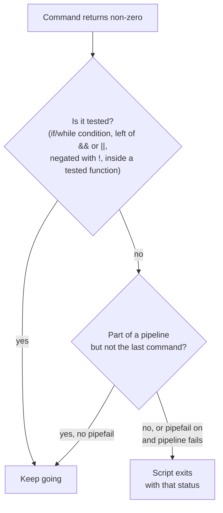
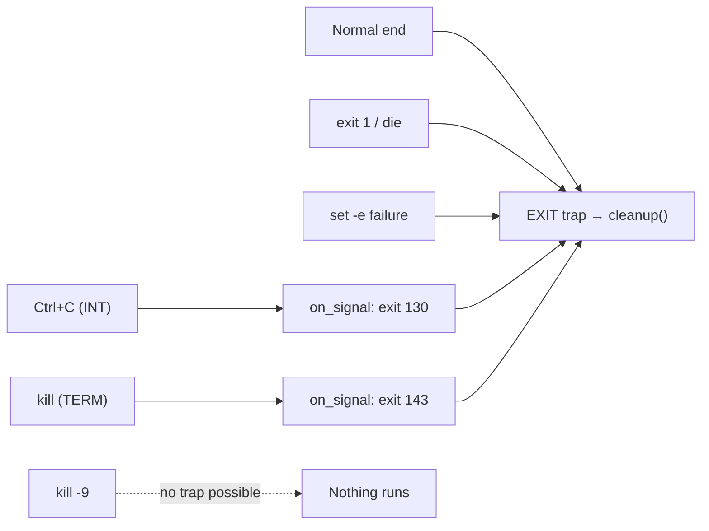

# Error handling

> **Level 2 · Chapter 4** · ⏱️ ~55 min read · Prerequisites: [Conditionals, loops, and functions](03-control-flow-functions.md)

By default, bash ignores errors and keeps going. This chapter covers how to make scripts stop when something goes wrong (`set -euo pipefail`, plus the cases where it doesn't work), how to clean up no matter how a script ends (`trap`, `mktemp`), how to report problems clearly (stderr, `die`, exit codes, logging), and how to find bugs before and during a run (`bash -n`, `set -x`, ShellCheck).

## Why it matters

Alex's backup script starts like this:

```bash
cd /mnt/backup-drive/daily
rm -rf ./*
cp -r ~/projects/* .
```

One morning the USB drive isn't mounted. `cd` fails and prints an error, but bash carries on to the next line, **in whatever directory the script started in**. That was `~/projects`, because the cron job launched it from there. `rm -rf ./*` wipes the projects. Then `cp` copies nothing over nothing.

Each line was correct on its own. What was missing was one line at the top, `set -e`, or a `|| exit` after the `cd`. Either would have stopped the script on the first failure. This chapter is about building the habit of writing scripts that **fail fast, fail loudly, and clean up after themselves**.

## Concepts

### The default: keep going no matter what

Bash's default is to run each command, record its exit status in `$?`, and move on to the next line whatever happened. That makes sense at an interactive prompt, where *you* read each error and decide what to do. In a script nobody is reading, so a failure early on silently turns every later command into a mistake.

Three shell options change this. Together they're known as **"strict mode"**:

```bash
set -euo pipefail
```

| Option | Long form | Effect |
| --- | --- | --- |
| `-e` | `set -o errexit` | Exit the script when a command fails (non-zero status) |
| `-u` | `set -o nounset` | Treat use of an unset variable as an error and exit |
| `-o pipefail` | | A pipeline fails if *any* command in it fails, not just the last one |

`set -x` (`xtrace`) is the fourth option you'll use constantly, for debugging. Use `set +e` (with a plus sign) to turn an option back *off*.

Put `set -euo pipefail` near the top of every script, right after the header comment. Then learn its limits, because `-e` in particular has surprising exceptions.

### `set -e` and its exceptions

With `set -e`, bash exits as soon as a command returns non-zero, **unless that failure is "expected,"** meaning bash can see that you're already handling it. The exceptions follow from that idea:

1. **The condition of `if`, `elif`, `while`, or `until`.** `if grep -q x file` would be useless if a non-match killed the script.
2. **Any command in a `&&` or `||` list except the last one.** In `cmd || echo "failed"`, the failure of `cmd` is handled.
3. **A command negated with `!`.**
4. **Any command in a pipeline except the last**, unless `pipefail` is on.
5. **Everything inside a function, or a `{ }` group or subshell, that is itself being tested.** If you call `if my_func; then`, then `set -e` is switched off *for the whole body* of `my_func`. Failures inside it don't stop anything. Only its final status counts.
6. **The status of `local`, `export`, `declare`, or `readonly`**, which hides the status of a command substitution in the same line: `local x=$(false)` succeeds.
7. **Command substitutions don't inherit `-e`** in bash's default mode. Inside `$(false; echo hi)`, the `false` doesn't stop the subshell. (`shopt -s inherit_errexit` changes this.)

And two cases that *do* trigger `-e` but surprise people:

- **`((count++))` when `count` is 0.** The expression evaluates to 0, so the status is 1, and the script dies on the first increment.
- **A function whose last command is `[[ test ]] && something`.** When the test fails, the `&&` list is exempt, but the *function* then returns 1, and the call site is not exempt. The script exits with no error message at all.



Because of these holes, treat `set -e` as a **safety net**, not as your error handling. For commands where failure matters, check explicitly with `|| die "..."` or an `if`. Many experienced people still use `set -e` everywhere for the protection it does give. A few avoid it entirely and check every command. This handbook uses it, plus explicit checks on important commands.

### `set -u`: catching typos and missing inputs

Without `-u`, a misspelled variable silently expands to an empty string. `rm -rf "$taget_dir/"*` becomes `rm -rf /*`. With `-u`, bash stops with `taget_dir: unbound variable`.

`-u` changes how you write some code. Any variable that may legitimately be unset needs an explicit default:

- Optional arguments: `${1:-}` or `${1:-default}`.
- Optional environment variables: `${EDITOR:-nano}`.
- Checking whether something is set: `[[ -n ${VAR:-} ]]` or `[[ -v VAR ]]`.

Empty arrays are fine in bash 5.2 (Mint's version): `"${arr[@]}"` on an empty array no longer errors under `-u`. Very old bash (before 4.4) treated it as unbound, so you may see workarounds in older scripts.

### `set -o pipefail`

A pipeline's exit status is normally the status of its **last** command. In `grep ERROR missing.log | sort | uniq -c`, `grep` fails because the file is missing, but `uniq` happily processes empty input and succeeds. The pipeline "succeeds," and `set -e` sees nothing wrong.

With `pipefail`, the pipeline's status is the status of the **rightmost command that failed**, or 0 if all succeeded. Now the missing file stops the script.

There's one well-known side effect. If a later command stops reading early, like `head`, the earlier command gets killed by **SIGPIPE**, the signal a process receives when it writes into a pipe nobody is reading anymore. Its status becomes 141 (128 + 13). With `pipefail`, `seq 1 1000000 | head -n 3` fails. The fix is to avoid reading partial output in that way, or to allow it explicitly: `{ seq 1 1000000 || true; } | head -n 3`.

Also remember that commands like `grep` and `diff` use exit status 1 to *report* something ("no match" or "files differ"), not to signal an error. Under `set -e`, `count=$(grep -c ERROR app.log)` kills the script when there are zero matches. Write `count=$(grep -c ERROR app.log || true)`.

### Debugging with `set -x` and `PS4`

`set -x` makes bash print each command **after expansion**, just before running it, on stderr. Each trace line starts with `+`. You see the actual values the command received. That's the fastest way to find quoting bugs, wrong paths, and surprising branches.

Ways to turn it on:

- `bash -x script.sh` for the whole script, without editing it.
- `set -x` ... `set +x` around just the part you suspect.
- `#!/usr/bin/env bash` followed by `set -x` near the top, temporarily.

The `+` prefix comes from the variable **`PS4`**. Its first character is repeated to show nesting depth (`++` for a command substitution inside a command). You can put expansions in `PS4` to make traces far more useful:

```bash
export PS4='+ ${BASH_SOURCE##*/}:${LINENO}:${FUNCNAME[0]:-main}: '
```

This shows the file, line number, and function for every traced command. Use single quotes, so the expansions happen at trace time, not when you set `PS4`.

To keep the trace out of your terminal, send it to a file descriptor of your choice with **`BASH_XTRACEFD`**: `exec 7>>trace.log; BASH_XTRACEFD=7; set -x`. A **file descriptor** is a numbered handle to an open file. 0, 1, and 2 are stdin, stdout, and stderr (Level 1), and you can open others with `exec`.

!!! warning "Common mistake: `set -x` leaks secrets"
    The trace prints expanded values, including passwords and tokens in variables. Don't leave `set -x` on in scripts that handle secrets, and don't paste traces into tickets without checking them first.

### `trap`: running code when the script ends or gets a signal

**`trap 'commands' CONDITION...`** registers commands that bash runs when a condition happens. The conditions you'll use:

| Condition | When it fires | Typical use |
| --- | --- | --- |
| `EXIT` | The script is exiting for **any** reason: end of file, `exit`, `set -e` failure, or a handled signal | Cleanup: temp files, lock files, mounted dirs |
| `ERR` | A command fails in a way that would trigger `set -e` (same exceptions) | Printing the line and command that failed |
| `INT` | SIGINT, from ++ctrl+c++ | Graceful stop |
| `TERM` | SIGTERM, from `kill PID` or systemd stopping a service | Graceful stop |
| `HUP` | SIGHUP, the terminal closed | Graceful stop, or reload |

A **signal** is a small asynchronous notification the kernel delivers to a process, such as "the user pressed Ctrl+C" or "please terminate." Signals get a full chapter in Level 3. For now: without a trap, SIGINT and SIGTERM kill a bash script on the spot, and none of your cleanup runs. SIGKILL (`kill -9`) can never be trapped. That's why cleanup must also cope with leftovers from a previous crashed run.

The standard pattern is:

1. Put **all** cleanup in one function and attach it to `EXIT`.
2. Attach `INT` and `TERM` to a handler that calls `exit` with the conventional status (130 or 143). The `exit` then fires the `EXIT` trap. That way cleanup lives in one place and runs exactly once.



Details that matter:

- Inside the `EXIT` handler, `$?` is the status the script is exiting with. Save it first (`local status=$?`) if you want to log it or keep it.
- Write the trap string in **single quotes**, so variables expand when the trap *runs*, not when you set it: `trap 'rm -f -- "$tmp"' EXIT`. ShellCheck warns (SC2064) when you use double quotes.
- Each new `trap ... EXIT` *replaces* the previous one. Use one cleanup function that handles everything.
- Bash runs a trap only between commands. If the script is waiting in a long `sleep` or a slow external command, the handler runs after that command ends.
- `ERR` traps aren't inherited by functions unless you also `set -E` (`set -o errtrace`). That's why you'll see `set -Eeuo pipefail`.

### Temporary files with `mktemp`

Scripts often need scratch space. Never invent names like `/tmp/myscript.tmp`. Two copies of the script running at once overwrite each other's files. And on a shared machine, another user can pre-create that path as a symlink to one of *your* files. Your script then overwrites the target. This is a real class of attack called a **symlink race**.

**`mktemp`** creates a file (or with `-d`, a directory) with a random, unique name, **atomically**: nobody else can create the same name in between. It sets permissions so only you can read it (600 for files, 700 for directories), and prints the path:

| Command | Creates |
| --- | --- |
| `mktemp` | `/tmp/tmp.XXXXXXXXXX` file |
| `mktemp -d` | a directory |
| `mktemp --suffix=.csv` | a file ending in `.csv` |
| `mktemp -t report.XXXXXX.csv` | a file from your template, in `$TMPDIR` or `/tmp` |
| `mktemp -p DIR name.XXXX` | a file in `DIR` |

Always pair `mktemp` with a cleanup trap:

```bash
workdir=$(mktemp -d)
trap 'rm -rf -- "$workdir"' EXIT
```

A related trick is **atomic replacement**. To update a file that other programs read, write to a temp file *in the same directory*, then `mv` it over the original. On one filesystem, `mv` is a single rename operation, so readers see either the old file or the new one, never half of each.

### Error messages go to stderr

Your script has two output channels: **stdout** (file descriptor 1) for *results*, and **stderr** (file descriptor 2) for *diagnostics*: errors, warnings, progress, and logs. Keeping them separate means:

- `./report.sh > report.csv` produces a clean CSV while errors still appear on the terminal.
- `result=$(./script.sh)` captures data, not error text.
- Cron and systemd can route errors to logs or email separately.

Send a message to stderr with `>&2`, which means "redirect stdout to wherever fd 2 points":

```bash
echo "error: config file missing" >&2
```

A good error message says **who** is complaining (the script name), **what** went wrong, and ideally **what to do**. Compare `error` with `backup.sh: cannot write to /mnt/backup: No such file or directory (is the drive mounted?)`.

### The `die` helper

Almost every script needs "print an error and exit." Make it a function:

```bash
die() {
    printf '%s: error: %s\n' "${0##*/}" "$*" >&2
    exit 1
}
```

Then guard any important command with `|| die`:

```bash
cd -- "$target" || die "cannot cd to $target"
[[ -r $config ]] || die "cannot read $config"
```

`${0##*/}` is the script's name without its directory (Chapter 2's `##*/`). `$0` is covered in Chapter 5.

### Exit code conventions

Your script's exit status is its API for other programs: cron, systemd, CI, and other scripts. Pick codes deliberately:

| Code | Meaning | Use |
| --- | --- | --- |
| 0 | Success | Everything worked |
| 1 | General failure | The default for "something went wrong" |
| 2 | Usage error | Bad options or arguments (the convention bash builtins and many tools follow) |
| 64–78 | `sysexits.h` codes | Optional, more specific categories, e.g. 64 usage, 65 bad input data, 66 input missing, 73 can't create output, 75 temporary failure (try again), 77 permission denied, 78 config error |
| 126, 127, 128+N | Reserved by the shell | Don't use these for your own errors |

The `sysexits.h` list lives in `/usr/include/sysexits.h` on Mint. Most scripts need only 0, 1, and 2. A distinct code for "temporary failure, try again" (75) is useful for scheduled jobs. A supervisor can retry on 75 and alert on anything else.

End a script explicitly with `exit 0` only when the last command's status would be misleading. Otherwise the script's status is the status of its last command, which is usually what you want.

### Logging with timestamps

When a script runs unattended, logs are your only witness. Useful log lines have a timestamp, a level, and a message. Bash can print the current time without running `date`, using `printf`'s `%(...)T` format with `-1` meaning "now." That's faster inside loops.

Levels: `DEBUG` (verbose detail, off by default), `INFO` (normal progress), `WARN` (unusual but not fatal), and `ERROR` (something failed). Send all of them to stderr, and optionally also append them to a log file. When a script runs under systemd or cron (Level 4), stderr ends up in the journal or the mail, so stderr-only logging is often enough. `logger -t NAME message` also writes straight to the system journal.

### `bash -n`: syntax check without running

`bash -n script.sh` reads and parses the script but runs nothing. It catches **syntax** errors: a missing `fi` or `done`, an unclosed quote, a missing `then`. It's instant and safe, even for scripts that delete things. It can't catch logic errors, misspelled commands (`echoo`), or quoting bugs. That's ShellCheck's job.

### ShellCheck, revisited

ShellCheck (installed in Chapter 1 with `sudo apt install shellcheck`; Mint's version is 0.9.0) reads your script and flags likely bugs by code. The ones you'll meet most:

| Code | Message (short) | What's wrong | Fix |
| --- | --- | --- | --- |
| SC2086 | Double quote to prevent globbing and word splitting | Unquoted `$var` | `"$var"` |
| SC2046 | Quote this to prevent word splitting | Unquoted `$(cmd)` | `"$(cmd)"`, or `mapfile` for lists |
| SC2068 | Double quote array expansions | Unquoted `$@` or `${arr[@]}` | `"$@"`, `"${arr[@]}"` |
| SC2006 | Use `$(...)` notation instead of legacy backticks | `` `cmd` `` | `$(cmd)` |
| SC2162 | read without -r will mangle backslashes | `read line` | `read -r line` |
| SC2164 | Use `cd ... || exit` in case cd fails | Unchecked `cd` | `cd "$d" || exit` |
| SC2155 | Declare and assign separately to avoid masking return values | `local x=$(cmd)` | `local x; x=$(cmd)` |
| SC2034 | foo appears unused | Typo, or a leftover variable | Fix the name or remove it; prefix with `_` for intentionally unused |
| SC2154 | var is referenced but not assigned | Typo or missing input | Fix the name or give a default |
| SC2181 | Check exit code directly, not indirectly with `$?` | `cmd; if [ $? -ne 0 ]` | `if ! cmd; then` |
| SC2115 | Use `"${var:?}"` to ensure this never expands to `/*` | `rm -rf "$dir/"*` | `rm -rf "${dir:?}/"*` |
| SC2207 | Prefer mapfile or read -a to split command output | `arr=( $(cmd) )` | `mapfile -t arr < <(cmd)` |
| SC2064 | Use single quotes, otherwise this expands now | `trap "rm $tmp" EXIT` | `trap 'rm -- "$tmp"' EXIT` |
| SC2045 | Iterating over ls output is fragile. Use globs | `for f in $(ls)` | `for f in *` |
| SC2030 / SC2031 | Modification of var is local (to subshell) | Variable set in a pipeline | Process substitution |
| SC1091 | Not following: file was not specified as input | `source ./lib.sh` | Run with `-x`, or add a `# shellcheck source=` directive |

When a warning is truly a false positive, silence it **for one line**, with a comment saying why:

```bash
# Word splitting is intended: $EXTRA_OPTS holds several rsync flags.
# shellcheck disable=SC2086
rsync $EXTRA_OPTS "$src" "$dest"
```

(Better still, make `EXTRA_OPTS` an array, and the warning goes away.) Project-wide settings go in a `.shellcheckrc` file. Use them sparingly.

## Commands and examples

### Without and with `set -e`

```bash
#!/usr/bin/env bash
cd /srv/does-not-exist
echo "now in: $PWD"
echo "deleting old files here..."
```

```bash
./no-e.sh; echo "exit=$?"
```

```text
./no-e.sh: line 2: cd: /srv/does-not-exist: No such file or directory
now in: /home/alex/projects
deleting old files here...
exit=0
```

The script reports success *after* reaching the dangerous line in the wrong directory. Add `set -e` as line 2:

```text
./with-e.sh: line 3: cd: /srv/does-not-exist: No such file or directory
exit=1
```

It stopped at the failure and reported it to the caller.

### The exceptions, demonstrated

```bash
#!/usr/bin/env bash
set -e

# 1. Commands tested by if/while/until do not trigger set -e
if grep -q nomatch /etc/hostname; then echo "found"; fi
echo "1. survived a failing command inside if"

# 2. Any command in a && or || list except the last
false && echo "never printed"
echo "2. survived 'false && ...'"

# 3. Commands negated with !
! true
echo "3. survived '! true'"

# 4. Non-final commands in a pipeline (without pipefail)
false | true
echo "4. survived 'false | true'"

# 5. Inside a function called from an if condition
check() { false; echo "   inside check: still running after false!"; }
if check; then echo "   check 'succeeded'"; fi
echo "5. set -e was ignored inside check"

# 6. local masks the exit status of command substitution
f() { local x=$(false); echo "6. local x=\$(false) did not stop the script"; }
f

# 7. But a plain failing command does stop it
false
echo "never reached"
```

```text
1. survived a failing command inside if
2. survived 'false && ...'
3. survived '! true'
4. survived 'false | true'
   inside check: still running after false!
   check 'succeeded'
5. set -e was ignored inside check
6. local x=$(false) did not stop the script
exit=1
```

Case 5 is the nastiest. `check` failed internally, kept running, and then *reported success*, because its last command (`echo`) succeeded. If `check` were "verify the backup," your `if` would happily trust a broken backup.

The two traps that *do* fire, silently:

```bash
#!/usr/bin/env bash
set -e
count=0
((count++))
echo "after ((count++)): count=$count"
```

```text
exit=1
```

```bash
#!/usr/bin/env bash
set -e
check_dir() { [[ -d $1 ]] && echo "$1 exists"; }
check_dir /nope
echo "reached after check_dir"
```

```text
exit=1
```

Neither prints anything, and both exit 1. When a `set -e` script dies with no message, suspect one of these patterns, then run it with `bash -x` to see the last command. The fixes are `((++count))` and `if [[ -d $1 ]]; then ...; fi`.

### `set -u` in action

```bash
#!/usr/bin/env bash
set -u
target_dir=/srv/exports
echo "cleaning ${taget_dir}/old"
echo "never"
```

```text
./u.sh: line 4: taget_dir: unbound variable
exit=1
```

Handling optional values under `-u`:

```bash
#!/usr/bin/env bash
set -u
echo "opt: ${1:-none}"
echo "env: ${EDITOR:-nano}"
arr=()
echo "count: ${#arr[@]}"
for a in "${arr[@]}"; do echo "$a"; done
echo "ok"
echo "first arg: $1"
```

```text
opt: none
env: nano
count: 0
ok
./u2.sh: line 9: $1: unbound variable
```

Defaults work, an empty array is fine, and a bare `$1` with no arguments is an error.

### `pipefail` in action

```bash
#!/usr/bin/env bash
set -e
grep ERROR /var/log/missing.log | sort | uniq -c
echo "pipeline 'succeeded' (status of uniq)"
set -o pipefail
grep ERROR /var/log/missing.log | sort | uniq -c
echo "never"
```

```text
grep: /var/log/missing.log: No such file or directory
pipeline 'succeeded' (status of uniq)
grep: /var/log/missing.log: No such file or directory
exit=2
```

With `pipefail`, the script exits with `grep`'s status, 2. The SIGPIPE side effect:

```bash
#!/usr/bin/env bash
set -euo pipefail
seq 1 1000000 | head -n 3
echo "reached"
```

```text
1
2
3
exit=141
```

`head` exited after three lines. `seq` then got SIGPIPE writing the fourth, so it exited with 141, and `pipefail` turned that into a script failure. When you deliberately read only part of a stream, allow the writer to fail:

```bash
{ seq 1 1000000 || true; } | head -n 3
```

And the "grep found nothing" trap:

```bash
#!/usr/bin/env bash
set -euo pipefail
n=$(grep -c ERROR /etc/hostname)
echo "errors: $n"
```

```text
exit=1
```

Change it to `n=$(grep -c ERROR /etc/hostname || true)`, and the output is `errors: 0`.

### Tracing with `set -x`

```bash
#!/usr/bin/env bash
src_dir=${1:-/etc}
count=$(find "$src_dir" -maxdepth 1 -name '*.conf' | wc -l)
if (( count > 10 )); then
    echo "lots of config in $src_dir: $count files"
fi
```

```bash
bash -x trace.sh
```

```text
+ src_dir=/etc
++ find /etc -maxdepth 1 -name '*.conf'
++ wc -l
+ count=40
+ ((  count > 10  ))
+ echo 'lots of config in /etc: 40 files'
lots of config in /etc: 40 files
```

The `++` lines ran inside the command substitution, one level deeper. Every line shows real values: `src_dir` defaulted to `/etc`, and the count was 40. With a better `PS4`:

```bash
PS4='+ ${BASH_SOURCE##*/}:${LINENO}:${FUNCNAME[0]:-main}: ' bash -x trace.sh
```

```text
+ trace.sh:2:main: src_dir=/etc
++ trace.sh:3:main: find /etc -maxdepth 1 -name '*.conf'
++ trace.sh:3:main: wc -l
+ trace.sh:3:main: count=40
+ trace.sh:4:main: ((  count > 10  ))
+ trace.sh:5:main: echo 'lots of config in /etc: 40 files'
lots of config in /etc: 40 files
```

Tracing only one region, with the function name visible:

```bash
#!/usr/bin/env bash
export PS4='+ ${BASH_SOURCE##*/}:${LINENO}:${FUNCNAME[0]:-main}: '
greet() {
    local who=$1
    echo "hi $who"
}
echo "setup, not traced"
set -x
greet alex
set +x
echo "done, not traced"
```

```text
setup, not traced
+ trace2.sh:9:main: greet alex
+ trace2.sh:4:greet: local who=alex
+ trace2.sh:5:greet: echo 'hi alex'
hi alex
+ trace2.sh:10:main: set +x
done, not traced
```

Trace to a file instead of the terminal:

```bash
#!/usr/bin/env bash
exec 7>>trace.log
BASH_XTRACEFD=7
set -x
echo "visible output"
total=$((2 + 3))
```

```bash
./xfd.sh; echo "--- trace.log:"; cat trace.log
```

```text
visible output
--- trace.log:
+ echo 'visible output'
+ total=5
```

### Cleanup with `trap EXIT` and `mktemp`

```bash
#!/usr/bin/env bash
set -euo pipefail

workdir=$(mktemp -d)
echo "working in $workdir"

cleanup() {
    local status=$?
    rm -rf -- "$workdir"
    echo "cleanup: removed $workdir (exit status $status)" >&2
}
trap cleanup EXIT

echo "id,amount" > "$workdir/data.csv"
echo "pretend to process; now failing on purpose"
false
echo "never reached"
```

```text
working in /tmp/tmp.tplPNKZHUu
pretend to process; now failing on purpose
cleanup: removed /tmp/tmp.tplPNKZHUu (exit status 1)
exit=1
```

`set -e` stopped the script at `false`. The `EXIT` trap still ran, saw status 1, removed the directory, and the script's exit status stayed 1. Delete the `false` line and the same cleanup runs with status 0.

`mktemp` variants:

```bash
mktemp
mktemp -d
mktemp --suffix=.csv
mktemp -t report.XXXXXX.csv
```

```text
/tmp/tmp.lyJaDICvER
/tmp/tmp.VZpQokjEnd
/tmp/tmp.W9ULWCDtQQ.csv
/tmp/report.DjaGqo.csv
```

### Handling Ctrl+C and `kill`

```bash
#!/usr/bin/env bash
set -euo pipefail

workdir=$(mktemp -d)

cleanup() {
    rm -rf -- "$workdir"
    echo "cleanup: removed temp dir" >&2
}
on_signal() {
    local sig=$1 code=$2
    echo "caught SIG$sig, stopping" >&2
    exit "$code"        # exit runs the EXIT trap -> cleanup
}
trap cleanup EXIT
trap 'on_signal INT 130' INT
trap 'on_signal TERM 143' TERM

echo "PID $$ working in $workdir; send me a signal"
for i in {1..30}; do
    sleep 1
done
echo "finished normally"
```

Press ++ctrl+c++ while it runs:

```console
$ ./signals.sh
PID 196598 working in /tmp/tmp.AkFpCSbAc1; send me a signal
^Ccaught SIGINT, stopping
cleanup: removed temp dir
$ echo $?
130
```

From another terminal, `kill 196598` sends SIGTERM instead:

```text
caught SIGTERM, stopping
cleanup: removed temp dir
```

The exit status is 143. Without the traps, the temp directory would be left behind every time.

### An `ERR` trap that says where it failed

```bash
#!/usr/bin/env bash
set -eEuo pipefail

on_error() {
    local status=$? line=$1
    echo "ERROR: command '$BASH_COMMAND' failed with status $status at line $line" >&2
}
trap 'on_error $LINENO' ERR

load_data() {
    echo "loading..."
    cp /srv/exports/today.csv /tmp/staging/
}

echo "starting"
load_data
echo "never reached"
```

```text
starting
loading...
cp: cannot stat '/srv/exports/today.csv': No such file or directory
ERROR: command 'cp /srv/exports/today.csv /tmp/staging/' failed with status 1 at line 12
exit=1
```

**`$BASH_COMMAND`** holds the command that was running when the trap fired. `$LINENO` in the trap string is expanded when the trap runs. Remove the `E` from `set -eEuo` and run it again. The `cp` error still appears, but the `ERROR:` line doesn't, because without `errtrace` the `ERR` trap isn't inherited by `load_data`.

### Logging functions and `die`

A small logging kit you can paste into any script:

```bash
#!/usr/bin/env bash
set -euo pipefail

readonly SCRIPT_NAME=${0##*/}
LOG_FILE=${LOG_FILE:-}          # optional: also append logs to this file
VERBOSE=${VERBOSE:-0}

log() {
    local level=$1; shift
    local line
    printf -v line '%(%Y-%m-%d %H:%M:%S)T [%-5s] %s: %s' -1 "$level" "$SCRIPT_NAME" "$*"
    printf '%s\n' "$line" >&2
    if [[ -n $LOG_FILE ]]; then
        printf '%s\n' "$line" >> "$LOG_FILE"
    fi
}
info()  { log INFO "$@"; }
warn()  { log WARN "$@"; }
error() { log ERROR "$@"; }
debug() { if (( VERBOSE )); then log DEBUG "$@"; fi; }
die()   { error "$@"; exit 1; }

info "starting export"
debug "only shown when VERBOSE=1"
warn "table 'orders' has 12 rows with NULL customer_id"
[[ -r /srv/exports/config.ini ]] || die "cannot read /srv/exports/config.ini"
info "never reached"
```

```bash
./logdemo.sh; echo "exit=$?"
```

```text
2026-10-02 10:51:36 [INFO ] logdemo.sh: starting export
2026-10-02 10:51:36 [WARN ] logdemo.sh: table 'orders' has 12 rows with NULL customer_id
2026-10-02 10:51:36 [ERROR] logdemo.sh: cannot read /srv/exports/config.ini
exit=1
```

With verbose mode and a log file, discarding the terminal copy:

```bash
VERBOSE=1 LOG_FILE=run.log ./logdemo.sh 2>/dev/null
cat run.log
```

```text
2026-10-02 10:51:36 [INFO ] logdemo.sh: starting export
2026-10-02 10:51:36 [DEBUG] logdemo.sh: only shown when VERBOSE=1
2026-10-02 10:51:36 [WARN ] logdemo.sh: table 'orders' has 12 rows with NULL customer_id
2026-10-02 10:51:36 [ERROR] logdemo.sh: cannot read /srv/exports/config.ini
```

Design notes:

- `debug` uses `if` rather than `(( VERBOSE )) && log ...`. When `VERBOSE` is 0, the `&&` form would return 1, and `set -e` would kill the script, if it was the last line of a function (the trap from earlier in this chapter).
- `printf -v line` builds the line once, so the terminal and file copies are identical.
- `%-5s` pads the level so the columns line up.
- Everything goes to stderr, so `./logdemo.sh > data.out` keeps the data clean.

### Syntax checks with `bash -n`

```bash
#!/usr/bin/env bash
for f in *.csv; do
    if [[ -s $f ]]; then
        echo "processing $f"
    fi
echo "done"
```

```bash
bash -n broken.sh; echo "exit=$?"
```

```text
broken.sh: line 7: syntax error: unexpected end of file
exit=2
```

The `for` is missing its `done`. Bash only notices at the end of the file, so the reported line is the end of the file, not where `done` should be. A missing `;` before `then`:

```bash
#!/usr/bin/env bash
echo "start"
if [ -d /tmp ] then
    echo yes
fi
```

```text
broken4.sh: line 5: syntax error near unexpected token `fi'
broken4.sh: line 5: `fi'
```

`bash -n` doesn't know which commands exist:

```bash
printf '#!/usr/bin/env bash\nechoo hi\n' > typo.sh
bash -n typo.sh; echo "exit=$?"
```

```text
exit=0
```

### ShellCheck on a realistic script

```bash
#!/usr/bin/env bash
backup_dir=/mnt/backup
files=$(ls $1)
for f in $files; do
    cp $f $backup_dir
done
rm -rf $backup_dir/old/*
```

```bash
shellcheck risky.sh
```

Part of the output:

```text
In risky.sh line 5:
    cp $f $backup_dir
       ^-- SC2086 (info): Double quote to prevent globbing and word splitting.
          ^---------^ SC2086 (info): Double quote to prevent globbing and word splitting.

Did you mean: 
    cp "$f" "$backup_dir"
...
```

ShellCheck reports the same SC2086 problem for the unquoted `$1` on line 3 and `$backup_dir` on line 7, each with a "Did you mean" fix and a wiki link at the end.

Fixing the quotes is necessary but not sufficient. ShellCheck can't know that `files=$(ls ...)` followed by `for f in $files` is a design bug (a list stored in a string). Rewrite with a glob, `for f in "$1"/*`, and protect the `rm` with `"${backup_dir:?}"`.

## Exercises

### Exercise 1: Predict the exit (easy)

Without running it, predict which lines print and the final exit status. Then run it to check.

```bash
#!/usr/bin/env bash
set -euo pipefail
echo "A"
grep -q nosuchuser /etc/passwd || echo "B: user not found"
if ! ls /nope 2>/dev/null; then echo "C: no /nope"; fi
users=$(cut -d: -f1 /etc/passwd | sort | head -n 1)
echo "D: first user is $users"
count=$(grep -c nosuchuser /etc/passwd)
echo "E: count=$count"
```

??? success "Solution"

    ```text
    A
    B: user not found
    C: no /nope
    D: first user is _apt
    exit=1
    ```

    - B: the failing `grep` is on the left of `||`, so it's exempt, and the `echo` runs.
    - C: the `ls` is an `if` condition, so it's exempt.
    - D: every part of the pipeline succeeds. (`head` reads all of `sort`'s small output, so no SIGPIPE.)
    - E never prints: `grep -c` prints `0` but exits 1 for "no match." The assignment takes that status, and `set -e` exits. Fix with `|| true`.

### Exercise 2: Validate with `die` (easy)

Write `count-lines.sh FILE` that prints the number of lines in FILE. It must refuse, with a clear message on stderr and exit status 1, when no argument is given, the path doesn't exist, it isn't a regular file, it isn't readable, or it's empty. Use a `die` function.

??? success "Solution"

    ```bash
    #!/usr/bin/env bash
    # count-lines.sh - print the number of lines in a readable, non-empty file.
    set -euo pipefail

    die() {
        printf '%s: error: %s\n' "${0##*/}" "$*" >&2
        exit 1
    }

    (( $# == 1 )) || die "usage: count-lines.sh FILE"
    file=$1
    [[ -e $file ]] || die "no such file: $file"
    [[ -f $file ]] || die "not a regular file: $file"
    [[ -r $file ]] || die "not readable: $file"
    [[ -s $file ]] || die "file is empty: $file"

    wc -l < "$file"
    ```

    ```bash
    ./count-lines.sh /nope; ./count-lines.sh /etc; ./count-lines.sh /etc/shadow
    touch empty; ./count-lines.sh empty; ./count-lines.sh /etc/passwd
    ```

    ```text
    count-lines.sh: error: no such file: /nope
    count-lines.sh: error: not a regular file: /etc
    count-lines.sh: error: not readable: /etc/shadow
    count-lines.sh: error: file is empty: empty
    49
    ```

    Check in order from most general to most specific, so each message names the real problem. `wc -l < file` prints only the number, without the file name.

### Exercise 3: Debug with a trace (medium)

This script should list `.log` files larger than a threshold in bytes (default 100). In a folder with files of 9, 50, and 2048 bytes, it lists all three. Use `set -x` with a `PS4` that shows line numbers to find the bug, then fix it.

```bash
#!/usr/bin/env bash
threshold=${1:-100}
for f in *.log; do
    size=$(stat -c %s "$f")
    if [[ $size > $threshold ]]; then
        echo "big: $f ($size bytes)"
    fi
done
```

??? success "Solution"

    ```bash
    PS4='+ line ${LINENO}: ' bash -x bigfiles.sh 2>&1 | grep -E '\[\[|big:'
    ```

    ```text
    + line 5: [[ 2048 > 100 ]]
    + line 6: echo 'big: big.log (2048 bytes)'
    big: big.log (2048 bytes)
    + line 5: [[ 50 > 100 ]]
    + line 6: echo 'big: mid.log (50 bytes)'
    big: mid.log (50 bytes)
    + line 5: [[ 9 > 100 ]]
    + line 6: echo 'big: small.log (9 bytes)'
    big: small.log (9 bytes)
    ```

    The trace shows `[[ 9 > 100 ]]` taking the true branch. Inside `[[ ]]`, `>` compares **strings**, and "9" sorts after "1". Fix line 5 with an arithmetic test: `if (( size > threshold )); then`. Now only `big.log` is listed.

### Exercise 4: One at a time (medium)

A nightly job must never run twice at once. Write `nightly.sh` that takes a lock by creating a directory with `mkdir` (it's atomic: it fails if the directory already exists). If the lock is taken, print a message to stderr and exit 75 (temporary failure). Otherwise remove the lock on exit, however the script ends. Test by starting one copy in the background and a second immediately after.

??? success "Solution"

    ```bash
    #!/usr/bin/env bash
    # nightly.sh - refuse to run twice at the same time.
    set -euo pipefail

    lockdir="${TMPDIR:-/tmp}/nightly.lock"

    if ! mkdir -- "$lockdir" 2>/dev/null; then
        echo "nightly.sh: already running (lock $lockdir exists)" >&2
        exit 75      # EX_TEMPFAIL: try again later
    fi
    trap 'rmdir -- "$lockdir"' EXIT

    echo "running job (PID $$)"
    sleep "${1:-5}"
    echo "job done"
    ```

    ```bash
    ./nightly.sh 2 & sleep 0.5; ./nightly.sh 1; echo "second exit=$?"; wait
    ```

    ```text
    running job (PID 200263)
    nightly.sh: already running (lock /tmp/nightly.lock exists)
    second exit=75
    job done
    ```

    The trap is set only *after* the lock is acquired, so the second copy doesn't delete the first copy's lock. One weakness: if the first copy is killed with `kill -9`, the lock stays forever. The `flock` tool avoids that, because the kernel releases its lock when the process dies:

    ```bash
    exec 9> "${TMPDIR:-/tmp}/nightly.flock"
    flock -n 9 || { echo "already running" >&2; exit 75; }
    ```

### Exercise 5: Atomic report (hard)

Write `users-report.sh OUT.csv` that writes a CSV (`user,uid,home,shell`) of normal login users (UID 1000–59999) from `/etc/passwd`. Requirements: a reader must never see a half-written `OUT.csv`; if the script fails midway, the old `OUT.csv` must be untouched and no temp files left behind; the final file must be mode 644. Add `SIMULATE_FAILURE=1` to test the failure path.

??? success "Solution"

    ```bash
    #!/usr/bin/env bash
    # users-report.sh - write a CSV of login users, atomically.
    set -euo pipefail

    out=${1:?usage: users-report.sh OUTPUT.csv}
    out_dir=$(dirname -- "$out")

    # Create the temp file in the SAME directory so the final mv is a rename.
    tmp=$(mktemp -- "$out_dir/.${out##*/}.XXXXXX")
    trap 'rm -f -- "$tmp"' EXIT

    {
        echo "user,uid,home,shell"
        while IFS=: read -r user _ uid _ _ home shell; do
            (( uid >= 1000 && uid < 60000 )) || continue
            printf '%s,%s,%s,%s\n' "$user" "$uid" "$home" "$shell"
        done < /etc/passwd
        if [[ ${SIMULATE_FAILURE:-0} == 1 ]]; then
            echo "simulated failure halfway through" >&2
            exit 1
        fi
    } > "$tmp"

    chmod 644 -- "$tmp"          # mktemp creates files as 600
    mv -f -- "$tmp" "$out"       # atomic: readers see old or new, never half
    echo "wrote $(( $(wc -l < "$out") - 1 )) users to $out"
    ```

    ```bash
    ./users-report.sh report.csv && cat report.csv
    SIMULATE_FAILURE=1 ./users-report.sh report.csv; echo "exit=$?"
    ls -A
    ```

    ```text
    wrote 1 users to report.csv
    user,uid,home,shell
    alex,1000,/home/alex,/bin/bash
    simulated failure halfway through
    exit=1
    report.csv
    users-report.sh
    ```

    The temp file lives next to the target, because `mv` is only an atomic rename within one filesystem (`/tmp` may be a different one). After the `mv`, the trap's `rm -f` finds nothing to delete, which is harmless. On failure, the trap removes the half-written temp file and the old `report.csv` is never touched. `exit` inside `{ }` exits the whole script, because braces don't create a subshell.

## Check yourself

1. What do `-e`, `-u`, and `-o pipefail` each do?

    ??? note "Answer"

        `-e` exits the script when a command fails (with exceptions). `-u` makes expanding an unset variable an error. `pipefail` makes a pipeline's status the status of the rightmost failing command instead of always the last command.

2. Name three situations where a failing command does *not* stop a `set -e` script.

    ??? note "Answer"

        Any three of: the condition of `if`/`while`/`until`; any command in a `&&`/`||` list except the last; a command negated with `!`; a non-final pipeline command without `pipefail`; anything inside a function called as an `if` condition (or left of `&&`/`||`); a command substitution masked by `local`/`export`/`declare`; failures inside `$( )` other than the last command.

3. Why does `set -euo pipefail` make `seq 1 1000000 | head -n 3` fail, and how do you allow it?

    ??? note "Answer"

        `head` exits after three lines, so `seq` gets SIGPIPE when it writes more, and exits with 141. `pipefail` makes the pipeline report that failure, and `-e` exits. Allow it with `{ seq 1 1000000 || true; } | head -n 3`, or avoid reading partial output.

4. Write a trap line that removes a temp directory stored in `$work` whenever the script exits. Why single quotes?

    ??? note "Answer"

        `trap 'rm -rf -- "$work"' EXIT`. Single quotes delay expansion of `$work` until the trap runs, so it uses the variable's value at exit time, and the quoting inside stays intact. With double quotes, the value is baked in when `trap` runs (ShellCheck SC2064), which breaks if `$work` is set later or contains spaces.

5. How do you make cleanup run on Ctrl+C without duplicating it in several traps?

    ??? note "Answer"

        Put cleanup in a function on the `EXIT` trap, and make the `INT`/`TERM` traps call `exit 130`/`exit 143`. The `exit` fires the `EXIT` trap, so cleanup runs once from one place.

6. Why use `mktemp` instead of a fixed name like `/tmp/myscript.tmp`?

    ??? note "Answer"

        `mktemp` creates a unique name atomically with private permissions, so two concurrent runs don't collide and another user can't pre-create the path (for example as a symlink to one of your files) to trick your script into overwriting something.

7. What does `bash -n` catch, and what doesn't it?

    ??? note "Answer"

        It parses the script without running it and catches syntax errors: missing `fi`/`done`/`then`, unclosed quotes. It doesn't catch misspelled commands, wrong logic, quoting bugs, or runtime failures. Use ShellCheck and testing for those.

8. Why should error and log messages go to stderr?

    ??? note "Answer"

        Stdout is for the script's actual output. Keeping diagnostics on stderr means redirecting or capturing stdout (`> file`, `$(...)`, pipes) gets clean data, while messages still reach the terminal or log. Cron and systemd can also handle the two streams separately.

## Key takeaways

- Start every script with `set -euo pipefail`, but know its exceptions. Guard important commands explicitly with `|| die "..."`.
- Watch for silent `set -e` exits: `((x++))` at 0, a function ending in `[[ ]] && ...`, and `grep` finding nothing.
- Debug with `bash -x` and a `PS4` that shows file, line, and function. Check syntax instantly with `bash -n`.
- Use `mktemp` for scratch files, and one `cleanup` function on `trap ... EXIT`, with `INT`/`TERM` traps that call `exit`.
- Results go to stdout. Errors and logs go to stderr, with a timestamp, a level, and the script name.
- Exit 0 on success, 1 for failures, and 2 for usage errors. Optionally use `sysexits.h` codes like 75 for "try again later."
- Run ShellCheck on everything. Each SC code has a wiki page that teaches you something.

## Next

Continue with [Arguments and getopts](05-arguments-getopts.md), where you'll give your scripts proper command-line options.
