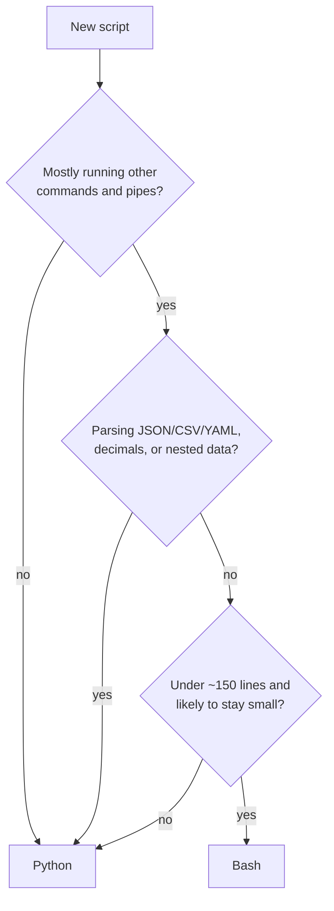
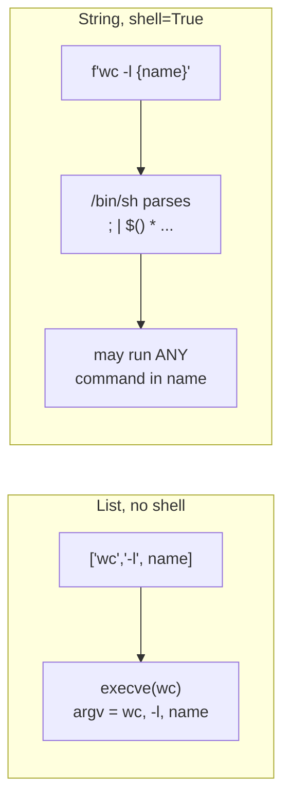

# Bash or Python?

> **Level 2 · Chapter 6** · ⏱️ ~40 min read · Prerequisites: [Arguments and getopts](05-arguments-getopts.md), basic Python

Bash is superb at gluing programs together and terrible at almost everything else. This chapter gives you a practical rule for choosing, rewrites one realistic task in both languages side by side, shows how to run shell commands from Python without opening security holes, and how to call Python from shell scripts.

## Why it matters

Alex's `export.sh` started as 15 lines: dump a table, gzip it, copy it to a share. Over a year it grew to 600 lines. It now parses CSV with `IFS=,`, does money math with `bc`, builds JSON with `printf`, keeps state in four associative arrays, and has a retry loop with exponential backoff.

Then a customer named "Doe, Alex" shows up in the data. The CSV parsing splits the name in two, every column after it shifts by one, and the revenue report is wrong for a week before anyone notices. Fixing it properly in bash means writing a CSV parser in bash.

In Python, the fix is `import csv`. The real mistake wasn't the bug. It was not noticing, around line 150, that the script had stopped being glue and become a program. This chapter teaches you to notice.

## Concepts

### What bash is good at

Bash is a **glue language**. Its job is to start other programs and connect them. It's the best tool available when the work is mostly:

- **Running commands in sequence** with simple checks between them: stop a service, copy files, start it again.
- **Connecting programs with pipes and redirections**: `grep | sort | uniq -c`. Nothing else expresses this as compactly.
- **Working with files and processes at the OS level**: globbing, permissions, environment variables, exit codes, signals.
- **Running anywhere with zero setup.** Bash exists on every Linux machine, in every container image with a shell, and in every CI runner. No packages, no virtual environment.
- **Wrapping a tool** with a few defaults or checks: a five-line wrapper around `rsync` or `pg_dump`.
- **Bootstrapping**: install scripts, entrypoints, and the first thing that runs before Python is even available.

The examples in this level (backups, log searches, file sorting, locking) are bash's sweet spot.

### Where bash hurts

Bash's design is "everything is a string, and words split on spaces." That's great for command lines and painful for data:

| Need | Bash | Python |
| --- | --- | --- |
| Decimal math | Integers only. Shell out to `bc` or `awk` | Built in, plus `decimal` for money |
| Structured data (JSON, YAML, nested records) | Strings and flat arrays. Needs `jq` | `dict`, `list`, `json`, `yaml` |
| Real CSV (quoted fields, embedded commas, newlines) | Easy to get subtly wrong | `csv` module |
| Error handling | Exit codes, `set -e` with many exceptions | Exceptions with tracebacks |
| Functions returning data | Print to stdout and capture | `return` any object |
| Testing | Possible (bats), but awkward | `pytest`, built-in `unittest` |
| Libraries (HTTP, databases, cloud APIs, dates) | External tools: `curl`, `psql`, `date` | Huge standard library, plus PyPI |
| Readability at 500+ lines | Poor | Good |
| Performance in loops | Slow: every external command is a new process | Fast enough for most jobs |
| Portability between machines | bash version, GNU vs BSD tools | Python version, packages |

The performance row deserves a note. Every external command (`sed`, `cut`, `date`, `stat`) costs a `fork()` and an `exec()` (Chapter 1). That's around a millisecond each. A loop that runs three external commands for each of 100,000 lines takes minutes. The same loop in Python, or as one `awk` program, takes about a second.

### A rule of thumb

Switch from bash to Python (or another general-purpose language) when **any** of these become true:

- The script is past **roughly 100–200 lines**, or growing steadily.
- You need **data structures** beyond a flat list or a simple key-value map: records, nesting, lists of lists.
- You're **parsing** structured formats: CSV with quoting, JSON, XML, YAML, or HTML.
- You need **floating-point or decimal math**.
- You need **real error handling**: retries with different behavior per error type, partial failures, or cleanup that depends on what failed.
- You call **APIs, databases, or cloud SDKs** with more than a single `curl` or `psql` command.
- Other people need to **maintain and test** it.
- You keep writing `while read` loops that call external commands on every line.

And stay in bash when the script is mostly a list of commands, especially when it must run before Python exists (installers, container entrypoints) or is a thin wrapper around one tool.



The middle ground is fine too. A bash script can call one small Python snippet for the hard part, and a Python program can call `rsync` for the part `rsync` does best. The examples cover both directions.

### Python's tools that replace bash habits

When you move a script to Python, four standard-library modules cover almost everything bash was doing:

| Bash habit | Python module | What it gives you |
| --- | --- | --- |
| Running commands, `$?`, `$( )` | **`subprocess`** | `subprocess.run([...], check=True, capture_output=True, text=True)` |
| Paths, globs, `[[ -f ]]`, `stat`, `${f%.csv}` | **`pathlib`** | `Path("x").glob("*.csv")`, `.is_file()`, `.stat()`, `.stem`, `.suffix` |
| `getopts`, `usage()`, validation | **`argparse`** | Short and long options, types, choices, defaults, and `-h` generated for you |
| `log()` with timestamps, `VERBOSE` | **`logging`** | Levels, formats, timestamps, and output to stderr or files |

`subprocess.run` deserves a closer look, since it's the bridge between the two worlds:

| Argument | Meaning | Bash equivalent |
| --- | --- | --- |
| `["gzip", "--", path]` | The command as a **list**: program plus arguments, no shell involved | `gzip -- "$path"` with perfect quoting |
| `check=True` | Raise `CalledProcessError` if the exit status isn't 0 | `set -e`, but reliable |
| `capture_output=True` | Collect stdout and stderr instead of printing them | `out=$(cmd 2>err)` |
| `text=True` | Decode output to `str` instead of `bytes` | |
| `timeout=30` | Kill the command and raise `TimeoutExpired` after 30 s | `timeout 30 cmd` |
| `cwd="/srv"`, `env={...}` | Working directory and environment for the child | `(cd /srv && VAR=x cmd)` |
| result `.returncode`, `.stdout`, `.stderr` | What happened | `$?`, captured output |

### Calling the shell from Python safely

`subprocess` can run a command in two ways:

1. **A list of arguments, no shell** (the default): `subprocess.run(["wc", "-l", filename])`. Python passes the list straight to the kernel's `execve()`. Each element becomes exactly one argument. There is no word splitting, no globbing, and no interpretation of `;`, `|`, `$( )`, or quotes. The file name can contain anything and stays one argument.
2. **A string, with `shell=True`**: `subprocess.run(f"wc -l {filename}", shell=True)`. Python starts `/bin/sh -c "wc -l ..."`, and the shell parses the string with all its rules. Anything inside `filename` that the shell finds meaningful *gets interpreted*.

The second form is a **command injection** vulnerability whenever any part of the string comes from outside your code: a file name, a user's input, a web form, a database row, an environment variable. A file named `report.csv; rm -rf ~` is perfectly legal on Linux.



The rules:

- **Use the list form.** It's also faster (no extra shell process) and avoids quoting puzzles.
- **Never use `shell=True` with any untrusted input.**
- If you genuinely need shell features (a pipeline, a glob, redirection), prefer doing that part in Python: `Path.glob()` for globs, `open()` for redirection, `subprocess.PIPE` between two `Popen` calls for pipes.
- If you must build a shell string, escape every outside value with **`shlex.quote()`**, which wraps it in single quotes safely. Treat that as a last resort.
- Remember that `/bin/sh` on Mint is dash. Bash syntax in a `shell=True` string fails.

The same idea applies the other way: never build a command by gluing strings together and then `eval` it in bash.

### Calling Python from the shell

Python fits into shell pipelines like any other command:

- **`python3 -c 'code' args...`** for one-liners. The arguments arrive in `sys.argv[1:]`.
- **`python3 - args... <<'EOF'`** followed by code and `EOF`, for longer inline code. The `-` means "read the program from stdin," and the quoted heredoc stops bash from expanding `$` inside the Python code.
- **A separate `.py` file** once the snippet grows past a dozen lines, so it can be tested and linted.
- **`python3 -m module`** for useful built-in tools: `python3 -m json.tool` pretty-prints JSON, and `python3 -m http.server` serves the current directory.

The contract between them is the usual Unix one: **arguments in, stdout out, stderr for messages, exit status for success.** `sys.exit(n)` sets the exit status. An uncaught exception prints a traceback to stderr and exits with status 1, so `set -e` in the calling bash script stops correctly.

Pass data as **arguments or stdin**, never by pasting bash variables into the Python source text. `python3 -c "print('$name')"` breaks the moment `$name` contains a quote, and it's the same injection problem as `shell=True`.

For scripts with third-party dependencies, give each tool a **virtual environment** (an isolated folder with its own Python packages, created with `python3 -m venv`) and point the shebang at that environment's interpreter: `#!/home/alex/.venvs/tools/bin/python`. On Mint, `pip install` into the system Python is blocked by design. Level 3 covers package installation.

## Commands and examples

### The task: compress old CSV exports

A directory receives daily CSV exports. Files older than N days should be gzipped to save space. The tool needs a dry-run mode, a verbose mode, timestamped logs on stderr, a summary of space saved, and it must handle file names with spaces.

The test directory:

```bash
ls -l exports
```

```text
total 1624
-rw-rw-r-- 1 alex alex      3 Aug 13 11:00 notes.txt
-rw-rw-r-- 1 alex alex 328894 Aug 23 11:00 orders-2026-09-01.csv
-rw-rw-r-- 1 alex alex 328894 Sep 12 11:00 orders-2026-09-15.csv
-rw-rw-r-- 1 alex alex 328894 Oct  2 11:00 orders-2026-10-01.csv
-rw-rw-r-- 1 alex alex 328894 Sep 23 11:00 q3 summary.csv
-rw-rw-r-- 1 alex alex 328894 Sep 20 11:00 users-2026-09-20.csv
```

### The bash version

```bash
#!/usr/bin/env bash
#
# compress-old.sh - gzip CSV files older than N days in a directory.
#
set -euo pipefail

readonly PROG=${0##*/}
days=7 dry_run=0 verbose=0

log()  { printf '%(%Y-%m-%d %H:%M:%S)T %-5s %s\n' -1 "$1" "$2" >&2; }
die()  { log ERROR "$*"; exit 1; }
usage() { echo "Usage: $PROG [-d DAYS] [-n] [-v] DIR"; }

while getopts ":d:nvh" opt; do
    case $opt in
        d) days=$OPTARG ;;
        n) dry_run=1 ;;
        v) verbose=1 ;;
        h) usage; exit 0 ;;
        *) usage >&2; exit 2 ;;
    esac
done
shift $((OPTIND - 1))
(( $# == 1 )) || { usage >&2; exit 2; }
dir=$1
[[ $days =~ ^[0-9]+$ ]] || die "-d must be a non-negative integer"
[[ -d $dir ]] || die "not a directory: $dir"

count=0 saved=0
while IFS= read -r -d '' file; do
    before=$(stat -c %s -- "$file")
    if (( dry_run )); then
        log INFO "would compress $file ($before bytes)"
    else
        gzip -- "$file" || die "gzip failed on $file"
        after=$(stat -c %s -- "$file.gz")
        saved=$(( saved + before - after ))
        if (( verbose )); then log DEBUG "compressed $file: $before -> $after bytes"; fi
    fi
    count=$(( count + 1 ))
done < <(find "$dir" -maxdepth 1 -type f -name '*.csv' -mtime +"$days" -print0)

log INFO "$count file(s) processed, $(( saved / 1024 )) KiB saved"
```

```bash
./compress-old.sh -n exports
./compress-old.sh -v -d 10 exports
ls exports
```

```text
2026-10-02 11:00:15 INFO  would compress exports/orders-2026-09-15.csv (328894 bytes)
2026-10-02 11:00:15 INFO  would compress exports/orders-2026-09-01.csv (328894 bytes)
2026-10-02 11:00:15 INFO  would compress exports/q3 summary.csv (328894 bytes)
2026-10-02 11:00:15 INFO  would compress exports/users-2026-09-20.csv (328894 bytes)
2026-10-02 11:00:15 INFO  4 file(s) processed, 0 KiB saved
2026-10-02 11:00:15 DEBUG compressed exports/orders-2026-09-15.csv: 328894 -> 49944 bytes
2026-10-02 11:00:15 DEBUG compressed exports/orders-2026-09-01.csv: 328894 -> 49944 bytes
2026-10-02 11:00:15 DEBUG compressed exports/users-2026-09-20.csv: 328894 -> 49943 bytes
2026-10-02 11:00:15 INFO  3 file(s) processed, 817 KiB saved
notes.txt
orders-2026-09-01.csv.gz
orders-2026-09-15.csv.gz
orders-2026-10-01.csv
q3 summary.csv
users-2026-09-20.csv.gz
```

43 lines, and every piece is something you learned in this level: `getopts`, validation, `find -print0` with `read -d ''`, process substitution, and logging to stderr. `find` does the hard part (age filtering), and `gzip` does the compression. Bash just connects them. That's a good fit for bash.

### The Python version

```python
#!/usr/bin/env python3
"""compress_old.py - gzip CSV files older than N days in a directory."""

import argparse
import logging
import subprocess
import sys
import time
from pathlib import Path

log = logging.getLogger("compress_old")


def parse_args(argv=None):
    parser = argparse.ArgumentParser(
        description="gzip CSV files older than N days in a directory.")
    parser.add_argument("dir", type=Path, help="directory to scan")
    parser.add_argument("-d", "--days", type=int, default=7,
                        help="minimum age in days (default: %(default)s)")
    parser.add_argument("-n", "--dry-run", action="store_true",
                        help="show what would be done, change nothing")
    parser.add_argument("-v", "--verbose", action="store_true",
                        help="log every file")
    args = parser.parse_args(argv)
    if args.days < 0:
        parser.error("--days must be non-negative")
    if not args.dir.is_dir():
        parser.error(f"not a directory: {args.dir}")
    return args


def old_csv_files(directory: Path, days: int):
    cutoff = time.time() - days * 86400
    for path in sorted(directory.glob("*.csv")):
        if path.is_file() and path.stat().st_mtime < cutoff:
            yield path


def compress(path: Path) -> int:
    """gzip one file; return the number of bytes saved."""
    before = path.stat().st_size
    subprocess.run(["gzip", "--", str(path)], check=True)
    after = path.with_name(path.name + ".gz").stat().st_size
    return before - after


def main(argv=None) -> int:
    args = parse_args(argv)
    logging.basicConfig(
        level=logging.DEBUG if args.verbose else logging.INFO,
        format="%(asctime)s %(levelname)-5s %(message)s",
        datefmt="%Y-%m-%d %H:%M:%S",
    )
    count = saved = 0
    for path in old_csv_files(args.dir, args.days):
        if args.dry_run:
            log.info("would compress %s (%d bytes)", path, path.stat().st_size)
        else:
            try:
                delta = compress(path)
            except subprocess.CalledProcessError as exc:
                log.error("gzip failed on %s (exit %d)", path, exc.returncode)
                return 1
            saved += delta
            log.debug("compressed %s: saved %d bytes", path, delta)
        count += 1
    log.info("%d file(s) processed, %d KiB saved", count, saved // 1024)
    return 0


if __name__ == "__main__":
    sys.exit(main())
```

Run on a fresh copy of the same directory:

```bash
./compress_old.py -n exports
./compress_old.py -v --days 10 exports
```

```text
2026-10-02 11:00:31 INFO  would compress exports/orders-2026-09-01.csv (328894 bytes)
2026-10-02 11:00:31 INFO  would compress exports/orders-2026-09-15.csv (328894 bytes)
2026-10-02 11:00:31 INFO  would compress exports/q3 summary.csv (328894 bytes)
2026-10-02 11:00:31 INFO  would compress exports/users-2026-09-20.csv (328894 bytes)
2026-10-02 11:00:31 INFO  4 file(s) processed, 0 KiB saved
2026-10-02 11:00:31 DEBUG compressed exports/orders-2026-09-01.csv: saved 278950 bytes
2026-10-02 11:00:31 DEBUG compressed exports/orders-2026-09-15.csv: saved 278950 bytes
2026-10-02 11:00:31 DEBUG compressed exports/users-2026-09-20.csv: saved 278951 bytes
2026-10-02 11:00:31 INFO  3 file(s) processed, 817 KiB saved
```

Same behavior, same output format. Bad input and help come for free from `argparse`:

```bash
./compress_old.py -d ten exports; echo "exit=$?"
./compress_old.py -h
```

```text
usage: compress_old.py [-h] [-d DAYS] [-n] [-v] dir
compress_old.py: error: argument -d/--days: invalid int value: 'ten'
exit=2
usage: compress_old.py [-h] [-d DAYS] [-n] [-v] dir

gzip CSV files older than N days in a directory.

positional arguments:
  dir                   directory to scan

options:
  -h, --help            show this help message and exit
  -d DAYS, --days DAYS  minimum age in days (default: 7)
  -n, --dry-run         show what would be done, change nothing
  -v, --verbose         log every file
```

### Comparing them, section by section

| Concern | Bash | Python |
| --- | --- | --- |
| Option parsing | `getopts` loop plus `case`, manual integer check, hand-written `usage` | `argparse`: types, defaults, long options, `-h`, and error messages generated |
| Finding old files | `find -mtime +N -print0` and `read -d ''` | `Path.glob()` and `stat().st_mtime < cutoff` |
| Running gzip | `gzip -- "$file" || die` | `subprocess.run([...], check=True)` raising on failure |
| Logging | Custom `log()` with `printf '%(...)T'` | `logging.basicConfig(format=..., level=...)` |
| Error flow | `set -e`, `|| die`, exit codes | Exceptions, caught where you can do something useful |
| Testability | Run it and check files | `main(["-n", "dir"])` can be called from a unit test |
| Length | 43 lines | 72 lines |

Neither is wrong. For *this* task, the bash version is shorter and perfectly clear, because the work is "find files, run gzip." The Python version starts to win as soon as requirements grow. Upload to S3 after compressing, write a JSON report, skip files listed in a YAML config, and retry uploads with backoff: each of those is a few lines in Python and a struggle in bash.

!!! warning "Common mistake: `find -mtime +7` is not 'older than 7 days'"
    `find` measures age in whole days and **drops the fraction**, so `-mtime +7` means "8 or more full days old." The Python version compares exact seconds, so its `--days 7` means "more than 7 × 24 hours." For a file 7.5 days old they disagree. When you port a script, port its *exact* semantics and test the edge cases. Off-by-one-day bugs in retention scripts delete data a day early.

### Where bash breaks: quoted CSV

```text
id,customer,amount
1,"Doe, Alex",20.50
2,Sam Lee,13.00
3,"Kim, Jo",7.25
```

Bash with `IFS=,`:

```bash
while IFS=, read -r id customer amount; do
    printf '%s | %s | %s\n' "$id" "$customer" "$amount"
done < <(tail -n +2 payments.csv)
```

```text
1 | "Doe |  Alex",20.50
2 | Sam Lee | 13.00
3 | "Kim |  Jo",7.25
```

Python's `csv` module understands quoting, and summing decimals is trivial:

```python
import csv

with open("payments.csv", newline="") as f:
    rows = list(csv.DictReader(f))
for r in rows:
    print(r["id"], "|", r["customer"], "|", r["amount"])
print("total:", sum(float(r["amount"]) for r in rows))
```

```text
1 | Doe, Alex | 20.50
2 | Sam Lee | 13.00
3 | Kim, Jo | 7.25
total: 40.75
```

(For real money, use `decimal.Decimal` instead of `float` to avoid rounding surprises.)

### Calling shell commands from Python: the injection demo

```python
import subprocess

filename = "report.csv; echo INJECTED: this could have been rm -rf ~"

print("--- shell=True with an f-string (DANGEROUS)")
subprocess.run(f"wc -l {filename}", shell=True)

print("--- list of arguments (safe)")
subprocess.run(["wc", "-l", filename])
```

```bash
python3 inject.py
```

```text
--- shell=True with an f-string (DANGEROUS)
3 report.csv
INJECTED: this could have been rm -rf /home/alex
--- list of arguments (safe)
wc: 'report.csv; echo INJECTED: this could have been rm -rf ~': No such file or directory
```

With `shell=True`, the shell saw `;` and ran a **second command** taken from the data. It even expanded `~` to your home directory. With the list form, `wc` received the whole string as one file name and reported, correctly, that no such file exists.

Everyday `subprocess` usage:

```python
import subprocess

# Capture output as text, raise if the command fails.
result = subprocess.run(
    ["df", "--output=pcent", "/"],
    capture_output=True, text=True, check=True,
)
print("stdout:", repr(result.stdout))
used = int(result.stdout.splitlines()[1].strip().rstrip("%"))
print("root filesystem used:", used, "%")

# A command that fails: check=True turns it into an exception.
try:
    subprocess.run(["ls", "/nope"], capture_output=True, text=True, check=True)
except subprocess.CalledProcessError as exc:
    print("failed with", exc.returncode, "stderr:", exc.stderr.strip())

# Without check=True you inspect returncode yourself.
r = subprocess.run(["grep", "-q", "ERROR", "report.csv"])
print("grep returncode:", r.returncode)

# A timeout stops runaway commands.
try:
    subprocess.run(["sleep", "5"], timeout=1)
except subprocess.TimeoutExpired:
    print("sleep timed out after 1s")
```

```text
stdout: 'Use%\n 33%\n'
root filesystem used: 33 %
failed with 2 stderr: ls: cannot access '/nope': No such file or directory
grep returncode: 1
sleep timed out after 1s
```

`grep` returning 1 ("no match") is not an error, which is why that call leaves out `check=True`. Exactly like `|| true` in bash.

When you truly need a shell string, quote outside values with `shlex.quote`. Better yet, build the pipeline without a shell:

```python
import shlex
import subprocess

filename = "report.csv; echo INJECTED"
cmd = f"wc -l {shlex.quote(filename)} 2>&1 | tr a-z A-Z"
print(cmd)
subprocess.run(cmd, shell=True)

# The same pipeline with no shell at all:
grep = subprocess.Popen(["grep", "-v", "^id", "report.csv"], stdout=subprocess.PIPE)
wc = subprocess.run(["wc", "-l"], stdin=grep.stdout, capture_output=True, text=True)
grep.stdout.close()
grep.wait()
print("rows:", wc.stdout.strip())
```

```text
wc -l 'report.csv; echo INJECTED' 2>&1 | tr a-z A-Z
WC: 'REPORT.CSV; ECHO INJECTED': NO SUCH FILE OR DIRECTORY
rows: 2
```

`shlex.quote` wrapped the value in single quotes, so the `;` stayed inside the file name. The `Popen` version connects `grep`'s stdout to `wc`'s stdin directly. That's a real pipe, set up by Python instead of a shell. (Level 5 explains pipes at the system-call level.)

The bad-to-good rewrite you'll do most often:

=== "Dangerous"

    ```python
    out = subprocess.check_output(f"du -sh {path}", shell=True, text=True)
    size = out.split()[0]
    ```

=== "Safe"

    ```python
    result = subprocess.run(["du", "-sh", "--", path],
                            capture_output=True, text=True, check=True)
    size = result.stdout.split("\t", 1)[0]
    ```

### Calling Python from shell scripts

One-liners with arguments:

```bash
python3 -c 'import sys; print(sum(int(a) for a in sys.argv[1:]))' 4 8 15
```

```text
27
```

JSON on stdin. Bash has no JSON parser, but Python does:

```bash
python3 -c 'import json,sys; d=json.load(sys.stdin); print(d["host"], d["port"])' <<< '{"host": "mint", "port": 5432}'
echo '{"name":"alex","roles":["dev","ops"]}' | python3 -m json.tool
```

```text
mint 5432
{
    "name": "alex",
    "roles": [
        "dev",
        "ops"
    ]
}
```

(The `jq` tool, installed with `sudo apt install jq`, is the shell-native alternative for JSON.)

A longer snippet as a quoted heredoc, with the result captured into a bash variable:

```bash
#!/usr/bin/env bash
# avg.sh - average of the "amount" column, using Python for the CSV and the math.
set -euo pipefail
file=${1:?usage: avg.sh FILE.csv}

avg=$(python3 - "$file" <<'EOF'
import csv
import sys

with open(sys.argv[1], newline="") as f:
    amounts = [float(row["amount"]) for row in csv.DictReader(f)]
print(f"{sum(amounts) / len(amounts):.2f}")
EOF
)
echo "average amount: $avg"
```

```bash
./avg.sh payments.csv
printf 'id,customer,amount\n' > empty.csv
./avg.sh empty.csv; echo "exit=$?"
```

```text
average amount: 13.58
Traceback (most recent call last):
  File "<stdin>", line 6, in <module>
ZeroDivisionError: division by zero
exit=1
```

Notice:

- `python3 - "$file"` passes the file name as an **argument**. It's never pasted into the code.
- `<<'EOF'` is quoted, so bash leaves the Python source alone. `$` and backslashes pass through untouched.
- When Python failed, its exit status 1 made the command substitution fail, and `set -e` stopped the script before it printed a wrong average.

Exit codes cross the boundary as you'd expect:

```bash
python3 -c 'import sys; sys.exit(3)'; echo "python exit=$?"
```

```text
python exit=3
```

## Exercises

### Exercise 1: Pick the tool (easy)

For each task, choose bash or Python and give a one-line reason:

1. A container entrypoint that waits for the database port, runs migrations with an existing CLI, then starts the app.
2. Merge three JSON API responses, compute average order value per country, and write an Excel-friendly CSV.
3. A nightly job that runs `pg_dump`, gzips the output, and deletes dumps older than 14 days.
4. A tool that reads a YAML list of 40 servers, checks each one's HTTPS certificate expiry in parallel, and posts a summary to a chat webhook.
5. A wrapper that runs `rsync` with your standard flags and a log file name containing the date.

??? success "Solution"

    1. **Bash**: it's a sequence of commands, runs before anything else, and the image may not even have Python.
    2. **Python**: JSON, grouping, decimal math, and CSV quoting are exactly bash's weak spots.
    3. **Bash**: three commands glued together, each one doing the real work. (This is the capstone.)
    4. **Python**: structured config, concurrency, TLS/date handling, and an HTTP POST with JSON. All of those are libraries in Python and painful in bash.
    5. **Bash**: a thin wrapper around one tool is bash's home turf.

### Exercise 2: Borrow Python's math (easy)

Bash can't average decimals. Write `avg.sh FILE.csv` that prints the average of the `amount` column of `payments.csv` (with the quoted names) to two decimal places, by running an inline Python heredoc. Pass the file name as an argument, not by inserting it into the code. Confirm that an empty CSV makes the script exit non-zero.

??? success "Solution"

    This is the `avg.sh` from the examples:

    ```bash
    #!/usr/bin/env bash
    set -euo pipefail
    file=${1:?usage: avg.sh FILE.csv}

    avg=$(python3 - "$file" <<'EOF'
    import csv
    import sys

    with open(sys.argv[1], newline="") as f:
        amounts = [float(row["amount"]) for row in csv.DictReader(f)]
    print(f"{sum(amounts) / len(amounts):.2f}")
    EOF
    )
    echo "average amount: $avg"
    ```

    ```text
    average amount: 13.58
    ```

    The empty file raises `ZeroDivisionError`, Python exits 1, and `set -e` stops the script. A friendlier version would check `if not amounts: sys.exit("no rows")`, which prints the message to stderr and exits 1.

### Exercise 3: Fix the injection (medium)

This function is called with paths that come from a web form. Explain two ways it can go wrong, then rewrite it safely.

```python
import subprocess

def disk_usage(path):
    out = subprocess.check_output(f"du -sh {path}", shell=True, text=True)
    return out.split()[0]
```

??? success "Solution"

    Problems:

    - **Injection**: a path like `x; rm -rf ~` runs a second command, because the shell parses `;`.
    - **Breakage**: a legitimate path with a space, like `q3 data`, becomes two arguments:

    ```text
    du: cannot access 'q3': No such file or directory
    du: cannot access 'data': No such file or directory
    ...
    subprocess.CalledProcessError: Command 'du -sh q3 data' returned non-zero exit status 1.
    ```

    Safe version:

    ```python
    import subprocess

    def disk_usage(path: str) -> str:
        result = subprocess.run(
            ["du", "-sh", "--", path],
            capture_output=True, text=True, check=True,
        )
        return result.stdout.split("\t", 1)[0]
    ```

    ```bash
    python3 du_good.py "q3 data"
    ```

    ```text
    104K
    ```

    The list form passes the path as exactly one argument. `--` stops `du` from treating a path starting with `-` as an option. `du` separates size and path with a tab, so splitting on the first tab works even if the path has spaces. A path of `q3 data; echo pwned` now simply doesn't exist, and `check=True` raises an error.

### Exercise 4: Port the sales summary (medium)

Rewrite Chapter 3's `sales-summary.sh` (total units per customer from `sales.csv`, sorted by total, highest first, with a row count) in Python using `argparse`, `csv.DictReader`, and `collections.Counter`. A missing file should produce a clean error and exit 2.

??? success "Solution"

    ```python
    #!/usr/bin/env python3
    """sales_summary.py - total units per customer from a CSV."""
    import argparse
    import csv
    import sys
    from collections import Counter


    def main() -> int:
        parser = argparse.ArgumentParser(description=__doc__)
        parser.add_argument("file", type=argparse.FileType("r", encoding="utf-8"))
        args = parser.parse_args()

        units = Counter()
        rows = 0
        with args.file as f:
            for row in csv.DictReader(f):
                if not row.get("customer"):
                    continue                      # skip blank lines
                units[row["customer"]] += int(row["units"])
                rows += 1

        print(f"rows: {rows}")
        for customer, total in units.most_common():
            print(f"{customer:<6} {total:3d}")
        return 0


    if __name__ == "__main__":
        sys.exit(main())
    ```

    ```bash
    ./sales_summary.py sales.csv
    ./sales_summary.py nope.csv; echo "exit=$?"
    ```

    ```text
    rows: 5
    sam      9
    alex     5
    kim      1
    usage: sales_summary.py [-h] file
    sales_summary.py: error: argument file: can't open 'nope.csv': [Errno 2] No such file or directory: 'nope.csv'
    exit=2
    ```

    `Counter.most_common()` replaces the `| sort -k2,2nr` pipeline. `argparse.FileType` opens the file and turns a failure into a usage error. Quoted names with commas now work too.

### Exercise 5: Port `logsearch.sh` (hard)

Port Chapter 5's `logsearch.sh` to Python. Requirements: one or more files; `-l/--level` with choices DEBUG, INFO, WARN, ERROR, case-insensitive input, default ERROR; `-n/--max` (non-negative int, 0 = unlimited); `-i/--ignore-case`; `-v/--verbose` printing `== file ==` to stderr. An unreadable file prints an error, the remaining files are still searched, and the exit status is 2. Compare the error messages with the bash version.

??? success "Solution"

    ```python
    #!/usr/bin/env python3
    """logsearch.py - show log lines at a given level from one or more log files."""
    import argparse
    import re
    import sys

    LEVELS = ["DEBUG", "INFO", "WARN", "ERROR"]


    def parse_args():
        p = argparse.ArgumentParser(description=__doc__)
        p.add_argument("files", nargs="+", metavar="FILE", help="log files to search")
        p.add_argument("-l", "--level", default="ERROR", type=str.upper,
                       choices=LEVELS, help="level to show (default: %(default)s)")
        p.add_argument("-n", "--max", type=int, default=0, metavar="MAX",
                       help="at most MAX matches per file (default: all)")
        p.add_argument("-i", "--ignore-case", action="store_true")
        p.add_argument("-v", "--verbose", action="store_true")
        args = p.parse_args()
        if args.max < 0:
            p.error("--max must be non-negative")
        return args


    def main() -> int:
        args = parse_args()
        flags = re.IGNORECASE if args.ignore_case else 0
        pattern = re.compile(rf" {args.level} ", flags)
        status = 0
        for name in args.files:
            if args.verbose:
                print(f"== {name} ==", file=sys.stderr)
            try:
                with open(name, encoding="utf-8", errors="replace") as f:
                    shown = 0
                    for line in f:
                        if pattern.search(line):
                            sys.stdout.write(line)
                            shown += 1
                            if args.max and shown >= args.max:
                                break
            except OSError as exc:
                print(f"logsearch.py: {exc}", file=sys.stderr)
                status = 2
        return status


    if __name__ == "__main__":
        sys.exit(main())
    ```

    ```bash
    ./logsearch.py --level=warn app.log
    ./logsearch.py -l FATAL app.log; echo "exit=$?"
    ./logsearch.py nope.log app.log; echo "exit=$?"
    ```

    ```text
    2026-10-01 10:00:09 WARN  api: slow request /orders 2.1s
    usage: logsearch.py [-h] [-l {DEBUG,INFO,WARN,ERROR}] [-n MAX] [-i] [-v]
                        FILE [FILE ...]
    logsearch.py: error: argument -l/--level: invalid choice: 'FATAL' (choose from 'DEBUG', 'INFO', 'WARN', 'ERROR')
    exit=2
    logsearch.py: [Errno 2] No such file or directory: 'nope.log'
    2026-10-01 10:00:05 ERROR db: connection refused (host=db1)
    2026-10-01 10:01:13 ERROR db: connection refused (host=db1)
    exit=2
    ```

    The last command used the default level, ERROR. `type=str.upper` normalizes before `choices` is checked, replacing `${level^^}` plus the `case`. Long options, `--level=warn`, and the help text come free. Unlike the bash version, which validated all files up front, this one reports the bad file and keeps going. Choose whichever behavior your users need, and document it.

## Check yourself

1. Name three signs that a bash script should become a Python program.

    ??? note "Answer"

        Any three of: it's past ~100–200 lines and growing; it needs nested or structured data; it parses JSON/CSV/YAML; it needs decimal math; it needs nuanced error handling and retries; it talks to APIs or databases beyond one CLI call; others must maintain and test it; it loops over many lines calling external commands each time.

2. Why are loops that call external commands on every line slow in bash?

    ??? note "Answer"

        Every external command requires creating a new process (fork plus exec), which costs roughly a millisecond. Over hundreds of thousands of lines that adds up to minutes. Python (or a single `awk` program) processes lines inside one process.

3. What's the difference between `subprocess.run(["rm", path])` and `subprocess.run(f"rm {path}", shell=True)`?

    ??? note "Answer"

        The list form runs `rm` directly with `path` as exactly one argument; no shell interprets it. The string form runs `/bin/sh -c`, which word-splits, globs, and interprets `;`, `|`, `$( )` in `path`, so a crafted or merely unusual path can break the command or run arbitrary commands (command injection).

4. When might you use `shlex.quote()`, and what's usually better?

    ??? note "Answer"

        When you must build a shell command string (for `shell=True` or an `ssh` remote command) containing outside values; `shlex.quote` makes each value a single safe shell word. Usually better: avoid the shell entirely with the list form, and do globbing, redirection, and pipes in Python.

5. What do `check=True`, `capture_output=True`, and `text=True` do in `subprocess.run`?

    ??? note "Answer"

        `check=True` raises `CalledProcessError` on a non-zero exit status. `capture_output=True` collects stdout and stderr into the result instead of letting them print. `text=True` decodes them to strings instead of bytes.

6. How do you pass a bash variable into inline Python code safely?

    ??? note "Answer"

        As an argument (`python3 -c '...' "$var"` or `python3 - "$var" <<'EOF'`, read via `sys.argv`), via stdin, or via an exported environment variable read with `os.environ`. Never by interpolating it into the Python source text, which breaks on quotes and allows code injection.

7. How does a Python script signal failure to the bash script that called it?

    ??? note "Answer"

        Through its exit status: `sys.exit(n)` with non-zero `n`, or an uncaught exception (which exits with status 1 after printing a traceback to stderr). Bash sees it in `$?`, `if`, `&&`/`||`, and `set -e`.

## Key takeaways

- Bash is glue: sequences of commands, pipes, files, and processes, with zero setup. Keep scripts short and focused.
- Move to Python for data structures, real parsing, decimal math, rich error handling, APIs, tests, or more than ~150 lines.
- `subprocess` with a **list** of arguments plus `pathlib`, `argparse`, and `logging` replace nearly every bash habit.
- Never use `shell=True` with untrusted input. If you must build a shell string, `shlex.quote` every outside value.
- Call Python from bash with `python3 -c` or a quoted heredoc. Pass data as arguments or stdin, and rely on exit codes.
- When porting, port the exact semantics (like `find -mtime` rounding) and test the edge cases.

## Next

You've finished the Level 2 chapters. Prove the skills with the [Level 2 capstone](../../exercises/level-2-capstone.md): a real backup script with options, logging, rotation, and a dry-run mode.
