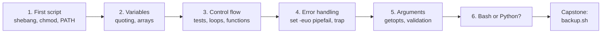

# Level 2: Shell scripting

> **Level 2 overview** · ⏱️ ~15–20 hours including exercises and the capstone · Prerequisites: [Level 1: Command-line fluency](../01-command-line/index.md)

In Level 1 you learned to type powerful commands. In Level 2 you learn to **save them as programs**: scripts that take options, make decisions, handle errors, clean up after themselves, and run unattended. By the end you'll have written a backup tool you can trust with real data.

## What this level covers

Bash is two things at once: the interactive shell you type into, and a programming language. This level treats it as a language. It starts from a single file with a shebang line, then adds variables and the quoting rules behind most shell bugs, control flow and functions, then the habits that separate a fragile script from a reliable one: strict mode, traps, logging, and ShellCheck. It finishes with command-line options, and with an honest look at when bash is the wrong tool and Python is the right one.

## What you'll be able to do

When you finish this level, you'll be able to:

- Write, run, and install scripts as commands on your `PATH`, and explain what the kernel does with a shebang line.
- Predict exactly how bash expands a line: quoting, word splitting, globbing, and parameter expansion. Quote correctly by habit.
- Store lists and maps in arrays, and handle file names with spaces (or even newlines) without bugs.
- Use `[[ ]]`, `(( ))`, `case`, every loop form, and functions that return data and status correctly.
- Read files line by line correctly, and avoid the pipe-into-`while` subshell trap.
- Make scripts fail fast with `set -euo pipefail`, knowing exactly where it doesn't protect you.
- Clean up temp files and locks with `trap`, even on ++ctrl+c++ and `kill`.
- Debug with `bash -x` and `PS4`, and catch bugs before running with `bash -n` and ShellCheck.
- Give scripts real options with `getopts` and long options, validate all input, and layer defaults, config files, and environment variables.
- Decide when a script should become Python, and call each language from the other safely.

## Chapters

| # | Chapter | What you'll learn | Time |
| --- | --- | --- | --- |
| 1 | [Your first script](01-first-script.md) | What a script is, the shebang and what the kernel does with it, `chmod +x`, `./` vs `bash` vs `source`, `PATH`, `echo` vs `printf`, `read`, ShellCheck, and a style template | ~40 min |
| 2 | [Variables, quoting, and arrays](02-variables-quoting-arrays.md) | Assignment, the quoting rules in depth, `IFS`, `"$@"`, parameter expansion, `$( )`, arithmetic, scope, `export`, `declare`, indexed and associative arrays, `mapfile` | ~55 min |
| 3 | [Conditionals, loops, and functions](03-control-flow-functions.md) | Exit codes, `test` vs `[` vs `[[`, string/number/file tests, `case`, `for`/`while`/`until`, reading files correctly, functions, the pipe subshell pitfall | ~55 min |
| 4 | [Error handling](04-error-handling.md) | `set -e` and its exceptions, `set -u`, `pipefail`, `set -x` and `PS4`, `trap`, `mktemp`, stderr, `die`, exit codes, logging, ShellCheck codes, `bash -n` | ~55 min |
| 5 | [Arguments and getopts](05-arguments-getopts.md) | Positional parameters, `shift`, `usage()`, `getopts` (including silent mode), long options by hand, validation, defaults, config files and env vars | ~45 min |
| 6 | [Bash or Python?](06-bash-vs-python.md) | When bash is right, when to switch, one task in both languages, `subprocess` without `shell=True`, calling Python from shell | ~40 min |

Reading time is about five hours. Budget the same again for the exercises. Each chapter has 3–5, from easy to hard, with collapsible solutions.

## How to work through this level

- **Type every example.** Make a `~/scripts` folder and keep everything there, ideally in Git. Scripts you write now become your personal toolbox.
- **Install ShellCheck on day one** (`sudo apt install shellcheck`) and run it on every script you save. Each warning links to an explanation, which makes it a free tutor.
- **Break things on purpose.** Remove a pair of quotes, delete `set -e`, feed a file name with a space. Seeing the failure is how the rule sticks.
- **Practice in scratch directories.** Scripts that delete or move files should be tested on throwaway folders under `~/scratch` first. Nothing in this level needs root or touches system files.
- **Keep the [Bash scripting cheat sheet](../../cheatsheets/bash-scripting.md) open** while you work, and add to your "mistakes I made" log in `notes/` every time a quoting or `set -e` surprise bites you.

A sensible pace is one chapter every two or three days, followed by a week for the capstone.

## Capstone

The [Level 2 capstone](../../exercises/level-2-capstone.md) is a backup script with options (`-s`, `-d`, `-k`, `-n`, `-v`, `-h`), timestamped logging, rotation of old backups, a dry-run mode, and cleanup on failure, and it must pass ShellCheck with no warnings. It uses every chapter in this level. In Level 4 you'll schedule it to run every night.

Don't move on to [Level 3: How Linux works](../03-internals/index.md) until your capstone passes every acceptance check without looking at notes.

## Start

Begin with [Your first script](01-first-script.md).
