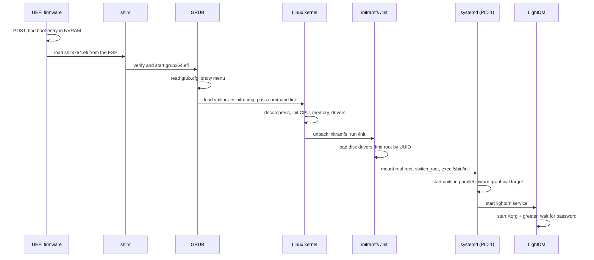
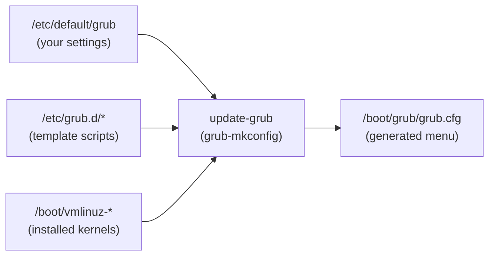
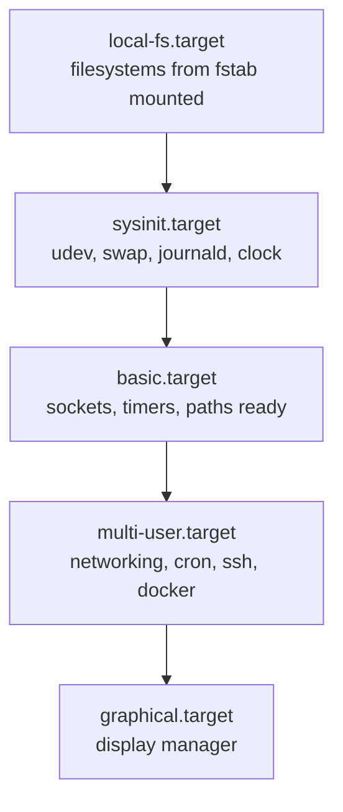

# The boot process

> **Level 3 · Chapter 1** · ⏱️ ~45 min read · Prerequisites: [The filesystem layout](../00-first-steps/05-filesystem-layout.md), [Users, groups, and sudo](../00-first-steps/06-users-groups-sudo.md)

Every time you press the power button, five different programs hand control to each other before you see a login screen. This chapter follows that relay race from firmware to desktop and shows you how to watch each handoff on your own machine.

## Why it matters

Alex installs a new graphics driver on a Friday evening, reboots, and gets a black screen. No error, no cursor, nothing.

Someone who sees the computer as one black box would reinstall Linux. Alex instead asks: *which stage failed?* The firmware logo appeared, so the firmware is fine. The disk light blinked for a while, so the kernel probably loaded. The screen went black exactly when the graphical login should have appeared. That points at the last stage: the display server that draws the login screen.

So Alex reboots, opens the GRUB menu, adds `systemd.unit=multi-user.target` to the kernel command line for that one boot, and lands on a text login. From there, Alex reads `journalctl -b -1` (the log of the previous, failed boot), finds the driver error, and removes the driver. The fix takes ten minutes instead of an evening.

Every step of that rescue relies on knowing the boot chain. That's what this chapter builds.

## Concepts

### The big picture

Booting is a chain of programs. Each one is small and limited, and its only job is to find, load, and start the next, more capable program. People call this **bootstrapping**, from the old phrase "pulling yourself up by your bootstraps". That's where the word **boot** comes from.

On a Linux Mint 22.3 laptop the chain looks like this:



Each arrow is a handoff. If the boot breaks, it breaks at one specific arrow, and the symptoms tell you which.

### Stage 1: The firmware

**Firmware** is software stored in a flash chip on the motherboard. It runs before anything on your disk. It's the first code the CPU executes after power-on.

The firmware's first job is the **POST** (power-on self-test): a quick check that the CPU, RAM, and essential hardware respond. If RAM is missing or broken, POST fails and you usually hear beeps or see an LED code instead of a logo. Nothing Linux-related has happened yet.

After POST, the firmware initializes enough hardware to read a disk, then looks for something to boot.

#### UEFI and legacy BIOS

There are two families of PC firmware:

| | Legacy BIOS | UEFI |
|---|---|---|
| Age | 1980s design | Modern standard (2005 onwards) |
| How it finds the bootloader | Runs 446 bytes of code from the first sector of the disk (the **MBR**, master boot record) | Reads a real filesystem and runs an `.efi` program file |
| Boot configuration | Boot order only | Named boot entries stored in **NVRAM** |
| Partition table | Usually MBR (max 2 TiB disks) | GPT (huge disks, 128 partitions) |
| Secure Boot | No | Yes |

**UEFI** (Unified Extensible Firmware Interface) replaced the **BIOS** (Basic Input/Output System) on almost every PC sold in the last decade. People still say "BIOS settings" out of habit even when the machine runs UEFI. This chapter focuses on UEFI because that's what you almost certainly have. You can check:

```bash
ls /sys/firmware/efi > /dev/null 2>&1 && echo "UEFI boot" || echo "Legacy BIOS boot"
```

```text
UEFI boot
```

That directory only exists when the kernel was started by UEFI firmware.

#### The EFI System Partition

UEFI firmware can read FAT32 filesystems. So the disk contains a small FAT32 partition called the **ESP** (EFI System Partition), usually 100 MB to 1 GB, which holds bootloader programs as ordinary files. On Mint it's mounted at `/boot/efi`:

```text
/boot/efi/
└── EFI/
    ├── ubuntu/            ← Mint uses "ubuntu" here for compatibility
    │   ├── shimx64.efi    ← first stage, signed by Microsoft
    │   ├── grubx64.efi    ← GRUB, signed by Canonical
    │   ├── mmx64.efi      ← MOK manager (key enrolment tool)
    │   ├── grub.cfg       ← tiny stub that points to /boot/grub/grub.cfg
    │   └── BOOTX64.CSV
    ├── BOOT/
    │   └── BOOTX64.EFI    ← fallback loader the firmware tries if no entry works
    └── Microsoft/         ← only on dual-boot machines
```

The directory is called `ubuntu` even on Mint. Mint inherits its boot packages from Ubuntu, and a few of them hardcode that path, so Mint sets `GRUB_DISTRIBUTOR="Ubuntu"` to keep everything consistent. You'll see this in `/etc/default/grub.d/50_linuxmint.cfg`.

!!! note "You can't list /boot/efi as a normal user"
    Mint mounts the ESP with `umask=0077`, so only root can read it. That's deliberate: there's no reason for normal programs to touch bootloaders. Use `sudo ls -R /boot/efi/EFI` if you want to look.

#### NVRAM boot entries

UEFI stores its boot menu in **NVRAM** (non-volatile RAM), a small storage area on the motherboard that survives power-off. Each entry is a variable named `Boot0000`, `Boot0001`, and so on. Each entry says "on this partition, run this file". A separate `BootOrder` variable lists which entries to try first.

When you install Mint, the installer creates an entry called "ubuntu" that points at `\EFI\ubuntu\shimx64.efi` on the ESP. You can read these entries with `efibootmgr`, shown later.

#### Secure Boot and shim

**Secure Boot** is a UEFI feature that only runs bootloaders carrying a valid cryptographic signature. The firmware ships with a database of trusted keys, and on almost every PC the main one belongs to Microsoft. Its purpose is to stop malware that hides in the boot process (a **bootkit**), because unsigned code simply won't run.

That raises a problem: Linux distributions don't control Microsoft's keys. The solution is **shim**, a tiny first-stage bootloader:

1. Microsoft signs shim once (after a review process).
2. shim contains the distribution's own certificate (Canonical's, for Ubuntu and Mint).
3. The firmware trusts shim because of Microsoft's signature.
4. shim trusts GRUB and the kernel because they're signed by Canonical.

So the chain of trust is firmware → shim → GRUB → kernel. Each link verifies the next.

If you build your own kernel module (for example a VirtualBox or NVIDIA driver via **DKMS**, a system that rebuilds modules for each kernel), it isn't signed by Canonical. shim handles this with **MOK** (Machine Owner Key): you create your own key, enrol it through a blue MokManager screen at the next boot, and from then on modules signed with your key are trusted. When Secure Boot is on, the kernel also enters **lockdown** mode, which blocks some low-level actions such as loading unsigned modules.

Check your Secure Boot state without root:

```bash
mokutil --sb-state
```

```text
SecureBoot enabled
```

### Stage 2: GRUB, the bootloader

A **bootloader** is a program whose job is to load the operating system kernel into memory and start it. Mint uses **GRUB** (GRand Unified Bootloader). GRUB is surprisingly capable: it understands ext4, Btrfs, LVM, and other filesystems, so it can read files from `/boot` directly.

Here's what GRUB does, in order:

1. The firmware (via shim) starts `grubx64.efi`.
2. GRUB reads the tiny stub `grub.cfg` on the ESP. The stub says "find the filesystem with this UUID and load `/boot/grub/grub.cfg` from it".
3. GRUB reads the real `/boot/grub/grub.cfg` and builds the menu.
4. If the menu is hidden (Mint's default), GRUB waits briefly for a key, then picks the default entry.
5. GRUB loads two files into RAM: the kernel (`/boot/vmlinuz-...`) and the initial RAM filesystem (`/boot/initrd.img-...`).
6. GRUB jumps into the kernel, handing it the **kernel command line**, a string of settings.

#### Where GRUB's configuration comes from

`/boot/grub/grub.cfg` is a generated file. You never edit it by hand. Its first line says so:

```text
#
# DO NOT EDIT THIS FILE
#
# It is automatically generated by grub-mkconfig using templates
# from /etc/grub.d and settings from /etc/default/grub
#
```

The generation pipeline:



`update-grub` runs the scripts in `/etc/grub.d/` in order (`10_linux` finds installed kernels, `30_os-prober` finds Windows, and so on). They read the variables from `/etc/default/grub` and the `/etc/default/grub.d/*.cfg` overrides. The output is the menu. Kernel package upgrades run `update-grub` automatically, which is why a new kernel shows up after updates without you doing anything.

Mint's `/etc/default/grub` looks like this (comments trimmed):

```ini
GRUB_DEFAULT=0
GRUB_TIMEOUT_STYLE=hidden
GRUB_TIMEOUT=10
GRUB_DISTRIBUTOR=`( . /etc/os-release; echo ${NAME:-Ubuntu} ) 2>/dev/null || echo Ubuntu`
GRUB_CMDLINE_LINUX_DEFAULT="quiet splash"
GRUB_CMDLINE_LINUX=""
```

| Variable | Meaning |
|---|---|
| `GRUB_DEFAULT=0` | Boot the first menu entry unless you choose otherwise |
| `GRUB_TIMEOUT_STYLE=hidden` | Don't draw the menu; just wait for a key during the timeout |
| `GRUB_TIMEOUT=10` | Seconds to wait before booting the default |
| `GRUB_CMDLINE_LINUX_DEFAULT` | Extra kernel parameters for normal boots (not recovery entries) |
| `GRUB_CMDLINE_LINUX` | Kernel parameters for every entry, including recovery |

To see a hidden menu, press ++esc++ during boot on a UEFI machine (tap it once or twice, not repeatedly, or you drop to a `grub>` prompt), or hold ++shift++ on a legacy BIOS machine. On dual-boot machines where GRUB found Windows, the menu is shown automatically.

#### The kernel command line

The **kernel command line** is a space-separated list of parameters GRUB passes to the kernel, like command-line arguments to a program. Mint's default line:

```text
BOOT_IMAGE=/boot/vmlinuz-6.14.0-37-generic root=UUID=3f2a6c1e-8b4d-4e2a-9c7f-1d5e8a0b9c42 ro quiet splash
```

| Parameter | Meaning |
|---|---|
| `BOOT_IMAGE=...` | Which kernel file GRUB loaded (informational, added by GRUB) |
| `root=UUID=...` | Which filesystem becomes `/`. A UUID survives disk renaming |
| `ro` | Mount root read-only at first, so it can be checked safely; systemd remounts it read-write later |
| `quiet` | Print fewer kernel messages to the screen |
| `splash` | Show the graphical boot animation (Plymouth) instead of text |

Other parameters you'll meet when troubleshooting: `nomodeset` (don't let graphics drivers change the display mode; the classic black-screen workaround), `systemd.unit=multi-user.target` (boot to text mode for this boot), `systemd.unit=rescue.target` (single-user rescue shell), and `init=/bin/bash` (skip systemd entirely; last-resort recovery).

Programs that run later can read the line that was actually used from `/proc/cmdline`.

### Stage 3: The kernel

The **kernel** is the core of the operating system. It's the one program that talks directly to hardware and decides which other programs run, what memory they get, and which files they can touch. On Mint it lives in `/boot/vmlinuz-<version>`.

#### Decompression and hardware setup

`vmlinuz` is a compressed kernel image. The "z" at the end is a hint: it means compressed. Ubuntu 24.04's kernels use zstd compression. The file starts with a small, uncompressed stub of code that unpacks the rest of the kernel into memory and jumps into it. This saves disk space in `/boot` and makes loading from slow storage faster.

Once running, the kernel:

1. Sets up the CPU (protected mode, paging, interrupt handlers).
2. Reads the firmware's memory map to learn which RAM is usable.
3. Sets up its own memory management (more in [Memory](03-memory.md)).
4. Starts all CPU cores.
5. Initializes **built-in drivers**, the drivers compiled directly into the kernel file.
6. Unpacks the initramfs.

You can watch all of this afterwards in `dmesg`, with timestamps in seconds since the kernel started.

#### The initramfs, and why it exists

Here's a chicken-and-egg problem. The kernel needs to mount your root filesystem. To do that, it needs the driver for your disk (NVMe, SATA, USB, RAID) and the driver for the filesystem (ext4, Btrfs, XFS). A distribution kernel has to support thousands of hardware combinations, so most drivers are **kernel modules**, separate `.ko` files loaded on demand. But the modules live in `/usr/lib/modules/` on the root filesystem, which the kernel can't read yet.

You can see this on Mint: the NVMe driver is a module, not built in.

```bash
grep -E '^CONFIG_(BLK_DEV_NVME|EXT4_FS|BTRFS_FS)=' /boot/config-$(uname -r)
```

```text
CONFIG_BLK_DEV_NVME=m
CONFIG_EXT4_FS=y
CONFIG_BTRFS_FS=m
```

`y` means built into the kernel. `m` means a loadable module. So without help, a kernel booting from an NVMe SSD couldn't even see the disk.

The help is the **initramfs** (initial RAM filesystem): a compressed archive containing a tiny Linux userland with the modules and tools needed to find and mount the real root. GRUB loads it into RAM alongside the kernel. The kernel unpacks it into a temporary in-memory filesystem and runs the program `/init` inside it.

On Mint, `/init` is a shell script from **initramfs-tools**. It:

1. Loads the needed storage and filesystem modules.
2. Starts a minimal `udev` so device files appear in `/dev`.
3. Asks for a passphrase if root is encrypted (LUKS), and assembles LVM or RAID if used.
4. Waits until the device with the UUID from `root=UUID=...` appears.
5. Mounts it read-only at `/root` inside the initramfs.
6. Calls `switch_root`, which makes the real root filesystem the new `/`, frees the initramfs memory, and executes `/sbin/init` from the real disk.

The file in `/boot` is still called `initrd.img` for historical reasons: **initrd** (initial RAM disk) was an older mechanism that emulated a block device. Modern kernels use initramfs, but the name stuck. When you install a new kernel or certain drivers, `update-initramfs` rebuilds this archive.

!!! tip "Seeing the handoff in the log"
    In `dmesg` you'll find `Trying to unpack rootfs image as initramfs...`, then `Run /init as init process`, then a few seconds later `EXT4-fs (nvme0n1p2): mounted filesystem ... ro`, and finally `systemd 255.4-1ubuntu8 running in system mode`. Those four lines are stage 3 in miniature.

### Stage 4: systemd, process 1

The first process started from the real root filesystem is `/sbin/init`. On Mint that's a symlink to systemd:

```bash
ls -l /sbin/init
```

```text
lrwxrwxrwx 1 root root 22 Jul 28 20:34 /sbin/init -> ../lib/systemd/systemd
```

**systemd** is the **init system**: the first user-space process, with **process ID** (PID) 1. Every other process on the system is its descendant. PID 1 is special in two ways:

- When a process's parent dies, the orphan is re-parented to PID 1 (unless some ancestor has volunteered as a "subreaper", which some container and session managers do). PID 1 collects their exit status so they don't linger. You'll see why that matters in [Processes and signals](02-processes-and-signals.md).
- If PID 1 ever exits, the kernel panics. There is no "process 1 restart".

#### Units

systemd manages **units**, which are things it knows how to start, stop, and track. Each unit is described by a small text file, mostly in `/usr/lib/systemd/system/` (installed by packages) and `/etc/systemd/system/` (your overrides, which win).

| Unit type | What it represents | Example |
|---|---|---|
| `.service` | A program to run | `lightdm.service`, `cron.service` |
| `.socket` | A socket that starts a service on first connection | `cups.socket` |
| `.target` | A named group of units, a "milestone" | `multi-user.target` |
| `.mount` | A mounted filesystem | `boot-efi.mount` |
| `.swap` | A swap area | `swapfile.swap` |
| `.device` | A device the kernel detected | `dev-nvme0n1p2.device` |
| `.timer` | A scheduled trigger for a service | `apt-daily.timer` |
| `.path` | Watch a path, start a service when it changes | `cups.path` |
| `.slice` | A resource-control group of processes | `user.slice` |

Some units are generated at boot. systemd reads `/etc/fstab` and creates a `.mount` unit for each line, so `/boot/efi` becomes `boot-efi.mount`.

#### Dependencies and targets

Units declare relationships:

- `Wants=` and `Requires=` say "start these too". `Requires=` is strict: if the required unit fails, this one fails.
- `After=` and `Before=` set ordering only. Without them, systemd starts things in parallel.

That parallelism is the main reason systemd boots fast. It starts everything whose dependencies are satisfied at the same time, instead of running a fixed list of scripts one by one like older init systems did.

A **target** is a unit that does nothing itself but groups other units into a milestone. The boot goal is `default.target`, which on a desktop is a symlink:

```bash
ls -l /lib/systemd/system/default.target
```

```text
lrwxrwxrwx 1 root root 16 Jul 28 20:34 /lib/systemd/system/default.target -> graphical.target
```

The main chain of milestones looks like this:



`graphical.target` contains `Requires=multi-user.target` and `Wants=display-manager.service`. On Mint, `display-manager.service` is a symlink to `lightdm.service`.

#### Runlevels and targets

Before systemd, the classic **SysV init** system had **runlevels**: numbered system states, each with a directory of start scripts. systemd replaced them with targets but keeps compatibility aliases, so old commands like `runlevel` still work:

| Runlevel | systemd target | Meaning |
|---|---|---|
| 0 | `poweroff.target` | Shut down |
| 1 | `rescue.target` | Single-user rescue shell, minimal services |
| 2, 3, 4 | `multi-user.target` | Full system, text login, no GUI |
| 5 | `graphical.target` | Full system plus graphical login |
| 6 | `reboot.target` | Reboot |

The aliases are real symlinks: `/lib/systemd/system/runlevel5.target -> graphical.target`. Targets are more flexible than runlevels because you can define as many as you like, and a unit can belong to several.

### Stage 5: Display manager, login, and session

A **display manager** is the service that shows the graphical login screen. Mint uses **LightDM**, started by `lightdm.service`. LightDM:

1. Starts the **X server** (**Xorg**), the program that owns the screen, keyboard, and mouse, on virtual terminal 7. Mint 22.3's Cinnamon desktop uses X11 by default; Wayland support is experimental.
2. Starts the **greeter**, the login screen itself. Mint's is `slick-greeter`.
3. Takes your password and hands it to **PAM** (Pluggable Authentication Modules), the library every login path uses to check credentials. PAM compares a hash of what you typed with the hash stored in `/etc/shadow`. ([User management and PAM](../04-sysadmin/08-user-management.md) covers PAM in depth.)
4. Asks **systemd-logind** to register a login session for you (visible with `loginctl`).
5. systemd starts your per-user service manager, `user@1000.service`, which runs `systemd --user` as you. Many of your desktop processes, including the terminal, run under it.
6. LightDM starts your session: `cinnamon-session`, which starts the window manager, panel, file manager, and autostart apps.

While this happens, systemd also starts `getty@tty1.service` and friends, programs that offer a text login on the **virtual consoles**. Press ++ctrl+alt+f3++ to see a text login and ++ctrl+alt+f7++ to return to the desktop. A text console is your escape hatch when the graphical login is broken.

### Where boot can fail

| What you see | Stage that failed | First thing to try |
|---|---|---|
| Beeps or nothing at all, no logo | Firmware / POST (hardware) | Reseat RAM, check power |
| "No bootable device" | Firmware can't find a boot entry | Check boot order in firmware setup; `efibootmgr` from a live USB |
| `grub>` or `grub rescue>` prompt | GRUB can't find its config or `/boot` | Boot a live USB and reinstall GRUB |
| "Verification failed" / Secure Boot violation | shim or signature problem | Enrol the MOK, or temporarily disable Secure Boot |
| Kernel panic: "VFS: Unable to mount root fs" | Kernel or initramfs can't find root | Pick an older kernel in GRUB's "Advanced options" |
| Dropped to `(initramfs)` prompt | initramfs couldn't find or check root | Wrong UUID or broken disk; run `fsck` from that prompt |
| "You are in emergency mode" | systemd: a `Requires=` mount failed (often a bad fstab line) | Read `journalctl -xb`, fix `/etc/fstab` |
| Black screen where the login should be | Display manager / graphics | ++ctrl+alt+f3++ for text login, or boot with `nomodeset` |

## Commands and examples

### How long did boot take?

```bash
systemd-analyze
```

```text
Startup finished in 6.912s (firmware) + 3.104s (loader) + 2.871s (kernel) + 8.226s (userspace) = 21.114s
graphical.target reached after 8.201s in userspace.
```

The four numbers map directly onto the stages above:

- **firmware**: POST and the UEFI boot manager. Only the firmware vendor can shorten this (or a "fast boot" option in its setup).
- **loader**: shim and GRUB, including any time the menu waited for you.
- **kernel**: from kernel start until the initramfs handed over to systemd.
- **userspace**: from systemd starting until `default.target` was reached.

systemd can only measure firmware and loader times on UEFI machines, because the firmware records timestamps there.

### Which units were slow? `blame` and `critical-chain`

```bash
systemd-analyze blame | head -8
```

```text
      5.691s NetworkManager-wait-online.service
      1.626s fwupd.service
      1.103s plymouth-quit-wait.service
       773ms NetworkManager.service
       516ms user@1000.service
       473ms thermald.service
       307ms accounts-daemon.service
       228ms systemd-udev-trigger.service
```

`blame` lists every unit by how long it took to start. It's easy to misread:

- Units start in parallel, so a slow unit doesn't necessarily delay anything.
- Some units, like `mintupdate-automation-upgrade.service` if you enabled automatic updates, run long *after* boot. They may show minutes here without affecting boot at all.

`critical-chain` is more honest. It shows the chain of units that actually delayed the target:

```bash
systemd-analyze critical-chain
```

```text
The time when unit became active or started is printed after the "@" character.
The time the unit took to start is printed after the "+" character.

graphical.target @8.201s
└─multi-user.target @8.200s
  └─kerneloops.service @7.120s +26ms
    └─network-online.target @7.089s
      └─NetworkManager-wait-online.service @1.398s +5.691s
        └─NetworkManager.service @0.620s +773ms
          └─dbus.service @0.527s +66ms
            └─basic.target @0.511s
              └─sockets.target @0.511s
                └─sysinit.target @0.498s
```

Read it bottom to top. `@` is when the unit became active, `+` is how long it took. Here `NetworkManager-wait-online.service` spent 5.7 seconds waiting for the network, and `kerneloops.service` was ordered after `network-online.target`, so the whole chain waited. That's the target to investigate, not the long-running update job `blame` put at the top.

`systemd-analyze plot > boot.svg` draws the whole boot as a timeline you can open in a browser.

### Kernel messages: `dmesg`

The kernel keeps its messages in a memory buffer called the **ring buffer** (when it fills up, the oldest messages are overwritten). `dmesg` prints it:

```bash
dmesg | head -5
```

```text
[    0.000000] Linux version 6.14.0-37-generic (buildd@lcy02-amd64-022) (x86_64-linux-gnu-gcc-13 ...) #37~24.04.1-Ubuntu SMP PREEMPT_DYNAMIC ...
[    0.000000] Command line: BOOT_IMAGE=/boot/vmlinuz-6.14.0-37-generic root=UUID=3f2a6c1e-8b4d-4e2a-9c7f-1d5e8a0b9c42 ro quiet splash
[    0.000000] KERNEL supported cpus:
[    0.000000]   Intel GenuineIntel
[    0.000000]   AMD AuthenticAMD
```

The number in brackets is seconds since the kernel started. Useful variations:

```bash
dmesg -T | tail -20          # human-readable wall-clock timestamps
dmesg --level=err,warn       # only errors and warnings
dmesg | grep -iE 'initramfs|Run /init|mounted filesystem'
```

```text
[    1.499747] Trying to unpack rootfs image as initramfs...
[    1.787865] Run /init as init process
[    4.405952] EXT4-fs (nvme0n1p2): mounted filesystem 3f2a6c1e-8b4d-4e2a-9c7f-1d5e8a0b9c42 ro with ordered data mode. Quota mode: none.
```

That last command shows the initramfs handoff: unpacked at 1.5 s, `/init` started at 1.8 s, real root mounted (read-only, `ro`) at 4.4 s.

!!! note "dmesg and permissions"
    Mint sets `kernel.dmesg_restrict=0` (in `/usr/lib/sysctl.d/50-mint.conf`), so normal users can run `dmesg`. Plain Ubuntu restricts it, and you'd see `dmesg: read kernel buffer failed: Operation not permitted`. On those systems use `sudo dmesg` or `journalctl -k`.

### The whole boot log: `journalctl -b`

**journald** is systemd's logging service. It collects kernel messages, service output, and logs from every unit into one indexed store. `journalctl` reads it. The `-b` flag means "this boot".

```bash
journalctl -b --no-pager | head -3
```

```text
Oct 02 09:35:48 mint kernel: Linux version 6.14.0-37-generic (buildd@lcy02-amd64-022) ...
Oct 02 09:35:48 mint kernel: Command line: BOOT_IMAGE=/boot/vmlinuz-6.14.0-37-generic root=UUID=3f2a6c1e-... ro quiet splash
Oct 02 09:35:48 mint kernel: KERNEL supported cpus:
```

The most useful variations:

```bash
journalctl -b -p err          # this boot, priority "error" and worse
journalctl -b -1              # the previous boot (perfect after a crash)
journalctl --list-boots       # which boots are stored
journalctl -k -b              # kernel messages only, like dmesg
journalctl -b -u lightdm      # one unit's messages this boot
```

```text
 -2 99c0485fb3f44758a436d40fc8e7c7f4 Sun 2026-09-27 13:11:44 IST Sun 2026-09-27 23:27:46 IST
 -1 9620d93d96f845c6aad51fdfae465611 Mon 2026-09-28 05:26:59 IST Mon 2026-09-28 08:16:36 IST
  0 4b2d9c71e05a4f3e8c6b1a2d7e9f0c35 Fri 2026-10-02 09:35:48 IST Fri 2026-10-02 10:40:14 IST
```

`-b -1` works because Mint keeps the journal on disk in `/var/log/journal/`. Reading other users' and system logs requires being in the `adm` group (the first user on Mint is) or using `sudo`. You'll go much deeper with journalctl in [systemd and journalctl](../04-sysadmin/01-systemd-and-journalctl.md).

### The kernel command line in use

```bash
cat /proc/cmdline
```

```text
BOOT_IMAGE=/boot/vmlinuz-6.14.0-37-generic root=UUID=3f2a6c1e-8b4d-4e2a-9c7f-1d5e8a0b9c42 ro quiet splash
```

Compare the UUID with your root filesystem:

```bash
findmnt -no UUID /
```

```text
3f2a6c1e-8b4d-4e2a-9c7f-1d5e8a0b9c42
```

Same UUID: that's how the initramfs knew which partition to mount.

### What's in `/boot`

```bash
ls -l /boot
```

```text
-rw-r--r-- 1 root root   296189 Nov 20  2025 config-6.14.0-37-generic
drwx------ 6 root root     4096 Jan  1  1970 efi
drwxr-xr-x 5 root root     4096 Aug 14 18:06 grub
lrwxrwxrwx 1 root root       28 Aug 14 18:05 initrd.img -> initrd.img-6.14.0-37-generic
-rw-r--r-- 1 root root 85765999 Aug  6 22:11 initrd.img-6.14.0-37-generic
-rw-r--r-- 1 root root 84112384 Jun 12 10:02 initrd.img-6.8.0-90-generic
lrwxrwxrwx 1 root root       28 Aug 14 18:05 initrd.img.old -> initrd.img-6.8.0-90-generic
-rw------- 1 root root  9159323 Nov 20  2025 System.map-6.14.0-37-generic
-rw------- 1 root root 15571336 Jun 10 00:08 vmlinuz-6.14.0-37-generic
-rw------- 1 root root 14936456 Jun  2 09:11 vmlinuz-6.8.0-90-generic
lrwxrwxrwx 1 root root       25 Aug 14 18:05 vmlinuz -> vmlinuz-6.14.0-37-generic
lrwxrwxrwx 1 root root       25 Aug 14 18:05 vmlinuz.old -> vmlinuz-6.8.0-90-generic
```

| File | Purpose |
|---|---|
| `vmlinuz-<ver>` | The compressed kernel |
| `initrd.img-<ver>` | The initramfs for that kernel (built on your machine, so it contains your drivers) |
| `config-<ver>` | The build options the kernel was compiled with (the `=y`/`=m` file from earlier) |
| `System.map-<ver>` | Kernel symbol addresses, used for debugging |
| `vmlinuz`, `vmlinuz.old` | Symlinks to the newest and previous kernel |
| `grub/` | GRUB's modules, fonts, and the generated `grub.cfg` |
| `efi/` | Mount point of the ESP |

Keeping the previous kernel around is a safety net. If a new kernel breaks something, pick the old one under "Advanced options" in the GRUB menu.

You can list what's inside an initramfs without root:

```bash
lsinitramfs /boot/initrd.img-$(uname -r) | grep -E '^(init|scripts|conf/initramfs.conf)$|nvme.ko'
```

```text
usr/lib/modules/6.14.0-37-generic/kernel/drivers/nvme/host/nvme.ko.zst
conf/initramfs.conf
init
scripts
```

There's the `/init` script and the NVMe module the kernel couldn't load on its own.

### Firmware boot entries: `efibootmgr`

Run with no options, `efibootmgr` only reads NVRAM. It changes nothing.

```bash
efibootmgr
```

```text
BootCurrent: 0000
Timeout: 0 seconds
BootOrder: 0000,0002,0003
Boot0000* Ubuntu	HD(1,GPT,6b2d0c11-...,0x800,0x82000)/File(\EFI\ubuntu\shimx64.efi)
Boot0002* Windows Boot Manager	HD(1,GPT,6b2d0c11-...,0x800,0x82000)/File(\EFI\Microsoft\Boot\bootmgfw.efi)
Boot0003* UEFI:Removable Device	BBS(130,,0x0)
```

- `BootCurrent: 0000` means this boot used entry `Boot0000`.
- `BootOrder` is the order the firmware tries.
- `HD(1,GPT,...)` is partition 1 of a GPT disk (the ESP), and `File(...)` is the program to run. Note it's shim, not GRUB.
- `*` means the entry is active.

!!! danger "⚠️ VM only"
    `efibootmgr` with options like `-o`, `-b ... -B`, or `-c` rewrites firmware NVRAM. A mistake can leave a machine that won't boot without a live USB. Only experiment with those flags in a VM booted in UEFI mode.

### Targets and runlevels

```bash
systemctl get-default
runlevel
systemctl list-dependencies graphical.target --no-pager | head -10
```

```text
graphical.target
N 5
graphical.target
● ├─accounts-daemon.service
● ├─lightdm.service
● ├─power-profiles-daemon.service
● ├─switcheroo-control.service
○ ├─systemd-update-utmp-runlevel.service
● ├─udisks2.service
● └─multi-user.target
○   ├─anacron.service
●   ├─avahi-daemon.service
```

`runlevel` prints the previous and current runlevel. `N` means "no previous" (this is the first since boot), and `5` is the compatibility number for `graphical.target`. In the dependency tree, `●` means active, `○` means inactive (often a one-shot that already finished, or something not needed now).

The display manager and your session are processes you can see too:

```bash
systemctl status display-manager --no-pager | head -5
loginctl list-sessions --no-pager
```

```text
● lightdm.service - Light Display Manager
     Loaded: loaded (/usr/lib/systemd/system/lightdm.service; indirect; preset: enabled)
     Active: active (running) since Fri 2026-10-02 09:35:51 IST; 1h 1min ago
       Docs: man:lightdm(1)
   Main PID: 1262 (lightdm)
SESSION  UID USER SEAT  TTY  STATE  IDLE SINCE
     c2 1000 alex seat0 tty7 active no   -

1 sessions listed.
```

Your graphical session sits on `tty7`, matching where LightDM started Xorg.

### Changing GRUB settings

There are two ways to change kernel parameters: once, at the menu, or permanently, in `/etc/default/grub`.

**Once, at boot.** Open the GRUB menu (++esc++ on UEFI), highlight an entry, press ++e++, find the line starting with `linux`, add your parameter at the end, and press ++ctrl+x++ to boot. The change is forgotten afterwards, so this is the safe way to test.

**Permanently.**

!!! danger "⚠️ VM only"
    Run this in your throwaway VM first, never on your main machine. A typo in a kernel parameter or a broken `grub.cfg` can leave the system unbootable until you repair it from a live USB.

```bash
sudo cp /etc/default/grub /etc/default/grub.bak
sudoedit /etc/default/grub        # e.g. set GRUB_TIMEOUT_STYLE=menu and GRUB_TIMEOUT=5
sudo update-grub
```

```text
Sourcing file `/etc/default/grub'
Sourcing file `/etc/default/grub.d/50_linuxmint.cfg'
Generating grub configuration file ...
Found linux image: /boot/vmlinuz-6.14.0-37-generic
Found initrd image: /boot/initrd.img-6.14.0-37-generic
Found linux image: /boot/vmlinuz-6.8.0-90-generic
Found initrd image: /boot/initrd.img-6.8.0-90-generic
done
```

`update-grub` shows which settings files it read and which kernels it found. If you forget to run it, your edit to `/etc/default/grub` does nothing.

!!! warning "Common mistake"
    Editing `/boot/grub/grub.cfg` directly. It works until the next kernel update, which regenerates the file and silently throws your change away. Always edit `/etc/default/grub` (or add a file in `/etc/default/grub.d/`) and run `sudo update-grub`.

## Exercises

### Exercise 1: Time your boot (easy)

Find out how long your last boot took, split by stage. Which stage took the longest? Then find the single unit at the bottom of the critical chain that took the most time (`+` value).

??? success "Solution"

    ```bash
    systemd-analyze
    systemd-analyze critical-chain
    ```

    The first command gives the firmware / loader / kernel / userspace split. On laptops the firmware is often the biggest single number, and there's nothing Linux can do about it.

    In `critical-chain`, scan the `+` values. A common culprit is `NetworkManager-wait-online.service` (waiting for Wi-Fi to connect), which only matters because some unit is ordered `After=network-online.target`. Don't trust `blame` alone: it lists units that ran in parallel or after boot.

### Exercise 2: Map the boot pieces on disk (easy)

Answer these using only commands: Are you booted via UEFI? Which partition is the ESP and where is it mounted? Which partition is root? What's the name of the kernel file you booted?

??? success "Solution"

    ```bash
    ls -d /sys/firmware/efi && echo UEFI
    findmnt /boot/efi
    findmnt /
    cat /proc/cmdline
    uname -r
    ```

    ```text
    /sys/firmware/efi
    UEFI
    TARGET    SOURCE         FSTYPE OPTIONS
    /boot/efi /dev/nvme0n1p1 vfat   rw,relatime,fmask=0077,dmask=0077,...
    TARGET SOURCE         FSTYPE OPTIONS
    /      /dev/nvme0n1p2 ext4   rw,relatime,errors=remount-ro
    BOOT_IMAGE=/boot/vmlinuz-6.14.0-37-generic root=UUID=3f2a6c1e-... ro quiet splash
    6.14.0-37-generic
    ```

    The ESP is a `vfat` (FAT32) partition at `/boot/efi`. Root is ext4. The kernel file is `/boot/vmlinuz-` followed by `uname -r`. Notice root is mounted `rw` now even though the command line said `ro`: systemd remounted it read-write after the filesystem check.

### Exercise 3: Trace the initramfs handoff (medium)

Using `journalctl -k -b` (or `dmesg`), find the timestamps for: the initramfs being unpacked, `/init` starting, the real root being mounted, and systemd starting. How long did the initramfs stage take?

??? success "Solution"

    ```bash
    journalctl -k -b -o short-monotonic --no-pager \
      | grep -E 'unpack rootfs|Run /init|mounted filesystem|systemd .* running in system mode'
    ```

    ```text
    [    1.499747] mint kernel: Trying to unpack rootfs image as initramfs...
    [    1.787865] mint kernel: Run /init as init process
    [    4.405952] mint kernel: EXT4-fs (nvme0n1p2): mounted filesystem 3f2a6c1e-... ro with ordered data mode.
    [    4.547701] mint systemd[1]: systemd 255.4-1ubuntu8 running in system mode (+PAM +AUDIT ...)
    ```

    `-o short-monotonic` prints seconds since boot, like `dmesg`. The systemd line comes from systemd itself, not the kernel, but `-k` still shows it here because early messages from PID 1 go through the kernel log. If it's missing, run the same grep on `journalctl -b`. Here the initramfs ran from about 1.8 s to 4.5 s, so roughly 2.7 seconds. Most of it is waiting for the NVMe device and its modules. If your root is encrypted, this window includes the time you spent typing the passphrase.

### Exercise 4: Explain your targets (medium)

Show that `default.target` is `graphical.target`, list what `graphical.target` pulls in, and find which unit file actually provides `display-manager.service`. Then explain in two sentences what would be different if the default were `multi-user.target`.

??? success "Solution"

    ```bash
    systemctl get-default
    systemctl cat graphical.target --no-pager
    readlink -f /etc/systemd/system/display-manager.service
    ```

    ```text
    graphical.target
    # /usr/lib/systemd/system/graphical.target
    [Unit]
    Description=Graphical Interface
    Documentation=man:systemd.special(7)
    Requires=multi-user.target
    Wants=display-manager.service
    Conflicts=rescue.service rescue.target
    After=multi-user.target rescue.service rescue.target display-manager.service
    AllowIsolate=yes
    /usr/lib/systemd/system/lightdm.service
    ```

    `graphical.target` requires everything in `multi-user.target` and additionally wants the display manager, which is LightDM. With `multi-user.target` as default, every service (networking, cron, Docker, SSH) would still start, but LightDM wouldn't, so you'd get a text login on the console instead of a graphical one. That's exactly how most servers are configured.

### Exercise 5: Boot to text mode and back (hard)

!!! danger "⚠️ VM only"
    Do this in your Mint VM. You're changing how the machine boots.

In your VM: (a) boot once into `multi-user.target` from the GRUB menu without changing any files, log in on the text console, and confirm the target. (b) Make the GRUB menu always visible for 5 seconds. (c) Reboot and confirm the menu appears.

??? success "Solution"

    (a) Reboot the VM, press ++esc++ as it starts to show the GRUB menu, press ++e++ on the first entry, go to the end of the line beginning with `linux`, append a space and `systemd.unit=multi-user.target`, then press ++ctrl+x++. Log in at the text prompt and run:

    ```bash
    systemctl list-units --type=target --state=active | grep -E 'graphical|multi-user'
    cat /proc/cmdline
    ```

    You'll see `multi-user.target` active and `graphical.target` absent, and the command line will include your extra parameter. Type `sudo systemctl isolate graphical.target` to start the desktop without rebooting.

    (b) Edit the file and regenerate:

    ```bash
    sudo cp /etc/default/grub /etc/default/grub.bak
    sudo sed -i 's/^GRUB_TIMEOUT_STYLE=.*/GRUB_TIMEOUT_STYLE=menu/; s/^GRUB_TIMEOUT=.*/GRUB_TIMEOUT=5/' /etc/default/grub
    grep -E '^GRUB_TIMEOUT' /etc/default/grub
    sudo update-grub
    ```

    (c) `sudo reboot`. The menu now appears with a 5-second countdown. To undo, restore the backup with `sudo cp /etc/default/grub.bak /etc/default/grub` and run `sudo update-grub` again.

## Check yourself

1. Name the programs that run, in order, from power-on to the LightDM login screen on a UEFI machine with Secure Boot.

    ??? note "Answer"

        Firmware (POST, then the UEFI boot manager reading NVRAM) → shim (`shimx64.efi`) → GRUB (`grubx64.efi`) → the Linux kernel → `/init` inside the initramfs → systemd as PID 1 → LightDM (which starts Xorg and the slick-greeter).

2. Why does Linux need shim to boot with Secure Boot on?

    ??? note "Answer"

        Firmware only trusts code signed by keys in its database, which is almost always Microsoft's. Microsoft signs shim; shim carries the distribution's (Canonical's) certificate and uses it to verify GRUB and the kernel. Without shim, every distribution would need Microsoft to sign every GRUB and kernel build.

3. What's the initramfs for? Give a concrete reason the kernel can't simply mount root by itself.

    ??? note "Answer"

        It's a small in-memory filesystem with the drivers and tools needed to find and mount the real root filesystem. On Mint the NVMe driver is a module (`CONFIG_BLK_DEV_NVME=m`), and modules are stored on the root filesystem, so without the initramfs the kernel couldn't see the disk it needs to read. It also handles encrypted roots (asking for a passphrase), LVM, and RAID.

4. You edited `/etc/default/grub` and rebooted, but nothing changed. What did you forget, and why is it needed?

    ??? note "Answer"

        `sudo update-grub`. GRUB reads only the generated `/boot/grub/grub.cfg`. `/etc/default/grub` is an input to the generator, not something GRUB reads at boot.

5. What does the `ro` on the kernel command line do, given that your root filesystem is clearly writable after boot?

    ??? note "Answer"

        The initramfs mounts root read-only first, so it can be checked (fsck) safely without anything writing to it. Later, systemd's `systemd-remount-fs.service` remounts it read-write according to `/etc/fstab`.

6. Why can `systemd-analyze blame` be misleading, and what should you use instead?

    ??? note "Answer"

        Units start in parallel, and some keep working long after boot finished, so a unit with a big number may not have delayed anything. `systemd-analyze critical-chain` shows the chain of units that actually determined when the target was reached.

7. What's the systemd equivalent of runlevel 3, and how would you boot into it just once?

    ??? note "Answer"

        `multi-user.target`. At the GRUB menu, press ++e++, append `systemd.unit=multi-user.target` to the `linux` line, and press ++ctrl+x++. The change isn't saved.

8. The screen shows "You are in emergency mode" after you added a USB drive to `/etc/fstab` and then unplugged it. Which stage failed and why?

    ??? note "Answer"

        The systemd stage. systemd generated a `.mount` unit from the fstab line, and `local-fs.target` requires all such mounts by default. The device was missing, the mount failed, and systemd dropped to emergency mode. The fix is to correct the line (or add the `nofail` option) and, as you'll see in [Filesystems, inodes, and links](04-filesystems-and-links.md), to test fstab before rebooting.

## Key takeaways

- Boot is a relay: firmware → shim → GRUB → kernel → initramfs → systemd → display manager → your session. Each stage only has to find and start the next.
- UEFI boots `.efi` files from a FAT32 ESP at `/boot/efi`, using entries stored in NVRAM. Secure Boot verifies each link in the chain.
- GRUB's menu is generated: edit `/etc/default/grub`, then run `update-grub`. Kernel parameters you can see in `/proc/cmdline`.
- The initramfs exists because the drivers needed to reach root are stored on root. It mounts the real root and hands off to `/sbin/init`.
- systemd (PID 1) starts units in parallel to reach `default.target` (normally `graphical.target`). Targets replaced runlevels.
- `systemd-analyze`, `critical-chain`, `dmesg`, and `journalctl -b` (and `-b -1` for the last boot) let you see exactly where time went or where things broke.

## Next

The last program in the boot chain started your desktop, which started a terminal, which started bash. Every one of those is a process. Next: [Processes and signals](02-processes-and-signals.md).
