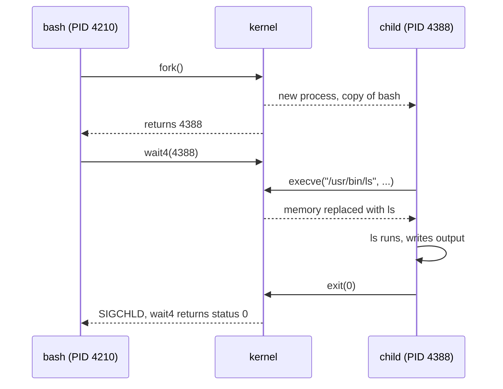
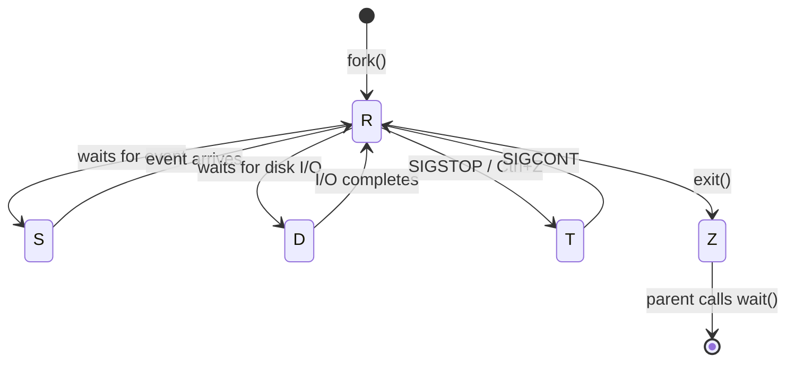
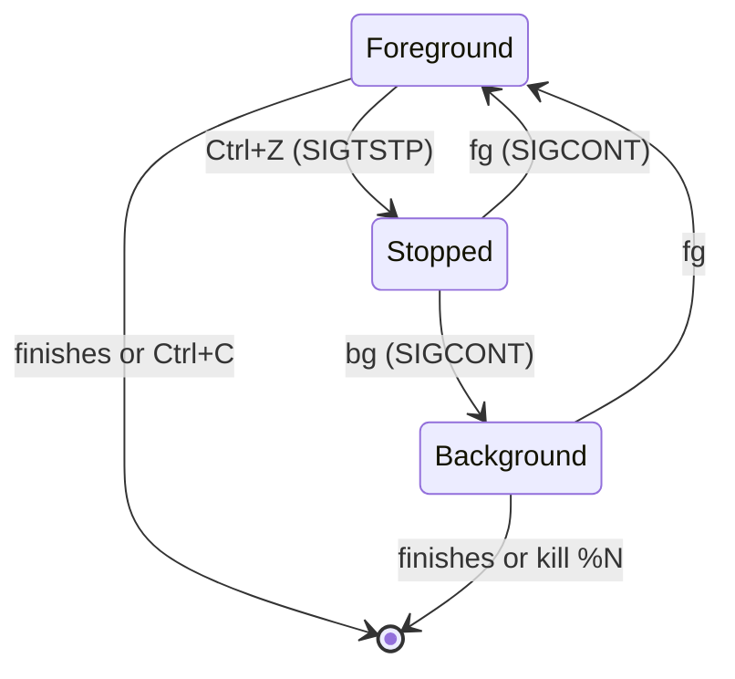

# Processes and signals

> **Level 3 · Chapter 2** · ⏱️ ~50 min read · Prerequisites: [The boot process](01-boot-process.md), [Pipes and redirection](../01-command-line/04-pipes-and-redirection.md)

Everything that runs on Linux is a process: your shell, your browser, the database, and every `ls` you type. This chapter explains what a process is underneath, how processes are born and die, how to watch them with `ps`, `top`, and `htop`, and how to control them with signals and job control.

## Why it matters

Alex starts a 3-hour data import over SSH: `python3 load_events.py`. An hour in, the Wi-Fi drops for ten seconds. The SSH connection dies, and when Alex reconnects, the import is gone. No error message, no partial log line explaining why.

The next day the same thing happens to a colleague, who "fixes" it by running `kill -9` on what they think is a stuck import. It was actually the import's parent, a scheduler, and three other jobs die with it.

Both problems come from not knowing how processes work. When the SSH session closed, the kernel sent the shell a **SIGHUP** signal, and the shell passed it on to its children, which died. Running the import under `nohup`, or inside `tmux`, would have kept it alive. And `pstree -p` would have shown the colleague exactly which process was which before sending anything.

After this chapter you'll be able to find any process, understand what state it's in and why, read `top` like a dashboard, and stop, pause, resume, or detach programs deliberately.

## Concepts

### Program vs process

A **program** is a file on disk containing instructions, for example `/usr/bin/ls`. It does nothing by itself.

A **process** is a running instance of a program. The kernel gives each process:

- A unique number, the **PID** (process ID).
- Its own private memory (code, data, heap, stack; see [Memory](03-memory.md)).
- A table of **open files**, called **file descriptors** (0 = stdin, 1 = stdout, 2 = stderr, and more).
- An owner (user and group IDs), which decides what it's allowed to do.
- A current working directory, environment variables, and a scheduling priority.
- A parent: the process that created it, identified by its **PPID** (parent process ID).

One program can be running as many processes at once. Open three terminals and you have three `bash` processes, all from the same `/usr/bin/bash` file, each with its own PID, memory, and current directory.

A process can also contain several **threads**: multiple streams of execution sharing one memory space. A browser or VS Code process may have dozens. The kernel schedules threads, and tools like `ps` and `top` show processes by default (`H` in `top`, or `ps -L`, shows threads).

### How processes are born: fork and exec

Linux creates processes in two separate steps. This design is decades old and is still how every program you launch starts.

1. **fork**: the parent asks the kernel to clone it. The child is an almost exact copy: same program, same memory contents, same open files. The only difference is that the child gets a new PID, and `fork()` returns 0 in the child and the child's PID in the parent, so each knows which one it is.
2. **exec**: the child asks the kernel to replace its program with a different one (`execve()`). The kernel throws away the copied memory and loads the new program, but keeps the PID, open file descriptors, current directory, and environment.
3. **wait**: the parent calls `wait()` to pause until the child exits and to collect its **exit status**, the number that becomes `$?` in bash.

Here's what happens when you type `ls` in bash:



Why two steps instead of one "run this program" call? Because the gap between fork and exec is where the child sets itself up. When you type `ls > out.txt`, the child opens `out.txt` and puts it on file descriptor 1 *before* calling exec. `ls` never knows its output was redirected; it just writes to fd 1. Pipes, redirections, and changing the working directory all happen in that gap.

Copying a whole process sounds expensive. It isn't, because of **copy-on-write**: after fork, parent and child share the same physical memory pages, marked read-only. Only when one of them writes to a page does the kernel copy that single page. Since the child usually calls exec almost immediately, very little is ever copied.

You can watch the whole dance with `strace`, a tool that prints every system call a program makes (system calls are covered in depth in [System calls and strace](../05-programming/01-system-calls-strace.md)):

```bash
strace -f -e trace=clone,execve,wait4 bash -c 'ls /tmp > /dev/null; echo done'
```

```text
execve("/usr/bin/bash", ["bash", "-c", "ls /tmp > /dev/null; echo done"], 0x7ffc195939c8 /* 52 vars */) = 0
clone(child_stack=NULL, flags=CLONE_CHILD_CLEARTID|CLONE_CHILD_SETTID|SIGCHLD, child_tidptr=0x7c8e707baa10) = 4388
[pid  4210] wait4(-1,  <unfinished ...>
[pid  4388] execve("/usr/bin/ls", ["ls", "/tmp"], 0x5f354bdae6f0 /* 52 vars */) = 0
[pid  4388] +++ exited with 0 +++
<... wait4 resumed>[{WIFEXITED(s) && WEXITSTATUS(s) == 0}], 0, NULL) = 4388
--- SIGCHLD {si_signo=SIGCHLD, si_code=CLD_EXITED, si_pid=4388, si_uid=1000, si_status=0, ...} ---
done
+++ exited with 0 +++
```

`clone` is the modern system call behind `fork()`. You can see bash cloning itself, the child (4388) exec'ing `/usr/bin/ls`, bash waiting, and the kernel notifying bash with `SIGCHLD` when the child exits. `echo` produced `done` without any fork, because `echo` is a **builtin**: a command implemented inside bash itself.

### The process tree

Since every process except PID 1 was created by a parent, processes form a tree with systemd at the root. (The kernel's own threads hang off a second root, `kthreadd`, PID 2.)

```bash
pstree -p alex | head -12
```

```text
systemd(1342)─┬─(sd-pam)(1344)
              ├─gnome-terminal-(13712)─┬─bash(13724)───python3(14117)
              │                        └─bash(15530)───pstree(15581)
              ├─pipewire(1371)
              ├─dbus-daemon(1380)
              ...
```

`pstree` draws parent-child relationships. `-p` adds PIDs. Here you can see that `pstree` itself is a child of a `bash`, which is a child of the terminal, which is a child of your user's `systemd --user` manager (1342), which is a child of PID 1 (not shown because we asked for alex's processes only). Run `pstree -p` with no user to see the whole machine, and `pstree -s -p <PID>` to see one process's ancestors.

### Process states

A process isn't always running. On a typical desktop, hundreds of processes exist but only a handful are on a CPU at any instant. The kernel tracks each one's **state**:

| Code | State | Meaning |
|---|---|---|
| `R` | Running / runnable | On a CPU now, or ready and waiting in the run queue for a turn |
| `S` | Interruptible sleep | Waiting for something (keyboard input, a network packet, a timer). Most processes are here most of the time |
| `D` | Uninterruptible sleep | Waiting on I/O inside the kernel, usually disk or network filesystem. Can't be interrupted, not even by `kill -9` |
| `T` | Stopped | Paused by a signal (++ctrl+z++ or `SIGSTOP`). Will resume on `SIGCONT` |
| `t` | Tracing stop | Paused by a debugger |
| `Z` | Zombie | Finished, but the parent hasn't collected its exit status yet |
| `I` | Idle | An idle kernel thread (not counted as load) |



`ps` adds extra characters after the state letter:

| Suffix | Meaning |
|---|---|
| `s` | Session leader (usually a shell or daemon) |
| `+` | In the foreground process group of its terminal |
| `l` | Multi-threaded |
| `<` | High priority (negative nice) |
| `N` | Low priority (positive nice) |

So `Ss` is a sleeping session leader (a typical shell), `R+` is a running foreground command, and `Sl` is a sleeping multi-threaded program like a browser.

**D state deserves special attention.** A process in D is in the middle of a kernel operation that can't be safely abandoned, such as waiting for a disk read. Signals are queued until it leaves D. If a USB disk or an NFS server stops responding, processes touching it can sit in D forever and nothing will kill them. When you see processes stuck in D, look at the storage, not the process.

### Zombies and orphans

When a process exits, the kernel frees its memory and closes its files, but keeps a tiny entry in the process table: its PID and exit status. That leftover is a **zombie** (state `Z`, shown as `<defunct>`). It stays until the parent calls `wait()` to read the exit status. This is called **reaping**.

A few short-lived zombies are normal. A pile of them means the parent has a bug: it creates children and never waits for them. You **can't kill a zombie**, because it's already dead. You fix it by making the parent reap (some programs do it on `SIGCHLD`) or by ending the parent.

That second fix works because of **orphans**. If a parent dies while its child is still running, the child becomes an orphan and the kernel re-parents it to PID 1 (or to a nearer ancestor that has registered as a "subreaper"). systemd always reaps its children, so when the buggy parent dies, its zombies are adopted by PID 1 and immediately reaped.

You can create an orphan on purpose:

```bash
bash -c 'sleep 300 & echo "child is $!"'
```

```text
child is 4511
```

```bash
ps -o pid,ppid,stat,cmd -p 4511
```

```text
    PID    PPID STAT CMD
   4511       1 S    sleep 300
```

The inner `bash` exited immediately. Its child `sleep` lives on with PPID 1. This is also, in miniature, how old-style daemons detached from your terminal.

### Scheduling, priority, and nice

The kernel's **scheduler** decides which runnable thread gets each CPU next. On Linux the default policy aims for fairness: every runnable thread gets a fair share of CPU time, weighted by its **nice value**.

**Niceness** ranges from −20 (greedy, high priority) to 19 (very polite, low priority). The default is 0. The name comes from being "nice" to other users: a higher number means you yield more. Each step changes the CPU share by roughly 10 to 25%, so a nice-19 process competing with a nice-0 process gets a small fraction of the CPU, but it still gets *something*, and it gets everything when nothing else wants the CPU.

Rules:

- Any user can make their own processes *nicer* (raise the number).
- Only root can lower it (raise priority), including undoing your own earlier increase.

Nice only affects CPU. For disk-heavy jobs, `ionice` does the same for I/O priority.

### Load average, explained properly

Load average is the most quoted and most misunderstood number on a Linux system. You'll see it in `uptime`, `top`, and `htop`:

```text
load average: 5.06, 3.64, 2.78
```

**What it counts.** At each moment, the kernel counts threads that are either **runnable** (`R`: running or waiting for a CPU) or in **uninterruptible sleep** (`D`: usually waiting on disk). That count is the instantaneous load.

**What the three numbers are.** Every 5 seconds, the kernel folds the current count into three moving averages, with time constants of 1, 5, and 15 minutes. They're **exponentially damped**, not simple averages: recent samples count most, and old samples fade gradually rather than dropping out at a cut-off. So "1-minute load" means "mostly the last minute, with a tail of earlier history".

**How to read them.** Compare them to the number of CPU cores (`nproc`):

| Load on a 4-core machine | Interpretation |
|---|---|
| 1.0 | One core's worth of demand. 75% of capacity idle |
| 4.0 | Exactly fully used, no queue |
| 8.0 | Twice as much demand as cores. On average 4 threads are waiting |
| 0.5, 2.0, 6.0 | Load is falling: busy 15 min ago, quiet now |
| 6.0, 2.0, 0.5 | Load is rising: something just started |

**The Linux twist.** Because Linux includes `D`-state threads, load can be high while CPUs are idle. If load is 12 on a 4-core box but `top` shows 90% idle and a large `wa` (I/O wait), the problem is storage, not CPU: lots of threads are queued behind a slow disk or a hung network mount. Most other Unix systems count only runnable threads, which is why advice from other systems can mislead you.

The raw numbers live in `/proc/loadavg`:

```bash
cat /proc/loadavg
```

```text
5.06 3.64 2.78 4/2577 75603
```

The fourth field is "currently runnable / total threads" and the fifth is the most recently created PID.

### CPU percentages and memory columns

Two more numbers that confuse people:

**%CPU.** In `top` and `htop`, %CPU is measured per core over the refresh interval, so a multi-threaded program using four cores fully shows 400%. In `ps`, %CPU is different: it's total CPU time divided by the time since the process started, averaged over its whole life. A process that was busy at startup and idle since will show a misleadingly high `ps` %CPU but 0% in `top`.

**VIRT (VSZ) vs RES (RSS).** `VIRT` is the total virtual address space the process has mapped: code, libraries, files, and memory it reserved but may never touch. It's often huge and mostly meaningless (VS Code and Chrome show over a terabyte). `RES` is the **resident set size**: how much of that is actually in physical RAM right now. `SHR` is the part of RES that's shared with other processes (mostly shared libraries). [Memory](03-memory.md) explains why these differ so much.

### Signals

A **signal** is a small asynchronous notification sent to a process: a number, with no data attached. The kernel sends signals (for example when a child exits or a program touches invalid memory), and processes can send them to each other with `kill`.

When a signal arrives, the process does one of three things:

- The **default action**, which depends on the signal: terminate, terminate and dump core, stop, continue, or ignore.
- Runs its own **handler**, a function the program registered to deal with that signal (for example, "on SIGTERM, finish writing, close the database, then exit").
- **Ignores** it, if the program asked to.

Two signals can't be caught, handled, or ignored: `SIGKILL` and `SIGSTOP`. The kernel acts on them directly. That's what makes them reliable, and also what makes `SIGKILL` brutal: the program gets no chance to clean up.

| Signal | No. | Default | Sent by / used for |
|---|---|---|---|
| `SIGHUP` | 1 | Terminate | Terminal closed ("hang up"). Many daemons treat it as "reload your config" |
| `SIGINT` | 2 | Terminate | ++ctrl+c++ in the terminal: "interrupt" |
| `SIGQUIT` | 3 | Core dump | ++ctrl+backslash++: quit and dump core for debugging |
| `SIGKILL` | 9 | Terminate | Last resort. Can't be caught. No cleanup |
| `SIGSEGV` | 11 | Core dump | Kernel: invalid memory access ("segmentation fault") |
| `SIGPIPE` | 13 | Terminate | Wrote to a pipe whose reader has gone (e.g. `yes | head -1`) |
| `SIGTERM` | 15 | Terminate | Polite "please exit". Default for `kill`, `systemctl stop`, shutdown |
| `SIGCHLD` | 17 | Ignore | Kernel to parent: a child exited or stopped |
| `SIGCONT` | 18 | Continue | Resume a stopped process (`fg`, `bg`) |
| `SIGSTOP` | 19 | Stop | Pause unconditionally. Can't be caught |
| `SIGTSTP` | 20 | Stop | ++ctrl+z++: polite pause request. Can be caught |
| `SIGUSR1`, `SIGUSR2` | 10, 12 | Terminate | Application-defined (e.g. `dd` prints progress on `SIGUSR1`) |

Numbers are for x86-64 Linux. Use names in scripts (`kill -TERM`, not `kill -15`) because they're clearer and portable. `kill -l` lists them all.

When a process is killed by a signal, the shell reports its exit status as **128 + signal number**. So 130 means killed by SIGINT (2), 137 means SIGKILL (9), and 143 means SIGTERM (15). When you see exit code 137 from a container or a batch job, think "something sent SIGKILL", very often the out-of-memory killer.

!!! warning "Common mistake"
    Reaching for `kill -9` first. SIGKILL gives the program no chance to flush buffers, delete lock files, finish a database transaction, or stop its own children. You can end up with corrupt output files, stale `.lock` files that stop the program from starting again, and orphaned child processes. Always send `SIGTERM` first, wait a few seconds, and only then use `SIGKILL`. This is exactly what `systemctl stop` does.

### Job control

**Job control** is the shell feature that lets you run several commands from one terminal, pause them, and move them between the foreground and background.

- The **foreground** job owns the terminal: it receives your keystrokes and ++ctrl+c++. Only one job is in the foreground at a time.
- **Background** jobs keep running but can't read from the terminal (if they try, they're stopped with `SIGTTIN`).

Each pipeline you start is a **job** with a small job number (`%1`, `%2`) separate from PIDs. The terminal driver turns special keys into signals for the foreground job: ++ctrl+c++ sends `SIGINT`, ++ctrl+z++ sends `SIGTSTP`, and ++ctrl+backslash++ sends `SIGQUIT`.



#### Why closing a terminal kills your jobs

When a terminal window closes (or an SSH connection drops), the kernel sends `SIGHUP` to the shell. Bash then sends `SIGHUP` to every job in its job table. The default action of `SIGHUP` is to terminate. That's what killed Alex's import.

Three ways to survive it:

- **`nohup command &`** starts the command with `SIGHUP` ignored. If stdout is a terminal, output goes to `nohup.out` instead, since the terminal will vanish.
- **`disown`** removes an already-running job from bash's job table, so bash won't send it `SIGHUP` on exit.
- **A terminal multiplexer** (`tmux` or `screen`) is the robust answer. It runs a server process, independent of your terminal, that owns the shells inside it. You can **detach** (++ctrl+b++ then ++d++ in tmux), close the terminal or lose the SSH connection, then later run `tmux attach` and find everything exactly as you left it, with scrollback. For anything long-running over SSH, start `tmux` first. You learned the details in [tmux](../01-command-line/10-tmux.md); now you know *why* it works: the tmux server, not your terminal, is the parent of your shells, so a terminal's SIGHUP never reaches them.

For long-running jobs that should survive reboots too, the right tool is a systemd service, covered in [Your program as a service](../05-programming/05-services-with-systemd.md).

## Commands and examples

### `ps`: a snapshot of processes

`ps` prints a one-time snapshot. Its options are famously messy because it accepts two styles: **BSD style** (no dash, like `ps aux`) and **UNIX/POSIX style** (with a dash, like `ps -ef`). Both are worth knowing because you'll see both in every guide.

#### `ps aux`

```bash
ps aux | head -6
```

```text
USER         PID %CPU %MEM    VSZ   RSS TTY      STAT START   TIME COMMAND
root           1  0.2  0.0  23004 13780 ?        Ss   09:35   0:07 /sbin/init splash
root           2  0.0  0.0      0     0 ?        S    09:35   0:00 [kthreadd]
root           3  0.0  0.0      0     0 ?        S    09:35   0:00 [pool_workqueue_release]
root           4  0.0  0.0      0     0 ?        I<   09:35   0:00 [kworker/R-rcu_gp]
alex        4210  0.0  0.0  11920  5632 pts/0    Ss   10:02   0:00 bash
```

- `a`: processes of all users; `u`: user-oriented columns; `x`: include processes with no terminal (daemons).
- `VSZ` and `RSS` are in KiB.
- `TTY` is the controlling terminal. `?` means none (a daemon or kernel thread). `pts/0` is a pseudo-terminal, a terminal window or SSH session.
- `START` is when it started; `TIME` is total CPU time consumed, not wall time.
- Names in `[brackets]` are kernel threads: they have no command line because they're part of the kernel.

#### `ps -ef`

```bash
ps -ef | head -4
```

```text
UID          PID    PPID  C STIME TTY          TIME CMD
root           1       0  0 09:35 ?        00:00:07 /sbin/init splash
root           2       0  0 09:35 ?        00:00:00 [kthreadd]
root           3       2  0 09:35 ?        00:00:00 [pool_workqueue_release]
```

`-e` means every process and `-f` means "full" format. The useful extra column is `PPID`. Notice PID 1 and PID 2 both have PPID 0: they were created by the kernel itself.

#### Choose your own columns with `-o`

This is the form you'll use most in scripts and investigations:

```bash
ps -eo pid,ppid,user,stat,ni,rss,etime,comm --sort=-rss | head -6
```

```text
    PID    PPID USER     STAT  NI   RSS     ELAPSED COMMAND
  45721    4486 alex     Sl     0 984596    01:12:40 code
  16727   16658 alex     Sl     0 836956    02:31:05 QtWebEngineProc
  12549    2620 alex     Sl     0 744248    01:58:13 chrome
   2271    1918 alex     Sl     0 186696    01:01:52 cinnamon
   1292    1262 root     Ssl    0  94884    01:01:55 Xorg
```

- `-o` picks columns; `--sort=-rss` sorts by RSS descending (`-` for descending).
- `etime` is elapsed wall-clock time since start; `comm` is the short command name; use `args` (or `cmd`) for the full command line.
- `ps -o pid,ppid,stat,args -p 4210` shows a single process; `ps -o ... --ppid 4210` shows its children; `ps -u alex` shows one user's processes.

Useful column names: `pid ppid user uid stat ni pri pcpu pmem rss vsz tty etime time lstart comm args nlwp` (`nlwp` = number of threads). The full list is in `man ps` under "STANDARD FORMAT SPECIFIERS".

!!! warning "Common mistake"
    `ps aux | grep python` shows the `grep` itself as a match, and `ps aux | grep -v grep` is a fragile workaround. Use `pgrep -a python` instead: it was built for exactly this.

### `pgrep`: find processes by name

```bash
pgrep -a bash
```

```text
4210 bash
15530 bash
```

| Option | Meaning |
|---|---|
| `-a` | Show the full command line, not just the PID |
| `-l` | Show the process name |
| `-f` | Match against the full command line instead of just the name |
| `-x` | Exact name match (`-x python3` won't match `python3.12-config`) |
| `-u alex` | Only processes owned by alex |
| `-n` / `-o` | Only the newest / oldest match |
| `-c` | Print a count |

`pgrep -f load_events.py` finds `python3 load_events.py`, which plain `pgrep load_events` wouldn't, because the process name is `python3`.

### `top`: a live view

```bash
top
```

```text
top - 10:37:19 up  1:01,  1 user,  load average: 5.06, 3.64, 2.78
Tasks: 480 total,   3 running, 476 sleeping,   0 stopped,   1 zombie
%Cpu(s): 16.7 us,  4.4 sy,  0.0 ni, 78.9 id,  0.0 wa,  0.0 hi,  0.0 si,  0.0 st
MiB Mem :  15549.5 total,    713.6 free,  10392.7 used,   5864.7 buff/cache
MiB Swap:   4096.0 total,   3088.0 free,   1008.0 used.   5156.8 avail Mem

    PID USER      PR  NI    VIRT    RES    SHR S  %CPU  %MEM     TIME+ COMMAND
  45721 alex      20   0 1450.3g 984316 147388 S  60.0   6.2   3:44.99 code
   2271 alex      20   0 4760376 186696  99136 S  26.7   1.2   6:44.81 cinnamon
   1292 root      20   0  840976  94884  64032 S  20.0   0.6   4:35.51 Xorg
  75675 alex      20   0   14516   5628   3456 R   6.7   0.0   0:00.07 top
```

Line by line:

1. **Uptime line**: current time, time since boot, logged-in users, and the three load averages.
2. **Tasks**: process counts by state. A non-zero zombie count is worth a glance if it keeps growing.
3. **%Cpu(s)**: how all CPUs together spent the last interval:
    - `us` user code, `sy` kernel code, `ni` user code at positive nice;
    - `id` idle; `wa` idle while waiting for I/O (high = storage bottleneck);
    - `hi`/`si` hardware/software interrupts; `st` "steal", time a hypervisor gave to other VMs (matters on cloud VMs).
4. **MiB Mem**: total, free, used, and buff/cache. `free` looks alarmingly small; that's normal and explained in [Memory](03-memory.md).
5. **MiB Swap**: swap totals. The last field, `avail Mem`, is the best single "how much memory could new programs get" number.

Columns: `PR` is the kernel's priority (20 + nice for normal processes), `NI` is nice, `VIRT`/`RES`/`SHR` are virtual, resident, and shared memory in KiB (or with suffixes), `S` is state, and `TIME+` is total CPU time with hundredths.

Keys inside `top` worth knowing:

| Key | Action |
|---|---|
| ++shift+p++ / ++shift+m++ | Sort by CPU / memory |
| ++1++ | Toggle per-CPU lines |
| ++c++ | Show full command lines |
| ++shift+h++ | Show threads instead of processes |
| ++k++ | Kill: prompts for PID and signal (default 15) |
| ++r++ | Renice a process |
| ++u++ | Show only one user |
| ++q++ | Quit |

`top -b -n 1` (batch mode, one iteration) prints a snapshot that you can pipe or save, handy in scripts and bug reports.

### `htop`: the friendlier modern alternative

`htop` shows the same information with colour bars, mouse support, scrolling, and a tree view. It isn't installed by default on every Mint setup:

```bash
sudo apt install htop
htop
```

```text
    0[||||||||       23.5%]   4[|||           7.9%]   8[||            4.0%]  12[|             2.0%]
    1[|||||          12.1%]   5[||            5.2%]   9[|             1.3%]  13[|             1.9%]
    ...
  Mem[|||||||||||||||||||||||||||||10.1G/15.2G]   Tasks: 198, 1702 thr, 251 kthr; 3 running
  Swp[|||||                          1.0G/4.00G]   Load average: 5.06 3.64 2.78
                                                   Uptime: 01:01:52

    PID USER       PRI  NI  VIRT   RES   SHR S CPU%▽MEM%   TIME+  Command
  45721 alex        20   0 1450G  961M  143M S  60.0  6.2  3:44.99 /usr/share/code/code --type=renderer ...
```

Reading the header:

- One bar per CPU core. Colours split the time: by default green is normal user code, red is kernel, blue is low-priority (niced), and grey/dark is I/O wait.
- The `Mem` bar: green is memory used by programs, blue is buffers, yellow/orange is page cache. The "used" number leaves out buffers and cache, so it's close to (though not computed exactly like) `free`'s `used` column, and much smaller than the full length of the bar.
- `Tasks: 198, 1702 thr, 251 kthr`: processes, user threads, and kernel threads; `running` is the current `R` count.

Keys: ++f3++ search, ++f4++ filter, ++f5++ tree view, ++f6++ choose sort column, ++f7++/++f8++ nice down/up, ++f9++ send a signal (pick from a menu), ++space++ tag several processes, ++f10++ quit.

Other modern alternatives you may like: `btop` (very visual), and `glances`. The classic `top` is always installed, works over any SSH connection, and is what you'll find on servers, so learn it first.

### Changing priority: `nice` and `renice`

Start a CPU-heavy job politely:

```bash
nice -n 10 gzip -9 big_export.csv &
ps -o pid,ni,stat,cmd -p $!
```

```text
    PID  NI STAT CMD
  82084  10 RN   gzip -9 big_export.csv
```

`N` in the state confirms low priority. `$!` is the PID of the last background job.

Change a running process:

```bash
renice -n 15 -p 82084
```

```text
82084 (process ID) old priority 10, new priority 15
```

Trying to go back down fails without root:

```bash
renice -n 5 -p 82084
```

```text
renice: failed to set priority for 82084 (process ID): Permission denied
```

That's the rule from earlier: users can only make their processes nicer. `renice -n 5 -u alex` would renice all of alex's processes.

### Sending signals: `kill`, `pkill`, `killall`

Despite its name, `kill` sends any signal. It defaults to `SIGTERM`:

```bash
sleep 600 &
kill %1          # SIGTERM to job 1
kill 4511        # SIGTERM to PID 4511
kill -TERM 4511  # the same, explicit
kill -STOP 4511  # pause
kill -CONT 4511  # resume
kill -KILL 4511  # last resort
kill -0 4511     # send nothing; just test whether the process exists and you may signal it
```

`kill` is a bash builtin (which is why `kill %1` understands job numbers); `/usr/bin/kill` also exists.

You can only signal your own processes. Signalling another user's process gives `Operation not permitted`.

Watch exit statuses for different signals:

```bash
sleep 30 & kill -TERM $!; wait $!; echo "exit status: $?"
sleep 30 & kill -KILL $!; wait $!; echo "exit status: $?"
```

```text
[1]+  Terminated              sleep 30
exit status: 143
[1]+  Killed                  sleep 30
exit status: 137
```

128 + 15 = 143 and 128 + 9 = 137, as promised.

**By name:**

```bash
pkill -f load_events.py       # SIGTERM to processes whose command line matches
pkill -HUP -x nginx           # SIGHUP to processes named exactly "nginx" (often: reload config)
killall -i firefox            # SIGTERM to all processes named firefox, asking for each
```

`pkill` takes the same matching options as `pgrep`. A good habit is to run the `pgrep` version first to see what you'd hit, then swap `pgrep -a` for `pkill`.

!!! warning "Common mistake"
    `pkill -f` with a short pattern. `-f` matches anywhere in the full command line, including the command lines of shells and scripts that merely *mention* the pattern. `pkill -f sleep` can kill a `bash -c "...; sleep 5"` wrapper you didn't intend. Check with `pgrep -af pattern` first, and prefer `-x` with an exact name when you can.

`killall` (from the `psmisc` package, installed on Mint) matches process names exactly. On Linux it's safe; on some old Unix systems `killall` really did kill *all* processes, which is why older admins are wary of it.

### Making a zombie, safely

Seeing one makes the concept stick. This creates a parent that never reaps its child:

```bash
bash -c 'sleep 1 & exec sleep 30' &
sleep 2
ps -o pid,ppid,stat,cmd --ppid $!
```

```text
    PID    PPID STAT CMD
  81760   81757 Z    [sleep] <defunct>
```

How it works: the inner bash starts `sleep 1` in the background, then `exec`s `sleep 30`, replacing itself. The new `sleep 30` is now the parent of `sleep 1`, but `sleep` has no code to call `wait()`. When `sleep 1` finishes, it becomes a zombie. After 30 seconds the parent exits, the zombie is re-parented to PID 1, and systemd reaps it instantly. Try `kill -9 81760` while it's a zombie: nothing changes, because it's already dead.

### Job control in practice

```console
$ sleep 300 &
[1] 176760
$ sleep 600
^Z
[2]+  Stopped                 sleep 600
$ jobs -l
[1]- 176760 Running                 sleep 300 &
[2]+ 176761 Stopped                 sleep 600
$ bg %2
[2]+ sleep 600 &
$ fg %1
sleep 300
^C
$ jobs
[2]+  Running                 sleep 600 &
$ kill %2
[2]+  Terminated              sleep 600
```

- `&` starts a job in the background; bash prints the job number and PID.
- ++ctrl+z++ sends `SIGTSTP` to the foreground job; bash reports it as Stopped.
- `jobs` lists jobs; `-l` adds PIDs. `+` marks the "current" job (the default for `fg`/`bg`), `-` the previous one.
- `bg %2` sends `SIGCONT` and lets it continue in the background.
- `fg %1` brings job 1 to the foreground (and sends `SIGCONT` if it was stopped). Now ++ctrl+c++ reaches it.

A very common real use: you start a long `rsync` or `pytest` run, realise you need your prompt back, press ++ctrl+z++, then type `bg`.

### Surviving logout: `nohup`, `disown`, `tmux`

```bash
nohup python3 load_events.py > load.log 2>&1 &
```

```text
[1] 5120
```

With output redirected yourself, `nohup` stays quiet. Without a redirect it would print `nohup: ignoring input and appending output to 'nohup.out'`.

Forgot `nohup`? Detach an already-running job:

```bash
python3 load_events.py > load.log 2>&1 &
disown %1
```

After `disown`, the job disappears from `jobs`, and bash won't send it `SIGHUP` when the terminal closes. Note that its output still goes wherever it went before. If that was the terminal, writes will fail once the terminal is gone, so always redirect output first.

The better habit for interactive long work, especially over SSH:

```bash
tmux new -s import       # start a named session
python3 load_events.py   # run inside it
# press Ctrl+b, then d, to detach
tmux ls                  # later, from any terminal or new SSH login
tmux attach -t import    # reattach, output and all
```

```text
import: 1 windows (created Fri Oct  2 10:50:11 2026)
```

`screen` is the older equivalent (`screen -S import`, detach with ++ctrl+a++ then ++d++, reattach with `screen -r import`). You'll still meet it on older servers.

## Exercises

### Exercise 1: Find your place in the tree (easy)

Find the PID of your current shell, its parent, and its grandparent. Then use `pstree` to show the full ancestry of your shell all the way to PID 1. What program is your shell's parent?

??? success "Solution"

    ```bash
    echo $$
    ps -o pid,ppid,comm -p $$
    ps -o pid,ppid,comm -p "$(ps -o ppid= -p $$)"
    pstree -s -p $$
    ```

    ```text
    4210
        PID    PPID COMMAND
       4210   13712 bash
        PID    PPID COMMAND
      13712    1342 gnome-terminal-
    systemd(1)───systemd(1342)───gnome-terminal-(13712)───bash(4210)───pstree(4402)
    ```

    `$$` is the shell's own PID. `ps -o ppid= -p $$` prints just the parent PID (the `=` removes the header). In Mint's default terminal, the parent is `gnome-terminal-server` (the name is truncated to 15 characters), which runs under your user's `systemd --user` manager, which runs under PID 1. Over SSH, the parent would be `sshd` instead.

### Exercise 2: States and signals by hand (easy)

Start `sleep 1000` in the background. Show its state, pause it with a signal, show the state again, resume it, and finally terminate it politely. Print the exit status.

??? success "Solution"

    ```bash
    sleep 1000 &
    P=$!
    ps -o pid,stat,cmd -p $P
    kill -STOP $P; ps -o pid,stat,cmd -p $P
    kill -CONT $P; ps -o pid,stat,cmd -p $P
    kill -TERM $P; wait $P; echo "exit status: $?"
    ```

    ```text
        PID STAT CMD
       5301 S    sleep 1000
        PID STAT CMD
       5301 T    sleep 1000
        PID STAT CMD
       5301 S    sleep 1000
    [1]+  Terminated              sleep 1000
    exit status: 143
    ```

    `S` (sleeping: it's waiting on a timer), then `T` (stopped), then `S` again. 143 = 128 + 15 (SIGTERM).

### Exercise 3: Read the load (medium)

Run `nproc` and `uptime`. Then start a CPU burner on exactly two cores for about two minutes: `for i in 1 2; do timeout 120 sh -c 'while :; do :; done' & done`. Watch `uptime` every 20 seconds (`watch -n 20 uptime`). Explain what the three numbers do and why the 1-minute value never jumps straight to 2.

??? success "Solution"

    ```bash
    nproc
    for i in 1 2; do timeout 120 sh -c 'while :; do :; done' & done
    watch -n 20 uptime
    ```

    ```text
    load average: 0.42, 0.51, 0.60   ← before
    load average: 1.05, 0.66, 0.64   ← 20 s in
    load average: 1.73, 0.89, 0.72   ← 60 s in
    load average: 1.98, 1.15, 0.82   ← 120 s in
    load average: 1.27, 1.08, 0.81   ← 40 s after the burners stopped
    ```

    Two busy loops add 2 to the instantaneous load. The 1-minute average climbs toward 2 gradually because it's exponentially damped: after one minute it has covered about 63% of the gap, after two minutes about 86%. The 5- and 15-minute values move much more slowly. When the burners stop, the 1-minute value falls first. On a 16-core machine, a load of 2 is nothing; on a 2-core VM it means fully busy. `timeout 120` guarantees the loops stop even if you forget them.

### Exercise 4: Survive a closed terminal (medium)

Prove that closing a terminal kills a background job, and that `nohup` and `disown` both prevent it. Use `sleep` commands with distinctive durations (`sleep 7001`, `sleep 7002`, `sleep 7003`) so you can find them with `pgrep`.

??? success "Solution"

    In a new terminal window:

    ```bash
    sleep 7001 &
    nohup sleep 7002 > /dev/null 2>&1 &
    sleep 7003 &
    disown %3
    jobs
    ```

    Close the window with the X button (not `exit`). In another terminal:

    ```bash
    pgrep -a sleep | grep 700
    ```

    ```text
    6120 sleep 7002
    6125 sleep 7003
    ```

    `sleep 7001` received `SIGHUP` from bash and died. `sleep 7002` ignores `SIGHUP` because of `nohup`. `sleep 7003` was removed from bash's job table by `disown`, so bash never sent it the signal. Both survivors now have PPID 1 (check with `ps -o ppid= -p 6120`). Clean up with `pkill -x -f 'sleep 700[23]'` or just `kill 6120 6125`.

### Exercise 5: Hunt down a zombie factory (hard)

Run the zombie maker from this chapter, but with a 120-second parent: `bash -c 'for i in 1 2 3; do sleep 1 & done; exec sleep 120' &`. Using only `ps` (no `pstree`), find all zombies on the system, identify their parent, and get rid of the zombies without waiting 120 seconds. Explain why `kill -9` on the zombies themselves doesn't work.

??? success "Solution"

    ```bash
    bash -c 'for i in 1 2 3; do sleep 1 & done; exec sleep 120' &
    sleep 2
    ps -eo pid,ppid,stat,cmd | awk '$3 ~ /^Z/'
    ```

    ```text
       7011    7008 Z    [sleep] <defunct>
       7012    7008 Z    [sleep] <defunct>
       7013    7008 Z    [sleep] <defunct>
    ```

    All three share PPID 7008. Inspect it:

    ```bash
    ps -o pid,ppid,stat,cmd -p 7008
    kill -9 7011; ps -o pid,stat -p 7011
    kill 7008
    sleep 1
    ps -eo pid,ppid,stat,cmd | awk '$3 ~ /^Z/'
    ```

    ```text
        PID    PPID STAT CMD
       7008    4210 S    sleep 120
        PID STAT
       7011 Z
    ```

    The parent is `sleep 120`, which never calls `wait()`. Killing a zombie does nothing because there's no running code left to receive the signal; the entry exists only to hold the exit status. Killing the parent (with a polite SIGTERM) orphans the zombies, they're re-parented to PID 1, and systemd reaps them immediately, so the final `ps` prints nothing. (Your own system may show other, unrelated zombies; check their PPIDs.)

## Check yourself

1. What's the difference between a program and a process? Can one program be several processes?

    ??? note "Answer"

        A program is an executable file on disk. A process is a running instance of it, with its own PID, memory, open files, and state. Yes: three terminals running bash are three processes of one program.

2. Why does Linux split process creation into fork and exec instead of a single call?

    ??? note "Answer"

        The gap between them lets the child set itself up before the new program starts: redirect file descriptors, set up pipes, change directory, drop privileges, adjust environment. The new program inherits that setup without knowing about it. Copy-on-write makes the fork cheap.

3. A process shows state `D` and ignores `kill -9`. What's going on and where should you look?

    ??? note "Answer"

        It's in uninterruptible sleep inside the kernel, almost always waiting for I/O. Signals are delivered only after it leaves that state. Look at the device or filesystem it's using: a failing disk, a disconnected USB drive, or an unreachable NFS server.

4. A 4-core server shows `load average: 9.8, 9.5, 9.1`, but `top` shows 85% idle and 60% `wa`. Is the CPU overloaded?

    ??? note "Answer"

        No. Linux load counts `D`-state threads waiting on I/O as well as runnable ones. High load plus idle CPUs plus high I/O wait means threads are queued on storage. Investigate disks (Level 6's `iostat`) or network filesystems, not CPU.

5. What's a zombie, why can't you kill it, and how do you get rid of zombies?

    ??? note "Answer"

        A process that has exited but whose parent hasn't called `wait()` to collect its exit status. It's already dead, so there's nothing to receive a signal. Make the parent reap it, or terminate the parent; the zombie is then adopted by PID 1, which reaps it.

6. A job exits with status 137. What probably happened?

    ??? note "Answer"

        137 = 128 + 9, so it was killed by SIGKILL. Common causes: someone ran `kill -9`, a supervisor escalated after SIGTERM timed out, or the kernel's OOM killer chose it because memory ran out (check `journalctl -k | grep -i oom`).

7. Why should you send `SIGTERM` before `SIGKILL`?

    ??? note "Answer"

        SIGTERM can be caught, so the program can flush data, remove lock files, finish transactions, and stop its children. SIGKILL can't be caught: the process vanishes instantly with no cleanup, which risks corrupt files and orphaned children.

8. You started a long job in the foreground over SSH and need to log out without killing it. What do you type?

    ??? note "Answer"

        ++ctrl+z++ to stop it, `bg` to resume it in the background, then `disown -h %1` (or plain `disown`) so bash won't send it SIGHUP. Make sure its output isn't going to the terminal. Next time, start it inside `tmux`.

## Key takeaways

- A process is a running program with a PID, a parent (PPID), private memory, open file descriptors, and a state. Every process descends from PID 1.
- New programs start by fork (clone the parent, copy-on-write) then exec (replace the program). Redirections happen in between. The parent collects the exit status with wait.
- States: `R` runnable, `S` sleeping, `D` stuck in I/O (unkillable), `T` stopped, `Z` zombie (dead, waiting to be reaped).
- Load average counts runnable *and* D-state threads, averaged over 1, 5, and 15 minutes with exponential damping. Compare it to `nproc`, and check `wa` before blaming the CPU.
- Signals are how processes are told to stop, pause, resume, or reload. Send `SIGTERM` first; `SIGKILL` and `SIGSTOP` can't be caught. Exit status 128+N means killed by signal N.
- Job control (`&`, ++ctrl+z++, `jobs`, `fg`, `bg`) manages commands in one terminal. Closing the terminal sends SIGHUP; use `nohup`, `disown`, or better, `tmux`.

## Next

`top` showed you VIRT, RES, and a suspiciously small "free" memory number. Next you'll find out what those really mean: [Memory](03-memory.md). For a one-page summary of this chapter's commands, see the [processes cheat sheet](../../cheatsheets/processes.md).
