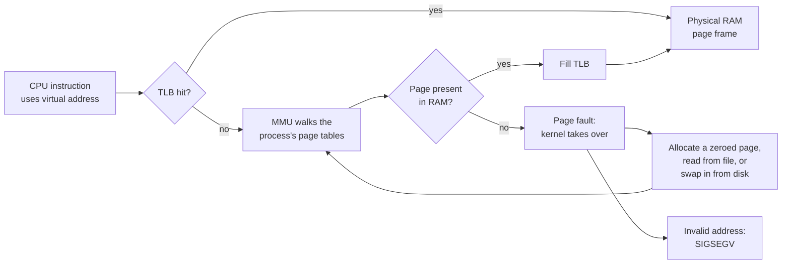

# Memory

> **Level 3 · Chapter 3** · ⏱️ ~50 min read · Prerequisites: [Processes and signals](02-processes-and-signals.md)

Linux memory numbers look contradictory at first: "free" memory is always tiny, processes claim terabytes of virtual memory, and adding up every process's usage gives more than the RAM you own. This chapter explains how virtual memory, the page cache, and swap actually work, so that `free`, `vmstat`, `top`, and `/proc/meminfo` start telling you a clear story.

## Why it matters

Alex's team runs a nightly pandas job on a 16 GB server. One morning a teammate posts a screenshot of `free -h` in the chat: "Only 300 MB free! The server is out of memory, we need a bigger box." A purchase request for a 64 GB machine is drafted.

Alex looks at the same screenshot and sees `available: 11Gi`. The server has plenty of memory. The "missing" RAM is the **page cache**: copies of recently read files the kernel keeps in otherwise idle memory, which it hands back the instant a program needs it. The low `free` number is a sign the kernel is doing its job.

Two weeks later the job really does die, with exit code 137 and nothing in its own log. This time Alex runs `journalctl -k | grep -i oom` and finds `Out of memory: Killed process 48211 (python3)`. One dataset had tripled in size. The fix is to process it in chunks, not to buy a bigger server.

Knowing which number to read, and what each one means, turned two confusing situations into ten-minute answers.

## Concepts

### Physical memory and virtual memory

**Physical memory** is the actual RAM chips. The kernel divides it into fixed-size blocks called **page frames**, 4 KiB each on x86-64.

Programs never see physical addresses. Each process gets its own **virtual address space**: a private, enormous range of addresses (128 TiB for user space on x86-64) that starts empty. When a process uses an address, the hardware translates it to a physical location behind the scenes.

This indirection, called **virtual memory**, buys a lot:

- **Isolation.** Process A's address `0x7f0000001000` and process B's identical address point to different physical RAM. One process can't read or corrupt another's memory.
- **Simplicity.** Every program can be laid out the same way, as if it owned the whole machine.
- **Sharing.** The kernel can map the *same* physical pages into many processes, so one copy of `libc` in RAM serves every program.
- **Laziness.** Memory can be promised but not provided until it's actually touched. A program that reserves 1 GB and uses 10 MB costs 10 MB of RAM.
- **Overflow.** Rarely used pages can be moved out to disk (swap) and brought back when needed.

### Pages, page tables, and the MMU

Virtual memory is also divided into 4 KiB **pages**. A virtual page maps to a physical page frame, or to nothing yet.

The mapping is stored in **page tables**: data structures in RAM, one set per process, maintained by the kernel. On x86-64 they're a tree four (sometimes five) levels deep, so that the huge, mostly empty address space doesn't need a huge table.

The translation itself is done by hardware: the **MMU** (memory management unit), part of the CPU. On every single memory access, the MMU translates the virtual address to a physical one. Walking a four-level table for every access would be slow, so the MMU caches recent translations in the **TLB** (translation lookaside buffer).



When the MMU finds no valid mapping, it raises a **page fault**: it interrupts the program and hands control to the kernel. Page faults are normal, not errors. The kernel decides what kind of fault it is:

- **Minor fault**: the data is already in RAM (for example, a shared library page another process loaded, or a fresh page that just needs zeroing). The kernel only updates the page table. Very cheap.
- **Major fault**: the data must be read from disk (a file not in cache, or a page that was swapped out). Costs a disk read, so thousands of these per second make a system feel slow.
- **Invalid access**: the address isn't part of any mapping, or the access breaks its permissions (writing to read-only code). The kernel sends `SIGSEGV`, and you get "Segmentation fault".

Laziness happens through faults. When a program asks for 1 GB with `malloc`, the kernel just records "this range is valid". Physical pages are only allocated, one minor fault at a time, as the program writes to them.

### A process's address space

Every process's virtual address space has the same overall layout:

```text
 high addresses
┌────────────────────────────┐ 0xffffffffffffffff
│ kernel space               │  mapped in every process, but
│ (not accessible to user    │  only usable in kernel mode
│  code)                     │
├────────────────────────────┤ 0x00007fffffffffff
│ stack            ↓ grows   │  function calls, local variables
│                            │
│ memory mappings            │  shared libraries (libc.so.6),
│ (mmap region)              │  mapped files, large malloc()s,
│                            │  thread stacks
│                            │
│ heap             ↑ grows   │  small malloc() / Python objects
├────────────────────────────┤
│ .bss / .data               │  global variables
│ .text (code), read-only    │  the program's machine code
└────────────────────────────┘ low addresses
```

- **Text** is the program's code, mapped read-only and executable from the file on disk.
- **Data** and **BSS** hold global variables (initialized and zero-initialized).
- The **heap** grows upward as the program allocates memory.
- The **stack** grows downward with function calls.
- The **mmap region** in between holds shared libraries, memory-mapped files, and large allocations.

The exact addresses are randomized at every start, a defence called **ASLR** (address space layout randomization), so attackers can't predict where code lives.

You can see a real layout in `/proc/<PID>/maps`; the Commands section shows one.

### Shared libraries

Most programs don't contain all their own code. Common functions (`printf`, `malloc`, `open`) live in **shared libraries** such as `libc.so.6`, which are loaded when the program starts. `ldd` lists them:

```bash
ldd /usr/bin/ls
```

```text
	linux-vdso.so.1 (0x00007cbfca85d000)
	libselinux.so.1 => /lib/x86_64-linux-gnu/libselinux.so.1 (0x00007cbfca7ec000)
	libc.so.6 => /lib/x86_64-linux-gnu/libc.so.6 (0x00007cbfca400000)
	libpcre2-8.so.0 => /lib/x86_64-linux-gnu/libpcre2-8.so.0 (0x00007cbfca752000)
	/lib64/ld-linux-x86-64.so.2 (0x00007cbfca85f000)
```

Because libraries are mapped from files, read-only and shared, every process using `libc` points at the *same* physical pages for its code. Five hundred processes using libc doesn't mean five hundred copies in RAM. This is great for efficiency and terrible for simple accounting, as you'll see with RSS.

`linux-vdso.so.1` has no file: it's a tiny library the kernel injects into every process to make some calls, like reading the clock, faster. `ld-linux-x86-64.so.2` is the **dynamic loader**, the program that finds and maps the other libraries at startup.

### The page cache

Reading from disk is thousands of times slower than reading from RAM. So whenever a file is read or written, the kernel keeps the data in RAM in the **page cache**. The next read of the same data comes from memory.

The page cache uses memory nobody else is using. Unused RAM does nothing for you, so the kernel fills it with cached file data. When a program needs memory, the kernel drops clean cached pages (ones that match what's on disk) instantly and hands the frames over. Pages that were modified but not yet written back, called **dirty** pages, are written to disk first.

This is why a Linux system that has been running for a while always shows little "free" memory. It's the origin of the famous website *linuxatemyram.com*, whose whole message is: **Linux borrowed your unused memory for disk cache. Don't panic. It's not "used", it's available.**

Writes also go through the page cache. When a program writes a file, the data lands in RAM and the call returns immediately. Background kernel threads write dirty pages to disk a few seconds later (or when `sync` is called). That's why pulling a USB drive without ejecting it can lose data: the "copy finished" dialog may have closed while dirty pages were still in RAM.

### Buffers, cache, and available

`free` shows three related numbers that confuse everyone:

- **buffers**: cached disk *metadata* and raw block-device data (directory blocks, inode tables, filesystem journals). Usually small.
- **cache**: the page cache (file contents) plus **reclaimable slab**, kernel data structures such as the cache of directory entries and inodes that can be thrown away if needed.
- **available**: the kernel's estimate of how much memory could be given to new programs *right now* without swapping. It's roughly free memory plus the reclaimable part of cache and slab, minus reserves the kernel keeps for itself.

Not all cache is reclaimable. **tmpfs** filesystems (like `/dev/shm` and `/run`) and shared memory segments store their files in the page cache too, but there's no disk copy to fall back on, so they can only be moved to swap, not dropped. That's why `available` is less than `free + buff/cache`, and why the `shared` column matters.

**Rule of thumb:** to know whether a machine has memory to spare, read `available`. Ignore `free`.

### Swap and swappiness

**Swap** is disk space the kernel can use as overflow for memory pages. When RAM is tight, the kernel picks pages that haven't been used recently and writes them to swap, freeing the frames. If the process later touches such a page, a major fault reads it back ("swap in").

Only **anonymous memory** (memory not backed by a file: heaps, stacks, Python objects) goes to swap. File-backed pages don't need it; clean ones are simply dropped and reread from their file later.

Swap can be a **swap partition** or a **swap file**. Mint's installer creates a swap file, `/swapfile`. `swapon --show` lists active swap areas.

Swap isn't a sign of failure:

- Some memory is used once at startup and never again (initialization code, data for a feature you never open). Pushing it to swap frees RAM for useful cache.
- Hibernation (suspend to disk) writes RAM into swap.
- A little swap gives the system breathing room before the OOM killer acts.

What *is* bad is **thrashing**: the working set (the pages processes are actively using) doesn't fit in RAM, so pages are constantly swapped out and back in. The disk light stays on, the mouse stutters, and everything slows to a crawl. In `vmstat`, thrashing shows as large, continuous `si` and `so` numbers.

**Swappiness** (`/proc/sys/vm/swappiness`, default 60, range 0–200) tunes how willing the kernel is to swap out anonymous memory versus dropping page cache. Lower values favour keeping program memory in RAM and dropping cache instead; higher values swap more readily. It isn't "the percentage of RAM used before swapping starts", which is a common myth. On a desktop with an SSD and enough RAM, the default is fine. Some people lower it to 10 to keep interactive apps snappy.

### Overcommit and the OOM killer

Because physical pages are only allocated when touched, Linux lets processes reserve more memory than exists. This is called **overcommit**. On this example laptop, `Committed_AS` (memory promised to processes) is around 60 GB while RAM is 16 GB, and that's normal: most of those promises will never be used.

Overcommit has a consequence. If processes actually touch more memory than RAM plus swap can hold, the kernel can't fail the original `malloc`; it already said yes. Instead, when memory is completely exhausted and nothing more can be reclaimed, the kernel invokes the **OOM killer** (out-of-memory killer). It chooses a victim, sends it `SIGKILL`, and frees its memory so the system survives.

The victim is chosen by **OOM score**, mostly "how much memory would killing this free", adjusted by `oom_score_adj` (−1000 to +1000). Each process exposes these in `/proc/<PID>/oom_score` and `/proc/<PID>/oom_score_adj`. A value of −1000 means "never kill me"; systemd sets that for itself and for some critical services.

An OOM kill always leaves a trace in the kernel log:

```text
Out of memory: Killed process 48211 (python3) total-vm:14336780kB, anon-rss:13980212kB, file-rss:2048kB, shmem-rss:0kB, UID:1000 pgtables:27512kB oom_score_adj:0
```

`anon-rss` is the process's anonymous memory, 13.3 GB here. From the outside, the victim just disappears with exit status 137 (128 + SIGKILL).

Ubuntu desktops additionally run **systemd-oomd**, a user-space daemon that kills runaway process groups earlier, based on memory pressure. Mint doesn't install it by default, so on Mint the kernel OOM killer is the safety net.

## Commands and examples

### `free`: the summary

```bash
free -h
```

```text
               total        used        free      shared  buff/cache   available
Mem:            15Gi       6.1Gi       1.2Gi       812Mi       8.6Gi       9.1Gi
Swap:          2.0Gi       256Ki       2.0Gi
```

`-h` means human-readable units (`Gi` = gibibytes, powers of 1024). Every column comes from `/proc/meminfo`:

| Column | Meaning | Source in `/proc/meminfo` |
|---|---|---|
| `total` | Usable RAM (physical minus firmware and kernel-code reservations) | `MemTotal` |
| `used` | Memory that isn't available: `total − available` | computed |
| `free` | Completely unused page frames. Usually small, and that's fine | `MemFree` |
| `shared` | Mostly tmpfs and shared memory. Part of buff/cache that can't be dropped | `Shmem` |
| `buff/cache` | Buffers + page cache + reclaimable kernel slab | `Buffers` + `Cached` + `SReclaimable` |
| `available` | Estimate of memory new programs can get without swapping | `MemAvailable` |
| Swap `used` / `free` | Swap in use / unused | `SwapTotal`, `SwapFree` |

Reading this example: 15 GiB total; 9.1 GiB is available for new work; 8.6 GiB of RAM is currently holding cache, most of which will be dropped if needed; swap is barely touched. This machine is healthy.

The columns don't add up to `total` exactly. `used` is defined as `total − available`, and `available` overlaps with `buff/cache`. (Older versions of `free` calculated `used` differently, so very old guides show other numbers.)

Useful options: `free -w` (wide) splits `buffers` and `cache` into separate columns, `free -m` shows MiB, and `free -s 2` repeats every 2 seconds.

!!! warning "Common mistake"
    Running `sync; echo 3 > /proc/sys/vm/drop_caches` to "free memory". It empties the page cache, so `free` looks better for a moment, but every file you then read must come from disk again. It makes the system slower, not faster. It's only useful for benchmarking cold-cache performance (and needs root, so do it in a VM).

### Watch the page cache work

Read a large file twice and time it. Pick a big file you probably haven't read since boot:

```bash
ls -lhS /usr/lib/x86_64-linux-gnu/ | head -3
time cat /usr/lib/x86_64-linux-gnu/libLLVM.so.19.1 > /dev/null
time cat /usr/lib/x86_64-linux-gnu/libLLVM.so.19.1 > /dev/null
```

```text
total 1.5G
-rw-r--r--   1 root root 138M Apr 21 22:45 libLLVM.so.20.1
-rw-r--r--   1 root root 123M Dec  5  2024 libLLVM.so.19.1

real	0m0.152s
user	0m0.000s
sys	0m0.061s

real	0m0.021s
user	0m0.000s
sys	0m0.020s
```

The first read went to the SSD. The second, seven times faster, came from the page cache. On a spinning hard disk the difference would be 50× or more. (Your exact library names depend on what's installed; any file over 100 MB works.)

### `vmstat`: memory, swap, and CPU over time

```bash
vmstat 2 5
```

```text
procs -----------memory---------- ---swap-- -----io---- -system-- -------cpu-------
 r  b   swpd   free   buff  cache   si   so    bi    bo   in   cs us sy id wa st gu
 1  0    256 1253012 412544 8577320    0    0    42    51  812  950  6  2 92  0  0  0
 0  0    256 1251800 412544 8577388    0    0     0    84 1904 3021  4  1 95  0  0  0
 2  0    256 1248544 412552 8577400    0    0     0     0 2210 3655  9  2 89  0  0  0
 0  0    256 1249012 412552 8577412    0    0     0    18 1736 2840  3  1 96  0  0  0
 1  0    256 1249980 412560 8577420    0    0     0     0 1650 2701  2  1 97  0  0  0
```

`vmstat 2 5` prints a line every 2 seconds, 5 times. **The first line is an average since boot**; the following lines are what happened during each interval, so read from line two onward. Memory columns are in KiB.

| Group | Column | Meaning |
|---|---|---|
| procs | `r` | Runnable threads (running or waiting for a CPU). Consistently above `nproc` = CPU saturation |
| | `b` | Threads blocked in uninterruptible sleep (D state), usually on I/O |
| memory | `swpd` | Swap in use |
| | `free` | Unused RAM |
| | `buff`, `cache` | Buffers and page cache (plus reclaimable slab) |
| swap | `si`, `so` | KiB per second swapped **in** from disk and **out** to disk. Sustained non-zero values = memory pressure |
| io | `bi`, `bo` | KiB per second read from (blocks in) and written to (blocks out) block devices |
| system | `in`, `cs` | Interrupts and context switches per second |
| cpu | `us`, `sy`, `id`, `wa`, `st`, `gu` | Percent of CPU time: user, kernel, idle, waiting for I/O, stolen by a hypervisor, running VM guests |

A healthy box: `si`/`so` at zero, `r` below the core count, `wa` near zero. A thrashing box: `si` and `so` in the thousands every interval, high `b`, high `wa`, and low `id`.

`vmstat -s` prints a one-time list of memory and event counters, and `vmstat -w` widens the columns for big machines.

### `/proc/meminfo`: the source of truth

`free`, `vmstat`, `top`, and `htop` all read this file. You can too:

```bash
head -20 /proc/meminfo
```

```text
MemTotal:       15922728 kB
MemFree:         1253012 kB
MemAvailable:    9541320 kB
Buffers:          412544 kB
Cached:          7980112 kB
SwapCached:          212 kB
Active:          5123400 kB
Inactive:        6702144 kB
Active(anon):    3110812 kB
Inactive(anon):   812004 kB
Active(file):    2012588 kB
Inactive(file):  5890140 kB
Unevictable:      183860 kB
Mlocked:             136 kB
SwapTotal:       2097148 kB
SwapFree:        2096892 kB
Zswap:                 0 kB
Zswapped:              0 kB
Dirty:              1924 kB
Writeback:             0 kB
```

The lines worth knowing:

| Field | Meaning |
|---|---|
| `MemAvailable` | The `available` estimate |
| `Cached` | Page cache, including tmpfs/shared memory |
| `SwapCached` | Pages that were swapped in but still have a copy in swap (can be dropped from swap for free) |
| `Active` / `Inactive` | The kernel's two LRU lists: recently used pages vs candidates for reclaim |
| `(anon)` / `(file)` | Anonymous memory (can only go to swap) vs file-backed (can be dropped and reread) |
| `Dirty` | Modified file data not yet written to disk |
| `AnonPages` | Total anonymous memory mapped by processes |
| `Shmem` | tmpfs and shared memory |
| `Slab`, `SReclaimable`, `SUnreclaim` | Kernel object caches, and how much of them can be freed |
| `PageTables` | Memory used for page tables themselves |
| `Committed_AS` | Memory promised to processes (can far exceed RAM; see overcommit) |

### RSS and VSZ in `ps` and `top`

```bash
ps -o pid,vsz,rss,comm -p $$
```

```text
    PID    VSZ   RSS COMMAND
   4210  10092  3824 bash
```

- **VSZ** (`VIRT` in `top`): total size of the virtual address space in KiB, including libraries, mapped files, and reserved-but-untouched memory.
- **RSS** (`RES` in `top`): resident set size, the part currently in physical RAM, in KiB.

VSZ is almost meaningless for capacity planning. Browsers and Electron apps (VS Code, Slack) reserve gigantic address ranges up front, which is why `top` may show `1450.3g` VIRT for a process using 900 MB of RAM.

RSS is closer to the truth, but it **double-counts shared pages**. Every process using libc counts libc's resident pages in its own RSS. Watch what happens when you add up every process's RSS:

```bash
ps -eo rss= | awk '{ sum += $1 } END { printf "%.1f GiB\n", sum / 1024 / 1024 }'
free -h | grep Mem
```

```text
17.0 GiB
Mem:            15Gi        10Gi       2.1Gi       967Mi       3.9Gi       4.6Gi
```

The total RSS exceeds the RAM in the machine. Shared library and shared memory pages were counted once per process.

### Better accounting: PSS, USS, `smem`, `pmap`

Two more precise measures exist:

- **USS** (unique set size): pages only this process uses. This is what you'd get back by killing it.
- **PSS** (proportional set size): unique pages plus a fair share of each shared page. A page shared by 4 processes counts 1/4 toward each. PSS values add up to real usage.

The kernel computes them in `/proc/<PID>/smaps_rollup`:

```bash
grep -E '^(Rss|Pss|Shared_Clean|Private_Dirty|Swap):' /proc/$$/smaps_rollup
```

```text
Rss:                3832 kB
Pss:                 616 kB
Shared_Clean:       3404 kB
Private_Dirty:       428 kB
Swap:                  0 kB
```

This bash shows 3.8 MB RSS, but its fair share (PSS) is only 0.6 MB, because most of its resident pages are shared with other bash processes and other programs using the same libraries.

`smem` reports USS, PSS, and RSS for every process. It isn't installed by default:

```bash
sudo apt install smem
smem -k -s pss -r | head -5
```

```text
  PID User     Command                         Swap      USS      PSS      RSS
45721 alex     /usr/share/code/code --type      0   812.4M   845.9M   961.2M
16727 alex     /usr/lib/x86_64-linux-gnu/q      0   701.0M   728.3M   817.3M
12549 alex     /opt/google/chrome/chrome        0   598.7M   633.1M   726.8M
 2271 alex     cinnamon                         0   101.2M   126.4M   182.3M
```

`-k` shows units, `-s pss -r` sorts by PSS descending. `smem -u` summarizes per user, which answers "how much RAM is alex really using?".

`pmap` (always installed) breaks one process down mapping by mapping:

```bash
pmap -x $(pgrep -n -x tail)
```

```text
77771:   tail -f /var/log/syslog
Address           Kbytes     RSS   Dirty Mode  Mapping
00005570c374e000       8       8       0 r---- tail
00005570c3750000      40      36       0 r-x-- tail
00005570c375e000       4       4       4 rw--- tail
00005570f76df000     132      16      16 rw---   [ anon ]
00007743f1800000    5588     432       0 r---- locale-archive
00007743f1e00000     160     156       0 r---- libc.so.6
00007743f1e28000    1572     864       0 r-x-- libc.so.6
00007743f2004000       8       8       8 rw--- libc.so.6
00007743f21f6000     172     168       0 r-x-- ld-linux-x86-64.so.2
00007ffd656c6000     136      20      20 rw---   [ stack ]
---------------- ------- ------- -------
total kB            8336    2024     116
```

You can see the address-space layout from the Concepts section: `tail`'s own code at low addresses (`r-x--` = readable and executable), the heap as `[ anon ]`, libraries and the locale file in the mmap region, and `[ stack ]` near the top. Note `libc.so.6`'s 1572 KB of code mapping of which only 864 KB is resident: pages are loaded only when touched. And of 8.3 MB virtual size, only 2 MB is resident, and only 116 KB is dirty (private, modified).

`/proc/<PID>/maps` holds the same information in raw form, and you'll use it in [Devices, /proc, and /sys](05-devices-proc-sys.md).

### Page faults per process

```bash
ps -o pid,min_flt,maj_flt,rss,comm -p $$
```

```text
    PID  MINFL  MAJFL   RSS COMMAND
   4210    198      0  3884 bash
```

`MINFL` and `MAJFL` are the minor and major fault counts since the process started. A process with rapidly growing major faults is waiting on disk for its memory: either it's reading lots of uncached files through memory mappings, or its pages are being swapped.

### Swap and swappiness

```bash
swapon --show
cat /proc/sys/vm/swappiness
```

```text
NAME      TYPE SIZE USED PRIO
/swapfile file   2G 256K   -2
60
```

To see which processes have memory in swap:

```bash
grep -H '^VmSwap' /proc/[0-9]*/status 2>/dev/null | sort -k2 -n -r | head -5
```

```text
/proc/2271/status:VmSwap:	   48120 kB
/proc/4486/status:VmSwap:	   31544 kB
/proc/1918/status:VmSwap:	   12008 kB
/proc/2353/status:VmSwap:	    9876 kB
/proc/1371/status:VmSwap:	    4452 kB
```

`grep -H` prints the filename, which contains the PID; `ps -p 2271` then tells you which program it is.

!!! danger "⚠️ VM only"
    Changing swappiness or swap configuration changes kernel behaviour for the whole system. Try it in your VM first:

    ```bash
    sudo sysctl vm.swappiness=10                                   # until next reboot
    echo 'vm.swappiness=10' | sudo tee /etc/sysctl.d/99-swappiness.conf   # permanent
    ```

    Kernel tuning with `sysctl` is covered properly in [Kernel basics](../06-expert/04-kernel-basics.md).

### Checking for OOM kills

```bash
journalctl -k -b | grep -iE 'out of memory|oom-kill|killed process'
cat /proc/$$/oom_score /proc/$$/oom_score_adj
```

```text
Oct 02 03:12:44 mint kernel: oom-kill:constraint=CONSTRAINT_NONE,nodemask=(null),cpuset=/,mems_allowed=0,global_oom,task_memcg=/user.slice/user-1000.slice/session-c2.scope,task=python3,pid=48211,uid=1000
Oct 02 03:12:44 mint kernel: Out of memory: Killed process 48211 (python3) total-vm:14336780kB, anon-rss:13980212kB, file-rss:2048kB, shmem-rss:0kB, UID:1000 pgtables:27512kB oom_score_adj:0
666
0
```

If the grep prints nothing, no OOM kill happened during this boot. Use `-b -1` for the previous boot. Your shell's `oom_score` is a number from 0 to 1000; higher means more likely to be chosen.

## Exercises

### Exercise 1: Read `free` like a pro (easy)

Run `free -h` and `free -w -h`. Write down, in one sentence each: how much memory new programs could get right now, how much RAM is holding cached file data, and whether the system is using swap heavily. Then check which `/proc/meminfo` fields produced each number.

??? success "Solution"

    ```bash
    free -h
    free -w -h
    grep -E '^(MemTotal|MemFree|MemAvailable|Buffers|Cached|SReclaimable|Shmem|SwapTotal|SwapFree):' /proc/meminfo
    ```

    - New programs could get the `available` value (`MemAvailable`).
    - Cached file data is in `buff/cache`, split by `-w` into `buffers` (`Buffers`) and `cache` (`Cached` + `SReclaimable`).
    - Swap usage is `SwapTotal − SwapFree`. A few hundred MB in use is normal; what matters is whether `si`/`so` in `vmstat` are active.

    `free` is just a formatter for `/proc/meminfo`. You'll prove it with `strace` in [Devices, /proc, and /sys](05-devices-proc-sys.md).

### Exercise 2: Prove the page cache exists (easy)

Find a file larger than 100 MB that you haven't opened since boot (try `ls -lhS /usr/lib/x86_64-linux-gnu | head` or a large dataset of your own). Time reading it twice with `time cat FILE > /dev/null`. Explain the difference.

??? success "Solution"

    ```bash
    ls -lhS /usr/lib/x86_64-linux-gnu | head -3
    time cat /usr/lib/x86_64-linux-gnu/libLLVM.so.19.1 > /dev/null
    time cat /usr/lib/x86_64-linux-gnu/libLLVM.so.19.1 > /dev/null
    ```

    The first `real` time reflects reading from the disk; the second comes from RAM and is several times faster. If both are fast, the file was already cached (something read it earlier); pick another file. The page cache is why re-running a data job over the same CSVs is faster the second time.

### Exercise 3: RSS vs PSS (medium)

Open three terminals so you have at least three `bash` processes. For each bash, compare `Rss` and `Pss` from `/proc/<PID>/smaps_rollup`. Then add up RSS for all bash processes, and add up PSS for them. Which sum is a fair estimate of the RAM bash is using, and why?

??? success "Solution"

    ```bash
    for p in $(pgrep -x bash); do
      printf '%s ' "$p"; grep -E '^(Rss|Pss):' /proc/$p/smaps_rollup | tr '\n' ' '; echo
    done
    for f in Rss Pss; do
      pgrep -x bash | while read -r p; do grep "^$f:" /proc/$p/smaps_rollup; done \
        | awk -v f=$f '{ s += $2 } END { print f, s, "kB" }'
    done
    ```

    ```text
    4210 Rss:                3832 kB Pss:                 616 kB
    15530 Rss:                3904 kB Pss:                 650 kB
    16002 Rss:                3880 kB Pss:                 641 kB
    Rss 11616 kB
    Pss 1907 kB
    ```

    The PSS sum is the fair estimate. RSS counts every shared page (bash's code, libc, locale data) once per process, so it multiplies shared memory by the number of processes. PSS divides each shared page among the processes that share it, so the per-process values add up correctly.

### Exercise 4: Watch memory pressure in `vmstat` (medium)

In one terminal run `vmstat 1`. In another, use Python to allocate and touch about half of your `available` memory, hold it for 10 seconds, then release it:

```bash
python3 -c "
import time
n = 4 * 1024**3          # 4 GiB; adjust to about half of 'available'
b = bytearray(n)         # bytearray writes zeros, so every page is touched
print('allocated'); time.sleep(10)
"
```

Describe what happens to `free`, `cache`, `si`, and `so` while it runs and after it exits.

??? success "Solution"

    While the allocation happens, `free` drops sharply. If there wasn't enough free memory, `cache` also drops, because the kernel reclaims page cache to satisfy the request. With a size well under `available`, `si`/`so` stay at or near zero. After the script exits, `free` jumps back up by about 4 GiB, but `cache` doesn't refill instantly; it grows again only as files are read.

    If you choose a size larger than `available`, you'll see `so` (swap out) climb as anonymous pages of other programs are pushed to swap, and the desktop may stutter. Don't push this to the point of an OOM kill on your main machine; that experiment belongs in the VM (Exercise 5).

### Exercise 5: Meet the OOM killer (hard)

!!! danger "⚠️ VM only"
    This deliberately exhausts memory. Do it in your VM, where an unlucky OOM victim can't cost you work.

In the VM, give the Python process a high OOM score so it's the chosen victim, then allocate more than RAM + swap. Find the kernel's log entry and explain each part. Check the exit status the shell reports.

??? success "Solution"

    ```bash
    free -h
    python3 -c "
    import os
    with open('/proc/self/oom_score_adj', 'w') as f:
        f.write('1000')               # raising your own score needs no root
    chunks = []
    while True:
        chunks.append(bytearray(256 * 1024**2))   # 256 MiB at a time, touched
    "
    echo "exit status: $?"
    journalctl -k -b | grep -iE 'out of memory|oom-kill'
    ```

    ```text
    Killed
    exit status: 137
    ... kernel: Out of memory: Killed process 2875 (python3) total-vm:4421080kB, anon-rss:3962112kB, file-rss:1920kB, shmem-rss:0kB, UID:1000 pgtables:7860kB oom_score_adj:1000
    ```

    The shell prints `Killed` and status 137 (128 + 9, SIGKILL). In the log: `total-vm` is the virtual size, `anon-rss` the anonymous memory it had in RAM (almost everything), `file-rss` file-backed resident pages, `oom_score_adj:1000` confirms why it was picked first. Before the kill, the VM probably became sluggish as swap filled: that's thrashing.

## Check yourself

1. Why does every process get its own virtual address space instead of using physical addresses directly?

    ??? note "Answer"

        Isolation (processes can't touch each other's memory), a uniform layout for every program, the ability to share physical pages (libraries) between processes, lazy allocation (RAM is only used when touched), and the ability to move pages to swap transparently.

2. What does the MMU do, and what is a page fault?

    ??? note "Answer"

        The MMU is CPU hardware that translates every virtual address to a physical one using the process's page tables, caching translations in the TLB. A page fault is the MMU's signal to the kernel that there's no valid mapping for an access. The kernel then allocates a page, reads it from a file or swap (minor or major fault), or sends SIGSEGV if the access was invalid.

3. `free -h` shows `free: 300Mi` and `available: 11Gi` on a 16 GB machine. Is it low on memory?

    ??? note "Answer"

        No. Most RAM is page cache, which the kernel drops instantly when programs need memory. `available` (11 GiB) is the meaningful number.

4. Why does adding up RSS for all processes give more than the total RAM?

    ??? note "Answer"

        RSS counts shared pages (shared libraries, shared memory) in full for every process that maps them. PSS splits shared pages proportionally and adds up correctly.

5. What's the difference between VSZ and RSS, and which one should worry you?

    ??? note "Answer"

        VSZ is the total mapped virtual address space, including reserved and never-touched regions; RSS is what's actually in RAM. RSS (or better, PSS/USS) is the one that reflects real memory use. A huge VSZ alone means nothing.

6. Which kind of memory can be written to swap, and which kind is simply dropped under pressure?

    ??? note "Answer"

        Anonymous memory (heap, stack, tmpfs/shared memory) has no file behind it, so it can only go to swap. Clean file-backed pages (page cache, program code) are dropped and reread from their files later. Dirty file pages are written back to their file, not to swap.

7. What does `vm.swappiness=60` mean? Is it "start swapping at 60% RAM use"?

    ??? note "Answer"

        No. It sets the relative preference between reclaiming anonymous memory (swapping) and reclaiming page cache. Higher values make the kernel more willing to swap; lower values make it prefer dropping cache. It isn't a threshold.

8. A batch job vanished with exit status 137 and nothing in its own log. How do you confirm it was the OOM killer?

    ??? note "Answer"

        `journalctl -k -b | grep -i 'out of memory'` (or `-b -1` if the machine rebooted). The kernel logs the victim's PID, name, and memory usage. 137 = 128 + 9 means SIGKILL, which is what the OOM killer sends.

## Key takeaways

- Each process has a private virtual address space; the MMU translates to physical page frames using per-process page tables, and page faults let the kernel fill memory lazily.
- Shared libraries are mapped once in RAM and shared by every process, which makes RSS double-count. Use PSS (`smaps_rollup`, `smem`) for fair accounting.
- The page cache fills idle RAM with file data and gives it back on demand. Low `free` is normal; read `available`.
- Swap holds anonymous pages. A little swap use is healthy; continuous `si`/`so` in `vmstat` means thrashing. Swappiness sets a preference, not a threshold.
- Linux overcommits memory. When RAM and swap are truly exhausted, the OOM killer sends SIGKILL to the highest-scoring process and logs it to the kernel log.
- `free`, `vmstat`, `top`, and `htop` are all views of `/proc/meminfo`.

## Next

Memory holds file data for speed, but files themselves live on filesystems. Next: [Filesystems, inodes, and links](04-filesystems-and-links.md).
