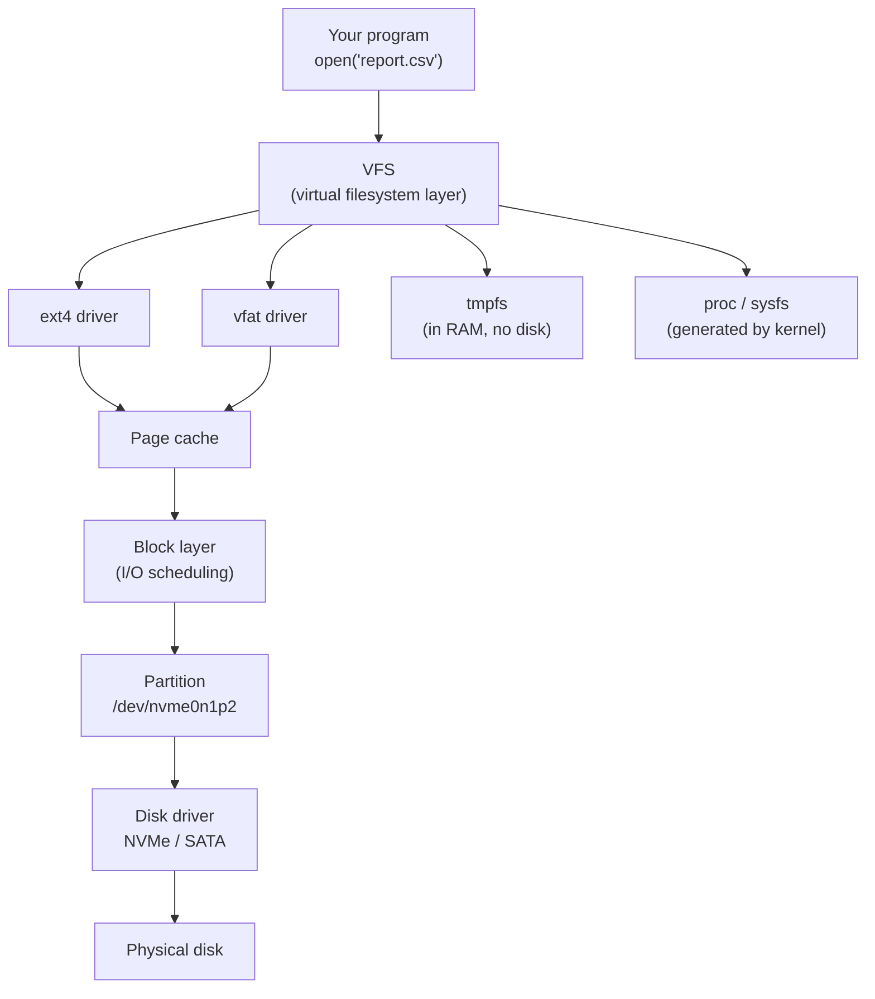
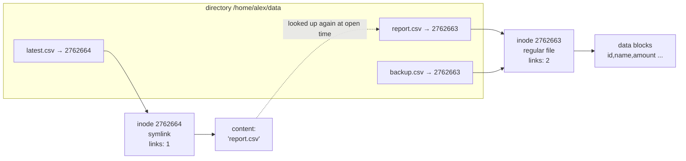

# Filesystems, inodes, and links

> **Level 3 · Chapter 4** · ⏱️ ~50 min read · Prerequisites: [The filesystem layout](../00-first-steps/05-filesystem-layout.md), [Permissions](../01-command-line/03-permissions.md), [Memory](03-memory.md)

A file on Linux isn't a name. It's an inode, a numbered record that a name happens to point to. Once that clicks, hard links, symbolic links, "disk full" errors with free space left, and deleted files that still take up space all make sense. This chapter goes from raw disks and partitions, through filesystems and the VFS, to inodes, links, and mounting.

## Why it matters

At 2 a.m. Alex's monitoring fires: `/` is 100% full on the reporting server. Alex finds a 40 GB log file, `app.log`, deletes it, and runs `df -h`. Still 100% full. Alex deletes more logs. Still full. The application starts failing to write and the on-call channel fills up.

The cause: the application still had `app.log` open. Deleting a file only removes its *name*. The data stays on disk until the last process holding the file open closes it. One `lsof +L1` would have shown the deleted-but-open file, and restarting the app (or truncating the file instead of deleting it) would have freed 40 GB instantly.

The same week, a colleague's backup script reported success but copied nothing useful: it copied a symlink that pointed to a path that didn't exist on the backup server.

Both incidents come down to one idea: names, inodes, and data are three separate things. That's the core of this chapter.

## Concepts

### From disk to file: the layers

Between the physical disk and the `cat report.csv` you type, there are several layers:



Let's go bottom-up.

### Block devices and partitions

A **block device** is a device the kernel reads and writes in fixed-size blocks, with random access: hard disks, SSDs, USB sticks, SD cards. Linux names them by type:

| Name | Device |
|---|---|
| `/dev/sda`, `/dev/sdb`, ... | SATA, SAS, and USB disks (originally "SCSI disk a") |
| `/dev/nvme0n1` | First NVMe SSD: controller 0, namespace 1 |
| `/dev/mmcblk0` | SD card or eMMC |
| `/dev/vda` | Virtual disk in a KVM/QEMU virtual machine |
| `/dev/loop0` | A **loop device**: a file made to look like a disk (snaps use these) |

A disk is usually split into **partitions**: independent regions, each of which can hold its own filesystem. The layout is stored at the start of the disk in a **partition table**. Modern systems use **GPT** (GUID Partition Table); older ones use **MBR**.

Partitions get a suffix: `sda1`, `sda2` for SATA, and `nvme0n1p1`, `nvme0n1p2` for NVMe (the `p` avoids confusion with the namespace number).

A default Mint install on one NVMe disk looks like this:

```text
nvme0n1          ← the whole disk (476.9 GiB)
├─nvme0n1p1      ← ESP, 512 MiB, FAT32, mounted at /boot/efi
└─nvme0n1p2      ← root, ext4, mounted at /
```

Swap lives in a file, `/swapfile`, on the root filesystem rather than in its own partition.

### Filesystems

A raw partition is just a long row of numbered blocks. A **filesystem** is the data structure written onto it that turns those blocks into files and directories: it tracks which blocks are free, which blocks belong to which file, the names, the permissions, and the timestamps. Creating one is called **formatting** (`mkfs`).

The filesystems you'll meet:

| Filesystem | What it is | Where you see it |
|---|---|---|
| **ext4** | Linux's default general-purpose filesystem. Mature, fast, journaled | Mint's root filesystem |
| **xfs** | High-performance journaled filesystem, great with huge files and parallel I/O | Red Hat / Rocky default, big data servers |
| **btrfs** | Copy-on-write filesystem with snapshots, checksums, compression, and built-in multi-disk support | Fedora and openSUSE defaults; optional on Mint |
| **vfat** (FAT32) | Simple old Microsoft filesystem. No Unix permissions, 4 GiB max file size | The ESP; USB sticks |
| **exfat**, **ntfs** | Microsoft filesystems for large USB drives and Windows partitions | Dual-boot and external drives |
| **tmpfs** | A filesystem that lives in RAM (page cache), lost at reboot | `/run`, `/dev/shm`, `/run/user/1000` |
| **proc**, **sysfs** | Not storage at all: files generated by the kernel on demand | `/proc`, `/sys` (next chapter) |
| **squashfs** | Compressed read-only image | Snap packages, live USBs |

**Journaling** deserves a sentence. Writing a file involves several updates (data blocks, the inode, the free-block bitmap, the directory). If power fails halfway, a filesystem without protection can end up inconsistent. A **journal** is a small log where the filesystem first records what it's about to do; after a crash, it replays or discards the journal instead of scanning the whole disk. That's why ext4 recovers in seconds after a power cut.

### The VFS: one interface for every filesystem

Your programs don't know or care whether a file lives on ext4, on a FAT USB stick, in RAM, or is generated by the kernel. They call the same system calls (`open`, `read`, `write`, `stat`) for all of them.

The kernel component that makes this work is the **VFS** (virtual filesystem switch). It defines a common model (files, directories, inodes, mounts) and every filesystem driver implements it. When you call `read()` on a file, the VFS works out which filesystem it belongs to and calls that driver's read function.

This is why "everything is a file" works on Linux: `/proc/meminfo`, `/dev/null`, and `/home/alex/report.csv` all go through the VFS.

### Inodes: what a file really is

On ext4 and other Unix filesystems, every file and directory is represented by an **inode** (index node): a fixed-size record identified by a number, unique within that filesystem. The inode holds everything about the file **except its name**:

- File type (regular file, directory, symlink, device, pipe, socket)
- Permissions (mode bits), owner UID, group GID
- Size in bytes
- Timestamps: **atime** (last access), **mtime** (last content modification), **ctime** (last inode change, e.g. chmod), and on ext4 **btime** (birth/creation)
- **Link count**: how many directory entries point to this inode
- Pointers to the data blocks (on ext4, as **extents**: "blocks 81920 to 82431")

`stat` shows an inode's contents:

```bash
stat report.csv
```

```text
  File: report.csv
  Size: 48213     	Blocks: 96         IO Block: 4096   regular file
Device: 259,2	Inode: 2762663     Links: 1
Access: (0644/-rw-r--r--)  Uid: ( 1000/    alex)   Gid: ( 1000/    alex)
Access: 2026-10-02 10:37:26.999181258 +0530
Modify: 2026-10-02 10:37:26.999785645 +0530
Change: 2026-10-02 10:37:26.999785645 +0530
 Birth: 2026-10-02 10:37:26.999181258 +0530
```

- `Size` is the length in bytes; `Blocks` counts 512-byte units actually allocated (96 × 512 = 48 KiB, rounded up to whole 4 KiB filesystem blocks).
- `Device: 259,2` is the major and minor number of the partition it lives on (next chapter explains these).
- `Inode: 2762663` is the inode number; `Links: 1` is the link count.
- The file name appears in the first line only because you typed it. It isn't stored in the inode.

The number of inodes is fixed when an ext4 filesystem is created. That leads to a strange failure: **you can run out of inodes while having free space**. A directory with ten million tiny cache files can exhaust inodes, and every attempt to create a file fails with "No space left on device" even though `df -h` shows gigabytes free. `df -i` reveals it.

### Directories are maps from names to inodes

If the name isn't in the inode, where is it? In the **directory**. A directory is a special file whose content is a list of entries, each mapping a name to an inode number:

```text
directory /home/alex/data (inode 2762662)
┌──────────────┬───────────┐
│ name         │ inode     │
├──────────────┼───────────┤
│ .            │ 2762662   │  ← itself
│ ..           │ 2762571   │  ← parent directory
│ report.csv   │ 2762663   │
│ events.json  │ 2762670   │
└──────────────┴───────────┘
```

Opening `/home/alex/data/report.csv` means: start at the root inode (always 2 on ext4), look up `home` in it, get an inode number, read that directory, look up `alex`, and so on. This is called **path resolution**, and the kernel caches the results (the **dentry cache**) so repeated lookups are fast.

Some consequences fall straight out of this model:

- **Renaming within a filesystem is instant**, no matter the file size. `mv` just adds a new directory entry and removes the old one; the inode and data don't move.
- **Permission to delete a file depends on the directory**, not the file. Deleting removes an entry from the directory, so you need write permission on the directory.
- **The same inode can have several names.** That's a hard link.

### Hard links

A **hard link** is an additional directory entry pointing to an existing inode. After `ln report.csv backup.csv`, both names point to inode 2762663, and the link count becomes 2.

Neither name is the "original". They're equal. Edit through one name and the other sees the change, because there's only one file. Delete one name and the file survives under the other. The kernel frees the inode and its data blocks only when **the link count reaches 0 and no process has the file open**.

Rules and limits:

- **Same filesystem only.** Inode numbers are only unique within one filesystem, so a directory entry can't point to an inode on another filesystem. `ln` fails with `Invalid cross-device link`.
- **No hard links to directories** (`hard link not allowed for directory`). They could create loops in the tree that would break `find`, `du`, and the parent `..` relationship. The only exceptions are the `.` and `..` entries the filesystem itself manages, which is why a directory's link count is 2 + its number of subdirectories (its own name, its own `.`, and each child's `..`).
- **Protected hardlinks.** Linux refuses to let you hard-link a file you don't own and can't read and write (`/proc/sys/fs/protected_hardlinks` = 1). Otherwise you could pin, say, a setuid program in `/tmp` so a security update couldn't really remove it.

### Symbolic links

A **symbolic link** (symlink, soft link) is a small separate file, with its own inode, whose content is a *path*. When you open a symlink, the kernel reads that path and continues resolution from there.



Here `report.csv` and `backup.csv` are hard links (two names, one inode). `latest.csv` is a symlink: a separate inode whose content is the text `report.csv`.

Because a symlink stores a path, not an inode number:

- **It can cross filesystems** and can point to directories.
- **It can dangle.** If the target is deleted or renamed, the symlink remains but points nowhere. Opening it fails with `No such file or directory`, which is confusing because `ls` clearly shows it.
- **Relative targets are relative to the symlink's directory**, not to your current directory. `ln -s data.csv /tmp/link` creates a link to `/tmp/data.csv`, which is probably not what you meant.
- **Deleting a symlink never touches the target.**
- Permissions on the symlink itself (`lrwxrwxrwx`) are ignored; the target's permissions apply.

| | Hard link | Symbolic link |
|---|---|---|
| What it is | Another name for the same inode | A tiny file containing a path |
| Own inode? | No (shares one) | Yes |
| Crosses filesystems? | No | Yes |
| Can point to directories? | No | Yes |
| If target name is deleted | Data survives (other names remain) | Link dangles |
| Shown by `ls -l` as | A regular file with link count > 1 | `l` type, `name -> target` |
| Typical use | Space-efficient backup snapshots (`rsync --link-dest`), atomic file swaps | Version switching (`python3 -> python3.12`), config pointing, `/etc/alternatives` |

Mint is full of symlinks: `/sbin/init -> ../lib/systemd/systemd`, `/boot/vmlinuz -> vmlinuz-6.14...`, and even `/bin -> usr/bin`.

### Why deleting an open file doesn't free space

Now the 2 a.m. incident makes sense. An inode is freed when *two* counts reach zero:

1. The **link count** (directory entries pointing to it), and
2. The number of **open file descriptions** (processes holding it open).

`rm app.log` drops the link count to 0, so the name vanishes. But the application still has the file open and keeps writing to it. The inode and all its blocks stay allocated. `du` (which walks directory entries) can't see the file anymore; `df` (which asks the filesystem how many blocks are used) still counts it.

The fixes:

- Restart or signal the program so it closes and reopens its log (many daemons reopen logs on `SIGHUP`; that's what `logrotate` relies on).
- Truncate instead of deleting: `: > app.log` or `truncate -s 0 app.log` empties the file in place, freeing the blocks immediately while the program keeps its descriptor.
- Find culprits with `lsof +L1` (open files with link count less than 1).

This behaviour is also useful: programs create temporary files, open them, then delete them immediately. The file is invisible to everyone else and is cleaned up automatically, even if the program crashes.

### Mounting: one tree from many filesystems

Windows gives each filesystem a drive letter. Linux has a single directory tree starting at `/`, and attaches each filesystem somewhere in that tree. Attaching a filesystem at a directory is called **mounting**, and the directory is the **mount point**.

```text
/                     ← ext4 on nvme0n1p2
├── boot/
│   └── efi/          ← vfat on nvme0n1p1 mounted here
├── home/alex/
├── dev/              ← devtmpfs (kernel-managed)
├── proc/             ← proc (kernel-generated)
├── sys/              ← sysfs (kernel-generated)
├── run/              ← tmpfs (RAM)
└── media/alex/USB/   ← vfat on sdb1, mounted when you plug in a stick
```

When something is mounted on a directory, whatever was in that directory before is hidden (not deleted) until you unmount. That's a classic puzzle: files "disappear" after a mount and "reappear" after `umount`.

The kernel keeps the list of current mounts in the **mount table**, visible as `/proc/self/mounts` (also linked as `/etc/mtab` and `/proc/mounts`). Each process actually has its own view (mount namespaces, used by containers in [Containers from scratch](../06-expert/01-containers-from-scratch.md)), but normally everyone shares one.

On Mint, `/tmp` is just a directory on the root filesystem. Some other distributions mount a tmpfs there, so files in `/tmp` live in RAM and vanish at reboot.

#### `/etc/fstab`

**`/etc/fstab`** (filesystem table) lists filesystems to mount at boot. At boot, systemd turns each line into a `.mount` unit (as you saw in [The boot process](01-boot-process.md)). A Mint fstab:

```text
# <file system>                           <mount point>  <type>  <options>          <dump> <pass>
UUID=3f2a6c1e-8b4d-4e2a-9c7f-1d5e8a0b9c42  /              ext4    errors=remount-ro  0      1
UUID=A1B2-C3D4                             /boot/efi      vfat    umask=0077         0      1
/swapfile                                  none           swap    sw                 0      0
```

| Field | Meaning |
|---|---|
| file system | What to mount. Prefer `UUID=...` over `/dev/sdb1` |
| mount point | Where to attach it (`none` for swap) |
| type | `ext4`, `vfat`, `xfs`, `swap`, ... (`auto` to detect) |
| options | Comma-separated mount options; `defaults` = `rw,suid,dev,exec,auto,nouser,async` |
| dump | Legacy `dump` backup flag; always 0 |
| pass | fsck order at boot: 1 for root, 2 for other local filesystems, 0 to skip |

**Why UUIDs?** Device names are assigned in detection order. Plug in a USB disk and what was `/dev/sdb` might become `/dev/sdc` on the next boot, and your fstab mounts the wrong disk (or fails, sending you to emergency mode). A **UUID** (universally unique identifier) is a random ID written into the filesystem when it's created, so it follows the filesystem wherever the kernel names it.

Common options: `ro`/`rw`, `noatime` (don't update access times; fewer writes), `nofail` (don't block boot if the device is missing; essential for external drives), `noexec`, `nosuid`, `nodev` (security options for untrusted media), `x-systemd.automount` (mount on first access), and `errors=remount-ro` (ext4: switch to read-only on corruption instead of making it worse).

### `df` vs `du`, and why they disagree

Two tools answer "how much space is used", in completely different ways:

- **`df`** (disk free) asks each filesystem for its own totals: blocks in use, blocks free. It's instant and covers everything the filesystem knows about.
- **`du`** (disk usage) walks the directory tree, calls `stat` on every file it can reach, and adds up allocated blocks. It's slow on big trees and only counts what it can see.

They disagree, and every reason teaches something:

| Reason | Effect |
|---|---|
| Deleted files still held open | Counted by `df`, invisible to `du` |
| Files hidden under a mount point | Counted by `df` for the underlying filesystem, invisible to `du` |
| Reserved blocks (ext4 reserves 5% for root by default) | `df`'s `Size` ≠ `Used + Avail` |
| Directories you can't read | `du` skips them (with "Permission denied") |
| Hard links | `du` counts each inode once per run; separate `du` runs on each name count it twice |
| Sparse files (holes that were never written) | `ls -l` shows the large apparent size; `du` shows actual blocks (use `du --apparent-size` to compare) |
| Filesystem metadata (journal, inode tables) | Used according to `df`, not part of any file |

## Commands and examples

### `lsblk`: see disks and partitions

```bash
lsblk
```

```text
NAME        MAJ:MIN RM   SIZE RO TYPE MOUNTPOINTS
loop0         7:0    0    74M  1 loop /snap/core22/2955
sda           8:0    1  28.9G  0 disk
└─sda1        8:1    1  28.9G  0 part /media/alex/USB
nvme0n1     259:0    0 476.9G  0 disk
├─nvme0n1p1 259:1    0   512M  0 part /boot/efi
└─nvme0n1p2 259:2    0 476.4G  0 part /
```

- `MAJ:MIN` is the device number pair (driver and instance).
- `RM` is 1 for removable devices (the USB stick).
- `RO` is 1 for read-only (snap images are read-only squashfs on loop devices).
- `TYPE` is `disk`, `part`, `loop`, `crypt`, `lvm`, and so on.

Add `-f` for filesystem information:

```bash
lsblk -f
```

```text
NAME        FSTYPE FSVER LABEL UUID                                 FSAVAIL FSUSE% MOUNTPOINTS
sda
└─sda1      vfat   FAT32 USB   5E2A-91C7                              27.1G     6% /media/alex/USB
nvme0n1
├─nvme0n1p1 vfat   FAT32       A1B2-C3D4                             504.9M     1% /boot/efi
└─nvme0n1p2 ext4   1.0         3f2a6c1e-8b4d-4e2a-9c7f-1d5e8a0b9c42  321.4G    26% /
```

`lsblk -o NAME,SIZE,FSTYPE,MOUNTPOINTS,MODEL` lets you choose columns.

### `blkid`: filesystem identifiers

```bash
blkid
```

```text
/dev/nvme0n1p2: UUID="3f2a6c1e-8b4d-4e2a-9c7f-1d5e8a0b9c42" BLOCK_SIZE="4096" TYPE="ext4" PARTUUID="da1f207d-..."
```

As a normal user, `blkid` may only print cached results or nothing for some devices; `sudo blkid` probes every device directly. Note the difference between **UUID** (identifies the filesystem; changes if you reformat) and **PARTUUID** (identifies the GPT partition entry; survives reformatting). Both can be used in fstab. `ls -l /dev/disk/by-uuid/` shows the same mapping as symlinks maintained by udev.

### `ls -i`, `stat`, and `df -i`: inodes

```bash
ls -i
ls -di / /boot /home /proc
```

```text
2762663 report.csv  2762670 events.json
       2 /
  131073 /boot
11927553 /home
       1 /proc
```

The root directory of an ext4 filesystem is always inode 2 (inode 1 is reserved for tracking bad blocks). `/proc` is inode 1 of a completely different filesystem. Inode numbers only mean something together with the filesystem.

Inode usage per filesystem:

```bash
df -i /
```

```text
Filesystem       Inodes   IUsed    IFree IUse% Mounted on
/dev/nvme0n1p2 31227904 1408734 29819170    5% /
```

If `IUse%` hits 100%, no new files can be created regardless of free space. FAT filesystems show `0` inodes because FAT has no real inodes; Linux fakes them in memory.

### Hard links in practice

Work in a scratch directory:

```bash
mkdir -p ~/scratch/links && cd ~/scratch/links
echo "id,name" > data.csv
ls -li
ln data.csv hard.csv
ls -li
```

```text
2762663 -rw-rw-r-- 1 alex alex 8 Oct  2 10:37 data.csv
2762663 -rw-rw-r-- 2 alex alex 8 Oct  2 10:37 data.csv
2762663 -rw-rw-r-- 2 alex alex 8 Oct  2 10:37 hard.csv
```

Same inode number, and the link count (the number after the permissions) went from 1 to 2.

```bash
echo "1,alice" >> hard.csv
cat data.csv
rm data.csv
ls -li
cat hard.csv
```

```text
id,name
1,alice
2762663 -rw-rw-r-- 1 alex alex 16 Oct  2 10:38 hard.csv
id,name
1,alice
```

Writing via one name shows up via the other; deleting one name leaves the data reachable through the remaining name with a link count of 1.

The limits in action:

```bash
ln hard.csv /dev/shm/x
ln /etc/hostname myhost
mkdir sub && ln sub subhard
```

```text
ln: failed to create hard link '/dev/shm/x' => 'hard.csv': Invalid cross-device link
ln: failed to create hard link 'myhost' => '/etc/hostname': Operation not permitted
ln: sub: hard link not allowed for directory
```

`/dev/shm` is a different filesystem (tmpfs). `/etc/hostname` is on the same filesystem, but it's owned by root and not writable by you, so the protected-hardlinks rule blocks it. Directories can't be hard-linked at all.

Directory link counts:

```bash
mkdir -p proj/{src,tests,docs}
stat -c '%h %n' proj
```

```text
5 proj
```

5 = its name in the parent + its own `.` + three `..` entries from the subdirectories.

### Symbolic links in practice

```bash
ln -s hard.csv soft.csv
ls -li
```

```text
2762663 -rw-rw-r-- 1 alex alex 16 Oct  2 10:38 hard.csv
2762664 lrwxrwxrwx 1 alex alex  8 Oct  2 10:39 soft.csv -> hard.csv
```

A different inode, type `l`, size 8 (the length of the text `hard.csv`), and the target shown after `->`. The link count of `hard.csv` didn't change, because a symlink doesn't reference the inode.

Read the target and resolve it fully:

```bash
readlink soft.csv
readlink -f soft.csv
```

```text
hard.csv
/home/alex/scratch/links/hard.csv
```

Make it dangle:

```bash
mv hard.csv renamed.csv
ls -l soft.csv
cat soft.csv
```

```text
lrwxrwxrwx 1 alex alex 8 Oct  2 10:39 soft.csv -> hard.csv
cat: soft.csv: No such file or directory
```

`ls` happily lists the link (it exists), but following it fails. In a colour terminal, `ls` shows dangling links in red. Find all broken links in a tree with:

```bash
find . -xtype l
```

```text
./soft.csv
```

`-xtype l` means "is still a symlink after following links", which is only true when the target doesn't exist.

!!! warning "Common mistake"
    Getting the argument order or relative path wrong. The order is `ln -s TARGET LINK_NAME`, the same as `cp SOURCE DEST`. And a relative target is resolved from the link's directory: `ln -s data/report.csv /tmp/latest.csv` makes `/tmp/latest.csv` point to `/tmp/data/report.csv`. Use an absolute target, or `ln -sr` (relative, computed for you), when the link lives elsewhere.

Swap a symlink atomically, a common deployment trick:

```bash
ln -sfn release-2026-10-02 current
```

`-f` replaces an existing link and `-n` treats an existing symlink to a directory as a file rather than descending into it. Web servers pointing at `/srv/app/current` then switch to the new release in one step.

### Deleted but still open: see it happen

```bash
cd ~/scratch/links
dd if=/dev/zero of=big.log bs=1M count=500 status=none
df -h --output=used,avail / ; du -sh .
tail -f big.log > /dev/null 2>&1 &
rm big.log
df -h --output=used,avail / ; du -sh .
```

```text
 Used Avail
 101G  211G
501M	.
 Used Avail
 101G  211G
20K	.
```

After `rm`, `du` drops to almost nothing but `df` hasn't moved: `tail` still holds the file. Find it:

```bash
lsof +L1 | grep big.log
ls -l /proc/$!/fd
```

```text
tail    9120 alex    3r   REG  259,2 524288000     0 2762671 /home/alex/scratch/links/big.log (deleted)
lr-x------ 1 alex alex 64 Oct  2 10:41 3 -> /home/alex/scratch/links/big.log (deleted)
```

`NLINK` is 0 and the name is marked `(deleted)`. Now release it:

```bash
kill %1
df -h --output=used,avail /
```

```text
 Used Avail
 100G  212G
```

The space comes back the moment the last descriptor closes. (Your numbers will differ; watch for the 0.5 GB change.)

### Mount information: `findmnt` and `mount`

`findmnt` is the modern tool for reading the mount table, and it draws the tree:

```bash
findmnt --real
```

```text
TARGET                      SOURCE         FSTYPE      OPTIONS
/                           /dev/nvme0n1p2 ext4        rw,relatime,errors=remount-ro
├─/run/user/1000/doc        portal         fuse.portal rw,nosuid,nodev,relatime,user_id=1000,group_id=1000
├─/snap/core22/2955         /dev/loop0     squashfs    ro,nodev,relatime,errors=continue,threads=single
└─/boot/efi                 /dev/nvme0n1p1 vfat        rw,relatime,fmask=0077,dmask=0077,...
```

`--real` hides pseudo-filesystems (proc, sysfs, cgroup, ...). Other useful forms:

```bash
findmnt /                    # what's mounted at /
findmnt -T ~/scratch         # which filesystem contains this path
findmnt -t ext4,vfat         # only these types
findmnt --fstab              # what fstab says should be mounted
findmnt --verify             # check fstab for errors (sudo for full checks)
```

`findmnt --verify` is your safety net before rebooting after editing fstab.

The classic `mount` with no arguments prints the whole table, one line per mount:

```bash
mount | grep '^/dev'
```

```text
/dev/nvme0n1p2 on / type ext4 (rw,relatime,errors=remount-ro)
/dev/nvme0n1p1 on /boot/efi type vfat (rw,relatime,fmask=0077,dmask=0077,codepage=437,iocharset=iso8859-1,shortname=mixed,errors=remount-ro)
```

### Mounting and unmounting a filesystem

!!! danger "⚠️ VM only"
    Mounting, unmounting, formatting, and editing `/etc/fstab` need root and can make data inaccessible or the system unbootable. Practice in your VM with a second virtual disk added in your hypervisor (see [Set up your practice lab](../../lab-setup.md)). Double-check device names with `lsblk` before every command; formatting the wrong device destroys its data instantly.

In the VM, assuming you added a blank 2 GB disk that appears as `/dev/vdb` (or `/dev/sdb`):

```bash
lsblk                                   # confirm the new disk name first
sudo mkfs.ext4 -L data /dev/vdb         # format the whole disk (no partition, fine for a lab)
sudo mkdir -p /mnt/data
sudo mount /dev/vdb /mnt/data
findmnt /mnt/data
sudo chown alex: /mnt/data
sudo umount /mnt/data
```

```text
TARGET    SOURCE   FSTYPE OPTIONS
/mnt/data /dev/vdb ext4   rw,relatime
```

If `umount` says `target is busy`, some process has a file open or its current directory inside the mount. Find it with `lsof /mnt/data` or `fuser -vm /mnt/data`, and `cd` out of it.

To mount it at every boot, add an fstab line by UUID, then test without rebooting:

```bash
sudo blkid /dev/vdb
sudoedit /etc/fstab
```

```text
UUID=7c9e2f4a-1d3b-4f6e-8a2c-5b0d9e7f3a11  /mnt/data  ext4  defaults,nofail  0  2
```

```bash
sudo findmnt --verify
sudo systemctl daemon-reload
sudo mount -a
findmnt /mnt/data
```

`mount -a` mounts everything in fstab that isn't mounted yet. If it errors, fix fstab *now*, while you still have a working shell, rather than discovering it at the next boot in emergency mode. `systemctl daemon-reload` makes systemd regenerate its `.mount` units from the edited file.

Day-to-day disk work, such as partitioning and backups, is covered in [Disks and backups](../04-sysadmin/06-disks-and-backups.md).

### `df` and `du`

```bash
df -hT -x tmpfs -x squashfs -x efivarfs
```

```text
Filesystem     Type  Size  Used Avail Use% Mounted on
/dev/nvme0n1p2 ext4  469G  124G  321G  28% /
/dev/nvme0n1p1 vfat  511M  6.1M  505M   2% /boot/efi
```

`-h` human-readable, `-T` adds the type, and `-x` excludes noisy types. Notice 124 + 321 = 445, not 469: the missing 24 GB is ext4's 5% reserved for root, which lets root-owned services keep working when users fill the disk.

`du` for "where did my space go":

```bash
du -sh ~/Downloads
du -h --max-depth=1 ~ 2>/dev/null | sort -h | tail -5
```

```text
4.2G	/home/alex/Downloads
1.1G	/home/alex/.local
2.3G	/home/alex/.cache
4.2G	/home/alex/Downloads
9.8G	/home/alex/projects
18G	/home/alex
```

- `-s` summarizes one total per argument; `-h` is human-readable.
- `--max-depth=1` (or `-d 1`) shows one level of subdirectories.
- `sort -h` sorts human-readable sizes correctly (so 2.3G comes after 900M).
- Add `-x` to stay on one filesystem, which stops `du /` from wandering into `/proc` or mounted drives.

Sparse files show the difference between apparent size and allocated blocks:

```bash
truncate -s 1G sparse.img
ls -lh sparse.img; du -h sparse.img; du -h --apparent-size sparse.img
```

```text
-rw-rw-r-- 1 alex alex 1.0G Oct  2 10:50 sparse.img
0	sparse.img
1.0G	sparse.img
```

The file claims 1 GiB but occupies no blocks: it's all one "hole". VM disk images are often sparse.

### `ncdu`: interactive disk usage

`du | sort` gets tedious when you're hunting through many levels. `ncdu` (NCurses Disk Usage) scans once and lets you browse with arrow keys:

```bash
sudo apt install ncdu
ncdu -x ~
```

```text
ncdu 1.19 ~ Use the arrow keys to navigate, press ? for help
--- /home/alex ----------------------------------------------------------
    9.8 GiB [##########] /projects
    4.2 GiB [####      ] /Downloads
    2.3 GiB [##        ] /.cache
    1.1 GiB [#         ] /.local
  312.0 MiB [          ] /.mozilla
```

Arrow keys and ++enter++ navigate, ++d++ deletes the highlighted item (it asks first), ++q++ quits. `-x` stays on one filesystem. Other modern alternatives include `gdu` and `dust`, but `du` is the one that's always there.

## Exercises

### Exercise 1: Map your storage (easy)

Using `lsblk -f`, `findmnt --real`, and `df -hT`, write down: every disk and partition, which filesystem each holds, where it's mounted, and how full it is. Which mounts are on real devices and which are virtual?

??? success "Solution"

    ```bash
    lsblk -f
    findmnt --real
    df -hT -x tmpfs -x squashfs -x efivarfs
    ```

    On a default Mint laptop: one disk (`nvme0n1` or `sda`), an ESP (`vfat`, `/boot/efi`) and a root partition (`ext4`, `/`). Snaps, if any, appear as read-only `squashfs` on `loop` devices. Virtual filesystems, which `findmnt` without `--real` would add, include `proc`, `sysfs`, `devtmpfs`, several `tmpfs` (`/run`, `/dev/shm`, `/run/user/1000`), and `cgroup2`. None of those use disk space.

### Exercise 2: Hard link lifecycle (easy)

In `~/scratch/links`, create `orders.csv`, make two hard links to it, and show the link count go 1 → 3 → 2 → 1 as you add and delete names. At each step, prove the content is still there.

??? success "Solution"

    ```bash
    cd ~/scratch/links
    printf 'id,total\n1,99.50\n' > orders.csv
    stat -c '%h %i %n' orders.csv
    ln orders.csv orders-a.csv; ln orders.csv orders-b.csv
    stat -c '%h %i %n' orders*.csv
    rm orders.csv;   stat -c '%h %i %n' orders-*.csv; cat orders-a.csv
    rm orders-a.csv; stat -c '%h %i %n' orders-b.csv;  cat orders-b.csv
    ```

    ```text
    1 2762680 orders.csv
    3 2762680 orders-a.csv
    3 2762680 orders-b.csv
    3 2762680 orders.csv
    2 2762680 orders-a.csv
    2 2762680 orders-b.csv
    id,total
    1,99.50
    1 2762680 orders-b.csv
    id,total
    1,99.50
    ```

    All names share one inode number. The data survives until the last name is gone (and no process has it open).

### Exercise 3: Break and fix a symlink (medium)

Create a directory `releases/v1` with a file `app.py`, and a symlink `current` pointing to `releases/v1`. Show `current/app.py` works. Then rename `v1` to `v2`, show the dangling link with `find -xtype l`, and repoint `current` atomically to `releases/v2`.

??? success "Solution"

    ```bash
    cd ~/scratch/links
    mkdir -p releases/v1 && echo 'print("v1")' > releases/v1/app.py
    ln -s releases/v1 current
    python3 current/app.py
    mv releases/v1 releases/v2
    find . -xtype l
    python3 current/app.py
    ln -sfn releases/v2 current
    ls -l current; python3 current/app.py
    ```

    ```text
    v1
    ./current
    python3: can't open file '/home/alex/scratch/links/current/app.py': [Errno 2] No such file or directory
    lrwxrwxrwx 1 alex alex 11 Oct  2 11:02 current -> releases/v2
    v1
    ```

    The last line still prints `v1` because that's what the file contains; what matters is that `current` resolves again. Without `-n`, `ln -sf releases/v2 current` would follow the existing `current` link if it pointed to a directory and create a link *inside* it.

### Exercise 4: Make `df` and `du` disagree (medium)

Create a 300 MB file, hold it open with a background process, delete it, and show the disagreement between `df` and `du`. Find the file with `lsof`, then free the space without killing the process by truncating it through `/proc/<PID>/fd/<N>`.

??? success "Solution"

    ```bash
    cd ~/scratch/links
    dd if=/dev/zero of=held.bin bs=1M count=300 status=none
    sleep 3600 < held.bin &
    P=$!
    rm held.bin
    df -h --output=used / ; du -sh .
    lsof -p $P | grep held.bin
    ls -l /proc/$P/fd/0
    : > /proc/$P/fd/0
    df -h --output=used /
    kill $P
    ```

    ```text
     Used
     101G
    24K	.
    sleep   9301 alex    0r   REG  259,2 314572800 2762690 /home/alex/scratch/links/held.bin (deleted)
    lr-x------ 1 alex alex 64 Oct  2 11:10 0 -> /home/alex/scratch/links/held.bin (deleted)
     Used
     100G
    ```

    `sleep`'s stdin (fd 0) is the deleted file. `/proc/<PID>/fd/0` is a magic link that opens the very same inode, so truncating it with `: >` releases the blocks while the process keeps running. On a real server, this is how you rescue a full disk when you can't restart the program holding a giant deleted log. (You need write permission on the file; for another user's process you'd need sudo.)

### Exercise 5: Add a data disk the right way (hard)

!!! danger "⚠️ VM only"
    Do this in your VM with a spare virtual disk. Formatting the wrong device destroys data.

Add a 2 GB virtual disk to your VM. Create one GPT partition, format it as ext4 with the label `data`, mount it at `/srv/data` via `/etc/fstab` using its UUID with `nofail`, and prove it survives a reboot. Then unplug the disk (detach it in the hypervisor) and prove the VM still boots.

??? success "Solution"

    ```bash
    lsblk                                         # identify the new disk, e.g. vdb
    sudo parted /dev/vdb --script mklabel gpt mkpart data ext4 1MiB 100%
    lsblk /dev/vdb                                # now has vdb1
    sudo mkfs.ext4 -L data /dev/vdb1
    sudo mkdir -p /srv/data
    UUID=$(sudo blkid -s UUID -o value /dev/vdb1); echo "$UUID"
    echo "UUID=$UUID  /srv/data  ext4  defaults,nofail  0  2" | sudo tee -a /etc/fstab
    sudo findmnt --verify
    sudo systemctl daemon-reload
    sudo mount -a
    findmnt /srv/data
    sudo reboot
    ```

    After the reboot, `findmnt /srv/data` shows it mounted. Shut down, detach the disk, and boot again: thanks to `nofail`, systemd logs a timeout for the device but continues booting instead of entering emergency mode. Without `nofail`, `local-fs.target` would fail. Check what happened with `journalctl -b -u srv-data.mount` (systemd names the unit after the path, with `/` turned into `-`).

## Check yourself

1. What does an inode store, and what notably isn't in it?

    ??? note "Answer"

        Type, permissions, owner and group, size, timestamps (atime, mtime, ctime, birth), link count, and pointers to the data blocks. The file name isn't in the inode; names live in directory entries.

2. Why can't you create a hard link to a file on another filesystem, while a symlink works fine?

    ??? note "Answer"

        A hard link is a directory entry holding an inode number, and inode numbers are only unique within one filesystem. A symlink stores a path string, which is resolved at open time and can lead anywhere.

3. You delete a symlink's target. What happens to the symlink? What happens if you delete one of two hard links instead?

    ??? note "Answer"

        The symlink remains but dangles: opening it fails with "No such file or directory". Deleting one hard link just decrements the link count; the data stays accessible via the other name.

4. `df` says the disk is full, `du` finds far less. Give three possible reasons.

    ??? note "Answer"

        Deleted files still held open by processes (check `lsof +L1`); files hidden underneath a mount point; directories `du` couldn't read; filesystem reserved blocks and metadata. Also possible: running `du` on only part of the filesystem.

5. File creation fails with "No space left on device" but `df -h` shows 30 GB free. What do you check?

    ??? note "Answer"

        `df -i`. The filesystem has probably run out of inodes, typically because of millions of tiny files.

6. Why does fstab use `UUID=` instead of `/dev/sdb1`?

    ??? note "Answer"

        Device names depend on detection order and can change between boots or when disks are added. The UUID is stored in the filesystem itself, so it always identifies the right one.

7. What does the VFS do?

    ??? note "Answer"

        It's the kernel layer that gives every filesystem (ext4, vfat, tmpfs, proc, ...) one common interface, so programs use the same `open`/`read`/`write`/`stat` calls everywhere and don't need to know which filesystem a file lives on.

8. Why is a directory's link count always at least 2, and what makes it higher?

    ??? note "Answer"

        Its entry in the parent directory plus its own `.` entry make 2. Each subdirectory's `..` entry adds one more.

## Key takeaways

- Disks are block devices, split into partitions, each formatted with a filesystem. The VFS gives all filesystems, real and virtual, a single interface.
- A file is an inode (metadata + block pointers). Names live in directories, which map names to inode numbers.
- Hard links are extra names for one inode (same filesystem, no directories). Symlinks are small files containing a path (cross anything, can dangle).
- Space is freed only when the link count is 0 *and* no process has the file open. `lsof +L1` finds deleted-but-open files.
- Linux has one tree; filesystems are mounted onto directories. `findmnt` shows the mount table; `/etc/fstab` (by UUID, with `nofail` for removable disks) defines boot-time mounts. Test with `findmnt --verify` and `mount -a`.
- `df` asks the filesystem, `du` walks the tree. When they disagree, the difference is always explainable.

## Next

You've seen `/dev/nvme0n1`, `/dev/shm`, `/proc`, and `/sys` in passing. Next you'll find out what device files really are and how the kernel exposes itself as files: [Devices, /proc, and /sys](05-devices-proc-sys.md).
