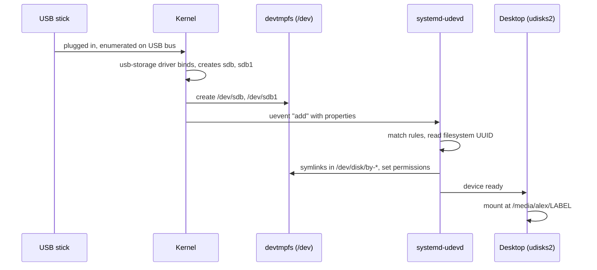
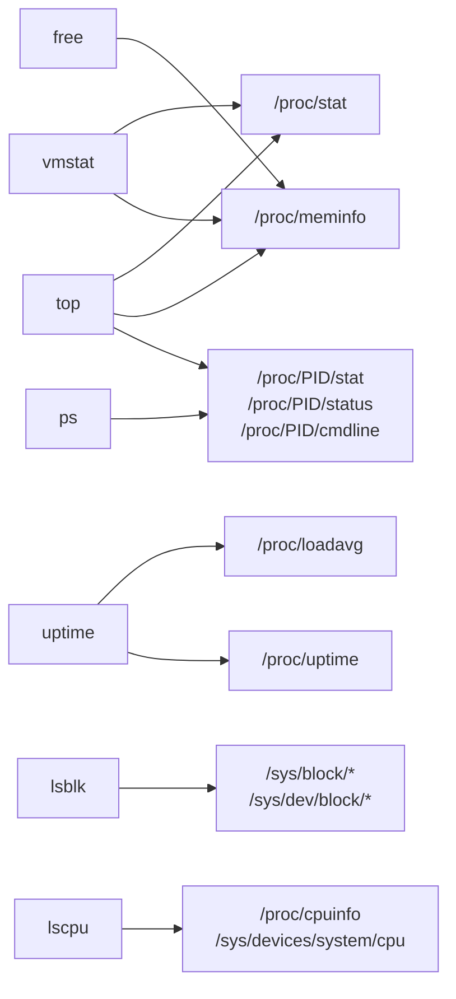

# Devices, /proc, and /sys

> **Level 3 · Chapter 5** · ⏱️ ~45 min read · Prerequisites: [Filesystems, inodes, and links](04-filesystems-and-links.md), [Processes and signals](02-processes-and-signals.md)

On Linux, hardware shows up as files in `/dev`, and the kernel describes itself through files in `/proc` and `/sys`. Once you can read these three directories, you can answer almost any "what is this machine doing?" question with `cat`, and you'll see that tools like `ps`, `free`, and `lsblk` are mostly polite formatters for these files.

## Why it matters

Alex is handed SSH access to a stripped-down cloud VM to debug a slow ETL job. There's no `htop`, no `lshw`, and no permission to install anything. A teammate says "we're blind until ops installs some tools."

Alex isn't blind. `cat /proc/loadavg` gives the load. `cat /proc/meminfo` gives memory. `ls -l /proc/<PID>/fd` shows exactly which files the ETL process has open, and `cat /proc/<PID>/status` shows its memory and state. `cat /sys/block/vda/queue/rotational` reveals the "SSD" is actually a spinning disk, and `/proc/<PID>/io` shows the job reading 400 GB. Twenty minutes later Alex has a diagnosis, using nothing but files that every Linux system has.

## Concepts

### "Everything is a file"

Unix's central design idea is that as many things as possible should look like files: opened with `open()`, read with `read()`, written with `write()`, and controlled with permissions. That includes ordinary documents, but also:

- hardware devices (`/dev/nvme0n1`, `/dev/input/event3`),
- information about processes (`/proc/4210/status`),
- kernel settings and hardware attributes (`/proc/sys/vm/swappiness`, `/sys/class/power_supply/BAT0/capacity`),
- pipes and sockets.

The VFS from the [previous chapter](04-filesystems-and-links.md) makes this possible: `devtmpfs`, `proc`, and `sysfs` are filesystems whose "files" are created by the kernel, not stored on a disk.

The payoff is huge. Every tool that works with files (`cat`, `grep`, `less`, shell redirection, Python's `open()`) automatically works with devices and kernel information too.

### Device files

A **device file** (or **device node**) is a special file in `/dev` that represents a device driver rather than data on disk. Reading or writing it calls the driver. `ls -l` marks them with a type letter:

```bash
ls -l /dev/null /dev/zero /dev/urandom /dev/nvme0n1 /dev/nvme0n1p1 /dev/tty /dev/pts/0
```

```text
crw-rw-rw- 1 root root      1,  3 Oct  2 09:35 /dev/null
crw-rw-rw- 1 root root      1,  5 Oct  2 09:35 /dev/zero
crw-rw-rw- 1 root root      1,  9 Oct  2 09:35 /dev/urandom
brw-rw---- 1 root disk    259,  0 Oct  2 09:35 /dev/nvme0n1
brw-rw---- 1 root disk    259,  1 Oct  2 09:35 /dev/nvme0n1p1
crw-rw-rw- 1 root tty       5,  0 Oct  2 09:35 /dev/tty
crw--w---- 1 alex tty     136,  0 Oct  2 10:40 /dev/pts/0
```

The first character is the type:

- **`b` (block device)**: accessed in fixed-size blocks with random access, and buffered through the page cache. Disks, partitions, USB sticks, loop devices.
- **`c` (character device)**: accessed as a stream of bytes, usually unbuffered. Terminals, serial ports, keyboards and mice, sound cards, and the pseudo-devices below.

Where a normal file shows its size, a device file shows two numbers:

- The **major number** identifies the driver: `1` is the kernel's "memory devices" driver, `259` is the block extended range used by NVMe, `8` is the SCSI disk driver (`sd`), `136` is pseudo-terminals.
- The **minor number** identifies which device that driver handles: `1,3` is null and `1,5` is zero within the memory driver; `259,0` is the whole disk and `259,1` its first partition.

The name is only a label. The kernel routes `open("/dev/null")` by the numbers, not the name. `/proc/devices` lists which driver owns which major number.

Notice the permissions too. Disks are `brw-rw----` owned by group `disk`: normal users can't read raw disks (otherwise anyone could read everyone's files by bypassing filesystem permissions). Your terminal `/dev/pts/0` belongs to you.

### The pseudo-devices every script uses

Some character devices have no hardware behind them:

| Device | Reading gives | Writing does | Typical use |
|---|---|---|---|
| `/dev/null` | End of file immediately | Discards everything | `command > /dev/null 2>&1` to silence output |
| `/dev/zero` | An endless stream of zero bytes | Discards | Creating test files: `dd if=/dev/zero of=test.img bs=1M count=100` |
| `/dev/full` | Zero bytes | Always fails with "No space left on device" | Testing how programs handle a full disk |
| `/dev/urandom` | Endless cryptographically secure random bytes | Mixes data into the pool | Random tokens, test data, wiping |
| `/dev/random` | Same as urandom on modern kernels (since 5.6, it only blocks before the pool is first initialized at boot) | Same | Legacy |
| `/dev/tty` | The controlling terminal of the current process, whatever it is | Writes to it | Prompting the user even when stdout is redirected |
| `/dev/stdin`, `/dev/stdout`, `/dev/stderr` | Symlinks to `/proc/self/fd/0`, `1`, `2` | | Passing stdin to a program that only accepts a filename |

### Disks, partitions, and terminals in `/dev`

You met disk naming in the last chapter: `/dev/sda` and `/dev/sda1` for SATA/USB, `/dev/nvme0n1` and `/dev/nvme0n1p1` for NVMe. Writing to these files writes raw blocks to the disk, bypassing the filesystem, which is exactly what tools like `dd` (writing an ISO to a USB stick) and `mkfs` do.

!!! danger "⚠️ VM only"
    Never write to a disk device file (`/dev/sda`, `/dev/nvme0n1`, ...) on your main machine. `dd if=something of=/dev/nvme0n1` overwrites your partition table and filesystems in an instant, with no confirmation and no undo. Practise `dd` only on a VM's spare virtual disk or on a regular file.

**Terminals** are character devices too. The word **TTY** comes from "teletype", the electromechanical typewriters early Unix used as terminals.

- `/dev/tty1` … `/dev/tty6`: the **virtual consoles** (++ctrl+alt+f1++ … ++f6++), text terminals drawn by the kernel itself.
- `/dev/pts/0`, `/dev/pts/1`, …: **pseudo-terminals** (PTYs). A PTY is a pair: a **master** side held by a program that acts as a terminal (GNOME Terminal, sshd, tmux) and a **slave** side (`/dev/pts/N`) that the shell uses as its stdin, stdout, and stderr. Every terminal window and SSH session gets one. The kernel's TTY layer between them handles line editing in "cooked" mode, echo, and turning ++ctrl+c++ into `SIGINT`.
- `/dev/tty`: an alias for "my own controlling terminal".

```bash
tty
```

```text
/dev/pts/0
```

You'll trace a keystroke through a PTY in detail in the [Level 3 capstone solution](../../exercises/solutions/level-3-capstone.md).

The disks also get stable symlinks, created by udev, so you don't depend on detection order:

```bash
ls -l /dev/disk/by-uuid/ /dev/disk/by-id/ | head -8
```

```text
/dev/disk/by-id/:
lrwxrwxrwx 1 root root 13 Oct  2 09:35 nvme-Samsung_SSD_980_PRO_1TB_S5GXNX0T123456 -> ../../nvme0n1
lrwxrwxrwx 1 root root 15 Oct  2 09:35 nvme-Samsung_SSD_980_PRO_1TB_S5GXNX0T123456-part1 -> ../../nvme0n1p1

/dev/disk/by-uuid/:
lrwxrwxrwx 1 root root 15 Oct  2 09:35 3f2a6c1e-8b4d-4e2a-9c7f-1d5e8a0b9c42 -> ../../nvme0n1p2
lrwxrwxrwx 1 root root 15 Oct  2 09:35 A1B2-C3D4 -> ../../nvme0n1p1
```

### How `/dev` gets populated: devtmpfs and udev

Nobody creates device files by hand anymore. Two mechanisms work together:

1. **devtmpfs**: when the kernel detects a device (at boot, or when you plug something in), it creates a basic device node in `/dev`, which is a `devtmpfs` filesystem in RAM. This guarantees essential nodes exist even very early in boot.
2. **udev** (the `systemd-udevd` service): the kernel also sends a **uevent**, a message describing the device (its subsystem, vendor and product IDs, serial number, driver). udev receives it, matches it against **rules** in `/usr/lib/udev/rules.d/` (from packages) and `/etc/udev/rules.d/` (yours, which take priority), and acts:
    - sets ownership and permissions (for example, giving the logged-in user access to a webcam),
    - creates stable symlinks such as `/dev/disk/by-uuid/...`,
    - loads the right driver module if needed,
    - assigns predictable network interface names like `wlp2s0` or `enp3s0`,
    - notifies other programs (the desktop then pops up the "USB stick inserted" window).



You can watch events live while plugging in a USB device (read-only; press ++ctrl+c++ to stop):

```bash
udevadm monitor --udev
```

```text
monitor will print the received events for:
UDEV - the event which udev sends out after rule processing

UDEV  [8213.441022] add      /devices/pci0000:00/0000:00:14.0/usb3/3-2 (usb)
UDEV  [8213.502118] add      /devices/pci0000:00/0000:00:14.0/usb3/3-2/3-2:1.0/host2/target2:0:0/2:0:0:0/block/sdb (block)
UDEV  [8213.561940] add      /devices/pci0000:00/0000:00:14.0/usb3/3-2/3-2:1.0/host2/target2:0:0/2:0:0:0/block/sdb/sdb1 (block)
```

### `/proc`: processes and kernel state

**`/proc`** is a virtual filesystem (type `proc`) that the kernel generates on the fly. Nothing in it is stored anywhere. When you read `/proc/meminfo`, the kernel formats the current numbers at that moment. That's why `ls -l` shows most files with size 0: their size isn't known until they're read.

It has two halves.

#### Per-process directories

Every running process has a directory named after its PID: `/proc/1`, `/proc/4210`, and so on. `/proc/self` is a magic symlink that always points to the directory of whichever process is reading it.

| Path | Contents |
|---|---|
| `/proc/PID/status` | Human-readable summary: name, state, PPID, UIDs, memory (`VmRSS`, `VmSwap`), threads, signal masks, context switches |
| `/proc/PID/stat` | The same kind of data as one line of space-separated numbers, designed for programs like `ps` |
| `/proc/PID/cmdline` | The full command line, with arguments separated by NUL (`\0`) bytes |
| `/proc/PID/environ` | The environment variables the process started with, NUL-separated. Only readable by the owner, since it may hold secrets |
| `/proc/PID/exe` | Symlink to the program file being run |
| `/proc/PID/cwd` | Symlink to its current working directory |
| `/proc/PID/fd/` | One symlink per open file descriptor: files, pipes, sockets, devices |
| `/proc/PID/maps` | Every memory mapping: address range, permissions, offset, device, inode, file |
| `/proc/PID/smaps_rollup` | Memory totals including PSS (see [Memory](03-memory.md)) |
| `/proc/PID/limits` | Resource limits (max open files, and so on) |
| `/proc/PID/io` | Bytes read and written (owner or root only) |
| `/proc/PID/oom_score` | How likely the OOM killer is to choose it |
| `/proc/PID/task/` | One subdirectory per thread |

Because `/proc/PID/fd/N` links behave like the real file, you can even read a file someone deleted while a process still holds it, as you did in the previous chapter.

#### System-wide files

| Path | Contents |
|---|---|
| `/proc/cpuinfo` | One block per logical CPU: model, MHz, cache, feature flags (`vmx`/`svm` = virtualization support) |
| `/proc/meminfo` | Memory statistics (the source for `free`) |
| `/proc/loadavg` | Load averages, runnable/total threads, last PID |
| `/proc/uptime` | Seconds since boot, and total idle seconds summed across all CPUs |
| `/proc/mounts` | The mount table (symlink to `self/mounts`) |
| `/proc/cmdline` | The kernel command line from the bootloader |
| `/proc/version` | Kernel version and compiler |
| `/proc/filesystems` | Filesystem types the kernel currently supports |
| `/proc/partitions` | Block devices and their sizes |
| `/proc/devices` | Major numbers and their drivers |
| `/proc/interrupts` | Interrupt counts per CPU per device |
| `/proc/stat` | CPU time counters since boot (the source for `top`'s %Cpu line) |
| `/proc/swaps` | Active swap areas |
| `/proc/pressure/` | Pressure stall information: how much time tasks waited for CPU, memory, or I/O |
| `/proc/sys/` | Kernel tunables, readable by all and writable by root (`sysctl` edits these) |

`/proc/sys` is the one part of `/proc` you can *change* things through. For example `/proc/sys/vm/swappiness` is the swappiness setting from the memory chapter, and `sysctl vm.swappiness` reads the same file. Tuning these is covered in [Kernel basics](../06-expert/04-kernel-basics.md).

### `/sys`: the device model

**`/sys`** (type `sysfs`) is the newer, more structured window. Where `/proc` grew organically, `/sys` mirrors the kernel's internal **device model**: every device, driver, and bus as a directory, with one value per file (an "attribute").

| Directory | What's there |
|---|---|
| `/sys/devices/` | The real hierarchy, by physical connection: `pci0000:00/0000:00:14.0/usb3/...` |
| `/sys/class/` | Devices grouped by function, as symlinks into `devices/`: `net/`, `block/`, `power_supply/`, `backlight/`, `thermal/`, `input/`, `tty/` |
| `/sys/block/` | One entry per block device, with `size`, `queue/rotational`, `queue/scheduler`, and partitions |
| `/sys/bus/` | Buses (pci, usb, i2c) with their devices and drivers |
| `/sys/module/` | Loaded kernel modules and their parameters |
| `/sys/firmware/` | Firmware tables: `efi/` (exists only on UEFI boots), `acpi/`, `dmi/` |
| `/sys/power/` | System sleep states (`state` lists `freeze mem disk`) |
| `/sys/fs/cgroup/` | Control groups (resource limits; used heavily by systemd and containers) |
| `/sys/kernel/` | Assorted kernel settings and debug interfaces |

The rule "one value per file" makes `/sys` easy to script: `cat` returns exactly one number or word, with no parsing needed.

Some attributes are writable by root, and writing changes hardware state immediately: screen brightness, CPU frequency governors, which I/O scheduler a disk uses, enabling or disabling devices. That's powerful and occasionally destructive, so treat writes to `/sys` as root operations to try in a VM first.

### Tools are readers of `/proc` and `/sys`

Here's the punchline of this chapter. Most system information tools contain no magic. They open files under `/proc` or `/sys`, parse the text, and format it. You can prove it with `strace`, which shows every file a program opens:



## Commands and examples

### Pseudo-devices in action

```bash
echo "this vanishes" > /dev/null
head -c 16 /dev/urandom | od -An -tx1
head -c 8 /dev/zero | od -An -tx1
echo hi > /dev/full
```

```text
 e8 f7 6c 17 9b ec 30 b3 fe b6 78 c1 0a b6 05 ac
 00 00 00 00 00 00 00 00
bash: echo: write error: No space left on device
```

`od -An -tx1` dumps bytes as hex without addresses. A practical one-liner for a random 32-character token:

```bash
head -c 24 /dev/urandom | base64
```

```text
q3V5m7Hc0n2Ld1Zp8xKf4tRb9sWjYu+e
```

### Device numbers

```bash
stat -c '%n  type=%F  dev=%Hr:%Lr' /dev/null /dev/nvme0n1 /dev/nvme0n1p1
grep -E '^ *(1|8|136|259) ' /proc/devices
```

```text
/dev/null  type=character special file  dev=1:3
/dev/nvme0n1  type=block special file  dev=259:0
/dev/nvme0n1p1  type=block special file  dev=259:1
  1 mem
136 pts
  8 sd
259 blkext
```

`%Hr:%Lr` prints the major and minor numbers in decimal. `/proc/devices` lists character majors first and block majors second, so the same number can appear in both lists for different drivers.

### Querying udev

```bash
udevadm info --query=property --name=/dev/nvme0n1 | grep -E '^(DEVNAME|DEVTYPE|ID_MODEL|ID_BUS|MAJOR|MINOR)='
```

```text
DEVNAME=/dev/nvme0n1
DEVTYPE=disk
MAJOR=259
MINOR=0
ID_MODEL=Samsung SSD 980 PRO 1TB
```

This shows what udev knows about a device: everything its rules can match against. You'd use these properties to write a custom rule, for example "when the USB drive with this serial number appears, create `/dev/backupdisk`".

### Exploring a process through `/proc`

Start something long-running to inspect:

```bash
tail -f /var/log/syslog > /dev/null &
P=$!
```

Its status:

```bash
grep -E '^(Name|State|PPid|Uid|Threads|VmSize|VmRSS|voluntary_ctxt)' /proc/$P/status
```

```text
Name:	tail
State:	S (sleeping)
PPid:	4210
Uid:	1000	1000	1000	1000
VmSize:	    8332 kB
VmRSS:	    2024 kB
Threads:	1
voluntary_ctxt_switches:	14
```

`Uid` shows four values: real, effective, saved, and filesystem UID. They differ for setuid programs like `sudo`. `voluntary_ctxt_switches` counts how often the process gave up the CPU to wait for something.

Its command line and environment (NUL-separated, so convert the NULs for display):

```bash
tr '\0' ' ' < /proc/$P/cmdline; echo
tr '\0' '\n' < /proc/$P/environ | grep -E '^(HOME|LANG|SHELL)='
```

```text
tail -f /var/log/syslog
HOME=/home/alex
LANG=en_US.UTF-8
SHELL=/bin/bash
```

Its program, directory, and open files:

```bash
ls -l /proc/$P/exe /proc/$P/cwd
ls -l /proc/$P/fd
```

```text
lrwxrwxrwx 1 alex alex 0 Oct  2 10:37 /proc/9120/cwd -> /home/alex
lrwxrwxrwx 1 alex alex 0 Oct  2 10:37 /proc/9120/exe -> /usr/bin/tail
total 0
lr-x------ 1 alex alex 64 Oct  2 10:37 0 -> /dev/pts/0
l-wx------ 1 alex alex 64 Oct  2 10:37 1 -> /dev/null
lrwx------ 1 alex alex 64 Oct  2 10:37 2 -> /dev/pts/0
lr-x------ 1 alex alex 64 Oct  2 10:37 3 -> /var/log/syslog
lr-x------ 1 alex alex 64 Oct  2 10:37 4 -> anon_inode:inotify
```

File descriptor 0 (stdin) and 2 (stderr) are your terminal, 1 (stdout) is `/dev/null` because of the redirect, 3 is the log file, and 4 is an inotify handle `tail -f` uses to be told when the file grows. The `l-wx` / `lr-x` permissions on the links show whether each fd was opened for writing or reading.

Its memory map:

```bash
head -8 /proc/$P/maps
```

```text
5570c374e000-5570c3750000 r--p 00000000 103:02 19013935                  /usr/bin/tail
5570c3750000-5570c375a000 r-xp 00002000 103:02 19013935                  /usr/bin/tail
5570c375a000-5570c375d000 r--p 0000c000 103:02 19013935                  /usr/bin/tail
5570c375e000-5570c375f000 rw-p 0000f000 103:02 19013935                  /usr/bin/tail
5570f76df000-5570f7700000 rw-p 00000000 00:00 0                          [heap]
7743f1e00000-7743f1e28000 r--p 00000000 103:02 19009455                  /usr/lib/x86_64-linux-gnu/libc.so.6
7743f1e28000-7743f1fb1000 r-xp 00028000 103:02 19009455                  /usr/lib/x86_64-linux-gnu/libc.so.6
7743f21f3000-7743f21f5000 r-xp 00000000 00:00 0                          [vdso]
```

Each line: address range, permissions (`r`ead, `w`rite, e`x`ecute, `p`rivate copy-on-write or `s`hared), offset into the file, device (major:minor in hex, `103:02` = 259:2), inode, and path. The program's code is `r-xp`, its data `rw-p`, and libc is mapped the same way. This is the address-space diagram from the memory chapter, for real.

Clean up with `kill $P`.

!!! tip "Python reads /proc too"
    `psutil`, the popular Python library for process and system information, is a thin layer over these same files on Linux. When it says a process uses 2 MB of RSS, it read `/proc/PID/statm`.

### System-wide information from `/proc`

```bash
cat /proc/uptime
cat /proc/loadavg
grep -m1 'model name' /proc/cpuinfo
grep -c '^processor' /proc/cpuinfo
grep -o -m1 -wE 'vmx|svm' /proc/cpuinfo
head -4 /proc/mounts
```

```text
3737.82 51222.40
0.84 0.71 0.66 2/1712 75603
model name	: 12th Gen Intel(R) Core(TM) i5-1240P
16
vmx
sysfs /sys sysfs rw,nosuid,nodev,noexec,relatime 0 0
proc /proc proc rw,nosuid,nodev,noexec,relatime 0 0
udev /dev devtmpfs rw,nosuid,relatime,size=7914432k,nr_inodes=1978608,mode=755,inode64 0 0
devpts /dev/pts devpts rw,nosuid,noexec,relatime,gid=5,mode=620,ptmxmode=000 0 0
```

- `/proc/uptime`: up 3,737 seconds (about an hour). The second number, 51,222, is idle time summed over all 16 CPUs, so the CPUs were idle 51222 / (3737 × 16) ≈ 86% of the time.
- `/proc/cpuinfo` has one block per logical CPU, so counting `processor` lines gives the same answer as `nproc`. The `vmx` flag (Intel) or `svm` (AMD) means hardware virtualization is available, which your VM needs.
- `/proc/mounts` uses the same six-column format as `/etc/fstab`. The device for `/dev` is named `udev` but its type is `devtmpfs`.

### Reading `/sys`

```bash
ls /sys/class/net
cat /sys/class/net/lo/mtu /sys/class/net/lo/operstate
cat /sys/class/net/wlp2s0/statistics/rx_bytes
readlink -f /sys/class/net/wlp2s0
```

```text
docker0  lo  wlp2s0
65536
unknown
1873492210
/sys/devices/pci0000:00/0000:00:14.3/net/wlp2s0
```

Each network interface is a directory with one attribute per file. `readlink -f` shows that the `class/net` entry is a symlink into the physical device tree: the Wi-Fi card sits on the PCI bus at `0000:00:14.3`. (The loopback interface's `operstate` is `unknown` because it has no physical link.)

Block devices:

```bash
cat /sys/block/nvme0n1/size
cat /sys/block/nvme0n1/queue/rotational
cat /sys/block/nvme0n1/queue/scheduler
ls /sys/block/nvme0n1 | grep nvme
```

```text
1000215216
0
[none] mq-deadline
nvme0n1p1
nvme0n1p2
```

- `size` is in 512-byte sectors, always, whatever the disk's real sector size: 1000215216 × 512 ≈ 512 GB.
- `rotational` is 0 for SSDs and 1 for spinning disks (or for some virtual disks that pretend to be).
- `scheduler` lists the I/O schedulers available, with the active one in brackets. NVMe drives use `none` because they're fast enough not to need reordering.

Power, battery, and temperature:

```bash
cat /sys/class/power_supply/BAT0/capacity /sys/class/power_supply/BAT0/status
cat /sys/power/state
cat /sys/class/thermal/thermal_zone0/type /sys/class/thermal/thermal_zone0/temp
```

```text
58
Discharging
freeze mem disk
acpitz
54000
```

Battery at 58% and discharging. The system supports three sleep states: `freeze` (suspend-to-idle), `mem` (suspend to RAM), and `disk` (hibernate). The temperature is in millidegrees Celsius: 54000 = 54 °C. Battery names vary (`BAT0`, `BAT1`); `ls /sys/class/power_supply` shows yours.

### Proving that tools read `/proc` and `/sys`

`strace -e trace=openat` shows every file a program opens:

```bash
strace -e trace=openat free 2>&1 | grep -E '/proc|/sys'
```

```text
openat(AT_FDCWD, "/proc/meminfo", O_RDONLY) = 3
```

That's it. `free` opens one file and formats it. (strace writes its trace to stderr, hence `2>&1`.)

```bash
strace -e trace=openat uptime 2>&1 | grep -E '/proc|/sys'
```

```text
openat(AT_FDCWD, "/proc/uptime", O_RDONLY) = 3
openat(AT_FDCWD, "/proc/loadavg", O_RDONLY) = 3
```

```bash
strace -e trace=openat ps -p 1 2>&1 | grep '/proc/1/'
```

```text
openat(AT_FDCWD, "/proc/1/stat", O_RDONLY) = 4
openat(AT_FDCWD, "/proc/1/status", O_RDONLY) = 4
openat(AT_FDCWD, "/proc/1/cmdline", O_RDONLY) = 4
```

```bash
strace -e trace=openat lsblk 2>&1 | grep -E '"/sys' | head -4
```

```text
openat(AT_FDCWD, "/sys/block", O_RDONLY|O_CLOEXEC) = 3
openat(AT_FDCWD, "/sys/block/nvme0n1/hidden", O_RDONLY|O_CLOEXEC) = 5
openat(AT_FDCWD, "/sys/block/nvme0n1/dev", O_RDONLY|O_CLOEXEC) = 5
openat(AT_FDCWD, "/sys/dev/block/259:0", O_RDONLY|O_CLOEXEC) = 5
```

Once you know this, you can always fall back to reading the files directly when a tool is missing, and you can write your own monitoring in a few lines of bash or Python.

### Hardware listing tools

These tools combine `/proc`, `/sys`, and firmware tables into readable reports. All are read-only.

**`lspci`** lists devices on the PCI bus (graphics, network, storage controllers, USB controllers). `-k` adds the kernel driver in use:

```bash
lspci
lspci -k -s 00:02.0
```

```text
00:00.0 Host bridge: Intel Corporation Alder Lake-P/U 4p+8e cores Host Bridge/DRAM Controller
00:02.0 VGA compatible controller: Intel Corporation Alder Lake-P GT2 [Iris Xe Graphics] (rev 0c)
00:14.0 USB controller: Intel Corporation Alder Lake PCH USB 3.2 xHCI Host Controller (rev 01)
00:14.3 Network controller: Intel Corporation Alder Lake-P PCH CNVi WiFi (rev 01)
01:00.0 Non-Volatile memory controller: Samsung Electronics Co Ltd NVMe SSD Controller PM9A1/PM9A3/980PRO
00:02.0 VGA compatible controller: Intel Corporation Alder Lake-P GT2 [Iris Xe Graphics] (rev 0c)
	Subsystem: Lenovo Alder Lake-P GT2 [Iris Xe Graphics]
	Kernel driver in use: i915
	Kernel modules: i915, xe
```

"Kernel driver in use" is the first thing to check when a device doesn't work: no line means no driver bound to it.

**`lsusb`** lists USB devices with their vendor:product IDs. `-t` shows the tree of hubs and ports:

```bash
lsusb
```

```text
Bus 001 Device 001: ID 1d6b:0002 Linux Foundation 2.0 root hub
Bus 003 Device 002: ID 046d:c52b Logitech, Inc. Unifying Receiver
Bus 003 Device 004: ID 8087:0033 Intel Corp. AX211 Bluetooth
Bus 003 Device 005: ID 0781:5583 SanDisk Corp. Ultra Fit
```

**`lshw`** builds a full hardware tree. Without root it warns and leaves out some details:

```bash
sudo lshw -short
```

```text
H/W path        Device      Class          Description
======================================================
                            system         ThinkPad (21AH00ABUS)
/0                          bus            21AH00ABUS
/0/0                        memory         16GiB System memory
/0/1                        processor      12th Gen Intel(R) Core(TM) i5-1240P
/0/100/2        /dev/fb0    display        Alder Lake-P GT2 [Iris Xe Graphics]
/0/100/6/0      /dev/nvme0  storage        Samsung SSD 980 PRO 1TB
/0/100/14.3     wlp2s0      network        Alder Lake-P PCH CNVi WiFi
```

**`dmidecode`** decodes the firmware's **DMI/SMBIOS** tables: manufacturer, model, serial number, BIOS version, and RAM slot details. It needs root because those tables include serial numbers. It only reads:

```bash
sudo dmidecode -s system-product-name
sudo dmidecode -t memory | grep -E 'Size|Speed|Type:' | head -6
```

```text
21AH00ABUS
	Size: 8 GB
	Type: DDR5
	Speed: 4800 MT/s
	Size: 8 GB
	Type: DDR5
	Speed: 4800 MT/s
```

The memory output tells you how many RAM slots are populated and with what, which you'd otherwise need a screwdriver to find out.

**`hwinfo`** is an exhaustive prober from openSUSE. It isn't installed by default but is in the Ubuntu repositories (`sudo apt install hwinfo`); `hwinfo --short` gives a compact summary.

**`inxi`** is what Mint itself uses for **System Reports** and forum support requests, and it's installed by default. `inxi -Fxz` prints a full summary, and `-z` masks private details such as serial numbers and IP addresses, which makes it safe to paste in public:

```bash
inxi -Fxz | head -8
```

```text
System:
  Kernel: 6.14.0-37-generic arch: x86_64 bits: 64 compiler: gcc v: 13.3.0
  Desktop: Cinnamon v: 6.6.9 Distro: Linux Mint 22.3 Zena base: Ubuntu 24.04 noble
Machine:
  Type: Laptop System: LENOVO product: 21AH00ABUS v: ThinkPad T14 Gen 3 serial: <filter>
CPU:
  Info: 12-core (4-mt/8-st) model: 12th Gen Intel Core i5-1240P bits: 64
  Speed (MHz): avg: 1006 min/max: 400/4400:3300
```

## Exercises

### Exercise 1: Classify device files (easy)

For `/dev/null`, `/dev/urandom`, `/dev/tty`, your own terminal (`tty`), and your root disk and its first partition, record the type (block or character), major and minor numbers, owner, and group. Explain why the disk is not readable by you.

??? success "Solution"

    ```bash
    ls -l /dev/null /dev/urandom /dev/tty "$(tty)"
    lsblk -no PKNAME "$(findmnt -no SOURCE /)"     # parent disk of the root partition
    ls -l /dev/nvme0n1 /dev/nvme0n1p1               # use your disk name
    ```

    ```text
    crw-rw-rw- 1 root root   1,  3 Oct  2 09:35 /dev/null
    crw-rw-rw- 1 root root   1,  9 Oct  2 09:35 /dev/urandom
    crw-rw-rw- 1 root tty    5,  0 Oct  2 09:35 /dev/tty
    crw--w---- 1 alex tty  136,  0 Oct  2 10:40 /dev/pts/0
    nvme0n1
    brw-rw---- 1 root disk 259,  0 Oct  2 09:35 /dev/nvme0n1
    brw-rw---- 1 root disk 259,  1 Oct  2 09:35 /dev/nvme0n1p1
    ```

    The pseudo-devices and terminals are character devices; the disk and partition are block devices. The disk belongs to group `disk` with mode `rw-rw----`, and you're not in that group. If you could read the raw disk, you could bypass every file permission on it.

### Exercise 2: Rebuild `ps` with `cat` (easy)

Without using `ps`, `top`, or `pgrep`, print the name, state, parent PID, and resident memory of your current shell, using only files in `/proc`.

??? success "Solution"

    ```bash
    grep -E '^(Name|State|PPid|VmRSS):' /proc/$$/status
    ```

    ```text
    Name:	bash
    State:	S (sleeping)
    PPid:	13712
    VmRSS:	    5632 kB
    ```

    `$$` expands to the shell's PID before `grep` starts, so it reads the shell's directory, not grep's. Using `/proc/self/status` instead would show `grep` itself, because `self` points to whichever process opens it.

### Exercise 3: List every process with a file open in a directory (medium)

Using only `/proc` (no `lsof`), find all of your processes that have a file open under `/home/alex` (your home). Print the PID, process name, and file.

??? success "Solution"

    ```bash
    for fd in /proc/[0-9]*/fd/*; do
      target=$(readlink "$fd" 2>/dev/null) || continue
      case "$target" in
        "$HOME"/*)
          pid=${fd#/proc/}; pid=${pid%%/*}
          printf '%-7s %-16s %s\n' "$pid" "$(cat /proc/$pid/comm 2>/dev/null)" "$target"
          ;;
      esac
    done | sort -u | head
    ```

    ```text
    2271    cinnamon         /home/alex/.xsession-errors
    4486    code             /home/alex/.config/Code/logs/20261002T093602/main.log
    9120    tail             /home/alex/scratch/app.log
    ```

    The glob `/proc/[0-9]*/fd/*` only expands for processes whose `fd` directory you can read (your own), so other users' processes are silently skipped. `readlink` gives each descriptor's target, and `/proc/PID/comm` holds the short process name. This is a miniature `lsof`.

### Exercise 4: A dashboard from `/proc` and `/sys` (medium)

Write a script `sysinfo.sh` that prints, using only `cat`, `awk`, `grep`, and similar tools on `/proc` and `/sys` files: uptime in hours, 1-minute load and CPU count, available memory in GiB, root disk model or name and whether it's an SSD, and battery percentage if one exists.

??? success "Solution"

    ```bash
    #!/usr/bin/env bash
    set -euo pipefail

    up=$(awk '{ printf "%.1f", $1 / 3600 }' /proc/uptime)
    load=$(cut -d' ' -f1 /proc/loadavg)
    cpus=$(grep -c '^processor' /proc/cpuinfo)
    avail=$(awk '/^MemAvailable:/ { printf "%.1f", $2 / 1024 / 1024 }' /proc/meminfo)

    rootdev=$(awk '$2 == "/" { print $1 }' /proc/mounts)    # e.g. /dev/nvme0n1p2
    disk=$(basename "$(readlink -f "/sys/class/block/$(basename "$rootdev")/..")")
    rot=$(cat "/sys/block/$disk/queue/rotational")
    model=$(cat "/sys/block/$disk/device/model" 2>/dev/null || echo "$disk")
    kind=$([ "$rot" = 0 ] && echo SSD || echo HDD)

    echo "Uptime:    ${up} h"
    echo "Load:      ${load} on ${cpus} CPUs"
    echo "Available: ${avail} GiB"
    echo "Root disk: $(echo "$model" | xargs) (${kind})"

    for bat in /sys/class/power_supply/BAT*; do
      if [ -e "$bat/capacity" ]; then
        echo "Battery:   $(cat "$bat/capacity")% ($(cat "$bat/status"))"
      fi
    done
    ```

    ```text
    Uptime:    1.0 h
    Load:      0.84 on 16 CPUs
    Available: 9.1 GiB
    Root disk: Samsung SSD 980 PRO 1TB (SSD)
    Battery:   58% (Discharging)
    ```

    The trick for the disk: `/sys/class/block/nvme0n1p2` is a symlink into the device tree, and its parent directory is the whole disk, so `readlink -f .../..` gives `nvme0n1`. If no battery exists, the glob stays unexpanded (`BAT*` literally), and the `[ -e ]` test skips it. Using `if` rather than `[ -e ] && echo` matters here: with `set -e`, a failed `&&` test as the script's last command would make the whole script exit with status 1.

### Exercise 5: Catch a tool reading the kernel (hard)

Use `strace` to find which `/proc` and `/sys` files `top -b -n 1` and `lscpu` read. Then pick one value each tool printed and find the exact line in the corresponding file that it came from.

??? success "Solution"

    ```bash
    strace -e trace=openat -o top.trace top -b -n 1 > /dev/null
    grep -oE '"/(proc|sys)[^"]*"' top.trace | grep -vE '"/proc/[0-9]+/' | sort -u
    ```

    ```text
    "/proc"
    "/proc/cpuinfo"
    "/proc/loadavg"
    "/proc/meminfo"
    "/proc/self/stat"
    "/proc/self/status"
    "/proc/stat"
    "/proc/sys/kernel/osrelease"
    "/proc/sys/kernel/pid_max"
    "/proc/uptime"
    "/sys/devices/system/cpu/possible"
    ...
    ```

    `-o FILE` writes the trace to a file instead of stderr. `top` also opens `/proc/PID/stat`, `statm`, and `status` for every process (filtered out above for brevity).

    `lscpu` is sneakier:

    ```bash
    strace -e trace=openat -o lscpu.trace lscpu > /dev/null
    grep -oE '"/(proc|sys)[^"]*"' lscpu.trace | sort -u
    grep -v AT_FDCWD lscpu.trace | head -5
    ```

    ```text
    "/proc"
    "/sys/devices/system/cpu"
    "/sys/devices/system/node"
    "/sys/firmware/dmi/tables/DMI"
    "/sys/kernel/cpu_byteorder"
    openat(3, "kernel_max", O_RDONLY|O_CLOEXEC) = 4
    openat(3, "possible", O_RDONLY|O_CLOEXEC) = 4
    openat(3, "present", O_RDONLY|O_CLOEXEC) = 4
    openat(3, "online", O_RDONLY|O_CLOEXEC) = 4
    openat(4, "cpuinfo", O_RDONLY)          = 5
    ```

    It opens the directories `/proc` and `/sys/devices/system/cpu` once, then opens files *relative* to those directory descriptors (`openat(4, "cpuinfo", ...)` means "cpuinfo inside the directory open as fd 4", that is `/proc/cpuinfo`). That's why a grep for absolute paths misses most of them.

    To match values: the `load average` in `top`'s first line equals the first three fields of `/proc/loadavg`; the `MiB Mem : ... total` value equals `MemTotal` from `/proc/meminfo` divided by 1024. `lscpu`'s `Model name` is the `model name` line in `/proc/cpuinfo`, and `On-line CPU(s) list` is the content of `/sys/devices/system/cpu/online`.

## Check yourself

1. What's the difference between a block device and a character device? Give two examples of each.

    ??? note "Answer"

        Block devices are accessed in fixed-size blocks with random access and go through the page cache: disks (`/dev/sda`, `/dev/nvme0n1`), partitions, loop devices. Character devices are byte streams: terminals (`/dev/pts/0`, `/dev/tty1`), `/dev/null`, `/dev/urandom`, serial ports.

2. What do the major and minor numbers of a device file mean?

    ??? note "Answer"

        The major number selects the kernel driver; the minor number selects which device that driver manages. The kernel routes access by these numbers, not by the file's name.

3. Who creates the files in `/dev`, and what does udev add on top?

    ??? note "Answer"

        The kernel creates basic nodes in the devtmpfs mounted at `/dev`. udev (`systemd-udevd`) receives the kernel's uevents and applies rules: sets permissions and ownership, creates stable symlinks like `/dev/disk/by-uuid/*`, loads drivers, names network interfaces, and notifies the desktop.

4. Why do most files in `/proc` show a size of 0, yet `cat` prints content?

    ??? note "Answer"

        They aren't stored anywhere. The kernel generates the content at the moment you read it, so there's no size to report beforehand.

5. Where would you look to see which files a process has open, what its full command line is, and what directory it's in?

    ??? note "Answer"

        `/proc/PID/fd/` (one symlink per descriptor), `/proc/PID/cmdline` (NUL-separated arguments), and `/proc/PID/cwd` (symlink to the working directory).

6. What's the main structural difference between `/proc` and `/sys`?

    ??? note "Answer"

        `/proc` is older and mixes process information with assorted kernel files in varied formats. `/sys` mirrors the kernel's device model (devices, buses, classes, drivers) with one value per file, which is cleaner to script. `/proc/sys` is the exception that holds kernel tunables.

7. How can you prove that `free` gets its numbers from `/proc/meminfo`?

    ??? note "Answer"

        Run `strace -e trace=openat free` and see it open `/proc/meminfo` (and nothing else from `/proc`). Then compare its numbers with the file's fields.

8. Why does `dmidecode` need root while `lspci` doesn't?

    ??? note "Answer"

        `lspci` reads PCI information from `/sys/bus/pci`, which is world-readable. `dmidecode` reads the raw SMBIOS tables, which include serial numbers and asset tags, so the kernel restricts them to root.

## Key takeaways

- Device files in `/dev` are entry points to drivers: `b` for block devices (disks), `c` for character devices (terminals, pseudo-devices). Major/minor numbers select the driver and the instance.
- `/dev/null`, `/dev/zero`, `/dev/urandom`, `/dev/full`, and `/dev/tty` are everyday scripting tools. Never write to a disk device outside a VM.
- devtmpfs creates device nodes; udev applies rules for permissions, stable names, and drivers.
- `/proc` shows every process (`status`, `cmdline`, `environ`, `fd`, `maps`) and system counters (`meminfo`, `loadavg`, `uptime`, `cpuinfo`, `mounts`). `/sys` shows the device model, one value per file.
- `ps`, `free`, `uptime`, `top`, `lsblk`, and `lscpu` are formatters for these files, as `strace -e trace=openat` proves.
- `lspci`, `lsusb`, `lshw`, `dmidecode`, `hwinfo`, and Mint's `inxi` turn the same data into hardware reports.

## Next

You now know how the system boots, runs processes, manages memory, stores files, and exposes hardware. The last piece is how new software gets onto it: [Installing software](06-installing-software.md).
