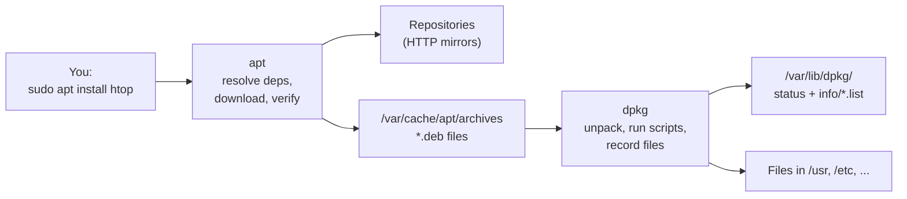
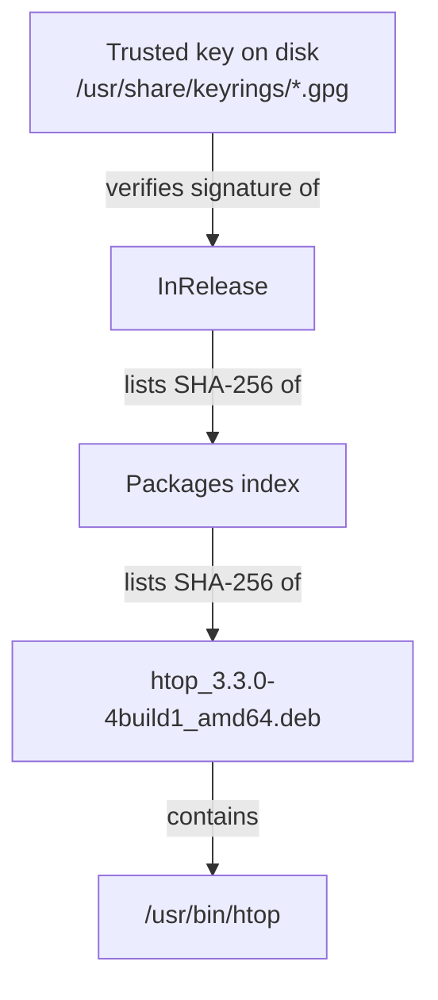

# Installing software

> **Level 3 · Chapter 6** · ⏱️ ~55 min read · Prerequisites: [Users, groups, and sudo](../00-first-steps/06-users-groups-sudo.md), [Filesystems, inodes, and links](04-filesystems-and-links.md)

On Linux you rarely download installers from websites. Software comes from signed repositories through a package manager, which tracks every file, resolves dependencies, and keeps everything updated together. This chapter takes apart the whole pipeline on Mint (dpkg, apt, repositories, signatures, PPAs, Update Manager) and then compares the alternatives: Flatpak, Snap, AppImage, building from source, and Python's pip.

## Why it matters

Alex needs a newer version of a database client than Mint offers. A blog post says: add this PPA, then `sudo apt install`. Another says: download the tarball and `sudo make install`. A third says: `sudo pip install` the Python wrapper. Alex does all three over a month.

Six months later, a routine `sudo apt full-upgrade` wants to remove 40 packages. A Python tool for the desktop crashes on import because a system library was overwritten by pip. And nobody remembers which files `make install` scattered into `/usr/local`, so the old client keeps shadowing the new one.

Each shortcut was reasonable on its own. Together they broke the one thing that keeps a Linux system healthy: a single, consistent record of what's installed and where it came from. After this chapter, you'll know which installation method fits which situation, what each one trusts, and how to undo it.

## Concepts

### Packages and dependencies

A **package** is an archive containing a program's files plus **metadata**: its name, version, a description, which other packages it needs, and scripts to run during installation. On Debian, Ubuntu, and Mint, packages are `.deb` files.

Programs reuse code from shared libraries (you saw `ls` load `libc.so.6` and `libpcre2-8.so.0` in [Memory](03-memory.md)). So packages declare **dependencies**: `htop` declares that it needs `libc6` and `libncursesw6`. When you install `htop`, the package manager also installs any missing dependencies, and their dependencies, and so on.

Dependency relationships come in several strengths:

| Field | Meaning |
|---|---|
| `Depends` | Required. The package won't be configured without it |
| `Pre-Depends` | Required, and must be fully installed *before* this package is even unpacked |
| `Recommends` | Normally wanted. apt installs these by default; skip with `--no-install-recommends` |
| `Suggests` | Might be useful. Not installed by default |
| `Conflicts` / `Breaks` | Can't be installed together (or would break the other) |
| `Provides` | Satisfies a virtual name (several mail servers all provide `mail-transport-agent`) |

Because each library is installed once and shared, a security fix to `libssl` fixes every program that uses it in one update. That's the central advantage of the distribution package model, and the main thing the alternatives later in this chapter trade away.

### dpkg and apt: two layers

There are two tools, stacked:

- **dpkg** is the low-level tool. It installs, removes, and queries individual `.deb` files that are already on your disk. It checks dependencies but doesn't fetch them; if one is missing, it refuses and stops. It keeps the database of what's installed in `/var/lib/dpkg/`.
- **apt** is the high-level tool. It knows about **repositories** (servers full of packages), downloads what's needed, works out the full dependency tree, and then calls dpkg to do the actual installation in the right order.



The older commands `apt-get` and `apt-cache` do the same jobs as `apt` and are still preferred in scripts, because their output format is guaranteed stable. `apt` is the friendlier interactive front end, with progress bars and colour.

!!! note "On Mint, `apt` is a wrapper"
    Type `type -a apt` and you'll see `/usr/local/bin/apt` listed before `/usr/bin/apt`. Mint ships a small Python wrapper that adds conveniences: it prefixes `sudo` for you on commands that need root, sends `apt search` to `aptitude` (so results look like `p   htop   - interactive processes viewer`, where `p` means not installed and `i` installed), and adds extra commands like `apt contains FILE` (= `dpkg -S`) and `apt content PKG` (= `dpkg -L`). `apt help install` shows what any command really runs. This handbook writes `sudo apt ...`, which works identically with or without the wrapper.

### The apt pipeline: from repository to your disk

#### Sources: where packages come from

A **repository** (repo) is a web server with a standard directory layout of packages and index files. apt reads its list of repositories from:

- `/etc/apt/sources.list` (the traditional single file; on Mint it's usually empty or just comments),
- every `*.list` and `*.sources` file in `/etc/apt/sources.list.d/`.

There are two formats. The classic **one-line format** (`.list` files), which Mint uses for its official repositories in `/etc/apt/sources.list.d/official-package-repositories.list`:

```text
deb http://packages.linuxmint.com zena main upstream import backport

deb http://archive.ubuntu.com/ubuntu noble main restricted universe multiverse
deb http://archive.ubuntu.com/ubuntu noble-updates main restricted universe multiverse
deb http://archive.ubuntu.com/ubuntu noble-backports main restricted universe multiverse

deb http://security.ubuntu.com/ubuntu/ noble-security main restricted universe multiverse
```

Each line is: type (`deb` for binary packages, `deb-src` for source code), URL, **suite** (the release name, `zena` for Mint 22.3 and `noble` for Ubuntu 24.04, optionally with a pocket like `-updates` or `-security`), and **components** (sections of the repo: Ubuntu's `main` is officially supported, `universe` is community-maintained, `restricted` and `multiverse` have licensing restrictions).

This tells you something important about Mint: **most of your packages come from Ubuntu's servers**. Mint's own repository adds Mint's tools, the Cinnamon desktop, and a few replaced packages on top.

The newer **deb822 format** (`.sources` files) is multi-line and more readable, and it's what Ubuntu 24.04 itself and many third-party vendors now use:

```text
Types: deb
URIs: https://dl.google.com/linux/chrome-stable/deb/
Suites: stable
Components: main
Architectures: amd64
Signed-By: /usr/share/keyrings/google-chrome.gpg
```

Notice `Signed-By`. That ties this repository to one specific key, which matters for security (more below).

Mint's graphical **Software Sources** tool (in the menu, or `mintsources`) edits the official repository file for you, lets you switch to a faster mirror, and manages PPAs and keys.

#### `apt update`: download the indexes and verify them

`sudo apt update` doesn't upgrade anything. It refreshes apt's knowledge of what's available. For each repository it downloads:

1. **`InRelease`**: a small file listing every index file in the repository with its size and SHA-256 hash, **signed** with the repository's OpenPGP key. (Some repos use the older pair `Release` + a detached `Release.gpg` signature instead.)
2. The **`Packages`** index for each component and architecture: one entry per package with its version, dependencies, filename, size, and SHA-256 hash.

```bash
head -12 /var/lib/apt/lists/archive.ubuntu.com_ubuntu_dists_noble_InRelease
```

```text
-----BEGIN PGP SIGNED MESSAGE-----
Hash: SHA512

Origin: Ubuntu
Label: Ubuntu
Suite: noble
Version: 24.04
Codename: noble
Date: Thu, 25 Apr 2024 15:10:33 UTC
Architectures: amd64 arm64 armhf i386 ppc64el riscv64 s390x
Components: main restricted universe multiverse
Description: Ubuntu Noble 24.04
```

These files are stored in `/var/lib/apt/lists/`, which is apt's **package lists**. All later searches and installs use this local copy, which is why you run `apt update` before installing: otherwise apt may try to download a version that's no longer on the server.

#### The chain of trust

Signatures and hashes form a chain from a key on your disk all the way to every file you install:



If anyone tampers with a `.deb` on a mirror, its hash won't match `Packages`. If they also change `Packages`, its hash won't match `InRelease`. If they change `InRelease`, its signature won't verify against your key. This is why apt can safely download over plain HTTP: integrity doesn't depend on the transport. (HTTPS would add privacy about *what* you download, not integrity.)

The keys live in **keyrings**:

- `/usr/share/keyrings/`: installed by packages (Ubuntu's `ubuntu-archive-keyring.gpg`, Mint's `linuxmint-keyring.gpg`).
- `/etc/apt/keyrings/`: the recommended place for keys you add yourself for third-party repos.
- `/etc/apt/trusted.gpg.d/`: the **legacy** location. A key here is trusted for *every* repository, not just its own.

The difference matters. A key referenced with `Signed-By:` can only vouch for that one repo. A key dropped in `trusted.gpg.d` could sign a fake `libc6` in some other repo, and apt would accept it. The old `apt-key add` command did exactly that, which is why it's deprecated.

If verification fails, `apt update` warns loudly:

```text
W: GPG error: https://example.com/apt stable InRelease: The following signatures couldn't be verified because the public key is not available: NO_PUBKEY 1234ABCD5678EF90
E: The repository 'https://example.com/apt stable InRelease' is not signed.
```

Never "fix" this by marking a repository `[trusted=yes]`. Get the right key from the vendor's official instructions.

#### Install: resolve, download, verify, unpack, configure

When you run `sudo apt install htop`:

1. apt reads the package lists and computes everything that must change (new packages, upgrades, removals).
2. It shows you the plan and asks for confirmation if it's more than the one package you named.
3. It downloads the `.deb` files into the **package cache**, `/var/cache/apt/archives/`, and checks each one's hash.
4. It calls `dpkg` for each package, in dependency order. dpkg:
    - runs the package's **preinst** script (if any),
    - unpacks the files into place,
    - runs **postinst** (create users, enable services, update caches),
    - records every installed path in `/var/lib/dpkg/info/PKG.list` and the package's status in `/var/lib/dpkg/status`.
5. **Triggers** run: shared hooks that several packages want to fire once at the end, like rebuilding the man-page index or the icon cache.

Maintainer scripts (preinst, postinst, prerm, postrm) run **as root**. Installing a package means trusting whoever built it with full control of your machine. Keep that in mind for the PPA section.

#### Configuration files

Files under `/etc` that a package marks as **conffiles** get special treatment. If you've edited one and an upgrade ships a new version, dpkg stops and asks whether to keep yours or take the maintainer's. When you remove a package, its conffiles stay behind, so reinstalling restores your configuration. Only **purge** deletes them.

#### Upgrade, full-upgrade, and automatic removals

| Command | What it does |
|---|---|
| `apt update` | Refresh package lists. Changes nothing installed |
| `apt upgrade` | Upgrade installed packages to the newest candidate versions. May install new dependencies, but **never removes** a package. Anything needing a removal is "kept back" |
| `apt full-upgrade` | Same, but allowed to remove packages when that's needed to resolve conflicts (`apt-get dist-upgrade` is the old name) |
| `apt autoremove` | Remove packages that were installed automatically as dependencies and are no longer needed by anything |

apt remembers *why* each package is installed: **manually** (you asked for it) or **automatically** (pulled in as a dependency). When nothing depends on an automatic package anymore, it becomes an autoremove candidate. `apt-mark showmanual` and `apt-mark manual PKG` inspect and change the marks. Kernels get special treatment: apt always keeps the running kernel and the newest one, and on Mint the easiest way to clean out older kernels is Update Manager's Kernel Manager (or its automatic kernel removal option).

On Ubuntu-based systems you may see `The following upgrades have been deferred due to phasing`. Ubuntu rolls some updates out gradually to a percentage of machines, so a few packages wait a day or two. That's normal; don't force them.

#### What goes where

Packages follow the **Filesystem Hierarchy Standard** you met in [The filesystem layout](../00-first-steps/05-filesystem-layout.md):

| Path | Contents |
|---|---|
| `/usr/bin`, `/usr/sbin` | Programs |
| `/usr/lib`, `/usr/lib/x86_64-linux-gnu` | Libraries, plugins, and internal files |
| `/usr/share` | Architecture-independent data: icons, docs (`/usr/share/doc/PKG`), man pages, `.desktop` menu entries |
| `/etc` | System-wide configuration (conffiles) |
| `/var/lib/PKG` | Persistent state (databases, caches) |
| `/usr/lib/systemd/system` | systemd units shipped by packages |
| `/usr/local` | **Not used by packages.** Reserved for software you install by hand |
| `/opt` | Large self-contained third-party apps (Chrome lives in `/opt/google/chrome`) |

The split between `/usr` (owned by the package manager) and `/usr/local` (yours) is what lets dpkg and your hand-built software coexist without overwriting each other. `/usr/local/bin` comes *before* `/usr/bin` in `PATH`, so a locally built program shadows the packaged one with the same name. That's how Mint's `apt` wrapper takes priority over `/usr/bin/apt`.

### PPAs: someone else's repository

A **PPA** (Personal Package Archive) is a repository hosted on Ubuntu's Launchpad service, where any individual or team can publish packages built for specific Ubuntu releases. PPAs are how you get newer versions than the distribution ships: a newer Python from `deadsnakes`, the latest Git from `git-core`, graphics drivers from `graphics-drivers`.

`add-apt-repository ppa:OWNER/NAME` (on Mint, provided by Mint's own `mintsources` package) creates a sources file in `/etc/apt/sources.list.d/` and installs the PPA's signing key, scoped to that PPA. On Mint you can also manage PPAs in Software Sources → PPAs.

**The trust implications are serious:**

- Packages from a PPA run maintainer scripts as root. The PPA owner can do anything to your machine.
- A PPA can publish *any* package name, including `libc6` or `openssh-server`, with a higher version number, and `apt upgrade` will happily install it.
- PPAs are usually maintained by one person. If they stop, you stop getting security fixes for those packages, and the stale versions may block future distribution upgrades.
- Mint upgrades between major versions can fail or behave oddly with PPAs enabled; Mint's upgrade tool disables them.

A good rule: use only PPAs run by the upstream project itself or by well-known teams, keep the number small, and remove a PPA once the distribution catches up.

### Mint's Update Manager

Mint doesn't expect you to live in a terminal for updates. **Update Manager** (`mintupdate`, the shield icon in the panel) is the recommended way to keep the system current. It:

- runs the equivalent of `apt update` in the background and shows available updates, grouped by source package, with security updates and kernel updates labelled;
- lets you ignore specific updates (blacklist) and view changelogs;
- updates Flatpaks and Cinnamon spices (applets, themes) in the same place;
- includes a **Kernel Manager** to install other kernel series or remove old kernels safely;
- offers **automatic updates** and automatic removal of obsolete kernels (Edit → Preferences → Automation), which install via systemd timers named `mintupdate-automation-*.timer`;
- reminds you to set up **Timeshift**, Mint's system snapshot tool, so a bad update can be rolled back.

There's also a command-line interface:

```bash
mintupdate-cli list
```

```text
security        openssl                                       3.0.13-0ubuntu3.6
package         mesa                                          25.2.8-0ubuntu0.24.04.3
package         dnsmasq                                       2.91-0ubuntu0.24.04.1
kernel          linux-hwe-6.14                                6.14.0-37.37~24.04.1
```

Each line is the update type, the **source package** (one source package can build several binary packages, like `mesa` building `libegl-mesa0` and friends), and the new version. `mintupdate-cli upgrade` installs them; `-s` limits either command to security updates, `-k` to kernel updates, `-r` refreshes the cache first, and `-d` makes `upgrade` a dry run.

### Beyond apt: Snap, Flatpak, AppImage

Distribution packages have a downside: an app's version is frozen to what the distribution ships for that release. Mint 22.3 is built on Ubuntu 24.04, so its LibreOffice or GIMP may be a year or more behind. Three cross-distribution formats solve this by bundling an application *with* its dependencies, so one build runs on any distribution.

#### Snap, and why Mint blocks it

**Snap** is Canonical's format. A snap is a compressed squashfs image, mounted read-only on a loop device (you saw `/snap/core22/...` mounts in [the previous chapter](04-filesystems-and-links.md)). The `snapd` daemon installs, mounts, and **automatically refreshes** snaps, and confines them using AppArmor.

Ubuntu uses snaps heavily: Firefox and Chromium on Ubuntu are snaps. In 2019, Ubuntu turned its `chromium-browser` `.deb` into an empty transitional package whose installation script quietly installed `snapd` and the Chromium snap. Mint objected, and since Mint 20 it blocks `snapd` from being installed through apt with a file in `/etc/apt/preferences.d/`:

```text
# To prevent repository packages from triggering the installation of Snap,
# this file forbids snapd from being installed by APT.
# For more information: https://linuxmint-user-guide.readthedocs.io/en/latest/snap.html

Package: snapd
Pin: release a=*
Pin-Priority: -10
```

A negative pin priority means "never install". Mint's reasons:

- **Installing via apt shouldn't silently connect you to a different store.** A `.deb` that installs a snap bypasses the user's choice of package source.
- **The Snap Store is centralized.** Only Canonical's server can serve snaps to `snapd`, and its server software isn't open source. You can't run your own store or mirror the way you can with apt repositories or Flatpak remotes.
- **Automatic refreshes** happen in the background on Canonical's schedule (they can be delayed but not fully disabled), which takes control away from the user and from Update Manager.

Mint packages Chromium as a regular `.deb` instead. If you really want snaps, you can remove the pin file and install `snapd`; it works fine. It's a policy default, not a technical limitation.

#### Flatpak: Mint's default for third-party apps

**Flatpak** is a community-driven format (originally from Red Hat/GNOME developers). It's Mint's preferred way to get up-to-date desktop apps, built into **Software Manager**:

- Apps come from **remotes**; the main one is **Flathub**, which Mint enables out of the box. Anyone can run their own remote.
- Apps depend on shared **runtimes** (`org.freedesktop.Platform`, `org.gnome.Platform`, `org.kde.Platform`), versioned bundles of common libraries. Ten GNOME apps share one GNOME runtime rather than each bundling its own.
- Apps run in a **sandbox** built with `bubblewrap` and Linux namespaces. They see only the files and devices their **permissions** allow, and they reach the rest of the desktop through **portals** (for example, a file-chooser dialog that hands the app only the file you picked).
- Storage is deduplicated (OSTree), and updates download only changed files.
- Installations can be **system-wide** (`/var/lib/flatpak`) or **per-user** (`~/.local/share/flatpak`).

Flathub apps are often packaged by volunteers rather than the app's developers. Recent versions of Mint's Software Manager distinguish **verified** apps (published by the upstream developer) and hide unverified ones by default; you can enable them in its preferences. Many apps also request broad permissions, such as access to your whole home directory, which weakens the sandbox. `flatpak info --show-permissions APP` shows what an app gets, and the Flatseal app lets you change it.

#### AppImage: one file, no installation

An **AppImage** is a single executable file containing an app and its libraries. Download it, make it executable, run it. Nothing is installed and nothing needs root. To remove it, delete the file.

The trade-offs: no automatic updates (unless the app updates itself), no sandbox, no menu entry unless you add one, and you're trusting whatever website you downloaded it from, with no signature checking by default. Most AppImages need the old FUSE 2 library, packaged as `libfuse2t64` on Mint 22.

### Building from source

Sometimes a program isn't packaged anywhere. Classic C projects are built with the **autotools** routine:

```bash
./configure     # check your system for compilers and libraries; write a Makefile
make            # compile
sudo make install   # copy the results into place (default prefix: /usr/local)
```

`./configure` defaults to `--prefix=/usr/local`, so the result lands in `/usr/local/bin`, `/usr/local/lib`, and `/usr/local/share`, away from the package manager's `/usr`. Many modern projects use other build systems (CMake, Meson, Cargo, Go), but the ideas are the same; [Building software](../05-programming/06-building-software.md) goes deeper into compiling and linking.

Why to avoid `sudo make install` when you have a choice:

- **dpkg doesn't know about it.** There's no record of which files were installed, so there's often no clean uninstall (only if the project happens to provide `make uninstall`, and only from the same build tree).
- **No updates.** Security fixes never arrive unless you rebuild by hand.
- **Shadowing.** `/usr/local/bin` comes first in `PATH`, so a forgotten old build silently wins over a newer packaged version.
- **Build dependencies.** You install `-dev` packages and compilers you may not otherwise need.

Better options, in order: a package from your distribution; an official vendor repository or Flatpak; installing into your home directory without root (`./configure --prefix="$HOME/.local"`, then `make install` without sudo); or **checkinstall**, which runs `make install`, records the files, and builds a `.deb` so dpkg can track and remove it. (checkinstall is in Ubuntu's `universe` repository but is old and unmaintained; it works for simple projects.)

### Python packages: pip, venv, and PEP 668

Python has its own package manager, **pip**, which installs from PyPI (the Python Package Index). The trouble starts when pip and apt both manage the same directory. Mint's own tools (Update Manager, Software Sources, Software Manager, and many others) are written in Python and depend on specific versions of packages installed by apt into `/usr/lib/python3/dist-packages`. A `sudo pip install` that upgrades one of those can break system tools in ways that are hard to trace.

To stop this, Python adopted **PEP 668**: a distribution can mark its system Python as **externally managed** by placing a file named `EXTERNALLY-MANAGED` in the standard library directory. Ubuntu 24.04 and Mint 22 do:

```bash
pip install requests
```

```text
error: externally-managed-environment

× This environment is externally managed
╰─> To install Python packages system-wide, try apt install
    python3-xyz, where xyz is the package you are trying to
    install.

    If you wish to install a non-Debian-packaged Python package,
    create a virtual environment using python3 -m venv path/to/venv.
    Then use path/to/venv/bin/python and path/to/venv/bin/pip. Make
    sure you have python3-full installed.

    If you wish to install a non-Debian packaged Python application,
    it may be easiest to use pipx install xyz, which will manage a
    virtual environment for you. Make sure you have pipx installed.

    See /usr/share/doc/python3.12/README.venv for more information.

note: If you believe this is a mistake, please contact your Python installation or OS distribution provider. You can override this, at the risk of breaking your Python installation or OS, by passing --break-system-packages.
hint: See PEP 668 for the detailed specification.
```

The message lists the three right answers:

1. **System-wide library that the distribution packages**: `sudo apt install python3-requests`.
2. **Libraries for your own project**: a **virtual environment** (venv), a self-contained directory with its own `python` and `pip` and its own `site-packages`. Nothing outside it is touched.
3. **A Python command-line application** (like `black`, `httpie`, `poetry`): `pipx`, which creates a hidden venv per application and puts the command on your `PATH` in `~/.local/bin`.

And it names the wrong answer, `--break-system-packages`, in a way that makes the risk clear.

!!! warning "Common mistake"
    `sudo pip install ...`. Even before PEP 668 this was the most common way to break a Debian or Ubuntu system's Python: it installs as root into system directories that apt manages. Never combine `sudo` with `pip`.

Data engineers will also meet **conda** and **uv**. Both manage their own Python installations and environments entirely separate from the system Python, which is another valid way to avoid the conflict.

## Commands and examples

### Searching and inspecting

```bash
apt search --names-only '^htop$'
```

```text
htop - interactive processes viewer
```

(On Mint, the `apt` wrapper hands `search` to `aptitude`, so you'll see `p   htop   - interactive processes viewer` instead. `/usr/bin/apt search` gives the upstream format.)

Details of a package, installed or not:

```bash
apt show htop
```

```text
Package: htop
Version: 3.3.0-4build1
Priority: optional
Section: utils
Origin: Ubuntu
Maintainer: Ubuntu Developers <ubuntu-devel-discuss@lists.ubuntu.com>
Installed-Size: 434 kB
Depends: libc6 (>= 2.38), libncursesw6 (>= 6), libnl-3-200 (>= 3.2.7), libnl-genl-3-200 (>= 3.2.7), libtinfo6 (>= 6)
Suggests: lm-sensors, lsof, strace
Homepage: https://htop.dev/
Download-Size: 171 kB
APT-Sources: http://archive.ubuntu.com/ubuntu noble/main amd64 Packages
Description: interactive processes viewer
 Htop is an ncursed-based process viewer similar to top, but it
 allows one to scroll the list vertically and horizontally to see
 all processes and their full command lines.
```

`APT-Sources` tells you which repository the candidate comes from.

**Which version will be installed, and from where:**

```bash
apt policy coreutils
```

```text
coreutils:
  Installed: 9.4-3ubuntu6.3
  Candidate: 9.4-3ubuntu6.3
  Version table:
 *** 9.4-3ubuntu6.3 500
        500 http://archive.ubuntu.com/ubuntu noble-updates/main amd64 Packages
        500 http://security.ubuntu.com/ubuntu noble-security/main amd64 Packages
        100 /var/lib/dpkg/status
     9.4-3ubuntu6 500
        500 http://archive.ubuntu.com/ubuntu noble/main amd64 Packages
```

- `Installed` is what you have; `Candidate` is what `apt install`/`upgrade` would pick.
- Each version lists the repositories offering it with a **priority**: 500 is the default for normal repos, 100 is the "currently installed" pseudo-repo. Higher priority wins; among equals, the higher version wins.
- `***` marks the installed version.

`apt policy` with no package name lists every repository and its priority. On Mint you'll see Mint's own repositories pinned at 700 by `/etc/apt/preferences.d/official-package-repositories.pref`, so Mint's versions of a package beat Ubuntu's.

Dependencies both ways:

```bash
apt-cache depends htop
apt-cache rdepends --installed libpcre2-8-0 | head -5
```

```text
htop
  Depends: libc6
  Depends: libncursesw6
  Depends: libnl-3-200
  Depends: libnl-genl-3-200
  Depends: libtinfo6
  Suggests: lm-sensors
  Suggests: lsof
  Suggests: strace
libpcre2-8-0
Reverse Depends:
  wget
  libvte-2.91-0
  libselinux1
```

`rdepends` (reverse dependencies) answers "what would break if this were removed?".

### Updating and upgrading

```bash
sudo apt update
```

```text
Hit:1 http://packages.linuxmint.com zena InRelease
Hit:2 http://archive.ubuntu.com/ubuntu noble InRelease
Get:3 http://archive.ubuntu.com/ubuntu noble-updates InRelease [126 kB]
Get:4 http://security.ubuntu.com/ubuntu noble-security InRelease [126 kB]
Hit:5 http://archive.ubuntu.com/ubuntu noble-backports InRelease
Get:6 http://archive.ubuntu.com/ubuntu noble-updates/main amd64 Packages [1,402 kB]
Fetched 1,780 kB in 2s (891 kB/s)
Reading package lists... Done
Building dependency tree... Done
Reading state information... Done
12 packages can be upgraded. Run 'apt list --upgradable' to see them.
```

`Hit` means the index hasn't changed since last time; `Get` means a newer one was downloaded. Each `InRelease` was signature-checked; a failure would print a `W:` or `E:` line.

```bash
apt list --upgradable
sudo apt upgrade
```

```text
Listing... Done
dnsmasq-base/noble-updates 2.91-0ubuntu0.24.04.1 amd64 [upgradable from: 2.90-2ubuntu0.4]
libegl-mesa0/noble-updates 25.2.8-0ubuntu0.24.04.3 amd64 [upgradable from: 25.2.8-0ubuntu0.24.04.2]
...
The following packages will be upgraded:
  dnsmasq-base libegl-mesa0 ...
12 upgraded, 0 newly installed, 0 to remove and 0 not upgraded.
Need to get 18.4 MB of archives.
After this operation, 41.0 kB of additional disk space will be used.
Do you want to continue? [Y/n]
```

Read the summary line every time: **upgraded, newly installed, to remove, not upgraded**. A surprising "to remove" count is your cue to stop and look. `sudo apt full-upgrade` is the same with removals allowed. On Mint, Update Manager does all of this for you; the commands are what it runs underneath.

### Installing and removing

```bash
sudo apt install htop
```

```text
Reading package lists... Done
Building dependency tree... Done
Reading state information... Done
Suggested packages:
  lm-sensors
The following NEW packages will be installed:
  htop
0 upgraded, 1 newly installed, 0 to remove and 12 not upgraded.
Need to get 171 kB of archives.
After this operation, 434 kB of additional disk space will be used.
Get:1 http://archive.ubuntu.com/ubuntu noble/main amd64 htop amd64 3.3.0-4build1 [171 kB]
Fetched 171 kB in 1s (215 kB/s)
Selecting previously unselected package htop.
(Reading database ... 412345 files and directories currently installed.)
Preparing to unpack .../htop_3.3.0-4build1_amd64.deb ...
Unpacking htop (3.3.0-4build1) ...
Setting up htop (3.3.0-4build1) ...
Processing triggers for desktop-file-utils (0.27-2build1) ...
Processing triggers for hicolor-icon-theme (0.17-2) ...
Processing triggers for man-db (2.12.0-4build2) ...
```

You can see the pipeline from the Concepts section: plan, download into the cache, then dpkg's "Unpacking" and "Setting up" (postinst), then triggers. `lsof` and `strace` aren't listed as suggestions because they're already installed.

Removing:

```bash
sudo apt remove htop      # remove files, keep conffiles in /etc
sudo apt purge htop       # remove files AND conffiles
sudo apt autoremove       # remove orphaned automatic dependencies
```

`dpkg -l` shows the difference between removed and purged:

```bash
dpkg -l htop nginx coreutils
```

```text
Desired=Unknown/Install/Remove/Purge/Hold
| Status=Not/Inst/Conf-files/Unpacked/halF-conf/Half-inst/trig-aWait/Trig-pend
|/ Err?=(none)/Reinst-required (Status,Err: uppercase=bad)
||/ Name           Version         Architecture Description
+++-==============-===============-============-=================================
ii  coreutils      9.4-3ubuntu6.3  amd64        GNU core utilities
ii  htop           3.3.0-4build1   amd64        interactive processes viewer
rc  nginx          1.24.0-2ubuntu7 amd64        small, powerful, scalable web/proxy server
```

The two letters are desired state and actual state: `ii` = wanted installed, is installed. `rc` = removed, but config files remain (a purge would clear it). Find all leftover configs with `dpkg -l | grep '^rc'`.

!!! warning "Common mistake"
    Confirming a removal without reading the list. `sudo apt remove python3` or removing a library that the desktop depends on will propose removing dozens of packages, including `mint-meta-cinnamon` and the desktop itself. apt shows the full list and asks `Do you want to continue? [Y/n]`. If the list contains anything you didn't expect, answer `n`. The same goes for `autoremove` right after uninstalling a big application.

Installing a downloaded `.deb`:

```bash
sudo apt install ./zoom_amd64.deb
```

The `./` matters: it tells apt this is a file path, not a package name. Unlike `sudo dpkg -i file.deb`, apt also downloads and installs the `.deb`'s dependencies.

### Querying dpkg: which package owns what

```bash
dpkg -S /usr/bin/ls             # which package installed this file?
dpkg -L coreutils | head -6     # which files did this package install?
dpkg -s coreutils | head -6     # status and metadata of an installed package
```

```text
coreutils: /usr/bin/ls
/.
/usr
/usr/bin
/usr/bin/[
/usr/bin/arch
/usr/bin/b2sum
Package: coreutils
Essential: yes
Status: install ok installed
Priority: required
Section: utils
Installed-Size: 6944
```

`Essential: yes` means the system can't function without it, and apt will make you type a full confirmation sentence before removing it. These queries read dpkg's database directly:

```bash
ls /var/lib/dpkg/info/ | grep '^coreutils'
```

```text
coreutils.list
coreutils.md5sums
```

`coreutils.list` is the file list `dpkg -L` prints, and `md5sums` lets `dpkg --verify coreutils` detect modified files. Packages with maintainer scripts also have `.postinst`, `.prerm`, and so on in this directory.

`dpkg -S` on a file that no package owns prints `dpkg-query: no path found matching pattern`. That's a quick way to spot files that came from `make install` or pip.

### Cache and lists housekeeping

```bash
du -sh /var/cache/apt/archives /var/lib/apt/lists
sudo apt clean        # delete all cached .deb files
sudo apt autoclean    # delete only cached .debs that can no longer be downloaded
```

```text
412M	/var/cache/apt/archives
262M	/var/lib/apt/lists
```

The cache is only for re-installing without downloading; deleting it is safe.

### PPAs in practice

!!! danger "⚠️ VM only"
    Practise adding and removing PPAs in your VM. A PPA gets root-level trust on your machine and can replace core system packages.

```bash
sudo add-apt-repository ppa:git-core/ppa
sudo apt update
apt policy git
```

```text
git:
  Installed: 1:2.43.0-1ubuntu7.3
  Candidate: 1:2.51.0-0ppa1~ubuntu24.04.1
  Version table:
     1:2.51.0-0ppa1~ubuntu24.04.1 500
        500 https://ppa.launchpadcontent.net/git-core/ppa/ubuntu noble/main amd64 Packages
 *** 1:2.43.0-1ubuntu7.3 500
        500 http://archive.ubuntu.com/ubuntu noble-updates/main amd64 Packages
        100 /var/lib/dpkg/status
```

The PPA offers a newer version at the same priority, so it becomes the candidate. Look at what was added:

```bash
ls /etc/apt/sources.list.d/ | grep -i git
```

```text
git-core-ppa-noble.list
```

To remove it cleanly and go back to the distribution's version, use `ppa-purge` (a small package that downgrades everything from the PPA), or remove the PPA in Software Sources and then reinstall the distribution version:

```bash
sudo apt install ppa-purge
sudo ppa-purge ppa:git-core/ppa
```

Note that Mint's `add-apt-repository` uses Ubuntu's codename (`noble`), not Mint's (`zena`), because PPAs are built for Ubuntu releases.

### Flatpak

```bash
flatpak remotes
flatpak search obsidian
flatpak install flathub md.obsidian.Obsidian
flatpak list --app
```

```text
Name    Options
flathub system
Name      Description                     Application ID        Version  Branch  Remotes
Obsidian  Markdown-based knowledge base   md.obsidian.Obsidian  1.13.7   stable  flathub
...
Name       Application ID         Version  Branch  Installation
Obsidian   md.obsidian.Obsidian   1.13.7   stable  system
```

Apps are identified by reverse-DNS **application IDs**. Other everyday commands:

```bash
flatpak run md.obsidian.Obsidian           # run from the terminal
flatpak update                             # update all apps and runtimes
flatpak info --show-permissions md.obsidian.Obsidian
flatpak uninstall md.obsidian.Obsidian
flatpak uninstall --unused                 # remove runtimes nothing uses anymore
```

```text
[Context]
shared=network;ipc;
sockets=wayland;pulseaudio;fallback-x11;ssh-auth;
devices=dri;
filesystems=home;/media;/mnt;/run/media;
```

That app can reach the network and your entire home directory, so its sandbox protects the rest of the system but not your files. `--user` on install keeps everything in your home directory without root.

### AppImage

```bash
cd ~/Applications
chmod +x Example-2.1.0-x86_64.AppImage
./Example-2.1.0-x86_64.AppImage
```

If it fails with `dlopen(): error loading libfuse.so.2`, install the compatibility library: `sudo apt install libfuse2t64`. Verify the download against the checksum or signature the project publishes before running it.

### Comparing the formats

=== "apt (.deb)"

    **Source:** Ubuntu and Mint repositories, plus vendor repos and PPAs.

    **Strengths:** Shared libraries, so security fixes land everywhere at once; tight integration; small downloads; the default for everything system-level (drivers, servers, command-line tools, libraries).

    **Weaknesses:** Versions frozen to the release; third-party repos and PPAs get root-level trust.

    **Updates:** Update Manager / `apt upgrade`.

    ```bash
    sudo apt install htop
    sudo apt remove htop
    ```

=== "Flatpak"

    **Source:** Flathub (enabled on Mint), or any other remote.

    **Strengths:** Current versions of desktop apps; sandboxed with portals; shared runtimes; works on any distro; can install per-user without root; integrated into Mint's Software Manager and Update Manager.

    **Weaknesses:** Larger disk use (runtimes); sandbox only as strong as the requested permissions; themes and system integration sometimes imperfect; not meant for command-line tools or system services.

    **Updates:** Update Manager / `flatpak update`.

    ```bash
    flatpak install flathub org.gimp.GIMP
    flatpak uninstall org.gimp.GIMP
    ```

=== "Snap"

    **Source:** Canonical's Snap Store only.

    **Strengths:** Current versions; works for desktop apps, command-line tools, and services; confined with AppArmor; default on Ubuntu.

    **Weaknesses:** Single proprietary store; background auto-refresh; loop mounts clutter `lsblk` and `df`; slower first start. Blocked on Mint by default via an apt pin.

    **Updates:** Automatic (`snap refresh`).

    ```bash
    snap list
    snap info hello-world
    ```

=== "AppImage"

    **Source:** The developer's website or GitHub releases.

    **Strengths:** One file, no install, no root; easy to keep several versions; easy to delete.

    **Weaknesses:** No sandbox, no automatic updates, no signature checks by default, no menu integration without extra tools; needs `libfuse2t64`.

    **Updates:** Manual (download the new file).

    ```bash
    chmod +x App.AppImage && ./App.AppImage
    ```

=== "From source"

    **Source:** The project's source code.

    **Strengths:** Latest code; custom build options; works when nothing else exists.

    **Weaknesses:** Untracked by dpkg; no updates; files scattered in `/usr/local`; needs compilers and `-dev` packages.

    **Updates:** Rebuild by hand.

    ```bash
    ./configure --prefix="$HOME/.local" && make && make install
    ```

A sensible default on Mint: **apt** for system tools and anything in the repositories, **Flatpak** for desktop apps you want newer than the repos, **venv/pipx** for Python, and source builds only when there's no other way.

### Building from source, carefully

!!! danger "⚠️ VM only"
    `sudo make install` writes untracked files into system directories. Try it in your VM, or install into your home directory without sudo as shown below.

A safe pattern that never needs root:

```bash
sudo apt install build-essential              # gcc, make, and friends (once)
cd ~/src
tar xf jq-1.7.1.tar.gz && cd jq-1.7.1
./configure --prefix="$HOME/.local" --with-oniguruma=builtin
make -j"$(nproc)"
make install
command -v jq
```

```text
/home/alex/.local/bin/jq
```

`-j"$(nproc)"` runs one compile job per CPU. Mint's default `~/.profile` adds `~/.local/bin` to `PATH` if the directory exists when you log in, so log out and back in after creating it. To uninstall, delete the files the build installed (many projects support `make uninstall` from the same build directory).

If you must install system-wide, `checkinstall` (in the VM) gives you an uninstallable package:

```bash
sudo apt install checkinstall
./configure && make
sudo checkinstall --pkgname=jq-local --pkgversion=1.7.1 --default
dpkg -L jq-local | head -3
sudo apt remove jq-local
```

### Python the right way

```bash
cd ~/projects/etl
python3 -m venv .venv
source .venv/bin/activate
pip install pandas pyarrow
python -c "import pandas, sys; print(pandas.__version__, sys.prefix)"
deactivate
```

```text
2.3.1 /home/alex/projects/etl/.venv
```

`sys.prefix` confirms the interpreter is running from the venv. Everything pip installed lives in `.venv/lib/python3.12/site-packages`; delete `.venv` and it's all gone. If `python3 -m venv` complains that `ensurepip is not available`, run `sudo apt install python3-venv` once.

For command-line Python tools:

```bash
sudo apt install pipx
pipx ensurepath
pipx install httpie
http --version
```

```text
3.2.4
```

`pipx` gave `httpie` its own private venv under `~/.local/share/pipx/venvs/` and linked its commands into `~/.local/bin`.

## Exercises

### Exercise 1: Trace a command back to its package (easy)

Find which package provides `/usr/bin/top`, list the other programs that package installed into `/usr/bin`, and find which repository and version it came from.

??? success "Solution"

    ```bash
    dpkg -S /usr/bin/top
    dpkg -L procps | grep '^/usr/bin/'
    apt policy procps
    ```

    ```text
    procps: /usr/bin/top
    /usr/bin/free
    /usr/bin/kill
    /usr/bin/pgrep
    /usr/bin/pidwait
    /usr/bin/pmap
    /usr/bin/ps
    /usr/bin/pwdx
    /usr/bin/skill
    /usr/bin/slabtop
    /usr/bin/tload
    /usr/bin/top
    /usr/bin/uptime
    /usr/bin/vmstat
    /usr/bin/w
    /usr/bin/watch
    /usr/bin/pkill
    /usr/bin/snice
    procps:
      Installed: 2:4.0.4-4ubuntu3.2
      Candidate: 2:4.0.4-4ubuntu3.2
      Version table:
     *** 2:4.0.4-4ubuntu3.2 500
            500 http://archive.ubuntu.com/ubuntu noble-updates/main amd64 Packages
    ...
    ```

    `procps` is the package behind most of the process and memory tools from earlier chapters, all of which read `/proc`, hence the name. It comes from Ubuntu's `noble-updates` pocket, not from Mint's repo. (Exact version numbers will differ.) On Mint, `apt contains /usr/bin/top` and `apt content procps` are wrapper shortcuts for the same `dpkg` queries.

### Exercise 2: Read your sources and keys (easy)

List every repository your system uses. For each third-party one, find the key it's tied to. Are any keys in the legacy `/etc/apt/trusted.gpg.d/` location?

??? success "Solution"

    ```bash
    ls /etc/apt/sources.list.d/
    grep -rhE '^(deb|URIs|Signed-By)' /etc/apt/sources.list /etc/apt/sources.list.d/ 2>/dev/null
    ls /etc/apt/keyrings/ /usr/share/keyrings/ /etc/apt/trusted.gpg.d/ 2>/dev/null
    apt policy | grep -E '^ *[0-9]+ ' | sort -u
    ```

    A fresh Mint 22.3 has only `official-package-repositories.list` (Mint + Ubuntu) and Ubuntu's and Mint's keys in `/usr/share/keyrings`. Each third-party `.sources` file should have a `Signed-By:` line pointing at its own key; a `.list` file may carry the same thing inline as `deb [signed-by=/etc/apt/keyrings/vendor.gpg] https://...`. Keys in `/etc/apt/trusted.gpg.d/` are trusted for every repo, so if a third-party key sits there, it's worth moving to `/etc/apt/keyrings/` and referencing it with `signed-by` (in your VM first). The `apt policy` priorities show Mint's repos at 700 and everything else at 500.

### Exercise 3: Remove vs purge (medium)

!!! danger "⚠️ VM only"
    This installs and removes packages; do it in your VM.

Install a package that ships configuration files in `/etc`, such as `nginx`, then remove it. Show the `dpkg -l` status and which files remain. Then purge it and show the difference.

??? success "Solution"

    ```bash
    sudo apt install nginx
    dpkg -l nginx | tail -1
    sudo apt remove nginx
    dpkg -l nginx | tail -1
    ls /etc/nginx
    sudo apt purge nginx
    dpkg -l nginx 2>&1 | tail -1
    ls /etc/nginx 2>&1
    sudo apt autoremove
    ```

    ```text
    ii  nginx          1.24.0-2ubuntu7.5 amd64        small, powerful, scalable web/proxy server
    rc  nginx          1.24.0-2ubuntu7.5 amd64        small, powerful, scalable web/proxy server
    conf.d  fastcgi.conf  ...  nginx.conf  sites-available  sites-enabled  ...
    dpkg-query: no packages found matching nginx
    ls: cannot access '/etc/nginx': No such file or directory
    ```

    After `remove`, the state is `rc` and `/etc/nginx` survives, so a reinstall would bring back your configuration. After `purge`, dpkg forgets the package entirely and the conffiles are gone. `autoremove` then offers to remove `nginx-common` and other automatic dependencies that nothing needs anymore. (On Ubuntu 24.04 the nginx package is split into `nginx` and `nginx-common`; most conffiles belong to `nginx-common`, so purge that too if `/etc/nginx` remains.)

### Exercise 4: Watch PEP 668 protect you (medium)

Show that `pip install` is blocked for the system Python, find the `EXTERNALLY-MANAGED` marker file, then create a venv in `~/scratch/pep668`, install `requests` there, and prove that the system Python can't import it while the venv's Python can.

??? success "Solution"

    ```bash
    pip install requests 2>&1 | head -2
    python3 -c "import sysconfig; print(sysconfig.get_path('stdlib'))"
    ls /usr/lib/python3.12/EXTERNALLY-MANAGED
    mkdir -p ~/scratch/pep668 && cd ~/scratch/pep668
    python3 -m venv .venv
    .venv/bin/pip install --quiet requests
    .venv/bin/python -c "import requests; print('venv:', requests.__version__)"
    python3 -c "import requests" 2>&1 | tail -1
    ```

    ```text
    error: externally-managed-environment
    
    /usr/lib/python3.12
    /usr/lib/python3.12/EXTERNALLY-MANAGED
    venv: 2.32.5
    ```

    Calling `.venv/bin/python` directly is equivalent to activating the venv. The last command's result depends on your system: if Mint already has the `python3-requests` deb installed, the system Python imports *that* copy (an older version from apt), which shows the two are separate; if not, you'll see `ModuleNotFoundError: No module named 'requests'`. Either way the venv's copy never touched the system directories.

### Exercise 5: Same app, three formats (hard)

!!! danger "⚠️ VM only"
    This adds a package source and installs software in several formats. Use your VM.

In the VM, install one application three ways: from apt, as a Flatpak, and (if the project offers one) as an AppImage. A good candidate is `vlc` or `gimp`. For each, record the version, where its files live, disk space used, and how it would be updated. Then remove all three cleanly.

??? success "Solution"

    ```bash
    # apt
    sudo apt install gimp
    apt policy gimp | head -3
    dpkg -L gimp | grep -c .                     # number of files
    dpkg-query -W -f='${Installed-Size} KiB\n' gimp

    # Flatpak
    flatpak install -y flathub org.gimp.GIMP
    flatpak info org.gimp.GIMP | grep -E 'Version|Installed|Runtime'
    du -sh /var/lib/flatpak/app/org.gimp.GIMP

    # AppImage (download from the project's site into ~/Applications)
    chmod +x ~/Applications/GIMP-*.AppImage
    ls -lh ~/Applications/GIMP-*.AppImage
    ```

    Typical findings: the apt version is the oldest (frozen at what Ubuntu 24.04 ships), installed across `/usr/bin`, `/usr/lib`, and `/usr/share` with dozens of shared-library dependencies, and updated by Update Manager. The Flatpak is newer, lives under `/var/lib/flatpak/app/`, depends on a runtime that may be several hundred MB (shared with other apps), and updates with `flatpak update` or Update Manager. The AppImage is a single file of a few hundred MB in your home directory, updated only by downloading a new file.

    Cleanup:

    ```bash
    sudo apt purge gimp && sudo apt autoremove
    flatpak uninstall -y org.gimp.GIMP && flatpak uninstall -y --unused
    rm ~/Applications/GIMP-*.AppImage
    ```

## Check yourself

1. What's the division of labour between dpkg and apt?

    ??? note "Answer"

        dpkg installs, removes, and queries individual `.deb` files on disk and keeps the installed-package database. apt reads repository indexes, resolves dependencies, downloads and verifies packages, then calls dpkg to install them in order.

2. What does `apt update` actually do, and why must it run before `apt install`?

    ??? note "Answer"

        It downloads each repository's signed `InRelease` and `Packages` indexes into `/var/lib/apt/lists/`, verifying signatures. It installs nothing. Without fresh lists, apt may try to fetch versions that no longer exist on the mirror, or miss newer ones.

3. Describe the chain of trust that protects a `.deb` downloaded over plain HTTP.

    ??? note "Answer"

        A key in a local keyring verifies the signature on `InRelease`; `InRelease` contains the SHA-256 of the `Packages` index; `Packages` contains the SHA-256 of each `.deb`. Tampering anywhere breaks a hash or the signature. HTTPS isn't needed for integrity.

4. What's the difference between `apt upgrade` and `apt full-upgrade`?

    ??? note "Answer"

        `upgrade` never removes installed packages (it holds back upgrades that would need removals). `full-upgrade` may remove packages to resolve changed dependencies.

5. What's the difference between `remove` and `purge`, and how do you spot leftovers?

    ??? note "Answer"

        `remove` deletes the package's files but keeps its conffiles in `/etc`; `purge` deletes those too. `dpkg -l | grep '^rc'` lists removed-but-not-purged packages.

6. Why is adding a PPA a trust decision, not just a convenience?

    ??? note "Answer"

        PPA packages run maintainer scripts as root and can replace any package on the system, including core libraries, with a higher version. You're trusting the PPA owner with full control of your machine and with keeping those packages patched.

7. Why does Mint block snapd by default, and how is Flatpak different?

    ??? note "Answer"

        Mint objected to apt packages silently installing snaps (Ubuntu's Chromium transition), to the Snap Store being a single, proprietary, Canonical-controlled backend, and to forced background auto-refreshes. Flatpak is decentralized (anyone can host a remote; Flathub is just the main one), integrated into Mint's Software Manager and Update Manager, and updates when you choose.

8. `pip install` fails with `externally-managed-environment`. What are the three correct alternatives?

    ??? note "Answer"

        Install the distribution's package (`sudo apt install python3-xyz`); create a virtual environment for your project (`python3 -m venv .venv`); or use `pipx` for a standalone Python application. Not `sudo pip`, and not `--break-system-packages`.

## Key takeaways

- Packages bundle files plus metadata and dependencies. dpkg handles single `.deb` files and the database; apt handles repositories, dependency resolution, and downloads.
- Repositories are listed in `/etc/apt/sources.list.d/` (`.list` or deb822 `.sources`). A signed `InRelease` file and hashes form a chain of trust; `Signed-By` scopes each key to one repo.
- `update` refreshes lists; `upgrade` never removes; `full-upgrade` may; `remove` keeps conffiles, `purge` doesn't; `autoremove` cleans orphaned dependencies. Always read the summary before saying yes.
- `dpkg -S`, `dpkg -L`, `dpkg -l`, and `apt policy` answer "who owns this file", "what did this install", "what state is it in", and "where will it come from".
- PPAs and third-party repos get root-level trust; keep them few. On Mint, Update Manager is the normal way to update.
- Flatpak (Mint's default for newer desktop apps), Snap (blocked by default on Mint), and AppImage bundle dependencies for cross-distro apps, each with different trade-offs.
- Avoid `sudo make install` and `sudo pip`; use `$HOME/.local`, checkinstall, venvs, or pipx.

## Next

You've now seen every layer of a running Linux system. Prove it to yourself with the [Level 3 capstone](../../exercises/level-3-capstone.md): explain everything from power-on to the login screen, and from typing `ls` to seeing its output.
