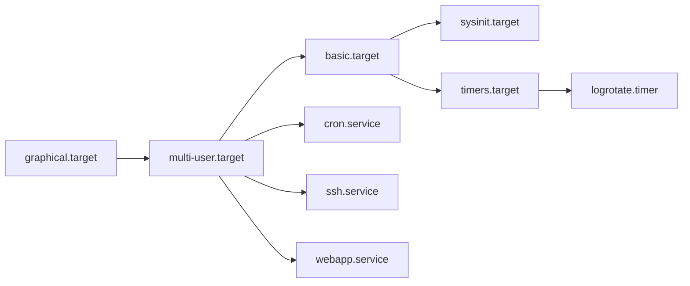
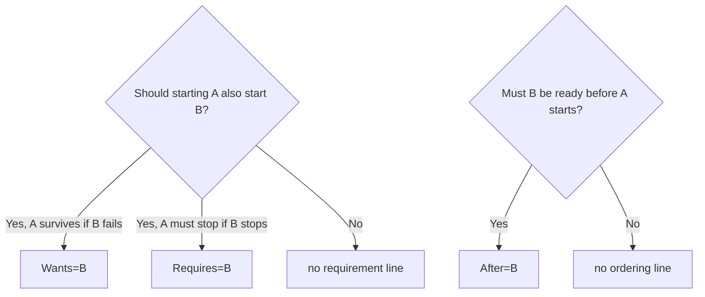
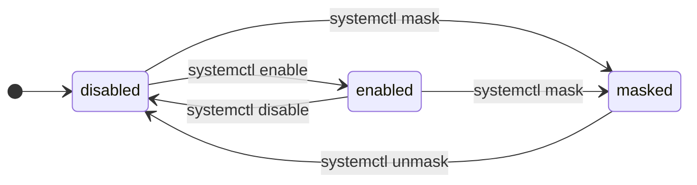
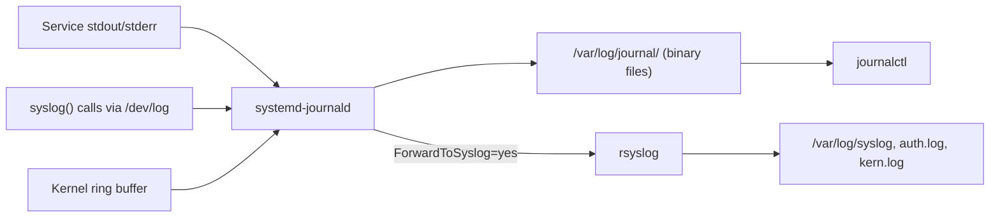

# systemd and journalctl

> **Level 4 · Chapter 1** · ⏱️ ~45 min read · Prerequisites: [The boot process](../03-internals/01-boot-process.md), [Processes and signals](../03-internals/02-processes-and-signals.md)

systemd starts, stops, supervises, and logs almost everything on a modern Linux system. This chapter teaches you to control services with `systemctl`, write your own unit files, and read logs with `journalctl`.

## Why it matters

Alex runs a small Python API on a cloud server. It works fine while Alex is logged in and running `python3 app.py` in a terminal. Then Alex closes the laptop, the SSH session ends, and the API dies with it. Alex tries `nohup python3 app.py &`. That survives the logout, but the API crashes at 3 a.m. on a bad request and stays dead until someone notices on Monday. After a kernel update and reboot, it does not come back at all.

Then Alex writes a 15-line systemd unit file. Now the API starts at boot, restarts two seconds after any crash, runs as an unprivileged user instead of Alex's account, and every line it prints lands in a searchable log with timestamps. When it does fail, `systemctl status webapp` shows the exit code and the last ten log lines in one screen.

That is the job of systemd: turn "a program I ran once" into "a service the system keeps alive".

## Concepts

### What systemd is

**systemd** is the **init system** on Mint, Ubuntu, Debian, Fedora, Arch, and most other distributions. The init system is the first user-space process the kernel starts. It always has process ID (PID) 1. You met it in [The boot process](../03-internals/01-boot-process.md): the kernel starts `/sbin/init`, which is a symlink to `systemd`.

PID 1 has three jobs:

1. **Bring the system up.** Mount filesystems, start networking, start the login screen, and so on, in the right order.
2. **Supervise.** Track every process it started, restart the ones that die, and collect their exit status.
3. **Bring the system down.** Stop everything cleanly at shutdown.

systemd is also a family of helpers: `journald` (logging), `resolved` (DNS), `logind` (logins and sessions), `timesyncd` (clock sync), and more. You will meet several of them in this level.

### Units: the things systemd manages

systemd manages **units**. A unit is any resource systemd knows how to start, stop, or watch. Each unit is described by a plain-text **unit file**, and the file's extension tells you the **unit type**.

| Type | Extension | What it represents | Example |
|------|-----------|--------------------|---------|
| Service | `.service` | A process or group of processes | `cron.service`, `ssh.service` |
| Socket | `.socket` | A listening socket; starts a service on the first connection | `ssh.socket` |
| Timer | `.timer` | A schedule that starts another unit | `logrotate.timer` |
| Target | `.target` | A named group of units, used as a sync point | `multi-user.target` |
| Mount | `.mount` | A mounted filesystem | `home.mount` for `/home` |
| Path | `.path` | Watches a file or directory and starts a unit when it changes | `cups.path` |

There are a few more (`.device`, `.swap`, `.slice`, `.scope`, `.automount`), but these six cover almost everything you will touch.

A **target** deserves a closer look. It runs nothing itself. It is a label that means "everything that should be running at this stage". `multi-user.target` means "a fully booted system with networking and services, but no graphical login". `graphical.target` pulls in `multi-user.target` plus the display manager. Targets replace the old numbered **runlevels** from SysV init.



When you "enable" a service, you add it to one of these groups, usually `multi-user.target`. At boot, systemd starts the default target and pulls in everything that hangs off it.

### Where unit files live, and who wins

The same unit name can exist in several directories. systemd searches them in a fixed order, and the **first match wins**. Here are the three you need to know, from highest priority to lowest:

| Directory | Who writes here | Survives package upgrades? |
|-----------|-----------------|----------------------------|
| `/etc/systemd/system/` | You, the administrator | Yes |
| `/run/systemd/system/` | Runtime tools; wiped at reboot | No (temporary) |
| `/usr/lib/systemd/system/` (also reachable as `/lib/systemd/system/`) | Packages installed with `apt` | Overwritten on upgrade |

On Mint 22 and Ubuntu 24.04, `/lib` is a symlink to `/usr/lib`, so `/lib/systemd/system` and `/usr/lib/systemd/system` are the same directory. Older tutorials use the `/lib` spelling.

The rule that follows from this table is the most important habit in this chapter:

!!! warning "Common mistake"
    Never edit files in `/usr/lib/systemd/system/`. The next `apt upgrade` of that package silently overwrites your change. Put overrides in `/etc/systemd/system/` instead, ideally with `systemctl edit` (shown below).

**User units** live in a separate tree and are run by a per-user copy of systemd (`systemd --user`) that starts when you log in:

| Directory | Purpose |
|-----------|---------|
| `~/.config/systemd/user/` | Your personal units |
| `/etc/systemd/user/` | Admin-provided units for every user |
| `/usr/lib/systemd/user/` | Package-provided user units |

You can print the full search path with a read-only command:

```bash
systemd-analyze unit-paths
```

```text
/etc/systemd/system.control
/run/systemd/system.control
/run/systemd/transient
/run/systemd/generator.early
/etc/systemd/system
/etc/systemd/system.attached
/run/systemd/system
/run/systemd/system.attached
/run/systemd/generator
/usr/local/lib/systemd/system
/usr/lib/systemd/system
/run/systemd/generator.late
```

The `generator` directories hold units created at boot by small programs called **generators**. For example, `systemd-fstab-generator` turns each line in `/etc/fstab` into a `.mount` unit. That is why `/home` shows up as `home.mount`.

### Anatomy of a unit file

Unit files use an INI-like format: `[Section]` headers followed by `Key=Value` lines. Here is the real `cron.service` that ships with Mint:

```ini
# /usr/lib/systemd/system/cron.service
[Unit]
Description=Regular background program processing daemon
Documentation=man:cron(8)
After=remote-fs.target nss-user-lookup.target

[Service]
EnvironmentFile=-/etc/default/cron
ExecStart=/usr/sbin/cron -f -P $EXTRA_OPTS
IgnoreSIGPIPE=false
KillMode=process
Restart=on-failure
SyslogFacility=cron

[Install]
WantedBy=multi-user.target
```

Every unit file has up to three sections:

- **`[Unit]`** is generic metadata and ordering. Every unit type has it. `Description` is the human name you see in logs. `After=` controls start order.
- **`[Service]`** (or `[Timer]`, `[Socket]`, `[Mount]`, `[Path]`) holds type-specific settings. For a service, this is mainly "what command to run and how to supervise it".
- **`[Install]`** is read only by `systemctl enable` and `disable`. It says which target should pull this unit in at boot. It has no effect at runtime.

Notice `cron -f`. The `-f` flag means "stay in the foreground". Old daemons forked themselves into the background. systemd prefers programs that stay in the foreground, because then the process systemd started *is* the service and is easy to track.

### Service types: how systemd knows a service is "started"

When you start a service, systemd needs to know when startup is finished. That matters because other units may be waiting for it. The **`Type=`** setting tells systemd how to decide.

| `Type=` | systemd considers it started when... | Use it for |
|---------|--------------------------------------|------------|
| `simple` (default) | Immediately after `fork()`, before the program even runs | Simple foreground programs |
| `exec` | After the program binary was successfully executed | Foreground programs (better error reporting than `simple`) |
| `forking` | The first process exits, leaving a background child | Old-style daemons that fork themselves |
| `oneshot` | The process **exits** successfully | Scripts that do a job and finish (backups, setup) |
| `notify` | The program sends a "READY=1" message to systemd | Daemons that support `sd_notify`, such as `sshd` on Ubuntu |

The difference between `simple` and `exec` is subtle but useful. With `simple`, if you mistype the path in `ExecStart=`, `systemctl start` still reports success, and the failure shows up a moment later. With `exec`, `systemctl start` itself fails, so you see the error right away. Prefer `exec` for new services.

`forking` needs a `PIDFile=` so systemd knows which child is the real daemon. You will rarely write a forking unit yourself. If a program has a "don't daemonize" flag (like `cron -f` or `sshd -D`), use it with `Type=exec` instead.

`oneshot` services are usually not "running" after they finish. Their state goes to `inactive (dead)` with a successful result. Add `RemainAfterExit=yes` if you want the unit to count as active after the command exits, for example for a "set up the firewall" unit.

### Restart policies

The **`Restart=`** setting tells systemd when to restart a service that stopped on its own (not one you stopped with `systemctl stop`).

| `Restart=` | Restarts after... |
|------------|-------------------|
| `no` (default) | Never |
| `on-failure` | Non-zero exit code, a crash signal, a timeout, or a watchdog failure |
| `on-abnormal` | A crash signal, timeout, or watchdog, but **not** a non-zero exit |
| `always` | Any exit, even a clean exit code 0 |

`RestartSec=` sets the delay before the restart (default 100 ms). Two seconds is a polite value.

systemd also has a safety net called **start rate limiting**. By default, if a unit starts more than 5 times in 10 seconds, systemd gives up and marks it `failed` with the message `Start request repeated too quickly`. This stops a broken service from restarting in a tight loop forever. The knobs are `StartLimitBurst=` and `StartLimitIntervalSec=` in the `[Unit]` section. After you fix the problem, `systemctl reset-failed webapp` clears the counter.

### Dependencies: Wants, Requires, After, Before

systemd separates two questions that people often mix up:

1. **Requirement**: if A starts, must B also start?
2. **Ordering**: if both start, which goes first?

| Directive | Kind | Meaning for `A.service` |
|-----------|------|-------------------------|
| `Wants=B` | Requirement (weak) | Starting A also starts B. If B fails, A keeps going. |
| `Requires=B` | Requirement (strong) | Starting A also starts B. If B fails to start, or is stopped later, A is stopped too. |
| `After=B` | Ordering | If both are being started, start A only after B has finished starting. |
| `Before=B` | Ordering | The mirror image: start A before B. |

The key insight is that **`Requires=` without `After=` starts both units at the same time**. Requirement and ordering are independent. If your app needs a database to be up first, you need both lines:

```ini
[Unit]
Requires=postgresql.service
After=postgresql.service
```

Prefer `Wants=` over `Requires=` unless you really want A to die when B dies. `Wants=` is more robust: a temporary problem in B does not cascade.

Ask yourself two separate questions when writing `[Unit]`:



A common case is networking. `After=network.target` only means "after the network stack is configured", not "after we have an IP address". If your service must reach the network at startup, use:

```ini
Wants=network-online.target
After=network-online.target
```

Services that only **listen** on a port do not need this. They can bind to `0.0.0.0` before any address exists.

`WantedBy=multi-user.target` in `[Install]` is the reverse of `Wants=`. It says "when I am enabled, make `multi-user.target` want me".

### What enable really does: symlinks

**Starting** a unit runs it now. **Enabling** a unit makes it start automatically at boot. These are separate operations.

When you run `systemctl enable webapp`, systemd reads the `[Install]` section, sees `WantedBy=multi-user.target`, and creates a symlink:

```text
/etc/systemd/system/multi-user.target.wants/webapp.service
        → /etc/systemd/system/webapp.service
```

At boot, systemd starts `multi-user.target`, looks in its `.wants/` directory, and starts everything linked there. `disable` simply deletes that symlink. You can see every enabled service on your machine with:

```bash
ls /etc/systemd/system/multi-user.target.wants/
```

**Masking** is stronger than disabling. `systemctl mask foo` creates a symlink from `/etc/systemd/system/foo.service` to `/dev/null`. Because `/etc` has higher priority than `/usr/lib`, systemd finds the `/dev/null` "file" first and refuses to start the unit at all, even manually or as a dependency. Use it when you really want something to never run. `unmask` removes the link.



Enabled or disabled is about boot. Active or inactive is about right now. A unit can be enabled but stopped, or disabled but running. `systemctl enable --now webapp` does both in one command.

### journald: one log for everything

**journald** (`systemd-journald.service`) is systemd's logging daemon. It collects:

- everything services write to **stdout and stderr** (systemd connects them to journald automatically),
- messages sent through the classic **syslog** API (`/dev/log`),
- kernel messages (what `dmesg` shows),
- structured messages sent with the native journal API.

It stores them in binary, indexed **journal files**. Each entry is a set of fields, not just a line of text: the message, the PID, the unit name, the priority, the boot ID, and more. That is why `journalctl -u cron` can instantly filter one service out of millions of lines.



**Persistent vs volatile storage.** journald can keep logs in memory under `/run/log/journal/` (**volatile**: lost at reboot) or on disk under `/var/log/journal/` (**persistent**). The `Storage=` setting in `/etc/systemd/journald.conf` picks the mode:

| `Storage=` | Behavior |
|------------|----------|
| `volatile` | Memory only |
| `persistent` | Disk; creates `/var/log/journal/` if needed |
| `auto` (default) | Disk if `/var/log/journal/` exists, otherwise memory |
| `none` | Keep nothing (still forwards to syslog) |

Ubuntu and Mint ship `/var/log/journal/`, so the default `auto` means persistent. That is why you can read logs from previous boots.

By default, journald caps persistent logs at 10% of the filesystem size, up to 4 GiB (`SystemMaxUse=`), and leaves at least 15% free (`SystemKeepFree=`). Old files are rotated away automatically.

### rsyslog and /var/log/syslog

Before journald, Linux logged through a **syslog daemon** that wrote plain-text files under `/var/log`. Mint and Ubuntu still run **rsyslog** next to journald, for compatibility with tools and habits that expect text files. The rsyslog package ships a small journald drop-in, `/usr/lib/systemd/journald.conf.d/syslog.conf`, that sets `ForwardToSyslog=yes`, so every journal message is also handed to rsyslog. rsyslog then sorts them into files according to `/etc/rsyslog.d/50-default.conf`:

| File | Contents |
|------|----------|
| `/var/log/syslog` | Almost everything |
| `/var/log/auth.log` | Logins, `sudo`, SSH authentication |
| `/var/log/kern.log` | Kernel messages |

These files are readable by the `adm` group (the first user created on Mint is in it) and are rotated by `logrotate`. Both views have their uses: `grep` over `/var/log/syslog` is quick and familiar, while `journalctl` gives you structured filtering. Some minimal distributions (Fedora, Arch, and newer Debian) no longer install rsyslog, so `journalctl` is the skill that travels.

## Commands and examples

### Reading `systemctl status` line by line

`systemctl status` is the first command to run whenever something about a service seems off. It needs no `sudo` to read.

```bash
systemctl status cron
```

```text
● cron.service - Regular background program processing daemon
     Loaded: loaded (/usr/lib/systemd/system/cron.service; enabled; preset: enabled)
     Active: active (running) since Fri 2026-10-02 09:35:50 UTC; 1h 1min ago
       Docs: man:cron(8)
   Main PID: 911 (cron)
      Tasks: 1 (limit: 18382)
     Memory: 644.0K (peak: 2.8M)
        CPU: 48ms
     CGroup: /system.slice/cron.service
             └─911 /usr/sbin/cron -f -P

Oct 02 10:17:01 mint CRON[44695]: (root) CMD (cd / && run-parts --report /etc/cron.hourly)
Oct 02 10:17:01 mint CRON[44694]: pam_unix(cron:session): session closed for user root
```

Line by line:

- **`●`** is the state dot. It is green for active, white for inactive, and a red `×` for failed. The rest of the line is the unit name and its `Description=`.
- **`Loaded:`** tells you systemd found and parsed the unit file, *which* file it used, whether it is `enabled` at boot, and the **preset** (the distribution's default for this unit). If you see `Loaded: not-found`, you mistyped the name. If you see a `Drop-In:` line under it, an override file is in effect.
- **`Active:`** is the current state. The format is `ACTIVE (SUB)`: `active (running)` for a live daemon, `active (exited)` for a finished oneshot with `RemainAfterExit=yes`, `inactive (dead)` for stopped, `failed (Result: exit-code)` for crashed, and `activating (auto-restart)` while waiting to restart.
- **`Docs:`** points to the manual.
- **`Main PID:`** is the process systemd treats as "the service". If it dies, the service is considered stopped.
- **`Tasks:`** counts processes and threads in the service. The limit protects against fork bombs.
- **`Memory:` and `CPU:`** are accounting values from the service's **cgroup**.
- **`CGroup:`** shows the **control group**, a kernel feature that groups processes so systemd can track them all, including children that fork away. That is how `systemctl stop` can reliably kill everything a service started. You will build cgroups by hand in Level 6.
- The **last lines** are the 10 newest journal entries for this unit. That is often all you need to diagnose a failure.

For a service that is socket-activated (started on the first connection), you will also see a `TriggeredBy:` line. On Mint 22 or Ubuntu 24.04 with the SSH server (`openssh-server`) installed, `systemctl status ssh` shows `TriggeredBy: ● ssh.socket`.

!!! tip
    `systemctl status` pipes into a pager when the output is long. Add `--no-pager` in scripts, and `-l` (or `--full`) if lines are cut off with `…`.

### Start, stop, restart, reload

These commands change system state, so they need `sudo` for system services:

```bash
sudo systemctl start nginx      # start now
sudo systemctl stop nginx       # stop now (sends SIGTERM, then SIGKILL after a timeout)
sudo systemctl restart nginx    # stop, then start: new process, new PID
sudo systemctl reload nginx     # ask the running process to re-read its config
```

They print nothing on success. That is normal Unix style: silence means it worked. Always follow up with `systemctl status` to confirm.

**restart vs reload** matters on servers. `restart` kills the process and starts a new one, which drops open connections. `reload` runs the unit's `ExecReload=` command. For most daemons that sends `SIGHUP`, which they interpret as "re-read your config without stopping". Not every service supports reload. `sudo systemctl reload-or-restart nginx` picks the gentler one when it can.

Ubuntu's `ssh.service` is a good real example. Its reload first tests the config, then signals the daemon:

```ini
ExecReload=/usr/sbin/sshd -t
ExecReload=/bin/kill -HUP $MAINPID
```

If the config test fails, the reload stops there and the running daemon keeps its old, working config.

### Enable, disable, mask

```bash
sudo systemctl enable nginx
```

```text
Synchronizing state of nginx.service with SysV service script with /usr/lib/systemd/systemd-sysv-install.
Executing: /usr/lib/systemd/systemd-sysv-install enable nginx
Created symlink /etc/systemd/system/multi-user.target.wants/nginx.service → /usr/lib/systemd/system/nginx.service.
```

The `Created symlink` line is exactly the `.wants/` mechanism from the Concepts section. The first two lines appear only for packages that also ship an old SysV init script in `/etc/init.d/`; systemd keeps both in sync.

```bash
sudo systemctl disable nginx
```

```text
Removed "/etc/systemd/system/multi-user.target.wants/nginx.service".
```

```bash
sudo systemctl mask nginx
```

```text
Created symlink /etc/systemd/system/nginx.service → /dev/null.
```

After masking, even a manual start is refused:

```text
Failed to start nginx.service: Unit nginx.service is masked.
```

### Quick state checks for scripts

These subcommands print one word and set an exit code, which makes them ideal in `if` statements:

```bash
systemctl is-active cron
systemctl is-enabled cron
systemctl is-failed cron; echo "exit code: $?"
```

```text
active
enabled
active
exit code: 1
```

`is-failed` prints the state (`active`) and exits with 1, meaning "no, it is not failed". A script can say:

```bash
if ! systemctl is-active --quiet webapp; then
    echo "webapp is down" >&2
fi
```

`--quiet` suppresses the output so only the exit code matters.

### Listing units

```bash
systemctl list-units --type=service
```

```text
  UNIT                          LOAD   ACTIVE SUB     DESCRIPTION
  accounts-daemon.service       loaded active running Accounts Service
  alsa-restore.service          loaded active exited  Save/Restore Sound Card State
  apparmor.service              loaded active exited  Load AppArmor profiles
  avahi-daemon.service          loaded active running Avahi mDNS/DNS-SD Stack
...
Legend: LOAD   → Reflects whether the unit definition was properly loaded.
        ACTIVE → The high-level unit activation state, i.e. generalization of SUB.
        SUB    → The low-level unit activation state, values depend on unit type.

74 loaded units listed. Pass --all to see loaded but inactive units, too.
```

`list-units` shows units that are **loaded in memory right now**. Useful filters:

```bash
systemctl list-units --type=service --state=running   # only running services
systemctl --failed                                     # only failed units
systemctl list-units --all                             # include inactive ones
```

`list-unit-files` answers a different question: **which unit files are installed, and are they enabled?**

```bash
systemctl list-unit-files --type=timer
```

```text
UNIT FILE                              STATE    PRESET
anacron.timer                          enabled  enabled
apt-daily-upgrade.timer                enabled  enabled
apt-daily.timer                        enabled  enabled
dpkg-db-backup.timer                   enabled  enabled
e2scrub_all.timer                      enabled  enabled
fstrim.timer                           enabled  enabled
...
```

The `STATE` column can also be `disabled`, `static` (no `[Install]` section; the unit is only ever started as a dependency of something else), `masked`, or `alias`.

### Reading a unit with `systemctl cat`

Never go hunting for a unit file by hand. `systemctl cat` prints the file systemd is actually using, plus every drop-in, with a comment showing each path:

```bash
systemctl cat logrotate.timer
```

```text
# /usr/lib/systemd/system/logrotate.timer
[Unit]
Description=Daily rotation of log files
Documentation=man:logrotate(8) man:logrotate.conf(5)

[Timer]
OnCalendar=daily
AccuracySec=1h
Persistent=true

[Install]
WantedBy=timers.target
```

To see the **effective value** of one setting after all defaults and overrides are merged, use `systemctl show`:

```bash
systemctl show cron -p Restart -p MainPID -p ActiveState
```

```text
Restart=on-failure
MainPID=911
ActiveState=active
```

### Overriding a packaged unit with drop-ins

Suppose you want `cron` to restart even after a clean exit. You must not edit `/usr/lib/systemd/system/cron.service`. Instead, you create a **drop-in**: a small `.conf` file in a directory named after the unit with `.d` appended. systemd reads the main file first, then applies each drop-in on top.

!!! danger "⚠️ VM only"
    Run this in your throwaway VM, never on your main machine. It changes how a system service behaves.

```bash
sudo systemctl edit cron
```

This opens your editor on a new file, `/etc/systemd/system/cron.service.d/override.conf`, with the original unit shown as comments for reference. Type only the lines you want to change, in their sections:

```ini
[Service]
Restart=always
RestartSec=5
```

Save and quit. `systemctl edit` runs `daemon-reload` for you. Check the result:

```bash
systemctl cat cron
```

```text
# /usr/lib/systemd/system/cron.service
[Unit]
Description=Regular background program processing daemon
...

# /etc/systemd/system/cron.service.d/override.conf
[Service]
Restart=always
RestartSec=5
```

And `systemctl status cron` now has a `Drop-In:` line under `Loaded:`.

Two rules for drop-ins:

- **Most settings replace** the earlier value. `Restart=always` above replaces `Restart=on-failure`.
- **List settings append**. `ExecStart=`, `Environment=`, `After=`, and similar can appear several times. To *replace* `ExecStart=`, first clear it with an empty assignment:

```ini
[Service]
ExecStart=
ExecStart=/usr/sbin/cron -f -P -L 15
```

Without the empty `ExecStart=` line, systemd would see two `ExecStart=` lines and refuse to load a non-oneshot service.

To undo everything: `sudo systemctl revert cron` deletes the drop-ins and reloads.

`systemctl edit --full cron` copies the whole unit into `/etc/systemd/system/` for editing. It works, but you then own a full copy that no longer receives fixes from package updates. Prefer drop-ins.

### daemon-reload

systemd reads unit files into memory. If you create or change a unit file **by hand** (with `nano`, `cp`, or a config tool), systemd does not notice until you tell it:

```bash
sudo systemctl daemon-reload
```

If you forget, `systemctl status` warns you:

```text
Warning: The unit file, source configuration file or drop-ins of webapp.service changed on disk. Run 'systemctl daemon-reload' to reload units.
```

`daemon-reload` does not restart any services. It only reloads definitions. To make a running service use its new definition, follow it with `systemctl restart`.

### Writing your own service

Now put it all together. You will run a small Python web server as a service under a dedicated, unprivileged user.

!!! danger "⚠️ VM only"
    Run this in your throwaway VM, never on your main machine. You will create a system user and install a system service.

**Step 1: create a system user.** A **system user** has no password, no login shell, and a low UID. If the app is ever compromised, the attacker gets this powerless account, not yours.

```bash
sudo useradd --system --no-create-home --shell /usr/sbin/nologin webapp
sudo mkdir -p /srv/webapp
```

**Step 2: create a tiny app.** Python's standard library includes a static file server, so you only need some content to serve:

```bash
echo '<h1>Hello from webapp</h1>' | sudo tee /srv/webapp/index.html
sudo chown -R webapp:webapp /srv/webapp
```

**Step 3: write the unit file** at `/etc/systemd/system/webapp.service`:

```ini
[Unit]
Description=Tiny demo web app
Documentation=https://docs.python.org/3/library/http.server.html
After=network.target

[Service]
Type=exec
User=webapp
Group=webapp
WorkingDirectory=/srv/webapp
Environment=PYTHONUNBUFFERED=1
Environment=PORT=8080
EnvironmentFile=-/etc/default/webapp
ExecStart=/usr/bin/python3 -m http.server ${PORT} --bind 0.0.0.0
Restart=on-failure
RestartSec=2

[Install]
WantedBy=multi-user.target
```

You could also create an environment file, `/etc/default/webapp`, containing a line such as `PORT=8081` to override the default port. It is optional, and the rest of this example skips it, so the app listens on 8080.

What each line does, and why:

- **`Type=exec`**: `http.server` stays in the foreground, so `exec` fits. A typo in the path fails loudly at `start`.
- **`User=` / `Group=`**: systemd drops privileges before running the command. The program never runs as root.
- **`WorkingDirectory=`**: the current directory for the process. `http.server` serves files from here.
- **`Environment=`**: sets an environment variable. `PYTHONUNBUFFERED=1` makes Python flush output immediately, so log lines appear in the journal in real time instead of in bursts. `PORT=8080` is a default.
- **`EnvironmentFile=`**: reads `KEY=value` lines from a file. The leading `-` means "ignore this if the file does not exist". Values from the file **override** `Environment=`, so the default port applies only when the file does not set one. Keeping settings and secrets in a separate file (with `chmod 600`) keeps them out of the unit, which anyone can read with `systemctl cat`.
- **`ExecStart=`**: the command, with an **absolute path** to the program. systemd does not run it through a shell, so pipes, `&&`, and `>` do not work here. It does substitute `${PORT}` from the environment.
- **`Restart=on-failure`** and **`RestartSec=2`**: come back two seconds after a crash.
- **`WantedBy=multi-user.target`**: what `enable` hooks into.

!!! warning "Common mistake"
    Writing `ExecStart=python3 app.py > /var/log/app.log`. The redirection is not shell syntax to systemd; it is passed to Python as two extra arguments. Leave output on stdout and stderr and let journald collect it. If you really need a shell, use `ExecStart=/bin/bash -c '...'`.

**Step 4: load, start, and enable it.**

```bash
sudo systemctl daemon-reload
sudo systemctl enable --now webapp
systemctl status webapp --no-pager
```

```text
Created symlink /etc/systemd/system/multi-user.target.wants/webapp.service → /etc/systemd/system/webapp.service.
● webapp.service - Tiny demo web app
     Loaded: loaded (/etc/systemd/system/webapp.service; enabled; preset: enabled)
     Active: active (running) since Fri 2026-10-02 11:02:13 UTC; 1s ago
       Docs: https://docs.python.org/3/library/http.server.html
   Main PID: 2741 (python3)
      Tasks: 1 (limit: 4558)
     Memory: 9.4M (peak: 9.6M)
        CPU: 61ms
     CGroup: /system.slice/webapp.service
             └─2741 /usr/bin/python3 -m http.server 8080 --bind 0.0.0.0

Oct 02 11:02:13 mint systemd[1]: Starting webapp.service - Tiny demo web app...
Oct 02 11:02:13 mint systemd[1]: Started webapp.service - Tiny demo web app.
```

**Step 5: test it, then test the restart policy.**

```bash
curl -s http://localhost:8080/
sudo kill -9 "$(systemctl show -p MainPID --value webapp)"
sleep 3
systemctl status webapp --no-pager | head -3
```

```text
<h1>Hello from webapp</h1>
● webapp.service - Tiny demo web app
     Loaded: loaded (/etc/systemd/system/webapp.service; enabled; preset: enabled)
     Active: active (running) since Fri 2026-10-02 11:03:40 UTC; 1s ago
```

The "since" time moved: systemd noticed the `SIGKILL`, waited 2 seconds, and started a fresh process. The journal records why:

```text
Oct 02 11:03:38 mint systemd[1]: webapp.service: Main process exited, code=killed, status=9/KILL
Oct 02 11:03:38 mint systemd[1]: webapp.service: Failed with result 'signal'.
Oct 02 11:03:40 mint systemd[1]: webapp.service: Scheduled restart job, restart counter is at 1.
Oct 02 11:03:40 mint systemd[1]: Started webapp.service - Tiny demo web app.
```

!!! tip "Hardening in one block"
    systemd can sandbox a service with a few extra lines. These are safe for most web apps and are worth adding by habit:

    ```ini
    NoNewPrivileges=true
    ProtectSystem=strict
    ProtectHome=true
    PrivateTmp=true
    ```

    `ProtectSystem=strict` makes the whole filesystem read-only for the service, so add `ReadWritePaths=/var/lib/webapp` (or `StateDirectory=webapp`) for anything it must write. Run `systemd-analyze security webapp` to get a score and a list of further options. Level 6 covers these mechanisms in depth.

You can also check a unit file for mistakes before installing it:

```bash
systemd-analyze verify ./webapp.service
```

It prints nothing when the file is fine, and a message like `Command /usr/local/sbin/backup.sh is not executable: No such file or directory` when it is not.

### A oneshot service

A **oneshot** unit runs a command to completion. It is the building block for scheduled jobs, which you will pair with timers in the next chapter:

```ini
[Unit]
Description=Write disk usage report

[Service]
Type=oneshot
ExecStart=/usr/bin/df -h --output=target,pcent /
```

```bash
sudo systemctl start disk-report
systemctl status disk-report --no-pager
```

```text
○ disk-report.service - Write disk usage report
     Loaded: loaded (/etc/systemd/system/disk-report.service; static)
     Active: inactive (dead)

Oct 02 11:10:02 mint systemd[1]: Starting disk-report.service - Write disk usage report...
Oct 02 11:10:02 mint df[3012]: Mounted on Use%
Oct 02 11:10:02 mint df[3012]: /            41%
Oct 02 11:10:02 mint systemd[1]: disk-report.service: Deactivated successfully.
Oct 02 11:10:02 mint systemd[1]: Finished disk-report.service - Write disk usage report.
```

Notice `static`: there is no `[Install]` section, so it cannot be enabled. It is meant to be started by something else. Note also that `systemctl start` waited until the command finished before returning. That is the oneshot contract.

### User services and lingering

You do not need root to use systemd. Every logged-in user has their own service manager. Put unit files in `~/.config/systemd/user/` and add `--user` to every command:

```bash
mkdir -p ~/.config/systemd/user
nano ~/.config/systemd/user/notes-server.service
```

```ini
[Unit]
Description=Personal notes server

[Service]
ExecStart=/usr/bin/python3 -m http.server 8000 --bind 127.0.0.1 --directory %h/notes
Restart=on-failure

[Install]
WantedBy=default.target
```

`%h` is a **specifier** that systemd expands to your home directory. User units use `default.target` instead of `multi-user.target`.

```bash
systemctl --user daemon-reload
systemctl --user enable --now notes-server
systemctl --user status notes-server
journalctl --user -u notes-server
```

By default, your user manager starts when you log in and **stops when your last session ends**, killing your user services with it. On a server, you usually want them to keep running. That is what **lingering** is for:

```bash
sudo loginctl enable-linger alex
loginctl show-user alex -p Linger
```

```text
Linger=yes
```

With lingering on, alex's user manager starts at boot and keeps running without any login. Behind the scenes, `enable-linger` just creates an empty file, `/var/lib/systemd/linger/alex`.

!!! info "System or user service?"
    Use a **system** service for anything that is part of the machine's job (a web app, a database, a backup). Use a **user** service for personal tools that belong to one account and need no root access to set up.

### Reading logs with journalctl

`journalctl` with no arguments shows the whole journal, oldest first, in a pager. That is rarely what you want. The power is in filters. Your account can read the system journal on Mint because the first user is in the `adm` group; otherwise use `sudo`.

**By unit:**

```bash
journalctl -u cron -n 5 --no-pager
```

```text
Oct 02 10:17:01 mint CRON[44694]: pam_unix(cron:session): session opened for user root(uid=0) by root(uid=0)
Oct 02 10:17:01 mint CRON[44695]: (root) CMD (cd / && run-parts --report /etc/cron.hourly)
Oct 02 10:17:01 mint CRON[44694]: pam_unix(cron:session): session closed for user root
Oct 02 10:30:01 mint CRON[63752]: pam_unix(cron:session): session opened for user root(uid=0) by root(uid=0)
Oct 02 10:30:01 mint CRON[63752]: pam_unix(cron:session): session closed for user root
```

Each line is: timestamp, hostname, **identifier**`[PID]`, message. `-n 5` means "the last 5 entries". You can repeat `-u` to merge several units into one timeline.

**Follow live** (like `tail -f`):

```bash
journalctl -u webapp -f
```

Leave this running in one terminal while you `curl` the app in another. Press ++ctrl+c++ to stop.

**By boot:**

```bash
journalctl --list-boots --no-pager | tail -3
journalctl -b          # this boot
journalctl -b -1       # the previous boot
```

```text
 -2 3e1f7a92c4d84b06a1f25c9d8e0b7a41 Sun 2026-09-27 13:11:44 UTC Sun 2026-09-27 23:27:46 UTC
 -1 b7d20c5e9a1f4c3d8e6b2a0f19c47d58 Mon 2026-09-28 05:26:59 UTC Mon 2026-09-28 08:16:36 UTC
  0 5a8c3e1d7b2f49e0a6d4c9f01e3b8a72 Fri 2026-10-02 09:35:48 UTC Fri 2026-10-02 10:37:37 UTC
```

`-b -1` is a lifesaver after an unexpected reboot: the last lines of the previous boot often show why it went down. This only works with persistent storage.

**By priority.** Every entry has a syslog **priority** from 0 to 7:

| Number | Name | Meaning |
|--------|------|---------|
| 0 | `emerg` | System is unusable |
| 1 | `alert` | Act immediately |
| 2 | `crit` | Critical condition |
| 3 | `err` | Error |
| 4 | `warning` | Warning |
| 5 | `notice` | Normal but significant |
| 6 | `info` | Informational |
| 7 | `debug` | Debug detail |

`-p err` shows priority `err` **and everything more severe** (0 to 3):

```bash
journalctl -b -p err --no-pager
journalctl -p warning..err     # a range
```

In a terminal, `journalctl` colors errors red and warnings yellow.

!!! warning "Common mistake"
    Expecting `-p err` to catch a service's crash output. systemd logs a service's stdout **and** stderr at priority `info` (6) unless the program marks a line with a level prefix such as `<3>`. A Python traceback from your service is therefore `info`, and `-p err` hides it. Filter by unit (`-u`) instead of by priority when debugging your own services.

**By time:**

```bash
journalctl --since "2026-10-02 09:00" --until "2026-10-02 10:00"
journalctl --since "1 hour ago"
journalctl --since today -u ssh
journalctl --since yesterday --until today
```

**By field.** Because entries are structured, you can match any field:

```bash
journalctl _PID=911
journalctl _UID=1000 --since today
journalctl -k              # kernel messages only (like dmesg)
journalctl -t CRON         # by syslog identifier
```

**Explain and jump to the end.** `-e` jumps to the end of the pager, and `-x` adds explanatory help text to some messages. Together with `-u`, they are the classic "why did my service fail" command:

```bash
journalctl -xeu webapp
```

**Output formats.** `-o` changes how entries are printed:

```bash
journalctl -u cron -n 1 -o short-iso   # ISO timestamps, good for sorting
journalctl -u cron -n 1 -o cat         # message only, no prefix
journalctl -u cron -n 1 -o json-pretty # every field
```

```text
{
        "_SYSTEMD_UNIT" : "cron.service",
        "MESSAGE" : "pam_unix(cron:session): session closed for user root",
        "PRIORITY" : "6",
        "SYSLOG_IDENTIFIER" : "CRON",
        "_PID" : "44694",
        "_UID" : "0",
        "_COMM" : "cron",
        "_EXE" : "/usr/sbin/cron",
        "_BOOT_ID" : "5a8c3e1d7b2f49e0a6d4c9f01e3b8a72",
        "__REALTIME_TIMESTAMP" : "1790916421680256",
        "_HOSTNAME" : "mint",
        "_TRANSPORT" : "syslog",
        ...
}
```

Fields that start with `_` are **trusted fields** added by journald itself, so a program cannot fake its PID or UID. `-o json` prints one JSON object per line, which is perfect for piping into `jq` or a Python script:

```bash
journalctl -u ssh --since today -o json | jq -r '.MESSAGE' | grep -c 'Accepted'
```

### Managing journal disk usage

```bash
journalctl --disk-usage
```

```text
Archived and active journals take up 441.5M in the file system.
```

To shrink it right now, **vacuum** old archived files:

```bash
sudo journalctl --vacuum-size=200M    # delete oldest until under 200 MB
sudo journalctl --vacuum-time=2weeks  # delete entries older than two weeks
```

```text
Vacuuming done, freed 241.2M of archived journals from /var/log/journal/7c1e4b0a9d2f4e6b8a3c5d7e9f1a2b3c.
```

Vacuuming only removes **archived** files, not the one being written. Run `sudo journalctl --rotate` first if you need to include current data.

To set a permanent cap, use a drop-in for journald instead of editing the main file:

!!! danger "⚠️ VM only"
    Practice changing system daemon configuration in your VM first.

```bash
sudo mkdir -p /etc/systemd/journald.conf.d
printf '[Journal]\nSystemMaxUse=500M\n' | sudo tee /etc/systemd/journald.conf.d/size.conf
sudo systemctl restart systemd-journald
```

### Reading the classic log files

On Mint, the old-school text logs are still there:

```bash
tail -n 3 /var/log/syslog
grep 'sshd' /var/log/auth.log | tail -n 5
```

```text
2026-10-02T10:30:01.412093+00:00 mint CRON[63752]: pam_unix(cron:session): session closed for user root
2026-10-02T10:37:12.118422+00:00 mint systemd[1]: Starting anacron.service - Run anacron jobs...
2026-10-02T10:37:12.140176+00:00 mint systemd[1]: Started anacron.service - Run anacron jobs.
```

Ubuntu 24.04's rsyslog writes high-precision ISO 8601 timestamps with the time zone offset. Rotated copies are named `syslog.1`, `syslog.2.gz`, and so on. Use `zgrep` to search the compressed ones.

## Exercises

### Exercise 1: Explore your services (easy)

Without `sudo`, answer these about your own machine: How many services are running right now? Which timers are enabled? What file does `ssh.service` (or `cron.service`, if SSH is not installed) load from, and is it enabled? Which services, if any, have failed?

??? success "Solution"

    ```bash
    systemctl list-units --type=service --state=running --no-legend | wc -l
    systemctl list-unit-files --type=timer --state=enabled
    systemctl status cron --no-pager | head -3
    systemctl --failed
    ```

    `--no-legend` drops the header and footer so `wc -l` counts only units. The `Loaded:` line of `status` gives the file path and the enabled state. `systemctl --failed` prints `0 loaded units listed.` on a healthy machine.

### Exercise 2: Journal detective (easy)

Using only `journalctl`, find: (a) all messages of priority `warning` or worse from the current boot, (b) how many times cron ran a job today, and (c) the kernel's first line from this boot.

??? success "Solution"

    ```bash
    journalctl -b -p warning --no-pager | less
    journalctl -u cron --since today --no-pager | grep -c 'CMD'
    journalctl -k -b --no-pager | head -n 1
    ```

    (a) `-p warning` includes everything from `warning` up to `emerg`. (b) Each job cron starts is logged with `CMD (...)`. (c) `-k` restricts to kernel messages; the first line is the `Linux version ...` banner, the same as `dmesg | head -1`.

### Exercise 3: A user service with no root (medium)

Create a user service named `clock-logger` that logs the current time every 10 seconds, using `/bin/bash -c 'while true; do date; sleep 10; done'`. Start it, follow its log for 30 seconds, then stop and disable it. No `sudo` needed.

??? success "Solution"

    ```bash
    mkdir -p ~/.config/systemd/user
    cat > ~/.config/systemd/user/clock-logger.service <<'EOF'
    [Unit]
    Description=Log the time every 10 seconds

    [Service]
    ExecStart=/bin/bash -c 'while true; do date; sleep 10; done'
    Restart=on-failure

    [Install]
    WantedBy=default.target
    EOF
    systemctl --user daemon-reload
    systemctl --user start clock-logger
    journalctl --user -u clock-logger -f
    ```

    After ++ctrl+c++:

    ```bash
    systemctl --user stop clock-logger
    rm ~/.config/systemd/user/clock-logger.service
    systemctl --user daemon-reload
    ```

    Each `date` output appears as a journal line with the identifier `bash`. This works because systemd connects the service's stdout to journald. Here a shell is needed, so the unit runs `/bin/bash -c` explicitly.

### Exercise 4: Break and fix a service (medium)

!!! danger "⚠️ VM only"
    This exercise installs and breaks a system service. Do it in your VM.

Install the `webapp` service from this chapter. Then break it on purpose by changing `ExecStart=` to point at `/usr/bin/python4`. Restart it. Use `systemctl status` and `journalctl` to find the error, then fix it. Finally, make it crash-loop by changing the port to `80` (which an unprivileged user cannot bind) and observe the start rate limit.

??? success "Solution"

    With the wrong path and `Type=exec`:

    ```bash
    sudo systemctl daemon-reload
    sudo systemctl restart webapp
    ```

    ```text
    Job for webapp.service failed because the control process exited with error code.
    See "systemctl status webapp.service" and "journalctl -xeu webapp.service" for details.
    ```

    ```bash
    journalctl -xeu webapp --no-pager | tail -5
    ```

    ```text
    Oct 02 11:20:41 mint (python4)[3301]: webapp.service: Unable to locate executable '/usr/bin/python4': No such file or directory
    Oct 02 11:20:41 mint (python4)[3301]: webapp.service: Failed at step EXEC spawning /usr/bin/python4: No such file or directory
    Oct 02 11:20:41 mint systemd[1]: webapp.service: Main process exited, code=exited, status=203/EXEC
    ```

    Exit status `203/EXEC` is systemd's own code for "could not execute the program". It never comes from your app.

    Fix the path, `daemon-reload`, restart. With `PORT=80`, Python exits with `PermissionError: [Errno 13] Permission denied`. `Restart=on-failure` restarts it every 2 seconds. Because 2 s × 5 restarts is exactly 10 s, you may or may not hit the default limit; set `RestartSec=1` to see it clearly:

    ```text
    webapp.service: Start request repeated too quickly.
    webapp.service: Failed with result 'exit-code'.
    Failed to start webapp.service - Tiny demo web app.
    ```

    Fix the port, then `sudo systemctl reset-failed webapp && sudo systemctl restart webapp`.

### Exercise 5: Override without touching the package (hard)

!!! danger "⚠️ VM only"
    This changes a packaged system service. Do it in your VM.

In your VM, use a drop-in so that `cron` logs at a higher detail level by adding `-L 15` to its command line (see `man 8 cron` for `-L`). Do it without editing anything in `/usr/lib`. Prove that the running process has the new flag, then revert.

??? success "Solution"

    ```bash
    sudo systemctl edit cron
    ```

    Enter:

    ```ini
    [Service]
    ExecStart=
    ExecStart=/usr/sbin/cron -f -P -L 15 $EXTRA_OPTS
    ```

    ```bash
    sudo systemctl restart cron
    systemctl status cron --no-pager | grep -A1 CGroup
    ```

    ```text
         CGroup: /system.slice/cron.service
                 └─3410 /usr/sbin/cron -f -P -L 15
    ```

    The empty `ExecStart=` clears the original list. Without it, systemd would see two commands and refuse to start a `Type=simple` service (`Service has more than one ExecStart= setting`). Revert with:

    ```bash
    sudo systemctl revert cron
    sudo systemctl restart cron
    ```

## Check yourself

1. What is the difference between `systemctl enable` and `systemctl start`?

    ??? note "Answer"

        `start` runs the unit now and has no effect on the next boot. `enable` reads the `[Install]` section and creates a symlink in a target's `.wants/` directory (for example `/etc/systemd/system/multi-user.target.wants/`), so the unit starts at boot. It does not start it now unless you add `--now`.

2. You edited `/etc/systemd/system/webapp.service` with `nano`, then ran `systemctl restart webapp`, but the change had no effect. Why?

    ??? note "Answer"

        systemd had the old definition cached in memory. After changing unit files by hand, run `sudo systemctl daemon-reload`, then restart. (`systemctl edit` does the reload for you.)

3. Why should you never edit files in `/usr/lib/systemd/system/`, and what should you do instead?

    ??? note "Answer"

        That directory belongs to packages, and `apt` overwrites the files on upgrade. Use `sudo systemctl edit unit` to create a drop-in at `/etc/systemd/system/unit.d/override.conf`. `/etc` has higher priority, and drop-ins survive upgrades.

4. A unit has `Requires=db.service` but no `After=`. What happens at boot?

    ??? note "Answer"

        Both units are started in parallel, because requirement and ordering are independent. The app may start before the database is ready. Add `After=db.service` to order them.

5. What is the difference between `Type=simple`, `Type=exec`, and `Type=oneshot`?

    ??? note "Answer"

        `simple` counts the service as started right after forking, even before the program runs. `exec` waits until the program binary has been executed, so a bad path makes `systemctl start` fail immediately. `oneshot` waits for the process to exit and is meant for jobs that run to completion, such as backups.

6. Which `journalctl` command shows only errors and worse from the previous boot?

    ??? note "Answer"

        `journalctl -b -1 -p err`. `-b -1` selects the previous boot (needs persistent storage) and `-p err` includes priorities 0 to 3.

7. Your user service dies every time you log out of SSH. What is the fix?

    ??? note "Answer"

        Enable lingering for the user: `sudo loginctl enable-linger alex`. Then the user's systemd instance starts at boot and keeps running without a login session.

8. Where do `/var/log/syslog` entries come from on Mint, if services log to journald?

    ??? note "Answer"

        journald forwards every message to rsyslog (`ForwardToSyslog=yes`, set by a drop-in the rsyslog package installs). rsyslog writes them to text files according to the rules in `/etc/rsyslog.d/50-default.conf`.

## Key takeaways

- systemd is PID 1. It manages **units** (services, sockets, timers, targets, mounts, paths) described by INI-style unit files.
- Your own units and overrides go in `/etc/systemd/system/`; package units live in `/usr/lib/systemd/system/` and must not be edited. Use `systemctl edit` for drop-ins and `daemon-reload` after manual changes.
- `start`/`stop` act now; `enable`/`disable` create or remove boot-time symlinks; `mask` links a unit to `/dev/null` so nothing can start it.
- A good service unit runs a foreground program with an absolute path, as a dedicated `User=`, with `Restart=on-failure`, and logs to stdout.
- `Wants=`/`Requires=` say *what* starts together; `After=`/`Before=` say *in what order*. You usually need both.
- `journalctl -u UNIT`, `-f`, `-b`, `-p`, and `--since` answer most "what happened?" questions. `-o json` makes logs machine-readable.

## Next

Services run all the time. Many jobs, such as backups and reports, should run on a schedule instead. Continue with [Scheduling tasks](02-scheduling.md), where you will pair the oneshot services from this chapter with timers, and compare them with cron.
