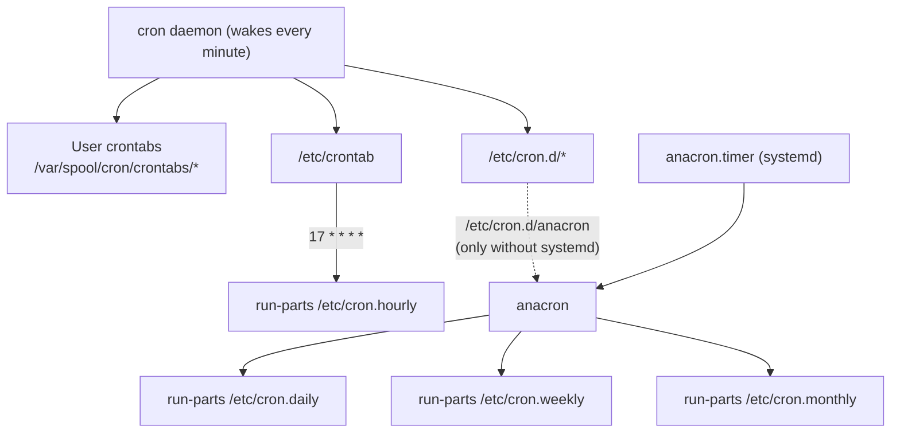
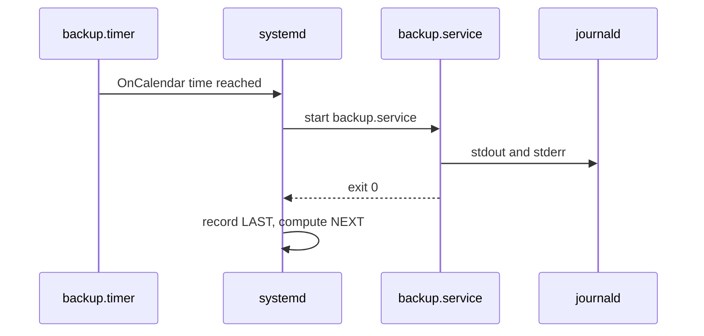

# Scheduling tasks

> **Level 4 · Chapter 2** · ⏱️ ~40 min read · Prerequisites: [systemd and journalctl](01-systemd-and-journalctl.md), [Your first script](../02-scripting/01-first-script.md)

Servers do a lot of work while nobody is watching: backups, log rotation, reports, cleanups. This chapter covers the three classic schedulers (cron, anacron, and `at`) and their modern replacement, systemd timers, so you can pick the right one and avoid the traps that make scheduled jobs fail silently.

## Why it matters

Alex writes a backup script, tests it in the terminal, and it works perfectly. Alex adds it to cron to run every night at 2 a.m. and goes to bed happy.

Three weeks later the disk dies. Alex goes to restore and finds the backup folder empty. The cron job had failed every single night. The script called `aws`, which lives in `~/.local/bin`, and cron's `PATH` does not include that directory. The error message went to an email address that did not exist, because no mail server was installed. Nothing ever showed up on screen.

Every part of this story is common: a different environment under cron, output that vanishes, and no one checking. By the end of this chapter you will know why each of those things happened, how to make cron jobs log properly, and how systemd timers avoid most of these problems by design.

## Concepts

### Three kinds of scheduling

Scheduled work comes in three shapes:

| Shape | Example | Classic tool | systemd tool |
|-------|---------|--------------|--------------|
| **Recurring at a clock time** | "Every night at 02:30" | `cron` | timer with `OnCalendar=` |
| **Recurring, but must not be skipped** if the machine was off | "Once a day, whenever the laptop is on" | `anacron` | timer with `Persistent=true` |
| **Once, at a later time** | "Reboot at 23:00 tonight" | `at` | `systemd-run --on-calendar=` |

Each tool is a **daemon** (a background service) that wakes up periodically, checks its schedule, and launches jobs. None of them is magic: `cron` is literally a loop that wakes up once a minute and compares the current time with every schedule it knows.

### cron and the crontab format

**cron** is the classic Unix scheduler, around since the 1970s. On Mint it runs as `cron.service`. Schedules live in files called **crontabs** (cron tables). Each non-comment line in a crontab is one job:

```text
┌───────────── minute        (0-59)
│ ┌─────────── hour          (0-23)
│ │ ┌───────── day of month  (1-31)
│ │ │ ┌─────── month         (1-12 or jan-dec)
│ │ │ │ ┌───── day of week   (0-7, 0 and 7 are Sunday, or sun-sat)
│ │ │ │ │
│ │ │ │ │
30 2 * * *  /home/alex/bin/backup.sh
```

Five time fields, then the command. cron runs the command whenever **all** the time fields match the current minute (with one exception about days, explained below).

Each field accepts the same small language:

| Syntax | Meaning | Example in the hour field |
|--------|---------|---------------------------|
| `*` | Every value | every hour |
| `5` | One value | at 05:xx |
| `1,13` | A list | at 01:xx and 13:xx |
| `9-17` | A range, inclusive | every hour from 09 to 17 |
| `*/4` | Every 4th value, starting at the first | 0, 4, 8, 12, 16, 20 |
| `9-17/2` | A step inside a range | 9, 11, 13, 15, 17 |

Here are schedules you will actually write, read left to right:

| Crontab line | When it runs |
|--------------|--------------|
| `*/5 * * * *` | Every 5 minutes |
| `0 * * * *` | At the top of every hour |
| `30 2 * * *` | Every day at 02:30 |
| `0 9 * * 1-5` | 09:00 on weekdays (Mon–Fri) |
| `15 14 1 * *` | 14:15 on the 1st of every month |
| `0 0 * * 0` | Midnight every Sunday |
| `0 6,18 * * *` | 06:00 and 18:00 every day |
| `0 3 1 1 *` | 03:00 on 1 January |

cron also understands a few shortcuts in place of the five fields: `@reboot` (once, when cron starts at boot), `@hourly`, `@daily` (same as `0 0 * * *`), `@weekly`, `@monthly`, and `@yearly`.

!!! warning "Common mistake"
    `* 2 * * *` does **not** mean "once at 2 a.m.". The minute field is `*`, so it runs **every minute** from 02:00 to 02:59: sixty times. Always set the minute.

**The day-of-month / day-of-week trap.** If you restrict *both* day fields, cron runs the job when **either** matches, not when both do. `0 4 1 * 5` runs at 04:00 on the 1st of each month *and* on every Friday, not "on the 1st if it is a Friday". To get an AND, keep one field as `*` and test the other condition inside the command.

cron **checks once per minute**. There are no seconds, and the smallest interval is one minute.

### Where crontabs live

There are two kinds of crontab, and their formats differ by one column.

**User crontabs** belong to one user. Every job runs as that user. You never edit the file directly; you use the `crontab` command, which validates your edit and installs it into `/var/spool/cron/crontabs/USERNAME` (a directory only root can read).

**System crontabs** are files root edits directly, and they have an **extra field: the user** to run as, between the time fields and the command:

```text
# m h dom mon dow user  command
17 *  *   *   *   root  cd / && run-parts --report /etc/cron.hourly
```

The system crontabs are:

- **`/etc/crontab`**: the main system table. cron rereads it automatically when it changes.
- **`/etc/cron.d/`**: one file per package or task, same format as `/etc/crontab`. This is where you put your own system jobs, so you never fight with package updates over `/etc/crontab`. Files must be owned by root and not writable by group or others, or cron ignores them.
- **`/etc/cron.hourly/`, `/etc/cron.daily/`, `/etc/cron.weekly/`, `/etc/cron.monthly/`**: directories of **executable scripts** (no schedule lines). A helper called `run-parts` runs every script in the directory, in alphabetical order.

Here is Mint's real `/etc/crontab`:

```text
SHELL=/bin/sh
# You can also override PATH, but by default, newer versions inherit it from the environment
#PATH=/usr/local/sbin:/usr/local/bin:/usr/sbin:/usr/bin:/sbin:/bin

17 *	* * *	root	cd / && run-parts --report /etc/cron.hourly
25 6	* * *	root	test -x /usr/sbin/anacron || { cd / && run-parts --report /etc/cron.daily; }
47 6	* * 7	root	test -x /usr/sbin/anacron || { cd / && run-parts --report /etc/cron.weekly; }
52 6	1 * *	root	test -x /usr/sbin/anacron || { cd / && run-parts --report /etc/cron.monthly; }
```

Read the daily line carefully: "at 06:25, **if anacron is not installed**, run the daily scripts". On Mint, anacron *is* installed, so cron itself does nothing here, and anacron takes over the daily, weekly, and monthly directories. More on that in a moment.

!!! warning "Common mistake"
    Naming a script `/etc/cron.daily/backup.sh`. `run-parts` only runs files whose names consist of letters, digits, underscores, and hyphens. **A dot in the name means it is silently skipped.** Name it `backup`, make it executable with `chmod +x`, and check with `run-parts --test /etc/cron.daily`, which lists what would run.



### The cron environment: why jobs work in the terminal but not in cron

This section explains most "it works when I run it by hand" problems. When you run a script in your terminal, it inherits a rich environment from your login shell: your `PATH` from `~/.profile` and `~/.bashrc`, your aliases, `$DISPLAY`, a terminal, and so on. A cron job gets almost none of that.

| Thing | Your terminal | A cron job |
|-------|---------------|------------|
| Shell | bash | `/bin/sh` (dash on Mint), unless `SHELL=` is set |
| `PATH` | Long; includes `~/.local/bin`, `~/bin`, and more | Short system default; never your personal directories |
| `~/.bashrc`, aliases, functions | Loaded | **Not** loaded |
| Working directory | Wherever you are | Your home directory |
| Terminal (TTY) | Yes | **No**; programs that prompt for input hang or fail |
| Where output goes | Your screen | **Emailed** to the crontab owner, or thrown away |

Let us go through the pitfalls one by one.

**PATH.** The fix is to use absolute paths for every program and file (`/usr/bin/python3`, not `python3`), or to set `PATH` at the top of the crontab. Crontab variable lines do **not** expand variables, so `PATH=$HOME/bin:$PATH` is taken literally. Write the full value:

```text
PATH=/home/alex/.local/bin:/usr/local/bin:/usr/bin:/bin
```

**The `%` sign.** In a crontab command, an unescaped `%` is turned into a newline, and everything after the first `%` is fed to the command as standard input. That breaks the most common command in backup jobs:

```text
# Broken: cron cuts the command at the first %
0 2 * * * tar -czf /backups/home-$(date +%F).tar.gz /home/alex

# Fixed: escape every % with a backslash
0 2 * * * tar -czf /backups/home-$(date +\%F).tar.gz /home/alex
```

The cleanest fix is to put the logic in a script and call the script from cron. Scripts are not parsed by cron, so `%` is safe inside them.

**No TTY.** Commands that ask questions (`sudo` with a password, `apt` without `-y`, `ssh` asking about a new host key) hang or fail. Everything a cron job runs must be fully non-interactive.

**Output mailing.** By default, anything a cron job prints (stdout or stderr) is emailed to the crontab owner through the local mail system. Set `MAILTO=you@example.com` to change the recipient, or `MAILTO=""` to disable mail. On a desktop or a fresh server **no mail server is installed**, so cron logs this and throws the output away:

```text
CRON[5123]: (CRON) info (No MTA installed, discarding output)
```

(**MTA** means mail transfer agent, a program such as Postfix that delivers mail.) This line is how errors disappear without a trace.

**Logging output yourself.** The reliable fix is to redirect output to a log file or to the journal in the crontab line:

```text
# Append both stdout and stderr to a log file
30 2 * * * /home/alex/bin/backup.sh >> /home/alex/logs/backup.log 2>&1

# Or send it to the journal with a tag you can search for
30 2 * * * /home/alex/bin/backup.sh 2>&1 | /usr/bin/logger -t backup
```

`>> file 2>&1` appends stdout to the file, then points stderr at the same place (the order matters; see [Pipes and redirection](../01-command-line/04-pipes-and-redirection.md)). `logger -t backup` writes each line to the system log with the identifier `backup`, so `journalctl -t backup` shows it.

**Overlapping runs.** If a job runs every 5 minutes but sometimes takes 7, cron happily starts a second copy while the first is still running. Two backup jobs writing to the same place at once can corrupt both. Wrap the command in `flock`, which takes a lock file and skips the run if the lock is already held:

```text
*/5 * * * * /usr/bin/flock -n /tmp/sync.lock /home/alex/bin/sync.sh
```

`-n` means "do not wait; give up immediately if locked".

### anacron: for machines that sleep

cron assumes the machine is always on. If your laptop is off at 02:30, the 02:30 job simply does not run that day, and nothing catches up.

**anacron** solves this for daily, weekly, and monthly jobs. It does not track clock times. It tracks **"when did this job last run?"** in timestamp files under `/var/spool/anacron/`. Whenever anacron is started, it looks at each job; if more days have passed than the job's period, it runs the job (after a delay).

Mint's `/etc/anacrontab`:

```text
SHELL=/bin/sh
HOME=/root
LOGNAME=root

# These replace cron's entries
1	5	cron.daily	run-parts --report /etc/cron.daily
7	10	cron.weekly	run-parts --report /etc/cron.weekly
@monthly	15	cron.monthly	run-parts --report /etc/cron.monthly
```

The four columns are:

1. **Period in days**: `1` = daily, `7` = weekly, or `@monthly`.
2. **Delay in minutes** after anacron starts, so jobs do not all fire at boot at once.
3. **Job identifier**: the name of the timestamp file in `/var/spool/anacron/`.
4. **Command**.

On Mint, anacron is started every hour between 07:30 and 23:30 by a systemd timer (`anacron.timer`). The file `/etc/cron.d/anacron` does the same job on systems that do not run systemd; on Mint it checks for `/run/systemd/system` and does nothing. Most of those hourly starts find nothing to do: once a job's timestamp says "today", it is skipped until tomorrow. By default it also **skips running on battery power** (`ConditionACPower=true` in `anacron.service`).

anacron has limits: its smallest period is one day, and only root can use the system anacrontab. It is a catch-up mechanism, not a precise scheduler.

### at: run something once, later

**at** schedules a **one-time** job. It reads commands from standard input and runs them later with `/bin/sh`. The `atd` daemon does the work. It is not installed on Mint by default:

```bash
sudo apt install at
```

`at` accepts friendly times: `at 23:00`, `at now + 30 minutes`, `at 9am tomorrow`, `at noon Friday`. A cousin, `batch`, runs a job as soon as the system load average drops below 1.5. Like cron, `at` mails the output to you, so redirect it.

### systemd timers

A **systemd timer** is a `.timer` unit that starts another unit (almost always a `.service`) on a schedule. It is two files instead of one line, which seems like more work, but you get a lot in return:

- The job is an ordinary service, so `systemctl start backup.service` runs it **right now** for testing, with exactly the same environment it gets at night.
- All output goes to the **journal** automatically. Nothing is mailed or lost.
- `systemctl list-timers` shows when each job **last ran and next runs**.
- Jobs never overlap: if the service is still running, the timer does not start a second copy.
- `Persistent=true` gives you anacron-style catch-up for any schedule, not just daily.
- You get every systemd feature: `User=`, resource limits, sandboxing, dependencies, and failure hooks.



By default, `foo.timer` activates `foo.service`, matched by name. You can point it elsewhere with `Unit=other.service` in the `[Timer]` section.

### Timer triggers: realtime and monotonic

A timer can fire on two kinds of clocks.

**Realtime (calendar) timers** fire at wall-clock times, like cron. They use `OnCalendar=`.

**Monotonic timers** fire after a time span measured from some event. They ignore the wall clock and do not care about time zones or clock changes:

| Setting | Fires this long after... |
|---------|--------------------------|
| `OnBootSec=` | The machine booted |
| `OnStartupSec=` | The service manager started (useful in user timers) |
| `OnActiveSec=` | The timer itself was activated |
| `OnUnitActiveSec=` | The target service was last **started** |
| `OnUnitInactiveSec=` | The target service last **finished** |

Combining two monotonic settings gives "every N, starting shortly after boot":

```ini
[Timer]
OnBootSec=5min
OnUnitActiveSec=1h
```

This means "5 minutes after boot, then every hour after each run starts". Time spans are written like `30s`, `5min`, `1h`, `2d`, or combined: `1h 30min`.

### OnCalendar syntax

`OnCalendar=` uses systemd's calendar event format. The full form is:

```text
DayOfWeek Year-Month-Day Hour:Minute:Second
```

Each part accepts `*` (any), a value, lists with `,`, ranges with `..`, and repetitions with `/`. Parts you leave out get sensible defaults: a missing date means "every day", a missing day of week means "any day", and missing seconds mean `:00`.

| `OnCalendar=` | Normalized form | Meaning |
|---------------|-----------------|---------|
| `daily` | `*-*-* 00:00:00` | Every midnight |
| `hourly` | `*-*-* *:00:00` | Top of every hour |
| `weekly` | `Mon *-*-* 00:00:00` | Monday midnight (not Sunday like cron's `@weekly`) |
| `*-*-* 02:30` | `*-*-* 02:30:00` | Every day at 02:30 |
| `Mon..Fri 09:00` | `Mon..Fri *-*-* 09:00:00` | Weekdays at 09:00 |
| `Sat,Sun 10:00` | `Sat,Sun *-*-* 10:00:00` | Weekends at 10:00 |
| `*:0/15` | `*-*-* *:00/15:00` | Every 15 minutes |
| `*-*-01 03:00` | `*-*-01 03:00:00` | 03:00 on the 1st of each month |
| `Fri *-*-1..7 18:00` | | 18:00 on the first Friday of each month |

The last example is something cron cannot express in one line. In systemd, all parts must match (AND), so "a Friday" and "day 1 to 7" together mean "the first Friday". That removes cron's day-field trap.

You never have to guess whether an expression is right. `systemd-analyze calendar` parses it and tells you when it will next fire. It is read-only and needs no root.

### Persistent, randomized delay, and accuracy

Three more `[Timer]` settings matter in practice:

- **`Persistent=true`** stores the last trigger time on disk (in `/var/lib/systemd/timers/`). At boot, if a scheduled run was missed while the machine was off, the service runs once right away. This gives you anacron's catch-up for any `OnCalendar=` schedule. It has no effect on monotonic timers.
- **`RandomizedDelaySec=`** adds a random delay between zero and this value to each run. If a thousand servers all run `apt update` at exactly 06:00, the package mirror gets hammered. With `RandomizedDelaySec=1h`, the load spreads over an hour. Mint's `anacron.timer` uses `RandomizedDelaySec=5m`.
- **`AccuracySec=`** lets systemd shift the trigger a little to batch wakeups and save power. The default is **1 minute**, so a timer set for `02:30:00` may fire at `02:30:37`. If you need precision to the second, set `AccuracySec=1s`. For a backup, the default is fine.

### cron vs systemd timers

| Aspect | cron | systemd timer |
|--------|------|---------------|
| Files per job | One line | A `.timer` and a `.service` file |
| Schedule syntax | 5 fields, compact | `OnCalendar=`, more readable, testable with `systemd-analyze calendar` |
| Finest resolution | 1 minute | 1 second (or better, with `AccuracySec=`) |
| Day-of-month + weekday | OR (surprising) | AND (intuitive) |
| Missed runs while off | Lost (unless anacron, daily+ only) | `Persistent=true` catches up |
| Run on demand for testing | Copy the command and hope the env matches | `systemctl start job.service`, identical env |
| Environment | Minimal, different from your shell | Defined explicitly in the unit |
| Output and logs | Mailed or lost unless redirected | Journal, automatically: `journalctl -u job` |
| Last/next run | Not shown | `systemctl list-timers` |
| Overlapping runs | Possible; use `flock` | Never; a running service is not started twice |
| Random spreading | Manual (`sleep $((RANDOM % 600))`) | `RandomizedDelaySec=` |
| Resource limits, sandboxing, run as user | Limited | Full systemd options (`User=`, `MemoryMax=`, `Nice=`, ...) |
| Triggers after boot/after last run | `@reboot` only | `OnBootSec=`, `OnUnitActiveSec=`, ... |
| Portability | Every Unix (Linux, BSD, macOS) | Linux with systemd only |
| Unprivileged users | `crontab -e` | `systemctl --user` (needs lingering on servers) |

### When to use which

- **Quick personal job on your own machine**, or something that must also work on macOS or a non-systemd system: **cron**. One line, done.
- **Anything on a server you care about** (backups, reports, data pipelines, cleanup): a **systemd timer**. The logging, `list-timers`, `Persistent=`, and the ability to test with `systemctl start` pay for the extra file many times over.
- **"Run this once at 23:00 tonight"**: `at`, or `systemd-run --on-calendar=` if `at` is not installed.
- **Daily jobs on a laptop that is often off**: drop a script in `/etc/cron.daily/` (anacron runs it) or use a timer with `Persistent=true`.
- **A job that should react to a file appearing**: neither. Use a `.path` unit (see [systemd and journalctl](01-systemd-and-journalctl.md)).

You will meet both in the real world, so read both fluently. Package-provided jobs on Mint are a mix: `logrotate`, `apt-daily`, and `fstrim` are timers, while `/etc/cron.daily/` still holds a handful of scripts.

## Commands and examples

### Your first user crontab

```bash
crontab -l
```

```text
no crontab for alex
```

Open your crontab in an editor:

```bash
crontab -e
```

The first time, it asks you to choose an editor:

```text
no crontab for alex - using an empty one

Select an editor.  To change later, run 'select-editor'.
  1. /bin/nano        <---- easiest
  2. /usr/bin/vim.basic
  3. /usr/bin/vim.tiny

Choose 1-3 [1]: 1
```

Add a harmless test job at the bottom of the file. It writes the date and the environment cron gives you into a file every minute:

```text
* * * * * /usr/bin/date >> /tmp/cron-test.log 2>&1; /usr/bin/env > /tmp/cron-env.txt
```

Save and quit. `crontab` checks the syntax and installs it:

```text
crontab: installing new crontab
```

Wait two minutes, then look:

```bash
cat /tmp/cron-test.log
cat /tmp/cron-env.txt
```

```text
Fri Oct  2 11:41:01 UTC 2026
Fri Oct  2 11:42:01 UTC 2026
```

```text
HOME=/home/alex
LOGNAME=alex
PATH=/usr/local/sbin:/usr/local/bin:/usr/sbin:/usr/bin:/snap/bin
LANG=en_US.UTF-8
SHELL=/bin/sh
PWD=/home/alex
...
```

Compare that `PATH` with `echo "$PATH"` in your terminal. Anything you installed in `~/.local/bin` (with `pip install --user` or `pipx`) is missing. That is the bug from the "Why it matters" story, made visible. Seeing exactly what cron gives you is the fastest way to debug any cron job.

!!! tip
    Remove the test job when you are done with `crontab -e`. `crontab -r` deletes your **entire** crontab without asking, and it sits right next to `-e` on the keyboard. Back up first with `crontab -l > ~/crontab.bak`.

### Watching cron work

cron logs each job it starts. On Mint, read it with `journalctl` or in `/var/log/syslog`:

```bash
journalctl -u cron --since "10 min ago" --no-pager
```

```text
Oct 02 11:42:01 mint CRON[5122]: pam_unix(cron:session): session opened for user alex(uid=1000) by alex(uid=0)
Oct 02 11:42:01 mint CRON[5123]: (alex) CMD (/usr/bin/date >> /tmp/cron-test.log 2>&1; /usr/bin/env > /tmp/cron-env.txt)
Oct 02 11:42:01 mint CRON[5122]: pam_unix(cron:session): session closed for user alex
```

The `CMD` line proves cron *started* the job. It does not tell you whether the job *succeeded*. That is your job, through logging.

If the job printed something you did not redirect, you will also see:

```text
Oct 02 11:42:01 mint CRON[5122]: (CRON) info (No MTA installed, discarding output)
```

### A realistic cron job, done properly

Here is a nightly report job written with every lesson above applied:

```text
# Environment for all jobs below
SHELL=/bin/bash
PATH=/home/alex/.local/bin:/usr/local/bin:/usr/bin:/bin
MAILTO=""

# m  h  dom mon dow  command
30   2  *   *   *    /usr/bin/flock -n /tmp/report.lock /home/alex/bin/nightly-report >> /home/alex/logs/report.log 2>&1
```

- `SHELL=/bin/bash`, so bash features work in the command line.
- An explicit `PATH`, written out in full.
- `MAILTO=""` because the output goes to a log file anyway.
- `flock -n` prevents a second copy if one night's run is slow.
- The script itself handles dates, so there are no `%` signs in the crontab.
- `>> ... 2>&1` keeps a history of every run, including errors.

Inside `nightly-report`, start with `set -euo pipefail` (see [Error handling](../02-scripting/04-error-handling.md)) and print a timestamp, so the log shows when each run started and where it failed.

### A system job in /etc/cron.d

!!! danger "⚠️ VM only"
    Creating files in `/etc/cron.d/` runs commands as root. Practice in your VM.

```bash
sudo tee /etc/cron.d/cleanup-tmp-exports <<'EOF'
# Delete CSV exports older than 7 days, every night at 03:15
SHELL=/bin/sh
PATH=/usr/sbin:/usr/bin:/sbin:/bin
15 3 * * * root find /srv/exports -name '*.csv' -mtime +7 -delete 2>&1 | logger -t cleanup-exports
EOF
```

Note the `root` field. No restart is needed; cron notices new files in `/etc/cron.d/` within a minute. The file name contains hyphens but no dots, so it is valid.

### anacron in action

You can ask anacron when each job last ran by reading its timestamp files. They are readable only by root:

```bash
sudo cat /var/spool/anacron/cron.daily /var/spool/anacron/cron.weekly
```

```text
20261002
20260927
```

Each file holds a date in `YYYYMMDD` form. The daily jobs last ran on 2 October. Test what anacron *would* do, without running anything:

```bash
anacron -T && echo "anacrontab syntax OK"
```

```text
anacrontab syntax OK
```

`-T` only tests the syntax of `/etc/anacrontab`; it prints nothing itself and exits with 0 when the file is valid.

### One-off jobs with at

```bash
echo '/usr/bin/df -h / > /tmp/df-at.txt' | at now + 2 minutes
```

```text
warning: commands will be executed using /bin/sh
job 3 at Fri Oct  2 11:52:00 2026
```

List and remove pending jobs:

```bash
atq
atrm 3
```

```text
3	Fri Oct  2 11:52:00 2026 a alex
```

The columns are the job number, the time, the **queue** (`a` is the default; `b` is used by `batch`), and the owner. `at -c 3` prints the full script `at` will run. It captures your current environment and working directory at the time you queue the job, which is a nice difference from cron.

### Exploring the timers on your system

```bash
systemctl list-timers
```

```text
NEXT                             LEFT LAST                              PASSED UNIT                                ACTIVATES
Fri 2026-10-02 11:34:06 UTC     43min Fri 2026-10-02 10:32:06 UTC    18min ago anacron.timer                       anacron.service
Fri 2026-10-02 11:42:36 UTC     52min Fri 2026-10-02 10:17:04 UTC    33min ago fwupd-refresh.timer                 fwupd-refresh.service
Fri 2026-10-02 12:09:11 UTC  1h 18min Sun 2026-09-27 17:35:53 UTC            - man-db.timer                        man-db.service
Fri 2026-10-02 12:43:29 UTC  1h 53min Sat 2026-09-26 22:04:22 UTC            - apt-daily.timer                     apt-daily.service
Sat 2026-10-03 00:00:00 UTC       13h Fri 2026-10-02 09:35:49 UTC 1h 14min ago logrotate.timer                     logrotate.service
Mon 2026-10-05 01:12:36 UTC    2 days Mon 2026-09-28 06:17:55 UTC            - fstrim.timer                        fstrim.service
...

14 timers listed.
Pass --all to see loaded but inactive timers, too.
```

| Column | Meaning |
|--------|---------|
| `NEXT` / `LEFT` | When the timer fires next, and how long until then |
| `LAST` / `PASSED` | When it last fired, and how long ago (`-` means not in this boot) |
| `UNIT` | The timer |
| `ACTIVATES` | The service it starts |

Look at `apt-daily.timer`: its NEXT time is not on the hour, because it has a large `RandomizedDelaySec=`. Look at the real `logrotate.timer` to see a complete, minimal timer:

```bash
systemctl cat logrotate.timer
```

```ini
# /usr/lib/systemd/system/logrotate.timer
[Unit]
Description=Daily rotation of log files
Documentation=man:logrotate(8) man:logrotate.conf(5)

[Timer]
OnCalendar=daily
AccuracySec=1h
Persistent=true

[Install]
WantedBy=timers.target
```

`AccuracySec=1h` tells systemd "anywhere in the hour after midnight is fine". The timer is enabled into `timers.target`, the timer equivalent of `multi-user.target`.

### Testing calendar expressions

```bash
systemd-analyze calendar "Mon..Fri 09:00"
```

```text
  Original form: Mon..Fri 09:00
Normalized form: Mon..Fri *-*-* 09:00:00
    Next elapse: Mon 2026-10-05 09:00:00 UTC
       From now: 2 days left
```

Check several upcoming runs with `--iterations`:

```bash
systemd-analyze calendar --iterations=3 "*-*-* 02:30"
```

```text
  Original form: *-*-* 02:30
Normalized form: *-*-* 02:30:00
    Next elapse: Sat 2026-10-03 02:30:00 UTC
       From now: 15h left
   Iteration #2: Sun 2026-10-04 02:30:00 UTC
       From now: 1 day 15h left
   Iteration #3: Mon 2026-10-05 02:30:00 UTC
       From now: 2 days left
```

If your local time zone is not UTC, you also get an `(in UTC):` line under each time. If the expression is invalid, you get `Failed to parse calendar specification` instead. Run this every time you write an `OnCalendar=` line. The companion command `systemd-analyze timespan "1h 30min"` checks time spans.

### Writing a timer: nightly backup of a data folder

This is the systemd version of Alex's nightly backup. Two files:

!!! danger "⚠️ VM only"
    Installing system units and running scheduled jobs as root belongs in your VM.

`/etc/systemd/system/backup-home.service`:

```ini
[Unit]
Description=Back up /home/alex/data to /var/backups/data

[Service]
Type=oneshot
ExecStart=/usr/bin/rsync -a --delete /home/alex/data/ /var/backups/data/
Nice=10
IOSchedulingClass=idle
```

`/etc/systemd/system/backup-home.timer`:

```ini
[Unit]
Description=Nightly backup of /home/alex/data

[Timer]
OnCalendar=*-*-* 02:30:00
RandomizedDelaySec=15min
Persistent=true

[Install]
WantedBy=timers.target
```

Notes:

- The service has **no `[Install]` section**. You never enable the service; you enable the **timer**, and the timer starts the service.
- `Type=oneshot` because the job runs and exits.
- `Nice=10` and `IOSchedulingClass=idle` make the backup yield CPU and disk to anything more important. A backup should never slow down the real work.
- `Persistent=true` means a missed 02:30 run happens at the next boot.

Load, **test the service by hand first**, then enable the timer:

```bash
sudo systemctl daemon-reload
sudo systemctl start backup-home.service
journalctl -u backup-home.service -n 5 --no-pager
sudo systemctl enable --now backup-home.timer
systemctl list-timers backup-home.timer
```

```text
Oct 02 12:01:10 mint systemd[1]: Starting backup-home.service - Back up /home/alex/data to /var/backups/data...
Oct 02 12:01:11 mint systemd[1]: backup-home.service: Deactivated successfully.
Oct 02 12:01:11 mint systemd[1]: Finished backup-home.service - Back up /home/alex/data to /var/backups/data.
Created symlink /etc/systemd/system/timers.target.wants/backup-home.timer → /etc/systemd/system/backup-home.timer.
NEXT                        LEFT     LAST PASSED UNIT              ACTIVATES
Sat 2026-10-03 02:41:52 UTC 14h left -    -      backup-home.timer backup-home.service

1 timers listed.
```

NEXT shows 02:41:52, not 02:30:00: that is the random delay at work.

If the job fails, the service enters the `failed` state, `systemctl --failed` lists it, and the journal holds the error. To get notified, add `OnFailure=notify-failure@%n.service` to the service's `[Unit]` section and write a small template service that sends an alert. That is beyond this chapter, but it is the systemd answer to cron's `MAILTO`.

### Monotonic timer example

A user timer that syncs a notes folder 2 minutes after login and then every 30 minutes, with no root needed:

`~/.config/systemd/user/notes-sync.service`:

```ini
[Unit]
Description=Sync notes to USB backup folder

[Service]
Type=oneshot
ExecStart=/usr/bin/rsync -a %h/notes/ %h/backup/notes/
```

`~/.config/systemd/user/notes-sync.timer`:

```ini
[Unit]
Description=Sync notes every 30 minutes

[Timer]
OnStartupSec=2min
OnUnitActiveSec=30min

[Install]
WantedBy=timers.target
```

```bash
mkdir -p ~/notes ~/backup/notes
systemctl --user daemon-reload
systemctl --user enable --now notes-sync.timer
systemctl --user list-timers
```

On a server you would also enable lingering, as shown in the previous chapter, so the timer keeps running after you log out.

### Transient timers with systemd-run

`systemd-run` creates a temporary unit on the fly, without writing any files. It is a handy replacement for `at`:

```bash
systemd-run --user --on-active=30s /usr/bin/touch /tmp/hello-from-timer
```

```text
Running timer as unit: run-r3c1f0a4f6d2e4b1b9e0f3b8a2c7d5e61.timer
Will run service as unit: run-r3c1f0a4f6d2e4b1b9e0f3b8a2c7d5e61.service
```

Thirty seconds later, `/tmp/hello-from-timer` exists. `--on-calendar="2026-10-02 23:00"` works the same way with a clock time. Transient units disappear after they run, or at reboot.

## Exercises

### Exercise 1: Read crontab lines (easy)

Without running anything, say when each line runs. Then write a crontab line for "every 10 minutes during working hours (08:00–17:59) on weekdays".

```text
a)  0 */6 * * *
b)  15 3 * * 0
c)  0 0 1,15 * *
d)  */30 9-17 * * 1-5
e)  0 12 13 * 5
```

??? success "Solution"

    - a) At minute 0 of hours 0, 6, 12, 18: every 6 hours.
    - b) 03:15 every Sunday.
    - c) Midnight on the 1st and 15th of each month.
    - d) Every 30 minutes (at :00 and :30) from 09:00 to 17:30, Monday to Friday.
    - e) Noon on the 13th of every month **and** noon every Friday. Both day fields are restricted, so cron uses OR. It is not "Friday the 13th".

    The requested line:

    ```text
    */10 8-17 * * 1-5 /path/to/command
    ```

    The hour range `8-17` includes 17:00–17:59, and `*/10` gives :00, :10, :20, :30, :40, :50.

### Exercise 2: Translate cron to OnCalendar (easy)

Convert each cron schedule into an `OnCalendar=` expression and verify it with `systemd-analyze calendar`: `30 2 * * *`, `0 9 * * 1-5`, `*/15 * * * *`, `0 0 1 * *`.

??? success "Solution"

    ```bash
    systemd-analyze calendar "*-*-* 02:30:00" "Mon..Fri 09:00" "*:0/15" "*-*-01 00:00:00"
    ```

    `systemd-analyze calendar` accepts several expressions at once and prints a block for each. The equivalents are:

    | cron | OnCalendar |
    |------|-----------|
    | `30 2 * * *` | `*-*-* 02:30:00` |
    | `0 9 * * 1-5` | `Mon..Fri 09:00` |
    | `*/15 * * * *` | `*:0/15` |
    | `0 0 1 * *` | `*-*-01 00:00:00` or `monthly` |

### Exercise 3: Prove the cron environment (medium)

On your main machine (this is safe; it is your own crontab), add a job that runs a script `~/bin/where-am-i` every minute. The script should print the date, `pwd`, `$SHELL`, `$PATH`, and whether a terminal is attached (`tty`). Send its output to `~/cron-debug.log`. After two runs, compare the log with what the same script prints in your terminal. Then remove the job.

??? success "Solution"

    ```bash
    mkdir -p ~/bin
    cat > ~/bin/where-am-i <<'EOF'
    #!/bin/bash
    echo "== $(date)"
    echo "pwd:   $(pwd)"
    echo "SHELL: $SHELL"
    echo "PATH:  $PATH"
    echo "tty:   $(tty)"
    EOF
    chmod +x ~/bin/where-am-i
    ( crontab -l 2>/dev/null; echo '* * * * * /home/alex/bin/where-am-i >> /home/alex/cron-debug.log 2>&1' ) | crontab -
    ```

    The last line appends a job to your existing crontab without opening an editor: it prints the current crontab (or nothing), adds a line, and pipes the result into `crontab -`, which installs from stdin.

    After two minutes, `cat ~/cron-debug.log` shows `pwd: /home/alex`, `SHELL: /bin/sh`, a short `PATH`, and `tty: not a tty`. In your terminal, `~/bin/where-am-i` shows your real shell, a long `PATH`, and a device like `/dev/pts/0`.

    Remove the job with `crontab -e` and delete the line, or, if it was your only job, `crontab -r`.

### Exercise 4: A user timer (medium)

Without root, create a user timer `disk-report.timer` that runs `df -h /` every 5 minutes, and only on weekdays. Check the schedule with `systemd-analyze calendar` first. Run the service once by hand, confirm the output is in the journal, then confirm the timer appears in `list-timers`. Clean up afterwards.

??? success "Solution"

    ```bash
    systemd-analyze calendar "Mon..Fri *:0/5"
    mkdir -p ~/.config/systemd/user
    cat > ~/.config/systemd/user/disk-report.service <<'EOF'
    [Unit]
    Description=Report root disk usage

    [Service]
    Type=oneshot
    ExecStart=/usr/bin/df -h /
    EOF
    cat > ~/.config/systemd/user/disk-report.timer <<'EOF'
    [Unit]
    Description=Disk report every 5 minutes on weekdays

    [Timer]
    OnCalendar=Mon..Fri *:0/5

    [Install]
    WantedBy=timers.target
    EOF
    systemctl --user daemon-reload
    systemctl --user start disk-report.service
    journalctl --user -u disk-report.service -n 5 --no-pager
    systemctl --user enable --now disk-report.timer
    systemctl --user list-timers disk-report.timer
    ```

    Clean up:

    ```bash
    systemctl --user disable --now disk-report.timer
    rm ~/.config/systemd/user/disk-report.{service,timer}
    systemctl --user daemon-reload
    ```

### Exercise 5: Convert a cron job to a timer (hard)

!!! danger "⚠️ VM only"
    This installs a root-level scheduled job. Use your VM.

In your VM, you have this system cron job in `/etc/cron.d/db-dump`:

```text
0 1 * * * postgres /usr/bin/pg_dumpall | gzip > /var/backups/db-$(date +\%F).sql.gz
```

Rewrite it as a systemd service and timer that: runs as `postgres`, runs at 01:00 with up to 10 minutes of random delay, catches up after downtime, has low CPU and I/O priority, and logs to the journal. Explain why the command needs a shell, and how you will test it before 01:00. (You do not need PostgreSQL installed; use `/bin/echo` in place of `pg_dumpall` to test the mechanics.)

??? success "Solution"

    The command uses a pipe, a redirection, and `$(date ...)`. Those are shell features, and `ExecStart=` does not run a shell, so the service must call `/bin/bash -c '...'` explicitly (or, better, call a small script). In a unit file, `%` is a **specifier** character, so a literal `%` must be written `%%`.

    `/etc/systemd/system/db-dump.service`:

    ```ini
    [Unit]
    Description=Nightly PostgreSQL dump

    [Service]
    Type=oneshot
    User=postgres
    ExecStart=/bin/bash -c 'set -o pipefail; /usr/bin/pg_dumpall | /usr/bin/gzip > /var/backups/db-$(date +%%F).sql.gz'
    Nice=10
    IOSchedulingClass=idle
    ```

    `/etc/systemd/system/db-dump.timer`:

    ```ini
    [Unit]
    Description=Run db-dump nightly at 01:00

    [Timer]
    OnCalendar=*-*-* 01:00:00
    RandomizedDelaySec=10min
    Persistent=true

    [Install]
    WantedBy=timers.target
    ```

    `set -o pipefail` makes the service fail if `pg_dumpall` fails, even though `gzip` succeeds. Without it, a failed dump would produce an empty file and a "success".

    Test and enable:

    ```bash
    sudo systemd-analyze verify /etc/systemd/system/db-dump.service /etc/systemd/system/db-dump.timer
    sudo systemctl daemon-reload
    sudo systemctl start db-dump.service
    systemctl status db-dump.service --no-pager
    ls -l /var/backups/db-*.sql.gz
    sudo systemctl enable --now db-dump.timer
    sudo rm /etc/cron.d/db-dump
    ```

    `/var/backups` must be writable by `postgres` for the test to pass; that is exactly the kind of problem the manual test is meant to catch before the first night.

## Check yourself

1. What are the five time fields of a crontab line, in order?

    ??? note "Answer"

        Minute, hour, day of month, month, day of week. A system crontab (`/etc/crontab`, `/etc/cron.d/*`) adds a sixth field, the user, before the command.

2. A cron job runs `backup.sh` fine in your terminal but does nothing in cron. Name three likely causes.

    ??? note "Answer"

        Any three of: a different, shorter `PATH` so a command is not found; `/bin/sh` instead of bash; `~/.bashrc` not loaded; a relative path that assumed a working directory; an unescaped `%` in the crontab line; a command waiting for input with no terminal; and the error being "mailed" to nowhere so you never saw it.

3. Why does `/etc/cron.daily/backup.sh` never run, while `/etc/cron.daily/backup` does?

    ??? note "Answer"

        `run-parts` only runs files whose names contain letters, digits, underscores, and hyphens. The dot in `backup.sh` makes it skip the file silently. Check with `run-parts --test /etc/cron.daily`.

4. What problem does anacron solve, and how does it know whether a job is due?

    ??? note "Answer"

        cron skips jobs scheduled while the machine was off. anacron runs daily, weekly, and monthly jobs whenever the machine is on and the job has not run for its period. It stores the last run date of each job in `/var/spool/anacron/`.

5. Which timer setting gives anacron-style catch-up, and how does it work?

    ??? note "Answer"

        `Persistent=true`. systemd stores the time the timer last fired on disk. At boot (or when the timer is started), if a scheduled time passed while the timer was not running, the service runs immediately once.

6. Why does a timer's service usually have no `[Install]` section, and which unit do you enable?

    ??? note "Answer"

        The service should only run when the timer starts it, not at boot. You enable the **timer** (`systemctl enable --now foo.timer`), which hooks it into `timers.target`.

7. What does `RandomizedDelaySec=` protect against?

    ??? note "Answer"

        Many machines (or many jobs) running at exactly the same second and overloading a shared resource such as a package mirror, a database, or a backup server. It spreads each run randomly across the given window.

8. How do you check an `OnCalendar=` expression before using it?

    ??? note "Answer"

        `systemd-analyze calendar "EXPRESSION"`. It shows the normalized form and the next time it fires. Add `--iterations=N` to see more upcoming runs.

## Key takeaways

- cron runs a command when all five fields (minute, hour, day of month, month, day of week) match, except that the two day fields combine with OR when both are set.
- User jobs go in `crontab -e`. System jobs go in `/etc/cron.d/` with a user field. Scripts in `/etc/cron.daily/` must have no dot in their name.
- cron jobs get a minimal environment: `/bin/sh`, a short `PATH`, no terminal, and output mailed or discarded. Use absolute paths, escape `%`, and redirect output to a log or `logger`.
- anacron catches up daily, weekly, and monthly jobs on machines that are not always on; `at` runs one-off jobs.
- A systemd timer pairs a `.timer` with a oneshot `.service`. You get journal logging, `list-timers`, `Persistent=`, `RandomizedDelaySec=`, no overlaps, and on-demand testing with `systemctl start`.
- Prefer timers for anything on a server; use cron for quick personal jobs and portability.

## Next

Scheduled jobs often talk to other machines: they upload backups, call APIs, and pull data. Before you can debug those, you need to understand how machines find and reach each other. Continue with [Networking basics](03-networking-basics.md).
