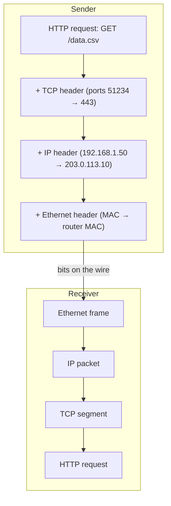
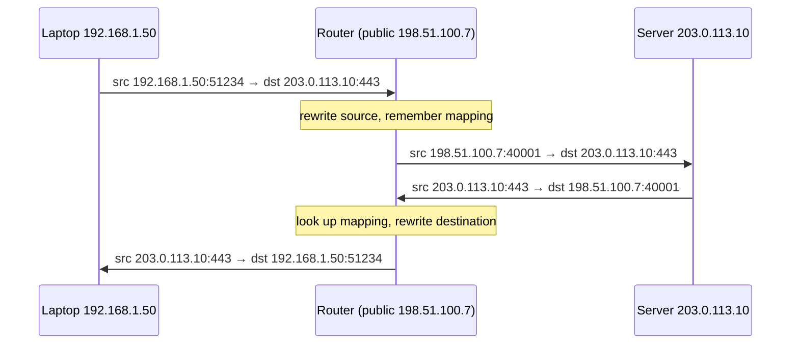
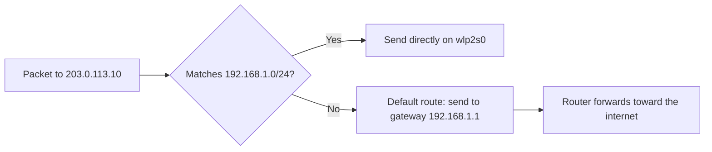
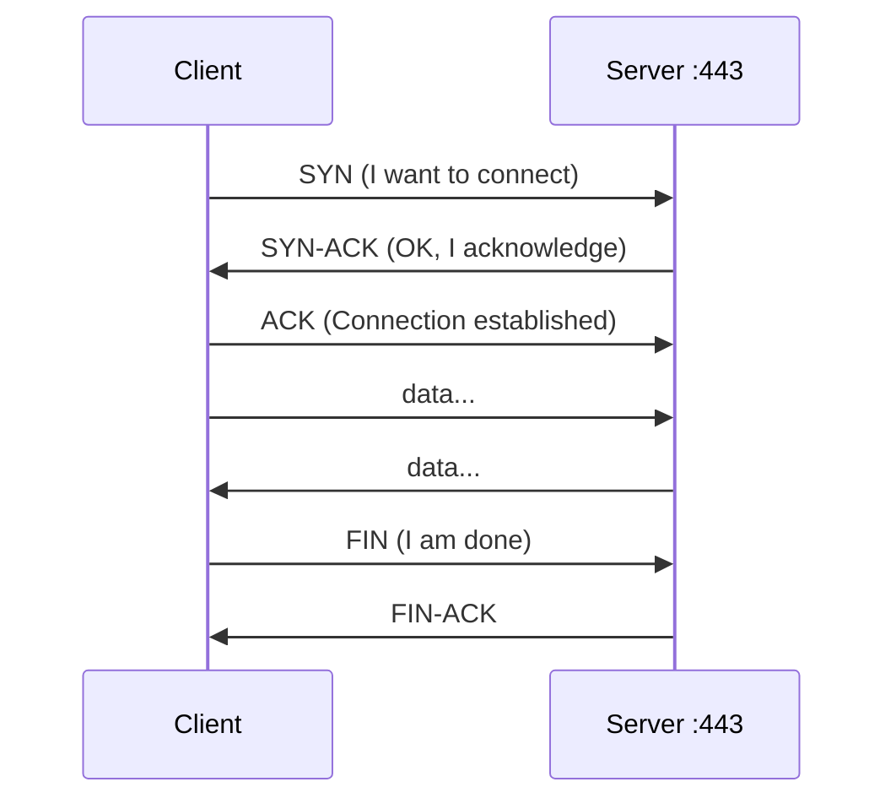
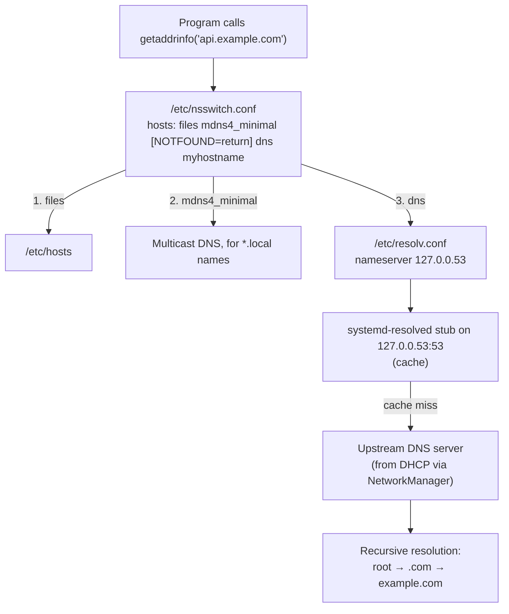

# Networking basics

> **Level 4 · Chapter 3** · ⏱️ ~50 min read · Prerequisites: [systemd and journalctl](01-systemd-and-journalctl.md), [Processes and signals](../03-internals/02-processes-and-signals.md)

This chapter explains how one Linux machine finds and talks to another: addresses, subnets, routes, ports, and DNS. Then it walks through the tools you use to inspect and debug all of it, from `ip` and `ss` to `dig` and `curl -v`.

## Why it matters

Alex's data pipeline pulls a CSV from a partner's API every hour. One morning it fails with `Could not resolve host: api.partner.example`. Alex restarts the job, then the machine. Same error. A colleague asks three questions: "Can you ping the gateway? Does `dig` return an address? What does `resolvectl status` show for the DNS server?" Within two minutes they find it: a VPN client had replaced the DNS server with one that only knew internal names.

Most network problems look identical from the application's point of view: "it doesn't connect". The skill that separates a guess from a diagnosis is knowing the layers a connection passes through, and having one command to test each layer. That is what this chapter gives you.

## Concepts

### The layered model

Networking is built in **layers**. Each layer solves one problem and relies on the layer below it. You may have heard of the seven-layer OSI model. In practice, the internet uses a simpler **TCP/IP model** with four layers, and that is the one worth memorizing:

| Layer | Job | Addresses used | Examples | Linux tools |
|-------|-----|----------------|----------|-------------|
| **Application** | What the programs say to each other | URLs, hostnames | HTTP, DNS, SSH, TLS | `curl`, `dig`, `ssh` |
| **Transport** | Deliver data to the right program; optionally reliably | **Ports** | TCP, UDP | `ss`, `nc` |
| **Internet** | Move packets between networks, across routers | **IP addresses** | IPv4, IPv6, ICMP | `ip addr`, `ip route`, `ping`, `tracepath` |
| **Link** | Move frames to the next device on the same local network | **MAC addresses** | Ethernet, Wi-Fi, ARP | `ip link`, `ip neigh` |

When your browser sends a request, each layer wraps the data from the layer above in its own **header**, like envelopes inside envelopes. This is called **encapsulation**. The receiving machine unwraps them in reverse order.



The practical value of layers is in debugging. If `ping 192.168.1.1` (Internet layer) fails, there is no point looking at DNS or TLS. Work **from the bottom up**: link, then IP, then routing, then DNS, then ports, then the application.

### IPv4 addresses

An **IPv4 address** is a 32-bit number that identifies a network interface. People write it as four **octets** (8-bit numbers, 0–255) separated by dots: `192.168.1.50`.

Every address has two parts: a **network** part (which network the host is on) and a **host** part (which machine on that network). The **prefix length** says where the split is, written after a slash. This notation is called **CIDR** (Classless Inter-Domain Routing):

```text
192.168.1.50/24
└────┬────┘ └┬┘
  network   host
  (24 bits) (8 bits)
```

`/24` means "the first 24 bits are the network". The same thing written as a **netmask** is `255.255.255.0`: 24 one-bits followed by 8 zero-bits.

Two addresses in every subnet are reserved:

- The **network address**: host bits all zero (`192.168.1.0`). It names the subnet itself.
- The **broadcast address**: host bits all one (`192.168.1.255`). A packet sent there goes to every host on the subnet.

So a `/24` has 2⁸ = 256 addresses, of which 254 are usable for hosts.

### Worked subnet math

You will need this when reading firewall rules, cloud network settings, and `ip route` output. Here are three worked examples, from easy to tricky.

**Example 1: `10.0.0.0/8`.** 8 network bits, 24 host bits. The first octet is fixed (`10`), the rest can be anything. That is 2²⁴ = 16,777,216 addresses, from `10.0.0.0` to `10.255.255.255`.

**Example 2: `172.20.5.9/16`.** 16 network bits: the first two octets (`172.20`) are the network. Network address `172.20.0.0`, broadcast `172.20.255.255`, 65,534 usable hosts.

**Example 3: `10.20.30.77/27`.** The prefix does not fall on an octet boundary, so you need a little binary. The trick is to look only at the octet where the split happens.

1. 27 bits = 24 bits (three full octets) + **3 bits** of the fourth octet.
2. Those 3 bits leave 5 host bits. 2⁵ = **32** addresses per subnet. This is the **block size**.
3. Subnets in the last octet therefore start at multiples of 32: 0, 32, 64, 96, 128, ...
4. 77 falls between 64 and 96, so the subnet starts at **64**.

```text
Address:     10.20.30.77   →  last octet 77 = 010 01101
Mask /27:    255.255.255.224  last octet    = 111 00000
Network:     10.20.30.64   →  last octet    = 010 00000  (host bits zeroed)
Broadcast:   10.20.30.95   →  last octet    = 010 11111  (host bits set to 1)
Usable:      10.20.30.65 – 10.20.30.94  (30 hosts)
```

The netmask's last octet is 256 − 32 = 224. The shortcut works for any prefix: **block size = 2^(32 − prefix)**, and the network starts at the largest multiple of the block size that is not larger than your address.

A quick reference for the prefixes you will see most:

| Prefix | Netmask | Addresses | Typical use |
|--------|---------|-----------|-------------|
| `/32` | 255.255.255.255 | 1 | A single host, in firewall rules |
| `/30` | 255.255.255.252 | 4 (2 usable) | Point-to-point links |
| `/27` | 255.255.255.224 | 32 | Small cloud subnet |
| `/24` | 255.255.255.0 | 256 | Home or office LAN |
| `/16` | 255.255.0.0 | 65,536 | Cloud VPC, Docker's default bridge |
| `/8` | 255.0.0.0 | 16.7 million | Large private network |
| `/0` | 0.0.0.0 | everything | "Any address", the default route |

### Private, special, and public ranges

IPv4 has only about 4.3 billion addresses, far fewer than devices on Earth. To stretch them, some ranges are reserved as **private** (RFC 1918). Anyone may use them inside their own network, and routers on the public internet never forward them:

| Range | CIDR | Where you see it |
|-------|------|------------------|
| 10.0.0.0 – 10.255.255.255 | `10.0.0.0/8` | Corporate networks, cloud VPCs |
| 172.16.0.0 – 172.31.255.255 | `172.16.0.0/12` | Docker (`172.17.0.0/16`), some offices |
| 192.168.0.0 – 192.168.255.255 | `192.168.0.0/16` | Home routers |

Other special ranges worth recognizing:

| Range | Meaning |
|-------|---------|
| `127.0.0.0/8` | **Loopback**: always "this machine". `127.0.0.1` is `localhost`. |
| `169.254.0.0/16` | **Link-local**: a machine assigns itself one when DHCP failed. Seeing it usually means "no DHCP server answered". |
| `100.64.0.0/10` | Carrier-grade NAT, used by some ISPs and by Tailscale |
| `0.0.0.0` | "Any address" when listening; "no address" otherwise |
| `192.0.2.0/24`, `198.51.100.0/24`, `203.0.113.0/24` | Reserved for documentation, like this handbook |

Everything else is (roughly) a **public** address, routable on the internet.

### NAT: how private addresses reach the internet

If private addresses cannot travel on the internet, how does your laptop at `192.168.1.50` load a web page? Your home router performs **NAT** (Network Address Translation). When a packet leaves your network, the router rewrites its source address from `192.168.1.50` to the router's single public address, and remembers the mapping in a table. When the reply comes back, it reverses the rewrite and forwards the packet to your laptop.



One consequence matters for servers: machines on the internet cannot start a connection **to** a machine behind NAT, because the router has no mapping for it. That is why running a server at home needs **port forwarding** on the router, and why cloud servers get public addresses. Docker and VMs use NAT too: your VM sits on a private network inside your laptop.

### IPv6 in brief

**IPv6** fixes the address shortage with 128-bit addresses, written as eight groups of four hex digits:

```text
2001:0db8:0000:0000:0000:ff00:0042:8329
```

Two rules shorten them: leading zeros in a group can be dropped, and **one** run of all-zero groups can be replaced by `::`. So the address above becomes `2001:db8::ff00:42:8329`.

| Address | Meaning |
|---------|---------|
| `::1` | Loopback (IPv6's `127.0.0.1`) |
| `fe80::/10` | **Link-local**. Every IPv6 interface always has one; only valid on the local link. |
| `2000::/3` | Global unicast: public, routable addresses |
| `fd00::/8` | Unique local: IPv6's version of private addresses |
| `2001:db8::/32` | Documentation |

IPv6 networks are almost always `/64`. Hosts usually configure their own address from the router's advertisements (**SLAAC**, stateless address autoconfiguration) rather than through DHCP. Because there are so many addresses, IPv6 normally needs no NAT: every device can have a public address, and the **firewall** does the protecting. Remember that when you set up `ufw` in the next chapter: rules must cover IPv6 too.

### MAC addresses and the link layer

IP addresses get packets across the internet, but on the **local** network (one Ethernet segment or one Wi-Fi network), devices deliver frames using **MAC addresses**. A MAC (media access control) address is a 48-bit hardware address, written as six hex bytes: `52:54:00:12:34:56`. The first three bytes identify the manufacturer.

To send an IP packet to a neighbor, Linux must learn the neighbor's MAC address. It uses **ARP** (Address Resolution Protocol) for IPv4: it broadcasts "who has 192.168.1.1?" and the owner replies with its MAC. The answers are cached in the **neighbor table**, which `ip neigh` shows. IPv6 does the same job with Neighbor Discovery.

MAC addresses never leave the local network. Each router hop rewrites the link-layer header with its own MAC addresses, while the IP addresses stay the same end to end (except where NAT rewrites them).

### Network interfaces and their names

A **network interface** is the kernel's representation of a network connection. It may be physical (an Ethernet port, a Wi-Fi card) or virtual (loopback, a Docker bridge, a VPN tunnel).

Modern Linux uses **predictable interface names**, generated by systemd-udev from where the hardware sits, so that names do not shuffle between reboots:

| Prefix | Type | Example | How to read it |
|--------|------|---------|----------------|
| `lo` | Loopback | `lo` | Always present; carries `127.0.0.1` and `::1` |
| `en` | Ethernet | `enp3s0` | **E**thernet on PCI **b**us 3, **s**lot 0 |
| `en` | Ethernet | `eno1` | **O**nboard device number 1 |
| `en` | Ethernet | `ens33` | Hot-plug **s**lot 33 (common in VMware VMs) |
| `en` | Ethernet | `enx525400123456` | Named after its MAC (common for USB adapters) |
| `wl` | Wi-Fi | `wlp2s0`, `wlo1` | Same scheme, for wireless |
| | Virtual | `docker0`, `virbr0`, `tun0`, `wg0` | Bridges, VPN tunnels |

The old style, `eth0` and `wlan0`, depended on the order drivers loaded, which could change after a hardware or kernel update and break your network config. In a VirtualBox VM you will usually see `enp0s3`; in a KVM/virt-manager VM, `enp1s0`.

### Routing and the default gateway

When Linux sends a packet, it must decide where to send it next. It consults the **routing table**: a list of destination networks and how to reach each one. The rule is **longest prefix match**: of all routes that contain the destination, use the most specific one.

A typical laptop's table has three kinds of entries:

1. **Directly connected networks.** "192.168.1.0/24 is on `wlp2s0`; deliver straight to the destination's MAC address." The kernel adds these automatically when an address is assigned.
2. **Specific routes**, if any: "10.8.0.0/16 goes through the VPN."
3. **The default route** (`default`, meaning `0.0.0.0/0`), which matches everything. It points at the **default gateway**, usually your router, which forwards the packet onward.



Every router along the path does the same lookup in its own table, hop by hop, until the packet reaches the destination network. Each hop decreases the packet's **TTL** (time to live) by one. When TTL reaches zero, the router drops the packet and sends back an error. That prevents loops, and `traceroute` exploits it to discover the path.

### DHCP: how a machine gets its address

When you plug in a cable or join Wi-Fi, you do not type an IP address. **DHCP** (Dynamic Host Configuration Protocol) does it for you. Your machine broadcasts a request, a DHCP server (your router at home) offers an address, and your machine accepts it. The server hands out four things:

- an IP address and prefix length (`192.168.1.50/24`),
- the default gateway (`192.168.1.1`),
- one or more DNS servers,
- a **lease time**, after which the client must renew.

The exchange is four messages: **Discover, Offer, Request, Acknowledge** (DORA). On Mint, NetworkManager runs the DHCP client. Servers often use **static** addresses instead, configured by hand, so their address never changes.

### TCP, UDP, and ports

The Internet layer gets a packet to the right **machine**. The Transport layer gets data to the right **program** on that machine, using **ports**: 16-bit numbers, 0–65535. A connection is identified by four values: source IP, source port, destination IP, destination port.

There are two main transport protocols, and the difference shapes everything built on them:

| | **TCP** (Transmission Control Protocol) | **UDP** (User Datagram Protocol) |
|---|---|---|
| Connection | Yes: a **three-way handshake** first | No: just send |
| Reliability | Lost data is resent; order is preserved | Packets may be lost, duplicated, or reordered |
| Flow control | Yes; slows down when the network is congested | No |
| Overhead | Higher | Minimal |
| Used by | HTTP(S), SSH, databases, email | DNS, DHCP, video calls, games, QUIC (HTTP/3) |

The TCP three-way handshake is worth knowing, because tools like `curl -v` and `ss` show its effects:



If the server has nothing listening on that port, it replies with a **RST** (reset), which tools report as **"Connection refused"**. If a firewall silently drops the SYN, the client waits and eventually reports a **timeout**. That difference is a valuable clue: "refused" means you reached the machine and nothing listens; "timed out" usually means a firewall or routing problem.

**Well-known ports** (0–1023) are assigned to standard services. On Linux, only root (or a program with the right capability) can listen on them. Ports you should recognize on sight:

| Port | Protocol | Service |
|------|----------|---------|
| 22 | TCP | SSH |
| 25 | TCP | SMTP (mail between servers) |
| 53 | UDP and TCP | DNS |
| 67/68 | UDP | DHCP |
| 80 | TCP | HTTP |
| 123 | UDP | NTP (time sync) |
| 443 | TCP (and UDP for HTTP/3) | HTTPS |
| 3306 | TCP | MySQL / MariaDB |
| 5432 | TCP | PostgreSQL |
| 6379 | TCP | Redis |
| 8080, 8000 | TCP | Common for development web servers |

The full list is in `/etc/services`. The client side of a connection uses a random high **ephemeral port** (on Linux, 32768–60999 by default).

### Sockets

A **socket** is the kernel object a program uses to send and receive network data, through a file descriptor (Level 5 shows the system calls). There are two kinds you will see in `ss`:

- A **listening socket** waits for new connections on a local address and port. A web server has one on `0.0.0.0:80`.
- A **connected socket** represents one established conversation between two endpoints.

The **bind address** of a listening socket decides who can reach it:

| Bound to | Reachable from |
|----------|----------------|
| `127.0.0.1:8080` | This machine only |
| `192.168.1.50:8080` | Only via that one interface address |
| `0.0.0.0:8080` | Every IPv4 address on the machine, including from the network |
| `[::]:8080` | Every IPv6 address (and often IPv4 too) |

This is the cause of a classic beginner puzzle: "my app works with `curl localhost:5000` on the server, but not from my laptop". The app is listening on `127.0.0.1` only. Flask's development server does that by default.

### DNS: names to addresses

People use names; packets need addresses. **DNS** (Domain Name System) is the distributed database that translates `example.com` into `203.0.113.10`. It is hierarchical:

- The **root servers** know who runs each top-level domain (`.com`, `.org`, `.in`).
- The **TLD servers** for `.com` know which **authoritative name servers** host `example.com`.
- The **authoritative servers** for `example.com` hold the actual records.

A **recursive resolver** (your ISP's, or a public one like `1.1.1.1` or `9.9.9.9`) walks this chain for you and caches the result for the record's **TTL** (here meaning how many seconds the answer may be cached).

Common record types:

| Type | Maps | Example |
|------|------|---------|
| `A` | Name → IPv4 address | `example.com → 203.0.113.10` |
| `AAAA` | Name → IPv6 address | `example.com → 2001:db8::10` |
| `CNAME` | Name → another name (an alias) | `www.example.com → example.com` |
| `MX` | Domain → mail server | `example.com → mail.example.com` |
| `NS` | Domain → its authoritative name servers | |
| `TXT` | Domain → arbitrary text (SPF, verification tokens) | |
| `PTR` | IP address → name (**reverse DNS**) | `10.113.0.203.in-addr.arpa → example.com` |

### How name resolution works on Mint and Ubuntu

A program does not talk to DNS directly. It calls the C library function `getaddrinfo()`, and the C library follows a chain of configuration files. On Mint 22 and Ubuntu 24.04 the chain looks like this:



Step by step:

1. **`/etc/nsswitch.conf`** (name service switch) lists the sources to try, in order. The `hosts:` line on Mint is `files mdns4_minimal [NOTFOUND=return] dns myhostname`.
2. **`files`** means **`/etc/hosts`**, a static table of names and addresses. It wins over DNS. Handy for testing (`203.0.113.10 staging.example.com`), and a classic cause of "DNS is returning the wrong address" when someone forgot an old entry.
3. **`mdns4_minimal`** handles names ending in `.local` using multicast DNS on the LAN (printers, other Macs and Linux boxes). `[NOTFOUND=return]` means "if it is a `.local` name and mDNS did not find it, stop here".
4. **`dns`** reads **`/etc/resolv.conf`**. On Mint, that file is a symlink to `/run/systemd/resolve/stub-resolv.conf`, and it contains just `nameserver 127.0.0.53`.
5. **`127.0.0.53`** is the **stub resolver** of **systemd-resolved**, a local DNS cache and forwarder. It listens only on the loopback interface. It knows the real upstream DNS servers for each network interface, which NetworkManager learned from DHCP.
6. **systemd-resolved** answers from its cache or forwards the query upstream, where a recursive resolver walks the hierarchy.
7. **`myhostname`** is a fallback that makes your own hostname always resolve, even with no network.

!!! warning "Common mistake"
    Editing `/etc/resolv.conf` by hand to change DNS servers. It is generated, so your change vanishes at the next reconnect or reboot. Change DNS servers in NetworkManager (`nmcli` or the network settings GUI), and check the result with `resolvectl status`.

!!! info "`dig` bypasses half of this chain"
    `dig`, `host`, and `nslookup` are DNS tools. They read `/etc/resolv.conf` and send a DNS query, skipping `/etc/hosts` and `nsswitch.conf` entirely. `getent hosts NAME` follows the exact same path as a normal program. When `dig` and your application disagree, an `/etc/hosts` entry is the usual suspect.

### NetworkManager

On Mint (and Ubuntu Desktop), **NetworkManager** owns network configuration. It brings interfaces up, runs DHCP, connects to Wi-Fi, handles VPNs, and tells systemd-resolved which DNS servers to use. The network icon in the panel is a front end for it, and **`nmcli`** is its command-line interface.

NetworkManager organizes settings as **connections** (saved profiles, like "Home Wi-Fi" or "Wired connection 1") that are applied to **devices** (interfaces). Profiles are stored in `/etc/NetworkManager/system-connections/`.

Ubuntu **Server** uses a different stack by default: **netplan** YAML files in `/etc/netplan/`, rendered to **systemd-networkd**. The concepts (address, gateway, DNS, DHCP or static) are identical; only the tool differs.

## Commands and examples

All commands in this section are read-only unless marked otherwise. The examples use documentation addresses; yours will differ.

### ip addr: interfaces and addresses

The `ip` command (from the `iproute2` package) is the modern tool for everything at the IP and link layers. Its subcommands can be abbreviated: `ip a` = `ip addr`, `ip r` = `ip route`.

```bash
ip addr
```

```text
1: lo: <LOOPBACK,UP,LOWER_UP> mtu 65536 qdisc noqueue state UNKNOWN group default qlen 1000
    link/loopback 00:00:00:00:00:00 brd 00:00:00:00:00:00
    inet 127.0.0.1/8 scope host lo
       valid_lft forever preferred_lft forever
    inet6 ::1/128 scope host noprefixroute
       valid_lft forever preferred_lft forever
2: enp1s0: <BROADCAST,MULTICAST,UP,LOWER_UP> mtu 1500 qdisc fq_codel state UP group default qlen 1000
    link/ether 52:54:00:12:34:56 brd ff:ff:ff:ff:ff:ff
    inet 192.168.1.50/24 brd 192.168.1.255 scope global dynamic noprefixroute enp1s0
       valid_lft 85967sec preferred_lft 85967sec
    inet6 fe80::5054:ff:fe12:3456/64 scope link noprefixroute
       valid_lft forever preferred_lft forever
```

Reading the `enp1s0` block:

- **`2: enp1s0:`** is the interface index and name.
- **`<BROADCAST,MULTICAST,UP,LOWER_UP>`** are flags. `UP` means the interface is administratively enabled. `LOWER_UP` means the physical link is up (cable plugged in, Wi-Fi associated). `UP` without `LOWER_UP` means "enabled, but no cable".
- **`mtu 1500`**: the **maximum transmission unit**, the largest packet the link carries. 1500 bytes is standard Ethernet.
- **`state UP`**: the operational state.
- **`link/ether 52:54:00:12:34:56`**: the MAC address. `brd ff:ff:ff:ff:ff:ff` is the link-layer broadcast address.
- **`inet 192.168.1.50/24`**: the IPv4 address and prefix. `brd 192.168.1.255` is the broadcast address you would compute from the prefix.
- **`scope global`**: valid anywhere (vs `scope link` for link-local, `scope host` for loopback).
- **`dynamic`**: it came from DHCP. **`valid_lft 85967sec`**: the lease has about 24 hours left.
- **`inet6 fe80::.../64 scope link`**: the automatic IPv6 link-local address.

You may also see `altname wlp0s20f3` lines: alternative names for the same interface.

The brief form is easier to scan:

```bash
ip -br addr
```

```text
lo               UNKNOWN        127.0.0.1/8 ::1/128
enp1s0           UP             192.168.1.50/24 fe80::5054:ff:fe12:3456/64
docker0          DOWN           172.17.0.1/16
```

`ip -4 addr` and `ip -6 addr` filter by family. `ip addr show enp1s0` limits to one interface.

### ip link and ip neigh

`ip link` shows only the link layer: names, states, MACs, and MTU.

```bash
ip -br link
```

```text
lo               UNKNOWN        00:00:00:00:00:00 <LOOPBACK,UP,LOWER_UP>
enp1s0           UP             52:54:00:12:34:56 <BROADCAST,MULTICAST,UP,LOWER_UP>
docker0          DOWN           02:42:8a:3c:11:5e <NO-CARRIER,BROADCAST,MULTICAST,UP>
```

`NO-CARRIER` on `docker0` means no containers are attached. The neighbor (ARP) table shows which local MAC addresses Linux has learned:

```bash
ip neigh
```

```text
192.168.1.1 dev enp1s0 lladdr 52:54:00:ab:cd:01 REACHABLE
fe80::1 dev enp1s0 lladdr 52:54:00:ab:cd:01 router STALE
```

If your gateway shows `FAILED` or `INCOMPLETE` here, the problem is at the link layer: a cable, Wi-Fi, or a VM network setting.

### ip route: the routing table

```bash
ip route
```

```text
default via 192.168.1.1 dev enp1s0 proto dhcp src 192.168.1.50 metric 100
172.17.0.0/16 dev docker0 proto kernel scope link src 172.17.0.1 linkdown
192.168.1.0/24 dev enp1s0 proto kernel scope link src 192.168.1.50 metric 100
```

- **`default via 192.168.1.1 dev enp1s0`**: everything without a more specific route goes to the gateway `192.168.1.1` through `enp1s0`. **`proto dhcp`**: learned from DHCP.
- **`192.168.1.0/24 dev enp1s0 proto kernel scope link`**: the directly connected LAN. No `via`, because hosts here are reached directly.
- **`metric 100`**: a cost. If two routes match equally, the lower metric wins (wired usually beats Wi-Fi).
- **`linkdown`**: the interface for this route is down, so the route is unusable for now.

To ask the kernel exactly which route it would use for a destination, use `ip route get`. This is the single most useful routing command:

```bash
ip route get 203.0.113.10
```

```text
203.0.113.10 via 192.168.1.1 dev enp1s0 src 192.168.1.50 uid 1000
    cache
```

It tells you the gateway, the outgoing interface, and the source address the packet would carry.

### ss: sockets and listening ports

`ss` (socket statistics) lists sockets. The flags you will use most are worth memorizing as a word, **`-tulpn`**:

| Flag | Meaning |
|------|---------|
| `-t` | TCP sockets |
| `-u` | UDP sockets |
| `-l` | Listening sockets only |
| `-p` | Show the process using each socket (needs `sudo` for other users' processes) |
| `-n` | Numeric: show `22` instead of `ssh`, and do not look up hostnames |

```bash
sudo ss -tulpn
```

```text
Netid State  Recv-Q Send-Q   Local Address:Port   Peer Address:Port Process
udp   UNCONN 0      0           127.0.0.54:53          0.0.0.0:*     users:(("systemd-resolve",pid=612,fd=19))
udp   UNCONN 0      0        127.0.0.53%lo:53          0.0.0.0:*     users:(("systemd-resolve",pid=612,fd=17))
udp   UNCONN 0      0              0.0.0.0:5353        0.0.0.0:*     users:(("avahi-daemon",pid=701,fd=12))
tcp   LISTEN 0      4096     127.0.0.53%lo:53          0.0.0.0:*     users:(("systemd-resolve",pid=612,fd=18))
tcp   LISTEN 0      4096         127.0.0.1:631         0.0.0.0:*     users:(("cupsd",pid=845,fd=7))
tcp   LISTEN 0      4096           0.0.0.0:22          0.0.0.0:*     users:(("sshd",pid=1050,fd=3),("systemd",pid=1,fd=58))
tcp   LISTEN 0      5              0.0.0.0:8080        0.0.0.0:*     users:(("python3",pid=2741,fd=3))
tcp   LISTEN 0      4096              [::]:22             [::]:*     users:(("sshd",pid=1050,fd=4),("systemd",pid=1,fd=59))
```

Column by column:

- **`Netid`**: the protocol, `tcp` or `udp`.
- **`State`**: `LISTEN` for TCP listening sockets. UDP has no connections, so idle UDP sockets show `UNCONN`. Without `-l`, you would also see `ESTAB` (established connections) and `TIME-WAIT`.
- **`Recv-Q` / `Send-Q`**: for a **listening** socket, `Recv-Q` is the number of connections waiting to be accepted, and `Send-Q` is the maximum backlog. For an **established** socket, they are bytes not yet read by the program and bytes not yet acknowledged by the peer. A `Recv-Q` that keeps growing means the program is not keeping up.
- **`Local Address:Port`**: what the socket is bound to. Use the bind-address table from the Concepts section: `127.0.0.1:631` (printing) is local-only; `0.0.0.0:22` (SSH) and `0.0.0.0:8080` are reachable from the network. `127.0.0.53%lo` means "bound to that address on interface `lo`".
- **`Peer Address:Port`**: for listening sockets, `*` (anyone). For established ones, the remote end.
- **`Process`**: the program, its PID, and the file descriptor number. Notice SSH (this machine has `openssh-server` installed, which Mint does not do by default): on Mint 22 and Ubuntu 24.04, `systemd` (PID 1) opened port 22 through `ssh.socket` and started `sshd` on the first connection, so both processes hold the socket. This is **socket activation**.

Other useful forms:

```bash
ss -tn                    # established TCP connections, numeric
ss -tn state established '( dport = :443 )'   # only connections to remote port 443
ss -s                     # summary counts
```

`ss -tln` without `sudo` is the quickest "what is listening on this box?" check, just without process names.

### ping: is the host reachable?

`ping` sends **ICMP echo requests** (ICMP is the Internet Control Message Protocol, the IP layer's error and diagnostic messages) and waits for replies. It tests the IP layer and nothing above it.

```bash
ping -c 4 192.168.1.1
```

```text
PING 192.168.1.1 (192.168.1.1) 56(84) bytes of data.
64 bytes from 192.168.1.1: icmp_seq=1 ttl=64 time=2.31 ms
64 bytes from 192.168.1.1: icmp_seq=2 ttl=64 time=1.87 ms
64 bytes from 192.168.1.1: icmp_seq=3 ttl=64 time=4.02 ms
64 bytes from 192.168.1.1: icmp_seq=4 ttl=64 time=1.95 ms

--- 192.168.1.1 ping statistics ---
4 packets transmitted, 4 received, 0% packet loss, time 3005ms
rtt min/avg/max/mdev = 1.870/2.537/4.020/0.869 ms
```

- **`-c 4`**: send 4 packets and stop. Without it, `ping` runs until ++ctrl+c++.
- **`56(84) bytes`**: 56 bytes of payload, 84 with the ICMP and IP headers.
- **`icmp_seq`**: sequence number. Gaps mean lost packets.
- **`ttl=64`**: the TTL left when the reply arrived. Linux starts at 64, Windows at 128, so a reply with `ttl=117` came from a Windows host 11 hops away.
- **`time`**: the **round-trip time** (RTT). Under 5 ms on a LAN; 10–100 ms across a country; 150+ ms across oceans.
- **`packet loss`**: anything above 0% on a wired LAN is a problem.
- **`mdev`**: how much the RTT varies (**jitter**).

!!! warning "Common mistake"
    Concluding "the server is down" because `ping` fails. Many servers and cloud providers block ICMP on purpose. A failed ping is a hint, not proof. Test the actual service port with `nc -zv host 443` or `curl`.

### traceroute, tracepath, and mtr: where does the path break?

These tools send packets with TTL 1, 2, 3, and so on. Each router that drops a packet for TTL expiry replies with an ICMP "time exceeded", which reveals that hop's address. The result is the route, hop by hop.

`tracepath` is installed on Mint and needs no root:

```bash
tracepath -n example.com
```

```text
 1?: [LOCALHOST]                      pmtu 1500
 1:  192.168.1.1                                           2.469ms
 1:  192.168.1.1                                           2.199ms
 2:  198.51.100.1                                          8.799ms pmtu 1492
 3:  no reply
 4:  198.51.100.77                                        12.029ms
 5:  203.0.113.1                                          14.502ms
 6:  203.0.113.10                                         15.310ms reached
     Resume: pmtu 1492 hops 6 back 6
```

`-n` skips reverse DNS lookups, which makes it much faster. `no reply` means that router does not answer these probes. That is common and harmless if later hops answer. `pmtu` is the **path MTU**: here it drops to 1492 at hop 2, typical of a DSL link.

The classic `traceroute` (install it with `sudo apt install traceroute`) works the same way with more options, such as `-T` for TCP probes that pass firewalls blocking UDP.

`mtr` combines `ping` and `traceroute`: it probes every hop continuously and shows loss and latency per hop. It is installed on Mint. Use `--report` for a one-shot text summary:

```bash
mtr --report -c 10 -n example.com
```

```text
Start: 2026-10-02T11:05:00+0000
HOST: mint                        Loss%   Snt   Last   Avg  Best  Wrst StDev
  1.|-- 192.168.1.1                0.0%    10    2.1   2.4   1.9   4.0   0.6
  2.|-- 198.51.100.1               0.0%    10    8.4   8.9   7.8  12.1   1.2
  3.|-- ???                       100.0    10    0.0   0.0   0.0   0.0   0.0
  4.|-- 198.51.100.77              0.0%    10   12.2  12.6  11.9  14.0   0.7
  5.|-- 203.0.113.10               0.0%    10   15.1  15.4  14.8  16.9   0.6
```

How to read loss: loss at **one middle hop only** (hop 3 above) is just a router that deprioritizes probes. Loss that **starts at a hop and continues to the end** is real loss at or after that hop.

### dig: asking DNS directly

`dig` (domain information groper) is the DNS power tool. Its output looks noisy, but it has a fixed structure.

```bash
dig example.com
```

```text
; <<>> DiG 9.18.39-0ubuntu0.24.04.7-Ubuntu <<>> example.com
;; global options: +cmd
;; Got answer:
;; ->>HEADER<<- opcode: QUERY, status: NOERROR, id: 11725
;; flags: qr rd ra; QUERY: 1, ANSWER: 2, AUTHORITY: 0, ADDITIONAL: 1

;; OPT PSEUDOSECTION:
; EDNS: version: 0, flags:; udp: 65494
;; QUESTION SECTION:
;example.com.			IN	A

;; ANSWER SECTION:
example.com.		300	IN	A	203.0.113.10
example.com.		300	IN	A	203.0.113.11

;; Query time: 97 msec
;; SERVER: 127.0.0.53#53(127.0.0.53) (UDP)
;; WHEN: Fri Oct 02 10:38:17 UTC 2026
;; MSG SIZE  rcvd: 72
```

Section by section:

- **Header line 1**: the dig version and your query.
- **`->>HEADER<<-`**: `status: NOERROR` means the query succeeded. Other values you will meet: **`NXDOMAIN`** (the name does not exist; check spelling), **`SERVFAIL`** (the resolver could not get an answer; often a broken upstream server or a DNSSEC failure), and **`REFUSED`** (that server will not answer you). `id` matches queries to replies.
- **`flags`**: `qr` = this is a response; `rd` = recursion desired (you asked the server to do the full lookup); `ra` = recursion available; `aa` (when present) = **authoritative answer**, straight from the domain's own name server rather than a cache.
- **Counts**: how many records are in each section below.
- **`OPT PSEUDOSECTION`**: EDNS, an extension that allows larger DNS messages. Rarely matters.
- **`QUESTION SECTION`**: what you asked: the `A` record for `example.com.` in class `IN` (internet). The trailing dot means "the root"; every full name technically ends with it.
- **`ANSWER SECTION`**: the records. Each line is **name, TTL, class, type, value**. `300` means the answer may be cached for 300 seconds. Two `A` records means the name has two addresses; clients pick one.
- **`AUTHORITY SECTION`** (empty here): the name servers responsible for the zone. It shows up in `NXDOMAIN` replies and when you query authoritative servers.
- **`ADDITIONAL SECTION`**: extra helpful records, such as the addresses of those name servers.
- **Footer**: `Query time` (97 ms means it was not cached; run it again and you will usually see 0–1 ms), and **`SERVER`**: who answered. `127.0.0.53` is the local systemd-resolved stub.

The variations you will actually use:

```bash
dig +short example.com              # just the answers
dig example.com AAAA +short         # IPv6 addresses
dig example.com MX +short           # mail servers
dig example.com NS +short           # authoritative name servers
dig @1.1.1.1 example.com +short     # ask a specific server, bypassing your local resolver
dig -x 203.0.113.10 +short          # reverse lookup (PTR)
dig +trace example.com              # walk the hierarchy from the root yourself
dig example.com +noall +answer      # only the answer section, but with TTLs
```

`dig @1.1.1.1` is the key comparison trick: if your local resolver fails but a public resolver answers, the problem is your DNS configuration, not the domain.

`host` and `nslookup` are simpler alternatives:

```bash
host example.com
```

```text
example.com has address 203.0.113.10
example.com has address 203.0.113.11
example.com has IPv6 address 2001:db8::10
```

```bash
nslookup example.com
```

```text
Server:		127.0.0.53
Address:	127.0.0.53#53

Non-authoritative answer:
Name:	example.com
Address: 203.0.113.10
Name:	example.com
Address: 203.0.113.11
```

"Non-authoritative" means the answer came from a cache, not the domain's own servers.

### resolvectl and getent: the system's view of DNS

`resolvectl` talks to systemd-resolved. `status` shows which DNS servers are used for each interface:

```bash
resolvectl status
```

```text
Global
         Protocols: -LLMNR -mDNS -DNSOverTLS DNSSEC=no/unsupported
  resolv.conf mode: stub

Link 2 (enp1s0)
    Current Scopes: DNS
         Protocols: +DefaultRoute -LLMNR -mDNS -DNSOverTLS DNSSEC=no/unsupported
Current DNS Server: 192.168.1.1
       DNS Servers: 192.168.1.1
        DNS Domain: lan
```

- **`resolv.conf mode: stub`**: `/etc/resolv.conf` points at `127.0.0.53`, as expected.
- **`Current DNS Server`**: the upstream server queries are actually sent to. Here it is the home router, which forwards to the ISP.
- **`+DefaultRoute`**: this link's DNS servers are used for names that do not match any link-specific domain. VPNs often add a second link with their own domain.
- **`DNS Domain`**: the search domain. A bare name like `printer` is tried as `printer.lan`.

```bash
resolvectl query example.com
```

```text
example.com: 2001:db8::10                                -- link: enp1s0
             203.0.113.10                                -- link: enp1s0

-- Information acquired via protocol DNS in 2.0ms.
-- Data is authenticated: no; Data was acquired via local or encrypted transport: no
-- Data from: cache
```

`resolvectl statistics` shows cache hits, and `sudo resolvectl flush-caches` clears the cache after you fix a DNS record.

To resolve a name **exactly as an application would** (through `nsswitch.conf`, including `/etc/hosts`):

```bash
getent hosts localhost example.com
```

```text
::1             localhost ip6-localhost ip6-loopback
2001:db8::10    example.com
```

### curl -v: watching a whole HTTPS request

`curl` transfers data to or from a URL. With `-v` (verbose) it narrates every layer of the connection, which makes it the best single tool for debugging web requests. Lines starting with `*` are curl's notes, `>` is what you sent, and `<` is what came back.

```bash
curl -v -o /dev/null https://example.com/
```

```text
* Host example.com:443 was resolved.
* IPv6: 2001:db8::10
* IPv4: 203.0.113.10
*   Trying 203.0.113.10:443...
* Connected to example.com (203.0.113.10) port 443
* ALPN: curl offers h2,http/1.1
* TLSv1.3 (OUT), TLS handshake, Client hello (1):
*  CAfile: /etc/ssl/certs/ca-certificates.crt
*  CApath: /etc/ssl/certs
* TLSv1.3 (IN), TLS handshake, Server hello (2):
* TLSv1.3 (IN), TLS handshake, Encrypted Extensions (8):
* TLSv1.3 (IN), TLS handshake, Certificate (11):
* TLSv1.3 (IN), TLS handshake, CERT verify (15):
* TLSv1.3 (IN), TLS handshake, Finished (20):
* TLSv1.3 (OUT), TLS handshake, Finished (20):
* SSL connection using TLSv1.3 / TLS_AES_256_GCM_SHA384 / X25519 / id-ecPublicKey
* ALPN: server accepted h2
* Server certificate:
*  subject: CN=example.com
*  start date: Sep 26 22:49:11 2026 GMT
*  expire date: Dec 25 22:56:35 2026 GMT
*  subjectAltName: host "example.com" matched cert's "example.com"
*  issuer: C=US; O=Example CA; CN=Example TLS Issuing CA
*  SSL certificate verify ok.
* using HTTP/2
> GET / HTTP/2
> Host: example.com
> User-Agent: curl/8.5.0
> Accept: */*
>
< HTTP/2 200
< date: Fri, 02 Oct 2026 05:09:21 GMT
< content-type: text/html; charset=utf-8
< last-modified: Mon, 28 Sep 2026 16:19:23 GMT
< age: 2271
<
* Connection #0 to host example.com left intact
```

(The `{ [5 bytes data]` lines that appear between steps are trimmed here.) Read it as a story in four acts:

1. **DNS.** `Host example.com:443 was resolved` with its IPv6 and IPv4 addresses. If this fails, you get `Could not resolve host`: go to `dig` and `resolvectl`.
2. **TCP.** `Trying 203.0.113.10:443...` then `Connected`. That is the three-way handshake succeeding. A failure here is `Connection refused` (nothing listening, or a firewall `REJECT`) or `Connection timed out` (a firewall `DROP` or routing problem). Go to `ss`, `nc`, and the firewall.
3. **TLS.** **TLS** (Transport Layer Security) encrypts the connection and proves the server's identity. The client sends a **Client hello** listing the protocols it supports (**ALPN** offers HTTP/2 and HTTP/1.1). The server replies with a **Server hello** and its **certificate**: a document saying "this public key belongs to example.com", signed by a **certificate authority** (CA). curl checks the signature chain against the trusted CAs in `/etc/ssl/certs/ca-certificates.crt`, checks the dates, and checks that the name you asked for appears in the certificate (`subjectAltName ... matched`). `SSL certificate verify ok` means all checks passed. Failures look like `SSL certificate problem: certificate has expired` or `no alternative certificate subject name matches target host name`.
4. **HTTP.** The request (`> GET / HTTP/2`, with a `Host` header) and the response (`< HTTP/2 200` plus headers). The status code tells you how the application answered: `2xx` success, `3xx` redirect (use `curl -L` to follow), `4xx` your mistake (`404` not found, `401`/`403` auth), `5xx` the server's fault (`502 Bad Gateway` means a proxy could not reach the app behind it).

Other curl options worth knowing:

```bash
curl -I https://example.com/                 # HEAD request: headers only
curl -L http://example.com/                  # follow redirects
curl -o report.csv https://example.com/x.csv # save to a file
curl -s -o /dev/null -w '%{http_code}\n' https://example.com/   # just the status code
curl -s -o /dev/null -w 'dns:%{time_namelookup} tcp:%{time_connect} tls:%{time_appconnect} total:%{time_total}\n' https://example.com/
```

```text
dns:0.002704 tcp:0.017032 tls:0.108635 total:0.133075
```

The `-w` timing breakdown shows where time goes: here DNS took 3 ms, the TCP connection was ready at 17 ms, and TLS finished at 109 ms. These are cumulative times since the start.

### wget: downloading files

`wget` is a downloader. It follows redirects by default, can resume (`-c`), and can mirror sites recursively. For scripted downloads it is often simpler than curl:

```bash
wget -q --show-progress https://example.com/data.csv
wget -c https://example.com/big-dataset.tar.gz    # resume an interrupted download
```

Rule of thumb: `curl` for talking to APIs and debugging, `wget` for fetching files.

### nc: the network Swiss army knife

`nc` (netcat; Mint ships the OpenBSD version) opens raw TCP or UDP connections. Its most common use is checking whether a port is open:

```bash
nc -zv 192.168.1.20 22
nc -zv 192.168.1.20 5432
```

```text
Connection to 192.168.1.20 22 port [tcp/ssh] succeeded!
nc: connect to 192.168.1.20 port 5432 (tcp) failed: Connection refused
```

`-z` means "just test the connection, send no data", and `-v` prints the result. Add `-w 3` to time out after 3 seconds instead of waiting a long time on a filtered port.

You can also build a tiny chat between two terminals to see TCP with no protocol on top:

```bash
# Terminal 1: listen on port 9000 on localhost
nc -l 127.0.0.1 9000
```

```bash
# Terminal 2: connect and type
nc 127.0.0.1 9000
```

Whatever you type in one terminal appears in the other. While it is running, `ss -tn | grep 9000` shows the established connection from both sides. Press ++ctrl+c++ to end.

### Legacy tools: ifconfig and netstat

Old tutorials use `ifconfig`, `route`, and `netstat` from the `net-tools` package. It is deprecated: it does not show all addresses on an interface and has not kept up with the kernel. Mint still installs it, so you will recognize the output, but use the modern equivalents:

| Legacy | Modern |
|--------|--------|
| `ifconfig` | `ip addr` |
| `ifconfig eth0 up` | `ip link set enp1s0 up` |
| `route -n` | `ip route` |
| `arp -n` | `ip neigh` |
| `netstat -tulpn` | `ss -tulpn` |
| `netstat -rn` | `ip route` |

### nmcli: NetworkManager from the terminal

Reading state is safe:

```bash
nmcli device status
```

```text
DEVICE   TYPE      STATE                   CONNECTION
enp1s0   ethernet  connected               Wired connection 1
lo       loopback  connected (externally)  lo
```

```bash
nmcli connection show
nmcli device show enp1s0
```

```text
NAME                UUID                                  TYPE      DEVICE
Wired connection 1  6f1c2a7e-3b9d-4c51-9e0a-1d2f3c4b5a69  ethernet  enp1s0
lo                  0b7e1f2a-4c3d-4e5f-8a9b-0c1d2e3f4a5b  loopback  lo
```

`nmcli device show` prints the address, gateway, and DNS servers NetworkManager applied, in `KEY: value` form.

Changing configuration is where the danger starts. If you get it wrong on a remote machine, you lose access to it.

!!! danger "⚠️ VM only"
    Run this in your throwaway VM, never on your main machine. A wrong address, gateway, or DNS server cuts the machine off the network, and on a remote server you cannot get back in.

Switch a VM from DHCP to a static address:

```bash
nmcli connection modify "Wired connection 1" \
    ipv4.method manual \
    ipv4.addresses 192.168.122.50/24 \
    ipv4.gateway 192.168.122.1 \
    ipv4.dns "1.1.1.1 9.9.9.9"
sudo nmcli connection up "Wired connection 1"
ip -br addr show enp1s0
resolvectl status enp1s0
```

Use addresses that match your VM's actual network (KVM's default network is `192.168.122.0/24`; check `ip route` first). To go back to DHCP:

```bash
nmcli connection modify "Wired connection 1" ipv4.method auto ipv4.addresses "" ipv4.gateway "" ipv4.dns ""
sudo nmcli connection up "Wired connection 1"
```

The `ip addr add` and `ip route add` commands also change addresses and routes, but those changes are temporary and disappear at reboot or when NetworkManager reapplies its profile. They are useful for experiments in a VM, never for permanent config.

## Exercises

### Exercise 1: Map your own network (easy)

On your main machine, using read-only commands, find: your interface names and which one is active; your IPv4 address and prefix; your default gateway; which DNS server systemd-resolved uses; and the first hop toward `1.1.1.1`. Do not share the results anywhere.

??? success "Solution"

    ```bash
    ip -br addr
    ip route | grep default
    resolvectl status | grep -A2 'Current DNS'
    ip route get 1.1.1.1
    ```

    `ip -br addr` shows interfaces with `UP` and an address. The `default via X` line names the gateway. `resolvectl status` names the current DNS server per link. `ip route get` shows which interface and gateway a packet to `1.1.1.1` would use. Usually, the gateway and the DNS server are both your home router.

### Exercise 2: Subnet math by hand (easy)

For each address, give the network address, broadcast address, and number of usable hosts: `192.168.10.200/24`, `172.16.33.7/20`, `10.1.1.130/26`. Check your answers with Python's standard library afterwards.

??? success "Solution"

    - `192.168.10.200/24`: network `192.168.10.0`, broadcast `192.168.10.255`, 254 hosts.
    - `172.16.33.7/20`: 20 bits = 16 + 4, so the split is in the third octet. Block size 2⁴ = 16. 33 lies between 32 and 48, so network `172.16.32.0`, broadcast `172.16.47.255`, 2¹² − 2 = 4094 hosts.
    - `10.1.1.130/26`: 2 bits in the last octet, block size 64. 130 lies between 128 and 192, so network `10.1.1.128`, broadcast `10.1.1.191`, 62 hosts.

    Check with Python:

    ```bash
    python3 -c '
    import ipaddress
    for a in ["192.168.10.200/24", "172.16.33.7/20", "10.1.1.130/26"]:
        n = ipaddress.ip_interface(a).network
        print(a, n.network_address, n.broadcast_address, n.num_addresses - 2)
    '
    ```

    ```text
    192.168.10.200/24 192.168.10.0 192.168.10.255 254
    172.16.33.7/20 172.16.32.0 172.16.47.255 4094
    10.1.1.130/26 10.1.1.128 10.1.1.191 62
    ```

### Exercise 3: Who is listening? (medium)

Start a Python web server bound to localhost only, on port 8000, from a scratch directory. Use `ss` to find it, explain the local address, and prove with `curl` that it answers. Then restart it bound to all addresses and spot the difference in `ss`. Stop it when done.

??? success "Solution"

    ```bash
    mkdir -p /tmp/web-test && cd /tmp/web-test && echo hello > index.html
    python3 -m http.server 8000 --bind 127.0.0.1 &
    ss -tlnp | grep 8000
    curl -s http://127.0.0.1:8000/
    kill %1
    ```

    ```text
    LISTEN 0      5          127.0.0.1:8000       0.0.0.0:*    users:(("python3",pid=6120,fd=3))
    hello
    ```

    `127.0.0.1:8000` means only this machine can connect. Your own process shows in the `Process` column without `sudo`. Restart with `--bind 0.0.0.0` and `ss` shows `0.0.0.0:8000`: now other machines on the network could connect (if no firewall blocks it). `Send-Q` is 5 because `http.server` uses a listen backlog of 5.

### Exercise 4: Dissect a DNS lookup (medium)

For a domain of your choice: get its `A`, `AAAA`, `MX`, and `NS` records with `dig +short`. Compare the TTL of the `A` record when asked twice in a row through your local resolver. Then ask `1.1.1.1` directly. Finally, run `dig +trace` and identify which servers answered at each level.

??? success "Solution"

    ```bash
    for t in A AAAA MX NS; do echo "== $t"; dig example.com $t +short; done
    dig example.com +noall +answer; sleep 5; dig example.com +noall +answer
    dig @1.1.1.1 example.com +noall +answer
    dig +trace example.com
    ```

    The second local query shows a **lower TTL** (by about 5 seconds): the answer came from systemd-resolved's cache, which counts the TTL down. `@1.1.1.1` shows the TTL as Cloudflare's cache has it. `+trace` prints blocks: first the root servers (`.` NS records, `a.root-servers.net` and friends), then the `.com` TLD servers (`a.gtld-servers.net`, ...), then the domain's authoritative servers, and finally the `A` record with the authoritative server's name at the bottom of the block (`;; Received ... from ...`).

### Exercise 5: Layer-by-layer diagnosis (hard)

!!! danger "⚠️ VM only"
    This exercise deliberately breaks networking. Do it in your VM.

In your VM, break name resolution by adding a wrong DNS server, then diagnose it as if you did not know the cause. Set the DNS server to `192.0.2.53` (a documentation address with nothing behind it) using `nmcli` with `ipv4.ignore-auto-dns yes`. Then run `curl https://example.com` and work through the layers, writing down the command and conclusion at each layer. Fix it afterwards.

??? success "Solution"

    Break it (replace the connection name with yours):

    ```bash
    nmcli connection modify "Wired connection 1" ipv4.ignore-auto-dns yes ipv4.dns 192.0.2.53
    sudo nmcli connection up "Wired connection 1"
    curl -sS https://example.com -o /dev/null
    ```

    ```text
    curl: (6) Could not resolve host: example.com
    ```

    Diagnose bottom-up:

    | Layer | Command | Result | Conclusion |
    |-------|---------|--------|------------|
    | Link | `ip -br link` | `enp1s0 UP` | Interface is up |
    | IP | `ip -br addr` | Has `192.168.122.x/24` | Address OK |
    | Routing | `ip route get 1.1.1.1` | Via the gateway | Route OK |
    | Gateway | `ping -c 2 192.168.122.1` | Replies | LAN OK |
    | Internet | `ping -c 2 1.1.1.1` | Replies | Internet reachable by IP |
    | DNS | `dig example.com` | `connection timed out; no servers could be reached` | DNS broken |
    | DNS config | `resolvectl status` | `Current DNS Server: 192.0.2.53` | Wrong DNS server |
    | Confirm | `dig @1.1.1.1 example.com +short` | Returns an address | The domain is fine; the config is not |

    Fix:

    ```bash
    nmcli connection modify "Wired connection 1" ipv4.ignore-auto-dns no ipv4.dns ""
    sudo nmcli connection up "Wired connection 1"
    resolvectl status | grep 'Current DNS'
    curl -sS -o /dev/null -w '%{http_code}\n' https://example.com
    ```

    The key move was `ping 1.1.1.1` succeeding while names failed: that splits "network broken" from "DNS broken" in one command.

## Check yourself

1. What are the four layers of the TCP/IP model, and which address type belongs to the bottom three?

    ??? note "Answer"

        Application, Transport, Internet, Link. Transport uses **ports**, Internet uses **IP addresses**, and Link uses **MAC addresses**.

2. What are the network address, broadcast address, and usable host count for `192.168.5.77/28`?

    ??? note "Answer"

        `/28` leaves 4 host bits, so the block size is 16. 77 lies between 64 and 80, so the network is `192.168.5.64`, the broadcast is `192.168.5.79`, and there are 16 − 2 = 14 usable hosts (`.65` to `.78`).

3. A server's app works with `curl localhost:5000` on the server but not from your laptop. `ss -tln` shows `127.0.0.1:5000`. What is wrong?

    ??? note "Answer"

        The app is bound to the loopback address, so only the server itself can connect. Configure it to listen on `0.0.0.0` (all IPv4 addresses) or the server's LAN address, and make sure the firewall allows the port.

4. What is the difference between "Connection refused" and "Connection timed out"?

    ??? note "Answer"

        "Refused" means the packet reached the host and the host answered with a TCP reset: nothing listens on that port (or a firewall rule actively rejects). "Timed out" means no answer came back at all, which usually points to a firewall silently dropping packets, a routing problem, or a host that is down.

5. On Mint, why does `/etc/resolv.conf` say `nameserver 127.0.0.53`, and where are the real DNS servers configured?

    ??? note "Answer"

        `127.0.0.53` is the local stub resolver of systemd-resolved, which caches and forwards queries. The real upstream servers come from NetworkManager (usually learned via DHCP) and are shown by `resolvectl status`.

6. `dig example.com` returns one address, but your app connects to a different one. What is the most likely cause, and how do you confirm it?

    ??? note "Answer"

        An entry in `/etc/hosts`. Applications resolve names through `nsswitch.conf`, which checks `/etc/hosts` before DNS, while `dig` queries DNS directly. Confirm with `getent hosts example.com` and `grep example.com /etc/hosts`.

7. In `curl -v` output, which lines tell you that DNS, TCP, and TLS all succeeded?

    ??? note "Answer"

        DNS: `Host example.com:443 was resolved`. TCP: `Connected to example.com (...) port 443`. TLS: `SSL connection using TLSv1.3 ...` and `SSL certificate verify ok`. After that, `< HTTP/2 200` shows the application's answer.

8. What does `ss -tulpn` show, and why might the Process column be empty?

    ??? note "Answer"

        It lists listening (`-l`) TCP (`-t`) and UDP (`-u`) sockets, numerically (`-n`), with the owning process (`-p`). Without `sudo`, `ss` can only show processes that belong to your user, so system services appear with an empty Process column.

## Key takeaways

- Think in layers: link (MAC), internet (IP), transport (ports), application. Debug from the bottom up, with one tool per layer.
- An IPv4 address plus a CIDR prefix defines a subnet. Block size is 2^(32 − prefix); private ranges are `10/8`, `172.16/12`, and `192.168/16`, and NAT lets them reach the internet.
- The routing table decides where each packet goes; `ip route get ADDRESS` shows the exact decision. Anything not local goes to the default gateway.
- `ss -tulpn` shows what is listening and on which address. `127.0.0.1` is local only; `0.0.0.0` is reachable from the network.
- On Mint, names resolve through `nsswitch.conf` → `/etc/hosts` → systemd-resolved at `127.0.0.53` → upstream DNS. Use `resolvectl` to inspect it, `dig` to query DNS directly, and `getent hosts` to see what apps see.
- `curl -v` shows DNS, TCP, TLS, and HTTP in order; the first failing step tells you which layer to investigate.
- Change network configuration with NetworkManager (`nmcli`), never by editing generated files, and only in a VM until you are confident.

## Next

Now that you know what ports are and how to see which ones are open, the next step is controlling who can reach them. Continue with [Firewalls with ufw](04-firewall-ufw.md).
