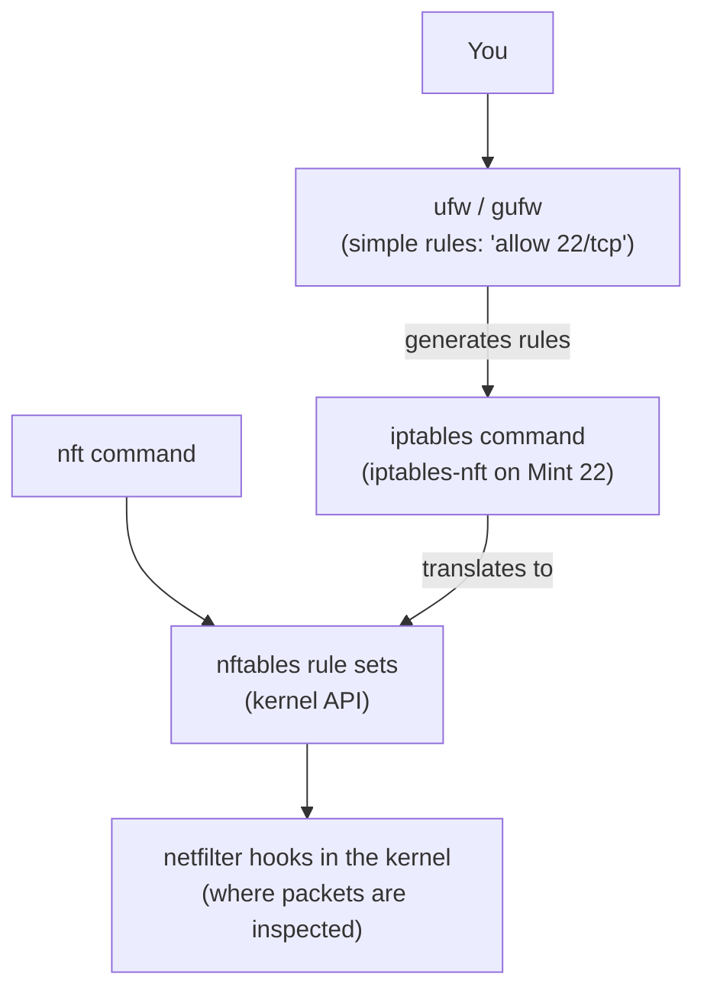
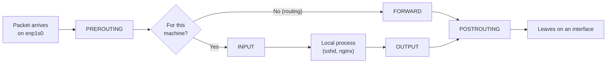
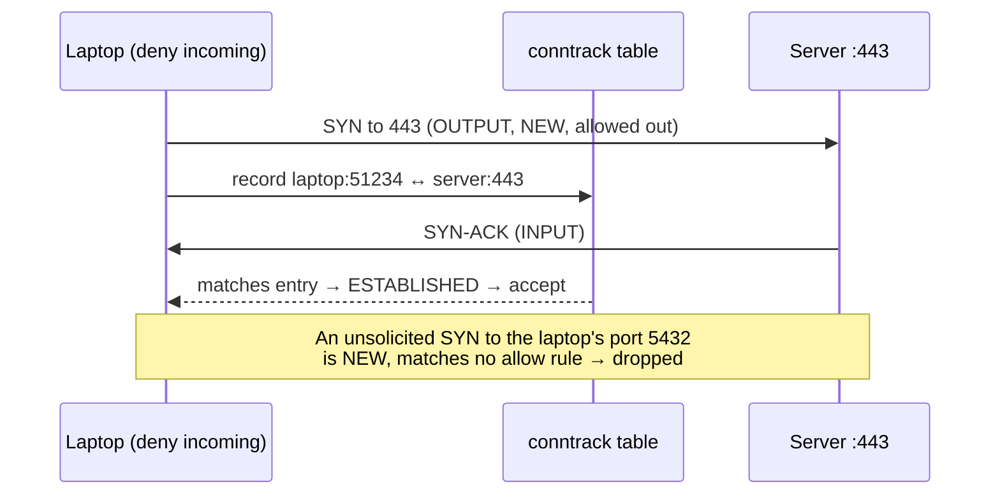
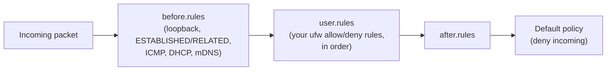

# Firewalls with ufw

> **Level 4 · Chapter 4** · ⏱️ ~40 min read · Prerequisites: [Networking basics](03-networking-basics.md)

A firewall decides which network traffic may enter or leave a machine. This chapter explains how Linux filters packets in the kernel, how the layers of tools on top of it fit together, and how to run a sensible host firewall with `ufw` without locking yourself out.

## Why it matters

Alex installs PostgreSQL on a new cloud server to test a data pipeline. To connect from a laptop, Alex changes PostgreSQL to listen on all addresses and sets a weak password "just for today". Within six hours, the server's logs show thousands of login attempts from addresses all over the world. Automated scanners sweep the entire IPv4 internet several times a day, and an open database port is found within hours.

The fix took one minute: a firewall that denies all incoming traffic except SSH, plus one rule allowing PostgreSQL only from Alex's office address. The scanners now hit a wall: their packets are dropped before PostgreSQL ever sees them.

A firewall does not replace secure configuration. It is a second line of defense that protects you from your own mistakes, such as a service listening on `0.0.0.0` that should not be, or a forgotten test server.

## Concepts

### What a firewall does

A **firewall** is a set of rules that inspects network packets and decides what happens to each one. A **host firewall** runs on the machine it protects (that is what `ufw` gives you). A **network firewall** sits between networks, like the one built into your home router or a cloud provider's "security group".

Linux does **packet filtering**: it looks at each packet's headers, not at its content. The fields a rule can match are the ones you met in the previous chapter:

- the **direction**: incoming, outgoing, or forwarded through the machine,
- the **interface** it arrived on or leaves through (`enp1s0`, `lo`),
- the **source and destination IP addresses**,
- the **protocol** (TCP, UDP, ICMP),
- the **source and destination ports**,
- the **connection state** (new, or part of an existing connection).

For each packet, the rules lead to an action. The three you need are:

| Action | What happens | What the sender sees |
|--------|--------------|----------------------|
| **ACCEPT** (allow) | The packet continues to its destination | Normal service |
| **DROP** (deny) | The packet is silently discarded | Nothing; the connection **times out** after a long wait |
| **REJECT** | The packet is discarded and an error is sent back | An immediate **"Connection refused"** or "port unreachable" |

DROP gives away less information to scanners. REJECT is friendlier on internal networks, because legitimate clients fail fast instead of hanging.

### The layers: netfilter, iptables/nftables, and ufw

The firewall on Linux is a stack of layers. Only the bottom one actually touches packets.



From the bottom up:

1. **netfilter** is the packet-filtering framework inside the Linux kernel. It provides **hooks**: points in the kernel's network path where registered rules are run against every packet. Everything else is a way to load rules into netfilter.
2. **iptables** is the classic user-space tool for writing netfilter rules (since 2001). Its syntax looks like `iptables -A INPUT -p tcp --dport 22 -j ACCEPT`. **nftables** is its modern replacement (since 2014), with one tool, `nft`, a cleaner syntax, and better performance. On Mint 22 and Ubuntu 24.04, the `iptables` command is actually **`iptables-nft`**: it accepts the old syntax but stores the rules as nftables rules. You can confirm this with `iptables --version`, which prints `iptables v1.8.10 (nf_tables)`.
3. **ufw** (Uncomplicated Firewall) is a front end that turns simple commands like `ufw allow 22/tcp` into a full, well-tested set of iptables rules. It is the standard host firewall tool on Ubuntu and Mint.
4. **gufw** is a graphical front end for ufw. On Mint, it appears in the menu as **Firewall Configuration**.

You do not need to learn raw iptables or nftables to run a secure server. You do need to know they exist, because tools like Docker, libvirt, and Kubernetes write their own rules directly at the lower layers.

### Where packets meet the rules

netfilter's hooks sit at fixed points in the kernel's packet path. A host firewall cares mostly about two of them:



- **INPUT** sees packets addressed to this machine. Almost all host firewall rules live here: "who may connect to my SSH?"
- **OUTPUT** sees packets created by this machine.
- **FORWARD** sees packets passing *through* the machine, from one interface to another. That only matters on routers, VPN gateways, and hosts running containers or VMs.

ufw names its three default policies after these: **incoming**, **outgoing**, and **routed**.

### Stateful filtering and conntrack

Imagine you allow nothing incoming. You run `curl https://example.com`. Your request goes out, and the reply comes **in**, from port 443 on a remote machine to a random high port on yours. A naive packet filter would drop the reply, because no rule allows incoming traffic to port 51234.

Linux solves this with **connection tracking**, or **conntrack**. The kernel remembers every connection that passes through: its addresses, ports, and protocol. Each packet is then labeled with a **state**:

| State | Meaning |
|-------|---------|
| `NEW` | The first packet of a connection not seen before (a TCP SYN) |
| `ESTABLISHED` | Part of a connection already seen in both directions |
| `RELATED` | A new connection linked to an existing one (for example, an ICMP error about it) |
| `INVALID` | Does not fit any known connection; usually dropped |

A **stateful firewall** uses these states. Its most important rule, near the very top, is "accept anything `ESTABLISHED` or `RELATED`". After that, all other rules only need to decide about `NEW` connections. That is why `ufw default deny incoming` does not break your web browsing: replies to your outgoing connections are `ESTABLISHED`.



Stateful filtering also explains a classic surprise: when you add a rule denying SSH, **your existing SSH session keeps working**, because its packets are `ESTABLISHED`. The rule affects only new connections. The moment you disconnect, though, you cannot get back in.

### Default policies and the allow-list approach

A **default policy** is what happens to a packet that matches no rule. ufw's defaults on Mint (from `/etc/default/ufw`) are:

| Direction | Default | Why |
|-----------|---------|-----|
| Incoming | **deny** | Nothing may connect in unless you explicitly allow it |
| Outgoing | **allow** | Programs on this machine may connect out freely |
| Routed | **deny** (shown as *disabled* until forwarding is enabled) | This machine is not a router |

"Deny everything, then allow what you need" is called the **allow-list** (or default-deny) approach. It is safe by default: a new service you install is unreachable until you open its port on purpose. The opposite, default-allow with a list of blocked ports, fails open: every new service is exposed until you remember to block it.

Restricting **outgoing** traffic is possible (`ufw default deny outgoing`) and is used on high-security servers, but it breaks DNS, updates, and NTP until you allow each one. Leave it at allow while you learn.

### How ufw orders and stores rules

ufw rules are evaluated **in order, and the first match wins**. Once a packet matches a rule, later rules are not consulted. ufw adds new rules at the end of its list unless you say `insert N` or `prepend`.

Order matters when rules overlap. Suppose you want to allow SSH from your LAN but block one compromised machine on it:

```text
[1] 22/tcp    ALLOW IN   192.168.1.0/24
[2] 22/tcp    DENY IN    192.168.1.99
```

Rule 2 never fires: `192.168.1.99` is inside `192.168.1.0/24`, so rule 1 accepts the packet first. The deny must come **before** the allow. You will fix exactly this in the exercises.

Behind the scenes, ufw builds the full rule set from several files in `/etc/ufw/`:



- **`before.rules`** (and `before6.rules` for IPv6) runs first. It accepts loopback traffic, `ESTABLISHED`/`RELATED` packets, essential ICMP (so `ping` and path MTU discovery work), and DHCP replies. You rarely touch it.
- **`user.rules`** (and `user6.rules`) holds the rules you create with `ufw allow` and friends. ufw writes these files; do not edit them by hand.
- **`after.rules`** runs last, then the default policy applies.

When `IPV6=yes` is set in `/etc/default/ufw` (the default), every rule you add is created for both IPv4 and IPv6. That is important: a firewall that only covers IPv4 leaves IPv6 wide open.

### Application profiles

Many packages drop a small **application profile** into `/etc/ufw/applications.d/` describing the ports they use. Then you can write `ufw allow OpenSSH` instead of remembering port numbers. Here is the one that the `openssh-server` package installs:

```ini
[OpenSSH]
title=Secure shell server, an rshd replacement
description=OpenSSH is a free implementation of the Secure Shell protocol.
ports=22/tcp
```

A profile can list several ports, for example `ports=80,443/tcp`. Nginx ships three profiles: `Nginx HTTP` (80), `Nginx HTTPS` (443), and `Nginx Full` (both). Note that if you move SSH to a different port, the `OpenSSH` profile still says 22; allow the real port instead.

### Rate limiting

ufw has a built-in brute-force defense: **`limit`**. A limit rule allows connections, but **denies an IP address that opens 6 or more connections within 30 seconds**. That is generous for a human, who connects once, and painful for a password-guessing bot that connects hundreds of times. It uses the kernel's `recent` module to remember connection timestamps per source address.

`limit` is a cheap first layer for SSH. Key-only authentication (next chapter) and fail2ban are the stronger layers.

### The cardinal rule: do not lock yourself out

When you manage a server over SSH, the firewall stands between you and your only way in. The order of operations matters:

1. **Allow SSH first** (`ufw allow OpenSSH` or `ufw limit 22/tcp`), and if you use a custom port, allow that port.
2. Check what you added with `ufw show added`.
3. **Then** enable the firewall.
4. **Keep your current session open** and test a *new* SSH connection from a second terminal before you log out.

Because of conntrack, your existing session survives even a bad ruleset, so it is your safety rope. If the new connection fails, fix the rules from the old session. Cloud providers also offer a web console (serial console) that works without SSH; know where it is before you need it.

!!! danger "⚠️ VM only"
    Every command in this chapter that changes firewall rules (`ufw enable`, `allow`, `deny`, `limit`, `delete`, `reset`, `default`, `logging`) must be practiced in your throwaway VM, never on your main machine and never first on a remote server. A wrong rule can cut off SSH or break networking.

### Docker and ufw

One real-world gotcha deserves a warning before you meet it the hard way. When you publish a container port with `docker run -p 8080:80`, Docker writes its own netfilter rules for the FORWARD and NAT hooks. Traffic to that port is **forwarded to the container** and never passes through ufw's INPUT rules. The result: `ufw status` says port 8080 is closed, and the container is reachable from the internet anyway.

If you run Docker on a server, publish ports only on localhost (`-p 127.0.0.1:8080:80`) and put a reverse proxy in front, or use a firewall that understands Docker's chains. Level 6 explains the plumbing.

## Commands and examples

Commands that only read state are safe, though most `ufw` subcommands need `sudo` even to read. Everything that changes rules is ⚠️ VM only.

### Looking without touching

You can inspect ufw's configuration files without root:

```bash
grep -E '^(IPV6|DEFAULT_)' /etc/default/ufw
cat /etc/ufw/ufw.conf | grep -v '^#'
ls /etc/ufw/applications.d/
```

```text
IPV6=yes
DEFAULT_INPUT_POLICY="DROP"
DEFAULT_OUTPUT_POLICY="ACCEPT"
DEFAULT_FORWARD_POLICY="DROP"
DEFAULT_APPLICATION_POLICY="SKIP"

ENABLED=no
LOGLEVEL=low
cups
openssh-server
```

`ENABLED=no` means the firewall is off. That is Mint's default: ufw is installed, but you have to turn it on. The `ufw` command itself refuses to run without root:

```bash
ufw status
```

```text
ERROR: You need to be root to run this script
```

```bash
sudo ufw status
```

```text
Status: inactive
```

Confirm which backend `iptables` uses:

```bash
iptables --version
```

```text
iptables v1.8.10 (nf_tables)
```

### Turning it on safely

!!! danger "⚠️ VM only"
    Practice in your VM. If you are connected over SSH, keep that session open until you have tested a new connection.

Set the default policies explicitly (they are already the defaults, but being explicit documents your intent):

```bash
sudo ufw default deny incoming
sudo ufw default allow outgoing
```

```text
Default incoming policy changed to 'deny'
(be sure to update your rules accordingly)
Default outgoing policy changed to 'allow'
(be sure to update your rules accordingly)
```

Allow SSH **before** enabling:

```bash
sudo ufw allow OpenSSH
```

```text
Rules updated
Rules updated (v6)
```

ufw stores rules even while it is inactive. "Rules updated (v6)" confirms a matching IPv6 rule. List what is queued:

```bash
sudo ufw show added
```

```text
Added user rules (see 'ufw status' for running firewall):
ufw allow OpenSSH
```

Now enable:

```bash
sudo ufw enable
```

```text
Command may disrupt existing ssh connections. Proceed with operation (y|n)? y
Firewall is active and enabled on system startup
```

"Enabled on system startup" means ufw sets `ENABLED=yes` in `/etc/ufw/ufw.conf`, and `ufw.service` loads the rules at every boot.

### Reading `ufw status`

```bash
sudo ufw status verbose
```

```text
Status: active
Logging: on (low)
Default: deny (incoming), allow (outgoing), disabled (routed)
New profiles: skip

To                         Action      From
--                         ------      ----
22/tcp (OpenSSH)           ALLOW IN    Anywhere
22/tcp (OpenSSH (v6))      ALLOW IN    Anywhere (v6)
```

- **`Status: active`**: rules are loaded in the kernel.
- **`Logging: on (low)`**: blocked packets are logged, rate-limited.
- **`Default:`**: the three policies. `disabled (routed)` means forwarding is not enabled, so routed policy does not apply.
- **`New profiles: skip`**: newly installed application profiles are not automatically allowed. Good.
- **The table**: **To** is the local port or profile (what is being reached), **Action** is the result and direction, **From** is the allowed source. `Anywhere` means any address.

`sudo ufw status` without `verbose` shows the same table without the header lines and with `ALLOW` instead of `ALLOW IN`.

### Allowing, denying, and limiting

The simple form takes a port, an optional protocol, or a profile name:

```bash
sudo ufw allow 80/tcp            # HTTP from anywhere
sudo ufw allow 443               # port 443, both TCP and UDP (HTTP/3 uses UDP)
sudo ufw allow 'Nginx Full'      # a profile; quote names with spaces
sudo ufw deny 23/tcp             # explicitly drop telnet
sudo ufw reject 113/tcp          # refuse ident quickly instead of timing out
sudo ufw limit 22/tcp            # SSH with brute-force rate limiting
```

!!! tip
    Always give the protocol (`/tcp` or `/udp`) unless you really mean both. `ufw allow 5432` opens both TCP and UDP 5432, which is one port more than PostgreSQL needs.

The full form reads like a sentence and lets you restrict the source, destination, interface, and protocol:

```bash
# PostgreSQL only from one office address
sudo ufw allow from 203.0.113.25 to any port 5432 proto tcp

# SSH only from the local LAN
sudo ufw allow from 192.168.1.0/24 to any port 22 proto tcp

# A web app port only on the internal interface
sudo ufw allow in on enp2s0 to any port 8080 proto tcp

# A port range (ranges require a protocol)
sudo ufw allow 60000:61000/udp

# Add a comment so future you remembers why
sudo ufw allow from 203.0.113.25 to any port 5432 proto tcp comment 'ETL worker'
```

The word order is fixed: `[allow|deny|reject|limit] [in|out] [on IFACE] [from ADDR [port P]] [to ADDR [port P]] [proto PROTO] [comment TEXT]`. `to any` means "any of this machine's addresses".

`--dry-run` shows the iptables rules ufw *would* write without applying anything. It is a good way to learn what a command really does:

```bash
sudo ufw --dry-run allow from 192.168.1.0/24 to any port 22 proto tcp | grep -- '-A ufw-user-input'
```

```text
-A ufw-user-input -p tcp --dport 22 -s 192.168.1.0/24 -j ACCEPT
```

### Numbered rules: deleting and inserting

```bash
sudo ufw status numbered
```

```text
Status: active

     To                         Action      From
     --                         ------      ----
[ 1] OpenSSH                    ALLOW IN    Anywhere
[ 2] 80/tcp                     ALLOW IN    Anywhere
[ 3] 5432/tcp                   ALLOW IN    203.0.113.25               # ETL worker
[ 4] OpenSSH (v6)               ALLOW IN    Anywhere (v6)
[ 5] 80/tcp (v6)                ALLOW IN    Anywhere (v6)
```

The numbers show evaluation order. IPv4 rules come first, then IPv6. There are two ways to delete a rule:

```bash
sudo ufw delete allow 80/tcp     # by repeating the rule; removes v4 and v6 together
sudo ufw delete 3                # by number; removes only that line
```

```text
Deleting:
 allow from 203.0.113.25 to any port 5432 proto tcp comment 'ETL worker'
Proceed with operation (y|n)? y
Rule deleted
```

!!! warning "Common mistake"
    Deleting several rules by number in a row. After `delete 2`, every rule below it moves up one place, so the old rule 4 is now rule 3. Run `ufw status numbered` again before each numbered delete, or delete from the highest number down.

To place a rule at a specific position, use `insert`:

```bash
sudo ufw insert 1 deny from 198.51.100.66 comment 'scanner'
```

That puts the deny above all the allow rules, so it wins. (For IPv6 rules, `prepend` adds to the top of the list.)

### Logging

```bash
sudo ufw logging medium
```

```text
Logging enabled
```

The levels are `off`, `low` (blocked packets that do not match a rule, rate-limited; the default), `medium` (adds allowed new connections and invalid packets), `high`, and `full`. Above `medium`, logs grow very fast. On Mint, ufw messages come from the kernel and land in the journal (`journalctl -k | grep UFW`), in `/var/log/kern.log`, and in `/var/log/ufw.log`. The last file is created by a one-line rsyslog rule in `/etc/rsyslog.d/20-ufw.conf`, so it only appears after the first packet is logged:

```bash
sudo tail -n 2 /var/log/ufw.log
```

```text
2026-10-02T11:20:15.481233+00:00 mint kernel: [UFW BLOCK] IN=enp1s0 OUT= MAC=52:54:00:12:34:56:52:54:00:ab:cd:01:08:00 SRC=192.168.1.99 DST=192.168.1.50 LEN=60 TOS=0x00 PREC=0x00 TTL=64 ID=54321 DF PROTO=TCP SPT=51544 DPT=5432 WINDOW=64240 RES=0x00 SYN URGP=0
2026-10-02T11:20:16.502117+00:00 mint kernel: [UFW BLOCK] IN=enp1s0 OUT= MAC=52:54:00:12:34:56:52:54:00:ab:cd:01:08:00 SRC=192.168.1.99 DST=192.168.1.50 LEN=60 TOS=0x00 PREC=0x00 TTL=64 ID=54322 DF PROTO=TCP SPT=51544 DPT=5432 WINDOW=64240 RES=0x00 SYN URGP=0
```

The useful fields:

| Field | Meaning |
|-------|---------|
| `[UFW BLOCK]` | What happened. Also `[UFW ALLOW]`, `[UFW LIMIT BLOCK]`, `[UFW AUDIT]` |
| `IN=enp1s0 OUT=` | Arrived on `enp1s0`; empty `OUT` means it was for this machine (INPUT) |
| `SRC=` / `DST=` | Source and destination IP |
| `PROTO=TCP` | Protocol |
| `SPT=` / `DPT=` | Source and destination port. **`DPT` is the port someone tried to reach.** |
| `SYN` | A TCP flag: this was a new connection attempt |

A quick summary of what is being probed:

```bash
sudo grep -o 'DPT=[0-9]*' /var/log/ufw.log | sort | uniq -c | sort -rn | head
```

```text
    412 DPT=23
    188 DPT=3389
     97 DPT=5432
     41 DPT=8080
```

That is the text-processing pipeline from Level 1, applied to security.

### Reset and disable

```bash
sudo ufw disable     # stop filtering; rules are kept for next enable
sudo ufw reset       # disable AND delete all rules (backs up the old files first)
```

`reset` writes backups like `/etc/ufw/user.rules.20261002_112233` before wiping.

### gufw on Mint

On Mint, open **Menu → Preferences → Firewall Configuration**. It asks for your password, then shows:

- a **Status** switch (the same as `ufw enable`/`disable`),
- **Profiles** (Home, Office, Public) with separate rule sets,
- **Incoming/Outgoing** dropdowns for the default policies,
- a **Rules** tab, where **+** opens a dialog with three tabs: *Preconfigured* (application profiles), *Simple* (port and protocol), and *Advanced* (source, destination, interface).

gufw writes exactly the same rules as the command line. Anything you add there appears in `sudo ufw status`, and vice versa. For a desktop, enabling it with the default "deny incoming" policy is a sensible, nearly invisible improvement.

### Peeking underneath with nft

To see what ufw really loaded into the kernel:

```bash
sudo nft list ruleset | less
```

The output is long, because ufw creates dozens of chains. Trimmed to the interesting parts, it looks like this:

```text
table ip filter {
	chain INPUT {
		type filter hook input priority filter; policy drop;
		counter packets 18240 bytes 3122945 jump ufw-before-logging-input
		counter packets 18240 bytes 3122945 jump ufw-before-input
		counter packets 214 bytes 12510 jump ufw-after-input
		...
	}
	chain ufw-before-input {
		iifname "lo" counter packets 912 bytes 70144 accept
		ct state related,established counter packets 16805 bytes 2988731 accept
		ct state invalid counter packets 3 bytes 120 jump ufw-logging-deny
		...
		counter packets 220 bytes 13054 jump ufw-user-input
	}
	chain ufw-user-input {
		meta l4proto tcp tcp dport 22 counter packets 6 bytes 360 accept
		meta l4proto tcp tcp dport 80 counter packets 14 bytes 840 accept
	}
	...
}
table ip6 filter {
	...
}
```

Now you can see every concept from this chapter in the kernel's own terms:

- **`hook input ... policy drop`**: the INPUT hook with the default-deny policy.
- **`iifname "lo" ... accept`**: loopback is always allowed, from `before.rules`.
- **`ct state related,established ... accept`**: the stateful rule. Look at the packet counters: the vast majority of packets are accepted right here.
- **`jump ufw-user-input`**: then your own rules, in order.
- **`table ip6 filter`**: a parallel set for IPv6.

`sudo iptables -L ufw-user-input -n -v` shows the same chain in classic iptables format. Do not edit these rules with `nft` or `iptables` directly while ufw manages them; ufw will overwrite your changes on the next reload.

You can also see how many connections conntrack is tracking right now:

```bash
cat /proc/sys/net/netfilter/nf_conntrack_count
```

```text
142
```

(The file exists once the conntrack module is loaded, which ufw does.) The `conntrack` package provides `sudo conntrack -L` to list the entries themselves.

## Exercises

### Exercise 1: Read the configuration (easy)

On your main machine, without changing anything, find out: whether ufw is enabled at boot, what the default incoming policy will be, whether IPv6 rules are created, and which application profiles are installed and what ports each one opens.

??? success "Solution"

    ```bash
    grep ENABLED /etc/ufw/ufw.conf
    grep -E '^(IPV6|DEFAULT_INPUT_POLICY)' /etc/default/ufw
    grep -H '^ports' /etc/ufw/applications.d/*
    ```

    ```text
    ENABLED=no
    IPV6=yes
    DEFAULT_INPUT_POLICY="DROP"
    /etc/ufw/applications.d/cups:ports=631
    /etc/ufw/applications.d/openssh-server:ports=22/tcp
    ```

    `ENABLED=no` means the firewall is off at boot (Mint's default). With `sudo`, `ufw app list` and `ufw app info OpenSSH` show the same profile information.

### Exercise 2: A basic server firewall (easy)

!!! danger "⚠️ VM only"
    Do this in your VM, with `openssh-server` installed. Your host machine plays the role of the outside world.

In your VM: set deny incoming / allow outgoing, allow SSH with rate limiting, allow HTTP on port 8080/tcp, and enable the firewall. Start `python3 -m http.server 8080` and a second listener on port 9090 (`python3 -m http.server 9090`). From your **host**, prove that 22 and 8080 are reachable and 9090 is not.

??? success "Solution"

    In the VM:

    ```bash
    sudo ufw default deny incoming
    sudo ufw default allow outgoing
    sudo ufw limit 22/tcp
    sudo ufw allow 8080/tcp
    sudo ufw enable
    sudo ufw status verbose
    python3 -m http.server 8080 &
    python3 -m http.server 9090 &
    ```

    From the host (use your VM's address from `ip -br addr` in the VM):

    ```bash
    nc -zv -w 3 192.168.122.50 22
    nc -zv -w 3 192.168.122.50 8080
    nc -zv -w 3 192.168.122.50 9090
    ```

    ```text
    Connection to 192.168.122.50 22 port [tcp/ssh] succeeded!
    Connection to 192.168.122.50 8080 port [tcp/http-alt] succeeded!
    nc: connect to 192.168.122.50 port 9090 (tcp) timed out: Operation now in progress
    ```

    9090 **times out** rather than being refused, because ufw's default deny is a DROP. Inside the VM, `curl localhost:9090` still works: loopback traffic is always accepted.

### Exercise 3: Watch the rate limit trigger (medium)

!!! danger "⚠️ VM only"
    Do this in your VM.

With the `limit 22/tcp` rule from Exercise 2 in place, open 8 TCP connections to the VM's SSH port from your host in quick succession, and observe what happens. Find the evidence in the VM's logs.

??? success "Solution"

    From the host:

    ```bash
    for i in $(seq 1 8); do nc -zv -w 2 192.168.122.50 22; done
    ```

    ```text
    Connection to 192.168.122.50 22 port [tcp/ssh] succeeded!
    Connection to 192.168.122.50 22 port [tcp/ssh] succeeded!
    Connection to 192.168.122.50 22 port [tcp/ssh] succeeded!
    Connection to 192.168.122.50 22 port [tcp/ssh] succeeded!
    Connection to 192.168.122.50 22 port [tcp/ssh] succeeded!
    nc: connect to 192.168.122.50 port 22 (tcp) timed out: Operation now in progress
    nc: connect to 192.168.122.50 port 22 (tcp) timed out: Operation now in progress
    nc: connect to 192.168.122.50 port 22 (tcp) timed out: Operation now in progress
    ```

    The sixth new connection within 30 seconds is blocked. In the VM:

    ```bash
    sudo grep 'UFW LIMIT BLOCK' /var/log/ufw.log | tail -n 3
    ```

    Wait 30 seconds and connections work again. The exact count may differ by one, depending on timing.

### Exercise 4: Fix the rule order (medium)

!!! danger "⚠️ VM only"
    Do this in your VM.

Create the broken pair of rules from the Concepts section: allow SSH from your whole host-only or NAT network (for example `192.168.122.0/24`), then deny SSH from your host's address in that network. Verify that the deny does nothing. Then fix the order so the deny wins, using `insert`, and verify again.

??? success "Solution"

    ```bash
    sudo ufw delete limit 22/tcp
    sudo ufw allow from 192.168.122.0/24 to any port 22 proto tcp
    sudo ufw deny from 192.168.122.1 to any port 22 proto tcp
    sudo ufw status numbered
    ```

    ```text
    [ 1] 8080/tcp                   ALLOW IN    Anywhere
    [ 2] 22/tcp                     ALLOW IN    192.168.122.0/24
    [ 3] 22/tcp                     DENY IN     192.168.122.1
    ...
    ```

    From the host, `nc -zv 192.168.122.50 22` still succeeds: rule 2 matches first. Fix:

    ```bash
    sudo ufw delete 3
    sudo ufw insert 2 deny from 192.168.122.1 to any port 22 proto tcp
    sudo ufw status numbered
    ```

    Now the deny is rule 2, above the allow, and the host's connection times out. Remove the deny afterwards (and restore SSH access), or you will be locked out of your VM over SSH.

### Exercise 5: Audit a server's exposure (hard)

!!! danger "⚠️ VM only"
    Do this in your VM.

Write a short report for your VM that answers: which ports are listening, on which addresses; which of those the firewall allows from outside; and which are listening on all addresses but blocked by the firewall (defense in depth working). Use `ss`, `ufw status`, and `nft list ruleset`, and verify each conclusion from the host with `nc`.

??? success "Solution"

    ```bash
    sudo ss -tulpn
    sudo ufw status verbose
    sudo nft list chain ip filter ufw-user-input
    ```

    Build a table from the output. A typical result:

    | Port | Bound to | ufw | Reachable from host? | Notes |
    |------|----------|-----|----------------------|-------|
    | 22/tcp | `0.0.0.0`, `[::]` | LIMIT | Yes | Intended |
    | 8080/tcp | `0.0.0.0` | ALLOW | Yes | Intended |
    | 9090/tcp | `0.0.0.0` | none (default deny) | No (timeout) | Exposed by the app, saved by the firewall: fix the bind address too |
    | 631/tcp | `127.0.0.1` | none | No | Local only; firewall irrelevant |
    | 53/udp | `127.0.0.53%lo` | none | No | systemd-resolved stub, local only |

    The lesson: a port is reachable only if **both** the socket's bind address allows it **and** the firewall allows it. Fix problems at both layers: bind services to `127.0.0.1` when they do not need outside access, and keep the firewall as the backstop.

## Check yourself

1. What is the relationship between netfilter, nftables, iptables, and ufw on Mint 22?

    ??? note "Answer"

        netfilter is the packet filtering framework in the kernel. nftables is the modern kernel interface and tool (`nft`) for loading rules into it. The `iptables` command on Mint is `iptables-nft`, which accepts classic iptables syntax but stores rules as nftables. ufw is a front end that generates iptables rules from simple commands.

2. What is the practical difference between `ufw deny` and `ufw reject`?

    ??? note "Answer"

        `deny` drops packets silently, so the client waits and eventually times out. `reject` sends back an error, so the client sees "connection refused" immediately. Deny reveals less to scanners; reject is friendlier for legitimate clients on internal networks.

3. Why does `ufw default deny incoming` not break web browsing on your machine?

    ??? note "Answer"

        The firewall is stateful. Replies to connections your machine started are tracked by conntrack and labeled `ESTABLISHED`, and `before.rules` accepts `ESTABLISHED` and `RELATED` packets before any user rule or default policy applies.

4. You add `ufw allow from 10.0.0.0/8 to any port 22` and then `ufw deny from 10.0.5.5`. Why can 10.0.5.5 still connect, and how do you fix it?

    ??? note "Answer"

        ufw evaluates rules in order and stops at the first match. `10.0.5.5` matches the earlier allow for `10.0.0.0/8`. Delete the deny and re-add it with `ufw insert 1 deny from 10.0.5.5` so it comes first.

5. What exactly does `ufw limit 22/tcp` do?

    ??? note "Answer"

        It allows connections to port 22 but denies a source address that opens 6 or more new connections within 30 seconds. It slows down brute-force attacks without affecting normal logins.

6. You are about to enable ufw on a remote server for the first time. List the steps that keep you from being locked out.

    ??? note "Answer"

        Allow SSH first (`ufw allow OpenSSH` or `ufw limit 22/tcp`, or your custom port). Check with `ufw show added`. Enable with `ufw enable`. Keep the current session open and test a new SSH connection from another terminal before logging out. Know how to reach the provider's web console in case it fails.

7. You run a container with `docker run -p 5432:5432 postgres`, and `ufw status` shows no rule for 5432. Is the database reachable from the internet?

    ??? note "Answer"

        Very likely yes. Docker writes its own netfilter rules for published ports in the FORWARD and NAT hooks, which bypass ufw's INPUT rules. Publish on localhost only (`-p 127.0.0.1:5432:5432`) or use firewall rules that cover Docker's chains.

8. In a `[UFW BLOCK]` log line, which field tells you which service someone tried to reach?

    ??? note "Answer"

        `DPT=`, the destination port. `SRC=` tells you who tried, and `IN=` which interface the packet arrived on.

## Key takeaways

- A firewall matches packet headers (direction, interface, addresses, protocol, ports, state) against rules, and accepts, drops, or rejects each packet.
- The stack on Mint is: ufw → iptables-nft → nftables → netfilter in the kernel. Only netfilter touches packets.
- Firewalls are stateful: conntrack lets replies through as `ESTABLISHED`, so rules only need to decide about new connections.
- Use default deny incoming, allow outgoing, then allow only what you need. Rules are evaluated top to bottom, first match wins; use `insert` to put denies above allows.
- Always allow SSH before `ufw enable`, keep your session open, and test a new connection before logging out.
- A port is exposed only if the service binds to an external address **and** the firewall allows it. Fix both. Watch out for Docker bypassing ufw.

## Next

The firewall now lets SSH in and keeps almost everything else out. Next, make SSH itself strong: keys instead of passwords, a hardened server config, and safe ways to copy files and tunnel traffic. Continue with [SSH](05-ssh.md).
