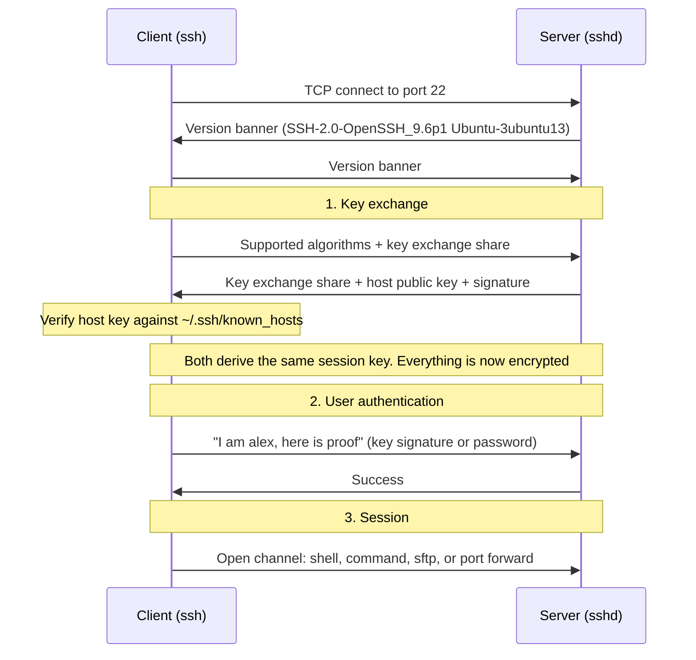
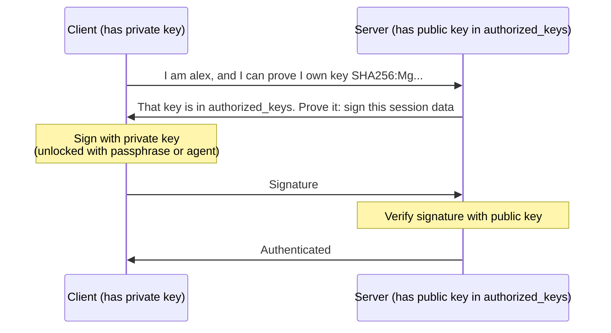
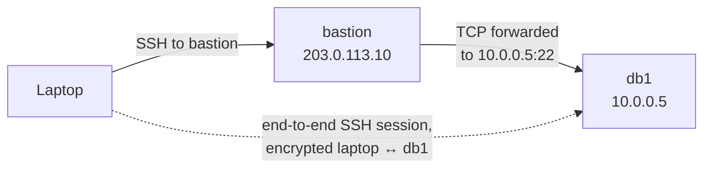
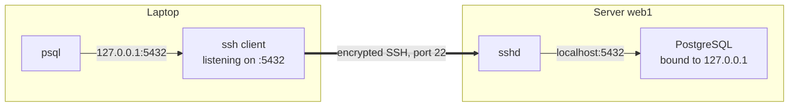
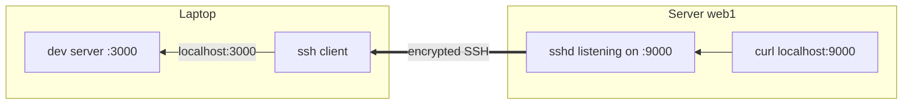
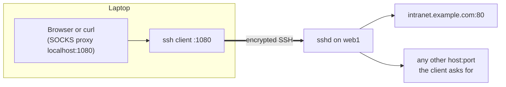

# SSH

> **Level 4 · Chapter 5** · ⏱️ ~50 min read · Prerequisites: [Networking basics](03-networking-basics.md), [Firewalls with ufw](04-firewall-ufw.md), [Permissions](../01-command-line/03-permissions.md)

SSH is how you log in to, manage, and move files between Linux machines. This chapter explains how SSH keeps a connection secure, then covers keys, the agent, client config files, server hardening, file copying with `scp`, `sftp`, and `rsync`, and tunnels.

## Why it matters

Alex rents a cloud server and logs in with the password the provider emailed. A week later, `/var/log/auth.log` holds 40,000 lines like `Failed password for root from 203.0.113.77`. Bots are guessing passwords around the clock. Alex's password is decent, so nothing has happened yet. But "yet" is not a security strategy.

Alex spends fifteen minutes on four changes: an ed25519 key with a passphrase, `ssh-copy-id` to install it, `PasswordAuthentication no` on the server, and a `~/.ssh/config` entry so that `ssh web1` replaces `ssh -p 2222 alex@203.0.113.10`. The password-guessing bots now fail instantly, because the server no longer even asks for a password. Logging in got *easier* at the same time.

Later the same week, Alex needs to look at a database that only listens on the server's localhost. One `ssh -L` command makes it appear on the laptop's port 5432, encrypted end to end, without opening a single firewall port.

## Concepts

### What SSH is

**SSH** (Secure Shell) is a protocol for running commands on a remote machine, and for moving data to and from it, over an encrypted, authenticated connection. It replaced `telnet` and `rsh`, which sent everything, passwords included, as plain text.

There are two programs:

- the **client**, `ssh`, which you run on your machine, and
- the **server**, `sshd` (SSH daemon), which runs on the remote machine and listens on TCP **port 22** by default.

On Mint and Ubuntu, they come from two packages: `openssh-client` (always installed) and `openssh-server` (install it on machines you want to log in **to**). The server's systemd unit is called `ssh.service`, with `sshd.service` as an alias.

### How an SSH connection is set up

Every SSH connection goes through three stages before you see a prompt. Understanding them explains every SSH warning and error message you will meet.



**Stage 1: key exchange.** The client and server agree on algorithms, then run a **key exchange** (such as Curve25519 Diffie-Hellman). Its magic is that both sides compute the same secret **session key** without ever sending it over the network. An eavesdropper sees the exchange and still cannot compute the key. From here on, everything is encrypted with that session key.

**Stage 2: server authentication.** Encryption alone is not enough: you could be talking, encrypted, to an attacker who intercepted your connection. This is called a **man-in-the-middle** (MITM) attack. To prevent it, the server proves its identity with its **host key**, a key pair generated when `openssh-server` was installed and stored in `/etc/ssh/ssh_host_*_key`. The server signs the key exchange with its private host key; the client checks the signature with the public host key and compares that key with the one it remembers for this server.

**Stage 3: user authentication.** Only now, inside the encrypted channel, do *you* prove who you are, with a key or a password.

**Stage 4: the session.** The connection carries one or more **channels**: an interactive shell, a single command, a file transfer, or a forwarded port. Many channels can share one connection.

### Host keys, known_hosts, and TOFU

The client remembers servers' public host keys in **`~/.ssh/known_hosts`**. The first time you connect to a server, there is nothing to compare with, so ssh asks you:

```text
The authenticity of host '192.168.122.50 (192.168.122.50)' can't be established.
ED25519 key fingerprint is SHA256:3vQm7Ck1Xp4cKdYb0W9mJzq2fT8hR5nL6sE1aV0uGiQ.
This key is not known by any other names.
Are you sure you want to continue connecting (yes/no/[fingerprint])?
```

A **fingerprint** is a short hash of the public key, easy for humans to compare. If you answer `yes`, ssh saves the key and trusts it from now on. This model is called **TOFU**: **trust on first use**. It is safe as long as the very first connection is not intercepted.

To do better than TOFU, check the fingerprint through another channel. On the server (from its console, or as the cloud provider shows it), run:

```bash
ssh-keygen -lf /etc/ssh/ssh_host_ed25519_key.pub
```

```text
256 SHA256:3vQm7Ck1Xp4cKdYb0W9mJzq2fT8hR5nL6sE1aV0uGiQ root@mint (ED25519)
```

If it matches what the client showed, the connection is genuine. You can even paste the fingerprint at the prompt instead of typing `yes`, and ssh compares them for you.

On later connections, ssh silently checks that the server presents the same key. If it does not, you get the most alarming message in SSH:

```text
@@@@@@@@@@@@@@@@@@@@@@@@@@@@@@@@@@@@@@@@@@@@@@@@@@@@@@@@@@@
@    WARNING: REMOTE HOST IDENTIFICATION HAS CHANGED!     @
@@@@@@@@@@@@@@@@@@@@@@@@@@@@@@@@@@@@@@@@@@@@@@@@@@@@@@@@@@@
IT IS POSSIBLE THAT SOMEONE IS DOING SOMETHING NASTY!
Someone could be eavesdropping on you right now (man-in-the-middle attack)!
It is also possible that a host key has just been changed.
...
Offending ED25519 key in /home/alex/.ssh/known_hosts:3
  remove with:
  ssh-keygen -f '/home/alex/.ssh/known_hosts' -R '192.168.122.50'
Host key verification failed.
```

ssh refuses to connect. Usually the reason is innocent: you reinstalled the server, or a cloud provider reused an IP address for a new machine. But it is exactly what a real attack looks like, so **find out why before removing the old key**. Once you know the change is legitimate, run the `ssh-keygen -R` command it suggests and connect again.

On Mint, `/etc/ssh/ssh_config` sets `HashKnownHosts yes`, so host names in `known_hosts` are stored as hashes. That hides the list of servers you visit if the file leaks. It also means you cannot `grep` it for a name; use `ssh-keygen -F hostname` instead.

### Password vs key authentication

**Password authentication** sends your password (inside the encrypted channel) to the server, which checks it. It is simple, but:

- the password can be guessed, and bots try millions;
- if you ever log in to a compromised or fake server, it receives your password;
- you have to type it every time, which pushes people towards short passwords.

**Public key authentication** uses a **key pair**: a **private key** that never leaves your machine, and a **public key** that you copy to every server you want to access. The server stores authorized public keys in `~/.ssh/authorized_keys` in your account there.



The server never sees anything secret. It only checks a signature that could only have been made with the private key. A fake server learns nothing it could reuse. And there is nothing to guess: an ed25519 key is far beyond brute force.

The private key should be protected by a **passphrase**, which encrypts the key file on disk. If your laptop is stolen, the thief gets an encrypted blob, not access to your servers. The **ssh-agent** (below) means you type the passphrase once per login session instead of on every connection.

### Key types

`ssh-keygen` can make several kinds of keys:

| Type | Recommendation |
|------|----------------|
| **ed25519** | Use this. Small, fast, modern, secure, supported by every OpenSSH from the last decade. |
| rsa | Only for very old servers. If you must, use at least 3072 bits (the current default). |
| ecdsa | Fine, but ed25519 is preferred. |
| ed25519-sk / ecdsa-sk | Keys stored on a hardware security key (YubiKey and similar). Excellent if you have one. |
| dsa | Obsolete and disabled. Never. |

### The ssh-agent

An **ssh-agent** is a small background program that holds your decrypted private keys in memory. You unlock a key once with `ssh-add`, and every later `ssh`, `scp`, `rsync`, or `git` call asks the agent to sign on its behalf. The key itself never leaves the agent.

On Mint's desktop, an agent is already running as part of your login session (provided by GNOME Keyring). The environment variable `SSH_AUTH_SOCK` points at its socket, and the first time you use a key, a dialog asks for the passphrase and can remember it for the session.

**Agent forwarding** (`ssh -A`) lets a server use your local agent for onward connections. It is convenient but risky: anyone with root on that server can use your agent while you are connected. Prefer `ProxyJump` (below), which needs no forwarding.

### The client config file

Typing `ssh -p 2222 -i ~/.ssh/work_key alex@203.0.113.10` every time is tedious and error-prone. The client reads defaults from **`~/.ssh/config`** (your settings) and `/etc/ssh/ssh_config` (system-wide). A config file is a list of `Host` blocks:

```text
Host web1
    HostName 203.0.113.10
    User alex
    Port 2222
    IdentityFile ~/.ssh/id_ed25519
```

Now `ssh web1` does the right thing, and so do `scp file web1:`, `rsync -a dir/ web1:dir/`, and `git clone web1:repo.git`.

| Keyword | Meaning |
|---------|---------|
| `Host` | One or more **aliases** (patterns allowed, like `*.example.com` or `*`) that start a block |
| `HostName` | The real name or IP address to connect to |
| `User` | The remote username |
| `Port` | The remote port |
| `IdentityFile` | Which private key to offer |
| `IdentitiesOnly yes` | Offer only the listed `IdentityFile`, not every key in the agent |
| `ProxyJump` | Connect through another SSH host first (a **jump host** or **bastion**) |
| `ForwardAgent` | Agent forwarding (leave it off unless you need it) |
| `ServerAliveInterval 60` | Send a keepalive every 60 s so idle connections are not cut by NAT routers |
| `AddKeysToAgent yes` | Add a key to the agent automatically the first time you use it |
| `LocalForward` | A permanent `-L` tunnel for this host |

Two rules govern how the file is read:

1. **For each setting, the first value found wins.** ssh reads the file top to bottom, and once a keyword has a value, later blocks cannot change it.
2. So put **specific hosts first** and general defaults (`Host *`) **at the end**.

### Jump hosts with ProxyJump

Production networks often expose only one hardened machine, the **bastion**, to the internet. Internal servers are reachable only from the bastion. `ProxyJump` makes this transparent:

```text
Host bastion
    HostName 203.0.113.10
    User alex

Host db1
    HostName 10.0.0.5
    User alex
    ProxyJump bastion
```



`ssh db1` first connects to the bastion, asks it to open a plain TCP connection to `10.0.0.5:22`, and then runs a **second, independent SSH session** to db1 through that pipe. Your keys stay on your laptop, and the bastion only relays encrypted bytes. On the command line, the same thing is `ssh -J alex@203.0.113.10 alex@10.0.0.5`.

### Permissions SSH insists on

SSH refuses to use files that other users could have tampered with. On the server, `sshd` (with its default `StrictModes yes`) ignores your `authorized_keys` if your home directory, `~/.ssh`, or the file itself is writable by anyone else. On the client, `ssh` refuses a private key that others can read.

| Path | Required permissions | Why |
|------|---------------------|-----|
| `~` (home) | Not writable by group or others (e.g., `755` or `750`) | Otherwise someone could replace `.ssh` |
| `~/.ssh/` | `700` (`drwx------`) | Only you may list or change it |
| `~/.ssh/id_ed25519` (private key) | `600` (`-rw-------`) | Only you may read it |
| `~/.ssh/id_ed25519.pub` | `644` is fine | It is public |
| `~/.ssh/authorized_keys` | `600` (`644` also accepted) | Must not be writable by others |
| `~/.ssh/config` | `600` (must not be writable by others) | |

The symptom of a wrong permission is that key authentication silently fails and the server falls back to asking for a password (or denies you). On the client side you get a clear warning:

```text
@@@@@@@@@@@@@@@@@@@@@@@@@@@@@@@@@@@@@@@@@@@@@@@@@@@@@@@@@@@
@         WARNING: UNPROTECTED PRIVATE KEY FILE!          @
@@@@@@@@@@@@@@@@@@@@@@@@@@@@@@@@@@@@@@@@@@@@@@@@@@@@@@@@@@@
Permissions 0644 for '/home/alex/.ssh/id_ed25519' are too open.
It is required that your private key files are NOT accessible by others.
This private key will be ignored.
```

On the server, the reason appears in the log: `journalctl -u ssh` shows `Authentication refused: bad ownership or modes for directory /home/alex/.ssh`.

### The server config: sshd_config

The server reads **`/etc/ssh/sshd_config`**. On Ubuntu 24.04 and Mint 22, its first active line is:

```text
Include /etc/ssh/sshd_config.d/*.conf
```

That pulls in every `.conf` file from the drop-in directory, in alphabetical order, **before** the rest of the main file. Combined with sshd's rule that **the first value found for a keyword wins**, this has an important consequence:

- Settings in drop-in files override the main file.
- Among drop-ins, the **alphabetically first** file wins.

Cloud images often ship `/etc/ssh/sshd_config.d/50-cloud-init.conf` containing `PasswordAuthentication yes`. If you put your hardening in `60-hardening.conf`, cloud-init's file is read first and **your `no` is ignored**. Name your file with a low number, such as `10-hardening.conf`, and always verify the effective configuration with `sshd -T` (shown below).

The hardening settings that matter most:

| Setting | Recommended | Effect |
|---------|-------------|--------|
| `PasswordAuthentication` | `no` | Only keys are accepted. Bots cannot guess anything. |
| `KbdInteractiveAuthentication` | `no` | Disables the other password-prompt method (already `no` on Ubuntu) |
| `PermitRootLogin` | `no` | Nobody logs in as root directly; log in as yourself and use `sudo`. (The default, `prohibit-password`, allows root with a key.) |
| `PubkeyAuthentication` | `yes` | Key login (the default) |
| `AllowUsers` | `alex` | Only the listed users may log in at all; everyone else is refused even with a valid key |
| `MaxAuthTries` | `3` | Fewer attempts per connection (default 6) |
| `X11Forwarding` | `no` | Servers do not need to forward graphical apps |

`AllowUsers` takes a space-separated list and patterns, such as `AllowUsers alex deploy@192.168.1.*`. `AllowGroups` does the same for groups, which scales better: `AllowGroups ssh-users`.

### Socket activation on Ubuntu 24.04

Mint 22 and Ubuntu 24.04 start `sshd` through **socket activation**: systemd listens on port 22 via `ssh.socket` and only launches `ssh.service` when the first connection arrives. This saves memory on idle machines. Two practical consequences:

- After changing **authentication settings**, `sudo systemctl reload ssh` (or `restart ssh`) applies them, as usual.
- The **listening port** is now owned by `ssh.socket`. A generator (`sshd-socket-generator`) reads `Port` and `ListenAddress` from your sshd config at `daemon-reload`. After changing the port, you must run `sudo systemctl daemon-reload` and then `sudo systemctl restart ssh.socket`. Just restarting `ssh.service` keeps the old port.

### Copying files: scp, sftp, and rsync

Three tools copy files over SSH. All use the same authentication and config file, so `web1:` works with each.

| Tool | Model | Strengths | Weaknesses |
|------|-------|-----------|------------|
| `scp` | `cp` over SSH | Simple, everywhere | Copies everything every time; no resume |
| `sftp` | Interactive FTP-like session | Browsing, many small operations, scripts with batch files | Not for syncing |
| `rsync` | Synchronizer | Transfers only differences, resumes, deletes, dry runs, excludes | More options to learn; must be installed on both ends |

Since OpenSSH 9.0, `scp` actually uses the SFTP protocol underneath; `scp -O` forces the old protocol for ancient servers.

**rsync** deserves the most attention, because it is also the backbone of the backups in the next chapter. It compares source and destination (by size and modification time, by default) and sends only what changed. Within a changed file, its **delta-transfer algorithm** sends only the changed blocks. Re-syncing a 10 GB folder where one file changed takes seconds.

The flags you will use constantly:

| Flag | Meaning |
|------|---------|
| `-a` | **Archive** mode: recursive, and preserve permissions, timestamps, symlinks, owner, group, and devices. Equivalent to `-rlptgoD`. |
| `-v` | Verbose: list each file transferred |
| `-z` | Compress data in transit. Helps over slow links for text; wastes CPU on fast LANs or already compressed files. |
| `-h` | Human-readable sizes |
| `-P` | Show progress **and** keep partially transferred files so a retry can resume |
| `-n` / `--dry-run` | Show what would happen, change nothing |
| `--delete` | Delete files in the destination that no longer exist in the source, making an exact mirror |
| `--exclude=PATTERN` | Skip matching files (`--exclude='*.tmp' --exclude=.git/`) |
| `-e 'ssh -p 2222'` | Choose the remote shell command and its options (usually unnecessary with `~/.ssh/config`) |

### rsync's trailing slash, in depth

One character changes what rsync does: a trailing slash on the **source**.

- **`rsync -a src dst/`** (no slash on `src`) means "copy the directory **src itself** into dst". You get `dst/src/...`.
- **`rsync -a src/ dst/`** (slash on `src`) means "copy the **contents** of src into dst". You get `dst/...`.

Here is real output from a scratch directory, with `src/` containing `a.txt` and `sub/b.txt`:

```bash
rsync -av src dst1/
```

```text
sending incremental file list
created directory dst1
src/
src/a.txt
src/sub/
src/sub/b.txt

sent 250 bytes  received 97 bytes  694.00 bytes/sec
total size is 4  speedup is 0.01
```

```bash
rsync -av src/ dst2/
```

```text
sending incremental file list
created directory dst2
./
a.txt
sub/
sub/b.txt

sent 240 bytes  received 96 bytes  672.00 bytes/sec
total size is 4  speedup is 0.01
```

```text
dst1/src/a.txt        ← the directory itself was copied
dst1/src/sub/b.txt
dst2/a.txt            ← only the contents were copied
dst2/sub/b.txt
```

Read the file list in the output: in the first case every path starts with `src/`. That is your early warning that you are about to get an extra level of nesting.

A trailing slash on the **destination** makes no difference to the result; it is just a good habit, because it makes the intent ("into this directory") clear.

The slash matters most with `--delete`. Combine "contents of" with `--delete` and the destination becomes an exact mirror of the source. Get the slash wrong and point at the wrong level, and `--delete` happily removes everything that "should not be there". Always do a `--dry-run` first:

```bash
rsync -av --delete --dry-run src/ dst2/
```

```text
sending incremental file list
deleting old.txt

sent 132 bytes  received 31 bytes  326.00 bytes/sec
total size is 4  speedup is 0.02 (DRY RUN)
```

`(DRY RUN)` at the end confirms nothing was changed. `deleting old.txt` tells you exactly what `--delete` would remove.

!!! warning "Common mistake"
    `rsync -a --delete ~/photos/ /media/alex/backup/` when you meant `/media/alex/backup/photos/`. With a slash on the source and `--delete`, rsync makes the **whole backup drive** look like your photos folder, deleting everything else on it. Always run with `-n` first and read the `deleting` lines.

### Port forwarding (tunnels)

SSH can carry arbitrary TCP connections through its encrypted channel. This is **port forwarding**, or **tunneling**. There are three kinds.

**Local forwarding (`-L`)** opens a port on **your** machine; connections to it travel through SSH and come out on the server side, which connects to a target you name. Use it to reach a service that only the server can reach, like a database bound to `127.0.0.1`.

```bash
ssh -L 5432:localhost:5432 web1
```

Read `-L 5432:localhost:5432` as "**local port** 5432 → (via web1) → **localhost:5432** as seen *from web1*".



The target does not have to be the server itself: `-L 8080:10.0.0.7:80 web1` reaches an internal web server at `10.0.0.7` through web1.

**Remote forwarding (`-R`)** is the reverse: it opens a port **on the server**, and connections to it travel back through SSH to a target reachable from **your** machine. Use it to show a teammate a development server running on your laptop, or to reach a machine behind NAT.

```bash
ssh -R 9000:localhost:3000 web1
```

"**Remote port** 9000 on web1 → (back through the tunnel) → **localhost:3000** as seen from the laptop."



By default the remote port binds only to the server's loopback. Exposing it on the server's public interface requires `GatewayPorts` in the server config, which you should rarely enable.

**Dynamic forwarding (`-D`)** turns the ssh client into a **SOCKS proxy**. Applications configured to use it (a browser, `curl --socks5-hostname`) send each connection through the tunnel, and the server makes the connection on their behalf, to whatever destination they ask for. It is like a quick VPN: you browse as if you were on the server's network.

```bash
ssh -D 1080 web1
curl --socks5-hostname localhost:1080 http://intranet.example.com/
```



Two flags make tunnels convenient: **`-N`** means "do not run a remote command, just forward", and **`-f`** sends ssh to the background after authentication. `ssh -fN -L 5432:localhost:5432 web1` sets up the tunnel and returns your prompt.

### fail2ban

Even with passwords disabled, bots keep knocking, which fills logs. **fail2ban** watches log files (or the journal) for repeated failures and temporarily bans the offending IP address in the firewall. It is installed with `sudo apt install fail2ban`, and its SSH protection is enabled by default on Ubuntu (in `/etc/fail2ban/jail.d/defaults-debian.conf`). Local changes go in `/etc/fail2ban/jail.local`, and `sudo fail2ban-client status sshd` shows the currently banned addresses. It is a useful extra layer, not a substitute for key-only authentication.

## Commands and examples

### Generate a key pair

```bash
ssh-keygen -t ed25519 -C "alex@mint"
```

```text
Generating public/private ed25519 key pair.
Enter file in which to save the key (/home/alex/.ssh/id_ed25519):
Enter passphrase (empty for no passphrase):
Enter same passphrase again:
Your identification has been saved in /home/alex/.ssh/id_ed25519
Your public key has been saved in /home/alex/.ssh/id_ed25519.pub
The key fingerprint is:
SHA256:MgS+3a64Uk1wgQbZkz8RzDY3AnqJo78kBMM0Sp/YALY alex@mint
The key's randomart image is:
+--[ED25519 256]--+
|o*.+o*oo         |
|* O+OoO o        |
|+E+=+*.= .       |
|.o o ++.         |
|..  .o+.S        |
|..  . .+         |
|. o.    .        |
| o.. . .         |
|  ..o..          |
+----[SHA256]-----+
```

- **`-t ed25519`**: the key type.
- **`-C "alex@mint"`**: a **comment** stored in the public key, to help you recognize it later in `authorized_keys`. It has no security function.
- **The file prompt**: press ++enter++ for the default. Use `-f ~/.ssh/work_ed25519` to create a separate key for a different purpose.
- **The passphrase**: use one. A few random words are both strong and typeable.
- **The randomart** is a visual version of the fingerprint. Few people use it.

```bash
ls -l ~/.ssh/
cat ~/.ssh/id_ed25519.pub
```

```text
-rw------- 1 alex alex 464 Oct  2 12:10 id_ed25519
-rw-r--r-- 1 alex alex  91 Oct  2 12:10 id_ed25519.pub
ssh-ed25519 AAAAC3NzaC1lZDI1NTE5AAAAINyR...(trimmed)... alex@mint
```

`ssh-keygen` already set the correct permissions: `600` on the private key. The public key is a single line: type, base64-encoded key, comment. That line is what goes into a server's `authorized_keys`.

Change or add a passphrase later without changing the key:

```bash
ssh-keygen -p -f ~/.ssh/id_ed25519
```

Print the fingerprint of any key file:

```bash
ssh-keygen -lf ~/.ssh/id_ed25519.pub
```

```text
256 SHA256:MgS+3a64Uk1wgQbZkz8RzDY3AnqJo78kBMM0Sp/YALY alex@mint (ED25519)
```

### Install the public key on a server

!!! danger "⚠️ VM only"
    Practice against your VM. You need `openssh-server` installed there (`sudo apt install openssh-server`) and your user's password for this first step.

```bash
ssh-copy-id alex@192.168.122.50
```

```text
/usr/bin/ssh-copy-id: INFO: Source of key(s) to be installed: "/home/alex/.ssh/id_ed25519.pub"
/usr/bin/ssh-copy-id: INFO: attempting to log in with the new key(s), to filter out any that are already installed
/usr/bin/ssh-copy-id: INFO: 1 key(s) remain to be installed -- if you are prompted now it is to install the new keys
alex@192.168.122.50's password:

Number of key(s) added: 1

Now try logging into the machine, with:   "ssh 'alex@192.168.122.50'"
and check to make sure that only the key(s) you wanted were added.
```

`ssh-copy-id` logs in with your password one last time, appends your public key to `~/.ssh/authorized_keys` on the server, and fixes the permissions of `~/.ssh` there. Doing it by hand is equivalent to:

```bash
cat ~/.ssh/id_ed25519.pub | ssh alex@192.168.122.50 'mkdir -p ~/.ssh && chmod 700 ~/.ssh && cat >> ~/.ssh/authorized_keys && chmod 600 ~/.ssh/authorized_keys'
```

Now log in:

```bash
ssh alex@192.168.122.50
```

You are asked for the key's **passphrase** (or the desktop agent pops up a dialog), not the account password. That is how you know key authentication worked.

### Use the agent

```bash
ssh-add ~/.ssh/id_ed25519
ssh-add -l
```

```text
Enter passphrase for /home/alex/.ssh/id_ed25519:
Identity added: /home/alex/.ssh/id_ed25519 (alex@mint)
256 SHA256:MgS+3a64Uk1wgQbZkz8RzDY3AnqJo78kBMM0Sp/YALY alex@mint (ED25519)
```

`ssh-add -l` lists loaded keys. `ssh-add -D` removes them all, for example before walking away from your desk. `ssh-add -t 1h key` loads a key for one hour only.

If you work in a plain console or over SSH where no agent is running, start one for the current shell:

```bash
eval "$(ssh-agent -s)"
```

```text
Agent pid 48211
```

`ssh-agent -s` prints shell commands that set `SSH_AUTH_SOCK` and `SSH_AGENT_PID`; `eval` runs them in your current shell.

### Debugging a connection with -v

When a login fails, `ssh -v` shows each stage from the Concepts section. Add more `v`s for more detail (`-vvv`).

```bash
ssh -v web1
```

```text
OpenSSH_9.6p1 Ubuntu-3ubuntu13.19, OpenSSL 3.0.13 30 Jan 2024
debug1: Reading configuration data /home/alex/.ssh/config
debug1: /home/alex/.ssh/config line 1: Applying options for web1
debug1: Connecting to 203.0.113.10 [203.0.113.10] port 2222.
debug1: Connection established.
debug1: Remote protocol version 2.0, remote software version OpenSSH_9.6p1 Ubuntu-3ubuntu13.19
debug1: SSH2_MSG_KEXINIT sent
debug1: kex: algorithm: sntrup761x25519-sha512@openssh.com
debug1: Server host key: ssh-ed25519 SHA256:3vQm7Ck1Xp4cKdYb0W9mJzq2fT8hR5nL6sE1aV0uGiQ
debug1: Host '[203.0.113.10]:2222' is known and matches the ED25519 host key.
debug1: Authentications that can continue: publickey
debug1: Offering public key: /home/alex/.ssh/id_ed25519 ED25519 SHA256:MgS+3a64... agent
debug1: Server accepts key: /home/alex/.ssh/id_ed25519 ED25519 SHA256:MgS+3a64... agent
Authenticated to 203.0.113.10 ([203.0.113.10]:2222) using "publickey".
```

Map it to the stages: config applied, TCP connected, versions exchanged, key exchange (`kex: algorithm`, a post-quantum hybrid on OpenSSH 9.6), host key verified against `known_hosts`, then user authentication. `Authentications that can continue: publickey` tells you the server accepts only keys, so your password hardening is in effect.

Common failure points:

| You see | Meaning |
|---------|---------|
| `Connection timed out` | Firewall or routing; the TCP connection never completed |
| `Connection refused` | Nothing listening on that port (wrong port, or sshd not running) |
| `Host key verification failed` | `known_hosts` mismatch; see above |
| `Permission denied (publickey)` | The server wants a key and none of the offered keys is in `authorized_keys`, or permissions on the server are wrong |
| `Too many authentication failures` | The agent offered too many keys; use `IdentitiesOnly yes` with an explicit `IdentityFile` |

### Write a client config

```bash
nano ~/.ssh/config
```

```text
Host web1
    HostName 203.0.113.10
    User alex
    Port 2222
    IdentityFile ~/.ssh/id_ed25519
    IdentitiesOnly yes

Host db1
    HostName 10.0.0.5
    User alex
    ProxyJump web1

Host vm
    HostName 192.168.122.50
    User alex

Host *
    ServerAliveInterval 60
    AddKeysToAgent yes
```

```bash
chmod 600 ~/.ssh/config
```

To see what ssh will actually use for a host, after all blocks are applied, ask it with `-G`. It prints the final configuration without connecting:

```bash
ssh -G db1 | grep -E '^(hostname|user|port|proxyjump|serveraliveinterval) '
```

```text
user alex
hostname 10.0.0.5
port 22
serveraliveinterval 60
proxyjump web1
```

Notice `port 22`: the `Port 2222` from the `web1` block applies only to the hop to web1, not to db1. Each `Host` block applies only to connections to that alias.

### Harden the server

!!! danger "⚠️ VM only"
    Run this in your throwaway VM. A mistake here can lock you out of SSH. Keep one SSH session open the whole time and test with a second one.

First, confirm key login works (you just did with `ssh vm`). Then write a drop-in with a low number so it wins over any other file:

```bash
sudo tee /etc/ssh/sshd_config.d/10-hardening.conf <<'EOF'
# Keys only, no root, only alex
PasswordAuthentication no
KbdInteractiveAuthentication no
PermitRootLogin no
AllowUsers alex
MaxAuthTries 3
X11Forwarding no
EOF
```

**Test the syntax before applying it.** `sshd -t` parses the whole configuration and reports errors; silence means success:

```bash
sudo sshd -t && echo "config OK"
```

```text
config OK
```

A typo produces something like:

```text
/etc/ssh/sshd_config.d/10-hardening.conf: line 3: Bad configuration option: PermitRootLogn
/etc/ssh/sshd_config.d/10-hardening.conf: terminating, 1 bad configuration options
```

Then check the **effective** values, which accounts for every file and the first-wins rule:

```bash
sudo sshd -T | grep -Ei '^(passwordauthentication|permitrootlogin|allowusers|maxauthtries|kbdinteractive)'
```

```text
maxauthtries 3
permitrootlogin no
passwordauthentication no
kbdinteractiveauthentication no
allowusers alex
```

Only now apply it:

```bash
sudo systemctl reload ssh
```

`ssh.service` runs `sshd -t` again before reloading (you saw its `ExecReload=` lines in the systemd chapter), so a broken config never replaces a working one. Existing sessions stay connected.

**Test from a new terminal** on your host, keeping the old session open:

```bash
ssh vm 'echo key login works'
ssh -o PubkeyAuthentication=no -o PreferredAuthentications=password vm
```

```text
key login works
alex@192.168.122.50: Permission denied (publickey).
```

The second command forces password authentication, and the server refuses: it only offers `publickey`. Hardening confirmed.

!!! warning "Common mistake"
    Disabling passwords before checking that key login works, then closing the only session. If that happens in a VM, log in on its console window and fix the config. On a cloud server, you need the provider's web console. This is why the order is: key works → config → `sshd -t` → reload → test in a new session → only then close the old one.

### Changing the SSH port (socket activation)

Moving SSH off port 22 does not add real security, but it does cut the log noise from bots dramatically. On Mint 22 and Ubuntu 24.04, remember the socket:

!!! danger "⚠️ VM only"
    Changing the port can lock you out. Allow the new port in the firewall **first**.

```bash
sudo ufw allow 2222/tcp
echo 'Port 2222' | sudo tee /etc/ssh/sshd_config.d/20-port.conf
sudo sshd -t
sudo systemctl daemon-reload
sudo systemctl restart ssh.socket
ss -tln | grep 2222
```

```text
LISTEN 0      4096         0.0.0.0:2222       0.0.0.0:*
LISTEN 0      4096            [::]:2222          [::]:*
```

Test `ssh -p 2222 vm` from a new terminal, then remove the old rule with `sudo ufw delete allow OpenSSH` (or `delete limit 22/tcp`).

### Watching authentication logs

```bash
journalctl -u ssh --since today --no-pager | tail -n 5
```

```text
Oct 02 12:31:04 mint sshd[3012]: Accepted publickey for alex from 192.168.122.1 port 50122 ssh2: ED25519 SHA256:MgS+3a64Uk1wgQbZkz8RzDY3AnqJo78kBMM0Sp/YALY
Oct 02 12:31:04 mint sshd[3012]: pam_unix(sshd:session): session opened for user alex(uid=1000) by alex(uid=0)
Oct 02 12:33:47 mint sshd[3100]: Connection closed by authenticating user alex 192.168.122.1 port 50140 [preauth]
Oct 02 12:35:12 mint sshd[3121]: User root from 203.0.113.77 not allowed because not listed in AllowUsers
Oct 02 12:35:12 mint sshd[3121]: Connection closed by invalid user root 203.0.113.77 port 41766 [preauth]
```

`Accepted publickey ... SHA256:MgS+...` shows exactly which key was used, which helps when you audit who has access. The same lines are in `/var/log/auth.log`. A quick count of failed attempts by source address:

```bash
journalctl -u ssh --since "24 hours ago" --no-pager | grep -oE 'from [0-9.]+' | sort | uniq -c | sort -rn | head
```

### Copying with scp

```bash
scp report.csv web1:/tmp/                    # upload a file
scp web1:/var/log/nginx/access.log .         # download a file
scp -r ./site web1:/srv/                     # copy a directory recursively
scp -P 2222 file alex@203.0.113.10:          # explicit port: capital -P for scp!
```

The remote side is written `host:path`. A path without a leading `/` is relative to your remote home directory, so `web1:` alone means "my home directory on web1".

!!! warning "Common mistake"
    `scp -p 2222 ...` does not set the port. In `scp`, lowercase `-p` means "preserve modification times", and the port flag is capital **`-P`**. `ssh` uses lowercase `-p`. A config file entry with `Port` avoids the confusion entirely.

### Interactive transfers with sftp

```bash
sftp web1
```

```text
Connected to web1.
sftp> pwd
Remote working directory: /home/alex
sftp> ls
backups  site  notes.txt
sftp> get notes.txt
Fetching /home/alex/notes.txt to notes.txt
sftp> put report.csv
Uploading report.csv to /home/alex/report.csv
sftp> bye
```

`get` downloads, `put` uploads, and `lcd`/`lls` act on the **local** side. GUI file managers speak the same protocol: in Mint's file manager (Nemo), typing `sftp://web1/home/alex` in the location bar opens the remote folder.

### Syncing with rsync over SSH

When a path has the form `host:path`, rsync runs over SSH automatically:

```bash
# Publish a static site: mirror local ./site/ to /srv/site/ on web1
rsync -avz --delete --dry-run ./site/ web1:/srv/site/
rsync -avz --delete ./site/ web1:/srv/site/

# Pull logs down, resuming if interrupted
rsync -avP web1:/var/log/nginx/ ./nginx-logs/

# Exclude junk
rsync -av --exclude='.git/' --exclude='*.pyc' ./project/ web1:project/
```

The first run copies everything; later runs send only differences and finish in seconds. `rsync -v` prints the files it actually sent, so a second run that prints no file names proves the two sides were already in sync.

### Tunnels in practice

Reach PostgreSQL that only listens on web1's localhost, from your laptop:

```bash
ssh -fN -L 5432:localhost:5432 web1
psql -h localhost -p 5432 -U analytics warehouse
```

Check that the tunnel exists, then close it:

```bash
ss -tlnp | grep 5432
pkill -f 'ssh -fN -L 5432'
```

```text
LISTEN 0      128        127.0.0.1:5432       0.0.0.0:*    users:(("ssh",pid=51288,fd=5))
```

The local end binds to `127.0.0.1`, so only your laptop can use it. If you already run PostgreSQL locally, pick another local port: `-L 15432:localhost:5432`.

The same tunnel as a permanent config entry:

```text
Host web1-db
    HostName 203.0.113.10
    User alex
    LocalForward 5432 localhost:5432
```

## Exercises

### Exercise 1: Your first key (easy)

On your main machine, create an ed25519 key with a passphrase (skip this if `~/.ssh/id_ed25519` already exists; never overwrite an existing key). Check its permissions and fingerprint, then load it into the agent and list the agent's keys.

??? success "Solution"

    ```bash
    ls ~/.ssh/id_ed25519 2>/dev/null || ssh-keygen -t ed25519 -C "alex@mint"
    ls -l ~/.ssh/id_ed25519 ~/.ssh/id_ed25519.pub
    ssh-keygen -lf ~/.ssh/id_ed25519.pub
    ssh-add ~/.ssh/id_ed25519
    ssh-add -l
    ```

    The private key must show `-rw-------` (600). If `ssh-keygen` asks "Overwrite (y/n)?", answer **n**: overwriting a key that servers trust locks you out of them. `ssh-add -l` printing the same fingerprint as `ssh-keygen -lf` proves the agent holds that key.

### Exercise 2: Key login and a config entry (easy)

!!! danger "⚠️ VM only"
    Use your VM as the server.

Install `openssh-server` in your VM. From your host, verify the VM's host key fingerprint properly (compare with `ssh-keygen -lf` run on the VM's console), install your key with `ssh-copy-id`, and add a `Host vm` entry so that `ssh vm` logs you in without a password.

??? success "Solution"

    In the VM:

    ```bash
    sudo apt install openssh-server
    ip -br addr
    ssh-keygen -lf /etc/ssh/ssh_host_ed25519_key.pub
    ```

    On the host, connect once and compare the fingerprint shown in the prompt with the one from the VM before typing `yes`:

    ```bash
    ssh-copy-id alex@192.168.122.50
    cat >> ~/.ssh/config <<'EOF'

    Host vm
        HostName 192.168.122.50
        User alex
    EOF
    chmod 600 ~/.ssh/config
    ssh vm hostname
    ```

    If you already have a `Host *` block, put the `Host vm` block **above** it, since the first value for each setting wins.

### Exercise 3: rsync slash drill (medium)

In a scratch directory on your main machine, create `photos/2026/` with three files. Predict, then verify, the resulting tree for each of: `rsync -a photos backup1/`, `rsync -a photos/ backup2/`, and `rsync -a photos/2026 backup3/`. Then delete one source file and show, with a dry run, what `--delete` would do to `backup2`.

??? success "Solution"

    ```bash
    mkdir -p ~/scratch/rs && cd ~/scratch/rs
    mkdir -p photos/2026 && touch photos/2026/{a,b,c}.jpg
    rsync -a photos backup1/
    rsync -a photos/ backup2/
    rsync -a photos/2026 backup3/
    find backup1 backup2 backup3 -type f | sort
    ```

    ```text
    backup1/photos/2026/a.jpg
    backup1/photos/2026/b.jpg
    backup1/photos/2026/c.jpg
    backup2/2026/a.jpg
    backup2/2026/b.jpg
    backup2/2026/c.jpg
    backup3/2026/a.jpg
    backup3/2026/b.jpg
    backup3/2026/c.jpg
    ```

    No slash copies the named directory itself (`photos` → `backup1/photos`, and `2026` → `backup3/2026`). A slash copies its contents.

    ```bash
    rm photos/2026/b.jpg
    rsync -av --delete --dry-run photos/ backup2/
    ```

    ```text
    sending incremental file list
    deleting 2026/b.jpg
    2026/

    sent 136 bytes  received 37 bytes  346.00 bytes/sec
    total size is 0  speedup is 0.00 (DRY RUN)
    ```

    `2026/` is listed because its modification time changed when you deleted a file from it; rsync would update that timestamp too.

### Exercise 4: Harden sshd safely (medium)

!!! danger "⚠️ VM only"
    Do this only in your VM, with a second session open.

Harden the VM's SSH server: keys only, no root login, only your user allowed, at most 3 tries. Use a drop-in file. Prove the config is valid, prove the effective values with `sshd -T`, reload, and prove from the host that password login is refused while key login works. Then create a second user `bob` with a password and show that bob is refused even with the right password.

??? success "Solution"

    Follow "Harden the server" above: write `/etc/ssh/sshd_config.d/10-hardening.conf`, then `sudo sshd -t`, `sudo sshd -T | grep ...`, `sudo systemctl reload ssh`. From the host:

    ```bash
    ssh vm 'echo ok'
    ssh -o PubkeyAuthentication=no -o PreferredAuthentications=password vm
    ```

    For bob, in the VM:

    ```bash
    sudo adduser bob
    ```

    From the host:

    ```bash
    ssh bob@192.168.122.50
    ```

    ```text
    bob@192.168.122.50: Permission denied (publickey).
    ```

    In the VM, `journalctl -u ssh -n 3` shows `User bob from 192.168.122.1 not allowed because not listed in AllowUsers`. Even if bob had a key installed, `AllowUsers` refuses him. Remove bob afterwards with `sudo deluser --remove-home bob`.

### Exercise 5: Three tunnels (hard)

!!! danger "⚠️ VM only"
    The VM is the server in this exercise.

(a) In the VM, start `python3 -m http.server 8000 --bind 127.0.0.1`. From the host, reach it through a local forward on host port 18000. (b) On the host, start `python3 -m http.server 3000 --bind 127.0.0.1`, and from inside the VM, reach it through a remote forward on VM port 13000. (c) Start a dynamic forward on host port 1080 and use `curl` through it to fetch the VM's local-only web server from (a) by the name `localhost` as seen from the VM. Use `ss` to show each listening end.

??? success "Solution"

    (a) Local forward, from the host:

    ```bash
    ssh -fN -L 18000:localhost:8000 vm
    curl -s http://localhost:18000/ | head -3
    ss -tln | grep 18000
    ```

    (b) Remote forward, from the host:

    ```bash
    python3 -m http.server 3000 --bind 127.0.0.1 &
    ssh -fN -R 13000:localhost:3000 vm
    ssh vm 'curl -s http://localhost:13000/ | head -3; ss -tln | grep 13000'
    ```

    The listening socket for 13000 is on the VM, bound to `127.0.0.1`.

    (c) Dynamic forward, from the host:

    ```bash
    ssh -fN -D 1080 vm
    curl -s --socks5-hostname localhost:1080 http://localhost:8000/ | head -3
    ```

    With `--socks5-hostname`, the name `localhost` is resolved by the VM's sshd, so the request reaches the VM's own port 8000. Clean up with `pkill -f 'ssh -fN'` and stop the Python servers.

## Check yourself

1. What does the host key protect against, and what does TOFU mean?

    ??? note "Answer"

        The host key proves the server's identity, which protects against man-in-the-middle attacks. TOFU (trust on first use) means ssh accepts and stores the key the first time you connect, then requires the same key on every later connection. Verifying the fingerprint through another channel on first use closes the remaining gap.

2. Why is key authentication safer than password authentication, even with a strong password?

    ??? note "Answer"

        Nothing secret is sent to the server: the client proves possession of the private key with a signature. A malicious or compromised server cannot capture anything reusable, and there is nothing to guess by brute force. With passwords disabled, bots cannot even try.

3. You see `WARNING: REMOTE HOST IDENTIFICATION HAS CHANGED!`. What should you do?

    ??? note "Answer"

        Stop and find out why. If the server was reinstalled or its IP reassigned, verify the new fingerprint through another channel, then remove the old entry with `ssh-keygen -R host` and reconnect. If there is no explanation, treat it as a possible attack and do not connect.

4. Key login stopped working after you ran `chmod 777 ~` on the server. Why?

    ??? note "Answer"

        sshd's `StrictModes` refuses to use `authorized_keys` if the home directory, `~/.ssh`, or the file is writable by others, because someone else could have planted a key. Fix with `chmod 755 ~` (or `750`), `chmod 700 ~/.ssh`, `chmod 600 ~/.ssh/authorized_keys`.

5. You put `PasswordAuthentication no` in `/etc/ssh/sshd_config.d/60-hardening.conf`, but `sshd -T` still shows `passwordauthentication yes`. What is going on?

    ??? note "Answer"

        sshd uses the first value it finds for each keyword, and drop-ins are read in alphabetical order. Another file that sorts earlier, such as `50-cloud-init.conf`, sets `yes` first. Rename yours to sort first (for example `10-hardening.conf`) or fix the other file.

6. What is the difference between `rsync -a src dst/` and `rsync -a src/ dst/`?

    ??? note "Answer"

        Without the trailing slash on the source, rsync copies the directory itself, giving `dst/src/...`. With the slash, it copies the contents, giving `dst/...`. A slash on the destination makes no difference.

7. Explain `ssh -L 8080:10.0.0.7:80 web1` in one sentence.

    ??? note "Answer"

        It opens port 8080 on your local machine, and every connection to it is carried through the SSH connection to web1, which then connects to `10.0.0.7:80` on your behalf.

8. On Ubuntu 24.04, you changed `Port` in the sshd config and ran `systemctl restart ssh`, but sshd still listens on 22. Why?

    ??? note "Answer"

        SSH is socket-activated: `ssh.socket` owns the listening port. Run `sudo systemctl daemon-reload` (so the generator rereads the port) and `sudo systemctl restart ssh.socket`.

## Key takeaways

- SSH sets up a connection in stages: key exchange (encryption), host key check (server identity, via `known_hosts` and TOFU), user authentication, then channels.
- Use ed25519 keys with a passphrase, `ssh-copy-id` to install them, and the agent so you type the passphrase once.
- `~/.ssh/config` turns long commands into `ssh web1`; the first value for each setting wins, so put `Host *` last. `ssh -G host` shows the result. `ProxyJump` reaches internal hosts through a bastion.
- SSH demands strict permissions: `~/.ssh` 700, private keys and `authorized_keys` 600, home not writable by others.
- Harden with a low-numbered drop-in (`PasswordAuthentication no`, `PermitRootLogin no`, `AllowUsers`), check with `sshd -t` and `sshd -T`, reload, and test in a new session before closing the old one.
- Prefer `rsync -avz` for copying; the source's trailing slash means "contents of". Always `--dry-run` before `--delete`.
- `-L` brings a remote service to you, `-R` exposes your local service on the server, `-D` makes a SOCKS proxy.

## Next

You can now reach, secure, and copy data to your servers. Next, look after the data itself: disks, partitions, filesystems, mounting, and a backup strategy that survives a real failure. Continue with [Disks and backups](06-disks-and-backups.md).
