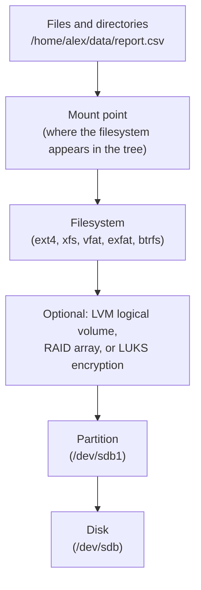
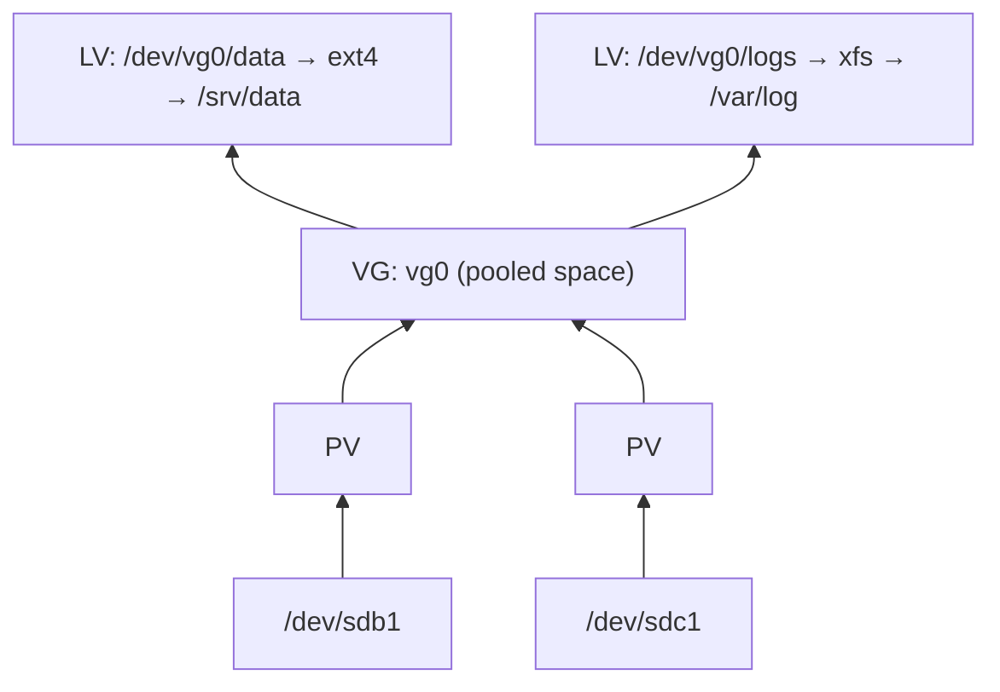
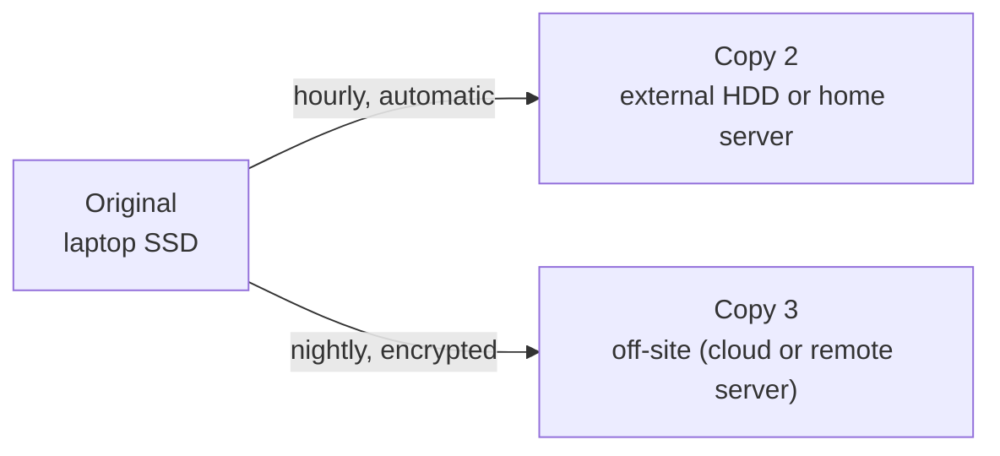

# Disks and backups

> **Level 4 · Chapter 6** · ⏱️ ~50 min read · Prerequisites: [Filesystems, inodes, and links](../03-internals/04-filesystems-and-links.md), [SSH](05-ssh.md)

This chapter takes you from a raw disk to a mounted, reliable filesystem, and then to backups you can actually restore. You will partition and format disks safely using loop devices in a VM, mount drives permanently with `fstab`, learn what LVM, RAID, and SMART are for, and design a backup strategy with `rsync`, `tar`, Timeshift, and modern tools like restic and borg.

## Why it matters

Alex keeps three years of pipeline outputs and notebooks on a laptop and "backs up" by copying them to a USB drive now and then. One evening, a `rm -rf "$OUTPUT_DIR/"*` runs with an empty variable in the wrong directory. Most of the home folder is gone. Alex reaches for the USB drive. The last copy is five months old, and half the files on it are unreadable because the drive was unplugged mid-copy.

Alex's colleague had the same accident a month earlier. She lost twenty minutes of work: her laptop sent an encrypted, deduplicated snapshot to a home server every hour, and a second copy to cloud storage every night, and she had practiced restoring from it the week she set it up.

The difference was not luck or money. It was a strategy: automated, versioned, off-machine, and tested. This chapter teaches both halves, the disks and the backups.

## Concepts

### Block devices and how Linux names disks

A **block device** is a storage device the kernel reads and writes in fixed-size blocks: a hard disk, an SSD, a USB stick, an SD card, or a virtual disk. Linux represents each one as a file in `/dev`:

| Name | What it is |
|------|------------|
| `/dev/sda`, `/dev/sdb`, ... | SATA, SAS, and USB disks, lettered in detection order |
| `/dev/sda1`, `/dev/sda2` | Partitions on `/dev/sda` |
| `/dev/nvme0n1` | NVMe SSD 0, namespace 1 |
| `/dev/nvme0n1p1` | Partition 1 on it (note the `p`) |
| `/dev/vda`, `/dev/vda1` | A virtio disk inside a KVM virtual machine |
| `/dev/mmcblk0p1` | SD card partition |
| `/dev/loop0` | A **loop device**: a regular file presented as a block device |
| `/dev/mapper/vg0-data`, `/dev/dm-0` | Device-mapper devices: LVM volumes, encrypted volumes |

The letters in `sda`, `sdb` depend on detection order and can change when you plug in another drive. That is why permanent configuration refers to filesystems by **UUID**, never by `/dev/sdX`.

### From disk to files: the layers

A file you save passes through several layers before it reaches the physical disk:



1. A **disk** is a long array of blocks with no structure.
2. A **partition table** divides the disk into **partitions**: independent ranges of blocks.
3. A **filesystem** organizes a partition into files, directories, and inodes (see [Filesystems, inodes, and links](../03-internals/04-filesystems-and-links.md)). Creating one is called **formatting**, done with `mkfs`.
4. **Mounting** attaches a filesystem to a directory, the **mount point**, so its files appear in the single directory tree.

Optional layers can sit between the partition and the filesystem: LVM for flexible volumes, RAID for redundancy, and LUKS for encryption. Each one presents a new block device to the layer above.

### Partition tables: MBR vs GPT

There are two partition table formats.

**MBR** (Master Boot Record), from 1983, stores the table in the disk's first 512-byte sector, next to the BIOS boot code.

**GPT** (GUID Partition Table) is part of the UEFI standard and is what every modern system uses.

| | MBR (also called "DOS" or "msdos") | GPT |
|---|---|---|
| Maximum disk size | 2 TiB | 8 ZiB (effectively unlimited) |
| Partitions | 4 **primary**; more only via one **extended** partition holding **logical** ones | 128 by default, all equal |
| Redundancy | One copy, in sector 0; damage loses the table | Primary header at the start, **backup at the end**, with checksums |
| Partition IDs | 1-byte type code | GUID type and a unique GUID per partition |
| Boot firmware | Legacy BIOS | UEFI (also BIOS with a small BIOS boot partition) |

Use **GPT** for every new disk, unless you need a USB stick that old devices (a car stereo, a TV) can read; those often want MBR with FAT32. GPT disks also contain a **protective MBR** in sector 0, so old tools see one big "in use" partition instead of an empty disk they might overwrite.

### Partitioning tools

| Tool | Style | Notes |
|------|-------|-------|
| `fdisk` | Interactive, menu of one-letter commands | Handles MBR and GPT. Nothing is written until you press `w`. |
| `gdisk` | Interactive, `fdisk`-like | GPT only, with GPT repair tools |
| `parted` | Interactive or scriptable one-liners | Changes are applied **immediately**, without a final `w` |
| `sfdisk` | Scriptable | Can dump a table to a text file and restore it |
| GParted, GNOME Disks | Graphical | Good for one-off desktop tasks |

All of them can destroy every byte on a disk with a single mistyped device name. That is why you will practice on **loop devices**.

### Loop devices: practicing on a file

A **loop device** makes a regular file behave like a disk. You create a file, attach it with `losetup`, and get a `/dev/loopN` device you can partition, format, and mount exactly like a real disk. When you are done, you detach it and delete the file. Nothing real is ever at risk.

**`truncate -s 1G disk.img`** creates the file instantly. It is a **sparse file**: its size says 1 GiB, but no blocks are allocated until data is written, so it uses almost no space. (Mint uses loop devices for snap packages, so `lsblk` already shows a few, and your new device will get the next free number.)

### Filesystems to choose from

| Filesystem | Use it for | Notes |
|------------|------------|-------|
| **ext4** | Linux system and data disks; the safe default | Journaled, mature, can grow and shrink (offline) |
| **xfs** | Large files, big servers | Very fast with parallel I/O; can grow but **cannot shrink** |
| **btrfs** | Snapshots, checksums, compression | Copy-on-write; snapshots are built in |
| **vfat** (FAT32) | USB sticks for any device; the EFI system partition | No permissions; **4 GiB maximum file size** |
| **exfat** | USB drives shared with Windows and macOS | No 4 GiB limit; no Linux permissions |
| **ntfs** | Reading Windows disks | Supported, but not for Linux system use |

A **journaling** filesystem (ext4, xfs) first writes a note of what it is about to change to a **journal**. After a crash or power cut, it replays or discards those notes, so the filesystem is consistent again in seconds instead of needing a long `fsck` scan.

### Mounting and fstab

**Mounting** attaches a filesystem to a directory. `mount /dev/sdb1 /mnt/data` makes the files on `sdb1` appear under `/mnt/data`. Whatever was in `/mnt/data` before is hidden (not deleted) until you unmount.

On a desktop, Mint mounts USB drives for you automatically under `/media/alex/LABEL`, through a service called **udisks2**. On a server, or for drives that should always be mounted, you list them in **`/etc/fstab`** (filesystem table). At boot, systemd turns each line into a `.mount` unit and mounts it.

Each fstab line has six fields:

```text
# <device>                                 <mount point>  <type>  <options>                       <dump> <pass>
UUID=bb30846a-8004-409d-864e-62e1dee6440b  /mnt/backup    ext4    defaults,nofail,noatime          0      2
```

| Field | Meaning |
|-------|---------|
| **Device** | Which filesystem. Use `UUID=...` (or `LABEL=...`), never `/dev/sdb1`, because device letters can change. |
| **Mount point** | An existing directory |
| **Type** | `ext4`, `xfs`, `vfat`, `exfat`, `swap`, or `auto` |
| **Options** | Comma-separated; see below |
| **Dump** | Legacy backup flag; always `0` |
| **Pass** | `fsck` order at boot: `1` for `/`, `2` for other local filesystems, `0` to skip |

The options that matter most:

| Option | Meaning |
|--------|---------|
| `defaults` | `rw,suid,dev,exec,auto,nouser,async` |
| **`nofail`** | **Do not fail the boot if this device is missing.** Essential for external and removable drives. |
| `noatime` | Do not update a file's access time on every read; less disk I/O |
| `ro` | Read-only |
| `noauto` | Do not mount at boot; mount on demand with `mount /mnt/backup` |
| `x-systemd.device-timeout=10s` | Wait only 10 s for the device at boot (default 90 s) |
| `uid=1000,gid=1000` | For vfat/exfat, which have no owners: who owns the files |

!!! warning "Common mistake"
    Adding an external drive to fstab without `nofail`. One day you boot without the drive plugged in, systemd waits 90 seconds, gives up, and drops you into **emergency mode** because a required mount failed. A typo in a UUID does the same. Always add `nofail` for anything that is not essential to boot, and test the file before rebooting.

### LVM: flexible volumes

Partitions are rigid: growing one usually means moving everything after it. **LVM** (Logical Volume Manager) adds a layer of flexibility between partitions and filesystems:



- A **physical volume** (PV) is a partition or disk handed to LVM (`pvcreate`).
- A **volume group** (VG) pools one or more PVs into one big space (`vgcreate`).
- A **logical volume** (LV) is carved out of the VG and used like a partition (`lvcreate`); you put a filesystem on it.

What this buys you: grow a volume while it is mounted (`lvextend -r -L +10G vg0/data` grows the LV and its filesystem in one step); add a new disk to the pool when you run out; and take **LVM snapshots**, point-in-time copies that are useful for consistent backups. Ubuntu Server's installer uses LVM by default. Mint's installer offers it as an option.

### RAID: surviving a disk failure

**RAID** (Redundant Array of Independent Disks) combines several disks so that the system keeps running when one fails, or so that it runs faster. On Linux, software RAID is managed with `mdadm` and appears as `/dev/md0`.

| Level | Disks | Usable space | Survives | How |
|-------|-------|--------------|----------|-----|
| RAID 0 | 2+ | 100% | **Nothing**; one failure loses everything | Striping: data split across disks for speed |
| RAID 1 | 2+ | 50% (one disk's worth) | All but one disk | Mirroring: identical copies |
| RAID 5 | 3+ | (n−1) disks | 1 disk | Striping with distributed parity |
| RAID 6 | 4+ | (n−2) disks | 2 disks | Double parity |
| RAID 10 | 4+ | 50% | 1 per mirror pair | Mirrors, striped |

!!! info "RAID is not a backup"
    RAID protects against **one kind** of failure: a disk dying. It does nothing against deleting a file, ransomware, a bad script, filesystem corruption, fire, or theft. A deleted file is deleted on every mirror instantly. You still need backups.

### SMART: asking the disk how it feels

**SMART** (Self-Monitoring, Analysis and Reporting Technology) is built into almost every HDD and SSD. The drive keeps counters about its own health: reallocated sectors, read errors, temperature, power-on hours, and for SSDs, how much of their write endurance is used. The `smartctl` tool from the `smartmontools` package reads them, and its `smartd` daemon can watch them continuously. A rising count of reallocated or pending sectors is the classic early warning that a disk is dying. Replace it before it finishes.

### Backup strategy: what you are protecting against

A backup is a copy of data that lets you recover from losing the original. Before choosing tools, ask what can go wrong:

| Threat | Example | What protects you |
|--------|---------|-------------------|
| Hardware failure | SSD dies | Any copy on another device |
| Human error | `rm -rf` in the wrong place, overwritten file | **Versioned** backups (yesterday's copy still exists) |
| Software bug, corruption | A script truncates every CSV | Versions older than the bug |
| Ransomware, attacker | Files encrypted, backups on a mounted drive encrypted too | A copy the machine **cannot modify**: offline or append-only |
| Site disaster | Fire, flood, theft | An **off-site** copy |

A plain mirror (`rsync --delete` to one drive) protects only against the first row. If you delete a file by accident, the next sync deletes it from the mirror too.

### The 3-2-1 rule

The classic rule of thumb for backups:

- **3** copies of your data (the original plus two backups),
- on **2** different types of storage (for example, internal SSD and an external HDD),
- with **1** copy **off-site** (cloud storage or a drive at a friend's house).



Many people add "**0** errors": every backup is verified, and restores are tested.

### RPO and RTO

Two numbers turn "we should have backups" into a design:

- **RPO** (Recovery Point Objective): how much data you can afford to lose, measured in time. Backups every 24 hours mean an RPO of up to 24 hours: a crash at 23:59 loses a whole day's work.
- **RTO** (Recovery Time Objective): how long you can afford to be down while restoring. Restoring 2 TB from cloud storage over a home connection might take two days. If you need to be working again in two hours, you need a local copy too.

For a personal laptop, an RPO of an hour and an RTO of a day might be fine. For a production database, the RPO might be minutes and the RTO under an hour. Write the numbers down; they decide how often you back up and where the copies live.

### Full, incremental, and differential

| Type | What it copies | Restore needs | Storage | Speed |
|------|----------------|---------------|---------|-------|
| **Full** | Everything, every time | That one backup | Largest | Slowest |
| **Incremental** | Only what changed since the **last backup of any kind** | The last full + **every** incremental since | Smallest | Fastest |
| **Differential** | What changed since the **last full** backup | The last full + the **latest** differential | Grows until the next full | Medium |

Modern tools blur this distinction. **rsync with `--link-dest`**, **restic**, **borg**, and Timeshift all store each snapshot so that it *looks* like a full backup (you can browse or restore any one of them by itself) while *storing* only the changes, using hard links or **deduplication** (storing each unique chunk of data only once). That is the best of both worlds and the reason to use them.

### Testing restores

A backup you have never restored is a hope, not a backup. Backups fail silently in many ways: a job stopped running months ago, an exclude pattern skipped the important folder, the encryption password is lost, or the files are there but the database dump inside is empty.

Make restore testing a habit:

- After setting up any backup, **restore something immediately** to a different location and compare it with the original.
- Schedule a regular test (monthly is a good start): restore a random file and a whole directory.
- Check that backups are **recent**: monitor the age of the newest backup, not only whether the job "succeeded".
- Keep the restore steps written down somewhere you can reach when the machine is gone.

### Snapshots and Timeshift

A **snapshot** captures the state of a filesystem at one moment. Filesystems like btrfs and ZFS, and LVM, can create snapshots instantly. They are great for rolling back, but a snapshot on the same disk is **not** a backup: it dies with the disk.

On Mint, **Timeshift** is the built-in system snapshot tool, and Mint's Update Manager asks you to set it up. Its job is protecting the **system** (`/`, `/etc`, `/usr`, installed packages) from a bad update or a broken configuration. In its default **RSYNC** mode, it copies the system into `/timeshift/snapshots/` on a disk you choose, and uses hard links between snapshots so that unchanged files take no extra space. In **BTRFS** mode (only if you installed on btrfs), it uses native snapshots.

By default, Timeshift **excludes your home directory**. That is intentional: rolling back the system should not roll back your documents. So Timeshift is not a backup of your data. Use it alongside a real data backup.

### Modern backup tools: restic and borg

**restic** and **BorgBackup** (borg) are the current best tools for personal and server backups. Both:

- split files into chunks and **deduplicate**: a 50 GB folder backed up daily for a year might take barely more than 50 GB,
- **encrypt** everything on the client, so the backup storage (or a cloud provider) never sees your data,
- let you list, browse, and restore any snapshot, or mount the repository as a filesystem,
- **prune** old snapshots by policy ("keep 7 daily, 4 weekly, 12 monthly"),
- **verify** repository integrity with a `check` command.

restic is a single Go binary that can write directly to many back ends: local disks, SFTP, S3-compatible object storage, and more. borg is very fast and space-efficient and works over SSH to a server that also has borg installed. Both are in Mint's repositories (`sudo apt install restic`, `sudo apt install borgbackup`).

## Commands and examples

### Looking at your disks (read-only)

`lsblk` lists block devices as a tree. It is safe and needs no root:

```bash
lsblk
```

```text
NAME        MAJ:MIN RM   SIZE RO TYPE MOUNTPOINTS
loop0         7:0    0    74M  1 loop /snap/core22/2955
loop1         7:1    0  50.3M  1 loop /snap/snapd/27738
sda           8:0    1  29.3G  0 disk
└─sda1        8:1    1  29.3G  0 part /media/alex/USBSTICK
nvme0n1     259:0    0 476.9G  0 disk
├─nvme0n1p1 259:1    0   512M  0 part /boot/efi
└─nvme0n1p2 259:2    0 476.4G  0 part /
```

- **`NAME`**: the device, indented under its parent disk.
- **`MAJ:MIN`**: the kernel's device numbers (from [Devices, /proc, and /sys](../03-internals/05-devices-proc-sys.md)).
- **`RM`**: `1` for removable media, like the USB stick `sda`.
- **`RO`**: `1` for read-only. Snap loop devices are read-only images.
- **`TYPE`**: `disk`, `part`, `loop`, `lvm`, `raid1`, `crypt`, and so on.
- **`MOUNTPOINTS`**: where each one is mounted, if anywhere.

Add filesystem information with `-f`, or choose columns:

```bash
lsblk -o NAME,SIZE,TYPE,FSTYPE,LABEL,UUID,MOUNTPOINTS
```

```text
NAME          SIZE TYPE FSTYPE LABEL    UUID                                 MOUNTPOINTS
sda          29.3G disk
└─sda1       29.3G part exfat  USBSTICK 6A1F-2C3B                            /media/alex/USBSTICK
nvme0n1     476.9G disk
├─nvme0n1p1   512M part vfat            4E2D-91A7                            /boot/efi
└─nvme0n1p2 476.4G part ext4            9b2f3c1e-6d4a-4f0e-8a71-2c5d9e8b7a10 /
```

`df -hT` shows usage of mounted filesystems, and `blkid` prints the UUID and type of a device or image file. Neither changes anything.

### Practice disk: create a loop device

!!! danger "⚠️ VM only"
    Run everything from here to the end of the fstab section in your throwaway VM. These commands need `sudo`, and the same commands pointed at the wrong device destroy real data. In the VM, the worst case is reinstalling the VM.

Create a sparse 1 GiB file and attach it:

```bash
mkdir -p ~/lab && cd ~/lab
truncate -s 1G disk.img
ls -lhs disk.img
```

```text
0 -rw-rw-r-- 1 alex alex 1.0G Oct  2 13:01 disk.img
```

The first column (`0`) is the space actually allocated: none. The file only claims to be 1 GiB.

```bash
sudo losetup --find --show --partscan disk.img
```

```text
/dev/loop4
```

- **`--find`**: use the first free loop device.
- **`--show`**: print which one it chose. Write it down; the examples below use `/dev/loop4`.
- **`--partscan`** (`-P`): let the kernel see partitions on it, so you get `/dev/loop4p1` and so on.

```bash
losetup --list /dev/loop4
lsblk /dev/loop4
```

```text
NAME       SIZELIMIT OFFSET AUTOCLEAR RO BACK-FILE             DIO LOG-SEC
/dev/loop4         0      0         0  0 /home/alex/lab/disk.img   0     512
NAME  MAJ:MIN RM SIZE RO TYPE MOUNTPOINTS
loop4   7:4    0   1G  0 loop
```

You now have an empty 1 GiB "disk".

### Partitioning with fdisk

```bash
sudo fdisk /dev/loop4
```

Inside fdisk, type the commands shown after each `Command (m for help):` prompt. Pressing ++enter++ accepts a default.

```text
Welcome to fdisk (util-linux 2.39.3).
Changes will remain in memory only, until you decide to write them.
Be careful before using the write command.

Device does not contain a recognized partition table.
Created a new DOS (MBR) disklabel with disk identifier 0x53b89934.

Command (m for help): g
Created a new GPT disklabel (GUID: 0C779E20-F6A0-4463-8896-F2D3C35DEFAC).

Command (m for help): n
Partition number (1-128, default 1):
First sector (2048-2097118, default 2048):
Last sector, +/-sectors or +/-size{K,M,G,T,P} (2048-2097118, default 2095103): +512M

Created a new partition 1 of type 'Linux filesystem' and of size 512 MiB.

Command (m for help): n
Partition number (2-128, default 2):
First sector (1050624-2097118, default 1050624):
Last sector, +/-sectors or +/-size{K,M,G,T,P} (1050624-2097118, default 2095103):

Created a new partition 2 of type 'Linux filesystem' and of size 510 MiB.

Command (m for help): p
Disk /dev/loop4: 1 GiB, 1073741824 bytes, 2097152 sectors
Units: sectors of 1 * 512 = 512 bytes
Sector size (logical/physical): 512 bytes / 512 bytes
I/O size (minimum/optimal): 512 bytes / 512 bytes
Disklabel type: gpt
Disk identifier: 0C779E20-F6A0-4463-8896-F2D3C35DEFAC

Device          Start     End Sectors  Size Type
/dev/loop4p1     2048 1050623 1048576  512M Linux filesystem
/dev/loop4p2  1050624 2095103 1044480  510M Linux filesystem

Command (m for help): w
The partition table has been altered.
Calling ioctl() to re-read partition table.
Syncing disks.
```

What happened:

- **`g`** created an empty **GPT** table (`o` would create MBR).
- **`n`** created a new partition. The first one starts at sector 2048 (1 MiB), the standard **alignment** that keeps partitions on SSD and RAID boundaries. `+512M` sets its size.
- The second `n` took all defaults: "the rest of the disk".
- **`p`** printed the table, still only in memory.
- **`w`** wrote it to the disk. Until `w`, **`q`** would quit without changing anything. That is fdisk's safety net.

Other useful fdisk commands: `d` delete a partition, `t` change its type (for example to "EFI System" or "Linux swap"), `m` help.

The same layout with `parted`, non-interactively. Note that **parted applies each command immediately**; there is no `w` step:

```bash
sudo parted -s /dev/loop4 mklabel gpt mkpart data ext4 1MiB 513MiB mkpart scratch ext4 513MiB 100%
sudo parted /dev/loop4 print
```

`gdisk /dev/loop4` gives a GPT-only, fdisk-like interface, and its `v` (verify) and recovery menu can repair a damaged GPT using the backup header.

### Making filesystems

```bash
lsblk /dev/loop4
sudo mkfs.ext4 -L data /dev/loop4p1
```

```text
NAME      MAJ:MIN RM  SIZE RO TYPE MOUNTPOINTS
loop4       7:4    0    1G  0 loop
├─loop4p1 259:3    0  512M  0 part
└─loop4p2 259:4    0  510M  0 part
mke2fs 1.47.0 (5-Feb-2023)
Discarding device blocks: done
Creating filesystem with 131072 4k blocks and 32768 inodes
Filesystem UUID: bb30846a-8004-409d-864e-62e1dee6440b
Superblock backups stored on blocks:
	32768, 98304

Allocating group tables: done
Writing inode tables: done
Creating journal (4096 blocks): done
Writing superblocks and filesystem accounting information: done
```

Reading the output:

- **`131072 4k blocks`**: 512 MiB in 4 KiB blocks.
- **`32768 inodes`**: the maximum number of files this filesystem can ever hold. The number is fixed at creation. You will meet "out of inodes" in the troubleshooting chapter.
- **`Filesystem UUID`**: the unique ID you will use in fstab.
- **`Superblock backups`**: copies of the filesystem's master record, used by `fsck` if the primary is damaged.
- **`Creating journal`**: ext4's crash-safety journal.

`-L data` sets a **label**, a human-friendly name that also works in fstab (`LABEL=data`). Format the second partition as exFAT, as you would for a USB drive shared with other operating systems:

```bash
sudo mkfs.exfat -n SHARED /dev/loop4p2
sudo blkid /dev/loop4p1 /dev/loop4p2
```

```text
/dev/loop4p1: LABEL="data" UUID="bb30846a-8004-409d-864e-62e1dee6440b" BLOCK_SIZE="4096" TYPE="ext4" PARTLABEL="data" PARTUUID="8c0d6c55-2f1e-4b2a-9d55-0d8a1f3e6b21"
/dev/loop4p2: LABEL="SHARED" UUID="1D2C-8E47" BLOCK_SIZE="512" TYPE="exfat" PARTUUID="5b7a9e10-3c4d-4e8f-a1b2-6c7d8e9f0a1b"
```

Note the two different IDs: **UUID** belongs to the filesystem (it changes if you reformat), and **PARTUUID** belongs to the GPT partition entry.

!!! warning "Common mistake"
    Running `mkfs` on the disk instead of the partition (`/dev/sdb` instead of `/dev/sdb1`), or on the wrong disk entirely. Before any `mkfs`, `fdisk`, or `dd`, run `lsblk` and check the **size** and **model** of the target. Your 30 GB USB stick and your 1 TB data disk are easy to tell apart by size; `sdb` and `sdc` are not.

### Mounting by hand

```bash
sudo mkdir -p /mnt/data
sudo mount /dev/loop4p1 /mnt/data
df -hT /mnt/data
```

```text
Filesystem     Type  Size  Used Avail Use% Mounted on
/dev/loop4p1   ext4  488M   24K  462M   1% /mnt/data
```

Size is 488M, not 512M, because of filesystem metadata, and only 462M is available: ext4 **reserves 5%** of blocks for root, so the system can still write logs when users fill the disk. On a pure data disk you can lower it with `sudo tune2fs -m 1 /dev/loop4p1`.

A new ext4 filesystem's root directory belongs to root. Give yourself a place to write:

```bash
sudo chown alex:alex /mnt/data
echo "hello" > /mnt/data/test.txt
findmnt /mnt/data
```

```text
TARGET    SOURCE       FSTYPE OPTIONS
/mnt/data /dev/loop4p1 ext4   rw,relatime
```

Unmount when done:

```bash
cd ~
sudo umount /mnt/data
```

If you get `umount: /mnt/data: target is busy`, some process has a file open there or is using it as its current directory (often your own shell). Find it with `lsof +D /mnt/data` or `fuser -vm /mnt/data`.

### Mounting a USB drive

On the Mint desktop, plugging in a USB drive mounts it automatically under `/media/alex/LABEL`. From a terminal, use `udisksctl`, which talks to the same udisks2 service and needs **no sudo** for removable drives:

```bash
lsblk -o NAME,SIZE,RM,FSTYPE,LABEL,MOUNTPOINTS
udisksctl mount -b /dev/sdb1
```

```text
Mounted /dev/sdb1 at /media/alex/USBSTICK
```

Before pulling the drive out, unmount it and power it off, so that all cached writes reach the device:

```bash
udisksctl unmount -b /dev/sdb1
udisksctl power-off -b /dev/sdb
```

```text
Unmounted /dev/sdb1.
```

Yanking a drive without unmounting is how the USB copies in this chapter's opening story became unreadable: Linux buffers writes in the page cache (see [Memory](../03-internals/03-memory.md)), so "copy finished" on screen does not mean "data on the stick".

### Permanent mounts with fstab

!!! danger "⚠️ VM only"
    A broken `/etc/fstab` can stop a machine from booting. Practice in the VM, and always test before rebooting.

Back up the file, then get the UUID:

```bash
sudo cp /etc/fstab /etc/fstab.bak
sudo blkid -s UUID -o value /dev/loop4p1
```

```text
bb30846a-8004-409d-864e-62e1dee6440b
```

Add a line (use your own UUID):

```bash
echo 'UUID=bb30846a-8004-409d-864e-62e1dee6440b  /mnt/data  ext4  defaults,nofail,noatime  0  2' | sudo tee -a /etc/fstab
```

**Test it without rebooting.** `findmnt --verify` checks the syntax and that every source exists; `mount -a` mounts everything listed that is not mounted yet:

```bash
sudo findmnt --verify
sudo systemctl daemon-reload
sudo mount -a
findmnt /mnt/data
```

```text
Success, no errors or warnings detected
TARGET    SOURCE       FSTYPE OPTIONS
/mnt/data /dev/loop4p1 ext4   rw,noatime
```

The `daemon-reload` matters: systemd generates mount units from fstab, and without the reload, `mount -a` prints `mount: (hint) your fstab has been modified, but systemd still uses the old version; use 'systemctl daemon-reload' to reload.`

If `mount -a` reports an error, fix the line **now**, while the system is running, or restore the backup with `sudo cp /etc/fstab.bak /etc/fstab`. Never reboot with a failing `mount -a`.

For this loop device lab, remember that the loop device does not exist after a reboot (it was attached by hand). Thanks to `nofail`, the boot continues anyway. That is exactly the situation of an unplugged external backup drive. Clean up when you are finished:

```bash
sudo umount /mnt/data
sudo losetup --detach /dev/loop4
sudo cp /etc/fstab.bak /etc/fstab
sudo systemctl daemon-reload
rm ~/lab/disk.img
```

### LVM in two minutes (on loop devices)

!!! danger "⚠️ VM only"
    LVM commands rewrite disk metadata. VM only, on loop devices.

```bash
cd ~/lab
truncate -s 1G pv1.img pv2.img
L1=$(sudo losetup -f --show pv1.img); L2=$(sudo losetup -f --show pv2.img)
sudo pvcreate "$L1" "$L2"
sudo vgcreate vg0 "$L1" "$L2"
sudo lvcreate -n data -L 1.5G vg0
sudo mkfs.ext4 -q /dev/vg0/data
sudo mkdir -p /mnt/lvdata && sudo mount /dev/vg0/data /mnt/lvdata
df -h /mnt/lvdata
```

```text
  Physical volume "/dev/loop5" successfully created.
  Physical volume "/dev/loop6" successfully created.
  Volume group "vg0" successfully created
  Logical volume "data" created.
Filesystem           Size  Used Avail Use% Mounted on
/dev/mapper/vg0-data 1.5G   24K  1.4G   1% /mnt/lvdata
```

The 1.5 GiB volume spans **two** 1 GiB "disks". Now grow it, while mounted, by 400 MiB:

```bash
sudo lvextend -r -L +400M vg0/data
df -h /mnt/lvdata
```

`-r` resizes the filesystem along with the volume. `sudo pvs`, `sudo vgs`, and `sudo lvs` summarize each layer. Clean up with `sudo umount /mnt/lvdata`, `sudo vgremove -y vg0`, `sudo pvremove "$L1" "$L2"`, `sudo losetup -d "$L1" "$L2"`, and `rm pv*.img`.

### SMART health checks

Install the tools (safe on any machine, but read SMART only on real disks; loop devices and most virtual disks have no SMART data):

```bash
sudo apt install smartmontools
sudo smartctl -H /dev/nvme0n1
```

```text
smartctl 7.4 2023-08-01 r5530 [x86_64-linux-6.8.0-45-generic] (local build)
Copyright (C) 2002-23, Bruce Allen, Christian Franke, www.smartmontools.org

=== START OF SMART DATA SECTION ===
SMART overall-health self-assessment test result: PASSED
```

`PASSED` is the drive's own verdict, and it is conservative: drives often report `PASSED` until shortly before they fail. The detailed attributes tell you more:

```bash
sudo smartctl -a /dev/sda | grep -E 'Reallocated_Sector|Current_Pending|Offline_Uncorrect|Power_On_Hours|Temperature_Celsius'
```

```text
  5 Reallocated_Sector_Ct   0x0033   100   100   010    Pre-fail  Always       -       0
  9 Power_On_Hours          0x0032   093   093   000    Old_age   Always       -       31544
194 Temperature_Celsius     0x0022   064   052   000    Old_age   Always       -       36
197 Current_Pending_Sector  0x0012   100   100   000    Old_age   Always       -       0
198 Offline_Uncorrectable   0x0010   100   100   000    Old_age   Offline      -       0
```

The last column, **RAW_VALUE**, is what to watch. On a SATA drive, any non-zero and **growing** `Reallocated_Sector_Ct`, `Current_Pending_Sector`, or `Offline_Uncorrectable` means the disk is losing sectors: back it up and replace it. For NVMe SSDs, `smartctl -a` shows a different list; watch **`Percentage Used`** (wear, 100% = rated endurance reached), **`Available Spare`**, and **`Media and Data Integrity Errors`**.

`sudo smartctl -t short /dev/sda` starts a two-minute self-test in the background; read the result later with `smartctl -l selftest`.

### tar: archives

`tar` (tape archive) bundles many files into one archive file, optionally compressed. It preserves paths, permissions, and timestamps. It is the universal format for shipping a directory around, and the simplest full backup.

```bash
cd ~
tar -czf notes-2026-10-02.tar.gz notes/              # create, gzip
tar -tzvf notes-2026-10-02.tar.gz | head -5          # list contents
mkdir -p /tmp/restore && tar -xzf notes-2026-10-02.tar.gz -C /tmp/restore   # extract elsewhere
```

```text
drwxrwxr-x alex/alex         0 2026-10-02 13:20 notes/
-rw-rw-r-- alex/alex      1832 2026-09-30 18:02 notes/linux.md
-rw-rw-r-- alex/alex       940 2026-10-01 09:15 notes/mistakes.md
```

The letters: **`c`** create, **`t`** list, **`x`** extract, **`f`** the archive file name (must come right before it), **`v`** verbose, **`z`** gzip. Other compressors: **`j`** bzip2 (`.tar.bz2`), **`J`** xz (`.tar.xz`, smallest, slowest), and **`--zstd`** (`.tar.zst`, fast and small; a great default for backups). `-C DIR` changes directory before extracting (or before adding files, when creating).

Useful options for backups:

```bash
# Exclude junk, and archive paths relative to /
sudo tar --zstd -cf /var/backups/etc-$(date +%F).tar.zst --exclude='*.dpkg-old' -C / etc
```

Using `-C / etc` stores paths as `etc/...` rather than `/etc/...`. (GNU tar strips the leading `/` anyway and prints `Removing leading '/' from member names`; `-C` avoids the message and makes the intent explicit.) Extracting then never overwrites the live `/etc` by accident unless you deliberately extract with `-C /`.

Always **list** an archive before trusting it: `tar -tf` reads the whole thing and fails on corruption.

### rsync as a backup tool

The simplest rsync backup is a **mirror**:

```bash
rsync -aHAX --delete --info=stats1 /home/alex/data/ /media/alex/BACKUP/data/
```

- **`-a`**: archive mode, as in the SSH chapter.
- **`-H`**: preserve hard links. **`-A`**: preserve ACLs. **`-X`**: preserve extended attributes. For a faithful copy of a Linux filesystem you want all three.
- **`--delete`**: make the destination an exact mirror.
- **`--info=stats1`**: print a short summary at the end.

A mirror has no history: if you delete or corrupt a file, the next run copies the damage. **Snapshots with `--link-dest`** fix that. Each run creates a new dated directory that looks like a full copy, but unchanged files are **hard links** to the previous snapshot, so they take no extra space:

```bash
today=$(date +%F)
rsync -a --delete --link-dest=../latest /home/alex/data/ /backup/snapshots/"$today"/
ln -sfn "$today" /backup/snapshots/latest
```

`--link-dest=../latest` is relative to the destination directory, so it points at the previous snapshot. Here is the effect, verified in a scratch directory with a 5 MB file that did not change and a small notes file that did:

```bash
du -sh snap/*
ls -li snap/*/big.bin
```

```text
5.1M	snap/2026-10-01
8.0K	snap/2026-10-02
2765269 -rw-rw-r-- 2 alex alex 5242880 Oct  2 11:20 snap/2026-10-01/big.bin
2765269 -rw-rw-r-- 2 alex alex 5242880 Oct  2 11:20 snap/2026-10-02/big.bin
```

Both snapshots contain `big.bin`, with the **same inode number** (2765269) and a link count of 2: one file on disk, two names. The second snapshot costs 8 KB, the size of the changed file plus directory entries. Deleting an old snapshot directory is safe; a file's data is only freed when its last link is gone. This is exactly how Timeshift's rsync mode works.

!!! warning "Common mistake"
    Assuming rsync always notices a change. By default, rsync's **quick check** compares only size and modification time. A tool that rewrites a file without changing its size, within the same second, can fool it. For critical data, run an occasional `rsync -c` (compare checksums, slower) or verify with a tool that hashes content.

### Timeshift from the command line

The GUI (Menu → Administration → Timeshift) is the normal way to configure it. The CLI is handy for scripts, for example taking a snapshot before a risky change:

```bash
sudo timeshift --list
sudo timeshift --create --comments "before kernel upgrade"
```

```text
Device : /dev/sdb1
UUID   : 4f6e2c1a-9b3d-4e5f-8a7b-1c2d3e4f5a6b
Path   : /run/timeshift/12345/backup
Mode   : RSYNC
Status : OK
3 snapshots, 112.4 GB free

Num     Name                 Tags  Description
------------------------------------------------------------------------------
0    >  2026-09-28_09-00-01  D
1    >  2026-10-01_09-00-01  D
2    >  2026-10-02_13-40-12  O     before kernel upgrade
```

Tags: `O` on-demand, `B` boot, `H` hourly, `D` daily, `W` weekly, `M` monthly. Restoring is done from the GUI or with `sudo timeshift --restore`, ideally from a live USB if the system no longer boots. Put Timeshift snapshots on a **different disk** from the system, or a disk failure takes both.

### restic: a modern backup in five commands

```bash
sudo apt install restic
export RESTIC_REPOSITORY=/media/alex/BACKUP/restic
export RESTIC_PASSWORD_FILE=~/.config/restic/password   # chmod 600; keep a copy elsewhere!
restic init
restic backup ~/data ~/notes --exclude='*.tmp'
restic snapshots
```

```text
created restic repository 7c3e1d2a9f at /media/alex/BACKUP/restic
...
Files:        1204 new,     0 changed,     0 unmodified
Added to the repository: 1.912 GiB (1.703 GiB stored)
processed 1204 files, 2.013 GiB in 0:41
snapshot 4f2a9c1e saved

ID        Time                 Host        Tags        Paths
------------------------------------------------------------------------
4f2a9c1e  2026-10-02 13:45:10  mint                    /home/alex/data
                                                       /home/alex/notes
------------------------------------------------------------------------
1 snapshots
```

Run `restic backup` again after changing one file and you will see `Added to the repository` of a few kilobytes. Restore, prune, and verify:

```bash
restic restore latest --target /tmp/restore --include /home/alex/notes
restic forget --keep-daily 7 --keep-weekly 4 --keep-monthly 12 --prune
restic check
```

To back up off-site, point `RESTIC_REPOSITORY` at `sftp:web1:/srv/restic/alex` (using your SSH config) or an S3-compatible bucket. The data is encrypted before it leaves your machine.

!!! danger "Lose the password, lose the backup"
    restic and borg encryption is real. Without the repository password (or borg's key), nobody can restore, including you. Store it in your password manager and somewhere offline.

borg's workflow is the same shape:

```bash
borg init --encryption=repokey /media/alex/BACKUP/borg
borg create --stats /media/alex/BACKUP/borg::'{hostname}-{now:%Y-%m-%d}' ~/data
borg list /media/alex/BACKUP/borg
borg prune --keep-daily 7 --keep-weekly 4 /media/alex/BACKUP/borg
```

Either tool, scheduled with a systemd timer from the scheduling chapter, gives you automated, versioned, encrypted, deduplicated backups.

## Exercises

### Exercise 1: Survey your storage (easy)

On your main machine, using read-only commands, answer: which disk holds `/`? What partition table type does it use? What filesystem is `/` and how full is it? Which filesystems are listed in `/etc/fstab`, and are they referenced by UUID?

??? success "Solution"

    ```bash
    findmnt /
    lsblk -o NAME,SIZE,TYPE,FSTYPE,MOUNTPOINTS
    lsblk -o NAME,PTTYPE -d
    df -hT /
    grep -v '^#' /etc/fstab
    ```

    `findmnt /` shows the source partition. `lsblk -o NAME,PTTYPE -d` shows the partition table type per disk (`gpt` or `dos`). `df -hT` gives the filesystem type and use percentage. Modern installs reference `/` and `/boot/efi` by `UUID=` in fstab; you may also see a swap file by path.

### Exercise 2: A sparse file and a filesystem without root (easy)

On your main machine, in a scratch directory, create a 200 MiB sparse file, show that it uses no space, make an ext4 filesystem **inside the file** (no loop device or root needed), and show its UUID and how much space the file uses now.

??? success "Solution"

    ```bash
    mkdir -p ~/scratch/disk && cd ~/scratch/disk
    truncate -s 200M fs.img
    ls -lhs fs.img
    mkfs.ext4 -q -L practice fs.img
    blkid fs.img
    ls -lhs fs.img
    du -h --apparent-size fs.img; du -h fs.img
    ```

    `mkfs.ext4` works on a regular file you own. Before formatting, the allocated size is 0. After, only the metadata (a few MB) is actually allocated, while the apparent size stays 200M. `blkid` shows `LABEL="practice" UUID="..." TYPE="ext4"`. You cannot mount it without root, but it is a real filesystem. Delete the file when done.

### Exercise 3: Partition, format, mount, fstab (medium)

!!! danger "⚠️ VM only"
    Do this in your VM.

In your VM, using a 2 GiB loop device: create a GPT table with two partitions (1 GiB and the rest), format the first as ext4 labeled `projects` and the second as exFAT labeled `TRANSFER`. Add the ext4 one to fstab by UUID at `/srv/projects` with `nofail`, verify it with `findmnt --verify` and `mount -a`, then detach the loop device and run `mount -a` again to show that a missing `nofail` device does not cause an error. Clean up fully.

??? success "Solution"

    ```bash
    cd ~/lab && truncate -s 2G two.img
    DEV=$(sudo losetup -fP --show two.img); echo "$DEV"
    sudo parted -s "$DEV" mklabel gpt mkpart projects ext4 1MiB 1025MiB mkpart transfer 1025MiB 100%
    sudo mkfs.ext4 -q -L projects "${DEV}p1"
    sudo mkfs.exfat -n TRANSFER "${DEV}p2"
    lsblk -f "$DEV"
    sudo mkdir -p /srv/projects
    sudo cp /etc/fstab /etc/fstab.bak
    UUID=$(sudo blkid -s UUID -o value "${DEV}p1")
    echo "UUID=$UUID /srv/projects ext4 defaults,nofail 0 2" | sudo tee -a /etc/fstab
    sudo findmnt --verify
    sudo systemctl daemon-reload && sudo mount -a && findmnt /srv/projects
    ```

    Now remove the device and try again:

    ```bash
    sudo umount /srv/projects
    sudo losetup -d "$DEV"
    sudo mount -a; echo "exit code: $?"
    ```

    `mount -a` skips the missing `nofail` device and exits with 0. (`findmnt --verify` warns that the source cannot be found, which is correct.) Clean up:

    ```bash
    sudo cp /etc/fstab.bak /etc/fstab && sudo systemctl daemon-reload
    rm ~/lab/two.img
    ```

### Exercise 4: Snapshot backups with rsync (medium)

On your main machine, in a scratch directory, write a small script `snap.sh SRC DEST` that creates a dated snapshot directory under `DEST` using `--link-dest` against a `latest` symlink, then updates `latest`. Use timestamps with seconds in the snapshot names so you can run it several times. Run it three times, changing one file between runs, and prove with `du` and `ls -li` that unchanged files are shared.

??? success "Solution"

    ```bash
    cat > ~/scratch/snap.sh <<'EOF'
    #!/usr/bin/env bash
    set -euo pipefail
    src=${1:?usage: snap.sh SRC DEST}
    dest=${2:?usage: snap.sh SRC DEST}
    name=$(date +%Y-%m-%d_%H%M%S)
    mkdir -p "$dest"
    link_opt=()
    [[ -e "$dest/latest" ]] && link_opt=(--link-dest=../latest)
    rsync -a --delete "${link_opt[@]}" "$src"/ "$dest/$name"/
    ln -sfn "$name" "$dest/latest"
    echo "snapshot $dest/$name"
    EOF
    chmod +x ~/scratch/snap.sh
    cd ~/scratch && mkdir -p src && head -c 10M /dev/urandom > src/big.bin && echo one > src/note.txt
    ./snap.sh src snaps; sleep 1
    echo two > src/note.txt; ./snap.sh src snaps; sleep 1
    echo three > src/note.txt; ./snap.sh src snaps
    du -sh snaps/2*
    ls -li snaps/2*/big.bin
    cat snaps/2*/note.txt
    ```

    `du` shows about 10M for the first snapshot and a few KB for each later one. `ls -li` shows the same inode number for `big.bin` in all three, with a link count of 3. `cat` prints `one`, `two`, `three`: each snapshot kept its own version of the changed file. The `link_opt` array handles the first run, when there is no `latest` yet. The `sleep 1` lines avoid the same-second quick-check trap described above.

### Exercise 5: Design and test a backup plan (hard)

Write a one-page backup plan for your own laptop: what data matters, the RPO and RTO you need, which tool backs up to where (meeting 3-2-1), how often, what retention, how you will know if it stops working, and how often you test restores. Then implement the local part with restic (to an external drive or a second directory if you have no drive) using a **user** systemd timer, and perform a test restore of one directory into `/tmp`, comparing it with the original.

??? success "Solution"

    A sample plan:

    | Item | Decision |
    |------|----------|
    | Data | `~/data`, `~/notes`, `~/projects` (code is also on GitHub) |
    | Not backed up | `~/Downloads`, caches, virtual machine images |
    | RPO / RTO | 1 hour / 1 day |
    | Copy 2 | restic to external HDD, hourly when plugged in |
    | Copy 3 | restic to `sftp:web1:` (off-site), nightly |
    | Retention | 24 hourly, 7 daily, 4 weekly, 12 monthly |
    | Monitoring | Weekly check: `restic snapshots --latest 1` is under 2 hours old |
    | Restore test | Monthly: restore one random directory and `diff -r` it |
    | System | Timeshift, daily, on the external HDD |

    Implementation (user units, no root):

    ```bash
    mkdir -p ~/.config/restic ~/.config/systemd/user
    openssl rand -base64 24 > ~/.config/restic/password && chmod 600 ~/.config/restic/password
    export RESTIC_REPOSITORY=/media/alex/BACKUP/restic RESTIC_PASSWORD_FILE=~/.config/restic/password
    restic init

    cat > ~/.config/systemd/user/restic-backup.service <<'EOF'
    [Unit]
    Description=restic backup of data and notes

    [Service]
    Type=oneshot
    Environment=RESTIC_REPOSITORY=/media/alex/BACKUP/restic
    Environment=RESTIC_PASSWORD_FILE=%h/.config/restic/password
    ExecStart=/usr/bin/restic backup %h/data %h/notes --exclude=*.tmp
    ExecStartPost=/usr/bin/restic forget --keep-hourly 24 --keep-daily 7 --keep-weekly 4 --keep-monthly 12 --prune
    EOF

    cat > ~/.config/systemd/user/restic-backup.timer <<'EOF'
    [Unit]
    Description=Hourly restic backup

    [Timer]
    OnCalendar=hourly
    Persistent=true
    RandomizedDelaySec=5min

    [Install]
    WantedBy=timers.target
    EOF

    systemctl --user daemon-reload
    systemctl --user start restic-backup.service
    journalctl --user -u restic-backup -n 20 --no-pager
    systemctl --user enable --now restic-backup.timer
    ```

    Test restore:

    ```bash
    restic restore latest --target /tmp/restore --include "$HOME/notes"
    diff -r ~/notes /tmp/restore"$HOME"/notes && echo "restore matches"
    ```

    Save the password somewhere other than the laptop. Then add the off-site repository as a second service and timer.

## Check yourself

1. Why should fstab entries use `UUID=` instead of `/dev/sdb1`?

    ??? note "Answer"

        Device names are assigned in detection order and can change when disks are added, removed, or detected in a different order. A UUID belongs to the filesystem itself and stays the same, so the right filesystem is always mounted at the right place.

2. What does `nofail` do, and when must you use it?

    ??? note "Answer"

        It tells systemd not to treat a missing or failed mount as a boot failure. Use it for every non-essential filesystem, especially external and removable drives; without it, booting without the drive drops the system into emergency mode.

3. Give three differences between MBR and GPT.

    ??? note "Answer"

        MBR is limited to 2 TiB disks and 4 primary partitions (more only via extended/logical); GPT supports huge disks and 128 partitions. MBR has one copy of the table; GPT keeps a backup header at the end of the disk with checksums. MBR goes with legacy BIOS boot; GPT is the UEFI standard.

4. Why is RAID 1 not a backup?

    ??? note "Answer"

        It mirrors every change instantly, including deletions, corruption, and ransomware encryption. It only protects against one disk failing. A backup must keep older versions on separate storage.

5. Explain 3-2-1, RPO, and RTO in one sentence each.

    ??? note "Answer"

        3-2-1: keep three copies, on two kinds of storage, with one off-site. RPO: the maximum amount of recent data (in time) you can afford to lose, which sets backup frequency. RTO: the maximum time you can afford to spend restoring, which decides where copies live and how restores work.

6. How does `rsync --link-dest` make every snapshot look complete while storing only changes?

    ??? note "Answer"

        For each file that is unchanged compared with the `--link-dest` directory, rsync creates a hard link to the existing file instead of copying it. Each snapshot directory has a full set of names, but unchanged files share the same inode and data blocks.

7. Timeshift is configured and running daily. Are your documents backed up?

    ??? note "Answer"

        Not by default. Timeshift is a system snapshot tool and excludes home directories, so that rolling back the system does not roll back your files. You need a separate data backup (rsync, restic, borg, or similar).

8. You must run `mkfs` on a new USB drive. What do you check first, and how?

    ??? note "Answer"

        That you have the right device. Run `lsblk -o NAME,SIZE,RM,MODEL,FSTYPE,MOUNTPOINTS` and confirm by size, removable flag, and model that the target is the new drive, and that you are formatting the partition (`/dev/sdb1`) rather than the wrong disk.

## Key takeaways

- A disk gets a partition table (use GPT), partitions, then filesystems (`mkfs`), which you mount onto directories. `lsblk`, `blkid`, `findmnt`, and `df -hT` show every layer without changing anything.
- Practice partitioning and formatting on loop devices (`truncate` + `losetup -fP --show`) in a VM. Before any destructive command on real hardware, confirm the target with `lsblk`.
- In `/etc/fstab`, refer to filesystems by UUID, add `nofail` for anything removable, and test with `findmnt --verify` and `mount -a` before rebooting.
- LVM makes volumes flexible; RAID keeps you running through a disk failure; SMART warns you before one. None of them is a backup.
- Good backups follow 3-2-1, are automated, versioned, partly off-site and immutable to the machine, and are **tested by restoring**. Decide RPO and RTO first.
- `rsync --link-dest`, Timeshift, restic, and borg all give "full-looking" snapshots that store only changes. Use Timeshift for the system and a real tool for your data.

## Next

You now have all the building blocks of a working server. The last chapter puts them to work when something goes wrong: a full disk, a CPU at 100%, a service that will not start. Continue with [Troubleshooting](07-troubleshooting.md).
