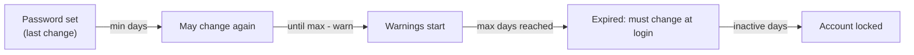
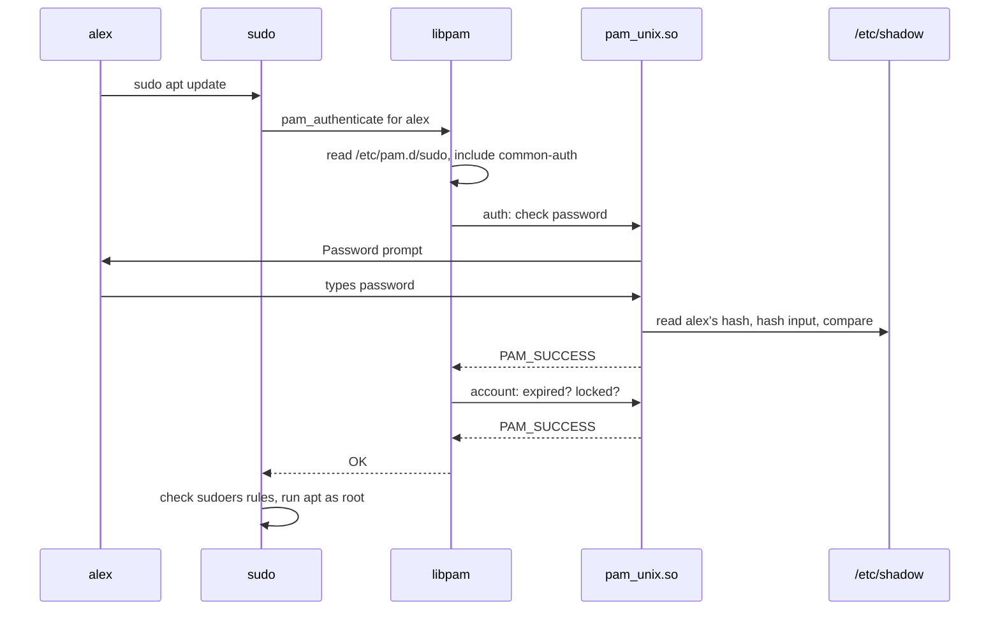
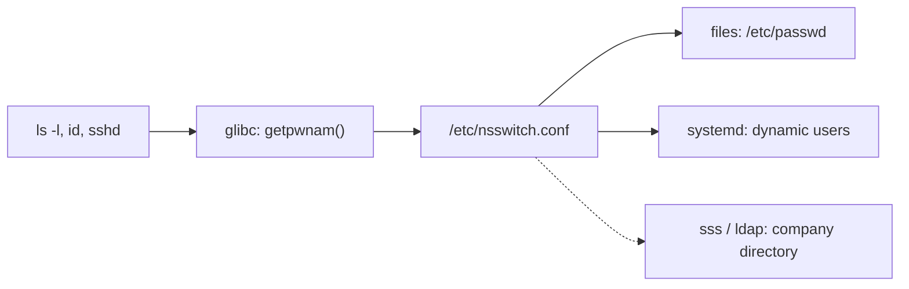

# User and group management

> **Level 4 · Chapter 8** · ⏱️ ~30 min read · Prerequisites: [Users, groups, and sudo](../00-first-steps/06-users-groups-sudo.md), [Permissions](../01-command-line/03-permissions.md)

This chapter takes you from "I know what a user is" to "I can run the accounts on a shared server". You will create, change, lock, and delete accounts. You will read every field of the account files and control who gets `sudo`. You will also see the two hidden systems that every login passes through: PAM and NSS.

## Why it matters

Alex looks after a small analytics server shared by four people. A new analyst needs Docker, so Alex runs `sudo usermod -G docker alex` to try the command on his own account first. It works. The next morning he types `sudo apt update` and gets:

```text
alex is not in the sudoers file.
```

`usermod -G` *replaces* your list of supplementary groups. Alex just removed himself from `sudo`, and he is the only admin. Fixing it means rebooting into recovery mode.

A month later there is an audit. A contractor left six months ago, but his account is still active and his SSH key still works. Nobody had an offboarding checklist.

Both problems are cheap to prevent and expensive to clean up. This chapter teaches the habits that prevent them.

## Concepts

### The four account files

Linux keeps local accounts in four plain-text files under `/etc`. There is no hidden database. Every tool in this chapter (`useradd`, `passwd`, `usermod`, and the others) is a careful editor for these files.

| File | Holds | Readable by |
|---|---|---|
| `/etc/passwd` | One line per user: name, UID, primary group, home, shell | Everyone |
| `/etc/shadow` | Password hashes and password-aging dates | root and group `shadow` |
| `/etc/group` | One line per group: name, GID, members | Everyone |
| `/etc/gshadow` | Group passwords and group administrators | root and group `shadow` |

```bash
ls -l /etc/passwd /etc/shadow /etc/group /etc/gshadow
```

```text
-rw-r--r-- 1 root root   1171 Aug 21 17:08 /etc/group
-rw-r----- 1 root shadow  990 Aug 21 17:08 /etc/gshadow
-rw-r--r-- 1 root root   2894 Jun  9 19:21 /etc/passwd
-rw-r----- 1 root shadow 1293 Jun  9 19:21 /etc/shadow
```

Why split them? In early Unix, password hashes lived in `/etc/passwd`. Every program needs to read that file to turn UIDs into names (that is how `ls -l` shows `alex` instead of `1000`). So everyone could copy the hashes and try to crack them offline. The fix was to move the secrets into **shadow files**, readable only by root, and leave an `x` placeholder in the public file.

### /etc/passwd, field by field

Each line has seven fields separated by colons:

```text
alex:x:1000:1000:Alex Rivera,,,:/home/alex:/bin/bash
```

| # | Field | Example | Meaning |
|---|---|---|---|
| 1 | Login name | `alex` | What you type at login. Lowercase by convention. |
| 2 | Password | `x` | `x` means "look in `/etc/shadow`". |
| 3 | **UID** | `1000` | The **user ID**. The kernel only knows this number, not the name. |
| 4 | **GID** | `1000` | The user's **primary group** ID. New files get this group. |
| 5 | **GECOS** | `Alex Rivera,,,` | Comment field: full name, room, phones, separated by commas. Change it with `chfn`. |
| 6 | Home | `/home/alex` | Where you land after login. |
| 7 | Shell | `/bin/bash` | The program started at login. |

The name GECOS comes from an old General Electric operating system. Today it simply means "the comment field".

!!! info "Names are for humans, numbers are for the kernel"
    Files on disk store the owner's UID, not the name. If you delete user `sam` (UID 1001) and later create `priya`, she may get UID 1001 too. She then silently owns every file `sam` left behind. This is why offboarding includes finding a user's files *before* you delete the account.

### /etc/shadow, field by field

`/etc/shadow` has nine fields per line:

```text
sam:$y$j9T$K7mN2pQx9vR4sT1u$YIbtkzc1ByChMeY.DZ4odugg7R3NonGiqQDs58pr9c4:20728:1:90:14:14:20908:
```

| # | Field | Example | Meaning |
|---|---|---|---|
| 1 | Login name | `sam` | Matches `/etc/passwd`. |
| 2 | Password hash | `$y$j9T$...` | The hashed password, or a special marker (see below). |
| 3 | Last change | `20728` | Day the password was last changed, counted in **days since 1 January 1970** (the Unix epoch). `20728` is 2 October 2026. `0` means "must change at next login". |
| 4 | Minimum age | `1` | Days that must pass before the user may change it again. Stops people cycling back to an old password. |
| 5 | Maximum age | `90` | Days the password stays valid. `99999` means "effectively never". |
| 6 | Warning | `14` | Days before expiry that the user starts seeing warnings. |
| 7 | Inactivity | `14` | Days *after* the password expires during which the user can still log in, but only to change it. After that, the account is locked. |
| 8 | Account expiry | `20908` | Day the whole account stops working (31 March 2027), no matter the password. Empty means never. |
| 9 | Reserved | | Unused. |

To turn an epoch day into a date, multiply by 86,400 seconds:

```bash
date -u -d @$((20728 * 86400)) +%F
```

```text
2026-10-02
```

#### Reading the hash field

A **hash** is the output of a one-way function. The system never stores your password. It stores the hash, and at login it hashes what you typed and compares the results. The hash field has the format `$id$params$salt$hash`. The **salt** is a random string mixed into the password before hashing, so two users with the same password get different hashes.

| Prefix | Algorithm | Notes |
|---|---|---|
| `$y$` | **yescrypt** | Default on Ubuntu 22.04+ and Mint 21+. Deliberately slow and memory-hungry, which makes cracking expensive. |
| `$6$` | SHA-512 crypt | The previous default. Still fine, still common. |
| `$5$` | SHA-256 crypt | Rare. |
| `$2b$` | bcrypt | Common on BSDs. |
| `$1$` | MD5 crypt | Obsolete and weak. Replace it if you see it. |

Some values are not hashes at all:

| Value | Meaning |
|---|---|
| `*` | No password will ever match. Typical for system accounts like `daemon`. |
| `!` or `!*` | Locked, with no password set. `adduser --disabled-password` creates this. |
| `!$y$...` | A real hash with `!` in front. The account was locked with `passwd -l`. Removing the `!` (with `passwd -u`) restores the old password. |
| *(empty)* | No password at all. Dangerous: anyone may log in on services that allow it. |

You can see where yescrypt comes from on Mint. It is set by PAM (explained later), not by `/etc/login.defs`:

```bash
grep pam_unix /etc/pam.d/common-password
```

```text
password	[success=1 default=ignore]	pam_unix.so obscure yescrypt
```

### /etc/group and /etc/gshadow

`/etc/group` has four fields:

```text
analysts:x:1003:sam,priya
```

| # | Field | Meaning |
|---|---|---|
| 1 | Group name | `analysts` |
| 2 | Password | `x`, meaning "see `/etc/gshadow`". |
| 3 | GID | The **group ID**. |
| 4 | Members | Comma-separated list of users who have this as a **supplementary group**. |

Users whose *primary* group is `analysts` (field 4 of `/etc/passwd`) are members too, even though they are not listed here. This trips up scripts that only read `/etc/group`. Use `id` or `getent` to get the full picture.

`/etc/gshadow` has four fields: name, an optional group password, a list of **group administrators**, and the member list:

```text
analysts:!::sam,priya
```

Group administrators can add and remove members with `gpasswd` without being root. Group passwords (which let non-members join with `newgrp`) are almost never used. `!` means none is set.

### Primary groups, supplementary groups, and user private groups

Every user has exactly one **primary group** (GID in `/etc/passwd`). New files you create belong to it. A user can also be in many **supplementary groups**, which give extra access: `sudo` for admin rights, `docker` for the Docker socket, `adm` for reading logs.

Ubuntu and Mint use **user private groups**. Each new user gets a group with the same name and number (user `sam`, UID 1001, group `sam`, GID 1001) as their primary group. This is controlled by `USERGROUPS_ENAB yes` in `/etc/login.defs`. It means you can safely use a umask of `002` (group-writable files), because your group contains only you. Shared access is then done on purpose, through separate groups like `analysts`.

!!! warning "Group changes need a new login"
    Your group list is attached to your processes when you log in. After `usermod -aG docker alex`, the shell you already have open is still *not* in `docker`. Log out and back in (or start a new SSH session). For a quick test, `newgrp docker` starts a subshell with the new group.

### System users and regular users

UIDs are split into ranges. The ranges come from `/etc/login.defs` and `/etc/adduser.conf`, plus Debian policy:

| UID range | Who | Example |
|---|---|---|
| 0 | root, the superuser | `root` |
| 1–99 | Fixed system accounts, the same on every Debian-family system | `daemon` (1), `bin` (2), `www-data` (33) |
| 100–999 | **System users**, created dynamically by packages | `syslog`, `systemd-resolve`, `lightdm` |
| 1000–59999 | **Regular users**, real people | `alex` (1000) |
| 65534 | `nobody`, the "owns nothing" user | `nobody` |

A **system user** (also called a **service account**) exists to run a program, not to be a person. Running a web server as `www-data` instead of root means a bug in it can only damage what `www-data` can touch. System users have no password, often no real home directory, and a shell that refuses logins.

```bash
grep -E '^(UID|GID)_(MIN|MAX)' /etc/login.defs
```

```text
UID_MIN			 1000
UID_MAX			60000
GID_MIN			 1000
GID_MAX			60000
```

### Login shells and nologin

Field 7 of `/etc/passwd` is the program started when the user logs in. For people it is `/bin/bash`. For service accounts it is usually one of these:

- **`/usr/sbin/nologin`** prints "This account is currently not available." and exits with an error. The polite choice.
- **`/bin/false`** exits with an error and prints nothing.

```bash
/usr/sbin/nologin; echo "exit code: $?"
```

```text
This account is currently not available.
exit code: 1
```

A nologin shell blocks interactive logins. It is not a complete lock: SSH port forwarding (`ssh -N`) never starts a shell, so it can still work if the user has a valid key. To fully disable an account, also lock or expire it (shown later).

### Where the defaults come from

When you create a user, four places decide what you get:

| File | Used by | Controls |
|---|---|---|
| `/etc/login.defs` | Most shadow tools (`useradd`, `passwd`, `login`) | UID/GID ranges, default password aging, `UMASK`, `HOME_MODE`, user private groups |
| `/etc/default/useradd` | `useradd` | Default shell, home base, skeleton directory (see `useradd -D`) |
| `/etc/adduser.conf` | `adduser` | Its own copies of most of the above, plus extra groups |
| `/etc/skel/` | Both | The **skeleton directory**: files copied into every new home directory |

`/etc/skel` holds the starter dotfiles every new user gets: `.bashrc`, `.profile`, `.bash_logout`. If you want every future user to get a company `.bashrc` alias or a `README`, put it here. It only affects users created *after* the change.

!!! note "login.defs aging values apply at creation time"
    `PASS_MAX_DAYS`, `PASS_MIN_DAYS`, and `PASS_WARN_AGE` in `/etc/login.defs` are copied into `/etc/shadow` when an account is *created*. Changing them later does not touch existing users. Use `chage` for those.

### useradd vs adduser

There are two tools with confusingly similar names:

- **`useradd`** is the low-level tool from the shadow suite. It exists on every Linux distribution. It does exactly what its flags say and nothing more. With no flags it creates no home directory and sets the shell to `/bin/sh`.
- **`adduser`** is a friendly Perl wrapper from Debian (so it exists on Ubuntu and Mint, but not on Fedora or Arch). It asks questions, creates the home directory, copies `/etc/skel`, creates the private group, and prompts for a password.

Rule of thumb: type `adduser` when you are at the keyboard. Use `useradd` with explicit flags in scripts and automation, because its behaviour is identical everywhere. The same pair exists for removal: `userdel` (low-level) and `deluser` (Debian wrapper).

### Password aging

Password aging is the set of dates in fields 3–8 of `/etc/shadow`. The timeline for one password looks like this:



Modern advice (NIST SP 800-63B) is *not* to force regular password changes, because people respond with `Summer2026!`, then `Autumn2026!`. Force a change when you suspect a compromise, and require a change at first login for accounts you create with a temporary password. Account expiry dates (field 8) are very useful for contractors and interns: the account switches itself off on their last day.

### sudo and the sudoers file

**sudo** lets permitted users run commands as root (or as another user), using their *own* password. Its rules live in `/etc/sudoers` and in files under `/etc/sudoers.d/`. Mint's main file ends with:

```text
root	ALL=(ALL:ALL) ALL
%admin ALL=(ALL) ALL
%sudo	ALL=(ALL:ALL) ALL
@includedir /etc/sudoers.d
```

Each rule reads: **who where=(as-whom) what**.

```text
%sudo   ALL   =(ALL:ALL)   ALL
  │      │       │    │     └── which commands: all of them
  │      │       │    └──────── may run as any group
  │      │       └───────────── may run as any user
  │      └───────────────────── on any host (matters for shared sudoers files)
  └──────────────────────────── members of group "sudo" (% means group)
```

Two tags are common:

- `NOPASSWD:` skips the password prompt. Use it only for narrow commands, for example in automation.
- Commands must be **absolute paths**, like `/usr/bin/systemctl`. Otherwise someone could put their own `systemctl` earlier in `PATH`.

**Drop-in files** in `/etc/sudoers.d/` let you add rules without editing the main file. Packages and automation tools love them. Two rules matter:

1. Files whose names contain a `.` or end in `~` are **silently ignored**. `deploy.conf` does nothing. Name it `50-deploy`.
2. Files are read in lexical order, and when several rules match, **the last one wins**.

You never edit these files with a plain editor. A single syntax error makes sudo refuse to run at all, which locks every admin out. **`visudo`** opens a temporary copy, checks the syntax when you save, and only installs the file if it is valid.

### PAM: how authentication is plugged together

**PAM** (Pluggable Authentication Modules) is a library that programs like `login`, `sshd`, `sudo`, `su`, and the graphical login screen call to answer "is this really alex, and may alex log in?". The program does not know how passwords are checked. PAM reads a config file for that program from `/etc/pam.d/` and runs a **stack** of **modules** (shared libraries like `pam_unix.so`) in order.

PAM splits the work into four **management groups** (also called module types):

| Type | Question it answers | Example module |
|---|---|---|
| `auth` | Who are you? Prove it. | `pam_unix` checks the password against `/etc/shadow` |
| `account` | Are you *allowed* in right now? | `pam_unix` checks expiry; `pam_nologin` blocks non-root logins when `/etc/nologin` exists |
| `password` | How do you change your secret? | `pam_unix` writes the new yescrypt hash; `pam_pwquality` checks strength |
| `session` | Set up and tear down the login | `pam_limits` applies resource limits; `pam_systemd` registers the session |

Each line has a **control flag** that says what the module's result means for the whole stack:

| Flag | On success | On failure |
|---|---|---|
| `required` | Continue | Remember the failure, keep going, fail at the end (so attackers can't tell which step failed) |
| `requisite` | Continue | Fail immediately |
| `sufficient` | Succeed immediately, if nothing required failed earlier | Ignore, continue |
| `optional` | Only matters if it is the only module | Only matters if it is the only module |
| `[value=action ...]` | Fine-grained form, e.g. `[success=1 default=ignore]` means "on success, skip the next 1 line; otherwise ignore this result" | |

Debian, Ubuntu, and Mint keep the shared logic in four **common** files, which each program pulls in with `@include`:

```bash
grep -v '^#' /etc/pam.d/sudo | grep -v '^$'
```

```text
session    required   pam_limits.so
session    required   pam_env.so readenv=1 user_readenv=0
session    required   pam_env.so readenv=1 envfile=/etc/default/locale user_readenv=0
@include common-auth
@include common-account
@include common-session-noninteractive
```

Here is how `sudo` flows through the stack when you type your password:



Read Mint's `common-auth`:

```text
auth	[success=1 default=ignore]	pam_unix.so nullok
auth	requisite			pam_deny.so
auth	required			pam_permit.so
```

Line by line: if `pam_unix` succeeds, skip one line (jump over `pam_deny`) and land on `pam_permit`, which always succeeds. If `pam_unix` fails, fall onto `pam_deny`, which always fails, and `requisite` stops the stack. `nullok` allows accounts with an empty password field, which is one more reason never to leave that field empty.

Useful modules to know by name:

| Module | Job |
|---|---|
| `pam_unix` | Classic `/etc/passwd` + `/etc/shadow` checks and password changes |
| `pam_faillock` | Locks an account after N failed attempts. Config in `/etc/security/faillock.conf` |
| `pam_pwquality` | Rejects weak passwords (length, character classes, dictionary words). Package `libpam-pwquality`. Config in `/etc/security/pwquality.conf` |
| `pam_limits` | Applies `/etc/security/limits.conf` (max open files, processes) |
| `pam_nologin` | Blocks non-root logins while `/etc/nologin` exists (maintenance mode) |
| `pam_mkhomedir` | Creates a home directory at first login (common with LDAP) |

!!! danger "⚠️ VM only: never hand-edit PAM on your main machine"
    A broken PAM file can make it impossible for *anyone* to log in or use sudo, including you. On Debian-family systems the common files are generated by `pam-auth-update`; prefer it over hand edits. If you must edit by hand, keep a root shell open in a second terminal and test a fresh login before closing it.

### NSS: where names come from

PAM answers "may you log in?". A different system, **NSS** (Name Service Switch), answers "what is user `alex`?" and "what is UID 1000?". The C library asks NSS, and NSS reads `/etc/nsswitch.conf` to decide which sources to try:

```bash
grep -E '^(passwd|group|shadow|hosts)' /etc/nsswitch.conf
```

```text
passwd:         files systemd
group:          files systemd
shadow:         files systemd
hosts:          files mdns4_minimal [NOTFOUND=return] dns myhostname
```

`passwd: files systemd` means: look in `/etc/passwd` first, then ask systemd (which knows about dynamic service users). In a company, this line often says `files sss` or `files ldap`, and users come from a central directory such as Active Directory or FreeIPA. Those users never appear in `/etc/passwd`.

That is why you should query accounts with **`getent`** ("get entries"), which goes through NSS exactly like the system does, instead of `grep /etc/passwd`, which only sees local files.



## Commands and examples

!!! danger "⚠️ VM only"
    Everything below that creates, changes, locks, or deletes an account, group, sudoers rule, or PAM file must be practiced in your throwaway VM, never on your main machine. A mistake here can lock you out of `sudo` or out of the system. The read-only commands (`id`, `getent`, `chage -l` on yourself, `passwd -S` on yourself, `who`, `w`, `last`) are safe anywhere.

### Inspecting accounts

`id` shows a user's UID, primary group, and every group:

```bash
id alex
```

```text
uid=1000(alex) gid=1000(alex) groups=1000(alex),4(adm),24(cdrom),27(sudo),30(dip),46(plugdev),100(users),105(lpadmin),125(sambashare)
```

That is the default group set Mint gives the first user. `adm` lets you read logs in `/var/log`, `sudo` grants admin rights, `lpadmin` manages printers.

`getent` reads any NSS database:

```bash
getent passwd alex
getent group sudo
getent passwd 1000
```

```text
alex:x:1000:1000:Alex Rivera,,,:/home/alex:/bin/bash
sudo:x:27:alex
alex:x:1000:1000:Alex Rivera,,,:/home/alex:/bin/bash
```

It exits with code `2` if the entry does not exist, which makes it perfect in scripts:

```bash
if getent passwd sam >/dev/null; then echo "sam exists"; else echo "no sam"; fi
```

List all regular users (UID 1000 to 59999) with `awk`:

```bash
getent passwd | awk -F: '$3 >= 1000 && $3 < 60000 {print $1, $3, $7}'
```

```text
alex 1000 /bin/bash
```

### Creating a user the friendly way: adduser

```bash
sudo adduser sam
```

```text
info: Adding user `sam' ...
info: Selecting UID/GID from range 1000 to 59999 ...
info: Adding new group `sam' (1001) ...
info: Adding new user `sam' (1001) with group `sam (1001)' ...
info: Creating home directory `/home/sam' ...
info: Copying files from `/etc/skel' ...
New password:
Retype new password:
passwd: password updated successfully
Changing the user information for sam
Enter the new value, or press ENTER for the default
	Full Name []: Sam Okafor
	Room Number []:
	Work Phone []:
	Home Phone []:
	Other []:
Is the information correct? [Y/n] y
info: Adding new user `sam' to supplemental / extra groups `users' ...
info: Adding user `sam' to group `users' ...
```

Reading the output: `adduser` picked the first free UID, made the user private group `sam`, created `/home/sam` with mode `0750`, copied `/etc/skel`, set the password through PAM (so it is hashed with yescrypt), filled GECOS, and added `sam` to the shared `users` group.

For a non-interactive version, for example an account that will only use SSH keys:

```bash
sudo adduser --disabled-password --comment "Priya Nair" priya
```

`--disabled-password` leaves `!` in the hash field, so password login is impossible but key-based SSH works. (Older releases call `--comment` by its old name, `--gecos`.)

### Creating a user the portable way: useradd

First look at what `useradd` would do with no flags:

```bash
useradd -D
```

```text
GROUP=100
HOME=/home
INACTIVE=-1
EXPIRE=
SHELL=/bin/sh
SKEL=/etc/skel
CREATE_MAIL_SPOOL=no
LOG_INIT=yes
```

`SHELL=/bin/sh` and no home directory (Debian does not set `CREATE_HOME`) are why bare `useradd sam` produces a half-broken account. Always pass explicit flags:

```bash
sudo useradd -m -s /bin/bash -c "Sam Okafor" -G users sam
sudo passwd sam
```

| Flag | Why it exists |
|---|---|
| `-m` | Create the home directory and copy `/etc/skel`. Without it, no home. |
| `-s /bin/bash` | Set the login shell. Without it, `/bin/sh` (dash), which has no history or tab completion. |
| `-c "..."` | GECOS comment, usually the full name. |
| `-G a,b` | Supplementary groups, comma-separated, no spaces. |
| `-u 1500` | Choose a specific UID, for example to match another server. |
| `-e 2027-03-31` | Account expiry date. |
| `-r` | Create a system account (UID below 1000, no aging). |
| `-k DIR` | Use a different skeleton directory. |

`useradd` prints nothing on success. Check the result:

```bash
getent passwd sam; ls -ld /home/sam
```

```text
sam:x:1001:1001:Sam Okafor:/home/sam:/bin/bash
drwxr-x--- 2 sam sam 4096 Oct  2 11:02 /home/sam
```

The `drwxr-x---` (`0750`) comes from `HOME_MODE 0750` in `/etc/login.defs`. Other users cannot read Sam's files.

To set passwords in bulk from a script, feed `name:password` lines to `chpasswd`:

```bash
echo 'sam:Temp-Pass-4821' | sudo chpasswd
```

### Modifying users: usermod

`usermod` changes an existing account. The most used flags:

| Command | Effect |
|---|---|
| `usermod -aG docker sam` | **A**ppend `docker` to Sam's supplementary groups |
| `usermod -s /bin/zsh sam` | Change the login shell |
| `usermod -c "Sam O." sam` | Change GECOS |
| `usermod -l samuel sam` | Rename the login (home dir and group keep the old name) |
| `usermod -d /home/samuel -m samuel` | Move the home directory to a new path and update `/etc/passwd` |
| `usermod -L sam` / `-U` | Lock / unlock the password |
| `usermod -e 2027-03-31 sam` | Set the account expiry date |

!!! warning "Common mistake: `usermod -G` without `-a`"
    `-G` alone **replaces** the supplementary group list. It does not add to it.

    ```bash
    sudo usermod -G docker alex     # WRONG: alex is now ONLY in docker
    sudo usermod -aG docker alex    # RIGHT: docker is added to the existing list
    ```

    If you do this to your only admin account, you lose `sudo`. The fix is to boot into recovery mode (a root shell) and run `usermod -aG sudo,adm alex`. Safer habit: use `gpasswd -a alex docker`, which can only add, never replace.

Before and after the mistake, in the VM:

```bash
id -nG alex
sudo usermod -G docker alex
id -nG alex
```

```text
alex adm cdrom sudo dip plugdev users lpadmin sambashare
alex docker
```

### Groups: groupadd, gpasswd, groupdel

Create a group for a team and add members:

```bash
sudo groupadd analysts
sudo gpasswd -a sam analysts
sudo gpasswd -a priya analysts
getent group analysts
```

```text
Adding user sam to group analysts
Adding user priya to group analysts
analysts:x:1003:sam,priya
```

Other `gpasswd` and group commands:

| Command | Effect |
|---|---|
| `gpasswd -d sam analysts` | Remove one user from one group (the clean way) |
| `gpasswd -M sam,priya analysts` | Set the full member list at once |
| `gpasswd -A sam analysts` | Make Sam a group administrator, who can then run `gpasswd -a/-d` without sudo |
| `groupadd -r appsvc` | Create a system group (GID below 1000) |
| `groupmod -n data-team analysts` | Rename a group |
| `groupdel analysts` | Delete a group (fails if it is someone's primary group) |

The classic use of a team group is a shared directory. The **setgid** bit on a directory (the `2` in `2770`) makes new files inherit the directory's group instead of the creator's private group:

```bash
sudo mkdir -p /srv/analytics
sudo chgrp analysts /srv/analytics
sudo chmod 2770 /srv/analytics
ls -ld /srv/analytics
```

```text
drwxrws--- 2 root analysts 4096 Oct  2 11:05 /srv/analytics
```

The `s` in the group position is setgid. Members can read and write, and everyone else is shut out. See [Permissions](../01-command-line/03-permissions.md) for the full story of special bits.

### Locking, expiring, and checking status: passwd

`passwd` does much more than change passwords:

| Command | Effect |
|---|---|
| `passwd` | Change your own password |
| `sudo passwd sam` | Set Sam's password (no old password needed) |
| `sudo passwd -l sam` | **Lock**: put `!` in front of the hash |
| `sudo passwd -u sam` | **Unlock**: remove the `!` |
| `sudo passwd -e sam` | **Expire** now: Sam must choose a new password at next login |
| `sudo passwd -d sam` | Delete the password (empty field). Almost never what you want |
| `passwd -S` / `sudo passwd -S sam` | Show status |

Status output has seven fields:

```bash
sudo passwd -S sam
```

```text
sam P 2026-10-02 0 99999 7 -1
```

Name, status (`P` usable password, `L` locked, `NP` no password), last change date, min, max, warn, and inactive days. After `sudo passwd -l sam`:

```text
sam L 2026-10-02 0 99999 7 -1
```

!!! warning "Common mistake: thinking a locked password locks the account"
    `passwd -l` only disables *password* authentication. If Sam has an SSH key in `~/.ssh/authorized_keys`, he can still log in. To block every method, also expire the account: `sudo usermod -e 1 sam` (expiry = 2 January 1970, long past). PAM's account check then rejects him no matter how he authenticates. Undo it with `sudo usermod -e '' sam`.

### Password aging with chage

`chage` ("change age") reads and sets the aging fields of `/etc/shadow`. Look at your own (safe, no sudo needed):

```bash
chage -l alex
```

```text
Last password change					: Jun 09, 2026
Password expires					: never
Password inactive					: never
Account expires						: never
Minimum number of days between password change		: 0
Maximum number of days between password change		: 99999
Number of days of warning before password expires	: 7
```

Set a policy for a contractor: max age 90 days, min 1 day, 14 days of warning, locked 14 days after expiry, account ends 31 March 2027:

```bash
sudo chage -M 90 -m 1 -W 14 -I 14 -E 2027-03-31 sam
sudo chage -l sam
```

```text
Last password change					: Oct 02, 2026
Password expires					: Dec 31, 2026
Password inactive					: Jan 14, 2027
Account expires						: Mar 31, 2027
Minimum number of days between password change		: 1
Maximum number of days between password change		: 90
Number of days of warning before password expires	: 14
```

The matching `/etc/shadow` line now ends `:20728:1:90:14:14:20908:`. Compare with the field table earlier.

Force a password change at the next login (the standard move after setting a temporary password):

```bash
sudo chage -d 0 sam
```

When Sam logs in, he sees:

```text
You are required to change your password immediately (administrator enforced).
Changing password for sam.
Current password:
```

| Flag | Field | Example |
|---|---|---|
| `-d` | Last change | `-d 0` forces a change |
| `-m` | Minimum age | `-m 1` |
| `-M` | Maximum age | `-M 90`; `-M -1` removes the limit |
| `-W` | Warning days | `-W 14` |
| `-I` | Inactivity days | `-I 14`; `-I -1` removes it |
| `-E` | Account expiry | `-E 2027-03-31`; `-E -1` removes it |

### Deleting users: userdel and deluser

`userdel` removes the account. Add `-r` to also delete the home directory and mail spool:

```bash
sudo userdel -r sam
```

```text
userdel: sam mail spool (/var/mail/sam) not found
```

That message is harmless: Mint does not create mail spools. `userdel` refuses if the user has running processes. `-f` forces it, but it is better to stop the processes first.

The Debian wrapper can back up before deleting:

```bash
sudo deluser --remove-home --backup --backup-to /root/offboarded sam
```

```text
info: Looking for files to backup/remove ...
info: Backing up files to be removed to /root/offboarded ...
info: Removing files ...
info: Removing crontab ...
info: Removing user `sam' ...
```

Neither tool deletes files the user owns *outside* the home directory. Find them first, while the name still resolves:

```bash
sudo find / -xdev -user sam -ls 2>/dev/null | head
```

After deletion, leftovers show up as bare numbers. Find **orphaned** files (owned by a UID or GID with no account):

```bash
sudo find / -xdev \( -nouser -o -nogroup \) -ls 2>/dev/null | head
```

```text
  1835094      4 -rw-r--r--   1 1001     1001         2210 Sep 30 14:12 /srv/analytics/q3-report.csv
```

`-xdev` keeps `find` on one filesystem, so it does not wander into `/proc` or network mounts.

### Service accounts

Create an account for a program that should never be a person:

```bash
sudo useradd -r -s /usr/sbin/nologin -d /var/lib/etl -M -c "ETL pipeline" etl
getent passwd etl
```

```text
etl:x:997:997:ETL pipeline:/var/lib/etl:/usr/sbin/nologin
```

`-r` picks a UID from the system range (counting down from 999), `-M` skips the home directory, and the shell refuses logins. The Debian equivalent is `sudo adduser --system --group --home /var/lib/etl etl`.

To run a one-off command as that user, use `sudo -u`:

```bash
sudo -u etl whoami
```

```text
etl
```

In practice, a systemd unit with `User=etl` is how such accounts run services. See [systemd and journalctl](01-systemd-and-journalctl.md).

### Editing sudoers safely

Never run `sudo nano /etc/sudoers`. Use `visudo`, which uses the editor in `$EDITOR` (or `$SUDO_EDITOR`):

```bash
sudo EDITOR=nano visudo
```

If you save a syntax error, `visudo` refuses to install it:

```text
/etc/sudoers:30:20: syntax error
%sudo	ALL=(ALL:ALL ALL
                   ^
What now?
```

Type `e` to edit the file again and fix it, or `x` to exit and throw your changes away. Never choose `Q`, which saves the broken file anyway.

Better still, leave the main file alone and create a drop-in. Here a deploy account may restart and check one service, without a password, and nothing else:

```bash
sudo visudo -f /etc/sudoers.d/50-deploy
```

```text
# Deploy user: manage the myapp service only
deploy ALL=(root) NOPASSWD: /usr/bin/systemctl restart myapp.service, /usr/bin/systemctl status myapp.service
```

Check every sudoers file, and check what a user is allowed to run:

```bash
sudo visudo -c
sudo -l -U deploy
```

```text
/etc/sudoers: parsed OK
/etc/sudoers.d/0pwfeedback: parsed OK
/etc/sudoers.d/50-deploy: parsed OK
/etc/sudoers.d/README: parsed OK
...
User deploy may run the following commands on mint:
    (root) NOPASSWD: /usr/bin/systemctl restart myapp.service, /usr/bin/systemctl status myapp.service
```

`visudo -f` creates the file with mode `0440` owned by root, which is what sudo expects.

!!! warning "Common mistake: a dot in the drop-in file name"
    `/etc/sudoers.d/deploy.conf` is **silently ignored** because the name contains a `.`. `visudo -c` will not list it. Name drop-ins like `50-deploy`.

!!! tip "Granting full admin"
    To make someone a full admin on Mint, add them to the `sudo` group (`sudo gpasswd -a sam sudo`). Do not write a personal `sam ALL=(ALL) ALL` rule. Group membership is easier to audit and to revoke.

### PAM in practice: password quality and lockouts

!!! danger "⚠️ VM only"
    Editing PAM incorrectly can lock everyone out. Keep a root shell (`sudo -i`) open in a second terminal while you test, and test a new login before closing it.

**Password quality.** The `pam_pwquality` module is not installed by default on Mint. Installing it is enough, because the package registers itself with `pam-auth-update`:

```bash
sudo apt install libpam-pwquality
grep pwquality /etc/pam.d/common-password
```

```text
password	requisite			pam_pwquality.so retry=3
```

Set rules in `/etc/security/pwquality.conf`:

```ini
minlen = 12
minclass = 3
dictcheck = 1
```

`minlen` is the minimum length, `minclass` the number of character classes (lower, upper, digit, other) required, and `dictcheck` rejects dictionary words. Try `passwd` with a weak password:

```text
New password:
BAD PASSWORD: The password is shorter than 12 characters
```

**Lockout after failed attempts.** `pam_faillock` counts failures in `/run/faillock/` and blocks the account for a while. Configure it in `/etc/security/faillock.conf`:

```ini
deny = 5
unlock_time = 600
```

Mint does not enable it by default. To turn it on, edit `/etc/pam.d/common-auth` so the top looks like this (the `success=2` now skips both the `authfail` line and `pam_deny`):

```text
auth	requisite			pam_faillock.so preauth
auth	[success=2 default=ignore]	pam_unix.so nullok
auth	[default=die]			pam_faillock.so authfail
auth	requisite			pam_deny.so
auth	required			pam_permit.so
```

Then append this line to the end of `/etc/pam.d/common-account`, so a successful login resets the counter:

```text
account	required			pam_faillock.so
```

Check and reset a user's failure record:

```bash
sudo faillock --user sam
sudo faillock --user sam --reset
```

```text
sam:
When                Type  Source                                           Valid
2026-10-02 11:20:41 RHOST 203.0.113.45                                         V
2026-10-02 11:20:47 RHOST 203.0.113.45                                         V
```

### Who is logged in, and who was

These commands read the login records in `/var/run/utmp` (current), `/var/log/wtmp` (history), `/var/log/btmp` (failures), and `/var/log/lastlog`:

| Command | Shows | Source |
|---|---|---|
| `who` | Who is logged in now | utmp |
| `w` | Who is logged in and what they are running | utmp + `/proc` |
| `last` | Login and reboot history | wtmp |
| `sudo lastb` | Failed login attempts | btmp |
| `lastlog` | Each user's most recent login | lastlog |
| `faillog` | Legacy failure counter, only written by the console `login` program | faillog |
| `sudo faillock` | pam_faillock records (the modern lockout counter) | `/run/faillock/` |

```bash
w
```

```text
 11:24:07 up  1:48,  2 users,  load average: 0.08, 0.05, 0.01
USER     TTY      FROM             LOGIN@   IDLE   JCPU   PCPU  WHAT
alex     tty7     :0               09:37    1:47m  2:13   0.10s cinnamon-session
sam      pts/0    192.168.1.20     11:20    7.00s  0.04s  0.01s vim report.sql
```

`TTY` is the terminal (`tty7` is the graphical session, `pts/0` a remote shell). `IDLE` is time since the last keypress. `JCPU` is CPU used by everything on that terminal, `PCPU` by the current command shown in `WHAT`.

```bash
last -n 4
```

```text
sam      pts/0        192.168.1.20     Fri Oct  2 11:20   still logged in
alex     tty7         :0               Fri Oct  2 09:37   still logged in
reboot   system boot  6.8.0-45-generic Fri Oct  2 09:35   still running
alex     tty7         :0               Thu Oct  1 08:02 - 18:31  (10:29)

wtmp begins Tue Jun  9 13:43:48 2026
```

```bash
lastlog -u sam
```

```text
Username         Port     From                                       Latest
sam              pts/0    192.168.1.20                              Fri Oct  2 11:20:16 +0000 2026
```

`lastlog` is a quick way to find dormant accounts: anyone showing `**Never logged in**` or a date months ago deserves a question.

### Checking the account files for damage

`pwck` and `grpck` check the four files for broken lines, duplicate names, missing homes, and mismatches between `passwd` and `shadow`. `-r` makes them read-only:

```bash
sudo pwck -r
sudo grpck -r
```

```text
user 'lp': directory '/var/spool/lpd' does not exist
user 'news': directory '/var/spool/news' does not exist
user 'uucp': directory '/var/spool/uucp' does not exist
pwck: no changes
```

Those warnings are normal for unused system accounts. If you ever must edit the files by hand, use `vipw` and `vigr` (plus `vipw -s` and `vigr -s` for the shadow files). Like `visudo`, they lock the file so no other tool writes it at the same time.

### Onboarding and offboarding checklist

Write this down for your team and follow it every time.

**Onboarding** a new person:

1. Confirm the request in writing: who, which server, which access, until when.
2. Create the account: `sudo adduser --disabled-password --comment "Full Name" name` (keys only), or set a temporary password and force a change with `sudo chage -d 0 name`.
3. Add groups with `gpasswd -a` (never `usermod -G` without `-a`). Grant `sudo` only if needed.
4. Install their SSH public key into `~name/.ssh/authorized_keys` (mode `600`, directory `700`, owned by them). See [SSH](05-ssh.md).
5. For temporary staff, set an end date: `sudo chage -E YYYY-MM-DD name`.
6. Verify: `id name`, `sudo -l -U name`, and have them log in once.

**Offboarding** someone who leaves:

1. Lock every way in, immediately: `sudo usermod -L -e 1 name`.
2. End running sessions and processes: `sudo loginctl terminate-user name` (or `sudo pkill -KILL -u name`).
3. Remove scheduled jobs: `sudo crontab -r -u name`, and check for systemd user timers.
4. Remove their sudo rights: drop-ins in `/etc/sudoers.d/` and membership of `sudo`.
5. Find their files outside home: `sudo find / -xdev -user name`. Hand shared files to a new owner with `chown`.
6. Archive and delete, after the retention period your company requires: `sudo deluser --remove-home --backup --backup-to /root/offboarded name`.
7. Rotate any shared secrets they knew (database passwords, API keys, deploy keys).
8. Record what you did and when.

## Exercises

### Exercise 1: Read your own account (easy)

Safe on your main machine. Using only read-only commands:

1. Print your `/etc/passwd` line with `getent` and name every field.
2. List all your groups and say what each of `adm` and `sudo` gives you.
3. Show your password aging with `chage -l` and your status with `passwd -S`. When does your password expire?
4. Print every account with a UID below 1000 whose shell is *not* `nologin` or `false`.

??? success "Solution"

    ```bash
    getent passwd "$USER"
    id
    chage -l "$USER"
    passwd -S
    getent passwd | awk -F: '$3 < 1000 && $7 !~ /(nologin|false)$/ {print $1, $3, $7}'
    ```

    ```text
    alex:x:1000:1000:Alex Rivera,,,:/home/alex:/bin/bash
    uid=1000(alex) gid=1000(alex) groups=1000(alex),4(adm),24(cdrom),27(sudo),...
    ...
    Password expires					: never
    ...
    alex P 2026-06-09 0 99999 7 -1
    root 0 /bin/bash
    sync 4 /bin/sync
    ```

    The fields are name, `x` (hash is in shadow), UID, primary GID, GECOS, home, shell. `adm` lets you read most logs in `/var/log`. `sudo` lets you run commands as root. Your password never expires because max age is `99999`. `root` and `sync` are the only system accounts with a real shell. `sync`'s "shell" just runs the `sync` command and exits.

### Exercise 2: Build a team with a shared folder (medium)

!!! danger "⚠️ VM only"
    Run this exercise in your throwaway VM. It creates and changes accounts, groups, or sudo rules.

Create group `analysts`, two users `sam` and `priya` in it, and a directory `/srv/analytics` where both can create files that the other can edit, but other users cannot even list. Prove it works by creating a file as `sam` and editing it as `priya`.

??? success "Solution"

    ```bash
    sudo groupadd analysts
    sudo adduser --disabled-password --comment "Sam Okafor" sam
    sudo adduser --disabled-password --comment "Priya Nair" priya
    sudo gpasswd -a sam analysts
    sudo gpasswd -a priya analysts
    sudo mkdir -p /srv/analytics
    sudo chgrp analysts /srv/analytics
    sudo chmod 2770 /srv/analytics

    sudo -u sam bash -c 'umask 002; echo "id,amount" > /srv/analytics/q3.csv'
    sudo -u priya bash -c 'echo "1,250" >> /srv/analytics/q3.csv'
    ls -l /srv/analytics
    sudo -u alex ls /srv/analytics
    ```

    ```text
    -rw-rw-r-- 1 sam analysts 16 Oct  2 11:40 q3.csv
    ls: cannot open directory '/srv/analytics': Permission denied
    ```

    The setgid bit made `q3.csv` belong to `analysts` rather than `sam`'s private group. The `umask 002` made it group-writable, so Priya could append. `alex` is not in `analysts`, so he cannot list the directory. For a permanent solution, set `UMASK 002` for these users, or use default ACLs (`setfacl -d -m g:analysts:rwX /srv/analytics`).

### Exercise 3: Make, see, and fix the `-a` mistake (medium)

!!! danger "⚠️ VM only"
    Run this exercise in your throwaway VM. It creates and changes accounts, groups, or sudo rules.

Logged in to the VM as `alex`, who is in `sudo`:

1. Open a root shell in a second terminal with `sudo -i` and keep it open (your safety net).
2. In the first terminal, run `sudo usermod -G docker alex` (create the `docker` group first if it does not exist).
3. Open a *new* login (for example `su - alex` or a new SSH session) and try `sudo true`.
4. Repair it from the root shell, and verify.

??? success "Solution"

    ```bash
    sudo groupadd -f docker
    sudo usermod -G docker alex
    id -nG alex
    ```

    ```text
    alex docker
    ```

    In a fresh login, `sudo true` prints `alex is not in the sudoers file.` (The old terminal still works for a while because it kept its old group list and sudo caches your credentials for 15 minutes. That delay is what makes this mistake so sneaky.)

    Repair from the root shell, re-adding the groups Alex had before:

    ```bash
    usermod -aG adm,cdrom,sudo,dip,plugdev,users,lpadmin,sambashare alex
    id -nG alex
    ```

    ```text
    alex adm cdrom sudo dip plugdev users lpadmin sambashare docker
    ```

    Without that open root shell, you would need to reboot into recovery mode. Lesson: `gpasswd -a user group` can never remove groups, so prefer it.

### Exercise 4: A contractor's password policy (medium)

!!! danger "⚠️ VM only"
    Run this exercise in your throwaway VM. It creates and changes accounts, groups, or sudo rules.

Create user `contractor1` with a temporary password. Configure it so that: the password must be changed at first login, it then expires every 60 days with 7 days of warning, the account is locked 7 days after an expired password, and the account stops working 90 days from today. Show the result with `chage -l` and decode the user's `/etc/shadow` line.

??? success "Solution"

    ```bash
    sudo adduser --comment "Contractor One" contractor1
    sudo chage -M 60 -W 7 -I 7 -E "$(date -d '+90 days' +%F)" contractor1
    sudo chage -d 0 contractor1
    sudo chage -l contractor1
    sudo grep '^contractor1:' /etc/shadow
    ```

    ```text
    Last password change					: password must be changed
    Password expires					: password must be changed
    Password inactive					: password must be changed
    Account expires						: Dec 31, 2026
    Minimum number of days between password change		: 0
    Maximum number of days between password change		: 60
    Number of days of warning before password expires	: 7
    contractor1:$y$j9T$...:0:0:60:7:7:20818:
    ```

    Field 3 is `0` (forced change). Fields 4–7 are min `0`, max `60`, warn `7`, inactive `7`. Field 8, `20818`, is the expiry day: `date -u -d @$((20818*86400)) +%F` prints `2026-12-31`. Log in with `su - contractor1` to see the forced change prompt.

### Exercise 5: Least-privilege deploy account, then offboard it (hard)

!!! danger "⚠️ VM only"
    Run this exercise in your throwaway VM. It creates and changes accounts, groups, or sudo rules.

1. Create a user `deploy` that can log in with SSH keys only.
2. Allow it to run exactly `systemctl restart cron.service` and `systemctl status cron.service` as root without a password, and nothing else, using a sudoers drop-in.
3. Prove it: the allowed commands work, and `sudo systemctl stop cron.service` is refused.
4. Then fully offboard `deploy` following the checklist, including a check for leftover files.

??? success "Solution"

    ```bash
    sudo adduser --disabled-password --comment "Deploy bot" deploy
    sudo visudo -f /etc/sudoers.d/50-deploy
    ```

    Contents:

    ```text
    deploy ALL=(root) NOPASSWD: /usr/bin/systemctl restart cron.service, /usr/bin/systemctl status cron.service
    ```

    Test:

    ```bash
    sudo visudo -c
    sudo -l -U deploy
    sudo -u deploy sudo -n systemctl restart cron.service && echo "restart OK"
    sudo -u deploy sudo -n systemctl stop cron.service
    ```

    ```text
    /etc/sudoers.d/50-deploy: parsed OK
    ...
    restart OK
    sudo: a password is required
    ```

    The stop is refused: it does not match the rule, so sudo falls back to asking for a password (`-n` means "never prompt, fail instead"), and `deploy` has none.

    Offboard:

    ```bash
    sudo usermod -L -e 1 deploy
    sudo loginctl terminate-user deploy 2>/dev/null
    sudo crontab -r -u deploy 2>/dev/null
    sudo rm /etc/sudoers.d/50-deploy
    sudo find / -xdev -user deploy -not -path '/home/deploy/*' -ls 2>/dev/null
    sudo deluser --remove-home --backup --backup-to /root/offboarded deploy
    getent passwd deploy || echo "deploy is gone"
    sudo find / -xdev \( -nouser -o -nogroup \) -ls 2>/dev/null | head
    ```

    ```text
    deploy is gone
    ```

    Removing the drop-in *before* the account matters: a sudoers rule for a name that later gets reused would silently grant rights to the new person.

## Check yourself

1. Why are password hashes in `/etc/shadow` and not in `/etc/passwd`?

    ??? note "Answer"

        `/etc/passwd` must be world-readable because every program needs to map UIDs to names. If hashes were there, anyone could copy them and crack them offline. `/etc/shadow` is readable only by root and the `shadow` group.

2. What does `$y$` at the start of a hash mean, and what does a leading `!` mean?

    ??? note "Answer"

        `$y$` means the password is hashed with yescrypt, the default on Ubuntu 24.04 and Mint 22. A leading `!` means the password is locked (for example by `passwd -l`). The original hash is kept after the `!`, so unlocking restores the old password.

3. What exactly goes wrong with `sudo usermod -G docker alex`, and what are two safe alternatives?

    ??? note "Answer"

        `-G` replaces the whole supplementary group list, so Alex ends up only in `docker` and loses `sudo`, `adm`, and the rest. Safe alternatives: `sudo usermod -aG docker alex` or `sudo gpasswd -a alex docker`.

4. You locked an account with `passwd -l`, but the user still logs in over SSH. Why, and how do you really stop them?

    ??? note "Answer"

        `passwd -l` only breaks password authentication. SSH key authentication does not use the password hash. Expire the account with `sudo usermod -e 1 name` (and kill existing sessions). PAM's `account` stage then refuses the login for every method.

5. When should you use `useradd` instead of `adduser`?

    ??? note "Answer"

        In scripts and automation, and on non-Debian systems. `useradd` exists everywhere and does only what its flags say. `adduser` is a Debian-only interactive wrapper with friendlier defaults, best used by hand.

6. Your file `/etc/sudoers.d/backup.conf` has a valid rule but it has no effect. Why?

    ??? note "Answer"

        sudo skips files in `/etc/sudoers.d/` whose names contain a `.` or end in `~`. Rename it to something like `60-backup` using `sudo visudo -f`.

7. In a PAM stack, what is the difference between `required` and `requisite`?

    ??? note "Answer"

        Both must succeed. On failure, `required` records the failure but lets the rest of the stack run (so an attacker cannot tell which step failed), and the overall result is failure. `requisite` stops immediately and returns failure.

8. Why use `getent passwd sam` rather than `grep sam /etc/passwd`?

    ??? note "Answer"

        `getent` goes through NSS, using the sources in `/etc/nsswitch.conf`, exactly like the rest of the system. It finds users from LDAP, SSSD, or systemd that are not in `/etc/passwd`. It also matches exactly (no partial matches like `samantha`) and returns exit code 2 when the user does not exist.

## Key takeaways

- Local accounts live in four text files: `/etc/passwd`, `/etc/shadow`, `/etc/group`, `/etc/gshadow`. The tools just edit them safely.
- Type `adduser` by hand on Mint, and use `useradd -m -s /bin/bash ...` in scripts. Always add groups with `-aG` or `gpasswd -a`.
- Locking a password is not locking an account. Use `usermod -L -e 1` to shut every door.
- Use `chage` for password and account expiry, and give temporary staff an account end date on day one.
- Edit sudo rules only with `visudo`, preferably as dot-free drop-ins in `/etc/sudoers.d/`.
- PAM decides *whether* you may log in (stacks of modules in `/etc/pam.d/`). NSS decides *who* a name or UID is (`/etc/nsswitch.conf`, queried with `getent`).
- Follow a written onboarding and offboarding checklist every time.

## Next

Every login, sudo call, and failed attempt in this chapter was written to a log. Next you will learn where those logs go and how to keep them from filling the disk: [Logging and logrotate](09-logging-and-logrotate.md).
