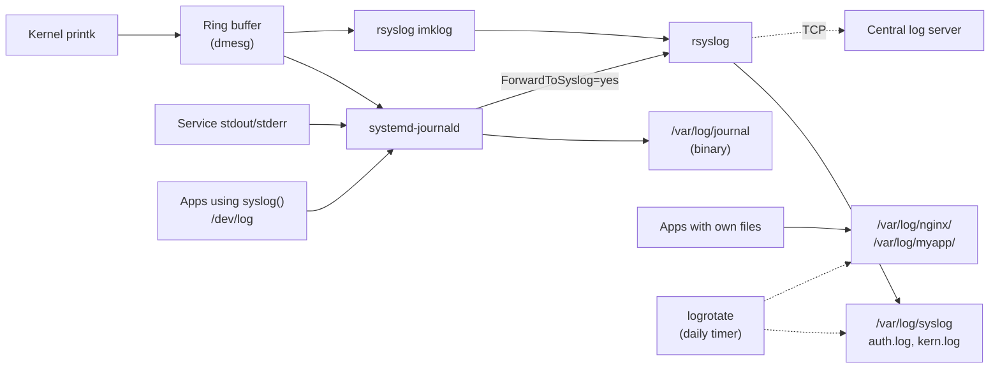
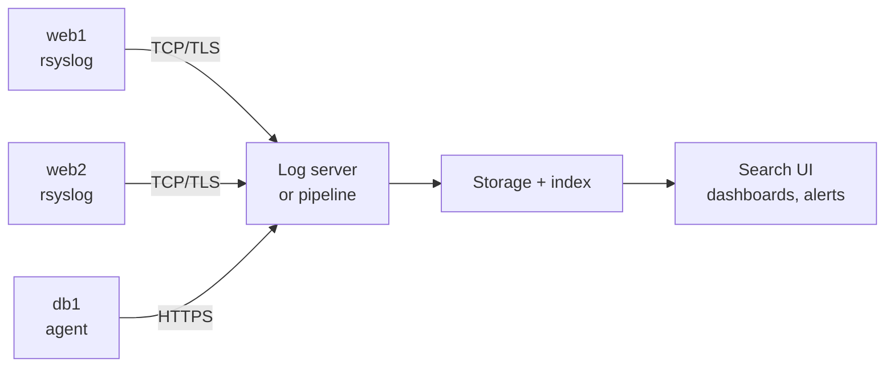
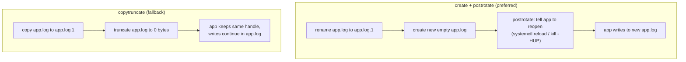

# Logging and logrotate

> **Level 4 · Chapter 9** · ⏱️ ~30 min read · Prerequisites: [systemd and journalctl](01-systemd-and-journalctl.md)

This chapter maps where every log message on a Linux system comes from and where it ends up. You will learn the syslog model of facilities and severities, configure rsyslog and journald, and master logrotate so logs never fill a disk again. You will finish by hunting failed SSH logins in `auth.log` with a pipeline.

## Why it matters

At 02:40 the on-call phone rings: the nightly ETL job on the data server has failed. Alex logs in and finds the root filesystem at 100%. `du` points to a single file, `/var/log/etl/pipeline.log`, at 38 GB. The pipeline has written a line for every row it processed since the server was built eight months ago. Nobody set up rotation.

He deletes the file, but `df` still shows the disk full. The pipeline still holds the deleted file open, so the kernel cannot free the space until that process restarts. Alex learns about open file handles, `copytruncate`, and `postrotate` the hard way.

While he is in there, he glances at `/var/log/auth.log`. It has 14,000 lines like `Failed password for root from 203.0.113.45`. A bot has been guessing SSH passwords all night.

Both problems were visible in the logs and preventable with ten lines of configuration. This chapter gives you those ten lines and the understanding behind them.

## Concepts

### The four places logs come from

A Linux system has four main logging systems, all running at once:

1. **The kernel ring buffer.** The kernel writes its own messages (hardware detected, USB plugged in, disk errors, out-of-memory kills) into a fixed-size circular buffer in memory. **Ring buffer** means that when it is full, the oldest messages are overwritten. You read it with `dmesg`. It lives in RAM and starts fresh at each boot.
2. **systemd-journald.** The **journal** is systemd's logging service. It collects kernel messages, everything services print to stdout and stderr, and messages sent through the classic syslog API. It stores them in indexed binary files under `/var/log/journal/`. You read it with `journalctl`.
3. **rsyslog.** The traditional **syslog daemon**. On Ubuntu and Mint, journald passes a copy of every message to rsyslog, which writes plain-text files like `/var/log/syslog` and `/var/log/auth.log`. rsyslog can also forward logs to another server.
4. **Application log files.** Many programs (nginx, PostgreSQL, your own scripts) open their own files under `/var/log/` and write to them directly, bypassing journald and rsyslog completely.

Why both journald *and* rsyslog? History and compatibility. journald arrived with systemd and offers fast, structured, indexed queries. Text files are what decades of tools, scripts, and admins expect (`grep`, `tail -f`, log shippers). Ubuntu keeps both, so you get both.

### How a message travels



Key details you can verify yourself:

- `/dev/log` is the socket that the C library's `syslog()` function writes to. On Mint it is owned by journald:

    ```bash
    ls -l /dev/log
    ```

    ```text
    lrwxrwxrwx 1 root root 28 Oct  2 09:35 /dev/log -> /run/systemd/journal/dev-log
    ```

- Upstream systemd turned forwarding to syslog off by default, but Ubuntu turns it back on with a vendor file:

    ```bash
    cat /usr/lib/systemd/journald.conf.d/syslog.conf
    ```

    ```text
    # Undo upstream commit 46b131574fdd7d77 for now. For details see
    #  http://lists.freedesktop.org/archives/systemd-devel/2014-November/025550.html

    [Journal]
    ForwardToSyslog=yes
    ```

- rsyslog reads kernel messages itself through its `imklog` module, which is why `kern.log` exists even though the kernel does not "know" about rsyslog.

### The syslog message model: facility and severity

Every syslog message carries two labels. The **facility** says which part of the system sent it. The **severity** (also called **priority** or **level**) says how serious it is. Together they let you route messages: "all authentication messages go to `auth.log`", "anything at error or worse also goes to the console".

| Code | Facility | Used for |
|---|---|---|
| 0 | `kern` | Kernel messages |
| 1 | `user` | Generic user programs (the default for `logger`) |
| 2 | `mail` | Mail servers |
| 3 | `daemon` | System services without their own facility |
| 4 | `auth` | Security and authentication (login, su) |
| 5 | `syslog` | rsyslog's own messages |
| 6 | `lpr` | Printing |
| 9 | `cron` | cron and at |
| 10 | `authpriv` | Private authentication messages (sshd, sudo, PAM) |
| 16–23 | `local0` to `local7` | Free for your own applications |

| Code | Severity | Keyword | Meaning | Example |
|---|---|---|---|---|
| 0 | Emergency | `emerg` | System is unusable | Kernel panic imminent |
| 1 | Alert | `alert` | Act immediately | Database corruption |
| 2 | Critical | `crit` | Critical condition | Disk controller failure |
| 3 | Error | `err` | Error | Service failed to start |
| 4 | Warning | `warning` | Something may go wrong | Disk 91% full |
| 5 | Notice | `notice` | Normal but significant | User added to sudo |
| 6 | Informational | `info` | Normal operation | Request handled |
| 7 | Debug | `debug` | Developer detail | Variable dumps |

Lower number means more serious. On the wire, the two are packed into one number, the **PRI**: `facility × 8 + severity`. A `user.warning` message is `1 × 8 + 4 = 12`, sent as `<12>` at the start of the message. journald stores them separately as `SYSLOG_FACILITY=1` and `PRIORITY=4`.

### rsyslog rules: selectors and actions

rsyslog's classic configuration is a list of rules. Each rule is a **selector** (which messages) and an **action** (what to do with them). This is Mint's `/etc/rsyslog.d/50-default.conf`, minus comments:

```text
auth,authpriv.*			/var/log/auth.log
*.*;auth,authpriv.none		-/var/log/syslog
kern.*				-/var/log/kern.log
mail.*				-/var/log/mail.log
mail.err			/var/log/mail.err
*.emerg				:omusrmsg:*
```

How to read a selector:

| Selector | Meaning |
|---|---|
| `auth,authpriv.*` | Facilities `auth` and `authpriv`, any severity |
| `*.*` | Everything |
| `auth,authpriv.none` | Exclude these facilities (combined with `;`) |
| `mail.err` | Facility `mail`, severity `err` **or more serious** |
| `mail.=err` | Exactly `err`, nothing else |
| `*.emerg` | Any facility at `emerg` |

And actions:

| Action | Meaning |
|---|---|
| `/var/log/auth.log` | Append to this file |
| `-/var/log/syslog` | Same, the `-` is a legacy hint not to flush to disk after every line |
| `:omusrmsg:*` | Print on the terminal of every logged-in user |
| `@host:514` | Forward over UDP |
| `@@host:514` | Forward over TCP |
| `stop` | Discard; do not process further rules |

So line 2 says: "everything except auth messages goes to `syslog`". That keeps passwords typed into the wrong prompt and other sensitive auth details out of the general log, which more people can read.

Modern rsyslog also understands **RainerScript**, a richer syntax with `if` statements and named parameters. You can mix both styles. RainerScript is clearer for filtering by program name:

```text
if $programname == 'myapp' then /var/log/myapp.log
& stop
```

`&` means "for the same messages as the line above". `stop` prevents them from also landing in `/var/log/syslog`.

The main file `/etc/rsyslog.conf` loads modules and global settings, then includes `/etc/rsyslog.d/*.conf`. Files there are read in alphabetical order, so a numeric prefix (`30-myapp.conf` before `50-default.conf`) controls which rule sees a message first. Note `$FileOwner syslog`, `$FileGroup adm`, and `$FileCreateMode 0640` in the main file: that is why log files belong to group `adm`, and why being in `adm` lets you read them without sudo.

### Centralized logging

On one server, local files are fine. With twenty servers, logging into each to `grep` is hopeless, and an attacker who gets root can delete local logs. **Centralized logging** ships every server's logs to one place as they are written.



Common building blocks:

- **rsyslog to rsyslog**: the simplest option. One server receives over TCP port 514 (or 6514 with TLS) and writes files per host.
- **ELK / Elastic Stack**: Elasticsearch (storage and full-text search), Logstash or Beats (collection), Kibana (web UI). Powerful and heavy.
- **Grafana Loki**: indexes only labels (host, service), not every word, so it is much cheaper to run. Agents such as Grafana Alloy or Promtail ship logs to it. You query it from Grafana.
- **Others**: Graylog, OpenSearch, Vector, Fluent Bit, and hosted services.

The concept is always the same: an agent on each machine, a transport, central storage, and a search UI.

### Structured logging

Traditional log lines are free text, written for humans:

```text
2026-10-02 09:15:03 ERROR db timeout on /api/orders after 5003 ms
```

To count errors per endpoint, you need a regular expression, and it breaks when a developer rewords the message. **Structured logging** writes each event as data, usually one **JSON** object per line (also called **JSON Lines** or NDJSON):

```json
{"ts":"2026-10-02T09:15:03Z","level":"error","msg":"db timeout","path":"/api/orders","status":500,"ms":5003}
```

Now tools can filter on fields (`level == "error"`, `ms > 1000`) without parsing text. Log pipelines like Loki and Elasticsearch index those fields directly. journald is structured internally too: every entry is a set of `KEY=value` fields.

### journald storage

journald's behaviour is set in `/etc/systemd/journald.conf` (better: a drop-in in `/etc/systemd/journald.conf.d/`). Two settings matter most:

| Setting | Values | Meaning |
|---|---|---|
| `Storage=` | `auto` (default), `persistent`, `volatile`, `none` | `auto` keeps logs on disk only if `/var/log/journal/` exists. Mint creates it, so logs survive reboots. `volatile` keeps them in RAM (`/run/log/journal`) only. |
| `SystemMaxUse=` | e.g. `500M` | Maximum disk space for journal files. Default: 10% of the filesystem, capped at 4G. |
| `SystemKeepFree=` | e.g. `2G` | Always leave this much free. Default: 15%, capped at 4G. |
| `MaxRetentionSec=` | e.g. `1month` | Delete entries older than this. |

journald rotates and cleans its own files. You never point logrotate at the journal.

### Why rotation exists, and how logrotate works

Logs only grow. **Log rotation** means periodically closing the current log file, renaming it, compressing old copies, and deleting the oldest. `app.log` becomes `app.log.1`, the old `app.log.1` becomes `app.log.2.gz`, and so on, keeping a fixed number.

**logrotate** is the tool that does this on Ubuntu and Mint. It is not a daemon. A systemd timer runs it once a day:

```bash
systemctl cat logrotate.timer | grep -A3 '\[Timer\]'
```

```text
[Timer]
OnCalendar=daily
AccuracySec=1h
Persistent=true
```

Each run, logrotate reads `/etc/logrotate.conf` (which includes every file in `/etc/logrotate.d/`), checks each log against its rules, and records when it last rotated each file in a **state file**, `/var/lib/logrotate/status`. That state file is how "weekly" works: logrotate runs daily but only rotates a weekly log if the state says it has been seven days.

#### The open file handle problem

Here is the subtle part, and the reason Alex's disk stayed full. A running program writes to a **file descriptor**, a handle to the file's **inode** (the file's identity on disk, see [Filesystems and links](../03-internals/04-filesystems-and-links.md)). The name is only used when the file is opened. So:

- If you **rename** `app.log` to `app.log.1`, the program keeps writing into `app.log.1`, because it still holds the same inode.
- If you **delete** `app.log`, the name disappears, but the inode and its disk space live on until the program closes it.

So rotation needs the program's cooperation. There are two strategies:



- **create + postrotate**: rename the file, create a fresh one, then run a script that makes the program reopen its log. Most daemons reopen logs on `SIGHUP` or `systemctl reload`. This is clean and loses nothing.
- **copytruncate**: copy the file's content, then cut the original to zero length. The program never notices. Use it only for programs that cannot reopen their logs. Two downsides: lines written between the copy and the truncate are lost, and if the program did not open the file in append mode, its next write lands at the old offset, leaving a huge run of null bytes at the start of the "empty" file.

## Commands and examples

### The kernel ring buffer: dmesg

```bash
sudo dmesg -T | tail -5
```

```text
[Fri Oct  2 09:35:12 2026] EXT4-fs (nvme0n1p2): mounted filesystem 6f2b9d1e-... r/w with ordered data mode. Quota mode: none.
[Fri Oct  2 09:35:14 2026] NET: Registered PF_QIPCRTR protocol family
[Fri Oct  2 09:41:52 2026] usb 3-2: new high-speed USB device number 5 using xhci_hcd
[Fri Oct  2 09:41:52 2026] usb-storage 3-2:1.0: USB Mass Storage device detected
[Fri Oct  2 09:41:53 2026] sd 0:0:0:0: [sda] 60437492 512-byte logical blocks: (30.9 GB/28.8 GiB)
```

Without `-T` you see seconds since boot (`[  402.118731]`). `-T` converts them to wall-clock time. Useful variations:

| Command | Purpose |
|---|---|
| `sudo dmesg -l err,warn` | Only errors and warnings |
| `sudo dmesg -w` | Follow new messages live (plug in a USB stick and watch) |
| `journalctl -k` | Kernel messages from the journal, which also covers *previous* boots with `-b -1` |

On some systems `dmesg` works without sudo; on others, `kernel.dmesg_restrict=1` requires it.

### Writing test messages with logger

`logger` sends a message to syslog, exactly like an application would. It is the best way to test rules and see where messages go:

```bash
logger -t handbook-test -p user.warning "Disk usage at 91% on /data"
```

`-t` sets the **tag** (the program name in the log), and `-p` sets `facility.severity`. Now find it in both systems:

```bash
journalctl -t handbook-test -n 1 -o short-iso
grep handbook-test /var/log/syslog | tail -1
```

```text
2026-10-02T10:39:27+00:00 mint handbook-test[130650]: Disk usage at 91% on /data
2026-10-02T10:39:27.364028+00:00 mint handbook-test: Disk usage at 91% on /data
```

Same message, two copies: one in the journal, one forwarded to rsyslog and written to the text file. Look at the hidden fields journald stored:

```bash
journalctl -t handbook-test -n 1 -o verbose
```

```text
Fri 2026-10-02 10:39:27.363550 UTC [s=7a21...;i=7e995;b=d4c8...;m=e4e065e9;t=65cd...;x=91e0...]
    _TRANSPORT=syslog
    _UID=1000
    _GID=1000
    PRIORITY=4
    SYSLOG_FACILITY=1
    SYSLOG_IDENTIFIER=handbook-test
    MESSAGE=Disk usage at 91% on /data
    _PID=130650
    _COMM=logger
    _HOSTNAME=mint
    ...
```

`PRIORITY=4` is `warning` and `SYSLOG_FACILITY=1` is `user`, exactly as requested. Fields starting with `_` are added by journald itself and cannot be faked by the sender.

`logger` can also write structured fields straight into the journal:

```bash
printf 'MESSAGE=Order export failed\nORDER_ID=8812\nSYSLOG_IDENTIFIER=shop-export\nPRIORITY=3\n' | logger --journald
journalctl ORDER_ID=8812 -o short-iso
```

```text
2026-10-02T10:43:31+00:00 mint shop-export[159291]: Order export failed
```

You just queried the journal by a custom field. That is structured logging without any extra software.

### A tour of /var/log

```bash
ls /var/log
```

```text
alternatives.log  boot.log    dpkg.log      kern.log        syslog.1
apt               btmp        faillog       lastlog         syslog.2.gz
auth.log          cups        installer     private         wtmp
auth.log.1        dmesg       journal       README          Xorg.0.log
auth.log.2.gz     dmesg.0     kern.log.1    syslog          ...
```

| File | Written by | Contains |
|---|---|---|
| `syslog` | rsyslog | Almost everything except auth. Your first stop. |
| `auth.log` | rsyslog | Logins, sudo, SSH, PAM, user/group changes |
| `kern.log` | rsyslog | Kernel messages (persistent copy of `dmesg`) |
| `dpkg.log` | dpkg | Every package installed, upgraded, removed, at low level |
| `apt/history.log` | apt | Each `apt` command: who ran it, what changed |
| `apt/term.log` | apt | The full terminal output of each `apt` run |
| `journal/` | journald | Binary journal files, read with `journalctl` |
| `wtmp`, `btmp`, `lastlog` | login, sshd | Binary login records, read with `last`, `lastb`, `lastlog` |
| `boot.log` | plymouth | Boot-time service messages |
| `Xorg.0.log` | X server | Graphical session problems |
| `ufw.log` | rsyslog | Firewall blocks, if ufw logging is on |

The numbers and `.gz` endings are logrotate at work: `.1` is the previous period, `.2.gz` the one before, compressed.

Every line in rsyslog's files has the same shape on Ubuntu 24.04 and Mint 22:

```text
2026-10-02T09:42:03.981608+00:00 mint sudo:     alex : TTY=pts/0 ; PWD=/home/alex ; USER=root ; COMMAND=/usr/bin/apt update
└─────────── timestamp ──────────┘ └host┘ └tag┘ └──────────────────────── message ─────────────────────────────┘
```

The timestamp is RFC 3339 with microseconds and time zone offset, which sorts correctly as plain text. Older releases used `Oct  2 09:42:03`, so older guides' `awk` field numbers may not match.

`dpkg.log` answers "what changed on this machine yesterday?":

```bash
grep ' install ' /var/log/dpkg.log | tail -3
```

```text
2026-10-01 14:02:11 install jq:amd64 <none> 1.7.1-3build1
2026-10-01 14:02:11 install libjq1:amd64 <none> 1.7.1-3build1
2026-10-01 14:02:11 install libonig5:amd64 <none> 6.9.9-1build1
```

`apt/history.log` adds who and why:

```text
Start-Date: 2026-10-01  14:02:09
Commandline: apt install jq
Requested-By: alex (1000)
Install: jq:amd64 (1.7.1-3build1), libjq1:amd64 (1.7.1-3build1, automatic), libonig5:amd64 (6.9.9-1build1, automatic)
End-Date: 2026-10-01  14:02:12
```

### Sending an app's syslog messages to its own file

!!! danger "⚠️ VM only"
    Changing rsyslog configuration and restarting it affects every log on the system. A typo can stop logging. Practice in your VM.

Create `/etc/rsyslog.d/30-myapp.conf`:

```bash
sudo tee /etc/rsyslog.d/30-myapp.conf >/dev/null <<'EOF'
# Messages tagged "myapp" go to their own file, and not to /var/log/syslog
if $programname == 'myapp' then /var/log/myapp.log
& stop
EOF
```

Validate the whole configuration before restarting. `-N1` means "check the config, level 1, and exit":

```bash
sudo rsyslogd -N1
```

```text
rsyslogd: version 8.2312.0, config validation run (level 1), master config /etc/rsyslog.conf
rsyslogd: End of config validation run. Bye.
```

Apply and test:

```bash
sudo systemctl restart rsyslog
logger -t myapp "payment batch 42 complete"
tail -1 /var/log/myapp.log
grep -c 'payment batch 42' /var/log/syslog
```

```text
2026-10-02T11:52:10.118237+00:00 mint myapp: payment batch 42 complete
0
```

The message reached `myapp.log` and, thanks to `stop`, not `syslog`. The `30-` prefix makes this rule run before `50-default.conf`. Named `60-myapp.conf`, the message would already be in `syslog` before your rule ran.

### Forwarding to a remote server (concept)

On each client, a drop-in such as `/etc/rsyslog.d/90-forward.conf` sends a copy of everything to a central server over TCP, with a disk-assisted queue so nothing is lost if the server is down:

```text
*.* action(type="omfwd" target="logs.example.internal" port="514" protocol="tcp"
           queue.type="LinkedList" queue.filename="fwd" queue.saveOnShutdown="on"
           action.resumeRetryCount="-1")
```

The receiving server loads the TCP input module and writes one directory per host:

```text
module(load="imtcp")
input(type="imtcp" port="514")
template(name="PerHost" type="string" string="/var/log/remote/%HOSTNAME%/syslog.log")
*.* ?PerHost
```

In production, use TLS on port 6514 so logs (which often contain usernames and IP addresses) are not sent in plain text, and open the port only to your own servers in the firewall (see [Firewalls with ufw](04-firewall-ufw.md)). The older one-line form `*.* @@logs.example.internal:514` does the same forwarding without the queue.

### journald: size and retention

Check how much space the journal uses (safe):

```bash
journalctl --disk-usage
```

```text
Archived and active journals take up 441.5M in the file system.
```

Free space right now by deleting archived files:

```bash
sudo journalctl --vacuum-size=200M
sudo journalctl --vacuum-time=2weeks
```

```text
Vacuuming done, freed 0B of archived journals from /run/log/journal.
Deleted archived journal /var/log/journal/3b1f.../system@...-0000000000001-0005f3a1c2b4e8d0.journal (64.0M).
...
Vacuuming done, freed 240.2M of archived journals from /var/log/journal/3b1f....
```

!!! danger "⚠️ VM only"
    The next block changes how the system keeps logs. Practice it in your VM.

To set a permanent limit, use a drop-in instead of editing the main file, so package upgrades never conflict with your change:

```bash
sudo mkdir -p /etc/systemd/journald.conf.d
sudo tee /etc/systemd/journald.conf.d/50-size.conf >/dev/null <<'EOF'
[Journal]
Storage=persistent
SystemMaxUse=500M
MaxRetentionSec=1month
EOF
sudo systemctl restart systemd-journald
```

`Storage=persistent` makes sure logs survive reboots even if `/var/log/journal` is missing. On a small cloud VM with a 10 GB disk, the default 10% is 1 GB, so a lower cap like this is common.

### logrotate: reading the configuration

The main file sets defaults and includes the package snippets:

```bash
grep -v '^#' /etc/logrotate.conf | grep -v '^$'
```

```text
weekly
su root adm
rotate 4
create
include /etc/logrotate.d
```

Defaults: rotate weekly, run as user `root` and group `adm`, keep 4 old copies, and create a fresh empty file after rotating. Compression is commented out globally, so each snippet decides for itself.

Each package drops its own rules in `/etc/logrotate.d/`:

```bash
ls /etc/logrotate.d
```

```text
alternatives  apt  bootlog  btmp  cups-daemon  dpkg  rsyslog  ufw  wtmp  ...
```

The rsyslog snippet covers its files:

```bash
cat /etc/logrotate.d/rsyslog
```

```text
/var/log/syslog
/var/log/mail.log
/var/log/kern.log
/var/log/auth.log
/var/log/user.log
/var/log/cron.log
{
	rotate 4
	weekly
	missingok
	notifempty
	compress
	delaycompress
	sharedscripts
	postrotate
		/usr/lib/rsyslog/rsyslog-rotate
	endscript
}
```

And the `postrotate` script it calls:

```bash
cat /usr/lib/rsyslog/rsyslog-rotate
```

```text
#!/bin/sh

if [ -d /run/systemd/system ]; then
    systemctl kill -s HUP rsyslog.service
fi
```

That is the create + postrotate strategy: logrotate renames the files, then sends `SIGHUP` to rsyslog, which closes its old file handles and opens fresh `syslog`, `auth.log`, and so on. `sharedscripts` makes the script run once for all six files rather than six times.

### logrotate directives

| Directive | What it does | Why you would want it |
|---|---|---|
| `daily` / `weekly` / `monthly` / `yearly` | How often to rotate | Match how fast the log grows |
| `size 100M` | Rotate when bigger than 100M, *ignoring* time | For bursty logs |
| `maxsize 100M` | Rotate on schedule *or* when bigger than 100M | Time-based, with a safety valve |
| `rotate 7` | Keep 7 old copies, delete older | Controls total disk use |
| `maxage 30` | Delete rotated copies older than 30 days | Retention policy in days |
| `compress` | gzip old copies | Text logs shrink 10–20× |
| `delaycompress` | Leave the newest old copy (`.1`) uncompressed until next time | Programs that write one last line after rotation; easy `less` on yesterday's log |
| `missingok` | No error if the log does not exist | Optional logs |
| `notifempty` | Do not rotate an empty log | Avoid piles of empty `.gz` files |
| `create 0640 myapp adm` | After renaming, create a new file with this mode and owner | The app can write to it and `adm` can read it |
| `copytruncate` | Copy then truncate instead of rename | Only for apps that cannot reopen logs |
| `postrotate` ... `endscript` | Shell commands run after rotating | Tell the app to reopen its log |
| `prerotate` ... `endscript` | Shell commands run before rotating | Rarely needed |
| `sharedscripts` | Run the scripts once per block, not once per file | When a pattern matches many files |
| `dateext` | Name old copies `app.log-20261002` instead of `app.log.1` | Easier to find a date; names never change |
| `su myapp adm` | Rotate as this user and group | Required when the log directory is writable by a non-root user |
| `olddir /var/log/myapp/archive` | Move old copies into another directory | Keep the live directory tidy |

### Testing logrotate safely

**Debug mode** (`-d`) prints what logrotate *would* do and changes nothing. It implies verbose. Any user can run it against a config file, as long as they give it a private **state file** with `-s` so the system's state file is untouched:

```bash
logrotate -d -s /tmp/lr-test.state /etc/logrotate.d/dpkg
```

```text
warning: logrotate in debug mode does nothing except printing debug messages!  Consider using verbose mode (-v) instead if this is not what you want.

reading config file /etc/logrotate.d/dpkg
Reading state from file: /tmp/lr-test.state
state file /tmp/lr-test.state does not exist
Allocating hash table for state file, size 64 entries

Handling 1 logs

rotating pattern: /var/log/dpkg.log  monthly (12 rotations)
empty log files are not rotated, old logs are removed
considering log /var/log/dpkg.log
Creating new state
  Now: 2026-10-02 10:39
  Last rotated at 2026-10-02 10:00
  log does not need rotating (log has already been rotated)
```

!!! warning "Common mistake: trusting the first dry run"
    With a brand-new state file, logrotate records "last rotated: now" for every log it has never seen and decides nothing needs rotating. That is the `log has already been rotated` line above. To see a real rotation in a test, add `-f` (force), or test against the real state with `sudo logrotate -d /etc/logrotate.conf`.

The real thing, system-wide, with verbose output:

```bash
sudo logrotate -v /etc/logrotate.conf
```

Force one config to rotate now, even if it is not due (useful right after writing a new config):

```bash
sudo logrotate -vf /etc/logrotate.d/myapp
```

### Writing a logrotate config for your own app

Say your app runs as user `myapp` under systemd, writes to `/var/log/myapp/app.log`, and reopens its log file on `systemctl reload myapp` (many apps do, or you can make yours handle `SIGHUP`).

!!! danger "⚠️ VM only"
    This block creates system users, directories in `/var/log`, and logrotate rules. Practice in your VM.

Set up the directory so the app can write and the `adm` group can read:

```bash
sudo useradd -r -s /usr/sbin/nologin myapp
sudo install -d -o myapp -g adm -m 0750 /var/log/myapp
```

Write `/etc/logrotate.d/myapp`:

```text
/var/log/myapp/*.log {
    daily
    rotate 14
    maxsize 200M
    missingok
    notifempty
    compress
    delaycompress
    dateext
    create 0640 myapp adm
    su myapp adm
    sharedscripts
    postrotate
        systemctl reload myapp.service >/dev/null 2>&1 || true
    endscript
}
```

Line by line:

- `daily`, `rotate 14`: two weeks of history.
- `maxsize 200M`: if a bug floods the log, rotate early instead of waiting for midnight. (logrotate itself only runs once a day from the timer. For a true size cap, run it more often, for example with an hourly timer.)
- `compress`, `delaycompress`: yesterday's log stays readable as plain text; older ones are gzipped.
- `dateext`: old copies are named like `app.log-20261002`.
- `create 0640 myapp adm`: the new file is writable by the app and readable by admins.
- `su myapp adm`: do the renaming and creating as `myapp`, not as root. The directory belongs to `myapp`, so if the app were ever compromised, an attacker could swap a log for a symlink to, say, `/etc/shadow` and trick a root logrotate into rewriting that file. Rotating as the directory's owner removes the risk. Mint's `logrotate.conf` sets `su root adm` globally, so you only see the safety check fire with standalone configs. When root rotates in a directory that is writable by a non-root group or by everyone, and no `su` applies, logrotate refuses:

    ```text
    error: skipping "/var/log/myapp/app.log" because parent directory has insecure permissions (It's world writable or writable by group which is not "root") Set "su" directive in config file to tell logrotate which user/group should be used for rotation.
    ```

- `postrotate`: tell the app to reopen its log. The `|| true` keeps a stopped service from making logrotate report an error.

If your app cannot reopen its log, replace `create`, `sharedscripts`, and the `postrotate` block with `copytruncate`, and accept that a few lines may be lost at each rotation.

Test it:

```bash
sudo logrotate -d /etc/logrotate.d/myapp
sudo logrotate -vf /etc/logrotate.d/myapp
ls -l /var/log/myapp
```

```text
-rw-r----- 1 myapp adm      0 Oct  2 12:10 app.log
-rw-r----- 1 myapp adm 482113 Oct  2 12:09 app.log-20261002
```

!!! tip "If your app logs to stdout under systemd"
    A service that simply prints to stdout and lets systemd capture it needs no logrotate at all. The journal handles storage, rotation, and retention. This is often the simplest design for new services you write.

### Structured logs with jq

**jq** is a command-line JSON processor (`sudo apt install jq`). Given a JSON Lines file `app.jsonl`:

```json
{"ts":"2026-10-02T09:15:02Z","level":"info","msg":"request done","path":"/api/orders","status":200,"ms":41}
{"ts":"2026-10-02T09:15:03Z","level":"error","msg":"db timeout","path":"/api/orders","status":500,"ms":5003}
{"ts":"2026-10-02T09:15:04Z","level":"info","msg":"request done","path":"/health","status":200,"ms":2}
```

Show only errors, and only three fields:

```bash
jq -c 'select(.level == "error") | {ts, path, ms}' app.jsonl
```

```text
{"ts":"2026-10-02T09:15:03Z","path":"/api/orders","ms":5003}
```

Find slow requests:

```bash
jq -r 'select(.ms > 1000) | "\(.ts) \(.path) \(.ms)ms"' app.jsonl
```

```text
2026-10-02T09:15:03Z /api/orders 5003ms
```

The journal speaks JSON too, so the same tools work on it:

```bash
journalctl -t handbook-test -n 1 -o json | jq '{MESSAGE, PRIORITY, _PID}'
```

```text
{
  "MESSAGE": "Disk usage at 91% on /data",
  "PRIORITY": "4",
  "_PID": "130650"
}
```

### Hunting failed SSH logins in auth.log

When `sshd` rejects a login, it writes lines like these to `/var/log/auth.log` (IP addresses here are from documentation ranges):

```text
2026-10-02T03:14:07.118230+00:00 mint sshd[4120]: Invalid user admin from 203.0.113.45 port 51234
2026-10-02T03:14:09.502114+00:00 mint sshd[4120]: Failed password for invalid user admin from 203.0.113.45 port 51234 ssh2
2026-10-02T03:15:22.007812+00:00 mint sshd[4133]: Failed password for root from 203.0.113.45 port 51302 ssh2
2026-10-02T04:02:10.330561+00:00 mint sshd[4410]: Failed password for root from 192.0.2.88 port 33910 ssh2
2026-10-02T08:31:02.448129+00:00 mint sshd[5012]: Accepted publickey for alex from 192.168.1.20 port 50522 ssh2: ED25519 SHA256:3qV0...
```

`Invalid user` means the username does not exist. `Failed password for root` means it exists and the password was wrong. `Accepted` is a successful login. Being in group `adm` lets you read `auth.log` without sudo.

How many failures in total?

```bash
grep -c 'Failed password' /var/log/auth.log
```

```text
9
```

Which IP addresses are attacking, most active first? The IP is the word after `from`, so let `awk` find it rather than counting fields, because `invalid user` shifts the positions:

```bash
grep 'Failed password' /var/log/auth.log \
  | awk '{for (i = 1; i <= NF; i++) if ($i == "from") print $(i+1)}' \
  | sort | uniq -c | sort -rn
```

```text
      4 203.0.113.45
      3 192.0.2.88
      1 198.51.100.7
      1 192.168.1.20
```

Step by step: `grep` keeps the failure lines, `awk` prints the field after `from`, `sort` groups identical IPs together, `uniq -c` counts each group, and `sort -rn` puts the biggest number first.

Which usernames are they guessing?

```bash
grep 'Failed password' /var/log/auth.log \
  | sed -E 's/.*Failed password for (invalid user )?([^ ]+) from.*/\2/' \
  | sort | uniq -c | sort -rn
```

```text
      5 root
      1 test
      1 oracle
      1 alex
      1 admin
```

The `sed` expression captures the name whether or not `invalid user` appears. Attempts on `root` are why you disable root login over SSH. The one failure for `alex` from the local network is probably a typo, followed by success.

Failures per hour, using the first 13 characters of the timestamp (`2026-10-02T03`):

```bash
grep 'Failed password' /var/log/auth.log | cut -c1-13 | uniq -c
```

```text
      4 2026-10-02T03
      4 2026-10-02T04
      1 2026-10-02T09
```

Successful logins, so you can check they were all expected:

```bash
grep -E 'Accepted (password|publickey)' /var/log/auth.log | awk '{print $1, $5, $7, $9}'
```

```text
2026-10-02T08:31:02.448129+00:00 publickey alex 192.168.1.20
2026-10-02T09:12:49.110453+00:00 password alex 192.168.1.20
```

The same data lives in the journal. On Ubuntu 24.04 and Mint 22 the SSH service unit is `ssh`, and the journal can also search rotated history in one go:

```bash
journalctl -u ssh --since "24 hours ago" | grep 'Failed password' | wc -l
```

To search rotated text logs too, include the compressed ones with `zgrep`:

```bash
zgrep -h 'Failed password' /var/log/auth.log* | wc -l
```

What to do with the answer: use SSH keys only and disable password login and root login (see [SSH](05-ssh.md)), limit who can reach port 22 with the firewall (see [Firewalls with ufw](04-firewall-ufw.md)), and consider `fail2ban`, a service that watches this same log and bans IPs automatically.

## Exercises

### Exercise 1: Follow one message (easy)

Safe on your main machine. Send a message with tag `exercise1`, facility `local0`, and severity `err`. Find it in the journal and in `/var/log/syslog`. Then use `journalctl -o verbose` to confirm the stored facility and priority numbers, and compute the PRI value by hand.

??? success "Solution"

    ```bash
    logger -t exercise1 -p local0.err "nightly export failed: 3 rows rejected"
    journalctl -t exercise1 -n 1 -o short-iso
    grep exercise1 /var/log/syslog | tail -1
    journalctl -t exercise1 -n 1 -o verbose | grep -E 'PRIORITY|FACILITY'
    ```

    ```text
    2026-10-02T12:20:44+00:00 mint exercise1[20311]: nightly export failed: 3 rows rejected
    2026-10-02T12:20:44.512930+00:00 mint exercise1: nightly export failed: 3 rows rejected
        PRIORITY=3
        SYSLOG_FACILITY=16
    ```

    `local0` is facility 16 and `err` is severity 3, so PRI = 16 × 8 + 3 = **131**. The message is in `syslog` because rule `*.*;auth,authpriv.none` matches everything that is not auth.

### Exercise 2: Answer questions from /var/log (easy)

Safe on your main machine. Using only files in `/var/log`:

1. When was the last package installed, and what was it?
2. Who ran the last `apt` command, and what was the command line?
3. How many times was `sudo` used in the current `auth.log`?
4. How big is the journal?

??? success "Solution"

    ```bash
    grep ' install ' /var/log/dpkg.log | tail -1
    grep -E '^(Commandline|Requested-By)' /var/log/apt/history.log | tail -2
    grep -c 'sudo: .*COMMAND=' /var/log/auth.log
    journalctl --disk-usage
    ```

    `dpkg.log` gives the timestamp and package. `history.log` has `Commandline:` and `Requested-By:` lines for each run (`Requested-By` is missing when the run was automatic, for example unattended upgrades). Each `sudo` use logs one line containing `COMMAND=`. If `grep` says permission denied, check that you are in group `adm` with `id`.

### Exercise 3: Rotate your own logs without root (medium)

Safe on your main machine. In `~/lr-lab/logs/`, create `pipeline.log` with 1,000 lines. Write a logrotate config `~/lr-lab/pipeline.conf` that rotates daily, keeps 3 copies, compresses with `delaycompress`, and skips empty files. Run it as your own user with a private state file, forcing rotation three times (adding lines between runs). Explain the resulting file list.

??? success "Solution"

    ```bash
    mkdir -p ~/lr-lab/logs && cd ~/lr-lab
    seq 1 1000 | sed 's/^/INFO processed row /' > logs/pipeline.log
    cat > pipeline.conf <<EOF
    $HOME/lr-lab/logs/*.log {
        daily
        rotate 3
        missingok
        notifempty
        compress
        delaycompress
        create 0640
    }
    EOF
    for run in 1 2 3; do
        logrotate -f -s ~/lr-lab/state pipeline.conf
        seq 1 500 | sed "s/^/INFO run $run row /" >> logs/pipeline.log
    done
    ls -l logs
    ```

    ```text
    -rw-r----- 1 alex alex 9392 Oct  2 12:31 pipeline.log
    -rw-r----- 1 alex alex 9392 Oct  2 12:31 pipeline.log.1
    -rw-r----- 1 alex alex 1076 Oct  2 12:31 pipeline.log.2.gz
    -rw-rw-r-- 1 alex alex 2405 Oct  2 12:31 pipeline.log.3.gz
    ```

    `pipeline.log` is the live file with run 3's lines. `.1` is the most recent rotation, uncompressed because of `delaycompress`. `.2.gz` and `.3.gz` are older and compressed. A fourth forced run would delete the oldest, because `rotate 3`. The heredoc uses `EOF` without quotes so `$HOME` expands to an absolute path, which logrotate requires. Logrotate needs no root here because you own the files and the state file. Clean up with `rm -r ~/lr-lab`.

### Exercise 4: A complete logging setup for an app (medium)

!!! danger "⚠️ VM only"
    Run this exercise in your throwaway VM. It changes rsyslog and logrotate configuration.

Make all syslog messages tagged `etl` go only to `/var/log/etl/etl.log` (owner `syslog`, group `adm`), and not to `/var/log/syslog`. Then write a logrotate config that keeps 7 daily, compressed copies and makes rsyslog reopen the file afterwards. Test with `logger` and a forced rotation.

??? success "Solution"

    ```bash
    sudo install -d -o syslog -g adm -m 0750 /var/log/etl
    sudo tee /etc/rsyslog.d/30-etl.conf >/dev/null <<'EOF'
    if $programname == 'etl' then /var/log/etl/etl.log
    & stop
    EOF
    sudo rsyslogd -N1 && sudo systemctl restart rsyslog
    logger -t etl "load started"
    sudo tail -1 /var/log/etl/etl.log
    ```

    `/etc/logrotate.d/etl`:

    ```text
    /var/log/etl/etl.log {
        daily
        rotate 7
        missingok
        notifempty
        compress
        delaycompress
        create 0640 syslog adm
        su syslog adm
        postrotate
            /usr/lib/rsyslog/rsyslog-rotate
        endscript
    }
    ```

    ```bash
    sudo logrotate -vf /etc/logrotate.d/etl
    logger -t etl "load finished"
    sudo ls -l /var/log/etl
    sudo tail -1 /var/log/etl/etl.log
    ```

    ```text
    -rw-r----- 1 syslog adm  62 Oct  2 12:45 etl.log
    -rw-r----- 1 syslog adm  61 Oct  2 12:44 etl.log.1
    2026-10-02T12:45:02.004178+00:00 mint etl: load finished
    ```

    The new message landed in the fresh `etl.log`, which proves rsyslog reopened its file after the `HUP`. Without the `postrotate`, rsyslog would have kept writing into `etl.log.1`. The `su syslog adm` line makes logrotate work as the directory's owner rather than as root.

### Exercise 5: An SSH attack report script (hard)

Write a script `ssh-report.sh` that takes a log file as an argument (default `/var/log/auth.log`) and prints: total failed passwords, the top 5 attacking IPs, the top 5 usernames tried, and all successful logins. It should also accept compressed rotated files (`auth.log.2.gz`). Test it on a sample file you build from the lines in this chapter, so it works even if your machine has never been attacked.

??? success "Solution"

    ```bash
    #!/usr/bin/env bash
    set -euo pipefail

    log="${1:-/var/log/auth.log}"

    # zcat -f prints plain files as-is and decompresses .gz files
    read_log() { zcat -f -- "$log"; }

    echo "== Report for $log"
    echo "Failed passwords: $(read_log | grep -c 'Failed password' || true)"

    echo
    echo "== Top 5 source IPs"
    read_log | grep 'Failed password' \
      | awk '{for (i = 1; i <= NF; i++) if ($i == "from") print $(i+1)}' \
      | sort | uniq -c | sort -rn | head -5

    echo
    echo "== Top 5 usernames tried"
    read_log | grep 'Failed password' \
      | sed -E 's/.*Failed password for (invalid user )?([^ ]+) from.*/\2/' \
      | sort | uniq -c | sort -rn | head -5

    echo
    echo "== Successful logins"
    read_log | grep -E 'Accepted (password|publickey)' \
      | awk '{print $1, $5, $7, $9}' || true
    ```

    Build a test file by pasting the sample `sshd` lines from this chapter into `sample-auth.log`, then:

    ```bash
    chmod +x ssh-report.sh
    ./ssh-report.sh sample-auth.log
    gzip -k sample-auth.log && ./ssh-report.sh sample-auth.log.gz
    ```

    ```text
    == Report for sample-auth.log
    Failed passwords: 9

    == Top 5 source IPs
          4 203.0.113.45
          3 192.0.2.88
          1 198.51.100.7
          1 192.168.1.20
    ...
    ```

    `|| true` matters under `set -e`: `grep -c` exits with code 1 when it finds nothing, which would otherwise kill the script on a clean log. `zcat -f` handles plain and gzipped files with one code path. Run `shellcheck ssh-report.sh` to confirm it is clean.

## Check yourself

1. Name the four sources of logs on a Mint system and the tool you read each with.

    ??? note "Answer"

        The kernel ring buffer (`dmesg` or `journalctl -k`), the systemd journal (`journalctl`), rsyslog's text files in `/var/log` (`less`, `grep`, `tail -f`), and application log files that programs write themselves (also `less`, `grep`).

2. What do the selector `mail.err` and the selector `mail.=err` match?

    ??? note "Answer"

        `mail.err` matches facility `mail` at severity `err` or anything more serious (`crit`, `alert`, `emerg`). `mail.=err` matches only severity `err` exactly.

3. Why does `/var/log/syslog` not contain sudo and SSH login messages?

    ??? note "Answer"

        The default rule is `*.*;auth,authpriv.none -/var/log/syslog`, which excludes the `auth` and `authpriv` facilities. They go to `/var/log/auth.log` instead, keeping sensitive authentication details out of the general log.

4. You deleted a 38 GB log file but `df` still shows the disk as full. Why, and how do you fix it?

    ??? note "Answer"

        A running process still has the file open. Deleting removes only the name; the inode and its blocks are freed when the last open handle closes. Restart or reload the process (or find it with `sudo lsof +L1`). Next time, empty the file with `: > file` (truncate) instead of deleting it, and set up logrotate.

5. When would you use `copytruncate` instead of `create` with a `postrotate` script, and what is the risk?

    ??? note "Answer"

        Use `copytruncate` only when the application cannot be told to reopen its log file. The risk is that lines written between the copy and the truncate are lost, and an app not using append mode can leave the file full of null bytes.

6. Your first `logrotate -d -s /tmp/test.state myapp.conf` says "log does not need rotating". Is your config broken?

    ??? note "Answer"

        Not necessarily. With a new state file, logrotate records every unseen log as "just rotated" and skips it. Use `-f` to force a rotation while testing, or test against the real state file with `sudo logrotate -d`.

7. What does `delaycompress` do, and why is it useful?

    ??? note "Answer"

        It keeps the most recent rotated file (`.1`) uncompressed until the next rotation, and compresses only older ones. It helps with programs that write a few last lines to the old file before reopening, and it keeps yesterday's log easy to read.

8. Why is structured (JSON) logging easier to analyze than free-text logging?

    ??? note "Answer"

        Each event is data with named fields, so tools can filter and aggregate by field (`level`, `status`, `ms`) without fragile regular expressions. Rewording a message does not break queries, and log platforms like Loki or Elasticsearch can index the fields directly.

## Key takeaways

- Logs come from the kernel ring buffer, journald, rsyslog, and applications' own files. On Mint, journald forwards to rsyslog, so most messages exist both in the journal and in `/var/log` text files.
- Every syslog message has a facility (who) and a severity (how bad). rsyslog rules route messages by them, and `logger` lets you test any rule.
- Know the key files: `syslog`, `auth.log`, `kern.log`, `dpkg.log`, `apt/history.log`, and the journal.
- journald manages its own size with `SystemMaxUse=`. Everything else needs logrotate.
- Running programs hold log files open, so rotation must either signal them to reopen (`create` + `postrotate`) or `copytruncate` as a last resort.
- Always test a logrotate config with `-d`, then force one real run with `-vf`.
- Simple pipelines (`grep`, `awk`, `sort | uniq -c | sort -rn`) turn `auth.log` into a security report in seconds.

## Next

Logs are one of the things that fill disks. Next you will learn how to make disks themselves flexible and resilient: [LVM and RAID](10-lvm-and-raid.md).
