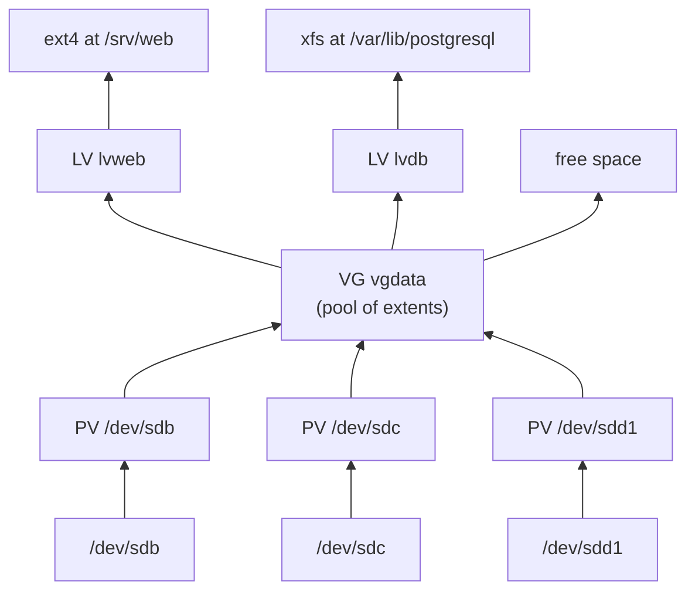
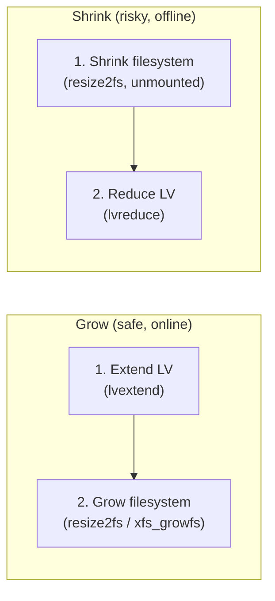
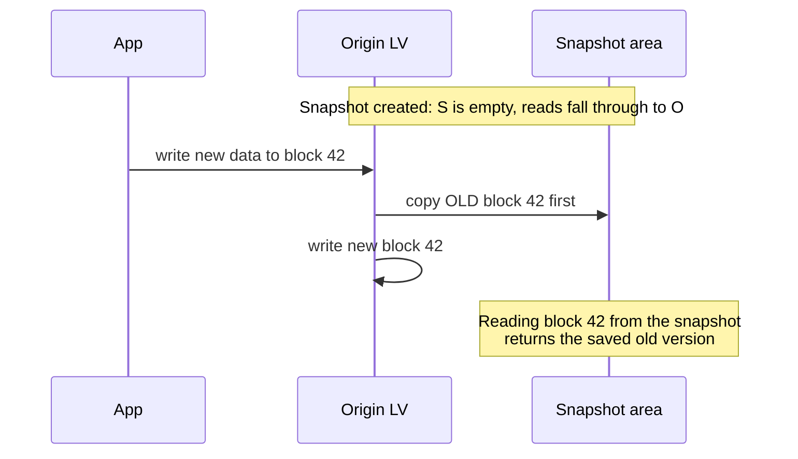
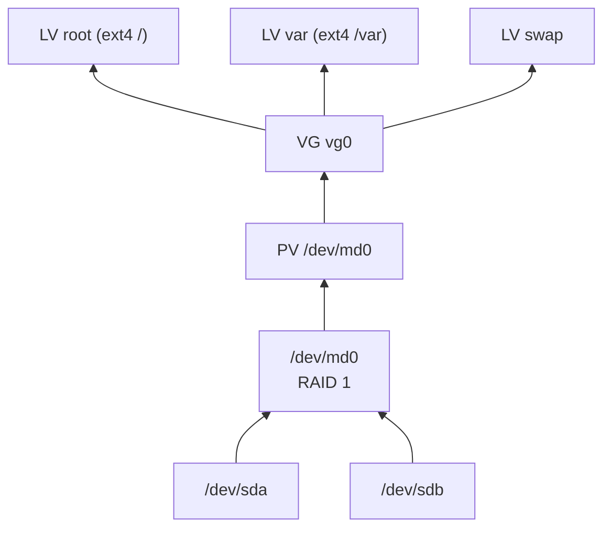

# LVM and RAID

> **Level 4 · Chapter 10** · ⏱️ ~35 min read · Prerequisites: [Disks and backups](06-disks-and-backups.md), [Filesystems and links](../03-internals/04-filesystems-and-links.md)

This chapter covers the two layers that sit between your physical disks and your filesystems on most servers. **LVM** makes storage flexible: grow volumes while they are in use, span several disks, take snapshots. **RAID** makes storage survive a dead disk. You will practise everything on loop devices, which are fake disks made from files, so you can build, break, and rebuild arrays in a VM without any spare hardware.

## Why it matters

The analytics database on Alex's server lives on `/var/lib/postgresql`, a plain 200 GB partition. One Friday it hits 100% and PostgreSQL stops accepting writes. The disk next to it has 500 GB free, but a partition cannot grow into another disk. The fix is a weekend of downtime: add a disk, create a bigger partition, copy 200 GB, change `/etc/fstab`, reboot, and hope.

His colleague's server had the same problem. She runs LVM. She added a disk, typed two commands, and the filesystem grew from 200 GB to 700 GB *while the database kept running*. It took under a minute.

Three months later, one of the colleague's disks dies at 3 AM. Her disks are in a RAID 1 mirror, so the server keeps running on the other disk and mails her a warning. She swaps the disk on Monday and the array rebuilds itself.

Then someone runs `DROP TABLE orders` by mistake. RAID faithfully mirrors the deletion to both disks within a millisecond. Only her nightly backup saves the day. That is the last lesson of this chapter: RAID protects against hardware failure, not against mistakes.

## Concepts

### The problem with plain partitions

A **partition** is a fixed, contiguous range of one physical disk, recorded in the disk's partition table (see [Disks and backups](06-disks-and-backups.md)). That makes partitions simple, but rigid:

- A partition lives on one disk. It cannot span two.
- Growing a partition only works if the space right after it is free.
- There is no built-in way to freeze a point-in-time copy for a consistent backup.

Both LVM and RAID solve this the same way: they add a layer of **virtual block devices** between the disks and the filesystem. A **block device** is anything the kernel can read and write in fixed-size blocks: a disk, a partition, a USB stick. The filesystem cannot tell whether its block device is a real disk or a virtual one stitched together from pieces of several disks.

### LVM's three layers

**LVM** (Logical Volume Manager) builds storage in three layers:



- A **physical volume (PV)** is a disk or partition that has been labelled for LVM's use. `pvcreate` writes a small header to it.
- A **volume group (VG)** is a pool made from one or more PVs. Think of it as one big virtual disk. Its size is the sum of its PVs.
- A **logical volume (LV)** is a slice of a VG. This is what you format and mount, like a partition, but you can resize it at any time, and its space can come from any PV in the group.

LVM divides every PV into equal chunks called **physical extents (PE)**, 4 MiB by default. An LV is just a list of extents, which can come from anywhere in the VG, in any order:

```text
PV /dev/loop0:  [lvweb][lvweb][lvweb] ... [lvweb]      255 extents
PV /dev/loop1:  [lvweb][lvweb][ free][ free] ... [free] 255 extents
                 \_____________________________/
                  lvweb = a list of 384 extents, spread over two PVs
```

Growing an LV means adding more extents from the free pool to its list. Nothing needs to be contiguous, and nothing needs to move.

### Device mapper: what LVM is underneath

LVM is a set of user-space tools. The real work is done by the kernel's **device mapper**, a framework that creates virtual block devices by mapping their blocks onto other block devices. When you read block 1000 of an LV, the device mapper looks up which extent that falls in and reads the right block of the right disk.

Each LV appears in two places:

- `/dev/mapper/vgdata-lvweb`, the device-mapper name (VG and LV joined by `-`; a `-` inside a name is doubled, so `ubuntu-vg` becomes `ubuntu--vg`).
- `/dev/vgdata/lvweb`, a friendlier symbolic link to the same device.

Both names work everywhere. Use either in `/etc/fstab`, or better, the filesystem UUID.

### Resizing has two layers

An LV is a block device with a filesystem on top. Growing storage means growing **both**, in the right order:



To grow, make the container bigger first, then let the filesystem expand into it. To shrink, it is the reverse: shrink the filesystem first, then cut the LV. Get the shrink order wrong and you chop off the end of a filesystem that still has data there.

`lvextend -r` (`--resizefs`) and `lvreduce -r` do both steps in the right order for you. Use them.

| Filesystem | Grow online (mounted) | Shrink |
|---|---|---|
| ext4 | Yes (`resize2fs`) | Only offline (unmounted) |
| XFS | Yes (`xfs_growfs`, takes the mount point) | **Never**. Back up, recreate, restore. |
| btrfs | Yes (`btrfs filesystem resize`) | Yes, online |

That table is why many admins create LVs smaller than they need and leave the rest of the VG free. Growing later takes seconds. Shrinking may be impossible.

### Snapshots

An **LVM snapshot** is a frozen, point-in-time view of an LV. It is created instantly, because it copies nothing at first. It uses **copy-on-write (CoW)**: when a block of the original LV is about to be overwritten, LVM first copies the old block into the snapshot's own space.



Uses:

- **Consistent backups.** Snapshot, back up the snapshot at leisure while the original keeps changing, then delete the snapshot.
- **Safe upgrades.** Snapshot, upgrade, and if it goes wrong, **merge** the snapshot back to roll the LV to its earlier state.

Limits:

- The snapshot needs space for every block that changes. If its space fills up, the snapshot becomes **invalid** and is useless. Size it for the expected changes, and watch `Data%` in `lvs`.
- Every write to the origin now costs an extra read and write, so performance drops while a snapshot exists.
- A snapshot lives in the same VG, on the same disks. It is not a backup.

### Thin provisioning

Normal LVs are **thick**: a 100 GB LV reserves 100 GB of extents immediately. **Thin provisioning** creates a **thin pool**, a special LV, and then **thin volumes** inside it that only consume pool space as data is actually written. You can create volumes whose total size exceeds the pool. That is called **overcommitting**, and it is exactly like a bank lending out more money than it holds: fine until everyone wants it at once. If the pool fills, writes to every thin volume fail.

Thin snapshots are much better than classic ones: they share the pool, need no size up front, and do not slow the origin down. Thin provisioning is common under virtual machines and containers. For a first server, thick LVs are simpler.

### RAID: three ideas

**RAID** (Redundant Array of Independent Disks) combines several disks into one block device to gain speed, survive failures, or both. All RAID levels are built from three ideas:

- **Striping**: split data into chunks and spread them across disks, so several disks work in parallel.
- **Mirroring**: write identical copies to two or more disks.
- **Parity**: store a computed value that lets you rebuild any one missing chunk. It uses **XOR** (exclusive or): if `P = A XOR B`, then `A = P XOR B` and `B = P XOR A`. Lose any one of the three, and you can recompute it from the other two.

A parity example with 4-bit values: `A = 1011`, `B = 0110`, so `P = 1101`. If the disk holding `B` dies, `A XOR P = 1011 XOR 1101 = 0110`, which is `B` again.

```text
RAID 0 (stripe)       RAID 1 (mirror)      RAID 5 (stripe + parity)    RAID 10 (stripe of mirrors)
disk1  disk2          disk1  disk2         disk1  disk2  disk3         disk1  disk2   disk3  disk4
 A1     A2              A      A            A1     A2     Ap            A1     A1      A2     A2
 B1     B2              B      B            B1     Bp     B2            B1     B1      B2     B2
 C1     C2              C      C            Cp     C1     C2            C1     C1      C2     C2
                                                                        \mirror 1/     \mirror 2/
```

In RAID 5 the parity chunk (`p`) rotates across disks, so no single disk becomes a bottleneck. RAID 6 adds a second, independent parity chunk per stripe.

### RAID levels compared

For `n` disks of size `S` each:

| Level | Min disks | Usable capacity | Survives | Read speed | Write speed | Typical use |
|---|---|---|---|---|---|---|
| RAID 0 | 2 | n × S | **No failures**: one dead disk loses everything | Fast | Fast | Scratch space, caches you can rebuild |
| RAID 1 | 2 | S | n − 1 disks | Fast | Same as one disk | Boot disks, small servers |
| RAID 5 | 3 | (n − 1) × S | 1 disk | Fast | Slower (each write updates parity) | File servers, mostly-read data |
| RAID 6 | 4 | (n − 2) × S | 2 disks | Fast | Slowest | Large arrays of big disks |
| RAID 10 | 4 | n × S / 2 | 1 per mirror pair | Fast | Fast | Databases, busy VMs |

Example with four 4 TB disks: RAID 0 gives 16 TB, RAID 5 gives 12 TB, RAID 6 and RAID 10 give 8 TB, RAID 1 (four-way mirror) gives 4 TB.

Why RAID 6 for big disks? When a RAID 5 disk dies, the rebuild must read *every* block of every other disk. With modern multi-terabyte disks that takes many hours, and a second failure or an unreadable sector during that window destroys the array. RAID 6 survives that second problem.

### Software RAID with md

Linux implements RAID in the kernel with the **md** driver (multiple devices). You manage it with **mdadm**. The arrays show up as `/dev/md0`, `/dev/md1`, and so on. **Hardware RAID** cards do the same job on a controller, but tie you to that card model. Linux software RAID is fast, portable between machines, and well understood, so it is the usual choice on Linux servers.

Key pieces:

- Each member disk gets an md **superblock**: metadata describing the array (UUID, level, member slot). This is how the kernel reassembles the array at boot, even if disk names change.
- `/proc/mdstat` shows every array's state live.
- `/etc/mdadm/mdadm.conf` lists arrays to assemble at boot, plus where to send alert emails (`MAILADDR`).
- The **initramfs** (the small early-boot filesystem loaded with the kernel) contains a copy of `mdadm.conf`, so after changing it you run `update-initramfs -u`.

When a disk fails, the array becomes **degraded**: it keeps working with reduced or no redundancy. You remove the bad disk, add a new one, and md **rebuilds** (also called **resync** or **recovery**) the missing data onto it.

### RAID is not backup

RAID protects against exactly one thing: a disk dying. It does not protect against:

- `rm -rf` or `DROP TABLE` (deleted instantly on all mirrors)
- Ransomware or a compromised account
- Filesystem corruption or an application bug writing garbage
- Fire, theft, flood, a power surge that kills every disk at once
- A RAID controller or md bug

Only **backups**, meaning separate, versioned copies on other hardware, ideally off-site, cover those. See [Disks and backups](06-disks-and-backups.md).

### Stacking layers

The layers combine. A very common server layout is RAID for redundancy, LVM on top for flexibility, then filesystems:



Ubuntu Server's installer can set this up for you, and if you choose LVM it creates `ubuntu-vg` with an `ubuntu-lv` root volume.

### Integrated alternatives: btrfs and ZFS

**btrfs** and **ZFS** merge all three layers (RAID, volume management, filesystem) into one system. Because the filesystem knows which blocks hold data, they can do things the stacked approach cannot:

- **Checksums on every block.** They detect silent corruption ("bit rot") and, with a mirror, repair it automatically from the good copy. md RAID can tell two mirrors disagree but not which one is right.
- **Cheap, instant snapshots** of any subvolume or dataset, with no performance penalty.
- **Rebuilds that copy only used data**, not every block.
- Compression, send/receive replication of snapshots to another machine.

| | md + LVM + ext4/XFS | btrfs | ZFS |
|---|---|---|---|
| In the mainline kernel | Yes | Yes | No (separate module, `zfsutils-linux` on Ubuntu) |
| Data checksums | No | Yes | Yes |
| Mature RAID levels | All | 1, 10 (RAID 5/6 still not recommended) | Mirror, RAIDZ1/2/3 |
| Snapshots | Classic CoW (slow) or thin | Native, instant | Native, instant |
| Memory use | Low | Low | Higher (likes RAM for its cache) |

The classic stack is still everywhere and is what you will meet in most jobs, so learn it first. Many people then choose ZFS for storage servers and btrfs for desktops (openSUSE and Fedora use it by default).

## Commands and examples

!!! danger "⚠️ VM only"
    Every command in this section creates, changes, or destroys block devices as root. One wrong device name (`/dev/sda` instead of `/dev/loop0`) can wipe a real disk. Do all of it in your throwaway VM, and read each device name twice before pressing Enter. Only the read-only commands (`lsblk`, `cat /proc/mdstat`, `man lvm`) are safe on your main machine.

### Building the lab: loop devices

A **loop device** (`/dev/loopN`) makes a regular file behave like a disk. Create four 1 GiB "disks" as files:

```bash
mkdir -p ~/storage-lab && cd ~/storage-lab
truncate -s 1G disk{1..4}.img
ls -lsh
```

```text
total 0
0 -rw-rw-r-- 1 alex alex 1.0G Oct  2 14:00 disk1.img
0 -rw-rw-r-- 1 alex alex 1.0G Oct  2 14:00 disk2.img
0 -rw-rw-r-- 1 alex alex 1.0G Oct  2 14:00 disk3.img
0 -rw-rw-r-- 1 alex alex 1.0G Oct  2 14:00 disk4.img
```

`truncate -s` makes **sparse files**: the size says 1.0G, but the first column (blocks actually allocated) is 0. Disk space is only used as data is written, so this lab costs almost nothing.

Attach each file to the first free loop device. `-f` finds a free one, and `--show` prints which one it used, which we store in variables:

```bash
L1=$(sudo losetup -f --show disk1.img)
L2=$(sudo losetup -f --show disk2.img)
L3=$(sudo losetup -f --show disk3.img)
L4=$(sudo losetup -f --show disk4.img)
echo "$L1 $L2 $L3 $L4"
```

```text
/dev/loop0 /dev/loop1 /dev/loop2 /dev/loop3
```

Your numbers may be higher (Ubuntu's snap packages use loop devices too). That is why the rest of this chapter uses `$L1`–`$L4`, and why the outputs below show `loop0`–`loop3`.

```bash
losetup -l
```

```text
NAME       SIZELIMIT OFFSET AUTOCLEAR RO BACK-FILE                         DIO LOG-SEC
/dev/loop0         0      0         0  0 /home/alex/storage-lab/disk1.img    0     512
/dev/loop1         0      0         0  0 /home/alex/storage-lab/disk2.img    0     512
/dev/loop2         0      0         0  0 /home/alex/storage-lab/disk3.img    0     512
/dev/loop3         0      0         0  0 /home/alex/storage-lab/disk4.img    0     512
```

!!! tip "Lost your variables?"
    Shell variables vanish when you close the terminal. Recover them with `losetup -j`, which finds the loop device attached to a file:

    ```bash
    cd ~/storage-lab
    L1=$(losetup -j disk1.img | cut -d: -f1)
    L2=$(losetup -j disk2.img | cut -d: -f1)
    L3=$(losetup -j disk3.img | cut -d: -f1)
    L4=$(losetup -j disk4.img | cut -d: -f1)
    ```

    Loop devices also disappear on reboot. Re-attach the files with the `losetup -f --show` lines above. LVM notices the devices and reactivates the volume group by itself.

### Creating PVs, a VG, and an LV

Label two disks as physical volumes:

```bash
sudo pvcreate "$L1" "$L2"
```

```text
  Physical volume "/dev/loop0" successfully created.
  Physical volume "/dev/loop1" successfully created.
```

Pool them into a volume group named `vgdata`:

```bash
sudo vgcreate vgdata "$L1" "$L2"
```

```text
  Volume group "vgdata" successfully created
```

Carve a 1 GiB logical volume named `lvweb`:

```bash
sudo lvcreate -n lvweb -L 1G vgdata
```

```text
  Logical volume "lvweb" created.
```

`-n` is the name and `-L` the size (`M`, `G`, `T` suffixes). The other way to give a size is `-l` (lowercase), in extents or percentages: `-l 100%FREE` means "all remaining space", `-l 50%VG` means "half the group".

### Inspecting LVM: the short and long reports

Each layer has a short report (`pvs`, `vgs`, `lvs`) and a long one (`pvdisplay`, `vgdisplay`, `lvdisplay`).

```bash
sudo pvs
```

```text
  PV         VG     Fmt  Attr PSize    PFree
  /dev/loop0 vgdata lvm2 a--  1020.00m       0
  /dev/loop1 vgdata lvm2 a--  1020.00m 1016.00m
```

Each 1 GiB disk gives 1020 MiB usable. LVM keeps 1 MiB for its header and metadata at the start, and the remainder that does not fill a whole 4 MiB extent is unusable. `lvweb` filled `loop0` (255 extents) and took one extent from `loop1`.

```bash
sudo vgs
```

```text
  VG     #PV #LV #SN Attr   VSize VFree
  vgdata   2   1   0 wz--n- 1.99g 1016.00m
```

`#PV`, `#LV`, `#SN` count physical volumes, logical volumes, and snapshots. In `Attr`, `w` means writable and `z` resizable.

```bash
sudo lvs -o +devices
```

```text
  LV    VG     Attr       LSize Pool Origin Data%  Meta%  Move Log Cpy%Sync Convert Devices
  lvweb vgdata -wi-a----- 1.00g                                                     /dev/loop0(0)
  lvweb vgdata -wi-a----- 1.00g                                                     /dev/loop1(0)
```

`-o +devices` adds a column showing which PVs hold the LV's extents (the number in brackets is the starting extent). In `Attr`, `w` is writable, `i` is the allocation policy (inherited), and `a` means active. Once mounted, a fifth flag `o` (open) appears.

The long form:

```bash
sudo vgdisplay vgdata
```

```text
  --- Volume group ---
  VG Name               vgdata
  System ID
  Format                lvm2
  ...
  VG Size               1.99 GiB
  PE Size               4.00 MiB
  Total PE              510
  Alloc PE / Size       256 / 1.00 GiB
  Free  PE / Size       254 / 1016.00 MiB
  VG UUID               QeL3vF-2mXk-9TqP-hR7d-Wc1N-8yUb-Kd0sJa
```

`Total PE 510` is 2 × 255 extents. On an Ubuntu Server VM installed with LVM, these commands also show `ubuntu-vg` and its `ubuntu-lv`. Leave those alone.

### Putting a filesystem on it

From here an LV behaves like any partition:

```bash
sudo mkfs.ext4 /dev/vgdata/lvweb
sudo mkdir -p /mnt/web
sudo mount /dev/vgdata/lvweb /mnt/web
```

```text
mke2fs 1.47.0 (5-Feb-2023)
Discarding device blocks: done
Creating filesystem with 262144 4k blocks and 65536 inodes
Filesystem UUID: 7d3f0c52-9a1e-4b8f-a6c4-2e5d81b9f034
Superblock backups stored on blocks:
	32768, 98304, 163840, 229376

Allocating group tables: done
Writing inode tables: done
Creating journal (8192 blocks): done
Writing superblocks and filesystem accounting information: done
```

Put some data there, and record a checksum so you can prove later that every operation kept the data intact:

```bash
sudo dd if=/dev/urandom of=/mnt/web/data.bin bs=1M count=200 status=none
echo "customer list v1" | sudo tee /mnt/web/hello.txt >/dev/null
sudo sha256sum /mnt/web/data.bin | tee ~/storage-lab/data.sha256
df -h /mnt/web
```

```text
4c1b6e8f0a9d27e3b5c4f81a6d2e09b7c3a5f8e1d4b62a9c7e0f3b8d5a1c6e2f  /mnt/web/data.bin
Filesystem                Size  Used Avail Use% Mounted on
/dev/mapper/vgdata-lvweb  974M  201M  722M  22% /mnt/web
```

`df` shows the device-mapper name. A 1 GiB LV gives 974M of usable filesystem, because ext4 reserves room for inode tables and its journal.

```bash
lsblk "$L1" "$L2"
```

```text
NAME             MAJ:MIN RM  SIZE RO TYPE MOUNTPOINTS
loop0              7:0    0    1G  0 loop
└─vgdata-lvweb   252:0    0    1G  0 lvm  /mnt/web
loop1              7:1    0    1G  0 loop
└─vgdata-lvweb   252:0    0    1G  0 lvm  /mnt/web
```

`lsblk` shows the LV under both disks it uses. Major number 252 is the device mapper.

For a permanent mount, add a line to `/etc/fstab` using the filesystem UUID from `sudo blkid /dev/vgdata/lvweb`. For this lab, skip it: loop devices do not exist at early boot, and a missing fstab entry can stop the VM from booting.

### Growing an LV online

The filesystem is mounted, and you can even have a shell `cd`'d into it. Add 512 MiB and grow ext4 in one step:

```bash
sudo lvextend -r -L +512M vgdata/lvweb
```

```text
  Size of logical volume vgdata/lvweb changed from 1.00 GiB (256 extents) to 1.50 GiB (384 extents).
  Logical volume vgdata/lvweb successfully resized.
resize2fs 1.47.0 (5-Feb-2023)
Filesystem at /dev/mapper/vgdata-lvweb is mounted on /mnt/web; on-line resizing required
old_desc_blocks = 1, new_desc_blocks = 1
The filesystem on /dev/mapper/vgdata-lvweb is now 393216 (4k) blocks long.
```

The first two lines are LVM growing the block device (from 256 to 384 extents). The rest is `resize2fs`, which `-r` called for you, growing ext4 into the new space while mounted.

```bash
df -h /mnt/web
```

```text
Filesystem                Size  Used Avail Use% Mounted on
/dev/mapper/vgdata-lvweb  1.5G  201M  1.2G  15% /mnt/web
```

Size forms for `lvextend`:

| Option | Meaning |
|---|---|
| `-L 3G` | Make it exactly 3 GiB |
| `-L +512M` | Add 512 MiB |
| `-l +100%FREE` | Add all free space in the VG |
| `-l +50%FREE` | Add half the free space |

Without `-r`, you grow the filesystem yourself afterwards:

=== "ext4"

    ```bash
    sudo lvextend -L +512M vgdata/lvweb
    sudo resize2fs /dev/vgdata/lvweb
    ```

    `resize2fs` takes the **device**. With no size, it grows to fill the device.

=== "XFS"

    ```bash
    sudo lvextend -L +512M vgdata/lvdb
    sudo xfs_growfs /var/lib/postgresql
    ```

    `xfs_growfs` takes the **mount point**, and XFS can only be grown while mounted. (`xfsprogs` is installed on Mint. On minimal systems, install it with `sudo apt install xfsprogs`.)

!!! warning "Common mistake: extending the LV but not the filesystem"
    `lvextend` without `-r` makes the block device bigger, but `df` still shows the old size, because the filesystem has not been told. Run `resize2fs` or `xfs_growfs`, or just always use `-r`.

### Adding a disk to the volume group

The VG has only 504 MiB left. Add a third disk:

```bash
sudo pvcreate "$L3"
sudo vgextend vgdata "$L3"
sudo vgs
```

```text
  Physical volume "/dev/loop2" successfully created.
  Volume group "vgdata" successfully extended
  VG     #PV #LV #SN Attr   VSize  VFree
  vgdata   3   1   0 wz--n- <2.99g <1.49g
```

The `<` means "slightly less than", because LVM rounded the number up for display (765 extents is 2.988 GiB). The VG grew instantly, and the LV can now grow into the new disk. In real life, this is the moment Alex's colleague typed `lvextend -r -l +100%FREE` and went back to her coffee.

### Snapshots: backup and rollback

Take a 256 MiB snapshot of `lvweb`:

```bash
sudo lvcreate -s -n websnap -L 256M vgdata/lvweb
sudo lvs
```

```text
  Logical volume "websnap" created.
  LV      VG     Attr       LSize   Pool Origin Data%  Meta%  Move Log Cpy%Sync Convert
  lvweb   vgdata owi-aos---   1.50g
  websnap vgdata swi-a-s--- 256.00m      lvweb  0.01
```

`-s` means snapshot. The origin's attributes now start with `o` (origin) and the snapshot's with `s`. `Data%` is how full the snapshot's CoW space is. It is nearly empty, because nothing has changed yet.

Now make a "mistake" on the live filesystem:

```bash
sudo rm /mnt/web/hello.txt
sudo dd if=/dev/urandom of=/mnt/web/junk.bin bs=1M count=50 status=none
sudo lvs vgdata/websnap
```

```text
  LV      VG     Attr       LSize   Pool Origin Data%  Meta%  Move Log Cpy%Sync Convert
  websnap vgdata swi-a-s--- 256.00m      lvweb  20.03
```

`Data%` jumped to about 20%: the 50 MiB of overwritten blocks had their old contents copied into the snapshot. Write more than 256 MiB of changes and the snapshot would become invalid.

**Recovering a single file.** Mount the snapshot read-only and copy what you need:

```bash
sudo mkdir -p /mnt/snap
sudo mount -o ro /dev/vgdata/websnap /mnt/snap
cat /mnt/snap/hello.txt
sudo umount /mnt/snap
```

```text
customer list v1
```

This is also how you take a consistent backup: snapshot, mount it read-only, `rsync` or `tar` it somewhere else, unmount, remove the snapshot.

**Rolling back the whole LV.** Merging copies the saved old blocks back, returning `lvweb` to the moment of the snapshot. The origin must not be in use, so unmount it first:

```bash
sudo umount /mnt/web
sudo lvconvert --merge vgdata/websnap
```

```text
  Merging of volume vgdata/websnap started.
  vgdata/lvweb: Merged: 100.00%
```

```bash
sudo mount /dev/vgdata/lvweb /mnt/web
ls /mnt/web
```

```text
data.bin  hello.txt  lost+found
```

`hello.txt` is back and `junk.bin` is gone. The merge consumed the snapshot, so `lvs` shows only `lvweb` again. (If you merge while the origin is mounted, LVM says the merge is delayed until the next time the LV is activated, for example at reboot.)

### Replacing a disk without downtime: pvmove

Suppose `loop0` is old and you want it out of the VG. `pvmove` moves all extents off a PV onto free space on the others, while the LV stays mounted and in use:

```bash
sudo pvmove "$L1"
```

```text
  /dev/loop0: Moved: 3.14%
  /dev/loop0: Moved: 52.94%
  /dev/loop0: Moved: 100.00%
```

Then remove it from the VG and wipe its LVM label:

```bash
sudo vgreduce vgdata "$L1"
sudo pvremove "$L1"
sudo pvs
```

```text
  Removed "/dev/loop0" from volume group "vgdata"
  Labels on physical volume "/dev/loop0" successfully wiped.
  PV         VG     Fmt  Attr PSize    PFree
  /dev/loop1 vgdata lvm2 a--  1020.00m       0
  /dev/loop2 vgdata lvm2 a--  1020.00m  504.00m
```

Check that the data survived:

```bash
sudo sha256sum -c ~/storage-lab/data.sha256
```

```text
/mnt/web/data.bin: OK
```

That is a disk migration with zero downtime. On real hardware, you would now physically remove the old disk.

### Using all remaining space

```bash
sudo lvextend -r -l +100%FREE vgdata/lvweb
```

```text
  Size of logical volume vgdata/lvweb changed from 1.50 GiB (384 extents) to 1.99 GiB (510 extents).
  Logical volume vgdata/lvweb successfully resized.
resize2fs 1.47.0 (5-Feb-2023)
Filesystem at /dev/mapper/vgdata-lvweb is mounted on /mnt/web; on-line resizing required
old_desc_blocks = 1, new_desc_blocks = 1
The filesystem on /dev/mapper/vgdata-lvweb is now 522240 (4k) blocks long.
```

### Shrinking an LV (ext4 only, offline)

Shrinking is the risky direction, so it requires an unmounted filesystem and a check. `lvreduce -r` runs `e2fsck`, shrinks ext4 with `resize2fs`, then reduces the LV, in that order:

```bash
sudo umount /mnt/web
sudo lvreduce -r -L 1G vgdata/lvweb
```

```text
fsck from util-linux 2.39.3
/dev/mapper/vgdata-lvweb: 13/131072 files (0.0% non-contiguous), 77901/522240 blocks
resize2fs 1.47.0 (5-Feb-2023)
Resizing the filesystem on /dev/mapper/vgdata-lvweb to 262144 (4k) blocks.
The filesystem on /dev/mapper/vgdata-lvweb is now 262144 (4k) blocks long.

  Size of logical volume vgdata/lvweb changed from 1.99 GiB (510 extents) to 1.00 GiB (256 extents).
  Logical volume vgdata/lvweb successfully resized.
```

Notice the order: filesystem first, then LV. If the data does not fit in the new size, `resize2fs` refuses and nothing is cut.

!!! warning "Common mistake: `lvreduce` without `-r`"
    Plain `lvreduce -L 1G` cuts the block device and leaves the filesystem believing it is still 2 GiB. Everything stored past the 1 GiB mark is destroyed. LVM warns you and asks for confirmation. Read the warning, answer `n`, and add `-r`. On XFS, do not shrink at all: back up, recreate smaller, restore.

### Thin provisioning in brief

Thin pools need the `thin-provisioning-tools` package for their metadata checks:

```bash
sudo apt install thin-provisioning-tools
sudo lvcreate --type thin-pool -L 800M -n pool vgdata
sudo lvcreate -V 2G -T vgdata/pool -n thin1
```

```text
  Logical volume "pool" created.
  WARNING: Sum of all thin volume sizes (2.00 GiB) exceeds the size of thin pool vgdata/pool (800.00 MiB).
  WARNING: You have not turned on protection against thin pools running out of space.
  WARNING: Set activation/thin_pool_autoextend_threshold below 100 to trigger automatic extension of thin pools before they get full.
  Logical volume "thin1" created.
```

`-V` is the **virtual size** the volume claims, and `-T` names the pool. LVM warns you that you overcommitted. Watch `Data%` of the pool in `lvs`, and set `thin_pool_autoextend_threshold` in `/etc/lvm/lvm.conf` so the pool grows automatically from free VG space before it fills. Remove the thin volumes before continuing:

```bash
sudo lvremove -y vgdata/thin1 vgdata/pool
```

### Tearing down the LVM lab

Undo everything from the top layer down: filesystem, LVs, VG, PVs, loop devices, files.

```bash
sudo umount /mnt/web 2>/dev/null
sudo lvremove -y vgdata
sudo vgremove vgdata
sudo pvremove "$L2" "$L3"
sudo losetup -d "$L1" "$L2" "$L3" "$L4"
rm ~/storage-lab/disk*.img ~/storage-lab/data.sha256
losetup -l
```

```text
  Logical volume "lvweb" successfully removed.
  Volume group "vgdata" successfully removed
  Labels on physical volume "/dev/loop1" successfully wiped.
  Labels on physical volume "/dev/loop2" successfully wiped.
```

An empty `losetup -l` means all loop devices are detached.

### RAID: building a RAID 5 array

Start fresh with four new disk files. Three go into a RAID 5 array, and the fourth is kept as the replacement for a "failed" disk:

```bash
cd ~/storage-lab
truncate -s 1G disk{1..4}.img
L1=$(sudo losetup -f --show disk1.img)
L2=$(sudo losetup -f --show disk2.img)
L3=$(sudo losetup -f --show disk3.img)
L4=$(sudo losetup -f --show disk4.img)
sudo mdadm --create /dev/md0 --level=5 --raid-devices=3 "$L1" "$L2" "$L3"
```

```text
mdadm: Defaulting to version 1.2 metadata
mdadm: array /dev/md0 started.
```

| Option | Meaning |
|---|---|
| `--create /dev/md0` | Name of the new array device |
| `--level=5` | RAID level: `0`, `1`, `5`, `6`, `10` |
| `--raid-devices=3` | How many active members |
| `--spare-devices=1` | Optional: extra disks kept idle, used automatically when a member fails |

The array is usable immediately, but md first builds the parity in the background. Watch it:

```bash
cat /proc/mdstat
```

```text
Personalities : [raid0] [raid1] [raid4] [raid5] [raid6] [raid10] [linear]
md0 : active raid5 loop2[3] loop1[1] loop0[0]
      2093056 blocks super 1.2 level 5, 512k chunk, algorithm 2 [3/2] [UU_]
      [======>..............]  recovery = 31.6% (331264/1046528) finish=0.1min speed=110421K/sec

unused devices: <none>
```

Line by line:

- `Personalities`: RAID levels the kernel has loaded.
- `md0 : active raid5 loop2[3] loop1[1] loop0[0]`: members with their slot numbers. During the initial build, md treats the last disk as a spare being recovered, which is why it has number 3.
- `2093056 blocks ... 512k chunk`: size in KiB (two disks' worth, about 2 GiB) and stripe chunk size.
- `[3/2] [UU_]`: 3 devices expected, 2 fully in sync. `U` means up, `_` means missing or rebuilding.
- `recovery = 31.6%`: the build progress.

Use `watch -n1 cat /proc/mdstat` to see it move. When finished, you see `[3/3] [UUU]`.

Use it like any block device:

```bash
sudo mkfs.ext4 -q /dev/md0
sudo mkdir -p /mnt/raid
sudo mount /dev/md0 /mnt/raid
sudo dd if=/dev/urandom of=/mnt/raid/data.bin bs=1M count=300 status=none
sudo sha256sum /mnt/raid/data.bin | tee ~/storage-lab/raid.sha256
```

### Inspecting an array

```bash
sudo mdadm --detail /dev/md0
```

```text
/dev/md0:
           Version : 1.2
     Creation Time : Fri Oct  2 14:05:11 2026
        Raid Level : raid5
        Array Size : 2093056 (2044.00 MiB 2143.29 MB)
     Used Dev Size : 1046528 (1022.00 MiB 1071.64 MB)
      Raid Devices : 3
     Total Devices : 3
       Persistence : Superblock is persistent

       Update Time : Fri Oct  2 14:07:40 2026
             State : clean
    Active Devices : 3
   Working Devices : 3
    Failed Devices : 0
     Spare Devices : 0

            Layout : left-symmetric
        Chunk Size : 512K

Consistency Policy : resync

              Name : mint:0  (local to host mint)
              UUID : 5c3e8a1f:2b7d4c90:e16f3a28:9d0b7e54
            Events : 18

    Number   Major   Minor   RaidDevice State
       0       7        0        0      active sync   /dev/loop0
       1       7        1        1      active sync   /dev/loop1
       3       7        2        2      active sync   /dev/loop2
```

The fields to look at first: `State` (`clean` is healthy; `degraded` means a member is missing), the device counts, and the table at the bottom. `Array Size` is two members' worth, as the RAID 5 formula `(n − 1) × S` predicts. To read the superblock of one member disk, use `sudo mdadm --examine "$L1"`.

### Failing and replacing a disk

Simulate a disk failure by marking a member faulty:

```bash
sudo mdadm /dev/md0 --fail "$L2"
cat /proc/mdstat
```

```text
mdadm: set /dev/loop1 faulty in /dev/md0
Personalities : [raid0] [raid1] [raid4] [raid5] [raid6] [raid10] [linear]
md0 : active raid5 loop2[3] loop1[1](F) loop0[0]
      2093056 blocks super 1.2 level 5, 512k chunk, algorithm 2 [3/2] [U_U]

unused devices: <none>
```

`(F)` marks the failed member, and `[U_U]` shows the hole. The array is **degraded** but still works. Prove it:

```bash
sudo sha256sum -c ~/storage-lab/raid.sha256
```

```text
/mnt/raid/data.bin: OK
```

Every read of a block that lived on the dead disk is being recomputed from the other data and the parity, on the fly. One more failure now would destroy the array, so replace the disk quickly. Remove the failed member and add the new one:

```bash
sudo mdadm /dev/md0 --remove "$L2"
sudo mdadm /dev/md0 --add "$L4"
cat /proc/mdstat
```

```text
mdadm: hot removed /dev/loop1 from /dev/md0
mdadm: added /dev/loop3 to /dev/md0
Personalities : [raid0] [raid1] [raid4] [raid5] [raid6] [raid10] [linear]
md0 : active raid5 loop3[4] loop2[3] loop0[0]
      2093056 blocks super 1.2 level 5, 512k chunk, algorithm 2 [3/2] [U_U]
      [=====>...............]  recovery = 27.9% (292352/1046528) finish=0.1min speed=97450K/sec

unused devices: <none>
```

md is rebuilding the missing member onto `loop3`. `mdadm --detail` shows the same during the rebuild:

```text
             State : clean, degraded, recovering
    ...
    Rebuild Status : 27% complete
    ...
    Number   Major   Minor   RaidDevice State
       0       7        0        0      active sync   /dev/loop0
       4       7        3        1      spare rebuilding   /dev/loop3
       3       7        2        2      active sync   /dev/loop2
```

When `/proc/mdstat` shows `[3/3] [UUU]` again, the array is fully redundant. Check the data once more with `sha256sum -c`.

On real hardware, find which physical disk failed by its serial number (`sudo smartctl -i /dev/sdb` or `ls -l /dev/disk/by-id/`) before you pull anything. Pulling the wrong disk from a degraded RAID 5 destroys it.

### Making an array permanent: mdadm.conf and the initramfs

On a real server, record the array so it is assembled at boot under the same name:

```bash
sudo mdadm --detail --scan
```

```text
ARRAY /dev/md0 metadata=1.2 name=mint:0 UUID=5c3e8a1f:2b7d4c90:e16f3a28:9d0b7e54
```

For real disks you would append that line to `/etc/mdadm/mdadm.conf` and rebuild the initramfs, so the early-boot environment knows about the array:

```bash
sudo mdadm --detail --scan | sudo tee -a /etc/mdadm/mdadm.conf
sudo update-initramfs -u
```

```text
ARRAY /dev/md0 metadata=1.2 name=mint:0 UUID=5c3e8a1f:2b7d4c90:e16f3a28:9d0b7e54
update-initramfs: Generating /boot/initrd.img-6.8.0-45-generic
```

**In this loop-device lab, only look at the `--scan` output; do not append it.** The loop devices do not exist at boot, and a stale `ARRAY` line can make the boot wait for an array that will never appear.

Two other things matter on a real RAID server:

- **Alerts.** `MAILADDR root` in `mdadm.conf` tells the `mdmonitor` service where to send failure emails. Point it at an address someone reads, and make sure the machine can send mail. A degraded array nobody knows about is a time bomb.
- **Scrubbing.** Ubuntu's `mdcheck_start.timer` periodically reads every block of every array to find bad sectors *before* a rebuild needs them. Start one by hand with `echo check | sudo tee /sys/block/md0/md/sync_action`.

### Tearing down the RAID lab

```bash
sudo umount /mnt/raid
sudo mdadm --stop /dev/md0
sudo mdadm --zero-superblock "$L1" "$L2" "$L3" "$L4"
sudo losetup -d "$L1" "$L2" "$L3" "$L4"
rm ~/storage-lab/disk*.img ~/storage-lab/raid.sha256
cat /proc/mdstat
```

```text
mdadm: stopped /dev/md0
Personalities : [raid0] [raid1] [raid4] [raid5] [raid6] [raid10] [linear]
unused devices: <none>
```

`--zero-superblock` erases the md metadata, so the disks are not auto-assembled into a ghost array later. It may print `Unrecognised md component device` for the member you already removed, which is fine. Then `rmdir /mnt/web /mnt/raid /mnt/snap` and `rmdir ~/storage-lab` if you are done.

### A glance at btrfs RAID 1

btrfs builds the mirror into the filesystem itself (`btrfs-progs` is installed on Mint). With two fresh loop devices:

```bash
sudo mkfs.btrfs -q -d raid1 -m raid1 "$L1" "$L2"
sudo mkdir -p /mnt/btr
sudo mount "$L1" /mnt/btr
sudo btrfs filesystem show /mnt/btr
```

```text
Label: none  uuid: 0e6b9d4a-71c3-4f28-b5a2-8c1d3e7f9a60
	Total devices 2 FS bytes used 144.00KiB
	devid    1 size 1.00GiB used 212.75MiB path /dev/loop0
	devid    2 size 1.00GiB used 212.75MiB path /dev/loop1
```

`-d raid1` mirrors data and `-m raid1` mirrors metadata. Mounting either device mounts the whole filesystem. `sudo btrfs scrub start /mnt/btr` verifies every checksum and repairs bad copies from the good mirror. Tear it down with `sudo umount /mnt/btr`, `sudo wipefs -a "$L1" "$L2"`, and `sudo losetup -d`.

ZFS works the same way in spirit (`sudo apt install zfsutils-linux`, then `sudo zpool create tank mirror "$L1" "$L2"` and `zpool status`), and is worth its own study later.

## Exercises

### Exercise 1: Map your storage stack (easy)

Safe on your main machine. Using `lsblk -f`, `cat /proc/mdstat`, and `findmnt /`, describe your machine's storage stack from disk to `/`. Is there LVM? RAID? What filesystem? Then do the same in your VM, which may differ.

??? success "Solution"

    ```bash
    lsblk -f
    cat /proc/mdstat
    findmnt /
    ```

    A typical Mint laptop:

    ```text
    NAME        FSTYPE FSVER LABEL UUID                                 FSAVAIL FSUSE% MOUNTPOINTS
    nvme0n1
    ├─nvme0n1p1 vfat   FAT32       4A1C-9E27                             505.9M     1% /boot/efi
    └─nvme0n1p2 ext4   1.0         6f2b9d1e-3c8a-4d17-9b5e-a1f0c7d24e83  301.4G    28% /
    Personalities : [raid0] [raid1] [raid4] [raid5] [raid6] [raid10] [linear]
    unused devices: <none>
    TARGET SOURCE         FSTYPE OPTIONS
    /      /dev/nvme0n1p2 ext4   rw,relatime,errors=remount-ro
    ```

    Disk → partition → ext4 → `/`. No LVM (no `lvm` type or `LVM2_member` FSTYPE) and no RAID (`unused devices: <none>`). An Ubuntu Server VM installed with defaults instead shows `sda3` with FSTYPE `LVM2_member`, then `ubuntu--vg-ubuntu--lv` of type `lvm` mounted on `/`: disk → partition → PV → VG → LV → ext4.

### Exercise 2: Grow a volume while it is in use (medium)

!!! danger "⚠️ VM only"
    Run this exercise in your throwaway VM. It creates and destroys block devices as root.

Build a VG from two loop devices, create a 600 MiB **XFS** LV, mount it, and start a loop that appends a timestamp to a file on it every second. While that runs, grow the LV and filesystem by 800 MiB. Prove the writer never stopped. Then try to shrink it, explain what happens, and clean up.

??? success "Solution"

    ```bash
    mkdir -p ~/storage-lab && cd ~/storage-lab
    truncate -s 1G disk1.img disk2.img
    L1=$(sudo losetup -f --show disk1.img)
    L2=$(sudo losetup -f --show disk2.img)
    sudo pvcreate "$L1" "$L2"
    sudo vgcreate vglab "$L1" "$L2"
    sudo lvcreate -n lvxfs -L 600M vglab
    sudo mkfs.xfs -q /dev/vglab/lvxfs
    sudo mkdir -p /mnt/xfs && sudo mount /dev/vglab/lvxfs /mnt/xfs
    sudo chown "$USER" /mnt/xfs

    ( while true; do date +%T >> /mnt/xfs/ticks.log; sleep 1; done ) &
    WRITER=$!
    sleep 3
    sudo lvextend -r -L +800M vglab/lvxfs
    sleep 3
    kill "$WRITER"
    df -h /mnt/xfs
    tail -8 /mnt/xfs/ticks.log
    ```

    ```text
    ...
    data blocks changed from 153600 to 358400
    Filesystem               Size  Used Avail Use% Mounted on
    /dev/mapper/vglab-lvxfs  1.4G   77M  1.3G   6% /mnt/xfs
    14:31:02
    14:31:03
    14:31:04
    14:31:05
    14:31:06
    14:31:07
    14:31:08
    14:31:09
    ```

    The timestamps have no gap: the filesystem grew under a running writer. For XFS, `-r` called `xfs_growfs`, which printed the `data blocks changed` line.

    Trying `sudo lvreduce -r -L 600M vglab/lvxfs` fails, because XFS cannot be shrunk; LVM reports that the filesystem type does not support shrinking. The only path is backup, recreate, restore.

    Clean up:

    ```bash
    sudo umount /mnt/xfs
    sudo vgremove -y vglab
    sudo pvremove "$L1" "$L2"
    sudo losetup -d "$L1" "$L2"
    rm disk1.img disk2.img
    ```

    `vgremove -y` removes the VG together with its LVs after confirming automatically.

### Exercise 3: Snapshot before a risky change (medium)

!!! danger "⚠️ VM only"
    Run this exercise in your throwaway VM. It creates and destroys block devices as root.

On an ext4 LV, create a file `config.ini` with the text `version=1`. Take a snapshot. Then "upgrade": change the file to `version=2` and delete another file. Show the snapshot's `Data%`. Roll the LV back with a merge and confirm `version=1` is back.

??? success "Solution"

    ```bash
    cd ~/storage-lab
    truncate -s 1G disk1.img
    L1=$(sudo losetup -f --show disk1.img)
    sudo vgcreate vgsnap "$L1"          # vgcreate runs pvcreate for you
    sudo lvcreate -n app -L 500M vgsnap
    sudo mkfs.ext4 -q /dev/vgsnap/app
    sudo mkdir -p /mnt/app && sudo mount /dev/vgsnap/app /mnt/app
    echo "version=1" | sudo tee /mnt/app/config.ini
    echo "keep me" | sudo tee /mnt/app/notes.txt

    sudo lvcreate -s -n app-pre-upgrade -L 100M vgsnap/app
    echo "version=2" | sudo tee /mnt/app/config.ini
    sudo rm /mnt/app/notes.txt
    sync
    sudo lvs vgsnap

    sudo umount /mnt/app
    sudo lvconvert --merge vgsnap/app-pre-upgrade
    sudo mount /dev/vgsnap/app /mnt/app
    cat /mnt/app/config.ini; ls /mnt/app
    ```

    ```text
      LV              VG     Attr       LSize   Pool Origin Data%  Meta%  Move Log Cpy%Sync Convert
      app             vgsnap owi-aos--- 500.00m
      app-pre-upgrade vgsnap swi-a-s--- 100.00m      app    0.07
      Merging of volume vgsnap/app-pre-upgrade started.
      vgsnap/app: Merged: 100.00%
    version=1
    config.ini  lost+found  notes.txt
    ```

    `Data%` is small because only a few blocks changed. Note that `vgcreate` labelled the loop device as a PV automatically. Clean up with `sudo umount /mnt/app`, `sudo vgremove -y vgsnap`, `sudo pvremove "$L1"`, `sudo losetup -d "$L1"`, and `rm disk1.img`.

### Exercise 4: RAID 1 with a hot spare (hard)

!!! danger "⚠️ VM only"
    Run this exercise in your throwaway VM. It creates and destroys block devices as root.

Create a RAID 1 array from two loop devices with a third as a **hot spare** (a disk that sits idle until needed). Put a filesystem on it and store a checksummed file. Fail one active member and watch, *without typing any other command*, what happens to the spare. Then remove the failed disk and tear everything down.

??? success "Solution"

    ```bash
    cd ~/storage-lab
    truncate -s 1G disk{1..3}.img
    L1=$(sudo losetup -f --show disk1.img)
    L2=$(sudo losetup -f --show disk2.img)
    L3=$(sudo losetup -f --show disk3.img)
    sudo mdadm --create /dev/md1 --level=1 --raid-devices=2 --spare-devices=1 "$L1" "$L2" "$L3"
    ```

    RAID 1 warns that the metadata sits at the start of the disks, which matters only if you want to boot from the array. Answer `y`:

    ```text
    mdadm: Note: this array has metadata at the start and
        may not be suitable as a boot device.  If you plan to
        store '/boot' on this device please ensure that
        your boot-loader understands md/v1.x metadata, or use
        --metadata=0.90
    Continue creating array? y
    mdadm: Defaulting to version 1.2 metadata
    mdadm: array /dev/md1 started.
    ```

    ```bash
    sudo mkfs.ext4 -q /dev/md1
    sudo mkdir -p /mnt/r1 && sudo mount /dev/md1 /mnt/r1
    sudo dd if=/dev/urandom of=/mnt/r1/data.bin bs=1M count=100 status=none
    sudo sha256sum /mnt/r1/data.bin > r1.sha256
    sudo mdadm /dev/md1 --fail "$L1"
    cat /proc/mdstat
    ```

    ```text
    md1 : active raid1 loop2[2] loop1[1] loop0[0](F)
          1046528 blocks super 1.2 [2/1] [_U]
          [=========>...........]  recovery = 46.8% (490112/1046528) finish=0.0min speed=245056K/sec
    ```

    md immediately started rebuilding onto the spare (`loop2[2]`) without any command from you. That is the point of a hot spare: the window of no redundancy starts closing at once, even at 3 AM. When it reaches `[2/2] [UU]`:

    ```bash
    sudo sha256sum -c r1.sha256
    sudo mdadm /dev/md1 --remove "$L1"
    sudo umount /mnt/r1
    sudo mdadm --stop /dev/md1
    sudo mdadm --zero-superblock "$L1" "$L2" "$L3"
    sudo losetup -d "$L1" "$L2" "$L3"
    rm disk{1..3}.img r1.sha256
    ```

### Exercise 5: LVM on top of RAID (hard)

!!! danger "⚠️ VM only"
    Run this exercise in your throwaway VM. It creates and destroys block devices as root.

Build the classic server stack: a RAID 10 array from four loop devices, then LVM on top with a VG `vg0` and two LVs, `lvdata` (ext4, 600 MiB) and `lvlogs` (ext4, 300 MiB). Mount both. Then fail one disk, show that both filesystems still work, replace it, and grow `lvlogs` by 200 MiB online. Finish with a full teardown in the correct order.

??? success "Solution"

    ```bash
    cd ~/storage-lab
    truncate -s 1G disk{1..5}.img
    for i in 1 2 3 4 5; do sudo losetup -f --show "disk$i.img"; done
    L1=$(losetup -j disk1.img | cut -d: -f1); L2=$(losetup -j disk2.img | cut -d: -f1)
    L3=$(losetup -j disk3.img | cut -d: -f1); L4=$(losetup -j disk4.img | cut -d: -f1)
    L5=$(losetup -j disk5.img | cut -d: -f1)

    sudo mdadm --create /dev/md0 --level=10 --raid-devices=4 "$L1" "$L2" "$L3" "$L4"
    sudo pvcreate /dev/md0
    sudo vgcreate vg0 /dev/md0
    sudo lvcreate -n lvdata -L 600M vg0
    sudo lvcreate -n lvlogs -L 300M vg0
    sudo mkfs.ext4 -q /dev/vg0/lvdata
    sudo mkfs.ext4 -q /dev/vg0/lvlogs
    sudo mkdir -p /mnt/data /mnt/logs
    sudo mount /dev/vg0/lvdata /mnt/data
    sudo mount /dev/vg0/lvlogs /mnt/logs
    lsblk "$L1"
    ```

    ```text
    NAME             MAJ:MIN RM  SIZE RO TYPE   MOUNTPOINTS
    loop0              7:0    0    1G  0 loop
    └─md0              9:0    0    2G  0 raid10
      ├─vg0-lvdata   252:0    0  600M  0 lvm    /mnt/data
      └─vg0-lvlogs   252:1    0  300M  0 lvm    /mnt/logs
    ```

    The stack is visible: loop → md0 (RAID 10, 4 × 1G / 2 = about 2G) → two LVs.

    ```bash
    sudo mdadm /dev/md0 --fail "$L2"
    echo "still writable" | sudo tee /mnt/data/test.txt /mnt/logs/test.txt
    sudo mdadm /dev/md0 --remove "$L2"
    sudo mdadm /dev/md0 --add "$L5"
    sudo lvextend -r -L +200M vg0/lvlogs
    df -h /mnt/data /mnt/logs
    ```

    Both filesystems keep working while degraded, and LVM does not even notice: it only sees `/dev/md0`, which hides the failure. That is the benefit of layering.

    Teardown, top to bottom:

    ```bash
    sudo umount /mnt/data /mnt/logs
    sudo vgremove -y vg0
    sudo pvremove /dev/md0
    sudo mdadm --stop /dev/md0
    sudo mdadm --zero-superblock "$L1" "$L2" "$L3" "$L4" "$L5"
    sudo losetup -d "$L1" "$L2" "$L3" "$L4" "$L5"
    rm disk{1..5}.img
    ```

    The order matters: you cannot stop `md0` while LVM still uses it, and you cannot detach loop devices while md still holds them.

## Check yourself

1. Name LVM's three layers and what each one is.

    ??? note "Answer"

        Physical volume (PV): a disk or partition labelled for LVM. Volume group (VG): a pool of storage made from one or more PVs, divided into extents. Logical volume (LV): a resizable slice of a VG that you format and mount like a partition.

2. You ran `lvextend -L +10G vg0/data`, but `df` still shows the old size. What happened, and how do you fix it?

    ??? note "Answer"

        Only the block device grew; the filesystem was not resized. Run `sudo resize2fs /dev/vg0/data` for ext4 or `sudo xfs_growfs /mount/point` for XFS. Next time use `lvextend -r`, which does both.

3. Why must you shrink the filesystem before the LV, and which common filesystem cannot shrink at all?

    ??? note "Answer"

        The filesystem may have data near its end. If you cut the LV first, that data and the filesystem's own structures are chopped off. Shrinking the filesystem first moves data into the space that will remain. XFS cannot be shrunk.

4. How does an LVM snapshot use so little space at first, and what happens if its space fills up?

    ??? note "Answer"

        It uses copy-on-write: it stores nothing until a block of the origin is about to change, and then saves the old block. Unchanged blocks are read from the origin. If the snapshot's space fills, it becomes invalid and unusable, though the origin is unaffected.

5. You have six 8 TB disks. What usable capacity do RAID 5, RAID 6, and RAID 10 give, and how many failures can each survive?

    ??? note "Answer"

        RAID 5: (6 − 1) × 8 = 40 TB, survives 1 failure. RAID 6: (6 − 2) × 8 = 32 TB, survives any 2. RAID 10: 6 × 8 / 2 = 24 TB, survives 1 per mirror pair (up to 3 if each is in a different pair, but 2 in the same pair is fatal).

6. In `/proc/mdstat`, what does `[3/2] [U_U]` mean?

    ??? note "Answer"

        The array expects 3 devices and 2 are working. The middle member (slot 1) is missing or failed. The array is degraded: still serving data, but with no redundancy left in RAID 5.

7. Why do you run `update-initramfs -u` after changing `/etc/mdadm/mdadm.conf`?

    ??? note "Answer"

        Arrays are often assembled in early boot, from the initramfs, before the root filesystem is mounted. The initramfs has its own copy of `mdadm.conf`, so it must be regenerated to include the change.

8. Your server has RAID 1. Why do you still need backups?

    ??? note "Answer"

        RAID only protects against a disk failing. Deletions, corruption, ransomware, application bugs, and disasters that affect the whole machine are copied to every mirror instantly or destroy both disks. Only separate, versioned copies on other hardware protect against those.

## Key takeaways

- LVM puts a flexible layer between disks and filesystems: PVs pool into VGs, and VGs are sliced into LVs that can grow online and span disks.
- Grow with `lvextend -r`. Shrinking is offline, ext4-only, and done with `lvreduce -r`, which handles the order for you.
- Snapshots are instant copy-on-write views. They are great for consistent backups and rollbacks, but they fill up and they are not backups.
- RAID 0 is speed only, RAID 1 and 10 mirror, RAID 5 and 6 use parity. Pick by capacity, failures survived, and write performance.
- `mdadm` creates and repairs arrays. Watch `/proc/mdstat`, use `--fail`, `--remove`, `--add` to replace disks, and keep `mdadm.conf`, the initramfs, and alert emails up to date.
- RAID is not backup. btrfs and ZFS fold RAID, volume management, and checksums into one system.
- Loop devices give you a safe, free storage lab. Always tear it down from the top layer to the bottom.

## Next

Your server now has flexible, resilient storage. Next, put it to work serving websites securely: [Web servers and TLS](11-web-servers-and-tls.md).
