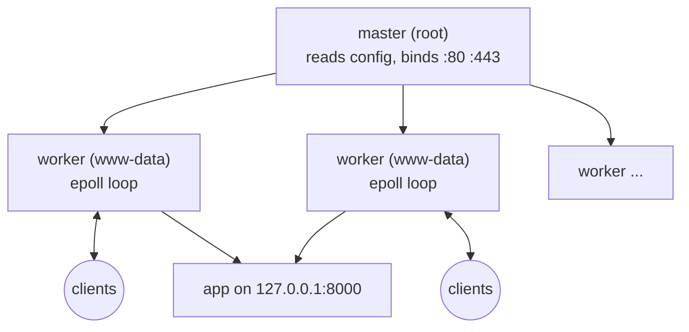
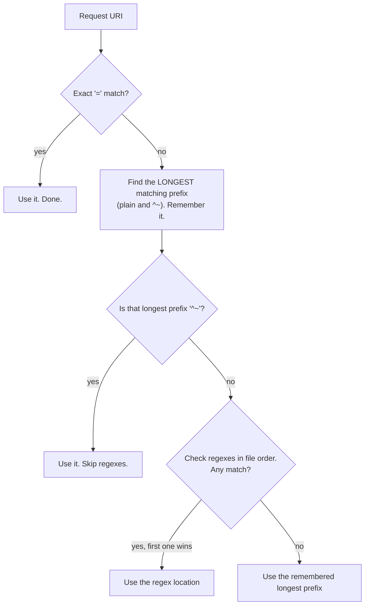
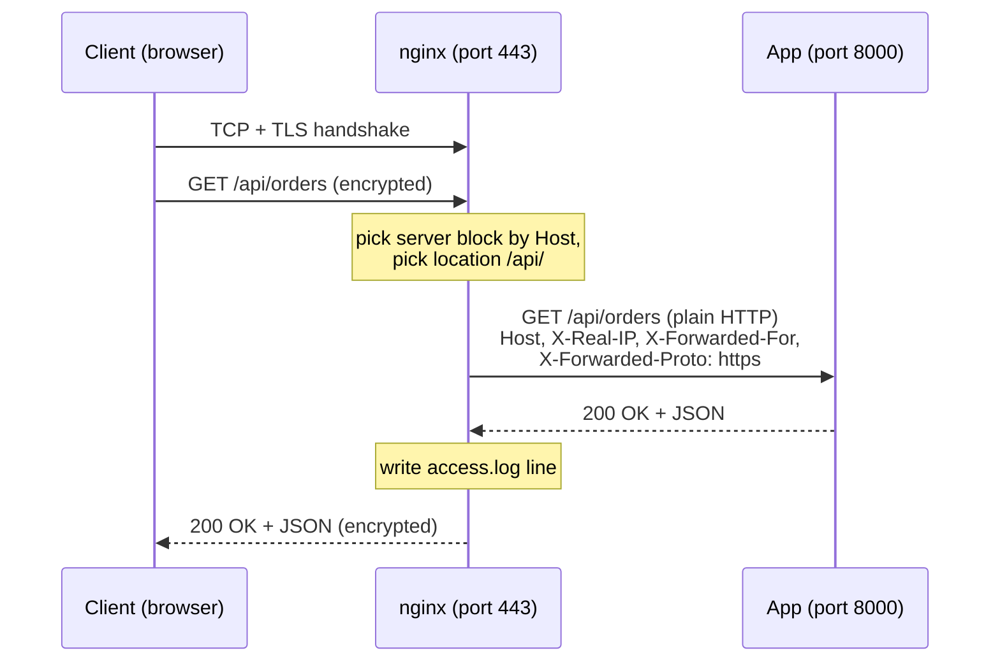
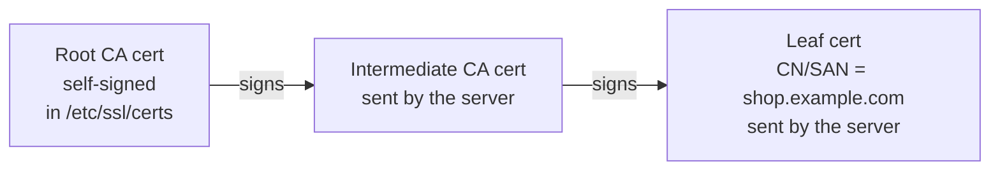
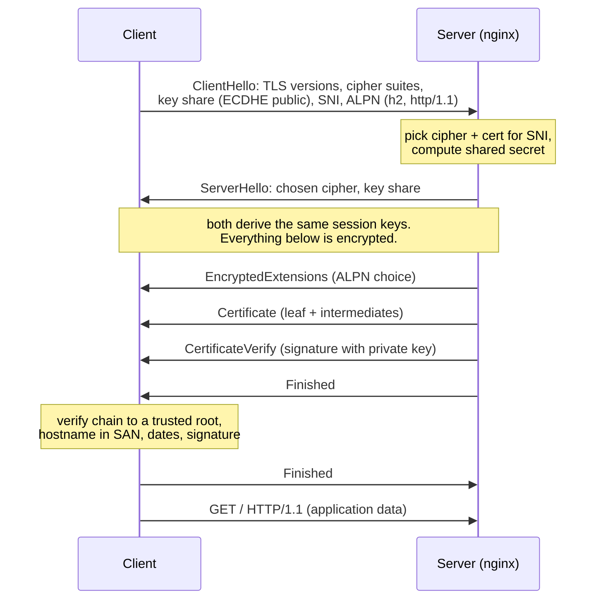

# Web servers and TLS

> **Level 4 · Chapter 11** · ⏱️ ~40 min read · Prerequisites: [Networking basics](03-networking-basics.md), [Firewalls with ufw](04-firewall-ufw.md), [systemd and journalctl](01-systemd-and-journalctl.md)

This chapter covers how the web works at the protocol level, how to run nginx as a static file server and as a reverse proxy in front of your own app, and how TLS (the "S" in HTTPS) protects that traffic. You'll also get free certificates from Let's Encrypt, add security headers and rate limits, and meet Caddy, a modern alternative.

## Why it matters

Alex has a small Python API that turns pipeline run logs into JSON. It runs fine on `127.0.0.1:8000` on a VM. A teammate asks for access, so Alex changes the bind address to `0.0.0.0` and opens port 8000 in the firewall.

A week later things go wrong in three ways. A browser warns that the site is "Not secure", so the teammate pastes an API token over plain HTTP on café Wi-Fi. A scanner finds the port and floods the app with requests, and the single-threaded server stalls. Alex's logs show only `127.0.0.1` as the client, so there is no way to tell who did what.

The standard fix takes about twenty lines of config. Put **nginx** in front of the app. It terminates HTTPS with a free certificate, passes the real client IP along, rate-limits abusive clients, and serves static files much faster than Python can. The app goes back to listening only on localhost. This is how most production web services on Linux are built, and the capstone for this level asks you to build exactly that.

## Concepts

### HTTP in one page

**HTTP** (Hypertext Transfer Protocol) is a text-based, request/response protocol. A client (a browser, `curl`, a Python script) opens a TCP connection to a server, usually on port 80. It sends a **request** and gets back one **response**.

A request has three parts:

```text
GET /api/orders?limit=5 HTTP/1.1        <- request line: method, path, version
Host: shop.example.com                   <- headers: "Name: value" lines
User-Agent: curl/8.5.0
Accept: */*
                                         <- blank line ends the headers
(optional body, e.g. JSON for a POST)
```

A response mirrors it:

```text
HTTP/1.1 200 OK                          <- status line: version, code, reason
Content-Type: application/json
Content-Length: 87
                                         <- blank line
{"orders": [...]}                        <- body
```

The **method** says what the client wants to do:

| Method | Meaning | Has a body? | Safe to retry? |
|--------|---------|-------------|----------------|
| `GET` | Fetch a resource | No | Yes |
| `HEAD` | Like GET, but headers only | No | Yes |
| `POST` | Create something or trigger an action | Yes | No |
| `PUT` | Replace a resource at this path | Yes | Yes (idempotent) |
| `PATCH` | Modify part of a resource | Yes | Not necessarily |
| `DELETE` | Remove a resource | Usually no | Yes (idempotent) |
| `OPTIONS` | Ask what is allowed (used by browsers for CORS) | No | Yes |

**Idempotent** means doing it twice has the same effect as doing it once. That matters for proxies and retries. nginx will retry a failed `GET` on another backend, but it won't retry a `POST` by default.

The **status code** is a three-digit number. The first digit is the class:

| Class | Meaning | Codes you'll see constantly |
|-------|---------|-----------------------------|
| 1xx | Informational | `101 Switching Protocols` (WebSocket upgrade) |
| 2xx | Success | `200 OK`, `201 Created`, `204 No Content` |
| 3xx | Redirect | `301 Moved Permanently`, `302 Found`, `304 Not Modified` |
| 4xx | The client did something wrong | `400`, `401 Unauthorized`, `403 Forbidden`, `404 Not Found`, `413 Payload Too Large`, `429 Too Many Requests` |
| 5xx | The server failed | `500 Internal Server Error`, `502 Bad Gateway`, `503 Service Unavailable`, `504 Gateway Timeout` |

When you run a reverse proxy, two codes matter more than the rest. **502** means nginx couldn't talk to your app at all; usually the app is down. **504** means the app accepted the connection but took too long to answer.

**Headers** carry metadata. A few you'll use in this chapter:

- `Host`: which site the client wants. One IP address can host many sites, and this header tells them apart.
- `Content-Type` and `Content-Length`: what the body is and how big it is.
- `Location`: where a 3xx redirect points.
- `X-Forwarded-For`, `X-Forwarded-Proto`: added by proxies to tell the app who the real client was and whether it used HTTPS.
- `Strict-Transport-Security`: tells browsers to use HTTPS only (covered later).

HTTP/1.1 keeps the TCP connection open for more requests (**keep-alive**). HTTP/2 multiplexes many requests over one connection in a binary format. HTTP/3 runs over UDP (QUIC). The methods, status codes, and headers are the same in all three, so everything here still applies.

### What a web server does

A **web server** is a program that listens on a port, parses HTTP requests, and produces responses. It can do this in two ways:

1. **Serve static files.** Map the URL path to a file on disk and send it. This is the job nginx was built for. It uses the `sendfile()` system call so file bytes go from the page cache to the socket without passing through user space.
2. **Act as a reverse proxy.** Forward the request to another program (your app, called the **upstream** or **backend**), then relay its response back to the client.

A **reverse proxy** sits in front of servers and acts on their behalf. (A *forward* proxy sits in front of clients, like a corporate web filter.) Putting nginx in front of your app gives you:

- **TLS termination.** nginx handles HTTPS, and the app speaks plain HTTP on localhost.
- **Buffering.** nginx reads slow clients' uploads fully before bothering the app, and absorbs slow downloads. A single-threaded app is no longer blocked by one slow phone on 3G.
- **One public entry point.** Several apps share ports 80/443, routed by hostname or path.
- **Security controls.** Rate limits, body size limits, headers, and access logs live in one place.

### How nginx is built

nginx runs as one **master process** (as root, so it can bind ports below 1024 and read private keys) plus several **worker processes** (as the unprivileged `www-data` user). Workers do all the actual network work. Each worker runs an **event loop**: it uses `epoll` to watch thousands of sockets at once and handles whichever is ready, so it never blocks waiting on one client. That's why one nginx box can hold tens of thousands of connections with a few megabytes of RAM.



This design explains **reload vs restart**. On `reload`, systemd sends the master `SIGHUP`. The master re-reads and checks the config. If the config is valid, it starts new workers with it and tells the old workers to finish their current requests and exit. No connection is dropped. If the config is invalid, the master logs an error and keeps the old workers running. A `restart` stops everything and starts fresh, which drops in-flight connections. Use reload for config changes. Use restart only after upgrading the nginx binary or when reload doesn't pick up a change (rare).

### Config structure: contexts, server blocks, locations

nginx config is made of **directives** (`name value;`, note the semicolon) grouped in **contexts** (blocks in braces). The nesting is:

```text
main context           (user, worker_processes, error_log)
├── events { }         (connection handling)
└── http { }           (everything web)
    ├── server { }     (one virtual host: a site)
    │   ├── location /      { }
    │   └── location /api/  { }
    └── server { }     (another site)
```

A **server block** (a **virtual host**) describes one site. nginx picks a server block for each request in two steps. First, it filters by `listen` (the IP and port the request arrived on). Then it compares the `Host` header to each block's `server_name`. If nothing matches, the block marked `default_server` for that port handles it. If no block is marked, the first one nginx loaded handles it.

Inside a server block, **location blocks** decide what to do with each URL path.

### Location matching rules

This is where most nginx confusion comes from. A location has an optional **modifier**:

| Syntax | Type | Example |
|--------|------|---------|
| `location = /path` | Exact match | `= /health` matches only `/health` |
| `location ^~ /path` | Prefix, and skip regexes if this is the longest prefix | `^~ /static/` |
| `location ~ regex` | Case-sensitive regex | `~ \.php$` |
| `location ~* regex` | Case-insensitive regex | `~* \.png$` |
| `location /path` | Plain prefix | `/api/` |

nginx doesn't simply take the first match. It runs this algorithm:



Two things surprise people. Prefix order in the file doesn't matter; only length does. Regex order *does* matter, and a matching regex beats a plain prefix, even a long one. Here's a worked example:

```nginx
location = /health               { return 200 "ok\n"; }      # A
location ^~ /static/             { root /srv/shop; }         # B
location ~* \.(png|jpg|css|js)$  { expires 7d; }             # C
location /api/                   { proxy_pass http://127.0.0.1:8000; }  # D
location /                       { try_files $uri $uri/ =404; }         # E
```

| Request | Longest prefix | Regex check | Winner |
|---------|---------------|-------------|--------|
| `/health` | (exact match first) | skipped | A |
| `/static/logo.png` | `^~ /static/` | skipped because of `^~` | B |
| `/img/logo.png` | `/` | C matches | C |
| `/api/orders` | `/api/` | no match | D |
| `/api/report.css` | `/api/` | C matches | **C**, not D! |
| `/about` | `/` | no match | E |

The `/api/report.css` row is a real bug pattern. An API path that happens to end in `.js` gets served as a static file instead of being proxied. Use `^~` on prefixes that must never be stolen by a regex.

### root vs alias

Both tell nginx where files live, but they build the file path differently.

- **`root`** appends the *whole* request URI to the directory.
- **`alias`** *replaces* the matched location prefix with the directory.

```nginx
location /static/ {
    root /srv/shop;
}
# GET /static/app.css  ->  /srv/shop/static/app.css

location /static/ {
    alias /srv/shop/assets/;
}
# GET /static/app.css  ->  /srv/shop/assets/app.css
```

!!! warning "Common mistake"
    With `alias`, keep the trailing slashes consistent. `location /static/ { alias /srv/shop/assets; }` (no slash on the alias) maps `/static/app.css` to `/srv/shop/assetsapp.css`. Prefer `root` whenever the directory name matches the URL. Use `alias` only when they differ.

### The request path through a reverse proxy

Here's what happens when a browser fetches `https://shop.example.com/api/orders` and nginx proxies it to your app:



The app sees a TCP connection from `127.0.0.1`, because nginx is its client. That's why the proxy headers matter. `X-Real-IP` and `X-Forwarded-For` carry the real client address. `X-Forwarded-Proto` tells the app the original request used HTTPS, so it builds `https://` links and sets secure cookies.

**`X-Forwarded-For`** is a comma-separated list. Each proxy appends the address it received the request from. nginx's `$proxy_add_x_forwarded_for` variable is "whatever the client sent, plus `$remote_addr`". A client can send a fake `X-Forwarded-For: 1.2.3.4` header, so only the **rightmost** entry, the one nginx added, is trustworthy. If your app logs client IPs, read `X-Real-IP` (set to `$remote_addr`) or the last XFF entry.

**WebSockets** start as an HTTP request with `Upgrade: websocket` and get a `101 Switching Protocols` response. After that the connection becomes a long-lived two-way channel. The `Upgrade` and `Connection` headers are **hop-by-hop**: proxies don't forward them by default. So WebSocket endpoints need two lines of extra config (shown later) and a long read timeout.

### TLS: the ideas underneath

**TLS** (Transport Layer Security, the successor to SSL) wraps a TCP connection so that:

1. **Confidentiality.** Eavesdroppers can't read the traffic.
2. **Integrity.** Nobody can modify it in transit undetected.
3. **Authentication.** The client knows it's talking to the real `shop.example.com`, not an impostor.

HTTPS is just HTTP inside TLS, on port 443.

**Symmetric cryptography** uses one shared secret key to both encrypt and decrypt (for example AES). It's very fast, but both sides need the same key, and you can't send the key over the network in the clear.

**Asymmetric cryptography** (public-key cryptography) uses a **key pair**. The **public key** can be shared with anyone. The **private key** never leaves the server. Two operations matter for TLS:

- **Key exchange.** With **ECDHE** (Elliptic-Curve Diffie-Hellman, Ephemeral), each side generates a throwaway key pair and sends the public half. Each side combines its own private half with the other's public half and gets the same shared secret. An eavesdropper who sees both public halves can't compute it. "Ephemeral" means the keys are new for every connection. Stealing the server's long-term key later still doesn't decrypt recorded traffic. This property is called **forward secrecy**.
- **Signatures.** The server signs data with its private key. Anyone with the public key can verify the signature, but only the private key holder could have made it. This proves identity.

TLS combines them. Asymmetric crypto agrees on a key and proves identity, then fast symmetric crypto (AES-GCM or ChaCha20) encrypts the actual data.

### Certificates, chains, and CAs

A signature proves the server holds *some* private key. But how do you know that key belongs to `shop.example.com`? A **certificate** answers that. A certificate is a public key plus identity information (the domain names in the **Subject Alternative Name**, or **SAN**, field), validity dates, and a signature from a **Certificate Authority** (**CA**). A CA is an organization that browsers and operating systems trust to check domain ownership before signing.

CAs don't sign site certificates with their precious root key directly. They use a chain:



- The **root certificate** is self-signed and pre-installed in your **trust store**. On Ubuntu and Mint that's `/etc/ssl/certs`, managed by the `ca-certificates` package.
- An **intermediate certificate** is signed by the root. The root's key stays offline.
- The **leaf certificate** (server certificate) is signed by the intermediate.

The server must send the leaf *and* the intermediates, but not the root. The client walks the chain up to a root it already trusts and checks each signature, the validity dates, and that the requested hostname appears in the leaf's SAN.

**SNI** (Server Name Indication) solves a chicken-and-egg problem. The server must present a certificate *before* it sees the encrypted `Host` header. If one IP hosts ten sites, which certificate should it send? With SNI, the client puts the hostname in plain text in its very first TLS message, and nginx uses it to pick the server block and certificate. That's why `openssl s_client` has a `-servername` option.

### The TLS 1.3 handshake

TLS 1.3 needs one round trip before application data flows:



**ALPN** (Application-Layer Protocol Negotiation) lets the client and server agree on HTTP/2 vs HTTP/1.1 inside the handshake. TLS 1.2, still widely supported, needs two round trips and uses a slightly different message flow, but the same ideas apply.

### Let's Encrypt and ACME

**Let's Encrypt** is a free, automated CA. You talk to it with the **ACME** protocol, usually through a client called **certbot**. Before issuing a certificate, the CA makes you prove you control the domain by completing a **challenge**:

| | HTTP-01 | DNS-01 |
|---|---------|--------|
| How you prove control | Serve a token at `http://<domain>/.well-known/acme-challenge/<token>` | Create a TXT record `_acme-challenge.<domain>` |
| Needs port 80 open to the internet | Yes | No |
| Wildcards (`*.example.com`) | No | Yes |
| Works for internal-only servers | No | Yes |
| Automation | Easy: certbot edits nginx itself | Needs your DNS provider's API (a certbot plugin) |

Let's Encrypt certificates are short-lived: 90 days at the time of writing, and the CA is gradually shortening lifetimes further. That's deliberate, because it forces automation. Certbot installs a systemd timer that tries renewal twice a day and renews any certificate within 30 days of expiry.

## Commands and examples

### HTTP with curl -v

`curl -v` (verbose) shows the exact request and response. Lines starting with `>` are sent, `<` are received, and `*` are curl's own notes. You can try this safely on your main machine with Python's built-in server:

```bash
mkdir -p ~/web-demo && echo '<h1>Hello from mint</h1>' > ~/web-demo/index.html
python3 -m http.server 8000 --bind 127.0.0.1 --directory ~/web-demo
```

In a second terminal:

```bash
curl -v http://127.0.0.1:8000/
```

```text
*   Trying 127.0.0.1:8000...
* Connected to 127.0.0.1 (127.0.0.1) port 8000
> GET / HTTP/1.1
> Host: 127.0.0.1:8000
> User-Agent: curl/8.5.0
> Accept: */*
>
* HTTP 1.0, assume close after body
< HTTP/1.0 200 OK
< Server: SimpleHTTP/0.6 Python/3.12.3
< Date: Fri, 02 Oct 2026 05:13:04 GMT
< Content-type: text/html
< Content-Length: 25
< Last-Modified: Fri, 02 Oct 2026 05:13:04 GMT
<
<h1>Hello from mint</h1>
* Closing connection
```

Line by line:

- `Trying` / `Connected`: the TCP connection. If this hangs, it's a network or firewall problem, not HTTP.
- `> GET / HTTP/1.1` and the `>` headers: the request curl sent. Note the `Host` header, which curl fills in from the URL.
- The lone `>` is the blank line that ends the request headers.
- `< HTTP/1.0 200 OK`: the status line. This toy server speaks HTTP/1.0, so it closes the connection after each response.
- `<` headers: metadata about the body, then a blank line, then the body itself.

Other curl options you'll use all the time:

```bash
curl -I http://127.0.0.1:8000/missing.html                       # HEAD request: headers only
curl -s -o /dev/null -w '%{http_code} %{time_total}\n' http://127.0.0.1:8000/
curl -H 'Host: shop.example.com' http://127.0.0.1/                 # fake the Host header
curl --resolve shop.example.com:443:192.168.122.50 https://shop.example.com/   # fake DNS for one request
```

```text
HTTP/1.0 404 File not found
Server: SimpleHTTP/0.6 Python/3.12.3
Date: Fri, 02 Oct 2026 05:13:04 GMT
Connection: close
Content-Type: text/html;charset=utf-8
Content-Length: 335

200 0.001349
```

`-w` (write-out) prints variables after the transfer. `%{http_code}` plus `-o /dev/null` is the standard way to health-check a URL in a script. `--resolve` is the best way to test a server block before DNS points at the server: curl still sends the right SNI and `Host` header.

Stop the Python server with ++ctrl+c++.

### Installing nginx

!!! danger "⚠️ VM only"
    Everything from here until the openssl section changes system state: installing packages, editing `/etc/nginx`, opening firewall ports, and running services as root. Do it in your throwaway VM, never on your main machine.

```bash
sudo apt update
sudo apt install nginx
systemctl status nginx --no-pager
```

```text
● nginx.service - A high performance web server and a reverse proxy server
     Loaded: loaded (/usr/lib/systemd/system/nginx.service; enabled; preset: enabled)
     Active: active (running) since Fri 2026-10-02 10:51:02 IST; 8s ago
       Docs: man:nginx(8)
    Process: 2331 ExecStartPre=/usr/sbin/nginx -t -q -g daemon on; master_process on; (code=exited, status=0/SUCCESS)
    Process: 2333 ExecStart=/usr/sbin/nginx -g daemon on; master_process on; (code=exited, status=0/SUCCESS)
   Main PID: 2334 (nginx)
      Tasks: 3 (limit: 4613)
     Memory: 2.4M (peak: 2.6M)
        CPU: 21ms
     CGroup: /system.slice/nginx.service
             ├─2334 "nginx: master process /usr/sbin/nginx -g daemon on; master_process on;"
             ├─2335 "nginx: worker process"
             └─2336 "nginx: worker process"
```

On Ubuntu and Mint, the package starts nginx immediately and enables it at boot. Notice `ExecStartPre=... nginx -t`: systemd tests the config before every start. The process tree shows the master and two workers (`worker_processes auto` means one per CPU core). Confirm who runs what and what's listening:

```bash
ps -o user,pid,cmd -C nginx
sudo ss -tlnp | grep nginx
```

```text
USER         PID CMD
root        2334 nginx: master process /usr/sbin/nginx -g daemon on; master_process on;
www-data    2335 nginx: worker process
www-data    2336 nginx: worker process
LISTEN 0      511          0.0.0.0:80        0.0.0.0:*    users:(("nginx",pid=2336,fd=5),("nginx",pid=2335,fd=5),("nginx",pid=2334,fd=5))
LISTEN 0      511             [::]:80           [::]:*    users:(("nginx",pid=2336,fd=6),("nginx",pid=2335,fd=6),("nginx",pid=2334,fd=6))
```

All three processes share the listening socket, which they inherited from the master. If `ufw` is active (see [Firewalls with ufw](04-firewall-ufw.md)), allow web traffic. The nginx package ships ufw application profiles:

```bash
sudo ufw app list
sudo ufw allow 'Nginx Full'      # ports 80 and 443
```

### The Ubuntu file layout

```text
/etc/nginx/
├── nginx.conf               main config; includes the directories below
├── conf.d/                  *.conf files included inside http { }
├── sites-available/         one file per site; inactive until linked
│   └── default
├── sites-enabled/           symlinks to files in sites-available; these are live
│   └── default -> /etc/nginx/sites-available/default
├── snippets/                reusable fragments you include
├── modules-enabled/         dynamic modules
└── mime.types               file extension -> Content-Type map
/var/www/html/               default document root
/var/log/nginx/access.log    one line per request
/var/log/nginx/error.log     problems, warnings, upstream failures
```

The key lines in `nginx.conf` are inside `http { }`:

```nginx
include /etc/nginx/conf.d/*.conf;
include /etc/nginx/sites-enabled/*;
```

So enabling a site means creating a symlink, and disabling it means removing the symlink. The config file stays in `sites-available` for later. This Debian convention isn't part of upstream nginx; other distros use only `conf.d/`.

### Serving a static site

Create a site for `shop.example.com` (in the VM, add `127.0.0.1 shop.example.com` to `/etc/hosts`, or use `curl -H 'Host: ...'`):

```bash
sudo mkdir -p /srv/shop/static
echo '<h1>Shop</h1>' | sudo tee /srv/shop/index.html
echo 'body { font-family: sans-serif; }' | sudo tee /srv/shop/static/app.css
sudo nano /etc/nginx/sites-available/shop
```

```nginx
server {
    listen 80;
    listen [::]:80;
    server_name shop.example.com;

    root /srv/shop;
    index index.html;

    access_log /var/log/nginx/shop.access.log;
    error_log  /var/log/nginx/shop.error.log;

    location / {
        try_files $uri $uri/ =404;
    }

    location ^~ /static/ {
        expires 7d;
        access_log off;
    }
}
```

Line by line:

- `listen 80;` and `listen [::]:80;`: accept IPv4 and IPv6 on port 80.
- `server_name`: which `Host` values this block answers. You can list several, or use wildcards like `*.example.com`.
- `root /srv/shop;`: set at server level, so every location inherits it.
- `try_files $uri $uri/ =404;`: try the path as a file, then as a directory (which serves its `index`), else return 404. Without it, a missing file still gives 404, but `try_files` is the standard hook for single-page apps. Replace `=404` with `/index.html` to send every unknown path to the app.
- `expires 7d;`: adds `Cache-Control: max-age=604800` so browsers cache static assets.
- `access_log off;`: don't log every CSS and image hit.

Enable, test, and reload:

```bash
sudo ln -s /etc/nginx/sites-available/shop /etc/nginx/sites-enabled/shop
sudo nginx -t
sudo systemctl reload nginx
```

```text
nginx: the configuration file /etc/nginx/nginx.conf syntax is ok
nginx: configuration file /etc/nginx/nginx.conf test is successful
```

Always run `nginx -t` before reloading. It parses the whole config tree, checks that files exist, and tries to open certificates and log files. If you forget a semicolon, it tells you exactly where:

```text
nginx: [emerg] unexpected "}" in /etc/nginx/sites-enabled/shop:17
nginx: configuration file /etc/nginx/nginx.conf test failed
```

Add `-T` (`sudo nginx -T`) to dump the fully merged config, with every included file. It's the fastest way to answer "where is this directive actually coming from?".

Now test it:

```bash
curl -v -H 'Host: shop.example.com' http://127.0.0.1/static/app.css
```

```text
*   Trying 127.0.0.1:80...
* Connected to 127.0.0.1 (127.0.0.1) port 80
> GET /static/app.css HTTP/1.1
> Host: shop.example.com
> User-Agent: curl/8.5.0
> Accept: */*
>
< HTTP/1.1 200 OK
< Server: nginx/1.24.0 (Ubuntu)
< Date: Fri, 02 Oct 2026 05:24:10 GMT
< Content-Type: text/css
< Content-Length: 34
< Last-Modified: Fri, 02 Oct 2026 05:22:41 GMT
< Connection: keep-alive
< ETag: "66fcd981-22"
< Expires: Fri, 09 Oct 2026 05:24:10 GMT
< Cache-Control: max-age=604800
< Accept-Ranges: bytes
<
body { font-family: sans-serif; }
* Connection #0 to host 127.0.0.1 left intact
```

`Content-Type: text/css` comes from `mime.types`. `ETag` and `Last-Modified` let browsers ask "has this changed?" and get a cheap `304 Not Modified`. `Connection: keep-alive` means curl could reuse the connection.

!!! warning "Common mistake"
    You get `403 Forbidden` for files that clearly exist. Workers run as `www-data`, so that user needs read permission on the file and execute (`x`) permission on *every* directory in the path. A site under `/home/alex/site` fails because `/home/alex` is mode `750`. Check the whole path with `namei -l /srv/shop/index.html`, and keep web content under `/srv` or `/var/www`.

### Logs

The default access log format is called `combined`:

```bash
sudo tail -n 3 /var/log/nginx/shop.access.log
```

```text
192.168.122.1 - - [02/Oct/2026:10:58:12 +0530] "GET / HTTP/1.1" 200 14 "-" "Mozilla/5.0 (X11; Linux x86_64; rv:131.0) Gecko/20100101 Firefox/131.0"
192.168.122.1 - - [02/Oct/2026:10:58:12 +0530] "GET /favicon.ico HTTP/1.1" 404 162 "http://shop.example.com/" "Mozilla/5.0 (X11; Linux x86_64; rv:131.0) Gecko/20100101 Firefox/131.0"
127.0.0.1 - - [02/Oct/2026:10:59:40 +0530] "GET /api/orders HTTP/1.1" 502 166 "-" "curl/8.5.0"
```

The fields are: client IP, identity (always `-`), authenticated user, time, request line, status, response body bytes, `Referer`, and `User-Agent`. You already know how to slice this with `awk` from Level 1. For example, `awk '{print $9}' access.log | sort | uniq -c` counts status codes. Rotation is handled by `/etc/logrotate.d/nginx`; see [Logging and logrotate](09-logging-and-logrotate.md).

The error log is where you go when the access log says 502 or 403:

```text
2026/10/02 10:59:40 [error] 2335#2335: *12 connect() failed (111: Connection refused) while connecting to upstream, client: 127.0.0.1, server: shop.example.com, request: "GET /api/orders HTTP/1.1", upstream: "http://127.0.0.1:8000/api/orders", host: "shop.example.com"
```

`2335#2335` is the worker PID and thread ID. `*12` is the connection number, so you can grep all lines for one connection. `111: Connection refused` is the `errno` from the `connect()` system call: nothing is listening on port 8000.

### Reverse proxying an app on 127.0.0.1:8000

Here's a tiny backend that echoes back what it sees. Save it as `/srv/shop/app.py`:

```python
#!/usr/bin/env python3
"""Tiny backend app: echoes what it sees, so you can watch nginx's proxy headers."""
import json
from http.server import BaseHTTPRequestHandler, ThreadingHTTPServer


class Handler(BaseHTTPRequestHandler):
    def do_GET(self):
        body = json.dumps({
            "path": self.path,
            "peer": self.client_address[0],
            "host": self.headers.get("Host"),
            "x_forwarded_for": self.headers.get("X-Forwarded-For"),
            "x_forwarded_proto": self.headers.get("X-Forwarded-Proto"),
        }, indent=2).encode() + b"\n"
        self.send_response(200)
        self.send_header("Content-Type", "application/json")
        self.send_header("Content-Length", str(len(body)))
        self.end_headers()
        self.wfile.write(body)


if __name__ == "__main__":
    ThreadingHTTPServer(("127.0.0.1", 8000), Handler).serve_forever()
```

It binds to `127.0.0.1`, not `0.0.0.0`, so it's unreachable from outside the VM even with the firewall off. Only nginx can talk to it. Run it with `python3 /srv/shop/app.py` for now. In the capstone you'll turn it into a systemd service ([Running services with systemd](../05-programming/05-services-with-systemd.md) goes deeper).

Add a proxied location to the `shop` server block:

```nginx
location /api/ {
    proxy_pass http://127.0.0.1:8000;

    proxy_set_header Host              $host;
    proxy_set_header X-Real-IP         $remote_addr;
    proxy_set_header X-Forwarded-For   $proxy_add_x_forwarded_for;
    proxy_set_header X-Forwarded-Proto $scheme;

    proxy_connect_timeout 5s;
    proxy_read_timeout    30s;
    proxy_send_timeout    30s;

    client_max_body_size  10m;
}
```

What each part does:

- `proxy_pass http://127.0.0.1:8000;`: forward to the app. With no path after the port, the original URI (`/api/orders?limit=5`) is passed through unchanged.
- `proxy_set_header Host $host;`: by default nginx sends `Host: 127.0.0.1:8000`. Most frameworks want the public hostname to build URLs.
- `X-Real-IP` / `X-Forwarded-For` / `X-Forwarded-Proto`: the real client and scheme, as explained in Concepts. `$scheme` is `http` or `https`.
- `proxy_connect_timeout 5s;`: how long to wait for the TCP connection to the app. Localhost connects instantly, so a long wait here means something is badly wrong. Fail fast.
- `proxy_read_timeout 30s;`: the longest gap allowed *between two reads* from the app, not the total response time. The default is 60s. If the app is silent for longer, nginx returns `504 Gateway Timeout`. Raise it for slow report endpoints, not globally.
- `client_max_body_size 10m;`: the upload limit. The default is 1 MB, and bigger bodies get `413`.

!!! warning "Common mistake"
    A trailing slash on `proxy_pass` changes its meaning. `proxy_pass http://127.0.0.1:8000;` sends `/api/orders` unchanged. `proxy_pass http://127.0.0.1:8000/;` (with a URI part, even just `/`) *replaces* the matched prefix `/api/`, so the app receives `/orders`. Both are useful, but mixing them up gives you mysterious 404s from the app.

Test, reload, and call it:

```bash
sudo nginx -t && sudo systemctl reload nginx
curl -s -H 'Host: shop.example.com' 'http://127.0.0.1/api/orders?limit=5'
```

```json
{
  "path": "/api/orders?limit=5",
  "peer": "127.0.0.1",
  "host": "shop.example.com",
  "x_forwarded_for": "127.0.0.1",
  "x_forwarded_proto": "http"
}
```

`peer` is always `127.0.0.1`, because nginx is the app's client. The real client is in `x_forwarded_for`. Now stop the app with ++ctrl+c++ and repeat the request. You get `502 Bad Gateway` from nginx, and the error log shows `connect() failed (111: Connection refused)`.

For **WebSockets**, add a `map` at the `http` level (for example in `/etc/nginx/conf.d/websocket.conf`) and a dedicated location:

```nginx
# /etc/nginx/conf.d/websocket.conf  (http context)
map $http_upgrade $connection_upgrade {
    default upgrade;
    ''      close;
}
```

```nginx
location /ws/ {
    proxy_pass http://127.0.0.1:8000;
    proxy_http_version 1.1;
    proxy_set_header Upgrade    $http_upgrade;
    proxy_set_header Connection $connection_upgrade;
    proxy_read_timeout 1h;
}
```

The upgrade mechanism needs HTTP/1.1, and the `Upgrade`/`Connection` headers must be passed on explicitly. The long timeout stops nginx from closing an idle chat connection after 60 seconds.

### openssl: inspecting TLS from the command line

The commands in this section are read-only and safe on your main machine. **`openssl s_client`** is a raw TLS client. It's like `curl -v` for the handshake:

```bash
openssl s_client -connect example.com:443 -servername example.com </dev/null
```

```text
depth=3 C = US, O = SSL Corporation, CN = SSL.com TLS ECC Root CA 2022
verify return:1
depth=2 C = US, O = SSL Corporation, CN = SSL.com TLS Transit ECC CA R2
verify return:1
depth=1 C = US, O = SSL Corporation, CN = Cloudflare TLS Issuing ECC CA 3
verify return:1
depth=0 CN = example.com
verify return:1
CONNECTED(00000003)
---
Certificate chain
 0 s:CN = example.com
   i:C = US, O = SSL Corporation, CN = Cloudflare TLS Issuing ECC CA 3
   a:PKEY: id-ecPublicKey, 256 (bit); sigalg: ecdsa-with-SHA256
   v:NotBefore: Sep 26 22:49:11 2026 GMT; NotAfter: Dec 25 22:56:35 2026 GMT
 1 s:C = US, O = SSL Corporation, CN = Cloudflare TLS Issuing ECC CA 3
   i:C = US, O = SSL Corporation, CN = SSL.com TLS Transit ECC CA R2
...
---
Server certificate
-----BEGIN CERTIFICATE-----
MIID5jCCA42gAwIBAgIQAe7mqrtSHV4U/DFf2ZhWkDAKBggqhkjOPQQDAjBRMQsw
...
-----END CERTIFICATE-----
subject=CN = example.com
issuer=C = US, O = SSL Corporation, CN = Cloudflare TLS Issuing ECC CA 3
---
Peer signing digest: SHA256
Peer signature type: ECDSA
Server Temp Key: X25519, 253 bits
---
SSL handshake has read 3982 bytes and written 393 bytes
Verification: OK
---
New, TLSv1.3, Cipher is TLS_AES_256_GCM_SHA384
...
Verify return code: 0 (ok)
```

How to read it:

- The `depth=` lines are the chain verification, from the root (highest depth) down to the leaf (`depth=0`). `verify return:1` means that step passed.
- `Certificate chain` lists what the *server sent*. `s:` is the subject (who the cert is for), `i:` is the issuer (who signed it), and `v:` is the validity window. Each certificate's `i:` should equal the next one's `s:`. That's the chain.
- `Server Temp Key: X25519` is the ephemeral ECDHE key exchange from the handshake diagram.
- `New, TLSv1.3, Cipher is TLS_AES_256_GCM_SHA384`: the negotiated protocol and the symmetric cipher for the data.
- `Verify return code: 0 (ok)` is the bottom line. Anything else, like `20 (unable to get local issuer certificate)` or `10 (certificate has expired)`, is the problem to fix.

`</dev/null` sends end-of-file so `s_client` exits right after the handshake instead of waiting for you to type an HTTP request.

**`openssl x509`** decodes certificates. Pipe `s_client` into it to pull out the useful fields:

```bash
openssl s_client -connect example.com:443 -servername example.com </dev/null 2>/dev/null \
  | openssl x509 -noout -subject -issuer -dates -ext subjectAltName
```

```text
subject=CN = example.com
issuer=C = US, O = SSL Corporation, CN = Cloudflare TLS Issuing ECC CA 3
notBefore=Sep 26 22:49:11 2026 GMT
notAfter=Dec 25 22:56:35 2026 GMT
X509v3 Subject Alternative Name:
    DNS:example.com, DNS:*.example.com
```

This leaf certificate is valid for under three months. Short lifetimes are now normal, which is why renewal must be automatic.

### Creating a self-signed certificate

A **self-signed certificate** is signed by its own key instead of a CA. No browser trusts it, but it's perfect for a lab VM, an internal test, or learning. Make one in a scratch directory:

```bash
mkdir -p ~/tls-lab && cd ~/tls-lab
openssl req -x509 -newkey rsa:2048 -noenc -days 365 \
  -keyout mint.local.key -out mint.local.crt \
  -subj "/CN=mint.local" \
  -addext "subjectAltName=DNS:mint.local,DNS:localhost,IP:127.0.0.1"
ls -l mint.local.*
```

```text
.+...+.......+...+.....+....+......+.....+...+....+...+++++++++++++++++++++++++*...
-----
-rw-rw-r-- 1 alex alex 1172 Oct  2 10:42 mint.local.crt
-rw------- 1 alex alex 1704 Oct  2 10:42 mint.local.key
```

The flags:

- `req -x509`: `req` normally creates a certificate *signing request* for a CA. `-x509` makes it output a finished self-signed certificate instead.
- `-newkey rsa:2048`: generate a new 2048-bit RSA key pair at the same time. The dots and pluses are progress output from prime number generation.
- `-noenc`: don't encrypt the private key with a passphrase. (Older guides use `-nodes`, which still works.) nginx needs to read the key unattended at boot, so server keys are usually unencrypted and protected by file permissions instead.
- `-subj` and `-addext subjectAltName=...`: the identity. Modern clients ignore the CN and check *only* the SAN, so always set a SAN.

Note that openssl created the key with mode `600` by itself. Keep it that way. Now decode the certificate:

```bash
openssl x509 -in mint.local.crt -text -noout
```

```text
Certificate:
    Data:
        Version: 3 (0x2)
        Serial Number:
            06:13:7b:e6:74:8b:ed:73:01:c1:c9:21:d9:eb:45:31:76:8d:7a:5f
        Signature Algorithm: sha256WithRSAEncryption
        Issuer: CN = mint.local
        Validity
            Not Before: Oct  2 05:12:56 2026 GMT
            Not After : Oct  2 05:12:56 2027 GMT
        Subject: CN = mint.local
        Subject Public Key Info:
            Public Key Algorithm: rsaEncryption
                Public-Key: (2048 bit)
                Modulus:
                    00:87:82:e6:07:46:9f:4f:68:09:31:0d:c6:34:26:
                    ...
                Exponent: 65537 (0x10001)
        X509v3 extensions:
            X509v3 Subject Key Identifier:
                80:E6:36:B6:52:A6:AE:4F:3A:69:1D:03:97:F3:5E:ED:DA:EC:4E:8E
            X509v3 Authority Key Identifier:
                80:E6:36:B6:52:A6:AE:4F:3A:69:1D:03:97:F3:5E:ED:DA:EC:4E:8E
            X509v3 Basic Constraints: critical
                CA:TRUE
            X509v3 Subject Alternative Name:
                DNS:mint.local, DNS:localhost, IP Address:127.0.0.1
    Signature Algorithm: sha256WithRSAEncryption
    Signature Value:
        0a:50:05:4e:46:31:9d:6b:3c:ea:0a:3c:06:28:23:d0:db:08:
        ...
```

`-text` decodes everything, and `-noout` skips re-printing the base64 PEM block. `Issuer` equals `Subject`, and the Subject Key Identifier equals the Authority Key Identifier: that's what "self-signed" looks like. `CA:TRUE` means this certificate could sign others, which is how a private CA starts.

**Checking expiry** is a one-liner, and `-checkend` makes it scriptable. It takes seconds and exits 0 if the certificate is still valid that far in the future:

```bash
openssl x509 -in mint.local.crt -noout -enddate
openssl x509 -in mint.local.crt -noout -checkend $((30*86400)); echo "exit=$?"
openssl x509 -in mint.local.crt -noout -checkend $((400*86400)); echo "exit=$?"
```

```text
notAfter=Oct  2 05:12:56 2027 GMT
Certificate will not expire
exit=0
Certificate will expire
exit=1
```

That `exit=1` is what you'd hook into a monitoring script or a systemd timer that alerts you.

You can even run a throwaway TLS server with this certificate and point curl at it, all on localhost:

```bash
openssl s_server -accept 127.0.0.1:8443 -cert mint.local.crt -key mint.local.key -www -quiet &
curl https://localhost:8443/
curl -v --cacert mint.local.crt https://localhost:8443/ -o /dev/null 2>&1 | grep '^\*'
kill %1
```

```text
curl: (60) SSL certificate problem: self-signed certificate
More details here: https://curl.se/docs/sslcerts.html
...
* TLSv1.3 (OUT), TLS handshake, Client hello (1):
*  CAfile: mint.local.crt
* TLSv1.3 (IN), TLS handshake, Server hello (2):
* TLSv1.3 (IN), TLS handshake, Encrypted Extensions (8):
* TLSv1.3 (IN), TLS handshake, Certificate (11):
* TLSv1.3 (IN), TLS handshake, CERT verify (15):
* TLSv1.3 (IN), TLS handshake, Finished (20):
* TLSv1.3 (OUT), TLS handshake, Finished (20):
* SSL connection using TLSv1.3 / TLS_AES_256_GCM_SHA384 / X25519 / RSASSA-PSS
* Server certificate:
*  subject: CN=mint.local
*  start date: Oct  2 05:12:56 2026 GMT
*  expire date: Oct  2 05:12:56 2027 GMT
*  subjectAltName: host "localhost" matched cert's "localhost"
*  issuer: CN=mint.local
*  SSL certificate verify ok.
```

The first curl refuses, because the certificate doesn't chain to anything in `/etc/ssl/certs`. With `--cacert` you tell curl to trust this one certificate, and the handshake lines match the TLS 1.3 diagram message for message. Never "fix" the first error with `curl -k` (`--insecure`) in a script. It turns off authentication entirely.

### HTTPS in nginx

!!! danger "⚠️ VM only"
    Editing nginx config, reloading it, and placing private keys under `/etc` all change the system. Do it in the VM.

Before Let's Encrypt, wire up the self-signed cert by hand so you understand what certbot will later automate. Copy the files into place:

```bash
sudo install -m 644 mint.local.crt /etc/ssl/certs/shop-selfsigned.crt
sudo install -m 600 mint.local.key /etc/ssl/private/shop-selfsigned.key
```

Then split the site into an HTTP redirect block and an HTTPS block:

```nginx
server {
    listen 80;
    listen [::]:80;
    server_name shop.example.com;
    return 301 https://$host$request_uri;
}

server {
    listen 443 ssl http2;
    listen [::]:443 ssl http2;
    server_name shop.example.com;

    ssl_certificate     /etc/ssl/certs/shop-selfsigned.crt;
    ssl_certificate_key /etc/ssl/private/shop-selfsigned.key;
    ssl_protocols       TLSv1.2 TLSv1.3;

    root /srv/shop;
    # ... the same locations as before ...
}
```

- `return 301 https://$host$request_uri;`: permanently redirect every plain-HTTP request to the same URL over HTTPS.
- `listen 443 ssl http2;`: TLS on 443 with HTTP/2 allowed. nginx 1.25.1 and later prefer a separate `http2 on;` directive, but Ubuntu 24.04 ships nginx 1.24, which uses this `listen` form.
- `ssl_certificate`: the certificate *chain*. With a CA-issued certificate, this must be the full chain file (leaf followed by intermediates).
- `ssl_protocols TLSv1.2 TLSv1.3;`: turn off old, broken versions. Ubuntu's default `nginx.conf` still lists TLSv1 and TLSv1.1 for compatibility.

!!! warning "Common mistake"
    Pointing `ssl_certificate` at the leaf certificate alone (`cert.pem`) instead of `fullchain.pem`. Desktop browsers often still work, because they cache or fetch missing intermediates. But `curl`, Python `requests`, Java, and mobile apps fail with "unable to get local issuer certificate". Always test with `openssl s_client` and check that `Certificate chain` lists more than one certificate.

### Let's Encrypt with certbot

!!! danger "⚠️ VM only"
    Certbot needs a real public domain whose DNS points at your server, with port 80 reachable from the internet. Run it only on a VM or cloud server you control. While experimenting, add `--test-cert` to use the staging CA, which has much higher rate limits. Its certificates aren't trusted by browsers.

```bash
sudo apt install certbot python3-certbot-nginx
sudo certbot --nginx -d shop.example.com
```

```text
Saving debug log to /var/log/letsencrypt/letsencrypt.log
Enter email address (used for urgent renewal and security notices)
 (Enter 'c' to cancel): alex@example.com
...
Requesting a certificate for shop.example.com

Successfully received certificate.
Certificate is saved at: /etc/letsencrypt/live/shop.example.com/fullchain.pem
Key is saved at:         /etc/letsencrypt/live/shop.example.com/privkey.pem
This certificate expires on 2026-12-31.
These files will be updated when the certificate renews.
Certbot has set up a scheduled task to automatically renew this certificate in the background.

Deploying certificate
Successfully deployed certificate for shop.example.com to /etc/nginx/sites-enabled/shop
Congratulations! You have successfully enabled HTTPS on https://shop.example.com
```

Here's what happened underneath:

1. Certbot created an ACME account and asked Let's Encrypt for a certificate.
2. For the **HTTP-01** challenge, the `--nginx` plugin temporarily added a location that serves the token under `/.well-known/acme-challenge/`, then reloaded nginx.
3. Let's Encrypt's servers fetched `http://shop.example.com/.well-known/acme-challenge/<token>` from several network locations and saw the right answer.
4. Certbot generated a key, got the signed certificate, and saved it under `/etc/letsencrypt/archive/`. The `live/` paths are symlinks to the newest version.
5. Certbot edited your server block to add `listen 443 ssl`, `ssl_certificate .../fullchain.pem`, and an HTTP→HTTPS redirect, then reloaded nginx.

If you prefer to edit nginx yourself, use `sudo certbot certonly --nginx -d shop.example.com`, which only obtains the certificate. For **DNS-01** (wildcards, or servers not reachable on port 80), use a DNS plugin for your provider, such as `python3-certbot-dns-cloudflare`, or `--manual --preferred-challenges dns` for a one-off test.

Renewal is a systemd timer, which you can inspect like any other ([systemd and journalctl](01-systemd-and-journalctl.md)):

```bash
systemctl list-timers certbot.timer
sudo certbot certificates
sudo certbot renew --dry-run
```

```text
NEXT                        LEFT     LAST                        PASSED  UNIT          ACTIVATES
Fri 2026-10-02 23:17:00 IST 12h left Fri 2026-10-02 10:41:12 IST 18min ago certbot.timer certbot.service

1 timers listed.
...
Found the following certs:
  Certificate Name: shop.example.com
    Serial Number: 4a1f...
    Key Type: ECDSA
    Domains: shop.example.com
    Expiry Date: 2026-12-31 09:21:40+00:00 (VALID: 89 days)
    Certificate Path: /etc/letsencrypt/live/shop.example.com/fullchain.pem
    Private Key Path: /etc/letsencrypt/live/shop.example.com/privkey.pem
...
Congratulations, all simulated renewals succeeded:
  /etc/letsencrypt/live/shop.example.com/fullchain.pem (success)
```

The timer runs twice a day with a random delay, so millions of servers don't all hit Let's Encrypt at the same second. A renewal only happens when a certificate is within 30 days of expiry. `--dry-run` runs the whole renewal against the staging CA without saving anything. Run it after any nginx change that could break the challenge. (If you installed certbot as a snap instead of an apt package, the timer is called `snap.certbot.renew.timer`.)

### Security headers and HSTS

**Security headers** are response headers that tell browsers to turn on protections. Put them in a snippet and include it in each HTTPS server block:

```nginx
# /etc/nginx/snippets/security-headers.conf
add_header Strict-Transport-Security "max-age=31536000; includeSubDomains" always;
add_header X-Content-Type-Options    "nosniff" always;
add_header X-Frame-Options           "DENY" always;
add_header Referrer-Policy           "strict-origin-when-cross-origin" always;
add_header Content-Security-Policy   "default-src 'self'; frame-ancestors 'none'" always;
```

```nginx
server {
    listen 443 ssl http2;
    server_name shop.example.com;
    server_tokens off;
    include snippets/security-headers.conf;
    ...
}
```

| Header | What it stops |
|--------|---------------|
| `Strict-Transport-Security` (**HSTS**) | After one HTTPS visit, the browser refuses plain HTTP to this host for `max-age` seconds, even if the user types `http://`. This defeats SSL-stripping attacks on hostile Wi-Fi. |
| `X-Content-Type-Options: nosniff` | Browsers guessing ("sniffing") that an uploaded `.txt` is really HTML or JavaScript |
| `X-Frame-Options: DENY` / CSP `frame-ancestors` | Other sites embedding yours in an invisible frame (clickjacking) |
| `Referrer-Policy` | Full URLs, which may contain tokens, leaking to other sites in the `Referer` header |
| `Content-Security-Policy` | Injected scripts from other origins (XSS damage limitation). Needs tuning per app. |

`always` makes nginx add the header to error responses too (4xx/5xx), not just 2xx/3xx. `server_tokens off;` hides the nginx version in the `Server` header and on error pages.

!!! warning "Common mistake"
    `add_header` directives are inherited from the outer level *only if the inner level has none of its own*. If you add `add_header Cache-Control ...` inside a `location`, that location silently loses all the security headers from the server level. Include the snippet again inside that location. Then check the headers with `curl -sI https://shop.example.com/static/app.css`.

!!! danger "HSTS is sticky"
    Once a browser has seen HSTS with a one-year `max-age`, you can't go back to HTTP for that host for a year. Start with `max-age=300` while testing, and only raise it once HTTPS works everywhere, including every subdomain if you use `includeSubDomains`. Don't add `preload` unless you've read the rules at hstspreload.org. It's very hard to undo.

### Basic rate limiting

nginx's `limit_req` uses the **leaky bucket** algorithm. Requests from each client drain at a fixed rate. A **burst** allowance lets short spikes queue up instead of failing immediately.

!!! danger "⚠️ VM only"
    Config changes to nginx: do them in the VM.

Define the zone in `http` context:

```nginx
# /etc/nginx/conf.d/ratelimit.conf
limit_req_zone $binary_remote_addr zone=perip:10m rate=10r/s;
limit_req_status 429;
```

Apply it where it's needed:

```nginx
location /api/ {
    limit_req zone=perip burst=20 nodelay;
    proxy_pass http://127.0.0.1:8000;
    # ... proxy headers as before ...
}
```

- `$binary_remote_addr`: the key, which is the client IP in compact binary form. Each client gets its own bucket.
- `zone=perip:10m`: 10 MB of shared memory for the buckets, about 160,000 IPs. All workers share it.
- `rate=10r/s`: the steady-state allowance per IP.
- `burst=20 nodelay`: up to 20 extra requests above the rate are accepted immediately instead of being delayed. Beyond that, requests are rejected.
- `limit_req_status 429;`: return `429 Too Many Requests` (the default is 503, which looks like an outage).

Test from inside the VM:

```bash
for i in $(seq 1 40); do
  curl -s -o /dev/null -w '%{http_code}\n' -H 'Host: shop.example.com' http://127.0.0.1/api/orders
done | sort | uniq -c
```

```text
     21 200
     19 429
```

One request at the base rate, plus a burst of 20, succeeded. The loop ran faster than 10 per second, so the rest were rejected. Your exact split may differ by one or two, because the bucket refills a little while the loop runs. The error log records each rejection as `limiting requests, excess: 20.640 by zone "perip"`. Rate limiting by IP is a coarse tool. Many users can share one office IP, and an attacker can use many IPs. But it's an excellent first line against a single runaway script, including your own.

### Caddy: a modern alternative

**Caddy** is a web server written in Go whose headline feature is **automatic HTTPS**. Give it a domain name and it gets the certificate, renews it, and redirects HTTP to HTTPS, all by default. The entire reverse-proxy setup from this chapter becomes:

```text
# /etc/caddy/Caddyfile
shop.example.com {
    encode zstd gzip
    root * /srv/shop
    reverse_proxy /api/* 127.0.0.1:8000
    file_server
}
```

!!! danger "⚠️ VM only"
    Don't run Caddy and nginx on the same VM at the same time: both want ports 80 and 443.

```bash
sudo apt install caddy
caddy validate --config /etc/caddy/Caddyfile
sudo systemctl reload caddy
```

Caddy sets `X-Forwarded-For`, `X-Forwarded-Proto`, and `Host` sensibly by default, and handles WebSockets without extra lines.

| | nginx | Caddy |
|---|-------|-------|
| HTTPS | Manual or via certbot | Automatic, built in |
| Config | Very flexible, many directives, some sharp edges | Short, opinionated defaults |
| Ecosystem and docs | Huge; most guides and employers assume it | Smaller, growing |
| Performance | Excellent | Very good for almost every workload |
| Ubuntu 24.04 package | nginx 1.24 | caddy 2.6 (newer from Caddy's own apt repo) |

Learn nginx first, because you'll meet it on nearly every server you inherit. Reach for Caddy when you control the box and want fewer moving parts.

## Exercises

### Exercise 1: Read HTTP like a proxy does (easy)

On your main machine, start `python3 -m http.server 8000 --bind 127.0.0.1` in a scratch directory containing one `index.html`. Use curl to (a) show the full request and response headers for `/`, (b) print only the status code for `/nope`, and (c) send a `POST` and report the status code. Explain each code in one sentence.

??? success "Solution"

    ```bash
    mkdir -p ~/ex-http && cd ~/ex-http && echo hi > index.html
    python3 -m http.server 8000 --bind 127.0.0.1 &
    curl -v http://127.0.0.1:8000/
    curl -s -o /dev/null -w '%{http_code}\n' http://127.0.0.1:8000/nope
    curl -s -o /dev/null -w '%{http_code}\n' -X POST -d 'a=1' http://127.0.0.1:8000/
    kill %1
    ```

    ```text
    ...
    404
    501
    ```

    - `200 OK` for `/`: the file exists, so the server sent it.
    - `404 Not Found` for `/nope`: the client asked for something that doesn't exist (a 4xx client error).
    - `501 Not Implemented` for `POST`: this simple server only implements `GET` and `HEAD`. It's a 5xx because the *server* lacks the feature, even though the request was valid.

### Exercise 2: Inspect a real certificate chain (easy)

Use `openssl s_client` against `example.com:443`. Answer: how many certificates did the server send? Who issued the leaf? When does it expire? Which names does it cover? Then use `-checkend` to print whether it expires within 14 days.

??? success "Solution"

    ```bash
    openssl s_client -connect example.com:443 -servername example.com </dev/null 2>/dev/null \
      | grep -E '^ [0-9] s:'
    openssl s_client -connect example.com:443 -servername example.com </dev/null 2>/dev/null \
      | openssl x509 -noout -issuer -enddate -ext subjectAltName
    openssl s_client -connect example.com:443 -servername example.com </dev/null 2>/dev/null \
      | openssl x509 -noout -checkend $((14*86400))
    ```

    Count the numbered lines under `Certificate chain` (at the time of writing there were four: the leaf, two intermediates, and a cross-signed root). The leaf's `issuer=` line names the intermediate CA. `notAfter=` is the expiry, and the SAN lists `example.com` and `*.example.com`. `-checkend` prints `Certificate will not expire` and exits 0 if more than 14 days remain. Your exact issuer and dates will differ, because certificates rotate often.

### Exercise 3: Static site plus reverse proxy (medium)

!!! danger "⚠️ VM only"
    Installs nginx and changes `/etc/nginx`.

In your VM, install nginx and create `/etc/nginx/sites-available/lab` for `lab.test` that:

- serves `/srv/lab` as static files,
- proxies `/api/` to the echo app from this chapter on `127.0.0.1:8000` with the four proxy headers,
- has an exact-match `/health` that returns `ok`.

Enable it, test it, and reload. Prove with curl that `/api/x` reaches the app with `X-Forwarded-For` set. Then stop the app and capture the error log line for the resulting 502.

??? success "Solution"

    ```nginx
    server {
        listen 80;
        server_name lab.test;
        root /srv/lab;

        location = /health { default_type text/plain; return 200 "ok\n"; }

        location /api/ {
            proxy_pass http://127.0.0.1:8000;
            proxy_set_header Host              $host;
            proxy_set_header X-Real-IP         $remote_addr;
            proxy_set_header X-Forwarded-For   $proxy_add_x_forwarded_for;
            proxy_set_header X-Forwarded-Proto $scheme;
        }

        location / { try_files $uri $uri/ =404; }
    }
    ```

    ```bash
    sudo mkdir -p /srv/lab && echo '<h1>lab</h1>' | sudo tee /srv/lab/index.html
    sudo ln -s /etc/nginx/sites-available/lab /etc/nginx/sites-enabled/
    sudo nginx -t && sudo systemctl reload nginx
    python3 app.py &                                   # the echo app
    curl -s -H 'Host: lab.test' http://127.0.0.1/health
    curl -s -H 'Host: lab.test' http://127.0.0.1/api/x
    kill %1
    curl -s -o /dev/null -w '%{http_code}\n' -H 'Host: lab.test' http://127.0.0.1/api/x
    sudo tail -n 1 /var/log/nginx/error.log
    ```

    The second curl prints JSON with `"x_forwarded_for": "127.0.0.1"` and `"host": "lab.test"`. After killing the app, the status is `502` and the error log shows `connect() failed (111: Connection refused) while connecting to upstream`. `default_type text/plain` makes `/health` return a sensible `Content-Type`.

### Exercise 4: Location matching puzzle (medium)

Without running anything, decide which location handles each request, then verify in your VM by giving each location a distinct `return 200 "A\n";` (and so on).

```nginx
location /             { return 200 "A\n"; }
location /docs/        { return 200 "B\n"; }
location ^~ /docs/img/ { return 200 "C\n"; }
location ~ \.pdf$      { return 200 "D\n"; }
location = /docs/      { return 200 "E\n"; }
```

Requests: `/docs/`, `/docs/guide.html`, `/docs/guide.pdf`, `/docs/img/x.pdf`, `/x.pdf`, `/docs`.

??? success "Solution"

    | Request | Answer | Why |
    |---------|--------|-----|
    | `/docs/` | E | Exact match wins immediately. |
    | `/docs/guide.html` | B | Longest prefix is `/docs/`, and no regex matches. |
    | `/docs/guide.pdf` | D | Longest prefix `/docs/` is plain, so regexes are checked, and `\.pdf$` matches. |
    | `/docs/img/x.pdf` | C | Longest prefix is `^~ /docs/img/`, so regexes are skipped. |
    | `/x.pdf` | D | Longest prefix is `/`, then the regex matches. |
    | `/docs` | A | `/docs` (no slash) doesn't start with `/docs/`, so only `/` matches. |

    Verify with `for p in /docs/ /docs/guide.html ...; do curl -s -H 'Host: lab.test' "http://127.0.0.1$p"; done`.

### Exercise 5: HTTPS, headers, and limits end to end (hard)

!!! danger "⚠️ VM only"
    Changes nginx config and installs keys under `/etc/ssl`.

In the VM, make `lab.test` HTTPS-only using a self-signed certificate with a SAN for `lab.test`. Redirect HTTP to HTTPS, add the security headers snippet with HSTS `max-age=300`, and rate-limit `/api/` to 2 requests per second with a burst of 5. Prove each piece with a command: the redirect, the certificate's SAN, the headers, and the 429s.

??? success "Solution"

    ```bash
    cd ~ && openssl req -x509 -newkey rsa:2048 -noenc -days 30 \
      -keyout lab.key -out lab.crt -subj "/CN=lab.test" -addext "subjectAltName=DNS:lab.test"
    sudo install -m 644 lab.crt /etc/ssl/certs/lab.crt
    sudo install -m 600 lab.key /etc/ssl/private/lab.key
    echo 'limit_req_zone $binary_remote_addr zone=lab:10m rate=2r/s; limit_req_status 429;' \
      | sudo tee /etc/nginx/conf.d/lab-ratelimit.conf
    ```

    Site file: a port-80 block containing `return 301 https://$host$request_uri;`, and a `listen 443 ssl http2;` block with `ssl_certificate`/`ssl_certificate_key`, `include snippets/security-headers.conf;` (with `max-age=300`), and `limit_req zone=lab burst=5 nodelay;` inside `location /api/`.

    ```bash
    sudo nginx -t && sudo systemctl reload nginx
    curl -sI -H 'Host: lab.test' http://127.0.0.1/ | head -3          # 301 + Location: https://lab.test/
    openssl s_client -connect 127.0.0.1:443 -servername lab.test </dev/null 2>/dev/null \
      | openssl x509 -noout -ext subjectAltName                       # DNS:lab.test
    curl -sI --cacert lab.crt --resolve lab.test:443:127.0.0.1 https://lab.test/ \
      | grep -iE 'strict|nosniff|frame'
    for i in $(seq 1 15); do
      curl -s -o /dev/null -w '%{http_code}\n' --cacert lab.crt \
        --resolve lab.test:443:127.0.0.1 https://lab.test/api/x
    done | sort | uniq -c                                             # ~6 x 200, ~9 x 429
    ```

    `--resolve` makes curl send SNI and `Host: lab.test` while connecting to 127.0.0.1, so certificate verification with `--cacert` passes. Expect about six 200s (one plus the burst of five) and the rest 429.

## Check yourself

1. What is the difference between a 502 and a 504 from nginx, and what's the first file you'd look at for either?

    ??? note "Answer"

        502 Bad Gateway: nginx couldn't get a valid response from the upstream at all, typically `connection refused` because the app is down or on the wrong port. 504 Gateway Timeout: the upstream accepted the connection but didn't send data within `proxy_read_timeout`. For both, read the nginx error log (`/var/log/nginx/error.log` or the site's own error log). It names the upstream address and the `errno`.

2. Why does `systemctl reload nginx` not drop connections, and what happens if the new config has a syntax error?

    ??? note "Answer"

        Reload sends `SIGHUP` to the master. The master parses the new config, starts new workers with it, and tells old workers to finish in-flight requests and exit gracefully. The listening sockets stay open throughout. If the new config is invalid, the master logs the error and keeps running the old workers with the old config. That's why you still run `nginx -t` first: so you notice the failure.

3. Given `location /api/ { ... }` and `location ~ \.json$ { ... }`, which one handles `/api/data.json`, and how would you make the other one win?

    ??? note "Answer"

        The regex location wins. nginx remembers the longest prefix (`/api/`), but then checks regexes, and the first matching regex takes precedence over a plain prefix. Change the prefix to `location ^~ /api/` so that, when it's the longest prefix, regexes are skipped.

4. What does `root /srv/site;` vs `alias /srv/site/;` do for `location /files/` and a request for `/files/a.txt`?

    ??? note "Answer"

        `root` appends the whole URI: `/srv/site/files/a.txt`. `alias` replaces the matched prefix `/files/`: `/srv/site/a.txt`.

5. Why do proxies send `X-Forwarded-For`, and which entry in it can your app trust?

    ??? note "Answer"

        Behind a proxy, the app's TCP peer is always the proxy (for example `127.0.0.1`), so the real client address must travel in a header. Clients can send their own fake `X-Forwarded-For`, and `$proxy_add_x_forwarded_for` appends to it. Only the entry added by your own proxy, the rightmost one (or `X-Real-IP: $remote_addr`), is trustworthy.

6. In TLS, what is asymmetric crypto used for, what is symmetric crypto used for, and why both?

    ??? note "Answer"

        Asymmetric crypto does the key exchange (ephemeral ECDHE, giving forward secrecy) and authentication (the server signs the handshake with the private key matching its certificate). Symmetric crypto (AES-GCM, ChaCha20) encrypts the actual data with the agreed session key. Symmetric ciphers are far faster, but they need a shared secret, which asymmetric crypto can safely set up.

7. Your site works in Firefox but `curl` says "unable to get local issuer certificate". What's the most likely cause and the fix?

    ??? note "Answer"

        The server is sending only the leaf certificate, not the intermediates. Browsers often paper over this, but curl doesn't. Point `ssl_certificate` at `fullchain.pem` (leaf + intermediates), reload, and confirm with `openssl s_client -connect host:443 -servername host` that `Certificate chain` lists more than one certificate.

8. When would you choose the DNS-01 challenge over HTTP-01?

    ??? note "Answer"

        When you need a wildcard certificate (`*.example.com`), when the server isn't reachable from the internet on port 80 (internal services, or a firewall you can't open), or when you're issuing certificates on a machine other than the web server. It requires API access to your DNS provider.

## Key takeaways

- HTTP is plain text: a request line, headers, a blank line, and a body. `curl -v` shows you all of it, and the status code class tells you who's at fault.
- nginx runs a root master with unprivileged event-loop workers. Run `nginx -t` before every `systemctl reload`, which swaps config without dropping connections.
- Location matching goes: exact, then the longest prefix (stop if `^~`), then the first matching regex, then fall back to the longest prefix. `root` appends the URI, and `alias` replaces the prefix.
- As a reverse proxy, nginx should forward `Host`, `X-Real-IP`, `X-Forwarded-For`, and `X-Forwarded-Proto`, with deliberate timeouts. The app should listen on `127.0.0.1` only.
- TLS = ECDHE key exchange + certificate-based authentication + fast symmetric encryption. Certificates chain from leaf to intermediate to a trusted root, and SNI picks the certificate.
- `openssl s_client` and `openssl x509 -noout -dates/-text/-checkend` answer almost every certificate question. Certbot plus its systemd timer keeps Let's Encrypt certificates renewed.
- Add HSTS (carefully), the other security headers, and `limit_req` rate limits. Caddy gives you most of this by default if you want less config.

## Next

You now have every piece of the Level 4 server: systemd, networking, a firewall, SSH, and a web front end with HTTPS. Put them together in the [Level 4 capstone](../../exercises/level-4-capstone.md).
