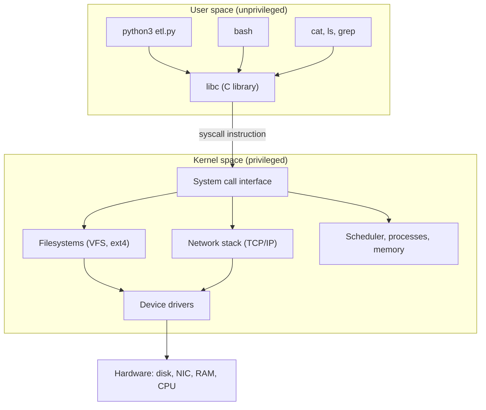
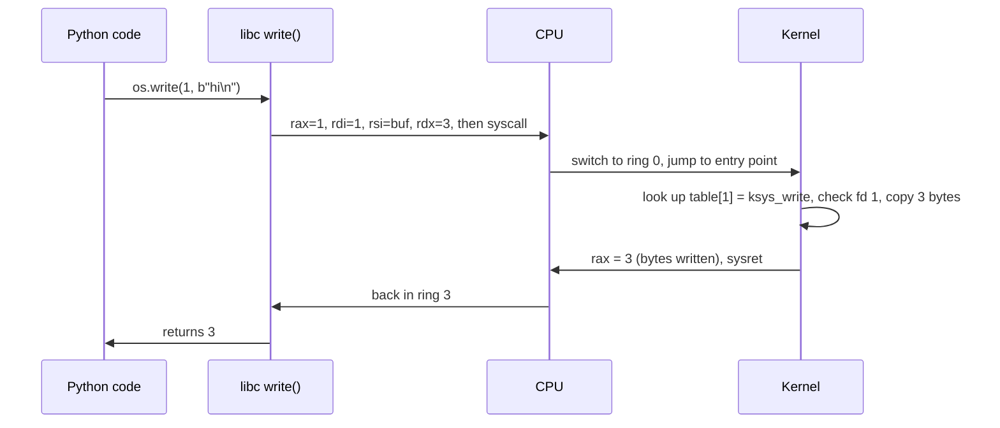
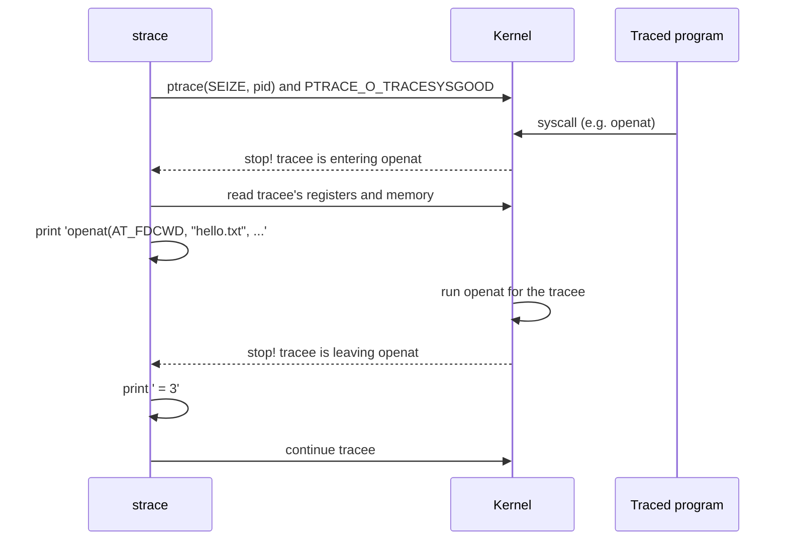

# System calls and strace

> **Level 5 · Chapter 1** · ⏱️ ~50 min read · Prerequisites: [Processes and signals](../03-internals/02-processes-and-signals.md), [Devices, /proc, and /sys](../03-internals/05-devices-proc-sys.md)

Every program you run, whether it's written in Python, C, Go, or bash, has to ask the kernel for help to do anything useful: open a file, print a line, start a process, talk to the network. This chapter shows you how those requests (system calls) work, and how to watch them live with `strace`, the most useful debugging tool you'll learn on Linux.

## Why it matters

It's 07:40 and the nightly export job is still "running". It normally finishes by 02:00. The log file stopped at `connecting to warehouse...` six hours ago. There's no error, no traceback, and the process is using 0% CPU. Restarting it would lose the evidence, and you'd have no idea whether it will happen again tonight.

So you attach `strace` to the stuck process:

```bash
sudo strace -p 48211
```

```text
strace: Process 48211 attached
recvfrom(5,
```

That one unfinished line tells you a lot. The program is blocked inside the kernel, waiting to **receive** data on file descriptor 5. A quick `ls -l /proc/48211/fd/5` shows it's a TCP socket, and `ss -tnp` shows the other end is the warehouse database. The database accepted the connection and then went silent. The bug is a missing **timeout** on a network read. That's a one-line fix, and you found it in two minutes without reading a single line of the program's source code.

The same trick answers a whole family of everyday questions: *Which config file is this tool actually reading? Which file is it getting "permission denied" on? Why is it slow?* Programs can hide their logic, but they can't hide their system calls.

## Concepts

### Two worlds: user space and kernel space

Your computer's memory and CPU time are shared between two very different kinds of code.

- **Kernel space** is where the Linux kernel runs. The kernel is the only code allowed to touch hardware directly: disks, network cards, the screen, the memory controller. It also decides which process runs next and who may open which file.
- **User space** is where everything else runs: your shell, Python, Firefox, `cat`, databases, and the code you write. User-space code is deliberately *powerless*. It can compute (add numbers, build strings, sort lists) inside its own memory, but it cannot read a disk block, send a network packet, or even print a character on its own.

Why build it this way? Safety and fairness. If any program could write to the disk directly, one buggy script could corrupt the filesystem for everyone. If any program could read any memory, your browser could read your SSH keys out of another process. The split means the kernel checks every sensitive request first.



### CPU privilege rings

The split isn't just a convention that programs agree to follow. The CPU itself enforces it.

x86-64 processors have four **privilege levels**, called **rings**, numbered 0 to 3. Lower numbers have more power. Linux only uses two of them:

| Ring | Who runs there | What it may do |
|------|----------------|----------------|
| Ring 0 ("kernel mode") | The Linux kernel | Everything: talk to devices, change page tables, disable interrupts, run privileged instructions |
| Ring 3 ("user mode") | Every process, including root's | Ordinary computation in its own memory only |

The CPU tracks the current ring in a register. If code running in ring 3 tries a privileged instruction (for example, `hlt` to halt the CPU, or writing to the register that controls memory mapping), the CPU refuses and raises a fault. The kernel then usually kills the process with a signal such as `SIGSEGV`.

!!! note "Root is still ring 3"
    A process running as root is **not** in kernel mode. Root is a user-space idea: the kernel checks your user ID when you *ask* for something and says yes more often. A root process still has to make system calls like everyone else. That's why `strace` works the same way on root's programs.

ARM CPUs (like those in a Raspberry Pi or an Apple laptop) use different names ("exception levels" EL0 and EL1), but the idea is identical.

### What a system call is

A **system call** (or **syscall**) is a controlled doorway from user space into the kernel. The program says "please do operation number N with these arguments". The CPU switches to ring 0 and jumps to a fixed entry point that the kernel set up at boot. The kernel checks the request, does the work, puts a result in a register, and switches back to ring 3.

The important property is the *fixed* entry point. A user program can't jump into the middle of the kernel. It can only knock on one door and hand over a request slip. The kernel decides what happens next.

Linux has about 370 system calls on x86-64. You'll use maybe 30 of them regularly. Almost everything your programs do comes down to a few of them: `openat`, `read`, `write`, `close`, `mmap`, `execve`, `clone`, and a handful of others.

### How a system call is invoked

Here's what happens when Python runs `os.write(1, b"hi\n")` on x86-64 Linux:



Step by step:

1. **Arguments go into registers.** The calling convention for Linux x86-64 syscalls is fixed: the syscall **number** goes into the `rax` register. The first six arguments go into `rdi`, `rsi`, `rdx`, `r10`, `r8`, `r9`.
2. **The `syscall` instruction runs.** This single CPU instruction switches to ring 0 and jumps to the kernel's registered entry point.
3. **The kernel dispatches.** It uses the number in `rax` as an index into the **system call table**, an array of function pointers. Entry 1 is the write handler.
4. **The kernel does the work and checks everything.** Is fd 1 open in this process? Is it open for writing? Is the buffer address really inside this process's memory? Only then does it copy the bytes.
5. **The result comes back in `rax`.** A non-negative number means success (here, 3 bytes written). A value between -4095 and -1 means failure, and its absolute value is the error code.
6. **`sysret` returns to user space**, back in ring 3, at the instruction after `syscall`.

The whole round trip costs on the order of 100 nanoseconds on a modern CPU, plus whatever work the kernel does. That's cheap, but not free. A program that makes a million tiny `write` calls is measurably slower than one that makes a thousand big ones. That's the main reason buffering exists, as you'll see in the [next chapter](02-file-descriptors.md).

### System call numbers

Each system call has a fixed number. On x86-64, `read` is 0, `write` is 1, and `openat` is 257. These numbers are part of the kernel's **ABI** (application binary interface): the kernel promises never to change them, because compiled programs depend on them. A binary built in 2008 still runs on today's kernel partly because of this promise.

The numbers live in a header file installed with the kernel headers:

```bash
grep -E '__NR_(read|write|openat|close|execve|exit_group) ' /usr/include/x86_64-linux-gnu/asm/unistd_64.h
```

```text
#define __NR_read 0
#define __NR_write 1
#define __NR_close 3
#define __NR_execve 59
#define __NR_exit_group 231
#define __NR_openat 257
```

The numbers differ between CPU architectures. On 64-bit ARM, `write` is 64. That's one reason a binary compiled for one architecture can't run on another.

### The libc wrapper

Almost no program executes the `syscall` instruction directly. Instead it calls a small function in the **C library**, or **libc**. On Mint (as on most Linux distributions) that's **glibc**, the GNU C Library, at `/lib/x86_64-linux-gnu/libc.so.6`.

For each system call, libc has a **wrapper function** with the same name, such as `write()`, `read()`, or `getpid()`. The wrapper does three jobs:

1. Moves your arguments into the right registers and runs `syscall`.
2. Checks the result. If the kernel returned a negative error code, the wrapper stores the positive code in a variable called **`errno`** and returns -1 instead.
3. Sometimes adds conveniences. For example, the libc function `open()` actually makes the `openat` syscall, and `fork()` makes the `clone` syscall.

Python is itself a C program, so it uses the same wrappers. The path for `os.write` is:

```text
os.write()  →  CPython's C code  →  glibc write()  →  syscall instruction  →  kernel
```

Higher-level Python like `print()` or `open().read()` adds more layers on top (buffering, encoding), but it always ends in the same handful of syscalls.

### errno: how failures are reported

When a system call fails, the kernel returns a small error number. Each number has a symbolic name that starts with `E`. You'll see these constantly in `strace` output and in Python exceptions:

| Name | Number | Meaning | Typical cause |
|------|--------|---------|---------------|
| `ENOENT` | 2 | No such file or directory | Typo in a path; file not created yet |
| `EACCES` | 13 | Permission denied | File mode or directory permissions block you |
| `EEXIST` | 17 | File exists | `O_CREAT|O_EXCL` on an existing file; `mkdir` of an existing dir |
| `EISDIR` | 21 | Is a directory | Opening a directory for writing |
| `EMFILE` | 24 | Too many open files | File descriptor leak; limit too low |
| `ENOSPC` | 28 | No space left on device | Full disk (or out of inodes) |
| `EPIPE` | 32 | Broken pipe | Writing to a pipe or socket whose reader is gone |
| `EAGAIN` | 11 | Resource temporarily unavailable | Non-blocking I/O with nothing ready yet |
| `EINTR` | 4 | Interrupted system call | A signal arrived while the call was blocked |
| `ECONNREFUSED` | 111 | Connection refused | Nothing is listening on that port |

Python turns these into exceptions. The `errno` attribute holds the number, and the exception class often tells you the name: `FileNotFoundError` is `ENOENT`, `PermissionError` is `EACCES`, and so on.

```python
import errno, os

for path in ["/nonexistent", "/etc/shadow", "/etc"]:
    try:
        fd = os.open(path, os.O_WRONLY)
    except OSError as e:
        print(f"{path}: errno={e.errno} ({errno.errorcode[e.errno]}) -> {e.strerror}")
```

```text
/nonexistent: errno=2 (ENOENT) -> No such file or directory
/etc/shadow: errno=13 (EACCES) -> Permission denied
/etc: errno=21 (EISDIR) -> Is a directory
```

`man 3 errno` lists every code, and `man 2 open` lists which codes `open` can return and why.

### A tour of common system calls

You don't need to memorize hundreds of syscalls. These are the ones you'll see in nearly every trace:

| Syscall | What it does | You'll see it when... |
|---------|--------------|------------------------|
| `openat` | Opens a file (relative to a directory fd, usually `AT_FDCWD` = "the current directory") and returns a new file descriptor | Any file is opened. The older `open` syscall exists but glibc uses `openat` |
| `read` | Reads up to N bytes from a file descriptor into a buffer | Reading files, pipes, sockets, the terminal |
| `write` | Writes N bytes from a buffer to a file descriptor | Printing output, writing files |
| `close` | Releases a file descriptor | A file is closed (or a program is exiting) |
| `newfstatat` / `fstat` / `statx` | Gets a file's metadata (size, mode, owner, times) | `ls -l`, checking whether a file exists |
| `mmap` | Maps a file or anonymous memory into the address space | Loading shared libraries, big memory allocations |
| `munmap` / `mprotect` | Unmaps memory / changes its permissions | Freeing memory; making library code read-only |
| `brk` | Moves the end of the **heap** (the process's main dynamic-memory area) | `malloc` growing the heap with small allocations |
| `execve` | Replaces the current program with a new one | Every command a shell runs |
| `clone` / `clone3` | Creates a new process or thread | `fork()`, starting threads |
| `wait4` | Waits for a child process to change state | A shell waiting for a command to finish |
| `exit_group` | Ends the process (all its threads) | Every program's last syscall |
| `getdents64` | Reads directory entries | `ls`, `os.listdir`, Python importing modules |
| `socket` / `connect` / `accept4` | Network endpoints | Anything that uses the network |
| `poll` / `epoll_wait` | Waits until one of many fds is ready | Servers, event loops, interactive programs |

You saw `fork`, `exec`, and `wait` as ideas in [Processes and signals](../03-internals/02-processes-and-signals.md), and memory mapping in [Memory](../03-internals/03-memory.md). Here you'll watch them actually happen.

### The vDSO: system calls that aren't

Some "system calls" are called so often, and do so little, that the kernel cheats. Asking the time is the classic example. A busy web server might check the clock thousands of times per second. Switching into the kernel each time just to read a number would be wasteful.

So the kernel maps a tiny shared library into **every** process at startup, called the **vDSO** ("virtual dynamic shared object"). It contains user-space versions of a few functions, mainly `clock_gettime`, `gettimeofday`, and `time`. The kernel keeps the current time on a memory page that the vDSO code can read. When glibc's `clock_gettime()` runs, it calls the vDSO version, which reads that page without ever entering ring 0.

You can see the vDSO in any process's memory map:

```bash
grep vdso /proc/self/maps
```

```text
7ffd3a5f2000-7ffd3a5f4000 r-xp 00000000 00:00 0                          [vdso]
```

The practical consequence: **vDSO calls don't show up in `strace`**, because they're not real system calls. If you're hunting for "where does it read the time?" with `strace`, you won't find it. You'll see that in the examples below.

### How strace works

**`strace`** is a program that runs another program and prints every system call it makes, with arguments and return values. It uses a kernel feature called **`ptrace`** ("process trace"), the same facility debuggers like `gdb` use.



The tracee stops **twice** per syscall: once on entry (so strace can print the arguments) and once on exit (so it can print the result). Each stop involves context switches between the two processes. That's why programs run noticeably slower under `strace`, sometimes 10 to 100 times slower for syscall-heavy work. It's a diagnostic tool, not something to leave running in production for long.

### Who may attach: ptrace_scope

Tracing another process is powerful. A tracer can read the tracee's memory (including passwords and keys) and even change its registers. So Ubuntu and Mint restrict it with a kernel security module called **Yama**, controlled by one setting:

```bash
cat /proc/sys/kernel/yama/ptrace_scope
```

```text
1
```

| Value | Meaning |
|-------|---------|
| 0 | Classic Unix rule: you may trace any process running as your own user |
| 1 | **Default on Mint/Ubuntu.** You may only trace your own *descendants* (programs you start under the tracer). Attaching to an unrelated running process needs root (more precisely, the `CAP_SYS_PTRACE` capability) |
| 2 | Only root may use `ptrace` at all |
| 3 | No one may attach, not even root. Can't be undone without a reboot |

With the default of 1, `strace ./my_program` always works, because `strace` starts the program as its own child. But `strace -p 48211` on a process you started earlier in another terminal fails with "Operation not permitted", even though it's your own process. Use `sudo strace -p` for that.

!!! warning "Common mistake"
    Lowering `ptrace_scope` to 0 "to make strace work" weakens a real defense: it lets any compromised program running as you read the memory of your SSH agent, password manager, and browser. Use `sudo strace -p PID` for one-off attaching instead, and leave the setting alone.

## Commands and examples

All examples run in a scratch directory. Create one and a test file:

```bash
mkdir -p ~/level5 && cd ~/level5
echo "hello from mint" > hello.txt
```

### Your first trace: cat

Run `cat` under `strace`. The trace goes to **stderr**, and `cat`'s normal output goes to stdout, so they're interleaved in your terminal:

```bash
strace cat hello.txt
```

```text
execve("/usr/bin/cat", ["cat", "hello.txt"], 0x7ffe1b0c6e48 /* 54 vars */) = 0
brk(NULL)                               = 0x5d4a1a7c3000
mmap(NULL, 8192, PROT_READ|PROT_WRITE, MAP_PRIVATE|MAP_ANONYMOUS, -1, 0) = 0x7f0e7c4e1000
access("/etc/ld.so.preload", R_OK)      = -1 ENOENT (No such file or directory)
openat(AT_FDCWD, "/etc/ld.so.cache", O_RDONLY|O_CLOEXEC) = 3
fstat(3, {st_mode=S_IFREG|0644, st_size=93515, ...}) = 0
mmap(NULL, 93515, PROT_READ, MAP_PRIVATE, 3, 0) = 0x7f0e7c4ca000
close(3)                                = 0
openat(AT_FDCWD, "/lib/x86_64-linux-gnu/libc.so.6", O_RDONLY|O_CLOEXEC) = 3
read(3, "\177ELF\2\1\1\3\0\0\0\0\0\0\0\0\3\0>\0\1\0\0\0\220\243\2\0\0\0\0\0"..., 832) = 832
pread64(3, "\6\0\0\0\4\0\0\0@\0\0\0\0\0\0\0@\0\0\0\0\0\0\0@\0\0\0\0\0\0\0"..., 784, 64) = 784
fstat(3, {st_mode=S_IFREG|0755, st_size=2129424, ...}) = 0
mmap(NULL, 2174352, PROT_READ, MAP_PRIVATE|MAP_DENYWRITE, 3, 0) = 0x7f0e7c200000
mmap(0x7f0e7c228000, 1609728, PROT_READ|PROT_EXEC, MAP_PRIVATE|MAP_FIXED|MAP_DENYWRITE, 3, 0x28000) = 0x7f0e7c228000
mmap(0x7f0e7c3b1000, 323584, PROT_READ, MAP_PRIVATE|MAP_FIXED|MAP_DENYWRITE, 3, 0x1b1000) = 0x7f0e7c3b1000
mmap(0x7f0e7c400000, 24576, PROT_READ|PROT_WRITE, MAP_PRIVATE|MAP_FIXED|MAP_DENYWRITE, 3, 0x1ff000) = 0x7f0e7c400000
mmap(0x7f0e7c406000, 52624, PROT_READ|PROT_WRITE, MAP_PRIVATE|MAP_FIXED|MAP_ANONYMOUS, -1, 0) = 0x7f0e7c406000
close(3)                                = 0
mmap(NULL, 12288, PROT_READ|PROT_WRITE, MAP_PRIVATE|MAP_ANONYMOUS, -1, 0) = 0x7f0e7c4c7000
arch_prctl(ARCH_SET_FS, 0x7f0e7c4c7740) = 0
set_tid_address(0x7f0e7c4c7a10)         = 51027
set_robust_list(0x7f0e7c4c7a20, 24)     = 0
rseq(0x7f0e7c4c8060, 0x20, 0, 0x53053053) = 0
mprotect(0x7f0e7c400000, 16384, PROT_READ) = 0
mprotect(0x5d4a19a5a000, 4096, PROT_READ) = 0
mprotect(0x7f0e7c51f000, 8192, PROT_READ) = 0
prlimit64(0, RLIMIT_STACK, NULL, {rlim_cur=8192*1024, rlim_max=RLIM64_INFINITY}) = 0
munmap(0x7f0e7c4ca000, 93515)           = 0
openat(AT_FDCWD, "/usr/lib/locale/locale-archive", O_RDONLY|O_CLOEXEC) = 3
fstat(3, {st_mode=S_IFREG|0644, st_size=5719296, ...}) = 0
mmap(NULL, 5719296, PROT_READ, MAP_PRIVATE, 3, 0) = 0x7f0e7bc00000
close(3)                                = 0
getrandom("\xee\x24\x02\x09\x8e\x7a\x16\x4f", 8, GRND_NONBLOCK) = 8
brk(NULL)                               = 0x5d4a1a7c3000
brk(0x5d4a1a7e4000)                     = 0x5d4a1a7e4000
fstat(1, {st_mode=S_IFCHR|0620, st_rdev=makedev(0x88, 0), ...}) = 0
openat(AT_FDCWD, "hello.txt", O_RDONLY) = 3
fstat(3, {st_mode=S_IFREG|0664, st_size=16, ...}) = 0
fadvise64(3, 0, 0, POSIX_FADV_SEQUENTIAL) = 0
mmap(NULL, 139264, PROT_READ|PROT_WRITE, MAP_PRIVATE|MAP_ANONYMOUS, -1, 0) = 0x7f0e7c4a5000
read(3, "hello from mint\n", 131072)    = 16
write(1, "hello from mint\n", 16hello from mint
)       = 16
read(3, "", 131072)                     = 0
munmap(0x7f0e7c4a5000, 139264)          = 0
close(3)                                = 0
close(1)                                = 0
close(2)                                = 0
exit_group(0)                           = ?
+++ exited with 0 +++
```

Fifty lines to print one line. Each line has the same shape:

```text
syscall_name(argument1, argument2, ...) = return_value [ERROR_NAME (description)]
```

Pointers and buffers are shown as their contents (strings in quotes) or as addresses (`0x7f...`). Structures are shown in `{braces}`. Flags are decoded into their names (`O_RDONLY|O_CLOEXEC`).

The trace falls into four phases. Read it in chunks:

**Phase 1: becoming `cat` (line 1).**

- `execve("/usr/bin/cat", ["cat", "hello.txt"], ...) = 0`: your shell forked a child, and that child replaced itself with `/usr/bin/cat`. The arguments are the program path, the `argv` list, and the environment (54 variables, not printed). `= 0` means success. After a successful `execve`, the old program is gone.

**Phase 2: the dynamic loader sets up libc (lines 2 to 28).** Before `cat`'s own `main()` runs, the **dynamic loader** (`ld-linux-x86-64.so.2`, a small program the kernel starts first) loads shared libraries:

- `brk(NULL)` asks "where does the heap end right now?". Passing NULL just queries.
- `access("/etc/ld.so.preload", R_OK) = -1 ENOENT`: checks for a system-wide preload list. It doesn't exist, which is normal. **Not every error in a trace is a problem.** Programs probe for optional files all the time.
- `openat(AT_FDCWD, "/etc/ld.so.cache", O_RDONLY|O_CLOEXEC) = 3`: opens the cache that maps library names to paths. The kernel returns **file descriptor 3**, because 0, 1, and 2 are already taken by stdin, stdout, and stderr. `O_CLOEXEC` means "close this automatically if I `execve` later".
- `fstat` and `mmap` get the cache's size and map it into memory, then `close(3)` releases the descriptor. Mapping it is faster than reading it.
- `openat(... "libc.so.6" ...) = 3` reuses the number 3, since it was just freed. The kernel always hands out the **lowest free** fd number.
- `read(3, "\177ELF...", 832)` reads the ELF header, the start of every Linux executable and library.
- The four `mmap(... MAP_FIXED ...)` calls map libc's sections: read-only data, executable code (`PROT_READ|PROT_EXEC`), and writable data.
- `arch_prctl`, `set_tid_address`, `set_robust_list`, and `rseq` set up thread-local storage and threading support.
- `mprotect(..., PROT_READ)` makes some regions read-only after relocation. This is a security hardening step called RELRO.

**Phase 3: `cat` does its actual job (from the `locale-archive` line on).**

- `openat(... "/usr/lib/locale/locale-archive" ...)`: `cat` calls `setlocale()` so error messages use your language.
- `fstat(1, {st_mode=S_IFCHR...})`: `cat` checks what its stdout is. `S_IFCHR` means a character device, here your terminal. If you redirected to a file you'd see `S_IFREG`, and to a pipe, `S_IFIFO`.
- `openat(AT_FDCWD, "hello.txt", O_RDONLY) = 3`: here's the file you asked for.
- `fadvise64(..., POSIX_FADV_SEQUENTIAL)`: a hint to the kernel, "I'll read this front to back, so read ahead aggressively".
- `read(3, "hello from mint\n", 131072) = 16`: asks for up to 128 KiB, gets 16 bytes, the whole file.
- `write(1, "hello from mint\n", 16) = 16`: writes those bytes to stdout. Notice the actual text `hello from mint` appears *in the middle of the strace line*. That's because both outputs go to the same terminal, and the real write happened between strace printing the arguments and printing the result.
- `read(3, "", 131072) = 0`: **a read that returns 0 means end of file.** This is how every program on Linux detects EOF.

**Phase 4: cleanup and exit.**

- `close(3)`, `close(1)`, `close(2)`: closing stdout explicitly lets `cat` notice a failed final write (for example, a full disk) and report it.
- `exit_group(0) = ?`: ends the process with status 0. The `?` is because the call never returns.
- `+++ exited with 0 +++`: strace's own note that the process is gone.

!!! tip "Most of a trace is startup noise"
    For a small program, 80% of the trace is the dynamic loader. Skip to the first `openat` of a file *you* care about, and read from there.

### Filtering with -e trace=

Full traces are long. Use `-e trace=` to keep only the calls you care about:

```bash
strace -e trace=openat,read,write,close cat hello.txt > /dev/null
```

```text
openat(AT_FDCWD, "/etc/ld.so.cache", O_RDONLY|O_CLOEXEC) = 3
close(3)                                = 0
openat(AT_FDCWD, "/lib/x86_64-linux-gnu/libc.so.6", O_RDONLY|O_CLOEXEC) = 3
read(3, "\177ELF\2\1\1\3\0\0\0\0\0\0\0\0\3\0>\0\1\0\0\0\220\243\2\0\0\0\0\0"..., 832) = 832
close(3)                                = 0
openat(AT_FDCWD, "/usr/lib/locale/locale-archive", O_RDONLY|O_CLOEXEC) = 3
close(3)                                = 0
openat(AT_FDCWD, "hello.txt", O_RDONLY) = 3
read(3, "hello from mint\n", 131072)    = 16
write(1, "hello from mint\n", 16)       = 16
read(3, "", 131072)                     = 0
close(3)                                = 0
close(1)                                = 0
close(2)                                = 0
+++ exited with 0 +++
```

`> /dev/null` throws away `cat`'s own output, so only the trace (on stderr) remains. strace also accepts **syscall classes**, which start with `%`:

| Class | What it includes |
|-------|------------------|
| `%file` | Every syscall that takes a filename: `openat`, `stat`, `access`, `execve`, `unlink`, ... |
| `%process` | Process lifecycle: `clone`, `execve`, `wait4`, `exit_group`, `kill` |
| `%network` | Socket calls: `socket`, `connect`, `bind`, `accept`, `sendto`, `recvfrom`, ... |
| `%signal` | Signal handling: `rt_sigaction`, `kill`, `rt_sigprocmask`, ... |
| `%memory` | `mmap`, `munmap`, `brk`, `mprotect`, ... |
| `%desc` | Anything using a file descriptor: `read`, `write`, `close`, `poll`, ... |

You can also negate: `-e trace=!mmap,mprotect` shows everything *except* those. Quote it in bash (`-e 'trace=!mmap'`) because `!` is special to the shell.

There's also `-e status=failed` (or the short form `-Z`), which shows only calls that returned an error. That's perfect for hunting a hidden failure.

### Counting with -c

Instead of a line per call, `-c` prints a summary table when the program exits:

```bash
strace -c cat hello.txt > /dev/null
```

```text
% time     seconds  usecs/call     calls    errors syscall
------ ----------- ----------- --------- --------- ----------------
 46.70    0.000290         290         1           execve
 15.94    0.000099           9        10           mmap
  5.48    0.000034           8         4           openat
  4.83    0.000030          15         2           munmap
  4.35    0.000027           4         6           close
  4.03    0.000025           8         3           mprotect
  3.70    0.000023           4         5           fstat
  3.54    0.000022           7         3           brk
  2.90    0.000018           6         3           read
  1.61    0.000010           5         2           pread64
  0.97    0.000006           6         1         1 access
  0.81    0.000005           5         1           write
  ...
------ ----------- ----------- --------- --------- ----------------
100.00    0.000621          12        48         1 total
```

Columns: share of total syscall time, total seconds spent *inside the kernel* for that call, average microseconds per call, number of calls, and how many failed. The `errors` column is a fast way to spot a program that's repeatedly failing at something.

`-c` is the right first move for "why is this slow?". If a program makes 2 million `read` calls of 1 byte each, it will jump out at you here.

### Timing: -T and -tt

Two flags add time information to each line:

- **`-tt`** prefixes each line with the wall-clock time, to the microsecond. Useful for lining up a trace with log files.
- **`-T`** appends the time spent *inside* each call, in `<seconds>`. Useful for finding the one slow call.

```bash
strace -tt -T -e trace=openat,read cat hello.txt > /dev/null
```

```text
...
10:37:04.577004 openat(AT_FDCWD, "/usr/lib/locale/locale-archive", O_RDONLY|O_CLOEXEC) = 3 <0.000014>
10:37:04.577272 openat(AT_FDCWD, "hello.txt", O_RDONLY) = 3 <0.000012>
10:37:04.577381 read(3, "hello from mint\n", 131072) = 16 <0.000014>
10:37:04.577444 read(3, "", 131072)     = 0 <0.000009>
10:37:04.577718 +++ exited with 0 +++
```

Each of these took around 10 microseconds. If you saw `connect(...) = 0 <5.003127>`, you'd know that one connection took five seconds, probably a DNS or firewall problem. `-r` is a third option that prints the time *since the previous line*, which makes gaps (time spent computing in user space) easy to spot.

### Following children with -f

By default strace traces only the process it started. When that process forks, the children run untraced. **`-f`** follows every child and thread too, prefixing each line with `[pid N]`:

```bash
strace -f -e trace=process bash -c 'ls hello.txt; echo done'
```

```text
execve("/usr/bin/bash", ["bash", "-c", "ls hello.txt; echo done"], 0x7ffd52c8e0b8 /* 54 vars */) = 0
clone(child_stack=NULL, flags=CLONE_CHILD_CLEARTID|CLONE_CHILD_SETTID|SIGCHLD, child_tidptr=0x7f4b1d8f5a10) = 75749
strace: Process 75749 attached
[pid 75748] wait4(-1,  <unfinished ...>
[pid 75749] execve("/usr/bin/ls", ["ls", "hello.txt"], 0x5f4e493ad6f0 /* 54 vars */) = 0
hello.txt
[pid 75749] exit_group(0)               = ?
[pid 75749] +++ exited with 0 +++
<... wait4 resumed>[{WIFEXITED(s) && WEXITSTATUS(s) == 0}], 0, NULL) = 75749
--- SIGCHLD {si_signo=SIGCHLD, si_code=CLD_EXITED, si_pid=75749, si_uid=1000, si_status=0, si_utime=0, si_stime=0} ---
wait4(-1, 0x7ffc059f32d0, WNOHANG, NULL) = -1 ECHILD (No child processes)
done
exit_group(0)                           = ?
+++ exited with 0 +++
```

This is the fork/exec/wait cycle from Level 3, live:

1. bash calls `clone(...)` (that's what glibc's `fork()` uses). The child gets PID 75749.
2. The parent (75748) calls `wait4(-1, ...)` and blocks. strace prints `<unfinished ...>` because another process's line interrupted it.
3. The child calls `execve("/usr/bin/ls", ...)` and becomes `ls`.
4. `ls` prints and exits with `exit_group(0)`.
5. The parent's `wait4` resumes and returns the child's PID and status. `WIFEXITED(s) && WEXITSTATUS(s) == 0` means "exited normally with code 0".
6. The kernel sends the parent a `SIGCHLD` signal. strace shows signals between `---` markers.
7. `echo` is a bash builtin, so it runs without any fork.

!!! tip "Use -ff with -o for busy programs"
    `strace -ff -o trace cmd` writes one file per process: `trace.75748`, `trace.75749`, and so on. That's far easier to read than an interleaved trace of a program that starts dozens of children.

### Long strings with -s, and saving with -o

strace truncates strings to 32 characters by default and adds `...`. When you need to see the actual data (an HTTP request, an SQL query, a config line), raise it with **`-s`**:

```bash
strace -s 200 -e trace=write python3 -c 'print("SELECT id, name, email FROM customers WHERE created_at > now() - interval 1 day")' > /dev/null
```

```text
write(1, "SELECT id, name, email FROM customers WHERE created_at > now() - interval 1 day\n", 80) = 80
+++ exited with 0 +++
```

Note that filenames are never truncated, only data buffers.

**`-o FILE`** writes the trace to a file instead of stderr. That keeps it separate from the program's own error messages, and lets you `grep` it afterwards:

```bash
strace -o trace.txt -f -tt python3 etl.py
grep -E 'ENOENT|EACCES' trace.txt | head
```

### Tracing a Python script

Python programs make many more syscalls than `cat`, because the interpreter imports dozens of modules at startup. Here's a tiny script:

```python title="readcfg.py"
from pathlib import Path
text = Path("hello.txt").read_text()
print(text.upper(), end="")
```

The summary first:

```bash
strace -c python3 readcfg.py > /dev/null
```

```text
% time     seconds  usecs/call     calls    errors syscall
------ ----------- ----------- --------- --------- ----------------
 22.89    0.000480          20        24           getdents64
 22.75    0.000477         477         1           execve
 17.98    0.000377           1       210        39 newfstatat
  7.63    0.000160           2        66           read
  6.29    0.000132           2        54         5 openat
  4.86    0.000102           2        49           close
  4.20    0.000088           1        82           fstat
  3.29    0.000069           5        13           brk
  3.05    0.000064           0        69         2 lseek
  3.05    0.000064           1        36        35 ioctl
...
------ ----------- ----------- --------- --------- ----------------
100.00    0.003284           4       734        85 total
```

734 syscalls, compared with 48 for `cat`. Most come from the **import system**: `getdents64` lists the directories on `sys.path`, `newfstatat` checks whether each candidate module file exists (39 of those fail with `ENOENT`, which is normal searching), and `openat` plus `read` load the cached bytecode (`.pyc`) files.

Now find the part that's *your* code:

```bash
strace python3 readcfg.py 2>&1 | grep -A11 'hello.txt'
```

```text
openat(AT_FDCWD, "hello.txt", O_RDONLY|O_CLOEXEC) = 3
fstat(3, {st_mode=S_IFREG|0664, st_size=16, ...}) = 0
ioctl(3, TCGETS, 0x7ffc9b57d8e0)        = -1 ENOTTY (Inappropriate ioctl for device)
lseek(3, 0, SEEK_CUR)                   = 0
lseek(3, 0, SEEK_CUR)                   = 0
fstat(3, {st_mode=S_IFREG|0664, st_size=16, ...}) = 0
read(3, "hello from mint\n", 17)        = 16
read(3, "", 1)                          = 0
close(3)                                = 0
write(1, "HELLO FROM MINT\n", 16HELLO FROM MINT
)       = 16
rt_sigaction(SIGINT, {sa_handler=SIG_DFL, ...}, {sa_handler=0x6e79b0, ...}, 8) = 0
```

Line by line, this is Python's `open()` machinery at work:

- `openat(..., O_RDONLY|O_CLOEXEC)`: Python always adds `O_CLOEXEC`. Since Python 3.4, files you open are **not inherited** by programs you `exec`. Compare with `cat`, which didn't add it.
- `fstat`: Python checks the file's size (to size its read buffer) and makes sure it isn't a directory.
- `ioctl(3, TCGETS, ...) = -1 ENOTTY`: Python asks "is this a terminal?" to decide on line buffering. It's a regular file, so the answer is no. This "error" is expected.
- `lseek(3, 0, SEEK_CUR)`: Python asks for the current position, so the file object knows where it is.
- `read(3, ..., 17) = 16`: `read_text()` asks for size+1 bytes, so it can detect EOF in one call. It gets 16.
- `read(3, "", 1) = 0`: confirms EOF.
- `close(3)`: `read_text()` closes the file for you.
- `write(1, "HELLO FROM MINT\n", 16)`: the `print()`.
- `rt_sigaction(SIGINT, ...)`: the interpreter shutting down, restoring the default Ctrl+C handler.

Every high-level Python operation turns into a predictable short sequence of syscalls. Once you've seen them, you can recognize them in any trace.

### Making a raw system call yourself

To see that libc is "just" a wrapper, here's a C program that writes to stdout three ways: through the libc wrapper, through the generic `syscall()` function, and with the raw `syscall` instruction using inline assembly.

```c title="hello_sys.c"
#include <unistd.h>       /* write(), syscall() */
#include <sys/syscall.h>  /* SYS_write */

int main(void) {
    /* 1. The normal way: the libc wrapper */
    write(1, "via libc wrapper\n", 17);

    /* 2. The generic way: syscall() with the number */
    syscall(SYS_write, 1, "via syscall()\n", 14);

    /* 3. The raw way: put arguments in registers, run the instruction */
    const char msg[] = "via raw syscall instruction\n";
    long ret;
    __asm__ volatile (
        "syscall"
        : "=a"(ret)                       /* rax holds the return value */
        : "a"(1L),                        /* rax = 1 = __NR_write      */
          "D"(1L),                        /* rdi = fd 1 (stdout)       */
          "S"(msg),                       /* rsi = buffer              */
          "d"(sizeof msg - 1)             /* rdx = byte count          */
        : "rcx", "r11", "memory");        /* syscall clobbers rcx, r11 */
    return 0;
}
```

Compile and trace it (`gcc` comes with Mint's `build-essential` package):

```bash
gcc -o hello_sys hello_sys.c
strace -e trace=write ./hello_sys > /dev/null
```

```text
write(1, "via libc wrapper\n", 17)      = 17
write(1, "via syscall()\n", 14)         = 14
write(1, "via raw syscall instruction\n", 28) = 28
+++ exited with 0 +++
```

To the kernel, all three are identical. strace sees only the syscall, never the path your code took to make it.

You can do the same from Python with `ctypes`, which lets Python call C functions in shared libraries. Syscall 39 is `getpid`:

```python
import ctypes, os

libc = ctypes.CDLL(None)                 # the libc already loaded into Python
print("os.getpid()      :", os.getpid())
print("libc.getpid()    :", libc.getpid())
print("libc.syscall(39) :", libc.syscall(39))
```

```text
os.getpid()      : 79718
libc.getpid()    : 79718
libc.syscall(39) : 79718
```

### Seeing the vDSO in action

This C program asks for the time 1,000 times, then calls `getpid()` once:

```c title="vdso.c"
#include <stdio.h>
#include <time.h>
#include <unistd.h>

int main(void) {
    struct timespec ts;
    for (int i = 0; i < 1000; i++)
        clock_gettime(CLOCK_REALTIME, &ts);   /* served by the vDSO */
    printf("pid %d, time %ld\n", getpid(), (long)ts.tv_sec);  /* a real syscall */
    return 0;
}
```

```bash
gcc -O2 -o vdso vdso.c
strace -c ./vdso 2>&1 | grep -E 'clock_gettime|getpid|total'
```

```text
  0.62    0.000005           5         1           getpid
100.00    0.000803          22        35         1 total
```

There are 1,000 calls to `clock_gettime` in the code, and zero of them in the trace. They never entered the kernel. Python's `time.time()` and `time.monotonic()` take the same fast path.

### Attaching to a running process with -p

`-p PID` attaches to a process that's already running. Press ++ctrl+c++ to detach, which leaves the process running as before. Because of `ptrace_scope=1`, attaching to a process you didn't start under strace needs `sudo`:

```bash
python3 -c 'import time; time.sleep(600)' &
strace -p $!
```

```text
[1] 76754
strace: attach: ptrace(PTRACE_SEIZE, 76754): Operation not permitted
```

```bash
sudo strace -p 76754
```

```text
strace: Process 76754 attached
clock_nanosleep(CLOCK_MONOTONIC, TIMER_ABSTIME, {tv_sec=5385, tv_nsec=164341988}, NULL^Cstrace: Process 76754 detached
 <detached ...>
```

The process is sitting in `clock_nanosleep`, the syscall behind `time.sleep()`. `TIMER_ABSTIME` means "sleep until this absolute point on the monotonic clock", which is how Python resumes the right amount of sleep if a signal interrupts it. Use `-f` together with `-p` to include all of a multi-threaded process's threads (for a Python web server, that's usually what you want). Clean up with `kill %1`.

### ltrace: library calls

strace shows the boundary between a program and the kernel. **`ltrace`** shows the boundary one layer up, between a program and its *shared libraries* (mostly libc). It's installed on Mint by default, or via `sudo apt install ltrace`.

```bash
ltrace cat hello.txt 2>&1 | grep -E 'setlocale|open|read|write'
```

```text
setlocale(LC_ALL, "")                            = "en_US.UTF-8"
open("hello.txt", 0, 07777)                      = 3
read(3, "hello from mint\n", 131072)             = 16
write(1, "hello from mint\n", 16hello from mint
read(3, "", 131072)                              = 0
```

Notice `open(...)` here versus `openat(...)` in strace. `cat` calls the libc function `open()`, and libc implements it with the `openat` syscall. ltrace shows what the program asked libc for. strace shows what libc asked the kernel for.

ltrace is handy for programs that do a lot in libraries without syscalls (string handling, `getenv` lookups), but it only works on dynamically linked programs, it's much slower than strace, and it doesn't see into Python code. Reach for strace first.

!!! info "Modern alternatives"
    For production systems, **eBPF**-based tools such as `opensnoop`, `execsnoop`, and `bpftrace` (from the `bpfcc-tools` and `bpftrace` packages) watch syscalls system-wide with far less overhead than ptrace. `perf trace` is another low-overhead strace-like tool. You'll meet these in [Performance analysis](../06-expert/02-performance-analysis.md). strace remains the right tool for "what is *this one* program doing?".

### Debugging recipe 1: which config file does it read?

Documentation says a tool reads "the usual config locations". Which ones, in what order? Trace the file-related calls and look for config-ish paths. Here's `ssh`, using `-G` (print the resolved config and exit, without connecting):

```bash
strace -e trace=%file -f ssh -G mint 2>&1 >/dev/null | grep -E 'ssh_config|\.ssh'
```

```text
openat(AT_FDCWD, "/home/alex/.ssh/config", O_RDONLY) = -1 ENOENT (No such file or directory)
openat(AT_FDCWD, "/etc/ssh/ssh_config", O_RDONLY) = 3
openat(AT_FDCWD, "/etc/ssh/ssh_config.d/", O_RDONLY|O_NONBLOCK|O_CLOEXEC|O_DIRECTORY) = 4
```

The order is now a fact, not a guess: your personal `~/.ssh/config` first (missing here, so `ENOENT`), then the system-wide file, then everything in `ssh_config.d/`. Note the shell trick `2>&1 >/dev/null`: it sends the trace (stderr) into the pipe and throws away the program's normal stdout.

The same works for anything: `strace -e trace=%file -o t.txt your-tool`, then `grep -v ENOENT t.txt` to see what it actually opened, or `grep ENOENT t.txt` to see where it looked and found nothing.

### Debugging recipe 2: why does it hang?

A hung program is blocked in a syscall. strace shows which one, and the arguments usually tell you why. Create a named pipe (a FIFO, covered in [Pipes and sockets](04-pipes-and-sockets.md)) and try to read it:

```bash
mkfifo myfifo
strace cat myfifo
```

```text
...
openat(AT_FDCWD, "myfifo", O_RDONLY
```

The line has no closing parenthesis and no result: the call hasn't returned. `cat` is stuck *opening* the file. That's because opening a FIFO for reading blocks until someone opens it for writing. From a second terminal, `echo hi > myfifo` releases it.

Common hang signatures and what they mean:

| Stuck in | Meaning | Look at |
|----------|---------|---------|
| `read(0, ` | Waiting for keyboard input on stdin | Did it expect piped input? |
| `read(5, ` / `recvfrom(5, ` | Waiting for data on fd 5 | `ls -l /proc/PID/fd/5`; probably a socket or pipe |
| `connect(5, {... sin_port=htons(5432) ...}` | TCP connection not completing | Firewall dropping packets; wrong host |
| `wait4(-1, ` | Waiting for a child process | Find the child with `ps --ppid PID` and trace *it* |
| `futex(0x..., FUTEX_WAIT...` | Waiting on a lock held by another thread | Use `-f`; possibly a deadlock |
| `flock(3, LOCK_EX` | Waiting for a file lock | `lsof` on the lock file to find the holder |
| `epoll_wait(` / `poll(` / `select(` | An event loop idling, waiting for any activity | Often normal for servers |

### Debugging recipe 3: "Permission denied", but on what?

Error messages often don't name the file. strace always does:

```bash
touch secret.txt && chmod 000 secret.txt
strace -e trace=openat cat secret.txt 2>&1 | grep -v -E 'ld.so|libc|locale'
```

```text
openat(AT_FDCWD, "secret.txt", O_RDONLY) = -1 EACCES (Permission denied)
cat: secret.txt: Permission denied
+++ exited with 1 +++
```

Here `cat` named the file, but plenty of programs just print "Permission denied" or "failed to load configuration". Use `-Z` (only failed calls) on a big program to go straight to the failures:

```bash
strace -f -Z -o fails.txt some-tool --start
grep -E 'EACCES|EPERM' fails.txt
```

`EACCES` usually means file permissions or a directory along the path that you can't search (missing `x` bit, see [Permissions](../01-command-line/03-permissions.md)). `EPERM` usually means the operation itself needs privileges (binding port 80, changing a file's owner).

!!! warning "Common mistake"
    Don't panic at every `ENOENT` in a trace. Programs search for files in many places, and failed lookups are normal. Look for the **last** failure before the program gave up, or a failure on a path you know *should* exist.

## Exercises

### Exercise 1: ls versus ls -l (easy)

Use `strace -c` to compare `ls /etc` and `ls -l /etc`. Roughly how many more syscalls does the long format make, and which syscalls account for the difference? Why does `-l` need them?

??? success "Solution"

    ```bash
    strace -c ls /etc 2>&1 >/dev/null | tail -1
    strace -c ls -l /etc 2>&1 >/dev/null | tail -1
    strace -c ls -l /etc 2>&1 >/dev/null | grep -E 'statx|getxattr'
    ```

    ```text
    100.00    0.003007          39        77         6 total
    100.00    0.011978          12       958       279 total
     24.53    0.003094          11       264           statx
     23.21    0.002928          11       264       264 lgetxattr
    ```

    `ls -l` makes over ten times as many calls. Plain `ls` only needs names, which come in big batches from `getdents64`. The long format needs each file's size, owner, mode, and time, so it calls `statx` once per entry. It also calls `lgetxattr` per entry to check for extended attributes such as ACLs (the `+` after the permission string). Those fail with `ENODATA` when there are none, which explains the error count. Your numbers will vary with how many entries `/etc` has.

### Exercise 2: Which startup files does bash read? (easy)

Use strace to list, in order, the files an interactive bash reads at startup. Then do the same for a *login* shell (`bash -l`). What's different?

??? success "Solution"

    ```bash
    strace -e trace=openat -o bash-i.txt bash -i -c exit
    grep -E 'bash|profile|inputrc' bash-i.txt | grep -v ENOENT
    ```

    ```text
    openat(AT_FDCWD, "/etc/bash.bashrc", O_RDONLY) = 3
    openat(AT_FDCWD, "/home/alex/.bashrc", O_RDONLY) = 3
    openat(AT_FDCWD, "/home/alex/.bash_history", O_RDONLY) = 3
    openat(AT_FDCWD, "/usr/share/bash-completion/bash_completion", O_RDONLY) = 3
    openat(AT_FDCWD, "/etc/inputrc", O_RDONLY) = 3
    ```

    ```bash
    strace -e trace=openat -o bash-l.txt bash -l -i -c exit
    grep -E 'bash|profile' bash-l.txt | grep -v ENOENT | head -5
    ```

    A login shell starts with `/etc/profile` and `~/.profile` (which on Mint in turn sources `~/.bashrc`). This is the authoritative answer to "why isn't my alias loaded?" questions: the trace shows exactly which files were read.

### Exercise 3: Diagnose a hang (medium)

In one terminal, create a FIFO and run `python3 -c 'print(open("myfifo").read())'` under strace. Describe exactly where it's blocked. Then, from a second terminal, unblock it two different ways, and explain each line of the trace that appears.

??? success "Solution"

    ```bash
    mkfifo myfifo
    strace -e trace=openat,read,write python3 -c 'print(open("myfifo").read())' 2>&1 | grep -A5 myfifo
    ```

    The trace stops at an unfinished line:

    ```text
    openat(AT_FDCWD, "myfifo", O_RDONLY|O_CLOEXEC
    ```

    Python is blocked inside `openat`, because opening a FIFO for reading waits until a writer opens it.

    **Way 1:** `echo "batch 42 ready" > myfifo` in another terminal. The open completes (`= 3`), then `read(3, "batch 42 ready\n", ...)` returns the data, then `read(3, "", ...) = 0` returns EOF because the writer closed, and `write(1, ...)` prints it.

    **Way 2:** `: > myfifo` opens and immediately closes the FIFO for writing. The open succeeds, the first `read` returns 0 (EOF, no data), and Python prints an empty line.

    The lesson: a hang is always "blocked in some syscall". The syscall and its arguments tell you what it's waiting for.

### Exercise 4: Buffering, seen through strace (medium)

Run `python3 -c 'for i in range(10000): print(i)'` three ways: output to the terminal, redirected to a file, and with `-u` (unbuffered) redirected to a file. Use `strace -c -e trace=write` to count `write` calls each time. Explain the numbers.

??? success "Solution"

    ```bash
    strace -c -e trace=write -o term.txt python3 -c 'for i in range(10000): print(i)'
    tail -1 term.txt
    strace -c -e trace=write python3 -c 'for i in range(10000): print(i)' > nums.txt
    strace -c -e trace=write python3 -u -c 'for i in range(10000): print(i)' > nums.txt
    ```

    The `-c` summary goes to stderr, so it still reaches your terminal when stdout is redirected. For the terminal run, `-o term.txt` keeps the summary from scrolling away under 10,000 numbers. The last lines:

    ```text
    100.00    0.064701           6     10000           total
    100.00    0.000000           0         6           total
    100.00    0.104093           5     20000           total
    ```

    In summary:

    | Run | `write` calls | Why |
    |-----|---------------|-----|
    | To terminal | 10,000 | stdout is a terminal, so Python **line-buffers**: one write per line |
    | To a file | 6 | stdout is a file, so Python **block-buffers** in 8 KiB chunks; 48,890 bytes / 8,192 ≈ 6 |
    | `-u` to a file | 20,000 | unbuffered: every `print` writes the text and the newline separately |

    Fewer syscalls is faster. It's also why output can appear late or out of order when you pipe a Python program, which the next chapter explains in detail.

### Exercise 5: A minimal cat, syscall for syscall (hard)

Write `pycat.py`, which copies a file to stdout using only `os.open`, `os.read`, `os.write`, and `os.close` (no `open()`, no `print()`). Read in 128 KiB chunks and handle short writes. Then trace both `cat` and your program with `-e trace=openat,read,write,close` and compare the part after the program's startup. How close can you get?

??? success "Solution"

    ```python title="pycat.py"
    import os
    import sys

    CHUNK = 128 * 1024

    def copy(fd_in: int, fd_out: int) -> None:
        while True:
            data = os.read(fd_in, CHUNK)
            if not data:                    # read() returned 0 bytes: EOF
                return
            view = memoryview(data)
            while view:                     # write() may write less than asked
                n = os.write(fd_out, view)
                view = view[n:]

    for path in sys.argv[1:]:
        fd = os.open(path, os.O_RDONLY)
        try:
            copy(fd, 1)
        finally:
            os.close(fd)
    ```

    ```bash
    strace -e trace=openat,read,write,close python3 pycat.py hello.txt 2>&1 >/dev/null | grep -A5 hello.txt
    ```

    ```text
    openat(AT_FDCWD, "hello.txt", O_RDONLY|O_CLOEXEC) = 3
    read(3, "hello from mint\n", 131072)    = 16
    write(1, "hello from mint\n", 16)       = 16
    read(3, "", 131072)                     = 0
    close(3)                                = 0
    +++ exited with 0 +++
    ```

    That's the same core loop as `cat`, apart from `O_CLOEXEC`, which Python adds automatically. The "short write" loop matters for pipes and sockets, where `write` can legitimately accept only part of the buffer. The interpreter startup before this still costs hundreds of syscalls, which is why tiny Python tools feel slower to start than C tools.

## Check yourself

1. Why can't a normal program write directly to the disk, even when it runs as root?

    ??? note "Answer"

        User programs, including root's, run in CPU ring 3 (user mode). Direct hardware access needs ring 0, which only the kernel runs in. The CPU itself enforces this. A program has to ask the kernel through a system call, and the kernel checks permissions first. Root just gets "yes" more often.

2. What happens, step by step, when a program executes the `syscall` instruction on x86-64?

    ??? note "Answer"

        The syscall number is in `rax` and the arguments are in `rdi`, `rsi`, `rdx`, `r10`, `r8`, `r9`. The CPU switches to ring 0 and jumps to the kernel's fixed entry point. The kernel looks up the handler in the system call table using the number, validates the arguments, and does the work. It puts the result (or a negative error code) in `rax`, and `sysret` returns to ring 3 at the next instruction.

3. What does the libc wrapper add on top of the raw system call?

    ??? note "Answer"

        It provides a normal C function interface, puts arguments into the right registers, runs `syscall`, and converts a negative return value into -1 plus a positive code stored in `errno`. Some wrappers also map to a different syscall (`open()` uses `openat`, `fork()` uses `clone`).

4. A read returns 0. What does that mean?

    ??? note "Answer"

        End of file. For a regular file, you've read everything. For a pipe or socket, the other end has closed and no more data will ever arrive. (A read that has nothing *yet* blocks instead, or fails with `EAGAIN` in non-blocking mode.)

5. Why don't calls to `clock_gettime` appear in `strace` output?

    ??? note "Answer"

        They're served by the vDSO, a small shared library the kernel maps into every process. It reads the time from a kernel-maintained memory page without entering kernel mode, so there's no real system call for ptrace to intercept.

6. `strace -p 4242` fails with "Operation not permitted", even though PID 4242 is your own process. Why, and what should you do?

    ??? note "Answer"

        Mint sets `kernel.yama.ptrace_scope=1`, which only lets you trace your own descendants. Process 4242 wasn't started by strace. Use `sudo strace -p 4242` rather than lowering `ptrace_scope` system-wide.

7. Which strace options would you use to (a) find the slowest single call, (b) get an overview of what a slow program spends its syscall time on, (c) trace a shell script and all the commands it runs into a file?

    ??? note "Answer"

        (a) `-T` (time spent in each call), often with `-tt` for wall-clock timestamps. (b) `-c` for the summary table. (c) `-f -o trace.txt`, or `-ff -o trace` for one file per process.

8. A trace ends with `connect(3, {sa_family=AF_INET, sin_port=htons(5432), sin_addr=inet_addr("10.0.4.20")}, 16` and nothing more. What is the program doing, and what would you check next?

    ??? note "Answer"

        It's blocked trying to open a TCP connection to 10.0.4.20 port 5432 (PostgreSQL's default port). The handshake hasn't completed, which often means a firewall is silently dropping packets or the host is down. Check reachability (`ping`, `nc -zv 10.0.4.20 5432`), firewall rules, and whether the program sets a connect timeout.

## Key takeaways

- Programs run in user mode (ring 3) and can only reach hardware, files, and the network by asking the kernel through **system calls**.
- A syscall is a number in `rax`, arguments in registers, and the `syscall` instruction. libc wraps each one and reports failures through `errno`.
- A few dozen syscalls (`openat`, `read`, `write`, `close`, `mmap`, `execve`, `clone`, `wait4`, `exit_group`) explain most of what any program does.
- `strace` shows every syscall with arguments and results. Learn `-f`, `-e trace=`, `-c`, `-T`, `-tt`, `-s`, `-o`, and `-p`.
- A hang is a blocked syscall. A mystery failure is an error code on a specific path. strace shows both.
- vDSO calls such as `clock_gettime` never enter the kernel and don't appear in traces.
- With `ptrace_scope=1`, attaching to an existing process needs `sudo`. Don't weaken the setting.

## Next

You've seen `openat` return small numbers like 3 and 4. Those numbers are **file descriptors**, and they're how every program talks to files, pipes, terminals, and sockets. Continue with [File descriptors in code](02-file-descriptors.md).
