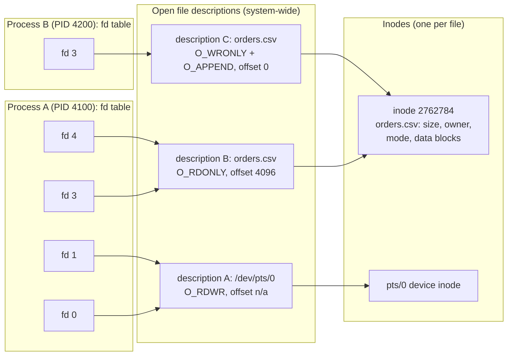
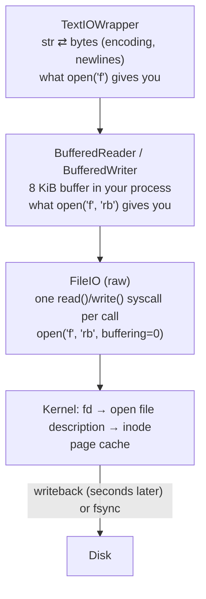
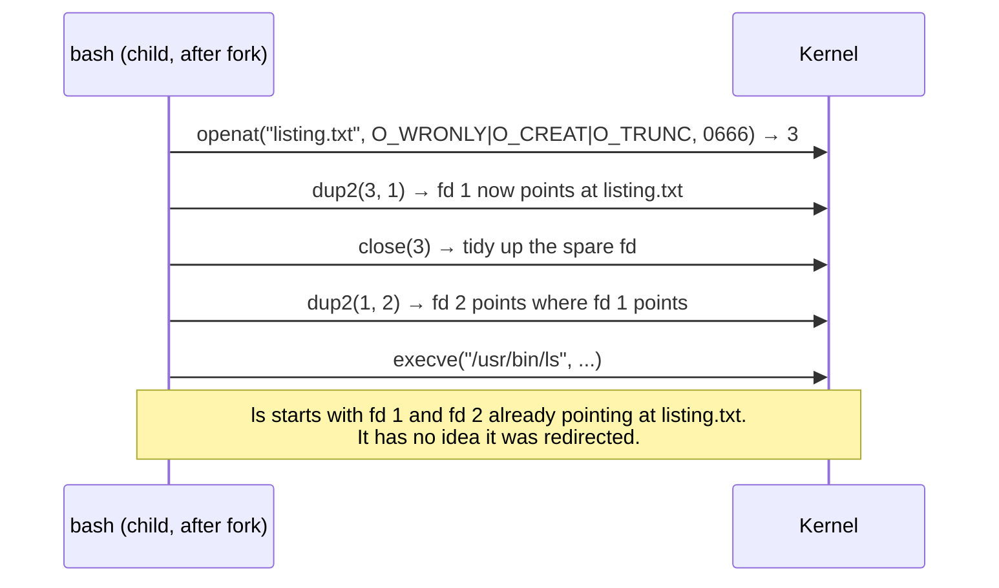

# File descriptors in code

> **Level 5 · Chapter 2** · ⏱️ ~50 min read · Prerequisites: [System calls and strace](01-system-calls-strace.md), [Pipes and redirection](../01-command-line/04-pipes-and-redirection.md), [Filesystems, inodes, and links](../03-internals/04-filesystems-and-links.md)

A **file descriptor** (fd) is the small integer a process uses to refer to anything it has open: a file, a pipe, a terminal, a socket. This chapter shows how file descriptors work inside the kernel, how Python's `os` functions and file objects sit on top of them, and how to use them correctly: buffering, redirection, inheritance, limits, durable writes, and locking.

## Why it matters

Your team runs a small Python service that watches a drop folder, parses each incoming CSV, and loads it into a database. It runs fine for three days. Then, on Thursday night, it starts failing on every file:

```text
OSError: [Errno 24] Too many open files: '/srv/drop/orders-20261001-2210.csv'
```

The code looks fine at a glance:

```python
def row_count(path):
    return sum(1 for _ in open(path))
```

There's no `close()`. In CPython, the file is usually closed when the object is garbage-collected, so this "works" in testing. But a later refactor stored a reference to each file object in a list for error reporting, so none were ever collected. Each call leaked one file descriptor. After 1,024 files, the process hit its limit, and every `open()` after that failed.

With what you'll learn here, the diagnosis takes a minute: `ls /proc/PID/fd | wc -l` shows 1,024 entries, `lsof -p PID` shows them all pointing at old CSVs, and `ulimit -n` says 1024. The fix is a `with open(...)` block. The same knowledge explains a dozen other "mysteries": why `print` output shows up late in logs, why a half-written config file appeared after a power cut, and how `2>&1` actually works.

## Concepts

### Everything is a file descriptor

When a process opens something, the kernel gives it back a small non-negative integer: the **file descriptor**. From then on, the process says "read from 3" or "write to 5" instead of naming the thing again. The same few syscalls (`read`, `write`, `close`) work on all of these:

| Thing | How you get an fd | Example in `ls -l /proc/PID/fd` |
|-------|-------------------|--------------------------------|
| Regular file | `open()` | `3 -> /home/alex/data/orders.csv` |
| Directory | `open()` with `O_DIRECTORY` | `4 -> /home/alex/data` |
| Terminal | Inherited from the shell | `0 -> /dev/pts/0` |
| Pipe | `pipe()` | `5 -> pipe:[1752907]` |
| Socket | `socket()`, `accept()` | `6 -> socket:[1742750]` |
| Device | `open("/dev/null")` | `7 -> /dev/null` |

This uniformity is what people mean by "everything is a file" on Unix. A program like `cat` doesn't need to know whether fd 0 is a keyboard, a file, or a pipe. It just calls `read(0, ...)`.

### The three-level model

A file descriptor is not the file. There are three layers of kernel data between an fd number and the bytes on disk. Understanding them explains offsets, `dup`, inheritance, and appending.



1. **The file descriptor table** is per process. It's an array: index 3 holds a pointer to an open file description. The fd number is just a position in this array. This is what `/proc/PID/fd` shows.
2. **The open file description** (sometimes called the "file table entry") is created by each successful `open()` call. It holds the **file offset** (the current read/write position), the **status flags** given at open time (`O_RDONLY`, `O_APPEND`, `O_NONBLOCK`, ...), and a pointer to the inode. Several fds, even in different processes, can point to the same description.
3. **The inode** is the file itself, as you met it in [Filesystems, inodes, and links](../03-internals/04-filesystems-and-links.md): size, owner, permissions, timestamps, and where the data blocks live. There's one per file, no matter how many times it's opened.

Three rules fall out of this model, and you'll test each one below:

- Two separate `open()` calls on the same file create **two descriptions**, so they have **independent offsets**.
- `dup()` and `fork()` create a new fd pointing at the **same description**, so they **share one offset**.
- Permissions are checked only at `open()` time. Once you hold an fd, a later `chmod` doesn't take it away.

### Standard streams: 0, 1, 2

By convention every process starts with three fds already open:

| fd | Name | Python object | Normally points to |
|----|------|---------------|--------------------|
| 0 | **stdin** (standard input) | `sys.stdin` | The terminal (keyboard) |
| 1 | **stdout** (standard output) | `sys.stdout` | The terminal (screen) |
| 2 | **stderr** (standard error) | `sys.stderr` | The terminal (screen) |

Nothing in the kernel makes these special. They're just fds 0, 1, and 2 that the shell set up before running your program, usually all pointing at the same terminal description. Redirection works by changing what those three slots point to before the program starts.

The kernel always returns the **lowest-numbered free fd**. That's why the first file a program opens is almost always fd 3, and it's the property the shell relies on for redirection.

### Open flags

`open()` takes **flags** that you combine with `|` (bitwise OR). Exactly one **access mode** is required, plus any number of others:

| Flag | Meaning | Why it exists |
|------|---------|---------------|
| `O_RDONLY` | Open for reading only | The safe default for input files |
| `O_WRONLY` | Open for writing only | Output files |
| `O_RDWR` | Read and write | Databases, files you update in place |
| `O_CREAT` | Create the file if it doesn't exist. Requires a **mode** argument such as `0o644` | Without it, opening a missing file fails with `ENOENT` |
| `O_EXCL` | With `O_CREAT`: fail with `EEXIST` if the file already exists | Atomically "create only if new", for lock files and temp files |
| `O_TRUNC` | Truncate an existing file to length 0 | This is what `>` in the shell does |
| `O_APPEND` | Before *every* write, move the offset to the current end of file, atomically | Log files that several processes write to. This is `>>` |
| `O_CLOEXEC` | Close this fd automatically on `execve` | Stops fds leaking into programs you run |
| `O_NONBLOCK` | Reads and writes return `EAGAIN` instead of waiting | Event-driven servers (chapter 4) |
| `O_DIRECTORY` | Fail unless the path is a directory | Opening a directory to `fsync` it |

The mode you pass with `O_CREAT` is filtered by your **umask** (see [Permissions](../01-command-line/03-permissions.md)). With the usual umask of `002`, asking for `0o666` gives `0o664`.

### Two ways to do I/O in Python

Python gives you two levels:

1. **`os.open`, `os.read`, `os.write`, `os.close`** are thin wrappers around the syscalls. You get a plain integer fd and work with `bytes`. Every call is exactly one syscall. Nothing is buffered.
2. **`open()`** returns a **file object**, which stacks up to three layers on top of an fd:



The layers exist for speed and convenience. A syscall costs roughly 100 ns or more. Writing a 1 GB CSV one 20-byte line at a time would be 50 million syscalls. The **buffer** collects writes in memory and sends them to the kernel in 8 KiB chunks, which cuts that to about 130,000.

The file object's `.fileno()` method gives you the underlying fd number, so you can mix levels when you need to (for example, `os.fsync(f.fileno())`).

### Buffering modes, and why output appears out of order

Python picks a buffering mode for each stream when it starts:

| Stream | When it's a terminal | When it's a file or pipe |
|--------|---------------------|--------------------------|
| `sys.stdout` | **Line-buffered**: flush at every `\n` | **Block-buffered**: flush when 8 KiB fills up, or at exit |
| `sys.stderr` | Line-buffered | Line-buffered (since Python 3.9) |
| Files from `open()` | n/a | Block-buffered |

So the same program behaves differently depending on where its output goes. In a terminal, each `print()` appears instantly. Piped into `tee`, `grep`, or a log file, `print()` output sits in an 8 KiB buffer while stderr output, `os.write()` output, and output from child processes all go straight to the kernel. Things then arrive **out of order**.

This is the cause of a classic confusion with services: a Python program run by systemd (whose stdout is a pipe to the journal) shows no log output for minutes, then a burst. The fixes, from most to least targeted:

- `print(..., flush=True)` on important lines.
- `sys.stdout.reconfigure(line_buffering=True)` once at startup.
- Run with `python3 -u`, or set the environment variable `PYTHONUNBUFFERED=1`. Chapter 5 uses this for services.

!!! note "There are two buffers, not one"
    Flushing Python's buffer (`f.flush()`) moves data into the **kernel's page cache**: other processes can now read it, and it survives your program crashing. It is **not** on disk yet. The kernel writes it back a few seconds later. Surviving a *power cut* takes `os.fsync()`. Both levels are covered below.

### The file offset and lseek

Every open file description has an **offset**: the position where the next `read` or `write` happens. Each `read` or `write` advances it by the number of bytes transferred. That's why calling `read` in a loop walks through a file without you tracking a position.

`lseek(fd, offset, whence)` moves it explicitly:

| `whence` | Python constant | New offset |
|----------|-----------------|------------|
| 0 | `os.SEEK_SET` | `offset` bytes from the start |
| 1 | `os.SEEK_CUR` | current position + `offset` (`lseek(fd, 0, SEEK_CUR)` asks "where am I?") |
| 2 | `os.SEEK_END` | end of file + `offset` (`lseek(fd, 0, SEEK_END)` gives the size) |

Pipes, sockets, and terminals have no offset. `lseek` on them fails with `ESPIPE` ("Illegal seek"). That's how programs like `tail` detect whether they can jump to the end of their input.

`O_APPEND` changes the rule for writes: the kernel moves the offset to end-of-file *and* writes, as one atomic step, every time. Two processes appending to the same log with `O_APPEND` never overwrite each other's lines. Without it, both would track their own offsets and clobber each other.

### dup, dup2, and how the shell does redirection

**`dup(fd)`** creates a new fd (the lowest free number) pointing at the **same open file description** as `fd`. **`dup2(old, new)`** makes `new` point at the same description as `old`, closing whatever `new` pointed at before.

`dup2` is the entire secret of shell redirection. When you type:

```bash
ls -l /etc/hostname > listing.txt 2>&1
```

bash does this in the child process, after `fork` and before `execve`:



This also explains why order matters. `2>&1 > file` duplicates stderr onto the *old* stdout (the terminal) *first*, and only then points stdout at the file. Redirections are just `dup2` calls run left to right.

A pipeline `ls | wc -l` uses the same trick with a pipe: bash calls `pipe2()` to get a read end and a write end, then in the `ls` child `dup2(write_end, 1)`, and in the `wc` child `dup2(read_end, 0)`.

### Inheritance across fork and exec

When a process calls `fork()`, the child gets a **copy of the fd table**. Every fd in the child points to the same open file description as in the parent, so they share offsets. That's how a shell's children write to the same terminal.

When a process calls `execve()`, the fd table **survives**, except for fds marked **close-on-exec** (`FD_CLOEXEC`, set by opening with `O_CLOEXEC`). This is how a redirected stdout reaches `ls`. It's also a classic source of bugs and security leaks: a web server that opens a database connection or a private key file and then runs a helper script would hand that fd to the script.

Python takes the safe side (PEP 446): every fd Python creates is **non-inheritable** (close-on-exec) by default, and `subprocess` closes all fds above 2 in the child unless you pass them explicitly with `pass_fds`. Fds 0, 1, and 2 are always inherited.

### Per-process limits: ulimit -n and EMFILE

Each fd costs kernel memory, so the kernel limits how many a process may hold. The limit is a **resource limit** (rlimit) called `RLIMIT_NOFILE`, with two values:

- The **soft limit** is what's enforced. Mint's default for programs started from your desktop session is **1024**.
- The **hard limit** is the ceiling an unprivileged process may raise its own soft limit to. On Mint it's usually 1048576 for your session, and 524288 for system services.

Hitting the soft limit makes `open`, `socket`, `accept`, and `pipe` fail with **`EMFILE`** ("Too many open files"). There's also a system-wide limit (`/proc/sys/fs/file-max`), whose error is `ENFILE`, but on a modern system you'll almost never reach it.

When you hit `EMFILE`, the fix is almost never "raise the limit". It's "find the leak". Raising the limit is right only for programs that legitimately hold many fds at once, such as a server with thousands of clients. For systemd services, you set it with `LimitNOFILE=` in the unit file.

### Durability: what fsync guarantees

When `write()` returns, your data is in the kernel's **page cache** (RAM). Other processes see it immediately. If your program crashes, it's safe. But if the **machine** loses power in the next few seconds, it may be gone, because the kernel writes dirty pages to disk lazily, typically within 5 to 30 seconds.

**`fsync(fd)`** blocks until the file's data *and* metadata have reached the storage device. **`fdatasync(fd)`** is a lighter version that skips metadata not needed to read the data back (such as modification time).

A subtle point: a file's **name** lives in its *directory*, not in the file. After creating or renaming a file, you need to fsync the **directory** too, or the file's data could be safe on disk with no name pointing to it after a crash.

fsync is slow (milliseconds on an SSD, more on spinning disks), so use it where losing data matters: committed transactions, config files, checkpoints. Don't call it after every log line.

### Atomic writes: temp file plus rename

Suppose you rewrite `settings.json` in place with `open("settings.json", "w")`. That opens with `O_TRUNC`, so the file is empty from that moment until your write finishes. A crash, a full disk, or another process reading at the wrong moment sees an empty or half-written file.

The standard fix uses a guarantee from the `rename()` syscall: **if the destination exists, it's replaced atomically**. Any process opening the path gets either the complete old file or the complete new file, never a mix.


The temp file must be on the **same filesystem**, which in practice means the same directory. `rename()` across filesystems fails with `EXDEV`, because it can only relink names, not move data. In Python, `os.replace()` is the rename call to use: it overwrites the destination on every platform.

Editors, package managers, and databases all use this pattern. Readers that already had the old file open keep reading the old inode. Remember the three-level model: their fd points at the old file's description, and that inode lives on until they close it.

### File locking: flock and fcntl

When two processes might work on the same file at once (two copies of a cron job, two scripts appending to a CSV), you need **locking**. Linux has two main APIs:

| | `flock()` | `fcntl()` record locks (POSIX locks) |
|-|-----------|----------------------------------|
| Locks | The whole file | Byte ranges (or the whole file) |
| Owned by | The **open file description** | The **process** |
| Released when | The description is closed (all fds sharing it) | The process closes **any** fd for that file, or exits |
| Survives `fork` | Shared with the child (same description) | Not inherited by the child |
| Python | `fcntl.flock(f, fcntl.LOCK_EX)` | `fcntl.lockf(f, fcntl.LOCK_EX)` |
| Shell | `flock` command | none |

Both are **advisory**: they only coordinate processes that *ask* for the lock. A process that just opens and writes the file ignores them completely. So a lock is a convention between cooperating programs, not a security feature.

For "only one copy of this job may run", use `flock` with `LOCK_EX | LOCK_NB` (exclusive, non-blocking) on a lock file. Prefer `flock` in general: the POSIX rule that closing *any* fd to the file drops *all* the process's locks on it surprises almost everyone, including library authors.

## Commands and examples

Work in a scratch directory: `mkdir -p ~/level5 && cd ~/level5`.

### Raw file descriptors with os.open

```python title="fd_basics.py"
import os

fd = os.open("notes.txt", os.O_WRONLY | os.O_CREAT | os.O_TRUNC, 0o644)
print("got fd", fd)
n = os.write(fd, b"first line\nsecond line\n")
print("wrote", n, "bytes")
os.close(fd)

fd = os.open("notes.txt", os.O_RDONLY)
data = os.read(fd, 5)
print("read 5:", data)
print("offset now:", os.lseek(fd, 0, os.SEEK_CUR))
os.lseek(fd, 0, os.SEEK_SET)
print("after rewind:", os.read(fd, 100))
print("at EOF:", os.read(fd, 100))
os.close(fd)
```

```bash
python3 fd_basics.py
```

```text
got fd 3
wrote 23 bytes
read 5: b'first'
offset now: 5
after rewind: b'first line\nsecond line\n'
at EOF: b''
```

Under strace, each `os.*` call maps to exactly one syscall:

```bash
strace -e trace=openat,read,write,lseek,close python3 fd_basics.py 2>&1 >/dev/null | grep -A10 notes.txt
```

```text
openat(AT_FDCWD, "notes.txt", O_WRONLY|O_CREAT|O_TRUNC|O_CLOEXEC, 0644) = 3
write(3, "first line\nsecond line\n", 23) = 23
close(3)                                = 0
openat(AT_FDCWD, "notes.txt", O_RDONLY|O_CLOEXEC) = 3
read(3, "first", 5)                     = 5
lseek(3, 0, SEEK_CUR)                   = 5
lseek(3, 0, SEEK_SET)                   = 0
read(3, "first line\nsecond line\n", 100) = 23
read(3, "", 100)                        = 0
close(3)                                = 0
write(1, "got fd 3\nwrote 23 bytes\nread 5: "..., 110) = 110
```

Three details worth noticing:

- Python added `O_CLOEXEC` to both opens, though you didn't ask for it. That's the non-inheritable default.
- `os.read(fd, 100)` returned 23 bytes. A read can always return **fewer** bytes than requested. Code that assumes it got the full amount is buggy.
- All six `print()` calls became **one** `write` at the very end. stdout was redirected to `/dev/null`, so Python block-buffered it.

### File objects and their layers

```python
f = open("notes.txt")                 # text mode
print(type(f), type(f.buffer), type(f.buffer.raw))
print(f.fileno())
print(f.read(5), f.tell())
```

```text
<class '_io.TextIOWrapper'> <class '_io.BufferedReader'> <class '_io.FileIO'>
3
first 5
```

The text layer wraps a buffered layer, which wraps a raw layer, which holds fd 3. Now look at what the **kernel** thinks the offset is. `/proc/self/fdinfo/N` shows the open file description's state:

```python
print(open(f"/proc/self/fdinfo/{f.fileno()}").read())
```

```text
pos:	23
flags:	02100000
mnt_id:	33
ino:	2762784
```

Python says the position is 5, but the kernel's offset is 23. To read 5 characters, the buffered layer asked the kernel for a full buffer and got all 23 bytes of the file. The other 18 are waiting in your process's memory. The `flags` value is octal: `02000000` is `O_CLOEXEC` and `0100000` is `O_LARGEFILE` (always set on 64-bit). `ino` is the inode number, the third level of the model.

!!! warning "Common mistake"
    Mixing `os.read(f.fileno(), ...)` with `f.read()` on the same file gives confusing results, because the buffered layer has already pulled data ahead of where you think you are. Pick one level per file.

Always open files with `with`, which closes them even when an exception happens:

```python
with open("orders.csv", newline="") as f:
    for line in f:
        ...
# f is closed here, and its fd is free again
```

### Watching buffering reorder your output

```python title="order.py"
import os, subprocess, sys

print("1. print() from Python")
os.write(1, b"2. os.write() straight to fd 1\n")
subprocess.run(["echo", "3. echo from a child process"])
print("4. print() again")
print("5. to stderr", file=sys.stderr)
```

In a terminal, everything is in order:

```bash
python3 order.py
```

```text
1. print() from Python
2. os.write() straight to fd 1
3. echo from a child process
4. print() again
5. to stderr
```

Through a pipe (with stderr merged in so you see everything in one stream):

```bash
python3 order.py 2>&1 | cat
```

```text
2. os.write() straight to fd 1
3. echo from a child process
5. to stderr
1. print() from Python
4. print() again
```

Lines 1 and 4 sat in Python's stdout buffer until the program exited. Line 2 bypassed the buffer with a direct syscall. Line 3 came from a separate process with its own stdout. Line 5 went through stderr, which is line-buffered. Now turn buffering off:

```bash
python3 -u order.py 2>&1 | cat
```

```text
1. print() from Python
2. os.write() straight to fd 1
3. echo from a child process
4. print() again
5. to stderr
```

`PYTHONUNBUFFERED=1 python3 order.py 2>&1 | cat` gives the same result. When you run a subprocess after printing, call `sys.stdout.flush()` first, or the child's output will jump ahead of yours.

### Offsets: separate opens, dup, and O_APPEND

```python title="offsets.py"
import os

# Case A: two separate open() calls -> two open file descriptions -> two offsets
a = os.open("a.txt", os.O_WRONLY | os.O_CREAT | os.O_TRUNC, 0o644)
b = os.open("a.txt", os.O_WRONLY)
os.write(a, b"AAAAAAAAAA\n")
os.write(b, b"bbb")                 # b's offset is still 0: overwrites!
os.close(a); os.close(b)
print("separate opens:", open("a.txt").read().strip())

# Case B: dup() -> same open file description -> one shared offset
a = os.open("b.txt", os.O_WRONLY | os.O_CREAT | os.O_TRUNC, 0o644)
b = os.dup(a)
os.write(a, b"AAAAAAAAAA\n")
os.write(b, b"bbb\n")               # continues where a left off
os.close(a); os.close(b)
print("dup'd fds:     ", open("b.txt").read().split())

# Case C: O_APPEND -> every write goes to the current end, atomically
a = os.open("c.txt", os.O_WRONLY | os.O_CREAT | os.O_TRUNC | os.O_APPEND, 0o644)
b = os.open("c.txt", os.O_WRONLY | os.O_APPEND)
os.write(a, b"AAAAAAAAAA\n")
os.write(b, b"bbb\n")
os.close(a); os.close(b)
print("O_APPEND:      ", open("c.txt").read().split())
```

```bash
python3 offsets.py
```

```text
separate opens: bbbAAAAAAA
dup'd fds:      ['AAAAAAAAAA', 'bbb']
O_APPEND:       ['AAAAAAAAAA', 'bbb']
```

Case A is the bug two processes hit when they both write the same file without `O_APPEND`: each has its own offset starting at 0, so the second write lands on top of the first. Case B shows `dup` sharing one offset. Case C is how log files should be opened. Python's `open(path, "a")` uses `O_APPEND`.

### Implementing redirection with dup2

Here is what the shell does for `ls -l /etc/hostname > listing.txt`, in Python:

```python title="redirect.py"
"""Do what the shell does for:  ls -l /etc/hostname > listing.txt"""
import os

pid = os.fork()
if pid == 0:                                   # child
    fd = os.open("listing.txt", os.O_WRONLY | os.O_CREAT | os.O_TRUNC, 0o644)
    os.dup2(fd, 1)                             # fd 1 now points at listing.txt
    os.close(fd)                               # the extra fd is no longer needed
    os.execvp("ls", ["ls", "-l", "/etc/hostname"])   # ls inherits fd 1
else:                                          # parent
    os.waitpid(pid, 0)
    print("child finished; file contains:")
    print(open("listing.txt").read(), end="")
```

```bash
python3 redirect.py
```

```text
child finished; file contains:
-rw-r--r-- 1 root root 5 Jun  9 19:04 /etc/hostname
```

Notice that `os.dup2` makes the *new* fd inheritable even though Python's fds are non-inheritable by default. That's deliberate: fds 0, 1, and 2 must survive `exec`.

Compare with what bash really does, using strace:

```bash
strace -f -e trace=openat,dup2,execve -o redir.txt bash -c 'ls /etc/hostname /nope > out.txt 2>&1'
grep -E 'out.txt|dup2|execve\("/usr/bin/ls' redir.txt
```

```text
207414 openat(AT_FDCWD, "out.txt", O_WRONLY|O_CREAT|O_TRUNC, 0666) = 3
207414 dup2(3, 1)                       = 1
207414 dup2(1, 2)                       = 2
207414 execve("/usr/bin/ls", ["ls", "/etc/hostname", "/nope"], 0x615eec2a0710 /* 54 vars */) = 0
```

`> out.txt` is `openat` + `dup2(3, 1)`, and `2>&1` is literally `dup2(1, 2)`. Bash opens with mode `0666` and lets the umask trim it.

### Looking at a process's fds

Every process's fd table is visible in `/proc`. Your shell's:

```bash
ls -l /proc/$$/fd
```

```text
total 0
lrwx------ 1 alex alex 64 Oct  2 10:38 0 -> /dev/pts/0
lrwx------ 1 alex alex 64 Oct  2 10:38 1 -> /dev/pts/0
lrwx------ 1 alex alex 64 Oct  2 10:38 2 -> /dev/pts/0
lrwx------ 1 alex alex 64 Oct  2 10:38 255 -> /dev/pts/0
```

All three standard streams point at the same terminal. Bash also keeps a private copy of the terminal on fd 255. Now with some redirection:

```bash
ls -l /proc/self/fd < /etc/hostname 2>/dev/null | cat
```

```text
total 0
lr-x------ 1 alex alex 64 Oct  2 10:38 0 -> /etc/hostname
l-wx------ 1 alex alex 64 Oct  2 10:38 1 -> pipe:[1764819]
l-wx------ 1 alex alex 64 Oct  2 10:38 2 -> /dev/null
lr-x------ 1 alex alex 64 Oct  2 10:38 3 -> /proc/91556/fd
```

`/proc/self` always means "the process looking at it", here `ls`. Each redirection shows up as a change in the table. The permission bits on the links show the access mode: `lr-x` is read-only, `l-wx` write-only, `lrwx` read-write. fd 3 is `ls` reading the `/proc/.../fd` directory itself.

Counting fds is a one-liner that's worth remembering for leak hunting:

```bash
ls /proc/$(pgrep -f etl_service.py)/fd | wc -l
```

### Inheritance across exec

```python title="inherit.py"
import os, subprocess

secret = open("/etc/hostname")      # pretend this is a credentials file
fd = secret.fileno()
print("parent: fd", fd, "inheritable =", os.get_inheritable(fd), flush=True)

print("child, default:", flush=True)
subprocess.run(["ls", "-l", "/proc/self/fd"])

print("child, pass_fds:", flush=True)
subprocess.run(["ls", "-l", "/proc/self/fd"], pass_fds=(fd,))
```

```bash
python3 inherit.py
```

```text
parent: fd 3 inheritable = False
child, default:
total 0
lrwx------ 1 alex alex 64 Oct  2 10:51 0 -> /dev/pts/0
lrwx------ 1 alex alex 64 Oct  2 10:51 1 -> /dev/pts/0
lrwx------ 1 alex alex 64 Oct  2 10:51 2 -> /dev/pts/0
lr-x------ 1 alex alex 64 Oct  2 10:51 3 -> /proc/196065/fd
child, pass_fds:
total 0
lrwx------ 1 alex alex 64 Oct  2 10:51 0 -> /dev/pts/0
lrwx------ 1 alex alex 64 Oct  2 10:51 1 -> /dev/pts/0
lrwx------ 1 alex alex 64 Oct  2 10:51 2 -> /dev/pts/0
lr-x------ 1 alex alex 64 Oct  2 10:51 3 -> /etc/hostname
lr-x------ 1 alex alex 64 Oct  2 10:51 4 -> /proc/196066/fd
```

By default the child gets only 0, 1, and 2. Its own fd 3 is just `ls` reading the directory. With `pass_fds`, the parent's fd 3 is deliberately inherited, so the child sees `/etc/hostname` there. This is how a parent hands an already-open file or socket to a child, which systemd's socket activation does too (chapter 5).

### lsof: who has what open

**`lsof`** ("list open files") reads `/proc` for you and formats it. Here's a process holding a data file and a log:

```python title="holder.py"
import os, time
f = open("notes.txt")
g = open("app.log", "a")
print(os.getpid(), flush=True)
time.sleep(300)
```

```bash
python3 holder.py &
lsof -a -p $! -d 0-20
```

```text
COMMAND    PID USER   FD   TYPE DEVICE SIZE/OFF    NODE NAME
python3 128136 alex    0u   CHR  136,0      0t0       3 /dev/pts/0
python3 128136 alex    1u   CHR  136,0      0t0       3 /dev/pts/0
python3 128136 alex    2u   CHR  136,0      0t0       3 /dev/pts/0
python3 128136 alex    3r   REG  259,7       23 2762784 /home/alex/level5/notes.txt
python3 128136 alex    4w   REG  259,7        0 2762866 /home/alex/level5/app.log
```

`-p` selects the process, `-d 0-20` limits it to fds 0 to 20 (hiding memory-mapped libraries), and `-a` means "AND the conditions together" rather than the default OR. In the `FD` column, the letter after the number is the access mode: `r` read, `w` write, `u` both. `NODE` is the inode number.

Other everyday forms:

```bash
lsof app.log                 # who has this file open?
lsof +D /srv/drop            # anything open under this directory
lsof -i :8080                # who has TCP/UDP port 8080?
lsof -a -p 128136 +L1        # open files that have been deleted
```

The last one solves another classic puzzle: "I deleted a 5 GB log but `df` says the disk is still full." The space isn't freed until the last fd to the inode is closed. `+L1` lists open files with a link count below 1, meaning deleted:

```text
COMMAND    PID USER   FD   TYPE DEVICE SIZE/OFF NLINK    NODE NAME
python3 207140 alex    3w   REG  259,7  5000000     0 2765073 /home/alex/level5/huge.log (deleted)
```

Restart (or signal) the process holding it, and the space comes back. `ls -l /proc/PID/fd` shows the same `(deleted)` marker. Clean up with `kill %1`.

### ulimit -n and EMFILE

Check your limits:

```bash
ulimit -n        # soft limit
ulimit -Hn       # hard limit
```

```text
1024
1048576
```

Now hit the limit on purpose. To keep it fast, the script lowers its own soft limit to 64 first:

```python title="emfile.py"
import resource

soft, hard = resource.getrlimit(resource.RLIMIT_NOFILE)
print(f"limit: soft={soft} hard={hard}")
resource.setrlimit(resource.RLIMIT_NOFILE, (64, hard))   # lower it for the demo

leaked = []
try:
    while True:
        leaked.append(open("/etc/hostname"))   # never closed: a leak
except OSError as e:
    print(f"failed after {len(leaked)} opens: {e}")
```

```bash
python3 emfile.py
```

```text
limit: soft=1024 hard=1048576
failed after 61 opens: [Errno 24] Too many open files: '/etc/hostname'
```

61 file objects plus fds 0, 1, and 2 make 64. You can also lower the limit for one command from the shell: `(ulimit -n 64; python3 some_script.py)`. The parentheses run it in a subshell so your own shell's limit doesn't change. A process may lower its limits freely, but may raise the soft limit only up to the hard limit.

### fsync and atomic writes

This function combines everything above into a safe "replace this file" helper:

```python title="atomic_write.py"
import json, os, tempfile

def atomic_write(path: str, data: bytes) -> None:
    """Replace `path` with `data` so readers see the old or new file, never half."""
    directory = os.path.dirname(os.path.abspath(path))
    fd, tmp = tempfile.mkstemp(dir=directory, prefix=".tmp-")  # same filesystem!
    try:
        with os.fdopen(fd, "wb") as f:
            f.write(data)
            f.flush()                 # Python buffer -> kernel
            os.fsync(f.fileno())      # kernel page cache -> disk
            os.fchmod(f.fileno(), 0o644)  # mkstemp creates 0600
        os.replace(tmp, path)         # rename(2): atomic swap of the name
    except BaseException:
        os.unlink(tmp)
        raise
    dfd = os.open(directory, os.O_RDONLY | os.O_DIRECTORY)
    try:
        os.fsync(dfd)                 # make the rename itself durable
    finally:
        os.close(dfd)

if __name__ == "__main__":
    config = {"db_host": "127.0.0.1", "batch_size": 500}
    atomic_write("settings.json", json.dumps(config, indent=2).encode() + b"\n")
    print(open("settings.json").read(), end="")
```

```bash
python3 atomic_write.py
```

```text
{
  "db_host": "127.0.0.1",
  "batch_size": 500
}
```

The trace shows the exact sequence:

```bash
strace -e trace=openat,write,fsync,fchmod,rename,close python3 atomic_write.py 2>&1 >/dev/null | grep -A9 'tmp-'
```

```text
openat(AT_FDCWD, "/home/alex/level5/.tmp-71cgb9n2", O_RDWR|O_CREAT|O_EXCL|O_NOFOLLOW|O_CLOEXEC, 0600) = 3
write(3, "{\n  \"db_host\": \"127.0.0.1\",\n  \"b"..., 50) = 50
fsync(3)                                = 0
fchmod(3, 0644)                         = 0
close(3)                                = 0
rename("/home/alex/level5/.tmp-71cgb9n2", "settings.json") = 0
openat(AT_FDCWD, "/home/alex/level5", O_RDONLY|O_CLOEXEC|O_DIRECTORY) = 3
fsync(3)                                = 0
close(3)                                = 0
```

`mkstemp` uses `O_CREAT|O_EXCL`, so it can never overwrite an existing file, and `O_NOFOLLOW`, so an attacker can't plant a symlink with that name. Its random suffix avoids collisions with other writers. The leading dot keeps the temp file out of plain `ls` and most globs.

!!! warning "Common mistake"
    Creating the temp file in `/tmp` and renaming it into `/home/alex/project` fails with `OSError: [Errno 18] Invalid cross-device link` whenever `/tmp` is a separate filesystem (it often is, as `tmpfs`). Always create the temp file in the destination's directory.

### File locking

A nightly export must never run twice at once, for example if a slow run is still going when cron starts the next one:

```python title="locked_job.py"
import fcntl, os, sys, time

LOCK_PATH = "nightly-export.lock"

with open(LOCK_PATH, "w") as lock:
    try:
        fcntl.flock(lock, fcntl.LOCK_EX | fcntl.LOCK_NB)   # exclusive, don't wait
    except BlockingIOError:
        print(f"[{os.getpid()}] another run holds the lock; exiting")
        sys.exit(1)
    print(f"[{os.getpid()}] got the lock, exporting...")
    time.sleep(3)                                        # pretend to work
    print(f"[{os.getpid()}] done")
# closing the file releases the lock (so does the process dying)
```

Start one in the background, then a second one straight away:

```bash
python3 locked_job.py & sleep 0.5; python3 locked_job.py; wait
```

```text
[142440] got the lock, exporting...
[142442] another run holds the lock; exiting
[142440] done
```

The second run's `flock` failed immediately with `EWOULDBLOCK` (the same number as `EAGAIN`), which Python raises as `BlockingIOError`. Without `LOCK_NB`, it would have waited until the first run finished.

The lock is tied to the open file description, so the kernel releases it when the process exits *for any reason*, including `kill -9`. That's why `flock` is far better than "create a PID file and check whether it exists": a crashed job leaves a stale PID file behind, but never a stale flock.

The `flock` command gives shell scripts and cron jobs the same protection:

```bash
flock -n /tmp/nightly-export.lock python3 export.py || echo "already running"
```

To see who holds a lock, use `lslocks` (from util-linux) or `cat /proc/locks`.

## Exercises

### Exercise 1: Predict the fd numbers (easy)

Without running it, predict what this prints. Then run it and explain each number.

```python
import os
a = os.open("/etc/hostname", os.O_RDONLY)
b = os.open("/etc/hostname", os.O_RDONLY)
os.close(a)
c = os.open("/etc/os-release", os.O_RDONLY)
d = os.dup(b)
print(a, b, c, d)
```

??? success "Solution"

    ```text
    3 4 3 5
    ```

    fds 0, 1, and 2 are taken, so `a` gets 3 and `b` gets 4. Closing `a` frees 3, and the kernel always hands out the lowest free number, so `c` reuses 3. `dup(b)` takes the next lowest free, 5. `b` and `d` share an open file description (and offset). `a` and `b` never did, because they came from separate `open` calls.

### Exercise 2: Find a leak with /proc and lsof (easy)

Write `leaky.py`, which opens `/etc/hostname` once per second in a loop, appends the file object to a list, and never closes it. Run it in the background. Use `/proc/PID/fd` and `lsof` to prove it's leaking, and estimate how long it would take to hit the default limit.

??? success "Solution"

    ```python title="leaky.py"
    import time
    kept = []
    while True:
        kept.append(open("/etc/hostname"))
        time.sleep(1)
    ```

    ```bash
    python3 leaky.py &
    PID=$!
    ls /proc/$PID/fd | wc -l; sleep 10; ls /proc/$PID/fd | wc -l
    lsof -p $PID | grep -c /etc/hostname
    kill $PID
    ```

    The count grows by about 10 in 10 seconds, and `lsof` shows dozens of read-only fds on `/etc/hostname`. At one per second, it reaches the soft limit of 1024 in about 17 minutes, after which every `open` fails with `EMFILE`. The fix is to use `with open(...)` and not keep file objects around.

### Exercise 3: Build `cmd > file 2>&1` and `cmd 2>&1 > file` (medium)

Write `redir2.py` which runs `ls /etc/hostname /nope` twice in child processes. The first time, reproduce `> both.txt 2>&1`. The second, reproduce `2>&1 > only_out.txt`. Predict what ends up in each file and on your terminal, then check.

??? success "Solution"

    ```python title="redir2.py"
    import os

    def run(setup):
        pid = os.fork()
        if pid == 0:
            setup()
            os.execvp("ls", ["ls", "/etc/hostname", "/nope"])
        os.waitpid(pid, 0)

    def stdout_then_stderr():          # > both.txt 2>&1
        fd = os.open("both.txt", os.O_WRONLY | os.O_CREAT | os.O_TRUNC, 0o644)
        os.dup2(fd, 1); os.close(fd)
        os.dup2(1, 2)

    def stderr_then_stdout():          # 2>&1 > only_out.txt
        os.dup2(1, 2)                  # stderr -> where stdout points NOW (terminal)
        fd = os.open("only_out.txt", os.O_WRONLY | os.O_CREAT | os.O_TRUNC, 0o644)
        os.dup2(fd, 1); os.close(fd)

    run(stdout_then_stderr)
    run(stderr_then_stdout)
    ```

    ```bash
    python3 redir2.py
    cat both.txt; echo ---; cat only_out.txt
    ```

    ```text
    ls: cannot access '/nope': No such file or directory
    ls: cannot access '/nope': No such file or directory
    /etc/hostname
    ---
    /etc/hostname
    ```

    The first line on the terminal comes from the second run: its stderr was duplicated from stdout *before* stdout moved, so errors still go to the terminal. `both.txt` has both streams, and `only_out.txt` has only the normal output. Redirections are `dup2` calls run in order.

### Exercise 4: Lose data, then don't (medium)

Write `naive_save.py`, which rewrites a JSON file in place with `open(path, "w")` and `json.dump`, but raises an exception halfway through (simulate it by dumping a dict containing a non-serializable `object()` as the last value). Show what's left in the file. Then switch to `atomic_write` from this chapter and show the old content survives the same failure.

??? success "Solution"

    ```python title="naive_save.py"
    import json

    with open("state.json", "w") as f:
        json.dump({"last_id": 1}, f)

    try:
        with open("state.json", "w") as f:     # O_TRUNC: file is now empty
            json.dump({"last_id": 2, "bad": object()}, f)
    except TypeError as e:
        print("save failed:", e)

    print("state.json now contains:", repr(open("state.json").read()))
    ```

    ```text
    save failed: Object of type object is not JSON serializable
    state.json now contains: '{"last_id": 2, "bad": '
    ```

    The old state is gone, and the new one is broken JSON. With the atomic version, serialize first, then write:

    ```python
    from atomic_write import atomic_write   # the function from this chapter
    import json

    atomic_write("state.json", json.dumps({"last_id": 1}).encode())
    try:
        atomic_write("state.json", json.dumps({"last_id": 2, "bad": object()}).encode())
    except TypeError as e:
        print("save failed:", e)
    print("state.json now contains:", repr(open("state.json").read()))
    ```

    ```text
    save failed: Object of type object is not JSON serializable
    state.json now contains: '{"last_id": 1}'
    ```

    The failure happened before any file was touched. Even if it had happened mid-write, only the temp file would be damaged, and the `except` clause removes it. The `if __name__ == "__main__":` guard in `atomic_write.py` is what lets you import the function without running its demo.

### Exercise 5: A tee clone with O_APPEND and locking (hard)

Write `ptee.py`, a simplified `tee -a`: it reads stdin in chunks with `os.read(0, ...)`, writes each chunk to stdout, and appends it to every file named on the command line. Requirements: open files with `O_APPEND`, handle short writes, only append whole lines, take an exclusive `flock` on each output file while writing, and exit with status 1 if any file can't be opened (printing the errno name). Test by running two `ptee.py` instances appending to the same log at once, and verify no lines are lost or interleaved mid-line.

??? success "Solution"

    ```python title="ptee.py"
    import errno, fcntl, os, sys

    def write_all(fd: int, data: bytes) -> None:
        view = memoryview(data)
        while view:                               # write() may be short
            n = os.write(fd, view)
            view = view[n:]

    def append_locked(fds: list[int], data: bytes) -> None:
        for fd in fds:
            fcntl.flock(fd, fcntl.LOCK_EX)        # one writer at a time
            try:
                write_all(fd, data)
            finally:
                fcntl.flock(fd, fcntl.LOCK_UN)

    def main() -> int:
        fds = []
        for path in sys.argv[1:]:
            try:
                fds.append(os.open(path, os.O_WRONLY | os.O_CREAT | os.O_APPEND, 0o644))
            except OSError as e:
                print(f"ptee: {path}: {errno.errorcode[e.errno]}", file=sys.stderr)
                return 1
        pending = b""
        while chunk := os.read(0, 65536):
            write_all(1, chunk)
            pending += chunk
            cut = pending.rfind(b"\n") + 1       # only whole lines go to the files
            if cut:
                append_locked(fds, pending[:cut])
                pending = pending[cut:]
        if pending:                               # last line without a newline
            append_locked(fds, pending)
        return 0

    sys.exit(main())
    ```

    ```bash
    rm -f shared.log
    seq -f 'writer A line %g' 20000 | python3 ptee.py shared.log > /dev/null &
    seq -f 'writer B line %g' 20000 | python3 ptee.py shared.log > /dev/null &
    wait
    wc -l shared.log
    grep -c '^writer A line' shared.log; grep -c '^writer B line' shared.log
    grep -vcE '^writer [AB] line [0-9]+$' shared.log
    ```

    ```text
    40000 shared.log
    20000
    20000
    0
    ```

    All 40,000 lines are present and none are corrupted. Three things make that work. `O_APPEND` guarantees each `write` lands at the current end of the file. The exclusive lock makes each batch, which may take several `write` calls, one unit. And the `pending` buffer matters more than it looks: `os.read` returns whatever is in the pipe, which often ends mid-line. A first version without it lost about 100 lines to mid-line interleaving in this exact test. Try `echo x | python3 ptee.py /root/x` to see the `EACCES` error and exit status 1.

## Check yourself

1. What are the three levels between an fd number and a file's data, and which level holds the file offset?

    ??? note "Answer"

        The per-process **file descriptor table** (fd number → pointer), the system-wide **open file description** (offset, status flags like `O_APPEND`, pointer to inode), and the **inode** (the file's metadata and data blocks). The offset lives in the open file description.

2. Two processes each `open()` the same log file for writing without `O_APPEND`, and each writes a line. What can happen, and why does `O_APPEND` fix it?

    ??? note "Answer"

        Each `open` creates its own open file description with its own offset, both starting at the same position. The second write can overwrite the first. With `O_APPEND`, the kernel moves the offset to end-of-file and writes in one atomic step on every write, so writes never overlap.

3. Why does `print()` output sometimes appear after output that was produced later, when you pipe a Python program into another command?

    ??? note "Answer"

        When stdout isn't a terminal, Python block-buffers it (8 KiB). `print` output waits in that buffer, while stderr (line-buffered), direct `os.write` calls, and output from child processes reach the kernel immediately. Fix it with `flush=True`, `python3 -u`, or `PYTHONUNBUFFERED=1`.

4. Explain how bash implements `cmd > out.txt 2>&1` in terms of syscalls.

    ??? note "Answer"

        In the child after `fork`: `openat("out.txt", O_WRONLY|O_CREAT|O_TRUNC, 0666)` returns fd 3. `dup2(3, 1)` points stdout at the file. `close(3)` removes the spare fd. `dup2(1, 2)` points stderr at the same open file description. Then `execve(cmd)`, which inherits fds 1 and 2.

5. What's the difference between `f.flush()` and `os.fsync(f.fileno())`?

    ??? note "Answer"

        `flush()` moves data from Python's in-process buffer to the kernel's page cache with a `write` syscall: other processes can see it, and it survives a crash of your program. `fsync()` makes the kernel write the file's data and metadata to the storage device and waits, so it survives a power loss.

6. Why must the temp file in an atomic write live in the same directory as the target, and why fsync the directory afterwards?

    ??? note "Answer"

        `rename()` is only atomic, and only works at all, within one filesystem; across filesystems it fails with `EXDEV`. The file's name is stored in the directory, so fsyncing the directory makes the rename itself durable. Otherwise, after a crash the directory might still point to the old file, or to nothing.

7. A program fails with `[Errno 24] Too many open files`. What do you check first, and is raising `ulimit -n` the right fix?

    ??? note "Answer"

        Count and inspect its fds with `ls /proc/PID/fd | wc -l` and `lsof -p PID` to see what's piling up. Usually it's a leak (files or sockets not closed), and the right fix is closing them, typically with `with`. Raise the limit only if the program legitimately needs many fds at once, like a busy server.

8. Why is a `flock` on a lock file better than checking whether a PID file exists?

    ??? note "Answer"

        The kernel releases a `flock` automatically when the holding process exits for any reason, including `SIGKILL` or a crash, so there's never a stale lock. A PID file stays behind after a crash and has to be cleaned up by hand. Checking for it and then creating it is also not atomic, so two processes can both "win".

## Key takeaways

- An fd is an index into a per-process table that points at an **open file description** (offset and flags), which points at an **inode**. `dup` and `fork` share descriptions. Separate `open` calls don't.
- `os.open`/`os.read`/`os.write` are one syscall each. File objects add an 8 KiB buffer and text decoding on top. Short reads and writes are normal at the syscall level.
- Python line-buffers stdout only on a terminal. Use `flush=True` or `PYTHONUNBUFFERED=1` when output goes to pipes, files, or journald.
- Shell redirection is `open` plus `dup2` in the child before `exec`. Fds survive `exec` unless marked close-on-exec, which Python does by default.
- Leaks show up as `EMFILE`. Diagnose with `/proc/PID/fd` and `lsof`, and fix with `with`.
- For files that matter: write to a temp file in the same directory, `fsync`, `os.replace`, then `fsync` the directory.
- Use `flock` with `LOCK_EX | LOCK_NB` for "only one copy runs". Locks are advisory.

## Next

You've already used `fork`, `exec`, and `waitpid` to build a redirect. Next, go deeper into creating and controlling processes from Python, including signals and `subprocess`: [Processes and signals in code](03-processes-signals-in-code.md).
