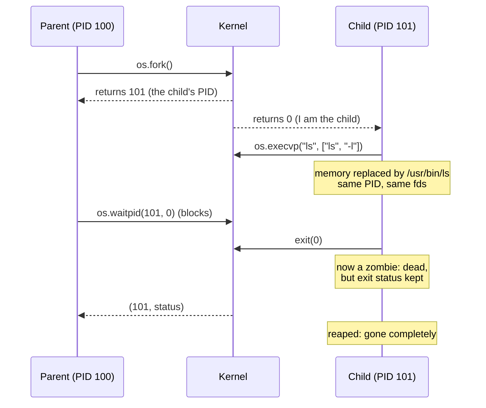
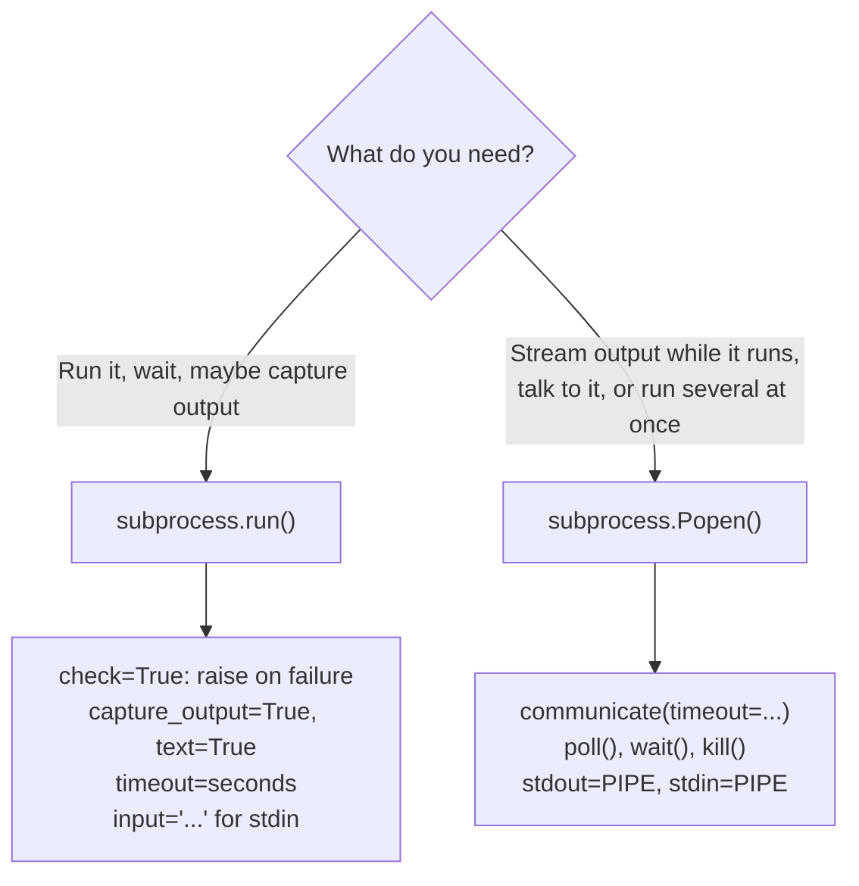
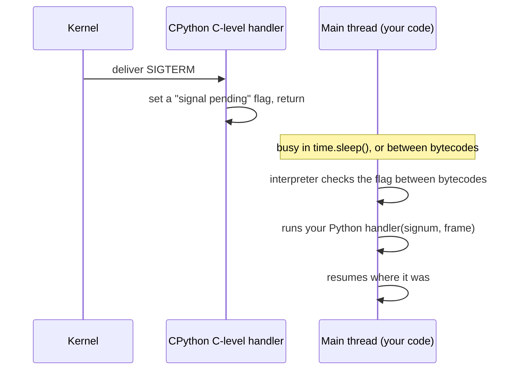

# Processes and signals in code

> **Level 5 · Chapter 3** · ⏱️ ~55 min read · Prerequisites: [Processes and signals](../03-internals/02-processes-and-signals.md), [File descriptors in code](02-file-descriptors.md)

In Level 3 you watched processes and signals from the outside, with `ps`, `kill`, and job control. This chapter puts you on the inside: creating processes with `fork` and `exec`, waiting for them, decoding how they died, running commands safely with `subprocess`, and writing programs that handle signals correctly and shut down cleanly.

## Why it matters

A data team runs an hourly Python loader in a container. Every deploy, the orchestrator stops the old container by sending `SIGTERM`, waits 10 seconds, and then sends `SIGKILL`. Every deploy, a batch half-loads. Someone has to find the duplicated rows by hand and clean them up.

The loader's code does have a `try/finally` that rolls back the open transaction. But Python's default response to `SIGTERM` is to die instantly, without running `finally` blocks, `with` exits, or `atexit` handlers. The cleanup code had never once run in production.

The fix is about ten lines: install a `SIGTERM` handler that sets a flag, have the main loop check the flag between batches, and exit normally. Deploys become boring. And while investigating, the team found two more process bugs: a `subprocess.run(f"gzip {path}", shell=True)` that broke on filenames with spaces (and could run arbitrary commands with the wrong filename), and a scheduler that left hundreds of `<defunct>` zombie processes because it never waited for its children. This chapter covers all three.

## Concepts

### Process identity: PID and PPID

Every process has a **PID** (process ID), a number unique among running processes, and a **PPID**, the PID of its parent. In Python:

```python
import os
print("my pid:", os.getpid(), "parent pid:", os.getppid())
```

```text
my pid: 217211 parent pid: 217140
```

Run from a terminal, the parent is your shell (`echo $$` prints the shell's PID). If a parent dies before its child, the child is **re-parented** to PID 1 (`systemd`), or to the nearest ancestor that declared itself a **subreaper** (a process that asked the kernel to adopt orphaned descendants, as `systemd --user` and some terminal emulators do).

### The process lifecycle in code

[Level 3](../03-internals/02-processes-and-signals.md) introduced the cycle every Unix program uses to start another one. Here it is as the system calls you'll use from Python:



- **`fork()`** clones the calling process. Afterwards there are two nearly identical processes running the same code, with copies of the same memory and fd table (fds share open file descriptions, as you saw in the last chapter). The only difference is fork's return value: the **child's PID in the parent**, and **0 in the child**. That's how the code knows which side it's on.
- **`exec()`** (the `execve` syscall, wrapped by `os.execv`, `os.execvp`, and friends) replaces the current program with a new one. The PID stays the same. Fds without close-on-exec stay open. Everything else, including all of Python's memory, is gone. If `exec` succeeds, it **never returns**.
- **`wait()`** (`os.waitpid`) blocks until a child changes state, usually by exiting, and returns its PID and a **wait status**. Waiting also **reaps** the child, which frees its last kernel record.

Why split "create" and "run" into two steps? Because the gap between `fork` and `exec` is where the child sets itself up: redirecting fds with `dup2`, changing directory, dropping privileges, setting environment variables, changing its process group. That's exactly how the shell implements `cd dir && cmd > out.txt`. One combined "spawn" call would need a parameter for every possible tweak.

!!! note "fork() is copy-on-write"
    `fork` doesn't actually copy all of the parent's memory. Both processes share the same physical pages, marked read-only. A page is copied only when one side writes to it. That's why forking a 2 GB process is fast, and why `fork` followed immediately by `exec` is cheap. See [Memory](../03-internals/03-memory.md).

### os.execvp and its family

Python mirrors the C `exec` family. The letters in the name tell you what the function takes:

| Function | Arguments as | Searches `$PATH`? | Environment |
|----------|--------------|-------------------|-------------|
| `os.execv(path, args)` | list (`v` = vector) | No: needs a full path | Inherited |
| `os.execvp(file, args)` | list | **Yes** (`p` = path) | Inherited |
| `os.execve(path, args, env)` | list | No | Given (`e` = environment) |
| `os.execvpe(file, args, env)` | list | Yes | Given |
| `os.execl(path, arg0, arg1, ...)` | separate arguments (`l` = list) | No | Inherited |

`args[0]` is the program's name *as it sees itself* (its `argv[0]`). By convention it's the command name: `os.execvp("ls", ["ls", "-l"])`. Forgetting it is a classic bug: `os.execvp("ls", ["-l"])` runs `ls` with `argv[0]` set to `-l` and no arguments.

### Exit status and the wait status

When a process ends, it leaves a small integer for its parent. There are two ways to end:

1. **Exiting normally** by calling `exit(code)`, where `code` is 0 to 255. 0 means success. Anything else means failure, with meanings each program defines.
2. **Being killed by a signal**, such as `SIGTERM`, `SIGKILL`, or `SIGSEGV`. The process never got to choose an exit code.

`waitpid` returns a packed **wait status** that encodes which of these happened. Python gives you helper functions to unpack it:

| Helper | Meaning |
|--------|---------|
| `os.WIFEXITED(status)` | True if the child exited normally |
| `os.WEXITSTATUS(status)` | The exit code (only valid if `WIFEXITED`) |
| `os.WIFSIGNALED(status)` | True if a signal killed the child |
| `os.WTERMSIG(status)` | Which signal (only valid if `WIFSIGNALED`) |
| `os.waitstatus_to_exitcode(status)` | Python 3.9+ shortcut: the exit code, or **minus** the signal number |

The shell flattens both cases into one number in `$?`: the exit code if the process exited, or **128 + signal number** if it was killed. That's why you see these numbers all the time:

| `$?` | Meaning |
|------|---------|
| 0 | Success |
| 1, 2, ... | Program-defined failure (`grep` uses 1 for "no match", 2 for "error") |
| 126 | Found the command but couldn't execute it (permission denied) |
| 127 | Command not found |
| 130 | Killed by `SIGINT` (2), usually ++ctrl+c++ |
| 137 | Killed by `SIGKILL` (9), often the OOM killer or `kill -9` |
| 143 | Killed by `SIGTERM` (15), a normal stop request |

`subprocess` uses Python's convention instead: `returncode` is negative when a signal killed the child, so `-15` means `SIGTERM`.

### Zombies, in code

Between a child's exit and the parent's `wait`, the child is a **zombie** (state `Z`, shown as `<defunct>` in `ps`). It's dead and uses no memory or CPU, but its PID and exit status are kept in the process table so the parent can collect them. That's a feature: otherwise the parent could never find out how its child ended.

Zombies become a bug when a parent creates many children and never waits for them. Each one holds a PID. Enough of them, and the system can't create new processes (`fork` fails with `EAGAIN`). You can't kill a zombie, because it's already dead. Fix the parent: make it wait, or kill the parent so PID 1 adopts the zombies and reaps them.

A parent can reap children without blocking in two ways: call `os.waitpid(-1, os.WNOHANG)` in a loop from time to time, or reap them when the kernel sends `SIGCHLD` (below).

### subprocess: the high-level interface

Writing `fork`/`exec`/`waitpid` by hand is educational, and occasionally necessary. For everyday work, use the **`subprocess`** module. It does the fork and exec for you, safely (it uses `posix_spawn` or `vfork` when it can, and handles errors that happen between fork and exec), and wires up pipes for input and output.



The most important rule: **pass the command as a list, not a string**. With a list, `subprocess` hands each element to the program as one argument, exactly as given. No shell is involved, so spaces, quotes, `;`, `$`, and `*` in your data mean nothing special.

With `shell=True`, the string is passed to `/bin/sh -c`, and the shell interprets it. If any part of that string came from outside your program (a filename, a form field, a config value), someone can inject shell commands. This is **command injection**, one of the most common security bugs there is. It's also a correctness bug: a file named `Q3 report.csv` gets split into two arguments.

Use `shell=True` only for fixed strings you wrote yourself and that genuinely need shell features. Even then, `subprocess` can usually do the piping in Python, as you'll see. If you must build a shell command from data, quote each piece with `shlex.quote()`.

### Environment variables for children

Each process has its own **environment**: a list of `NAME=value` strings. It's passed to `execve` and copied into the new program. In Python, `os.environ` is your process's environment as a dictionary.

Children **inherit a copy** at the moment they start. A child can't change its parent's environment, ever. That's why a script that runs `export PATH=...` can't change your shell's `PATH` unless you `source` it.

To give a child a different environment, pass `env=` to `subprocess`. It **replaces** the whole environment, so start from a copy of `os.environ` unless you really want a minimal one. Without `PATH` or `HOME`, many programs misbehave.

### Signals from Python

A **signal** is a small asynchronous notification the kernel delivers to a process: "the user pressed ++ctrl+c++" (`SIGINT`), "please terminate" (`SIGTERM`), "your child exited" (`SIGCHLD`). [Level 3](../03-internals/02-processes-and-signals.md) covered sending them. Here's how to receive them.

Each signal has a **disposition**: what the process does when it arrives. It's one of the default action (terminate, terminate with a core dump, stop, or ignore, depending on the signal), *ignore*, or *call a handler function*. `SIGKILL` and `SIGSTOP` can't be caught or ignored, which is what makes them reliable last resorts.

Python sets up a few dispositions of its own at startup:

| Signal | Python's default | Effect |
|--------|------------------|--------|
| `SIGINT` (2) | Python handler | Raises **`KeyboardInterrupt`** in the main thread. `finally` blocks and `with` exits run |
| `SIGTERM` (15) | OS default | **Process dies immediately.** No `finally`, no `atexit`, no flushing of Python's buffers |
| `SIGPIPE` (13) | Ignored | Writes to a closed pipe raise `BrokenPipeError` instead of killing the process |
| `SIGCHLD` (17) | OS default (ignore) | Nothing happens; children become zombies until you wait |

That `SIGTERM` row is the bug from the story. `SIGTERM` is the signal everything uses to ask a program to stop: `kill PID`, `systemctl stop`, `docker stop`, Kubernetes, and shutdown. A long-running Python program should almost always handle it.

### How Python runs signal handlers

You install a handler with `signal.signal(signum, handler)`. The handler is a normal Python function taking `(signum, frame)`. But it doesn't run the instant the signal arrives:



The kernel interrupts the process and runs a tiny C function inside CPython, which just records "SIGTERM is pending". Your Python handler runs later, in the **main thread**, the next time the interpreter checks between bytecode instructions. That has consequences:

- **Handlers always run in the main thread.** You can only *install* them from the main thread too. Trying from another thread raises `ValueError: signal only works in main thread of the main interpreter`.
- **A long-running C call delays the handler.** A huge regex or a big `sum()` over a C iterator won't be interrupted until it returns.
- **Blocking syscalls are retried.** Since Python 3.5 (PEP 475), if a signal interrupts a blocking call like `read`, `accept`, or `time.sleep`, Python runs your handler and then *restarts the call*, unless the handler raised an exception. So setting a flag from a handler does **not** wake up a `time.sleep(60)`. It sleeps the full minute, then your loop notices the flag.
- **Handlers can run between any two lines of your code**, in the middle of anything. Keep them tiny: set a flag or an `Event`, maybe log a line. Don't take locks, don't do I/O on shared objects, and don't do real work in them.

The robust pattern is: the handler sets a `threading.Event`, and the main loop waits on that event instead of sleeping. `Event.wait(timeout)` *does* return early when the event is set from a handler, so shutdown is immediate.

### SIGINT versus SIGTERM

| | `SIGINT` | `SIGTERM` |
|-|----------|-----------|
| Sent by | ++ctrl+c++ in a terminal (to the whole foreground process group) | `kill PID`, `systemctl stop`, `docker stop`, shutdown |
| Meaning | "The person at the keyboard wants this to stop" | "The system wants this to stop" |
| Python default | `KeyboardInterrupt` exception | Immediate death, no cleanup |
| Shell exit code | 130 | 143 |

A well-behaved service treats them the same: finish or abandon the current unit of work cleanly, release resources, exit 0. The easiest way is to install one handler for both.

### SIGCHLD

The kernel sends **`SIGCHLD`** to a parent whenever one of its children exits (or stops, or continues). A program that starts children in the background can reap them in a `SIGCHLD` handler instead of polling.

There's one trap: **signals don't queue**. If three children exit at almost the same moment, the parent may get one `SIGCHLD`, not three. So the handler must loop, calling `waitpid(-1, WNOHANG)` until no more exited children remain.

Setting `SIGCHLD` to `SIG_IGN` is a special case: the kernel then reaps children automatically, so no zombies are ever created. But you also can't get their exit statuses, and it breaks `subprocess`, which needs to `wait` for its own children. Avoid it in Python.

### signal.alarm

`signal.alarm(seconds)` asks the kernel to send **`SIGALRM`** to your process after that many seconds. If the alarm handler raises an exception, it interrupts whatever blocking call the main thread is in. That gives you a crude timeout for code that has no timeout option. `signal.alarm(0)` cancels a pending alarm. Only one alarm exists per process, it works in whole seconds, and it only works in the main thread. Prefer real timeouts (`socket.settimeout`, `subprocess.run(timeout=...)`) when they exist.

### Daemons: the old way and the modern way

A **daemon** is a long-running background process not attached to any terminal: `sshd`, `cron`, your database. Before systemd, a program had to turn *itself* into a daemon with a ritual called the **double fork**:

1. `fork()`, and the parent exits. The shell gets its prompt back, and the child is no longer a process group leader.
2. `setsid()` creates a new **session**, detaching from the terminal. (A session is a group of process groups tied to one terminal. Its leader is the first process in it.)
3. `fork()` again, and the first child exits. The grandchild isn't a session leader, so it can never accidentally acquire a terminal again.
4. `chdir("/")` so the daemon doesn't keep a mounted filesystem busy, and set a sane `umask`.
5. Point stdin, stdout, and stderr at `/dev/null` or a log file.
6. Write a PID file so scripts can find it later to send it signals.

Every daemon reimplemented this, often with bugs. Stale PID files pointed at the wrong process. Logs went to a dozen different files. A crashed daemon just stayed dead.

**With systemd, don't daemonize.** Write a program that runs in the **foreground**, logs to stdout and stderr, and exits on `SIGTERM`. systemd starts it already detached, captures its output into the journal, tracks its PID (it never loses track, because it puts the service in its own cgroup), restarts it if it crashes, and stops it with `SIGTERM`. Chapter 5 does exactly this. Some programs still have a `--daemon` flag. Under systemd, don't use it.

### multiprocessing, briefly

Python's **Global Interpreter Lock** (GIL) means only one thread runs Python bytecode at a time, so threads don't speed up CPU-heavy pure-Python code. The **`multiprocessing`** module works around this by running work in separate *processes*, each with its own interpreter and GIL.

On Linux in Python 3.12, `multiprocessing` creates workers with `fork` by default. (Python 3.14 changes the Linux default to `forkserver`.) The arguments and results travel between processes through pipes, serialized with `pickle`, so pass small inputs (like file paths) and return small results. `concurrent.futures.ProcessPoolExecutor` is a friendlier interface to the same machinery.

!!! warning "Common mistake"
    Mixing `fork` with threads is risky. If another thread holds a lock (inside logging, or the memory allocator) at the moment you fork, the child gets a copy of the lock in the "held" state with no thread to release it, and can deadlock. Python 3.12 warns: `DeprecationWarning: This process (pid=...) is multi-threaded, use of fork() may lead to deadlocks in the child.` If your program uses threads, start child processes with `subprocess` (which execs immediately), or use `multiprocessing.get_context("spawn")` or `"forkserver"`.

## Commands and examples

Work in `~/level5`.

### A mini shell: fork, exec, wait

This is a real (tiny) shell. It reads a line, splits it into arguments, forks, execs in the child, waits in the parent, and reports how the child ended.

```python title="minishell.py"
#!/usr/bin/env python3
"""minishell: a tiny shell that shows fork + exec + wait."""
import os
import shlex
import signal
import sys

def describe(status: int) -> str:
    """Turn a raw wait status into words."""
    if os.WIFEXITED(status):
        return f"exited with code {os.WEXITSTATUS(status)}"
    if os.WIFSIGNALED(status):
        sig = os.WTERMSIG(status)
        return f"killed by signal {sig} ({signal.Signals(sig).name})"
    return f"stopped or unknown (raw status {status})"

def run(argv: list[str]) -> int:
    pid = os.fork()                      # 1. clone ourselves
    if pid == 0:                         # ---- child ----
        signal.signal(signal.SIGINT, signal.SIG_DFL)   # Ctrl+C should kill the child
        signal.signal(signal.SIGPIPE, signal.SIG_DFL)  # undo Python's SIG_IGN
        try:
            os.execvp(argv[0], argv)     # 2. replace child with the program
        except FileNotFoundError:
            print(f"minishell: {argv[0]}: command not found", file=sys.stderr)
            os._exit(127)                # exit WITHOUT running parent cleanup
        except PermissionError:
            print(f"minishell: {argv[0]}: permission denied", file=sys.stderr)
            os._exit(126)
    # ---- parent ----
    _, status = os.waitpid(pid, 0)       # 3. wait for it and reap it
    print(f"[pid {pid} {describe(status)}]", file=sys.stderr)
    code = os.waitstatus_to_exitcode(status)   # -N if killed by signal N
    return code if code >= 0 else 128 - code   # shell convention: 128+N

def main() -> None:
    signal.signal(signal.SIGINT, signal.SIG_IGN)   # the shell itself ignores Ctrl+C
    last = 0
    while True:
        try:
            line = input(f"minish[{last}]$ ")
        except EOFError:                 # Ctrl+D
            print()
            break
        argv = shlex.split(line)
        if not argv:
            continue
        if argv[0] == "exit":
            break
        if argv[0] == "cd":              # must be a builtin: why?
            try:
                os.chdir(argv[1] if len(argv) > 1 else os.path.expanduser("~"))
                last = 0
            except OSError as e:
                print(f"cd: {e.strerror}", file=sys.stderr)
                last = 1
            continue
        last = run(argv)

if __name__ == "__main__":
    main()
```

A session:

```console
$ python3 minishell.py
minish[0]$ echo hello from a child
hello from a child
[pid 144054 exited with code 0]
minish[0]$ ls /nonexistent
ls: cannot access '/nonexistent': No such file or directory
[pid 144055 exited with code 2]
minish[2]$ nosuchcmd
minishell: nosuchcmd: command not found
[pid 144056 exited with code 127]
minish[127]$ sh -c 'kill -TERM $$'
[pid 145531 killed by signal 15 (SIGTERM)]
minish[143]$ sleep 100
^C[pid 145602 killed by signal 2 (SIGINT)]
minish[130]$ cd /tmp
minish[0]$ pwd
/tmp
[pid 145610 exited with code 0]
minish[0]$ exit
```

Points worth understanding:

- **`os._exit()` in the child, not `sys.exit()`.** If `exec` fails, the child is still a full copy of the Python parent. `sys.exit()` raises `SystemExit`, which would run `finally` blocks and `atexit` handlers and flush stdio buffers *that belong to the parent*, possibly writing the parent's buffered output twice. `os._exit()` ends the process immediately.
- **`cd` must be a builtin.** A child that calls `chdir` changes only *its own* working directory, then exits. The parent's directory never changes. This is the same reason `export` and `source` are builtins.
- **Ctrl+C.** The terminal sends `SIGINT` to every process in the foreground process group, so both minishell and `sleep` receive it. The shell ignores it (`SIG_IGN`). The child resets it to the default (`SIG_DFL`) before `exec`, so `sleep` dies. Ignored signals stay ignored across `exec`, which is why the reset is needed. The same goes for `SIGPIPE`: Python ignores it at startup, and without the reset every program you run would inherit that. `seq 1000000 | head -3` would then print `seq: write error: Broken pipe` instead of quietly stopping. (`subprocess` does this reset for you, via its `restore_signals=True` default.)
- `sh -c 'kill -TERM $$'` makes a child that sends `SIGTERM` to itself, so you can see a signal death: 128 + 15 = 143.

### Making a zombie, and reaping it

```python title="zombie.py"
import os, subprocess, time

pid = os.fork()
if pid == 0:
    os._exit(3)                  # child exits immediately

time.sleep(0.5)                  # parent "forgets" to wait
print("before reaping:", flush=True)
subprocess.run(["ps", "-o", "pid,ppid,stat,cmd", "-p", str(pid)])

_, status = os.waitpid(pid, 0)   # reap it
print("reaped, exit code", os.waitstatus_to_exitcode(status), flush=True)
print("after reaping:", flush=True)
subprocess.run(["ps", "-o", "pid,ppid,stat,cmd", "-p", str(pid)])
```

```bash
python3 zombie.py
```

```text
before reaping:
    PID    PPID STAT CMD
 146642  146640 Z    [python3] <defunct>
reaped, exit code 3
after reaping:
    PID    PPID STAT CMD
```

For half a second, the child sat as a zombie: `Z` state, `<defunct>`, its exit code (3) held by the kernel. `waitpid` collected the code and the entry vanished. The `flush=True` calls matter: without them, when you redirect this script's output to a file, the `print` lines would come out *after* the `ps` output, because `ps` writes straight to the shared fd while Python's lines sit in its buffer.

### SIGCHLD: reaping in the background

```python title="sigchld_demo.py"
import os, signal, time

def reap_children(signum, frame):
    # One SIGCHLD may stand for several exited children: loop until none left.
    while True:
        try:
            pid, status = os.waitpid(-1, os.WNOHANG)
        except ChildProcessError:        # no children at all
            return
        if pid == 0:                     # children exist but none have exited
            return
        print(f"reaped {pid}, exit code {os.waitstatus_to_exitcode(status)}", flush=True)

signal.signal(signal.SIGCHLD, reap_children)

for seconds in (1, 2, 3):
    if os.fork() == 0:
        time.sleep(seconds)
        os._exit(seconds * 10)

print("parent keeps working while children run...", flush=True)
for _ in range(4):
    time.sleep(1)
print("parent done", flush=True)
```

```bash
python3 sigchld_demo.py
```

```text
parent keeps working while children run...
reaped 151266, exit code 10
reaped 151267, exit code 20
reaped 151268, exit code 30
parent done
```

`waitpid(-1, ...)` means "any child". `WNOHANG` means "don't block; return `(0, 0)` if nobody has exited yet". The `print` in a handler is acceptable in a demo. In real code, have the handler record results in a list and let the main loop log them.

### subprocess.run: the everyday tool

```python title="sp_demo.py"
import subprocess

# 1. Run, wait, get the exit code
r = subprocess.run(["ls", "/etc/hostname", "/nope"])
print("returncode:", r.returncode)

# 2. Capture output as text
r = subprocess.run(["df", "-h", "/"], capture_output=True, text=True)
print("stdout lines:", r.stdout.splitlines())
print("stderr:", repr(r.stderr))

# 3. check=True turns a failure into an exception
try:
    subprocess.run(["ls", "/nope"], check=True, capture_output=True, text=True)
except subprocess.CalledProcessError as e:
    print("failed:", e.returncode, e.stderr.strip())

# 4. Timeouts
try:
    subprocess.run(["sleep", "10"], timeout=1)
except subprocess.TimeoutExpired as e:
    print("timed out:", e)

# 5. Feed stdin
r = subprocess.run(["sort", "-r"], input="apple\ncherry\nbanana\n",
                   capture_output=True, text=True)
print(r.stdout, end="")
```

```bash
python3 sp_demo.py
```

```text
ls: cannot access '/nope': No such file or directory
/etc/hostname
returncode: 2
stdout lines: ['Filesystem      Size  Used Avail Use% Mounted on', '/dev/sda2       457G  101G  333G  24% /']
stderr: ''
failed: 2 ls: cannot access '/nope': No such file or directory
timed out: Command '['sleep', '10']' timed out after 0.9999878049998188 seconds
cherry
banana
apple
```

The options, and why they exist:

| Option | What it does | Why |
|--------|--------------|-----|
| `capture_output=True` | Connects the child's stdout and stderr to pipes; results in `.stdout`/`.stderr` | To use the output in your program, instead of letting it go to your terminal |
| `text=True` | Decodes output to `str` (and encodes `input`) | Otherwise you get `bytes` |
| `check=True` | Raises `CalledProcessError` on a non-zero exit | Failures shouldn't pass silently. Like `set -e` for one command |
| `timeout=N` | Kills the child (`SIGKILL`) and raises `TimeoutExpired` after N seconds | A hung child would otherwise hang you too |
| `input="..."` | Writes this to the child's stdin, then closes it | Feeding data without temp files |
| `cwd="/path"` | Runs the child in that directory | Instead of `os.chdir` in your own process |
| `env={...}` | Replaces the child's environment | See below |

For pipelines, run them in order and pass data along (`input=previous.stdout`), or use `Popen` (below), rather than reaching for `shell=True`.

### Why never shell=True with outside input

```python title="inject.py"
import subprocess

filename = "report.csv; echo INJECTED: I could have run rm -rf ~"   # came from a user

print("--- shell=True (dangerous) ---", flush=True)
subprocess.run(f"wc -l {filename}", shell=True)

print("--- list form (safe) ---", flush=True)
subprocess.run(["wc", "-l", filename])
```

```bash
python3 inject.py
```

```text
--- shell=True (dangerous) ---
wc: report.csv: No such file or directory
INJECTED: I could have run rm -rf /home/alex
--- list form (safe) ---
wc: 'report.csv; echo INJECTED: I could have run rm -rf ~': No such file or directory
```

With `shell=True`, the `;` ended the `wc` command and the shell happily ran a second one, expanding `~` to your home directory along the way. With the list form, the entire string was a single argument to `wc`: a weird filename that simply doesn't exist. Nothing was interpreted.

!!! danger "Never build shell commands from data"
    `subprocess.run(f"... {anything_from_outside} ...", shell=True)` is a command injection hole, whether the input comes from a web form, a filename in a drop folder, a database row, or a config file someone else can edit. Use a list. If you truly need a shell, quote every piece with `shlex.quote()`.

### Popen: streaming, pipelines, and communicate

`subprocess.run` waits for the child to finish. When you need more control (reading output while the child runs, connecting processes together, or managing several at once), use `Popen` directly.

```python title="popen_demo.py"
import subprocess

# A pipeline: log lines -> grep ERROR -> count, without a shell
lines = "INFO start\nERROR disk full\nINFO retry\nERROR disk full\n"
grep = subprocess.Popen(["grep", "ERROR"], stdin=subprocess.PIPE,
                        stdout=subprocess.PIPE, text=True)
wc = subprocess.Popen(["wc", "-l"], stdin=grep.stdout,
                      stdout=subprocess.PIPE, text=True)
grep.stdout.close()            # so grep gets SIGPIPE if wc exits early
grep.stdin.write(lines)
grep.stdin.close()             # EOF for grep
out, _ = wc.communicate()
grep.wait()
print("errors:", out.strip(), "| grep rc:", grep.returncode, "| wc rc:", wc.returncode)

# communicate() with a timeout, and cleanup when it expires
p = subprocess.Popen(["sleep", "30"])
try:
    p.communicate(timeout=1)
except subprocess.TimeoutExpired:
    p.kill()                   # SIGKILL
    p.communicate()            # reap it: no zombie
    print("killed slow child, returncode", p.returncode)
```

```bash
python3 popen_demo.py
```

```text
errors: 2 | grep rc: 0 | wc rc: 0
killed slow child, returncode -9
```

Notes:

- `stdin=grep.stdout` connects the two processes directly with a kernel pipe. The data never passes through Python.
- `grep.stdout.close()` in the parent drops Python's copy of the pipe's read end. Otherwise, if `wc` exited early, `grep` would never get `SIGPIPE`, because a reader (you) would still exist. This mirrors the "close the end you don't use" rule from the next chapter.
- **`communicate()`** writes any input, reads *all* output from stdout and stderr *at the same time*, and waits for the process. Use it instead of `p.stdout.read()` followed by `p.stderr.read()`. That sequence can **deadlock**: if the child fills the 64 KiB stderr pipe while you're blocked reading stdout, each side waits for the other forever.
- After `kill()`, call `communicate()` or `wait()` again to reap the child. `returncode` is `-9`: killed by signal 9.

To stream output line by line as it arrives (for example, showing progress from a long-running tool):

```python
with subprocess.Popen(["ping", "-c", "3", "127.0.0.1"],
                      stdout=subprocess.PIPE, text=True) as p:
    for line in p.stdout:
        print("ping says:", line.rstrip())
print("exit:", p.returncode)
```

The `with` block waits for the process at the end, so `returncode` is set afterwards.

### Passing environment variables

```python title="env_demo.py"
import os, subprocess

# Child inherits a COPY of our environment by default
os.environ["APP_MODE"] = "staging"
subprocess.run(["sh", "-c", 'echo "inherited: APP_MODE=$APP_MODE"'])

# Add or override one variable for one child only: copy, then modify
env = {**os.environ, "APP_MODE": "production", "LOG_LEVEL": "debug"}
subprocess.run(["sh", "-c", 'echo "custom: APP_MODE=$APP_MODE LOG_LEVEL=$LOG_LEVEL"'], env=env)

# A minimal environment: only what you pass exists
subprocess.run(["/usr/bin/env"], env={"ONLY": "this"})

# The child can never change the parent's environment
subprocess.run(["sh", "-c", "export APP_MODE=hacked"])
print("parent still has:", os.environ["APP_MODE"])
```

```bash
python3 env_demo.py
```

```text
inherited: APP_MODE=staging
custom: APP_MODE=production LOG_LEVEL=debug
ONLY=this
parent still has: staging
```

The `sh -c '...'` in single quotes is a fixed string written by you, not data, so it's safe. The `$APP_MODE` is expanded by the child shell from its own environment. The third call uses a full path, `/usr/bin/env`, because with no `PATH` in the environment, relying on a search would be fragile.

### Python's default SIGTERM: no cleanup

```python title="nocleanup.py"
import time
try:
    print("working...", flush=True)
    time.sleep(30)
finally:
    print("cleanup ran", flush=True)
```

```bash
python3 nocleanup.py & sleep 0.5; kill -TERM $!; wait $!; echo "status $?"
```

```text
working...
[1]+  Terminated              python3 nocleanup.py
status 143
```

No "cleanup ran". The kernel killed the process before Python could run anything. Now with ++ctrl+c++ (`SIGINT`):

```bash
python3 nocleanup.py
```

```text
working...
^Ccleanup ran
Traceback (most recent call last):
  File "/home/alex/level5/nocleanup.py", line 4, in <module>
    time.sleep(30)
KeyboardInterrupt
```

`SIGINT` becomes an exception, so the `finally` runs. `SIGTERM` needs a handler to get the same treatment.

### The graceful shutdown pattern

This is the pattern to use in every long-running Python program: a worker loop, a stop flag set from the handler, and a wait that wakes up immediately.

```python title="worker.py"
#!/usr/bin/env python3
"""A worker loop that shuts down gracefully on SIGTERM or SIGINT."""
import os
import signal
import sys
import threading

stop = threading.Event()

def request_stop(signum, frame):
    # Keep handlers tiny: record the request and return.
    print(f"got {signal.Signals(signum).name}, finishing current batch...", flush=True)
    stop.set()

signal.signal(signal.SIGTERM, request_stop)
signal.signal(signal.SIGINT, request_stop)

print(f"worker started, pid {os.getpid()}", flush=True)
batch = 0
while not stop.is_set():
    batch += 1
    print(f"processing batch {batch}", flush=True)
    stop.wait(timeout=2)        # sleeps 2 s, but wakes at once when stop is set

print(f"saved checkpoint at batch {batch}; bye", flush=True)
sys.exit(0)
```

```bash
python3 worker.py & sleep 4.5; kill -TERM $!; wait $!; echo "exit status: $?"
```

```text
worker started, pid 150075
processing batch 1
processing batch 2
processing batch 3
got SIGTERM, finishing current batch...
saved checkpoint at batch 3; bye
exit status: 0
```

The process stopped within milliseconds of the `kill` and exited with 0, after running its cleanup. Why `stop.wait(timeout=2)` instead of `time.sleep(2)`? Measure it:

```python title="sleeptest.py"
import signal, sys, threading, time

mode = sys.argv[1]
ev = threading.Event()
signal.signal(signal.SIGTERM, lambda s, f: ev.set())
t0 = time.monotonic()
if mode == "sleep":
    time.sleep(5)
else:
    ev.wait(5)
print(mode, "returned after", round(time.monotonic() - t0, 2), "s")
```

```bash
python3 sleeptest.py sleep & sleep 1; kill $!; wait
python3 sleeptest.py event & sleep 1; kill $!; wait
```

```text
sleep returned after 5.0 s
event returned after 0.98 s
```

`time.sleep` restarts after the handler runs (PEP 475), so it ignores your shutdown request until the sleep ends. `Event.wait` returns as soon as the event is set. With a 60-second poll interval and systemd's default 90-second stop timeout, that difference decides whether your service stops cleanly or gets `SIGKILL`ed.

!!! tip "Where the real work goes"
    In a real worker, the loop body processes one *unit* of work (a batch, a file, a message) that you're willing to finish before exiting. If units can take a long time, check `stop.is_set()` inside them too, or design them so abandoning one halfway is safe (transactions, idempotent writes).

### signal.alarm as a timeout of last resort

```python title="alarm_demo.py"
import signal, socket

def on_alarm(signum, frame):
    raise TimeoutError("operation took longer than 2 s")

signal.signal(signal.SIGALRM, on_alarm)
signal.alarm(2)                       # kernel sends SIGALRM in 2 s
try:
    srv = socket.create_server(("127.0.0.1", 0))
    conn, _ = srv.accept()            # blocks forever: nobody connects
except TimeoutError as e:
    print("gave up:", e)
finally:
    signal.alarm(0)                   # always cancel a pending alarm
```

```bash
python3 alarm_demo.py
```

```text
gave up: operation took longer than 2 s
```

Because the handler *raised*, PEP 475's automatic retry didn't apply, and the exception came out of `accept()`. Port 0 means "any free port". In real code you'd use `srv.settimeout(2)` here, but `alarm` works for any blocking call, including ones in libraries that offer no timeout option.

### Daemonizing the old way (for recognition only)

You'll meet this in older code, so it's worth recognizing:

```python title="old_daemon.py"
import os, sys, time

def daemonize(logfile: str) -> None:
    if os.fork() > 0:          # 1st fork: parent returns to the shell
        sys.exit(0)
    os.setsid()                # new session: no controlling terminal
    if os.fork() > 0:          # 2nd fork: session leader exits, so the
        sys.exit(0)            #   daemon can never reacquire a terminal
    os.chdir("/")              # don't pin any mounted filesystem
    os.umask(0o022)
    devnull = os.open(os.devnull, os.O_RDWR)
    out = os.open(logfile, os.O_WRONLY | os.O_CREAT | os.O_APPEND, 0o644)
    os.dup2(devnull, 0)        # stdin  <- /dev/null
    os.dup2(out, 1)            # stdout -> log file
    os.dup2(out, 2)            # stderr -> log file

daemonize(os.path.abspath("old_daemon.log"))
time.sleep(0.5)                # let the middle process exit first
print(f"daemon running as pid {os.getpid()}, ppid {os.getppid()}", flush=True)
time.sleep(60)
```

```bash
python3 old_daemon.py; echo "shell got its prompt back"
sleep 1; cat old_daemon.log
ps -o pid,ppid,sid,tty,stat,cmd -C python3 | grep old_daemon
```

```text
shell got its prompt back
daemon running as pid 152313, ppid 1
 152313       1  152312 ?        S    python3 old_daemon.py
```

`TTY` is `?`: no terminal. Its parent is PID 1, which adopted it when the middle process exited. (If a subreaper sits above your shell, you'll see its PID instead.) Its session ID is the middle process that called `setsid()` and then exited. It works, but compare this to chapter 5, where the same program needs none of this code. Stop it with `pkill -f old_daemon.py`.

### multiprocessing: using several CPU cores

```python title="mp_demo.py"
import multiprocessing as mp
import os

def count_errors(path: str) -> tuple[str, int, int]:
    with open(path, errors="replace") as f:
        n = sum(1 for line in f if "error" in line.lower())
    return path, n, os.getpid()

if __name__ == "__main__":            # required: workers may re-import this module
    files = ["/var/log/syslog", "/var/log/kern.log", "/var/log/dpkg.log",
             "/var/log/alternatives.log"]
    with mp.Pool(processes=4) as pool:
        for path, n, pid in pool.map(count_errors, files):
            print(f"{path:28} {n:6} errors  (worker pid {pid})")
```

```bash
python3 mp_demo.py
```

```text
/var/log/syslog                 280 errors  (worker pid 151627)
/var/log/kern.log                38 errors  (worker pid 151628)
/var/log/dpkg.log                 0 errors  (worker pid 151629)
/var/log/alternatives.log         0 errors  (worker pid 151630)
```

Four different PIDs: four processes, each able to use its own CPU core. (Your user is in the `adm` group on Mint, which is what lets you read `/var/log/syslog`.) The `if __name__ == "__main__":` guard matters: with the `spawn` and `forkserver` start methods, each worker imports your script, and without the guard each would start its own pool.

## Exercises

### Exercise 1: Who's my parent? (easy)

Write `family.py`, which prints its PID and PPID, then forks. The child prints its own PID and PPID, sleeps 2 seconds, and prints its PPID again. The parent exits immediately without waiting. Run it and explain the child's second PPID.

??? success "Solution"

    ```python title="family.py"
    import os, time

    print(f"parent: pid={os.getpid()} ppid={os.getppid()}", flush=True)
    if os.fork() == 0:
        print(f"child:  pid={os.getpid()} ppid={os.getppid()}", flush=True)
        time.sleep(2)
        print(f"child:  ppid is now {os.getppid()}", flush=True)
        os._exit(0)
    # parent exits immediately
    ```

    ```text
    parent: pid=220311 ppid=217140
    child:  pid=220312 ppid=220311
    child:  ppid is now 1
    ```

    The child's parent died, so the kernel re-parented the orphan to PID 1 (`systemd`). If some process above your shell is a subreaper, you'll see its PID instead. Check which with `ps -p <ppid> -o pid,cmd`. Your prompt may come back before the last line prints, because the shell only waited for the parent.

### Exercise 2: Run commands safely (easy)

Write `checksum.py`, which takes filenames as arguments and prints `sha256sum` output for each, using `subprocess.run` with a list, `check=True`, `capture_output=True`, and `text=True`. Test it with a file whose name contains a space and a semicolon. Print a one-line error (not a traceback) for files that don't exist.

??? success "Solution"

    ```python title="checksum.py"
    import subprocess, sys

    for name in sys.argv[1:]:
        try:
            r = subprocess.run(["sha256sum", "--", name],
                               check=True, capture_output=True, text=True)
            print(r.stdout, end="")
        except subprocess.CalledProcessError as e:
            print(f"error: {e.stderr.strip()}", file=sys.stderr)
    ```

    ```bash
    echo data > 'Q3 report; final.csv'
    python3 checksum.py 'Q3 report; final.csv' missing.csv
    ```

    ```text
    6667b2d1aab6a00caa5aee5af8ad9f1465e567abf1c209d15727d57b3e8f6e5f  Q3 report; final.csv
    error: sha256sum: missing.csv: No such file or directory
    ```

    The `--` tells `sha256sum` that everything after it is a filename, even if it starts with `-`. That's another class of injection, where a file named `--help` or `-rf` gets read as an option.

### Exercise 3: Add pipes to the mini shell (medium)

Extend `minishell.py` so that a line containing ` | ` runs a two-command pipeline, like `ls /etc | wc -l`. Use `os.pipe()`, two forks, and `os.dup2`. Remember to close every unused pipe end in every process. What happens if the parent forgets to close the write end?

??? success "Solution"

    Add this function, and in `main()`, call it when `"|" in argv`:

    ```python
    def run_pipeline(left: list[str], right: list[str]) -> int:
        r, w = os.pipe()
        pids = []
        for argv, target, fd in ((left, 1, w), (right, 0, r)):
            pid = os.fork()
            if pid == 0:
                signal.signal(signal.SIGINT, signal.SIG_DFL)
                signal.signal(signal.SIGPIPE, signal.SIG_DFL)
                os.dup2(fd, target)        # stdout of left / stdin of right
                os.close(r); os.close(w)   # close BOTH originals in the child
                try:
                    os.execvp(argv[0], argv)
                except FileNotFoundError:
                    print(f"minishell: {argv[0]}: command not found", file=sys.stderr)
                    os._exit(127)
            pids.append(pid)
        os.close(r); os.close(w)           # the parent uses neither end
        statuses = [os.waitpid(pid, 0)[1] for pid in pids]
        code = os.waitstatus_to_exitcode(statuses[-1])   # like bash: last command
        return code if code >= 0 else 128 - code
    ```

    ```python
    # in main(), before `last = run(argv)`:
    if "|" in argv:
        i = argv.index("|")
        last = run_pipeline(argv[:i], argv[i + 1:])
        continue
    ```

    ```console
    minish[0]$ ls /etc | wc -l
    263
    minish[0]$ seq 1000000 | head -3
    1
    2
    3
    minish[0]$
    ```

    If the parent keeps the write end open, `wc` never sees EOF, because a writer (the parent) still exists, so the pipeline hangs forever. Every process must close the ends it doesn't use. The `seq | head` case works because when `head` exits, the last read end closes and `seq` gets `SIGPIPE`. That's only true because the child resets `SIGPIPE` to `SIG_DFL`. Without that line, `seq` inherits Python's "ignore", gets an `EPIPE` error instead, and prints `seq: write error: Broken pipe`.

### Exercise 4: A supervisor with timeouts (medium)

Write `supervise.py`, which runs a list of commands in parallel with `Popen`, gives each a deadline of 3 seconds, kills any that overrun (first `SIGTERM`, then `SIGKILL` after 1 more second if it's still alive), and finally prints a table of command, exit code, and how it ended. Test with `["sleep", "1"]`, `["sleep", "10"]`, `["false"]`, and `["sh", "-c", "trap '' TERM; sleep 10"]` (which ignores `SIGTERM`).

??? success "Solution"

    ```python title="supervise.py"
    import signal, subprocess, time

    COMMANDS = [["sleep", "1"], ["sleep", "10"], ["false"],
                ["sh", "-c", "trap '' TERM; sleep 10"]]
    DEADLINE, GRACE = 3.0, 1.0

    procs = [(cmd, subprocess.Popen(cmd)) for cmd in COMMANDS]
    start = time.monotonic()
    how = {}

    for cmd, p in procs:
        remaining = max(0.0, DEADLINE - (time.monotonic() - start))
        try:
            p.wait(timeout=remaining)
            how[p.pid] = "finished"
        except subprocess.TimeoutExpired:
            p.terminate()                          # SIGTERM
            try:
                p.wait(timeout=GRACE)
                how[p.pid] = "terminated"
            except subprocess.TimeoutExpired:
                p.kill()                           # SIGKILL
                p.wait()
                how[p.pid] = "killed"

    for cmd, p in procs:
        rc = p.returncode
        sig = f" ({signal.Signals(-rc).name})" if rc < 0 else ""
        print(f"{' '.join(cmd):40} rc={rc:<4}{sig:10} {how[p.pid]}")
    ```

    ```text
    sleep 1                                  rc=0              finished
    sleep 10                                 rc=-15  (SIGTERM) terminated
    false                                    rc=1              finished
    sh -c trap '' TERM; sleep 10             rc=-9   (SIGKILL) killed
    ```

    The `sh` child ignores `SIGTERM`, so after the grace period it gets `SIGKILL`, which can't be ignored. This TERM-wait-KILL sequence is exactly what `systemctl stop` does, with a 90-second default grace period (`TimeoutStopSec=`). One subtlety: killing `sh` doesn't kill its own child `sleep`, which is orphaned and keeps running until it finishes. systemd avoids that by killing every process in the service's cgroup.

### Exercise 5: A tiny process pool with graceful shutdown (hard)

Write `pool.py`: a parent that forks 3 worker processes. Each worker loops "processing" items (print its PID and a counter every second). The parent handles `SIGTERM` and `SIGINT` by forwarding `SIGTERM` to every worker, then waits for all of them, and exits 0 when they're all reaped. Workers must handle `SIGTERM` by finishing their current item and exiting with code 0. Verify with `kill -TERM <parent>` that nothing is left behind (no zombies, no orphans).

??? success "Solution"

    ```python title="pool.py"
    import os, signal, sys, threading

    def worker(n: int) -> None:
        stop = threading.Event()
        signal.signal(signal.SIGTERM, lambda s, f: stop.set())
        signal.signal(signal.SIGINT, signal.SIG_IGN)   # parent decides on Ctrl+C
        item = 0
        while not stop.is_set():
            item += 1
            print(f"worker {n} (pid {os.getpid()}) item {item}", flush=True)
            stop.wait(1)
        print(f"worker {n} finished item {item}, exiting", flush=True)
        os._exit(0)

    def main() -> int:
        children = []
        for n in range(3):
            pid = os.fork()
            if pid == 0:
                worker(n)                  # never returns
            children.append(pid)

        stop = threading.Event()
        def on_signal(signum, frame):
            stop.set()
        signal.signal(signal.SIGTERM, on_signal)
        signal.signal(signal.SIGINT, on_signal)

        print(f"parent {os.getpid()} supervising {children}", flush=True)
        stop.wait()                        # until SIGTERM/SIGINT
        print("parent: stopping workers", flush=True)
        for pid in children:
            os.kill(pid, signal.SIGTERM)
        ok = True
        for pid in children:
            _, status = os.waitpid(pid, 0)
            code = os.waitstatus_to_exitcode(status)
            print(f"parent: reaped {pid}, code {code}", flush=True)
            ok = ok and code == 0
        return 0 if ok else 1

    if __name__ == "__main__":
        sys.exit(main())
    ```

    ```bash
    python3 pool.py & sleep 2.5; kill -TERM $!; wait $!; echo "status $?"
    pgrep -af pool.py || echo "nothing left"
    ```

    ```text
    parent 221004 supervising [221005, 221006, 221007]
    worker 0 (pid 221005) item 1
    worker 1 (pid 221006) item 1
    worker 2 (pid 221007) item 1
    ...
    parent: stopping workers
    worker 0 finished item 3, exiting
    worker 1 finished item 3, exiting
    worker 2 finished item 3, exiting
    parent: reaped 221005, code 0
    parent: reaped 221006, code 0
    parent: reaped 221007, code 0
    status 0
    nothing left
    ```

    Workers ignore `SIGINT` so that ++ctrl+c++ in the terminal (which signals the whole foreground process group) goes through the parent's orderly shutdown instead of killing workers mid-item. Note the forks happen before any threads exist, so there's no fork-with-threads warning.

## Check yourself

1. After `pid = os.fork()`, how does the code know whether it's running in the parent or the child?

    ??? note "Answer"

        By the return value: `fork` returns the child's PID (a positive number) in the parent and 0 in the child. (It raises `OSError` if the fork failed.)

2. Why must a failed `exec` in a forked child call `os._exit()` rather than `sys.exit()`?

    ??? note "Answer"

        The child is a copy of the parent's Python process. `sys.exit()` raises `SystemExit`, which runs `finally` blocks, `atexit` handlers, and flushes stdio buffers that are copies of the parent's, which can duplicate output or run cleanup meant for the parent. `os._exit()` ends the process immediately without any of that.

3. A command's `$?` is 137. What happened? What would `subprocess` report as `returncode`?

    ??? note "Answer"

        137 = 128 + 9, so it was killed by `SIGKILL` (often the OOM killer, or `kill -9`). `subprocess` reports `-9`.

4. What is a zombie, why does it exist, and how do you get rid of one?

    ??? note "Answer"

        A process that has exited but whose parent hasn't yet called `wait` to collect its exit status. The kernel keeps the PID and status so the parent can find out how the child ended. You can't kill it (it's already dead). The parent must reap it with `waitpid`. If the parent never will, killing the parent makes PID 1 (or a subreaper) adopt and reap it.

5. Why is `subprocess.run(f"convert {name} out.png", shell=True)` dangerous, and what's the fix?

    ??? note "Answer"

        The string goes to `/bin/sh`, so characters like `;`, `|`, `$()`, and spaces in `name` are interpreted by the shell. A crafted filename can run arbitrary commands, and normal names with spaces break. Fix: `subprocess.run(["convert", name, "out.png"])`, which passes `name` as one literal argument.

6. What does Python do by default on `SIGTERM`, and on `SIGINT`? Which one lets a `finally` block run?

    ??? note "Answer"

        `SIGTERM` uses the OS default: the process dies immediately, with no `finally`, `atexit`, or buffer flushing. `SIGINT` raises `KeyboardInterrupt` in the main thread, so `finally` blocks and `with` exits do run.

7. Your handler sets a flag on `SIGTERM`, but the program takes up to a minute to stop. The main loop ends with `time.sleep(60)`. Why, and what's the fix?

    ??? note "Answer"

        Since PEP 475, `time.sleep` is resumed after a signal handler returns (unless it raised), so the flag isn't checked until the sleep completes. Use a `threading.Event`: set it in the handler, and wait with `event.wait(60)`, which returns immediately when the event is set.

8. Why don't you need the double-fork daemon ritual for a program run by systemd?

    ??? note "Answer"

        systemd already starts the service detached from any terminal, in its own session and cgroup, with stdin on `/dev/null` and stdout/stderr going to the journal. It tracks the main PID itself (no PID file), restarts it on failure, and stops it with `SIGTERM`. The program should simply run in the foreground and handle `SIGTERM`.

## Key takeaways

- `fork` clones, `exec` replaces, `wait` collects and reaps. The gap between `fork` and `exec` is where redirection and other setup happen.
- Decode wait statuses with `os.WIFEXITED`/`WEXITSTATUS`/`WIFSIGNALED`/`WTERMSIG`. Shells report a signal death as 128+N; `subprocess` reports it as -N.
- Always reap your children (`waitpid`, a `SIGCHLD` handler that loops with `WNOHANG`, or `subprocess`), or they pile up as zombies.
- Use `subprocess.run([...], check=True, capture_output=True, text=True, timeout=...)` for most jobs and `Popen` with `communicate()` for streaming or pipelines. Never pass outside data through `shell=True`.
- Python dies instantly on `SIGTERM` unless you handle it. Install a handler for `SIGTERM` and `SIGINT` that sets a `threading.Event`, and let the main loop finish cleanly.
- Signal handlers run later, in the main thread, between bytecodes. Keep them tiny.
- Don't daemonize. Run in the foreground and let systemd manage the process.

## Next

Processes rarely work alone. Next, connect them with pipes, named pipes, and sockets, and build your first network server: [Pipes and sockets](04-pipes-and-sockets.md).
