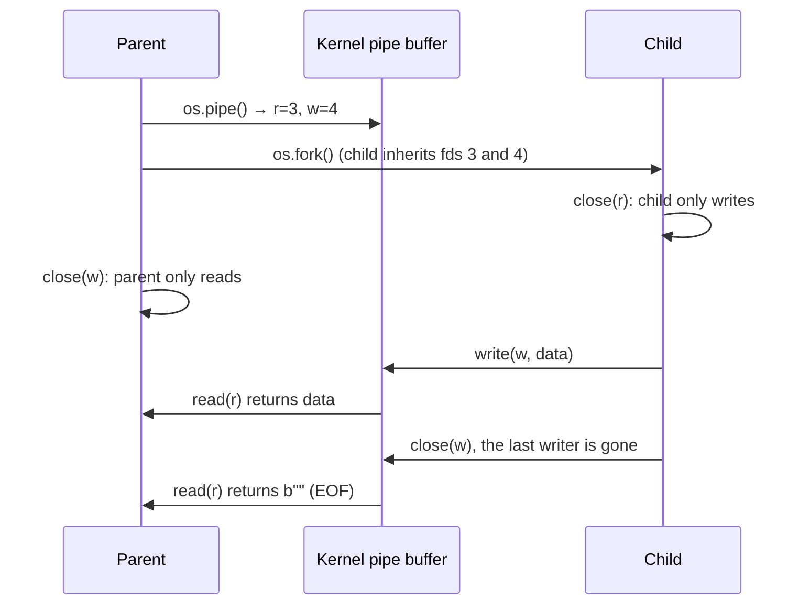
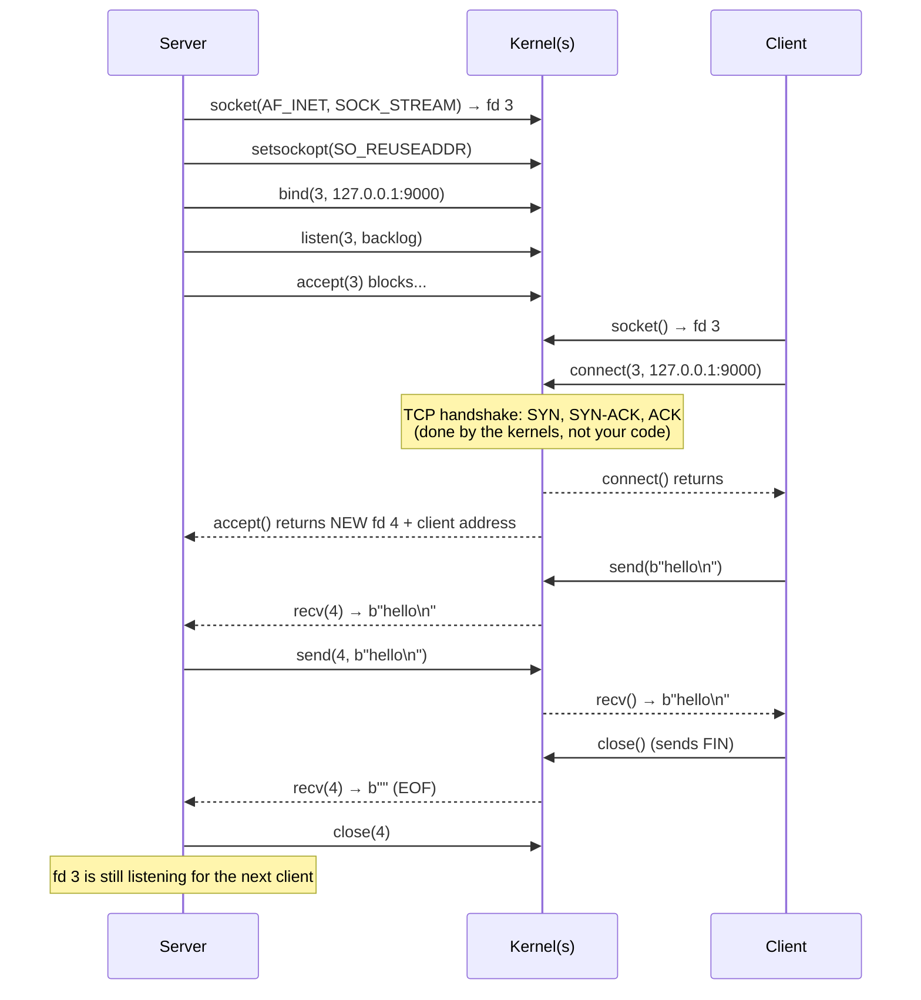
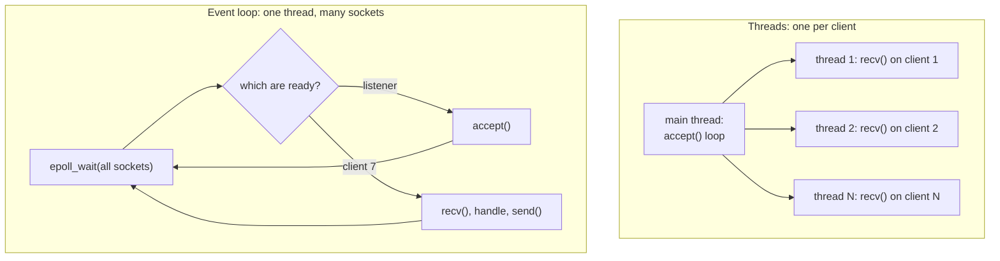

# Pipes and sockets

> **Level 5 · Chapter 4** · ⏱️ ~60 min read · Prerequisites: [File descriptors in code](02-file-descriptors.md), [Processes and signals in code](03-processes-signals-in-code.md), [Networking basics](../04-sysadmin/03-networking-basics.md)

Programs on Linux talk to each other through a handful of **inter-process communication** (IPC) mechanisms. This chapter covers the ones you'll use most: anonymous pipes, named pipes, Unix domain sockets, and TCP sockets. By the end you'll have written a TCP server that handles many clients at once, three different ways, and you'll know how to test it with `nc` and `ss`.

## Why it matters

A colleague wrote a small Python service that accepts sensor readings over TCP. Locally, with one test client, it worked perfectly. In production, with forty sensors connected, readings from all but one sensor arrived minutes late or not at all.

The server's loop was `conn, addr = srv.accept()`, then a `while True: conn.recv(...)` loop for that one client. While it was busy with the first sensor, it never went back to `accept()`. The other 39 sensors sat in the kernel's queue of pending connections, their data piling up in kernel buffers. A second bug showed up when traffic spiked: readings got glued together or split in half, because the code assumed each `recv()` returned exactly one message.

Both are classic first-server mistakes, and both come from not knowing what the kernel is doing underneath. After this chapter you'll recognize them on sight: one is a **concurrency** problem (fixed with threads, `selectors`, or `asyncio`), the other a **framing** problem (TCP is a byte stream, not a message stream).

## Concepts

### The IPC menu

**Inter-process communication** means any way for two processes to exchange data or notifications. Linux offers many. These are the ones that matter in practice:

| Mechanism | Direction | Who can use it | Unit of data | Typical use |
|-----------|-----------|----------------|--------------|-------------|
| **Anonymous pipe** (`pipe()`) | One way | Related processes (parent and children) that inherit the fds | Byte stream | Shell pipelines; capturing a child's output |
| **Named pipe / FIFO** (`mkfifo`) | One way | Any process that can open the path | Byte stream | Simple hand-off between unrelated scripts |
| **Unix domain socket** (`AF_UNIX`) | Two way | Any process on the **same machine** that can access the path | Stream or datagrams | Local daemons: Docker, systemd, PostgreSQL, X11/Wayland |
| **TCP socket** (`AF_INET`/`AF_INET6`, `SOCK_STREAM`) | Two way | Any process on **any** reachable machine | Reliable byte stream | Web servers, databases, almost every network service |
| **UDP socket** (`SOCK_DGRAM`) | Two way | Any reachable machine | Datagrams; may be lost or reordered | DNS, metrics (StatsD), video, games |
| **Shared memory** (`/dev/shm`, `mmap`) | Both | Processes that map the same region | Raw memory, no copying | Very high-throughput data sharing; needs separate locking |
| **Signals** | One way | Same user (or root) | A small number, no data | "Stop", "reload config", "child exited" |

Everything except signals and shared memory works through **file descriptors**, so the same `read`, `write`, `close`, and `poll` calls from the last two chapters apply. Shared memory is the fastest (no copying through the kernel) but the hardest to use correctly, because you need your own synchronization. Signals carry no data. For most programs, the choice is between a pipe (parent and child), a Unix socket (local services), and TCP (anything that might ever cross a network).

### Anonymous pipes

`os.pipe()` asks the kernel for a **pipe**: a one-way channel with a buffer in kernel memory. It returns two fds: a **read end** and a **write end**. Bytes written to the write end come out of the read end in the same order.

A pipe has no name, so the only way for another process to get one of its ends is to **inherit** it through `fork`. That's why pipes connect related processes. The pattern:



**Close the ends you don't use.** This is the most important pipe rule, and forgetting it causes hangs. The reader only sees EOF when **every** write end in **every** process is closed. If the parent keeps its own copy of the write end open, it will wait forever for an EOF that can't come, because a writer (itself) still exists.

### Pipe capacity, blocking, and SIGPIPE

A pipe's buffer on Linux holds **64 KiB** by default (`fcntl(fd, F_GETPIPE_SZ)` reports it, and an unprivileged process can raise it up to `/proc/sys/fs/pipe-max-size`, 1 MiB). That limited buffer gives pipes built-in **flow control**, also called **backpressure**:

- A **writer blocks** when the buffer is full, until the reader drains some of it. A fast producer can't run away from a slow consumer.
- A **reader blocks** when the buffer is empty, until data arrives or every writer closes (EOF).
- A **write to a pipe with no readers left** makes the kernel send **`SIGPIPE`** to the writer, which kills it by default. If the signal is ignored, `write` fails with `EPIPE` instead.

`SIGPIPE` is why `seq 1000000000 | head -3` finishes instantly instead of generating a billion numbers: once `head` exits, the next write by `seq` kills it. Python ignores `SIGPIPE`, so a Python producer gets a `BrokenPipeError` exception instead, which you'll see below.

Writes of up to 4096 bytes (`PIPE_BUF`) to a pipe are **atomic**: they never interleave with other writers' data. Larger writes can be split up if several processes write to the same pipe.

### Named pipes (FIFOs)

A **named pipe**, or **FIFO** (first in, first out), is a pipe with a name in the filesystem. You create it with `mkfifo` (the command) or `os.mkfifo()`. `ls -l` shows it with type `p`. Any process with permission can open it by path, so unrelated processes can use it.

The data never touches the disk. The file is just a meeting point. Two behaviors surprise people:

- **Opening blocks.** Opening a FIFO for reading blocks until someone opens it for writing, and vice versa. That's the hang you traced in chapter 1.
- **EOF happens when all writers close.** A reader that wants to keep serving several writers in turn must reopen the FIFO after each EOF.

FIFOs are fine for quick plumbing between scripts on one machine. For anything two-way, or with several clients at once, use a Unix domain socket.

### Sockets

A **socket** is an endpoint for two-way communication, created with the `socket()` syscall. It's identified by three choices:

- The **address family**: `AF_UNIX` (a path on this machine), `AF_INET` (IPv4 address and port), or `AF_INET6` (IPv6).
- The **socket type**: `SOCK_STREAM` (a reliable, ordered, connected byte stream; with `AF_INET` that's **TCP**), or `SOCK_DGRAM` (separate messages called **datagrams**; with `AF_INET` that's **UDP**).
- The protocol, which is almost always implied by the first two.

After that, a socket is just a file descriptor. It shows up in `/proc/PID/fd` as `socket:[inode]`, and you can `read` and `write` it (Python's socket objects call these `recv` and `send`).

### Unix domain sockets

A **Unix domain socket** uses a filesystem path as its address, like `/run/docker.sock` or `/var/run/postgresql/.s.PGSQL.5432`. It's for communication between processes on the same machine, and it's faster than TCP over loopback because there's no network stack involved: no checksums, no TCP state machine, no packet routing.

Unix sockets have three useful properties that TCP doesn't:

- **Access control with file permissions.** The socket file has an owner and a mode. If only the `docker` group can write to `/run/docker.sock`, only members of that group can talk to Docker. No passwords needed.
- **Peer credentials.** The server can ask the kernel for the connecting process's PID, UID, and GID (`SO_PEERCRED`). The kernel fills these in, so the client can't lie. systemd and PostgreSQL's "peer" authentication rely on this.
- **Passing file descriptors.** A process can send an open fd to another process over a Unix socket (`SCM_RIGHTS`). This is how systemd hands sockets to services, and how some servers hand off connections between processes.

The path has a length limit of 107 bytes, because it's stored in a fixed 108-byte field in the address structure. Longer paths fail with `OSError: AF_UNIX path too long`. The socket file also isn't removed automatically when the server exits, and a stale one makes the next `bind()` fail with `EADDRINUSE`, so servers usually delete it before binding.

### The TCP socket lifecycle

A TCP server and client each make a fixed sequence of syscalls. The server prepares a **listening socket**, and the kernel completes connections in the background. `accept()` then hands each finished connection to the program as a **new** socket, with its own fd.



Each step, and why it exists:

1. **`socket()`** creates an unconnected endpoint.
2. **`bind()`** attaches it to a local address and port. Servers bind to a known port so clients can find them. Clients usually skip this, and the kernel picks an **ephemeral port** (a temporary high-numbered port, 32768 to 60999 on Linux) at connect time.
3. **`listen(backlog)`** marks it as a listening socket. The kernel now completes TCP handshakes on its own and queues finished connections. `backlog` is roughly how many may wait in that **accept queue** before new ones get refused or dropped.
4. **`accept()`** takes the next finished connection off the queue and returns a **new socket** for it. The listening socket stays open and keeps listening.
5. **`connect()`** on the client starts the handshake and returns once it completes (or fails with `ECONNREFUSED` if nothing is listening, or times out if packets are dropped).
6. **`send()`/`recv()`** move bytes. `recv()` returning `b""` means the other side closed its end: EOF, exactly like a pipe.
7. **`close()`** ends the connection, sending a **FIN** packet ("I'm done sending").

Binding to `127.0.0.1` (loopback) means only programs on this machine can connect. Binding to `0.0.0.0` means "every IPv4 address this machine has", which exposes the port to the network, subject to your firewall (see [Firewalls with ufw](../04-sysadmin/04-firewall-ufw.md)). For learning and testing, always bind to `127.0.0.1`.

### TIME_WAIT and SO_REUSEADDR

When a TCP connection closes, the side that closed **first** keeps a small record of it in the **`TIME_WAIT`** state for 60 seconds on Linux. This catches stray packets from the old connection that are still in flight, so they can't be mistaken for part of a new connection that reuses the same addresses and ports.

The problem: if your server is the side that closed first (because it crashed, or you stopped it while clients were connected), its port has `TIME_WAIT` entries. Restarting the server within a minute then fails:

```text
OSError: [Errno 98] Address already in use
```

The fix is the **`SO_REUSEADDR`** socket option, set before `bind()`. It tells the kernel "let me bind even if old connections on this port are in `TIME_WAIT`" (it still refuses if another socket is actively *listening* there). Every server should set it. Python's `socket.create_server()` and `asyncio.start_server()` set it for you on Linux.

There's a Linux subtlety: the option must have been set on the *old* server's socket too, because each `TIME_WAIT` entry remembers whether its socket allowed reuse. Restarting a server that never set `SO_REUSEADDR` can still fail for 60 seconds, even if the new version sets it.

`SO_REUSEPORT` is a different option. It lets several processes listen on the same port at once, with the kernel spreading connections between them. It's used for multi-process servers, and you don't need it here.

### TCP is a byte stream, not a message stream

TCP guarantees that bytes arrive **in order, without gaps or duplicates**. It guarantees nothing about how they're grouped. Three `send()` calls on one side might arrive as one `recv()`, or one `send()` might arrive in five pieces. The kernel splits and merges data based on buffer sizes, packet sizes, and timing.

So `recv(4096)` returns "whatever bytes have arrived so far, up to 4096". If your protocol has messages, **you** must mark where each one ends. That's called **framing**. There are two common schemes:

| Scheme | How | Good for | Watch out for |
|--------|-----|----------|---------------|
| **Delimiter** (usually newline) | Each message ends with `\n`. Read until you see one | Text protocols: SMTP, Redis, IRC, the capstone | Messages that contain the delimiter must be escaped; cap the line length |
| **Length prefix** | Send the message length first (e.g. a 4-byte integer), then exactly that many bytes | Binary data, JSON with newlines in it, files | Cap the length so a bad header can't make you allocate 4 GB |

Either way, the receiver keeps a **buffer**: it appends each `recv()` result, extracts every complete message, and keeps any leftover partial message for next time.

The same applies to sending. `send()` may send only part of what you gave it. `sendall()` loops until everything is sent.

### Serving many clients at once

A server's main loop spends nearly all its time **waiting**: for a new connection, or for a client to send something. The question is how to wait for many things at once. There are three common answers.



**Threads.** The `accept()` loop starts a new thread per connection, and each thread does simple blocking `recv`/`send`. The code reads naturally, top to bottom. Python's GIL is released while a thread waits on I/O, so threads work well for I/O-bound servers. The costs: each thread uses memory (a stack, plus kernel structures), thousands of threads strain the scheduler, and shared data needs locks.

**I/O multiplexing with an event loop.** One thread asks the kernel "tell me which of these sockets is ready", then handles exactly those, without blocking, and asks again. Linux offers three syscalls for the asking:

| Syscall | How it works | Limits |
|---------|--------------|--------|
| `select()` | Pass bitmasks of fds each call; the kernel scans them all | fds must be below 1024 (`FD_SETSIZE`); cost grows with the number of fds watched |
| `poll()` | Pass an array of fds each call | No fd limit, but still scans the whole list every time |
| **`epoll`** | Register fds once (`epoll_ctl`), then `epoll_wait` returns only the ready ones | Linux-only; scales to hundreds of thousands of connections |

Python's **`selectors`** module wraps these behind one interface. `selectors.DefaultSelector()` picks the best one available, which is `EpollSelector` on Linux. Event-loop code is a little less natural, because each handler must return quickly instead of blocking. But one thread can handle thousands of clients with no locks.

**`asyncio`.** Python's `asyncio` module is an event loop (built on `selectors`, and so on epoll) plus **coroutines**: functions defined with `async def`, which can pause at each `await` while the loop runs other coroutines. You write code that *looks* sequential (`line = await reader.readline()`), and the loop multiplexes it underneath. This is the modern default for new network code in Python, and the capstone uses it.

| | Threads | `selectors` | `asyncio` |
|-|---------|-------------|-----------|
| Code style | Plain blocking code | Callbacks; manual buffers | Sequential-looking `async`/`await` |
| Clients per process | Hundreds to a few thousand | Tens of thousands+ | Tens of thousands+ |
| Shared state | Needs locks | No locks (one thread) | No locks between `await`s |
| One slow CPU-bound handler | Others keep running | Blocks everyone | Blocks everyone |
| Good for | Simple servers; calling blocking libraries | Learning how event loops work; tiny dependencies | New network services |

## Commands and examples

Work in `~/level5`. All servers here bind to `127.0.0.1` on high ports, and you stop each one with ++ctrl+c++ or `kill` when you're done.

### A pipe between parent and child

```python title="pipe_fork.py"
import os

r, w = os.pipe()                       # two fds: read end, write end
print(f"pipe fds: read={r} write={w}")

pid = os.fork()
if pid == 0:                           # child: the writer
    os.close(r)                        # close the end you don't use
    for i in range(3):
        os.write(w, f"record {i} from child {os.getpid()}\n".encode())
    os.close(w)                        # EOF for the reader
    os._exit(0)

os.close(w)                            # parent: the reader. MUST close w,
with os.fdopen(r) as reader:           # or it would never see EOF
    for line in reader:
        print("parent got:", line.rstrip())
os.waitpid(pid, 0)
```

```bash
python3 pipe_fork.py
```

```text
pipe fds: read=3 write=4
parent got: record 0 from child 153290
parent got: record 1 from child 153290
parent got: record 2 from child 153290
```

`os.fdopen(r)` wraps the raw fd in a file object, so you can iterate over lines. The `for` loop ends when `read` returns 0 bytes, which happens only because both processes closed their copies of `w`. Comment out the parent's `os.close(w)` and run it again: it prints the three records and then hangs forever. Press ++ctrl+c++.

This is what `subprocess.run(..., capture_output=True)` does internally, with one pipe for stdout and one for stderr.

### Measuring the pipe buffer

```python title="pipe_capacity.py"
import fcntl, os

r, w = os.pipe()
os.set_blocking(w, False)              # don't block when full; raise instead
total = 0
try:
    while True:
        total += os.write(w, b"x" * 1024)
except BlockingIOError:
    print(f"pipe full after {total} bytes ({total // 1024} KiB)")
print("F_GETPIPE_SZ says:", fcntl.fcntl(w, fcntl.F_GETPIPE_SZ))
```

```bash
python3 pipe_capacity.py
```

```text
pipe full after 65536 bytes (64 KiB)
F_GETPIPE_SZ says: 65536
```

With a normal (blocking) fd, the 65th `write` would simply have waited until a reader made room. The non-blocking mode turned that wait into a `BlockingIOError` (`EAGAIN`) so you could count. This is the backpressure that keeps `fast_producer | slow_consumer` from using unlimited memory.

### SIGPIPE and BrokenPipeError

```python title="numbers.py"
for i in range(1_000_000):
    print(i)
```

```bash
python3 numbers.py | head -3; echo "PIPESTATUS: ${PIPESTATUS[*]}"
```

```text
0
1
2
Traceback (most recent call last):
  File "/home/alex/level5/numbers.py", line 2, in <module>
    print(i)
BrokenPipeError: [Errno 32] Broken pipe
PIPESTATUS: 1 0
```

`head` read three lines and exited. Python's next flush to the pipe failed with `EPIPE`, because Python ignores `SIGPIPE`. Compare a classic Unix tool:

```bash
seq 1000000 | head -2; echo "PIPESTATUS: ${PIPESTATUS[*]}"
```

```text
1
2
PIPESTATUS: 141 0
```

`seq` was killed by `SIGPIPE`: 128 + 13 = 141. Silent and correct. For Python command-line filters meant to be used in pipelines, restore the classic behavior:

```python title="numbers_fixed.py"
import signal

signal.signal(signal.SIGPIPE, signal.SIG_DFL)   # behave like a classic Unix filter
for i in range(1_000_000):
    print(i)
```

```bash
python3 numbers_fixed.py | head -3; echo "PIPESTATUS: ${PIPESTATUS[*]}"
```

```text
0
1
2
PIPESTATUS: 141 0
```

Don't do this in servers. A server writing to a socket whose client vanished should get an exception it can handle for that one client, not die.

### A named pipe as a job queue

```python title="fifo_reader.py"
import os

FIFO = "jobs.fifo"
if not os.path.exists(FIFO):
    os.mkfifo(FIFO, 0o600)

print("waiting for a writer...", flush=True)
while True:
    with open(FIFO) as fifo:              # blocks until a writer opens it
        for line in fifo:                 # ends when all writers close
            print("job:", line.strip(), flush=True)
    print("writer closed; reopening", flush=True)
```

Run the reader in one terminal:

```bash
python3 fifo_reader.py
```

In a second terminal, look at the FIFO and send it work:

```bash
ls -l jobs.fifo
echo "resize photo1.jpg" > jobs.fifo
printf 'transcode a.mp4\ntranscode b.mp4\n' > jobs.fifo
```

```text
prw------- 1 alex alex 0 Oct  2 10:42 jobs.fifo
```

The first terminal shows:

```text
waiting for a writer...
job: resize photo1.jpg
writer closed; reopening
job: transcode a.mp4
job: transcode b.mp4
writer closed; reopening
```

The `p` at the start of the mode means "pipe", and the size is always 0, because data never goes to disk. Each shell redirection opened the FIFO, wrote, and closed it, which gave the reader EOF, so it reopens and waits for the next writer. Stop the reader with ++ctrl+c++ and delete the FIFO with `rm jobs.fifo`.

!!! warning "Common mistake"
    The close-and-reopen loop above has a race. If a new writer opens the FIFO and writes in the moment between the reader seeing EOF and closing its fd, that data is discarded when the reader closes. Under load, lines go missing. Exercise 2 measures it and shows the fix: open the FIFO with `os.O_RDWR`, so the reader never sees EOF at all.

### A Unix domain socket server

```python title="unix_server.py"
import os, socket, struct

PATH = "/tmp/level5-demo.sock"
if os.path.exists(PATH):
    os.unlink(PATH)                       # a stale socket file blocks bind()

with socket.socket(socket.AF_UNIX, socket.SOCK_STREAM) as srv:
    srv.bind(PATH)                        # creates the socket file
    os.chmod(PATH, 0o660)                 # file permissions = access control
    srv.listen()
    print("listening on", PATH, flush=True)
    conn, _ = srv.accept()
    with conn:
        creds = conn.getsockopt(socket.SOL_SOCKET, socket.SO_PEERCRED,
                                struct.calcsize("3i"))
        pid, uid, gid = struct.unpack("3i", creds)
        print(f"client pid={pid} uid={uid} gid={gid}", flush=True)
        data = conn.recv(1024)
        conn.sendall(b"server says: got " + data)
os.unlink(PATH)
```

Start it, then connect from a second terminal, first with Python and then (after restarting the server) with `nc -U`:

```bash
python3 unix_server.py
```

```bash
ls -l /tmp/level5-demo.sock
ss -xl | grep level5
python3 -c '
import socket
s = socket.socket(socket.AF_UNIX, socket.SOCK_STREAM)
s.connect("/tmp/level5-demo.sock")
s.sendall(b"hello\n"); print(s.recv(1024).decode(), end="")'
```

```text
srw-rw---- 1 alex alex 0 Oct  2 10:42 /tmp/level5-demo.sock
u_str LISTEN 0      128    /tmp/level5-demo.sock 1940576            * 0
server says: got hello
```

And the server's terminal:

```text
listening on /tmp/level5-demo.sock
client pid=155011 uid=1000 gid=1000
```

The `s` in `srw-rw----` marks a socket file. `ss -x` lists Unix sockets (`-l` for listening ones). The server learned the client's PID and UID from the kernel without the client sending them. Restart the server and try `echo ping | nc -U -q1 /tmp/level5-demo.sock` to see it work with `nc` too.

### A TCP echo server and client

The simplest possible TCP server handles one client at a time. It's the right place to see every syscall from the lifecycle diagram:

```python title="echo_server.py"
#!/usr/bin/env python3
"""Iterative TCP echo server: one client at a time."""
import socket

HOST, PORT = "127.0.0.1", 9000

srv = socket.socket(socket.AF_INET, socket.SOCK_STREAM)        # socket()
srv.setsockopt(socket.SOL_SOCKET, socket.SO_REUSEADDR, 1)      # restart without waiting
srv.bind((HOST, PORT))                                         # bind()
srv.listen()                                                   # listen()
print(f"listening on {HOST}:{PORT}", flush=True)

try:
    while True:
        conn, addr = srv.accept()                              # accept() blocks
        print(f"connection from {addr[0]}:{addr[1]}", flush=True)
        with conn:
            while True:
                data = conn.recv(4096)                         # recv() blocks
                if not data:                                   # b"" means peer closed
                    break
                conn.sendall(data)                             # send it all back
        print(f"{addr[0]}:{addr[1]} disconnected", flush=True)
except KeyboardInterrupt:
    print("\nshutting down", flush=True)
finally:
    srv.close()
```

```python title="echo_client.py"
#!/usr/bin/env python3
import socket
import sys

HOST, PORT = "127.0.0.1", 9000
message = " ".join(sys.argv[1:]) or "hello"

with socket.create_connection((HOST, PORT), timeout=5) as sock:   # socket()+connect()
    print("local address:", sock.getsockname())
    sock.sendall(message.encode() + b"\n")
    reply = b""
    while not reply.endswith(b"\n"):          # TCP is a byte stream: loop until done
        chunk = sock.recv(4096)
        if not chunk:
            break
        reply += chunk
    print("echoed back:", reply.decode().rstrip())
```

Start the server in one terminal, then use the client and `nc` from another:

```bash
python3 echo_server.py
```

```bash
python3 echo_client.py hello mint
echo "hi from nc" | nc -q1 127.0.0.1 9000
```

```text
local address: ('127.0.0.1', 34508)
echoed back: hello mint
hi from nc
```

The server's terminal:

```text
listening on 127.0.0.1:9000
connection from 127.0.0.1:34508
127.0.0.1:34508 disconnected
connection from 127.0.0.1:34512
127.0.0.1:34512 disconnected
```

Port 34508 is the client's ephemeral port, picked by the kernel. `socket.create_connection()` is the convenient client-side call: it resolves the host name, tries each address it gets, and applies the timeout to the connect. Always give network clients a timeout. Without one, a silent server can hang your client forever, which is exactly the story at the start of chapter 1.

Now see the limitation. Leave one `nc` connected:

```bash
nc 127.0.0.1 9000
```

And from a third terminal, run `python3 echo_client.py second`. It hangs: the server is stuck in the first client's `recv` loop and never calls `accept()` again. The kernel completed the second client's handshake and queued it, which is why `connect` succeeded, but nobody is reading. Press ++ctrl+c++ in the `nc` terminal, and the waiting client is served at once.

### Watching TIME_WAIT

With the iterative server running and an `nc` connected, stop the *server* with ++ctrl+c++ first, so the server side closes the connection first. Then:

```bash
ss -tan state time-wait '( sport = :9000 )'
```

```text
Recv-Q Send-Q Local Address:Port Peer Address:Port Process
0      0          127.0.0.1:9000    127.0.0.1:45682
```

That's the server side's `TIME_WAIT` entry, which will last 60 seconds. Because `echo_server.py` set `SO_REUSEADDR`, restarting it right away works. A version without that `setsockopt` line fails during those 60 seconds:

```text
Traceback (most recent call last):
  File "/home/alex/level5/echo_noreuse.py", line 9, in <module>
    srv.bind((HOST, PORT))                                         # bind()
    ^^^^^^^^^^^^^^^^^^^^^^
OSError: [Errno 98] Address already in use
```

### Handling many clients with threads

The smallest change that fixes the one-client problem is a thread per connection:

```python title="threaded_echo.py"
#!/usr/bin/env python3
"""Thread-per-client echo server."""
import socket
import threading

HOST, PORT = "127.0.0.1", 9000

def handle(conn: socket.socket, addr) -> None:
    name = f"{addr[0]}:{addr[1]}"
    print(f"[{threading.current_thread().name}] {name} connected", flush=True)
    with conn:
        while data := conn.recv(4096):
            conn.sendall(data)
    print(f"[{threading.current_thread().name}] {name} disconnected", flush=True)

with socket.create_server((HOST, PORT)) as srv:      # sets SO_REUSEADDR for you
    print(f"listening on {HOST}:{PORT}", flush=True)
    while True:
        conn, addr = srv.accept()
        threading.Thread(target=handle, args=(conn, addr), daemon=True).start()
```

`daemon=True` here is a *thread* setting (unrelated to daemon processes): Python won't wait for these threads at exit, so ++ctrl+c++ stops the server even with clients connected. The `while data := conn.recv(4096)` loop uses the "walrus" operator to assign and test in one step. It ends when `recv` returns `b""`.

To test concurrency, this script opens many connections at once and interleaves messages across them:

```python title="many_clients.py"
#!/usr/bin/env python3
"""Open N connections at once, interleave messages, check every echo."""
import socket
import sys
import time

N = int(sys.argv[1]) if len(sys.argv) > 1 else 5
socks = [socket.create_connection(("127.0.0.1", 9000)) for _ in range(N)]
t0 = time.monotonic()
for rnd in range(3):
    for i, s in enumerate(socks):
        s.sendall(f"client {i} round {rnd}\n".encode())
    for i, s in enumerate(socks):
        buf = b""
        while not buf.endswith(b"\n"):
            buf += s.recv(4096)
        assert buf == f"client {i} round {rnd}\n".encode(), buf
for s in socks:
    s.close()
print(f"{N} clients x 3 rounds: all echoes correct in {time.monotonic() - t0:.3f}s")
```

```bash
python3 threaded_echo.py &
python3 many_clients.py 50
kill %1
```

```text
listening on 127.0.0.1:9000
[Thread-1 (handle)] 127.0.0.1:58338 connected
[Thread-2 (handle)] 127.0.0.1:58342 connected
...
50 clients x 3 rounds: all echoes correct in 0.014s
```

Against the iterative `echo_server.py`, the same test would hang on the second client.

### Handling many clients with selectors

This version uses one thread and the kernel's epoll:

```python title="selectors_echo.py"
#!/usr/bin/env python3
"""Single-threaded echo server using selectors (epoll on Linux)."""
import selectors
import socket

HOST, PORT = "127.0.0.1", 9000
sel = selectors.DefaultSelector()            # EpollSelector on Linux
print("using", type(sel).__name__, flush=True)

def accept(srv: socket.socket) -> None:
    conn, addr = srv.accept()                # won't block: epoll said it's ready
    conn.setblocking(False)
    print(f"{addr[0]}:{addr[1]} connected", flush=True)
    sel.register(conn, selectors.EVENT_READ, data=echo)

def echo(conn: socket.socket) -> None:
    try:
        data = conn.recv(4096)               # won't block: data is waiting
    except ConnectionResetError:
        data = b""
    if data:
        conn.sendall(data)                   # OK for small replies; see the note
    else:                                    # b"" = the client closed
        print(f"fd {conn.fileno()} disconnected", flush=True)
        sel.unregister(conn)
        conn.close()

srv = socket.create_server((HOST, PORT))     # SO_REUSEADDR is set for you
srv.setblocking(False)
sel.register(srv, selectors.EVENT_READ, data=accept)
print(f"listening on {HOST}:{PORT}", flush=True)

try:
    while True:
        for key, _mask in sel.select():      # sleep until something is ready
            callback = key.data
            callback(key.fileobj)
except KeyboardInterrupt:
    pass
finally:
    sel.close()
    srv.close()
```

How it works:

- Each socket is **registered** with the selector, along with a callback stored in `data`. The listening socket's callback is `accept`. Each client's is `echo`.
- `sel.select()` blocks until at least one registered socket is ready, then returns only the ready ones. For a listening socket, "ready to read" means a connection is waiting to be accepted.
- Every handler does one non-blocking step and returns, so the loop can serve everyone.

The trace shows the event loop in syscalls (trimmed):

```bash
strace -e trace=bind,listen,epoll_ctl,epoll_wait,accept4,recvfrom,sendto python3 selectors_echo.py
```

```text
bind(4, {sa_family=AF_INET, sin_port=htons(9000), sin_addr=inet_addr("127.0.0.1")}, 16) = 0
listen(4, 128)                          = 0
epoll_ctl(3, EPOLL_CTL_ADD, 4, {events=EPOLLIN, data={u32=4, u64=130755984359428}}) = 0
epoll_wait(3, [{events=EPOLLIN, data={u32=4, u64=130755984359428}}], 1, -1) = 1
accept4(4, {sa_family=AF_INET, sin_port=htons(36862), sin_addr=inet_addr("127.0.0.1")}, [16], SOCK_CLOEXEC) = 5
epoll_ctl(3, EPOLL_CTL_ADD, 5, {events=EPOLLIN, data={u32=5, u64=130755984359429}}) = 0
epoll_wait(3, [{events=EPOLLIN, data={u32=5, u64=130755984359429}}], 2, -1) = 1
recvfrom(5, "ping\n", 4096, 0, NULL, NULL) = 5
sendto(5, "ping\n", 5, 0, NULL, 0)      = 5
epoll_wait(3, [{events=EPOLLIN, data={u32=5, u64=130755984359429}}], 2, -1) = 1
recvfrom(5, "", 4096, 0, NULL, NULL)    = 0
epoll_ctl(3, EPOLL_CTL_DEL, 5, 0x7ffd10258be4) = 0
```

fd 3 is the epoll instance, fd 4 the listener, fd 5 the client (from `echo ping | nc -q0 127.0.0.1 9000` in another terminal). The `-1` timeout in `epoll_wait` means "wait forever". The process spends its idle time blocked there, using no CPU.

!!! note "sendall on a non-blocking socket"
    `sendall()` on a non-blocking socket raises `BlockingIOError` if the kernel's send buffer fills up, for example with a slow client and large replies. It's fine for short echoes. A production-quality `selectors` server keeps a per-client output buffer, registers for `EVENT_WRITE` while that buffer is non-empty, and sends more when the socket becomes writable. Handling this kind of detail for you is a big part of what `asyncio` offers.

### Handling many clients with asyncio

```python title="asyncio_echo.py"
#!/usr/bin/env python3
"""Echo server with asyncio streams."""
import asyncio

HOST, PORT = "127.0.0.1", 9000

async def handle(reader: asyncio.StreamReader, writer: asyncio.StreamWriter) -> None:
    host, port = writer.get_extra_info("peername")
    print(f"{host}:{port} connected", flush=True)
    try:
        while line := await reader.readline():   # other clients run while we wait
            writer.write(line)
            await writer.drain()                 # wait if the client reads slowly
    except ConnectionResetError:
        pass
    finally:
        print(f"{host}:{port} disconnected", flush=True)
        writer.close()
        await writer.wait_closed()

async def main() -> None:
    server = await asyncio.start_server(handle, HOST, PORT)
    print(f"listening on {HOST}:{PORT}", flush=True)
    async with server:
        await server.serve_forever()

if __name__ == "__main__":
    try:
        asyncio.run(main())
    except KeyboardInterrupt:
        pass
```

```bash
python3 asyncio_echo.py &
python3 many_clients.py 50
kill %1
```

```text
listening on 127.0.0.1:9000
127.0.0.1:59274 connected
127.0.0.1:59290 connected
...
50 clients x 3 rounds: all echoes correct in 0.011s
```

`handle` reads like the blocking version, but each `await` is a point where the coroutine pauses and the event loop runs other clients. `asyncio.start_server` calls `handle` in a new **task** (a scheduled coroutine) for each connection. `reader.readline()` does the newline framing for you, buffering partial lines across `recv` calls. `writer.drain()` waits when the kernel's send buffer is full, which is the backpressure that the `selectors` version left out.

!!! warning "Common mistake"
    Calling blocking code inside a coroutine (`time.sleep(5)`, `requests.get(...)`, a slow database driver, heavy computation) freezes **every** client, because nothing else runs until that call returns. Use the `asyncio` equivalents (`await asyncio.sleep(5)`), or push blocking work to a thread with `await asyncio.to_thread(func, args)`.

### Framing messages

First, proof that TCP doesn't preserve message boundaries. `socket.socketpair()` returns two connected sockets in one process, which is handy for experiments:

```python title="stream_demo.py"
#!/usr/bin/env python3
"""Show that TCP has no message boundaries."""
import socket
import time

a, b = socket.socketpair()
a.sendall(b"SET user alex\n")
a.sendall(b"SET host mint\n")
a.sendall(b"GET us")                      # a message cut in half
time.sleep(0.1)
print("one recv() got:", b.recv(4096))
a.sendall(b"er\n")
print("next recv() got:", b.recv(4096))
```

```bash
python3 stream_demo.py
```

```text
one recv() got: b'SET user alex\nSET host mint\nGET us'
next recv() got: b'er\n'
```

Three sends arrived as one receive, ending in the middle of a command. (`socketpair` gives Unix stream sockets, but TCP behaves the same way, and over a real network it's even less predictable.) A line-based receiver handles this with a buffer:

```python
buf = b""
while True:
    chunk = conn.recv(4096)
    if not chunk:
        break
    buf += chunk
    while b"\n" in buf:
        line, buf = buf.split(b"\n", 1)       # one complete command
        handle(line)
    if len(buf) > 65536:
        raise ValueError("line too long")     # protect yourself
```

For binary data, or payloads that may contain newlines, use a **length prefix**:

```python title="framing.py"
#!/usr/bin/env python3
"""Length-prefixed framing: 4-byte big-endian length, then the payload."""
import json
import socket
import struct

HEADER = struct.Struct("!I")          # ! = network byte order, I = uint32

def send_msg(sock: socket.socket, obj) -> None:
    payload = json.dumps(obj).encode()
    sock.sendall(HEADER.pack(len(payload)) + payload)

def recv_exact(sock: socket.socket, n: int) -> bytes:
    buf = bytearray()
    while len(buf) < n:
        chunk = sock.recv(n - len(buf))
        if not chunk:
            raise ConnectionError(f"peer closed after {len(buf)} of {n} bytes")
        buf += chunk
    return bytes(buf)

def recv_msg(sock: socket.socket):
    (length,) = HEADER.unpack(recv_exact(sock, HEADER.size))
    if length > 10_000_000:
        raise ValueError(f"refusing {length}-byte message")
    return json.loads(recv_exact(sock, length))

if __name__ == "__main__":
    a, b = socket.socketpair()        # two connected sockets, handy for tests
    send_msg(a, {"event": "upload", "rows": 1200})
    send_msg(a, {"event": "note", "text": "line one\nline two"})   # newline inside: fine
    print(recv_msg(b))
    print(recv_msg(b))
```

```bash
python3 framing.py
```

```text
{'event': 'upload', 'rows': 1200}
{'event': 'note', 'text': 'line one\nline two'}
```

`struct` packs the length as 4 bytes in **network byte order** (big-endian), the convention for binary network protocols, so machines with different CPU byte orders agree. `recv_exact` is the loop every length-prefixed protocol needs, because even a 4-byte header can arrive in pieces.

### Shared memory, briefly

For completeness, the one mechanism here that doesn't use file descriptors for the data itself:

```python title="shm_demo.py"
import os
from multiprocessing import shared_memory

shm = shared_memory.SharedMemory(name="level5_demo", create=True, size=16)
print("backing file:", os.path.exists("/dev/shm/level5_demo"))

pid = os.fork()
if pid == 0:                                   # child writes...
    child = shared_memory.SharedMemory(name="level5_demo")
    child.buf[:5] = b"hello"
    child.close()
    os._exit(0)

os.waitpid(pid, 0)
print("parent reads:", bytes(shm.buf[:5]))     # ...parent sees it: no copying
shm.close()
shm.unlink()                                   # remove /dev/shm/level5_demo
```

```text
backing file: True
parent reads: b'hello'
```

Both processes mapped the same memory pages, backed by a file on the `/dev/shm` tmpfs. The data was never copied through the kernel. Real uses need a lock or another signal to say "the data is ready", which is where the complexity lies. Reach for it only when you've measured that copying through a pipe or socket is your bottleneck.

### Testing servers with nc and ss

**`nc`** (netcat) is a Swiss Army knife for sockets. Mint ships the OpenBSD version. The forms you'll use most:

```bash
nc 127.0.0.1 9000                  # interactive client: type lines, see replies
echo "STATS" | nc -q1 127.0.0.1 9000    # send, wait 1 s after EOF, then quit
nc -zv 127.0.0.1 9000              # just test whether the port accepts connections
nc -l 127.0.0.1 9001               # be a one-shot server (great for testing clients)
nc -U /tmp/level5-demo.sock        # talk to a Unix domain socket
nc -C 127.0.0.1 9000               # send CRLF line endings (like telnet)
```

```bash
nc -zv 127.0.0.1 9000
nc -zv 127.0.0.1 22
```

```text
nc: connect to 127.0.0.1 port 9000 (tcp) failed: Connection refused
Connection to 127.0.0.1 22 port [tcp/ssh] succeeded!
```

"Connection refused" means a host answered but nothing is listening on that port (the kernel replied with a TCP reset). A *timeout* instead would suggest a firewall silently dropping packets.

**`ss`** ("socket statistics") shows the kernel's view of all sockets. You met it in [Networking basics](../04-sysadmin/03-networking-basics.md). With the selectors server running and two `nc` clients connected:

```bash
ss -ltnp 'sport = :9000'
```

```text
State  Recv-Q Send-Q Local Address:Port Peer Address:PortProcess
LISTEN 0      128        127.0.0.1:9000      0.0.0.0:*    users:(("python3",pid=228304,fd=4))
```

```bash
ss -tnp '( sport = :9000 or dport = :9000 )'
```

```text
State Recv-Q Send-Q Local Address:Port  Peer Address:Port Process
ESTAB 0      0          127.0.0.1:9000     127.0.0.1:55324 users:(("python3",pid=228304,fd=5))
ESTAB 0      0          127.0.0.1:55324    127.0.0.1:9000  users:(("nc",pid=228330,fd=3))
ESTAB 0      0          127.0.0.1:55338    127.0.0.1:9000  users:(("nc",pid=228331,fd=3))
ESTAB 0      0          127.0.0.1:9000     127.0.0.1:55338 users:(("python3",pid=228304,fd=6))
```

The flags: `-t` TCP, `-l` listening only, `-n` numeric (don't resolve names), `-p` show the owning process, `-x` Unix sockets, `-a` all states. Each connection appears twice because both ends are on this machine. The server has fd 4 (listener) and fds 5 and 6 (one per client), matching the lifecycle diagram.

For a listening socket, `Send-Q` shows the backlog limit (128 here) and `Recv-Q` the number of connections waiting in the accept queue. A non-zero `Recv-Q` on a listener that stays non-zero means the server isn't calling `accept()` fast enough, which is exactly the bug from this chapter's opening story. For an established connection, `Recv-Q` is bytes received but not yet read by the application, and `Send-Q` is bytes sent but not yet acknowledged by the peer.

`lsof -i :9000` shows the same information from the process side, and `ss -tan state time-wait` lists connections in `TIME_WAIT`.

## Exercises

### Exercise 1: Close the write end (easy)

Copy `pipe_fork.py`, remove the parent's `os.close(w)`, and run it. Describe what happens and why. Then use `ls -l /proc/PID/fd` on the hung parent (from another terminal) to show the evidence.

??? success "Solution"

    The parent prints the three records and then hangs. The child closed its write end and exited, but the parent still holds its own copy of the write end, so from the kernel's point of view a writer still exists, and `read` waits for more data instead of returning EOF.

    ```bash
    ls -l /proc/$(pgrep -f pipe_fork)/fd
    ```

    ```text
    lrwx------ 1 alex alex 64 Oct  2 11:20 0 -> /dev/pts/1
    lrwx------ 1 alex alex 64 Oct  2 11:20 1 -> /dev/pts/1
    lrwx------ 1 alex alex 64 Oct  2 11:20 2 -> /dev/pts/1
    lr-x------ 1 alex alex 64 Oct  2 11:20 3 -> pipe:[2051177]
    l-wx------ 1 alex alex 64 Oct  2 11:20 4 -> pipe:[2051177]
    ```

    The same pipe inode appears twice: read end (`lr-x`) and write end (`l-wx`). The process is its own blocked writer. You could also `sudo strace -p` it and see it waiting in `read(3, `.

### Exercise 2: A FIFO-driven logger (easy)

Write `fifo_logger.py`, which creates `events.fifo`, reads lines from it forever, and appends each line to `events.log` with a timestamp. Feed it 100 lines each from two shell loops running at once (`echo ... > events.fifo` per line). Count the lines in the log. Does any line get lost or mangled? Why?

??? success "Solution"

    A first attempt, using the reopen loop from `fifo_reader.py`:

    ```python title="fifo_logger.py"
    import os, time

    FIFO, LOG = "events.fifo", "events.log"
    if not os.path.exists(FIFO):
        os.mkfifo(FIFO, 0o600)

    with open(LOG, "a") as log:
        while True:
            with open(FIFO) as fifo:
                for line in fifo:
                    log.write(f"{time.strftime('%H:%M:%S')} {line}")
                    log.flush()
    ```

    ```bash
    python3 fifo_logger.py &
    for i in $(seq 100); do echo "shell A event $i" > events.fifo; done &
    for i in $(seq 100); do echo "shell B event $i" > events.fifo; done &
    wait %2 %3; sleep 0.5
    wc -l events.log
    kill %1
    ```

    ```text
    198 events.log
    ```

    Lines go missing, and a different number each run (198, 199, 200...). This is the FIFO reopen race: the reader sees EOF when one writer closes, but before it closes its own fd, the next writer opens the FIFO and writes. Then the reader closes, the pipe has no readers left, and the kernel throws away the data sitting in the buffer.

    The fix is to open the FIFO **read-write**. The reader then counts as a writer too, so it never sees EOF and never has to close and reopen:

    ```python title="fifo_logger.py"
    import os, time

    FIFO, LOG = "events.fifo", "events.log"
    if not os.path.exists(FIFO):
        os.mkfifo(FIFO, 0o600)

    # O_RDWR: we count as a writer ourselves, so the pipe never hits EOF
    # and we never need to close and reopen it between writers.
    fd = os.open(FIFO, os.O_RDWR)
    with os.fdopen(fd) as fifo, open(LOG, "a") as log:
        for line in fifo:
            log.write(f"{time.strftime('%H:%M:%S')} {line}")
            log.flush()
    ```

    Rerun the test (after `rm events.log`), and add a check for mangled lines:

    ```bash
    grep -vcE '^[0-9:]{8} shell [AB] event [0-9]+$' events.log
    ```

    ```text
    200 events.log
    0
    ```

    All 200 lines arrive, and none are mangled. Each `echo` writes far fewer than 4096 bytes (`PIPE_BUF`) in a single `write`, and pipe writes up to that size are atomic, so lines from the two shells never interleave mid-line. (Opening a FIFO with `O_RDWR` is Linux-specific behavior, but reliable on Linux.)

### Exercise 3: A line-based uppercase server (medium)

Using `asyncio`, write `upper_server.py` on `127.0.0.1:9100`: for every line a client sends, it replies with the line in upper case. The command `QUIT` closes the connection with `BYE`. Lines longer than 1,024 bytes get `ERR too long` and a disconnect. Test with `nc`, and with a Python client that sends a long line.

??? success "Solution"

    ```python title="upper_server.py"
    import asyncio

    async def handle(reader: asyncio.StreamReader, writer: asyncio.StreamWriter) -> None:
        try:
            while True:
                try:
                    raw = await reader.readuntil(b"\n")
                except asyncio.IncompleteReadError:
                    break                                  # client closed
                except asyncio.LimitOverrunError:
                    writer.write(b"ERR too long\n")
                    break
                line = raw.decode(errors="replace").rstrip("\r\n")
                if line.upper() == "QUIT":
                    writer.write(b"BYE\n")
                    break
                writer.write(line.upper().encode() + b"\n")
                await writer.drain()
        finally:
            writer.close()
            await writer.wait_closed()

    async def main() -> None:
        server = await asyncio.start_server(handle, "127.0.0.1", 9100, limit=1024)
        async with server:
            await server.serve_forever()

    asyncio.run(main())
    ```

    ```bash
    python3 upper_server.py &
    printf 'hello mint\nquit\n' | nc -q1 127.0.0.1 9100
    python3 -c 'import sys; sys.stdout.write("x" * 5000 + "\n")' | nc -q1 127.0.0.1 9100
    kill %1
    ```

    ```text
    HELLO MINT
    BYE
    ERR too long
    ```

    `limit=1024` sets the stream reader's buffer limit. `readuntil` raises `LimitOverrunError` when no newline appears within it, so a client can't make the server buffer an endless line.

### Exercise 4: Find the bottleneck with ss (medium)

Start the iterative `echo_server.py`. Connect one `nc` and leave it open. Then start 5 more clients in the background with `for i in 1 2 3 4 5; do (echo hi; sleep 30) | nc 127.0.0.1 9000 & done`. Use `ss` to show (a) the listener's accept queue and (b) data sitting unread in kernel buffers. Explain what you see, then fix it by switching to `threaded_echo.py`.

??? success "Solution"

    ```bash
    ss -ltn 'sport = :9000'
    ss -tn '( sport = :9000 )'
    ```

    ```text
    State  Recv-Q Send-Q Local Address:Port Peer Address:Port
    LISTEN 5      128        127.0.0.1:9000      0.0.0.0:*

    State Recv-Q Send-Q Local Address:Port  Peer Address:Port
    ESTAB 0      0          127.0.0.1:9000     127.0.0.1:41022
    ESTAB 3      0          127.0.0.1:9000     127.0.0.1:41030
    ESTAB 3      0          127.0.0.1:9000     127.0.0.1:41034
    ...
    ```

    (a) The listener's `Recv-Q` is 5: five completed connections waiting for `accept()`. (b) Each of those connections has `Recv-Q` 3: the bytes `hi\n` arrived and sit in the kernel's receive buffer because no one has read them. The server is stuck serving the first client. With `threaded_echo.py`, the listener's `Recv-Q` drops to 0 and every client gets its echo immediately.

### Exercise 5: A chat server with selectors (hard)

Write `chat_server.py` on `127.0.0.1:9200` using `selectors` only (no threads, no asyncio). Every complete line a client sends is broadcast to **all other** connected clients, prefixed with the sender's port, like `[41022] hello`. Use a per-client input buffer for framing. Announce joins and leaves. Test with three `nc` sessions.

??? success "Solution"

    ```python title="chat_server.py"
    import selectors, socket

    sel = selectors.DefaultSelector()
    clients: dict[socket.socket, tuple[int, bytearray]] = {}   # socket -> (port, input buffer)

    def broadcast(msg: bytes, exclude=None) -> None:
        for c in list(clients):
            if c is not exclude:
                try:
                    c.sendall(msg)
                except OSError:
                    drop(c)

    def drop(conn: socket.socket) -> None:
        if conn in clients:
            port, _ = clients.pop(conn)
            sel.unregister(conn)
            conn.close()
            broadcast(f"* {port} left\n".encode())

    def accept(srv: socket.socket) -> None:
        conn, (host, port) = srv.accept()
        conn.setblocking(False)
        clients[conn] = (port, bytearray())
        sel.register(conn, selectors.EVENT_READ, data=read)
        broadcast(f"* {port} joined\n".encode(), exclude=conn)

    def read(conn: socket.socket) -> None:
        try:
            data = conn.recv(4096)
        except ConnectionResetError:
            data = b""
        if not data:
            drop(conn)
            return
        port, buf = clients[conn]
        buf += data
        while (i := buf.find(b"\n")) != -1:
            line = bytes(buf[:i]).rstrip(b"\r")
            del buf[:i + 1]
            broadcast(f"[{port}] ".encode() + line + b"\n", exclude=conn)
        if len(buf) > 4096:
            drop(conn)                               # refuse endless lines

    srv = socket.create_server(("127.0.0.1", 9200))
    srv.setblocking(False)
    sel.register(srv, selectors.EVENT_READ, data=accept)
    try:
        while True:
            for key, _ in sel.select():
                key.data(key.fileobj)
    except KeyboardInterrupt:
        pass
    ```

    Open three terminals and run `nc 127.0.0.1 9200` in each. Type in one, and the others see `[41022] hello`. Close one with ++ctrl+c++, and the others see `* 41022 left`.

    The client's port is stored at accept time rather than looked up later with `getpeername()`. A first version did the lookup in `drop()`, and it crashed the whole server with `OSError: [Errno 107] Transport endpoint is not connected` when a client vanished with a reset: in an event loop, one unhandled exception takes down every client. The `sendall` on non-blocking sockets is acceptable for a chat demo. A production server would buffer output per client and use `EVENT_WRITE` so one slow reader can't stall everyone.

## Check yourself

1. Why does a pipe reader hang forever if the parent forgets to close its copy of the write end?

    ??? note "Answer"

        `read` returns EOF only when every write end in every process is closed. The parent's own copy of the write end counts as a live writer, so the kernel keeps waiting for data that will never come.

2. What happens when a process writes to a pipe whose readers have all exited? How does Python differ from `seq` here?

    ??? note "Answer"

        The kernel sends `SIGPIPE`, which kills the writer by default (exit status 141 in the shell). Python ignores `SIGPIPE` at startup, so instead the write fails with `EPIPE` and Python raises `BrokenPipeError`.

3. Name three things a Unix domain socket can do that a TCP socket on 127.0.0.1 can't.

    ??? note "Answer"

        Control access with file ownership and permissions on the socket path; let the server learn the client's PID/UID/GID from the kernel (`SO_PEERCRED`); and pass open file descriptors between processes (`SCM_RIGHTS`). It's also faster, since it skips the TCP/IP stack.

4. In order, which syscalls does a TCP server make before it can talk to its first client, and what does `accept()` return?

    ??? note "Answer"

        `socket()`, `setsockopt(SO_REUSEADDR)`, `bind()`, `listen()`, `accept()`. `accept()` returns a **new** socket fd for that one connection, plus the client's address. The listening socket stays open for further clients.

5. You stop your server and restart it immediately, and `bind()` fails with "Address already in use", though nothing is listening. What's going on, and what's the fix?

    ??? note "Answer"

        The server closed connections first, so the kernel keeps those connections in `TIME_WAIT` for 60 seconds, still associated with the port. Set `SO_REUSEADDR` on the listening socket before `bind()` (Python's `create_server` does it for you). On Linux the old socket must also have had it set.

6. A client sends `"GET a\n"` and then `"GET b\n"` with two `send()` calls. The server's single `recv(4096)` returns `b"GET a\nGET b\n"`. Is something broken?

    ??? note "Answer"

        No. TCP is a byte stream with no message boundaries; sends can be merged or split arbitrarily. The server must frame messages itself: buffer incoming bytes, split on newlines (or use length prefixes), and keep any partial message for the next `recv`.

7. Why does `epoll` scale better than `select` for a server with 10,000 connections?

    ??? note "Answer"

        `select` has a hard limit (fd numbers below 1024) and requires passing and scanning the whole set of fds on every call, so its cost grows with the number of connections. With `epoll`, fds are registered once, and `epoll_wait` returns only the ones that are ready, so its cost depends on activity rather than the total number of connections.

8. What happens to all other clients if an `asyncio` handler calls `time.sleep(5)`?

    ??? note "Answer"

        They all freeze for 5 seconds. asyncio runs everything in one thread, and other coroutines only run when the current one reaches an `await`. Use `await asyncio.sleep(5)`, or move blocking work off the loop with `asyncio.to_thread`.

## Key takeaways

- Pipes are one-way byte streams between related processes. Close unused ends, or readers never see EOF. A full pipe blocks the writer, and a pipe with no readers raises `SIGPIPE` or `EPIPE`.
- FIFOs give a pipe a filesystem name. Unix domain sockets are the right tool for two-way local IPC, with permission-based access and peer credentials.
- A TCP server goes `socket` → `bind` → `listen` → `accept` (new fd per client). Set `SO_REUSEADDR`, bind to `127.0.0.1` for local-only services, and give clients timeouts.
- TCP is a stream: always frame messages (newline or length prefix) and buffer partial data. Use `sendall`.
- For many clients, use threads (simple), `selectors` over epoll (one thread, explicit), or `asyncio` (one thread, sequential-looking code). Never block inside an event loop.
- Test with `nc` (`-zv`, `-q1`, `-l`, `-U`) and inspect with `ss -ltnp` / `ss -tnp`. Their `Recv-Q` columns show backlogs.

## Next

You can now build a server that handles many clients. The last step is running it the way real services run: under systemd, with its own user, journald logging, clean stops, and hardening. Continue with [Your program as a service](05-services-with-systemd.md).
