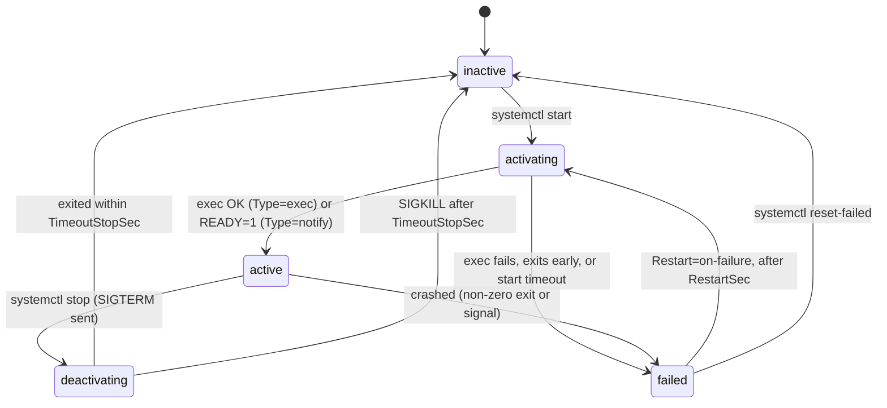
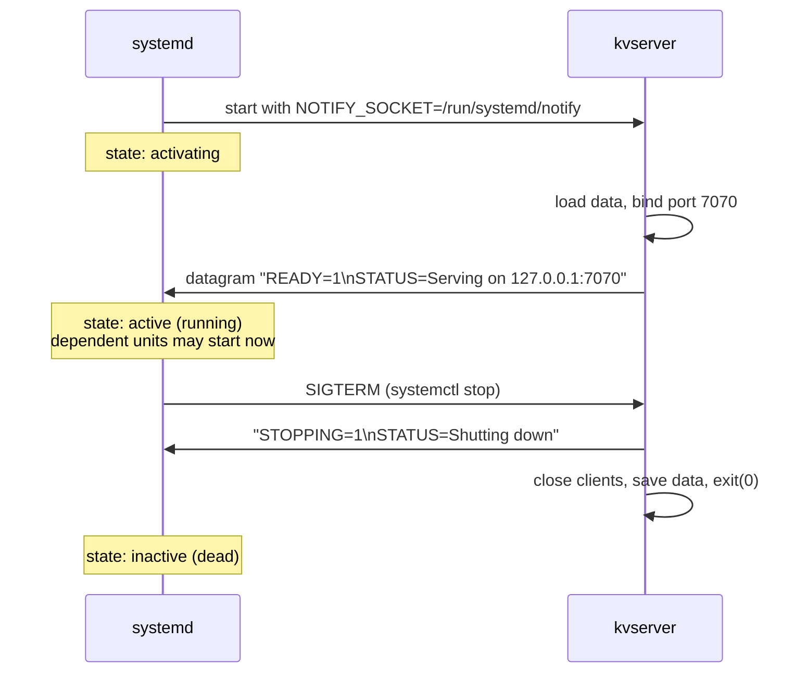
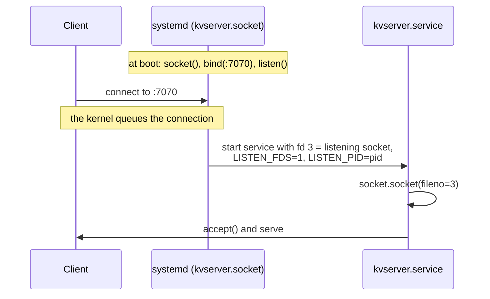

# Your program as a service

> **Level 5 · Chapter 5** · ⏱️ ~55 min read · Prerequisites: [systemd and journalctl](../04-sysadmin/01-systemd-and-journalctl.md), [Processes and signals in code](03-processes-signals-in-code.md), [Pipes and sockets](04-pipes-and-sockets.md)

In Level 4 you managed other people's services. This chapter turns *your own* Python program into a proper systemd service: its own directory and user, a unit file, logs in the journal, clean stops, readiness notification, sandboxing, and a repeatable way to deploy updates. You'll practice safely as a **user service** on your own machine, then see the full system-level setup for your VM.

## Why it matters

A small internal API had been running for months on a shared server, started by hand inside `tmux` with `nohup python3 app.py &`. Then three things happened in one week.

The server rebooted for a kernel update, and the API didn't come back, because nothing started it at boot. Nobody noticed for six hours. Then it crashed on a malformed request at 2 a.m. and stayed down, because nothing restarted it. And when someone went to read the logs, `nohup.out` had grown to 31 GB and filled `/home`, which also broke everyone's shell logins.

The fix was a 15-line unit file. systemd starts the program at boot, restarts it within two seconds of a crash, sends its output to the journal (which rotates itself), runs it as an unprivileged user, and stops it cleanly with `SIGTERM` during deploys. The program itself got *simpler*: it lost its homemade log rotation and PID file code. This chapter walks through exactly that change, using the key-value server you'll build in the capstone.

## Concepts

### The contract between systemd and your program

systemd can run almost anything, but a program that follows a few rules gets the most out of it. Think of it as a contract:

| Your program should... | Because systemd... |
|------------------------|--------------------|
| Run in the **foreground** and never daemonize | Starts it already detached, and tracks the process it started as the **main PID** |
| Write logs to **stdout/stderr**, one line per event | Connects both to the **journal**, which adds timestamps, metadata, and rotation |
| Exit cleanly and quickly on **`SIGTERM`** | Sends `SIGTERM` to stop it, then `SIGKILL` after `TimeoutStopSec=` (90 s by default) |
| Exit with **non-zero** on failure | Uses the exit status to decide whether it failed and whether to restart it |
| Take configuration from **arguments, environment variables, or a config file** | Provides `ExecStart=`, `Environment=`, and `EnvironmentFile=` |
| Optionally say **"I'm ready"** | Can delay "started" until the program reports readiness (`Type=notify`) |
| Not need root | Can create a user, directories, and a sandbox for it |

Everything in [Processes and signals in code](03-processes-signals-in-code.md) was preparation for this table. The double-fork daemon code, PID files, log file handling, and `nohup` all disappear.

### Project layout

A tidy, conventional layout for a self-contained Python service:

```text
/opt/kvserver/                  application code (read-only to the service)
├── kvserver.py
├── requirements.txt            (if it has dependencies)
└── venv/                       virtual environment with its own python + packages
/etc/kvserver/kvserver.env      configuration (environment variables), owned by root
/var/lib/kvserver/              state the service writes (its data file)
/etc/systemd/system/kvserver.service   the unit file
```

Why these places? They follow the [filesystem layout](../00-first-steps/05-filesystem-layout.md) conventions: `/opt` for self-contained add-on software, `/etc` for configuration, `/var/lib` for persistent state. Keeping code, config, and data separate means you can replace the code on update without touching data, back up `/var/lib/kvserver` alone, and make the code directory read-only to the service.

A **virtual environment** (venv) is a directory with its own `python` and its own `site-packages`, created with `python3 -m venv`. It keeps the service's packages separate from the system's (which `apt` manages) and from other services. The kvserver uses only the standard library, so it doesn't strictly need one. But you'll almost always add a dependency eventually, and the habit costs nothing. On Mint the `python3-venv` package provides it.

In the unit file you point `ExecStart=` at the venv's interpreter, `/opt/kvserver/venv/bin/python`. There's no need to "activate" the venv: running its `python` directly is what activation effectively does.

### A dedicated system user

A service should run as its **own unprivileged user**, not as root and not as you. If the service has a bug that lets an attacker run code, the attacker gets only that user's permissions: no access to your home directory, no ability to change system files, nothing beyond what the service itself needs. This is the **principle of least privilege**.

```bash
sudo useradd --system --user-group --no-create-home \
    --home-dir /nonexistent --shell /usr/sbin/nologin kvserver
```

Each option has a reason:

- `--system` picks a UID below 1000. System users don't appear on the login screen and don't get mail spools or aging rules.
- `--user-group` creates a matching `kvserver` group.
- `--no-create-home --home-dir /nonexistent` means there's no home directory to write to.
- `--shell /usr/sbin/nologin` means no one can log in as this user interactively.

systemd also offers **`DynamicUser=yes`**, which allocates a temporary user every time the service starts and removes it afterwards. You don't run `useradd` at all. It pairs with `StateDirectory=`, which creates `/var/lib/<name>` owned by that dynamic user. It's the most locked-down option, shown in the hardening section.

### Anatomy of the unit file

```ini title="/etc/systemd/system/kvserver.service"
[Unit]
Description=Line-based key-value server
Documentation=https://example.internal/kvserver
After=network.target

[Service]
Type=notify
User=kvserver
Group=kvserver
WorkingDirectory=/opt/kvserver
EnvironmentFile=-/etc/kvserver/kvserver.env
Environment=PYTHONUNBUFFERED=1
ExecStart=/opt/kvserver/venv/bin/python /opt/kvserver/kvserver.py --data /var/lib/kvserver/data.json
StateDirectory=kvserver
SyslogIdentifier=kvserver
Restart=on-failure
RestartSec=2
TimeoutStopSec=15

[Install]
WantedBy=multi-user.target
```

**[Unit]** describes the unit and its relationships:

- `Description=` is the human-readable name shown in `systemctl status` and logs.
- `After=network.target` orders startup after basic networking is set up. It's an *ordering* only, not a dependency. For a server binding to `127.0.0.1` it barely matters, but it's conventional.

**[Service]** says how to run it:

- `Type=` tells systemd when the service counts as "started" (next section).
- `User=` / `Group=` run the process as that user, so systemd drops root before your code starts.
- `WorkingDirectory=` is the current directory for the process. Relative paths in your program resolve from here.
- `EnvironmentFile=-/etc/kvserver/kvserver.env` loads `NAME=value` lines from a file. The leading `-` means "fine if it doesn't exist". Keep secrets here, with mode `0600`, rather than in the unit file, which any user can read with `systemctl cat`.
- `Environment=PYTHONUNBUFFERED=1` sets one variable directly. This one makes `print()` output reach the journal immediately (see below).
- `ExecStart=` is the command. It must start with an **absolute path**. It is *not* run by a shell: no `|`, `>`, `&&`, globbing, or `~`. (systemd does its own simple `$VAR` substitution.) If you need shell features, run `/bin/sh -c '...'` explicitly, but usually you don't.
- `StateDirectory=kvserver` makes systemd create `/var/lib/kvserver`, owned by the service user, before starting.
- `SyslogIdentifier=kvserver` labels journal lines `kvserver[PID]` instead of `python[PID]`.
- `Restart=on-failure` restarts the service if it exits with a non-zero status, is killed by an unexpected signal, or times out. A clean exit (status 0, or death by `SIGTERM`/`SIGINT`/`SIGHUP`/`SIGPIPE`) isn't restarted, so `systemctl stop` works as expected. `Restart=always` restarts even after clean exits.
- `RestartSec=2` waits two seconds before restarting, so a crash loop doesn't spin the CPU. By default, systemd gives up if a service restarts more than 5 times in 10 seconds (`StartLimitBurst=`, `StartLimitIntervalSec=` in `[Unit]`) and marks it failed.
- `TimeoutStopSec=15` is how long to wait after `SIGTERM` before sending `SIGKILL`.

**[Install]** is only used by `systemctl enable`: `WantedBy=multi-user.target` means "start this at boot when the system reaches normal multi-user mode". For user services, the equivalent is `default.target`.

### Type=: when is a service "started"?

The `Type=` setting answers one question: at what moment should systemd consider the service up, and start the units that depend on it?

| Type | "Started" when... | Use it for |
|------|--------------------|-----------|
| `simple` (the default) | Immediately after `fork()`, before `exec` even happens | Legacy default. A typo in `ExecStart=` still reports "started" |
| `exec` | After the `execve()` of your program succeeds | **Most programs.** A missing binary or bad user is reported as a start failure |
| `notify` | When the program sends `READY=1` over the notify socket | Programs that need setup time (binding sockets, loading data) and can report readiness |
| `forking` | When the started process exits, leaving a daemonized child | Old-style double-fork daemons only. Avoid for new code |
| `oneshot` | When the process **exits** | Scripts that run and finish, like a backup run from a timer |

For a server, `notify` is the most accurate: anything ordered `After=kvserver.service` will only start once the port is really accepting connections. `exec` is the right choice for programs that don't implement notification.

### The service lifecycle



Two details matter for your code:

- **Stopping sends `SIGTERM` to the main process** (and by default to every other process in the service's **cgroup**, its own control group, so no child is left behind). If anything is still alive after `TimeoutStopSec=`, everything in the cgroup gets `SIGKILL`. Your shutdown should take well under the timeout.
- **A clean stop is an exit with 0.** systemd also treats dying from `SIGTERM` as clean, so an unhandled `SIGTERM` doesn't mark the service failed. But as chapter 3 showed, an unhandled `SIGTERM` skips all your cleanup. Handle it.

### Logging to journald

When systemd starts a service, it connects the process's stdout and stderr to the **journal** through a socket. Every line your program writes becomes a journal entry, tagged with the unit name, PID, user, boot ID, and a precise timestamp. That means:

- **No log files to manage.** No rotation, no `nohup.out`, no disk-full surprises. journald enforces size limits on its own storage.
- **Don't add timestamps yourself.** The journal records one for every line. Your own would just be duplicates.
- **Query instead of grep.** `journalctl -u kvserver --since "10 min ago"`, `-f` to follow, `-p warning` for priority filtering, `-o json` for machine-readable output. (Covered in [systemd and journalctl](../04-sysadmin/01-systemd-and-journalctl.md).)

The one trap is **buffering**. To your program, stdout is now a socket, not a terminal, so Python **block-buffers** `print()` output in 8 KiB chunks, exactly as in [File descriptors in code](02-file-descriptors.md). A service that prints a line every few seconds would show nothing in the journal for many minutes, and then a burst with all the same timestamp. Fixes:

- `Environment=PYTHONUNBUFFERED=1` in the unit (the simplest), or `python -u` in `ExecStart=`.
- Use the `logging` module with a handler on stderr. `StreamHandler` flushes after every record. stderr is line-buffered anyway.
- `print(..., flush=True)`.

**Priorities.** By default, every line from stdout and stderr gets priority `info` (6). If a line starts with `<N>`, where N is a syslog priority, journald strips the prefix and uses that priority instead (this is the `SyslogLevelPrefix=` setting, on by default). So `<3>database unreachable` is recorded as an error, and `journalctl -p err` will find it. The kvserver capstone does this for its `logging` levels, but only when the environment variable `JOURNAL_STREAM` is set, which systemd does when stderr is connected to the journal. In a terminal, the same program prints normal timestamped lines.

| `<N>` | Name | Python `logging` level |
|-------|------|------------------------|
| `<2>` | crit | `CRITICAL` |
| `<3>` | err | `ERROR` |
| `<4>` | warning | `WARNING` |
| `<6>` | info | `INFO` |
| `<7>` | debug | `DEBUG` |

### Readiness with sd_notify

With `Type=notify`, systemd passes the service an environment variable, **`NOTIFY_SOCKET`**, holding the path of a Unix datagram socket. The service sends short text messages to it. The protocol is so simple that you don't need any library:



The messages are `KEY=value` lines:

| Message | Meaning |
|---------|---------|
| `READY=1` | Startup finished; the service is up |
| `STATUS=...` | Free text shown on the `Status:` line of `systemctl status` |
| `STOPPING=1` | Shutting down now |
| `RELOADING=1` | Reloading configuration (used with `Type=notify-reload`) |
| `WATCHDOG=1` | "I'm still alive", for `WatchdogSec=` (systemd restarts the service if these stop) |

Sending one is five lines of Python: create an `AF_UNIX`/`SOCK_DGRAM` socket, connect to the path in `NOTIFY_SOCKET`, send. If the path starts with `@`, it's in the Linux **abstract socket namespace** (a socket name with no file on disk), which you address by replacing `@` with a NUL byte. If `NOTIFY_SOCKET` isn't set, you're not running under systemd, so skip it. The `sd_notify()` function in the capstone solution does exactly this.

### Socket activation

**Socket activation** flips the usual order: systemd creates and binds the listening socket itself, defined in a separate `.socket` unit, and starts your service only when the first connection arrives. It then hands the already-open socket to your process as **fd 3**, using fd inheritance from [File descriptors in code](02-file-descriptors.md).



The service learns about the inherited sockets from two environment variables: `LISTEN_FDS` (how many fds, starting at 3) and `LISTEN_PID` (which must equal its own PID, so a child doesn't mistake its parent's variables for its own). Benefits:

- **Start on demand.** Rarely used services cost nothing until someone connects.
- **Restart without refusing connections.** The listening socket belongs to systemd and stays open while the service restarts. New connections queue in the kernel instead of being refused.
- **Privileged ports without root.** systemd (running as root) binds port 80, and the unprivileged service just uses the fd.
- **Parallel boot.** Clients can connect before the service has finished starting. The kernel buffers them.

You'll see a working example below with `systemd-socket-activate`, a tool that does the same fd handoff without installing anything.

### Hardening with sandboxing directives

systemd can wrap your service in a **sandbox**: a restricted view of the system, built from kernel features (namespaces, read-only bind mounts, seccomp syscall filters, capability bounding) that you'll study in [Containers from scratch](../06-expert/01-containers-from-scratch.md) and [Security](../06-expert/03-security.md). You get them by adding lines to the unit file. No code changes needed.

| Directive | Effect |
|-----------|--------|
| `NoNewPrivileges=yes` | The process and its children can never gain privileges, even by running a setuid program like `sudo` |
| `ProtectSystem=strict` | The entire filesystem is **read-only** to the service, except paths you allow (`StateDirectory=`, `ReadWritePaths=`, ...) |
| `ProtectHome=yes` | `/home`, `/root`, and `/run/user` appear empty and inaccessible |
| `PrivateTmp=yes` | The service gets its own private `/tmp` and `/var/tmp`, invisible to other processes |
| `PrivateDevices=yes` | Only harmless pseudo-devices (`/dev/null`, `/dev/urandom`, ...) are visible |
| `DynamicUser=yes` | A throwaway UID allocated at start. Implies several protections, including `ProtectSystem=strict` and `PrivateTmp=yes` |
| `RestrictAddressFamilies=AF_INET AF_INET6 AF_UNIX` | Only these socket types can be created (no raw packet sockets, for example) |
| `CapabilityBoundingSet=` (empty) | Drops all Linux capabilities, the pieces of root's power, permanently |
| `SystemCallFilter=@system-service` | Allows only the syscalls a typical service needs. Others fail or kill the process |
| `ProtectKernelTunables=yes`, `ProtectKernelModules=yes`, `ProtectControlGroups=yes` | No writing `/proc/sys`, loading modules, or changing cgroups |
| `UMask=0077` | Files the service creates are private to it |

**`systemd-analyze security`** scores how exposed a service is, from 0 (locked down) to 10 (completely exposed), and lists each directive you could add. It can also analyze a unit *file* that isn't installed, with `--offline=yes`, which makes it safe to experiment with on your main machine.

Add hardening one step at a time, and test after each step. The typical failure is the service trying to write somewhere `ProtectSystem=strict` made read-only. The journal shows the `EROFS` ("Read-only file system") or `EACCES` error, and you add the path to `ReadWritePaths=` or switch to `StateDirectory=`.

### User services: systemd without sudo

You also have a personal systemd instance, the **user manager** (`systemd --user`), which runs while you're logged in. It manages **user services**: units in `~/.config/systemd/user/`, controlled with `systemctl --user`, logged to your user journal (`journalctl --user`). They run as you, need no root, and can't affect the rest of the system.

That makes them the safe practice ground for this chapter: everything about `Type=notify`, restarts, journald logging, and clean stops works the same. The differences:

- `User=`, `Group=`, and most of the hardening directives aren't available. They need privileges a user manager doesn't have.
- `WantedBy=default.target` instead of `multi-user.target`.
- User services stop when you log out, unless **lingering** is enabled for your user (`loginctl enable-linger`), which keeps your user manager running from boot.

### Deploying and updating

A repeatable deploy beats a clever one. For a single-machine service, a solid workflow is:

1. **Test** the new version where you build it (run the test script).
2. **Copy** it into a new **release directory**, such as `/opt/kvserver/releases/2026-10-02-1`, never over the running code.
3. **Switch** a symlink, `/opt/kvserver/current`, to the new release, **atomically** (the rename trick from chapter 2, applied to a symlink).
4. **Restart** with `systemctl restart kvserver`. The unit's `ExecStart=` points at `/opt/kvserver/current/...`.
5. **Verify**: `systemctl is-active`, a smoke test against the port, and a look at the journal.
6. **Roll back** if verification fails: point the symlink back at the previous release and restart.

Old releases stay on disk, so a rollback takes seconds and needs no rebuild. Data in `/var/lib/kvserver` is untouched by all of this. If you change the **unit file** itself, run `systemctl daemon-reload` before restarting, or systemd keeps using the old version and warns you that the file changed on disk.

## Commands and examples

The examples use the capstone server, `kvserver.py`. If you haven't written your own yet, the reference implementation is in `scripts/kvserver.py` in this handbook's repository, and listed in the [capstone solution](../../exercises/solutions/level-5-capstone.md). Copy it to `~/kvserver/kvserver.py`.

### Step 1: Run it in the foreground first

Before involving systemd, make sure the program works on its own:

```bash
cd ~/kvserver
python3 kvserver.py --port 7070
```

```text
11:38:02 INFO    listening on 127.0.0.1:7070 (pid 241203, 0 keys loaded)
```

From a second terminal:

```bash
printf 'SET user alex\nGET user\nSTATS\nQUIT\n' | nc -q1 127.0.0.1 7070
```

```text
OK
VALUE alex
STATS keys=1 clients=1 connections=1 commands=3 uptime=9
BYE
```

Then ++ctrl+c++ in the first terminal:

```text
11:38:11 INFO    client connected: 127.0.0.1:52210 (1 online)
11:38:11 INFO    client disconnected: 127.0.0.1:52210 (0 online)
^C11:38:15 INFO    got SIGINT, shutting down
11:38:15 INFO    stopped cleanly after 1 connections, 4 commands
```

It runs in the foreground, logs to stderr, and exits cleanly on a signal. That's the whole contract. (`STATS` reported 3 commands because it counts itself but not the `QUIT` that came after it.)

### Step 2: A user service for safe practice

Create the unit in your user unit directory:

```bash
mkdir -p ~/.config/systemd/user
nano ~/.config/systemd/user/kvserver.service
```

```ini title="~/.config/systemd/user/kvserver.service"
[Unit]
Description=Key-value server (practice copy)

[Service]
Type=notify
ExecStart=/usr/bin/python3 %h/kvserver/kvserver.py --port 7070 --data %S/kvserver/data.json
StateDirectory=kvserver
SyslogIdentifier=kvserver
Environment=PYTHONUNBUFFERED=1
Restart=on-failure
RestartSec=2
TimeoutStopSec=10

[Install]
WantedBy=default.target
```

`%h` and `%S` are **specifiers** that systemd expands: `%h` is your home directory, and `%S` is the state directory root, which for a user service is `~/.local/state`. So `StateDirectory=kvserver` creates `~/.local/state/kvserver`, and the data file goes there. Check the file for mistakes before loading it:

```bash
systemd-analyze --user verify ~/.config/systemd/user/kvserver.service
```

No output means no problems found. Now load and start it:

```bash
systemctl --user daemon-reload
systemctl --user start kvserver
systemctl --user status kvserver
```

```text
● kvserver.service - Key-value server (practice copy)
     Loaded: loaded (/home/alex/.config/systemd/user/kvserver.service; disabled; preset: enabled)
     Active: active (running) since Fri 2026-10-02 11:40:12 UTC; 5s ago
   Main PID: 241877 (python3)
     Status: "Serving on 127.0.0.1:7070"
      Tasks: 1 (limit: 18382)
     Memory: 9.6M (peak: 9.9M)
        CPU: 61ms
     CGroup: /user.slice/user-1000.slice/user@1000.service/app.slice/kvserver.service
             └─241877 /usr/bin/python3 /home/alex/kvserver/kvserver.py --port 7070 --data /home/alex/.local/state/kvserver/data.json

Oct 02 11:40:12 mint systemd[1834]: Starting kvserver.service - Key-value server (practice copy)...
Oct 02 11:40:12 mint kvserver[241877]: listening on 127.0.0.1:7070 (pid 241877, 0 keys loaded)
Oct 02 11:40:12 mint systemd[1834]: Started kvserver.service - Key-value server (practice copy).
```

Reading it:

- `Loaded:` shows the unit file path, `disabled` (it won't start at login yet), and the vendor preset.
- `Active: active (running)`: it's up. With `Type=notify`, systemd waited for `READY=1` before printing "Started".
- `Status:` is the `STATUS=` text the server sent over `NOTIFY_SOCKET`.
- `CGroup:` is the control group systemd created. Every process the service starts lands here, which is how systemd can stop all of them.
- The log lines are tagged `kvserver[241877]` thanks to `SyslogIdentifier=`. Note there's no timestamp from the program itself, because it saw `JOURNAL_STREAM` and left timestamps to journald.

To start it automatically whenever your user manager starts:

```bash
systemctl --user enable kvserver
```

```text
Created symlink /home/alex/.config/systemd/user/default.target.wants/kvserver.service → /home/alex/.config/systemd/user/kvserver.service.
```

### Reading the logs

```bash
journalctl --user -u kvserver -f
```

Leave that running, and in another terminal generate some traffic:

```bash
printf 'SET colour teal\nGET colour\nQUIT\n' | nc -q1 127.0.0.1 7070
```

```text
Oct 02 11:41:03 mint kvserver[241877]: client connected: 127.0.0.1:52210 (1 online)
Oct 02 11:41:03 mint kvserver[241877]: client disconnected: 127.0.0.1:52210 (0 online)
```

Useful variations:

```bash
journalctl --user -u kvserver --since "10 min ago"     # a time window
journalctl --user -u kvserver -p warning               # warnings and worse only
journalctl --user -u kvserver -o cat                   # just the messages
journalctl --user -u kvserver -o json-pretty -n 1      # every field of the last entry
```

The `-p warning` filter works because the server sent `<4>` prefixes for warnings, so journald stored the right priority.

!!! warning "Common mistake"
    A service that uses plain `print()` without `PYTHONUNBUFFERED=1` (or `flush=True`) seems to log nothing at all. The output is sitting in Python's 8 KiB buffer, and it may only appear when the service stops. If `journalctl -u` is mysteriously empty for a running Python service, check this first.

### Stopping cleanly, and how fast

```bash
time systemctl --user stop kvserver
```

```text
real	0m0.112s
user	0m0.002s
sys	0m0.003s
```

```bash
journalctl --user -u kvserver -n 7 --no-pager
```

```text
Oct 02 11:42:30 mint systemd[1834]: Stopping kvserver.service - Key-value server (practice copy)...
Oct 02 11:42:30 mint kvserver[241877]: got SIGTERM, shutting down
Oct 02 11:42:30 mint kvserver[241877]: saved 2 keys to /home/alex/.local/state/kvserver/data.json
Oct 02 11:42:30 mint kvserver[241877]: stopped cleanly after 3 connections, 6 commands
Oct 02 11:42:30 mint systemd[1834]: kvserver.service: Deactivated successfully.
Oct 02 11:42:30 mint systemd[1834]: Stopped kvserver.service - Key-value server (practice copy).
Oct 02 11:42:30 mint systemd[1834]: kvserver.service: Consumed 98ms CPU time.
```

About a tenth of a second, and the log shows the whole graceful sequence. Compare with a program that ignores `SIGTERM` (for example, one whose handler only sets a flag that a `time.sleep(60)` loop checks once a minute): `systemctl stop` would hang for the full `TimeoutStopSec=` (10 seconds here, 90 by default), then the journal would show:

```text
Oct 02 11:45:10 mint systemd[1834]: kvserver.service: State 'stop-sigterm' timed out. Killing.
Oct 02 11:45:10 mint systemd[1834]: kvserver.service: Killing process 242311 (python3) with signal SIGKILL.
Oct 02 11:45:10 mint systemd[1834]: kvserver.service: Main process exited, code=killed, status=9/KILL
Oct 02 11:45:10 mint systemd[1834]: kvserver.service: Failed with result 'timeout'.
```

Slow deploys, no cleanup, and a "failed" unit. That's why the handler matters.

### Watching Restart=on-failure work

Start it again, then simulate a crash by killing it with `SIGKILL`, which no program can catch:

```bash
systemctl --user start kvserver
systemctl --user kill --signal=SIGKILL kvserver
sleep 3
journalctl --user -u kvserver -n 6 --no-pager
```

```text
Oct 02 11:47:01 mint systemd[1834]: kvserver.service: Main process exited, code=killed, status=9/KILL
Oct 02 11:47:01 mint systemd[1834]: kvserver.service: Failed with result 'signal'.
Oct 02 11:47:03 mint systemd[1834]: kvserver.service: Scheduled restart job, restart counter is at 1.
Oct 02 11:47:03 mint systemd[1834]: Starting kvserver.service - Key-value server (practice copy)...
Oct 02 11:47:03 mint kvserver[242540]: listening on 127.0.0.1:7070 (pid 242540, 2 keys loaded)
Oct 02 11:47:03 mint systemd[1834]: Started kvserver.service - Key-value server (practice copy).
```

Exactly 2 seconds later (`RestartSec=2`) it's back, with a new PID. "2 keys loaded" means the data saved during the previous *clean* stop survived. Anything set after that, since the last save, was lost in the crash. Making a server durable against crashes means saving more often (for example, after every write, using the atomic write pattern). The counter is visible with:

```bash
systemctl --user show kvserver -p NRestarts -p MainPID -p ActiveState
```

```text
NRestarts=1
MainPID=242540
ActiveState=active
```

`systemctl --user kill` sends a signal to the service's processes without going through the normal stop logic. It's the clean way to send signals to a service, rather than looking up its PID.

### Seeing sd_notify without systemd

You can watch the notification protocol with nothing more than a datagram socket. This script plays the part of systemd: it creates a notify socket, starts the server with `NOTIFY_SOCKET` pointing to it, prints whatever arrives, and then stops the server with `SIGTERM`:

```python title="fake_systemd.py"
import os, signal, socket, subprocess, sys, tempfile

path = os.path.join(tempfile.mkdtemp(), "notify.sock")
notify = socket.socket(socket.AF_UNIX, socket.SOCK_DGRAM)
notify.bind(path)

server = subprocess.Popen(
    [sys.executable, "kvserver.py", "--port", "7071"],
    env={**os.environ, "NOTIFY_SOCKET": path})

print("got:", notify.recv(4096).decode().replace("\n", " | "))
server.send_signal(signal.SIGTERM)
print("got:", notify.recv(4096).decode().replace("\n", " | "))
print("server exit code:", server.wait())
```

```bash
cd ~/kvserver && python3 fake_systemd.py
```

```text
11:52:40 INFO    listening on 127.0.0.1:7071 (pid 243118, 0 keys loaded)
got: READY=1 | STATUS=Serving on 127.0.0.1:7071
11:52:40 INFO    got SIGTERM, shutting down
got: STOPPING=1 | STATUS=Shutting down
11:52:40 INFO    stopped cleanly after 0 connections, 0 commands
server exit code: 0
```

The two datagrams are exactly what systemd receives. The server's own log lines (on stderr) are interleaved, with timestamps, because here stderr is your terminal and `JOURNAL_STREAM` isn't set.

### Socket activation, hands-on

`systemd-socket-activate` (installed with systemd) does what a `.socket` unit does: it binds a port, waits for a connection, then starts a program with the listening socket as fd 3 and `LISTEN_FDS`/`LISTEN_PID` set. It installs nothing, so it's safe to try. Here's a server that uses an inherited socket if it gets one:

```python title="activated_echo.py"
#!/usr/bin/env python3
"""An echo server that accepts a listening socket from systemd (socket activation)."""
import os
import socket
import sys

SD_LISTEN_FDS_START = 3                         # first passed fd is always 3

def inherited_sockets() -> list[socket.socket]:
    if os.environ.get("LISTEN_PID") != str(os.getpid()):
        return []                               # the fds weren't meant for us
    count = int(os.environ.get("LISTEN_FDS", "0"))
    return [socket.socket(fileno=SD_LISTEN_FDS_START + i) for i in range(count)]

socks = inherited_sockets()
if socks:
    srv = socks[0]
    print(f"got listening socket from systemd: {srv.getsockname()}", file=sys.stderr, flush=True)
else:
    srv = socket.create_server(("127.0.0.1", 9000))    # fallback: bind it ourselves
    print("no socket passed; bound 127.0.0.1:9000 myself", file=sys.stderr, flush=True)

while True:
    conn, _ = srv.accept()
    with conn:
        while data := conn.recv(4096):
            conn.sendall(data)
```

```bash
systemd-socket-activate -l 127.0.0.1:9005 python3 activated_echo.py
```

```text
Listening on 127.0.0.1:9005 as 3.
```

Nothing else happens: no Python process exists yet (check with `pgrep -af activated_echo`, which shows only `systemd-socket-activate`). Now connect from another terminal:

```bash
echo "hello activation" | nc -q1 127.0.0.1 9005
```

```text
hello activation
```

And the first terminal shows:

```text
Communication attempt on fd 3.
Execing python3 (python3 activated_echo.py)
got listening socket from systemd: ('127.0.0.1', 9005)
```

The tool `exec`ed Python in its own process, so the inherited fd 3 was already listening and the waiting connection was in its queue. Stop it with ++ctrl+c++. With real systemd, you'd write a `kvserver.socket` unit containing `ListenStream=127.0.0.1:7070`, and systemd would start `kvserver.service` on the first connection.

### Scoring and hardening a unit file

`systemd-analyze security --offline=yes` analyzes a unit file without installing it. Write a basic version of the system unit (no hardening) to a scratch file:

```ini title="~/kvserver/units/kvserver.service"
[Unit]
Description=Line-based key-value server (handbook capstone)
After=network.target

[Service]
Type=notify
ExecStart=/opt/kvserver/venv/bin/python /opt/kvserver/kvserver.py --host 127.0.0.1 --port 7070
User=kvserver
Group=kvserver
WorkingDirectory=/opt/kvserver
Environment=PYTHONUNBUFFERED=1
Restart=on-failure
RestartSec=2
TimeoutStopSec=10

[Install]
WantedBy=multi-user.target
```

```bash
cd ~/kvserver/units
systemd-analyze security --offline=yes kvserver.service | head -12
systemd-analyze security --offline=yes kvserver.service | tail -1
```

```text
  NAME                                                        DESCRIPTION                                                             EXPOSURE
✗ RemoveIPC=                                                  Service user may leave SysV IPC objects around                               0.1
✗ RootDirectory=/RootImage=                                   Service runs within the host's root directory                                0.1
✓ User=/DynamicUser=                                          Service runs under a static non-root user identity
✗ CapabilityBoundingSet=~CAP_SYS_TIME                         Service processes may change the system clock                                0.2
✗ NoNewPrivileges=                                            Service processes may acquire new privileges                                 0.2
✓ AmbientCapabilities=                                        Service process does not receive ambient capabilities
✗ PrivateDevices=                                             Service potentially has access to hardware devices                           0.2
✗ ProtectClock=                                               Service may write to the hardware clock or system clock                      0.2
✗ CapabilityBoundingSet=~CAP_SYS_PACCT                        Service may use acct()                                                       0.1
✗ CapabilityBoundingSet=~CAP_KILL                             Service may send UNIX signals to arbitrary processes                         0.1
✗ ProtectKernelLogs=                                          Service may read from or write to the kernel log ring buffer                 0.2
→ Overall exposure level for kvserver.service: 9.0 UNSAFE 😨
```

Running as a non-root user already earns a ✓, but the sandbox is wide open. Add the four basic directives after `TimeoutStopSec=10`:

```ini
NoNewPrivileges=yes
ProtectSystem=strict
ProtectHome=yes
PrivateTmp=yes
```

```text
→ Overall exposure level for kvserver.service: 8.3 EXPOSED 🙁
```

Better, but most of the score comes from many smaller items. Here's the fully hardened version, with comments:

```ini title="~/kvserver/units/kvserver-hardened.service"
[Unit]
Description=Line-based key-value server (handbook capstone)
After=network.target

[Service]
Type=notify
ExecStart=/opt/kvserver/venv/bin/python /opt/kvserver/kvserver.py --host 127.0.0.1 --port 7070 --data /var/lib/kvserver/data.json
User=kvserver
Group=kvserver
WorkingDirectory=/opt/kvserver
StateDirectory=kvserver
SyslogIdentifier=kvserver
EnvironmentFile=-/etc/kvserver/kvserver.env
Environment=PYTHONUNBUFFERED=1
Restart=on-failure
RestartSec=2
TimeoutStopSec=10

# Filesystem: everything read-only except /var/lib/kvserver
NoNewPrivileges=yes
ProtectSystem=strict
ProtectHome=yes
PrivateTmp=yes
PrivateDevices=yes
UMask=0077

# Kernel and system settings: hands off
ProtectKernelTunables=yes
ProtectKernelModules=yes
ProtectKernelLogs=yes
ProtectControlGroups=yes
ProtectClock=yes
ProtectHostname=yes

# What the process may do
CapabilityBoundingSet=
RestrictAddressFamilies=AF_INET AF_INET6 AF_UNIX
RestrictNamespaces=yes
RestrictRealtime=yes
RestrictSUIDSGID=yes
LockPersonality=yes
MemoryDenyWriteExecute=yes
SystemCallArchitectures=native
SystemCallFilter=@system-service

[Install]
WantedBy=multi-user.target
```

```bash
systemd-analyze security --offline=yes kvserver-hardened.service | tail -1
```

```text
→ Overall exposure level for kvserver-hardened.service: 1.7 OK 🙂
```

From 9.0 to 1.7, with no code changes. `AF_UNIX` stays in `RestrictAddressFamilies=` because `sd_notify` needs it. `MemoryDenyWriteExecute=` is fine for the kvserver, but would break Python code that uses `ctypes` callbacks or a JIT. Replacing `User=`/`Group=` with `DynamicUser=yes` brings it to 1.6, and removes the need for `useradd` entirely.

On an installed service, drop `--offline=yes` and pass the unit name: `systemd-analyze security kvserver.service`. Run plain `systemd-analyze security` to see a table of every service on your machine. Don't be alarmed: many distribution services score "UNSAFE" because they need broad access.

### Installing the system service

!!! danger "⚠️ VM only"
    Run this section in your throwaway VM, never on your main machine. It creates a system user, writes to `/opt`, `/etc`, and `/etc/systemd/system`, and starts a service at boot as root's systemd. A mistake in a system unit can also affect boot. Use the user service above for practice on your main machine.

```bash
# 1. A dedicated user
sudo useradd --system --user-group --no-create-home \
    --home-dir /nonexistent --shell /usr/sbin/nologin kvserver

# 2. Code and a virtual environment, owned by root (the service only reads them)
sudo mkdir -p /opt/kvserver
sudo cp ~/kvserver/kvserver.py /opt/kvserver/
sudo python3 -m venv /opt/kvserver/venv
# sudo /opt/kvserver/venv/bin/pip install -r /opt/kvserver/requirements.txt  (if any)

# 3. Optional configuration file
sudo mkdir -p /etc/kvserver
echo 'KV_LOG_LEVEL=INFO' | sudo tee /etc/kvserver/kvserver.env
sudo chmod 600 /etc/kvserver/kvserver.env

# 4. The unit file
sudo cp ~/kvserver/units/kvserver-hardened.service /etc/systemd/system/kvserver.service
sudo systemd-analyze verify /etc/systemd/system/kvserver.service

# 5. Load, enable at boot, and start
sudo systemctl daemon-reload
sudo systemctl enable --now kvserver
systemctl status kvserver
```

```text
● kvserver.service - Line-based key-value server (handbook capstone)
     Loaded: loaded (/etc/systemd/system/kvserver.service; enabled; preset: enabled)
     Active: active (running) since Fri 2026-10-02 12:10:44 UTC; 3s ago
   Main PID: 2291 (python)
     Status: "Serving on 127.0.0.1:7070"
      Tasks: 1 (limit: 2262)
     Memory: 9.1M (peak: 9.4M)
        CPU: 58ms
     CGroup: /system.slice/kvserver.service
             └─2291 /opt/kvserver/venv/bin/python /opt/kvserver/kvserver.py --host 127.0.0.1 --port 7070 --data /var/lib/kvserver/data.json

Oct 02 12:10:44 mint systemd[1]: Starting kvserver.service - Line-based key-value server (handbook capstone)...
Oct 02 12:10:44 mint kvserver[2291]: listening on 127.0.0.1:7070 (pid 2291, 0 keys loaded)
Oct 02 12:10:44 mint systemd[1]: Started kvserver.service - Line-based key-value server (handbook capstone).
```

The server reads `KV_LOG_LEVEL` (and `KV_HOST`, `KV_PORT`, `KV_DATA`) from its environment, so the `EnvironmentFile=` line lets you change settings without editing the unit. Check that it really runs as the service user and is sandboxed:

```bash
ps -o user,pid,cmd -C python | grep kvserver
sudo ls -ld /var/lib/kvserver
sudo nsenter -t $(systemctl show -p MainPID --value kvserver) -m ls /home
```

```text
kvserver    2291 /opt/kvserver/venv/bin/python /opt/kvserver/kvserver.py --host 127.0.0.1 --port 7070 --data /var/lib/kvserver/data.json
drwx------ 2 kvserver kvserver 4096 Oct  2 12:10 /var/lib/kvserver
```

The last command enters the service's mount namespace and lists `/home` as the service sees it: empty, thanks to `ProtectHome=yes`.

### A deploy and update workflow

This script deploys a new version into a release directory, switches a `current` symlink atomically, restarts, smoke-tests, and rolls back automatically if the test fails. It assumes a unit whose `ExecStart=` and `WorkingDirectory=` point at `/opt/kvserver/current/` instead of `/opt/kvserver/`.

!!! danger "⚠️ VM only"
    This script modifies `/opt/kvserver` and restarts a system service with `sudo`. Run it in your VM.

```bash title="deploy.sh"
#!/usr/bin/env bash
set -euo pipefail

APP=/opt/kvserver
NEW_RELEASE="$APP/releases/$(date +%Y%m%d-%H%M%S)"
SOURCE=${1:?usage: deploy.sh path/to/kvserver.py}

smoke_test() {
    sleep 1
    systemctl is-active --quiet kvserver &&
        [[ "$(printf 'STATS\nQUIT\n' | nc -q1 127.0.0.1 7070 | head -1)" == STATS* ]]
}

previous=$(readlink -f "$APP/current" || true)

# 1. Test the new code before touching the server
python3 -m py_compile "$SOURCE"

# 2. Copy into a fresh release directory
sudo mkdir -p "$NEW_RELEASE"
sudo cp "$SOURCE" "$NEW_RELEASE/kvserver.py"

# 3. Switch the symlink atomically: make a temp link, then rename over the old one
sudo ln -sfn "$NEW_RELEASE" "$APP/current.tmp"
sudo mv -T "$APP/current.tmp" "$APP/current"

# 4. Restart and verify
sudo systemctl restart kvserver
if smoke_test; then
    echo "deployed $NEW_RELEASE"
else
    echo "smoke test FAILED, rolling back to $previous" >&2
    journalctl -u kvserver -n 20 --no-pager >&2
    sudo ln -sfn "$previous" "$APP/current.tmp"
    sudo mv -T "$APP/current.tmp" "$APP/current"
    sudo systemctl restart kvserver
    exit 1
fi
```

`mv -T` renames the temporary symlink over `current` in one `rename()` syscall, so there's never a moment with no `current` at all. `ln -sfn` alone would remove and recreate the link, leaving a brief gap. The venv lives outside the releases in this simple version. Give each release its own venv once you have dependencies that change between versions.

To change the unit file itself, prefer a **drop-in** over editing the original:

```bash
sudo systemctl edit kvserver
```

This opens an editor for `/etc/systemd/system/kvserver.service.d/override.conf`, where you add only the lines that change (for example, `[Service]` and `Environment=KV_LOG_LEVEL=DEBUG`). `systemctl edit` runs `daemon-reload` for you. `systemctl cat kvserver` shows the original and every drop-in together.

## Exercises

### Exercise 1: Your first user service (easy)

Create the practice user service from this chapter for your own copy of `kvserver.py`. Start it, store three keys with `nc`, stop it, and use `journalctl --user` to show the full start-to-stop log. Then find where the data file was saved and print it.

??? success "Solution"

    ```bash
    mkdir -p ~/.config/systemd/user ~/kvserver
    cp kvserver.py ~/kvserver/
    # create ~/.config/systemd/user/kvserver.service as shown in this chapter
    systemctl --user daemon-reload
    systemctl --user start kvserver
    printf 'SET a 1\nSET b 2\nSET c 3\nQUIT\n' | nc -q1 127.0.0.1 7070
    systemctl --user stop kvserver
    journalctl --user -u kvserver --since "5 min ago" --no-pager
    cat ~/.local/state/kvserver/data.json
    ```

    ```text
    {
     "a": "1",
     "b": "2",
     "c": "3"
    }
    ```

    `%S` in a user unit is `~/.local/state`, and `StateDirectory=kvserver` created the `kvserver` folder there. The journal shows "Starting", the server's "listening" line, "Started", the client lines, then the stop sequence ending in "Deactivated successfully".

### Exercise 2: Break it on purpose (easy)

Make three deliberate mistakes in the user unit, one at a time, and record how each one shows up in `systemctl --user status` and the journal: (a) a typo in the path to `kvserver.py`, (b) shell-style output redirection at the end of `ExecStart=` (`... --port 7070 > %h/kv.log`), (c) `Type=notify` kept, but `ExecStart=/usr/bin/sleep 600`, a program that never sends `READY=1`. Fix each before the next.

??? success "Solution"

    (a) The interpreter starts, but Python fails to open the script and exits with status 2:

    ```text
    kvserver[244010]: /usr/bin/python3: can't open file '/home/alex/kvserver/kvserver.pyy': [Errno 2] No such file or directory
    systemd[1834]: kvserver.service: Main process exited, code=exited, status=2/INVALIDARGUMENT
    systemd[1834]: kvserver.service: Failed with result 'exit-code'.
    ```

    With `Restart=on-failure`, it retries every 2 seconds until the start limit (5 starts in 10 seconds) is hit, then gives up: `Start request repeated too quickly.`

    (b) `ExecStart=` isn't run by a shell, so `>` and the path are passed to `kvserver.py` as two more arguments, and `argparse` rejects them:

    ```text
    kvserver[244102]: usage: kvserver.py [-h] [--host HOST] [--port PORT] [--data DATA]
    kvserver[244102]:                    [--log-level LOG_LEVEL]
    kvserver[244102]: kvserver.py: error: unrecognized arguments: > /home/alex/kv.log
    systemd[1834]: kvserver.service: Main process exited, code=exited, status=2/INVALIDARGUMENT
    ```

    You don't need redirection anyway: the journal already has the output. (A related surprise: a bare command name such as `ExecStart=python3 ...` *does* work on systemd 255, which searches a fixed list of system directories. Absolute paths are still clearer.)

    (c) `systemctl --user start` hangs, because systemd waits for `READY=1`. After `TimeoutStartSec=` (90 s by default) the journal shows:

    ```text
    systemd[1834]: kvserver.service: start operation timed out. Terminating.
    systemd[1834]: kvserver.service: Failed with result 'timeout'.
    ```

    Only use `Type=notify` with programs that actually send `READY=1`.

### Exercise 3: Buffering in the journal (medium)

Write `ticker.py`, which prints `tick N` with plain `print()` every second, forever. Run it as a user service *without* `PYTHONUNBUFFERED`, follow its journal for 30 seconds, and note what you see. Then add `Environment=PYTHONUNBUFFERED=1`, restart, and compare. Finally, remove that line again and instead switch the program to the `logging` module. Explain all three results.

??? success "Solution"

    ```python title="ticker.py"
    import itertools, time
    for n in itertools.count(1):
        print(f"tick {n}")
        time.sleep(1)
    ```

    ```ini title="~/.config/systemd/user/ticker.service"
    [Service]
    ExecStart=/usr/bin/python3 %h/ticker.py
    ```

    ```bash
    systemctl --user daemon-reload
    systemctl --user start ticker
    journalctl --user -u ticker -f
    ```

    1. **Plain print, buffered:** nothing appears for minutes. Each `tick N\n` is about 8 bytes, so the 8 KiB buffer fills after roughly 1,000 seconds, and then about a thousand lines arrive at once, all with the same timestamp. Stopping the service flushes the buffer, so they show up then too.
    2. **`PYTHONUNBUFFERED=1`:** one line per second, each with its own correct timestamp.
    3. **`logging`:** also one line per second, without the variable, because `logging.StreamHandler` writes to stderr and flushes after every record.

    ```python
    import itertools, logging, time
    logging.basicConfig(level=logging.INFO, format="%(message)s")
    for n in itertools.count(1):
        logging.info("tick %d", n)
        time.sleep(1)
    ```

    Clean up with `systemctl --user stop ticker` and `rm ~/.config/systemd/user/ticker.service`.

### Exercise 4: Harden step by step (medium)

Copy `kvserver.service` (the unhardened system unit from this chapter) to a scratch directory. Add hardening directives in four batches, checking the score with `systemd-analyze security --offline=yes` after each: (1) the filesystem group, (2) the kernel group, (3) the "what the process may do" group, (4) replace `User=`/`Group=` with `DynamicUser=yes`. Record the score after each step. Which single directive changed the score the most?

??? success "Solution"

    ```bash
    for f in step1.service step2.service step3.service step4.service; do
        systemd-analyze security --offline=yes "$f" | tail -1
    done
    ```

    Results on systemd 255:

    | Step | Exposure |
    |------|----------|
    | Start (`User=` only) | 9.0 UNSAFE |
    | 1. + filesystem group (`NoNewPrivileges` through `UMask`) | 7.7 EXPOSED |
    | 2. + kernel group | 6.4 MEDIUM |
    | 3. + "what the process may do" group | 1.7 OK |
    | 4. `DynamicUser=yes` instead of `User=`/`Group=` | 1.6 OK |

    To find the biggest single directive, add the step 3 lines one at a time to the step 2 file. `CapabilityBoundingSet=` (empty) alone takes it from 6.4 to 4.7, more than `SystemCallFilter=` (5.1) or `RestrictAddressFamilies=` (6.0). The analysis counts each dangerous capability separately, and an empty bounding set removes them all at once. The exact numbers can differ between systemd versions. Treat the score as a list of what's still open, not a grade.

### Exercise 5: Socket-activate the kvserver (hard)

Modify your copy of `kvserver.py` so that, if `LISTEN_FDS` and `LISTEN_PID` say it has received a socket, it serves on that inherited socket instead of binding its own. With asyncio, `asyncio.start_server(handler, sock=existing_socket)` accepts an existing socket. Test it with `systemd-socket-activate -l 127.0.0.1:7072 python3 kvserver.py`. Then write (but don't install) the `.socket` and `.service` units you'd use on the VM.

??? success "Solution"

    In `KVServer.run()`, replace the `asyncio.start_server(...)` call with:

    ```python
    def inherited_socket() -> socket.socket | None:
        if os.environ.get("LISTEN_PID") != str(os.getpid()):
            return None
        if int(os.environ.get("LISTEN_FDS", "0")) < 1:
            return None
        return socket.socket(fileno=3)

    sock = inherited_socket()
    if sock is not None:
        server = await asyncio.start_server(self.handle_client, sock=sock, limit=MAX_LINE)
    else:
        server = await asyncio.start_server(
            self.handle_client, self.host, self.port, limit=MAX_LINE)
    ```

    ```bash
    systemd-socket-activate -l 127.0.0.1:7072 python3 kvserver.py
    # in another terminal:
    printf 'SET x 1\nGET x\nQUIT\n' | nc -q1 127.0.0.1 7072
    ```

    ```text
    OK
    VALUE 1
    BYE
    ```

    The units for the VM:

    ```ini title="/etc/systemd/system/kvserver.socket"
    [Unit]
    Description=Key-value server socket

    [Socket]
    ListenStream=127.0.0.1:7070

    [Install]
    WantedBy=sockets.target
    ```

    The service stays as before, plus `Requires=kvserver.socket` and `After=kvserver.socket` in `[Unit]`. You'd `systemctl enable --now kvserver.socket` (not the service), and the first connection starts `kvserver.service`. While the service restarts, connections queue in the kernel instead of being refused.

## Check yourself

1. List four things a program should do to be a good systemd citizen.

    ??? note "Answer"

        Run in the foreground (don't daemonize); log to stdout/stderr; exit cleanly and quickly on `SIGTERM`; exit non-zero on failure; take configuration from arguments, environment, or a config file; optionally notify readiness with `READY=1`.

2. What's the difference between `Type=simple`, `Type=exec`, and `Type=notify`?

    ??? note "Answer"

        `simple` considers the service started right after `fork()`, so even a bad `ExecStart=` path looks like a successful start. `exec` waits until `execve()` of the program succeeds, so missing binaries or users show up as start failures. `notify` waits until the program itself sends `READY=1` to `NOTIFY_SOCKET`, so "started" means "really ready to serve".

3. Why does a Python service sometimes show no logs in `journalctl` for a long time, and how do you fix it?

    ??? note "Answer"

        Its stdout is connected to the journal, not a terminal, so Python block-buffers `print()` output in 8 KiB chunks. Fix it with `Environment=PYTHONUNBUFFERED=1` (or `python -u`), `flush=True`, or by logging through the `logging` module to stderr, which flushes every record.

4. What exactly happens when you run `systemctl stop kvserver`?

    ??? note "Answer"

        systemd sends `SIGTERM` (the `KillSignal=`) to the main process, and by default to the other processes in the service's cgroup. It waits up to `TimeoutStopSec=` (90 s by default) for them to exit. Anything still running then gets `SIGKILL`, and the unit ends up "failed" with result `timeout`. A clean exit (0, or death by `SIGTERM`) leaves it `inactive`.

5. With `Restart=on-failure`, which of these cause a restart: exit code 0, exit code 1, killed by `SIGKILL`, killed by `SIGTERM`?

    ??? note "Answer"

        Exit code 1 and `SIGKILL` cause a restart. Exit code 0 and `SIGTERM` are clean exits (`SIGTERM`, `SIGINT`, `SIGHUP`, and `SIGPIPE` are considered clean by default), so they don't. That's what lets `systemctl stop` work without the service bouncing back.

6. How does a service send `READY=1` to systemd without any library?

    ??? note "Answer"

        Read the socket path from the `NOTIFY_SOCKET` environment variable (replacing a leading `@` with a NUL byte for abstract sockets), create an `AF_UNIX` `SOCK_DGRAM` socket, connect to that path, and send the bytes `READY=1` (optionally with more lines like `STATUS=...`). If `NOTIFY_SOCKET` isn't set, the program isn't running under `Type=notify` and should skip it.

7. Name three benefits of socket activation.

    ??? note "Answer"

        The service starts only when needed; connections queue in the kernel instead of being refused while the service restarts, because systemd keeps the listening socket open; an unprivileged service can use privileged ports, since systemd binds them; and boot can be more parallel because clients can connect before the service is up.

8. What do `ProtectSystem=strict` and `DynamicUser=yes` do, and where can a service with both write its data?

    ??? note "Answer"

        `ProtectSystem=strict` makes the whole filesystem read-only to the service. `DynamicUser=yes` runs it as a temporary UID allocated at start (and implies `ProtectSystem=strict`, `PrivateTmp=yes`, and other protections). It can write to its private `/tmp` and to directories systemd creates for it: `StateDirectory=` (`/var/lib/<name>`), `CacheDirectory=`, `LogsDirectory=`, `RuntimeDirectory=`, or paths listed in `ReadWritePaths=`.

## Key takeaways

- A good service runs in the foreground, logs to stdout/stderr, handles `SIGTERM` quickly, and exits non-zero on failure. systemd does the rest: starting, restarting, logging, and stopping.
- Use a layout with code in `/opt/<app>` (with a venv), config in `/etc/<app>`, state in `/var/lib/<app>`, and a dedicated system user (or `DynamicUser=yes`).
- Prefer `Type=notify` when your program can send `READY=1` (five lines of Python over `NOTIFY_SOCKET`), otherwise `Type=exec`. Use `Restart=on-failure` with a `RestartSec=`.
- Set `PYTHONUNBUFFERED=1` or log via `logging`, or the journal stays empty. Let journald add timestamps. Use `<N>` prefixes for priorities.
- Harden with `NoNewPrivileges`, `ProtectSystem=strict`, `ProtectHome`, `PrivateTmp`, and friends, and measure with `systemd-analyze security` (`--offline=yes` works on uninstalled files).
- Practice with `systemctl --user` services on your own machine. Install system units only in the VM.
- Deploy into release directories, switch a symlink atomically, restart, smoke-test, and roll back on failure.

## Next

You can now write programs that cooperate with the kernel and with systemd. Next, go one layer lower and see how source code becomes a program the kernel can run: [Building software](06-building-software.md).
