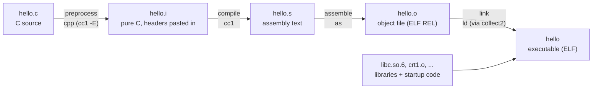
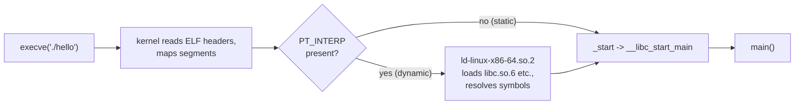
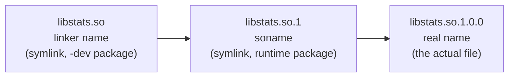
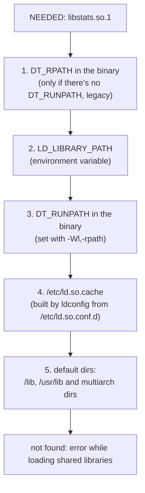
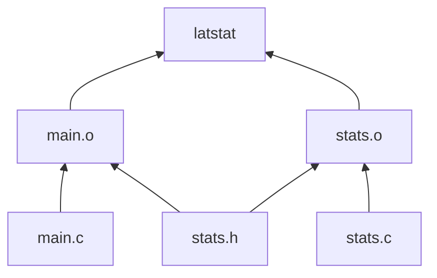

# Building software

> **Level 5 · Chapter 6** · ⏱️ ~40 min read · Prerequisites: [System calls and strace](01-system-calls-strace.md), [Installing software](../03-internals/06-installing-software.md)

This chapter follows a C program from source code to a running process. It covers the compiler stages, the ELF file format, static and shared libraries, the dynamic loader, `make`, the bigger build systems, `pkg-config`, and packaging your own `.deb`.

## Why it matters

Alex wrote a small C tool, `latstat`, that summarizes request latencies for a data pipeline. It worked perfectly on Alex's laptop. Alex copied the binary to a shared server, and the nightly job failed with:

```text
./latstat: error while loading shared libraries: libstats.so.1: cannot open shared object file: No such file or directory
```

A teammate's fix was `export LD_LIBRARY_PATH=/home/alex/lib` in the cron job. It worked, until another program on the box started loading Alex's library instead of its own. Meanwhile `pip install` of a Python package with a C extension failed on the same server with `fatal error: zlib.h: No such file or directory`, and someone suggested "just run the Makefile as root".

None of this is magic. Each error comes from a specific stage: the preprocessor couldn't find a header, the linker couldn't find a symbol, or the **dynamic loader** couldn't find a library at run time. Once you know which stage failed, the fix takes minutes and doesn't involve guesswork or root. And when you can package your tool as a `.deb`, installing it on the next server is one command, and removing it is one more.

## Concepts

### From source code to a running process

You type `gcc hello.c -o hello`, but `gcc` is a **driver** program. It runs four separate tools in sequence, passing temporary files between them:



1. **Preprocessing.** The **preprocessor** handles every line that starts with `#`. `#include <stdio.h>` pastes the whole header file in. `#define GREETING "Hello"` makes every `GREETING` a text substitution. `#ifdef` keeps or drops blocks. The output is still C, just much longer.
2. **Compiling.** The compiler proper (`cc1`) parses the C, type-checks it, optimizes it, and emits **assembly**: human-readable CPU instructions for x86-64.
3. **Assembling.** The **assembler** (`as`) turns assembly text into binary machine code in an **object file** (`.o`). An object file is incomplete. When `main` calls `printf`, the assembler doesn't know where `printf` will live, so it writes zeros and records a **relocation**: a note saying "patch this spot with the address of `printf` later".
4. **Linking.** The **linker** (`ld`) combines object files and libraries into one executable. It **resolves symbols**, matching each undefined name (like `printf`) to a definition, and applies the relocations. It also adds startup code (`crt1.o` and friends) that runs before `main`.

A **symbol** is a named thing in an object file: a function or a global variable. Each object file has a table of the symbols it *defines* and the symbols it *needs*. Linking is mostly bookkeeping: every need must meet exactly one definition. That's why the classic linker errors are `undefined reference to 'foo'` (no definition found) and `multiple definition of 'foo'` (two definitions).

Running the program continues the story:



The kernel only loads the program and, for a dynamically linked program, a small program called the **dynamic loader** (`ld.so`). The loader then finds and maps the shared libraries the program needs and connects calls like `printf` to their code in `libc.so.6`. Only after that does your `main` run. You saw `execve` and the loader's `openat` calls for libraries in [System calls and strace](01-system-calls-strace.md); this is what they were doing.

### ELF: the file format for programs

**ELF** (Executable and Linkable Format) is the file format Linux uses for object files, executables, shared libraries, and core dumps. One format, viewed two ways:

- **Sections** are the linker's view: named pieces like `.text` (machine code), `.rodata` (read-only data such as string literals), `.data` (initialized global variables), `.bss` (zero-initialized globals; takes no space in the file), `.symtab` (the symbol table), `.dynamic` (information for the loader), and `.debug_*` (debug information from `-g`). The **section header table** lists them.
- **Segments** are the loader's view: which byte ranges to map into memory, with which permissions (read, write, execute). The **program header table** lists them. Several sections are grouped into each segment. For example, `.text` lives in a read+execute segment, and `.data` and `.bss` in a read+write one.

```text
+--------------------+
| ELF header         |  magic 7f 45 4c 46 ("\x7fELF"), type, machine, entry point
+--------------------+
| Program headers    |  segments: what to mmap, where, with what permissions
+--------------------+
| .interp            |  "/lib64/ld-linux-x86-64.so.2"
| .text              |  your code
| .rodata            |  "Hello, Linux!\n"
| .dynamic           |  NEEDED libc.so.6, RUNPATH, ...
| .data / .bss       |  globals
| .symtab / .strtab  |  symbol names (removed by strip)
| .debug_*           |  line numbers, variable names (from -g)
+--------------------+
| Section headers    |  table describing every section
+--------------------+
```

The ELF header's **type** field tells you what kind of file it is:

| Type | Meaning | Example |
|------|---------|---------|
| `REL` | Relocatable: an object file, not yet linked | `hello.o` |
| `EXEC` | Executable at a fixed address | `gcc -static` output |
| `DYN` | Shared object: a `.so`, or a **PIE** executable | `libc.so.6`, `/usr/bin/ls` |

A **PIE** (Position-Independent Executable) can be loaded at any address. Ubuntu builds PIE by default, so the kernel can randomize where programs load (**ASLR**, address-space layout randomization). That makes memory-corruption exploits much harder.

### Static vs shared libraries

A **library** is a collection of compiled functions you link against instead of rewriting them.

A **static library** (`libfoo.a`, an "archive") is just a bundle of `.o` files, made with `ar`. At link time, the linker copies the object files your program needs into the executable. After that, the library file isn't needed.

A **shared library** (`libfoo.so`, a "shared object") is linked at *run time* by the dynamic loader. The executable only records "I need `libfoo.so.1`". Every program using it maps the same file, so the kernel keeps one copy of its code in the page cache, shared by all processes (see [Memory](../03-internals/03-memory.md)).

| | Static (`.a`) | Shared (`.so`) |
|---|---------------|----------------|
| When code is joined | Link time | Every time the program starts |
| Executable size | Larger (library code copied in) | Smaller |
| Memory across many processes | Each has its own copy | One copy shared |
| Security fix in the library | Rebuild every program that used it | Update the `.so` once, restart programs |
| Deployment | One self-contained file | The right `.so` must exist on the target |
| Typical use | Small internal helpers, rescue tools, Go-style single binaries | System libraries; almost everything on a distro |

Linux distributions strongly prefer shared libraries. When OpenSSL gets a security fix, `apt upgrade` replaces one `libssl.so.3`, and every program benefits.

A shared library can be mapped at a different address in every process, so its code must work wherever it lands. **Position-independent code** (**PIC**, gcc's `-fPIC`) reaches global data and other libraries' functions through two indirection tables: the **GOT** (Global Offset Table), which holds addresses filled in by the loader, and the **PLT** (Procedure Linkage Table), small stubs that jump through the GOT. That's why `printf` showed up as `printf@PLT` in the assembly.

### Sonames: how library versions work

A shared library has three names, and each has a job:



- The **real name** (`libstats.so.1.0.0`) is the actual file, with full version numbers.
- The **soname** (`libstats.so.1`) is embedded *inside* the library when it's built (`-Wl,-soname,libstats.so.1`). The major number changes only when the **ABI** (application binary interface: function signatures, struct layouts) changes incompatibly. When you link a program, the linker copies the library's soname into the program's `NEEDED` list. At run time, the loader looks for exactly that name.
- The **linker name** (`libstats.so`, no version) is what `-lstats` looks for at build time. On Debian and Ubuntu, this symlink comes in the `-dev` package along with the headers, which is why you need `zlib1g-dev` to *build* against zlib but only `zlib1g` to *run* programs that use it.

This scheme lets `libstats.so.1.0.0` be replaced by a bug-fixed `libstats.so.1.0.1` without relinking anything. It also lets `libstats.so.1` and an incompatible `libstats.so.2` live side by side, so old and new programs each get the version they were built for.

### How the dynamic loader finds libraries

For each name in `NEEDED` (that contains no slash), the loader searches in this order:



- **`LD_LIBRARY_PATH`** is a colon-separated list of directories to search first. It's great for a quick test and bad as a permanent fix, because it affects *every* program started from that environment.
- An **rpath** or **runpath** is a search path baked into the executable itself at link time with `-Wl,-rpath,DIR`. The special token **`$ORIGIN`** means "the directory this executable is in", which makes relocatable app bundles possible: `-Wl,-rpath,'$ORIGIN/../lib'`. Modern toolchains write it as `DT_RUNPATH`.
- **`ldconfig`** scans the directories listed in `/etc/ld.so.conf` and `/etc/ld.so.conf.d/*.conf`, creates missing soname symlinks, and writes `/etc/ld.so.cache`, a fast lookup table. When you install a library into `/usr/local/lib`, you must run `sudo ldconfig` or the loader won't see it.

### Build automation: why make exists

A real project has dozens of `.c` files. Recompiling all of them after every change is slow. Remembering which ones changed is error-prone. **`make`** solves both. You describe a **dependency graph** in a `Makefile`, and make rebuilds only what's out of date, by comparing file modification times.

A rule has three parts:

```make
target: prerequisites
	recipe
```

- The **target** is usually a file to create (`latstat`, `main.o`).
- The **prerequisites** are files it's built from. If any prerequisite is newer than the target, or the target doesn't exist, make runs the recipe.
- The **recipe** is shell commands. Each line **must start with a tab character**, not spaces. That's a 1976 design decision everyone still lives with.



If you edit `stats.c`, only `stats.o` and `latstat` are older than their inputs, so only those two get rebuilt. If you edit `stats.h`, both `.o` files are rebuilt. Make walks this graph from the bottom up.

Bigger projects use generators on top of make:

- **Autotools** (`autoconf`, `automake`) produce a `./configure` shell script. You run it on the target machine. It probes the system (which compiler? is `zlib.h` there? what size is `long`?) and writes a `Makefile` tailored to that machine. It's the classic `./configure && make && make install` used by most older GNU software.
- **CMake** reads `CMakeLists.txt` and generates build files for make or **Ninja** (a faster make replacement). It's the most common choice for new C and C++ projects.
- **pkg-config** answers "what compiler and linker flags do I need to use library X?" Build systems call it so they don't hard-code paths.

### What a .deb really is

A **`.deb`** is an `ar` archive (the same format as `.a` static libraries) containing three members:

- `debian-binary`: the format version, `2.0`.
- `control.tar.zst`: metadata. The `control` file (name, version, dependencies, description) plus optional **maintainer scripts** like `postinst` (run after install) and `prerm` (run before removal).
- `data.tar.zst`: the files to install, laid out as they'll appear under `/`.

`dpkg` unpacks `data.tar` onto the filesystem, records every file it installed in its database (so `dpkg -L` and clean removal work), and runs the maintainer scripts. `apt` adds dependency resolution and downloading on top. You saw this from the user side in [Installing software](../03-internals/06-installing-software.md). Here you'll build one.

## Commands and examples

All examples in this section run as your normal user in a scratch directory. Nothing is installed until the `.deb` section, which is marked.

### Watching each compiler stage

```bash
mkdir -p ~/build-lab && cd ~/build-lab
cat > hello.c <<'EOF'
#include <stdio.h>

#define GREETING "Hello"

int main(void)
{
    printf("%s, Linux!\n", GREETING);
    return 0;
}
EOF
```

Stop after preprocessing with `-E`:

```bash
gcc -E hello.c -o hello.i
wc -l hello.i
tail -n 6 hello.i
```

```text
822 hello.i
# 5 "hello.c"
int main(void)
{
    printf("%s, Linux!\n", "Hello");
    return 0;
}
```

Eight lines of source became 822. Almost all of it is `stdio.h` and the headers it includes. `GREETING` is gone, replaced by `"Hello"`: macros are pure text substitution. The `# 5 "hello.c"` lines tell the compiler which original file and line each chunk came from, so error messages point at your source, not at `hello.i`.

Stop after compiling with `-S`:

```bash
gcc -S hello.c -o hello.s
grep -v '^\s*\.cfi' hello.s | head -n 22
```

```text
	.file	"hello.c"
	.text
	.section	.rodata
.LC0:
	.string	"Hello"
.LC1:
	.string	"%s, Linux!\n"
	.text
	.globl	main
	.type	main, @function
main:
.LFB0:
	endbr64
	pushq	%rbp
	movq	%rsp, %rbp
	leaq	.LC0(%rip), %rax
	movq	%rax, %rsi
	leaq	.LC1(%rip), %rax
	movq	%rax, %rdi
	movl	$0, %eax
	call	printf@PLT
	movl	$0, %eax
```

You don't need to read assembly fluently, but notice three things. The string literals went into `.rodata`. The two arguments are loaded into registers `%rdi` and `%rsi` (the x86-64 calling convention: first argument in `rdi`, second in `rsi`). And the call goes to `printf@PLT`, a stub to be connected to libc later. (The `.cfi` lines filtered out above are unwinding information that debuggers use to walk the stack.)

Stop after assembling with `-c`, then link:

```bash
gcc -c hello.c -o hello.o
gcc hello.o -o hello
file hello.o hello
./hello
```

```text
hello.o: ELF 64-bit LSB relocatable, x86-64, version 1 (SYSV), not stripped
hello:   ELF 64-bit LSB pie executable, x86-64, version 1 (SYSV), dynamically linked, interpreter /lib64/ld-linux-x86-64.so.2, BuildID[sha1]=25c4c4156793c98dc150314db0c4610afacf179c, for GNU/Linux 3.2.0, not stripped
Hello, Linux!
```

`file` reads the ELF header. The `.o` is **relocatable**: not runnable, still full of holes. The final binary is a **pie executable**, **dynamically linked**, and names its **interpreter**, the dynamic loader. "Not stripped" means the symbol table is still present.

`-c` is how real projects build: compile each `.c` to its own `.o` separately, then link them all at the end. That's what makes incremental builds possible. To see the tools the driver runs, use `-###` (print the commands without running them), or `-save-temps` to keep every intermediate file:

```bash
gcc -### hello.c -o hello 2>&1 | grep -E '^ /|^ as' | cut -c1-80
```

```text
 /usr/libexec/gcc/x86_64-linux-gnu/13/cc1 -quiet -imultiarch x86_64-linux-gnu hel
 as --64 -o /tmp/ccNflxk2.o /tmp/ccOsHpRQ.s
 /usr/libexec/gcc/x86_64-linux-gnu/13/collect2 -plugin /usr/libexec/gcc/x86_64-li
```

`cc1` is the compiler (it also does preprocessing), `as` is the assembler, and `collect2` is a thin wrapper that runs the linker `ld`.

### The flags you'll use every day: -Wall, -O2, -g

Here's a bug that compiles cleanly by default:

```c
#include <stdio.h>

int sum_sizes(const int *sizes, int n)
{
    int total;
    for (int i = 0; i < n; i++)
        total += sizes[i];
    return total;
}

int main(void)
{
    int sizes[] = { 120, 340, 95 };
    printf("total bytes: %d\n", sum_sizes(sizes, 3));
    return 0;
}
```

```bash
gcc warn2.c -o warn2 && ./warn2
gcc -Wall -O2 warn2.c -o warn2
```

```text
total bytes: 555
warn2.c: In function ‘sum_sizes’:
warn2.c:7:15: warning: ‘total’ may be used uninitialized [-Wmaybe-uninitialized]
    7 |         total += sizes[i];
      |         ~~~~~~^~~~~~~~~~~
warn2.c:5:9: note: ‘total’ was declared here
    5 |     int total;
      |         ^~~~~
In function ‘sum_sizes’,
    inlined from ‘main’ at warn2.c:14:5:
warn2.c:7:15: warning: ‘total’ is used uninitialized [-Wuninitialized]
...
```

Without flags, the program compiled silently *and printed the right answer*, purely by luck: the stack slot happened to contain zero. With other inputs or another compiler version, it prints garbage. That's the worst kind of bug.

| Flag | What it does | Why |
|------|-------------|-----|
| `-Wall` | Turns on a large set of useful warnings (despite the name, not literally all) | Catches real bugs at compile time, for free |
| `-Wextra` | More warnings (unused parameters, signed/unsigned comparisons) | Stricter hygiene |
| `-Werror` | Treat warnings as errors | Use in CI so warnings can't pile up |
| `-O0` | No optimization (the default) | Fastest compile; easiest to debug |
| `-O2` | The standard optimization level for release builds | Often 2–5× faster code than `-O0` |
| `-g` | Include debug information: line numbers, variable names, types | Lets gdb and crash reports show source lines; doesn't slow the code |
| `-o FILE` | Name the output | Otherwise you get `a.out` |

Notice that the uninitialized-variable warning needed `-O2`. Many warnings depend on the optimizer's data-flow analysis, and `gcc -Wall -O0` on this file prints nothing. That's a good reason to build with warnings at your release optimization level too. Also, Ubuntu's gcc enables `-Wformat` by default, so `printf` format mismatches warn even without `-Wall`.

`-g` adds `.debug_*` sections but doesn't change the generated code. `-O2 -g` together is normal for release builds: Debian packages are built that way and then stripped, with the debug information shipped separately in `-dbgsym` packages.

```bash
gcc -Wall -O2 -g hello.c -o hello-g
cp hello-g hello-stripped && strip hello-stripped
ls -l hello-g hello-stripped
file hello-stripped
```

```text
-rwxrwxr-x 1 alex alex 17792 Oct  2 10:40 hello-g
-rwxrwxr-x 1 alex alex 14472 Oct  2 10:40 hello-stripped
hello-stripped: ELF 64-bit LSB pie executable, x86-64, version 1 (SYSV), dynamically linked, interpreter /lib64/ld-linux-x86-64.so.2, BuildID[sha1]=..., for GNU/Linux 3.2.0, stripped
```

**`strip`** removes the symbol table and debug sections. The program runs exactly the same, but debuggers and crash reports can only show raw addresses.

### Inspecting ELF files: file, readelf, objdump, nm

**`readelf -h`** prints the ELF header:

```bash
readelf -h hello
```

```text
ELF Header:
  Magic:   7f 45 4c 46 02 01 01 00 00 00 00 00 00 00 00 00
  Class:                             ELF64
  Data:                              2's complement, little endian
  Version:                           1 (current)
  OS/ABI:                            UNIX - System V
  ABI Version:                       0
  Type:                              DYN (Position-Independent Executable file)
  Machine:                           Advanced Micro Devices X86-64
  Version:                           0x1
  Entry point address:               0x1060
  Start of program headers:          64 (bytes into file)
  Start of section headers:          13976 (bytes into file)
  ...
  Number of program headers:         13
  Number of section headers:         31
```

- `Magic`: the first four bytes are `7f 45 4c 46`, which is `\x7fELF`. Every ELF file starts this way; it's how `file` and the kernel recognize the format.
- `Class ELF64`, `little endian`, `Machine X86-64`: built for 64-bit x86. An ARM binary says `AArch64` here, and running it on x86 fails with `Exec format error`.
- `Type DYN (Position-Independent Executable file)`: a PIE.
- `Entry point address 0x1060`: where execution starts, an offset from the load address. It's `_start`, not `main`.

**`readelf -S`** lists sections (`-W` keeps lines unwrapped):

```bash
readelf -S -W hello | grep -E '^\s+\[|Name'
```

```text
  [Nr] Name              Type            Address          Off    Size   ES Flg Lk Inf Al
  [ 0]                   NULL            0000000000000000 000000 000000 00      0   0  0
  [ 1] .interp           PROGBITS        0000000000000318 000318 00001c 00   A  0   0  1
  ...
  [ 6] .dynsym           DYNSYM          00000000000003d8 0003d8 0000a8 18   A  7   1  8
  ...
  [13] .plt              PROGBITS        0000000000001020 001020 000020 10  AX  0   0 16
  ...
  [16] .text             PROGBITS        0000000000001060 001060 000116 00  AX  0   0 16
  ...
  [18] .rodata           PROGBITS        0000000000002000 002000 000016 00   A  0   0  4
  ...
  [23] .dynamic          DYNAMIC         0000000000003dc8 002dc8 0001f0 10  WA  7   0  8
  [24] .got              PROGBITS        0000000000003fb8 002fb8 000048 08  WA  0   0  8
  [25] .data             PROGBITS        0000000000004000 003000 000010 00  WA  0   0  8
  [26] .bss              NOBITS          0000000000004010 003010 000008 00  WA  0   0  1
  ...
  [28] .symtab           SYMTAB          0000000000000000 003040 000360 18     29  18  8
```

Read the `Flg` column: `A` = allocated (loaded into memory), `X` = executable, `W` = writable. `.text` is `AX` (code: readable and executable, never writable). `.data`, `.bss`, and `.got` are `WA` (writable data). `.bss` is `NOBITS`: it takes no space in the file, and the loader just provides zeroed memory. `.symtab` has no `A`, so it's never loaded. It exists only for tools, which is why `strip` can safely remove it.

**`readelf -d`** shows the dynamic section, which is the loader's to-do list:

```bash
readelf -d hello | head -n 4
readelf -l hello | grep -A1 INTERP
```

```text
Dynamic section at offset 0x2dc8 contains 27 entries:
  Tag        Type                         Name/Value
 0x0000000000000001 (NEEDED)             Shared library: [libc.so.6]
 0x000000000000000c (INIT)               0x1000
  INTERP         0x0000000000000318 0x0000000000000318 0x0000000000000318
      [Requesting program interpreter: /lib64/ld-linux-x86-64.so.2]
```

`NEEDED` entries are the sonames this program requires. `readelf -l` shows the program headers (segments). `INTERP` names the loader the kernel must start first.

**`objdump -d`** disassembles. Add `-r` on an object file to see the relocation "holes":

```bash
objdump -dr hello.o
```

```text
hello.o:     file format elf64-x86-64

Disassembly of section .text:

0000000000000000 <main>:
   0:	f3 0f 1e fa          	endbr64
   4:	55                   	push   %rbp
   5:	48 89 e5             	mov    %rsp,%rbp
   8:	48 8d 05 00 00 00 00 	lea    0x0(%rip),%rax        # f <main+0xf>
			b: R_X86_64_PC32	.rodata-0x4
   ...
  21:	e8 00 00 00 00       	call   26 <main+0x26>
			22: R_X86_64_PLT32	printf-0x4
  26:	b8 00 00 00 00       	mov    $0x0,%eax
  2b:	5d                   	pop    %rbp
  2c:	c3                   	ret
```

`e8 00 00 00 00` is a `call` with a zero target. The line below it is the relocation: "at offset `0x22`, put the address of `printf`". The linker fills these in. You'll rarely read disassembly, but when a crash report gives only an address, `objdump -d` tells you which function it's in.

**`nm`** lists symbols:

```bash
nm hello.o
nm -D hello
```

```text
0000000000000000 T main
                 U printf
                 w __cxa_finalize@GLIBC_2.2.5
                 w __gmon_start__
                 w _ITM_deregisterTMCloneTable
                 w _ITM_registerTMCloneTable
                 U __libc_start_main@GLIBC_2.34
                 U printf@GLIBC_2.2.5
```

The letter is the symbol type: `T` = defined in the text (code) section, `U` = undefined (needed from elsewhere), `w` = weak (OK if missing), `D`/`B` = initialized/zeroed data. Lowercase means local to the file (`static`). `nm -D` shows the *dynamic* symbols, the ones resolved at run time. `printf@GLIBC_2.2.5` is a **versioned symbol**: this program needs the version of `printf` that glibc introduced in 2.2.5. `__libc_start_main@GLIBC_2.34` is why a binary built on Ubuntu 24.04 fails on a much older distro with "version `GLIBC_2.34' not found".

### Building a static library

Here's a small statistics library and a program that uses it:

```c
/* stats.h */
#ifndef STATS_H
#define STATS_H

#include <stddef.h>

double stats_mean(const double *values, size_t n);
double stats_max(const double *values, size_t n);

#endif
```

```c
/* stats.c */
#include "stats.h"

double stats_mean(const double *values, size_t n)
{
    double sum = 0.0;
    for (size_t i = 0; i < n; i++)
        sum += values[i];
    return n ? sum / n : 0.0;
}

double stats_max(const double *values, size_t n)
{
    double max = values[0];
    for (size_t i = 1; i < n; i++)
        if (values[i] > max)
            max = values[i];
    return max;
}
```

```c
/* report.c */
#include <stdio.h>
#include "stats.h"

int main(void)
{
    double latencies_ms[] = { 12.5, 8.0, 41.2, 9.7, 15.1 };
    size_t n = sizeof latencies_ms / sizeof latencies_ms[0];

    printf("requests: %zu\n", n);
    printf("mean:     %.2f ms\n", stats_mean(latencies_ms, n));
    printf("max:      %.2f ms\n", stats_max(latencies_ms, n));
    return 0;
}
```

The `#ifndef STATS_H` lines are an **include guard**, which stops the header's contents from being pasted twice if two files include it. Build the archive and link against it:

```bash
gcc -Wall -O2 -c stats.c -o stats.o
ar rcs libstats.a stats.o
ar t libstats.a
gcc -Wall -O2 report.c -L. -lstats -o report_static
./report_static
ldd report_static
```

```text
stats.o
requests: 5
mean:     17.30 ms
max:      41.20 ms
	linux-vdso.so.1 (0x00007c8478fd5000)
	libc.so.6 => /lib/x86_64-linux-gnu/libc.so.6 (0x00007c8478c00000)
	/lib64/ld-linux-x86-64.so.2 (0x00007c8478fd7000)
```

- `ar rcs`: **r**eplace or insert members, **c**reate the archive if needed, and write a symbol index (**s**) so the linker can find symbols quickly.
- `-L.`: add the current directory to the *link-time* library search path.
- `-lstats`: link against `libstats`. The linker adds the `lib` prefix and tries `.so` first, then `.a`.
- `ldd` shows no `libstats`: its code was copied into `report_static`. Only libc is still shared. (`linux-vdso.so.1` is a tiny library the kernel maps into every process to make some system calls, like `clock_gettime`, faster.)

!!! warning "Common mistake"
    Library order matters with static libraries. `gcc -lstats report.c` fails with `undefined reference to 'stats_mean'`. The linker processes inputs left to right and only pulls members out of an archive to satisfy symbols that are *already* undefined at that point. Put libraries after the files that use them: `gcc report.c -lstats`.

A fully static executable includes libc too:

```bash
gcc -static hello.c -o hello-static
ls -l hello hello-static
ldd hello-static
```

```text
-rwxrwxr-x 1 alex alex  15960 Oct  2 10:40 hello
-rwxrwxr-x 1 alex alex 785328 Oct  2 10:40 hello-static
	not a dynamic executable
```

That's 50 times larger, but it runs on any x86-64 Linux kernel with no libraries at all. That's handy for rescue tools, and it's why Go programs are easy to deploy.

### Building a shared library

```bash
gcc -Wall -O2 -fPIC -c stats.c -o stats.pic.o
gcc -shared -Wl,-soname,libstats.so.1 -o libstats.so.1.0.0 stats.pic.o
ln -sf libstats.so.1.0.0 libstats.so.1
ln -sf libstats.so.1 libstats.so
ls -l libstats*
readelf -d libstats.so.1.0.0 | grep SONAME
```

```text
-rw-rw-r-- 1 alex alex  1594 Oct  2 10:38 libstats.a
lrwxrwxrwx 1 alex alex    13 Oct  2 10:38 libstats.so -> libstats.so.1
lrwxrwxrwx 1 alex alex    17 Oct  2 10:38 libstats.so.1 -> libstats.so.1.0.0
-rwxrwxr-x 1 alex alex 15152 Oct  2 10:38 libstats.so.1.0.0
 0x000000000000000e (SONAME)             Library soname: [libstats.so.1]
```

- `-fPIC`: generate position-independent code, required for anything going into a `.so`.
- `-shared`: produce a shared object instead of an executable.
- `-Wl,-soname,libstats.so.1`: `-Wl,` passes the comma-separated options through to the linker. This embeds the soname.
- The two symlinks recreate the real name → soname → linker name chain from the Concepts section.

!!! info "Why -fPIC really matters"
    Ubuntu's gcc builds position-independent code (`-fPIE`) by default, so this small library happens to link even without `-fPIC`. Code that touches a global variable doesn't:

    ```text
    /usr/bin/ld: g.o: relocation R_X86_64_PC32 against symbol `counter' can not be used when making a shared object; recompile with -fPIC
    ```

    Always pass `-fPIC` for library objects. Don't rely on the default.

Now link the program against the shared library. Remove `libstats.a` first. When both exist in the same directory, `-lstats` picks the `.so`, but it's clearer to avoid the ambiguity:

```bash
rm libstats.a
gcc -Wall -O2 report.c -L. -lstats -o report
readelf -d report | grep NEEDED
./report
```

```text
 0x0000000000000001 (NEEDED)             Shared library: [libstats.so.1]
 0x0000000000000001 (NEEDED)             Shared library: [libc.so.6]
./report: error while loading shared libraries: libstats.so.1: cannot open shared object file: No such file or directory
```

Here's the opening story's error. Linking succeeded because `-L.` told the *linker* where to look. But `-L` isn't recorded in the program, and the *loader* searches its own path, which doesn't include the current directory. The program records only the soname, `libstats.so.1`, not a path. (If you ever need a specific archive regardless of what else is present, `-l:libstats.a` names the exact file.)

### The dynamic loader: ldd, LD_LIBRARY_PATH, rpath, ldconfig

**`ldd`** shows what the loader would resolve each `NEEDED` entry to:

```bash
ldd report
```

```text
	linux-vdso.so.1 (0x00007ce70bb5b000)
	libstats.so.1 => not found
	libc.so.6 => /lib/x86_64-linux-gnu/libc.so.6 (0x00007ce70b800000)
	/lib64/ld-linux-x86-64.so.2 (0x00007ce70bb5d000)
```

`not found` is the line to look for. Run `ldd` on any binary that won't start.

!!! warning "Common mistake"
    Don't run `ldd` on binaries you don't trust. For some executables, `ldd` works by actually running the program with a special environment variable set. For untrusted files, use `readelf -d file | grep NEEDED` or `objdump -p file | grep NEEDED`, which only read the file.

**`LD_LIBRARY_PATH`** is the quick test:

```bash
LD_LIBRARY_PATH=. ./report
LD_LIBRARY_PATH=. ldd report | grep stats
```

```text
requests: 5
mean:     17.30 ms
max:      41.20 ms
	libstats.so.1 => ./libstats.so.1 (0x00007ba09f45b000)
```

Setting it on the same line applies it to that one command only. That's fine for testing. Exporting it in `.bashrc` or a service file is a trap: it applies to every program started from that environment and quietly overrides system libraries.

**rpath** bakes the search path into the binary. `$ORIGIN` keeps it relocatable. Single quotes stop the shell from expanding `$ORIGIN` as a variable:

```bash
gcc -Wall -O2 report.c -L. -lstats -Wl,-rpath,'$ORIGIN' -o report_rpath
readelf -d report_rpath | grep -E 'NEEDED|RUNPATH'
./report_rpath | head -n 1
```

```text
 0x0000000000000001 (NEEDED)             Shared library: [libstats.so.1]
 0x0000000000000001 (NEEDED)             Shared library: [libc.so.6]
 0x000000000000001d (RUNPATH)            Library runpath: [$ORIGIN]
requests: 5
```

Now you can copy `report_rpath` and `libstats.so.1*` together into any directory and it runs. A common layout is `app/bin/report` with `-Wl,-rpath,'$ORIGIN/../lib'` and the library in `app/lib/`.

**`ldconfig`** and the system search path. Look at what's configured (read-only):

```bash
cat /etc/ld.so.conf
ls /etc/ld.so.conf.d/
cat /etc/ld.so.conf.d/libc.conf
ldconfig -p | head -n 1
ldconfig -p | grep 'libz.so'
```

```text
include /etc/ld.so.conf.d/*.conf

fakeroot-x86_64-linux-gnu.conf
i386-linux-gnu.conf
libc.conf
x86_64-linux-gnu.conf
# libc default configuration
/usr/local/lib
1452 libs found in cache `/etc/ld.so.cache'
	libz.so.1 (libc6,x86-64) => /lib/x86_64-linux-gnu/libz.so.1
	libz.so.1 (libc6) => /lib/i386-linux-gnu/libz.so.1
	libz.so (libc6,x86-64) => /lib/x86_64-linux-gnu/libz.so
```

`/usr/local/lib` is already configured, because that's where locally built software goes. `ldconfig -p` prints the cache: the soname, its ABI tag, and the full path. The installation of a library system-wide looks like this:

!!! danger "⚠️ VM only"
    This writes to `/usr/local/lib` and rebuilds the system loader cache as root. Practice it in your VM.

```bash
sudo install -m 755 libstats.so.1.0.0 /usr/local/lib/
sudo ldconfig                     # creates the libstats.so.1 symlink and updates the cache
ldconfig -p | grep libstats
./report                          # now works without LD_LIBRARY_PATH or rpath
```

```text
	libstats.so.1 (libc6,x86-64) => /usr/local/lib/libstats.so.1
requests: 5
...
```

For a library in a new directory, such as `/opt/acme/lib`, add a file `/etc/ld.so.conf.d/acme.conf` containing that path, then run `sudo ldconfig`.

**`LD_DEBUG=libs`** makes the loader narrate its search. It's the ultimate answer to "why is it loading *that* library?":

```bash
LD_DEBUG=libs ./report 2>&1 | head -n 8
```

```text
    103733:	find library=libstats.so.1 [0]; searching
    103733:	 search cache=/etc/ld.so.cache
    103733:	 search path=/lib/x86_64-linux-gnu/glibc-hwcaps/x86-64-v3:...:/usr/lib		(system search path)
    103733:	  trying file=/lib/x86_64-linux-gnu/glibc-hwcaps/x86-64-v3/libstats.so.1
    103733:	  trying file=/lib/x86_64-linux-gnu/glibc-hwcaps/x86-64-v2/libstats.so.1
    103733:	  trying file=/lib/x86_64-linux-gnu/libstats.so.1
    ...
./report: error while loading shared libraries: libstats.so.1: cannot open shared object file: No such file or directory
```

The number is the PID. You can see the order from the diagram: the cache first, then the default directories (including `glibc-hwcaps` subdirectories, which can hold versions optimized for newer CPUs). With `LD_LIBRARY_PATH=.`, the first search line becomes `search path=...:.  (LD_LIBRARY_PATH)`. Try `LD_DEBUG=help ./report` to see other categories, such as `bindings` (which library each symbol came from).

### make in depth

Here's a complete Makefile for `latstat`, which reads numbers from stdin. The source files are `main.c`, `stats.c`, and `stats.h`:

```c
/* main.c */
#include <stdio.h>
#include <stdlib.h>
#include "stats.h"

#define MAX_VALUES 100000

int main(void)
{
    static double values[MAX_VALUES];
    size_t n = 0;

    while (n < MAX_VALUES && scanf("%lf", &values[n]) == 1)
        n++;

    if (n == 0) {
        fprintf(stderr, "latstat: no numbers on stdin\n");
        return 1;
    }
    printf("count=%zu mean=%.2f max=%.2f\n",
           n, stats_mean(values, n), stats_max(values, n));
    return 0;
}
```

```make
CC      := gcc
CFLAGS  := -Wall -Wextra -O2 -g
LDFLAGS :=
LDLIBS  :=

PREFIX  ?= /usr/local
BINDIR  := $(PREFIX)/bin

PROG    := latstat
SRCS    := main.c stats.c
OBJS    := $(SRCS:.c=.o)

.PHONY: all clean install test

all: $(PROG)

$(PROG): $(OBJS)
	$(CC) $(LDFLAGS) $^ $(LDLIBS) -o $@

%.o: %.c stats.h
	$(CC) $(CFLAGS) -c $< -o $@

test: $(PROG)
	printf "10\n20\n30\n" | ./$(PROG)

install: $(PROG)
	install -D -m 0755 $(PROG) $(DESTDIR)$(BINDIR)/$(PROG)

clean:
	rm -f $(PROG) $(OBJS)
```

Piece by piece:

- **Variables.** `:=` assigns immediately (a **simply expanded** variable). `=` would be **recursively expanded**, re-evaluated at every use. `?=` assigns only if the variable isn't already set, so `make PREFIX=/usr` on the command line wins. `$(VAR)` reads a variable. `CC`, `CFLAGS`, `LDFLAGS`, and `LDLIBS` are the conventional names that make's built-in rules and other developers expect.
- **Substitution reference.** `$(SRCS:.c=.o)` turns `main.c stats.c` into `main.o stats.o`.
- **The first target is the default.** Plain `make` builds `all`, which depends on `latstat`.
- **Automatic variables** are set fresh for each rule:

    | Variable | Meaning | In the link rule above |
    |----------|---------|------------------------|
    | `$@` | The target | `latstat` |
    | `$<` | The first prerequisite | `main.o` |
    | `$^` | All prerequisites, without duplicates | `main.o stats.o` |
    | `$?` | Prerequisites newer than the target | whichever `.o` changed |

- **Pattern rule.** `%.o: %.c stats.h` means "any `X.o` is built from `X.c`, and also depends on `stats.h`". `%` matches the same stem on both sides. In the recipe, `$<` is the `.c` file, because it's listed first.
- **`.PHONY`** declares targets that aren't files. Without it, if a file named `clean` ever exists, `make clean` would say it's up to date and do nothing.
- **`DESTDIR`** is a convention: a staging root prepended to install paths. Packagers use it to install into a scratch directory instead of the real `/`. You'll use it for the `.deb` below.

Run it:

```bash
make
```

```text
gcc -Wall -Wextra -O2 -g -c main.c -o main.o
gcc -Wall -Wextra -O2 -g -c stats.c -o stats.o
gcc  main.o stats.o  -o latstat
```

make echoes each recipe line before running it (prefix a line with `@` to silence that). Now see incremental builds work:

```bash
make
touch stats.c
make
make test
```

```text
make: Nothing to be done for 'all'.
gcc -Wall -Wextra -O2 -g -c stats.c -o stats.o
gcc  main.o stats.o  -o latstat
printf "10\n20\n30\n" | ./latstat
count=3 mean=20.00 max=30.00
```

After `touch stats.c`, only `stats.o` was rebuilt, then the link. `main.o` was left alone because it's still newer than `main.c` and `stats.h`.

Useful options:

```bash
make -n install DESTDIR=/tmp/stage PREFIX=/usr   # dry run: print commands, run nothing
make -j"$(nproc)"                                # build independent targets in parallel
make -C path/to/project                          # run make in another directory
```

```text
install -D -m 0755 latstat /tmp/stage/usr/bin/latstat
```

`-j` is safe because make knows the dependency graph: `main.o` and `stats.o` don't depend on each other, so they compile simultaneously. That's a big win on projects with hundreds of files.

!!! warning "Common mistake"
    Recipe lines must start with a **tab**. Many editors silently convert tabs to spaces, and then you get:

    ```text
    Makefile:2: *** missing separator.  Stop.
    ```

    Check with `cat -A Makefile`: a tab shows as `^I`. Configure your editor to keep tabs in files named `Makefile`.

!!! warning "Common mistake"
    Forgetting header dependencies. If the pattern rule were just `%.o: %.c`, editing `stats.h` (say, changing a struct) wouldn't rebuild anything, and you'd link objects compiled against two different versions of the header. Bigger projects generate header dependencies automatically with gcc's `-MMD -MP` flags and `-include $(OBJS:.o=.d)`.

make also has **built-in rules**. Even with no Makefile, `make hello` builds `hello` from `hello.c` using `$(CC) $(CFLAGS) ...`. Run `make -p -f /dev/null | less` to see them all.

To see what `.PHONY` protects against:

```bash
touch clean
make clean       # with .PHONY: still runs rm
```

With the `.PHONY` line deleted, the same command prints `make: 'clean' is up to date.` and removes nothing.

### Autotools and CMake in brief

You'll mostly *use* these build systems rather than write them. The classic autotools flow looks like this:

```bash
tar xf foo-2.1.tar.gz && cd foo-2.1
./configure --prefix=/usr/local
make -j"$(nproc)"
make check                                  # run the test suite, if it has one
make install DESTDIR="$HOME/stage"          # stage it, to see exactly what would be installed
```

`./configure` prints dozens of `checking for ...` lines. When it fails, the real reason is near the bottom of `config.log`. It's usually a missing `-dev` package: `configure: error: zlib.h not found` means `sudo apt install zlib1g-dev`. Run `./configure --help` to see the project's optional features (`--without-ssl`, `--enable-debug`).

The CMake equivalent always uses a separate build directory:

```bash
cmake -S . -B build -DCMAKE_BUILD_TYPE=Release -DCMAKE_INSTALL_PREFIX=/usr/local
cmake --build build -j"$(nproc)"
ctest --test-dir build
DESTDIR="$HOME/stage" cmake --install build
```

`-S` is the source directory and `-B` is the build directory, so the source tree stays clean and `rm -rf build` resets everything. With gcc, `CMAKE_BUILD_TYPE=Release` means `-O3 -DNDEBUG`, `Debug` means `-g` with no optimization, and `RelWithDebInfo` means `-O2 -g -DNDEBUG`. Add `-G Ninja` to generate Ninja files instead of Makefiles.

!!! danger "⚠️ VM only"
    `sudo make install` copies files all over `/usr/local` with no record of what went where, and `apt` doesn't know about them. There's often no `make uninstall`. Do it only in a VM. On a real machine, prefer a distro package, a `.deb` you build yourself (below), or a `--prefix` inside your home directory.

### pkg-config

A library ships a small `.pc` file describing how to compile against it:

```bash
cat /usr/lib/x86_64-linux-gnu/pkgconfig/zlib.pc
```

```text
prefix=/usr
exec_prefix=${prefix}
libdir=${prefix}/lib/x86_64-linux-gnu
sharedlibdir=${libdir}
includedir=${prefix}/include

Name: zlib
Description: zlib compression library
Version: 1.3

Requires:
Libs: -L${libdir} -L${sharedlibdir} -lz
Cflags: -I${includedir}
```

Here's a program that uses zlib's CRC-32 function:

```c
/* crc.c */
#include <stdio.h>
#include <string.h>
#include <zlib.h>

int main(int argc, char **argv)
{
    const char *text = argc > 1 ? argv[1] : "hello";
    unsigned long crc = crc32(0L, (const unsigned char *)text, strlen(text));
    printf("zlib %s: crc32(\"%s\") = %08lx\n", zlibVersion(), text, crc);
    return 0;
}
```

Forget the library and the *linker* complains. The header was found, so compiling worked:

```bash
gcc crc.c -o crc
```

```text
/usr/bin/ld: /tmp/ccLHWWCk.o: in function `main':
crc.c:(.text+0x49): undefined reference to `crc32'
/usr/bin/ld: crc.c:(.text+0x52): undefined reference to `zlibVersion'
collect2: error: ld returned 1 exit status
```

Ask pkg-config instead of guessing:

```bash
pkg-config --modversion zlib
pkg-config --cflags --libs zlib
gcc $(pkg-config --cflags zlib) crc.c -o crc $(pkg-config --libs zlib)
./crc pipeline
```

```text
1.3
-lz
zlib 1.3: crc32("pipeline") = 7dfcd9d9
```

`--cflags` is empty here because zlib's headers live in `/usr/include`, which the compiler already searches. For libraries like GTK, it prints a dozen `-I` paths. If a package isn't found, pkg-config says `Package 'foo' was not found in the pkg-config search path` and suggests `PKG_CONFIG_PATH`. That usually means the `-dev` package is missing, or the library was installed under a custom prefix: `export PKG_CONFIG_PATH=$HOME/stage/lib/pkgconfig`. List everything available with `pkg-config --list-all`. In a Makefile, use `LDLIBS := $(shell pkg-config --libs zlib)`.

### Packaging your own .deb with dpkg-deb

Building and inspecting a package is safe and needs no root. Stage the files with the Makefile's `install` target and `DESTDIR`:

```bash
cd ~/build-lab/latstat
make install DESTDIR="$PWD/pkg/latstat_1.0.0_amd64" PREFIX=/usr
mkdir -p pkg/latstat_1.0.0_amd64/DEBIAN
```

```text
install -D -m 0755 latstat /home/alex/build-lab/latstat/pkg/latstat_1.0.0_amd64/usr/bin/latstat
```

Write `pkg/latstat_1.0.0_amd64/DEBIAN/control`:

```text
Package: latstat
Version: 1.0.0
Section: utils
Priority: optional
Architecture: amd64
Depends: libc6 (>= 2.34)
Maintainer: Alex <alex@example.com>
Description: summarize latency numbers from stdin
 latstat reads one number per line on standard input and prints
 the count, mean, and maximum. Built while learning Linux.
```

- `Package`: lowercase name; `Version`: compared by dpkg's rules for upgrades.
- `Architecture`: `amd64` for compiled x86-64 code, or `all` for scripts.
- `Depends`: what must be installed first. The binary needs `libc.so.6` with symbol version `GLIBC_2.34` (you saw `__libc_start_main@GLIBC_2.34` with `nm -D`), and that comes from the `libc6` package. Official Debian tooling (`dpkg-shlibdeps`) computes this automatically.
- `Description`: a one-line summary, then a long description where *every line starts with a space*.

Add an optional `postinst` script. It must be executable and should exit 0:

```bash
cat > pkg/latstat_1.0.0_amd64/DEBIAN/postinst <<'EOF'
#!/bin/sh
set -e

if [ "$1" = "configure" ]; then
    echo "latstat installed. Try: printf '5\n7\n' | latstat"
fi

exit 0
EOF
chmod 0755 pkg/latstat_1.0.0_amd64/DEBIAN/postinst
```

dpkg calls `postinst configure` after unpacking. Real packages use it to create system users, reload systemd (`systemctl daemon-reload`), or enable a service. `set -e` matters: if a step fails, the package is marked as half-configured instead of pretending to be fine.

Build it. `--root-owner-group` makes every file owned by `root:root` inside the package, even though you built it as `alex`:

```bash
cd pkg
dpkg-deb --root-owner-group --build latstat_1.0.0_amd64
ls -l latstat_1.0.0_amd64.deb
```

```text
dpkg-deb: building package 'latstat' in 'latstat_1.0.0_amd64.deb'.
-rw-r--r-- 1 alex alex 5616 Oct  2 10:39 latstat_1.0.0_amd64.deb
```

Inspect it without installing:

```bash
dpkg-deb -I latstat_1.0.0_amd64.deb
dpkg-deb -c latstat_1.0.0_amd64.deb
ar t latstat_1.0.0_amd64.deb
```

```text
 new Debian package, version 2.0.
 size 5616 bytes: control archive=444 bytes.
     320 bytes,    10 lines      control
     122 bytes,     8 lines   *  postinst             #!/bin/sh
 Package: latstat
 Version: 1.0.0
 Section: utils
 Priority: optional
 Architecture: amd64
 Depends: libc6 (>= 2.34)
 Maintainer: Alex <alex@example.com>
 Description: summarize latency numbers from stdin
  latstat reads one number per line on standard input and prints
  the count, mean, and maximum. Built while learning Linux.
drwxr-xr-x root/root         0 2026-10-02 10:39 ./
drwxr-xr-x root/root         0 2026-10-02 10:39 ./usr/
drwxr-xr-x root/root         0 2026-10-02 10:39 ./usr/bin/
-rwxr-xr-x root/root     21136 2026-10-02 10:39 ./usr/bin/latstat
debian-binary
control.tar.zst
data.tar.zst
```

`-I` (info) shows the control archive. The `*` marks `postinst` as executable. `-c` (contents) lists `data.tar`, and every file is owned by `root/root` thanks to `--root-owner-group`. `ar t` proves the "it's just an ar archive" claim. You can also unpack it into a scratch directory with `dpkg-deb -x file.deb dir/` to look around.

!!! danger "⚠️ VM only"
    Installing a package runs its `postinst` as root and writes to `/usr`. Only install your own packages in the VM.

```bash
sudo apt install ./latstat_1.0.0_amd64.deb
dpkg -L latstat
printf '5\n7\n' | latstat
sudo apt remove latstat
```

```text
...
Setting up latstat (1.0.0) ...
latstat installed. Try: printf '5\n7\n' | latstat
/.
/usr
/usr/bin
/usr/bin/latstat
count=2 mean=6.00 max=7.00
```

The `./` matters: it tells apt this is a local file, not a package name, and apt then resolves `Depends` for you (plain `dpkg -i` doesn't). `dpkg -L` lists the installed files. Unlike `make install`, removal is clean. For packages you'll publish, graduate to the official tooling (`debhelper`, `dpkg-buildpackage`, and `lintian` to check policy), but `dpkg-deb` shows you what all of it produces.

## Exercises

### Exercise 1: Every stage by hand (easy)

Write a C file with a `#define` and one function call. Produce the `.i`, `.s`, `.o`, and final executable with separate gcc commands. Use `file` on each, `nm` on the `.o`, and explain the difference between `T` and `U` symbols in your output.

??? success "Solution"

    ```bash
    gcc -E prog.c -o prog.i
    gcc -S prog.c -o prog.s
    gcc -c prog.c -o prog.o
    gcc prog.o -o prog
    file prog.i prog.s prog.o prog
    nm prog.o
    ```

    `file` reports `prog.i` and `prog.s` as text (C source and assembler source), `prog.o` as `ELF 64-bit LSB relocatable`, and `prog` as `ELF 64-bit LSB pie executable ... dynamically linked`. In `nm prog.o`, `T main` means `main` is defined in this object's text (code) section. `U printf` (or whatever you called) means the symbol is used here but defined elsewhere, and the linker must find it, here in libc.

### Exercise 2: Break and fix the loader (medium)

Build `libstats.so.1` and `report` as in this chapter. Make `./report` fail with the loader error, then fix it three ways, without root: (a) `LD_LIBRARY_PATH`, (b) an `$ORIGIN` rpath, (c) an rpath of `$ORIGIN/../lib` with the binary in `bin/` and the library in `lib/`. For each, prove where the library came from using `ldd` or `LD_DEBUG=libs`.

??? success "Solution"

    ```bash
    ./report                                  # error while loading shared libraries
    LD_LIBRARY_PATH=. ldd report | grep stats # (a) => ./libstats.so.1

    gcc report.c -L. -lstats -Wl,-rpath,'$ORIGIN' -o report2
    ldd report2 | grep stats                  # (b) => /home/alex/.../libstats.so.1

    mkdir -p app/bin app/lib
    cp -P libstats.so.1 libstats.so.1.0.0 app/lib/
    gcc report.c -L. -lstats -Wl,-rpath,'$ORIGIN/../lib' -o app/bin/report
    LD_DEBUG=libs app/bin/report 2>&1 | grep -E 'search path|trying' | head -3
    ```

    For (c), the `LD_DEBUG` output shows `search path=.../app/bin/../lib  (RUNPATH from file app/bin/report)` before the cache is consulted. `cp -P` copies the `libstats.so.1` symlink as a symlink. Without the soname symlink in `lib/`, the loader wouldn't find `libstats.so.1`.

### Exercise 3: A Makefile with automatic header dependencies (medium)

Extend the `latstat` Makefile so that it (a) builds objects into a `build/` directory, (b) generates header dependencies automatically with `-MMD -MP`, and (c) still has working `clean` and `test` targets. Prove that touching `stats.h` rebuilds both objects, and touching `main.c` rebuilds only `main.o`.

??? success "Solution"

    ```make
    CC     := gcc
    CFLAGS := -Wall -Wextra -O2 -g -MMD -MP
    PROG   := latstat
    SRCS   := main.c stats.c
    OBJS   := $(SRCS:%.c=build/%.o)
    DEPS   := $(OBJS:.o=.d)

    .PHONY: all clean test
    all: $(PROG)

    $(PROG): $(OBJS)
    	$(CC) $^ -o $@

    build/%.o: %.c | build
    	$(CC) $(CFLAGS) -c $< -o $@

    build:
    	mkdir -p $@

    test: $(PROG)
    	printf "1\n2\n3\n" | ./$(PROG)

    clean:
    	rm -rf build $(PROG)

    -include $(DEPS)
    ```

    (Recipe lines must start with a real tab.) `-MMD` writes `build/main.d` listing every header `main.c` included. `-MP` adds empty rules for headers, so deleting a header doesn't break the build. `-include` pulls in the `.d` files if they exist. `| build` is an **order-only prerequisite**: the directory must exist, but its timestamp doesn't trigger rebuilds. Running `touch stats.h; make` recompiles both objects, and `touch main.c; make` recompiles only `build/main.o`.

### Exercise 4: pkg-config in a Makefile (medium)

Write a Makefile for `crc.c` from this chapter that gets its flags from `pkg-config`, and fails with a clear message if zlib's `.pc` file can't be found.

??? success "Solution"

    ```make
    ifeq ($(shell pkg-config --exists zlib && echo yes),)
    $(error zlib development files not found: install zlib1g-dev)
    endif

    CFLAGS += -Wall -O2 $(shell pkg-config --cflags zlib)
    LDLIBS += $(shell pkg-config --libs zlib)

    crc: crc.c
    ```

    `crc: crc.c` with no recipe uses make's built-in rule, `$(CC) $(CFLAGS) $(CPPFLAGS) $(LDFLAGS) $^ $(LDLIBS) -o $@`, which places `LDLIBS` after the source file, as the linker needs. The `ifeq` block runs at parse time, and `$(error ...)` stops make with your message.

### Exercise 5: Ship a library and a tool as a package (hard)

Build a `.deb` named `latstat-tools` (version `1.1.0`) that installs `libstats.so.1.0.0` plus its soname symlink into `/usr/lib/x86_64-linux-gnu/`, and `report` (linked against it, *without* rpath) into `/usr/bin/`. Its `postinst` must run `ldconfig`. Inspect the package with `dpkg-deb -I` and `-c`. Then, ⚠️ in your VM only, install it, run `report`, check `ldd /usr/bin/report`, and remove it.

??? success "Solution"

    ```bash
    R=pkg/latstat-tools_1.1.0_amd64
    mkdir -p $R/DEBIAN $R/usr/bin $R/usr/lib/x86_64-linux-gnu
    install -m 0644 libstats.so.1.0.0 $R/usr/lib/x86_64-linux-gnu/
    ln -s libstats.so.1.0.0 $R/usr/lib/x86_64-linux-gnu/libstats.so.1
    gcc -Wall -O2 report.c -L. -lstats -o $R/usr/bin/report
    printf '%s\n' 'Package: latstat-tools' 'Version: 1.1.0' 'Architecture: amd64' \
      'Depends: libc6 (>= 2.34)' 'Maintainer: Alex <alex@example.com>' \
      'Description: latency stats library and report tool' > $R/DEBIAN/control
    printf '#!/bin/sh\nset -e\nif [ "$1" = configure ]; then ldconfig; fi\nexit 0\n' > $R/DEBIAN/postinst
    chmod 0755 $R/DEBIAN/postinst
    chmod -R g-w $R                 # umask 002 leaves directories group-writable
    dpkg-deb --root-owner-group --build $R
    dpkg-deb -I $R.deb && dpkg-deb -c $R.deb
    ```

    The `-c` listing shows `./usr/bin/report`, `./usr/lib/x86_64-linux-gnu/libstats.so.1.0.0`, and the symlink `libstats.so.1 -> libstats.so.1.0.0`. In the VM, `sudo apt install ./pkg/latstat-tools_1.1.0_amd64.deb`, then `ldd /usr/bin/report | grep stats` shows `/usr/lib/x86_64-linux-gnu/libstats.so.1` (found through the default directories and the cache). `sudo apt remove latstat-tools` removes everything. The linker name `libstats.so` and `stats.h` would go in a separate `-dev` package, following Debian convention.

## Check yourself

1. Name the four stages gcc runs, the file each one produces, and the gcc flag that stops after it.

    ??? note "Answer"

        Preprocess → `.i` (`-E`), compile → `.s` assembly (`-S`), assemble → `.o` relocatable object (`-c`), link → executable (the default; `-o` names it).

2. You get `undefined reference to 'crc32'`. Which stage failed, and what's the usual fix? How is that different from `fatal error: zlib.h: No such file or directory`?

    ??? note "Answer"

        `undefined reference` is a linker error: the code compiled, but no library providing `crc32` was linked. Add `-lz` (or `$(pkg-config --libs zlib)`) *after* the source files. `zlib.h: No such file` is a preprocessor error: the header isn't installed or isn't on the include path. Install the `-dev` package (`zlib1g-dev`) or add `-I`.

3. A program built fine against `libstats.so` but fails to start with `cannot open shared object file`. Why did linking succeed, and what are three correct ways to fix it?

    ??? note "Answer"

        `-L` only tells the *linker* where to find the library at build time; it isn't recorded in the binary. At run time, the *loader* searches `LD_LIBRARY_PATH`, the binary's RUNPATH, `/etc/ld.so.cache`, and the default directories. Fixes: install the library in a standard location and run `ldconfig` (or add a `/etc/ld.so.conf.d/*.conf` entry), link with an rpath such as `-Wl,-rpath,'$ORIGIN/../lib'`, or set `LD_LIBRARY_PATH` for that one program (best for testing only).

4. What are the real name, soname, and linker name of a shared library, and which one is recorded in programs that link against it?

    ??? note "Answer"

        Real name: the actual file with the full version, such as `libstats.so.1.0.0`. Soname: `libstats.so.1`, embedded in the library and changed only on ABI breaks. Linker name: `libstats.so`, the unversioned symlink that `-lstats` finds at build time (shipped in `-dev` packages). Programs record the **soname** in their `NEEDED` entries.

5. Why must code in a shared library be compiled with `-fPIC`?

    ??? note "Answer"

        A shared library is mapped at a different address in each process, so its code can't contain absolute addresses fixed at link time. Position-independent code uses PC-relative addressing and goes through the GOT and PLT for global data and external functions, which the loader fills in at run time.

6. In a Makefile rule `app: main.o util.o`, what do `$@`, `$<`, and `$^` expand to? Why should `clean` be listed in `.PHONY`?

    ??? note "Answer"

        `$@` = `app`, `$<` = `main.o` (the first prerequisite), `$^` = `main.o util.o`. `clean` doesn't produce a file. If a file named `clean` ever exists, make would consider the target up to date and skip the recipe. `.PHONY` tells make to always run it.

7. What's inside a `.deb`, and why use `apt install ./file.deb` rather than `sudo make install`?

    ??? note "Answer"

        A `.deb` is an `ar` archive with `debian-binary`, `control.tar.*` (metadata like `control` and maintainer scripts such as `postinst`), and `data.tar.*` (the files to place under `/`). Installing through dpkg/apt records every file, resolves dependencies, runs the scripts, and allows clean removal and upgrades. `make install` scatters files with no record and often has no uninstall.

8. Why is `-O2 -g` a sensible combination, and what does `strip` take away?

    ??? note "Answer"

        `-O2` gives optimized code for production, and `-g` adds debug information in separate ELF sections without changing the generated code, so crashes can be mapped to source lines. `strip` removes the symbol table and debug sections to save space. The program behaves identically, but debuggers then see only raw addresses (unless the debug info is kept separately, like Ubuntu's `-dbgsym` packages).

## Key takeaways

- `gcc` is a driver: preprocessor → compiler → assembler → linker. Knowing which stage produced an error tells you the fix (headers and `-I`, code, or libraries and `-l`).
- ELF files have sections for tools and segments for the loader. `file`, `readelf -h/-S/-d`, `objdump -d`, and `nm` answer "what is this binary and what does it need?".
- Static libraries are copied in at link time. Shared libraries are found and mapped at run time by `ld.so`, using sonames for versioning and `-fPIC` code.
- The loader searches `LD_LIBRARY_PATH`, RUNPATH, `/etc/ld.so.cache` (built by `ldconfig`), then the default directories. `ldd` and `LD_DEBUG=libs` show you exactly what happened.
- `make` rebuilds only what's out of date using a dependency graph. Remember tabs, automatic variables, pattern rules, `.PHONY`, and `DESTDIR`.
- `./configure` and CMake generate builds for bigger projects, and `pkg-config` supplies the right compiler and linker flags.
- `dpkg-deb --build` turns a staged directory plus `DEBIAN/control` into a real package that installs and uninstalls cleanly.

## Next

Your programs build. Now learn what to do when they misbehave: [Debugging](07-debugging.md).
