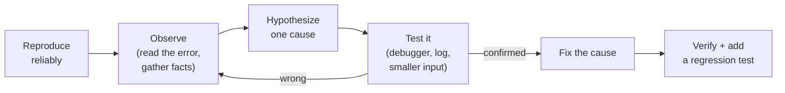
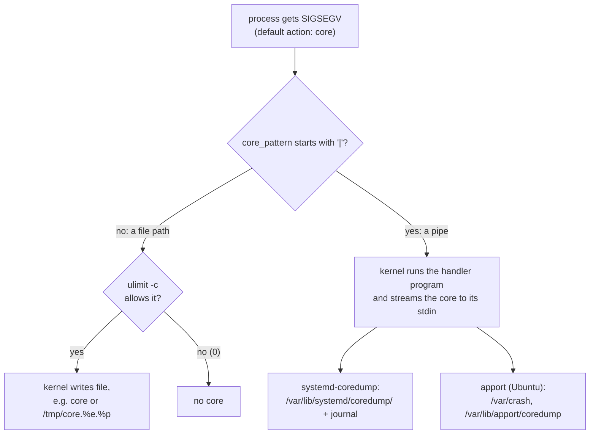
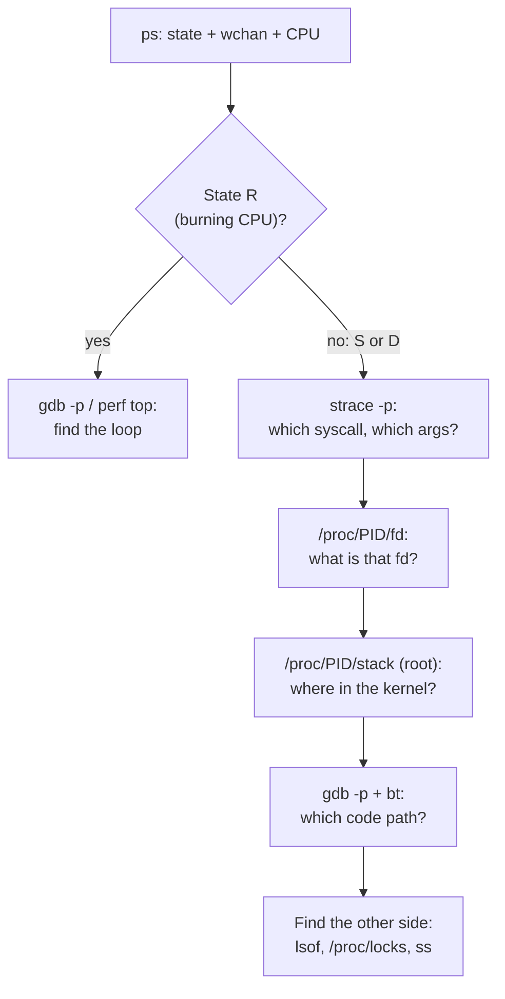

# Debugging

> **Level 5 · Chapter 7** · ⏱️ ~40 min read · Prerequisites: [Building software](06-building-software.md), [System calls and strace](01-system-calls-strace.md), [Processes and signals](../03-internals/02-processes-and-signals.md)

This chapter teaches you to find bugs systematically: with gdb on a crashing C program, with core dumps after the fact, by attaching to live processes, with pdb, py-spy, and faulthandler for Python, and with Valgrind and AddressSanitizer for memory bugs. It ends with a full case study of a hung process.

## Why it matters

Alex's team runs two jobs every night. One is a C log parser, `logstat`, that occasionally dies with `Segmentation fault (core dumped)`. The other is `nightly-report`, which sometimes just... stops. No output, no CPU usage, no error, and it never finishes.

For weeks, the "fix" for both was the same: rerun it. Someone added `printf` lines to `logstat` and recompiled, and the crash went away for a few days, then came back. Someone else wrapped `nightly-report` in `timeout 3600` so it would at least die.

Each problem takes about ten minutes once you know the tools. The kernel had *already saved* a core dump of the crashed parser: `coredumpctl debug` opens it in gdb at the exact line that crashed, with every variable intact. The hung job was sleeping in one system call, which `strace -p` shows in one line, and `gdb -p` shows the code path that led there. Neither fix needs guesswork or rerunning the job in the hope it fails again.

## Concepts

### A debugging mindset

Debugging is the scientific method applied to a program. The most common mistake is skipping straight to "change something and see":



Habits that save hours:

- **Reproduce first.** A bug you can trigger on demand is half-solved. Shrink the input until it's minimal: a 2 GB log that crashes the parser usually contains one bad line.
- **Read the whole error message.** The answer is often in it: the file name, the line number, or the `errno`.
- **Change one thing at a time.** If you change three things and it works, you don't know which one was the fix.
- **Question assumptions.** "That function can't return NULL" is a hypothesis, not a fact. Check it.
- **Bisect.** If it worked last week, `git bisect` finds the commit that broke it in about log₂(n) steps. If a 10,000-line input fails, try each half.
- **Explain it out loud** (to a colleague or a rubber duck). Saying "and then this variable is always positive" often reveals that it isn't.

### printf debugging vs a debugger

**printf debugging** means adding print statements to see what the program is doing. It's not shameful. It's the right tool for quick questions, for distributed systems, and for timing-sensitive bugs that a debugger would disturb. But it has limits:

| | printf / logging | Debugger (gdb, pdb) |
|---|-----------------|---------------------|
| Needs a recompile or redeploy | Yes, for every new question | No |
| Shows state you didn't think to print | No | Yes: any variable, any frame |
| Works after a crash | Only what was printed (and flushed) | Yes, with a core dump |
| Works on a process that's already hung | No | Yes, by attaching |
| Disturbs timing | A little | A lot while stopped |
| Good in production | Yes (as structured logging) | Rarely; attaching pauses the process |

Two printf traps to know about. First, `stdout` is **buffered**: when it's a pipe or a file, output sits in a 4 KB buffer until it fills or the program exits normally. If the program crashes, your last prints vanish, and you conclude the crash happened earlier than it did. Print debug output to `stderr` (unbuffered) with `fprintf(stderr, ...)`, or call `fflush(stdout)`. Second, adding prints changes memory layout and timing, which can make memory-corruption bugs hide. Alex's crash "went away" for exactly that reason.

### How a debugger works underneath

A debugger like **gdb** (the GNU Debugger) controls another process through the **`ptrace`** system call. ptrace lets a **tracer** process stop a **tracee**, read and write its memory and registers, and resume it.

- **Breakpoint.** gdb overwrites the first byte of an instruction with `0xCC` (`int3`, a one-byte "trap" instruction). When the CPU executes it, the kernel stops the tracee and notifies gdb. gdb puts the original byte back, so you see the real code.
- **Stepping.** The CPU has a single-step mode that traps after every instruction. `next` and `step` repeat that until the source line changes.
- **Watchpoint.** x86 CPUs have a few **debug registers** that trap whenever a given address is written. That's how gdb can stop "when this variable changes" at full speed.
- **Source mapping.** All of this works on machine addresses. **DWARF** debug information (the `.debug_*` sections that `-g` adds, from [Building software](06-building-software.md)) maps addresses back to file names, line numbers, variable names, and types.

That's why you compile with **`-g -O0`** for debugging. `-g` provides the mapping. `-O0` turns off optimization, so each source line becomes its own block of instructions and every variable lives in memory. At `-O2`, the compiler reorders code, keeps variables only in registers, and deletes ones it doesn't need, so gdb shows `<optimized out>` and `next` jumps around.

ptrace is powerful: a tracer can read passwords from another process's memory. So Ubuntu restricts it with the **Yama** security module, controlled by `/proc/sys/kernel/yama/ptrace_scope`:

| Value | Who may attach to a running process |
|-------|-------------------------------------|
| `0` | Any process of the same user (the classic Unix rule) |
| `1` | **Default on Ubuntu/Mint.** Only an ancestor (gdb starting the program itself), or root |
| `2` | Only processes with the `CAP_SYS_PTRACE` capability (effectively root) |
| `3` | Nobody; can't be lowered without a reboot |

With the default `1`, `gdb ./prog` works (gdb is the parent), but `gdb -p PID` and `strace -p PID` on an already running process need `sudo`.

### Segfaults and SIGSEGV

Every process has its own **virtual address space** (see [Memory](../03-internals/03-memory.md)). Only some ranges are mapped, each with permissions: code is read+execute, data is read+write, and address `0` and the area around it are never mapped. When the CPU touches an address that isn't mapped, or writes to a read-only page, it raises a **page fault**. The kernel checks whether the access is legitimate (maybe the page is just swapped out). If it isn't, the kernel sends the process **`SIGSEGV`** (signal 11, "segmentation violation").

The default action for SIGSEGV is to terminate the process and **dump core**. The shell reports `Segmentation fault (core dumped)`, and the exit status is 128 + 11 = **139**.

Common causes:

| Cause | Typical code |
|-------|-------------|
| NULL pointer dereference | Using a pointer returned by `strtok`, `malloc`, or `fopen` without checking it |
| Use after free | Using memory after `free()` |
| Buffer overflow | Writing past the end of an array or a `malloc` block |
| Stack overflow | Unbounded recursion |
| Writing to a string literal | `char *s = "abc"; s[0] = 'x';` (literals live in read-only `.rodata`) |

Not every memory bug segfaults. Writing one byte past a `malloc` block usually lands in memory that's mapped but belongs to something else. It silently corrupts data, and the crash, if any, comes much later, somewhere unrelated. That's why the memory checkers later in this chapter exist.

### Core dumps

A **core dump** (core file) is a snapshot of a process at the moment it died: its memory, its registers, and the list of loaded libraries, saved in ELF format. Load it in gdb with the matching executable and you can inspect the crash as if it had just happened, hours or days later, on a different machine if needed.

What happens to a core is controlled by **`/proc/sys/kernel/core_pattern`**:



- If the pattern is a **file path**, the kernel writes the core itself, but only if the **core size limit** allows it. `ulimit -c` shows the limit and is usually `0` (meaning no core files). `ulimit -c unlimited` raises it for the current shell and its children.
- If it starts with **`|`**, the kernel runs that program and pipes the core into it. The handler decides what to keep.
- **systemd-coredump** stores compressed cores in `/var/lib/systemd/coredump/`, logs a summary with a stack trace to the journal, and gives you **`coredumpctl`** to list and debug them. It's the handler on this book's reference machine when the `systemd-coredump` package is installed.
- **apport** is Ubuntu's crash reporter, used on stock Ubuntu desktops. For programs from Ubuntu packages, it writes `.crash` reports to `/var/crash` for bug reporting (`ubuntu-bug`). For your own programs, it saves a core under `/var/lib/apport/coredump/` when `ulimit -c` is non-zero. Linux Mint doesn't ship apport.

### Memory checkers: Valgrind vs AddressSanitizer

Two tools catch the silent memory bugs that don't crash right away:

- **Valgrind memcheck** runs your *unmodified* program on a synthetic CPU and checks every memory access against its own record of what's allocated and initialized. No recompile is needed (though `-g` gives line numbers). It's very thorough, but programs run 20–50× slower.
- **AddressSanitizer** (**ASan**, `-fsanitize=address`) is built into gcc and clang. The compiler inserts a check before every memory access, and the runtime surrounds every allocation with poisoned **redzones**, tracked in a compact **shadow memory** map. It needs a recompile, but runs only about 2× slower, so you can leave it on for your whole test suite. It also catches stack and global buffer overflows, which Valgrind can't. Its leak detector, **LeakSanitizer**, runs at exit.

You can't use both at once. Pick ASan for code you build, and Valgrind when you can't rebuild.

### Debugging Python

Python crashes are friendlier: an uncaught exception prints a **traceback**, the call stack with file and line for every frame. The tools map closely onto the C ones:

| Question | C tool | Python tool |
|----------|--------|-------------|
| Step through code, inspect variables | gdb | **pdb** / `breakpoint()` |
| Inspect a crash after the fact | core dump + gdb | `python3 -m pdb` post-mortem |
| What is a running, hung process doing? | `gdb -p` + `bt` | **py-spy dump** |
| Show the stack on a hard crash or on demand | core dump | **faulthandler** |

### Why processes hang

A "hung" process is almost always in one of two states (see [Processes and signals](../03-internals/02-processes-and-signals.md)):

- **Running in a loop** (state `R`, 100% CPU): an infinite loop, or a very slow algorithm. Debug it with `gdb -p` or `perf top` (see [Performance analysis](../06-expert/02-performance-analysis.md)).
- **Blocked** (state `S` or `D`, 0% CPU): waiting inside a system call for something that never comes, such as a lock, a network reply, a pipe with no writer, or a child that never exits. This is the common case.

For a blocked process, three views together tell the whole story:

- **`wchan`** ("wait channel"): the name of the kernel function the process is sleeping in. Anyone can read it from `ps` or `/proc/PID/wchan`.
- **`/proc/PID/stack`**: the full *kernel* call stack of the sleeping task. Root only.
- **`strace -p`**: the system call it's stuck in, with arguments. **`gdb -p`** + **`bt`**: the *user-space* call chain that led there, in your source code.

## Commands and examples

### A buggy program to practice on

Save this as `logstat.c` in a scratch directory. It counts HTTP status classes in an access log:

```c
#include <stdio.h>
#include <stdlib.h>
#include <string.h>

struct counts {
    int ok;          /* 2xx */
    int client_err;  /* 4xx */
    int server_err;  /* 5xx */
};

/* Each line looks like: "GET /index.html 200" */
static int parse_status(char *line)
{
    char *method = strtok(line, " ");
    char *path   = strtok(NULL, " ");
    char *status = strtok(NULL, " ");

    (void)method;
    (void)path;
    return atoi(status);
}

static void tally(struct counts *c, int status)
{
    if (status >= 200 && status < 300)
        c->ok++;
    else if (status >= 400 && status < 500)
        c->client_err++;
    else if (status >= 500)
        c->server_err++;
}

int main(int argc, char **argv)
{
    struct counts c = {0};
    char line[256];
    FILE *f = fopen(argc > 1 ? argv[1] : "access.log", "r");

    if (f == NULL) {
        perror("fopen");
        return 1;
    }
    while (fgets(line, sizeof line, f) != NULL) {
        int status = parse_status(line);
        tally(&c, status);
    }
    fclose(f);

    printf("2xx=%d 4xx=%d 5xx=%d\n", c.ok, c.client_err, c.server_err);
    return 0;
}
```

Create two inputs, one clean and one with a malformed line, then build for debugging:

```bash
printf 'GET /index.html 200\nPOST /login 401\nGET /api/orders 500\n' > good.log
printf 'GET /index.html 200\nPOST /login 401\nGET /api/orders 500\nGET /health\nGET /about 200\n' > access.log
gcc -g -O0 -Wall logstat.c -o logstat
./logstat good.log
./logstat access.log; echo "exit=$?"
```

```text
2xx=1 4xx=1 5xx=1
Segmentation fault (core dumped)
exit=139
```

Exit status 139 = 128 + 11, and `kill -l 11` prints `SEGV`. The kernel also logged it. Read it with `journalctl -k` (or `sudo dmesg`):

```bash
journalctl -k --no-pager | grep segfault | tail -n 1
```

```text
Oct 02 10:40:21 mint kernel: logstat[145442]: segfault at 0 ip 00007a5f38e5445f sp 00007ffc9d9b0c70 error 4 in libc.so.6[5445f,7a5f38e28000+189000] likely on CPU 13 (core 21, socket 0)
```

`segfault at 0` is the bad address: **0, a NULL pointer**. `ip` is the instruction pointer, the address of the faulting instruction. `error 4` is a bit field meaning "user-mode read of a page that isn't present". `in libc.so.6` says the crash happened inside libc, not in your code. Your code passed libc something bad. This one line already says "NULL pointer passed into a libc function".

### gdb fundamentals: from crash to cause

Start the program under gdb and let it crash:

```bash
gdb -q ./logstat
```

```console
(gdb) run access.log
Starting program: /home/alex/debug-lab/logstat access.log

Program received signal SIGSEGV, Segmentation fault.
0x00007ffff7c5445f in __GI_____strtol_l_internal (nptr=0x0, endptr=endptr@entry=0x0, base=base@entry=10, group=group@entry=0, bin_cst=bin_cst@entry=true, loc=0x7ffff7e053c0 <_nl_global_locale>) at ../stdlib/strtol_l.c:304
(gdb) backtrace
#0  0x00007ffff7c5445f in __GI_____strtol_l_internal (nptr=0x0, endptr=endptr@entry=0x0, base=base@entry=10, group=group@entry=0, bin_cst=bin_cst@entry=true, loc=0x7ffff7e053c0 <_nl_global_locale>) at ../stdlib/strtol_l.c:304
#1  0x00007ffff7c5440c in __GI___isoc23_strtol (nptr=<optimized out>, endptr=endptr@entry=0x0, base=base@entry=10) at ../stdlib/strtol.c:126
#2  0x00007ffff7c46674 in __GI_atoi (nptr=<optimized out>) at ./stdlib/atoi.c:27
#3  0x000055555555528f in parse_status (line=0x7fffffffc8f0 "GET") at logstat.c:20
#4  0x00005555555553af in main (argc=2, argv=0x7fffffffcb28) at logstat.c:44
```

`-q` skips the startup banner. gdb stopped the program at the moment of the SIGSEGV, *before* it died, so everything is still live. **`backtrace`** (`bt`) prints the **call stack**: frame `#0` is where execution is now, and each frame below is the function that called the one above. Read it bottom-up as a story: `main` (line 44) called `parse_status`, which at line 20 called `atoi`, which called `strtol`, which crashed with `nptr=0x0`, a NULL string pointer.

!!! info "Why can you see libc's source lines?"
    This machine has the `libc6-dbg` package installed, which provides debug info for libc. On a stock system, frames `#0`–`#2` just show function names like `__GI_____strtol_l_internal ()` without arguments. That's fine, because the bug is almost never in libc. Look for the first frame in *your* code.

Jump to your frame with **`frame`** and look around:

```console
(gdb) frame 3
#3  0x000055555555528f in parse_status (line=0x7fffffffc8f0 "GET") at logstat.c:20
20	    return atoi(status);
(gdb) info locals
method = 0x7fffffffc8f0 "GET"
path = 0x7fffffffc8f4 "/health\n"
status = 0x0
(gdb) up
#4  0x00005555555553af in main (argc=2, argv=0x7fffffffcb28) at logstat.c:44
44	        int status = parse_status(line);
(gdb) print c
$1 = {ok = 1, client_err = 1, server_err = 1}
```

There's the cause. The line was `GET /health` with no status field, so the third `strtok` returned `NULL`, and `atoi(NULL)` crashed. **`info locals`** prints every local variable in the current frame. **`up`** and **`down`** move one frame at a time. **`print`** (`p`) evaluates any C expression: a variable, `*ptr`, `c.ok + c.client_err`, `line[0]`. `print c` shows that three lines were tallied before the crash, which confirms it was the fourth line.

(If you also run `info locals` in `main`, you'll see `status = 500`. That's a leftover from the previous loop iteration, because this iteration's assignment never completed. Uninitialized and stale values are normal in a crashed frame. Don't let them mislead you.)

The fix is to check for `NULL` and treat malformed lines explicitly:

```c
    if (status == NULL) {
        fprintf(stderr, "logstat: skipping malformed line\n");
        return -1;
    }
    return atoi(status);
```

### gdb: breakpoints, stepping, and inspecting

Now walk through a *working* run to learn the controls. A **breakpoint** stops execution when a given function or line is reached:

```console
(gdb) break parse_status
Breakpoint 1 at 0x1239: file logstat.c, line 14.
(gdb) run good.log
Breakpoint 1, parse_status (line=0x7fffffffc8f0 "GET /index.html 200\n") at logstat.c:14
14	    char *method = strtok(line, " ");
(gdb) info args
line = 0x7fffffffc8f0 "GET /index.html 200\n"
(gdb) next
15	    char *path   = strtok(NULL, " ");
(gdb) next
16	    char *status = strtok(NULL, " ");
(gdb) next
20	    return atoi(status);
(gdb) print status
$1 = 0x7fffffffc900 "200\n"
(gdb) print *status
$2 = 50 '2'
(gdb) finish
Run till exit from #0  parse_status (line=0x7fffffffc8f0 "GET") at logstat.c:20
0x00005555555553af in main (argc=2, argv=0x7fffffffcb28) at logstat.c:44
44	        int status = parse_status(line);
Value returned is $3 = 200
(gdb) next
45	        tally(&c, status);
(gdb) step
tally (c=0x7fffffffc8e4, status=200) at logstat.c:25
25	    if (status >= 200 && status < 300)
(gdb) print *c
$4 = {ok = 0, client_err = 0, server_err = 0}
(gdb) print/x status
$5 = 0xc8
(gdb) continue
Continuing.

Breakpoint 1, parse_status (line=0x7fffffffc8f0 "POST /login 401\n") at logstat.c:14
```

The line gdb shows is the one *about to run*, not the one that just ran. That's why `status` only has a value after the third `next`.

- **`next`** (`n`) runs the current line and stops at the next one, stepping *over* function calls.
- **`step`** (`s`) steps *into* a function call on the current line. Here it entered `tally`.
- **`finish`** runs until the current function returns and prints its return value.
- **`continue`** (`c`) runs until the next breakpoint, signal, or exit.
- **`print *c`** dereferences a pointer, printing the whole struct. `print/x` prints in hex (`/d` decimal, `/t` binary, `/c` character).
- `print *status` shows `50 '2'`: a `char *` points at one character, and gdb shows its numeric value and the character itself.

Breakpoints can be **conditional**, which is essential when the interesting case is iteration 50,000:

```console
(gdb) info breakpoints
Num     Type           Disp Enb Address            What
1       breakpoint     keep y   0x0000555555555239 in parse_status at logstat.c:14
	breakpoint already hit 2 times
(gdb) delete 1
(gdb) break tally if status >= 500
Breakpoint 2 at 0x5555555552a0: file logstat.c, line 25.
(gdb) continue
Breakpoint 2, tally (c=0x7fffffffc8e4, status=500) at logstat.c:25
25	    if (status >= 200 && status < 300)
```

You can also break on a specific line with `break logstat.c:44`, disable a breakpoint temporarily with `disable 2`, and run until a line with `until 47`.

A **watchpoint** stops when a value *changes*, wherever in the code that happens. That's how you answer "who keeps modifying this?":

```console
(gdb) break main
(gdb) run good.log
Breakpoint 1, main (argc=2, argv=0x7fffffffcb28) at logstat.c:34
(gdb) watch c.server_err
Hardware watchpoint 2: c.server_err
(gdb) continue
Continuing.

Hardware watchpoint 2: c.server_err

Old value = 0
New value = 1
tally (c=0x7fffffffc8e4, status=500) at logstat.c:31
31	}
(gdb) bt
#0  tally (c=0x7fffffffc8e4, status=500) at logstat.c:31
#1  0x00005555555553cc in main (argc=2, argv=0x7fffffffcb28) at logstat.c:45
```

"Hardware" means gdb used a CPU debug register, so the program runs at full speed until the write happens. gdb stops just *after* the modifying statement and shows old and new values. A watchpoint on a local variable is deleted automatically when its function returns.

Here's a quick reference of the commands you've used:

| Command | Short | Does |
|---------|-------|------|
| `run [args]` | `r` | Start the program (with arguments) |
| `break FUNC` / `break FILE:LINE` | `b` | Set a breakpoint; add `if COND` for a conditional one |
| `next` / `step` | `n` / `s` | Next line, stepping over / into calls |
| `finish` | `fin` | Run until the current function returns |
| `continue` | `c` | Resume until the next stop |
| `backtrace` | `bt` | Show the call stack (`bt full` adds locals for every frame) |
| `frame N` / `up` / `down` | `f` | Select a stack frame |
| `print EXPR` | `p` | Evaluate and print (`p/x` for hex) |
| `info locals` / `info args` | | Variables in the current frame |
| `watch EXPR` | | Stop when the value changes |
| `info breakpoints` / `delete N` | `i b` / `d` | List / remove breakpoints |
| `list` | `l` | Show source around the current line |
| `quit` | `q` | Exit (asks before killing a running program) |

Pressing ++enter++ on an empty line repeats the last command, so you can tap ++enter++ to keep doing `next`.

**TUI mode** (text user interface) splits the terminal so you see the source code with the current line highlighted while you type commands. Start with `gdb -tui ./logstat`, or press ++ctrl+x++ then ++a++ inside gdb to toggle it:

```text
┌─logstat.c──────────────────────────────────────────────────┐
│   12  static int parse_status(char *line)                  │
│   13  {                                                    │
│B+>14      char *method = strtok(line, " ");                │
│   15      char *path   = strtok(NULL, " ");                │
│   16      char *status = strtok(NULL, " ");                │
│   17                                                       │
└────────────────────────────────────────────────────────────┘
(gdb) next
```

`B+` marks a breakpoint, and `>` is the current line. `layout split` shows source and assembly together, `layout regs` adds registers, and `focus cmd` returns the arrow keys to the command line for history. If the screen gets garbled by program output, press ++ctrl+l++ to redraw.

!!! warning "Common mistake"
    Debugging an optimized build or one without `-g`. Compiled with `-O2 -g`, gdb shows `status = <optimized out>`, and `next` appears to jump backwards. Without `-g`, the backtrace has no files or lines at all:

    ```text
    #3  0x000055555555528f in parse_status ()
    #4  0x00005555555553af in main ()
    ```

    Rebuild with `-g -O0` to debug. If the bug only appears with `-O2`, keep `-O2 -g` and expect some variables to be unavailable. That combination often points at undefined behavior, which ASan (below) is very good at finding.

### Core dumps on Ubuntu and Mint

You don't always get to run the program under gdb. The crash happened at 3 a.m. in a cron job. First, find out where cores go on your machine:

```bash
cat /proc/sys/kernel/core_pattern
ulimit -c
```

```text
|/usr/lib/systemd/systemd-coredump %P %u %g %s %t 9223372036854775808 %h %d
0
```

The pattern starts with `|`, so cores are piped to **systemd-coredump**. With a pipe handler, the kernel hands the core over even though `ulimit -c` is 0, which is why the crash above said `(core dumped)`. On stock Ubuntu you'd see `|/usr/share/apport/apport ...` instead. If you see a plain `core`, cores are written as files in the crashing process's working directory, but only after `ulimit -c unlimited`.

**`coredumpctl list`** shows captured crashes:

```bash
coredumpctl list logstat
```

```text
TIME                           PID  UID  GID SIG     COREFILE EXE
Fri 2026-10-02 10:40:21 IST 145442 1000 1000 SIGSEGV present  /home/alex/debug-lab/logstat
```

`COREFILE present` means the core is still stored. Old cores are cleaned up automatically, by age and disk usage. **`coredumpctl info`** shows the metadata and an automatic stack trace:

```bash
coredumpctl info logstat
```

```text
           PID: 145442 (logstat)
           UID: 1000 (alex)
           GID: 1000 (alex)
        Signal: 11 (SEGV)
     Timestamp: Fri 2026-10-02 10:40:21 IST (5s ago)
  Command Line: ./logstat access.log
    Executable: /home/alex/debug-lab/logstat
 Control Group: /user.slice/user-1000.slice/user@1000.service/app.slice/...
       Storage: /var/lib/systemd/coredump/core.logstat.1000.4b2d9c71e05a4f3e8c6b1a2d7e9f0c35.145442.1790917821000000.zst (present)
  Size on Disk: 20.8K
       Message: Process 145442 (logstat) of user 1000 dumped core.

                Stack trace of thread 145442:
                #0  0x00007a5f38e5445f __GI_____strtol_l_internal (libc.so.6 + 0x5445f)
                #1  0x00007a5f38e46674 __GI_atoi (libc.so.6 + 0x46674)
                #2  0x00005a364a14e28f n/a (/home/alex/debug-lab/logstat + 0x128f)
                #3  0x00005a364a14e3af n/a (/home/alex/debug-lab/logstat + 0x13af)
                #4  0x00007a5f38e2a1ca __libc_start_call_main (libc.so.6 + 0x2a1ca)
                ...
```

For a crash in a system service, that `Message` block also lands in the journal, so `journalctl -u myservice` shows the stack trace next to the service's logs. **`coredumpctl debug`** decompresses the core and opens it in gdb together with the executable:

```bash
coredumpctl debug logstat
```

```console
...
Core was generated by `./logstat access.log'.
Program terminated with signal SIGSEGV, Segmentation fault.
#0  0x00007a5f38e5445f in __GI_____strtol_l_internal (nptr=0x0, ...) at ../stdlib/strtol_l.c:304
(gdb) bt
#0  0x00007a5f38e5445f in __GI_____strtol_l_internal (nptr=0x0, ...) at ../stdlib/strtol_l.c:304
#1  0x00007a5f38e5440c in __GI___isoc23_strtol (nptr=<optimized out>, ...) at ../stdlib/strtol.c:126
#2  0x00007a5f38e46674 in __GI_atoi (nptr=<optimized out>) at ./stdlib/atoi.c:27
#3  0x00005a364a14e28f in parse_status (line=0x7ffc9d9b0d50 "GET") at logstat.c:20
#4  0x00005a364a14e3af in main (argc=2, argv=0x7ffc9d9b0f88) at logstat.c:44
```

It's the same backtrace you got live, recovered after the fact. `frame`, `print`, and `info locals` work too. What you *can't* do with a core is `run`, `step`, or `continue`, because the process is dead. Keep the exact binary that crashed (and build with `-g`). A core from one build is useless with a different build of the same source.

If you have a core *file* (from a file pattern, or one copied from a server), open it directly:

```bash
gdb ./logstat core.logstat.145442
```

!!! danger "⚠️ VM only"
    Changing `core_pattern` is a system-wide kernel setting and disables systemd-coredump or apport until reboot. Practice it in the VM.

```bash
sudo sysctl -w kernel.core_pattern=/tmp/core.%e.%p
ulimit -c unlimited
./logstat access.log
ls /tmp/core.*
gdb ./logstat /tmp/core.logstat.*
```

`%e` is the executable name and `%p` the PID (see `man 5 core` for the full list). Reboot the VM, or set the pattern back to the original string, to restore the default.

On stock **Ubuntu** with apport, crashes of packaged programs produce `/var/crash/_usr_bin_foo.1000.crash`. `apport-unpack` extracts the core from it, and `ubuntu-bug` files the report. For your own binaries, with `ulimit -c unlimited`, apport saves cores under `/var/lib/apport/coredump/`.

### Attaching to a running process

`gdb -p PID` attaches to a process that's already running and stops it. With Ubuntu's default `ptrace_scope` of 1, as a normal user it fails:

```bash
gdb -q -p 4242
```

```text
Could not attach to process.  If your uid matches the uid of the target
process, check the setting of /proc/sys/kernel/yama/ptrace_scope, or try
again as the root user.  For more details, see /etc/sysctl.d/10-ptrace.conf
ptrace: Operation not permitted.
```

`strace -p 4242` fails the same way: `attach: ptrace(PTRACE_SEIZE, 4242): Operation not permitted`. The straightforward fix is root, for that one command: `sudo gdb -p 4242`. The common workflow once attached:

```console
(gdb) bt
(gdb) info threads
(gdb) thread apply all bt
(gdb) detach
(gdb) quit
```

`thread apply all bt` prints every thread's stack, which is essential for deadlocks in multithreaded programs. **`detach`** lets the process continue exactly where it was. Quitting gdb also detaches. While gdb is attached, the process is frozen, so on a production service, get your backtrace and detach quickly. Use `gcore PID` (from the gdb package) to write a core of the running process without killing it, then analyze the core at leisure.

!!! danger "⚠️ VM only"
    Lowering `ptrace_scope` lets any of your processes read any other's memory, including your browser's and your SSH agent's. Only do this in the VM, and prefer `sudo gdb -p` on real machines.

```bash
sudo sysctl kernel.yama.ptrace_scope=0      # until reboot
```

### Debugging Python: pdb, breakpoint(), post-mortem

Here's a Python script with a data bug, `totals.py`:

```python
import csv
import sys


def parse_amount(raw):
    return float(raw.replace("$", ""))


def total_by_region(path):
    totals = {}
    with open(path, newline="") as f:
        for row in csv.DictReader(f):
            region = row["region"]
            totals[region] = totals.get(region, 0) + parse_amount(row["amount"])
    return totals


if __name__ == "__main__":
    for region, total in sorted(total_by_region(sys.argv[1]).items()):
        print(f"{region:<6} {total:>10.2f}")
```

```bash
printf 'order_id,region,amount\n1001,north,$120.50\n1002,south,$80.00\n1003,north,\n1004,east,$42.10\n' > orders.csv
python3 totals.py orders.csv
```

```text
Traceback (most recent call last):
  File "/home/alex/debug-lab/totals.py", line 19, in <module>
    for region, total in sorted(total_by_region(sys.argv[1]).items()):
                                ^^^^^^^^^^^^^^^^^^^^^^^^^^^^
  File "/home/alex/debug-lab/totals.py", line 14, in total_by_region
    totals[region] = totals.get(region, 0) + parse_amount(row["amount"])
                                             ^^^^^^^^^^^^^^^^^^^^^^^^^^^
  File "/home/alex/debug-lab/totals.py", line 6, in parse_amount
    return float(raw.replace("$", ""))
           ^^^^^^^^^^^^^^^^^^^^^^^^^^^
ValueError: could not convert string to float: ''
```

A traceback is a backtrace printed *top-down*: the last frame is where the exception was raised. It tells you *what* failed but not *which row*. The **pdb** post-mortem shows you the state at the moment of failure. Run the script under `python3 -m pdb`, type `c` to continue, and pdb catches the exception:

```console
$ python3 -m pdb totals.py orders.csv
> /home/alex/debug-lab/totals.py(1)<module>()
-> import csv
(Pdb) c
Traceback (most recent call last):
...
ValueError: could not convert string to float: ''
Uncaught exception. Entering post mortem debugging
Running 'cont' or 'step' will restart the program
> /home/alex/debug-lab/totals.py(6)parse_amount()
-> return float(raw.replace("$", ""))
(Pdb) p repr(raw)
"''"
(Pdb) up
> /home/alex/debug-lab/totals.py(14)total_by_region()
-> totals[region] = totals.get(region, 0) + parse_amount(row["amount"])
(Pdb) p row
{'order_id': '1003', 'region': 'north', 'amount': ''}
(Pdb) ll
  9  	def total_by_region(path):
 10  	    totals = {}
 11  	    with open(path, newline="") as f:
 12  	        for row in csv.DictReader(f):
 13  	            region = row["region"]
 14  ->	            totals[region] = totals.get(region, 0) + parse_amount(row["amount"])
 15  	    return totals
(Pdb) q
```

Order 1003 has an empty amount. The pdb commands deliberately mirror gdb's:

| pdb | Does |
|-----|------|
| `n` / `s` / `c` / `r` | next, step into, continue, return from the current function |
| `b FILE:LINE` / `b FUNC, COND` | breakpoint, optionally conditional |
| `p EXPR` / `pp EXPR` | print / pretty-print |
| `w` / `up` / `down` | where (stack), move between frames |
| `l` / `ll` | list source around the line / the whole current function |
| `interact` | a full Python REPL with the current variables |
| `q` | quit |

To stop *at a specific spot* instead, put **`breakpoint()`** (built in since Python 3.7) in the code:

```python
        for row in csv.DictReader(f):
            if not row["amount"]:
                breakpoint()
```

The program pauses there in pdb. The environment variable `PYTHONBREAKPOINT=0` turns every `breakpoint()` call into a no-op, which protects you when one slips into a commit. Even better, set conditional breakpoints from pdb without editing the file at all: `b totals.py:14, row["amount"] == ""`.

!!! warning "Common mistake"
    Leaving `breakpoint()` in code that runs under systemd or cron. There's no terminal, so pdb reads EOF from stdin, and the program either exits strangely or hangs waiting for input. Run `grep -rn 'breakpoint()' src/` before you commit.

### Debugging a hung Python process: py-spy and faulthandler

A hung Python process is a C process (the interpreter) running your Python code. `gdb -p` shows interpreter internals like `_PyEval_EvalFrameDefault`, which isn't much help. **py-spy** reads the interpreter's memory from outside and prints the *Python* stack. It doesn't modify or restart the target. Install it into your user environment with `pipx install py-spy` (or `pip install py-spy` inside a virtualenv). It uses ptrace-style access, so with `ptrace_scope=1` you run it with `sudo`.

Here's a script that hangs the way real network clients do, on a `recv()` with no timeout:

```python
import faulthandler
import signal
import socket

# Dump every thread's Python stack to stderr when we get SIGUSR1.
faulthandler.register(signal.SIGUSR1)


def wait_for_reply(sock):
    return sock.recv(4096)          # no timeout: can block forever


def main():
    a, b = socket.socketpair()      # stand-in for a stuck upstream server
    print("waiting for upstream reply...", flush=True)
    data = wait_for_reply(a)
    print("got", data)


if __name__ == "__main__":
    main()
```

```bash
python3 fetcher.py &
ps -o pid,stat,wchan:22,cmd -p $!
sudo "$(command -v py-spy)" dump --pid $!
```

```text
waiting for upstream reply...
    PID STAT WCHAN                  CMD
 154482 S    unix_stream_data_wait  python3 fetcher.py
Process 154482: python3 fetcher.py
Python v3.12.3 (/usr/bin/python3.12)

Thread 154482 (idle): "MainThread"
    wait_for_reply (fetcher.py:10)
    main (fetcher.py:16)
    <module> (fetcher.py:21)
```

`STAT S` and `WCHAN unix_stream_data_wait` say it's sleeping in the kernel, waiting for data on a Unix socket. py-spy's stack says *which Python line* is waiting: `fetcher.py:10`, the `recv`. `(idle)` means the thread is blocked, not computing. `sudo "$(command -v py-spy)"` is needed because `sudo` doesn't search your personal `~/.local/bin`. For CPU-bound hangs, `py-spy top --pid PID` gives a live, `top`-like view of the hottest functions.

**faulthandler** is the zero-install alternative, built into the standard library. The `register(signal.SIGUSR1)` line in the script makes the process dump its own stack on demand:

```bash
kill -USR1 154482
```

```text
Current thread 0x00007765df06f080 (most recent call first):
  File "/home/alex/debug-lab/fetcher.py", line 10 in wait_for_reply
  File "/home/alex/debug-lab/fetcher.py", line 16 in main
  File "/home/alex/debug-lab/fetcher.py", line 21 in <module>
```

The output goes to the process's stderr, so under systemd it lands in the journal. faulthandler also prints the Python stack when the interpreter itself crashes on a fatal signal, which would otherwise just say `Segmentation fault` (typically a bug in a C extension). Turn it on for any script with `-X faulthandler` or `PYTHONFAULTHANDLER=1`:

```bash
python3 -X faulthandler -c 'import ctypes; ctypes.string_at(0)'
```

```text
Fatal Python error: Segmentation fault

Current thread 0x00007a8abf623080 (most recent call first):
  File "/usr/lib/python3.12/ctypes/__init__.py", line 525 in string_at
  File "<string>", line 1 in <module>
...
```

Adding `PYTHONFAULTHANDLER=1` to the `Environment=` of a Python systemd service (see [Running services with systemd](05-services-with-systemd.md)) costs nothing and turns mysterious crashes into tracebacks.

### Valgrind memcheck: leaks and invalid reads

This program has two classic memory bugs, and it *appears to work*:

```c
#include <stdio.h>
#include <stdlib.h>
#include <string.h>

/* Copy a CSV header into a new buffer and upper-case it. */
static char *dup_header(const char *header)
{
    size_t len = strlen(header);
    char *copy = malloc(len);          /* BUG 1: no room for '\0' */
    strcpy(copy, header);
    for (size_t i = 0; i < len; i++)
        if (copy[i] >= 'a' && copy[i] <= 'z')
            copy[i] -= 32;
    return copy;
}

int main(void)
{
    const char *headers[] = { "user_id,event,ts", "order_id,amount" };

    for (int i = 0; i < 2; i++) {
        char *h = dup_header(headers[i]);
        printf("%s\n", h);
        /* BUG 2: never free(h) */
    }
    return 0;
}
```

```bash
gcc -g -O0 -Wall fields.c -o fields && ./fields; echo "exit=$?"
```

```text
USER_ID,EVENT,TS
ORDER_ID,AMOUNT
exit=0
```

Correct output and exit 0, yet `strcpy` writes the terminating `'\0'` one byte past the 16-byte block. That byte overwrites whatever the allocator keeps there. Run it under Valgrind (`sudo apt install valgrind`; no recompile needed):

```bash
valgrind --leak-check=full ./fields
```

```text
==4242== Memcheck, a memory error detector
==4242== Using Valgrind-3.22.0 and LibVEX; rerun with -h for copyright info
==4242== Command: ./fields
==4242==
==4242== Invalid write of size 1
==4242==    at 0x484F0FE: strcpy (in /usr/libexec/valgrind/vgpreload_memcheck-amd64-linux.so)
==4242==    by 0x1091D4: dup_header (fields.c:10)
==4242==    by 0x109251: main (fields.c:22)
==4242==  Address 0x4a8e050 is 0 bytes after a block of size 16 alloc'd
==4242==    at 0x48447A8: malloc (in /usr/libexec/valgrind/vgpreload_memcheck-amd64-linux.so)
==4242==    by 0x1091BE: dup_header (fields.c:9)
==4242==    by 0x109251: main (fields.c:22)
==4242==
==4242== Invalid read of size 1
==4242==    at 0x484ED24: strlen (in /usr/libexec/valgrind/vgpreload_memcheck-amd64-linux.so)
==4242==    by 0x48F5D30: puts (ioputs.c:35)
==4242==    by 0x109264: main (fields.c:23)
==4242==  Address 0x4a8e050 is 0 bytes after a block of size 16 alloc'd
...
USER_ID,EVENT,TS
ORDER_ID,AMOUNT
==4242==
==4242== HEAP SUMMARY:
==4242==     in use at exit: 31 bytes in 2 blocks
==4242==   total heap usage: 3 allocs, 1 frees, 1,055 bytes allocated
==4242==
==4242== 31 bytes in 2 blocks are definitely lost in loss record 1 of 1
==4242==    at 0x48447A8: malloc (in /usr/libexec/valgrind/vgpreload_memcheck-amd64-linux.so)
==4242==    by 0x1091BE: dup_header (fields.c:9)
==4242==    by 0x109251: main (fields.c:22)
==4242==
==4242== LEAK SUMMARY:
==4242==    definitely lost: 31 bytes in 2 blocks
==4242==    indirectly lost: 0 bytes in 0 blocks
==4242==      possibly lost: 0 bytes in 0 blocks
==4242==    still reachable: 0 bytes in 0 blocks
==4242==         suppressed: 0 bytes in 0 blocks
==4242==
==4242== ERROR SUMMARY: 4 errors from 2 contexts (suppressed: 0 from 0)
```

`4242` is the PID, and addresses vary from run to run. How to read it:

- **`Invalid write of size 1`**: one byte written outside any valid block. The first stack (`at`/`by`) is *where* it happened: `strcpy`, called from `dup_header` at `fields.c:10`.
- **`Address ... is 0 bytes after a block of size 16 alloc'd`**: the second stack is where that block was *allocated* (`fields.c:9`). "0 bytes after a block of size 16" is the textbook signature of an off-by-one: `"user_id,event,ts"` is 16 characters and needs 17 bytes.
- **`Invalid read of size 1`** in `strlen`, called by `puts`: printing the string reads the same out-of-bounds terminator. (gcc turned `printf("%s\n", h)` into `puts(h)`, a standard optimization.)
- **`definitely lost: 31 bytes in 2 blocks`**: 16 + 15 bytes that nothing points to any more, allocated at `fields.c:9`. A **definite** leak means the last pointer to the block is gone. **Still reachable** means a pointer still exists at exit, which is usually harmless.

### AddressSanitizer

Rebuild with ASan. Keep `-g` for line numbers and `-O0` or `-O1` for clear reports:

```bash
gcc -g -O0 -Wall -fsanitize=address fields.c -o fields-asan
./fields-asan
```

```text
=================================================================
==151986==ERROR: AddressSanitizer: heap-buffer-overflow on address 0x502000000020 at pc 0x7ced3dea7923 bp 0x7fffa11dba70 sp 0x7fffa11db218
WRITE of size 17 at 0x502000000020 thread T0
    #0 0x7ced3dea7922 in strcpy ../../../../src/libsanitizer/asan/asan_interceptors.cpp:563
    #1 0x62786935a32b in dup_header /home/alex/debug-lab/fields.c:10
    #2 0x62786935a5a9 in main /home/alex/debug-lab/fields.c:22
    ...

0x502000000020 is located 0 bytes after 16-byte region [0x502000000010,0x502000000020)
allocated by thread T0 here:
    #0 0x7ced3defd9c7 in malloc ../../../../src/libsanitizer/asan/asan_malloc_linux.cpp:69
    #1 0x62786935a314 in dup_header /home/alex/debug-lab/fields.c:9
    #2 0x62786935a5a9 in main /home/alex/debug-lab/fields.c:22
    ...

SUMMARY: AddressSanitizer: heap-buffer-overflow ../../../../src/libsanitizer/asan/asan_interceptors.cpp:563 in strcpy
Shadow bytes around the buggy address:
=>0x502000000000: fa fa 00 00[fa]fa fa fa fa fa fa fa fa fa fa fa
...
  Heap left redzone:       fa
...
==151986==ABORTING
```

It's the same diagnosis, but ASan **stops at the first error** (exit status 1) instead of continuing. `WRITE of size 17` means `strcpy` tried to write 17 bytes into a 16-byte region. The **shadow bytes** line is ASan's memory map: each byte describes 8 bytes of your memory. `00 00` is the 16 valid bytes, and `[fa]` is the redzone you wrote into.

Fix the overflow with `malloc(len + 1)` and run again. Now the leak detector speaks up at exit:

```text
USER_ID,EVENT,TS
ORDER_ID,AMOUNT

=================================================================
==152540==ERROR: LeakSanitizer: detected memory leaks

Direct leak of 33 byte(s) in 2 object(s) allocated from:
    #0 0x77c09f6fd9c7 in malloc ../../../../src/libsanitizer/asan/asan_malloc_linux.cpp:69
    #1 0x62ebd7d2c318 in dup_header /home/alex/debug-lab/fields.c:9
    #2 0x62ebd7d2c5ad in main /home/alex/debug-lab/fields.c:22
    ...

SUMMARY: AddressSanitizer: 33 byte(s) leaked in 2 allocation(s).
```

33 bytes now (17 + 16), because the allocations grew by one byte each. Add `free(h);` after the `printf` and the run is clean. Useful knobs go in the `ASAN_OPTIONS` environment variable: `detect_leaks=0` silences leak reports while you chase overflows, and `abort_on_error=1` produces a core dump for gdb.

!!! warning "Common mistake"
    Losing output when an ASan or Valgrind run is piped. If you run `./fields-asan | less` or redirect to a file, the two `USER_ID...` lines can disappear entirely. ASan exits with `_exit()` after its leak report, so the stdio buffer (full-buffered when stdout is a pipe) is never flushed. In a terminal, stdout is line-buffered, so you see them. Don't conclude "it crashed before printing" from piped output.

Make ASan part of your normal test build, for example a `make asan` target that adds `-fsanitize=address -g` to `CFLAGS` and `LDFLAGS`. Related sanitizers: `-fsanitize=undefined` (UBSan: integer overflow, misaligned access, bad shifts) and `-fsanitize=thread` (data races; can't be combined with ASan).

### Case study: a hung process from the outside in

The second job from the opening story, `nightly-report`, hangs some nights. Here's a simplified version of its code. The key part is the lock it takes so two runs never overlap:

```c
#include <fcntl.h>
#include <stdio.h>
#include <sys/file.h>
#include <unistd.h>

#define LOCK_PATH "report.lock"

static int acquire_lock(const char *path)
{
    int fd = open(path, O_RDWR | O_CREAT, 0644);
    if (fd < 0) {
        perror("open");
        return -1;
    }
    /* Blocks until no other process holds the lock. No timeout! */
    if (flock(fd, LOCK_EX) < 0) {
        perror("flock");
        return -1;
    }
    return fd;
}

static void build_report(void)
{
    puts("building report...");
}

int main(void)
{
    printf("nightly-report: pid %d waiting for lock\n", getpid());
    fflush(stdout);
    int fd = acquire_lock(LOCK_PATH);
    if (fd < 0)
        return 1;
    build_report();
    close(fd);
    return 0;
}
```

To reproduce the hang safely in a scratch directory, hold the lock from another process, then start the report:

```bash
gcc -g -O0 -Wall nightly-report.c -o nightly-report
flock report.lock sleep 120 &
./nightly-report &
```

```text
nightly-report: pid 150398 waiting for lock
```

Now investigate as if you'd just found it hung. The method goes from cheapest and least invasive to most detailed:



**Step 1: process state and wait channel.**

```bash
ps -o pid,stat,wchan:22,etime,cmd -p 150398
cat /proc/150398/wchan; echo
```

```text
    PID STAT WCHAN                   ELAPSED CMD
 150398 S    locks_lock_inode_wait     02:31 ./nightly-report
locks_lock_inode_wait
```

`S` is interruptible sleep: it's waiting, not computing. `wchan` names the kernel function it's sleeping in, `locks_lock_inode_wait`, which is the kernel's file-lock wait. That's already a strong hypothesis: it's waiting for a file lock.

**Step 2: the system call, with `strace -p`.**

```bash
sudo strace -p 150398
```

```text
strace: Process 150398 attached
flock(3, LOCK_EX
```

The call never completes, so strace can't print the closing `)` and the result. It's blocked in `flock(3, LOCK_EX)`: an exclusive lock on file descriptor 3. Press ++ctrl+c++ to detach; the process keeps waiting.

**Step 3: what is fd 3?**

```bash
ls -l /proc/150398/fd
```

```text
total 0
lrwx------ 1 alex alex 64 Oct  2 10:41 0 -> /dev/pts/1
l-wx------ 1 alex alex 64 Oct  2 10:41 1 -> /dev/pts/1
l-wx------ 1 alex alex 64 Oct  2 10:41 2 -> /dev/pts/1
lrwx------ 1 alex alex 64 Oct  2 10:41 3 -> /home/alex/debug-lab/report.lock
```

**Step 4: the kernel stack** (root only, for security).

```bash
sudo cat /proc/150398/stack
```

```text
[<0>] locks_lock_inode_wait+0x13c/0x1d0
[<0>] __do_sys_flock+0x147/0x1f0
[<0>] __x64_sys_flock+0x18/0x30
[<0>] x64_sys_call+0x1f0b/0x25a0
[<0>] do_syscall_64+0x7e/0x170
[<0>] entry_SYSCALL_64_after_hwframe+0x76/0x7e
```

Read bottom-up: user space entered the kernel (`entry_SYSCALL_64`), dispatched the `flock` system call, and is sleeping in `locks_lock_inode_wait`. (The `+0x13c/0x1d0` offsets depend on your kernel build.) This view matters most for state `D` (uninterruptible sleep). There, strace may show nothing useful, and the kernel stack points at the stuck subsystem, such as NFS, a dying disk, or a FUSE filesystem.

**Step 5: the user-space code path, with `gdb -p`.**

```bash
sudo gdb -q -p 150398 -batch -ex bt
```

```text
0x00007cc37b31762b in __GI_flock () at ../sysdeps/unix/syscall-template.S:120
#0  0x00007cc37b31762b in __GI_flock () at ../sysdeps/unix/syscall-template.S:120
#1  0x00006400ee8072a2 in acquire_lock (path=0x6400ee808051 "report.lock") at nightly-report.c:19
#2  0x00006400ee807336 in main () at nightly-report.c:38
[Inferior 1 (process 150398) detached]
```

`-batch -ex bt` attaches, prints the backtrace, and detaches immediately: a few milliseconds of pause, which is safe even in production. Now you know the exact line, `nightly-report.c:19`, the `flock` with no timeout, inside `acquire_lock`.

**Step 6: who holds the lock?**

```bash
lsof report.lock
grep ":$(stat -c %i report.lock) " /proc/locks
```

```text
COMMAND      PID USER   FD   TYPE DEVICE SIZE/OFF    NODE NAME
flock     150370 alex    3rW  REG  259,7        0 2762984 report.lock
sleep     150372 alex    3r   REG  259,7        0 2762984 report.lock
nightly-r 150398 alex    3u   REG  259,7        0 2762984 report.lock
128: FLOCK  ADVISORY  WRITE 150370 103:07:2762984 0 EOF
128: -> FLOCK  ADVISORY  WRITE 150398 103:07:2762984 0 EOF
```

`/proc/locks` lists every file lock by inode number. The first line is the **holder**, and the `->` line is a **waiter** blocked behind it, our PID 150398. `lsof` shows the holder's family: the `flock` command (`W` = write lock) and its child `sleep`, which inherited the open file descriptor and therefore keeps the lock alive.

That last detail was the real bug in Alex's case. A previous run had started a background helper that inherited the lock's file descriptor, and the helper never exited. Even after the parent finished, the child's copy of the fd kept the lock held. The fixes:

1. Open lock files with `O_CLOEXEC`, so they aren't inherited by programs the job starts (see [File descriptors](02-file-descriptors.md)).
2. Never wait forever. Use `flock(fd, LOCK_EX | LOCK_NB)` in a retry loop with a deadline, or in shell `flock -w 30 report.lock cmd`, and log *who* holds the lock when you give up.
3. Kill the stale holder now: `kill 150372 150370`.

The same six-step method works for a process stuck on a network read (`strace` shows `recvfrom(5, ...`, `/proc/PID/fd/5` is `socket:[...]`, and `ss -tp` finds the peer), a pipe with no writer (`read(0, ...` on `pipe:[...]`), or `wait4` on a child that never exits.

## Exercises

### Exercise 1: Crash to cause in under a minute (easy)

Build `logstat` from this chapter with `-g -O0` and crash it on `access.log`. Using only `coredumpctl` (or, if your `core_pattern` isn't systemd-coredump, `gdb ./logstat` and `run`), find the source file and line in *your* code where it went wrong, and the value of the variable that caused it.

??? success "Solution"

    ```bash
    ./logstat access.log
    coredumpctl list logstat
    coredumpctl debug logstat
    ```

    ```console
    (gdb) bt
    ...
    #3  ... in parse_status (line=... "GET") at logstat.c:20
    #4  ... in main (argc=2, argv=...) at logstat.c:44
    (gdb) frame 3
    (gdb) print status
    $1 = 0x0
    ```

    Frame 3 is the first one in your code: `logstat.c:20`, `return atoi(status);` with `status = 0x0`. The line `GET /health` has only two fields, so the third `strtok` returned NULL.

### Exercise 2: Breakpoints and watchpoints (medium)

Without editing the source, use gdb to (a) stop only when `tally` is called with a 4xx status, (b) print the full `struct counts` at that moment, and (c) find, with a watchpoint, the line that changes `c.ok` the first time.

??? success "Solution"

    ```console
    $ gdb -q ./logstat
    (gdb) break tally if status >= 400 && status < 500
    (gdb) run good.log
    Breakpoint 1, tally (c=0x7fffffffc8e4, status=401) at logstat.c:25
    (gdb) print *c
    $1 = {ok = 1, client_err = 0, server_err = 0}
    (gdb) delete
    (gdb) run
    (gdb) # answer y to restart
    ```

    For (c), break at `main`, run, then `watch c.ok` and `continue`:

    ```console
    (gdb) break main
    (gdb) run good.log
    (gdb) watch c.ok
    (gdb) continue
    Hardware watchpoint 2: c.ok

    Old value = 0
    New value = 1
    0x00005555555552c1 in tally (c=0x7fffffffc8e4, status=200) at logstat.c:26
    26	        c->ok++;
    ```

    The change happens on line 26, `c->ok++`. The address in front means gdb stopped in the middle of that line's instructions, right after the store. `bt` confirms it was called from `main` at line 45. (The `delete` and `run` lines in part (a) remove the conditional breakpoint and restart the program.)

### Exercise 3: Python post-mortem and faulthandler (medium)

Using `totals.py` and `orders.csv`: (a) find the offending row with `python3 -m pdb` post-mortem, (b) add a conditional breakpoint from pdb that stops on that row *before* the exception, and (c) fix `parse_amount` so empty amounts count as 0.0 but print a warning to stderr. Then write a 5-line script that hangs in `time.sleep(3600)`, start it with `PYTHONFAULTHANDLER=1`, and make it print its stack without killing it.

??? success "Solution"

    (a) `python3 -m pdb totals.py orders.csv`, `c`, then `up` and `p row` shows `order_id` 1003.

    (b) Start pdb again and, before continuing, type `b totals.py:14, row["amount"] == ""`, then `c`. It stops at line 14 with that row, before `parse_amount` raises.

    (c)
    ```python
    def parse_amount(raw):
        if not raw.strip():
            print("warning: empty amount, using 0", file=sys.stderr)
            return 0.0
        return float(raw.replace("$", ""))
    ```

    `PYTHONFAULTHANDLER=1` only covers fatal signals, so the hang script must register a signal itself:

    ```python
    import faulthandler, signal, time
    faulthandler.register(signal.SIGUSR1)
    def nap():
        time.sleep(3600)
    nap()
    ```

    ```bash
    python3 hang.py & sleep 1; kill -USR1 $!; kill $!
    ```

    The `kill -USR1` prints `File "hang.py", line 4 in nap` and `line 5 in <module>`, and the process keeps sleeping until the final `kill`.

### Exercise 4: Find memory bugs with ASan (medium)

Write a C program that has (1) a use-after-free, and (2) a stack buffer overflow (writing `arr[10]` in an `int arr[10]`). Build it normally and note what happens. Then build with `-fsanitize=address -g` and identify each bug from the report. Which of the two could Valgrind *not* detect, and why?

??? success "Solution"

    ```c
    #include <stdio.h>
    #include <stdlib.h>
    #include <string.h>

    int main(int argc, char **argv)
    {
        char *name = malloc(16);
        strcpy(name, "pipeline");
        free(name);
        if (argc > 1)
            printf("%s\n", name);          /* use after free */

        int arr[10];
        for (int i = 0; i <= 10; i++)      /* off by one */
            arr[i] = i;
        return arr[0];
    }
    ```

    Run `gcc -g -O0 bugs.c -o bugs && ./bugs x`. On Ubuntu and Mint it prints `pipeline` (or garbage) and then dies with `*** stack smashing detected ***: terminated` and exit status 134 (SIGABRT). Ubuntu's gcc enables `-fstack-protector-strong` by default, which notices that the canary value after `arr` was overwritten when `main` returns. That tells you *something* overflowed, but not where. `gcc -Wall -O2` also warns `pointer 'name' may be used after 'free'`. Then `gcc -g -O0 -fsanitize=address bugs.c -o bugs-asan`. Run `./bugs-asan x` to report `heap-use-after-free ... READ`, with three stacks: the bad access, where it was freed, and where it was allocated. Run `./bugs-asan` (no argument) to skip the first bug and report `stack-buffer-overflow ... WRITE of size 4`, pointing at the loop line and naming the variable `'arr'`. Valgrind can't see the stack overflow: it only tracks heap blocks and whether memory is addressable, and `arr[10]` lands on other valid stack memory. ASan adds redzones around stack arrays at compile time.

### Exercise 5: The full hung-process investigation (hard)

Reproduce the `nightly-report` hang from the case study in a scratch directory. Without looking at the source, use `ps`, `/proc/PID/wchan`, `strace -p`, `/proc/PID/fd`, `gdb -p`, and `/proc/locks` or `lsof` to produce a one-paragraph incident note: what it's waiting for, on which source line, and which process is responsible. Then change the program to give up after 10 seconds, print the holder's PID if it can, and exit with status 75 (`EX_TEMPFAIL`).

??? success "Solution"

    Follow steps 1–6 of the case study (with `sudo` for `strace -p` and `gdb -p`). An example note: "nightly-report (PID 150398) has been in state S for 2m31s, blocked in `flock(3, LOCK_EX)` (wchan `locks_lock_inode_wait`) on `report.lock`, called from `acquire_lock()` at nightly-report.c:19. The lock is held by PID 150370 (`flock report.lock sleep 120`) and its child `sleep` (PID 150372), which inherited the descriptor."

    A non-blocking version with a deadline:

    ```c
    #include <errno.h>
    #include <time.h>

    static int acquire_lock(const char *path)
    {
        int fd = open(path, O_RDWR | O_CREAT | O_CLOEXEC, 0644);
        if (fd < 0) { perror("open"); return -1; }

        time_t deadline = time(NULL) + 10;
        while (flock(fd, LOCK_EX | LOCK_NB) < 0) {
            if (errno != EWOULDBLOCK) { perror("flock"); return -1; }
            if (time(NULL) >= deadline) {
                fprintf(stderr, "nightly-report: %s still locked after 10s; "
                        "see: lsof %s\n", path, path);
                exit(75);
            }
            sleep(1);
        }
        return fd;
    }
    ```

    (Add `#include <stdlib.h>` for `exit`.) `LOCK_NB` makes `flock` return immediately with `EWOULDBLOCK` instead of sleeping. Finding the holder's PID from inside the program means parsing `/proc/locks` for the file's inode (`fstat(fd, &st)` gives `st.st_ino`). Printing the `lsof` hint is a pragmatic alternative. `O_CLOEXEC` stops the descriptor from leaking into child programs, which was the root cause.

## Check yourself

1. Why do you compile with `-g -O0` for debugging, and what do you see in gdb if you don't?

    ??? note "Answer"

        `-g` adds DWARF debug info that maps machine addresses to files, lines, variables, and types. `-O0` keeps a one-to-one relationship between source lines and code, with every variable in memory. Without `-g`, backtraces show only function names (or raw addresses) with no lines or variables. With optimization, variables show as `<optimized out>` and stepping jumps around unpredictably.

2. What is the difference between `next`, `step`, and `finish` in gdb?

    ??? note "Answer"

        `next` executes the current line, treating function calls as one step. `step` enters any function called on the current line. `finish` runs until the current function returns and prints its return value.

3. A program exits with status 139. What happened, and how do you get from there to a source line on Ubuntu or Mint without rerunning it?

    ??? note "Answer"

        139 = 128 + 11: it was killed by SIGSEGV (signal 11), an invalid memory access. Check `/proc/sys/kernel/core_pattern`. With systemd-coredump, run `coredumpctl list` to find it and `coredumpctl debug <name or PID>` to open the core in gdb, then `bt` and `frame N` to reach the first frame in your code. With a file pattern, run `gdb ./prog corefile`. The binary must be the exact build that crashed, ideally built with `-g`.

4. Why does `gdb -p 1234` fail as a normal user on a default Ubuntu install, even for your own process? Give the safe way to do it.

    ??? note "Answer"

        Yama's `kernel.yama.ptrace_scope` defaults to 1: a process can only be ptraced by its ancestors (or by root), to stop malware running as you from reading your other processes' memory. The safe approach is `sudo gdb -p 1234` (or `sudo strace -p`) for that one command, rather than lowering `ptrace_scope` system-wide.

5. What do `wchan`, `/proc/PID/stack`, `strace -p`, and `gdb -p ... bt` each tell you about a blocked process?

    ??? note "Answer"

        `wchan`: the name of the kernel function it's sleeping in (readable by anyone). `/proc/PID/stack`: the full kernel call stack (root only), most useful for state `D`. `strace -p`: the system call it's blocked in, with arguments, such as `flock(3, LOCK_EX`. `gdb -p` + `bt`: the user-space call chain, down to your source file and line.

6. When would you use Valgrind instead of AddressSanitizer, and vice versa?

    ??? note "Answer"

        Valgrind needs no recompile, so use it for binaries you can't rebuild or for a one-off check, accepting a 20–50× slowdown. ASan needs `-fsanitize=address` at build time, but runs about 2× slower, catches stack and global overflows that Valgrind misses, and is practical for a whole test suite. You can't combine them.

7. How do you see the Python-level stack of a hung Python process, with and without installing anything?

    ??? note "Answer"

        With py-spy: `sudo py-spy dump --pid PID` reads the interpreter's memory from outside and prints each thread's Python stack without stopping it for long. Without installing anything: if the program called `faulthandler.register(signal.SIGUSR1)`, run `kill -USR1 PID` and the stack is printed to its stderr. (`python3 -X faulthandler` alone covers only fatal signals like SIGSEGV.)

8. Why can adding `printf` statements make a memory-corruption bug "go away", and what should you do instead?

    ??? note "Answer"

        Extra code and calls change memory layout, stack contents, and timing, so the corrupted byte lands somewhere harmless, or an uninitialized variable happens to be zero. The bug is still there. Use ASan or Valgrind, which detect the bad access itself at the moment it happens, regardless of whether it causes a visible symptom.

## Key takeaways

- Debug like a scientist: reproduce, observe, form one hypothesis, test it, fix, and add a regression test. Read the whole error message first.
- gdb works through `ptrace` plus DWARF debug info. Build with `-g -O0`, then use `run`, `bt`, `frame`, `print`, `info locals`, `break ... if`, `next`/`step`/`finish`, and `watch`. ++ctrl+x++ ++a++ gives a source view.
- SIGSEGV means an invalid memory access, and exit status 139. Cores go wherever `core_pattern` says. On Ubuntu/Mint that's usually systemd-coredump (`coredumpctl list/info/debug`) or apport.
- Attaching with `gdb -p` or `strace -p` needs `sudo` under the default `ptrace_scope=1`. Get the backtrace and `detach` quickly.
- For Python: tracebacks, `python3 -m pdb` post-mortem, `breakpoint()`, `py-spy dump` for hung processes, and `faulthandler` for hard crashes and on-demand stacks.
- Memory bugs that don't crash are found by Valgrind (no rebuild) or AddressSanitizer (`-fsanitize=address`, fast, catches more).
- For a hung process, go from the outside in: `ps` state and `wchan`, then `strace -p`, `/proc/PID/fd`, `/proc/PID/stack`, `gdb -p` + `bt`, and finally find the other side with `lsof`, `/proc/locks`, or `ss`.

## Next

You can now build, run, and debug programs on Linux. Prove it with the [Level 5 capstone](../../exercises/level-5-capstone.md).
