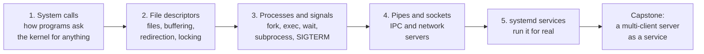

# Level 5: Building for Linux

> ⏱️ About 7 hours of reading, plus 8–12 hours of exercises and the capstone · Prerequisites: [Level 3: How Linux works](../03-internals/index.md) and [Level 4: System administration](../04-sysadmin/index.md)

Up to now you've been a skilled *user* of Linux: running commands, reading `/proc`, managing services other people wrote. Level 5 turns you into a *builder*. You'll write programs that talk to the kernel directly and run the way real Linux software runs.

The language is **Python 3.12**, using only the standard library, because it's what most data engineers already know and because its `os`, `signal`, `socket`, and `subprocess` modules map almost one-to-one onto the underlying system calls. A few short C snippets appear where they make the kernel boundary clearer. You don't need to know C to follow them.

## What this level covers

Every program on Linux, in any language, is built from the same few kernel services: files, processes, signals, and sockets. This level takes each one in turn, first showing how it works underneath, then how to use it correctly from Python.

## What you'll be able to do

By the end of this level, you'll be able to:

- Watch any program's system calls with `strace` and use them to answer "which file is it reading?", "why does it hang?", and "what is it getting permission denied on?" without reading its source.
- Explain what a file descriptor really is, why `print()` output shows up late or out of order, how `2>&1` works, and how to write a file so a crash can never leave it half-written.
- Start, wait for, and signal other processes from Python safely, without zombies, deadlocks, or shell injection holes.
- Write programs that shut down cleanly on `SIGTERM` instead of dying mid-task.
- Connect programs with pipes, FIFOs, and Unix domain sockets, and write TCP servers that handle many clients at once with threads, `selectors`, or `asyncio`.
- Package your own program as a hardened systemd service with its own user, journald logging, readiness notification, automatic restarts, and a repeatable deploy process.
- Compile, link, and package native code, and explain what `ldd` and the dynamic loader are doing.
- Debug crashes and hangs with gdb, core dumps, valgrind, and sanitizers.

## Chapters

| # | Chapter | What you'll learn | Time |
|---|---------|-------------------|------|
| 1 | [System calls and strace](01-system-calls-strace.md) | User space vs kernel space, how a syscall works, errno, the vDSO, and debugging any program with `strace` | ~50 min |
| 2 | [File descriptors in code](02-file-descriptors.md) | The fd → open file description → inode model, buffering, `dup2` and redirection, inheritance, limits, `fsync`, atomic writes, and locking | ~50 min |
| 3 | [Processes and signals in code](03-processes-signals-in-code.md) | `fork`/`exec`/`wait` (with a mini shell), exit statuses, zombies, `subprocess`, signal handlers, and graceful shutdown | ~55 min |
| 4 | [Pipes and sockets](04-pipes-and-sockets.md) | Pipes, FIFOs, Unix and TCP sockets, `TIME_WAIT`, message framing, and three ways to serve many clients | ~60 min |
| 5 | [Your program as a service](05-services-with-systemd.md) | Unit files, journald logging, `sd_notify`, socket activation, sandboxing, user services, and deploying updates | ~55 min |
| 6 | [Building software](06-building-software.md) | The compile → link pipeline, ELF files, static vs shared libraries, `ld.so` and `ldd`, `make` in depth, cmake and autotools, `pkg-config`, and building your own `.deb` | ~55 min |
| 7 | [Debugging](07-debugging.md) | gdb on a crashing C program, segfaults, core dumps with `coredumpctl`, attaching to live processes, pdb and py-spy, valgrind, and AddressSanitizer | ~55 min |

Reading times cover the text only. Budget at least as much time again for the examples and exercises, and run them in a real terminal: most of the lessons here are things you only believe after you've seen them happen.

## How to work through this level

- **Set up a scratch directory** once: `mkdir -p ~/level5 && cd ~/level5`. Every example in this level runs there.
- **Keep two terminals open.** Many examples have a server in one terminal and a client in the other.
- **Servers bind to `127.0.0.1`** on high ports (7070, 9000, and so on), so nothing is exposed to your network. Stop each one with ++ctrl+c++ or `kill` when you're done, and check with `ss -ltnp` that nothing is left listening.
- **Install system services only in your VM.** Chapter 5 gives you a user-level (`systemctl --user`) path that's safe on your main machine, and marks the system-level steps **⚠️ VM only**. See [Set up your practice lab](../../lab-setup.md).
- **Trace everything.** Whenever an example surprises you, run it again under `strace`. That habit is the main skill of this level.

## Capstone

The level ends with the [Level 5 capstone](../../exercises/level-5-capstone.md): a line-based key-value server in Python that handles many concurrent clients, shuts down cleanly on `SIGTERM` and `SIGINT`, and runs as a systemd service with readiness notification and journald logging. Don't move on to [Level 6](../06-expert/index.md) until it passes every acceptance check without notes.
