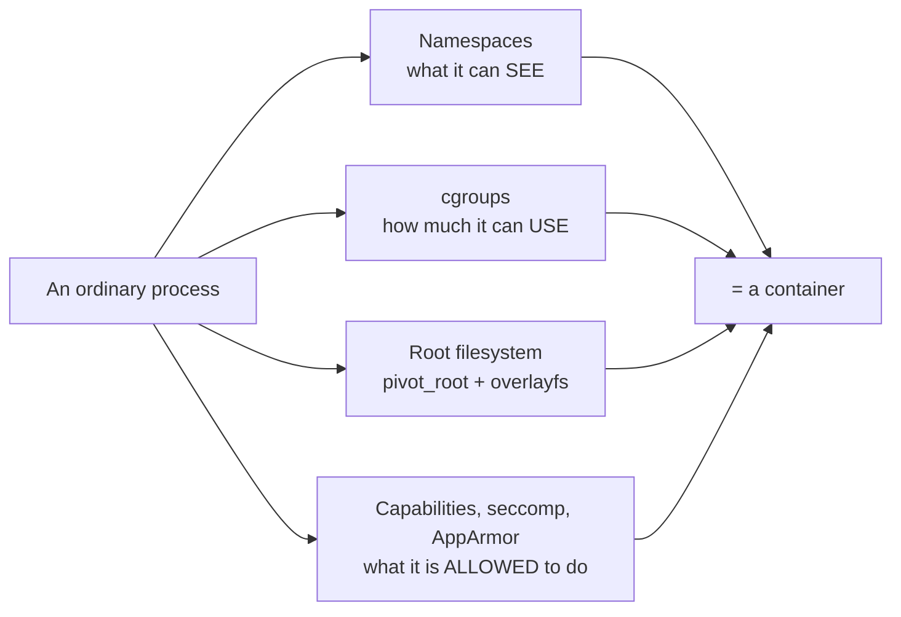
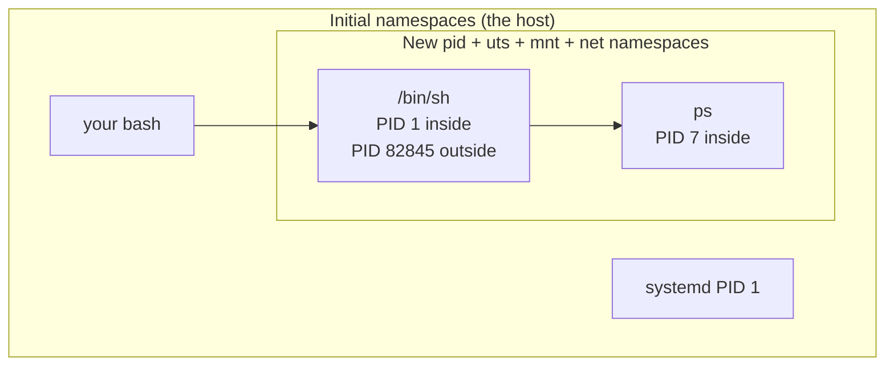
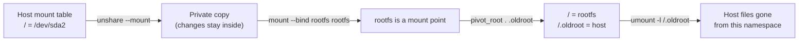
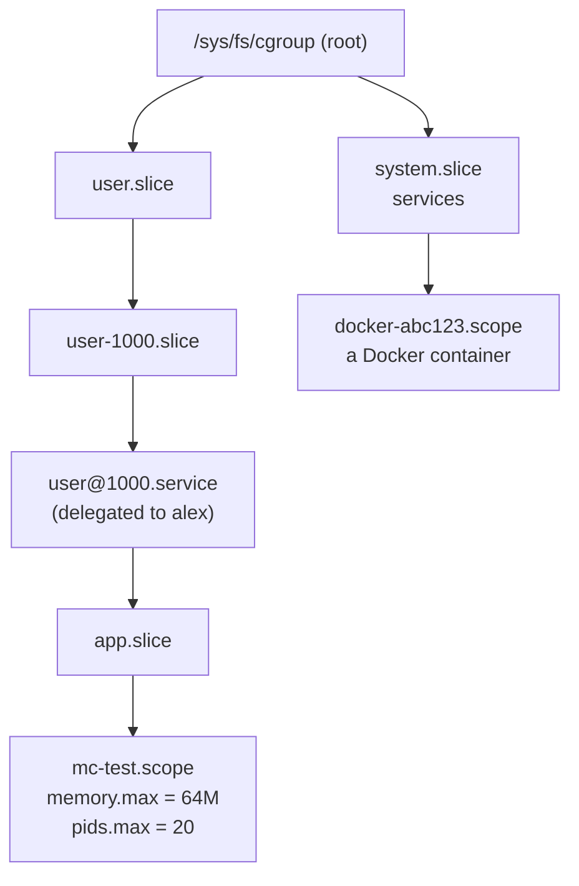
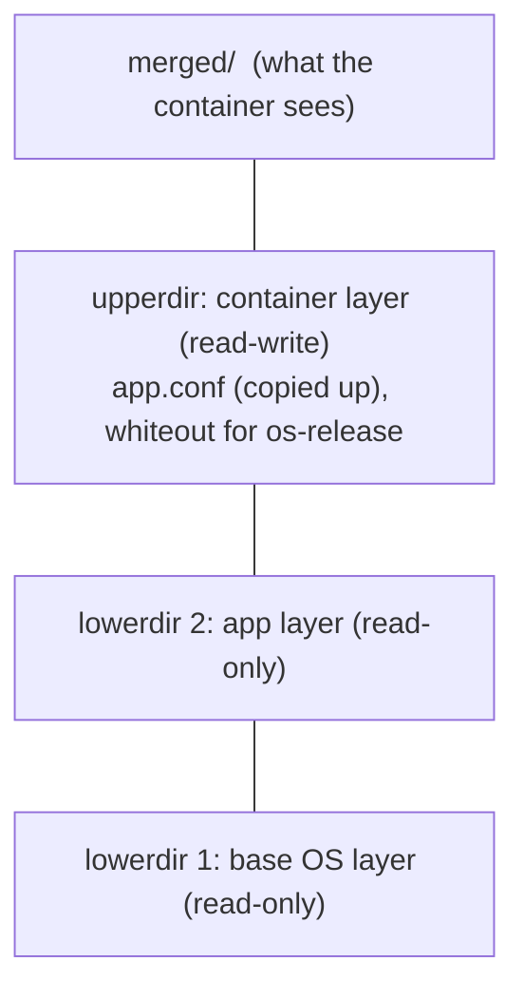
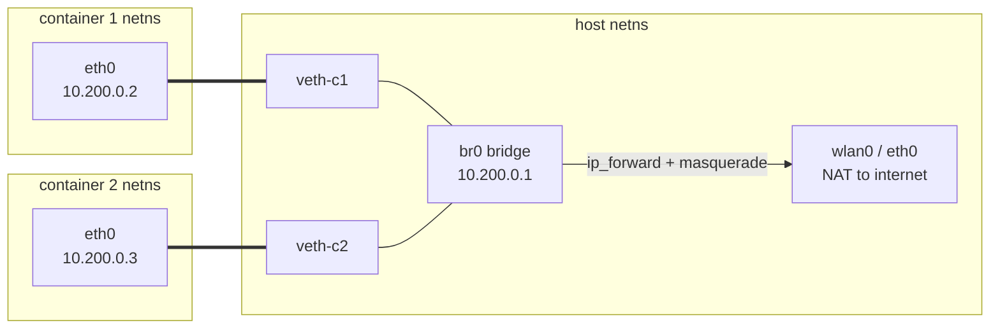
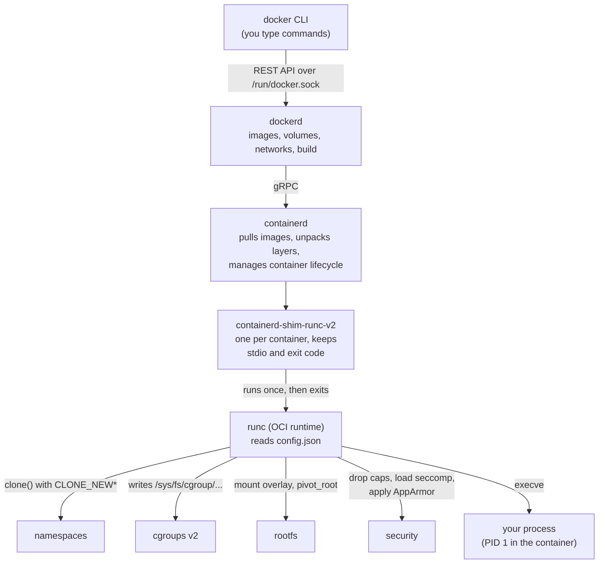

# Containers from scratch

> **Level 6 · Chapter 1** · ⏱️ ~75 min read · Prerequisites: [Processes and signals](../03-internals/02-processes-and-signals.md), [Devices, /proc, and /sys](../03-internals/05-devices-proc-sys.md), [System calls and strace](../05-programming/01-system-calls-strace.md)

A container is not a tiny virtual machine. It is an ordinary Linux process that the kernel has been asked to lie to. This chapter takes apart that lie piece by piece (namespaces, cgroups, root filesystems, overlayfs, virtual network cables, capabilities, seccomp) and then puts it back together as a working container in about 30 lines of shell.

## Why it matters

Alex runs the data platform team's ingestion jobs in Docker. One night a job dies with exit code 137 and no error message. The Docker logs show nothing. The team's first guess is "Docker is broken" and someone suggests restarting the Docker daemon on the production host.

Alex instead runs `journalctl -k` on the host and finds `Memory cgroup out of memory: Killed process 48211 (python3)`. That one line says everything. The container had a memory limit. That limit is a **cgroup** setting. The kernel, not Docker, enforced it by killing the biggest process in the group, and 137 means "killed by signal 9" (128 + 9). The fix was raising the job's limit from 2 GB to 4 GB and making the pandas code read the CSV in chunks. Total time: ten minutes.

People who think of containers as magic boxes spend hours in situations like this. People who know that a container is "a process plus namespaces plus cgroups" know exactly which kernel feature to ask. By the end of this chapter you will be one of the second group.

## Concepts

### A container is just a process

Start with the most important idea. Run `sleep 1000` inside a Docker container, then run `ps aux | grep sleep` on the host. You will see the `sleep` process right there in the host's process list, with a normal host PID. There is no hidden machine. There is no second kernel.

What makes it a "container" is that the kernel shows this process a different view of the world:

- It sees only its own processes, and thinks it is PID 1.
- It sees its own hostname.
- It sees its own root filesystem (`/`), not the host's.
- It sees its own network interfaces.
- It can only use a limited share of memory and CPU.
- It is root inside, but that root is missing most of its powers.

Each of those bullets is a separate kernel feature. Docker, Podman, and Kubernetes are programs that switch those features on in the right order. You can do the same with standard tools from `util-linux` and a few files under `/sys`.



Compare that with a **virtual machine (VM)**: a whole emulated computer with its own kernel. A VM boots. A container just starts, because nothing needs to boot. That is why containers start in milliseconds and why a container can never run a different kernel than the host.

### Namespaces: what a process can see

A **namespace** wraps one kind of global system resource so that processes inside the namespace get their own private copy of it. Every process belongs to exactly one namespace of each type. When Linux boots, everything lives in the initial ("root") namespaces. New namespaces are created with the `clone()` or `unshare()` system calls, and a process can join an existing one with `setns()`.

Linux has eight namespace types:

| Namespace | Flag | Isolates | Added in kernel |
|---|---|---|---|
| **mnt** (mount) | `CLONE_NEWNS` | The list of mounts: what `/` and everything below it looks like | 2.4.19 (2002) |
| **uts** | `CLONE_NEWUTS` | Hostname and NIS domain name | 2.6.19 |
| **ipc** | `CLONE_NEWIPC` | System V IPC objects and POSIX message queues | 2.6.19 |
| **pid** | `CLONE_NEWPID` | Process ID numbers; the first process becomes PID 1 | 2.6.24 |
| **net** | `CLONE_NEWNET` | Network interfaces, IP addresses, routes, firewall rules, ports | 2.6.29 |
| **user** | `CLONE_NEWUSER` | User and group IDs, and capabilities | 3.8 |
| **cgroup** | `CLONE_NEWCGROUP` | The view of the cgroup tree (`/proc/self/cgroup`) | 4.6 |
| **time** | `CLONE_NEWTIME` | The boot-time and monotonic clocks (not wall-clock time) | 5.6 |

The name **uts** comes from "UNIX Time-sharing System", the old `struct utsname` that `uname` reads. The mount namespace's flag is `CLONE_NEWNS` ("new namespace") because it was the first one and nobody expected more.

You can see which namespaces a process is in by looking at `/proc/PID/ns/`. Each entry is a special symbolic link whose target names the namespace type and an **inode number** (a unique ID for the namespace object). Two processes are in the same namespace if and only if those numbers match.



A process inside a PID namespace has two PIDs: one in its own namespace and one in each parent namespace. The host can always see and signal the container's processes. The container cannot see the host's.

### The user namespace: root that isn't

The **user namespace** is the cleverest one. Inside it, user and group IDs are remapped: your normal UID 1000 can appear as UID 0 (root) inside. The mapping lives in `/proc/PID/uid_map` and `/proc/PID/gid_map`. A line like `0 1000 1` means "inside UID 0 maps to outside UID 1000, for a range of 1 ID".

A process that creates a user namespace gets a full set of **capabilities** inside it. Capabilities are the pieces root's power is split into, such as `CAP_SYS_ADMIN` or `CAP_NET_ADMIN` (the [Security](03-security.md) chapter covers them in depth). But those capabilities only count for resources *owned by* that user namespace. You can mount a `proc` filesystem for your own PID namespace, or set the hostname of your own UTS namespace. You still cannot edit `/etc/shadow`, because the host's files belong to the host's user namespace, where you are still UID 1000.

This is what makes **rootless containers** possible: an unprivileged user creates a user namespace first, becomes "root" in it, and then creates all the other namespaces from there. Podman uses this by default.

!!! info "Ubuntu 24.04 restricts unprivileged user namespaces"
    User namespaces expose a lot of kernel code to unprivileged users, and they have been part of many privilege-escalation exploits. Ubuntu 24.04 therefore ships `kernel.apparmor_restrict_unprivileged_userns = 1` (set in `/usr/lib/sysctl.d/10-apparmor.conf`). With it on, an unconfined program can still create a user namespace, but AppArmor moves it into a profile called `unprivileged_userns` that **denies every capability**. In practice `unshare --user --map-root-user` then fails with an error such as `unshare: write failed /proc/self/uid_map: Operation not permitted`, and the kernel log shows an `apparmor="AUDIT" operation="userns_create"` line.

    **Linux Mint 22 turns this off.** It ships `/etc/sysctl.d/20-apparmor-mint.conf` containing `kernel.apparmor_restrict_unprivileged_userns = 0`, so the rootless experiments in this chapter work on Mint out of the box. Check your machine:

    ```bash
    sysctl kernel.apparmor_restrict_unprivileged_userns
    ```

    If it prints `1` (for example on a plain Ubuntu VM), you have two options, both ⚠️ VM only. The narrow, recommended one is an AppArmor profile that lets just `unshare` create user namespaces (shown in the Commands section). The blunt one is `sudo sysctl -w kernel.apparmor_restrict_unprivileged_userns=0`, which lasts until reboot and lowers security for every program.

### The PID namespace and PID 1

The first process in a new **PID namespace** gets PID 1 and takes on the special duties of an **init process**:

- **Orphans are re-parented to it.** When a process's parent dies, the child is adopted by PID 1 of its namespace, which must `wait()` for it, or it stays a **zombie** (a dead process whose exit status was never collected).
- **It is protected from signals.** Inside the namespace, signals with no handler installed (including `SIGTERM` and `SIGINT`) are ignored by PID 1. That is why `docker stop` on a badly written container waits 10 seconds and then sends `SIGKILL`. Your Python script, running as PID 1, never installed a `SIGTERM` handler.
- **When it exits, the namespace dies.** The kernel sends `SIGKILL` to every other process in it.

There is a trap with `unshare --pid`. The `unshare()` system call does not move the calling process into the new PID namespace. It only puts the caller's *future children* there. That is why you need `--fork`: `unshare` forks, and the child becomes PID 1. You will see what happens without it in the examples.

The second trap is `/proc`. Tools like `ps` and `top` read process information from `/proc`, and the `/proc` you inherited is the host's. So `ps` inside a fresh PID namespace still lists every host process. You must mount a new `proc` filesystem, which the kernel fills with the processes of the PID namespace that mounted it. That is what `--mount-proc` does, and it needs a mount namespace so the new `/proc` doesn't cover the host's.

### The mount namespace, chroot, and pivot_root

A **mount namespace** gives a process its own copy of the mount table. Mounts made inside it do not appear on the host, as long as **mount propagation** is turned off. Propagation is a feature where mounts can be shared between namespaces (systemd marks `/` as "shared" by default). `mount --make-rprivate /` cuts those links for the whole tree. `unshare` does this for you by default (`--propagation private`).

Giving the container its own root directory is a separate step. There are two tools:

- **`chroot`** (change root) changes the directory a process treats as `/`. It is old (1979) and simple, but it is not a security boundary. The old root is still mounted and reachable. A root process inside can call `chroot` again on a subdirectory and walk back out with `..`.
- **`pivot_root`** swaps the root *mount* of the whole mount namespace. The new root becomes `/`, the old root is moved to a directory under it (for example `/.oldroot`), and then you unmount the old root completely. After that, the host's filesystem is simply not in the container's mount table. There is nothing to escape to.

`pivot_root` has rules: the new root must be a mount point, and it must not be on a shared mount. The standard trick is to bind-mount the root filesystem directory onto itself (`mount --bind dir dir`), which turns an ordinary directory into a mount point. Every real container runtime uses `pivot_root`, falling back to `chroot` only in special cases.



### Root filesystems

A **root filesystem (rootfs)** is a directory tree that looks like a minimal Linux install: `/bin`, `/etc`, `/lib`, `/usr`, plus empty `/proc`, `/sys`, `/dev`, and `/tmp` to mount things on. It contains user-space programs and libraries only. There is no kernel in it, because the container uses the host's kernel.

Two easy ways to get one:

- **Alpine minirootfs.** Alpine Linux publishes a "mini root filesystem" tarball of about 3–4 MB, built around BusyBox (one binary that provides `sh`, `ls`, `ps`, and hundreds of other commands) and the musl C library. You download it and extract it. This is the fastest route and the one this chapter uses.
- **debootstrap.** The Debian/Ubuntu tool that installs a base system into a directory from the package archive: `sudo debootstrap --variant=minbase noble ./noble-rootfs`. It produces a real Ubuntu 24.04 userland (around 150–200 MB) with `apt`. It needs root. `mmdebstrap --mode=unshare` can do the same rootless.

A **container image** (what you `docker pull`) is just a rootfs, split into layers, plus some JSON metadata such as the default command and environment variables.

### cgroups v2: how much a process can use

Namespaces control what a process sees. They do nothing to stop it from eating all the RAM. That is the job of **control groups (cgroups)**: a kernel feature that organizes processes into a tree of groups and applies resource limits and accounting to each group.

Modern systems, including Ubuntu 24.04 and Mint 22, use **cgroups v2**, also called the **unified hierarchy**: one tree, mounted at `/sys/fs/cgroup`, where every directory is a cgroup. (The older v1 had a separate tree per resource. You will still see it in old blog posts.) The interface is entirely files:

- `cgroup.procs` lists the PIDs in the group. Writing a PID into it moves that process into the group.
- `cgroup.controllers` lists the **controllers** (resource types such as `cpu`, `memory`, `io`, `pids`) available to this group.
- `cgroup.subtree_control` lists the controllers this group switches on for its children. A controller's files (`memory.max` and so on) only appear in a child once the parent enables it here.
- Controller files: `memory.max`, `cpu.max`, `pids.max`, and many more.

The key limits for containers:

| File | Meaning | Example |
|---|---|---|
| `memory.max` | Hard memory limit. Over it, the kernel reclaims; if it can't, the **OOM killer** (out-of-memory killer) kills a process in the group. | `268435456` or `256M` |
| `memory.high` | Soft limit. Over it, the group is throttled and pushed to reclaim, but not killed. | `200M` |
| `memory.swap.max` | Swap the group may use. `0` makes `memory.max` a true RAM cap. | `0` |
| `cpu.max` | "QUOTA PERIOD" in microseconds. `50000 100000` = 50 ms of CPU every 100 ms, so half of one CPU. | `max 100000` (no limit) |
| `cpu.weight` | Relative share when CPUs are busy (1–10000, default 100). | `200` |
| `pids.max` | Maximum number of tasks (processes plus threads). Stops fork bombs. | `100` |

Each group also has read-only accounting files: `memory.current`, `memory.peak`, `memory.events` (counts `oom_kill`), `pids.current`, `pids.events`, and `cpu.stat` (`nr_throttled`, `throttled_usec`).

Two rules trip everyone up:

1. **No internal processes.** A cgroup that enables controllers for its children (non-empty `cgroup.subtree_control`) cannot itself contain processes. Processes live in the leaves.
2. **Delegation.** Normal users cannot write to most of `/sys/fs/cgroup`. systemd owns the tree and can **delegate** a subtree to a user or service, meaning it hands over ownership of those directories. On Ubuntu, systemd delegates `cpu`, `memory`, and `pids` to each user's `user@1000.service`. That is how rootless containers get limits.

The **cgroup namespace** is the small piece that ties this to containers: it makes the container's own cgroup look like the root (`0::/`) from inside, so the container can't see where it sits in the host's tree.



### overlayfs and image layers

If ten containers run from the same 200 MB image, copying the image ten times would waste 2 GB. **overlayfs** solves this. It is a **union filesystem**: it stacks directories and presents the merged result as one tree.

- **lowerdir**: one or more read-only layers (the image). Several can be stacked with colons.
- **upperdir**: a writable directory where all changes go (the container's own layer).
- **workdir**: an empty scratch directory overlayfs needs for atomic operations. It must be on the same filesystem as upperdir.
- **merged**: the mount point where you see the combined result.

Reading a file returns it from the highest layer that has it. Writing a file that lives only in the lower layer triggers a **copy-up**: overlayfs copies the whole file into upperdir and modifies the copy. Deleting a lower file creates a **whiteout** in upperdir, a special character device with device number 0/0 that means "pretend this file isn't here". The lower layers never change.



Docker's `overlay2` storage driver is exactly this. Each image layer is a directory under `/var/lib/docker/overlay2/`, and each container gets its own upperdir. Since kernel 5.11, overlayfs can be mounted inside a user namespace, so rootless tools can use it too.

### Container networking: veth pairs and bridges

A new network namespace contains only a loopback interface, and it is down. To connect it to anything, you need a **veth pair** (virtual Ethernet pair): two virtual network interfaces joined like the two ends of a cable. Packets sent into one end come out of the other. You put one end in the container's namespace (often renamed `eth0`) and keep the other on the host.

With many containers, the host ends are plugged into a **bridge**: a virtual network switch inside the kernel. Docker's `docker0` is a bridge. The host gives the bridge an IP address that the containers use as their gateway. For internet access, the host also enables IP forwarding (`net.ipv4.ip_forward=1`) and adds a **NAT** (network address translation) rule that rewrites the containers' private source addresses to the host's address.



Rootless containers can't create veth pairs on the host (that needs `CAP_NET_ADMIN` in the host's network namespace). They use a user-space network stack instead, such as `slirp4netns` or `pasta`, which forward traffic through ordinary sockets.

### The remaining isolation: capabilities, seccomp, and LSMs

Namespaces and cgroups don't stop a container's root from calling dangerous kernel features directly. Three more layers do:

- **Capabilities.** Runtimes drop most of root's capabilities. Docker keeps 14 by default (`CHOWN`, `DAC_OVERRIDE`, `FOWNER`, `FSETID`, `KILL`, `SETGID`, `SETUID`, `SETPCAP`, `NET_BIND_SERVICE`, `NET_RAW`, `SYS_CHROOT`, `MKNOD`, `AUDIT_WRITE`, `SETFCAP`). Without `CAP_SYS_ADMIN`, container root cannot mount filesystems; without `CAP_SYS_MODULE`, it cannot load kernel modules.
- **seccomp** (secure computing mode). A filter, written as a small BPF program, that the kernel runs on every system call the process makes. It can allow the call, fail it with an error, or kill the process. Docker's default profile blocks dozens of rarely needed and risky calls such as `kexec_load`, `reboot`, `add_key`, and `open_by_handle_at`.
- **LSMs** (Linux Security Modules) such as AppArmor or SELinux. On Ubuntu, Docker loads an AppArmor profile called `docker-default` that, among other things, denies writes to sensitive parts of `/proc` and `/sys`.

You will meet all three again in the [Security](03-security.md) chapter.

### How Docker, containerd, and runc map onto all this

Docker is a stack of programs, and only the bottom one touches the kernel features above.



- **runc** is a small program that implements the **OCI runtime spec** (Open Container Initiative), a standard JSON file (`config.json`) that lists which namespaces to create, which cgroup limits to set, what to mount, and which capabilities to keep. runc does exactly what you will do by hand in this chapter, then `execve()`s your program and exits.
- **containerd** manages images and container lifecycles. Kubernetes talks to containerd directly, without Docker.
- **The shim** stays behind as the container's parent, so containerd and dockerd can restart without killing running containers.
- **dockerd** adds the user-friendly parts: building images, named volumes, `docker0` bridge networking, port publishing via NAT rules.

Podman replaces dockerd and containerd with a single daemonless program, and uses `crun` or `runc` underneath. Same kernel features, different management layer.

## Commands and examples

Everything in this section that doesn't carry a ⚠️ box runs as your normal user on Mint 22 and changes nothing outside a scratch directory. Make one now:

```bash
mkdir -p ~/lab/containers && cd ~/lab/containers
```

### Look at your namespaces: /proc/PID/ns and lsns

```bash
ls -l /proc/self/ns
```

```text
total 0
lrwxrwxrwx 1 alex alex 0 Oct  2 10:36 cgroup -> cgroup:[4026531835]
lrwxrwxrwx 1 alex alex 0 Oct  2 10:36 ipc -> ipc:[4026531839]
lrwxrwxrwx 1 alex alex 0 Oct  2 10:36 mnt -> mnt:[4026531832]
lrwxrwxrwx 1 alex alex 0 Oct  2 10:36 net -> net:[4026531833]
lrwxrwxrwx 1 alex alex 0 Oct  2 10:36 pid -> pid:[4026531836]
lrwxrwxrwx 1 alex alex 0 Oct  2 10:36 pid_for_children -> pid:[4026531836]
lrwxrwxrwx 1 alex alex 0 Oct  2 10:36 time -> time:[4026531834]
lrwxrwxrwx 1 alex alex 0 Oct  2 10:36 time_for_children -> time:[4026531834]
lrwxrwxrwx 1 alex alex 0 Oct  2 10:36 user -> user:[4026531837]
lrwxrwxrwx 1 alex alex 0 Oct  2 10:36 uts -> uts:[4026531838]
```

`/proc/self` always points at the process reading it, here `ls`. Each line is one namespace. The number in brackets is the namespace's inode. These particular numbers (402653183x) are the initial namespaces created at boot, so you are on the host.

The two `*_for_children` entries exist because of the "unshare affects only children" rule for PID and time namespaces. They show the namespace your next child will be born into.

`lsns` lists every namespace on the system that you can see:

```bash
lsns
```

```text
        NS TYPE   NPROCS   PID USER COMMAND
4026531832 mnt       182  1325 alex /usr/lib/systemd/systemd --user
4026531833 net       176  1325 alex /usr/lib/systemd/systemd --user
4026531834 time      205  1325 alex /usr/lib/systemd/systemd --user
4026531835 cgroup    205  1325 alex /usr/lib/systemd/systemd --user
4026531836 pid       158  1325 alex /usr/lib/systemd/systemd --user
4026531837 user      154  1325 alex /usr/lib/systemd/systemd --user
4026531838 uts       205  1325 alex /usr/lib/systemd/systemd --user
4026531839 ipc       198  1325 alex /usr/lib/systemd/systemd --user
4026532743 pid         1 57453 alex /opt/google/chrome/chrome --type=renderer ...
4026532751 user       15  3938 alex bwrap --args 42 -- com.slack.Slack
4026532752 mnt        10  3938 alex bwrap --args 42 -- com.slack.Slack
...
```

- **NS**: the namespace inode, matching `/proc/PID/ns`.
- **NPROCS**: how many processes are in it.
- **PID / COMMAND**: the lowest-numbered process in it, as an example.

Notice you are already using containers without knowing it. Chrome puts each renderer in its own PID namespace as a sandbox. Flatpak apps run under `bwrap` (bubblewrap) with their own user and mount namespaces. As a normal user you only see namespaces of your own processes; `sudo lsns` shows the whole system. Useful options: `lsns -t net` (one type), `lsns -p PID` (one process).

### unshare --uts: your own hostname

`unshare` runs a program in new namespaces. Start with the simplest: a UTS namespace, inside a user namespace so you don't need sudo.

```bash
unshare --user --map-root-user --uts bash -c 'hostname box1; hostname; id -u'
hostname
```

```text
box1
0
mint
```

Inside, you changed the hostname to `box1` and you are UID 0. Outside, the host's hostname is still `mint`. The `--map-root-user` flag (short: `-r`) writes `0 1000 1` into the new namespace's `uid_map`, so you appear as root.

Look at the mapping and at what "root" really means here:

```bash
unshare --user --map-root-user bash -c 'cat /proc/self/uid_map; touch /etc/x; ls -l /etc/shadow'
```

```text
         0       1000          1
touch: cannot touch '/etc/x': Permission denied
-rw-r----- 1 nobody nogroup 1293 Jun  9 19:21 /etc/shadow
```

You are "root" and you still can't write to `/etc`. The kernel checks file access against your real UID on the host. Files owned by IDs that aren't mapped into your namespace (like the host's real root) show up as `nobody`/`nogroup`, the **overflow ID** 65534.

### unshare --pid --fork --mount-proc: your own PID 1

Watch the PID namespace traps happen. First, without `--fork`:

```bash
unshare --user --map-root-user --pid bash -c '/bin/true; /bin/true; echo done'
```

```text
bash: fork: Cannot allocate memory
```

`bash` itself stayed in the old PID namespace. Its first child (`/bin/true`) became PID 1 of the new namespace and exited, which killed the namespace. The second `fork()` had no namespace to go into, and the kernel returns `ENOMEM` ("Cannot allocate memory"), a famously confusing message.

Now with `--fork`, but without a new `/proc`:

```bash
unshare --user --map-root-user --pid --fork bash -c 'echo "my PID: $$"; ps -e | wc -l'
```

```text
my PID: 1
312
```

`bash` is PID 1, yet `ps` lists 312 processes, because it read the host's `/proc`. Add `--mount-proc`:

```bash
unshare --user --map-root-user --pid --fork --mount-proc bash -c 'echo "my PID: $$"; ps -o pid,user,cmd'
```

```text
my PID: 1
    PID USER     CMD
      1 root     bash -c echo "my PID: $$"; ps -o pid,user,cmd
      2 root     ps -o pid,user,cmd
```

Now the process tree really is empty except for us. `--mount-proc` implied `--mount`, so the new `/proc` exists only in our mount namespace; the host's `/proc` is untouched.

### unshare --net: an empty network

```bash
unshare --user --map-root-user --net ip -brief link
```

```text
lo               DOWN           00:00:00:00:00:00 <LOOPBACK>
```

One loopback interface, down. No Wi-Fi, no Ethernet, no routes. A process here cannot reach the network at all, which is a cheap and very effective sandbox for running untrusted build steps. `ip link set lo up` works inside (you have `CAP_NET_ADMIN` over your own namespace) and gives you `127.0.0.1`.

### unshare --time: a different uptime

```bash
unshare --user --map-root-user --time --fork --boottime 86400 uptime
uptime
```

```text
 10:40:18 up 1 day,  1:04,  1 user,  load average: 4.16, 3.91, 3.04
 10:40:18 up  1:04,  1 user,  load average: 4.16, 3.91, 3.04
```

The **time namespace** shifts the boot-time and monotonic clocks by an offset (here one day). It does not change the wall-clock time; `date` prints the same thing in both. Its real use is migrating a running container between machines (checkpoint/restore) without its clocks jumping backwards.

### nsenter: step into an existing container

`nsenter` runs a program inside the namespaces of an existing process. This is how `docker exec` works underneath. Start a long-running "container" in one terminal:

```bash
unshare --user --map-root-user --uts --pid --fork --mount-proc bash -c 'hostname box1; exec sleep 600'
```

In a second terminal, find the `sleep` and look at it:

```bash
P=$(pgrep -n -x sleep)
ls -l /proc/$P/ns/pid /proc/$P/ns/uts
grep NSpid /proc/$P/status
```

```text
lrwxrwxrwx 1 alex alex 0 Oct  2 10:38 /proc/82845/ns/pid -> pid:[4026533163]
lrwxrwxrwx 1 alex alex 0 Oct  2 10:38 /proc/82845/ns/uts -> uts:[4026533152]
NSpid:	82845	1
```

`NSpid` shows the process's PID in each namespace level: 82845 on the host and 1 inside. Now enter it:

```bash
nsenter --target "$P" --user --mount --uts --pid --preserve-credentials hostname
nsenter --target "$P" --user --mount --uts --pid --preserve-credentials ps -o pid,cmd
```

```text
box1
    PID CMD
      1 sleep 600
      4 ps -o pid,cmd
```

`--target` picks the process whose namespaces to join, and each type flag chooses one namespace. You must enter the user namespace first (it's listed first for that reason) so you have the capabilities to join the others. `--preserve-credentials` keeps your UIDs as they are instead of switching to 0. As root on the host, `sudo nsenter -t PID -a` (all namespaces) is the usual shortcut.

### Get a root filesystem

=== "Alpine minirootfs (rootless, ~3 MB)"

    Pick the current version from the "Mini root filesystem" row at <https://alpinelinux.org/downloads/>. The example uses 3.20.3; substitute the latest.

    ```bash
    cd ~/lab/containers
    V=3.20.3
    wget "https://dl-cdn.alpinelinux.org/alpine/v${V%.*}/releases/x86_64/alpine-minirootfs-${V}-x86_64.tar.gz"
    wget "https://dl-cdn.alpinelinux.org/alpine/v${V%.*}/releases/x86_64/alpine-minirootfs-${V}-x86_64.tar.gz.sha256"
    sha256sum -c "alpine-minirootfs-${V}-x86_64.tar.gz.sha256"
    mkdir alpine
    tar -xzf "alpine-minirootfs-${V}-x86_64.tar.gz" -C alpine
    ls alpine
    ```

    ```text
    alpine-minirootfs-3.20.3-x86_64.tar.gz: OK
    bin  dev  etc  home  lib  media  mnt  opt  proc  root  run  sbin  srv  sys  tmp  usr  var
    ```

    `${V%.*}` strips the last `.3` to get the branch `3.20` for the URL. Extracting as a normal user makes every file owned by `alex`, which is exactly right for a rootless container: UID 1000 outside maps to root inside.

=== "debootstrap (Ubuntu userland, needs root)"

    !!! danger "⚠️ VM only"
        Run this in your throwaway VM. debootstrap runs as root, downloads about 50 MB of packages, and writes about 200 MB.

    ```bash
    sudo apt install debootstrap
    sudo debootstrap --variant=minbase noble ./noble-rootfs http://archive.ubuntu.com/ubuntu
    sudo chroot ./noble-rootfs cat /etc/os-release | head -2
    ```

    ```text
    I: Base system installed successfully.
    PRETTY_NAME="Ubuntu 24.04 LTS"
    NAME="Ubuntu"
    ```

    `--variant=minbase` installs only essential packages plus `apt`. `noble` is the codename of Ubuntu 24.04.

### chroot vs pivot_root

`chroot` alone is not isolation. In a user namespace you can try it rootless:

```bash
unshare --user --map-root-user chroot alpine /bin/sh -c 'cat /etc/os-release | head -1; ps | head -3'
```

```text
NAME="Alpine Linux"
PID   USER     TIME  COMMAND
```

The files look like Alpine, but `ps` shows nothing useful because there is no `/proc` mounted, and if you mounted one you'd see every host process. The host's mounts are all still in the namespace, just out of sight. `pivot_root` removes them; you'll use it in the walkthrough below.

### cgroups v2: reading the tree

Start by reading. These are all safe:

```bash
cat /sys/fs/cgroup/cgroup.controllers
cat /proc/self/cgroup
systemd-cgls --no-pager | head -15
```

```text
cpuset cpu io memory hugetlb pids rdma misc
0::/user.slice/user-1000.slice/user@1000.service/app.slice/app-gnome-terminal-4486.scope
Control group /:
-.slice
├─user.slice
│ └─user-1000.slice
│   ├─user@1000.service …
│   │ ├─app.slice
│   │ │ ├─app-gnome-terminal-4486.scope
│   │ │ │ ├─4486 bash
│   │ │ │ └─90311 systemd-cgls --no-pager
...
```

- `cgroup.controllers` at the root lists every controller the kernel offers.
- `/proc/self/cgroup` shows the single cgroup v2 path (`0::` is the v2 hierarchy) of the current process.
- `systemd-cgls` draws the tree. `systemd-cgtop` is a live `top` sorted by cgroup.

Check what systemd has delegated to you:

```bash
cat /sys/fs/cgroup/user.slice/user-1000.slice/user@1000.service/cgroup.subtree_control
```

```text
cpu memory pids
```

Those three controllers are yours to use in your user session.

### cgroups v2: limits the rootless way with systemd-run

`systemd-run --user --scope` starts a command in a new transient **scope** (a cgroup that systemd creates for an already running process) under your user manager, with resource properties applied.

```bash
systemd-run --user --scope -p MemoryMax=64M -p MemorySwapMax=0 -p TasksMax=20 -p CPUQuota=50% \
    bash -c 'd=/sys/fs/cgroup$(cut -d: -f3 /proc/self/cgroup); echo "$d"; cat "$d/memory.max" "$d/pids.max" "$d/cpu.max"'
```

```text
Running as unit: run-r64b4894623564cf6a4ace20141b9052d.scope; invocation ID: c5eef7d56c1147f1a950a494da7f56c4
/sys/fs/cgroup/user.slice/user-1000.slice/user@1000.service/app.slice/run-r64b4894623564cf6a4ace20141b9052d.scope
67108864
20
50000 100000
```

The systemd properties are friendly names for cgroup files:

| systemd property | cgroup v2 file | Value written |
|---|---|---|
| `MemoryMax=64M` | `memory.max` | `67108864` |
| `MemorySwapMax=0` | `memory.swap.max` | `0` |
| `TasksMax=20` | `pids.max` | `20` |
| `CPUQuota=50%` | `cpu.max` | `50000 100000` |
| `CPUWeight=200` | `cpu.weight` | `200` |

Now break the limits on purpose. `dd` with a 200 MB block size allocates a 200 MB buffer in one go:

```bash
systemd-run --user --scope --quiet -p MemoryMax=64M -p MemorySwapMax=0 \
    bash -c 'dd if=/dev/zero of=/dev/null bs=200M count=1; echo "exit code: $?"'
```

```text
Killed
exit code: 137
```

Exit code 137 is 128 + 9: killed by `SIGKILL`, sent by the OOM killer. The kernel log tells the story:

```bash
journalctl -k -n 3 --no-pager
```

```text
Oct 02 10:38:36 mint kernel: memory: usage 65536kB, limit 65536kB, failcnt 19
Oct 02 10:38:36 mint kernel: oom-kill:constraint=CONSTRAINT_MEMCG,...,task=dd,pid=81946,uid=1000
Oct 02 10:38:36 mint kernel: Memory cgroup out of memory: Killed process 81946 (dd) total-vm:207204kB, anon-rss:64640kB, ...
```

`CONSTRAINT_MEMCG` means a cgroup limit triggered it, not a system-wide shortage. This is the exact message from the story at the top of the chapter.

!!! warning "Common mistake: forgetting swap"
    If you set only `MemoryMax`, the kernel can push the group's extra memory into swap instead of killing it. The job then crawls instead of failing, which is much harder to diagnose. Set `MemorySwapMax=0` (or `memory.swap.max` to `0`) when you want a hard RAM cap.

### cgroups v2: writing the files by hand

!!! danger "⚠️ VM only"
    Run this in your throwaway VM. You are writing directly into the root of the cgroup tree as root. A mistake here (for example moving the wrong PID, or limiting memory too low) can freeze or kill important processes.

```bash
sudo -i                                     # a root shell, for clarity
cat /sys/fs/cgroup/cgroup.subtree_control   # should include memory pids cpu
mkdir /sys/fs/cgroup/demo
ls /sys/fs/cgroup/demo | grep -E '^(memory|pids|cpu)\.max$'
echo 100M          > /sys/fs/cgroup/demo/memory.max
echo 0             > /sys/fs/cgroup/demo/memory.swap.max
echo 10            > /sys/fs/cgroup/demo/pids.max
echo "20000 100000" > /sys/fs/cgroup/demo/cpu.max
echo $$            > /sys/fs/cgroup/demo/cgroup.procs   # move this shell in
cat /proc/self/cgroup
```

```text
cpuset cpu io memory pids
cpu.max
memory.max
pids.max
0::/demo
```

`mkdir` creates a cgroup; the kernel fills the directory with interface files automatically. `echo $$ > cgroup.procs` moves the current shell (and every future child) into it. Try a fork bomb safely now: `for i in $(seq 20); do sleep 30 & done` stops after a few with `fork: retry: Resource temporarily unavailable`. To clean up, move the shell back out and remove the group (`rmdir`, never `rm -r`, because the files aren't real):

```bash
echo $$ > /sys/fs/cgroup/cgroup.procs
pkill -P $$ sleep
rmdir /sys/fs/cgroup/demo
exit
```

### overlayfs (rootless)

Since kernel 5.11, you can mount overlayfs inside a user namespace:

```bash
mkdir -p ov/{lower,upper,work,merged}
echo "from the image" > ov/lower/app.conf
echo "base" > ov/lower/os-release
unshare --user --map-root-user --mount bash -c '
  mount -t overlay overlay -o lowerdir=ov/lower,upperdir=ov/upper,workdir=ov/work ov/merged
  echo changed > ov/merged/app.conf
  rm ov/merged/os-release
  touch ov/merged/new.txt
  ls ov/merged'
cat ov/lower/app.conf
ls -l ov/upper
```

```text
app.conf  new.txt
from the image
total 4
-rw-rw-r-- 1 alex alex    8 Oct  2 10:40 app.conf
-rw-rw-r-- 1 alex alex    0 Oct  2 10:40 new.txt
c--------- 2 alex alex 0, 0 Oct  2 10:40 os-release
```

Read it line by line:

- The merged view shows the edited `app.conf` and the new file, and `os-release` is gone.
- The lower layer still says `from the image`: it was never modified.
- `app.conf` in upper is the copy-up. `new.txt` was created there directly.
- `os-release` in upper is a character device (`c`) with device numbers `0, 0`: that is the whiteout that hides the lower file.

That's a container image and its writable layer, in eleven lines.

### veth pairs and a bridge

!!! danger "⚠️ VM only"
    Run this in your throwaway VM. It creates network interfaces and namespaces as root. Mistakes with addresses or routes can cut off your SSH session or confuse NetworkManager on a desktop.

```bash
# A named network namespace (kept alive by a file in /run/netns)
sudo ip netns add c1

# A veth pair: one end on the host, the other moved into c1 and named eth0
sudo ip link add veth-c1 type veth peer name eth0 netns c1

# Host side
sudo ip addr add 10.200.0.1/24 dev veth-c1
sudo ip link set veth-c1 up

# Container side
sudo ip -n c1 addr add 10.200.0.2/24 dev eth0
sudo ip -n c1 link set eth0 up
sudo ip -n c1 link set lo up
sudo ip -n c1 route add default via 10.200.0.1

# Test both directions
ping -c 1 10.200.0.2
sudo ip netns exec c1 ping -c 1 10.200.0.1
```

```text
64 bytes from 10.200.0.2: icmp_seq=1 ttl=64 time=0.061 ms
64 bytes from 10.200.0.1: icmp_seq=1 ttl=64 time=0.043 ms
```

`ip -n c1` is shorthand for running `ip` inside namespace `c1`. For several containers, create a bridge and attach the host ends to it instead of addressing each one:

```bash
sudo ip link add br0 type bridge
sudo ip addr add 10.200.0.1/24 dev br0      # (remove the address from veth-c1 first)
sudo ip link set br0 up
sudo ip link set veth-c1 master br0
```

For internet access from the namespace, enable forwarding and NAT on the host (`sudo sysctl -w net.ipv4.ip_forward=1` and a masquerade rule, `sudo iptables -t nat -A POSTROUTING -s 10.200.0.0/24 ! -o br0 -j MASQUERADE`), then copy `/etc/resolv.conf` into the container. Clean up with `sudo ip netns del c1` (which destroys `eth0` and therefore the whole pair) and `sudo ip link del br0`.

### Fix "user namespaces blocked" on Ubuntu

!!! danger "⚠️ VM only"
    Run this in your throwaway VM (a plain Ubuntu 24.04 one, where the restriction is on). It changes the system's AppArmor policy.

The narrow fix gives only `/usr/bin/unshare` permission to create user namespaces, using the same pattern Ubuntu uses for Podman:

```bash
sudo tee /etc/apparmor.d/unshare-lab > /dev/null <<'EOF'
abi <abi/4.0>,
include <tunables/global>

profile unshare-lab /usr/bin/unshare flags=(unconfined) {
  userns,
  include if exists <local/unshare-lab>
}
EOF
sudo apparmor_parser -r /etc/apparmor.d/unshare-lab
unshare --user --map-root-user id -u
```

```text
0
```

`flags=(unconfined)` means the profile doesn't restrict anything else; it exists only to attach a name and the `userns,` permission to that binary. Delete the file and run `sudo apparmor_parser -R` on it to undo.

### Walkthrough: a container in ~30 lines of shell

Time to assemble everything. This script is rootless: it works on Mint as your normal user, with the Alpine rootfs from above. Save it as `~/lab/containers/mini.sh`:

```bash
#!/usr/bin/env bash
# mini.sh - a container in ~30 lines (rootless). Usage: ./mini.sh ROOTFS [CMD...]
set -euo pipefail
if [[ ${1:-} != __inside ]]; then                      # Part 1: on the host
    self=$(readlink -f "$0"); root=$(readlink -f "$1"); shift
    exec systemd-run --user --scope --quiet --collect \
        -p MemoryMax=64M -p MemorySwapMax=0 -p TasksMax=32 -p CPUQuota=50% \
        unshare --user --map-root-user --mount --uts --ipc --net --pid --cgroup \
                --fork --kill-child "$self" __inside "$root" "${@:-/bin/sh}"
fi
root=$2; shift 2                                       # Part 2: inside the namespaces
hostname box1
mount --make-rprivate /
mount --bind "$root" "$root"
mount -t proc proc "$root/proc"
mount -t sysfs -o ro sysfs "$root/sys"
mount -t tmpfs tmpfs "$root/tmp"
mount -t tmpfs -o mode=755,size=64k tmpfs "$root/dev"
for d in null zero random urandom tty; do
    touch "$root/dev/$d"
    mount --bind "/dev/$d" "$root/dev/$d"
done
cd "$root"
mkdir -p .oldroot
pivot_root . .oldroot
cd /
umount -l /.oldroot
rmdir /.oldroot
exec env -i PATH=/usr/sbin:/usr/bin:/sbin:/bin HOME=/root TERM="${TERM:-xterm}" "$@"
```

The script runs twice. The first time (on the host) it wraps itself in a cgroup and new namespaces, then re-executes itself with the marker `__inside`. The second time it builds the container's filesystem and `exec`s the real command. Step by step:

1. **`systemd-run --user --scope ...`** creates a transient cgroup with a 64 MB RAM cap, no swap, at most 32 tasks, and half a CPU. Everything started from here lives in it. `--collect` removes the unit even if the command fails.
2. **`unshare --user --map-root-user`** creates a user namespace first, so we become root inside it with the power to create everything else.
3. **`--mount --uts --ipc --net --pid --cgroup`** create the other namespaces. **`--fork`** makes the next process PID 1. **`--kill-child`** kills the container if `unshare` itself is killed.
4. **`hostname box1`** works because we own the new UTS namespace.
5. **`mount --make-rprivate /`** makes sure none of our mounts leak to the host. (`unshare` already defaults to this; being explicit documents it.)
6. **`mount --bind "$root" "$root"`** turns the rootfs directory into a mount point, which `pivot_root` requires.
7. **`proc`, `sysfs`, `tmpfs`** give the container its own `/proc` (showing only its processes), a read-only `/sys`, and a private `/tmp`.
8. **The `/dev` loop** creates a tiny tmpfs `/dev` and bind-mounts a few harmless host device files into it. In a user namespace you may not create device nodes with `mknod`, so binding them is the rootless way. The container gets no access to disks, `/dev/mem`, or anything dangerous.
9. **`pivot_root . .oldroot`** swaps roots. From this line on, every command (`umount`, `rmdir`, `env`) comes from the Alpine rootfs.
10. **`umount -l /.oldroot`** detaches the host's filesystem lazily (`-l` = detach now, clean up when no longer busy), then `rmdir` removes the empty mount point. The host is now unreachable.
11. **`exec env -i ...`** replaces the script with your command, with a clean environment so no host variables leak in. Because of `exec`, your command *becomes* PID 1.

Run it:

```bash
chmod +x mini.sh
./mini.sh alpine
```

```console
/ # hostname
box1
/ # ps
PID   USER     TIME  COMMAND
    1 root      0:00 /bin/sh
   25 root      0:00 ps
/ # cat /etc/os-release | head -1
NAME="Alpine Linux"
/ # cat /proc/self/cgroup
0::/
/ # ip -brief link
lo               DOWN           00:00:00:00:00:00 <LOOPBACK>
/ # dd if=/dev/zero of=/dev/null bs=100M count=1
Killed
/ # exit
```

Every line proves one feature: the hostname (UTS), PID 1 (PID), Alpine's files (mount + pivot_root), the cgroup root `0::/` (cgroup namespace), the empty network (net), and the OOM kill (cgroup memory limit). (`ps` is PID 25 rather than 2 because every `mount`, `touch`, and `rmdir` in the script already ran as a short-lived process inside the new PID namespace.) While it runs, `systemd-cgls --user` and `lsns` on the host show the scope and the namespaces. The [Level 6 capstone](../../exercises/level-6-capstone.md) turns this into a fuller tool with options, a root mode, and networking.

!!! warning "Common mistake: running pivot_root without a mount point"
    If you skip the bind mount, `pivot_root` fails with a vague error:

    ```text
    pivot_root: failed to change root from `.' to `.oldroot': Invalid argument
    ```

    The new root must be a mount point, and `mount --bind dir dir` is the standard way to make it one.

## Exercises

### Exercise 1: Namespace detective (easy)

Find three processes on your machine that run in a PID namespace other than the host's. For one of them, show its namespace links and its `NSpid` line, and explain what the numbers mean.

??? success "Solution"

    ```bash
    lsns -t pid
    ```

    ```text
            NS TYPE NPROCS   PID USER COMMAND
    4026531836 pid     158  1325 alex /usr/lib/systemd/systemd --user
    4026532743 pid       1 57453 alex /opt/google/chrome/chrome --type=renderer ...
    4026532746 pid       1 13439 alex /opt/google/chrome/chrome --type=renderer ...
    4026532753 pid      11  3938 alex bwrap --args 42 -- com.slack.Slack
    ```

    The first line (402653183**6**) is the host's initial PID namespace. Every other line is a separate one: Chrome renderers and Flatpak apps sandbox themselves this way.

    ```bash
    ls -l /proc/57453/ns/pid
    grep NSpid /proc/57453/status
    ```

    ```text
    lrwxrwxrwx 1 alex alex 0 Oct  2 11:02 /proc/57453/ns/pid -> pid:[4026532743]
    NSpid:	57453	1
    ```

    The link's inode differs from your shell's (`readlink /proc/self/ns/pid`), so it's a different namespace. `NSpid: 57453 1` means the process is PID 57453 on the host and PID 1 inside its own namespace. Your results will vary; any browser or Flatpak app works.

### Exercise 2: Hostname and PID 1 in one command (easy)

Using one `unshare` command and no sudo, start a shell that has hostname `lab`, sees itself as PID 1, and where `ps` lists only its own processes. Then, from a second terminal, prove that the host's hostname didn't change and find the shell's host PID.

??? success "Solution"

    ```bash
    unshare --user --map-root-user --uts --pid --fork --mount-proc bash
    ```

    Inside:

    ```bash
    hostname lab; hostname; echo $$; ps
    ```

    ```text
    lab
    1
        PID TTY          TIME CMD
          1 pts/3    00:00:00 bash
         12 pts/3    00:00:00 ps
    ```

    Second terminal:

    ```bash
    hostname
    pgrep -a -n bash
    ```

    ```text
    mint
    91442 bash
    ```

    `--fork` is needed so bash is a child of `unshare` (and therefore PID 1 in the new namespace). `--mount-proc` remounts `/proc` so `ps` sees only the new namespace.

### Exercise 3: Watch the pids controller stop a fork bomb (medium)

Using `systemd-run --user --scope`, run a shell with at most 10 tasks. Inside it, try to start 30 background `sleep` processes. Show the error, then show `pids.max`, `pids.peak`, and `pids.events` for the scope.

??? success "Solution"

    ```bash
    systemd-run --user --scope --quiet -p TasksMax=10 bash -c '
      d=/sys/fs/cgroup$(cut -d: -f3 /proc/self/cgroup)
      for i in $(seq 30); do sleep 1 & done
      wait
      echo "max=$(<$d/pids.max) peak=$(<$d/pids.peak) $(<$d/pids.events)"'
    ```

    ```text
    /usr/bin/bash: fork: retry: Resource temporarily unavailable
    /usr/bin/bash: fork: retry: Resource temporarily unavailable
    ...
    max=10 peak=10 max 5
    ```

    The pids controller made `fork()` fail with `EAGAIN` ("Resource temporarily unavailable") once 10 tasks existed. Bash doesn't give up immediately: it waits and retries, and as earlier `sleep`s exit, slots free up. That's why the read of the counters comes after `wait`; while the group is full, even the `$(...)` subshells can't be created. `pids.peak` shows the group hit the cap, and `pids.events` counts how many forks were refused (`max 5`; your count will vary). A real fork bomb inside a container with `pids.max` set is harmless to the host.

### Exercise 4: Build an image from two overlay layers (medium)

Create two read-only "layers": a base layer containing `etc/greeting` with the text `hello from base`, and an app layer containing `app/run.sh`. Mount them as a single overlay with a writable upper layer (rootless). In the merged view, change the greeting and delete `app/run.sh`. Show that both lower layers are unchanged and explain what you find in the upper layer.

??? success "Solution"

    ```bash
    cd ~/lab/containers
    mkdir -p layers/{base/etc,app/app,upper,work,merged}
    echo "hello from base" > layers/base/etc/greeting
    printf '#!/bin/sh\necho running\n' > layers/app/app/run.sh
    unshare --user --map-root-user --mount bash -c '
      cd layers
      mount -t overlay overlay -o lowerdir=app:base,upperdir=upper,workdir=work merged
      echo "hello from the container" > merged/etc/greeting
      rm merged/app/run.sh
      find merged -type f'
    cat layers/base/etc/greeting
    ls layers/app/app
    find layers/upper -ls
    ```

    ```text
    merged/etc/greeting
    hello from base
    run.sh
      2763350      4 drwxrwxr-x   4 alex  alex      4096 Oct  2 10:48 layers/upper
      2763356      4 drwxrwxr-x   2 alex  alex      4096 Oct  2 10:48 layers/upper/etc
      2763358      4 drwxrwxr-x   2 alex  alex      4096 Oct  2 10:48 layers/upper/app
      2763357      4 -rw-rw-r--   1 alex  alex        25 Oct  2 10:48 layers/upper/etc/greeting
      2763359      0 c---------   2 alex  alex    0,   0 Oct  2 10:48 layers/upper/app/run.sh
    ```

    `lowerdir=app:base` stacks two layers; the leftmost is the top. The edit copied `greeting` up into `upper/etc/` (along with its parent directory), and the delete created a whiteout character device `0, 0` at `upper/app/run.sh`. Both lower directories are untouched, which is why many containers can share one image.

### Exercise 5: Run a command in the container from outside (hard)

Start `mini.sh` from the walkthrough with `sleep 600` as its command. From another terminal, without stopping it: (a) find its cgroup and show its memory usage, (b) use `nsenter` to run `/bin/ls /` and `/bin/hostname` inside it, and (c) explain why `nsenter` without `--root`/`--mount` would show your host's files.

??? success "Solution"

    Terminal 1:

    ```bash
    ./mini.sh alpine /bin/sleep 600
    ```

    Terminal 2:

    ```bash
    P=$(pgrep -n -x sleep)
    cat /proc/$P/cgroup
    systemctl --user status "$(cut -d/ -f6 /proc/$P/cgroup | tail -1)" --no-pager | sed -n '1,8p'
    nsenter -t "$P" --user --mount --uts --pid --preserve-credentials /bin/ls /
    nsenter -t "$P" --user --mount --uts --pid --preserve-credentials /bin/hostname
    ```

    ```text
    0::/user.slice/user-1000.slice/user@1000.service/app.slice/run-r1d7e0c....scope
    ● run-r1d7e0c....scope - /usr/bin/unshare --user --map-root-user ...
         Loaded: loaded (/run/user/1000/systemd/transient/run-r1d7e0c....scope; transient)
      Transient: yes
         Active: active (running) since Fri 2026-10-02 11:20:41 IST; 9s ago
          Tasks: 2 (limit: 32)
         Memory: 792.0K (max: 64.0M available: 63.2M peak: 2.8M)
    bin  dev  etc  home  lib  media  mnt  opt  proc  root  run  sbin  srv  sys  tmp  usr  var
    box1
    ```

    (a) The cgroup path comes from the host's view of `/proc/PID/cgroup`. Inside the container it would show `0::/` thanks to the cgroup namespace. `systemctl --user status` on the scope shows memory use against the 64 M cap.

    (b) `--mount` enters the container's mount namespace, where the root is the Alpine tree after `pivot_root`, so `/bin/ls` is Alpine's BusyBox `ls`.

    (c) Without `--mount`, `nsenter` stays in the host's mount namespace, so `/` is still the host's root. Namespaces are independent: joining the PID and UTS namespaces says nothing about which filesystem you see. This is also why `docker exec` always joins the mount namespace.

## Check yourself

1. In one sentence, what is a container?

    ??? note "Answer"

        An ordinary Linux process (or group of processes) that the kernel runs inside its own namespaces, under cgroup resource limits, with its own root filesystem and reduced privileges. There is no separate kernel.

2. Why does `unshare --pid bash` (without `--fork`) end with `fork: Cannot allocate memory`?

    ??? note "Answer"

        `unshare(CLONE_NEWPID)` doesn't move the caller into the new PID namespace; only its children go there. Bash's first child becomes PID 1 of the new namespace. When that child exits, the namespace dies, and further forks into it fail with `ENOMEM`. `--fork` makes `unshare` fork first, so the long-lived program is PID 1.

3. Which two files would you check to prove that two processes share a network namespace?

    ??? note "Answer"

        `/proc/PID1/ns/net` and `/proc/PID2/ns/net`. If the inode numbers in their link targets (for example `net:[4026531833]`) match, the processes share the namespace. `lsns -t net` shows the same information system-wide.

4. What is the difference between `chroot` and `pivot_root`, and why do runtimes prefer `pivot_root`?

    ??? note "Answer"

        `chroot` only changes the directory a process treats as `/`; the old root stays mounted and a privileged process can escape it. `pivot_root` swaps the root mount of the whole mount namespace and lets you unmount the old root completely, so the host's filesystem no longer exists in the container's view.

5. You set `memory.max` to 512M for a job, but instead of dying when it exceeds that, the job just gets extremely slow. What's the likely cause and the fix?

    ??? note "Answer"

        The group is allowed to use swap, so the kernel pushes its excess memory to disk instead of OOM-killing it. Set `memory.swap.max` to `0` (systemd: `MemorySwapMax=0`) for a hard RAM limit, or use `memory.high` deliberately if throttling is what you want.

6. In an overlay mount, what happens on disk when the container deletes a file that exists only in a lower layer?

    ??? note "Answer"

        overlayfs creates a whiteout in the upper directory: a character device with device number 0/0 and the same name. It hides the lower file in the merged view. The lower layer itself is never modified.

7. You're "root" inside `unshare --user --map-root-user`. Why can't you edit `/etc/hosts`?

    ??? note "Answer"

        The capabilities you hold inside a user namespace only apply to resources owned by that namespace. `/etc/hosts` belongs to the host, where the kernel still sees you as UID 1000 with no special privileges. Unmapped host IDs even appear as `nobody`/`nogroup`.

8. Which component of the Docker stack actually creates the namespaces and cgroups, and what file tells it what to do?

    ??? note "Answer"

        `runc` (the OCI runtime). It reads the bundle's `config.json`, which follows the OCI runtime spec and lists namespaces, cgroup limits, mounts, capabilities, seccomp, and the process to run. containerd and dockerd sit above it and never touch those kernel features directly.

## Key takeaways

- A container is a normal process with a modified view of the system: namespaces for what it sees, cgroups for what it uses, a pivoted root filesystem, and dropped privileges.
- There are eight namespace types; `/proc/PID/ns`, `lsns`, `unshare`, and `nsenter` let you inspect, create, and join them.
- The user namespace makes rootless containers possible. Ubuntu 24.04 restricts it via AppArmor; Mint 22 lifts that restriction.
- cgroups v2 is a file interface under `/sys/fs/cgroup`. `memory.max`, `memory.swap.max`, `cpu.max`, and `pids.max` are the core container limits, and `systemd-run --user --scope -p ...` is the rootless way to set them.
- `pivot_root` plus unmounting the old root is real filesystem isolation; `chroot` is not.
- overlayfs layers (lower, upper, work) are how images are shared and how container changes stay separate.
- Docker, containerd, and runc are management layers. runc does what you did by hand in this chapter.

## Next

Containers let you limit and isolate workloads. Next you'll learn how to find out what a workload is actually doing and where its time goes: [Performance analysis](02-performance-analysis.md).
