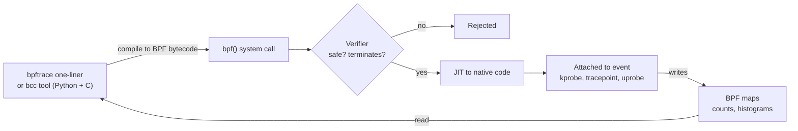

# Performance analysis

> **Level 6 · Chapter 2** · ⏱️ ~70 min read · Prerequisites: [Memory](../03-internals/03-memory.md), [Processes and signals](../03-internals/02-processes-and-signals.md), [Troubleshooting](../04-sysadmin/07-troubleshooting.md)

"The server is slow" is not a diagnosis. This chapter gives you a method for turning that complaint into a specific cause: the USE and RED methods, a 60-second first-look checklist, the `sysstat` tools (`iostat`, `mpstat`, `pidstat`, `sar`), CPU profiling with `perf` and flame graphs, and kernel tracing with eBPF.

## Why it matters

Alex's nightly ETL job, which loads the previous day's orders into the warehouse, usually takes 25 minutes. For three nights in a row it has taken over an hour, and the morning dashboards are late. The team's instinct is to "add more CPUs" to the VM, which costs money and takes a change request.

Alex logs in during the next run and spends one minute on a fixed checklist. `uptime` shows a load average of 9 on a 4-CPU machine. `vmstat 1` shows six processes in the `b` (blocked) column and 45% of CPU time in `wa` (waiting for I/O). `mpstat` shows the CPUs mostly *idle*. `iostat -xz 1` shows the data disk at 100% utilization with reads taking 38 ms each instead of the usual 2 ms. `pidstat -d 1` names the culprit: an `rsync` process reading 180 MB/s from the same disk. Someone had moved the backup timer from 04:00 to 02:00.

More CPUs would have changed nothing; the CPUs were idle. Moving the backup back fixed it for free. The lesson is not "check the disk". It is "follow a method", because a method checks every resource and finds the bottleneck whatever it turns out to be.

## Concepts

### Words you need

Performance work has precise vocabulary. Learn these first:

- **Latency**: how long one operation takes, such as a disk read or a web request. Measured in time (ms, µs).
- **Throughput**: how many operations or bytes per second get done (IOPS, MB/s, requests/s).
- **Utilization**: how busy a resource was over an interval, as a percentage of time (a CPU 70% busy) or of capacity.
- **Saturation**: work that is *waiting* because the resource is full: a run queue of threads waiting for a CPU, a queue of I/O requests waiting for a disk, memory pages being swapped out.
- **Errors**: failed operations: disk I/O errors, dropped packets, TCP retransmits, OOM kills.
- **Bottleneck**: the resource that limits overall performance. Speeding up anything else does nothing.

Saturation matters most. A resource can be 100% utilized and still fine (a batch job keeping a CPU busy). Once work starts queueing, latency climbs fast, and that is what users feel.

### The USE method

Brendan Gregg's **USE method** is a checklist: **for every resource, check Utilization, Saturation, and Errors.** Resources are the physical (and some software) components of the system: CPUs, memory, disks, network interfaces, plus things like file descriptors and the cgroup limits from the [Containers](01-containers-from-scratch.md) chapter.

The value of USE is that it is complete. Instead of looking where it's easy (the "streetlight anti-method"), you walk through every resource and tick it off. On Linux:

| Resource | Utilization | Saturation | Errors |
|---|---|---|---|
| CPU | `mpstat -P ALL 1` (100 − `%idle`), `vmstat` `us`+`sy` | `vmstat` `r` > CPU count, load average, `runqlat` | `perf` (machine-check), `dmesg` |
| Memory | `free -m` (`available`), `vmstat` `free` | `vmstat` `si`/`so` (swapping), PSI `/proc/pressure/memory`, OOM kills | `dmesg` (OOM, ECC errors) |
| Disk | `iostat -xz 1` `%util` | `iostat` `aqu-sz`, `r_await`/`w_await` | `dmesg` I/O errors, `smartctl` |
| Network | `sar -n DEV 1` vs link speed | `ss` send/receive queues, drops in `ip -s link` | `sar -n EDEV`, `sar -n ETCP` retransmits |
| Cgroup limits | `memory.current` vs `memory.max` | `cpu.stat` `nr_throttled`, `memory.pressure` | `memory.events` `oom_kill`, `pids.events` |

**PSI** (pressure stall information) is a newer kernel feature: `/proc/pressure/cpu`, `/proc/pressure/memory`, and `/proc/pressure/io` report the percentage of time tasks were stalled waiting for that resource. It's a direct saturation metric.

### The RED method

USE describes *resources*. For *services* (a web API, a database, a message queue consumer), Tom Wilkie's **RED method** is the matching checklist:

- **Rate**: requests per second.
- **Errors**: failed requests per second.
- **Duration**: how long requests take, as a distribution (median, 99th percentile), not just an average.

Use RED to find *which* service is slow from the user's point of view, then USE on the machine running it to find *why*.


### The 60-second checklist

In 2015 Brendan Gregg and the Netflix performance team published a list of ten commands to run in the first minute on a slow Linux machine. It's the USE method compressed into standard tools:

| # | Command | What it tells you |
|---|---|---|
| 1 | `uptime` | Load averages: is load rising or falling? |
| 2 | `dmesg -T | tail` | Recent kernel errors: OOM kills, I/O errors, dropped packets |
| 3 | `vmstat 1` | Run queue, blocked tasks, memory, swapping, CPU split |
| 4 | `mpstat -P ALL 1` | Per-CPU busy time: one hot CPU means a single-threaded bottleneck |
| 5 | `pidstat 1` | Which processes use CPU, in a rolling view |
| 6 | `iostat -xz 1` | Per-disk load, latency, and utilization |
| 7 | `free -m` | Memory use and the page cache |
| 8 | `sar -n DEV 1` | Network throughput per interface |
| 9 | `sar -n TCP,ETCP 1` | TCP connection rates and retransmits |
| 10 | `top` | A final overview to confirm what you've seen |

You'll run each one in the Commands section. Most come from the **sysstat** package, which is not installed by default on Mint or Ubuntu.

### How the CPU's time is accounted

Tools like `vmstat` and `mpstat` split CPU time into states. The important ones:

- **us / %usr**: running user-space code (your program).
- **sy / %sys**: running kernel code on behalf of programs (system calls, page faults).
- **wa / %iowait**: the CPU was idle *and* at least one task was waiting for disk I/O. This is a kind of idle time, not busy time. High `wa` hints at a disk problem, but it doesn't prove one.
- **st / %steal**: in a VM, time the hypervisor gave your virtual CPU to someone else. High steal means a noisy neighbour on the host.
- **id / %idle**: nothing to do.
- **%irq / %soft**: handling hardware interrupts and softirqs (often network packets).

The **load average** (from `uptime`) is the average number of tasks that are runnable *or* in uninterruptible sleep (state `D`, usually waiting for disk), over 1, 5, and 15 minutes. On Linux it includes disk waiters, so a high load with idle CPUs points at I/O.

### Sampling, tracing, and counting

Deeper tools work in one of three ways:

- **Counting**: the kernel or CPU counts events (instructions, cache misses, context switches) and you read totals. Very cheap. `perf stat` and `vmstat` work this way.
- **Sampling (profiling)**: interrupt the CPU N times per second and record what it was running (the instruction pointer and call stack). Statistical, cheap at low frequencies, and perfect for answering "where does the CPU time go?". `perf record` and `perf top` do this.
- **Tracing**: run a little bit of code on *every* occurrence of an event (every disk I/O, every `open()` call, every process exec). Precise, but cost scales with event rate. eBPF tools and `strace` do this.

`strace` is the classic tracer, but it uses `ptrace`, which stops the traced process twice per system call and can slow it 10× or more. eBPF tracing runs inside the kernel with no context switches, so it's safe to use on production systems.

### perf and hardware counters

**perf** (also called `perf_events`) is the official Linux profiler. It lives in the kernel source tree and talks to the kernel through the `perf_event_open()` system call. It can use:

- **Hardware events** from the CPU's **PMU** (performance monitoring unit): cycles, instructions, cache misses, branch misses. Often unavailable inside VMs.
- **Software events** from the kernel: `cpu-clock`, page faults, context switches.
- **Tracepoints**: stable hooks the kernel developers placed in the code, such as `block:block_rq_issue` or `sched:sched_switch`.
- **Probes**: dynamic hooks into any kernel function (**kprobes**) or user-space function (**uprobes**).

Because `perf` can reveal what other users' processes are doing, the kernel restricts it through `kernel.perf_event_paranoid`. Upstream values range from -1 (everything allowed) to 2 (users may profile only their own processes in user space). Ubuntu adds a stricter level, **4**, which is the default on Ubuntu 24.04 and Mint 22: unprivileged users can't use `perf_event_open()` at all. In practice you run `perf` with `sudo`.

For `perf` to show *function names*, it needs **symbols** (the mapping from addresses to names), and for call stacks it needs a way to walk the stack. The simplest way is **frame pointers**, a register that links each function's stack frame to its caller's. Many distributions compiled them out for a tiny speed gain, which broke profiling. Ubuntu 24.04 turned them back on for its packages, so stacks from Ubuntu-built programs and libraries are usually complete.

### Flame graphs

`perf report` gives you a long text tree. A **flame graph**, invented by Brendan Gregg, turns thousands of sampled stacks into one picture:

- Each box is a function. Boxes stacked on top of each other show the call chain (callers below, callees above).
- The **width** of a box is the share of samples in which that function was on the stack, so wide means "lots of CPU time".
- The x-axis is sorted alphabetically, **not** by time. Left-to-right order means nothing.
- Colours are random warm tones, chosen only to tell boxes apart.

You read a flame graph by looking for wide **plateaus** at the top: functions that are themselves on-CPU a lot. Then you look down the stack to see which code path called them.

### eBPF

**eBPF** (extended Berkeley Packet Filter) lets you load small programs into the running kernel and attach them to events: kprobes, uprobes, tracepoints, network hooks, perf events. It began as a packet filter (that's the `tcpdump` filter language) and grew into a general in-kernel virtual machine.



- The **verifier** checks every program before it runs: it must terminate (loops must be bounded), it may only read memory it is allowed to, and it can only call approved helper functions. A buggy eBPF program is rejected, not run, so it can't crash the kernel the way a buggy kernel module can.
- The **JIT** (just-in-time compiler) translates the verified bytecode into native machine code, so it runs at near-native speed.
- **Maps** are key-value stores shared between the kernel program and user space. A tool can count events or build a latency histogram *in the kernel* and copy only the summary out. That's why eBPF is cheap even for millions of events.

There are two main front ends:

- **bcc** (BPF Compiler Collection): a library plus about 100 ready-made tools written in Python with embedded C. On Ubuntu they're in the `bpfcc-tools` package and named with a `-bpfcc` suffix, such as `execsnoop-bpfcc`.
- **bpftrace**: a high-level language inspired by awk, for one-liners and short scripts. The `bpftrace` package also ships ready-made `.bt` tools such as `biolatency.bt`.

Loading eBPF tracing programs needs root (or `CAP_BPF` plus `CAP_PERFMON`). Ubuntu sets `kernel.unprivileged_bpf_disabled = 2`, so unprivileged users can't load them.

## Commands and examples

Install the tools first. All of these packages are in the standard Ubuntu archive that Mint uses:

```bash
sudo apt install sysstat linux-tools-common linux-tools-$(uname -r) bpfcc-tools bpftrace
```

| Package | Gives you |
|---|---|
| `sysstat` | `iostat`, `mpstat`, `pidstat`, `sar`, `sadf` |
| `linux-tools-$(uname -r)` | `perf` built for your exact running kernel |
| `linux-tools-common` | the `/usr/bin/perf` wrapper that picks the right version |
| `bpfcc-tools` | the bcc tools (`execsnoop-bpfcc`, `biolatency-bpfcc`, ...) |
| `bpftrace` | `bpftrace` and the `.bt` tools in `/usr/sbin` |

`linux-tools-$(uname -r)` must match your running kernel. After a kernel upgrade and reboot, `perf` complains `WARNING: perf not found for kernel 6.x.y-zz` until you install the matching package. Installing `linux-tools-generic` (or `linux-tools-generic-hwe-24.04` if you run the HWE kernel) keeps it updated automatically. bcc also needs `linux-headers-$(uname -r)` for some tools; it's usually already installed.

### 1. uptime: load averages

```bash
uptime
```

```text
 02:14:07 up 12 days,  3:41,  1 user,  load average: 9.12, 8.47, 4.03
```

The three numbers are the 1-, 5-, and 15-minute load averages. Compare them with the CPU count (`nproc`). Here, on a 4-CPU machine, load is more than double the CPU count *and rising* (9.12 now vs 4.03 over 15 minutes): something started recently. Load alone can't say whether it's CPU or disk. That's what the next commands are for.

### 2. dmesg: kernel messages

```bash
sudo dmesg -T | tail
```

```text
[Fri Oct  2 01:58:12 2026] Memory cgroup out of memory: Killed process 48211 (python3) total-vm:4210332kB, anon-rss:2091008kB, ...
[Fri Oct  2 02:03:40 2026] TCP: request_sock_TCP: Possible SYN flooding on port 8080. Sending cookies.
```

Look for OOM kills, I/O errors, and network warnings. `-T` turns the seconds-since-boot timestamps into wall-clock times. Ubuntu restricts `dmesg` to root by default (`kernel.dmesg_restrict = 1`); Mint relaxes this, but `sudo` always works, and `journalctl -k` is an alternative. The [Kernel basics](04-kernel-basics.md) chapter covers reading these messages in detail.

### 3. vmstat 1: the system at a glance

`vmstat` is in `procps` and always installed. The argument is the interval in seconds.

```bash
vmstat 1 5
```

```text
procs -----------memory---------- ---swap-- -----io---- -system-- -------cpu-------
 r  b   swpd   free   buff  cache   si   so    bi    bo   in   cs us sy id wa st gu
 2  6      0 214332  98112 1812440    0    0 23810  4120 3120 5212 12  5 38 45  0  0
 1  6      0 213908  98112 1812796    0    0 179440    96 4410 7980  9  6 40 45  0  0
 2  5      0 212876  98116 1813620    0    0 182016   112 4502 8121 10  6 39 45  0  0
 1  6      0 212604  98116 1814000    0    0 176128    88 4387 7902 10  5 40 45  0  0
 2  6      0 211960  98120 1814432    0    0 180224   104 4466 8010  9  6 40 45  0  0
```

The **first line is an average since boot**; ignore it for a live problem. Then column by column:

- **r**: runnable tasks (running or waiting for a CPU). If `r` stays above the CPU count, the CPUs are saturated. Here it's 1–2 on 4 CPUs: fine.
- **b**: tasks blocked in uninterruptible sleep, usually disk I/O. Six is a lot. This is saturation of something that isn't the CPU.
- **swpd / si / so**: swap used, and pages swapped in/out per second. Non-zero `si`/`so` that persist mean memory pressure. Here: zero.
- **free / buff / cache**: memory in KB. Low `free` is normal; Linux uses spare RAM as cache.
- **bi / bo**: blocks read from / written to disks per second (KB). 180,000 KB/s of reads is heavy.
- **in / cs**: interrupts and context switches per second.
- **us / sy / id / wa / st / gu**: CPU time split in percent: user, system, idle, I/O wait, steal, and guest (time running VMs, a newer column).

Verdict: CPUs mostly idle, 45% `wa`, many blocked tasks, huge reads. Look at the disks.

### 4. mpstat -P ALL 1: per-CPU balance

```bash
mpstat -P ALL 1 1
```

```text
Linux 6.8.0-45-generic (etl01)  10/02/2026  _x86_64_  (4 CPU)

02:14:31 AM  CPU    %usr   %nice    %sys %iowait    %irq   %soft  %steal  %guest  %gnice   %idle
02:14:32 AM  all    9.80    0.00    5.79   44.84    0.00    0.25    0.00    0.00    0.00   39.32
02:14:32 AM    0   12.12    0.00    6.06   46.46    0.00    1.01    0.00    0.00    0.00   34.34
02:14:32 AM    1    8.00    0.00    5.00   45.00    0.00    0.00    0.00    0.00    0.00   42.00
02:14:32 AM    2    9.18    0.00    6.12   43.88    0.00    0.00    0.00    0.00    0.00   40.82
02:14:32 AM    3   10.00    0.00    6.00   44.00    0.00    0.00    0.00    0.00    0.00   40.00
```

`-P ALL` shows every CPU separately. The pattern to look for is **imbalance**: one CPU at 100% `%usr` while the others idle means a single-threaded program is the bottleneck, and adding CPUs won't help. Here the load is spread evenly and dominated by `%iowait`.

### 5. pidstat 1: who is using the CPU

```bash
pidstat 1 3
```

```text
02:14:40 AM   UID       PID    %usr %system  %guest   %wait    %CPU   CPU  Command
02:14:41 AM  1001      4014    9.00    3.00    0.00    0.00   12.00     2  python3
02:14:41 AM     0      3988    4.00   11.00    0.00    1.00   15.00     0  rsync
02:14:41 AM     0       512    0.00    2.00    0.00    0.00    2.00     1  jbd2/sdb1-8
...
```

Unlike `top`, `pidstat` prints a new block every interval instead of clearing the screen, so you can scroll back and compare. `%wait` is time the process was runnable but waiting for a CPU (CPU saturation for that process). Two very useful variants:

- `pidstat -d 1`: per-process disk I/O (`kB_rd/s`, `kB_wr/s`, `iodelay`).
- `pidstat -r 1`: per-process memory and page faults.
- `pidstat -t -p PID 1`: per-thread breakdown of one process.

### 6. iostat -xz 1: disks in detail

```bash
iostat -xz 1 2
```

```text
Linux 6.8.0-45-generic (etl01)  10/02/2026  _x86_64_  (4 CPU)

avg-cpu:  %user   %nice %system %iowait  %steal   %idle
           9.81    0.00    5.79   44.84    0.00   39.56

Device            r/s     rkB/s   rrqm/s  %rrqm r_await rareq-sz     w/s     wkB/s   wrqm/s  %wrqm w_await wareq-sz     d/s     dkB/s   drqm/s  %drqm d_await dareq-sz     f/s f_await  aqu-sz  %util
sda              0.00      0.00     0.00   0.00    0.00     0.00    4.00     48.00     8.00  66.67    0.75    12.00    0.00      0.00     0.00   0.00    0.00     0.00    2.00    0.50    0.00   0.40
sdb            206.00 179440.00     2.00   0.96   38.21   871.07    9.00     96.00     3.00  25.00    4.11    10.67    0.00      0.00     0.00   0.00    0.00     0.00    0.00    0.00    7.91 100.00
```

`-x` shows extended statistics, `-z` hides idle devices, and `1` is the interval. The first report is since boot, as with `vmstat`. The columns come in groups for reads (`r`), writes (`w`), discards (`d`, TRIM on SSDs), and flushes (`f`):

| Column | Meaning | How to read it |
|---|---|---|
| `r/s`, `w/s` | Read / write requests completed per second (IOPS) | Compare with what the device can do |
| `rkB/s`, `wkB/s` | Throughput in KB/s | 179,440 KB/s ≈ 175 MB/s of reads |
| `rrqm/s`, `%rrqm` | Requests merged before reaching the device | High merging means sequential I/O |
| `r_await`, `w_await` | Average time per request in ms, **including time queued** | The latency your applications feel. 38 ms for an SSD is terrible; ~0.1–2 ms is normal |
| `rareq-sz`, `wareq-sz` | Average request size in KB | 871 KB reads: large sequential reads (like `rsync`) |
| `aqu-sz` | Average queue length (requests in flight or waiting) | Above 1 on a single spinning disk means queueing; this is your **saturation** metric |
| `%util` | Percent of time the device had at least one request in progress | See the caveat below |

Older versions of `iostat` had a single `await` column (reads and writes together) and an `svctm` column. `svctm` was removed because it was never accurate. If you read an old tutorial that uses them, map `await` to `r_await`/`w_await`.

!!! warning "Common mistake: trusting %util on SSDs and arrays"
    `%util` measures how much of the time the device was *busy at all*, not how much of its *capacity* was used. A spinning disk does one thing at a time, so 100% there really means saturated. An NVMe SSD or a RAID array can serve dozens of requests in parallel; it can show 100% `%util` while having plenty of headroom. On those devices, judge saturation by `aqu-sz` and by `r_await`/`w_await` rising above their normal values.

Here `sdb` has 7.9 requests queued, 38 ms reads, and 100% utilization. It's saturated.

### 7. free -m: memory

```bash
free -m
```

```text
               total        used        free      shared  buff/cache   available
Mem:            7940        5410         209          12        2320        2264
Swap:           2047           0        2047
```

The column that matters is **available**: an estimate of how much memory new work can get without swapping, counting page cache that can be dropped. Low `free` is normal. Low `available` together with swap activity in `vmstat` is a memory problem. Here: 2.2 GB available and no swap use. Memory is fine.

### 8. sar -n DEV 1: network throughput

```bash
sar -n DEV 1 1
```

```text
02:15:02 AM     IFACE   rxpck/s   txpck/s    rxkB/s    txkB/s   rxcmp/s   txcmp/s  rxmcst/s   %ifutil
02:15:03 AM        lo     12.00     12.00      1.02      1.02      0.00      0.00      0.00      0.00
02:15:03 AM      ens3    310.00    295.00     41.17     38.50      0.00      0.00      0.00      0.03
```

Compare `rxkB/s` and `txkB/s` with the link speed (`ethtool ens3` shows it). `%ifutil` does that for you when the kernel knows the speed. Here the network is nearly idle.

### 9. sar -n TCP,ETCP 1: TCP health

```bash
sar -n TCP,ETCP 1 1
```

```text
02:15:10 AM  active/s passive/s    iseg/s    oseg/s
02:15:11 AM      2.00      0.00    305.00    290.00

02:15:10 AM  atmptf/s  estres/s retrans/s isegerr/s   orsts/s
02:15:11 AM      0.00      0.00      0.00      0.00      0.00
```

- **active/s**: outbound connections opened per second (this host called `connect()`).
- **passive/s**: inbound connections accepted per second.
- **retrans/s**: TCP segments retransmitted per second. Persistent retransmits mean packet loss: a bad link, a saturated network, or a struggling remote host.

### 10. top: the overview

Finish with `top` (or `htop`) to confirm the picture: which processes are at the top, what state they're in (`D` = uninterruptible disk wait), and whether anything you missed jumps out. You covered `top` in [Processes and signals](../03-internals/02-processes-and-signals.md).

### Enabling sar history

The `sar` commands above read live data. The real power of `sar` is **history**: with collection enabled, the system records a snapshot every 10 minutes, so you can ask "what did the disk look like at 02:00 last night?" after the fact.

```bash
sudo sed -i 's/^ENABLED="false"/ENABLED="true"/' /etc/default/sysstat
sudo systemctl enable --now sysstat
systemctl list-timers 'sysstat*'
```

```text
NEXT                         LEFT LAST PASSED UNIT                    ACTIVATES
Fri 2026-10-02 02:20:00 IST  4min -    -      sysstat-collect.timer   sysstat-collect.service
Sat 2026-10-03 00:07:00 IST 21h   -    -      sysstat-summary.timer   sysstat-summary.service
```

`sudo dpkg-reconfigure sysstat` does the same as the `sed` through a question prompt. Data goes into daily binary files `/var/log/sysstat/saDD` (DD = day of the month). Read them back with `-f`, and narrow the time with `-s` (start) and `-e` (end):

```bash
sar -d -p -f /var/log/sysstat/sa01 -s 01:50:00 -e 03:00:00
```

```text
01:50:00 AM       DEV       tps     rkB/s     wkB/s     dkB/s   areq-sz    aqu-sz     await     %util
02:00:00 AM       sda      3.10      0.00     41.20      0.00     13.29      0.00      0.81      0.30
02:00:00 AM       sdb     55.40  11904.12    850.33      0.00    230.23      0.31      2.05     21.70
02:10:00 AM       sdb    188.90 162210.55     94.02      0.00    859.21      7.12     36.80     99.10
...
```

`-d` selects disks and `-p` prints friendly device names. Other handy reports: `sar -u` (CPU), `sar -r` (memory), `sar -q` (run queue and load), `sar -n DEV` (network). `sadf` converts the files to CSV or JSON for your own analysis.

### perf stat: counting events

!!! note "perf needs sudo on Ubuntu and Mint"
    With the default `kernel.perf_event_paranoid = 4`, running `perf` as a normal user prints `Access to performance monitoring and observability operations is limited`. Use `sudo perf ...`. On your own lab machine you can lower the setting until the next reboot with `sudo sysctl kernel.perf_event_paranoid=2`, which lets users profile their own processes.

```bash
sudo perf stat -- gzip -k -f orders-2026-10-01.csv
```

```text
 Performance counter stats for 'gzip -k -f orders-2026-10-01.csv':

          1,532.41 msec task-clock                       #    0.998 CPUs utilized
                 9      context-switches                 #    5.873 /sec
                 0      cpu-migrations                   #    0.000 /sec
               142      page-faults                      #   92.664 /sec
     5,961,239,812      cycles                           #    3.890 GHz
    12,804,113,207      instructions                     #    2.15  insn per cycle
     1,987,224,155      branches                         #    1.297 G/sec
        41,632,887      branch-misses                    #    2.10% of all branches

       1.535470219 seconds time elapsed

       1.497331000 seconds user
       0.035982000 seconds sys
```

- **task-clock** and **CPUs utilized**: gzip kept one CPU busy the whole time. It's CPU-bound and single-threaded.
- **insn per cycle** (IPC): instructions completed per CPU cycle. Above ~1 is generally good; well below 1 often means the CPU is stalled waiting on memory (cache misses).
- **branch-misses**: how often the CPU guessed wrong about an `if`. 2% is normal.

Inside VMs you may see `<not supported>` for `cycles` and `instructions` because the hypervisor hides the PMU. Software events like `task-clock` still work. `perf stat -e` picks specific events, and `perf list` shows every event your system offers.

### perf top: live profile

```bash
sudo perf top
```

```text
Samples: 42K of event 'cpu-clock:ppp', 4000 Hz, Event count (approx.): 10512250000 lost: 0/0 drop: 0/0
Overhead  Shared Object                 Symbol
  23.41%  python3.12                    [.] _PyEval_EvalFrameDefault
   9.87%  libc.so.6                     [.] __memmove_avx_unaligned_erms
   6.12%  [kernel]                      [k] copy_user_enhanced_fast_string
   4.03%  _multiarray_umath.cpython...  [.] PyArray_...
...
```

A live, system-wide view of which functions are on-CPU right now. `[.]` marks user-space functions and `[k]` kernel functions. Press ++q++ to quit. `perf top -p PID` limits it to one process.

### perf record and perf report: a saved profile

```bash
sudo perf record -F 99 -g -p 4014 -- sleep 30
sudo perf report --stdio | head -30
```

```text
[ perf record: Woken up 3 times to write data ]
[ perf record: Captured and wrote 1.204 MB perf.data (2970 samples) ]
# Samples: 2K of event 'cpu-clock:ppp'
# Event count (approx.): 29700000000
#
# Children      Self  Command  Shared Object      Symbol
# ........  ........  .......  .................  ...............................
#
    61.20%     0.00%  python3  python3.12         [.] _PyEval_EvalFrameDefault
            |
            ---_PyEval_EvalFrameDefault
               |--38.47%--csv_reader_iternext
               |--14.02%--PyUnicode_DecodeUTF8
...
```

- `-F 99` samples 99 times per second per CPU. Using 99 instead of 100 avoids sampling in lockstep with timers that fire at exactly 100 Hz.
- `-g` records call stacks so you see *who called* the hot function.
- `-p 4014` profiles one process; `-a` profiles the whole system.
- `-- sleep 30` is just a timer: record for 30 seconds.
- **Self** is time spent in the function itself; **Children** includes everything it called.

`perf record` writes `perf.data` in the current directory. Interactive `perf report` (without `--stdio`) lets you expand stacks with the arrow keys.

!!! tip "Profiling Python code with perf"
    `perf` normally shows only the C functions of the Python interpreter (`_PyEval_EvalFrameDefault`), not your Python functions. Python 3.12 (the version on Ubuntu 24.04) can expose Python function names to perf: run your script with `python3 -X perf script.py` and the profile shows entries like `py::load_orders:/opt/etl/load.py`.

### Flame graphs

Brendan Gregg's original FlameGraph scripts are the standard way to turn `perf` output into an SVG:

```bash
git clone --depth 1 https://github.com/brendangregg/FlameGraph ~/FlameGraph
sudo perf record -F 99 -a -g -- sleep 30
sudo perf script > out.perf
~/FlameGraph/stackcollapse-perf.pl out.perf > out.folded
~/FlameGraph/flamegraph.pl out.folded > cpu-flame.svg
xdg-open cpu-flame.svg
```

The pipeline has three stages:

1. `perf script` prints every sample with its full stack, as text.
2. `stackcollapse-perf.pl` **folds** each stack into one line: `python3;main;load_orders;csv_reader_iternext 381`, where the number is how many samples had exactly that stack.
3. `flamegraph.pl` draws the folded stacks as an interactive SVG. Open it in a browser: hover for percentages, click a box to zoom in.

```text
                    ┌─────────────────────┐
                    │ PyUnicode_Decode    │       ← wide box at the top =
          ┌─────────┴─────────────────────┴─────┐   hot function (a "plateau")
          │ csv_reader_iternext                 │┌──────────┐
          ├─────────────────────────────────────┴┤ json_dump│
          │ load_orders                          ├──────────┤
          ├──────────────────────────────────────┴──────────┤
          │ main                                            │
          └─────────────────────────────────────────────────┘
            x-axis: alphabetical, NOT time.   width = share of CPU samples
```

The question a flame graph answers is "which code path uses the most CPU?". Here, most time is in CSV parsing and UTF-8 decoding under `load_orders`, so switching to a faster parser (or a binary format like Parquet) is the fix, not more hardware.

!!! warning "Common mistake: broken stacks"
    If your flame graph is a flat row of functions with `[unknown]` underneath, the stack walker couldn't follow the frames. Programs built without frame pointers need `perf record --call-graph dwarf` (bigger files, more overhead). JIT-compiled languages (Java, Node.js, Python without `-X perf`) need their own perf map support.

### eBPF: the bcc tools

All of these need `sudo`. Each answers one specific question that would be hard or expensive to answer otherwise. Press ++ctrl+c++ to stop the ones that run until interrupted.

**execsnoop: which programs are being started?** Short-lived processes never show up in `top` because they finish between refreshes. `execsnoop` traces every `execve()` call:

```bash
sudo execsnoop-bpfcc
```

```text
PCOMM            PID     PPID    RET ARGS
sh               4013    4012      0 /bin/sh -c /opt/etl/run.sh
run.sh           4013    4012      0 /opt/etl/run.sh
python3          4014    4013      0 /usr/bin/python3 /opt/etl/load.py --date 2026-10-01
gzip             4102    4014      0 /usr/bin/gzip -c /data/tmp/part-0001.csv
gzip             4103    4014      0 /usr/bin/gzip -c /data/tmp/part-0002.csv
...
```

If a machine has high CPU but `top` shows nothing busy, run `execsnoop`: it's often a script spawning thousands of tiny processes.

**opensnoop: which files are being opened?**

```bash
sudo opensnoop-bpfcc -n python3
```

```text
PID    COMM               FD ERR PATH
4014   python3             3   0 /data/incoming/orders-2026-10-01.csv
4014   python3            -1   2 /etc/etl/overrides.yaml
4014   python3             4   0 /data/tmp/part-0001.csv
```

`-n` filters by command name (`-p PID` by process). `ERR 2` is `ENOENT` (file not found). opensnoop is the quickest way to find out which config file a program actually reads, or why it says "file not found".

**biolatency: what does disk latency really look like?** Averages hide things. A histogram doesn't:

```bash
sudo biolatency-bpfcc -D 10 1
```

```text
Tracing block device I/O... Hit Ctrl-C to end.

disk = sdb
     usecs               : count     distribution
         0 -> 1          : 0        |                                        |
         2 -> 3          : 0        |                                        |
         4 -> 7          : 0        |                                        |
         8 -> 15         : 0        |                                        |
        16 -> 31         : 0        |                                        |
        32 -> 63         : 0        |                                        |
        64 -> 127        : 0        |                                        |
       128 -> 255        : 14       |                                        |
       256 -> 511        : 96       |**                                      |
       512 -> 1023       : 402      |**********                              |
      1024 -> 2047       : 610      |****************                        |
      2048 -> 4095       : 288      |*******                                 |
      4096 -> 8191       : 71       |*                                       |
      8192 -> 16383      : 133      |***                                     |
     16384 -> 32767      : 980      |*************************               |
     32768 -> 65535      : 1532     |****************************************|
     65536 -> 131071     : 211      |*****                                   |
```

`-D` gives one histogram per disk, `10 1` means one 10-second interval. This distribution is **bimodal**: one hump around 1–2 ms (normal reads) and a second around 16–65 ms (reads stuck behind a queue). An average of these two humps (around 20 ms) describes no actual request. Bimodal latency almost always means contention.

**tcplife: which TCP connections opened and closed, and how much did they move?**

```bash
sudo tcplife-bpfcc
```

```text
PID   COMM       LADDR           LPORT RADDR           RPORT TX_KB RX_KB MS
4014  python3    10.0.2.15       53412 10.0.5.20       5432     12  8840 9812.41
4120  curl       10.0.2.15       41180 10.0.5.31       443       0     1 214.55
```

One line per closed connection: who, from where to where, kilobytes sent and received, and how long it lived in milliseconds. Here the ETL job pulled 8.8 MB from PostgreSQL (port 5432) in under 10 seconds.

**runqlat: how long do threads wait for a CPU?**

```bash
sudo runqlat-bpfcc 10 1
```

```text
Tracing run queue latency... Hit Ctrl-C to end.

     usecs               : count     distribution
         0 -> 1          : 2208     |*******                                 |
         2 -> 3          : 11952    |****************************************|
         4 -> 7          : 6130     |********************                    |
         8 -> 15         : 1730     |*****                                   |
        16 -> 31         : 412      |*                                       |
        32 -> 63         : 88       |                                        |
        64 -> 127        : 21       |                                        |
```

**Run queue latency** is the time between a thread becoming runnable and actually getting a CPU. This is the direct measure of CPU saturation. Microseconds, as here, is healthy. Tens of milliseconds means the CPUs are oversubscribed or a cgroup `cpu.max` is throttling the workload.

About 100 more tools live in `/usr/sbin/*-bpfcc`. Worth knowing next: `biosnoop` (every disk I/O with latency and process), `ext4slower` (file operations slower than a threshold), `tcpconnect` (outgoing connections), `profile` (CPU stacks, like `perf record`), and `offcputime` (where threads spend time *blocked*).

### eBPF: bpftrace one-liners

bpftrace lets you ask your own questions. A program is `probe /filter/ { action }`. List available probes first:

```bash
sudo bpftrace -l 'tracepoint:syscalls:sys_enter_open*'
```

```text
tracepoint:syscalls:sys_enter_open
tracepoint:syscalls:sys_enter_open_by_handle_at
tracepoint:syscalls:sys_enter_open_tree
tracepoint:syscalls:sys_enter_openat
tracepoint:syscalls:sys_enter_openat2
```

Files opened, with the process name:

```bash
sudo bpftrace -e 'tracepoint:syscalls:sys_enter_openat { printf("%-16s %s\n", comm, str(args.filename)); }'
```

```text
Attaching 1 probe...
systemd-journal  /proc/412/status
python3          /data/tmp/part-0003.csv
cron             /etc/crontab
```

System calls counted per process (prints a summary map on ++ctrl+c++):

```bash
sudo bpftrace -e 'tracepoint:raw_syscalls:sys_enter { @[comm] = count(); }'
```

```text
Attaching 1 probe...
^C

@[cron]: 41
@[sshd]: 1203
@[rsync]: 88412
@[python3]: 191230
```

Distribution of read sizes for one process, as a power-of-two histogram:

```bash
sudo bpftrace -e 'tracepoint:syscalls:sys_exit_read /comm == "python3" && args.ret > 0/ { @bytes = hist(args.ret); }'
```

```text
@bytes:
[1]                   12 |                                                    |
[2, 4)                 0 |                                                    |
...
[4K, 8K)          201330 |@@@@@@@@@@@@@@@@@@@@@@@@@@@@@@@@@@@@@@@@@@@@@@@@@@@@|
[8K, 16K)             14 |                                                    |
```

Disk I/O size by process, at the block layer:

```bash
sudo bpftrace -e 'tracepoint:block:block_rq_issue { @[comm] = hist(args.bytes); }'
```

The pieces: `comm` (process name), `pid`, `args.*` (the tracepoint's fields, listed by `bpftrace -lv 'tracepoint:block:block_rq_issue'`), `@name` (a map, printed at exit), `count()`, `hist()`, `str()` (read a string from memory). Ready-made scripts live in `/usr/sbin/*.bt`, such as `sudo biolatency.bt`.

### A worked investigation

Here's the story from the start of the chapter as a complete session, showing how each step narrows the search.

**Step 1: confirm and scope (RED).** The job's own log shows each batch taking 3× longer than usual. No errors. So: a duration problem on the ETL host.

**Step 2: the 60-second checklist (USE).**

| Check | Finding | Conclusion |
|---|---|---|
| `uptime` | load 9.12 on 4 CPUs, rising | Something saturated, started recently |
| `dmesg -T | tail` | nothing new | No errors, no OOM |
| `vmstat 1` | `r` 1–2, `b` 6, `wa` 45%, `bi` 180 MB/s | CPU fine; tasks blocked on I/O |
| `mpstat -P ALL 1` | all CPUs ~40% idle, ~45% iowait | Not a single-thread CPU bottleneck |
| `iostat -xz 1` | `sdb`: `r_await` 38 ms, `aqu-sz` 7.9, `%util` 100 | **Disk `sdb` saturated** |
| `free -m` | 2.2 GB available, no swap | Memory fine |
| `sar -n DEV 1` | network near idle | Network fine |

**Step 3: who is using the disk?**

```bash
pidstat -d 1 3
```

```text
02:16:01 AM   UID       PID   kB_rd/s   kB_wr/s kB_ccwr/s iodelay  Command
02:16:02 AM     0      3988 180224.00      0.00      0.00      97  rsync
02:16:02 AM  1001      4014   2048.00     96.00      0.00     212  python3
```

`rsync` reads 176 MB/s. The ETL job (`python3`) reads only 2 MB/s but has the highest `iodelay` (clock ticks spent waiting for I/O): it's the victim.

**Step 4: confirm the latency shape.** `biolatency-bpfcc -D` shows the bimodal histogram from earlier: the job's small random reads are stuck in the queue behind `rsync`'s large sequential ones.

**Step 5: why now?**

```bash
systemctl list-timers --all | grep -i backup
sar -d -p -f /var/log/sysstat/sa28 -s 01:50:00 -e 03:00:00 | grep sdb
```

The backup timer fires at 02:00, and `sar` history from a week ago shows `sdb` at 20% utilization in the same window. `git log` on the configuration repository shows the timer's `OnCalendar=` changed from `04:00` to `02:00` three days ago.

**Step 6: fix and verify.** Move the backup back to 04:00, and make it polite in case the two ever overlap again by adding `IOSchedulingClass=idle` (the systemd equivalent of `ionice -c3`) and `IOWeight=10` to its service unit. The next night, `sar -d` for 02:00–03:00 shows `sdb` at 18% utilization and the job finishes in 24 minutes.

Notice what didn't happen: no guessing, no "add more CPUs", no restarting things. Each command either ruled a resource out or pointed at the next one.

## Exercises

### Exercise 1: Your machine's 60 seconds (easy)

Install `sysstat` and run the full 60-second checklist on your own machine while something is busy (for example, start `sha256sum` on a large ISO or `find / -type f > /dev/null 2>&1` in another terminal). For each of the ten commands, write one line: what resource it checked and whether that resource looked healthy.

??? success "Solution"

    ```bash
    sudo apt install sysstat
    uptime
    sudo dmesg -T | tail
    vmstat 1 5
    mpstat -P ALL 1 3
    pidstat 1 3
    iostat -xz 1 3
    free -m
    sar -n DEV 1 3
    sar -n TCP,ETCP 1 3
    top -b -n 1 | head -15
    ```

    A typical result with `find /` running:

    - `uptime`: load ~1–2 on 8 CPUs; not saturated.
    - `dmesg`: no recent errors.
    - `vmstat`: `b` = 1, `bi` in the thousands, `wa` a few percent: one process reading metadata from disk.
    - `mpstat`: one CPU busier than the rest (`find` is single-threaded), mostly `%sys` (kernel time walking directories).
    - `pidstat`: `find` at the top, mostly `%system`.
    - `iostat`: the root device (`nvme0n1` or `sda`) with high `r/s` but small `rareq-sz`: many small metadata reads.
    - `free`: `buff/cache` grows as directory entries are cached.
    - `sar -n DEV` / `TCP,ETCP`: quiet.
    - `top`: confirms `find` in state `D` or `R`.

    Run `find` a second time and compare: it's much faster and `iostat` is quiet, because the metadata is now in the cache.

### Exercise 2: Read an iostat line (easy)

Explain this `iostat -x` line for an NVMe SSD in your own words, and say whether the device is saturated:

```text
Device            r/s     rkB/s   rrqm/s  %rrqm r_await rareq-sz     w/s     wkB/s   wrqm/s  %wrqm w_await wareq-sz ...  aqu-sz  %util
nvme0n1       8200.00  32800.00     0.00   0.00    0.09     4.00  120.00   1920.00     0.00   0.00    0.21    16.00 ...    0.77  99.60
```

??? success "Solution"

    - 8,200 reads per second of 4 KB each (`rareq-sz` 4.00): small random reads, about 32 MB/s.
    - 120 writes per second of 16 KB.
    - Reads take 0.09 ms and writes 0.21 ms on average, including queue time. That's excellent latency for an SSD.
    - `aqu-sz` 0.77: less than one request outstanding on average. Nothing is queueing.
    - `%util` 99.6%: the device had *some* request in flight almost all the time.

    Not saturated. `%util` is near 100% only because there's almost always one request in progress, but an NVMe drive handles many requests in parallel. The low `aqu-sz` and tiny `r_await` show plenty of headroom. On a single spinning disk, the same `%util` would mean saturation.

### Exercise 3: perf stat two ways (medium)

Create a 200 MB file of random data in a scratch directory, then use `sudo perf stat` to compare `gzip -1` with `gzip -9` on it. Report elapsed time, CPUs utilized, and instructions per cycle for each, and explain the difference.

??? success "Solution"

    ```bash
    mkdir -p ~/lab/perf && cd ~/lab/perf
    head -c 200M /dev/urandom > random.bin
    sudo perf stat -- gzip -1 -c random.bin > /dev/null
    sudo perf stat -- gzip -9 -c random.bin > /dev/null
    ```

    ```text
     Performance counter stats for 'gzip -1 -c random.bin':
              4,012.33 msec task-clock     #    0.999 CPUs utilized
    ...
            4.016701113 seconds time elapsed

     Performance counter stats for 'gzip -9 -c random.bin':
              7,880.91 msec task-clock     #    0.999 CPUs utilized
    ...
            7.884302551 seconds time elapsed
    ```

    Both use exactly one CPU (`gzip` is single-threaded and CPU-bound; the file is in the page cache after the first `head`). `-9` searches harder for matches and takes about twice as long. Random data doesn't compress at all, so the extra work buys nothing: a nice reminder to measure before choosing "maximum compression". Your numbers will differ; inside a VM, `cycles` and `instructions` may show `<not supported>`, so compare `task-clock` instead.

### Exercise 4: Catch short-lived processes (medium)

Write a tiny script that runs `date > /dev/null` 500 times in a loop. Run it, and use `execsnoop-bpfcc` in another terminal to prove what it's doing. Then explain why `top` was useless for finding it.

??? success "Solution"

    ```bash
    cat > ~/lab/perf/spawner.sh <<'EOF'
    #!/usr/bin/env bash
    for i in $(seq 500); do date > /dev/null; done
    EOF
    chmod +x ~/lab/perf/spawner.sh
    ```

    Terminal 1:

    ```bash
    sudo execsnoop-bpfcc -n date
    ```

    Terminal 2:

    ```bash
    ~/lab/perf/spawner.sh
    ```

    ```text
    PCOMM            PID     PPID    RET ARGS
    date             93120   93119     0 /usr/bin/date
    date             93121   93119     0 /usr/bin/date
    date             93122   93119     0 /usr/bin/date
    ...
    ```

    Every `date` lives for about a millisecond. `top` samples the process list every few seconds, so each process is born and gone between samples, and you only see the CPU time charged to "nothing". `execsnoop` hooks the `execve()` system call in the kernel, so it sees every single one. Pipe it through `wc -l` to count them.

### Exercise 5: Your first flame graph (hard)

Generate a CPU flame graph of a whole-system workload. Use `stress-ng` or a Python loop as the load, record with `perf` at 99 Hz with stacks for 20 seconds, build the SVG with the FlameGraph scripts, and identify the widest plateau.

??? success "Solution"

    ```bash
    cd ~/lab/perf
    git clone --depth 1 https://github.com/brendangregg/FlameGraph
    python3 -X perf -c '
    import hashlib
    data = b"x" * 1_000_000
    while True:
        hashlib.sha256(data).hexdigest()
    ' &
    LOAD=$!
    sudo perf record -F 99 -a -g -- sleep 20
    kill $LOAD
    sudo perf script > out.perf
    ./FlameGraph/stackcollapse-perf.pl out.perf > out.folded
    ./FlameGraph/flamegraph.pl out.folded > flame.svg
    xdg-open flame.svg
    grep -c . out.folded
    ```

    The widest tower is `python3`, and the plateau at its top is the SHA-256 code inside OpenSSL's `libcrypto` (a function with `sha256` in its name, such as `sha256_block_data_order_avx2`). Below it you see `py::<module>:<string>` (thanks to `-X perf`) and the interpreter's `_PyEval_EvalFrameDefault`. Everything else on the system is a thin sliver. Without `-X perf` you'd still see `libcrypto`, but no Python-level function names. Each line of `out.folded` ends with a sample count, so you can check the numbers behind the picture by sorting on that last field:

    ```bash
    awk '{print $NF, $1}' out.folded | sort -rn | head -3
    ```

## Check yourself

1. What do the letters in USE stand for, and why check saturation and not only utilization?

    ??? note "Answer"

        Utilization, Saturation, Errors, checked for every resource. Utilization says how busy a resource was; saturation says whether work was *waiting* for it. Queueing is what makes latency explode, and a resource can be fully utilized with no queue (fine) or less than fully utilized but with bursts that queue (not fine).

2. `vmstat 1` shows `r` = 1, `b` = 8, `wa` = 50, `id` = 45 on an 8-CPU server. Is the CPU the bottleneck? Where would you look next?

    ??? note "Answer"

        No. Only one task is runnable and CPUs are 45% idle. Eight tasks are blocked in uninterruptible sleep and half the time is I/O wait, which points at storage (or occasionally NFS). Next: `iostat -xz 1` to find the busy device, then `pidstat -d 1` to find the process.

3. Why is `%util` in `iostat` misleading for NVMe SSDs, and what should you use instead?

    ??? note "Answer"

        `%util` is the fraction of time the device had at least one request in flight. NVMe devices serve many requests in parallel, so they can be "100% utilized" with lots of spare capacity. Use `aqu-sz` (queue depth) and `r_await`/`w_await` compared with their normal values.

4. Why does `perf record` commonly use `-F 99` rather than `-F 100`?

    ??? note "Answer"

        To avoid sampling in lockstep with periodic activity that runs at 100 Hz (timers, scheduler ticks). Lockstep sampling would over- or under-count that activity and bias the profile.

5. In a flame graph, what does the width of a box mean, and what does the x-axis order mean?

    ??? note "Answer"

        Width is the proportion of samples in which that function (with that exact call path below it) was on the stack, so wide means more CPU time. The x-axis is sorted alphabetically to merge identical stacks; left-to-right order has no meaning, and in particular it is not time.

6. What does the eBPF verifier guarantee, and why does that make eBPF safer than a kernel module?

    ??? note "Answer"

        It checks, before loading, that the program terminates, only accesses memory it's allowed to, and only calls approved helper functions. Programs that fail are rejected. A kernel module runs arbitrary native code with no checks, so a bug can crash or corrupt the kernel.

7. You need `perf` on a fresh Ubuntu 24.04 server. Which package, and why does it have the kernel version in its name?

    ??? note "Answer"

        `linux-tools-$(uname -r)` (plus `linux-tools-common`). `perf` lives in the kernel source tree and is built per kernel version, because it relies on kernel interfaces and data structures that change between versions. Installing `linux-tools-generic` keeps it in step with kernel upgrades.

8. What does `biolatency` give you that the `r_await` column of `iostat` can't?

    ??? note "Answer"

        The full distribution of I/O latency as a histogram. `r_await` is an average, which can describe no real request when latency is bimodal (for example, fast reads plus reads stuck behind a queue). The histogram shows the two humps and so reveals contention.

## Key takeaways

- Follow a method. USE (utilization, saturation, errors for every resource) finds the bottleneck; RED (rate, errors, duration) finds the slow service.
- The 60-second checklist (`uptime`, `dmesg`, `vmstat`, `mpstat`, `pidstat`, `iostat`, `free`, `sar -n DEV`, `sar -n TCP,ETCP`, `top`) covers every major resource in a minute.
- Install `sysstat` and enable collection so `sar` can answer "what happened at 02:00 last night?".
- In `iostat -x`, watch `r_await`/`w_await` and `aqu-sz`; treat `%util` with care on SSDs and arrays.
- `perf stat` counts, `perf top`/`perf record` sample; flame graphs turn samples into a picture where width means CPU time.
- eBPF tools (`bpfcc-tools`, `bpftrace`) trace kernel events safely and cheaply; most need `sudo`, as does `perf` on Ubuntu.

## Next

Performance tools show you what a system does. Next you'll learn how to limit what it is *allowed* to do: [Security](03-security.md).
