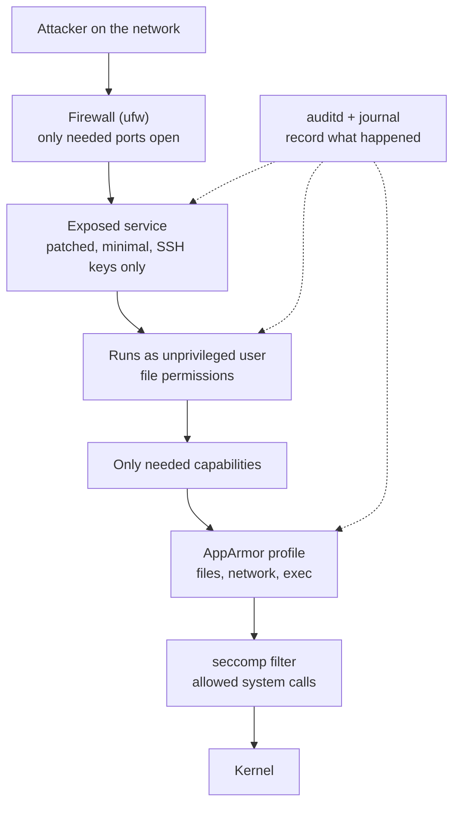

# Security

> **Level 6 · Chapter 3** · ⏱️ ~70 min read · Prerequisites: [Users, groups, and sudo](../00-first-steps/06-users-groups-sudo.md), [Permissions](../01-command-line/03-permissions.md), [SSH](../04-sysadmin/05-ssh.md), [Firewalls with ufw](../04-sysadmin/04-firewall-ufw.md)

Linux security is built in layers, and each layer assumes the one before it might fail. This chapter walks through those layers from the inside out: users and `sudo`, capabilities, mandatory access control with AppArmor, system call filtering with seccomp, auditing with `auditd`, and the operational habits (updates, exposed services, SSH, fail2ban) that stop most real attacks. It ends with a hardening checklist you can apply to any server.

## Why it matters

Alex's team runs a small internal web app that renders PDF reports. It's written in Python, runs as root "because it needed port 443", and uses an old PDF library. One Monday, the security team reports that the server has been making outbound connections to an unknown IP all weekend.

The investigation is short and painful. An attacker sent a crafted file that exploited the PDF library, got a shell *as root* (because the app was root), added an SSH key to `/root/.ssh/authorized_keys`, and installed a cryptocurrency miner. Nobody noticed because nothing was watching `/root/.ssh` and nobody reviewed which ports were open.

Now replay it with the layers from this chapter. The app runs as an unprivileged user with only `CAP_NET_BIND_SERVICE` to bind port 443. An AppArmor profile allows it to read its templates and write to `/var/lib/reports`, nothing else. The exploit still works, but the shell it gets can't write to `/root`, can't install anything, and can't read other users' files. An `auditd` rule on SSH key files and a weekly `ss -tulpn` review would have caught anything that slipped through. Same bug, a non-event instead of an incident.

## Concepts

### The threat model for a Linux box

A **threat model** is a short, honest list of what you're protecting, from whom, and how they could get in. Without one you either harden nothing or harden everything badly. For a typical Linux server or workstation:

- **Assets**: data (databases, customer files, credentials), the machine's resources (CPU for miners, bandwidth for spam), and its position on the network (a foothold to reach other machines).
- **Attackers**: automated internet scanners (the vast majority), opportunistic attackers exploiting known bugs, malicious or careless insiders, and malware arriving through software you install.
- **Entry points**: network services listening on ports, SSH with weak passwords, vulnerable application code, malicious packages or scripts (`curl ... | sudo bash`), and physical access.

From that, the core principles follow:

- **Least privilege**: every user, process, and service gets only the permissions it needs, nothing more.
- **Defense in depth**: several independent layers, so one failure isn't a disaster.
- **Reduce attack surface**: fewer installed packages, fewer listening services, fewer users with `sudo`.
- **Detect, don't just prevent**: logs and audit trails so you notice when something gets through.
- **Patch promptly**: most real-world compromises use bugs that already had fixes.



### Users and permissions: the first layer

You learned the basics in [Users, groups, and sudo](../00-first-steps/06-users-groups-sudo.md) and [Permissions](../01-command-line/03-permissions.md). The security-relevant points:

- Linux's traditional model is **DAC** (discretionary access control): the *owner* of a file decides who can access it, via `rwx` bits and ACLs. The kernel checks the process's UID and GIDs against them.
- **Root (UID 0)** traditionally bypasses DAC entirely. Anything running as root can read every file and do almost anything. That's why "runs as root" is the most dangerous property a service can have.
- **Service accounts**: every daemon should run as its own user (`www-data`, `postgres`, `etl`). A compromise of one service then can't read another's files.
- **setuid programs** (`-rwsr-xr-x`, like `passwd` and `sudo`) run as their file's owner, usually root. Each one is a potential privilege escalation path, so keep the list short: `find / -xdev -perm -4000 -type f 2>/dev/null`.
- **umask** and file modes: secrets (keys, `.env` files, database passwords) should be `600` or `640`, never world-readable.

### sudo hardening

`sudo` lets permitted users run commands as root, with logging. Its policy lives in `/etc/sudoers` and in drop-in files under `/etc/sudoers.d/`. Always edit them with `visudo` (or `visudo -f /etc/sudoers.d/name`), which checks syntax before saving. A syntax error in sudoers can lock everyone out of `sudo`.

On Ubuntu and Mint, members of the `sudo` group get full root access (`%sudo ALL=(ALL:ALL) ALL`). Hardening means narrowing that:

- **Grant specific commands, not ALL.** A deployment user that only restarts one service doesn't need a root shell.
- **Avoid `NOPASSWD: ALL`.** It turns any compromise of that account into instant root. If automation needs passwordless sudo, limit it to exact commands.
- **Beware of shell escapes.** Many programs can start a shell: `vim` (`:!sh`), `less` (`!sh`), `find -exec`, `tar --to-command`, `awk`, `python3`, `git` with a pager. Granting `sudo vim /etc/nginx/nginx.conf` grants root. Use `sudoedit` instead, which copies the file, runs your editor *as you*, and copies it back.
- **Use full paths** in rules (`/usr/bin/systemctl`), so a user can't put their own `systemctl` earlier in `PATH`.
- **Useful `Defaults`**: `use_pty` (runs commands in a new pseudo-terminal so background processes can't hijack your terminal; already on by default in Ubuntu 24.04), `logfile=/var/log/sudo.log` (a dedicated log), `timestamp_timeout=5` (minutes before asking for the password again), and `passwd_tries=3`.

`sudo -l` shows what the current user may run. Every `sudo` use is logged to the journal (`journalctl _COMM=sudo`).

### Capabilities: splitting root into pieces

Root's power is all-or-nothing in the traditional model. **Capabilities** split it into about 41 separate privileges (`cat /proc/sys/kernel/cap_last_cap` prints the highest number, 40 on current kernels) that can be granted individually to processes and files. A web server that needs to bind port 443 can get `CAP_NET_BIND_SERVICE` and nothing else, instead of full root.

The capabilities you'll meet most often:

| Capability | Allows | Notes |
|---|---|---|
| `CAP_NET_BIND_SERVICE` | Binding to ports below 1024 | The classic one for web servers |
| `CAP_NET_RAW` | Raw and packet sockets | `ping`, `tcpdump`; also enables spoofing packets |
| `CAP_NET_ADMIN` | Network configuration: interfaces, routes, firewall | Effectively network root |
| `CAP_SYS_ADMIN` | A huge grab-bag: `mount`, namespaces, many `ioctl`s, BPF on older kernels | Often called "the new root". Treat as full root |
| `CAP_SYS_PTRACE` | Tracing and inspecting any process (`strace`, `gdb -p`) | Can read other processes' memory, including secrets |
| `CAP_SYS_MODULE` | Loading kernel modules | Equals full kernel control |
| `CAP_DAC_OVERRIDE` | Bypassing file read/write/execute permission checks | Reads `/etc/shadow` |
| `CAP_DAC_READ_SEARCH` | Bypassing read permission and directory search checks | Used by backup tools |
| `CAP_CHOWN`, `CAP_FOWNER` | Changing file owners; bypassing owner checks | |
| `CAP_SETUID`, `CAP_SETGID` | Changing UID/GID | Can become any user, including root |
| `CAP_KILL` | Sending signals to any process | |
| `CAP_SYS_TIME` | Setting the system clock | |
| `CAP_SYS_NICE`, `CAP_SYS_RESOURCE` | Raising priority; exceeding resource limits | |
| `CAP_SYS_BOOT` | Rebooting | |
| `CAP_BPF`, `CAP_PERFMON` | Loading BPF programs; using `perf` | Split out of `CAP_SYS_ADMIN` in kernel 5.8 |
| `CAP_SYSLOG` | Reading the kernel log when restricted | |
| `CAP_AUDIT_WRITE`, `CAP_AUDIT_CONTROL` | Writing audit records; changing audit rules | |

Several capabilities are "root-equivalent": with `CAP_SYS_ADMIN`, `CAP_SYS_MODULE`, `CAP_SETUID`, `CAP_DAC_OVERRIDE` (write `/etc/passwd`), or `CAP_SYS_PTRACE` (inject into a root process), an attacker can get full root. Granting one of those is not least privilege.

Every process has five **capability sets**, shown in `/proc/PID/status`:

- **Effective (CapEff)**: what the kernel actually checks right now.
- **Permitted (CapPrm)**: the most the process may switch on in Effective.
- **Inheritable (CapInh)** and **Ambient (CapAmb)**: what survives `execve()` into a new program. Ambient is the practical one; systemd's `AmbientCapabilities=` sets it.
- **Bounding (CapBnd)**: an upper limit that can never be exceeded, even by running a file with capabilities. Container runtimes shrink this.

**File capabilities** are stored on an executable in an extended attribute (`security.capability`) and granted when it runs, like a fine-grained setuid bit. Each is written as `cap_name=flags`, where `e` = effective, `p` = permitted, `i` = inheritable. `cap_net_raw=ep` means "when this runs, put `CAP_NET_RAW` in permitted and switch it on".


### Mandatory access control: AppArmor

DAC has a weakness: it trusts the process. If a program running as `www-data` is exploited, the attacker can do anything `www-data` can do, including reading every world-readable file on the system. **MAC** (mandatory access control) adds rules that are set by the administrator and enforced by the kernel *regardless* of file ownership. Even root inside a confined program is bound by them.

Linux implements MAC through **LSMs** (Linux Security Modules), hooks throughout the kernel that ask a security module "may this process do this?". The two big ones:

- **AppArmor**: the default on Ubuntu, Mint, Debian, and SUSE. Rules are attached to **programs by path** and describe what each program may access, also by path.
- **SELinux**: the default on Fedora, RHEL, CentOS Stream, and Android. Every file, process, and port carries a **label** (a security context like `system_u:object_r:httpd_sys_content_t:s0`), and a central policy says which labels may access which. More powerful and fine-grained, but much harder to learn and debug. You'll meet `getenforce`, `ls -Z`, and `restorecon` on Red Hat-family systems.

An AppArmor **profile** is a text file in `/etc/apparmor.d/` that lists what one program may do: which files it may read (`r`), write (`w`), memory-map executable (`m`), and execute (and how), which capabilities it may use, and which kinds of network sockets it may open. Anything not listed is denied.

Each profile is in one of these **modes**:

- **enforce**: violations are blocked *and* logged.
- **complain**: violations are allowed but logged. Used while developing a profile.
- **unconfined** (`flags=(unconfined)`): the profile exists only to give the program a name or a specific permission (such as creating user namespaces). Nothing is restricted.

Profiles are loaded into the kernel by `apparmor_parser` at boot (by `apparmor.service`). A process that isn't covered by a loaded profile runs as `unconfined`.

When AppArmor denies something, the kernel logs a line like this to the kernel log (and to `/var/log/audit/audit.log` if `auditd` is installed):

```text
audit: type=1400 audit(1790935215.442:318): apparmor="DENIED" operation="open" class="file" profile="tcpdump" name="/home/alex/.ssh/id_ed25519" pid=24411 comm="tcpdump" requested_mask="r" denied_mask="r" fsuid=0 ouid=1000
```

Read it field by field: `apparmor="DENIED"` (blocked; `ALLOWED` means complain mode), `operation` (what was attempted), `profile` (which profile), `name` (the target), `comm` (the process), and `denied_mask` (`r` read, `w` write, `x` execute, and so on).

### seccomp: filtering system calls

Every privileged thing a program does goes through a system call (see [System calls and strace](../05-programming/01-system-calls-strace.md)). **seccomp** (secure computing mode) lets a process install a filter on its own system calls that it can never remove. Every later system call is checked against the filter, which can allow it, make it fail with an error such as `EPERM`, or kill the process with `SIGSYS`.

- **Mode 1 (strict)**, the original from 2005, allows only `read`, `write`, `exit`, and `sigreturn`. Almost nothing uses it.
- **Mode 2 (filter)**, also called **seccomp-bpf**, runs a small BPF program on each call. This is what everyone uses: Docker, Chrome, Firefox, OpenSSH's privilege-separated child, and systemd services.

Filters are inherited by children and can only get stricter. A process must either have `CAP_SYS_ADMIN` or set **no_new_privs** first (a flag meaning "this process and its children can never gain privileges, even through setuid binaries"). `/proc/PID/status` shows `Seccomp: 0` (off), `1` (strict), or `2` (filter), plus `Seccomp_filters` (how many are stacked).

You rarely write seccomp filters by hand. You use them through systemd's `SystemCallFilter=`, Docker's profiles, or libraries like `libseccomp`.

### Auditing with auditd

AppArmor and seccomp prevent. **Auditing** records. The Linux **audit subsystem** is part of the kernel: it can log any system call, any access to a watched file, and every login and privilege change, with the identity of whoever did it. The `auditd` daemon writes these records to `/var/log/audit/audit.log`.

The key concept is the **audit UID (auid)**, also called the login UID. It's set when you log in and never changes, even through `sudo` or `su`. So when `sudo` turns you into root, records still say `auid=alex uid=root`. That's what makes audit logs useful for accountability.

Tools:

- `auditctl`: add, list, and delete rules in the running kernel.
- `/etc/audit/rules.d/*.rules` + `augenrules --load`: persistent rules, loaded at boot.
- `ausearch`: search the log by key, user, file, time, or event type.
- `aureport`: summary reports (logins, failed authentications, executables, files).

### File integrity, updates, and the outer layers

The remaining layers are less about kernel features and more about operations:

- **File integrity monitoring**: **AIDE** (Advanced Intrusion Detection Environment) records a database of checksums and attributes for system files, then reports anything that changed. It catches a replaced `/usr/bin/ssh` or a modified `/etc/sudoers` even if the attacker cleaned the logs.
- **Automatic security updates**: on Ubuntu, the `unattended-upgrades` package installs security updates daily. Linux Mint uses its Update Manager instead, which has an Automation setting for the same job.
- **Listening services**: every open port is attack surface. Review them regularly with `ss -tulpn` and remove or firewall what isn't needed.
- **SSH**: keys only, no root login, and a short list of allowed users (from [SSH](../04-sysadmin/05-ssh.md)).
- **fail2ban**: watches logs for repeated authentication failures and temporarily bans the source IP with a firewall rule. It reduces noise and slows brute-force attacks; it does not replace key-only SSH.

## Commands and examples

### Review users and privileged accounts

```bash
awk -F: '$3 == 0 {print $1}' /etc/passwd
getent group sudo
awk -F: '$7 !~ /(nologin|false)$/ {print $1, $7}' /etc/passwd
```

```text
root
sudo:x:27:alex
root /bin/bash
sync /bin/sync
alex /bin/bash
```

- Only `root` should have UID 0. Any other name here is a serious red flag (a classic backdoor).
- `getent group sudo` lists who can become root.
- The last command lists accounts with a real login shell. Service accounts should have `/usr/sbin/nologin`. (`sync` is a historical oddity with shell `/bin/sync`; it's harmless.)

Find setuid and setgid binaries:

```bash
find / -xdev \( -perm -4000 -o -perm -2000 \) -type f -printf '%M %u %p\n' 2>/dev/null | sort -k3
```

```text
-rwxr-sr-x root /usr/bin/chage
-rwsr-xr-x root /usr/bin/chfn
-rwsr-xr-x root /usr/bin/chsh
-rwxr-sr-x root /usr/bin/crontab
-rwxr-sr-x root /usr/bin/expiry
-rwsr-xr-x root /usr/bin/fusermount3
-rwsr-xr-x root /usr/bin/gpasswd
-rwsr-xr-x root /usr/bin/mount
-rwsr-xr-x root /usr/bin/newgidmap
-rwsr-xr-x root /usr/bin/newgrp
-rwsr-xr-x root /usr/bin/newuidmap
-rwsr-xr-x root /usr/bin/passwd
-rwsr-xr-x root /usr/bin/pkexec
-rwxr-sr-x root /usr/bin/plocate
-rwxr-sr-x root /usr/bin/ssh-agent
-rwsr-xr-x root /usr/bin/su
-rwsr-xr-x root /usr/bin/sudo
-rwsr-xr-x root /usr/bin/umount
-rwsr-xr-- root /usr/lib/dbus-1.0/dbus-daemon-launch-helper
...
```

An `s` in the owner's execute position means setuid; an `s` in the group's position means setgid (the program runs with the file's group, such as `shadow` for `chage` or `crontab` for `crontab`). Browsers installed from outside the archive add their own setuid `chrome-sandbox` helpers under `/opt`. Save this list on a fresh install. A new setuid file appearing later deserves investigation.

### sudo: least-privilege rules

!!! danger "⚠️ VM only"
    Practise sudoers changes in your VM first, and always keep a second root shell open while editing. A broken sudoers file means no one can use `sudo` until you fix it from a root shell or recovery mode.

Give the `deploy` user exactly two commands, without a password:

```bash
sudo visudo -f /etc/sudoers.d/deploy
```

```text
# /etc/sudoers.d/deploy
deploy  ALL=(root) NOPASSWD: /usr/bin/systemctl restart reportapp.service, /usr/bin/systemctl status reportapp.service
```

Read the rule as: user `deploy`, on `ALL` hosts, may run as `root`, without a password, exactly these command lines. Arguments are part of the match, so `systemctl restart nginx` is still refused. Check it:

```bash
sudo -l -U deploy
```

```text
User deploy may run the following commands on mint:
    (root) NOPASSWD: /usr/bin/systemctl restart reportapp.service, /usr/bin/systemctl status reportapp.service
```

Tighten global defaults in a separate file:

```text
# /etc/sudoers.d/00-hardening
Defaults  use_pty
Defaults  logfile="/var/log/sudo.log"
Defaults  timestamp_timeout=5
Defaults  passwd_tries=3
```

!!! warning "Common mistake: granting an editor with sudo"
    `alex ALL=(root) /usr/bin/vim /etc/nginx/nginx.conf` looks narrow, but inside vim `:!bash` gives a root shell. Grant `sudoedit /etc/nginx/nginx.conf` instead. `sudoedit` edits a temporary copy as the normal user and only the final copy-back runs as root.

### Capabilities: getcap, getpcaps, and /proc/PID/status

Which binaries carry file capabilities?

```bash
getcap -r /usr/bin /usr/sbin 2>/dev/null
```

```text
/usr/bin/mtr-packet cap_net_raw=ep
/usr/bin/ping cap_net_raw=ep
```

`ping` needs to send raw ICMP packets, which requires `CAP_NET_RAW`. Instead of being setuid root (as it was for decades), it carries only that one capability:

```bash
ls -l /usr/bin/ping
```

```text
-rwxr-xr-x 1 root root 89800 Jul 24  2025 /usr/bin/ping
```

No `s` bit. Prove the capability is what makes it work by copying it (a copy doesn't keep the extended attribute):

```bash
mkdir -p ~/lab/security && cd ~/lab/security
cp /usr/bin/ping ./myping
getcap ./myping
./myping -c1 127.0.0.1
```

```text
./myping: socktype: SOCK_RAW
./myping: socket: Operation not permitted
./myping: => missing cap_net_raw+p capability or setuid?
```

`getcap` prints nothing (no capabilities), and the copy fails to open the raw socket. Give it back the one capability it needs, try again, then remove it:

```bash
sudo setcap cap_net_raw=ep ./myping
getcap ./myping
./myping -c1 127.0.0.1 | head -2
sudo setcap -r ./myping
```

```text
./myping cap_net_raw=ep
PING 127.0.0.1 (127.0.0.1) 56(84) bytes of data.
64 bytes from 127.0.0.1: icmp_seq=1 ttl=64 time=0.031 ms
```

Now look at capabilities from the process side. Your shell:

```bash
grep Cap /proc/self/status
```

```text
CapInh:	0000000000000000
CapPrm:	0000000000000000
CapEff:	0000000000000000
CapBnd:	000001ffffffffff
CapAmb:	0000000000000000
```

Each line is a 64-bit mask in hex; bit N set means capability number N is in the set. A normal user has nothing effective or permitted. The bounding set allows everything. Decode a mask with `capsh`:

```bash
capsh --decode=000001ffffffffff | tr ',' '\n' | head -5
capsh --decode=0000000000003000
```

```text
0x000001ffffffffff=cap_chown
cap_dac_override
cap_dac_read_search
cap_fowner
cap_fsetid
cap_net_admin,cap_net_raw
```

`0x3000` is bits 12 and 13: `cap_net_admin` (12) and `cap_net_raw` (13). `0x1ffffffffff` has bits 0–40 set: all 41 capabilities.

Check a running process with `getpcaps`, for example `ping` while it runs:

```bash
ping -c 30 -i 0.2 127.0.0.1 > /dev/null &
sleep 1
getpcaps $!
grep CapEff /proc/$!/status
```

```text
164274: =
CapEff:	0000000000000000
```

Surprise: the running `ping` holds **no** capabilities. Modern `ping` opens its raw socket immediately at startup and then drops `CAP_NET_RAW`. It keeps using the already-open socket, but if an attacker found a bug in its packet parsing, there would be no privilege left to steal. That is least privilege done well. (`=` with nothing after it is `getpcaps`'s way of saying "empty".)

For services, don't use `setcap` on interpreters; use systemd instead. A unit that binds port 443 as an unprivileged user:

```ini
[Service]
User=reportapp
AmbientCapabilities=CAP_NET_BIND_SERVICE
CapabilityBoundingSet=CAP_NET_BIND_SERVICE
NoNewPrivileges=yes
```

`AmbientCapabilities=` hands the capability to the process even though it isn't root, and `CapabilityBoundingSet=` makes sure it can never gain any other.

!!! warning "Common mistake: setcap on python3"
    `sudo setcap cap_net_bind_service=ep /usr/bin/python3.12` "works", but now *every* Python script run by *any* user can bind privileged ports. File capabilities apply to whoever runs the file. Use systemd's `AmbientCapabilities=`, a reverse proxy, or a port above 1024.

### AppArmor: status and profiles

Is AppArmor on, and what is confined? `aa-status` needs root to list profiles:

```bash
sudo aa-status
```

```text
apparmor module is loaded.
121 profiles are loaded.
38 profiles are in enforce mode.
   /usr/bin/man
   /usr/lib/cups/backend/cups-pdf
   /usr/sbin/cups-browsed
   /usr/sbin/cupsd
   lsb_release
   nvidia_modprobe
   rsyslogd
   tcpdump
   unprivileged_userns
   ...
2 profiles are in complain mode.
   ...
81 profiles are in unconfined mode.
   brave
   chrome
   code
   firefox
   ...
3 processes have profiles defined.
3 processes are in enforce mode.
   /usr/sbin/cups-browsed (1625)
   /usr/sbin/cupsd (1241)
   /usr/sbin/rsyslogd (1016) rsyslogd
0 processes are in complain mode.
0 processes are unconfined but have a profile defined.
...
```

Many of the "unconfined mode" profiles are new in Ubuntu 24.04: they exist only to grant browsers and Electron apps permission to create user namespaces for their sandboxes (see the [Containers](01-containers-from-scratch.md) chapter). As a normal user you can still see the module state and each process's confinement:

```bash
cat /sys/module/apparmor/parameters/enabled
ps -eo pid,label,comm | grep -v ' unconfined ' | head
```

```text
Y
    PID LABEL                           COMMAND
   1016 rsyslogd (enforce)              rsyslogd
   1241 /usr/sbin/cupsd (enforce)       cupsd
   1625 /usr/sbin/cups-browsed (enforce) cups-browsed
```

The `LABEL` column shows the profile name and its mode. `cat /proc/PID/attr/current` shows the same for one process.

### Reading a profile

Open the `tcpdump` profile, a good, readable example:

```bash
sed -n '1,40p' /etc/apparmor.d/usr.bin.tcpdump
```

```text
# vim:syntax=apparmor
#include <tunables/global>

profile tcpdump /usr/bin/tcpdump {
  #include <abstractions/base>
  #include <abstractions/nameservice>
  #include <abstractions/user-tmp>

  capability net_raw,
  capability setuid,
  capability setgid,
  capability dac_override,
  capability chown,
  network raw,
  network packet,

  # for -D
  @{PROC}/bus/usb/ r,
  @{PROC}/bus/usb/** r,
  ...
  # for -F and -w
  audit deny @{HOME}/.* mrwkl,
  audit deny @{HOME}/.*/ rw,
  audit deny @{HOME}/.*/** mrwkl,
  audit deny @{HOME}/bin/ rw,
  audit deny @{HOME}/bin/** mrwkl,
  owner @{HOME}/ r,
  owner @{HOME}/** rw,
  ...
  /usr/bin/tcpdump mr,
```

Piece by piece:

- **`profile tcpdump /usr/bin/tcpdump {`**: the profile's name and the executable path it attaches to.
- **`#include <abstractions/base>`**: shared rule sets from `/etc/apparmor.d/abstractions/` (basic libraries, locale files, `/dev/null`, and so on). `nameservice` covers DNS and user lookups.
- **`capability net_raw,`**: even when run by root, tcpdump gets only these capabilities. Root without `capability sys_module` can't load modules under this profile.
- **`network raw, network packet,`**: socket types it may open.
- **`@{PROC}`, `@{HOME}`**: variables defined in `tunables/` (`/proc/`, and every user's home directory).
- **`/path r,`**: file rules. Permissions: `r` read, `w` write, `a` append, `l` link, `k` lock, `m` memory-map as executable, `x` execute. `*` matches within one directory level, `**` matches across levels.
- **`audit deny @{HOME}/.* mrwkl,`**: explicitly deny (and always log) access to dotfiles in home directories, so `tcpdump -w ~/.bashrc` can't overwrite your shell startup file, even as root.
- **`owner @{HOME}/** rw,`**: allowed only for files owned by the process's user.

Execute permissions say what happens to confinement when the program runs another: `ix` (inherit: child runs under the same profile), `px` (switch to the child's own profile, which must exist), `cx` (switch to a child profile inside this one), `ux` (run unconfined; avoid).

### Writing and testing a profile

!!! danger "⚠️ VM only"
    Run this in your throwaway VM. Loading, enforcing, and editing AppArmor profiles changes system security policy. A wrong profile for a system service can stop it from starting.

Install the profile tools (`aa-genprof`, `aa-logprof`, `aa-enforce`, `aa-complain`):

```bash
sudo apt install apparmor-utils
```

Create a small script to confine. It summarizes CSV files from `/srv/data` into `/srv/reports`:

```bash
sudo mkdir -p /srv/data /srv/reports
printf 'id,amount\n1,9.99\n2,25.00\n' | sudo tee /srv/data/orders.csv > /dev/null
sudo tee /usr/local/bin/report.sh > /dev/null <<'EOF'
#!/usr/bin/bash
out=/srv/reports/summary-$(date +%F).txt
for f in /srv/data/*.csv; do
    echo "$f: $(wc -l < "$f") lines"
done > "$out"
head -c 100 /home/alex/.ssh/id_ed25519 > /dev/null 2>&1 || echo "could not read SSH key (good)"
EOF
sudo chmod 755 /usr/local/bin/report.sh
```

The last line simulates a compromised script trying to steal a key. Now write a profile by hand:

```bash
sudo tee /etc/apparmor.d/usr.local.bin.report.sh > /dev/null <<'EOF'
abi <abi/4.0>,
include <tunables/global>

profile report /usr/local/bin/report.sh {
  include <abstractions/base>
  include <abstractions/bash>

  /usr/local/bin/report.sh r,
  /usr/bin/bash ix,
  /usr/bin/{wc,date,head} ix,

  /srv/data/ r,
  /srv/data/*.csv r,
  /srv/reports/ r,
  /srv/reports/* w,

  include if exists <local/report>
}
EOF
sudo apparmor_parser -r /etc/apparmor.d/usr.local.bin.report.sh
sudo /usr/local/bin/report.sh
cat /srv/reports/summary-*.txt
```

```text
could not read SSH key (good)
/srv/data/orders.csv: 3 lines
```

Even though the script ran with `sudo` as root, AppArmor stopped it reading the key, because the profile doesn't list it. For a shell script, the profile attaches to the script's path, and it must allow the interpreter (`/usr/bin/bash ix`) and every command the script runs. `apparmor_parser -r` loads or replaces a profile; `-R` removes it.

Find the denial in the kernel log:

```bash
sudo journalctl -k --since "5 min ago" | grep 'apparmor="DENIED"'
```

```text
Oct 02 14:31:07 mint kernel: audit: type=1400 audit(1790935267.118:402): apparmor="DENIED" operation="open" class="file" profile="report" name="/home/alex/.ssh/id_ed25519" pid=6120 comm="head" requested_mask="r" denied_mask="r" fsuid=0 ouid=1000
```

Switch modes while you work on it:

```bash
sudo aa-complain /etc/apparmor.d/usr.local.bin.report.sh   # log, don't block
sudo aa-enforce  /etc/apparmor.d/usr.local.bin.report.sh   # block again
```

Writing profiles by hand gets tedious for real programs. The interactive tools do the first draft:

1. `sudo aa-genprof /usr/local/bin/myapp` puts a new, empty profile in complain mode and waits.
2. In another terminal, use the program normally, exercising every feature.
3. Back in `aa-genprof`, press ++s++ to scan the log. For each access it asks whether to **A**llow, **D**eny, **G**lob (generalize the path with wildcards), or for executions **I**nherit/**P**rofile/**C**hild. Press ++f++ to finish; it saves the profile and puts it in enforce mode.
4. Later, when the program hits new denials, `sudo aa-logprof` reads the log and offers to add rules for them.

### seccomp in practice

Check whether a process is filtered:

```bash
grep -E 'NoNewPrivs|Seccomp' /proc/self/status
grep Seccomp: /proc/$(pgrep -x systemd-resolve)/status
```

```text
NoNewPrivs:	0
Seccomp:	0
Seccomp_filters:	0
Seccomp:	2
```

Your shell has no filter. `systemd-resolved` runs in filter mode, because its unit file sets `SystemCallFilter=`. systemd groups system calls into named sets you can inspect:

```bash
systemd-analyze syscall-filter @clock
```

```text
@clock
    # Change the system time
    adjtimex
    clock_adjtime
    clock_adjtime64
    clock_settime
    clock_settime64
    settimeofday
```

You can try filters safely as a normal user with a transient user unit. Block the `uname` system call and see what happens:

```bash
systemd-run --user --wait --collect -p SystemCallFilter=~uname uname -a
```

```text
Running as unit: run-u192.service; invocation ID: a6fe100a480244f79435b71e1167e129
Finished with result: core-dump
Main processes terminated with: code=dumped/status=SYS
Service runtime: 224ms
```

`~` means "deny this list". `--wait` waits for the unit to finish and reports how it ended, and `--collect` removes the transient unit afterwards even though it failed (otherwise it lingers as "failed" in `systemctl --user list-units --failed` until you run `systemctl --user reset-failed`). The default action kills the process with `SIGSYS` (`status=SYS`). Usually it's nicer to fail the call with an error the program can handle:

```bash
systemd-run --user --pipe --wait --quiet --collect -p SystemCallFilter=~uname -p SystemCallErrorNumber=EPERM uname -a
```

```text
/usr/bin/uname: cannot get system name: Operation not permitted
```

In a real service unit, the common, safe baseline is:

```ini
[Service]
NoNewPrivileges=yes
SystemCallFilter=@system-service
SystemCallErrorNumber=EPERM
SystemCallArchitectures=native
```

`@system-service` is a curated allow-list of the calls normal services need. `systemd-analyze security reportapp.service` scores a unit's sandboxing and lists what you could still tighten; run it without a unit name to rank every service on the box.

### auditd: watching /etc/passwd

!!! danger "⚠️ VM only"
    Run this in your throwaway VM. Audit rules change kernel behaviour for every process, and careless syscall rules can generate enough log volume to fill a disk or slow the machine.

```bash
sudo apt install auditd
sudo systemctl status auditd --no-pager | head -3
```

Add a **watch** rule: log writes (`w`) and attribute changes (`a`) to `/etc/passwd`, tagged with a key:

```bash
sudo auditctl -w /etc/passwd -p wa -k passwd_changes
sudo auditctl -w /etc/shadow -p wa -k passwd_changes
sudo auditctl -l
```

```text
-w /etc/passwd -p wa -k passwd_changes
-w /etc/shadow -p wa -k passwd_changes
```

- `-w PATH`: watch a file or directory.
- `-p wa`: which access types to log: `r` read, `w` write, `x` execute, `a` attribute change.
- `-k KEY`: a free-text tag that makes searching easy.

Trigger it, then search by key. `-i` interprets numbers into names (UIDs, syscalls, timestamps):

```bash
sudo useradd -m bob
sudo ausearch -k passwd_changes -i --start recent
```

```text
----
type=PROCTITLE msg=audit(10/02/2026 14:12:09.331:1043) : proctitle=useradd -m bob
type=PATH msg=audit(10/02/2026 14:12:09.331:1043) : item=3 name=/etc/passwd inode=1311050 dev=fd:00 mode=file,644 ouid=root ogid=root rdev=00:00 nametype=CREATE ...
type=PATH msg=audit(10/02/2026 14:12:09.331:1043) : item=2 name=/etc/passwd inode=1311021 dev=fd:00 mode=file,644 ouid=root ogid=root rdev=00:00 nametype=DELETE ...
type=CWD msg=audit(10/02/2026 14:12:09.331:1043) : cwd=/home/alex
type=SYSCALL msg=audit(10/02/2026 14:12:09.331:1043) : arch=x86_64 syscall=rename success=yes exit=0 ... items=4 ppid=5120 pid=5121 auid=alex uid=root gid=root euid=root ... tty=pts1 ses=3 comm=useradd exe=/usr/sbin/useradd subj=unconfined key=passwd_changes
...
```

One **event** is several records sharing the same timestamp and serial number (`:1043`). Read the `SYSCALL` record first:

- `syscall=rename success=yes`: `useradd` wrote a new copy of the file and renamed it over `/etc/passwd`. (That's why the `PATH` records show a `DELETE` of the old inode and a `CREATE` of the new one.)
- `auid=alex uid=root`: alex did this, through `sudo`, as root. The auid is the accountability trail.
- `exe=/usr/sbin/useradd`, `tty=pts1`, `ses=3`: which program, from which terminal and login session.
- `key=passwd_changes`: which rule matched.

Rules added with `auditctl` disappear at reboot. Make them persistent in a rules file:

```bash
sudo tee /etc/audit/rules.d/50-identity.rules > /dev/null <<'EOF'
-w /etc/passwd -p wa -k identity
-w /etc/shadow -p wa -k identity
-w /etc/group -p wa -k identity
-w /etc/sudoers -p wa -k sudoers
-w /etc/sudoers.d/ -p wa -k sudoers
-w /root/.ssh/ -p wa -k root_ssh
-a always,exit -F arch=b64 -S execve -F euid=0 -F auid>=1000 -F auid!=unset -k root_cmds
EOF
sudo augenrules --load
```

The last line is a **syscall rule**: on every `execve` (program start) where the effective UID is root but the login UID is a real user, log it. That records every command anyone runs through `sudo`. `auid!=unset` skips daemons that never logged in.

Summary reports:

```bash
sudo aureport --summary
sudo aureport -k --summary
```

```text
Summary Report
======================
Range of time in logs: 10/02/2026 09:00:01.120 - 10/02/2026 14:20:44.912
Selected time for report: 10/02/2026 09:00:01 - 10/02/2026 14:20:44.912
Number of changes in configuration: 12
Number of changes to accounts, groups, or roles: 4
Number of logins: 3
Number of failed logins: 17
Number of authentications: 9
Number of failed authentications: 2
...
Number of keys: 4
Number of events: 512

Key Summary Report
===========================
total  key
===========================
188  root_cmds
6  identity
2  sudoers
1  root_ssh
```

Other useful reports: `aureport -au` (authentication attempts), `aureport -l` (logins), `aureport -f` (file events), `aureport -x --summary` (most-run executables). With `auditd` installed, AppArmor denials also land in `/var/log/audit/audit.log`; search them with `sudo ausearch -m AVC,APPARMOR_DENIED -i`.

### File integrity with AIDE

```bash
sudo apt install aide
sudo aideinit
```

`aideinit` scans the system (this takes a few minutes) and writes the baseline database to `/var/lib/aide/aide.db`. Later, check for changes:

```bash
sudo aide --config /etc/aide/aide.conf --check
```

```text
AIDE found differences between database and filesystem!!
Summary:
  Total number of entries:      184311
  Added entries:                1
  Removed entries:              0
  Changed entries:              2
...
Changed entries:
f   ...    .C... : /usr/local/bin/report.sh
```

The Debian/Ubuntu package also installs a daily check that mails or logs the report. After legitimate changes (package updates), update the baseline, or AIDE will keep reporting them. Keep a copy of the database off the machine: an attacker with root could otherwise update it too.

### Automatic security updates

=== "Ubuntu (unattended-upgrades)"

    Ubuntu installs and enables `unattended-upgrades` by default. Check and configure it:

    ```bash
    cat /etc/apt/apt.conf.d/20auto-upgrades
    sudo unattended-upgrade --dry-run --debug 2>&1 | tail -5
    ```

    ```text
    APT::Periodic::Update-Package-Lists "1";
    APT::Periodic::Unattended-Upgrade "1";
    ...
    Packages that will be upgraded: libssl3t64 openssl
    ```

    `"1"` means "every day". Which origins are upgraded (by default, only `-security`) is set in `/etc/apt/apt.conf.d/50unattended-upgrades`, where you can also enable automatic reboots (`Unattended-Upgrade::Automatic-Reboot "true";`) for kernel updates. `sudo dpkg-reconfigure -plow unattended-upgrades` switches the whole thing on or off. Logs are in `/var/log/unattended-upgrades/`.

=== "Linux Mint (Update Manager)"

    Mint doesn't ship `unattended-upgrades`. Open **Update Manager → Edit → Preferences → Automation** and turn on automatic updates. Mint then applies updates in the background on a timer and logs to `/var/log/mintupdate.log`. You can still install `unattended-upgrades` on Mint if you prefer the Ubuntu mechanism, but don't run both.

After updates, `needrestart` (installed by default on Ubuntu Server) tells you which running services still use old libraries, and `/var/run/reboot-required` exists when a new kernel needs a reboot.

### Review listening services

```bash
sudo ss -tulpn
```

```text
Netid State  Recv-Q Send-Q Local Address:Port  Peer Address:Port Process
udp   UNCONN 0      0         127.0.0.54:53         0.0.0.0:*     users:(("systemd-resolve",pid=878,fd=16))
udp   UNCONN 0      0      127.0.0.53%lo:53         0.0.0.0:*     users:(("systemd-resolve",pid=878,fd=14))
udp   UNCONN 0      0            0.0.0.0:5353       0.0.0.0:*     users:(("avahi-daemon",pid=901,fd=12))
tcp   LISTEN 0      4096       127.0.0.1:631        0.0.0.0:*     users:(("cupsd",pid=1241,fd=7))
tcp   LISTEN 0      4096       127.0.0.1:5432       0.0.0.0:*     users:(("postgres",pid=1502,fd=6))
tcp   LISTEN 0      4096         0.0.0.0:22         0.0.0.0:*     users:(("sshd",pid=1110,fd=3),("systemd",pid=1,fd=58))
tcp   LISTEN 0      5            0.0.0.0:8000       0.0.0.0:*     users:(("python3",pid=7311,fd=3))
```

`-t` TCP, `-u` UDP, `-l` listening only, `-p` show the process (needs root for other users' processes), `-n` numeric ports. For each line, ask three questions:

1. **Do I need this?** `python3` on port 8000 is someone's forgotten `python3 -m http.server`, serving a directory to the whole network. Stop it.
2. **Who can reach it?** `127.0.0.1` or `127.0.0.53` = this machine only (safe). `0.0.0.0` or `[::]` or `*` = every network interface. PostgreSQL and CUPS correctly listen on localhost only.
3. **Is the firewall restricting it?** `sudo ufw status verbose` from [Firewalls with ufw](../04-sysadmin/04-firewall-ufw.md).

`avahi-daemon` (mDNS on UDP 5353) is useful on a desktop for finding printers, and unnecessary on a server: `sudo systemctl disable --now avahi-daemon.service avahi-daemon.socket`.

### SSH hardening recap

From the [SSH](../04-sysadmin/05-ssh.md) chapter, the essentials as a drop-in file, which overrides the defaults without editing the main config:

```text
# /etc/ssh/sshd_config.d/10-hardening.conf
PermitRootLogin no
PasswordAuthentication no
KbdInteractiveAuthentication no
PubkeyAuthentication yes
AllowUsers alex deploy
MaxAuthTries 3
X11Forwarding no
```

```bash
sudo sshd -t && sudo systemctl reload ssh
```

`sshd -t` tests the configuration and prints nothing if it's valid. Always keep your current SSH session open and test a *new* login before closing it. Ubuntu names the service `ssh`, not `sshd`.

### fail2ban

```bash
sudo apt install fail2ban
sudo tee /etc/fail2ban/jail.local > /dev/null <<'EOF'
[DEFAULT]
bantime  = 1h
findtime = 10m
maxretry = 5
ignoreip = 127.0.0.1/8 ::1 192.168.1.0/24

[sshd]
enabled = true
EOF
sudo systemctl restart fail2ban
sudo fail2ban-client status sshd
```

```text
Status for the jail: sshd
|- Filter
|  |- Currently failed:	2
|  |- Total failed:	57
|  `- File list:	/var/log/auth.log
`- Actions
   |- Currently banned:	3
   |- Total banned:	5
   `- Banned IP list:	203.0.113.45 198.51.100.7 192.0.2.99
```

Never edit `jail.conf` (package updates overwrite it); put overrides in `jail.local`. The settings mean: an IP that fails 5 times (`maxretry`) within 10 minutes (`findtime`) is banned for an hour (`bantime`). `ignoreip` protects your own network from being locked out. Unban with `sudo fail2ban-client set sshd unbanip 203.0.113.45`.

### A hardening checklist

Use this on every new server. Each item links back to a section of this chapter or an earlier one.

- [ ] **Updates**: security updates install automatically; reboot policy decided for kernel updates.
- [ ] **Accounts**: only `root` has UID 0; service accounts use `nologin`; unused accounts locked (`sudo usermod -L name`).
- [ ] **sudo**: only named admins in the `sudo` group; no `NOPASSWD: ALL`; narrow rules for automation; `use_pty` and a log file.
- [ ] **SSH**: keys only, no root login, `AllowUsers` set, config tested with `sshd -t`.
- [ ] **Firewall**: `ufw` on, default deny incoming, only needed ports allowed.
- [ ] **Services**: `ss -tulpn` reviewed; nothing unexpected on `0.0.0.0`; unneeded services disabled.
- [ ] **Least privilege for apps**: each service runs as its own user, with `NoNewPrivileges=yes`, minimal `CapabilityBoundingSet=`, and `SystemCallFilter=@system-service`; `systemd-analyze security` checked.
- [ ] **MAC**: AppArmor enabled (`aa-status`); custom apps that face the network have an enforce-mode profile.
- [ ] **setuid/caps inventory**: setuid list and `getcap -r /` output saved; diffs investigated.
- [ ] **Auditing**: `auditd` rules on identity files, sudoers, SSH keys, and root commands.
- [ ] **Integrity**: AIDE baseline taken and a copy stored off the machine.
- [ ] **Brute force**: fail2ban protecting SSH (and any other login form).
- [ ] **Logs**: the journal is persistent (`/var/log/journal` exists) and logs are shipped off the box if it matters.
- [ ] **Backups**: tested restores, stored somewhere the server can't delete.

## Exercises

### Exercise 1: Capability inventory (easy)

List every file with capabilities in `/usr` and every setuid-root binary in `/usr/bin`. Pick one of each and explain why it needs that privilege.

??? success "Solution"

    ```bash
    getcap -r /usr 2>/dev/null
    find /usr/bin -perm -4000 -user root -type f
    ```

    ```text
    /usr/bin/mtr-packet cap_net_raw=ep
    /usr/bin/ping cap_net_raw=ep
    /usr/lib/x86_64-linux-gnu/gstreamer1.0/gstreamer-1.0/gst-ptp-helper cap_net_bind_service,cap_net_admin,cap_sys_nice=ep
    /usr/bin/passwd
    /usr/bin/sudo
    /usr/bin/su
    ...
    ```

    Your list may differ slightly. Examples:

    - `ping` has `cap_net_raw` because it sends ICMP echo packets through a raw socket, which ordinary users can't open.
    - `passwd` is setuid root because it must write `/etc/shadow`, which only root can modify. It checks your identity itself and only lets you change your own password.

    The capability approach is safer: `ping` gets one narrow privilege (and drops it right after opening the socket), whereas setuid-root programs start with full root and must be very carefully written.

### Exercise 2: Decode a process (easy)

Here is part of `/proc/PID/status` for a process. What can it do that a normal user process can't? Is it root-equivalent?

```text
CapPrm:	0000000000003400
CapEff:	0000000000003400
```

??? success "Solution"

    ```bash
    capsh --decode=0000000000003400
    ```

    ```text
    0x0000000000003400=cap_net_bind_service,cap_net_admin,cap_net_raw
    ```

    It can bind ports below 1024, open raw sockets, and reconfigure networking (interfaces, routes, firewall rules). `0x3400` = bits 10, 12, and 13. It isn't directly root-equivalent for files or users, but `CAP_NET_ADMIN` is powerful: it can redirect traffic or open the firewall, so it's still a significant privilege. A web server should have only `cap_net_bind_service` (`0x400`).

### Exercise 3: Find what's exposed (medium)

On your machine, list every listening TCP and UDP socket with its process. Classify each as "local only" or "reachable from the network". For anything reachable, decide whether you need it and how you'd restrict it.

??? success "Solution"

    ```bash
    sudo ss -tulpn
    sudo ss -tulpn | awk 'NR>1 && $5 !~ /^(127\.|\[::1\]|\[?::ffff:127\.)/ {print $1, $5, $7}'
    ```

    The second command filters out loopback addresses, leaving only sockets reachable from outside (the exact columns depend on the `ss` version; check the header). Typical findings on a Mint desktop:

    - `0.0.0.0:22` `sshd`: needed only if you SSH in. If not: `sudo systemctl disable --now ssh`. If yes: key-only auth and a `ufw` rule limited to your LAN.
    - `0.0.0.0:5353` `avahi-daemon`: mDNS for printers and discovery; fine on a home desktop, disable on a server.
    - Development servers on `0.0.0.0` (Jupyter, `http.server`, Node): bind them to `127.0.0.1` instead (`python3 -m http.server --bind 127.0.0.1`).

    Local-only sockets (`127.0.0.1`, `127.0.0.53`, `[::1]`) can't be reached from the network and are lower priority.

### Exercise 4: Confine a script with AppArmor (medium)

⚠️ VM only. Follow the "Writing and testing a profile" example, then extend the script so it also tries to write to `/tmp/exfil.txt`. Show the denial, put the profile in complain mode, run it again, and show the difference in the log. Return it to enforce mode.

??? success "Solution"

    Add this line to `/usr/local/bin/report.sh`:

    ```bash
    echo stolen > /tmp/exfil.txt || echo "could not write /tmp (good)"
    ```

    Run in enforce mode:

    ```bash
    sudo /usr/local/bin/report.sh
    sudo journalctl -k --since "2 min ago" | grep -o 'apparmor="[A-Z]*".*name="[^"]*"'
    ```

    ```text
    /usr/local/bin/report.sh: line 7: /tmp/exfil.txt: Permission denied
    could not write /tmp (good)
    apparmor="DENIED" operation="mknod" class="file" profile="report" name="/tmp/exfil.txt"
    ```

    Complain mode:

    ```bash
    sudo aa-complain /etc/apparmor.d/usr.local.bin.report.sh
    sudo /usr/local/bin/report.sh
    ls -l /tmp/exfil.txt
    sudo journalctl -k --since "1 min ago" | grep -o 'apparmor="[A-Z]*".*name="[^"]*"'
    ```

    ```text
    -rw-r--r-- 1 root root 7 Oct  2 14:40 /tmp/exfil.txt
    apparmor="ALLOWED" operation="open" class="file" profile="report" name="/home/alex/.ssh/id_ed25519"
    apparmor="ALLOWED" operation="mknod" class="file" profile="report" name="/tmp/exfil.txt"
    ```

    In complain mode the same accesses succeed and are logged as `ALLOWED`, which is how `aa-logprof` learns what a program needs. Restore and clean up:

    ```bash
    sudo aa-enforce /etc/apparmor.d/usr.local.bin.report.sh
    sudo rm /tmp/exfil.txt
    ```

### Exercise 5: An audit trail for sudo (hard)

⚠️ VM only. Configure `auditd` so that every command run through `sudo` by a real user is recorded, along with every change to `/etc/sudoers` and `/etc/sudoers.d/`. Make the rules survive a reboot. Then run three `sudo` commands and produce a report showing who ran what.

??? success "Solution"

    ```bash
    sudo apt install auditd
    sudo tee /etc/audit/rules.d/60-sudo.rules > /dev/null <<'EOF'
    -w /etc/sudoers -p wa -k sudoers
    -w /etc/sudoers.d/ -p wa -k sudoers
    -a always,exit -F arch=b64 -S execve -F euid=0 -F auid>=1000 -F auid!=unset -k root_cmds
    -a always,exit -F arch=b32 -S execve -F euid=0 -F auid>=1000 -F auid!=unset -k root_cmds
    EOF
    sudo augenrules --load
    sudo auditctl -l
    ```

    The `b32` line catches 32-bit programs too, which an attacker could otherwise use to slip past a 64-bit-only rule.

    Generate events and report:

    ```bash
    sudo whoami
    sudo ls /root
    sudo systemctl status cron --no-pager > /dev/null
    sudo ausearch -k root_cmds -i --start recent | grep -E '^type=(SYSCALL|EXECVE)' | grep -oE '(auid|exe|a[0-9])=[^ ]+' | paste -sd' ' | sed 's/auid=/\nauid=/g'
    sudo aureport -x --summary -i --start today | head
    ```

    `ausearch -i` shows records with `auid=alex uid=root exe=/usr/bin/whoami`, and the `EXECVE` records contain the arguments (`a0=ls a1=/root`). The `aureport -x --summary` report counts executions per program. After a reboot, `sudo auditctl -l` still lists the rules because `augenrules` builds `/etc/audit/audit.rules` from `rules.d/` at boot.

## Check yourself

1. What is the difference between DAC and MAC, and which one is AppArmor?

    ??? note "Answer"

        DAC (discretionary access control) lets a file's owner decide access through permissions and ACLs, and root bypasses it. MAC (mandatory access control) is policy set by the administrator and enforced by the kernel regardless of ownership, even for root. AppArmor is MAC, implemented as a Linux Security Module.

2. Why is `ping` given `cap_net_raw=ep` instead of being setuid root?

    ??? note "Answer"

        Least privilege. Setuid root would give `ping` every root power while it runs. A file capability grants only the one privilege it needs (opening raw sockets). Modern `ping` also drops that capability right after opening the socket.

3. Name three capabilities that are effectively equivalent to full root, and say why for one of them.

    ??? note "Answer"

        `CAP_SYS_ADMIN`, `CAP_SYS_MODULE`, `CAP_SETUID`, `CAP_DAC_OVERRIDE`, `CAP_SYS_PTRACE` (any three). For example, `CAP_SYS_MODULE` can load a kernel module, which runs arbitrary code inside the kernel; `CAP_SETUID` can simply switch to UID 0.

4. An AppArmor profile is in complain mode. What happens when the program accesses a file the profile doesn't list?

    ??? note "Answer"

        The access is allowed and logged with `apparmor="ALLOWED"`. Complain mode is for developing profiles; enforce mode blocks the access and logs `apparmor="DENIED"`.

5. Why do audit records include `auid` in addition to `uid`, and what does `auid=alex uid=root` tell you?

    ??? note "Answer"

        `auid` (the audit or login UID) is set at login and never changes through `sudo` or `su`, so it identifies the human responsible. `auid=alex uid=root` means alex logged in and then performed the action as root, typically via `sudo`.

6. What two outcomes can a seccomp filter impose on a disallowed system call, and how do you choose between them in systemd?

    ??? note "Answer"

        It can kill the process with `SIGSYS` (systemd's default for `SystemCallFilter=`), or make the call fail with an error code such as `EPERM`. In systemd, `SystemCallErrorNumber=EPERM` selects the error behaviour.

7. In `ss -tulpn` output, what's the difference between `127.0.0.1:5432` and `0.0.0.0:5432`?

    ??? note "Answer"

        `127.0.0.1:5432` accepts connections only from the machine itself (loopback). `0.0.0.0:5432` accepts connections on every IPv4 interface, so anyone who can reach the machine over the network can try to connect, unless a firewall blocks it.

8. Why should you use `sudoedit` instead of granting `sudo vim` on a config file?

    ??? note "Answer"

        Editors can run shell commands (`:!bash` in vim), so `sudo vim` effectively grants a root shell. `sudoedit` runs the editor as the normal user on a temporary copy and only uses root to copy the result back.

## Key takeaways

- Start from a threat model, then apply least privilege and defense in depth: several independent layers, each assuming the previous one may fail.
- Capabilities split root into pieces. Inspect them with `getcap`, `getpcaps`, `/proc/PID/status`, and `capsh --decode`; grant them to services with systemd's `AmbientCapabilities=`.
- AppArmor (Ubuntu and Mint's MAC) confines programs by path. `aa-status`, enforce vs complain mode, and the `apparmor="DENIED"` log lines are your daily tools; `aa-genprof` and `aa-logprof` draft profiles for you.
- seccomp filters system calls; use it through systemd's `SystemCallFilter=@system-service` with `NoNewPrivileges=yes`.
- `auditd` records who did what, with `auid` tracing actions back to a person through `sudo`. Watch identity files, sudoers, and SSH keys.
- Most real attacks are stopped by boring operations: automatic security updates, few listening services, key-only SSH, fail2ban, and a firewall.

## Next

You've now seen several kernel features from the outside: namespaces, cgroups, capabilities, LSMs, and seccomp. Next, look at the kernel itself: [Kernel basics](04-kernel-basics.md).
